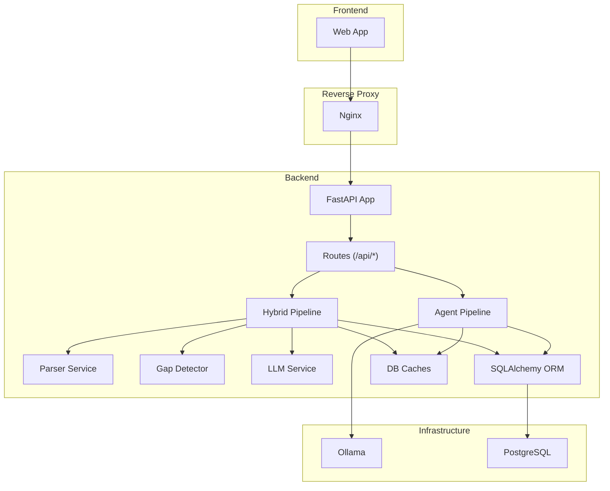
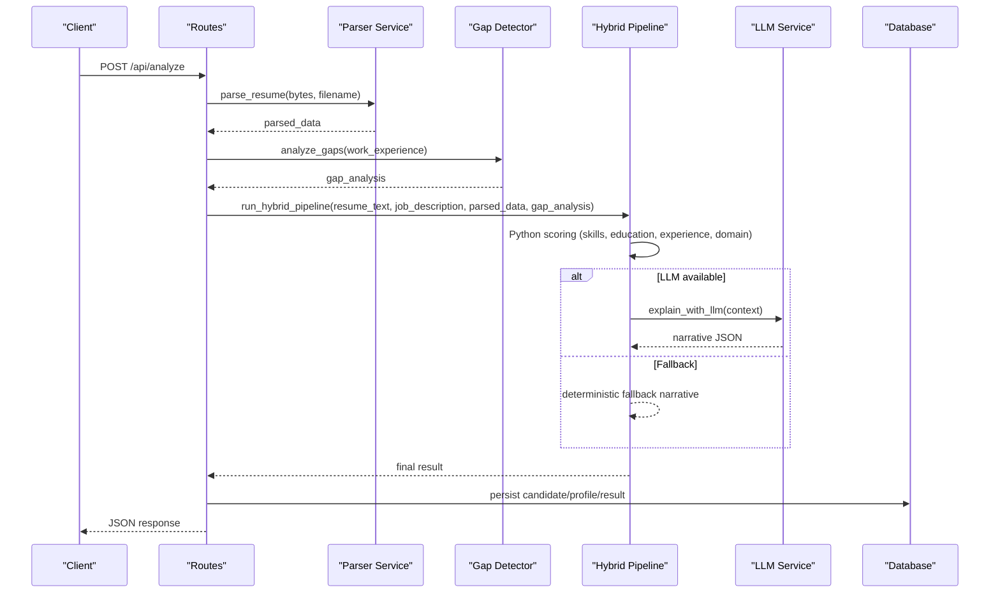
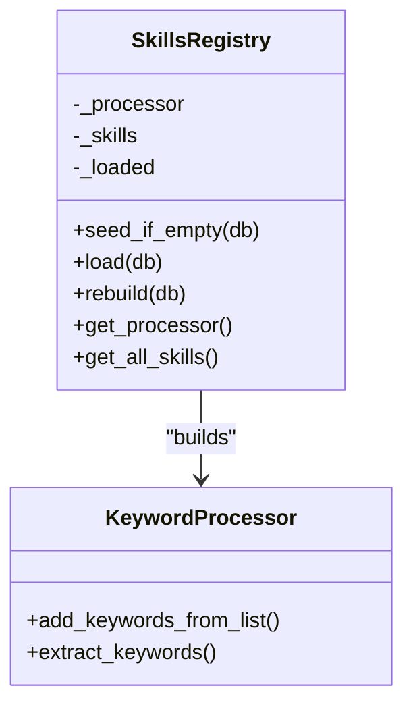
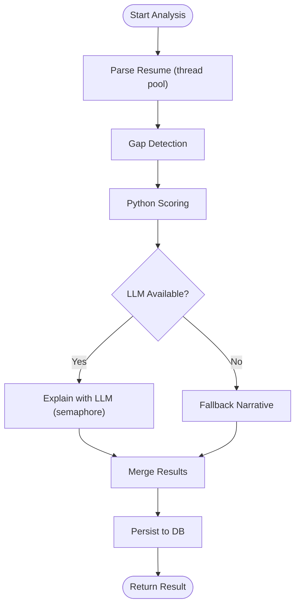
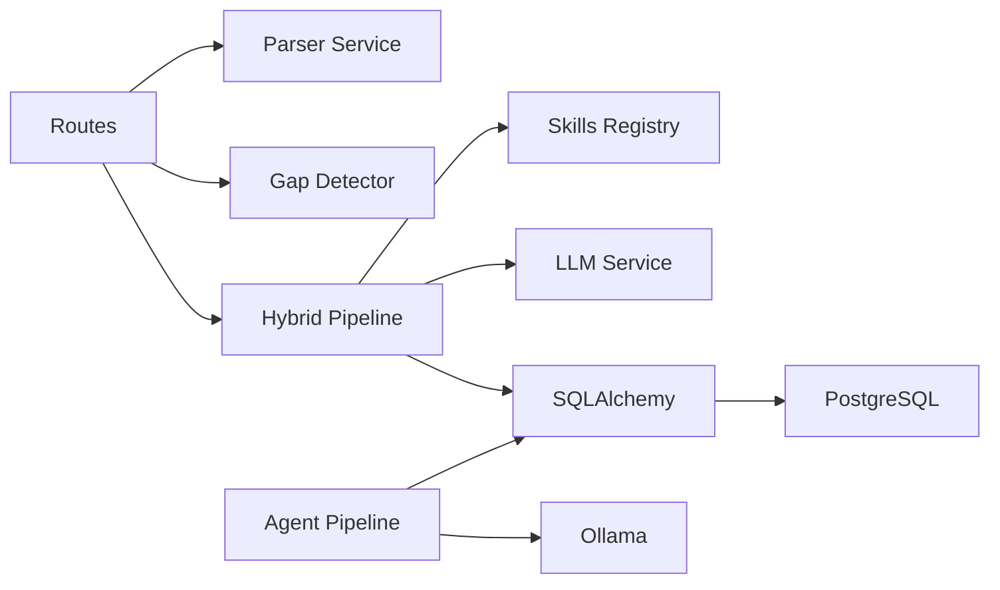

# Memory and CPU Optimization

<cite>
**Referenced Files in This Document**
- [parser_service.py](file://app/backend/services/parser_service.py)
- [hybrid_pipeline.py](file://app/backend/services/hybrid_pipeline.py)
- [agent_pipeline.py](file://app/backend/services/agent_pipeline.py)
- [gap_detector.py](file://app/backend/services/gap_detector.py)
- [llm_service.py](file://app/backend/services/llm_service.py)
- [analyze.py](file://app/backend/routes/analyze.py)
- [db_models.py](file://app/backend/models/db_models.py)
- [database.py](file://app/backend/db/database.py)
- [main.py](file://app/backend/main.py)
- [docker-compose.yml](file://docker-compose.yml)
- [docker-compose.prod.yml](file://docker-compose.prod.yml)
- [Dockerfile](file://app/backend/Dockerfile)
- [requirements.txt](file://requirements.txt)
</cite>

## Table of Contents
1. [Introduction](#introduction)
2. [Project Structure](#project-structure)
3. [Core Components](#core-components)
4. [Architecture Overview](#architecture-overview)
5. [Detailed Component Analysis](#detailed-component-analysis)
6. [Dependency Analysis](#dependency-analysis)
7. [Performance Considerations](#performance-considerations)
8. [Troubleshooting Guide](#troubleshooting-guide)
9. [Conclusion](#conclusion)
10. [Appendices](#appendices)

## Introduction
This document presents a comprehensive guide to memory and CPU optimization techniques in Resume AI. It focuses on large document processing, skills registry loading, concurrent analysis operations, and efficient LLM orchestration. It covers garbage collection tuning, memory leak prevention, resource cleanup, profiling strategies, and practical examples for skills matching, resume parsing memory reduction, and caching. It also addresses container resource limits, monitoring, and scaling across development and production environments.

## Project Structure
Resume AI is a FastAPI application with a modular backend, a skills registry, hybrid analysis pipelines, and streaming endpoints. The system integrates:
- Document parsing and text extraction
- Skills registry with in-memory keyword processing
- Gap detection and timeline scoring
- Deterministic Python scoring and optional LLM narrative
- Streaming and non-streaming analysis APIs
- Database-backed caches and candidate profiles
- Containerized deployment with resource limits

**Diagram sources**
- [analyze.py:1-813](file://app/backend/routes/analyze.py#L1-L813)
- [hybrid_pipeline.py:1-1498](file://app/backend/services/hybrid_pipeline.py#L1-L1498)
- [agent_pipeline.py:1-634](file://app/backend/services/agent_pipeline.py#L1-L634)
- [parser_service.py:1-552](file://app/backend/services/parser_service.py#L1-L552)
- [gap_detector.py:1-219](file://app/backend/services/gap_detector.py#L1-L219)
- [llm_service.py:1-156](file://app/backend/services/llm_service.py#L1-L156)
- [db_models.py:1-250](file://app/backend/models/db_models.py#L1-L250)
- [database.py:1-33](file://app/backend/db/database.py#L1-L33)

**Section sources**
- [analyze.py:1-813](file://app/backend/routes/analyze.py#L1-L813)
- [hybrid_pipeline.py:1-1498](file://app/backend/services/hybrid_pipeline.py#L1-L1498)
- [agent_pipeline.py:1-634](file://app/backend/services/agent_pipeline.py#L1-L634)
- [parser_service.py:1-552](file://app/backend/services/parser_service.py#L1-L552)
- [gap_detector.py:1-219](file://app/backend/services/gap_detector.py#L1-L219)
- [llm_service.py:1-156](file://app/backend/services/llm_service.py#L1-L156)
- [db_models.py:1-250](file://app/backend/models/db_models.py#L1-L250)
- [database.py:1-33](file://app/backend/db/database.py#L1-L33)

## Core Components
- Parser Service: Extracts text from PDF/DOCX/RTF/HTML/ODT/TXT with robust fallbacks and Unicode normalization. Implements memory-conscious streaming reads and early validation to prevent unnecessary processing.
- Hybrid Pipeline: Pure Python phase (skills matching, education, experience, domain/architecture scoring) followed by a single LLM call for narrative. Includes caching, semaphore-controlled concurrency, and fallbacks.
- Agent Pipeline: LangGraph multi-agent pipeline with parallel stages and in-memory caches for job descriptions and LLM singletons.
- Gap Detector: Deterministic date parsing, interval merging, and objective gap classification.
- LLM Service: Controlled LLM calls with timeouts, JSON parsing, and fallback responses.
- Routes: Streaming and non-streaming analysis endpoints with deduplication, snapshot caching, and usage enforcement.
- Database: SQLAlchemy models with caches and candidate snapshots; connection pooling and pre-ping enabled.

**Section sources**
- [parser_service.py:1-552](file://app/backend/services/parser_service.py#L1-L552)
- [hybrid_pipeline.py:1-1498](file://app/backend/services/hybrid_pipeline.py#L1-L1498)
- [agent_pipeline.py:1-634](file://app/backend/services/agent_pipeline.py#L1-L634)
- [gap_detector.py:1-219](file://app/backend/services/gap_detector.py#L1-L219)
- [llm_service.py:1-156](file://app/backend/services/llm_service.py#L1-L156)
- [analyze.py:1-813](file://app/backend/routes/analyze.py#L1-L813)
- [db_models.py:1-250](file://app/backend/models/db_models.py#L1-L250)
- [database.py:1-33](file://app/backend/db/database.py#L1-L33)

## Architecture Overview
The system separates CPU-intensive LLM workloads from deterministic Python processing. The hybrid pipeline executes Python scoring first, then optionally augments with a single LLM call. The agent pipeline uses LangGraph for multi-stage parallelism with in-memory caches and singletons to reduce overhead.

**Diagram sources**
- [analyze.py:268-318](file://app/backend/routes/analyze.py#L268-L318)
- [parser_service.py:547-552](file://app/backend/services/parser_service.py#L547-L552)
- [gap_detector.py:217-219](file://app/backend/services/gap_detector.py#L217-L219)
- [hybrid_pipeline.py:1353-1407](file://app/backend/services/hybrid_pipeline.py#L1353-L1407)
- [llm_service.py:139-156](file://app/backend/services/llm_service.py#L139-L156)
- [db_models.py:97-146](file://app/backend/models/db_models.py#L97-L146)

## Detailed Component Analysis

### Memory Management Strategies for Large Document Processing
- Streaming reads: The parser opens BytesIO streams and processes page-by-page for PDFs and DOCX, avoiding full in-memory copies where possible.
- Early validation: PDFs with insufficient text are rejected early to avoid downstream processing.
- Unicode normalization: Optional normalization reduces character variations but is guarded by feature flags.
- Text truncation: Resume and JD text are truncated for LLM prompts to bound memory usage.

Optimization tips:
- Prefer streaming parsers for large PDFs.
- Validate file readability before heavy processing.
- Limit prompt sizes for LLM calls.

**Section sources**
- [parser_service.py:152-187](file://app/backend/services/parser_service.py#L152-L187)
- [parser_service.py:355-371](file://app/backend/services/parser_service.py#L355-L371)
- [llm_service.py:68-82](file://app/backend/services/llm_service.py#L68-L82)

### Skills Registry Loading and Matching
- In-memory flashtext processor: Builds a KeywordProcessor from active skills and aliases, enabling fast substring matching.
- Hot-reload capability: Skills can be reloaded without restart.
- Fallback mechanisms: If DB is unavailable, falls back to a hardcoded master list.

Optimization tips:
- Keep the skills list pruned and normalized.
- Use alias expansion to minimize repeated checks.
- Monitor processor memory footprint and rebuild periodically if the list grows.

**Diagram sources**
- [hybrid_pipeline.py:323-426](file://app/backend/services/hybrid_pipeline.py#L323-L426)

**Section sources**
- [hybrid_pipeline.py:323-426](file://app/backend/services/hybrid_pipeline.py#L323-L426)
- [hybrid_pipeline.py:589-598](file://app/backend/services/hybrid_pipeline.py#L589-L598)

### Concurrent Analysis Operations and Parallel Processing
- Semaphore-controlled LLM calls: Limits concurrent LLM invocations to avoid resource exhaustion.
- Thread pool for blocking I/O: Parsing resumes off the event loop to prevent blocking.
- Streaming endpoints: Yield intermediate results to improve perceived latency.
- LangGraph pipeline: Parallel stages with in-memory caches and singletons to reuse connections.

Optimization tips:
- Tune semaphore counts based on available CPU and memory.
- Use thread pools for I/O-bound tasks.
- Stream partial results to users.

**Diagram sources**
- [analyze.py:268-318](file://app/backend/routes/analyze.py#L268-L318)
- [hybrid_pipeline.py:1353-1407](file://app/backend/services/hybrid_pipeline.py#L1353-L1407)
- [agent_pipeline.py:520-540](file://app/backend/services/agent_pipeline.py#L520-L540)

**Section sources**
- [analyze.py:268-318](file://app/backend/routes/analyze.py#L268-L318)
- [hybrid_pipeline.py:24-32](file://app/backend/services/hybrid_pipeline.py#L24-L32)
- [agent_pipeline.py:520-540](file://app/backend/services/agent_pipeline.py#L520-L540)

### CPU Optimization Through Efficient Algorithms and Vectorized Operations
- Deterministic Python scoring: Avoids repeated LLM calls by computing scores locally.
- Rapid fuzzy matching: Uses rapidfuzz with capped candidate sets to balance accuracy and speed.
- Regex-based extraction: Uses compiled patterns for skills and sections.
- Interval merging: Efficiently computes total experience by merging overlapping intervals.

Optimization tips:
- Use approximate algorithms where acceptable.
- Cache frequent computations (JD cache, skills registry).
- Minimize regex complexity and reuse compiled patterns.

**Section sources**
- [hybrid_pipeline.py:676-750](file://app/backend/services/hybrid_pipeline.py#L676-L750)
- [hybrid_pipeline.py:833-894](file://app/backend/services/hybrid_pipeline.py#L833-L894)
- [gap_detector.py:83-98](file://app/backend/services/gap_detector.py#L83-L98)

### Garbage Collection Tuning, Leak Prevention, and Resource Cleanup
- Singleton LLM clients: Reuse ChatOllama instances to avoid connection overhead and reduce GC churn.
- In-memory caches: MD5-based JD cache and job-specific caches to avoid recomputation.
- Thread-local cleanup: Parsing runs in separate threads to keep the event loop responsive.
- Database sessions: Properly closed after each request; connection pooling configured.

Optimization tips:
- Avoid creating new LLM clients per request.
- Clear large intermediate lists promptly.
- Use weak references for caches when appropriate.

**Section sources**
- [agent_pipeline.py:61-100](file://app/backend/services/agent_pipeline.py#L61-L100)
- [agent_pipeline.py:167-177](file://app/backend/services/agent_pipeline.py#L167-L177)
- [database.py:27-33](file://app/backend/db/database.py#L27-L33)

### Profiling Techniques for Memory and CPU Bottlenecks
- Structured logging: Routes log timing and metrics for each analysis.
- Health checks: Expose DB and LLM connectivity status.
- Container metrics: Use Docker Compose resource limits to observe CPU/memory saturation.
- Endpoint-level timing: Track parsing, scoring, and LLM phases.

Recommended steps:
- Add memory profiling around parsing and skills extraction.
- Profile LLM call durations and cache hit rates.
- Monitor DB query times and connection pool saturation.

**Section sources**
- [analyze.py:489-500](file://app/backend/routes/analyze.py#L489-L500)
- [main.py:228-259](file://app/backend/main.py#L228-L259)
- [docker-compose.prod.yml:28-112](file://docker-compose.prod.yml#L28-L112)

### Optimizing Skills Matching Algorithms
- Use flashtext for fast substring matching.
- Expand skill variants (aliases) to increase recall.
- Apply fuzzy matching only on a capped subset for performance.
- Deduplicate results while preserving order.

Practical example paths:
- Skills registry loader and processor: [hybrid_pipeline.py:323-426](file://app/backend/services/hybrid_pipeline.py#L323-L426)
- Skills matching engine: [hybrid_pipeline.py:676-750](file://app/backend/services/hybrid_pipeline.py#L676-L750)

**Section sources**
- [hybrid_pipeline.py:323-426](file://app/backend/services/hybrid_pipeline.py#L323-L426)
- [hybrid_pipeline.py:676-750](file://app/backend/services/hybrid_pipeline.py#L676-L750)

### Reducing Memory Footprint During Resume Parsing
- Early rejection of scanned PDFs to avoid empty text processing.
- Truncate resume text for LLM prompts.
- Use streaming PDF/DOCX readers.

Practical example paths:
- PDF text extraction and validation: [parser_service.py:152-187](file://app/backend/services/parser_service.py#L152-L187)
- Text truncation for prompts: [llm_service.py:68-82](file://app/backend/services/llm_service.py#L68-L82)

**Section sources**
- [parser_service.py:152-187](file://app/backend/services/parser_service.py#L152-L187)
- [llm_service.py:68-82](file://app/backend/services/llm_service.py#L68-L82)

### Efficient Caching Strategies
- JD cache: MD5-based cache stored in DB for reuse across workers.
- Parser snapshot cache: Full parser output serialized and truncated to bound row size.
- In-memory job description cache in agent pipeline.
- Skills registry cache: In-memory flashtext processor with hot reload.

Practical example paths:
- JD cache helper: [analyze.py:49-67](file://app/backend/routes/analyze.py#L49-L67)
- Parser snapshot serialization: [analyze.py:109-116](file://app/backend/routes/analyze.py#L109-L116)
- Agent pipeline JD cache: [agent_pipeline.py:64-67](file://app/backend/services/agent_pipeline.py#L64-L67)
- Skills registry cache: [hybrid_pipeline.py:381-406](file://app/backend/services/hybrid_pipeline.py#L381-L406)

**Section sources**
- [analyze.py:49-67](file://app/backend/routes/analyze.py#L49-L67)
- [analyze.py:109-116](file://app/backend/routes/analyze.py#L109-L116)
- [agent_pipeline.py:64-67](file://app/backend/services/agent_pipeline.py#L64-L67)
- [hybrid_pipeline.py:381-406](file://app/backend/services/hybrid_pipeline.py#L381-L406)

### Container Resource Limits, Monitoring, and Scaling
- Development: Ollama NUM_PARALLEL and KV cache tuning; backend single worker.
- Production: CPU and memory limits per service; multiple backend workers; warmup container; health checks.

Scaling recommendations:
- Increase backend workers for I/O-bound load.
- Tune Ollama NUM_PARALLEL and MAX_LOADED_MODELS for GPU/CPU capacity.
- Use warmup container to eliminate cold-start latency.

**Section sources**
- [docker-compose.yml:24-75](file://docker-compose.yml#L24-L75)
- [docker-compose.prod.yml:28-112](file://docker-compose.prod.yml#L28-L112)
- [docker-compose.prod.yml:151-184](file://docker-compose.prod.yml#L151-L184)
- [main.py:152-171](file://app/backend/main.py#L152-L171)

## Dependency Analysis
The system exhibits layered dependencies:
- Routes depend on parser, gap detector, and hybrid pipeline.
- Hybrid pipeline depends on skills registry, gap detector, and LLM service.
- Agent pipeline depends on LangGraph and Ollama.
- All services depend on SQLAlchemy for persistence and caching.

**Diagram sources**
- [analyze.py:32-39](file://app/backend/routes/analyze.py#L32-L39)
- [hybrid_pipeline.py:1-1498](file://app/backend/services/hybrid_pipeline.py#L1-L1498)
- [agent_pipeline.py:1-634](file://app/backend/services/agent_pipeline.py#L1-L634)
- [database.py:1-33](file://app/backend/db/database.py#L1-L33)
- [db_models.py:1-250](file://app/backend/models/db_models.py#L1-L250)

**Section sources**
- [analyze.py:32-39](file://app/backend/routes/analyze.py#L32-L39)
- [hybrid_pipeline.py:1-1498](file://app/backend/services/hybrid_pipeline.py#L1-L1498)
- [agent_pipeline.py:1-634](file://app/backend/services/agent_pipeline.py#L1-L634)
- [database.py:1-33](file://app/backend/db/database.py#L1-L33)
- [db_models.py:1-250](file://app/backend/models/db_models.py#L1-L250)

## Performance Considerations
- Reduce LLM calls: Execute Python scoring first; use a single LLM call for narrative.
- Control concurrency: Use semaphores and thread pools to prevent resource contention.
- Cache aggressively: DB and in-memory caches for JDs, skills, and parsed snapshots.
- Optimize parsing: Stream large documents, validate early, and truncate for prompts.
- Monitor and tune: Use health checks, logs, and container limits to detect bottlenecks.

[No sources needed since this section provides general guidance]

## Troubleshooting Guide
Common issues and remedies:
- LLM unresponsive: Check Ollama reachability and model warm status; adjust timeouts and parallelism.
- Memory spikes: Verify cache sizes, disable unnecessary caches, and monitor container limits.
- Slow parsing: Ensure PDF/DOCX readers are installed; validate file formats; avoid scanned PDFs.
- DB connectivity: Confirm connection strings and pool settings; enable pre-ping.

**Section sources**
- [main.py:68-149](file://app/backend/main.py#L68-L149)
- [main.py:228-259](file://app/backend/main.py#L228-L259)
- [main.py:262-326](file://app/backend/main.py#L262-L326)
- [database.py:18-24](file://app/backend/db/database.py#L18-L24)

## Conclusion
Resume AI achieves strong performance by separating CPU-heavy LLM work from efficient Python scoring, leveraging caching, and controlling concurrency. By applying the techniques outlined here—streaming parsing, deterministic scoring, alias expansion, interval merging, and containerized resource limits—you can further optimize memory and CPU usage across development and production deployments.

[No sources needed since this section summarizes without analyzing specific files]

## Appendices

### Appendix A: Key Environment Variables and Their Impact
- OLLAMA_BASE_URL: LLM endpoint URL.
- OLLAMA_MODEL / OLLAMA_FAST_MODEL: Model selection affecting memory and latency.
- LLM_NARRATIVE_TIMEOUT: Controls LLM call timeout.
- OLLAMA_NUM_PARALLEL: Concurrency for LLM requests.
- OLLAMA_MAX_LOADED_MODELS: Number of models kept in RAM.
- DATABASE_URL: Database connection string; affects I/O performance.

**Section sources**
- [docker-compose.yml:59-69](file://docker-compose.yml#L59-L69)
- [docker-compose.prod.yml:44-95](file://docker-compose.prod.yml#L44-L95)
- [main.py:104-143](file://app/backend/main.py#L104-L143)

### Appendix B: Deployment Configuration Highlights
- Development: Single worker backend, warm LLM models, health checks.
- Production: Multiple backend workers, resource limits, warmup container, optimized Ollama settings.

**Section sources**
- [docker-compose.yml:52-101](file://docker-compose.yml#L52-L101)
- [docker-compose.prod.yml:75-112](file://docker-compose.prod.yml#L75-L112)
- [docker-compose.prod.yml:151-184](file://docker-compose.prod.yml#L151-L184)