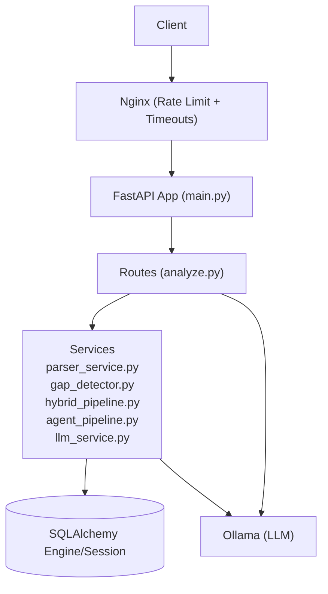
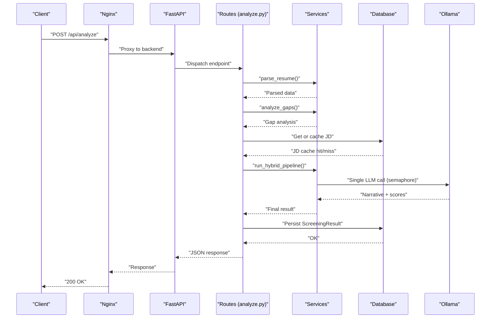
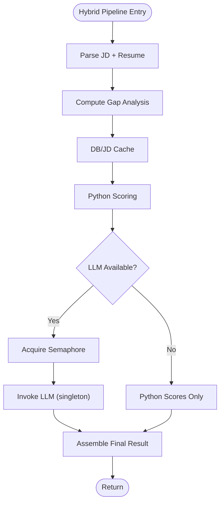
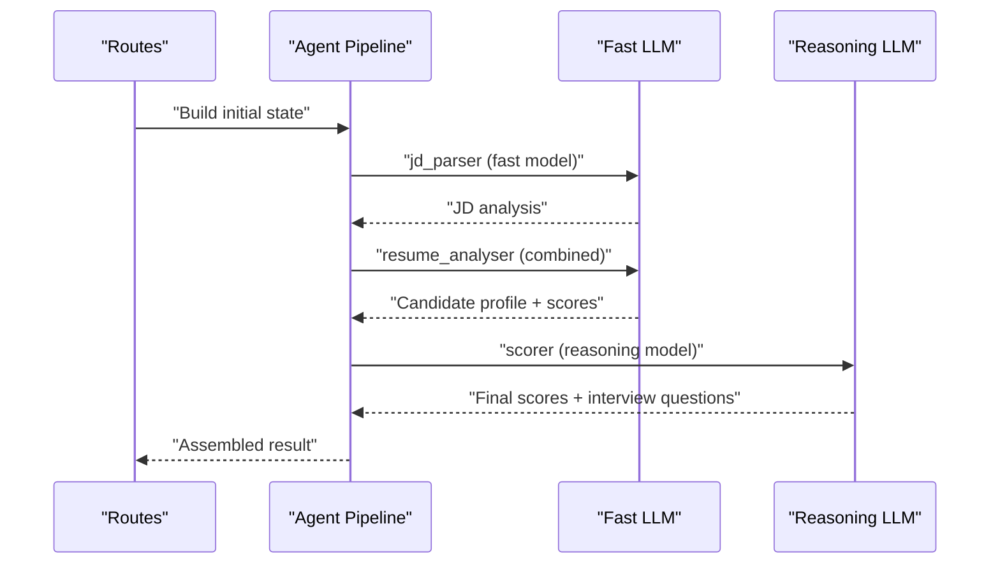
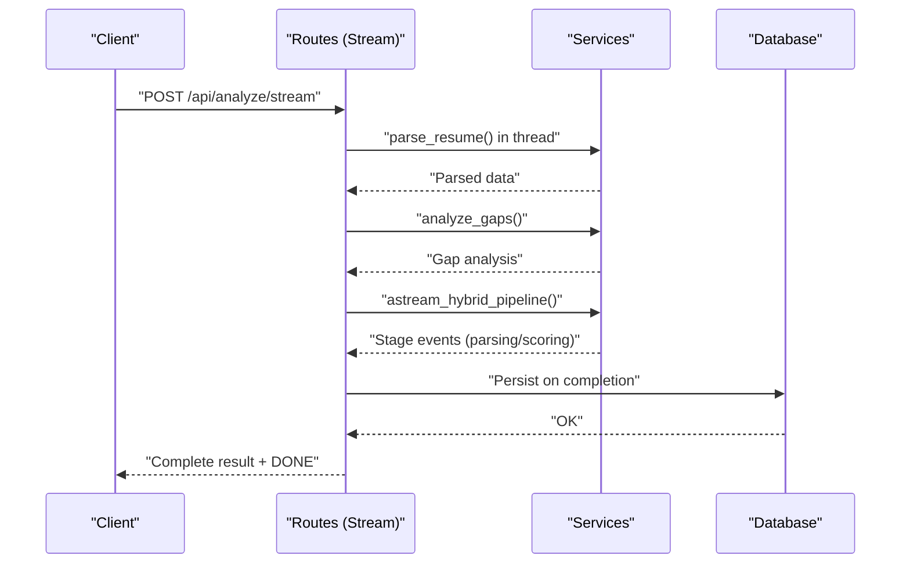
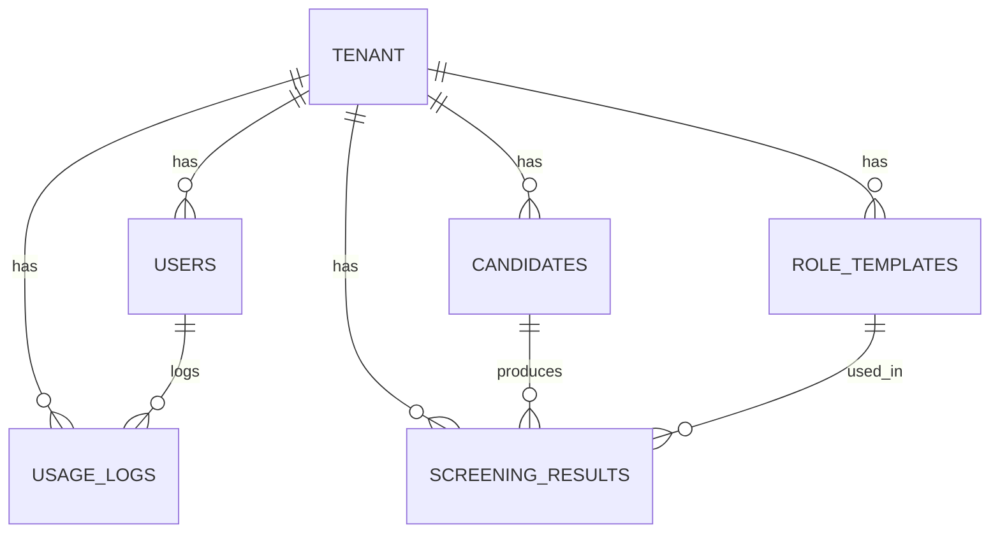
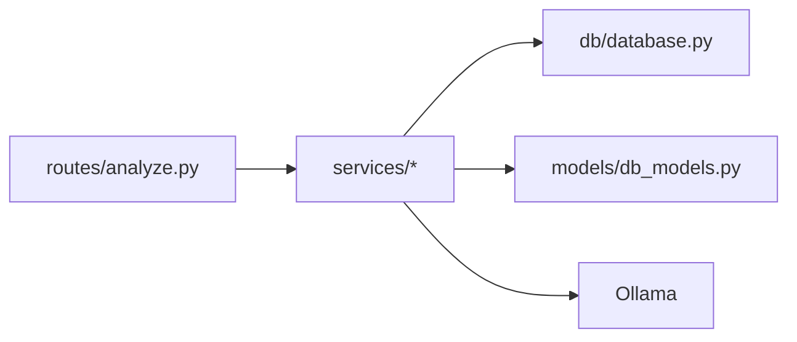

# Performance Optimization

<cite>
**Referenced Files in This Document**
- [main.py](file://app/backend/main.py)
- [analyze.py](file://app/backend/routes/analyze.py)
- [hybrid_pipeline.py](file://app/backend/services/hybrid_pipeline.py)
- [agent_pipeline.py](file://app/backend/services/agent_pipeline.py)
- [llm_service.py](file://app/backend/services/llm_service.py)
- [gap_detector.py](file://app/backend/services/gap_detector.py)
- [parser_service.py](file://app/backend/services/parser_service.py)
- [database.py](file://app/backend/db/database.py)
- [db_models.py](file://app/backend/models/db_models.py)
- [schemas.py](file://app/backend/models/schemas.py)
- [nginx.prod.conf](file://app/nginx/nginx.prod.conf)
- [AUDIT.md](file://docs/AUDIT.md)
</cite>

## Table of Contents
1. [Introduction](#introduction)
2. [Project Structure](#project-structure)
3. [Core Components](#core-components)
4. [Architecture Overview](#architecture-overview)
5. [Detailed Component Analysis](#detailed-component-analysis)
6. [Dependency Analysis](#dependency-analysis)
7. [Performance Considerations](#performance-considerations)
8. [Troubleshooting Guide](#troubleshooting-guide)
9. [Conclusion](#conclusion)
10. [Appendices](#appendices)

## Introduction
This document presents a comprehensive performance optimization strategy for Resume AI (ARIA). It focuses on the hybrid analysis pipeline, concurrency control, LLM call optimization, memory management, database tuning, caching, AI model optimization, monitoring and profiling, and scaling. The guidance is grounded in the repository’s code and documented issues, with practical recommendations for high-volume deployments.

## Project Structure
The backend is a FastAPI application orchestrating resume and job description processing, candidate deduplication, and analysis pipelines. Key layers:
- Routes: HTTP endpoints for single and batch analysis, streaming SSE, history, and status updates.
- Services: Parsing, gap detection, hybrid and agent pipelines, LLM orchestration, and auxiliary utilities.
- Database: SQLAlchemy ORM models and session management.
- Infrastructure: Nginx rate limiting and timeouts for streaming and non-streaming endpoints.

**Diagram sources**
- [main.py:174-260](file://app/backend/main.py#L174-L260)
- [analyze.py:354-501](file://app/backend/routes/analyze.py#L354-L501)
- [hybrid_pipeline.py:24-66](file://app/backend/services/hybrid_pipeline.py#L24-L66)
- [agent_pipeline.py:520-540](file://app/backend/services/agent_pipeline.py#L520-L540)
- [llm_service.py:7-156](file://app/backend/services/llm_service.py#L7-L156)
- [database.py:1-33](file://app/backend/db/database.py#L1-L33)

**Section sources**
- [main.py:174-260](file://app/backend/main.py#L174-L260)
- [analyze.py:354-501](file://app/backend/routes/analyze.py#L354-L501)
- [database.py:1-33](file://app/backend/db/database.py#L1-L33)

## Core Components
- Hybrid pipeline: Python-first scoring with a single LLM call for narrative, with a semaphore to cap concurrent LLM calls and model tuning for reduced KV cache and context window.
- Agent pipeline: LangGraph-based multi-agent pipeline with LLM singletons, in-memory JD cache, and structured prompts to minimize repeated work.
- Parser and gap detection: Robust resume parsing and gap analysis with fallbacks and date normalization.
- Database layer: Engine/session creation with connection pooling and pre-ping; models for caching and registry.
- Streaming and batch: SSE streaming for real-time feedback and batch processing with concurrency control.

**Section sources**
- [hybrid_pipeline.py:24-66](file://app/backend/services/hybrid_pipeline.py#L24-L66)
- [agent_pipeline.py:61-100](file://app/backend/services/agent_pipeline.py#L61-L100)
- [parser_service.py:130-202](file://app/backend/services/parser_service.py#L130-L202)
- [gap_detector.py:103-219](file://app/backend/services/gap_detector.py#L103-L219)
- [database.py:1-33](file://app/backend/db/database.py#L1-L33)
- [analyze.py:506-646](file://app/backend/routes/analyze.py#L506-L646)

## Architecture Overview
The hybrid pipeline emphasizes minimizing LLM calls while leveraging Python-based scoring and caching. The agent pipeline further consolidates calls and caches intermediate results. Database caching and registry reduce repeated work. Nginx enforces rate limits and streaming-specific buffering behavior.

**Diagram sources**
- [analyze.py:268-318](file://app/backend/routes/analyze.py#L268-L318)
- [hybrid_pipeline.py:24-66](file://app/backend/services/hybrid_pipeline.py#L24-L66)
- [database.py:1-33](file://app/backend/db/database.py#L1-L33)

## Detailed Component Analysis

### Hybrid Pipeline Concurrency Control and LLM Optimization
- Semaphore-based concurrency: A module-level semaphore caps concurrent LLM calls to prevent resource exhaustion and improve throughput predictability.
- LLM singleton and model tuning: Reuse ChatOllama instances and configure context window and output length to reduce KV cache overhead and generation time.
- Fallback behavior: If LLM is unavailable, the pipeline returns deterministic Python-only results.

**Diagram sources**
- [hybrid_pipeline.py:24-66](file://app/backend/services/hybrid_pipeline.py#L24-L66)
- [analyze.py:268-318](file://app/backend/routes/analyze.py#L268-L318)

**Section sources**
- [hybrid_pipeline.py:24-66](file://app/backend/services/hybrid_pipeline.py#L24-L66)
- [analyze.py:268-318](file://app/backend/routes/analyze.py#L268-L318)

### Agent Pipeline Optimization (LangGraph)
- LLM singletons: Fast and reasoning LLM singletons avoid connection overhead and enable keep-alive reuse.
- In-memory JD cache: MD5-based cache avoids repeated LLM parsing for identical JDs in batch scenarios.
- Consolidated prompts: Combined nodes reduce total LLM calls and leverage structured outputs with fallbacks.

**Diagram sources**
- [agent_pipeline.py:520-540](file://app/backend/services/agent_pipeline.py#L520-L540)
- [agent_pipeline.py:160-180](file://app/backend/services/agent_pipeline.py#L160-L180)
- [agent_pipeline.py:280-321](file://app/backend/services/agent_pipeline.py#L280-L321)
- [agent_pipeline.py:367-448](file://app/backend/services/agent_pipeline.py#L367-L448)

**Section sources**
- [agent_pipeline.py:61-100](file://app/backend/services/agent_pipeline.py#L61-L100)
- [agent_pipeline.py:160-180](file://app/backend/services/agent_pipeline.py#L160-L180)
- [agent_pipeline.py:280-321](file://app/backend/services/agent_pipeline.py#L280-L321)
- [agent_pipeline.py:367-448](file://app/backend/services/agent_pipeline.py#L367-L448)

### Streaming and Batch Processing
- SSE streaming: Emits structured stages for parsing, scoring, and completion, enabling responsive UI updates.
- Batch processing: Validates file counts against plan limits, pre-caches JD, and processes files concurrently with chunking or semaphores to avoid memory spikes.

**Diagram sources**
- [analyze.py:506-646](file://app/backend/routes/analyze.py#L506-L646)
- [analyze.py:651-758](file://app/backend/routes/analyze.py#L651-L758)

**Section sources**
- [analyze.py:506-646](file://app/backend/routes/analyze.py#L506-L646)
- [analyze.py:651-758](file://app/backend/routes/analyze.py#L651-L758)

### Database Performance Tuning and Caching
- Engine/session configuration: SQLite normalization and PostgreSQL URL normalization; pre-ping enabled for robust connections.
- Caching models: JD cache shared across workers; skills registry cached in-memory with hot reload support.
- Schema and indexes: Candidate profile snapshot JSON, indexed resume hash, and dedicated cache tables.

**Diagram sources**
- [db_models.py:97-147](file://app/backend/models/db_models.py#L97-L147)
- [db_models.py:229-236](file://app/backend/models/db_models.py#L229-L236)
- [db_models.py:238-250](file://app/backend/models/db_models.py#L238-L250)

**Section sources**
- [database.py:1-33](file://app/backend/db/database.py#L1-L33)
- [db_models.py:229-236](file://app/backend/models/db_models.py#L229-L236)
- [db_models.py:238-250](file://app/backend/models/db_models.py#L238-L250)

### AI Model Optimization Techniques
- Prompt engineering: Structured JSON prompts with explicit schemas and constraints; fallbacks for missing or invalid outputs.
- Context window management: Carefully bounded prompt sizes and context windows to reduce KV cache growth and latency.
- Inference acceleration: Model singletons, keep-alive sessions, and reduced num_predict to limit output and speed up attention computations.

**Section sources**
- [agent_pipeline.py:143-158](file://app/backend/services/agent_pipeline.py#L143-L158)
- [agent_pipeline.py:186-224](file://app/backend/services/agent_pipeline.py#L186-L224)
- [agent_pipeline.py:327-364](file://app/backend/services/agent_pipeline.py#L327-L364)
- [llm_service.py:59-82](file://app/backend/services/llm_service.py#L59-L82)

## Dependency Analysis
- Routes depend on services for parsing, gap detection, and pipeline execution; they also manage usage enforcement and persistence.
- Services depend on database for caching and registry, and on Ollama for LLM inference.
- Database models define caching and registry tables; sessions are scoped per request.

**Diagram sources**
- [analyze.py:34-38](file://app/backend/routes/analyze.py#L34-L38)
- [database.py:1-33](file://app/backend/db/database.py#L1-L33)
- [db_models.py:229-236](file://app/backend/models/db_models.py#L229-L236)

**Section sources**
- [analyze.py:34-38](file://app/backend/routes/analyze.py#L34-L38)
- [database.py:1-33](file://app/backend/db/database.py#L1-L33)
- [db_models.py:229-236](file://app/backend/models/db_models.py#L229-L236)

## Performance Considerations
- Concurrency control
  - Use a semaphore to cap concurrent LLM calls in the hybrid pipeline to prevent resource saturation and stabilize latency.
  - Apply a similar semaphore for batch processing to avoid overwhelming downstream systems.
- LLM call optimization
  - Keep LLM singletons alive to reuse HTTP keep-alive sessions.
  - Tune context window and output length to reduce KV cache and generation time.
  - Add timeouts around LLM calls to fail fast under degraded conditions.
- Memory management
  - Cap serialized snapshots and limit resume text sizes to bound memory usage.
  - Use streaming responses for long-running tasks to avoid buffering large payloads.
- Database tuning
  - Enable pre-ping for robust connections; consider connection pooling parameters appropriate for workload.
  - Index frequently queried fields (e.g., resume hash, email) to accelerate deduplication and lookups.
- Caching
  - Leverage DB-based JD cache and in-memory skills registry to avoid repeated parsing and model calls.
  - Implement rate limiting and timeouts at the edge (Nginx) to protect backend resources.
- Monitoring and profiling
  - Log structured timing and quality metrics per analysis for observability.
  - Profile hotspots using sampling profilers and measure latency distributions for endpoints.

[No sources needed since this section provides general guidance]

## Troubleshooting Guide
- LLM unavailability or slow responses
  - Verify Ollama reachability and model readiness; ensure models are pulled and hot in RAM.
  - Add timeouts around LLM calls and implement fallbacks to maintain service continuity.
- Batch processing instability
  - Apply chunking or a semaphore to limit concurrent tasks and prevent out-of-memory errors.
  - Validate batch size against subscription plan limits.
- Streaming issues
  - Ensure Nginx disables proxy buffering for SSE endpoints to flush events promptly.
- Database contention
  - Confirm pre-ping is enabled and consider connection limits; monitor for long-running transactions.

**Section sources**
- [main.py:262-326](file://app/backend/main.py#L262-L326)
- [AUDIT.md:333-347](file://docs/AUDIT.md#L333-L347)
- [AUDIT.md:350-357](file://docs/AUDIT.md#L350-L357)
- [nginx.prod.conf:66-75](file://app/nginx/nginx.prod.conf#L66-L75)

## Conclusion
By combining semaphore-based concurrency control, LLM singletons with tuned context windows, robust caching strategies, and careful database and streaming configurations, Resume AI can achieve predictable performance at scale. Structured logging, rate limiting, and usage enforcement ensure operational stability, while fallbacks and timeouts maintain resilience under degraded conditions.

[No sources needed since this section summarizes without analyzing specific files]

## Appendices

### Appendix A: Endpoint and Schema Highlights
- Analysis endpoints: Single, streaming, and batch modes with structured responses and usage enforcement.
- Data models: Screening results, candidates, JD cache, and usage logs support caching and auditability.

**Section sources**
- [analyze.py:354-501](file://app/backend/routes/analyze.py#L354-L501)
- [analyze.py:506-646](file://app/backend/routes/analyze.py#L506-L646)
- [analyze.py:651-758](file://app/backend/routes/analyze.py#L651-L758)
- [schemas.py:89-125](file://app/backend/models/schemas.py#L89-L125)
- [db_models.py:128-147](file://app/backend/models/db_models.py#L128-L147)
- [db_models.py:229-236](file://app/backend/models/db_models.py#L229-L236)