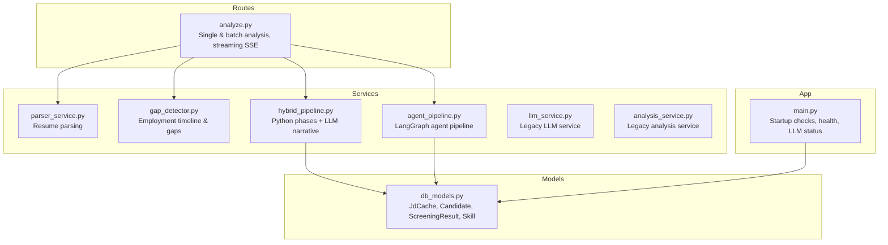
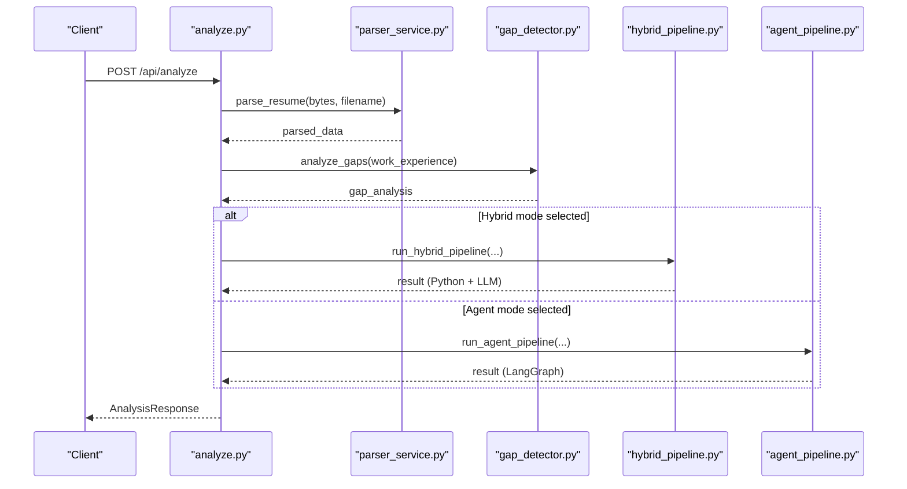
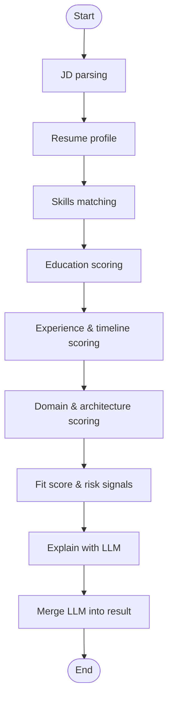
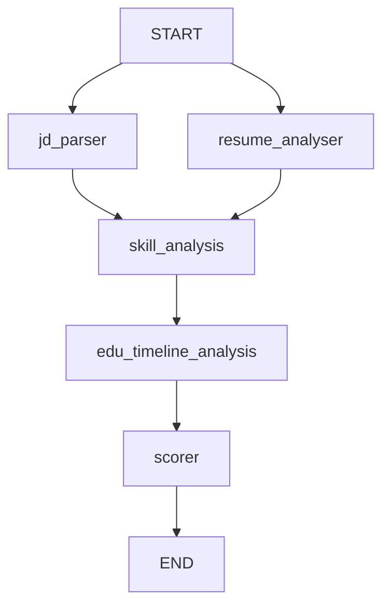
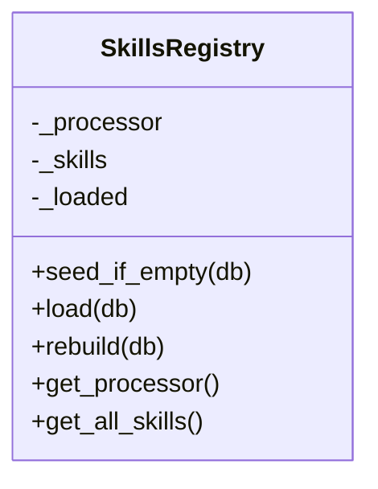
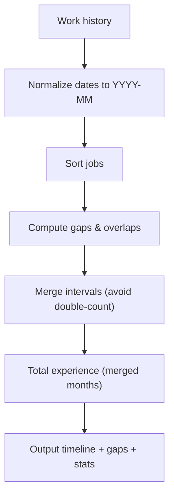
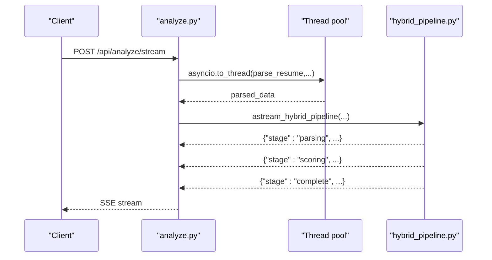
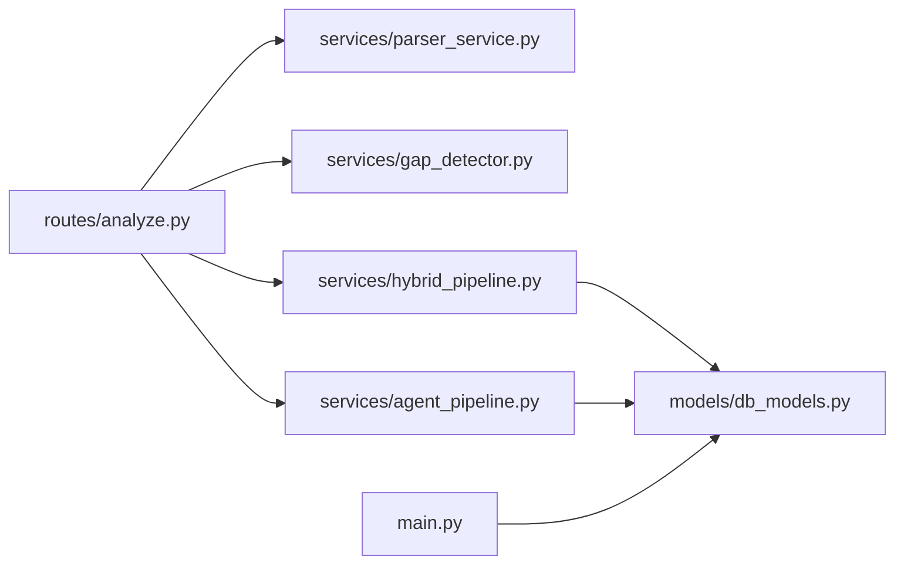

# Pipeline Optimization

<cite>
**Referenced Files in This Document**
- [hybrid_pipeline.py](file://app/backend/services/hybrid_pipeline.py)
- [agent_pipeline.py](file://app/backend/services/agent_pipeline.py)
- [analyze.py](file://app/backend/routes/analyze.py)
- [parser_service.py](file://app/backend/services/parser_service.py)
- [gap_detector.py](file://app/backend/services/gap_detector.py)
- [db_models.py](file://app/backend/models/db_models.py)
- [main.py](file://app/backend/main.py)
- [llm_service.py](file://app/backend/services/llm_service.py)
- [analysis_service.py](file://app/backend/services/analysis_service.py)
</cite>

## Table of Contents
1. [Introduction](#introduction)
2. [Project Structure](#project-structure)
3. [Core Components](#core-components)
4. [Architecture Overview](#architecture-overview)
5. [Detailed Component Analysis](#detailed-component-analysis)
6. [Dependency Analysis](#dependency-analysis)
7. [Performance Considerations](#performance-considerations)
8. [Troubleshooting Guide](#troubleshooting-guide)
9. [Conclusion](#conclusion)
10. [Appendices](#appendices)

## Introduction
This document presents a comprehensive guide to pipeline optimization strategies in Resume AI. It focuses on:
- Hybrid analysis pipeline architecture: Python-first deterministic phases followed by a single LLM call for narrative.
- Concurrency control for LLM calls using semaphores.
- Memory management for LLM models and in-memory skills registries.
- Agent pipeline optimization with LangGraph: graph traversal efficiency, state management, and parallel processing patterns.
- Performance tuning for skills registry loading, fuzzy matching, and context window management.
- Batch processing, thread pool management, and resource pooling strategies.
- Monitoring, bottleneck identification, and scaling considerations for high-throughput analysis.

## Project Structure
The pipeline spans route handlers, services, and models:
- Routes orchestrate parsing, gap detection, and pipeline execution.
- Services encapsulate parsing, gap detection, hybrid and agent pipelines, and LLM integration.
- Models define persistence for caching and candidate profiling.

**Diagram sources**
- [analyze.py:1-813](file://app/backend/routes/analyze.py#L1-L813)
- [parser_service.py:1-552](file://app/backend/services/parser_service.py#L1-L552)
- [gap_detector.py:1-219](file://app/backend/services/gap_detector.py#L1-L219)
- [hybrid_pipeline.py:1-1498](file://app/backend/services/hybrid_pipeline.py#L1-L1498)
- [agent_pipeline.py:1-634](file://app/backend/services/agent_pipeline.py#L1-L634)
- [llm_service.py:1-156](file://app/backend/services/llm_service.py#L1-L156)
- [analysis_service.py:1-121](file://app/backend/services/analysis_service.py#L1-L121)
- [db_models.py:1-250](file://app/backend/models/db_models.py#L1-L250)
- [main.py:1-327](file://app/backend/main.py#L1-L327)

**Section sources**
- [analyze.py:1-813](file://app/backend/routes/analyze.py#L1-L813)
- [parser_service.py:1-552](file://app/backend/services/parser_service.py#L1-L552)
- [gap_detector.py:1-219](file://app/backend/services/gap_detector.py#L1-L219)
- [hybrid_pipeline.py:1-1498](file://app/backend/services/hybrid_pipeline.py#L1-L1498)
- [agent_pipeline.py:1-634](file://app/backend/services/agent_pipeline.py#L1-L634)
- [llm_service.py:1-156](file://app/backend/services/llm_service.py#L1-L156)
- [analysis_service.py:1-121](file://app/backend/services/analysis_service.py#L1-L121)
- [db_models.py:1-250](file://app/backend/models/db_models.py#L1-L250)
- [main.py:1-327](file://app/backend/main.py#L1-L327)

## Core Components
- Hybrid pipeline: Python rules engine for parsing, skills matching, education, experience, domain/architecture scoring; single LLM call for narrative.
- Agent pipeline (LangGraph): multi-stage, parallel within stages, with stateful nodes and JSON-parsed outputs.
- Skills registry: DB-backed, in-memory flashtext processor with hot-reload support.
- Gap detector: mechanical date math for timeline, gaps, overlaps, and total experience.
- Route orchestration: single, streaming SSE, and batch endpoints with usage enforcement and deduplication.

**Section sources**
- [hybrid_pipeline.py:1-1498](file://app/backend/services/hybrid_pipeline.py#L1-L1498)
- [agent_pipeline.py:1-634](file://app/backend/services/agent_pipeline.py#L1-L634)
- [parser_service.py:1-552](file://app/backend/services/parser_service.py#L1-L552)
- [gap_detector.py:1-219](file://app/backend/services/gap_detector.py#L1-L219)
- [analyze.py:1-813](file://app/backend/routes/analyze.py#L1-L813)

## Architecture Overview
Two primary pipeline modes coexist:
- Hybrid pipeline: deterministic Python phases + single LLM narrative.
- Agent pipeline (LangGraph): stateful graph with parallelizable stages and JSON-parsed outputs.

**Diagram sources**
- [analyze.py:268-318](file://app/backend/routes/analyze.py#L268-L318)
- [parser_service.py:547-552](file://app/backend/services/parser_service.py#L547-L552)
- [gap_detector.py:217-219](file://app/backend/services/gap_detector.py#L217-L219)
- [hybrid_pipeline.py:1353-1407](file://app/backend/services/hybrid_pipeline.py#L1353-L1407)
- [agent_pipeline.py:623-634](file://app/backend/services/agent_pipeline.py#L623-L634)

## Detailed Component Analysis

### Hybrid Pipeline: Python-first + LLM Narrative
- Phases:
  - JD parsing, resume profile building, skills matching, education scoring, experience/timeline scoring, domain/architecture scoring, fit score and risk signals.
  - Single LLM call generates strengths, weaknesses, rationale, interview questions.
- Concurrency control:
  - Global semaphore limits concurrent LLM calls per worker.
- Memory management:
  - LLM singleton reuse; constrained num_ctx and num_predict; keep_alive for hot model.
- Streaming:
  - SSE emits parsing scores, LLM narrative, and final merged result.

**Diagram sources**
- [hybrid_pipeline.py:1262-1333](file://app/backend/services/hybrid_pipeline.py#L1262-L1333)
- [hybrid_pipeline.py:1353-1407](file://app/backend/services/hybrid_pipeline.py#L1353-L1407)

**Section sources**
- [hybrid_pipeline.py:1-1498](file://app/backend/services/hybrid_pipeline.py#L1-L1498)
- [analyze.py:268-318](file://app/backend/routes/analyze.py#L268-L318)

### Agent Pipeline (LangGraph): Graph Traversal Efficiency and Parallelism
- Graph stages:
  - Stage 1: jd_parser + resume_analyser (parallel).
  - Stage 2: skill_analysis + edu_timeline_analysis (parallel).
  - Stage 3: scorer (sequential).
- State management:
  - Typed state with annotated error accumulation.
- Parallel processing:
  - Within each stage, nodes run concurrently; cross-stage edges enforce ordering.
- JSON parsing and fallback:
  - Robust parsing helpers and pure-math fallback for scoring.

**Diagram sources**
- [agent_pipeline.py:522-540](file://app/backend/services/agent_pipeline.py#L522-L540)

**Section sources**
- [agent_pipeline.py:1-634](file://app/backend/services/agent_pipeline.py#L1-L634)

### Skills Registry: Loading, Aliasing, and Hot Reload
- DB-backed registry seeded from a master list; supports aliases and domains.
- In-memory flashtext processor for fast keyword extraction.
- Hot reload capability to refresh skills without restart.
- Fallback to master list if DB is unavailable.

**Diagram sources**
- [hybrid_pipeline.py:323-426](file://app/backend/services/hybrid_pipeline.py#L323-L426)

**Section sources**
- [hybrid_pipeline.py:323-426](file://app/backend/services/hybrid_pipeline.py#L323-L426)

### Gap Detector: Mechanical Date Math and Timeline Construction
- Converts flexible date strings to YYYY-MM, merges overlapping intervals, computes total experience, and classifies gaps and short stints.
- Produces structured timeline for downstream LLM consumption.

**Diagram sources**
- [gap_detector.py:103-218](file://app/backend/services/gap_detector.py#L103-L218)

**Section sources**
- [gap_detector.py:1-219](file://app/backend/services/gap_detector.py#L1-L219)

### Route Orchestration: Single, Streaming, and Batch Pipelines
- Single analysis: parses resume in thread pool, runs hybrid pipeline, persists result, deduplicates candidates.
- Streaming SSE: yields parsing scores, LLM narrative, and final result.
- Batch analysis: validates plan limits, pre-caches JD, parses in parallel, and persists results.

**Diagram sources**
- [analyze.py:506-646](file://app/backend/routes/analyze.py#L506-L646)
- [hybrid_pipeline.py:1410-1497](file://app/backend/services/hybrid_pipeline.py#L1410-L1497)

**Section sources**
- [analyze.py:506-646](file://app/backend/routes/analyze.py#L506-L646)
- [hybrid_pipeline.py:1410-1497](file://app/backend/services/hybrid_pipeline.py#L1410-L1497)

### Legacy LLM Service and Analysis Service
- Legacy LLM service wraps Ollama calls with retries, timeouts, and JSON parsing.
- Legacy analysis service computes skill match and risk signals, then calls LLM for narrative.

**Section sources**
- [llm_service.py:1-156](file://app/backend/services/llm_service.py#L1-L156)
- [analysis_service.py:1-121](file://app/backend/services/analysis_service.py#L1-L121)

## Dependency Analysis
- Routes depend on parser, gap detector, and pipeline services.
- Hybrid pipeline depends on skills registry and caches (JD cache).
- Agent pipeline depends on LLM singletons and state management.
- Persistence models support caching and candidate profiling.

**Diagram sources**
- [analyze.py:34-38](file://app/backend/routes/analyze.py#L34-L38)
- [hybrid_pipeline.py:1-1498](file://app/backend/services/hybrid_pipeline.py#L1-L1498)
- [agent_pipeline.py:1-634](file://app/backend/services/agent_pipeline.py#L1-L634)
- [db_models.py:229-250](file://app/backend/models/db_models.py#L229-L250)
- [main.py:1-327](file://app/backend/main.py#L1-L327)

**Section sources**
- [analyze.py:34-38](file://app/backend/routes/analyze.py#L34-L38)
- [hybrid_pipeline.py:1-1498](file://app/backend/services/hybrid_pipeline.py#L1-L1498)
- [agent_pipeline.py:1-634](file://app/backend/services/agent_pipeline.py#L1-L634)
- [db_models.py:229-250](file://app/backend/models/db_models.py#L229-L250)
- [main.py:1-327](file://app/backend/main.py#L1-L327)

## Performance Considerations

### Hybrid Pipeline Optimizations
- Semaphore-based concurrency control:
  - Limits concurrent LLM calls per worker to prevent resource contention.
- LLM singleton and hot model:
  - Reuse ChatOllama instances; keep_alive enables hot model; constrained num_ctx and num_predict reduce KV cache usage.
- Skills registry:
  - In-memory flashtext processor for fast extraction; hot-reload support; fallback to master list if DB fails.
- Fuzzy matching:
  - Rapidfuzz fallback with capped candidates for performance.
- Streaming:
  - SSE heartbeat pings keep connections alive during long LLM waits.

**Section sources**
- [hybrid_pipeline.py:24-66](file://app/backend/services/hybrid_pipeline.py#L24-L66)
- [hybrid_pipeline.py:729-826](file://app/backend/services/hybrid_pipeline.py#L729-L826)
- [hybrid_pipeline.py:715-731](file://app/backend/services/hybrid_pipeline.py#L715-L731)
- [hybrid_pipeline.py:1410-1497](file://app/backend/services/hybrid_pipeline.py#L1410-L1497)

### Agent Pipeline Optimizations
- Graph stages:
  - Parallel within stages to exploit CPU cores; sequential across stages to avoid contention.
- State management:
  - Annotated error accumulation; typed state reduces runtime errors.
- LLM singletons:
  - Separate fast and reasoning models with appropriate num_ctx and num_predict.
- In-memory JD cache:
  - MD5-based cache avoids repeated LLM calls for identical JDs.

**Section sources**
- [agent_pipeline.py:522-540](file://app/backend/services/agent_pipeline.py#L522-L540)
- [agent_pipeline.py:102-121](file://app/backend/services/agent_pipeline.py#L102-L121)
- [agent_pipeline.py:64-100](file://app/backend/services/agent_pipeline.py#L64-L100)
- [agent_pipeline.py:64-67](file://app/backend/services/agent_pipeline.py#L64-L67)

### Skills Registry Loading and Fuzzy Matching Tuning
- DB-backed registry with seed_if_empty and hot-reload rebuild.
- flashtext processor with aliases; regex fallback if import fails.
- Rapidfuzz fuzzy matching with ratio threshold and candidate cap.

**Section sources**
- [hybrid_pipeline.py:350-426](file://app/backend/services/hybrid_pipeline.py#L350-L426)
- [hybrid_pipeline.py:589-598](file://app/backend/services/hybrid_pipeline.py#L589-L598)
- [hybrid_pipeline.py:715-731](file://app/backend/services/hybrid_pipeline.py#L715-L731)

### Context Window Management for LLM Calls
- Hybrid pipeline:
  - num_ctx tuned to job description + resume + output; num_predict constrained to prevent excessive KV allocation.
- Agent pipeline:
  - Separate fast and reasoning models with distinct num_ctx and num_predict settings.

**Section sources**
- [hybrid_pipeline.py:49-66](file://app/backend/services/hybrid_pipeline.py#L49-L66)
- [agent_pipeline.py:70-100](file://app/backend/services/agent_pipeline.py#L70-L100)

### Batch Processing, Thread Pool, and Resource Pooling
- Route-level batch:
  - Validates plan limits, pre-caches JD, parses files in parallel using asyncio.gather.
- Thread pool:
  - Parsing large PDFs offloads blocking I/O to thread pool to avoid event loop blocking.
- Resource pooling:
  - LLM singletons reused; JD cache shared across workers; skills registry singleton.

**Section sources**
- [analyze.py:651-758](file://app/backend/routes/analyze.py#L651-L758)
- [analyze.py:276-290](file://app/backend/routes/analyze.py#L276-L290)
- [main.py:68-149](file://app/backend/main.py#L68-L149)

## Troubleshooting Guide

### LLM Availability and Model Status
- Health checks verify database and Ollama connectivity.
- Dedicated diagnostic endpoint reports pulled and running models, and readiness diagnosis.

**Section sources**
- [main.py:228-259](file://app/backend/main.py#L228-L259)
- [main.py:262-326](file://app/backend/main.py#L262-L326)

### Pipeline Failures and Fallbacks
- Hybrid pipeline:
  - LLM timeout or error triggers deterministic fallback narrative; narrative_pending flag indicates fallback.
- Agent pipeline:
  - Node-level fallback returns typed-null defaults; errors accumulate in state.

**Section sources**
- [hybrid_pipeline.py:1384-1407](file://app/backend/services/hybrid_pipeline.py#L1384-L1407)
- [agent_pipeline.py:161-180](file://app/backend/services/agent_pipeline.py#L161-L180)
- [agent_pipeline.py:314-321](file://app/backend/services/agent_pipeline.py#L314-L321)

### Skills Registry Issues
- Seed failures are non-fatal; fallback to master list ensures minimal disruption.
- Hot reload rebuild clears loaded state and reloads skills.

**Section sources**
- [hybrid_pipeline.py:357-379](file://app/backend/services/hybrid_pipeline.py#L357-L379)
- [hybrid_pipeline.py:408-411](file://app/backend/services/hybrid_pipeline.py#L408-L411)

### Gap Detection Edge Cases
- Unparsable dates estimated conservatively; overlapping intervals merged to avoid double-counting.

**Section sources**
- [gap_detector.py:132-140](file://app/backend/services/gap_detector.py#L132-L140)
- [gap_detector.py:202-206](file://app/backend/services/gap_detector.py#L202-L206)

## Conclusion
Resume AI employs two complementary pipeline strategies:
- Hybrid pipeline: efficient Python-first scoring with a single LLM narrative, controlled concurrency, and robust fallbacks.
- Agent pipeline (LangGraph): structured, stateful graph enabling parallelizable stages and JSON-parsed outputs.

Optimization levers include:
- Concurrency control via semaphores and graph stage design.
- Memory management with LLM singletons and constrained context windows.
- Skills registry caching and fuzzy matching tuning.
- Batch processing with thread pools and resource pooling.
- Monitoring and diagnostics for LLM readiness and pipeline health.

These patterns enable high-throughput analysis while maintaining reliability and observability.

## Appendices

### Appendix A: Key Environment Variables and Their Impact
- OLLAMA_BASE_URL, OLLAMA_MODEL, OLLAMA_FAST_MODEL:
  - Control LLM endpoints and models; readiness affects pipeline behavior.
- LLM_NARRATIVE_TIMEOUT:
  - Governs LLM call timeouts for streaming and non-streaming hybrid pipelines.
- keep_alive:
  - Keeps models hot in RAM for faster subsequent calls.

**Section sources**
- [hybrid_pipeline.py:49-66](file://app/backend/services/hybrid_pipeline.py#L49-L66)
- [agent_pipeline.py:70-100](file://app/backend/services/agent_pipeline.py#L70-L100)
- [main.py:262-326](file://app/backend/main.py#L262-L326)