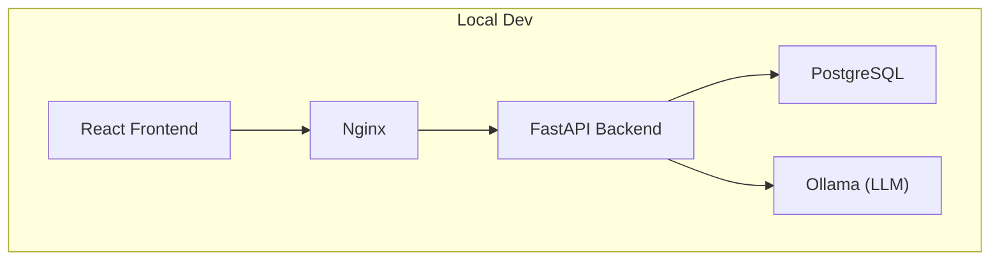
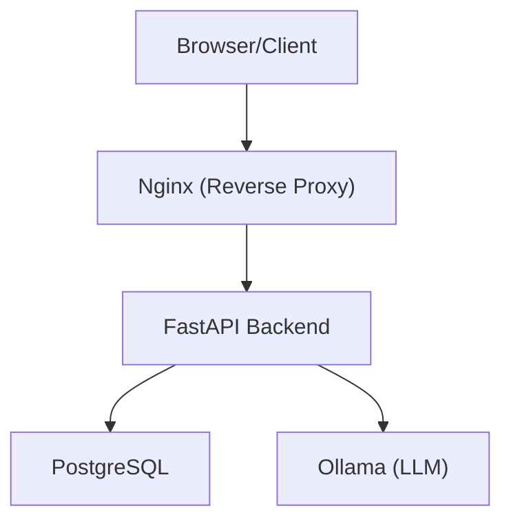
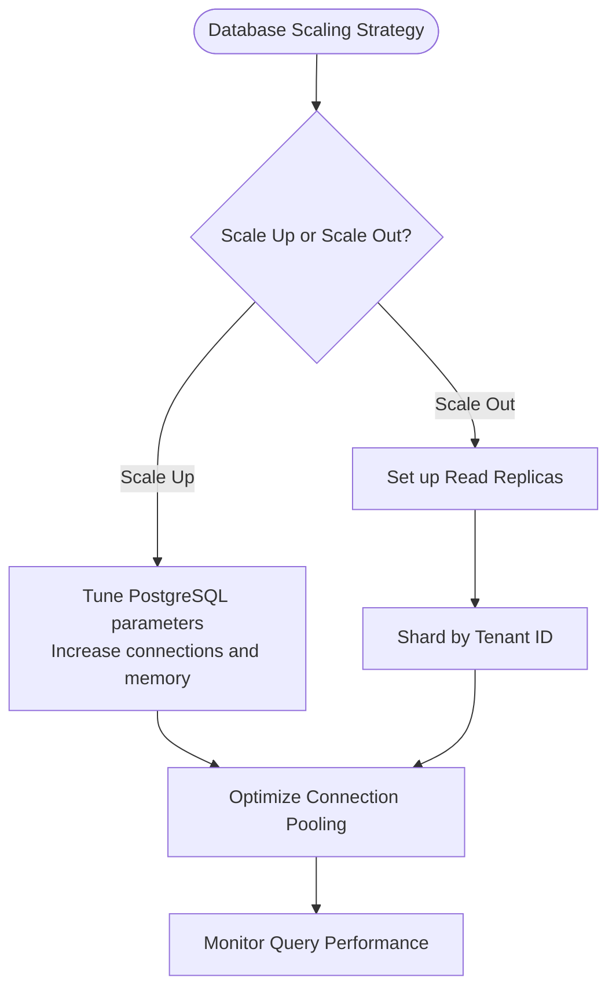
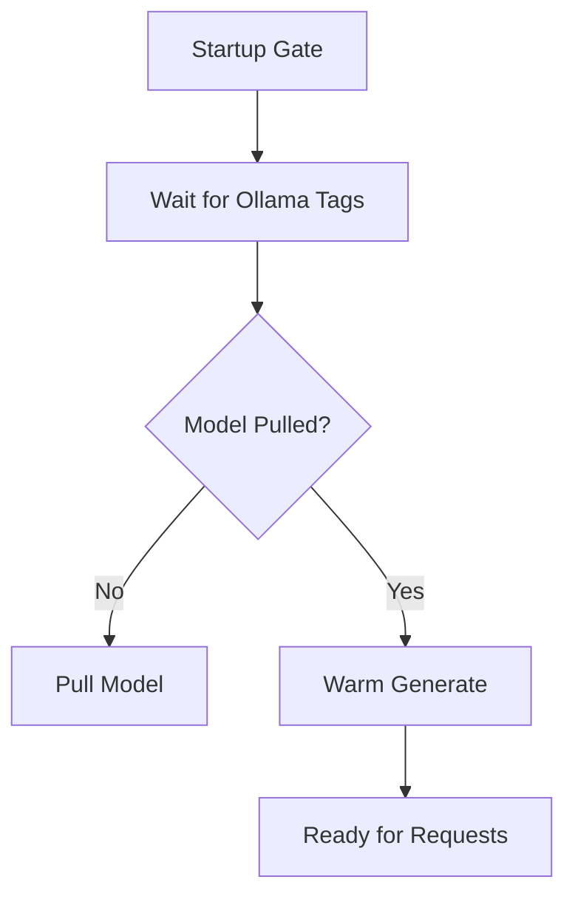
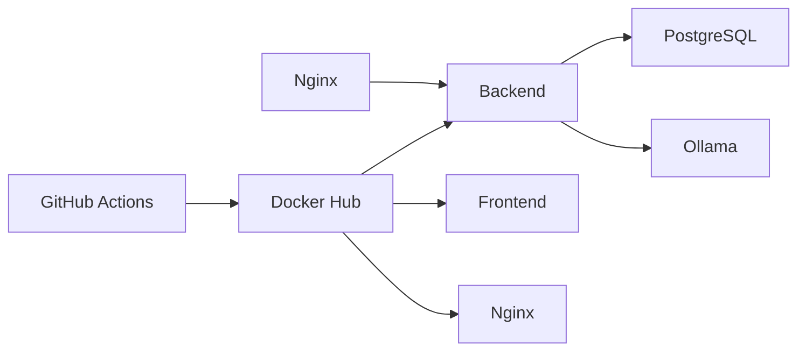

# Scaling Considerations

<cite>
**Referenced Files in This Document**
- [README.md](file://README.md)
- [docker-compose.yml](file://docker-compose.yml)
- [docker-compose.prod.yml](file://docker-compose.prod.yml)
- [app/backend/Dockerfile](file://app/backend/Dockerfile)
- [nginx/nginx.prod.conf](file://nginx/nginx.prod.conf)
- [app/backend/main.py](file://app/backend/main.py)
- [app/backend/db/database.py](file://app/backend/db/database.py)
- [app/backend/services/llm_service.py](file://app/backend/services/llm_service.py)
- [app/backend/routes/analyze.py](file://app/backend/routes/analyze.py)
- [app/backend/scripts/docker-entrypoint.sh](file://app/backend/scripts/docker-entrypoint.sh)
- [app/backend/scripts/wait_for_ollama.py](file://app/backend/scripts/wait_for_ollama.py)
- [.github/workflows/ci.yml](file://.github/workflows/ci.yml)
- [.github/workflows/cd.yml](file://.github/workflows/cd.yml)
- [requirements.txt](file://requirements.txt)
</cite>

## Table of Contents
1. [Introduction](#introduction)
2. [Project Structure](#project-structure)
3. [Core Components](#core-components)
4. [Architecture Overview](#architecture-overview)
5. [Detailed Component Analysis](#detailed-component-analysis)
6. [Dependency Analysis](#dependency-analysis)
7. [Performance Considerations](#performance-considerations)
8. [Troubleshooting Guide](#troubleshooting-guide)
9. [Conclusion](#conclusion)
10. [Appendices](#appendices)

## Introduction
This document provides comprehensive scaling guidance for Resume AI (ARIA), focusing on horizontal and vertical scaling strategies, load balancing, auto-scaling configurations, distributed processing patterns, container orchestration, database scaling, AI model serving, microservices and background processing, CDN optimization, monitoring and alerting, capacity planning, and disaster recovery. It synthesizes the current architecture and operational patterns from the repository to propose scalable, production-ready improvements.

## Project Structure
The project is organized into:
- Backend: FastAPI application with Dockerized services, database, and AI model integration
- Frontend: React SPA built and served behind Nginx
- Infrastructure: Docker Compose for local development and production deployment
- CI/CD: GitHub Actions workflows for testing and image building
- Nginx: Reverse proxy and static asset serving with streaming support

**Diagram sources**
- [docker-compose.yml:52-96](file://docker-compose.yml#L52-L96)
- [app/backend/Dockerfile:1-39](file://app/backend/Dockerfile#L1-L39)
- [nginx/nginx.prod.conf:19-87](file://nginx/nginx.prod.conf#L19-L87)

**Section sources**
- [README.md:231-251](file://README.md#L231-L251)
- [docker-compose.yml:1-101](file://docker-compose.yml#L1-L101)
- [docker-compose.prod.yml:1-227](file://docker-compose.prod.yml#L1-L227)

## Core Components
- Backend service: FastAPI application with health checks, CORS, and modular routers
- Database: SQLAlchemy engine supporting both SQLite and PostgreSQL
- AI model service: Ollama integration for LLM inference with warm-up and readiness gating
- Frontend: React SPA served via Nginx
- Reverse proxy: Nginx configured for API passthrough, streaming, and SPA fallback

Key scaling levers:
- Worker processes and concurrency for I/O-bound workload
- Resource limits and health checks for container orchestration
- Streaming endpoints for responsive UX under load
- Database pooling and connection tuning

**Section sources**
- [app/backend/main.py:174-260](file://app/backend/main.py#L174-L260)
- [app/backend/db/database.py:1-33](file://app/backend/db/database.py#L1-L33)
- [app/backend/services/llm_service.py:1-156](file://app/backend/services/llm_service.py#L1-L156)
- [nginx/nginx.prod.conf:36-87](file://nginx/nginx.prod.conf#L36-L87)

## Architecture Overview
Current deployment uses Docker Compose with a reverse proxy and three primary services. The backend exposes health endpoints and streaming analysis APIs. The database supports both local SQLite and production PostgreSQL with tuned parameters.

**Diagram sources**
- [README.md:231-251](file://README.md#L231-L251)
- [docker-compose.prod.yml:75-106](file://docker-compose.prod.yml#L75-L106)
- [nginx/nginx.prod.conf:54-87](file://nginx/nginx.prod.conf#L54-L87)

## Detailed Component Analysis

### Load Balancing and Horizontal Scaling
- Current state: Single backend instance with multiple workers configured in production Compose
- Recommended enhancements:
  - Use a load balancer (e.g., Nginx, HAProxy, or cloud LB) in front of multiple backend replicas
  - Enable sticky sessions only if required; otherwise rely on stateless design
  - Scale backend horizontally behind a reverse proxy with health checks

Operational levers:
- Workers: The production Compose sets multiple Uvicorn workers for I/O-bound concurrency
- Health checks: Backend exposes a health endpoint; Nginx health route proxies to backend

**Section sources**
- [docker-compose.prod.yml:78-80](file://docker-compose.prod.yml#L78-L80)
- [app/backend/main.py:228-259](file://app/backend/main.py#L228-L259)
- [nginx/nginx.prod.conf:29-34](file://nginx/nginx.prod.conf#L29-L34)

### Auto-Scaling Configurations
- Target metrics: CPU utilization, memory usage, request latency, error rate, queue depth (for background jobs)
- Strategies:
  - Horizontal Pod Autoscaler (HPA) for Kubernetes or equivalent for Docker Swarm
  - Predictive scaling based on historical traffic and scheduled hiring periods
- Triggers:
  - CPU average threshold (e.g., 70%) over 5 minutes
  - Latency P95 exceeding thresholds
  - Queue length for background tasks

[No sources needed since this section provides general guidance]

### Distributed Processing Patterns
- Current streaming pipeline: SSE endpoint streams intermediate stages for responsiveness
- Background processing:
  - Offload heavy tasks to a message broker (e.g., Redis Streams, RabbitMQ, or cloud equivalents)
  - Use worker pools to process queued jobs asynchronously
  - Store results in the database and notify clients via SSE or polling

**Section sources**
- [app/backend/routes/analyze.py:506-646](file://app/backend/routes/analyze.py#L506-L646)

### Container Orchestration with Docker Swarm/Kubernetes
- Docker Swarm:
  - Define services with resource limits and restart policies
  - Use overlay networks for inter-service communication
  - Rolling updates with --with-registry-auth and delay-based rollouts
- Kubernetes:
  - Deployments with HPA and PodDisruptionBudgets
  - Services for internal discovery; Ingress for external TLS termination
  - PersistentVolumes for databases and model caches
  - InitContainers for database migrations and model warm-up

**Section sources**
- [docker-compose.prod.yml:28-33](file://docker-compose.prod.yml#L28-L33)
- [docker-compose.prod.yml:58-64](file://docker-compose.prod.yml#L58-L64)
- [docker-compose.prod.yml:101-112](file://docker-compose.prod.yml#L101-L112)
- [app/backend/scripts/docker-entrypoint.sh:4-14](file://app/backend/scripts/docker-entrypoint.sh#L4-L14)

### Service Discovery and Health Checks
- Service discovery:
  - Docker Compose DNS resolution among services
  - Kubernetes Services and DNS-based discovery
- Health checks:
  - Backend: HTTP GET /health
  - PostgreSQL: pg_isready
  - Ollama: list models endpoint
  - Nginx: internal health route

**Section sources**
- [docker-compose.prod.yml:34-39](file://docker-compose.prod.yml#L34-L39)
- [docker-compose.prod.yml:66-71](file://docker-compose.prod.yml#L66-L71)
- [docker-compose.prod.yml:107-112](file://docker-compose.prod.yml#L107-L112)
- [nginx/nginx.prod.conf:29-34](file://nginx/nginx.prod.conf#L29-L34)

### Rolling Updates and Zero-Downtime Deployments
- Mechanisms:
  - Gradual rollout of new container images
  - Readiness probes to prevent traffic during initialization
  - Graceful shutdown handling in the backend
- CI/CD:
  - Build and push images on successful tests
  - Automated pull and restart of services

**Section sources**
- [.github/workflows/cd.yml:50-101](file://.github/workflows/cd.yml#L50-L101)
- [docker-compose.prod.yml:192-211](file://docker-compose.prod.yml#L192-L211)

### Database Scaling Approaches
- Current database configuration:
  - SQLite for local development
  - PostgreSQL in production with tuned parameters and connection limits
- Scaling strategies:
  - Read replicas for read-heavy workloads
  - Sharding by tenant_id to isolate data and scale independently
  - Connection pooling with SQLAlchemy and driver-level pooling
  - Migration automation via Alembic

**Diagram sources**
- [docker-compose.prod.yml:12-22](file://docker-compose.prod.yml#L12-L22)
- [app/backend/db/database.py:20](file://app/backend/db/database.py#L20)

**Section sources**
- [docker-compose.prod.yml:12-22](file://docker-compose.prod.yml#L12-L22)
- [app/backend/db/database.py:1-33](file://app/backend/db/database.py#L1-L33)

### AI Model Scaling Considerations
- Current model serving:
  - Ollama container with environment variables controlling parallelism and memory
  - Warm-up service to preload models into RAM
  - Startup gating to ensure readiness before serving traffic
- Scaling levers:
  - Increase OLLAMA_NUM_PARALLEL for higher concurrency
  - Use smaller models for edge inference and reserve larger models for batch processing
  - GPU acceleration via Ollama with CUDA-enabled images
  - Model caching and quantization to reduce memory footprint

**Diagram sources**
- [app/backend/scripts/wait_for_ollama.py:34-91](file://app/backend/scripts/wait_for_ollama.py#L34-L91)
- [docker-compose.prod.yml:151-184](file://docker-compose.prod.yml#L151-L184)

**Section sources**
- [docker-compose.prod.yml:44-65](file://docker-compose.prod.yml#L44-L65)
- [docker-compose.prod.yml:151-184](file://docker-compose.prod.yml#L151-L184)
- [app/backend/scripts/wait_for_ollama.py:1-96](file://app/backend/scripts/wait_for_ollama.py#L1-L96)

### Microservices Architecture and Background Processing
- Microservices:
  - Separate services for parsing, analysis, video processing, and exports
  - API gateway pattern via Nginx for routing
- Message queue integration:
  - Offload batch analysis and exports to a queue-backed worker system
  - Use idempotent processing and dead-letter exchanges

**Section sources**
- [app/backend/routes/analyze.py:649-758](file://app/backend/routes/analyze.py#L649-L758)
- [requirements.txt:34-36](file://requirements.txt#L34-L36)

### CDN Optimization for Static Assets
- Recommendations:
  - Serve frontend bundles via CDN with cache headers
  - Use immutable cache-control for hashed filenames
  - Enable compression and HTTPS termination at CDN edge

**Section sources**
- [nginx/nginx.prod.conf:13-17](file://nginx/nginx.prod.conf#L13-L17)

## Dependency Analysis
The backend depends on the database and Ollama for analysis. Nginx acts as the reverse proxy and load balancer. CI/CD builds and pushes images for automated deployments.

**Diagram sources**
- [.github/workflows/cd.yml:66-95](file://.github/workflows/cd.yml#L66-L95)
- [docker-compose.prod.yml:75-106](file://docker-compose.prod.yml#L75-L106)

**Section sources**
- [.github/workflows/ci.yml:1-63](file://.github/workflows/ci.yml#L1-L63)
- [.github/workflows/cd.yml:1-101](file://.github/workflows/cd.yml#L1-L101)

## Performance Considerations
- Backend concurrency:
  - Use multiple Uvicorn workers for I/O-bound tasks
  - Optimize timeouts for streaming endpoints
- Database:
  - Enable pool_pre_ping and tune connection limits
  - Prefer read replicas for reporting queries
- AI inference:
  - Warm up models at startup
  - Reduce model size or enable quantization for throughput
- Nginx:
  - Enable gzip and keepalive
  - Configure streaming for SSE endpoints

**Section sources**
- [docker-compose.prod.yml:78-80](file://docker-compose.prod.yml#L78-L80)
- [app/backend/db/database.py:20](file://app/backend/db/database.py#L20)
- [nginx/nginx.prod.conf:13-17](file://nginx/nginx.prod.conf#L13-L17)
- [nginx/nginx.prod.conf:36-52](file://nginx/nginx.prod.conf#L36-L52)

## Troubleshooting Guide
Common scaling-related issues and resolutions:
- Ollama not ready:
  - Verify model availability and warm-up completion
  - Check startup gating and environment variables
- Database locked or slow:
  - Switch to PostgreSQL for concurrency
  - Review connection limits and pool settings
- Health check failures:
  - Confirm backend health endpoint and Nginx proxy settings
- SSL and DNS:
  - Renew certificates and ensure resolver refresh in Nginx

**Section sources**
- [README.md:339-355](file://README.md#L339-L355)
- [app/backend/scripts/wait_for_ollama.py:34-91](file://app/backend/scripts/wait_for_ollama.py#L34-L91)
- [docker-compose.prod.yml:34-39](file://docker-compose.prod.yml#L34-L39)
- [nginx/nginx.prod.conf:23-27](file://nginx/nginx.prod.conf#L23-L27)

## Conclusion
Resume AI’s current architecture provides a solid foundation for scaling. By adopting container orchestration, implementing background processing, optimizing database and AI model serving, and establishing robust monitoring and CI/CD, the platform can achieve high availability, predictable performance, and efficient resource utilization at scale.

[No sources needed since this section summarizes without analyzing specific files]

## Appendices

### Capacity Planning Methodology
- Baseline measurements: Throughput, latency, memory, and CPU under typical load
- Stress testing: Simulate peak loads and identify bottlenecks
- Forecasting: Project growth using historical trends and seasonal hiring cycles
- Right-size: Adjust worker counts, replicas, and resource limits iteratively

[No sources needed since this section provides general guidance]

### Disaster Recovery Planning
- Multi-region deployments with replicated databases and CDN edge caching
- Backup and restore procedures for PostgreSQL and model caches
- Rollback strategy using immutable container images and blue/green deployments
- Incident response playbooks for model unavailability, database outages, and traffic spikes

[No sources needed since this section provides general guidance]