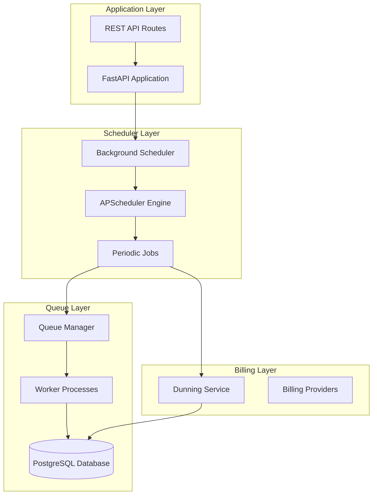
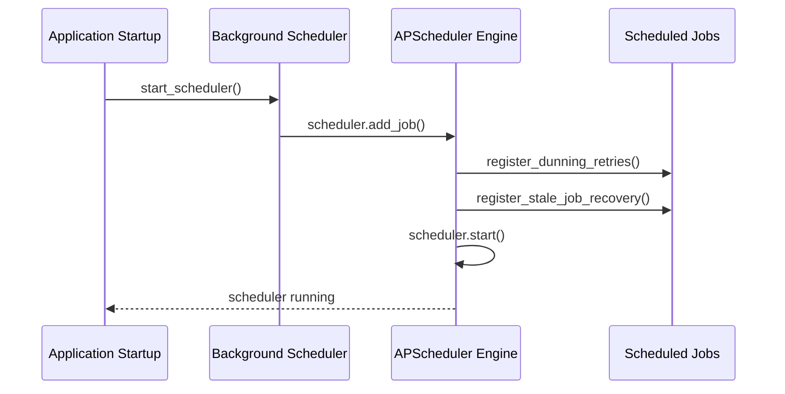
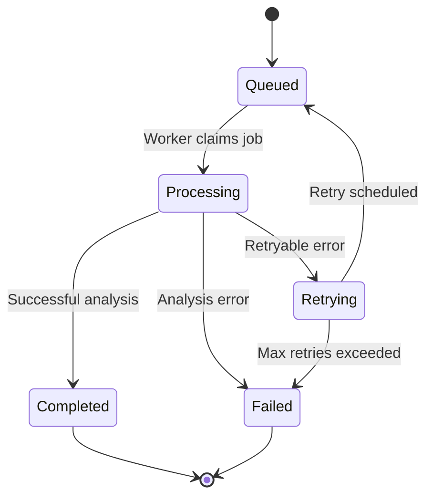
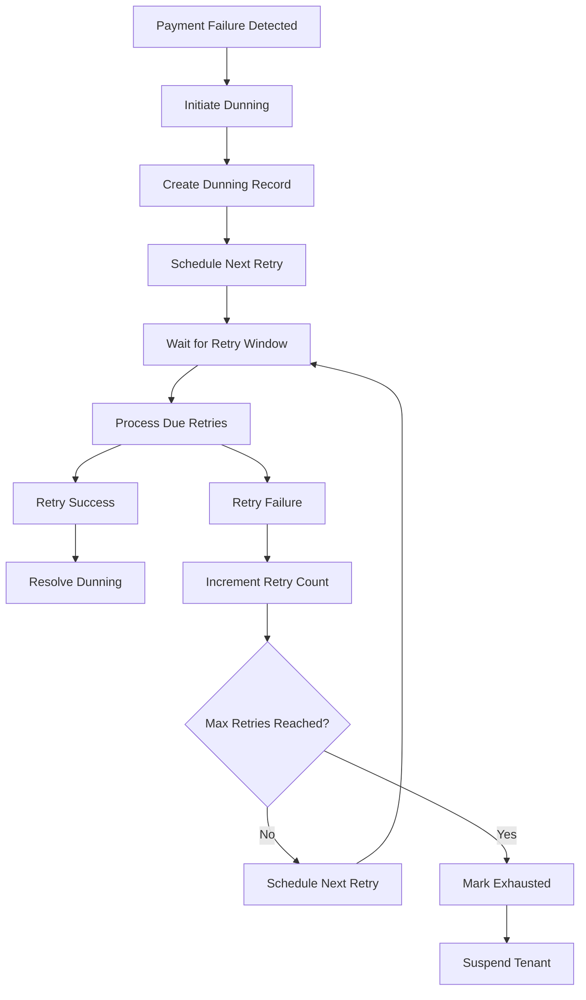
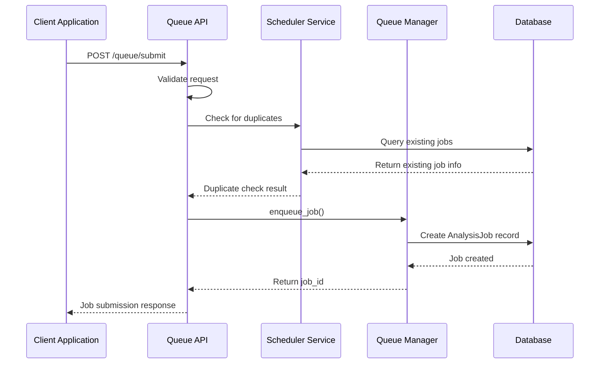
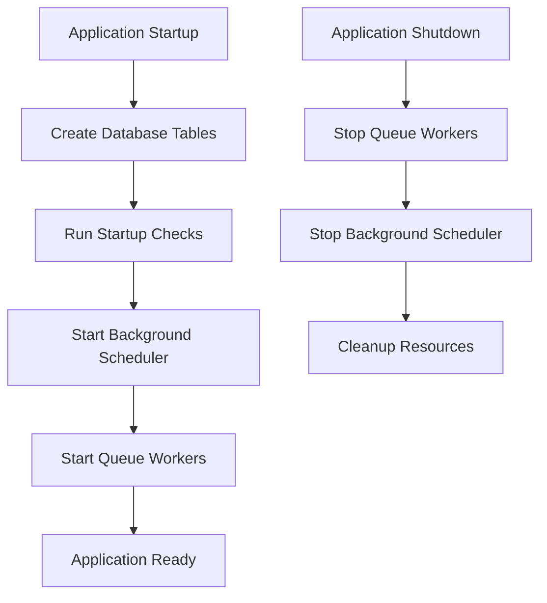

# Scheduler Service

<cite>
**Referenced Files in This Document**
- [scheduler.py](file://app/backend/services/scheduler.py)
- [queue_manager.py](file://app/backend/services/queue_manager.py)
- [main.py](file://app/backend/main.py)
- [queue_api.py](file://app/backend/routes/queue_api.py)
- [dunning_service.py](file://app/backend/services/billing/dunning_service.py)
- [db_models.py](file://app/backend/models/db_models.py)
</cite>

## Table of Contents
1. [Introduction](#introduction)
2. [System Architecture](#system-architecture)
3. [Core Components](#core-components)
4. [Scheduler Implementation](#scheduler-implementation)
5. [Queue Management System](#queue-management-system)
6. [Billing Dunning Integration](#billing-dunning-integration)
7. [API Endpoints](#api-endpoints)
8. [Configuration and Deployment](#configuration-and-deployment)
9. [Monitoring and Observability](#monitoring-and-observability)
10. [Troubleshooting Guide](#troubleshooting-guide)
11. [Conclusion](#conclusion)

## Introduction

The Scheduler Service is a critical component of the ARIA (AI Resume Intelligence) platform that manages background tasks and job processing for the resume analysis system. Built on top of APScheduler, this service handles periodic maintenance tasks, job recovery mechanisms, and integrates with the broader queue management system to ensure reliable asynchronous processing of candidate analysis jobs.

The scheduler service operates alongside the main FastAPI application, providing background processing capabilities for:
- Automated dunning retry processing for billing systems
- Stale job recovery and cleanup
- Periodic maintenance tasks
- Integration with the queue worker system

## System Architecture

The Scheduler Service follows a distributed architecture pattern where background tasks are scheduled independently from the main request-response cycle. The system consists of several interconnected components:

**Diagram sources**
- [scheduler.py:78-103](file://app/backend/services/scheduler.py#L78-L103)
- [main.py:307-312](file://app/backend/main.py#L307-L312)

## Core Components

### Background Scheduler Engine

The scheduler service utilizes APScheduler (Advanced Python Scheduler) to manage periodic tasks. APScheduler provides robust scheduling capabilities including:

- **Interval-based scheduling**: Jobs that run at fixed intervals
- **Misfire handling**: Graceful handling of missed execution windows
- **Thread-safe operation**: Safe concurrent execution in multi-threaded environments
- **Graceful shutdown**: Proper cleanup during application termination

### Job Types and Responsibilities

The scheduler manages two primary categories of jobs:

1. **Dunning Retry Processing**: Hourly processing of failed payment retries for billing systems
2. **Stale Job Recovery**: Periodic cleanup of orphaned or stuck analysis jobs

### Database Integration

The scheduler maintains tight integration with the PostgreSQL database through SQLAlchemy ORM, ensuring transactional consistency and proper error handling for all database operations.

**Section sources**
- [scheduler.py:1-111](file://app/backend/services/scheduler.py#L1-L111)

## Scheduler Implementation

### Scheduler Initialization and Configuration

The scheduler service initializes with specific configurations for each job type:

**Diagram sources**
- [scheduler.py:78-103](file://app/backend/services/scheduler.py#L78-L103)

### Job Configuration Details

Each scheduled job has specific configuration parameters:

| Job Type | Schedule | Misfire Grace Time | Purpose |
|-----------|----------|-------------------|---------|
| Dunning Retries | Every 1 hour | 300 seconds | Process failed payment retries |
| Stale Job Recovery | Every 5 minutes | 60 seconds | Clean up orphaned jobs |

### Error Handling and Logging

The scheduler implements comprehensive error handling with structured logging:

- **Exception catching**: All job execution wrapped in try-catch blocks
- **Structured logging**: Consistent log formatting with job-specific context
- **Database rollback**: Automatic rollback on job failures
- **Graceful degradation**: Jobs continue running even if individual executions fail

**Section sources**
- [scheduler.py:15-27](file://app/backend/services/scheduler.py#L15-L27)
- [scheduler.py:29-76](file://app/backend/services/scheduler.py#L29-L76)

## Queue Management System

### Queue Manager Architecture

The Queue Manager serves as the backbone of the job processing system, providing:

- **Priority-based scheduling**: Jobs processed based on priority and submission time
- **Automatic retry mechanism**: Exponential backoff for failed jobs
- **Worker health monitoring**: Heartbeat-based detection of dead workers
- **Deduplication**: Prevention of duplicate job processing
- **Metrics collection**: Comprehensive performance tracking

### Job Lifecycle Management

**Diagram sources**
- [queue_manager.py:356-502](file://app/backend/services/queue_manager.py#L356-L502)

### Worker Configuration

The queue system supports configurable worker parameters:

- **Max Concurrent Jobs**: Configurable via environment variable
- **Poll Interval**: Controls how frequently workers check for new jobs
- **Heartbeat Interval**: Worker health reporting frequency
- **Stale Job Timeout**: Threshold for detecting dead workers

**Section sources**
- [queue_manager.py:195-221](file://app/backend/services/queue_manager.py#L195-L221)

## Billing Dunning Integration

### Dunning Service Architecture

The scheduler integrates with the billing dunning system to automatically process failed payment retries:

**Diagram sources**
- [dunning_service.py:65-156](file://app/backend/services/billing/dunning_service.py#L65-L156)

### Dunning Configuration

The dunning system uses configurable retry schedules:

| Retry Attempt | Delay | Purpose |
|---------------|-------|---------|
| 1st | 1 day | Initial retry after failure |
| 2nd | 3 days | Extended follow-up |
| 3rd | 7 days | Persistent follow-up |
| 4th | 14 days | Final attempt before suspension |

### Database Schema Integration

The dunning system relies on the following database models:

- **DunningRecord**: Tracks individual dunning attempts per tenant
- **PlatformConfig**: Stores configurable dunning parameters
- **Tenant**: Links dunning records to tenant accounts

**Section sources**
- [dunning_service.py:158-200](file://app/backend/services/billing/dunning_service.py#L158-L200)
- [db_models.py:643-658](file://app/backend/models/db_models.py#L643-L658)

## API Endpoints

### Queue Management Endpoints

The scheduler service integrates with REST API endpoints for job management:

| Endpoint | Method | Description |
|----------|--------|-------------|
| `/queue/submit` | POST | Submit new analysis job to queue |
| `/queue/status/{job_id}` | GET | Check job status and progress |
| `/queue/result/{job_id}` | GET | Retrieve analysis results |
| `/queue/stats` | GET | Get queue statistics |
| `/queue/jobs` | GET | List tenant's jobs |
| `/queue/retry/{job_id}` | POST | Manually retry failed job |
| `/queue/cancel/{job_id}` | DELETE | Cancel queued/processing job |

### Job Submission Process

**Diagram sources**
- [queue_api.py:46-106](file://app/backend/routes/queue_api.py#L46-L106)

**Section sources**
- [queue_api.py:46-171](file://app/backend/routes/queue_api.py#L46-L171)

## Configuration and Deployment

### Environment Variables

The scheduler service supports the following configuration options:

| Variable | Default | Description |
|----------|---------|-------------|
| `QUEUE_MAX_CONCURRENT` | 10 | Maximum concurrent jobs per worker |
| `QUEUE_POLL_INTERVAL` | 2 | Worker poll interval in seconds |
| `QUEUE_HEARTBEAT_INTERVAL` | 30 | Worker heartbeat interval in seconds |
| `QUEUE_STALE_TIMEOUT` | 600 | Stale job detection timeout in seconds |

### Application Startup Integration

The scheduler integrates seamlessly with the FastAPI application lifecycle:

**Diagram sources**
- [main.py:250-341](file://app/backend/main.py#L250-L341)

### Deployment Considerations

- **Multiple Instances**: Scheduler can run on multiple application instances
- **Database Connections**: Proper connection pooling for scheduler operations
- **Logging Configuration**: Structured logging for monitoring and debugging
- **Health Checks**: Integration with application health endpoints

**Section sources**
- [main.py:282-312](file://app/backend/main.py#L282-L312)

## Monitoring and Observability

### Logging Structure

The scheduler implements structured logging with consistent formatting:

- **Timestamp**: ISO format timestamps for all log entries
- **Level**: Severity levels (INFO, WARNING, ERROR)
- **Module**: Scheduler-specific module identification
- **Message**: Descriptive messages with job context
- **Exception**: Full stack traces for error conditions

### Performance Metrics

Key performance indicators tracked by the scheduler:

- **Job Execution Time**: Duration of each scheduled job
- **Error Rates**: Frequency of job failures
- **Success Rates**: Percentage of successful job completions
- **Queue Depth**: Number of jobs waiting for processing
- **Worker Utilization**: Percentage of time workers are busy

### Health Monitoring

The application provides comprehensive health checking:

- **Shallow Health**: Process liveness check (fast)
- **Deep Health**: Complete dependency validation
- **LLM Status**: Ollama service availability
- **Database Connectivity**: Connection pool health
- **Disk Space**: Storage utilization monitoring

**Section sources**
- [main.py:441-592](file://app/backend/main.py#L441-L592)

## Troubleshooting Guide

### Common Issues and Solutions

#### Scheduler Not Starting
- **Symptom**: Jobs not executing on schedule
- **Causes**: 
  - Database connection failures
  - APScheduler initialization errors
  - Missing environment configurations
- **Solution**: Check application logs for startup errors, verify database connectivity, review environment variables

#### Job Failures
- **Symptom**: Jobs failing with exceptions
- **Causes**:
  - Database transaction conflicts
  - Resource exhaustion
  - External service unavailability
- **Solution**: Review error logs, check database connection limits, monitor external service health

#### Stale Job Detection
- **Symptom**: Jobs stuck in processing state
- **Causes**:
  - Worker process crashes
  - Network timeouts
  - Long-running job processing
- **Solution**: Verify worker health, adjust stale job timeout settings, check worker logs

#### Dunning Retry Issues
- **Symptom**: Payment retries not processing
- **Causes**:
  - Billing provider API failures
  - Configuration errors
  - Tenant account issues
- **Solution**: Check billing service logs, verify provider credentials, review tenant status

### Debugging Tools

The system provides several debugging capabilities:

- **Health Endpoints**: `/health` and `/api/health` for basic and comprehensive health checks
- **LLM Status**: `/api/llm-status` for Ollama service diagnostics
- **Worker Stats**: `/queue/worker/stats` for queue worker monitoring
- **Performance Metrics**: `/queue/metrics/performance` for historical performance analysis

**Section sources**
- [main.py:441-679](file://app/backend/main.py#L441-L679)

## Conclusion

The Scheduler Service represents a robust and scalable solution for managing background tasks in the ARIA platform. Through its integration with APScheduler, comprehensive error handling, and tight coupling with the queue management system, it ensures reliable processing of analysis jobs while maintaining system stability.

Key strengths of the implementation include:

- **Reliability**: Comprehensive error handling and recovery mechanisms
- **Scalability**: Configurable worker pools and job prioritization
- **Observability**: Structured logging and comprehensive monitoring
- **Integration**: Seamless integration with the broader application ecosystem
- **Maintainability**: Clean separation of concerns and modular design

The scheduler service continues to evolve as part of the larger ARIA platform, supporting the growing demands of multi-tenant AI-powered resume screening while maintaining high availability and performance standards.