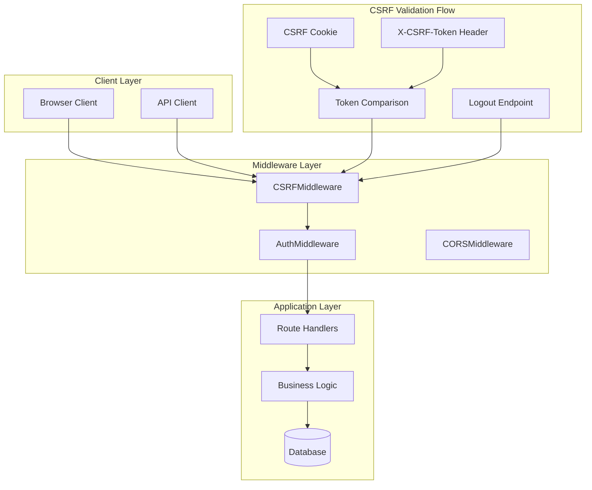
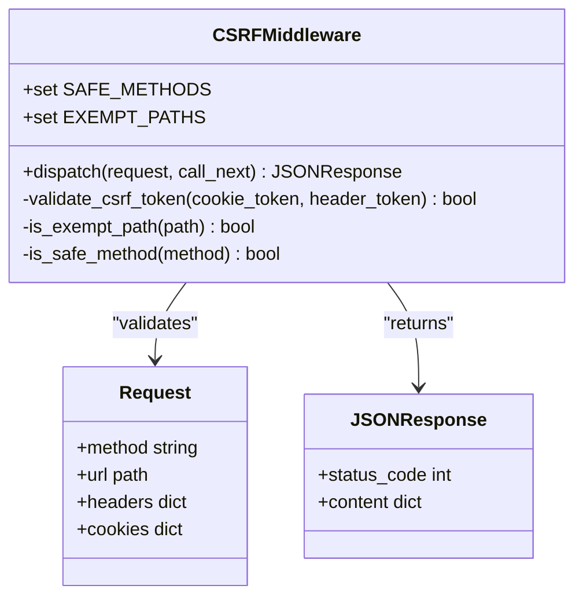
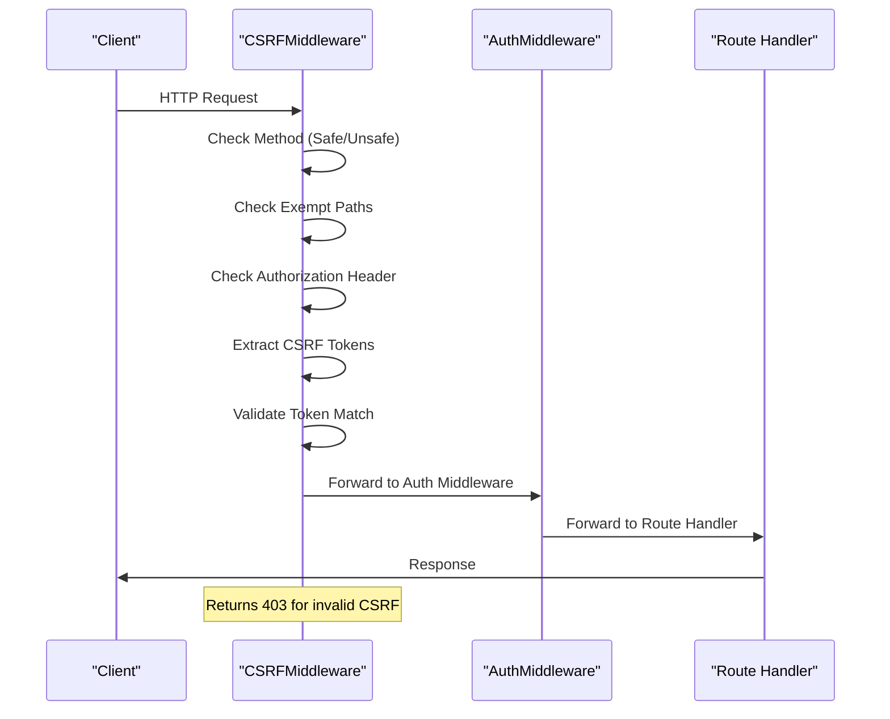
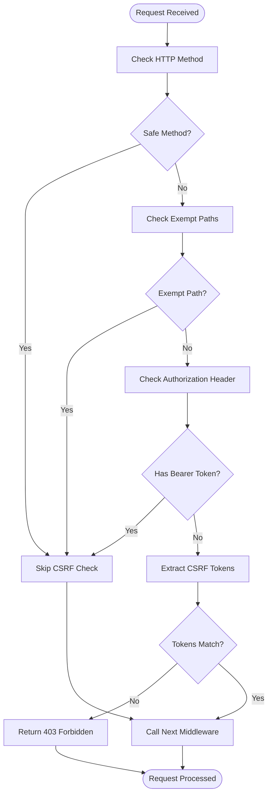
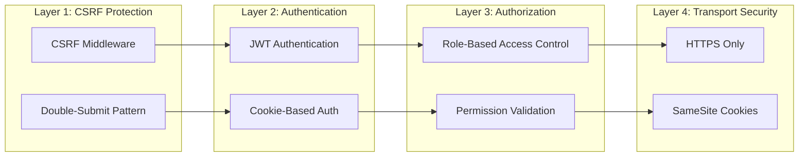
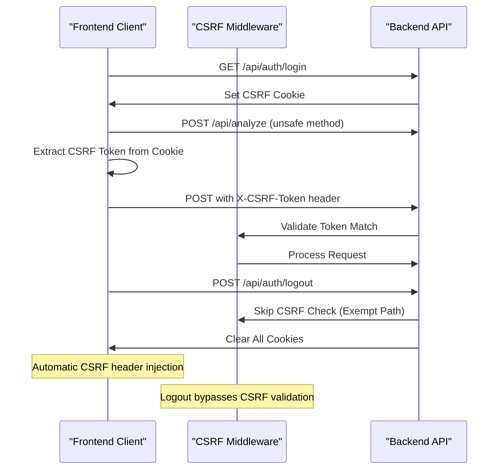
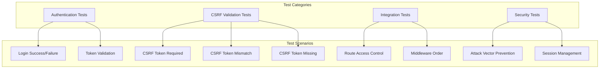

# CSRF Protection Middleware

<cite>
**Referenced Files in This Document**
- [csrf.py](file://app/backend/middleware/csrf.py)
- [main.py](file://app/backend/main.py)
- [auth.py](file://app/backend/routes/auth.py)
- [auth.py](file://app/backend/middleware/auth.py)
- [api.js](file://app/frontend/src/lib/api.js)
- [test_routes_phase1.py](file://app/backend/tests/test_routes_phase1.py)
</cite>

## Update Summary
**Changes Made**
- Updated exemption rules section to reflect the addition of `/api/auth/logout` endpoint
- Enhanced troubleshooting guide with logout-specific guidance
- Updated architecture diagrams to show logout flow
- Added comprehensive logout functionality documentation

## Table of Contents
1. [Introduction](#introduction)
2. [Architecture Overview](#architecture-overview)
3. [Core Components](#core-components)
4. [Implementation Details](#implementation-details)
5. [Security Model](#security-model)
6. [Integration Patterns](#integration-patterns)
7. [Testing Strategy](#testing-strategy)
8. [Deployment Considerations](#deployment-considerations)
9. [Troubleshooting Guide](#troubleshooting-guide)
10. [Conclusion](#conclusion)

## Introduction

The CSRF Protection Middleware is a critical security component designed to prevent Cross-Site Request Forgery attacks in the Resume AI platform. This middleware implements the double-submit cookie pattern, a robust defense mechanism that ensures only legitimate browser requests can modify state on the server.

CSRF (Cross-Site Request Forgery) attacks occur when malicious websites trick authenticated users into performing unintended actions on a web application. The double-submit cookie pattern mitigates this risk by requiring clients to submit a CSRF token in both a cookie and a request header, making it extremely difficult for attackers to forge valid requests.

**Updated** Enhanced with improved logout functionality through dedicated exemption for `/api/auth/logout` endpoint, ensuring seamless user session termination without CSRF validation conflicts.

## Architecture Overview

The CSRF protection system operates as a middleware layer in the FastAPI application stack, positioned strategically to intercept and validate all incoming requests before they reach the application routes.

**Diagram sources**
- [main.py:200-202](file://app/backend/main.py#L200-L202)
- [csrf.py:13-57](file://app/backend/middleware/csrf.py#L13-L57)

## Core Components

### CSRFMiddleware Class

The [`CSRFMiddleware`:13-57](file://app/backend/middleware/csrf.py#L13-L57) serves as the primary security enforcement component, implementing the double-submit cookie validation pattern.

**Diagram sources**
- [csrf.py:13-57](file://app/backend/middleware/csrf.py#L13-L57)

**Section sources**
- [csrf.py:13-57](file://app/backend/middleware/csrf.py#L13-L57)

### Authentication Integration

The middleware seamlessly integrates with the existing authentication system, working alongside JWT-based authentication for API clients while protecting browser-based interactions.

**Diagram sources**
- [csrf.py:33-57](file://app/backend/middleware/csrf.py#L33-L57)
- [auth.py:26-56](file://app/backend/middleware/auth.py#L26-L56)

**Section sources**
- [auth.py:26-56](file://app/backend/middleware/auth.py#L26-L56)

## Implementation Details

### Double-Submit Cookie Pattern

The middleware implements the double-submit cookie pattern, requiring clients to provide CSRF tokens in two locations:

1. **Cookie**: `csrf_token` - stored as a standard cookie
2. **Header**: `X-CSRF-Token` - included in request headers

**Diagram sources**
- [csrf.py:33-57](file://app/backend/middleware/csrf.py#L33-L57)

**Section sources**
- [csrf.py:23-57](file://app/backend/middleware/csrf.py#L23-L57)

### Token Generation and Management

The authentication system generates CSRF tokens during user login and registration, storing them in cookies for client access.

**Section sources**
- [auth.py:57-103](file://app/backend/routes/auth.py#L57-L103)

### Exemption Rules

**Updated** The middleware includes several exemption rules to ensure proper functionality, with enhanced support for logout operations:

- **Safe HTTP Methods**: GET, HEAD, OPTIONS requests are automatically exempt
- **Authentication Endpoints**: Login, register, refresh, and **logout** endpoints are exempt
- **API Clients**: Requests with Authorization headers (Bearer tokens) bypass CSRF checks
- **Health Endpoints**: System monitoring endpoints remain accessible

The addition of `/api/auth/logout` to the exemption list ensures seamless user session termination without CSRF validation conflicts, allowing users to log out cleanly from browser-based applications.

**Section sources**
- [csrf.py:23-31](file://app/backend/middleware/csrf.py#L23-L31)

## Security Model

### Defense-in-Depth Approach

The CSRF protection system employs a layered security approach:

**Diagram sources**
- [csrf.py:13-57](file://app/backend/middleware/csrf.py#L13-L57)
- [auth.py:57-103](file://app/backend/routes/auth.py#L57-L103)

### Token Lifecycle Management

The CSRF token lifecycle follows strict security protocols:

1. **Generation**: Random 64-character hex token generated during authentication
2. **Storage**: Stored in non-httpOnly cookie for client accessibility
3. **Validation**: Compared against X-CSRF-Token header on unsafe requests
4. **Expiration**: 1-hour lifetime with automatic rotation
5. **Cleanup**: Removed on logout or session termination

**Section sources**
- [auth.py:61-101](file://app/backend/routes/auth.py#L61-L101)

## Integration Patterns

### Frontend Integration

The frontend client automatically handles CSRF token injection for browser-based requests:

**Diagram sources**
- [api.js:18-31](file://app/frontend/src/lib/api.js#L18-L31)
- [csrf.py:47-55](file://app/backend/middleware/csrf.py#L47-L55)

**Section sources**
- [api.js:18-31](file://app/frontend/src/lib/api.js#L18-L31)

### API Client Integration

API clients using Bearer tokens automatically bypass CSRF checks, maintaining compatibility with automated systems:

**Section sources**
- [csrf.py:42-45](file://app/backend/middleware/csrf.py#L42-L45)

## Testing Strategy

### Test Coverage

The CSRF protection system includes comprehensive test coverage demonstrating its effectiveness:

**Diagram sources**
- [test_routes_phase1.py:149](file://app/backend/tests/test_routes_phase1.py#L149)
- [test_routes_phase1.py:165](file://app/backend/tests/test_routes_phase1.py#L165)
- [test_routes_phase1.py:210](file://app/backend/tests/test_routes_phase1.py#L210)

**Section sources**
- [test_routes_phase1.py:149](file://app/backend/tests/test_routes_phase1.py#L149)
- [test_routes_phase1.py:165](file://app/backend/tests/test_routes_phase1.py#L165)
- [test_routes_phase1.py:210](file://app/backend/tests/test_routes_phase1.py#L210)

### Test Evidence

The test suite demonstrates CSRF protection effectiveness through multiple scenarios:

- **Batch Analysis**: Requires CSRF token, returns 403 when missing
- **Comparison Operations**: CSRF validation prevents unauthorized modifications  
- **Status Updates**: Protects critical system operations from CSRF attacks

**Section sources**
- [test_routes_phase1.py:149](file://app/backend/tests/test_routes_phase1.py#L149)
- [test_routes_phase1.py:165](file://app/backend/tests/test_routes_phase1.py#L165)
- [test_routes_phase1.py:210](file://app/backend/tests/test_routes_phase1.py#L210)

## Deployment Considerations

### Production Configuration

The middleware includes production-ready security configurations:

- **Secure Cookies**: CSRF tokens use HTTPS-only and SameSite protections
- **Token Rotation**: Automatic token regeneration for enhanced security
- **Expiry Management**: 1-hour token lifetime with proper cleanup
- **Environment Awareness**: Different behavior in development vs production

**Section sources**
- [auth.py:92-101](file://app/backend/routes/auth.py#L92-L101)

### Middleware Ordering

The middleware stack order is critical for proper operation:

1. **CORS Middleware**: Handles cross-origin requests
2. **CSRF Middleware**: Validates security tokens
3. **Auth Middleware**: Processes authentication
4. **Route Handlers**: Executes business logic

**Section sources**
- [main.py:192-202](file://app/backend/main.py#L192-L202)

## Troubleshooting Guide

### Common Issues

#### CSRF Token Missing Errors

**Symptoms**: 403 Forbidden responses on unsafe requests
**Causes**: 
- Missing CSRF cookie in browser
- Frontend not extracting token from cookie
- Token expired or rotated

**Solutions**:
- Verify CSRF cookie is present in browser
- Ensure frontend extracts token from `document.cookie`
- Check token expiration and regenerate if needed

#### Token Mismatch Errors

**Symptoms**: 403 Forbidden with token validation failure
**Causes**:
- Outdated CSRF token in client
- Multiple browser tabs with different tokens
- Manual request manipulation

**Solutions**:
- Refresh browser page to get new token
- Close conflicting browser tabs
- Avoid manual token manipulation

#### Authentication Conflicts

**Symptoms**: Mixed authentication behavior
**Causes**:
- API clients using Authorization headers
- Browser clients relying on cookies
- Middleware ordering issues

**Solutions**:
- API clients automatically bypass CSRF checks
- Browser clients must include CSRF tokens
- Verify middleware stack order in main application

#### Logout Issues

**Updated** **Symptoms**: Logout requests failing with CSRF errors
**Causes**:
- CSRF middleware still validating logout requests
- Missing CSRF token in logout request
- Incorrect logout endpoint path

**Solutions**:
- Verify logout endpoint is `/api/auth/logout` (with CSRF exemption)
- Browser clients automatically handle CSRF token extraction
- API clients bypass CSRF validation entirely
- Check that logout clears all cookies including `csrf_token`

**Section sources**
- [csrf.py:51-55](file://app/backend/middleware/csrf.py#L51-L55)
- [api.js:18-31](file://app/frontend/src/lib/api.js#L18-L31)
- [auth.py:201-208](file://app/backend/routes/auth.py#L201-L208)

## Conclusion

The CSRF Protection Middleware provides robust defense against Cross-Site Request Forgery attacks through a well-designed double-submit cookie pattern implementation. The system successfully balances security with usability by:

- **Automatic Protection**: Transparent CSRF validation for browser clients
- **API Compatibility**: Seamless integration with Bearer token authentication
- **Comprehensive Coverage**: Protection across all unsafe HTTP methods
- **Production Ready**: Secure cookie handling and proper lifecycle management
- **Enhanced Logout Support**: Dedicated exemption for `/api/auth/logout` ensures seamless user session termination

The implementation demonstrates best practices in web security while maintaining compatibility with modern authentication patterns. The comprehensive test coverage and clear error handling ensure reliable operation in production environments.

**Updated** The recent enhancement to include `/api/auth/logout` in the exemption list significantly improves user experience by eliminating CSRF validation conflicts during logout operations, while maintaining strong security posture for all other authenticated operations.