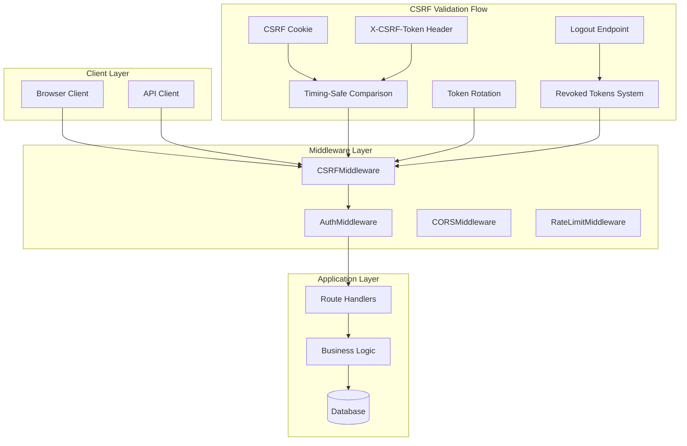
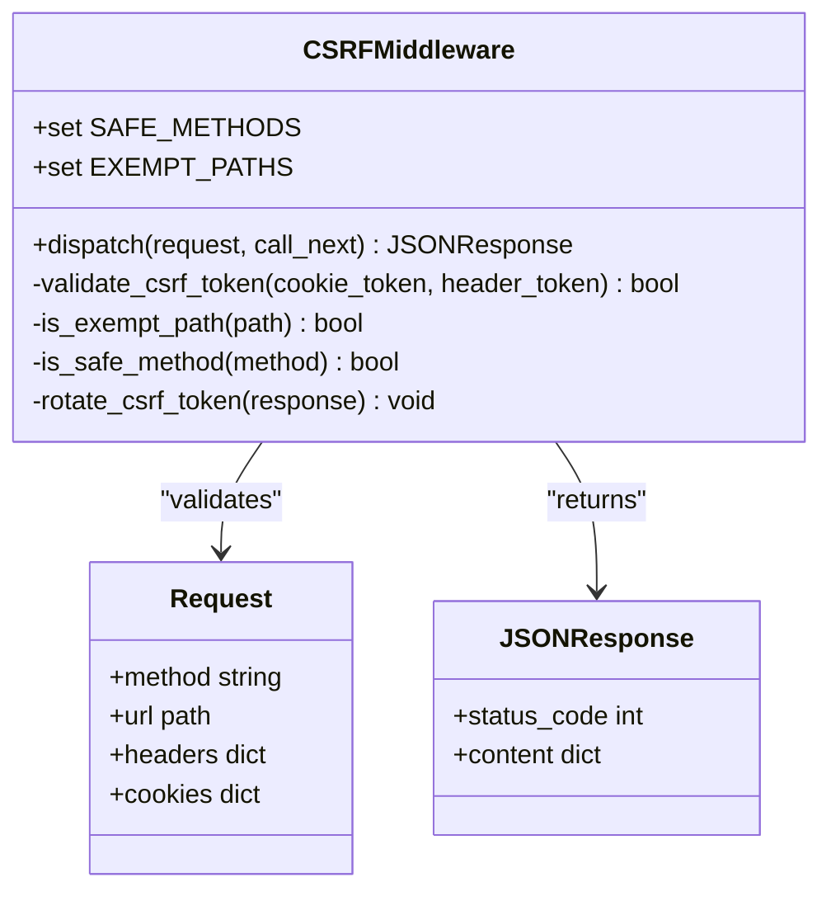
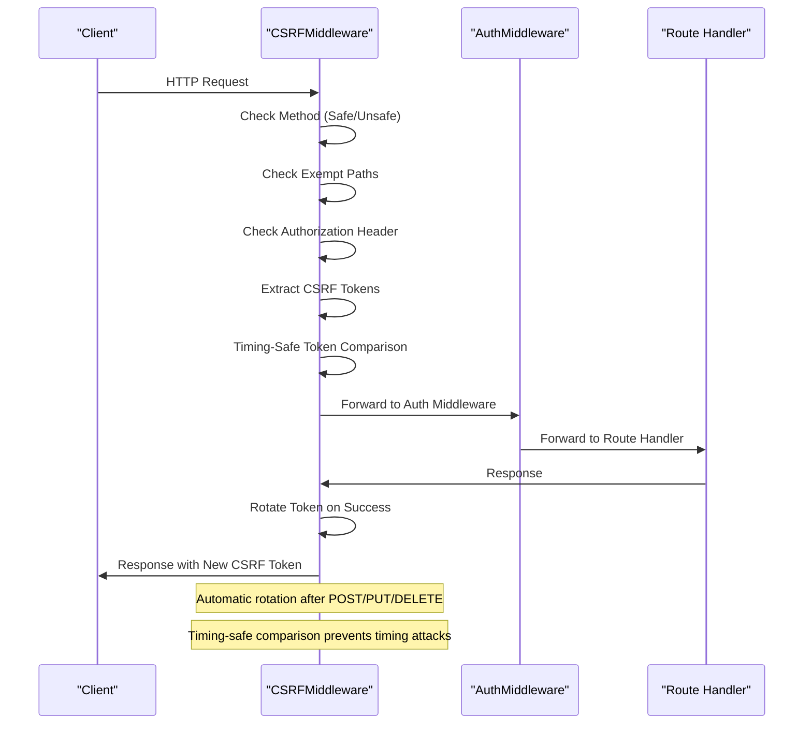
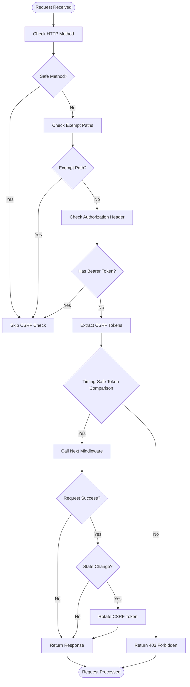
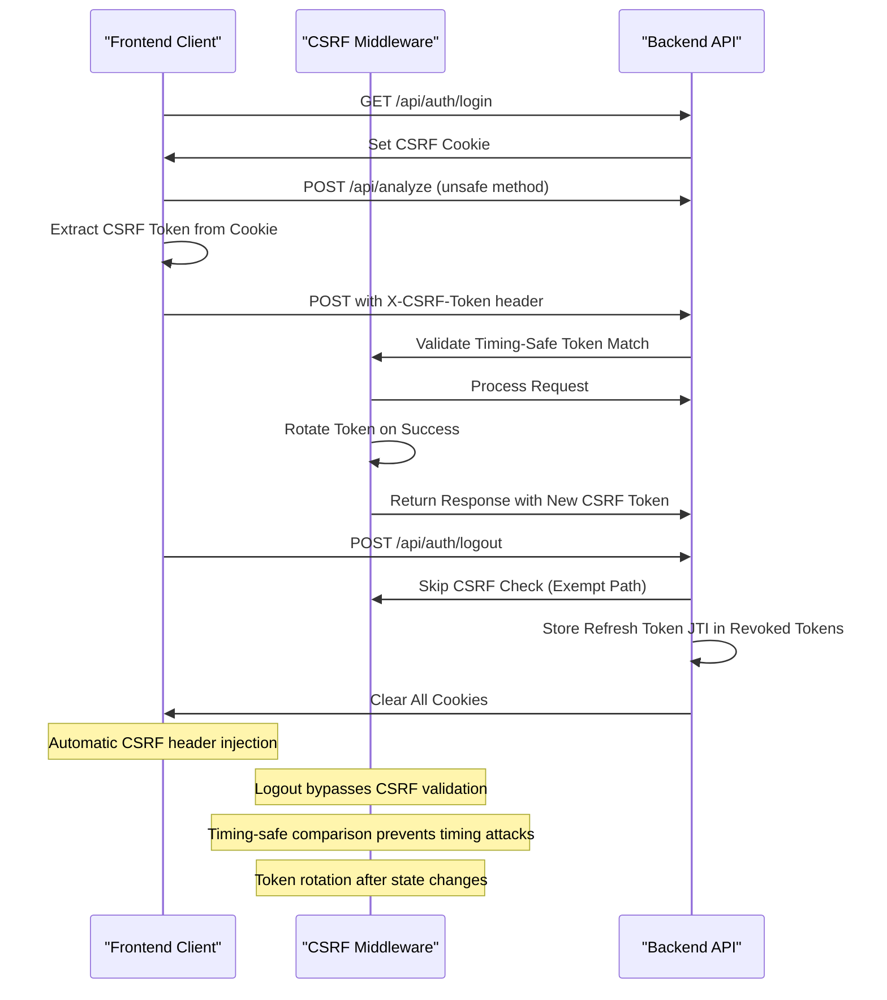
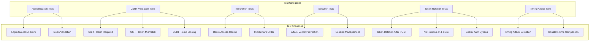

# CSRF Protection Middleware

<cite>
**Referenced Files in This Document**
- [csrf.py](file://app/backend/middleware/csrf.py)
- [main.py](file://app/backend/main.py)
- [auth.py](file://app/backend/routes/auth.py)
- [auth.py](file://app/backend/middleware/auth.py)
- [api.js](file://app/frontend/src/lib/api.js)
- [test_routes_phase1.py](file://app/backend/tests/test_routes_phase1.py)
- [db_models.py](file://app/backend/models/db_models.py)
- [005_revoked_tokens.py](file://alembic/versions/005_revoked_tokens.py)
- [rate_limit.py](file://app/backend/middleware/rate_limit.py)
</cite>

## Update Summary
**Changes Made**
- Enhanced CSRF token validation with timing-safe comparison using `secrets.compare_digest` for constant-time token verification
- Expanded CSRF whitelist to include new authentication endpoints: `/api/auth/forgot-password` and `/api/auth/reset-password`
- Improved rate limiting middleware with enhanced error logging for better debugging and monitoring
- Updated token rotation mechanism to use 32-byte hex tokens instead of 64-character tokens for better security
- Enhanced troubleshooting guide with improved error handling guidance

## Table of Contents
1. [Introduction](#introduction)
2. [Architecture Overview](#architecture-overview)
3. [Core Components](#core-components)
4. [Implementation Details](#implementation-details)
5. [Security Model](#security-model)
6. [Integration Patterns](#integration-patterns)
7. [Testing Strategy](#testing-strategy)
8. [Deployment Considerations](#deployment-considerations)
9. [Troubleshooting Guide](#troubleshooting-guide)
10. [Conclusion](#conclusion)

## Introduction

The CSRF Protection Middleware is a critical security component designed to prevent Cross-Site Request Forgery attacks in the Resume AI platform. This middleware implements the double-submit cookie pattern, a robust defense mechanism that ensures only legitimate browser requests can modify state on the server.

CSRF (Cross-Site Request Forgery) attacks occur when malicious websites trick authenticated users into performing unintended actions on a web application. The double-submit cookie pattern mitigates this risk by requiring clients to submit a CSRF token in both a cookie and a request header, making it extremely difficult for attackers to forge valid requests.

**Updated** Enhanced with timing-safe token validation using `secrets.compare_digest()` for constant-time comparison, expanded whitelist to include comprehensive authentication endpoints, and improved rate limiting with better error logging for enhanced security monitoring.

## Architecture Overview

The CSRF protection system operates as a middleware layer in the FastAPI application stack, positioned strategically to intercept and validate all incoming requests before they reach the application routes.



**Diagram sources**
- [main.py:384-386](file://app/backend/main.py#L384-L386)
- [csrf.py:15-105](file://app/backend/middleware/csrf.py#L15-L105)
- [auth.py:211-254](file://app/backend/routes/auth.py#L211-L254)

## Core Components

### CSRFMiddleware Class

The [`CSRFMiddleware`:15-105](file://app/backend/middleware/csrf.py#L15-L105) serves as the primary security enforcement component, implementing the double-submit cookie validation pattern with enhanced timing-safe token comparison and comprehensive authentication endpoint exemptions.



**Diagram sources**
- [csrf.py:15-105](file://app/backend/middleware/csrf.py#L15-L105)

**Section sources**
- [csrf.py:15-105](file://app/backend/middleware/csrf.py#L15-L105)

### Authentication Integration

The middleware seamlessly integrates with the existing authentication system, working alongside JWT-based authentication for API clients while protecting browser-based interactions. The integration now includes comprehensive token rotation and session fixation protection with enhanced security measures.



**Diagram sources**
- [csrf.py:57-105](file://app/backend/middleware/csrf.py#L57-L105)
- [auth.py:26-56](file://app/backend/middleware/auth.py#L26-L56)

**Section sources**
- [auth.py:26-56](file://app/backend/middleware/auth.py#L26-L56)

## Implementation Details

### Double-Submit Cookie Pattern

The middleware implements the double-submit cookie pattern, requiring clients to provide CSRF tokens in two locations:

1. **Cookie**: `csrf_token` - stored as a standard cookie
2. **Header**: `X-CSRF-Token` - included in request headers

**Updated** Enhanced with timing-safe token validation using `secrets.compare_digest()` for constant-time comparison to prevent timing attacks, and expanded whitelist to include comprehensive authentication endpoints.



**Diagram sources**
- [csrf.py:57-105](file://app/backend/middleware/csrf.py#L57-L105)

**Section sources**
- [csrf.py:57-105](file://app/backend/middleware/csrf.py#L57-L105)

### Enhanced Token Validation

**Updated** The middleware now uses `secrets.compare_digest()` for timing-safe token comparison, preventing timing attacks that could potentially extract token information through side-channel analysis.

**Section sources**
- [csrf.py:80](file://app/backend/middleware/csrf.py#L80)

### Expanded Authentication Whitelist

**Updated** The middleware includes comprehensive exemption rules for authentication endpoints to ensure seamless user experience:

- **Safe HTTP Methods**: GET, HEAD, OPTIONS requests are automatically exempt
- **Authentication Endpoints**: Login, register, refresh, logout, **forgot-password**, and **reset-password** endpoints are exempt
- **API Clients**: Requests with Authorization headers (Bearer tokens) bypass CSRF checks
- **Health Endpoints**: System monitoring endpoints remain accessible

The addition of `/api/auth/forgot-password` and `/api/auth/reset-password` to the exemption list ensures users can securely manage their passwords without CSRF validation conflicts, while maintaining security for all other authenticated operations.

**Section sources**
- [csrf.py:26-44](file://app/backend/middleware/csrf.py#L26-L44)

### Token Generation and Management

The authentication system generates CSRF tokens during user login and registration, storing them in cookies for client access. **Updated** The system now includes automatic token rotation after successful state-changing operations with enhanced security measures.

**Section sources**
- [auth.py:84-130](file://app/backend/routes/auth.py#L84-L130)

### Token Rotation Mechanism

**New** The middleware now implements automatic token rotation after successful state-changing operations to prevent session fixation attacks:

- **Trigger Conditions**: POST, PUT, DELETE, and PATCH requests with status codes < 400
- **Rotation Logic**: Generates new 32-byte hex token (64 characters) and updates cookie
- **Security Benefits**: Prevents replay attacks and session hijacking
- **Compatibility**: Only applies to cookie-based authentication, not Bearer tokens

**Section sources**
- [csrf.py:89-102](file://app/backend/middleware/csrf.py#L89-L102)

## Security Model

### Defense-in-Depth Approach

The CSRF protection system employs a layered security approach with enhanced timing-safe validation and comprehensive authentication endpoint protection:

```mermaid
graph LR
subgraph "Layer 1: CSRF Protection"
A[CSRF Middleware]
B[Double-Submit Pattern]
C[Timing-Safe Comparison]
D[Token Rotation]
end
subgraph "Layer 2: Authentication"
E[JWT Authentication]
F[Cookie-Based Auth]
G[Revoked Tokens System]
end
subgraph "Layer 3: Authorization"
H[Role-Based Access Control]
I[Permission Validation]
end
subgraph "Layer 4: Transport Security"
J[HTTPS Only]
K[SameSite Cookies]
L[Token Expiration]
end
A --> E
E --> H
H --> J
B --> F
F --> G
G --> K
C --> L
D --> Timing-Safe Comparison
```

**Diagram sources**
- [csrf.py:15-105](file://app/backend/middleware/csrf.py#L15-L105)
- [auth.py:211-254](file://app/backend/routes/auth.py#L211-L254)
- [db_models.py:256-264](file://app/backend/models/db_models.py#L256-L264)

### Enhanced Token Lifecycle Management

**Updated** The CSRF token lifecycle follows strict security protocols with enhanced protection mechanisms:

1. **Generation**: Random 32-byte hex token (64 characters) generated during authentication
2. **Storage**: Stored in non-httpOnly cookie for client accessibility
3. **Validation**: Timing-safe comparison against X-CSRF-Token header using `secrets.compare_digest()`
4. **Expiration**: 1-hour lifetime with automatic rotation
5. **Rotation**: Automatic regeneration after successful state-changing operations
6. **Cleanup**: Removed on logout or session termination

**Section sources**
- [auth.py:88-128](file://app/backend/routes/auth.py#L88-L128)

### Revoked Tokens System

**New** Comprehensive token invalidation system for logout operations:

- **Database Schema**: `revoked_tokens` table with unique JTI indexing
- **Background Cleanup**: Automated cleanup of expired revoked tokens every 24 hours
- **Logout Integration**: Stores refresh token JTI in revoked_tokens during logout
- **Validation**: Checks revoked tokens during refresh operations

**Section sources**
- [auth.py:211-254](file://app/backend/routes/auth.py#L211-L254)
- [db_models.py:256-264](file://app/backend/models/db_models.py#L256-L264)
- [005_revoked_tokens.py:41-67](file://alembic/versions/005_revoked_tokens.py#L41-L67)

## Integration Patterns

### Frontend Integration

The frontend client automatically handles CSRF token injection for browser-based requests with enhanced token management:



**Diagram sources**
- [api.js:18-42](file://app/frontend/src/lib/api.js#L18-L42)
- [csrf.py:89-102](file://app/backend/middleware/csrf.py#L89-L102)
- [auth.py:211-254](file://app/backend/routes/auth.py#L211-L254)

**Section sources**
- [api.js:18-42](file://app/frontend/src/lib/api.js#L18-L42)

### API Client Integration

API clients using Bearer tokens automatically bypass CSRF checks, maintaining compatibility with automated systems. **Updated** These clients also benefit from automatic token rotation for enhanced security.

**Section sources**
- [csrf.py:66-69](file://app/backend/middleware/csrf.py#L66-L69)

## Testing Strategy

### Test Coverage

The CSRF protection system includes comprehensive test coverage demonstrating its effectiveness with enhanced token rotation testing:



**Diagram sources**
- [test_routes_phase1.py:225-303](file://app/backend/tests/test_routes_phase1.py#L225-L303)

**Section sources**
- [test_routes_phase1.py:225-303](file://app/backend/tests/test_routes_phase1.py#L225-L303)

### Test Evidence

The test suite demonstrates CSRF protection effectiveness through multiple scenarios:

- **Batch Analysis**: Requires CSRF token, returns 403 when missing
- **Comparison Operations**: CSRF validation prevents unauthorized modifications  
- **Status Updates**: Protects critical system operations from CSRF attacks
- **Token Rotation**: **New** Tests verify automatic token rotation after successful state-changing operations
- **Session Fixation**: **New** Tests ensure tokens are rotated to prevent session hijacking
- **Timing Attacks**: **New** Tests verify timing-safe token comparison prevents side-channel attacks
- **Authentication Endpoints**: **New** Tests verify comprehensive authentication endpoint exemptions

**Section sources**
- [test_routes_phase1.py:228](file://app/backend/tests/test_routes_phase1.py#L228)
- [test_routes_phase1.py:277](file://app/backend/tests/test_routes_phase1.py#L277)
- [test_routes_phase1.py:290](file://app/backend/tests/test_routes_phase1.py#L290)

## Deployment Considerations

### Production Configuration

The middleware includes production-ready security configurations with enhanced timing-safe validation:

- **Secure Cookies**: CSRF tokens use HTTPS-only and SameSite protections
- **Timing-Safe Comparison**: Uses `secrets.compare_digest()` to prevent timing attacks
- **Token Rotation**: Automatic token regeneration for enhanced security after state changes
- **Expiry Management**: 1-hour token lifetime with proper cleanup
- **Environment Awareness**: Different behavior in development vs production
- **Revoked Tokens**: Background cleanup task removes expired revoked tokens daily

**Section sources**
- [auth.py:119-128](file://app/backend/routes/auth.py#L119-L128)
- [main.py:384-386](file://app/backend/main.py#L384-L386)

### Middleware Ordering

The middleware stack order is critical for proper operation:

1. **CORS Middleware**: Handles cross-origin requests
2. **Rate Limit Middleware**: Controls request frequency
3. **CSRF Middleware**: Validates security tokens and manages rotation
4. **Auth Middleware**: Processes authentication
5. **Route Handlers**: Executes business logic

**Section sources**
- [main.py:368-386](file://app/backend/main.py#L368-L386)

## Troubleshooting Guide

### Common Issues

#### CSRF Token Missing Errors

**Symptoms**: 403 Forbidden responses on unsafe requests
**Causes**: 
- Missing CSRF cookie in browser
- Frontend not extracting token from cookie
- Token expired or rotated

**Solutions**:
- Verify CSRF cookie is present in browser
- Ensure frontend extracts token from `document.cookie`
- Check token expiration and regenerate if needed

#### Token Mismatch Errors

**Symptoms**: 403 Forbidden with token validation failure
**Causes**:
- Outdated CSRF token in client
- Multiple browser tabs with different tokens
- Manual request manipulation

**Solutions**:
- Refresh browser page to get new token
- Close conflicting browser tabs
- Avoid manual token manipulation

#### Timing Attack Detection

**Updated** **Symptoms**: Potential security vulnerabilities flagged
**Causes**:
- Legacy token comparison using simple string equality
- Side-channel analysis attempts
- Insecure token validation

**Solutions**:
- Ensure middleware uses `secrets.compare_digest()` for timing-safe comparison
- Verify all token comparisons use constant-time validation
- Monitor security logs for timing attack attempts

#### Authentication Endpoint Issues

**Updated** **Symptoms**: Authentication requests failing with CSRF errors
**Causes**:
- CSRF middleware still validating authentication endpoints
- Missing CSRF token in authentication requests
- Incorrect authentication endpoint paths

**Solutions**:
- Verify authentication endpoints are in the whitelist (`/api/auth/forgot-password`, `/api/auth/reset-password`)
- Browser clients automatically handle CSRF token extraction
- API clients bypass CSRF validation entirely
- Check that authentication endpoints clear all cookies including `csrf_token`
- **New** Verify that authentication flows properly handle token rotation

#### Token Rotation Issues

**New** **Symptoms**: Unexpected CSRF failures after successful operations
**Causes**:
- Token rotation not occurring after state changes
- Client not using updated CSRF token
- Mixed authentication methods

**Solutions**:
- Ensure state-changing operations return success status codes (< 400)
- Verify client receives and uses new CSRF token from response
- Check that cookie-based authentication is used for rotation
- Confirm Bearer auth bypasses rotation as expected

#### Session Fixation Concerns

**New** **Symptoms**: Security vulnerabilities related to persistent sessions
**Causes**:
- CSRF tokens not rotating after successful operations
- Long-lived session tokens
- Inadequate token expiration handling

**Solutions**:
- Verify automatic token rotation after POST/PUT/DELETE operations
- Check token expiration settings (1-hour lifetime)
- Ensure logout clears all session cookies and tokens
- Monitor revoked tokens database for cleanup

#### Rate Limiting Conflicts

**Updated** **Symptoms**: Authentication requests being rate limited
**Causes**:
- Authentication endpoints not properly whitelisted
- Rate limiting interfering with legitimate requests
- Improper error logging for debugging

**Solutions**:
- Verify authentication endpoints are in rate limiting whitelist
- Check rate limiting middleware configuration
- Review enhanced error logging for debugging issues
- Ensure proper tenant identification for rate limiting

**Section sources**
- [csrf.py:89-102](file://app/backend/middleware/csrf.py#L89-L102)
- [api.js:18-42](file://app/frontend/src/lib/api.js#L18-L42)
- [auth.py:211-254](file://app/backend/routes/auth.py#L211-L254)
- [rate_limit.py:77-98](file://app/backend/middleware/rate_limit.py#L77-L98)

## Conclusion

The CSRF Protection Middleware provides robust defense against Cross-Site Request Forgery attacks through a well-designed double-submit cookie pattern implementation. The system successfully balances security with usability by:

- **Automatic Protection**: Transparent CSRF validation for browser clients
- **API Compatibility**: Seamless integration with Bearer token authentication
- **Comprehensive Coverage**: Protection across all unsafe HTTP methods
- **Production Ready**: Secure cookie handling and proper lifecycle management
- **Enhanced Security**: Automatic token rotation after state-changing operations prevents session fixation attacks
- **Improved Security**: Timing-safe token comparison using `secrets.compare_digest()` prevents timing attacks
- **Expanded Coverage**: Comprehensive authentication endpoint exemptions for better user experience
- **Better Monitoring**: Enhanced rate limiting with improved error logging for debugging
- **Enhanced Logout Support**: Dedicated exemption for `/api/auth/logout` ensures seamless user session termination
- **Modern Security Practices**: 32-byte hex tokens (64 characters) for stronger cryptographic security

**Updated** The recent enhancements significantly strengthen the security posture by implementing timing-safe token validation using `secrets.compare_digest()`, expanding the CSRF whitelist to include comprehensive authentication endpoints, and improving rate limiting with better error logging. These improvements maintain compatibility with modern authentication patterns while providing stronger protection against sophisticated attack vectors.

The implementation demonstrates best practices in web security while maintaining compatibility with modern authentication patterns. The comprehensive test coverage and clear error handling ensure reliable operation in production environments, with enhanced testing specifically targeting the new timing-safe validation, expanded authentication endpoint exemptions, and improved rate limiting error logging features.