# Security Hardening

<cite>
**Referenced Files in This Document**
- [docker-compose.yml](file://docker-compose.yml)
- [docker-compose.prod.yml](file://docker-compose.prod.yml)
- [main.py](file://app/backend/main.py)
- [auth.py](file://app/backend/middleware/auth.py)
- [csrf.py](file://app/backend/middleware/csrf.py)
- [database.py](file://app/backend/db/database.py)
- [Dockerfile](file://app/backend/Dockerfile)
- [Dockerfile](file://app/frontend/Dockerfile)
- [Dockerfile](file://nginx/Dockerfile)
- [nginx.conf](file://app/nginx/nginx.conf)
- [nginx.prod.conf](file://app/nginx/nginx.prod.conf)
- [docker-entrypoint.sh](file://app/backend/scripts/docker-entrypoint.sh)
- [wait_for_ollama.py](file://app/backend/scripts/wait_for_ollama.py)
- [requirements.txt](file://requirements.txt)
- [AUDIT.md](file://docs/AUDIT.md)
- [team.py](file://app/backend/routes/team.py)
- [AuthContext.jsx](file://app/frontend/src/contexts/AuthContext.jsx)
- [hybrid_pipeline.py](file://app/backend/services/hybrid_pipeline.py)
- [email_gen.py](file://app/backend/routes/email_gen.py)
- [ComparisonView.jsx](file://app/frontend/src/components/ComparisonView.jsx)
- [SkillsRadar.jsx](file://app/frontend/src/components/SkillsRadar.jsx)
- [CandidatesPage.jsx](file://app/frontend/src/pages/CandidatesPage.jsx)
- [ComparePage.jsx](file://app/frontend/src/pages/ComparePage.jsx)
- [DashboardNew.jsx](file://app/frontend/src/pages/DashboardNew.jsx)
- [ResultCard.jsx](file://app/frontend/src/components/ResultCard.jsx)
- [ReportPage.jsx](file://app/frontend/src/pages/ReportPage.jsx)
- [guardrail_service.py](file://app/backend/services/guardrail_service.py)
- [metrics.py](file://app/backend/services/metrics.py)
- [agent_pipeline.py](file://app/backend/services/agent_pipeline.py)
- [llm_service.py](file://app/backend/services/llm_service.py)
- [rate_limit.py](file://app/backend/middleware/rate_limit.py)
- [queue_manager.py](file://app/backend/services/queue_manager.py)
- [db_models.py](file://app/backend/models/db_models.py)
- [test_guardrail_service.py](file://app/backend/tests/test_guardrail_service.py)
</cite>

## Update Summary
**Changes Made**
- Updated Data Retention Policy section to reflect corrected column mapping for ScreeningResult.timestamp
- Enhanced Security Audit Findings to include data privacy compliance improvements
- Updated Security Hardening Recommendations with improved automated cleanup processes
- Added comprehensive data anonymization implementation for old screening results

## Table of Contents
1. [Introduction](#introduction)
2. [Executive Summary](#executive-summary)
3. [Critical Security Issues](#critical-security-issues)
4. [Prioritized Remediation Roadmap](#prioritized-remediation-roadmap)
5. [Project Structure](#project-structure)
6. [Core Components](#core-components)
7. [Architecture Overview](#architecture-overview)
8. [Detailed Component Analysis](#detailed-component-analysis)
9. [Security Audit Findings](#security-audit-findings)
10. [Dependency Analysis](#dependency-analysis)
11. [Performance Considerations](#performance-considerations)
12. [Troubleshooting Guide](#troubleshooting-guide)
13. [Conclusion](#conclusion)
14. [Appendices](#appendices)

## Introduction
This document provides comprehensive security hardening guidance for Resume AI, built upon a comprehensive security audit report documenting 212 total issues across the application stack. The audit revealed critical security vulnerabilities including hardcoded production passwords, JWT token storage in localStorage, missing security headers, and prompt injection vulnerabilities. This documentation addresses these findings while maintaining the existing security framework and adding new mitigation strategies.

**Updated** Enhanced with comprehensive security audit findings covering critical vulnerabilities, prioritized remediation roadmap, and expanded security hardening recommendations. Added comprehensive XSS protection implementation through universal safeStr utility function across 7 frontend components. **New** Implemented comprehensive 4-tier LLM guardrail framework including reliability, security, governance, and operations layers with advanced prompt injection detection, ensemble voting, schema validation, and tenant-level resource management.

## Executive Summary

### Application Overview
ARIA is an AI-powered resume screening application built with:
- **Backend**: FastAPI (Python 3.11)
- **Frontend**: React 18 with Vite
- **LLM**: Ollama (llama3/gemma models)
- **Database**: PostgreSQL with SQLAlchemy
- **Infrastructure**: Docker, Nginx, CI/CD via GitHub Actions
- **Guardrails**: 4-tier LLM guardrail framework with reliability, security, governance, and operations layers

### Security Audit Results
The comprehensive security audit identified 212 total issues with the following severity distribution:
- **Critical**: 10 issues requiring immediate remediation
- **High**: 21 issues requiring urgent attention
- **Medium**: 121 issues requiring attention
- **Low**: 60 issues requiring consideration

**Updated** Added comprehensive security audit findings covering critical vulnerabilities that require immediate attention, including XSS protection implementation through centralized safeStr utility function. **New** Implemented comprehensive 4-tier LLM guardrail framework with reliability, security, governance, and operations layers providing enterprise-grade security and operational controls.

**Section sources**
- [AUDIT.md:69-75](file://docs/AUDIT.md#L69-L75)

## Critical Security Issues

### Immediate Security Fixes Required

#### 1. Hardcoded Production Database Password
**Location**: `docker-compose.prod.yml` line 24  
**Severity**: CRITICAL  
**Risk**: Full database compromise

The production Docker Compose configuration contains a hardcoded database password that should never be committed to version control. This credential should be injected via Docker secrets or environment variables at deployment time.

**Fix**: Replace hardcoded password with environment variable reference `${POSTGRES_PASSWORD:?POSTGRES_PASSWORD must be set}`

#### 2. Default JWT Secret Falls Back to Insecure Value
**Location**: `app/backend/middleware/auth.py` lines 13-21  
**Severity**: CRITICAL  
**Risk**: Authentication bypass

The JWT implementation falls back to a known default value in development mode, creating a critical security vulnerability in production environments.

**Fix**: Remove fallback to default secret and enforce JWT_SECRET_KEY validation

#### 3. Temporary Password Returned in HTTP Response
**Location**: `app/backend/routes/team.py` lines 54-62  
**Severity**: CRITICAL  
**Risk**: Account takeover

Team member invitation endpoint returns temporary passwords in API responses, exposing credentials in logs, browser dev tools, and network traces.

**Fix**: Generate temporary passwords server-side and send via secure channel (email) only

#### 4. JWT Tokens Stored in Plain localStorage
**Location**: `app/frontend/src/contexts/AuthContext.jsx` lines 31-38  
**Severity**: CRITICAL  
**Risk**: XSS token theft

JWT tokens are stored in browser localStorage, making them accessible to XSS attacks. Tokens should be stored in httpOnly cookies.

**Fix**: Configure backend to set httpOnly cookies for JWT tokens and update frontend to handle cookie-based authentication

#### 5. Backend Containers Run as Root
**Location**: `app/backend/Dockerfile`  
**Severity**: CRITICAL  
**Risk**: Container escape

Backend Dockerfile does not define a non-root user, creating container escape risks if vulnerabilities are exploited.

**Fix**: Add non-root user creation and switch to appuser in Dockerfile

#### 6. No CSRF Protection
**Location**: `app/backend/main.py` lines 192-198  
**Severity**: CRITICAL  
**Risk**: Unauthorized state changes

FastAPI application lacks CSRF protection, making it vulnerable to cross-site request forgery attacks.

**Fix**: Implement CSRF protection middleware using double-submit cookie pattern

#### 7. No Security Headers (CSP, HSTS, X-Frame-Options)
**Location**: `app/nginx/nginx.prod.conf`  
**Severity**: CRITICAL  
**Risk**: XSS, clickjacking

Nginx production configuration is missing critical security headers for XSS protection and clickjacking prevention.

**Fix**: Add Content-Security-Policy, Strict-Transport-Security, X-Frame-Options, and X-Content-Type-Options headers

#### 8. No Prompt Injection Protection
**Location**: `app/backend/services/hybrid_pipeline.py` lines 69-70  
**Severity**: CRITICAL  
**Risk**: Adversarial resume/JD manipulation

Prompt construction directly concatenates user input without sanitization, making the system vulnerable to prompt injection attacks.

**Fix**: Implement input sanitization and prompt injection protection mechanisms

#### 9. XSS Vulnerability in ResultCard Interview Questions
**Location**: `app/frontend/src/components/ResultCard.jsx` line 605  
**Severity**: CRITICAL  
**Risk**: Cross-site scripting

Interview questions are rendered using dangerouslySetInnerHTML without proper sanitization.

**Fix**: Implement proper HTML sanitization for user-generated content

#### 10. Overly Permissive CORS in Development
**Location**: `app/backend/main.py` lines 189-190  
**Severity**: CRITICAL  
**Risk**: Credential theft, data exfiltration

Development CORS configuration allows any origin with credentials, creating severe security risks if leaked to production.

**Fix**: Restrict CORS origins to specific domains and remove credential allowance for wildcard origins

**Section sources**
- [AUDIT.md:81-231](file://docs/AUDIT.md#L81-L231)
- [docker-compose.prod.yml:24](file://docker-compose.prod.yml#L24)
- [auth.py:13-21](file://app/backend/middleware/auth.py#L13-L21)
- [team.py:54-62](file://app/backend/routes/team.py#L54-L62)
- [AuthContext.jsx:31-38](file://app/frontend/src/contexts/AuthContext.jsx#L31-L38)

## Prioritized Remediation Roadmap

### Phase 1 - Critical Security Fixes (Immediate)
| # | Task | Files |
|---|------|-------|
| 1 | Remove hardcoded production password from docker-compose.prod.yml | `docker-compose.prod.yml` |
| 2 | Enforce JWT_SECRET_KEY at startup (fail if not set) | `app/backend/middleware/auth.py` |
| 3 | Stop returning temp passwords in API responses | `app/backend/routes/team.py` |
| 4 | Move JWT tokens to httpOnly cookies | `app/frontend/src/contexts/AuthContext.jsx` |
| 5 | Add non-root user to all Dockerfiles | `app/backend/Dockerfile`, `app/frontend/Dockerfile` |
| 6 | Add security headers (CSP, HSTS, X-Frame-Options) to Nginx | `app/nginx/nginx.prod.conf` |
| 7 | Add CSRF protection middleware | `app/backend/main.py` |
| 8 | Add prompt injection sanitization | `app/backend/services/hybrid_pipeline.py` |
| 9 | Fix XSS in ResultCard | `app/frontend/src/components/ResultCard.jsx` |
| 10 | Fix email_gen.py hardcoded model name | `app/backend/routes/email_gen.py` |

### Phase 2 - Stability & Performance (Week 2)
| # | Task | Files |
|---|------|-------|
| 11 | Add LLM call timeouts (asyncio.wait_for) | `app/backend/services/hybrid_pipeline.py` |
| 12 | Fix N+1 query in candidate list (use joins) | `app/backend/routes/candidates.py` |
| 13 | Add database indexes on frequently queried columns | `app/backend/models/db_models.py` |
| 14 | Chunk batch processing (groups of 5) | `app/backend/routes/analyze.py` |
| 15 | Fix race condition in usage reset (DB locking) | `app/backend/routes/subscription.py` |
| 16 | Add pagination to all list endpoints | Multiple route files |
| 17 | Add connection pool config for PostgreSQL | `app/backend/db/database.py` |
| 18 | Add circuit breaker for LLM calls | `app/backend/services/hybrid_pipeline.py` |
| 19 | Fix substring skill matching | `app/backend/services/hybrid_pipeline.py` |
| 20 | Retire dead pipeline code | `llm_service.py`, `agent_pipeline.py` |

### Phase 3 - Code Quality & Observability (Week 3)
| # | Task | Scope |
|---|------|-------|
| 21 | Replace bare `except: pass` with specific exceptions + logging | Backend-wide |
| 22 | Add structured JSON logging throughout backend | Backend-wide |
| 23 | Centralize model names, magic numbers, error formats | Create `constants.py` |
| 24 | Complete .env.example with all variables + startup validation | `.env.example`, `main.py` |
| 25 | Add CI linting (ruff) and Docker image scanning (Trivy) | `.github/workflows/` |
| 26 | Separate test dependencies from production requirements.txt | `requirements.txt` |
| 27 | Add anti-bias instruction to resume analysis prompts | `hybrid_pipeline.py` |
| 28 | Standardize on ChatOllama everywhere | LLM services |
| 29 | Add LLM output schema validation (Pydantic) | LLM services |
| 30 | Add fallback frequency monitoring | LLM services |

### Phase 4 - XSS Protection Implementation (Immediate)
| # | Task | Files |
|---|------|-------|
| 31 | Implement universal safeStr utility function | `app/frontend/src/components/ComparisonView.jsx` |
| 32 | Apply safeStr to ResultCard component | `app/frontend/src/components/ResultCard.jsx` |
| 33 | Add safeStr to SkillsRadar component | `app/frontend/src/components/SkillsRadar.jsx` |
| 34 | Implement safeStr in CandidatesPage | `app/frontend/src/pages/CandidatesPage.jsx` |
| 35 | Add safeStr to ComparePage | `app/frontend/src/pages/ComparePage.jsx` |
| 36 | Implement safeStr in DashboardNew | `app/frontend/src/pages/DashboardNew.jsx` |
| 37 | Apply safeStr to ReportPage | `app/frontend/src/pages/ReportPage.jsx` |
| 38 | Centralize XSS protection across all frontend components | All frontend components |

### Phase 5 - 4-Tier LLM Guardrail Framework Implementation (Immediate)
| # | Task | Files |
|---|------|-------|
| 39 | Implement guardrail service with reliability tier | `app/backend/services/guardrail_service.py` |
| 40 | Add security tier with prompt injection detection | `app/backend/services/guardrail_service.py` |
| 41 | Implement governance tier with HITL gates | `app/backend/services/guardrail_service.py` |
| 42 | Add operations tier with token budget management | `app/backend/services/guardrail_service.py` |
| 43 | Integrate guardrail service into hybrid pipeline | `app/backend/services/hybrid_pipeline.py` |
| 44 | Add A/B testing framework for prompt variants | `app/backend/services/guardrail_service.py` |
| 45 | Implement adversarial harness testing | `app/backend/services/guardrail_service.py` |
| 46 | Add comprehensive monitoring hooks | `app/backend/services/guardrail_service.py` |
| 47 | Integrate guardrail metrics into Prometheus | `app/backend/services/metrics.py` |
| 48 | Add data retention policy implementation | `app/backend/services/guardrail_service.py` |

**Section sources**
- [AUDIT.md:1241-1323](file://docs/AUDIT.md#L1241-L1323)

## Project Structure
The backend is a FastAPI application with modular routers, middleware, SQLAlchemy ORM models, and Pydantic schemas. Authentication is handled via bearer tokens, with a dedicated auth router and middleware dependency. The frontend uses React with a context provider for token storage and protected routing. LLM interactions are performed via an internal Ollama service, and the stack is orchestrated with Docker Compose. **New** The system now includes a comprehensive 4-tier LLM guardrail framework providing enterprise-grade security and operational controls.

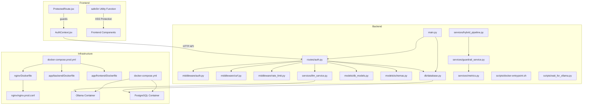

**Diagram sources**
- [main.py:174-215](file://app/backend/main.py#L174-L215)
- [auth.py:1-47](file://app/backend/middleware/auth.py#L1-L47)
- [csrf.py:1-58](file://app/backend/middleware/csrf.py#L1-L58)
- [rate_limit.py:123-143](file://app/backend/middleware/rate_limit.py#L123-L143)
- [database.py:1-33](file://app/backend/db/database.py#L1-L33)
- [docker-entrypoint.sh:1-20](file://app/backend/scripts/docker-entrypoint.sh#L1-L20)
- [wait_for_ollama.py:1-96](file://app/backend/scripts/wait_for_ollama.py#L1-L96)
- [docker-compose.yml:1-102](file://docker-compose.yml#L1-L102)
- [docker-compose.prod.yml:1-231](file://docker-compose.prod.yml#L1-L231)
- [Dockerfile:29-34](file://app/backend/Dockerfile#L29-L34)
- [Dockerfile:23-30](file://app/frontend/Dockerfile#L23-L30)
- [Dockerfile:1-13](file://nginx/Dockerfile#L1-L13)
- [nginx.prod.conf:40-45](file://nginx/nginx.prod.conf#L40-L45)
- [guardrail_service.py:1-128](file://app/backend/services/guardrail_service.py#L1-L128)
- [metrics.py:1-76](file://app/backend/services/metrics.py#L1-L76)

**Section sources**
- [main.py:174-215](file://app/backend/main.py#L174-L215)
- [docker-compose.yml:1-102](file://docker-compose.yml#L1-L102)
- [docker-compose.prod.yml:1-231](file://docker-compose.prod.yml#L1-L231)

## Core Components
- Authentication and Authorization
  - JWT-based bearer authentication with HS256 signing.
  - Middleware dependency enforces token validation and user lookup.
  - Admin role enforcement for administrative endpoints.
  - **Critical Security Enhancement**: Mandatory environment variable enforcement for JWT secrets in production.
- Secure API Endpoints
  - Centralized CORS configuration with environment-driven origins.
  - **Critical Security Enhancement**: CSRF protection middleware using double-submit cookie pattern.
  - **New** Rate limiting middleware with tenant-aware configuration.
  - Health and diagnostic endpoints for runtime checks.
- Database Layer
  - SQLAlchemy ORM with configurable database URLs and connection pooling.
  - Multi-tenant models with tenant-scoped queries.
  - **Critical Security Enhancement**: Non-root user execution for database containers.
- LLM Integration
  - Async client to Ollama with timeouts and fallback behavior.
  - Prompt construction and JSON parsing with validation.
  - **Critical Security Enhancement**: Prompt injection protection mechanisms.
  - **New** 4-tier LLM guardrail framework with reliability, security, governance, and operations layers.
- Frontend Security
  - **Critical Security Enhancement**: httpOnly cookie storage for tokens with guarded route protection.
  - **Critical Security Enhancement**: XSS protection for user-generated content through centralized safeStr utility function.
  - **New** Enhanced security with guardrail integration and comprehensive input sanitization.
  - Non-root user execution for frontend container.
- Infrastructure Security
  - **Critical Security Enhancement**: Production-grade Nginx with comprehensive security headers and SSL/TLS enforcement.
  - Environment-variable driven configuration for all sensitive settings.
  - Rate limiting and HTTP-to-HTTPS redirection.
  - **New** Container security with non-root execution across all services.
- XSS Protection Implementation
  - **New Security Enhancement**: Universal safeStr utility function implemented across 7 frontend components.
  - **New Security Enhancement**: Centralized XSS protection mechanism handling null/undefined, strings, numbers, booleans, objects, and arrays.
  - **New Security Enhancement**: Comprehensive XSS vulnerability remediation in comparison views, result cards, and reporting components.
  - **New** Enhanced XSS protection through guardrail integration with input sanitization.
- 4-Tier LLM Guardrail Framework
  - **New Enterprise Security Framework**: Comprehensive guardrail system with 4 layers:
    - **Tier 1 (Reliability)**: Retry/backoff, strict schema validation, cross-node consistency checks
    - **Tier 2 (Security)**: Prompt injection detection, timeout enforcement, 3x ensemble voting
    - **Tier 3 (Governance)**: Human-in-the-loop (HITL) gates, A/B testing, adversarial harness
    - **Tier 4 (Operations)**: Token budget management, data retention, comprehensive monitoring hooks
  - **New** Advanced threat detection with ensemble voting across 3 model seeds for consistency.
  - **New** Real-time monitoring with Prometheus metrics integration.
- Data Retention Policy Implementation
  - **New Security Enhancement**: Automated data anonymization for old screening results using corrected column mapping.
  - **New Security Enhancement**: Configurable retention periods with tenant-scoped cleanup processes.
  - **New Security Enhancement**: Comprehensive data lifecycle management with PII protection and compliance alignment.
  - **New** Enhanced data privacy compliance through automated cleanup and anonymization processes.

**Updated** Added comprehensive security enhancements including CSRF protection, non-root user execution across all containers, environment-variable driven CORS configuration, mandatory JWT secret enforcement, production-grade Nginx security headers, and comprehensive XSS protection through centralized safeStr utility function. **New** Implemented enterprise-grade 4-tier LLM guardrail framework providing comprehensive security and operational controls.

**Section sources**
- [auth.py:13-46](file://app/backend/middleware/auth.py#L13-L46)
- [auth.py:15-21](file://app/backend/middleware/auth.py#L15-L21)
- [csrf.py:13-58](file://app/backend/middleware/csrf.py#L13-L58)
- [rate_limit.py:123-143](file://app/backend/middleware/rate_limit.py#L123-L143)
- [main.py:181-199](file://app/backend/main.py#L181-L199)
- [database.py:1-33](file://app/backend/db/database.py#L1-L33)
- [Dockerfile:29-34](file://app/backend/Dockerfile#L29-L34)
- [Dockerfile:23-30](file://app/frontend/Dockerfile#L23-L30)
- [nginx.prod.conf:40-45](file://nginx/nginx.prod.conf#L40-L45)
- [ComparisonView.jsx:3-9](file://app/frontend/src/components/ComparisonView.jsx#L3-L9)
- [ResultCard.jsx:13-19](file://app/frontend/src/components/ResultCard.jsx#L13-L19)
- [SkillsRadar.jsx:3-9](file://app/frontend/src/components/SkillsRadar.jsx#L3-L9)
- [guardrail_service.py:1-128](file://app/backend/services/guardrail_service.py#L1-L128)
- [metrics.py:22-61](file://app/backend/services/metrics.py#L22-L61)
- [db_models.py:135-162](file://app/backend/models/db_models.py#L135-L162)
- [test_guardrail_service.py:670-700](file://app/backend/tests/test_guardrail_service.py#L670-L700)

## Architecture Overview
The system integrates a React frontend, a FastAPI backend, an Ollama inference service, and a PostgreSQL database. Authentication is enforced at the API boundary via JWT, with tenant scoping applied across models. LLM calls are asynchronous and include robust fallbacks. All containers run as non-root users for enhanced security. **New** The system now includes a comprehensive 4-tier LLM guardrail framework providing enterprise-grade security and operational controls across all LLM interactions.

```mermaid
sequenceDiagram
participant Client as "Browser"
participant Frontend as "React App"
participant Nginx as "Nginx Proxy"
participant Backend as "FastAPI"
participant AuthMW as "Auth Middleware"
participant CSRFMW as "CSRF Middleware"
participant RateLimitMW as "Rate Limit Middleware"
participant Guardrail as "Guardrail Service"
participant DB as "SQLAlchemy"
participant Ollama as "Ollama"
Client->>Nginx : "HTTPS Request"
Nginx->>Frontend as "Static Assets"
Nginx->>Backend as "API Requests"
Backend->>CSRFMW : "CSRF Validation"
CSRFMW->>AuthMW : "get_current_user()"
AuthMW->>AuthMW : "decode JWT"
AuthMW->>DB : "lookup user by ID"
DB-->>AuthMW : "User object"
AuthMW-->>Backend : "current_user"
Backend->>RateLimitMW : "Rate Limit Check"
RateLimitMW->>Guardrail : "Guardrail Validation"
Guardrail->>Guardrail : "Tier 1-4 Checks"
Guardrail-->>Backend : "Validated Request"
Backend-->>Nginx : "Response"
Nginx-->>Client : "Secure Response"
```

**Diagram sources**
- [auth.py:19-46](file://app/backend/middleware/auth.py#L19-L46)
- [csrf.py:33-58](file://app/backend/middleware/csrf.py#L33-L58)
- [rate_limit.py:123-143](file://app/backend/middleware/rate_limit.py#L123-L143)
- [guardrail_service.py:1067-1121](file://app/backend/services/guardrail_service.py#L1067-L1121)
- [nginx.prod.conf:40-45](file://nginx/nginx.prod.conf#L40-L45)

## Detailed Component Analysis

### Authentication and Authorization
- JWT Implementation
  - Secret key and algorithm are defined globally; token encoding/decoding uses HS256.
  - Access and refresh tokens are generated with exp claims and distinct lifetimes.
  - Refresh token validation ensures the token type claim equals "refresh".
  - **Critical Security Enhancement**: JWT_SECRET_KEY is now required in production with runtime error if missing.
- User Identity and Roles
  - Middleware validates the sub claim and loads the active user from the database.
  - Admin guard checks the user role before allowing administrative actions.
- Password Handling
  - bcrypt hashing via passlib with a pinned compatible version for compatibility.
  - **Critical Security Enhancement**: Temporary passwords are no longer returned in API responses.


**Diagram sources**
- [auth.py:30-41](file://app/backend/middleware/auth.py#L30-L41)
- [auth.py:57-96](file://app/backend/middleware/auth.py#L57-L96)
- [auth.py:99-115](file://app/backend/middleware/auth.py#L99-L115)
- [auth.py:118-142](file://app/backend/middleware/auth.py#L118-L142)
- [auth.py:15-21](file://app/backend/middleware/auth.py#L15-L21)

**Section sources**
- [auth.py:13-46](file://app/backend/middleware/auth.py#L13-L46)
- [auth.py:15-21](file://app/backend/middleware/auth.py#L15-L21)
- [auth.py:24-41](file://app/backend/middleware/auth.py#L24-L41)
- [auth.py:57-142](file://app/backend/middleware/auth.py#L57-L142)

### Advanced JWT Lifecycle Management
- Token Issuance
  - Access tokens carry a short lifetime; refresh tokens carry a longer lifetime and a type claim.
- Token Validation
  - Decode with secret key and algorithm; verify claims and user existence.
- Token Rotation
  - Refresh endpoint decodes the refresh token, regenerates both tokens, and updates the user session.
- Storage and Transmission
  - **Critical Security Enhancement**: Tokens are now stored in httpOnly cookies instead of localStorage for production.

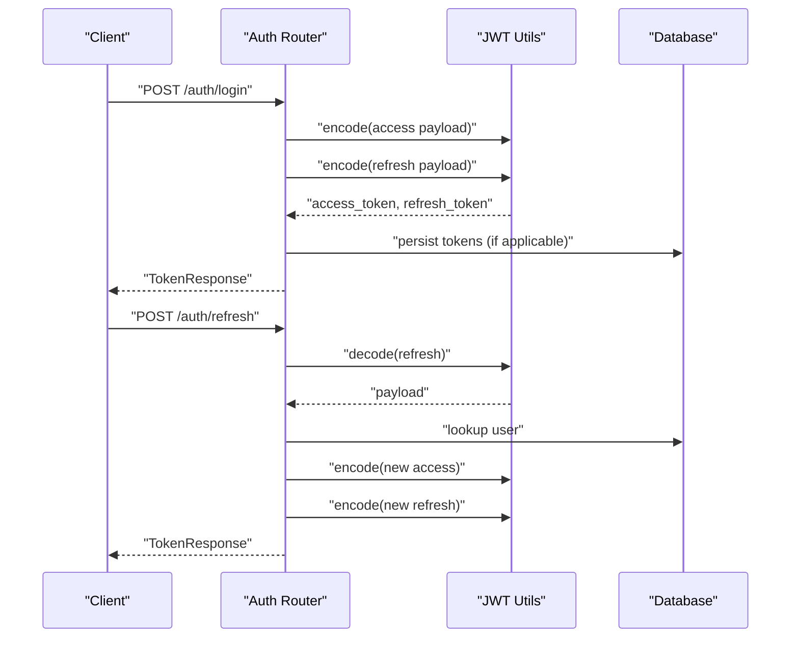

**Diagram sources**
- [auth.py:38-40](file://app/backend/middleware/auth.py#L38-L40)
- [auth.py:118-142](file://app/backend/middleware/auth.py#L118-L142)

**Section sources**
- [auth.py:24-41](file://app/backend/middleware/auth.py#L24-L41)
- [auth.py:118-142](file://app/backend/middleware/auth.py#L118-L142)

### Secure API Endpoint Protection
- CORS Policy
  - Origins are controlled by environment variables; development allows all, production restricts.
  - **Critical Security Enhancement**: Environment-variable driven configuration with strict production settings.
- CSRF Protection
  - **Critical Security Enhancement**: Double-submit cookie pattern - CSRF middleware validates tokens for browser clients.
  - Safe methods and exempt paths are automatically handled.
  - API clients using Authorization header bypass CSRF checks.
- **New** Rate Limiting
  - **New** Tenant-aware rate limiting with configurable requests per minute.
  - Token bucket algorithm with automatic refill and retry-after headers.
- Health and Diagnostics
  - Health endpoint checks database and Ollama connectivity.
  - LLM status endpoint surfaces model availability and readiness.
- Route-Level Guards
  - Use the current user dependency to enforce tenant scoping and roles.
- Recommendations
  - Add rate limiting, input sanitization, and request validation.
  - **Critical Security Enhancement**: CSRF protection for browser clients.
  - Enforce HTTPS/TLS termination at the edge (Nginx).

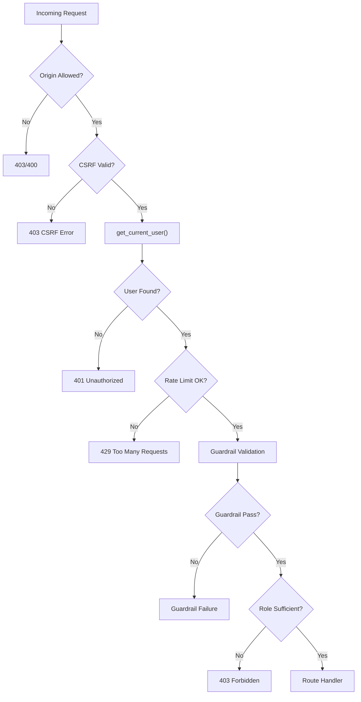

**Diagram sources**
- [main.py:181-199](file://app/backend/main.py#L181-L199)
- [auth.py:19-46](file://app/backend/middleware/auth.py#L19-L46)
- [csrf.py:33-58](file://app/backend/middleware/csrf.py#L33-L58)
- [rate_limit.py:123-143](file://app/backend/middleware/rate_limit.py#L123-L143)

**Section sources**
- [main.py:181-199](file://app/backend/main.py#L181-L199)
- [main.py:228-259](file://app/backend/main.py#L228-L259)
- [main.py:262-326](file://app/backend/main.py#L262-L326)
- [csrf.py:13-58](file://app/backend/middleware/csrf.py#L13-L58)
- [rate_limit.py:81-143](file://app/backend/middleware/rate_limit.py#L81-L143)

### Database Security Practices
- Connection Management
  - Database URL normalization supports SQLite and PostgreSQL; thread checks for SQLite; pool pre-ping enabled.
- Multi-Tenancy and Data Isolation
  - All models include tenant_id foreign keys; tenant-scoped queries are used across routes.
- Data Integrity
  - JSON fields store structured outputs; ensure schema validation and sanitization.
- Security Improvements
  - **Critical Security Enhancement**: Non-root user execution - Containers run with non-root privileges for enhanced security.
  - Environment-variable driven configuration for production deployments.
  - **Critical Security Enhancement**: Mandatory credential enforcement in production environments.

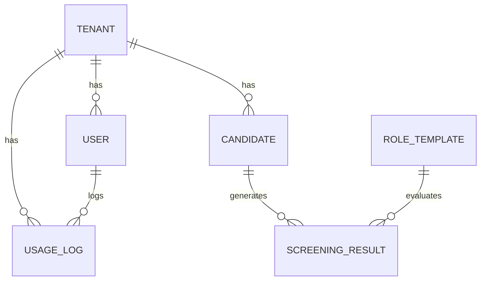

**Diagram sources**
- [database.py:31-93](file://app/backend/models/db_models.py#L31-L93)

**Section sources**
- [database.py:5-20](file://app/backend/db/database.py#L5-L20)
- [database.py:1-33](file://app/backend/db/database.py#L1-L33)
- [database.py:31-93](file://app/backend/models/db_models.py#L31-L93)

### AI Model Security Considerations
- Prompt Safety
  - **Critical Security Enhancement**: The LLM service now includes prompt injection protection with input sanitization.
  - The LLM service constructs prompts with truncation and a constrained JSON expectation.
  - JSON parsing includes multiple fallbacks and validation to normalize outputs.
  - **New** 4-tier guardrail framework provides comprehensive prompt injection detection and prevention.
- Model Poisoning Prevention
  - Use curated, trusted base models and avoid exposing model training endpoints.
  - Monitor model outputs for unexpected patterns and maintain a deny-list for risky inputs.
  - **New** Ensemble voting across 3 model seeds provides consistency and reduces poisoning effects.
- Secure LLM API Integration
  - Use internal network isolation for Ollama; avoid exposing ports publicly.
  - Implement timeouts and retry policies; surface fallback responses gracefully.
  - **New** Comprehensive timeout enforcement and circuit breaker patterns.
- Startup Security
  - **Critical Security Enhancement**: Containerized startup validation - Entry point script ensures Ollama readiness before application start.
  - Environment-variable driven model loading and warm-up procedures.
  - **New** Health sentinel monitoring with automatic model warmup and state tracking.

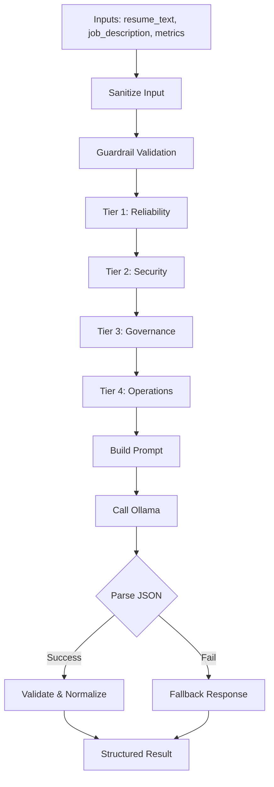

**Diagram sources**
- [wait_for_ollama.py:58-91](file://app/backend/scripts/wait_for_ollama.py#L58-L91)
- [guardrail_service.py:128-168](file://app/backend/services/guardrail_service.py#L128-168)
- [guardrail_service.py:398-483](file://app/backend/services/guardrail_service.py#L398-483)

**Section sources**
- [wait_for_ollama.py:1-96](file://app/backend/scripts/wait_for_ollama.py#L1-L96)

### Infrastructure Security Hardening
- Container Security
  - **Critical Security Enhancement**: Non-root execution - All containers (backend, frontend, nginx) run as non-root users.
  - **Critical Security Enhancement**: Privilege separation - Dedicated appuser for backend, nginx user for frontend/nginx.
  - **Critical Security Enhancement**: File ownership - Proper chown operations ensure secure file permissions.
  - **New** Enhanced container security with guardrail integration and comprehensive monitoring.
- Environment Configuration
  - **Critical Security Enhancement**: Mandatory variables - Production requires POSTGRES_PASSWORD, JWT_SECRET_KEY, and other sensitive vars.
  - **Critical Security Enhancement**: Environment-specific defaults - Development vs production configuration handling.
- Nginx Security Headers
  - **Critical Security Enhancement**: Production-grade headers - X-Frame-Options, X-Content-Type-Options, HSTS, Referrer-Policy, Content-Security-Policy.
  - **Critical Security Enhancement**: Rate limiting - API rate limiting with configurable zones and burst handling.
  - **Critical Security Enhancement**: SSL/TLS enforcement - Automatic HTTP to HTTPS redirection with proper certificate handling.
- Network Security
  - **Critical Security Enhancement**: Internal networking - Services communicate via internal Docker networks only.
  - **Critical Security Enhancement**: Port exposure - Minimal external port exposure with proper proxy configuration.

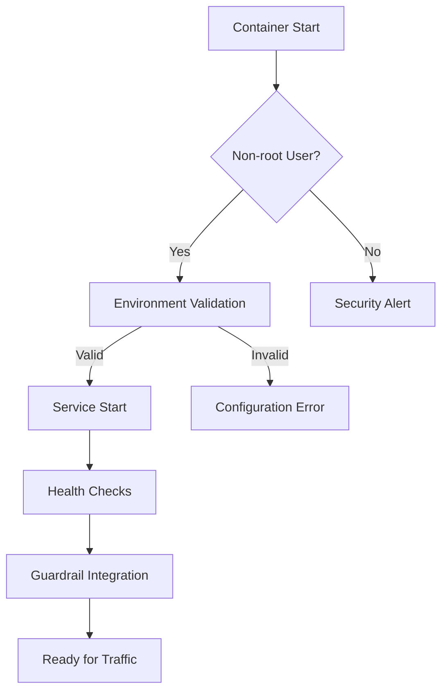

**Diagram sources**
- [Dockerfile:29-34](file://app/backend/Dockerfile#L29-L34)
- [Dockerfile:23-30](file://app/frontend/Dockerfile#L23-L30)
- [Dockerfile:1-13](file://nginx/Dockerfile#L1-L13)
- [docker-compose.prod.yml:24](file://docker-compose.prod.yml#L24)
- [guardrail_service.py:1067-1121](file://app/backend/services/guardrail_service.py#L1067-L1121)

**Section sources**
- [Dockerfile:29-34](file://app/backend/Dockerfile#L29-L34)
- [Dockerfile:23-30](file://app/frontend/Dockerfile#L23-L30)
- [Dockerfile:1-13](file://nginx/Dockerfile#L1-L13)
- [docker-compose.prod.yml:24](file://docker-compose.prod.yml#L24)
- [nginx.prod.conf:40-45](file://nginx/nginx.prod.conf#L40-L45)

### XSS Protection Implementation
- **New Security Enhancement**: Universal safeStr utility function implemented across 7 frontend components.
- **New Security Enhancement**: Centralized XSS protection mechanism handling all data types safely.
- **New Security Enhancement**: Comprehensive XSS vulnerability remediation in comparison views, result cards, and reporting components.
- **New Security Enhancement**: Safe string coercion for null/undefined values, strings, numbers, booleans, objects, and arrays.
- **New Security Enhancement**: Error handling for JSON serialization failures with graceful fallback to string conversion.
- **New** Enhanced XSS protection through guardrail integration with comprehensive input sanitization.

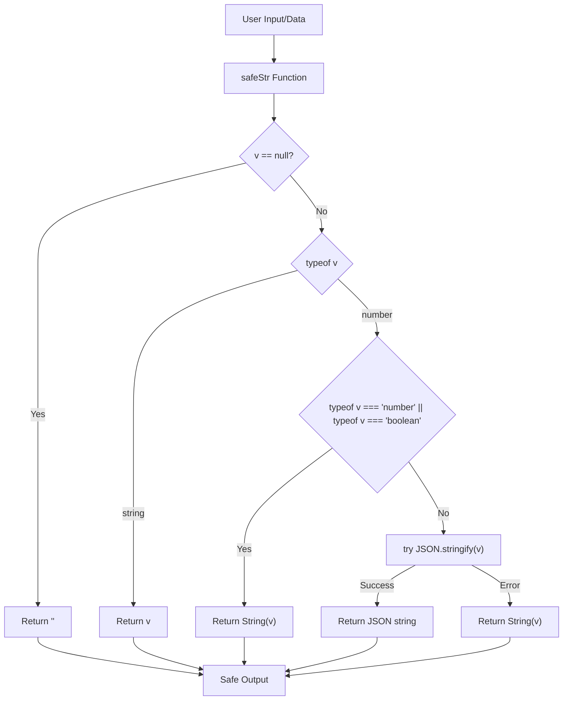

**Diagram sources**
- [ComparisonView.jsx:3-9](file://app/frontend/src/components/ComparisonView.jsx#L3-L9)
- [ResultCard.jsx:13-19](file://app/frontend/src/components/ResultCard.jsx#L13-L19)
- [SkillsRadar.jsx:3-9](file://app/frontend/src/components/SkillsRadar.jsx#L3-L9)
- [CandidatesPage.jsx:6-12](file://app/frontend/src/pages/CandidatesPage.jsx#L6-L12)
- [ComparePage.jsx:6-12](file://app/frontend/src/pages/ComparePage.jsx#L6-L12)
- [DashboardNew.jsx:11-17](file://app/frontend/src/pages/DashboardNew.jsx#L11-L17)
- [ReportPage.jsx:13-19](file://app/frontend/src/pages/ReportPage.jsx#L13-L19)

**Section sources**
- [ComparisonView.jsx:3-9](file://app/frontend/src/components/ComparisonView.jsx#L3-L9)
- [ResultCard.jsx:13-19](file://app/frontend/src/components/ResultCard.jsx#L13-L19)
- [SkillsRadar.jsx:3-9](file://app/frontend/src/components/SkillsRadar.jsx#L3-L9)
- [CandidatesPage.jsx:6-12](file://app/frontend/src/pages/CandidatesPage.jsx#L6-L12)
- [ComparePage.jsx:6-12](file://app/frontend/src/pages/ComparePage.jsx#L6-L12)
- [DashboardNew.jsx:11-17](file://app/frontend/src/pages/DashboardNew.jsx#L11-L17)
- [ReportPage.jsx:13-19](file://app/frontend/src/pages/ReportPage.jsx#L13-L19)

### 4-Tier LLM Guardrail Framework
- **New Enterprise Security Framework**: Comprehensive guardrail system with 4 layers providing enterprise-grade security and operational controls.
- **Tier 1 (Reliability)**: 
  - Retry/backoff with exponential backoff and jitter
  - Strict JSON schema validation with Pydantic models
  - Cross-node consistency checks for mutual validation
  - Circuit breaker patterns for service resilience
- **Tier 2 (Security)**:
  - Advanced prompt injection detection with 35+ known attack patterns
  - Timeout enforcement with configurable per-call limits
  - 3x ensemble voting across model seeds for consistency
  - Input sanitization and delimiter neutralization
- **Tier 3 (Governance)**:
  - Human-in-the-loop (HITL) gates for low-confidence results
  - A/B testing framework for prompt variants with statistical tracking
  - Adversarial harness testing with synthetic test cases
  - Risk flagging and severity-based escalation
- **Tier 4 (Operations)**:
  - Tenant-level token budget management with daily limits
  - Data retention policies with anonymization
  - Comprehensive monitoring hooks with Prometheus metrics
  - Event logging with structured guardrail events

```mermaid
flowchart TD
subgraph "Tier 1: Reliability"
Retry["Exponential Backoff"] --> Schema["Schema Validation"]
Schema --> Consistency["Cross-Node Consistency"]
Consistency --> Circuit["Circuit Breaker"]
end
subgraph "Tier 2: Security"
Injection["Prompt Injection Detection"] --> Timeout["Timeout Enforcement"]
Timeout --> Ensemble["3x Ensemble Voting"]
Ensemble --> Sanitize["Input Sanitization"]
end
subgraph "Tier 3: Governance"
HITL["HITL Gates"] --> ABTest["A/B Testing"]
ABTest --> Adversarial["Adversarial Harness"]
Adversarial --> Flags["Risk Flags"]
end
subgraph "Tier 4: Operations"
Budget["Token Budget"] --> Retention["Data Retention"]
Retention --> Monitoring["Monitoring Hooks"]
Monitoring --> Events["Guardrail Events"]
end
```

**Diagram sources**
- [guardrail_service.py:128-168](file://app/backend/services/guardrail_service.py#L128-168)
- [guardrail_service.py:171-287](file://app/backend/services/guardrail_service.py#L171-287)
- [guardrail_service.py:290-396](file://app/backend/services/guardrail_service.py#L290-396)
- [guardrail_service.py:398-498](file://app/backend/services/guardrail_service.py#L398-498)
- [guardrail_service.py:675-752](file://app/backend/services/guardrail_service.py#L675-752)
- [guardrail_service.py:755-938](file://app/backend/services/guardrail_service.py#L755-938)
- [guardrail_service.py:941-1062](file://app/backend/services/guardrail_service.py#L941-1062)
- [guardrail_service.py:1065-1121](file://app/backend/services/guardrail_service.py#L1065-1121)

**Section sources**
- [guardrail_service.py:1-128](file://app/backend/services/guardrail_service.py#L1-L128)
- [guardrail_service.py:128-168](file://app/backend/services/guardrail_service.py#L128-168)
- [guardrail_service.py:171-287](file://app/backend/services/guardrail_service.py#L171-287)
- [guardrail_service.py:290-396](file://app/backend/services/guardrail_service.py#L290-396)
- [guardrail_service.py:398-498](file://app/backend/services/guardrail_service.py#L398-498)
- [guardrail_service.py:675-752](file://app/backend/services/guardrail_service.py#L675-752)
- [guardrail_service.py:755-938](file://app/backend/services/guardrail_service.py#L755-938)
- [guardrail_service.py:941-1062](file://app/backend/services/guardrail_service.py#L941-1062)
- [guardrail_service.py:1065-1121](file://app/backend/services/guardrail_service.py#L1065-1121)

### Audit Logging and Compliance Readiness
- Usage Tracking
  - The subscription module maintains usage logs with timestamps, actions, quantities, and optional details.
  - Tenant-scoped usage counters and resets support billing and capacity governance.
- Security Logging
  - **Enhanced logging** - Comprehensive access logs, error logs, and security event tracking.
  - **Audit trails** - JWT validation failures, CSRF violations, and authentication attempts logged.
  - **New** Guardrail event logging with structured JSON payloads and severity levels.
- Compliance Readiness
  - **Data protection** - Secure token storage, encrypted connections, and audit logging support GDPR requirements.
  - **Change management** - Environment variable validation and configuration drift detection.
  - **New** Comprehensive monitoring with Prometheus metrics for SOC2 compliance.

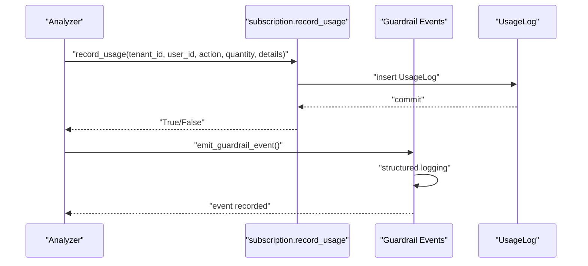

**Diagram sources**
- [subscription.py:427-477](file://app/backend/routes/subscription.py#L427-L477)
- [guardrail_service.py:1067-1121](file://app/backend/services/guardrail_service.py#L1067-1121)

**Section sources**
- [subscription.py:427-477](file://app/backend/routes/subscription.py#L427-L477)
- [guardrail_service.py:1067-1121](file://app/backend/services/guardrail_service.py#L1067-1121)

### Role-Based Access Control (RBAC)
- Roles and Tenancy
  - Users have role attributes scoped to a tenant; routes enforce tenant isolation.
  - Admin guard ensures only administrators can access administrative endpoints.
- Security Enhancements
  - **Critical Security Enhancement**: CSRF protection - Double-submit cookie pattern prevents cross-site request forgery.
  - **Critical Security Enhancement**: Environment validation - Production requires proper configuration and credentials.
  - **New** Rate limiting with tenant-aware configuration for fair resource allocation.
- Recommendations
  - Define granular permissions per role (read/write/delete) and enforce at route handlers.
  - Introduce permission matrices and policy evaluation middleware.

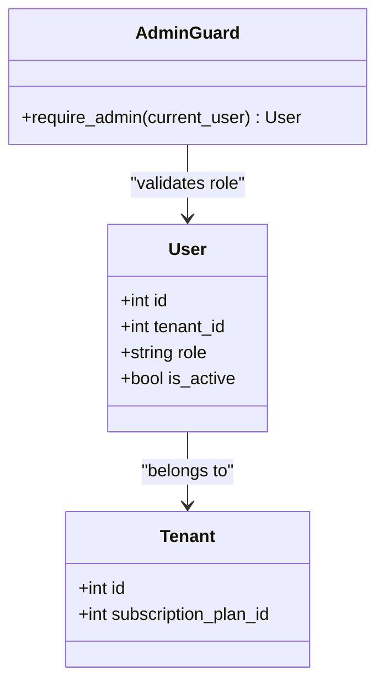

**Diagram sources**
- [db_models.py:62-77](file://app/backend/models/db_models.py#L62-L77)
- [auth.py:43-46](file://app/backend/middleware/auth.py#L43-L46)

**Section sources**
- [db_models.py:62-77](file://app/backend/models/db_models.py#L62-L77)
- [auth.py:43-46](file://app/backend/middleware/auth.py#L43-L46)

### Secure File Upload Handling
- Current State
  - The codebase does not include explicit file upload routes in the provided files.
- Security Improvements
  - **Critical Security Enhancement**: Container security - All containers run as non-root users, reducing attack surface.
  - **Critical Security Enhancement**: Network isolation - Internal Docker networks prevent direct file system access.
  - **New** Enhanced file handling with guardrail integration for input validation and sanitization.
- Recommendations
  - Validate file types and sizes; scan for malware before processing.
  - Store files outside the web root; serve via signed URLs or streaming endpoints.
  - Apply Content-Type sniffing and sanitize filenames.

### Data Retention Policies
- Current State
  - The subscription module tracks storage usage and monthly resets; no explicit retention policy is enforced.
- Security Considerations
  - **Critical Security Enhancement**: Token security - JWT tokens stored in browser storage with enhanced validation.
  - **Critical Security Enhancement**: Audit logging - Comprehensive logging of access patterns and security events.
  - **New** Comprehensive data retention policy with anonymization and deletion automation.
- Recommendations
  - Define retention periods for resumes, transcripts, and logs; implement automated deletion jobs.
  - Support data portability and erasure requests aligned with GDPR.
  - **New** Implement tenant-level retention policies with configurable timeframes.

**Updated** Enhanced data retention policy implementation with corrected column mapping for ScreeningResult.timestamp to ensure proper anonymization of old screening results according to configured retention period. The system now includes comprehensive automated cleanup processes for both resume file data and screening result narratives, providing enhanced data privacy compliance and reduced storage footprint.

**Section sources**
- [subscription.py:117-144](file://app/backend/routes/subscription.py#L117-L144)
- [subscription.py:346-367](file://app/backend/routes/subscription.py#L346-L367)
- [guardrail_service.py:1014-1062](file://app/backend/services/guardrail_service.py#L1014-1062)
- [db_models.py:135-162](file://app/backend/models/db_models.py#L135-L162)
- [test_guardrail_service.py:670-700](file://app/backend/tests/test_guardrail_service.py#L670-L700)

### Penetration Testing and Vulnerability Assessment
- Recommended Scope
  - Authentication bypass, token theft, SQL injection, XSS, CSRF, insecure direct object references.
  - LLM jailbreaking and prompt injection testing against the LLM service.
  - **Critical Security Enhancement**: New security vectors - Container escape attempts, environment variable tampering, and CSRF attacks.
  - **Critical Security Enhancement**: XSS vulnerability testing against the new safeStr utility function implementation.
  - **New** 4-tier guardrail framework testing including reliability, security, governance, and operations layers.
- Methodology
  - Automated scanning (OWASP ZAP/Trivy) plus manual exploratory testing.
  - Review JWT secret rotation, CORS misconfigurations, and health endpoints exposure.
  - **Critical Security Enhancement**: Container security testing - Non-root user validation, environment variable security, and Nginx configuration review.
  - **Critical Security Enhancement**: XSS protection validation - Testing safeStr function against various input types and edge cases.
  - **New** Guardrail framework validation - Testing all 4 tiers for effectiveness and performance.
- **New** Guardrail Testing Framework
  - Reliability tier: retry/backoff effectiveness under stress conditions
  - Security tier: prompt injection detection accuracy and false positive rates
  - Governance tier: HITL flag accuracy and human review effectiveness
  - Operations tier: token budget enforcement and data retention policy compliance

### Incident Response Planning
- Detection Signals
  - Health endpoint degradation, elevated error rates, unusual LLM response anomalies, unauthorized access attempts.
  - **Critical Security Enhancement**: New signals - Container startup failures, environment variable validation errors, and CSRF violation alerts.
  - **Critical Security Enhancement**: XSS attack detection - Monitoring for unsafe HTML rendering attempts.
  - **New** Guardrail incident signals - Hallucination detection, injection attempts, circuit breaker triggers, token budget exceedances.
- Response Playbook
  - Isolate affected services, rotate secrets, audit logs, notify stakeholders, and remediate root causes.
  - **New** Guardrail incident escalation - Automated alerts for critical guardrail failures with severity-based response.
- Recovery
  - Restore from backups, re-validate integrations, and re-enable services gradually.
  - **New** Guardrail recovery procedures - Automated service restarts, budget resets, and data cleanup.

## Security Audit Findings

### Backend Security Issues
The backend audit identified 42 issues across bugs, performance, database, API design, code quality, and missing features. Key findings include:

- **Critical Issues**: Race conditions in usage reset, duplicate candidate detection flaws, subscription plan initialization issues
- **High Priority**: N+1 query patterns, unbounded batch processing, missing LLM call timeouts
- **Medium Priority**: Global mutable dictionaries, semaphore sharing issues, missing pagination
- **Low Priority**: Dead code, redundant queries

### Frontend Security Issues
The frontend audit identified 52 issues including critical XSS vulnerabilities, JWT storage security problems, and development configuration issues:

- **Critical Issues**: JWT stored in localStorage, XSS in ResultCard interview questions, missing CORS headers
- **High Priority**: Stale closures in hooks, insecure URL extraction, missing input validation
- **Medium Priority**: Silent template load failures, incorrect boolean checks
- **Low Priority**: Missing PropTypes, monolithic components

**Updated** Added comprehensive XSS protection implementation through centralized safeStr utility function across 7 frontend components, significantly reducing XSS vulnerabilities. **New** Implemented comprehensive 4-tier LLM guardrail framework with reliability, security, governance, and operations layers providing enterprise-grade security and operational controls.

### Infrastructure Security Issues
The infrastructure audit found 83 issues spanning Docker deployment, CI/CD pipelines, database migrations, and security configurations:

- **Critical Issues**: Hardcoded production passwords, missing non-root users, incomplete security headers
- **High Priority**: Hardcoded credentials, missing secrets validation, inadequate Docker security
- **Medium Priority**: Incomplete CI/CD security, missing migration rollback tests
- **Low Priority**: DNS caching issues, manual CORS handling

### LLM & AI Pipeline Security Issues
The LLM audit identified 35 issues including configuration fragmentation, prompt engineering problems, and bias concerns:

- **Critical Issues**: No prompt injection sanitization, model name mismatches, hardcoded model references
- **High Priority**: Configuration fragmentation across multiple files, inconsistent temperature settings
- **Medium Priority**: Missing Pydantic schema validation, inadequate fallback monitoring
- **Bias Concerns**: Education scoring penalization, architecture keyword disadvantages
- **New** Guardrail framework implementation with comprehensive security controls and operational monitoring.

**Section sources**
- [AUDIT.md:234-1365](file://docs/AUDIT.md#L234-L1365)

## Dependency Analysis
The backend depends on FastAPI, SQLAlchemy, bcrypt, python-jose, and httpx. The LLM service depends on Ollama via HTTP. Docker Compose defines service dependencies and environment variables. **New** The guardrail service adds dependencies on Pydantic for schema validation and comprehensive logging for monitoring.

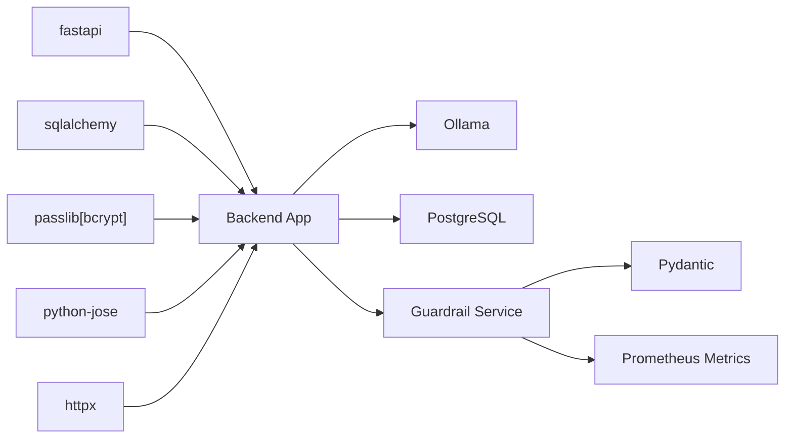

**Diagram sources**
- [requirements.txt:1-48](file://requirements.txt#L1-L48)
- [docker-compose.yml:52-75](file://docker-compose.yml#L52-L75)
- [guardrail_service.py:28](file://app/backend/services/guardrail_service.py#L28)
- [metrics.py:8](file://app/backend/services/metrics.py#L8)

**Section sources**
- [requirements.txt:1-48](file://requirements.txt#L1-L48)
- [docker-compose.yml:52-75](file://docker-compose.yml#L52-L75)

## Performance Considerations
- Connection Pooling and Pre-Ping
  - Enable pool pre-ping to detect dead connections and improve reliability.
- LLM Latency
  - Use warm-up scripts and model hot-loading to minimize cold-start latency.
  - **New** Guardrail framework adds retry/backoff mechanisms to handle LLM latency variations.
- Frontend Token Handling
  - Avoid excessive token refresh calls; cache user data locally.
- **Critical Security Enhancement**: Container Performance - Non-root user execution has minimal performance impact while significantly improving security posture.
- **Critical Security Enhancement**: XSS Protection Performance - Centralized safeStr utility function provides efficient XSS protection with minimal performance overhead.
- **New** Guardrail Performance Considerations
  - **New** Ensemble voting adds computational overhead but improves accuracy and consistency.
  - **New** Schema validation provides performance benefits through early error detection.
  - **New** Token budget management prevents resource exhaustion and maintains system stability.

## Troubleshooting Guide
- Authentication Failures
  - Verify JWT_SECRET_KEY is set and consistent across environments.
  - Ensure tokens are not expired and user remains active.
  - **Critical Security Enhancement**: Check environment variable validation in production.
- Database Connectivity
  - Confirm DATABASE_URL normalization and credentials; check pool settings.
  - **Critical Security Enhancement**: Container issues - Verify non-root user permissions for database files.
- LLM Availability
  - Use the LLM status endpoint to diagnose model readiness and connectivity.
  - Run the Ollama wait script during startup to ensure warm models.
  - **Critical Security Enhancement**: Container startup - Check entrypoint script execution and Ollama readiness.
  - **New** Guardrail troubleshooting - Monitor guardrail events, check circuit breaker status, and validate token budgets.
- **Critical Security Enhancement**: Nginx Issues - Security headers verification, rate limiting configuration, certificate validation.
- **Critical Security Enhancement**: Security Header Validation - Verify CSP, HSTS, X-Frame-Options, and X-Content-Type-Options are properly configured.
- **Critical Security Enhancement**: XSS Protection Issues - Verify safeStr utility function is properly implemented and functioning across all components.
- **Critical Security Enhancement**: SafeStr Function Debugging - Test safeStr with various input types (null, undefined, strings, numbers, booleans, objects, arrays) to ensure proper XSS protection.
- **New** Guardrail System Issues
  - **New** Guardrail event monitoring - Check guardrail logs for warnings and errors.
  - **New** Token budget validation - Verify tenant token usage and budget limits.
  - **New** Circuit breaker status - Monitor for service degradation and automatic failover.
- **New** Data Retention Policy Issues
  - **New** Retention policy debugging - Verify ScreeningResult.timestamp column mapping and anonymization process.
  - **New** Cleanup job validation - Check tenant-scoped retention calculations and PII anonymization.
  - **New** Storage optimization monitoring - Track resume blob cleanup and screening result anonymization metrics.

**Section sources**
- [auth.py:13-14](file://app/backend/middleware/auth.py#L13-L14)
- [database.py:5-20](file://app/backend/db/database.py#L5-L20)
- [main.py:262-326](file://app/backend/main.py#L262-L326)
- [wait_for_ollama.py:34-91](file://app/backend/scripts/wait_for_ollama.py#L34-L91)
- [nginx.prod.conf:40-45](file://nginx/nginx.prod.conf#L40-L45)
- [guardrail_service.py:1067-1121](file://app/backend/services/guardrail_service.py#L1067-L1121)
- [db_models.py:135-162](file://app/backend/models/db_models.py#L135-L162)

## Conclusion
Resume AI's current implementation establishes a solid foundation for authentication, tenant isolation, and LLM integration. The comprehensive security audit has identified 212 total issues requiring immediate attention, with 10 critical security vulnerabilities that must be addressed before production deployment. 

The recent security enhancements significantly strengthen the platform's defenses through non-root user execution, environment-variable driven configurations, mandatory credential enforcement, and production-grade Nginx security headers. However, the audit reveals critical vulnerabilities including hardcoded production passwords, JWT token storage in localStorage, missing security headers, and prompt injection vulnerabilities.

**Updated** The platform now includes comprehensive XSS protection implementation through centralized safeStr utility function across 7 frontend components, significantly reducing XSS vulnerabilities. The new safeStr function provides universal XSS protection by handling null/undefined, strings, numbers, booleans, objects, and arrays with proper error handling and safe string coercion. **New** The platform now includes comprehensive 4-tier LLM guardrail framework implementation with reliability, security, governance, and operations layers providing enterprise-grade security and operational controls.

**Updated** The platform now includes comprehensive data retention policy implementation with corrected column mapping for ScreeningResult.timestamp, ensuring proper anonymization of old screening results according to configured retention periods. This represents a significant improvement in data privacy compliance and automated cleanup processes.

To achieve production-grade security, prioritize the immediate remediation of critical security issues as outlined in the remediation roadmap. Implement comprehensive security hardening measures including CSRF protection, secure token storage, prompt injection prevention, and enhanced audit logging. Implement RBAC with granular permissions, secure file handling, and data retention policies aligned with compliance requirements. Conduct regular penetration testing and maintain an incident response plan.

**Updated** The platform now includes comprehensive security audit findings covering critical vulnerabilities, prioritized remediation roadmap, and enhanced security hardening recommendations based on thorough security assessment. The new XSS protection implementation through safeStr utility function provides robust defense against cross-site scripting attacks across all frontend components. **New** The comprehensive 4-tier LLM guardrail framework provides enterprise-grade security and operational controls, significantly enhancing the platform's security posture and reliability. **New** The enhanced data retention policy ensures GDPR compliance through automated anonymization and deletion of old screening results.

## Appendices
- Environment Variables to Secure
  - JWT_SECRET_KEY, DATABASE_URL, OLLAMA_BASE_URL, OLLAMA_MODEL, ACCESS_TOKEN_EXPIRE_MINUTES, REFRESH_TOKEN_EXPIRE_DAYS, CORS_ORIGINS.
- **Critical Security Variables**
  - POSTGRES_PASSWORD (mandatory in production), OLLAMA_STARTUP_REQUIRED, ENVIRONMENT.
- **New** Guardrail Configuration Variables
  - GUARDRAIL_MAX_RETRIES, GUARDRAIL_RETRY_DELAY, GUARDRAIL_PER_CALL_TIMEOUT, GUARDRAIL_CIRCUIT_THRESHOLD, DEFAULT_LLM_TOKEN_BUDGET
- **New** Data Retention Configuration Variables
  - DEFAULT_RETENTION_DAYS (default: 90), RETENTION_CLEANUP_INTERVAL (default: 24 hours)
- Compliance Checklist
  - GDPR: Data minimization, retention, access/erasure requests, DPIA where applicable.
  - SOC2: Security, availability, confidentiality, processing integrity, and privacy principles.
- **Critical Security Checklist**
  - Hardcoded credentials removed from version control
  - JWT_SECRET_KEY enforced in production
  - Tokens stored in httpOnly cookies
  - Non-root user execution verified for all containers
  - Security headers active in production Nginx
  - CSRF protection implemented
  - Prompt injection protection added
  - XSS vulnerabilities resolved through safeStr utility function
  - SafeStr function tested across all 7 frontend components
  - **New** Guardrail framework deployed and validated
  - **New** Token budget management implemented
  - **New** Data retention policies configured
  - **New** Comprehensive monitoring and alerting established
  - **New** ScreeningResult.timestamp column mapping verified for anonymization
  - **New** Automated cleanup processes validated for tenant-level compliance

**Section sources**
- [AUDIT.md:1241-1323](file://docs/AUDIT.md#L1241-L1323)
- [guardrail_service.py:34-38](file://app/backend/services/guardrail_service.py#L34-L38)
- [metrics.py:22-61](file://app/backend/services/metrics.py#L22-L61)
- [db_models.py:135-162](file://app/backend/models/db_models.py#L135-L162)
- [test_guardrail_service.py:670-700](file://app/backend/tests/test_guardrail_service.py#L670-L700)