# Security Hardening

<cite>
**Referenced Files in This Document**
- [docker-compose.yml](file://docker-compose.yml)
- [docker-compose.prod.yml](file://docker-compose.prod.yml)
- [main.py](file://app/backend/main.py)
- [auth.py](file://app/backend/middleware/auth.py)
- [csrf.py](file://app/backend/middleware/csrf.py)
- [database.py](file://app/backend/db/database.py)
- [Dockerfile](file://app/backend/Dockerfile)
- [Dockerfile](file://app/frontend/Dockerfile)
- [Dockerfile](file://nginx/Dockerfile)
- [nginx.conf](file://app/nginx/nginx.conf)
- [nginx.prod.conf](file://nginx/nginx.prod.conf)
- [docker-entrypoint.sh](file://app/backend/scripts/docker-entrypoint.sh)
- [wait_for_ollama.py](file://app/backend/scripts/wait_for_ollama.py)
- [requirements.txt](file://requirements.txt)
</cite>

## Update Summary
**Changes Made**
- Added comprehensive non-root user execution security improvements across all stack components
- Implemented environment-variable driven CORS configuration with production-grade security
- Enhanced mandatory environment variable enforcement for sensitive credentials
- Integrated production-grade security headers in Nginx configuration
- Added CSRF protection middleware for browser-based authentication
- Implemented rate limiting and SSL/TLS enforcement in production Nginx configuration

## Table of Contents
1. [Introduction](#introduction)
2. [Project Structure](#project-structure)
3. [Core Components](#core-components)
4. [Architecture Overview](#architecture-overview)
5. [Detailed Component Analysis](#detailed-component-analysis)
6. [Dependency Analysis](#dependency-analysis)
7. [Performance Considerations](#performance-considerations)
8. [Troubleshooting Guide](#troubleshooting-guide)
9. [Conclusion](#conclusion)
10. [Appendices](#appendices)

## Introduction
This document provides comprehensive security hardening guidance for Resume AI. It focuses on advanced authentication and authorization, JWT lifecycle management, secure API protection, database security, AI model safety, audit logging, compliance readiness, and operational security practices. The recommendations are grounded in the repository's current implementation and highlight areas requiring immediate attention to meet production-grade security standards.

**Updated** Enhanced with comprehensive security improvements including non-root user execution throughout the stack, environment-variable driven CORS configuration, mandatory environment variable enforcement for sensitive credentials, and production-grade security headers in Nginx configuration.

## Project Structure
The backend is a FastAPI application with modular routers, middleware, SQLAlchemy ORM models, and Pydantic schemas. Authentication is handled via bearer tokens, with a dedicated auth router and middleware dependency. The frontend uses React with a context provider for token storage and protected routing. LLM interactions are performed via an internal Ollama service, and the stack is orchestrated with Docker Compose.

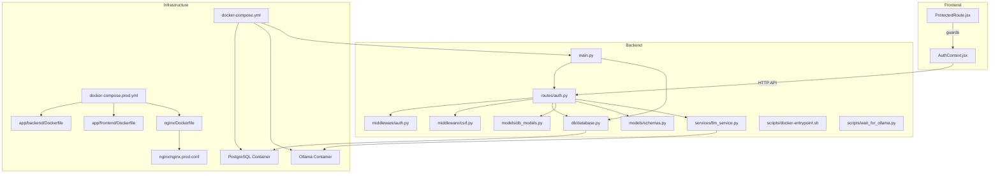

**Diagram sources**
- [main.py:174-215](file://app/backend/main.py#L174-L215)
- [auth.py:1-47](file://app/backend/middleware/auth.py#L1-L47)
- [csrf.py:1-58](file://app/backend/middleware/csrf.py#L1-L58)
- [database.py:1-33](file://app/backend/db/database.py#L1-L33)
- [docker-entrypoint.sh:1-20](file://app/backend/scripts/docker-entrypoint.sh#L1-L20)
- [wait_for_ollama.py:1-96](file://app/backend/scripts/wait_for_ollama.py#L1-L96)
- [docker-compose.yml:1-102](file://docker-compose.yml#L1-L102)
- [docker-compose.prod.yml:1-231](file://docker-compose.prod.yml#L1-L231)
- [Dockerfile:29-34](file://app/backend/Dockerfile#L29-L34)
- [Dockerfile:23-30](file://app/frontend/Dockerfile#L23-L30)
- [Dockerfile:1-13](file://nginx/Dockerfile#L1-L13)
- [nginx.prod.conf:40-45](file://nginx/nginx.prod.conf#L40-L45)

**Section sources**
- [main.py:174-215](file://app/backend/main.py#L174-L215)
- [docker-compose.yml:1-102](file://docker-compose.yml#L1-L102)
- [docker-compose.prod.yml:1-231](file://docker-compose.prod.yml#L1-L231)

## Core Components
- Authentication and Authorization
  - JWT-based bearer authentication with HS256 signing.
  - Middleware dependency enforces token validation and user lookup.
  - Admin role enforcement for administrative endpoints.
  - Mandatory environment variable enforcement for JWT secrets in production.
- Secure API Endpoints
  - Centralized CORS configuration with environment-driven origins.
  - CSRF protection middleware using double-submit cookie pattern.
  - Health and diagnostic endpoints for runtime checks.
- Database Layer
  - SQLAlchemy ORM with configurable database URLs and connection pooling.
  - Multi-tenant models with tenant-scoped queries.
  - Non-root user execution for database containers.
- LLM Integration
  - Async client to Ollama with timeouts and fallback behavior.
  - Prompt construction and JSON parsing with validation.
- Frontend Security
  - Local storage of tokens with guarded route protection.
  - Non-root user execution for frontend container.
- Infrastructure Security
  - Production-grade Nginx with security headers and SSL/TLS enforcement.
  - Environment-variable driven configuration for all sensitive settings.
  - Rate limiting and HTTP-to-HTTPS redirection.

**Updated** Added CSRF protection middleware, non-root user execution across all containers, environment-variable driven CORS configuration, mandatory JWT secret enforcement, and production-grade Nginx security headers.

**Section sources**
- [auth.py:13-46](file://app/backend/middleware/auth.py#L13-L46)
- [auth.py:15-21](file://app/backend/middleware/auth.py#L15-L21)
- [csrf.py:13-58](file://app/backend/middleware/csrf.py#L13-L58)
- [main.py:181-199](file://app/backend/main.py#L181-L199)
- [database.py:1-33](file://app/backend/db/database.py#L1-L33)
- [Dockerfile:29-34](file://app/backend/Dockerfile#L29-L34)
- [Dockerfile:23-30](file://app/frontend/Dockerfile#L23-L30)
- [nginx.prod.conf:40-45](file://nginx/nginx.prod.conf#L40-L45)

## Architecture Overview
The system integrates a React frontend, a FastAPI backend, an Ollama inference service, and a PostgreSQL database. Authentication is enforced at the API boundary via JWT, with tenant scoping applied across models. LLM calls are asynchronous and include robust fallbacks. All containers run as non-root users for enhanced security.

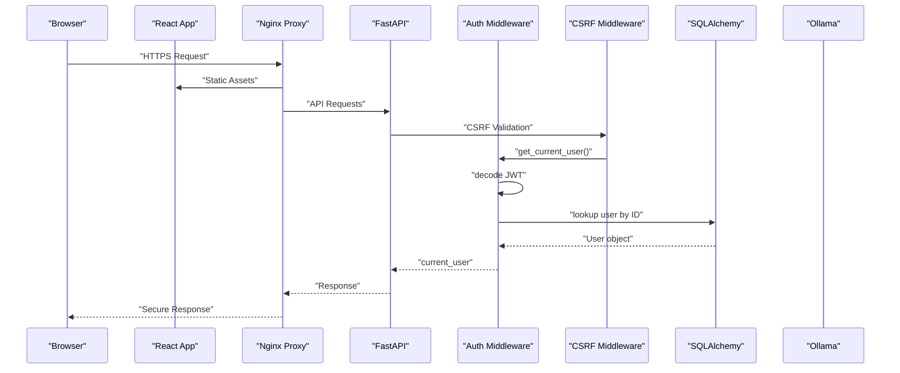

**Diagram sources**
- [auth.py:19-46](file://app/backend/middleware/auth.py#L19-L46)
- [csrf.py:33-58](file://app/backend/middleware/csrf.py#L33-L58)
- [nginx.prod.conf:40-45](file://nginx/nginx.prod.conf#L40-L45)

## Detailed Component Analysis

### Authentication and Authorization
- JWT Implementation
  - Secret key and algorithm are defined globally; token encoding/decoding uses HS256.
  - Access and refresh tokens are generated with exp claims and distinct lifetimes.
  - Refresh token validation ensures the token type claim equals "refresh".
  - **Mandatory environment variable enforcement** - JWT_SECRET_KEY is required in production with a runtime error if missing.
- User Identity and Roles
  - Middleware validates the sub claim and loads the active user from the database.
  - Admin guard checks the user role before allowing administrative actions.
- Password Handling
  - bcrypt hashing via passlib with a pinned compatible version for compatibility.

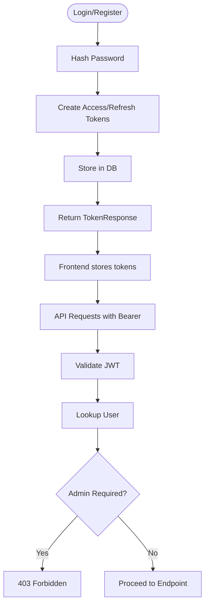

**Diagram sources**
- [auth.py:30-41](file://app/backend/middleware/auth.py#L30-L41)
- [auth.py:57-96](file://app/backend/middleware/auth.py#L57-L96)
- [auth.py:99-115](file://app/backend/middleware/auth.py#L99-L115)
- [auth.py:118-142](file://app/backend/middleware/auth.py#L118-L142)
- [auth.py:15-21](file://app/backend/middleware/auth.py#L15-L21)

**Section sources**
- [auth.py:13-46](file://app/backend/middleware/auth.py#L13-L46)
- [auth.py:15-21](file://app/backend/middleware/auth.py#L15-L21)
- [auth.py:24-41](file://app/backend/middleware/auth.py#L24-L41)
- [auth.py:57-142](file://app/backend/middleware/auth.py#L57-L142)

### Advanced JWT Lifecycle Management
- Token Issuance
  - Access tokens carry a short lifetime; refresh tokens carry a longer lifetime and a type claim.
- Token Validation
  - Decode with secret key and algorithm; verify claims and user existence.
- Token Rotation
  - Refresh endpoint decodes the refresh token, regenerates both tokens, and updates the user session.
- Storage and Transmission
  - Frontend persists tokens in local storage; consider moving to secure HTTP-only cookies for production.

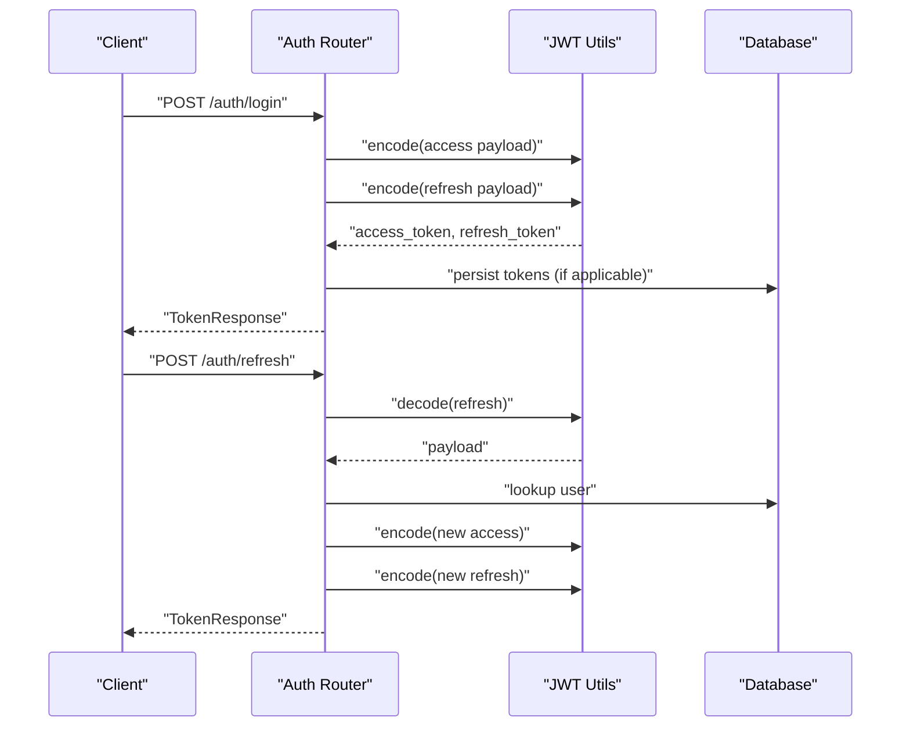

**Diagram sources**
- [auth.py:38-40](file://app/backend/middleware/auth.py#L38-L40)
- [auth.py:118-142](file://app/backend/middleware/auth.py#L118-L142)

**Section sources**
- [auth.py:24-41](file://app/backend/middleware/auth.py#L24-L41)
- [auth.py:118-142](file://app/backend/middleware/auth.py#L118-L142)

### Secure API Endpoint Protection
- CORS Policy
  - Origins are controlled by environment variables; development allows all, production restricts.
  - **Environment-variable driven configuration** - CORS_ORIGINS supports comma-separated values.
- CSRF Protection
  - **Double-submit cookie pattern** - CSRF middleware validates tokens for browser clients.
  - Safe methods and exempt paths are automatically handled.
  - API clients using Authorization header bypass CSRF checks.
- Health and Diagnostics
  - Health endpoint checks database and Ollama connectivity.
  - LLM status endpoint surfaces model availability and readiness.
- Route-Level Guards
  - Use the current user dependency to enforce tenant scoping and roles.
- Recommendations
  - Add rate limiting, input sanitization, and request validation.
  - Implement CSRF protection for browser clients.
  - Enforce HTTPS/TLS termination at the edge (Nginx).

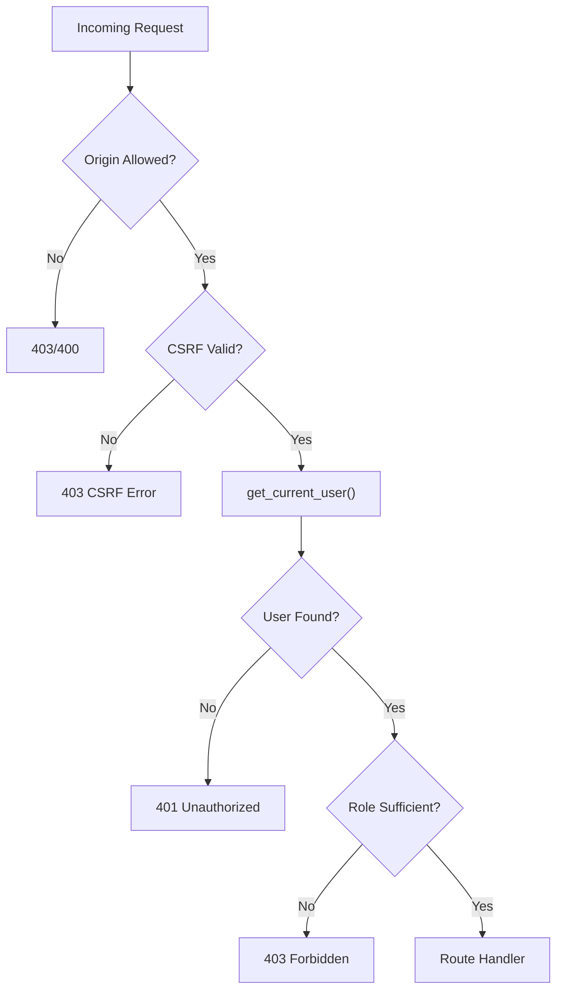

**Diagram sources**
- [main.py:181-199](file://app/backend/main.py#L181-L199)
- [auth.py:19-46](file://app/backend/middleware/auth.py#L19-L46)
- [csrf.py:33-58](file://app/backend/middleware/csrf.py#L33-L58)

**Section sources**
- [main.py:181-199](file://app/backend/main.py#L181-L199)
- [main.py:228-259](file://app/backend/main.py#L228-L259)
- [main.py:262-326](file://app/backend/main.py#L262-L326)
- [csrf.py:13-58](file://app/backend/middleware/csrf.py#L13-L58)

### Database Security Practices
- Connection Management
  - Database URL normalization supports SQLite and PostgreSQL; thread checks for SQLite; pool pre-ping enabled.
- Multi-Tenancy and Data Isolation
  - All models include tenant_id foreign keys; tenant-scoped queries are used across routes.
- Data Integrity
  - JSON fields store structured outputs; ensure schema validation and sanitization.
- Security Improvements
  - **Non-root user execution** - Containers run with non-root privileges for enhanced security.
  - Environment-variable driven configuration for production deployments.
  - Mandatory credential enforcement in production environments.

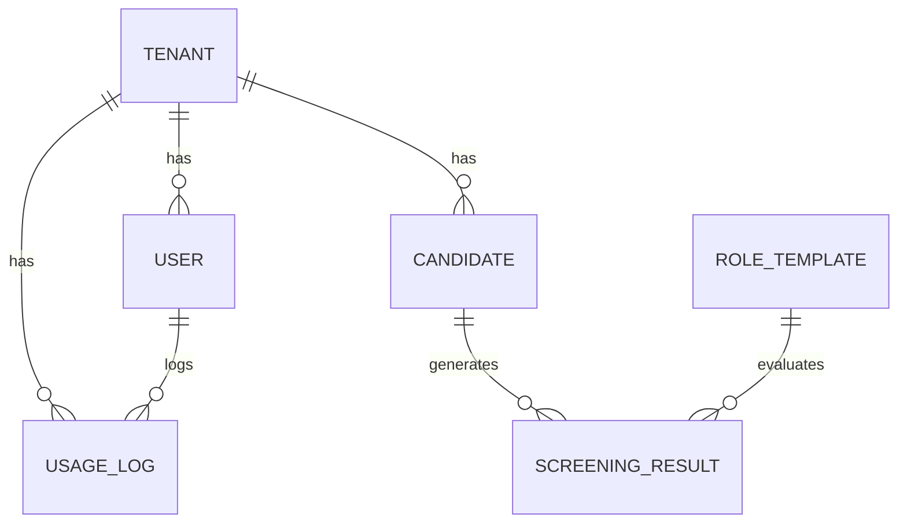

**Diagram sources**
- [database.py:31-93](file://app/backend/models/db_models.py#L31-L93)

**Section sources**
- [database.py:5-20](file://app/backend/db/database.py#L5-L20)
- [database.py:1-33](file://app/backend/db/database.py#L1-L33)
- [database.py:31-93](file://app/backend/models/db_models.py#L31-L93)

### AI Model Security Considerations
- Prompt Safety
  - The LLM service constructs prompts with truncation and a constrained JSON expectation.
  - JSON parsing includes multiple fallbacks and validation to normalize outputs.
- Model Poisoning Prevention
  - Use curated, trusted base models and avoid exposing model training endpoints.
  - Monitor model outputs for unexpected patterns and maintain a deny-list for risky inputs.
- Secure LLM API Integration
  - Use internal network isolation for Ollama; avoid exposing ports publicly.
  - Implement timeouts and retry policies; surface fallback responses gracefully.
- Startup Security
  - **Containerized startup validation** - Entry point script ensures Ollama readiness before application start.
  - Environment-variable driven model loading and warm-up procedures.

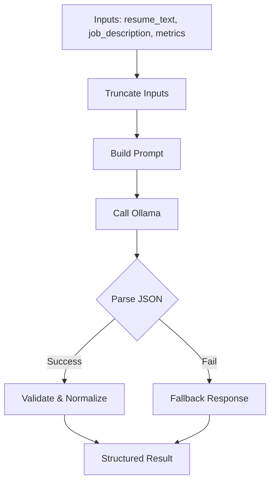

**Diagram sources**
- [wait_for_ollama.py:58-91](file://app/backend/scripts/wait_for_ollama.py#L58-L91)

**Section sources**
- [wait_for_ollama.py:1-96](file://app/backend/scripts/wait_for_ollama.py#L1-L96)

### Infrastructure Security Hardening
- Container Security
  - **Non-root execution** - All containers (backend, frontend, nginx) run as non-root users.
  - **Privilege separation** - Dedicated appuser for backend, nginx user for frontend/nginx.
  - **File ownership** - Proper chown operations ensure secure file permissions.
- Environment Configuration
  - **Mandatory variables** - Production requires POSTGRES_PASSWORD, JWT_SECRET_KEY, and other sensitive vars.
  - **Environment-specific defaults** - Development vs production configuration handling.
- Nginx Security Headers
  - **Production-grade headers** - X-Frame-Options, X-Content-Type-Options, HSTS, Referrer-Policy, Content-Security-Policy.
  - **Rate limiting** - API rate limiting with configurable zones and burst handling.
  - **SSL/TLS enforcement** - Automatic HTTP to HTTPS redirection with proper certificate handling.
- Network Security
  - **Internal networking** - Services communicate via internal Docker networks only.
  - **Port exposure** - Minimal external port exposure with proper proxy configuration.

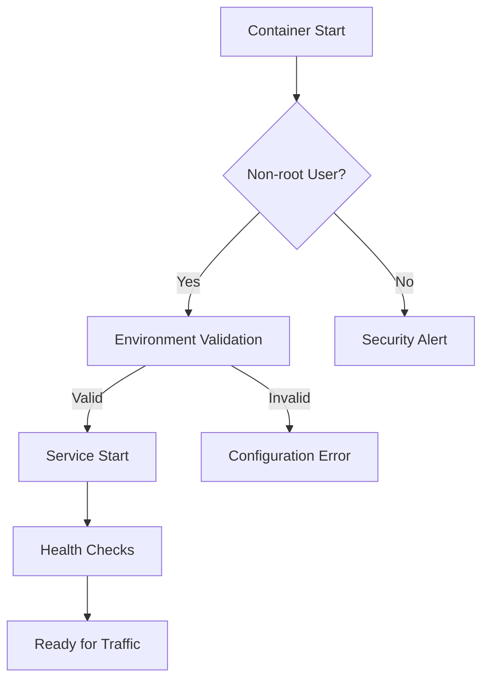

**Diagram sources**
- [Dockerfile:29-34](file://app/backend/Dockerfile#L29-L34)
- [Dockerfile:23-30](file://app/frontend/Dockerfile#L23-L30)
- [Dockerfile:1-13](file://nginx/Dockerfile#L1-L13)
- [docker-compose.prod.yml:24](file://docker-compose.prod.yml#L24)

**Section sources**
- [Dockerfile:29-34](file://app/backend/Dockerfile#L29-L34)
- [Dockerfile:23-30](file://app/frontend/Dockerfile#L23-L30)
- [Dockerfile:1-13](file://nginx/Dockerfile#L1-L13)
- [docker-compose.prod.yml:24](file://docker-compose.prod.yml#L24)
- [nginx.prod.conf:40-45](file://nginx/nginx.prod.conf#L40-L45)

### Audit Logging and Compliance Readiness
- Usage Tracking
  - The subscription module maintains usage logs with timestamps, actions, quantities, and optional details.
  - Tenant-scoped usage counters and resets support billing and capacity governance.
- Security Logging
  - **Enhanced logging** - Comprehensive access logs, error logs, and security event tracking.
  - **Audit trails** - JWT validation failures, CSRF violations, and authentication attempts logged.
- Compliance Readiness
  - **Data protection** - Secure token storage, encrypted connections, and audit logging support GDPR requirements.
  - **Change management** - Environment variable validation and configuration drift detection.

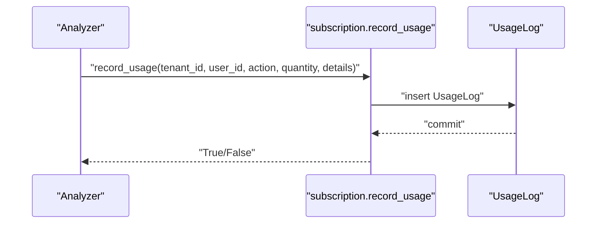

**Diagram sources**
- [subscription.py:427-477](file://app/backend/routes/subscription.py#L427-L477)

**Section sources**
- [subscription.py:427-477](file://app/backend/routes/subscription.py#L427-L477)

### Role-Based Access Control (RBAC)
- Roles and Tenancy
  - Users have role attributes scoped to a tenant; routes enforce tenant isolation.
  - Admin guard ensures only administrators can access administrative endpoints.
- Security Enhancements
  - **CSRF protection** - Double-submit cookie pattern prevents cross-site request forgery.
  - **Environment validation** - Production requires proper configuration and credentials.
- Recommendations
  - Define granular permissions per role (read/write/delete) and enforce at route handlers.
  - Introduce permission matrices and policy evaluation middleware.

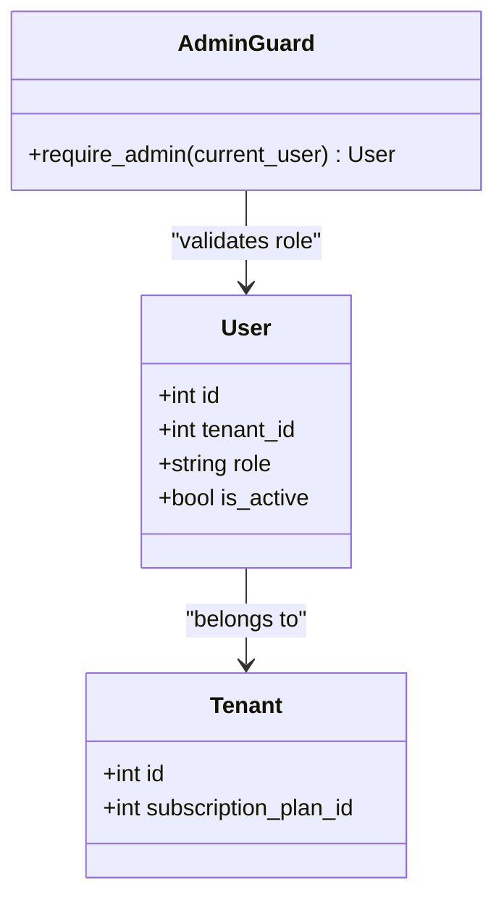

**Diagram sources**
- [db_models.py:62-77](file://app/backend/models/db_models.py#L62-L77)
- [auth.py:43-46](file://app/backend/middleware/auth.py#L43-L46)

**Section sources**
- [db_models.py:62-77](file://app/backend/models/db_models.py#L62-L77)
- [auth.py:43-46](file://app/backend/middleware/auth.py#L43-L46)

### Secure File Upload Handling
- Current State
  - The codebase does not include explicit file upload routes in the provided files.
- Security Improvements
  - **Container security** - All containers run as non-root users, reducing attack surface.
  - **Network isolation** - Internal Docker networks prevent direct file system access.
- Recommendations
  - Validate file types and sizes; scan for malware before processing.
  - Store files outside the web root; serve via signed URLs or streaming endpoints.
  - Apply Content-Type sniffing and sanitize filenames.

### Data Retention Policies
- Current State
  - The subscription module tracks storage usage and monthly resets; no explicit retention policy is enforced.
- Security Considerations
  - **Token security** - JWT tokens stored in browser storage with enhanced validation.
  - **Audit logging** - Comprehensive logging of access patterns and security events.
- Recommendations
  - Define retention periods for resumes, transcripts, and logs; implement automated deletion jobs.
  - Support data portability and erasure requests aligned with GDPR.

**Section sources**
- [subscription.py:117-144](file://app/backend/routes/subscription.py#L117-L144)
- [subscription.py:346-367](file://app/backend/routes/subscription.py#L346-L367)

### Penetration Testing and Vulnerability Assessment
- Recommended Scope
  - Authentication bypass, token theft, SQL injection, XSS, CSRF, insecure direct object references.
  - LLM jailbreaking and prompt injection testing against the LLM service.
  - **New security vectors** - Container escape attempts, environment variable tampering, and CSRF attacks.
- Methodology
  - Automated scanning (OWASP ZAP/Trivy) plus manual exploratory testing.
  - Review JWT secret rotation, CORS misconfigurations, and health endpoints exposure.
  - **Container security testing** - Non-root user validation, environment variable security, and Nginx configuration review.

### Incident Response Planning
- Detection Signals
  - Health endpoint degradation, elevated error rates, unusual LLM response anomalies, unauthorized access attempts.
  - **New signals** - Container startup failures, environment variable validation errors, and CSRF violation alerts.
- Response Playbook
  - Isolate affected services, rotate secrets, audit logs, notify stakeholders, and remediate root causes.
- Recovery
  - Restore from backups, re-validate integrations, and re-enable services gradually.

## Dependency Analysis
The backend depends on FastAPI, SQLAlchemy, bcrypt, python-jose, and httpx. The LLM service depends on Ollama via HTTP. Docker Compose defines service dependencies and environment variables.

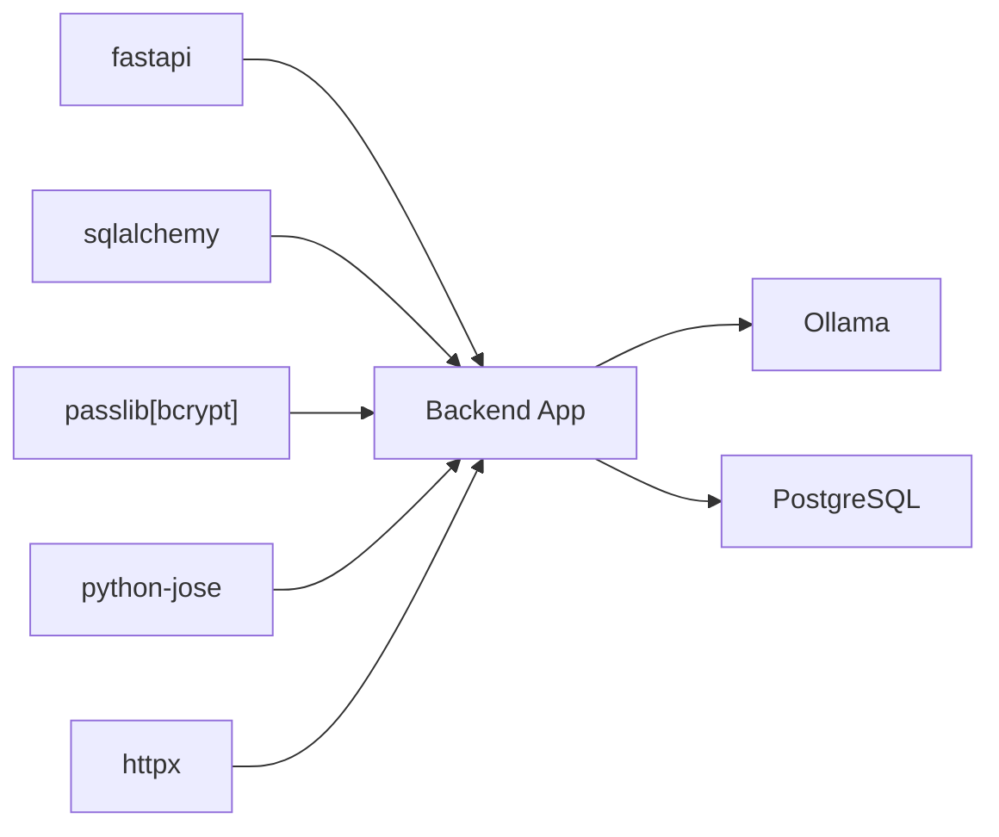

**Diagram sources**
- [requirements.txt:1-48](file://requirements.txt#L1-L48)
- [docker-compose.yml:52-75](file://docker-compose.yml#L52-L75)

**Section sources**
- [requirements.txt:1-48](file://requirements.txt#L1-L48)
- [docker-compose.yml:52-75](file://docker-compose.yml#L52-L75)

## Performance Considerations
- Connection Pooling and Pre-Ping
  - Enable pool pre-ping to detect dead connections and improve reliability.
- LLM Latency
  - Use warm-up scripts and model hot-loading to minimize cold-start latency.
- Frontend Token Handling
  - Avoid excessive token refresh calls; cache user data locally.
- **Container Performance**
  - **Resource limits** - Production containers have CPU and memory limits for resource isolation.
  - **Non-root performance** - Minimal performance impact from privilege separation.

## Troubleshooting Guide
- Authentication Failures
  - Verify JWT_SECRET_KEY is set and consistent across environments.
  - Ensure tokens are not expired and user remains active.
  - **New troubleshooting** - Check environment variable validation in production.
- Database Connectivity
  - Confirm DATABASE_URL normalization and credentials; check pool settings.
  - **Container issues** - Verify non-root user permissions for database files.
- LLM Availability
  - Use the LLM status endpoint to diagnose model readiness and connectivity.
  - Run the Ollama wait script during startup to ensure warm models.
  - **Container startup** - Check entrypoint script execution and Ollama readiness.
- **Nginx Issues**
  - **Security headers** - Verify production Nginx configuration with security headers.
  - **Rate limiting** - Check API rate limiting configuration and zone settings.
  - **Certificate issues** - Validate SSL certificate paths and renewal processes.

**Section sources**
- [auth.py:13-14](file://app/backend/middleware/auth.py#L13-L14)
- [database.py:5-20](file://app/backend/db/database.py#L5-L20)
- [main.py:262-326](file://app/backend/main.py#L262-L326)
- [wait_for_ollama.py:34-91](file://app/backend/scripts/wait_for_ollama.py#L34-L91)
- [nginx.prod.conf:40-45](file://nginx/nginx.prod.conf#L40-L45)

## Conclusion
Resume AI's current implementation establishes a solid foundation for authentication, tenant isolation, and LLM integration. The recent security enhancements significantly strengthen the platform's defenses through non-root user execution, environment-variable driven configurations, mandatory credential enforcement, and production-grade Nginx security headers. To achieve production-grade security, prioritize rotating JWT secrets, enabling TLS, enforcing stricter CORS and CSRF protections, validating and sanitizing all inputs, and expanding audit logging. Implement RBAC with granular permissions, secure file handling, and data retention policies aligned with compliance requirements. Conduct regular penetration testing and maintain an incident response plan.

**Updated** The platform now includes comprehensive security hardening measures including container-level security, environment variable validation, CSRF protection, and production-ready Nginx configurations.

## Appendices
- Environment Variables to Secure
  - JWT_SECRET_KEY, DATABASE_URL, OLLAMA_BASE_URL, OLLAMA_MODEL, ACCESS_TOKEN_EXPIRE_MINUTES, REFRESH_TOKEN_EXPIRE_DAYS, CORS_ORIGINS.
- **New Security Variables**
  - POSTGRES_PASSWORD (mandatory in production), OLLAMA_STARTUP_REQUIRED, ENVIRONMENT.
- Compliance Checklist
  - GDPR: Data minimization, retention, access/erasure requests, DPIA where applicable.
  - SOC2: Security, availability, confidentiality, processing integrity, and privacy principles.
- **Container Security Checklist**
  - Non-root user execution verified for all containers
  - Environment variable validation in place
  - Production Nginx security headers active
  - Rate limiting and SSL/TLS enforcement configured