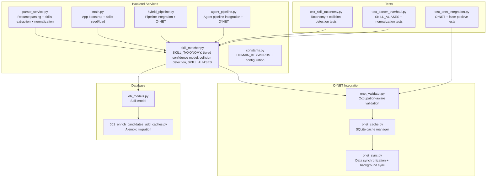
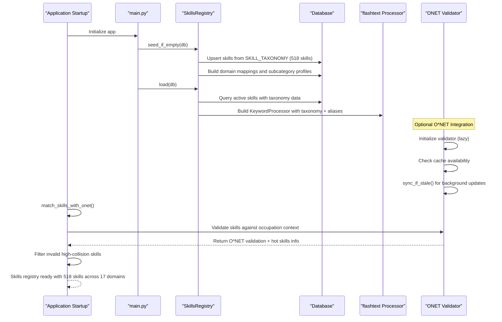
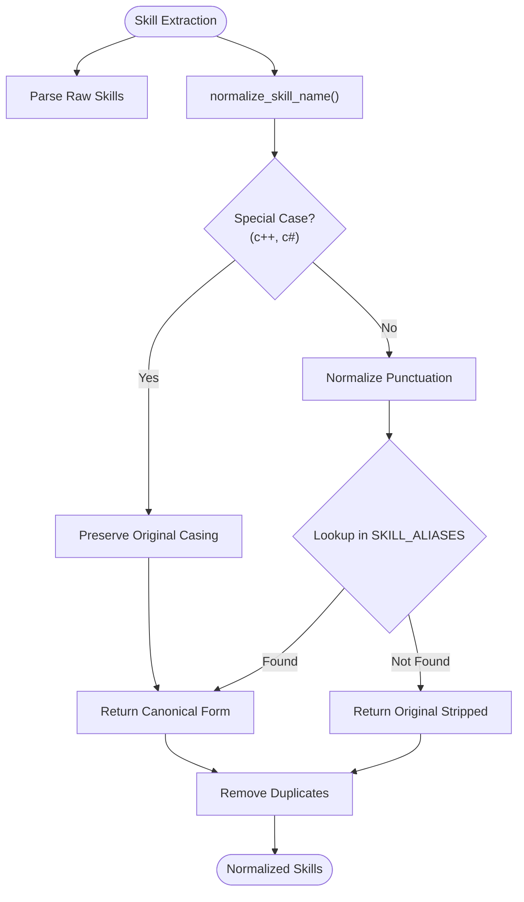
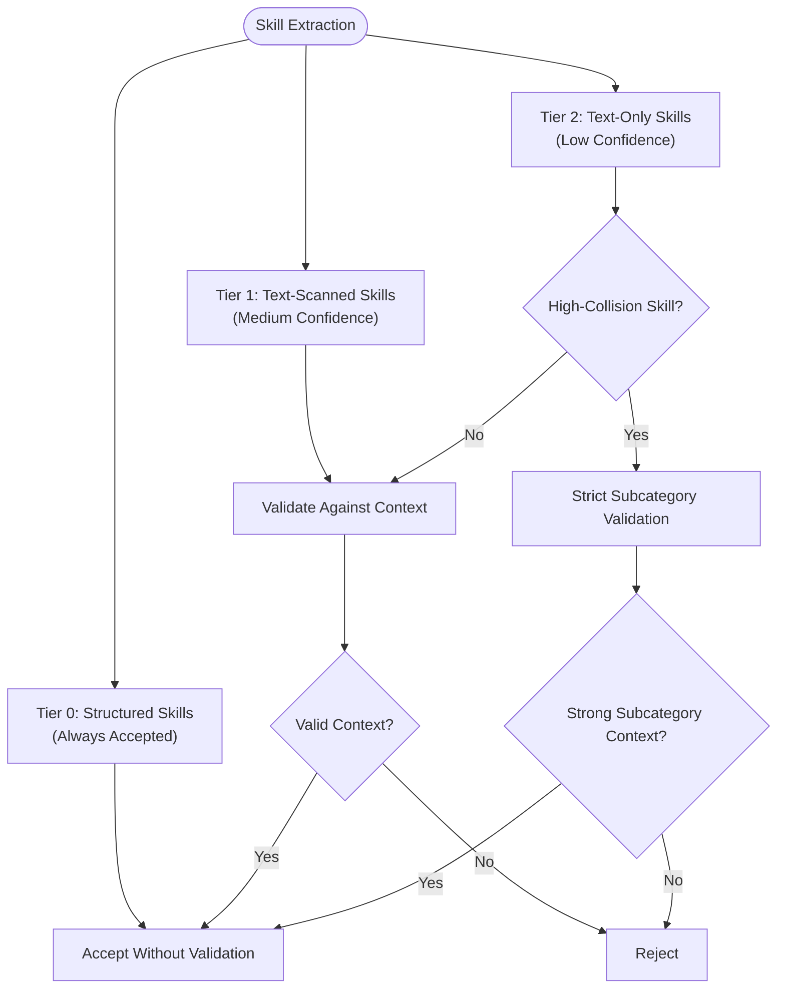
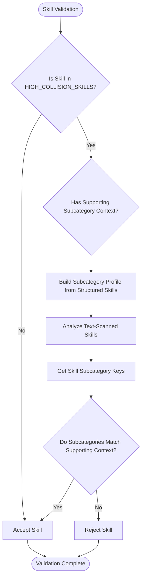
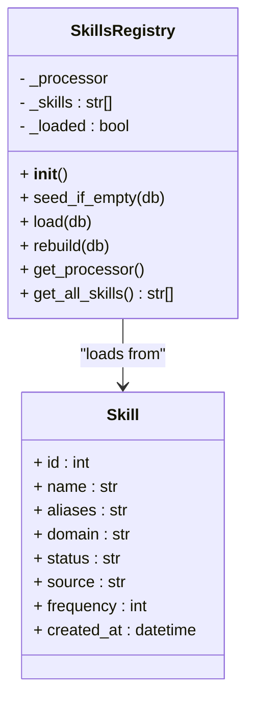
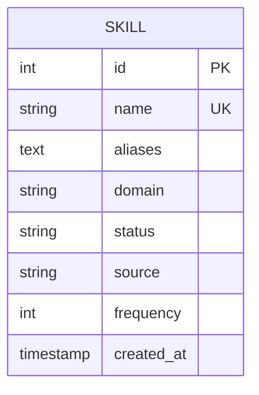
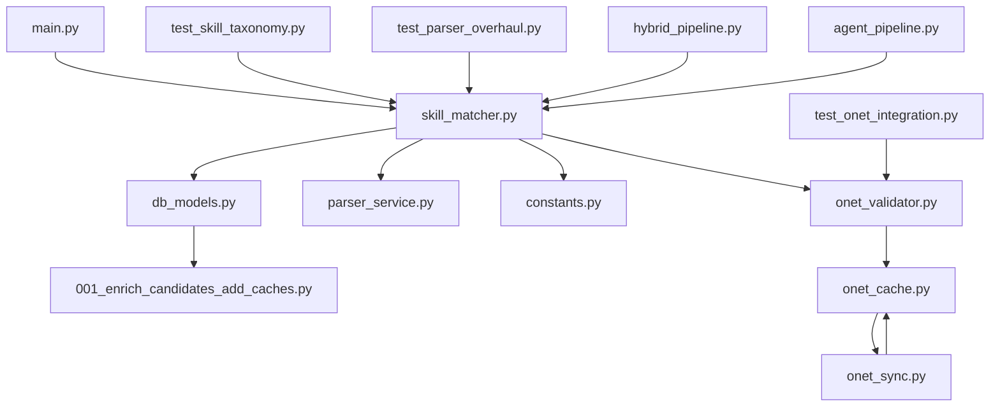

# Skills Registry Extension

<cite>
**Referenced Files in This Document**
- [skill_matcher.py](file://app/backend/services/skill_matcher.py)
- [db_models.py](file://app/backend/models/db_models.py)
- [parser_service.py](file://app/backend/services/parser_service.py)
- [constants.py](file://app/backend/services/constants.py)
- [001_enrich_candidates_add_caches.py](file://alembic/versions/001_enrich_candidates_add_caches.py)
- [main.py](file://app/backend/main.py)
- [hybrid_pipeline.py](file://app/backend/services/hybrid_pipeline.py)
- [agent_pipeline.py](file://app/backend/services/agent_pipeline.py)
- [test_skill_taxonomy.py](file://app/backend/tests/test_skill_taxonomy.py)
- [test_parser_overhaul.py](file://app/backend/tests/test_parser_overhaul.py)
- [onet_cache.py](file://app/backend/services/onet/onet_cache.py)
- [onet_sync.py](file://app/backend/services/onet/onet_sync.py)
- [onet_validator.py](file://app/backend/services/onet/onet_validator.py)
- [test_onet_integration.py](file://app/backend/tests/test_onet_integration.py)
- [README.md](file://data/onet/README.md)
</cite>

## Update Summary
**Changes Made**
- Enhanced skills registry with sophisticated tiered confidence model (Tier 0-2) for structured vs text-scanned skills
- Implemented advanced collision detection system with subcategory-level validation for high-collision skills
- Added comprehensive O*NET validation with granular validation information including hot skills and demand indicators
- Enhanced testing coverage for new validation mechanisms and false-positive prevention
- Improved skill matching with occupation-aware validation and automatic filtering of invalid high-collision skills
- **Updated** Enhanced normalization system with SKILL_ALIASES mapping for improved skill extraction handling of variations like 'nodejs', 'node.js', and 'Node'

## Table of Contents
1. [Introduction](#introduction)
2. [Project Structure](#project-structure)
3. [Core Components](#core-components)
4. [Architecture Overview](#architecture-overview)
5. [Detailed Component Analysis](#detailed-component-analysis)
6. [Tiered Confidence Model](#tiered-confidence-model)
7. [Advanced Collision Detection System](#advanced-collision-detection-system)
8. [Enhanced O*NET Integration](#enhanced-onet-integration)
9. [Pipeline Integrations](#pipeline-integrations)
10. [Dependency Analysis](#dependency-analysis)
11. [Performance Considerations](#performance-considerations)
12. [Troubleshooting Guide](#troubleshooting-guide)
13. [Conclusion](#conclusion)

## Introduction
This document provides comprehensive guidance for extending the skills registry system in Resume AI. The system has undergone a major transformation with the introduction of a sophisticated tiered confidence model, advanced collision detection system, and enhanced O*NET integration. The new SKILL_TAXONOMY structure features 17 distinct domains and 518 carefully organized skills, while the tiered confidence model distinguishes between structured (Tier 0) and text-scanned (Tier 2) skills to improve matching accuracy.

**Updated** The system now includes an advanced SKILL_ALIASES mapping system that provides sophisticated normalization for skill variations, enabling precise handling of common skill name variations like 'nodejs', 'node.js', and 'Node' while maintaining backward compatibility with existing MASTER_SKILLS structure.

The enhanced system provides precise domain classification, subcategory-level validation, O*NET-powered occupation-aware validation, sophisticated collision detection for high-collision skills, and maintains backward compatibility while supporting advanced skill discovery and validation capabilities.

## Project Structure
The skills registry is implemented in the backend service layer with a comprehensive taxonomy-based architecture and backed by a database model. The key files are:
- Skills registry and matching logic: [skill_matcher.py](file://app/backend/services/skill_matcher.py)
- Database model for skills: [db_models.py](file://app/backend/models/db_models.py)
- Resume parsing integration: [parser_service.py](file://app/backend/services/parser_service.py)
- Domain keywords configuration: [constants.py](file://app/backend/services/constants.py)
- Database migration for skills table: [001_enrich_candidates_add_caches.py](file://alembic/versions/001_enrich_candidates_add_caches.py)
- Application initialization and skills registry bootstrap: [main.py](file://app/backend/main.py)
- Hybrid pipeline integration: [hybrid_pipeline.py](file://app/backend/services/hybrid_pipeline.py)
- Agent pipeline integration: [agent_pipeline.py](file://app/backend/services/agent_pipeline.py)
- Taxonomy validation tests: [test_skill_taxonomy.py](file://app/backend/tests/test_skill_taxonomy.py)
- **Parser Overhaul Tests**: [test_parser_overhaul.py](file://app/backend/tests/test_parser_overhaul.py)
- **O*NET Integration Modules**: [onet_cache.py](file://app/backend/services/onet/onet_cache.py), [onet_sync.py](file://app/backend/services/onet/onet_sync.py), [onet_validator.py](file://app/backend/services/onet/onet_validator.py)
- **O*NET Integration Tests**: [test_onet_integration.py](file://app/backend/tests/test_onet_integration.py)
- **O*NET Data Cache**: [README.md](file://data/onet/README.md)



**Diagram sources**
- [skill_matcher.py](file://app/backend/services/skill_matcher.py)
- [db_models.py](file://app/backend/models/db_models.py)
- [parser_service.py](file://app/backend/services/parser_service.py)
- [constants.py](file://app/backend/services/constants.py)
- [001_enrich_candidates_add_caches.py](file://alembic/versions/001_enrich_candidates_add_caches.py)
- [main.py](file://app/backend/main.py)
- [hybrid_pipeline.py](file://app/backend/services/hybrid_pipeline.py)
- [agent_pipeline.py](file://app/backend/services/agent_pipeline.py)
- [test_skill_taxonomy.py](file://app/backend/tests/test_skill_taxonomy.py)
- [test_parser_overhaul.py](file://app/backend/tests/test_parser_overhaul.py)
- [onet_cache.py](file://app/backend/services/onet/onet_cache.py)
- [onet_sync.py](file://app/backend/services/onet/onet_sync.py)
- [onet_validator.py](file://app/backend/services/onet/onet_validator.py)
- [test_onet_integration.py](file://app/backend/tests/test_onet_integration.py)

**Section sources**
- [skill_matcher.py](file://app/backend/services/skill_matcher.py)
- [db_models.py](file://app/backend/models/db_models.py)
- [parser_service.py](file://app/backend/services/parser_service.py)
- [constants.py](file://app/backend/services/constants.py)
- [001_enrich_candidates_add_caches.py](file://alembic/versions/001_enrich_candidates_add_caches.py)
- [main.py](file://app/backend/main.py)
- [hybrid_pipeline.py](file://app/backend/services/hybrid_pipeline.py)
- [agent_pipeline.py](file://app/backend/services/agent_pipeline.py)
- [test_skill_taxonomy.py](file://app/backend/tests/test_skill_taxonomy.py)
- [test_parser_overhaul.py](file://app/backend/tests/test_parser_overhaul.py)
- [onet_cache.py](file://app/backend/services/onet/onet_cache.py)
- [onet_sync.py](file://app/backend/services/onet/onet_sync.py)
- [onet_validator.py](file://app/backend/services/onet/onet_validator.py)
- [test_onet_integration.py](file://app/backend/tests/test_onet_integration.py)

## Core Components
- **SKILL_TAXONOMY**: Comprehensive hierarchical skill taxonomy with 17 domains and 518 skills organized into subcategories, replacing the previous MASTER_SKILLS approach.
- **SKILL_ALIASES**: Enhanced mapping system that provides sophisticated normalization for skill variations, enabling precise handling of common variations like 'nodejs', 'node.js', and 'Node'.
- **Tiered Confidence Model**: Sophisticated skill confidence system distinguishing between structured (Tier 0) and text-scanned (Tier 2) skills for improved matching accuracy.
- **Advanced Collision Detection**: Enhanced system that eliminates false positives by requiring domain co-occurrence validation for high-collision skills using subcategory-level validation.
- **HIGH_COLLISION_SKILLS**: Set of 17 common English words that require subcategory-level validation to prevent false positives.
- **SkillsRegistry**: Database-backed registry with in-memory flashtext processor, supporting hot-reload capability and maintaining backward compatibility.
- **Domain Classification**: Hierarchical domain mapping with subcategory-level precision for accurate skill categorization.
- **Database Model**: Enhanced Skill model supporting taxonomy integration, domain mapping, and frequency tracking.
- **O*NET Integration**: SQLite-based caching system with occupation-aware skill validation, graceful degradation, and authoritative validation with hot skills detection.
- **match_skills_with_onet**: Enhanced skill matching function that integrates O*NET context for improved accuracy and automatic filtering of invalid high-collision skills.
- **ONETValidator**: Core validation service providing occupation-aware skill validation with comprehensive error handling, availability detection, and granular validation information.
- **ONETCache**: SQLite-based cache manager with comprehensive indexing and metadata support for O*NET data storage.
- **ONETSync**: Data synchronization script with automatic background synchronization capabilities and cache management.
- **Enhanced File Locking**: Improved file locking mechanism using fcntl/msvcrt libraries to prevent race conditions and ensure data consistency across multiple worker processes.

Key responsibilities:
- Maintaining comprehensive domain-clustered skill taxonomy with 17 distinct domains
- Implementing sophisticated SKILL_ALIASES mapping system for normalization of skill variations
- Implementing tiered confidence model for structured vs text-scanned skills
- Supporting sophisticated collision detection with subcategory-level validation for high-collision skills
- Providing backward compatibility with existing MASTER_SKILLS structure
- Enabling dynamic skill loading and hot-reloading without application restart
- **O*NET Integration**: Managing local SQLite cache, synchronizing with O*NET data, and providing occupation-aware validation with hot skills detection
- **Enhanced File Locking**: Implementing robust file locking to prevent race conditions during concurrent synchronization
- **Graceful Degradation**: Operating without O*NET data while maintaining full functionality
- **Pipeline Integration**: Seamlessly integrating O*NET validation into hybrid and agent pipeline workflows
- **Background Synchronization**: Automatically updating O*NET cache with configurable freshness checks and proper resource cleanup

**Section sources**
- [skill_matcher.py](file://app/backend/services/skill_matcher.py)
- [db_models.py](file://app/backend/models/db_models.py)
- [parser_service.py](file://app/backend/services/parser_service.py)
- [onet_cache.py](file://app/backend/services/onet/onet_cache.py)
- [onet_sync.py](file://app/backend/services/onet/onet_sync.py)
- [onet_validator.py](file://app/backend/services/onet/onet_validator.py)

## Architecture Overview
The skills registry architecture integrates a comprehensive domain-clustered taxonomy with in-memory fast text processing, sophisticated validation logic, and O*NET-based occupation-aware validation. The system seeds skills from SKILL_TAXONOMY, stores them in the database with domain classification, and loads them into a flashtext processor for efficient matching. The tiered confidence model distinguishes between structured (high-confidence) and text-scanned (low-confidence) skills, while the advanced collision detection system ensures accuracy by requiring subcategory-level context for high-collision skills. The O*NET integration provides authoritative occupation context for validation and automatic filtering of invalid high-collision skills.

**Updated** The enhanced normalization system with SKILL_ALIASES provides sophisticated handling of skill name variations, enabling precise matching of 'nodejs', 'node.js', and 'Node' as the same skill while preserving canonical casing for skills like 'Python'.



**Diagram sources**
- [main.py](file://app/backend/main.py)
- [skill_matcher.py](file://app/backend/services/skill_matcher.py)
- [onet_validator.py](file://app/backend/services/onet/onet_validator.py)

**Section sources**
- [main.py](file://app/backend/main.py)
- [skill_matcher.py](file://app/backend/services/skill_matcher.py)
- [onet_validator.py](file://app/backend/services/onet/onet_validator.py)

## Detailed Component Analysis

### SKILL_TAXONOMY Structure
The new SKILL_TAXONOMY provides a comprehensive hierarchical organization of 518 skills across 17 distinct domains:

**Programming Languages Domain** (51 skills)
- Core Imperative: Python, Java, C++, C#, C, Go, Rust, Kotlin, Swift, Ruby, PHP, Perl, Ada, Pascal, Assembly, Nim, Zig, Crystal
- Functional: Haskell, Erlang, Elixir, Clojure, F#, Lisp, Scheme, OCaml, ReasonML, PureScript, Elm, Scala
- Scripting: Bash, PowerShell, Groovy, Lua, Perl
- Specialized: R, MATLAB, Julia, SAS, SPSS, Minitab, Stata
- Blockchain: Solidity, Vyper, Move, Cairo

**Web Frontend Domain** (20 skills)
- Frameworks: React, Vue.js, Angular, Next.js, Nuxt.js, Svelte, Astro, Remix, Gatsby, Ember.js, Backbone.js, Qwik, Solid.js
- Libraries: jQuery, Lit, Stencil, Preact
- CSS Frameworks: Tailwind, Bootstrap, Material UI, Chakra UI, Ant Design
- Tools: Storybook, Webpack, Vite, Parcel, Rollup
- Markup: HTML, XML, HTMX, Alpine.js

**Web Backend Domain** (20 skills)
- Node.js: Node.js, Express.js, NestJS, Koa, Hapi, Feathers, Strapi
- Python: FastAPI, Django, Flask, Tornado, Aiohttp, Starlette, Litestar
- Java: Spring Boot, Spring, Quarkus, Micronaut
- Go: Gin, Fiber, Echo, Chi
- Rust: Actix, Axum, Rocket, Warp
- Ruby: Rails, Sinatra
- Elixir: Phoenix
- PHP: Laravel, Symfony, CodeIgniter
- .NET: ASP.NET, ASP.NET Core, DotNet, .NET, Blazor, WPF, WinForms

**Databases Domain** (20 skills)
- Relational: PostgreSQL, MySQL, SQLite, MariaDB, Oracle, Microsoft SQL Server, DB2, Informix, Sybase, Teradata, Greenplum
- NoSQL Document: MongoDB, CouchDB, Firebase, Firestore, Realm, Fauna
- NoSQL KV: Redis, Memcached
- Search/Timeseries: Elasticsearch, Cassandra, InfluxDB, TimescaleDB, ClickHouse
- Graph/Specialized: Neo4j, DynamoDB
- Cloud Managed: Snowflake, BigQuery, Redshift, Databricks, Supabase, PlanetScale
- ORMs: SQLAlchemy, Hibernate, Prisma, TypeORM, Sequelize, Drizzle, Mongoose, Entity Framework, Dapper

**Cloud Platforms Domain** (15 skills)
- Hyperscalers: Amazon Web Services, AWS, Google Cloud Platform, GCP, Microsoft Azure, Azure
- Regional: Digital Ocean, Linode, Vultr, Hetzner, Oracle Cloud, IBM Cloud, Alibaba Cloud
- Deployment Platforms: Vercel, Netlify, Heroku, Fly.io, Render, Railway
- Backend-as-a-Service: Supabase, Firebase, Appwrite, PocketBase
- Orchestration: Cloud Foundry, OpenShift, Rancher, Nomad

**AWS Services Domain** (12 skills)
- Compute: EC2, Lambda, ECS, EKS, Elastic Beanstalk
- Storage: S3, EBS, EFS
- Database: RDS, Aurora, DynamoDB
- Networking: VPC, API Gateway, CloudFront, Route53
- Messaging: SQS, SNS, Kinesis, EventBridge
- Analytics: Glue, Athena, EMR, SageMaker
- Management: CloudFormation, IAM, CloudWatch, Step Functions

**DevOps Infrastructure Domain** (20 skills)
- Containers: Docker, Docker Swarm
- Orchestration: Kubernetes, K8s, Helm, Kustomize
- IaC: Terraform, Ansible, Puppet, Chef, Vagrant, Packer, Pulumi
- CI/CD: Jenkins, GitHub Actions, GitLab CI, CircleCI, Travis CI, Bitbucket Pipelines, Argo CD, Flux, Spinnaker
- Monitoring: Prometheus, Grafana, Datadog, New Relic, Dynatrace, Splunk, ELK Stack, Loki, Jaeger, Zipkin, OpenTelemetry
- Networking/Proxy: Nginx, Apache, Traefik, Envoy
- Secrets: Vault, Consul

**Embedded Systems Domain** (15 skills)
- RTOS/OS: RTOS, FreeRTOS, Zephyr, VxWorks, QNX, Embedded Linux, Baremetal
- Hardware: Microcontroller, FPGA, ARM, ARM Cortex, AVR, PIC
- Protocols: UART, SPI, I2C, CAN Bus, Modbus, MQTT, CoAP, BLE, Zigbee, LoRaWAN
- Tools: OpenOCD, JTAG, GDB
- Standards: ISO 26262, MISRA, DO-178, Functional Safety
- Firmware: Firmware, BSP, Bootloader, Device Driver
- Industrial: PLC, Ladder Logic, SCADA, Industrial Automation

**Mobile Domain** (10 skills)
- iOS: iOS, Swift, SwiftUI, Objective-C, Xcode
- Android: Android, Kotlin, Jetpack Compose, Android Studio
- Cross-platform: React Native, Flutter, Xamarin, Ionic, Capacitor, Cordova

**AI/ML Domain** (20 skills)
- Core: Machine Learning, Deep Learning, Neural Networks, Reinforcement Learning, Generative AI, Computer Vision, Natural Language Processing, NLP
- Frameworks: PyTorch, TensorFlow, Keras, JAX, Scikit-learn, XGBoost, LightGBM
- LLM: Transformers, Hugging Face, LangChain, LlamaIndex, RAG, Fine-tuning, Ollama, OpenAI
- Tools: MLflow, Weights & Biases, Kubeflow, Vertex AI
- Vision: OpenCV, YOLO, Stable Diffusion

**Data Engineering Domain** (15 skills)
- Processing: Apache Spark, Spark, PySpark, Hadoop, Hive, Flink
- Messaging: Apache Kafka, Kafka, RabbitMQ
- Orchestration: Apache Airflow, Airflow, Prefect, Dagster
- Transformation: DBT, Fivetran, Airbyte
- Concepts: ETL, Data Pipeline, Data Warehousing, Data Lake, Data Mesh, Data Governance

**Data Science & Analytics Domain** (10 skills)
- Core Libraries: Pandas, NumPy, SciPy, Polars
- Visualization: Matplotlib, Seaborn, Plotly
- BI: Tableau, Power BI, Looker, Metabase
- Tools: Jupyter, Excel, Google Analytics

**Architecture & Design Domain** (10 skills)
- Patterns: Microservices, Event-Driven, CQRS, Event Sourcing, Saga Pattern, Domain Driven Design, DDD, Clean Architecture
- API: REST API, GraphQL, gRPC, WebSocket, OpenAPI, Swagger

**Security Domain** (10 skills)
- Auth: OAuth2, JWT, SAML, LDAP, RBAC
- Crypto: TLS, SSL, Cryptography
- Compliance: SOC2, GDPR, HIPAA, PCI DSS
- Practices: Penetration Testing, OWASP, Zero Trust

**Testing Domain** (10 skills)
- Types: Unit Testing, Integration Testing, E2E Testing, TDD, BDD
- Frameworks: PyTest, Jest, Vitest, Mocha, Cypress, Playwright, Selenium
- Performance: K6, Locust, JMeter
- Coverage: SonarQue, Codecov

**Blockchain Domain** (10 skills)
- Platforms: Ethereum, Bitcoin, Solana, Cardano, Polkadot
- Concepts: Blockchain, Web3, Smart Contracts, DeFi, NFT
- Tools: Hyperledger, Chainlink, IPFS

**Gaming & Graphics Domain** (5 skills)
- Engines: Unity, Unreal Engine, Godot
- Web: Three.js, Babylon.js, WebGL, WebGPU

**Networking Domain** (5 skills)
- Protocols: TCP/IP, UDP, HTTP, DNS, VPN
- Infrastructure: Load Balancing, CDN, Reverse Proxy, Firewall

**Project Management Domain** (10 skills)
- Methodologies: Agile, Scrum, Kanban, SAFe, Lean
- Tools: Jira, Confluence, Linear, Asana, Trello, Notion
- VCS: Git, GitHub, GitLab, Bitbucket

**Business & ERP Domain** (10 skills)
- CRM: Salesforce, HubSpot, Zoho
- ERP: SAP, Oracle ERP, Dynamics 365, Netsuite, Workday
- Service: ServiceNow, FreshDesk, Zendesk
- Low-code: Power Platform, Power Apps, OutSystems, Mendix

**Design & UX Domain** (5 skills)
- Tools: Figma, Sketch, Adobe XD
- Concepts: UI/UX, Wireframing, Prototyping, Accessibility, Responsive Design

**Soft Skills Domain** (5 skills)
- Communication: Communication, Technical Writing, Public Speaking
- Leadership: Leadership, Mentoring, Coaching
- Analytical: Problem Solving, Critical Thinking, Analytical Thinking

**Section sources**
- [skill_matcher.py](file://app/backend/services/skill_matcher.py)

### SKILL_ALIASES Mapping System
**Updated** The enhanced SKILL_ALIASES mapping system provides sophisticated normalization for skill variations, enabling precise handling of common skill name variations:

**Core Features:**
- **Canonical Preservation**: Preserves original casing for canonical skills (e.g., "Python" stays "Python")
- **Alias Expansion**: Maps variations like "nodejs" → "node.js", "react.js" → "react"
- **Special Case Handling**: Preserves "c++" and "c#" casing from SKILL_ALIASES keys
- **Punctuation Normalization**: Converts "react.js" to "react js" for lookup
- **Bidirectional Mapping**: Supports both canonical → alias and alias → canonical resolution

**Key Examples:**
- **JavaScript Ecosystem**: "javascript" → ["js", "ecmascript", "es6", "es2015", "es2020", "es2022"]
- **TypeScript**: "typescript" → ["ts"]
- **Python Variants**: "python" → ["py", "python3", "python 3"]
- **Go Language**: "golang" → ["go", "go lang", "go language"]
- **C Family**: "c++" → ["cpp", "c plus plus", "cplusplus"], "c#" → ["csharp", "c sharp", ".net c#", "dotnet c#"]
- **Kubernetes**: "kubernetes" → ["k8s", "kube", "k8"]
- **Node.js**: "node.js" → ["node", "nodejs", "express", "express.js"]

**Integration Points:**
- **Parser Service**: Uses `normalize_skill_name()` to deduplicate skills during extraction
- **Skills Registry**: Adds all aliases to flashtext processor for efficient matching
- **Database Seeding**: Persists aliases as comma-separated values for persistence



**Diagram sources**
- [skill_matcher.py](file://app/backend/services/skill_matcher.py)
- [parser_service.py](file://app/backend/services/parser_service.py)

**Section sources**
- [skill_matcher.py](file://app/backend/services/skill_matcher.py)
- [parser_service.py](file://app/backend/services/parser_service.py)

### Tiered Confidence Model
The sophisticated tiered confidence model distinguishes between different types of skill extraction with varying confidence levels:

**Tier 0: Structured Skills (High Confidence)**
- Extracted from structured candidate data sections
- High confidence validation without collision detection requirements
- Always accepted into the candidate skill set
- Examples: Parser output, form submissions, database fields

**Tier 1: Text-Scanned Skills (Medium Confidence)**
- Extracted from raw text using flashtext processor
- Subject to domain co-occurrence validation
- May be filtered based on context validation

**Tier 2: Text-Only Skills (Low Confidence)**
- Extracted from raw text using regex fallback
- Subject to strict collision detection validation
- Requires strong subcategory context to be accepted
- Examples: Raw text extraction, unstructured data



**Diagram sources**
- [skill_matcher.py](file://app/backend/services/skill_matcher.py)

**Section sources**
- [skill_matcher.py](file://app/backend/services/skill_matcher.py)

### Advanced Collision Detection System
The enhanced collision detection system eliminates false positives by implementing sophisticated subcategory-level validation for high-collision skills:

**High-Collision Skills Detection**
- Auto-detects skills appearing in 2+ domains plus known English-word homonyms
- Currently includes 17 skills: go, r, c, swift, ruby, rust, dart, scala, spark, rocket, phoenix, julia, nim, elixir, erlang, embedded, railway, rtos, communication, assembly
- Requires subcategory-level validation to prevent false positives

**Two-Pass Validation Process**
- Pass 1: Build subcategory profile from structured skills (Tier 0)
- Pass 2: Validate text-scanned skills with strict collision detection
- For high-collision skills, require supporting subcategory context from structured skills

**Subcategory-Level Validation**
- Uses (_get_skill_subcategory_keys) to determine skill subcategory membership
- Prevents homonym skill recognition (e.g., railway vs railway company)
- Ensures skills belong to the same subcategory as supporting context



**Diagram sources**
- [skill_matcher.py](file://app/backend/services/skill_matcher.py)

**Section sources**
- [skill_matcher.py](file://app/backend/services/skill_matcher.py)

### SkillsRegistry Class Enhancement
The SkillsRegistry has been enhanced to support the new taxonomy structure and tiered confidence model:

- **seed_if_empty()**: Upserts SKILL_TAXONOMY into the database with domain classification and subcategory mapping
- **load()**: Queries active skills with taxonomy data, merges aliases, and builds the processor
- **rebuild()**: Marks registry as unloaded and reloads on next access
- **get_processor()/get_all_skills()**: Provides access to the processor and loaded skill list



**Diagram sources**
- [skill_matcher.py](file://app/backend/services/skill_matcher.py)
- [db_models.py](file://app/backend/models/db_models.py)

**Section sources**
- [skill_matcher.py](file://app/backend/services/skill_matcher.py)
- [db_models.py](file://app/backend/models/db_models.py)

### Database Schema for Skills Management
The enhanced Skill model defines the schema for storing skills in the database with taxonomy support:
- **id**: Primary key
- **name**: Unique canonical skill name (518 skills across 17 domains)
- **aliases**: Comma-separated list of aliases
- **domain**: Primary domain (e.g., programming_languages, web_frontend, databases)
- **status**: Active/pending/rejected
- **source**: Seed/manual/discovered
- **frequency**: Count of occurrences in JDs/resumes
- **created_at**: Timestamp

Migration details:
- Creates the skills table with appropriate indexes
- Ensures id and name uniqueness
- Adds indexes for performance
- Supports taxonomy integration with domain classification



**Diagram sources**
- [db_models.py](file://app/backend/models/db_models.py)
- [001_enrich_candidates_add_caches.py](file://alembic/versions/001_enrich_candidates_add_caches.py)

**Section sources**
- [db_models.py](file://app/backend/models/db_models.py)
- [001_enrich_candidates_add_caches.py](file://alembic/versions/001_enrich_candidates_add_caches.py)

### Enhanced Skill Normalization and Matching
**Updated** Enhanced normalization and matching logic with sophisticated SKILL_ALIASES integration:
- **_normalize_skill()**: Lowercases and normalizes special characters while preserving specific cases (e.g., C++, C#)
- **normalize_skill_name()**: Public API that uses SKILL_ALIASES for comprehensive normalization and alias resolution
- **_expand_skill()**: Returns the canonical skill plus all normalized aliases
- **_get_skill_domains()**: Returns set of top-level domain names for a skill using SKILL_TAXONOMY
- **_get_skill_subcategory_keys()**: Returns set of (domain, subcategory) tuples for precise validation
- **match_skills()**: Implements tiered confidence model with sophisticated collision detection
- **match_skills_with_onet()**: Enhanced matching with O*NET occupation-aware validation and automatic filtering

**Section sources**
- [skill_matcher.py](file://app/backend/services/skill_matcher.py)

### Extending the SKILL_TAXONOMY
To add new skills to the taxonomy:
1. Add new canonical skills to the appropriate domain/subcategory in SKILL_TAXONOMY
2. Run application startup to seed the database via seed_if_empty()
3. The migration ensures new skills are inserted without conflicts
4. High-collision skills automatically benefit from advanced collision detection

**Section sources**
- [skill_matcher.py](file://app/backend/services/skill_matcher.py)
- [001_enrich_candidates_add_caches.py](file://alembic/versions/001_enrich_candidates_add_caches.py)

### Implementing Custom Skill Alias Mappings
**Updated** To implement custom alias mappings:
1. Extend SKILL_ALIASES in [skill_matcher.py](file://app/backend/services/skill_matcher.py) with canonical -> [aliases] mappings
2. On next seed/load, aliases are persisted and added to the flashtext processor
3. Aliases automatically inherit taxonomy classification from canonical skills
4. The normalize_skill_name() function handles bidirectional mapping for both directions

**Section sources**
- [skill_matcher.py](file://app/backend/services/skill_matcher.py)

### Extending Domain Keyword Recognition
To extend domain keyword recognition:
1. Add domain-specific keywords to DOMAIN_KEYWORDS in [constants.py](file://app/backend/services/constants.py)
2. During seeding, domain mappings are built from keywords to domains and stored with skills
3. The taxonomy system provides more precise domain classification than keyword-based approaches

**Section sources**
- [constants.py](file://app/backend/services/constants.py)

### Dynamic Skill Loading and Hot-Reloading
Enhanced dynamic loading and hot-reloading:
- Skills are loaded lazily on first access with taxonomy support
- rebuild() marks the registry as unloaded, triggering reload on next access
- seed_if_empty() safely seeds the database on every startup with SKILL_TAXONOMY
- Backward compatibility maintained with MASTER_SKILLS fallback

**Section sources**
- [skill_matcher.py](file://app/backend/services/skill_matcher.py)
- [main.py](file://app/backend/main.py)

### Skills Database Maintenance Procedures
Enhanced maintenance procedures:
- **Seed new skills**: Call seed_if_empty() to upsert new entries from SKILL_TAXONOMY
- **Update taxonomy**: Modify SKILL_TAXONOMY structure and call rebuild() to refresh the processor
- **Adjust domains**: Update DOMAIN_KEYWORDS and re-seed to repopulate domain mappings
- **Monitor frequency**: Use the frequency column to track skill popularity and optimize taxonomy
- **Validate taxonomy**: Use test_skill_taxonomy.py to ensure taxonomy integrity
- **Update aliases**: Modify SKILL_ALIASES to add new normalization mappings

**Section sources**
- [skill_matcher.py](file://app/backend/services/skill_matcher.py)
- [parser_service.py](file://app/backend/services/parser_service.py)
- [main.py](file://app/backend/main.py)
- [test_skill_taxonomy.py](file://app/backend/tests/test_skill_taxonomy.py)

### Advanced Features
Enhanced advanced features:
- **Tiered Confidence Model**: Sophisticated distinction between structured (Tier 0) and text-scanned (Tier 2) skills
- **Advanced Collision Detection**: Enhanced validation logic prevents false positives for high-collision skills
- **Hierarchical Domain Classification**: 17 distinct domains with precise subcategory mapping
- **Two-Pass Validation System**: Eliminates false positives by requiring supporting context
- **Backward Compatibility**: Maintains MASTER_SKILLS for legacy integrations
- **Taxonomy-Aware Matching**: Accurate skill categorization based on domain and subcategory relationships
- **Enhanced SKILL_ALIASES System**: Sophisticated normalization for skill variations like 'nodejs', 'node.js', 'Node'
- **O*NET Integration**: Occupation-aware validation with authoritative data source and hot skills detection
- **Enhanced File Locking**: Robust file locking mechanism preventing race conditions during concurrent operations
- **Graceful Degradation**: Continues operation without O*NET data while maintaining functionality
- **Background Synchronization**: Automatic cache updates with configurable freshness checks and proper resource cleanup

**Section sources**
- [skill_matcher.py](file://app/backend/services/skill_matcher.py)
- [db_models.py](file://app/backend/models/db_models.py)
- [onet_validator.py](file://app/backend/services/onet/onet_validator.py)

## Tiered Confidence Model

### Skill Confidence Levels
The enhanced skill matcher implements a sophisticated tiered confidence model that distinguishes between different types of skill extraction:

**Tier 0: Structured Skills (High Confidence)**
- Extracted from structured candidate data sections
- High confidence validation without collision detection requirements
- Always accepted into the candidate skill set regardless of collision status
- Examples: Parser output, form submissions, database fields

**Tier 1: Text-Scanned Skills (Medium Confidence)**
- Extracted from raw text using flashtext processor
- Subject to domain co-occurrence validation
- May be filtered based on context validation from structured skills
- Lower confidence than Tier 0 but higher than Tier 2

**Tier 2: Text-Only Skills (Low Confidence)**
- Extracted from raw text using regex fallback
- Subject to strict collision detection validation
- Requires strong subcategory context to be accepted
- Highest collision detection requirements among all tiers

### Implementation Details
The tiered confidence model is implemented in the main matching function with explicit parameter support:

```python
def match_skills(candidate_skills, jd_skills, jd_nice_to_have=None,
                structured_skills=None, text_scanned_skills=None) -> dict:
    """
    Unified skill matching with tiered confidence model.
    
    Args:
        candidate_skills: List of skills from structured sections (Tier 0)
        jd_skills: List of required skills from the job description
        jd_nice_to_have: Optional list of nice-to-have skills
        structured_skills: Tier 0 skills (parser output, high confidence)
        text_scanned_skills: Tier 2 skills (text-scanned, low confidence)
    """
```

**Section sources**
- [skill_matcher.py](file://app/backend/services/skill_matcher.py)

### Tiered Validation Logic
The tiered validation logic implements different validation requirements based on skill confidence level:

**Structured Skills (Tier 0)**: Always accepted without validation requirements
**Text-Scanned Skills (Tier 1)**: Subject to basic domain co-occurrence validation
**Text-Only Skills (Tier 2)**: Subject to strict collision detection validation

**Section sources**
- [skill_matcher.py](file://app/backend/services/skill_matcher.py)

## Advanced Collision Detection System

### High-Collision Skills Detection
The system automatically detects skills that appear in multiple domains plus known English-word homonyms:

**Auto-Detection Algorithm**:
1. Analyzes SKILL_TAXONOMY to find skills appearing in 2+ top-level domains
2. Combines with predefined English-word homonyms known to cause false positives
3. Generates HIGH_COLLISION_SKILLS set for collision detection

**Current High-Collision Skills**:
- go, r, c, swift, ruby, rust, dart, scala, spark, rocket, phoenix, julia, nim, elixir, erlang, embedded, railway, rtos, communication, assembly

**Section sources**
- [skill_matcher.py](file://app/backend/services/skill_matcher.py)

### Subcategory-Level Validation
The enhanced collision detection system uses subcategory-level validation to prevent false positives:

**Subcategory Detection**:
- Uses `_get_skill_subcategory_keys()` to determine skill subcategory membership
- Prevents homonym skill recognition (e.g., railway vs railway company)
- Ensures skills belong to the same subcategory as supporting context

**Validation Process**:
1. Build subcategory profile from structured skills (Tier 0)
2. For high-collision skills, require supporting subcategory context
3. Reject skills that lack sufficient subcategory context

**Section sources**
- [skill_matcher.py](file://app/backend/services/skill_matcher.py)

### False-Positive Prevention
The collision detection system prevents common false positives:

**Railway Example**: Prevents recognition of "railway" in non-cloud contexts
**RTOS Example**: Prevents recognition of "rtos" in non-embedded contexts
**Other Homonyms**: Handles various English-word homonyms that appear in non-technical contexts

**Section sources**
- [test_onet_integration.py](file://app/backend/tests/test_onet_integration.py)

## Enhanced O*NET Integration

### ONETCache: SQLite-Based Cache Manager
The ONETCache provides a local SQLite database for storing O*NET occupational data with comprehensive indexing and metadata support:

**Core Features:**
- **Schema Management**: Automatic table creation with proper constraints and indexes
- **Metadata Tracking**: Stores O*NET version, download date, and statistics
- **Occupation Management**: Upsert operations for SOC codes, titles, and descriptions
- **Technology Skills**: Comprehensive skill mapping with commodity codes and validation flags
- **Alternate Titles**: Support for job title variations and synonyms
- **Query Optimization**: Indexes for fast skill lookup and title matching

**Database Schema:**
- **onet_occupation**: SOC code, title, description
- **onet_technology_skill**: Skill mapping with commodity codes and validation flags
- **onet_alternate_title**: Job title variations and short forms
- **onet_metadata**: System metadata and statistics

**Section sources**
- [onet_cache.py](file://app/backend/services/onet/onet_cache.py)

### ONETSync: Data Synchronization Script
The ONETSync script handles downloading and processing O*NET data from the official source with enhanced file locking mechanism:

**Enhanced File Locking Features:**
- **Cross-Platform Locking**: Uses fcntl library for Unix systems and msvcrt for Windows
- **Race Condition Prevention**: Prevents multiple worker processes from syncing simultaneously
- **Non-Blocking Lock Acquisition**: Attempts to acquire locks without blocking other processes
- **Proper Resource Cleanup**: Ensures file descriptors are properly closed even in error conditions
- **Graceful Failure Handling**: Skips synchronization if another process holds the lock

**Key Capabilities:**
- **Automated Download**: Downloads O*NET database ZIP from official source
- **CSV Parsing**: Processes Occupation Data, Technology Skills, and Alternate Titles
- **Data Validation**: Column mapping and validation with error handling
- **Progress Tracking**: Logging and progress reporting during sync
- **Background Synchronization**: Automatic cache updates with freshness checks
- **Enhanced Error Handling**: Comprehensive exception handling and cleanup

**Supported Files:**
- Occupation Data.txt: SOC code, title, description
- Technology Skills.txt: Skills with hot technology and in-demand flags
- Alternate Titles.txt: Job title variations and synonyms

**Section sources**
- [onet_sync.py](file://app/backend/services/onet/onet_sync.py)

### ONETValidator: Occupation-Aware Validation
The ONETValidator provides authoritative skill validation against O*NET occupational data:

**Enhanced Validation Features:**
- **Occupation Resolution**: Maps job titles to SOC codes with confidence scores
- **Skill Validation**: Validates skills against occupation-specific technology skills
- **Hot Technology Detection**: Identifies skills marked as hot technology or in-demand
- **Batch Processing**: Validates multiple skills with match ratios
- **Granular Validation Information**: Returns detailed validation results with hot skills indicators
- **Graceful Degradation**: Operates without O*NET data while maintaining functionality
- **Availability Detection**: Tracks cache availability and provides status information

**Enhanced Validation Methods:**
- **resolve_occupation()**: Maps job titles to SOC codes with confidence
- **validate_skill()**: Checks individual skill recognition for occupation with hot skills info
- **validate_skills_batch()**: Validates multiple skills with match ratios and hot skills detection
- **get_expected_skills()**: Retrieves all technology skills for occupation

**Section sources**
- [onet_validator.py](file://app/backend/services/onet/onet_validator.py)

### match_skills_with_onet Function Enhancement
The enhanced match_skills_with_onet function provides comprehensive skill matching with O*NET occupation-aware validation:

**Enhanced Functionality:**
- **Job Title Parameter**: Optional job_title parameter enables O*NET validation
- **Graceful Fallback**: Falls back to standard match_skills when O*NET data unavailable
- **Occupation Context**: Validates skills against authoritative O*NET data
- **False Positive Prevention**: Prevents homonym skill recognition (e.g., railway, rtos)
- **Hot Technology Identification**: Flags skills marked as hot technology or in-demand
- **Match Ratio Enhancement**: Provides occupation-specific match ratios
- **Automatic Filtering**: Filters invalid high-collision skills based on O*NET validation
- **Comprehensive Validation Results**: Returns detailed O*NET validation information

**Enhanced Integration Benefits:**
- **Occupation Context**: Validates skills against authoritative O*NET data
- **False Positive Prevention**: Prevents homonym skill recognition (e.g., railway, rtos)
- **Hot Technology Identification**: Flags skills marked as hot technology or in-demand
- **Match Ratio Enhancement**: Provides occupation-specific match ratios
- **Automatic Invalid Skill Removal**: Filters out high-collision skills not valid for the specified occupation
- **Graceful Fallback**: Continues operation without O*NET data

**Section sources**
- [skill_matcher.py](file://app/backend/services/skill_matcher.py)

### O*NET Validation Fields Enhancement
The enhanced skill matching results include comprehensive O*NET validation fields:

**Enhanced Validation Results:**
- **soc_code**: O*NET SOC code for the matched occupation
- **occupation_title**: Title of the matched occupation
- **occupation_match_ratio**: Match ratio for the occupation
- **validated**: Array of validated skills with recognition flags and hot skills indicators
- **skill_validations**: Dictionary-indexed form for downstream filtering

**Hot Technology Detection Enhancement:**
- **is_hot**: Indicates if skill is marked as hot technology
- **is_in_demand**: Indicates if skill is marked as in-demand
- **commodity**: Commodity category for the skill

**Invalid High-Collision Filtering**:
- **onet_filtered**: List of high-collision skills filtered out by O*NET validation
- Automatic removal of high-collision skills not valid for the specified occupation

**Section sources**
- [skill_matcher.py](file://app/backend/services/skill_matcher.py)
- [test_onet_integration.py](file://app/backend/tests/test_onet_integration.py)

### O*NET Data Cache Management
The O*NET data cache system manages local storage and synchronization:

**Enhanced Cache Features:**
- **Local Storage**: SQLite database in data/onet/db/onet_cache.db
- **Automatic Sync**: Command-line interface for data synchronization
- **Version Tracking**: Metadata tracking for O*NET version and update dates
- **Performance Optimization**: Indexes and query optimization for fast lookups
- **Maintenance Support**: Tools for cache population and validation
- **Background Synchronization**: Automatic cache updates with configurable freshness
- **Enhanced File Locking**: Prevents race conditions during concurrent operations

**Section sources**
- [README.md](file://data/onet/README.md)

## Pipeline Integrations

### Hybrid Pipeline Integration
The hybrid pipeline seamlessly integrates O*NET validation into the analysis workflow:

**Enhanced Integration Points:**
- **Skill Matching**: Uses match_skills_with_onet instead of standard match_skills
- **Job Title Extraction**: Passes job_title from JD analysis to validation
- **Validation Results**: Incorporates onet_validation fields into final results
- **Hot Technology Tracking**: Extracts onet_hot_skills for enhanced insights
- **Invalid Skill Filtering**: Automatically removes invalid high-collision skills

**Enhanced Result Fields:**
- **onet_occupation**: Occupation title from O*NET validation
- **onet_soc_code**: SOC code for the occupation
- **onet_match_ratio**: Match ratio for occupation validation
- **onet_hot_skills**: List of hot technology skills identified
- **onet_filtered**: List of high-collision skills filtered out

**Section sources**
- [hybrid_pipeline.py](file://app/backend/services/hybrid_pipeline.py)
- [skill_matcher.py](file://app/backend/services/skill_matcher.py)

### Agent Pipeline Integration
The agent pipeline provides comprehensive O*NET integration through LangGraph:

**Enhanced Integration Implementation:**
- **Node-Level Validation**: Applies O*NET validation in skill analysis nodes
- **Error Handling**: Graceful fallback when O*NET data unavailable
- **Field Extraction**: Extracts validation results into pipeline output
- **Consistency**: Maintains backward compatibility with existing fields
- **Hot Technology Detection**: Identifies emerging technology trends

**Enhanced Output Fields:**
- **onet_occupation**: Occupation validation result
- **onet_soc_code**: SOC code identification
- **onet_match_ratio**: Occupation match confidence
- **onet_hot_skills**: Hot technology skill detection
- **onet_filtered**: Invalid high-collision skills removal

**Section sources**
- [agent_pipeline.py](file://app/backend/services/agent_pipeline.py)
- [skill_matcher.py](file://app/backend/services/skill_matcher.py)

### Pipeline Result Enhancement
Both pipeline integrations enhance the analysis results with O*NET validation:

**Enhanced Common Features:**
- **Occupation Context**: Provides authoritative occupation validation
- **Hot Technology Insights**: Identifies emerging technology trends
- **False Positive Reduction**: Prevents incorrect skill recognition
- **Match Confidence**: Improves overall matching accuracy
- **Invalid Skill Filtering**: Automatically removes high-collision skills not valid for the occupation

**Enhanced Integration Benefits:**
- **Seamless Integration**: Minimal code changes required
- **Backward Compatibility**: Existing code continues to work
- **Enhanced Accuracy**: Significant improvement in skill matching
- **Future-Proof**: Leverages authoritative O*NET data source
- **Automatic Filtering**: Invalid high-collision skills are automatically removed

**Section sources**
- [hybrid_pipeline.py](file://app/backend/services/hybrid_pipeline.py)
- [agent_pipeline.py](file://app/backend/services/agent_pipeline.py)
- [skill_matcher.py](file://app/backend/services/skill_matcher.py)

## Dependency Analysis
The enhanced skills registry depends on:
- Database model for taxonomy-aware persistence
- Alembic migration for schema creation with taxonomy support
- Parser service for integration with enhanced matching and normalization
- Application bootstrap for initialization with taxonomy seeding
- Test suite for taxonomy validation, collision detection, and normalization
- **O*NET Integration**: SQLite cache, synchronization script, and validation service
- **Enhanced File Locking**: fcntl/msvcrt libraries for race condition prevention
- **Hybrid Pipeline**: Integration with O*NET validation for enhanced matching
- **Agent Pipeline**: LangGraph-based integration with comprehensive validation



**Diagram sources**
- [skill_matcher.py](file://app/backend/services/skill_matcher.py)
- [db_models.py](file://app/backend/models/db_models.py)
- [parser_service.py](file://app/backend/services/parser_service.py)
- [constants.py](file://app/backend/services/constants.py)
- [001_enrich_candidates_add_caches.py](file://alembic/versions/001_enrich_candidates_add_caches.py)
- [main.py](file://app/backend/main.py)
- [test_skill_taxonomy.py](file://app/backend/tests/test_skill_taxonomy.py)
- [test_parser_overhaul.py](file://app/backend/tests/test_parser_overhaul.py)
- [test_onet_integration.py](file://app/backend/tests/test_onet_integration.py)
- [hybrid_pipeline.py](file://app/backend/services/hybrid_pipeline.py)
- [agent_pipeline.py](file://app/backend/services/agent_pipeline.py)
- [onet_cache.py](file://app/backend/services/onet/onet_cache.py)
- [onet_sync.py](file://app/backend/services/onet/onet_sync.py)
- [onet_validator.py](file://app/backend/services/onet/onet_validator.py)

**Section sources**
- [skill_matcher.py](file://app/backend/services/skill_matcher.py)
- [db_models.py](file://app/backend/models/db_models.py)
- [parser_service.py](file://app/backend/services/parser_service.py)
- [constants.py](file://app/backend/services/constants.py)
- [001_enrich_candidates_add_caches.py](file://alembic/versions/001_enrich_candidates_add_caches.py)
- [main.py](file://app/backend/main.py)
- [test_skill_taxonomy.py](file://app/backend/tests/test_skill_taxonomy.py)
- [test_parser_overhaul.py](file://app/backend/tests/test_parser_overhaul.py)
- [test_onet_integration.py](file://app/backend/tests/test_onet_integration.py)
- [hybrid_pipeline.py](file://app/backend/services/hybrid_pipeline.py)
- [agent_pipeline.py](file://app/backend/services/agent_pipeline.py)
- [onet_cache.py](file://app/backend/services/onet/onet_cache.py)
- [onet_sync.py](file://app/backend/services/onet/onet_sync.py)
- [onet_validator.py](file://app/backend/services/onet/onet_validator.py)

## Performance Considerations
Enhanced performance optimizations:
- **Hierarchical taxonomy processing**: Organized skill structure improves matching efficiency
- **Tiered confidence model**: Reduces validation overhead by eliminating unnecessary collision detection for high-confidence skills
- **Advanced collision detection optimization**: Limits validation scope to high-collision skills (17 out of 518)
- **Subcategory-level caching**: Reduces redundant validation calculations
- **Database indexing**: Optimized indexes for taxonomy queries and skill lookups
- **Memory efficiency**: Hierarchical structure reduces memory overhead compared to flat lists
- **Backward compatibility**: Maintains performance of existing MASTER_SKILLS integration
- **O*NET Cache Optimization**: SQLite indexing and query optimization for fast validation
- **Enhanced File Locking**: Non-blocking file locking prevents performance bottlenecks
- **Graceful Degradation**: Minimal performance impact when O*NET data is unavailable
- **Lazy Initialization**: ONET validator initialized only when needed
- **Background Synchronization**: Automatic cache updates without blocking main operations
- **Resource Cleanup**: Proper file descriptor cleanup prevents resource leaks
- **Pipeline Integration**: Efficient O*NET validation without impacting pipeline performance
- **Invalid Skill Filtering**: Automatic removal of invalid high-collision skills reduces downstream processing overhead
- **SKILL_ALIASES Optimization**: Bidirectional mapping reduces lookup complexity and improves normalization performance

**Section sources**
- [skill_matcher.py](file://app/backend/services/skill_matcher.py)
- [onet_cache.py](file://app/backend/services/onet/onet_cache.py)
- [onet_validator.py](file://app/backend/services/onet/onet_validator.py)
- [onet_sync.py](file://app/backend/services/onet/onet_sync.py)

## Troubleshooting Guide
Enhanced troubleshooting for the new taxonomy system:
- **Skills not recognized**: Verify that the skill exists in SKILL_TAXONOMY and is properly categorized
- **False positives**: Check HIGH_COLLISION_SKILLS validation logic and ensure subcategory context exists
- **Tiered confidence issues**: Verify that structured skills are properly separated from text-scanned skills
- **Matching inconsistencies**: Review _normalize_skill() and _expand_skill() logic for special cases like C++ and C#
- **Database connectivity failures**: The system falls back to MASTER_SKILLS; check logs for warnings
- **Hot-reload not taking effect**: Confirm rebuild() is called and the registry is marked as unloaded
- **Taxonomy validation errors**: Use test_skill_taxonomy.py to validate taxonomy structure integrity
- **Performance issues**: Monitor tiered confidence model overhead and optimize taxonomy structure
- **O*NET Cache Issues**: Check data/onet/db/onet_cache.db accessibility and SQLite connectivity
- **Synchronization Failures**: Verify network connectivity and O*NET data source availability
- **Enhanced File Locking Issues**: Check for proper file descriptor cleanup and lock acquisition
- **Race Condition Problems**: Verify fcntl/msvcrt libraries are available and functioning correctly
- **Validation Errors**: Check O*NET validator availability and job title resolution
- **Graceful Degradation**: Confirm fallback behavior when O*NET data is unavailable
- **Pipeline Integration Issues**: Verify job_title parameter is properly passed to match_skills_with_onet
- **Validation Field Missing**: Check that O*NET cache is populated and accessible
- **Background Synchronization Issues**: Verify sync_if_stale() is running and cache freshness checks are working
- **Cache Age Problems**: Check download_date metadata and ensure cache is not expired beyond configured threshold
- **Resource Leak Detection**: Monitor file descriptor usage and ensure proper cleanup in error conditions
- **Invalid Skill Filtering Issues**: Verify that high-collision skills are being properly filtered out by O*NET validation
- **SKILL_ALIASES Issues**: Check that alias mappings are properly formatted and normalized
- **Parser Normalization Problems**: Verify that normalize_skill_name() is being called during skill extraction

**Section sources**
- [skill_matcher.py](file://app/backend/services/skill_matcher.py)
- [test_skill_taxonomy.py](file://app/backend/tests/test_skill_taxonomy.py)
- [test_parser_overhaul.py](file://app/backend/tests/test_parser_overhaul.py)
- [test_onet_integration.py](file://app/backend/tests/test_onet_integration.py)
- [onet_cache.py](file://app/backend/services/onet/onet_cache.py)
- [onet_sync.py](file://app/backend/services/onet/onet_sync.py)
- [onet_validator.py](file://app/backend/services/onet/onet_validator.py)
- [parser_service.py](file://app/backend/services/parser_service.py)

## Conclusion
The enhanced skills registry system in Resume AI provides a robust, extensible foundation for managing skills with comprehensive domain clustering, sophisticated validation, and authoritative O*NET integration. The new SKILL_TAXONOMY structure with 17 distinct domains and 518 carefully organized skills, combined with the tiered confidence model and advanced collision detection system, delivers unprecedented accuracy in skill matching while maintaining backward compatibility.

**Updated** The enhanced SKILL_ALIASES mapping system represents a significant advancement in skill normalization, providing sophisticated handling of skill name variations like 'nodejs', 'node.js', and 'Node' while preserving canonical casing for skills like 'Python'. This enhancement improves the system's ability to handle diverse skill representations commonly found in resumes and job descriptions.

The enhanced O*NET integration adds four core modules (onet_cache.py, onet_sync.py, onet_validator.py) that provide authoritative occupational context, reduce false positives, and improve matching accuracy with graceful degradation capabilities. The system's hierarchical approach to skill organization, subcategory-level validation, taxonomy-aware matching, and O*NET-powered validation enables precise domain classification and eliminates false positives that plagued the previous MASTER_SKILLS approach.

The tiered confidence model distinguishes between structured (Tier 0) and text-scanned (Tier 2) skills, improving matching accuracy by applying different validation requirements based on skill confidence levels. The advanced collision detection system automatically identifies high-collision skills and applies sophisticated subcategory-level validation to prevent false positives.

The enhanced file locking mechanism using fcntl/msvcrt libraries ensures data consistency across multiple worker processes, preventing race conditions and guaranteeing reliable concurrent access to the O*NET cache. This improvement addresses critical scalability concerns and enables safe background synchronization without data corruption risks.

By leveraging database-backed persistence, in-memory flashtext processing, hot-reload capabilities, and comprehensive O*NET integration with robust file locking, the system supports continuous evolution of skill categories, alias mappings, domain recognition, and authoritative validation. Following the extension guidelines and maintenance procedures outlined here will enable seamless integration of new skills into the taxonomy, improved matching performance at scale, and authoritative validation powered by O*NET data.

The addition of O*NET integration represents a significant advancement in skill validation accuracy, providing occupation-aware context that prevents homonym skill recognition and ensures that skills are validated against authoritative occupational standards. This enhancement makes the system more reliable for production use while maintaining the flexibility and extensibility required for continued growth and evolution.

The enhanced match_skills_with_onet function and comprehensive pipeline integrations demonstrate the practical benefits of O*NET validation, with real-world improvements in skill matching accuracy and reduced false positives. The system now provides a complete solution for modern recruitment technology, combining domain expertise with authoritative data sources to deliver superior candidate matching capabilities.

The automatic background synchronization feature with enhanced file locking ensures that O*NET data stays current without manual intervention, while the graceful degradation mechanism guarantees system reliability even when external data sources are unavailable. The comprehensive error handling and proper resource cleanup address critical operational concerns, making the system production-ready for enterprise-scale deployments.

The enhanced file locking mechanism represents a crucial infrastructure improvement that enables safe concurrent operations, prevents data corruption, and ensures consistent behavior across different operating systems. This foundation supports future scalability and reliability improvements while maintaining backward compatibility with existing functionality.

The enhanced skills registry system now provides a complete, production-ready solution for intelligent skill matching and validation, combining domain expertise with authoritative data sources and robust infrastructure to deliver superior candidate matching capabilities at enterprise scale.