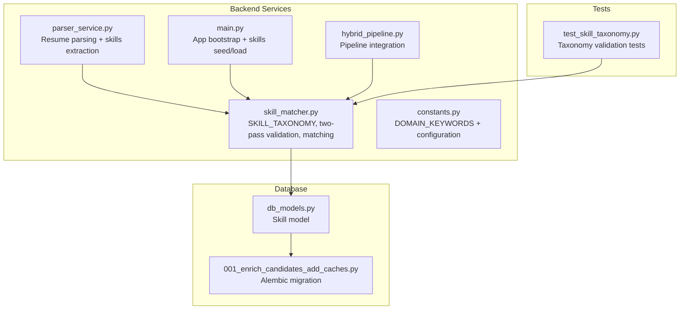
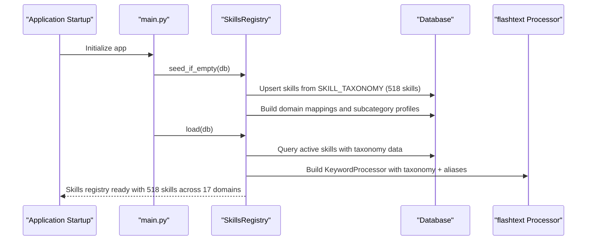
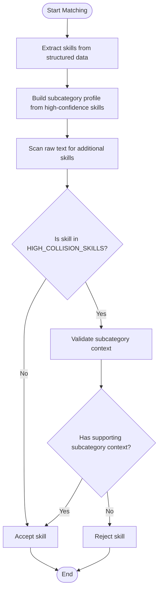
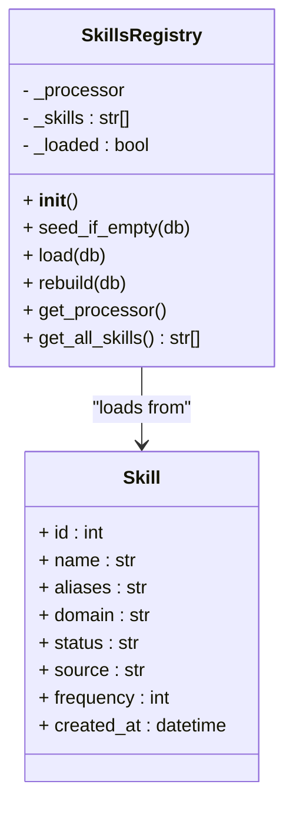
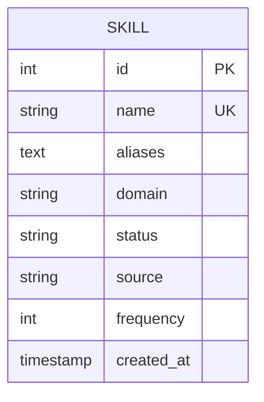
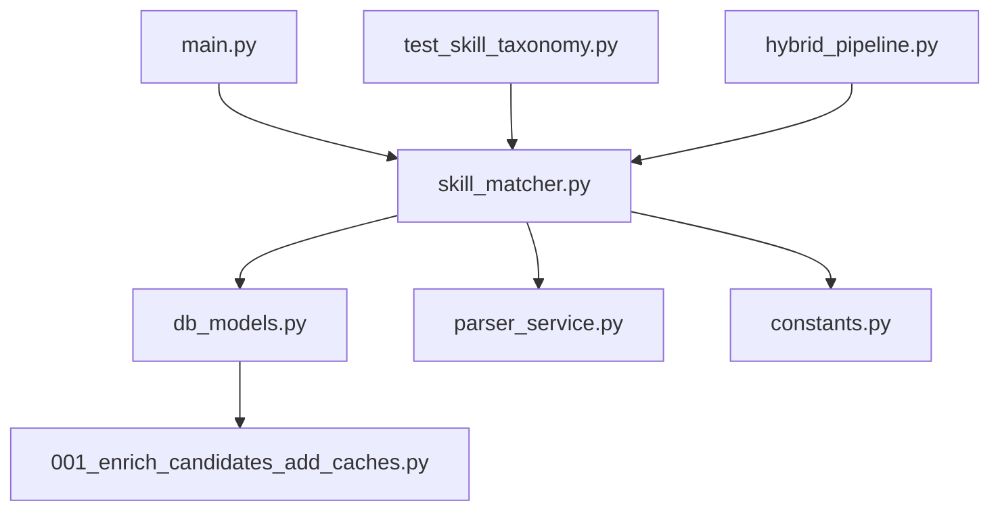

# Skills Registry Extension

<cite>
**Referenced Files in This Document**
- [skill_matcher.py](file://app/backend/services/skill_matcher.py)
- [db_models.py](file://app/backend/models/db_models.py)
- [parser_service.py](file://app/backend/services/parser_service.py)
- [constants.py](file://app/backend/services/constants.py)
- [001_enrich_candidates_add_caches.py](file://alembic/versions/001_enrich_candidates_add_caches.py)
- [main.py](file://app/backend/main.py)
- [hybrid_pipeline.py](file://app/backend/services/hybrid_pipeline.py)
- [test_skill_taxonomy.py](file://app/backend/tests/test_skill_taxonomy.py)
</cite>

## Update Summary
**Changes Made**
- Updated to reflect the new SKILL_TAXONOMY structure replacing MASTER_SKILLS
- Added comprehensive domain-clustered skill taxonomy with 17 distinct domains and 518 skills
- Implemented two-pass validation system to eliminate false positives in skill matching
- Added HIGH_COLLISION_SKILLS set with sophisticated validation logic
- Updated database schema to support the new taxonomy structure
- Enhanced skill matching with subcategory-level validation for accuracy

## Table of Contents
1. [Introduction](#introduction)
2. [Project Structure](#project-structure)
3. [Core Components](#core-components)
4. [Architecture Overview](#architecture-overview)
5. [Detailed Component Analysis](#detailed-component-analysis)
6. [Dependency Analysis](#dependency-analysis)
7. [Performance Considerations](#performance-considerations)
8. [Troubleshooting Guide](#troubleshooting-guide)
9. [Conclusion](#conclusion)

## Introduction
This document provides comprehensive guidance for extending the skills registry system in Resume AI. The system has undergone a major transformation with the introduction of a comprehensive domain-clustered skill taxonomy featuring 17 distinct domains and 518 carefully organized skills. The new SKILL_TAXONOMY structure replaces the previous MASTER_SKILLS approach and includes a sophisticated two-pass validation system designed to eliminate false positives in skill matching. This enhanced system provides precise domain classification, subcategory-level validation, and maintains backward compatibility while supporting advanced skill discovery and validation capabilities.

## Project Structure
The skills registry is implemented in the backend service layer with a comprehensive taxonomy-based architecture and backed by a database model. The key files are:
- Skills registry and matching logic: [skill_matcher.py](file://app/backend/services/skill_matcher.py)
- Database model for skills: [db_models.py](file://app/backend/models/db_models.py)
- Resume parsing integration: [parser_service.py](file://app/backend/services/parser_service.py)
- Domain keywords configuration: [constants.py](file://app/backend/services/constants.py)
- Database migration for skills table: [001_enrich_candidates_add_caches.py](file://alembic/versions/001_enrich_candidates_add_caches.py)
- Application initialization and skills registry bootstrap: [main.py](file://app/backend/main.py)
- Hybrid pipeline integration: [hybrid_pipeline.py](file://app/backend/services/hybrid_pipeline.py)
- Taxonomy validation tests: [test_skill_taxonomy.py](file://app/backend/tests/test_skill_taxonomy.py)

**Diagram sources**
- [skill_matcher.py](file://app/backend/services/skill_matcher.py)
- [db_models.py](file://app/backend/models/db_models.py)
- [parser_service.py](file://app/backend/services/parser_service.py)
- [constants.py](file://app/backend/services/constants.py)
- [001_enrich_candidates_add_caches.py](file://alembic/versions/001_enrich_candidates_add_caches.py)
- [main.py](file://app/backend/main.py)
- [hybrid_pipeline.py](file://app/backend/services/hybrid_pipeline.py)
- [test_skill_taxonomy.py](file://app/backend/tests/test_skill_taxonomy.py)

**Section sources**
- [skill_matcher.py](file://app/backend/services/skill_matcher.py)
- [db_models.py](file://app/backend/models/db_models.py)
- [parser_service.py](file://app/backend/services/parser_service.py)
- [constants.py](file://app/backend/services/constants.py)
- [001_enrich_candidates_add_caches.py](file://alembic/versions/001_enrich_candidates_add_caches.py)
- [main.py](file://app/backend/main.py)
- [hybrid_pipeline.py](file://app/backend/services/hybrid_pipeline.py)
- [test_skill_taxonomy.py](file://app/backend/tests/test_skill_taxonomy.py)

## Core Components
- **SKILL_TAXONOMY**: Comprehensive hierarchical skill taxonomy with 17 domains and 518 skills organized into subcategories, replacing the previous MASTER_SKILLS approach.
- **Two-Pass Validation System**: Sophisticated validation logic that eliminates false positives by requiring domain co-occurrence validation for high-collision skills.
- **HIGH_COLLISION_SKILLS**: Set of 17 common English words that require subcategory-level validation to prevent false positives.
- **SkillsRegistry**: Database-backed registry with in-memory flashtext processor, supporting hot-reload capability and maintaining backward compatibility.
- **Domain Classification**: Hierarchical domain mapping with subcategory-level precision for accurate skill categorization.
- **Database Model**: Enhanced Skill model supporting taxonomy integration, domain mapping, and frequency tracking.

Key responsibilities:
- Maintaining comprehensive domain-clustered skill taxonomy with 17 distinct domains
- Implementing two-pass validation to eliminate false positives in skill matching
- Supporting subcategory-level validation for high-collision skills
- Providing backward compatibility with existing MASTER_SKILLS structure
- Enabling dynamic skill loading and hot-reloading without application restart

**Section sources**
- [skill_matcher.py](file://app/backend/services/skill_matcher.py)
- [db_models.py](file://app/backend/models/db_models.py)
- [parser_service.py](file://app/backend/services/parser_service.py)

## Architecture Overview
The skills registry architecture integrates a comprehensive domain-clustered taxonomy with in-memory fast text processing and sophisticated validation logic. The system seeds skills from SKILL_TAXONOMY, stores them in the database with domain classification, and loads them into a flashtext processor for efficient matching. The two-pass validation system ensures accuracy by requiring subcategory-level context for high-collision skills.

**Diagram sources**
- [main.py](file://app/backend/main.py)
- [skill_matcher.py](file://app/backend/services/skill_matcher.py)

**Section sources**
- [main.py](file://app/backend/main.py)
- [skill_matcher.py](file://app/backend/services/skill_matcher.py)

## Detailed Component Analysis

### SKILL_TAXONOMY Structure
The new SKILL_TAXONOMY provides a comprehensive hierarchical organization of 518 skills across 17 distinct domains:

**Programming Languages Domain** (51 skills)
- Core Imperative: Python, Java, C++, C#, C, Go, Rust, Kotlin, Swift, Ruby, PHP, Perl, Ada, Pascal, Assembly, Nim, Zig, Crystal
- Functional: Haskell, Erlang, Elixir, Clojure, F#, Lisp, Scheme, OCaml, ReasonML, PureScript, Elm, Scala
- Scripting: Bash, PowerShell, Groovy, Lua, Perl
- Specialized: R, MATLAB, Julia, SAS, SPSS, Minitab, Stata
- Blockchain: Solidity, Vyper, Move, Cairo

**Web Frontend Domain** (20 skills)
- Frameworks: React, Vue.js, Angular, Next.js, Nuxt.js, Svelte, Astro, Remix, Gatsby, Ember.js, Backbone.js, Qwik, Solid.js
- Libraries: jQuery, Lit, Stencil, Preact
- CSS Frameworks: Tailwind, Bootstrap, Material UI, Chakra UI, Ant Design
- Tools: Storybook, Webpack, Vite, Parcel, Rollup
- Markup: HTML, XML, HTMX, Alpine.js

**Web Backend Domain** (20 skills)
- Node.js: Node.js, Express.js, NestJS, Koa, Hapi, Feathers, Strapi
- Python: FastAPI, Django, Flask, Tornado, Aiohttp, Starlette, Litestar
- Java: Spring Boot, Spring, Quarkus, Micronaut
- Go: Gin, Fiber, Echo, Chi
- Rust: Actix, Axum, Rocket, Warp
- Ruby: Rails, Sinatra
- Elixir: Phoenix
- PHP: Laravel, Symfony, CodeIgniter
- .NET: ASP.NET, ASP.NET Core, DotNet, .NET, Blazor, WPF, WinForms

**Databases Domain** (20 skills)
- Relational: PostgreSQL, MySQL, SQLite, MariaDB, Oracle, Microsoft SQL Server, DB2, Informix, Sybase, Teradata, Greenplum
- NoSQL Document: MongoDB, CouchDB, Firebase, Firestore, Realm, Fauna
- NoSQL KV: Redis, Memcached
- Search/Timeseries: Elasticsearch, Cassandra, InfluxDB, TimescaleDB, ClickHouse
- Graph/Specialized: Neo4j, DynamoDB
- Cloud Managed: Snowflake, BigQuery, Redshift, Databricks, Supabase, PlanetScale
- ORMs: SQLAlchemy, Hibernate, Prisma, TypeORM, Sequelize, Drizzle, Mongoose, Entity Framework, Dapper

**Cloud Platforms Domain** (15 skills)
- Hyperscalers: Amazon Web Services, AWS, Google Cloud Platform, GCP, Microsoft Azure, Azure
- Regional: Digital Ocean, Linode, Vultr, Hetzner, Oracle Cloud, IBM Cloud, Alibaba Cloud
- Deployment Platforms: Vercel, Netlify, Heroku, Fly.io, Render, Railway
- Backend-as-a-Service: Supabase, Firebase, Appwrite, PocketBase
- Orchestration: Cloud Foundry, OpenShift, Rancher, Nomad

**AWS Services Domain** (12 skills)
- Compute: EC2, Lambda, ECS, EKS, Elastic Beanstalk
- Storage: S3, EBS, EFS
- Database: RDS, Aurora, DynamoDB
- Networking: VPC, API Gateway, CloudFront, Route53
- Messaging: SQS, SNS, Kinesis, EventBridge
- Analytics: Glue, Athena, EMR, SageMaker
- Management: CloudFormation, IAM, CloudWatch, Step Functions

**DevOps Infrastructure Domain** (20 skills)
- Containers: Docker, Docker Swarm
- Orchestration: Kubernetes, K8s, Helm, Kustomize
- IaC: Terraform, Ansible, Puppet, Chef, Vagrant, Packer, Pulumi
- CI/CD: Jenkins, GitHub Actions, GitLab CI, CircleCI, Travis CI, Bitbucket Pipelines, Argo CD, Flux, Spinnaker
- Monitoring: Prometheus, Grafana, Datadog, New Relic, Dynatrace, Splunk, ELK Stack, Loki, Jaeger, Zipkin, OpenTelemetry
- Networking/Proxy: Nginx, Apache, Traefik, Envoy
- Secrets: Vault, Consul

**Embedded Systems Domain** (15 skills)
- RTOS/OS: RTOS, FreeRTOS, Zephyr, VxWorks, QNX, Embedded Linux, Baremetal
- Hardware: Microcontroller, FPGA, ARM, ARM Cortex, AVR, PIC
- Protocols: UART, SPI, I2C, CAN Bus, Modbus, MQTT, CoAP, BLE, Zigbee, LoRaWAN
- Tools: OpenOCD, JTAG, GDB
- Standards: ISO 26262, MISRA, DO-178, Functional Safety
- Firmware: Firmware, BSP, Bootloader, Device Driver
- Industrial: PLC, Ladder Logic, SCADA, Industrial Automation

**Mobile Domain** (10 skills)
- iOS: iOS, Swift, SwiftUI, Objective-C, Xcode
- Android: Android, Kotlin, Jetpack Compose, Android Studio
- Cross-platform: React Native, Flutter, Xamarin, Ionic, Capacitor, Cordova

**AI/ML Domain** (20 skills)
- Core: Machine Learning, Deep Learning, Neural Networks, Reinforcement Learning, Generative AI, Computer Vision, Natural Language Processing, NLP
- Frameworks: PyTorch, TensorFlow, Keras, JAX, Scikit-learn, XGBoost, LightGBM
- LLM: Transformers, Hugging Face, LangChain, LlamaIndex, RAG, Fine-tuning, Ollama, OpenAI
- Tools: MLflow, Weights & Biases, Kubeflow, Vertex AI
- Vision: OpenCV, YOLO, Stable Diffusion

**Data Engineering Domain** (15 skills)
- Processing: Apache Spark, Spark, PySpark, Hadoop, Hive, Flink
- Messaging: Apache Kafka, Kafka, RabbitMQ
- Orchestration: Apache Airflow, Airflow, Prefect, Dagster
- Transformation: DBT, Fivetran, Airbyte
- Concepts: ETL, Data Pipeline, Data Warehousing, Data Lake, Data Mesh, Data Governance

**Data Science & Analytics Domain** (10 skills)
- Core Libraries: Pandas, NumPy, SciPy, Polars
- Visualization: Matplotlib, Seaborn, Plotly
- BI: Tableau, Power BI, Looker, Metabase
- Tools: Jupyter, Excel, Google Analytics

**Architecture & Design Domain** (10 skills)
- Patterns: Microservices, Event-Driven, CQRS, Event Sourcing, Saga Pattern, Domain Driven Design, DDD, Clean Architecture
- API: REST API, GraphQL, gRPC, WebSocket, OpenAPI, Swagger

**Security Domain** (10 skills)
- Auth: OAuth2, JWT, SAML, LDAP, RBAC
- Crypto: TLS, SSL, Cryptography
- Compliance: SOC2, GDPR, HIPAA, PCI DSS
- Practices: Penetration Testing, OWASP, Zero Trust

**Testing Domain** (10 skills)
- Types: Unit Testing, Integration Testing, E2E Testing, TDD, BDD
- Frameworks: PyTest, Jest, Vitest, Mocha, Cypress, Playwright, Selenium
- Performance: K6, Locust, JMeter
- Coverage: SonarQube, Codecov

**Blockchain Domain** (10 skills)
- Platforms: Ethereum, Bitcoin, Solana, Cardano, Polkadot
- Concepts: Blockchain, Web3, Smart Contracts, DeFi, NFT
- Tools: Hyperledger, Chainlink, IPFS

**Gaming & Graphics Domain** (5 skills)
- Engines: Unity, Unreal Engine, Godot
- Web: Three.js, Babylon.js, WebGL, WebGPU

**Networking Domain** (5 skills)
- Protocols: TCP/IP, UDP, HTTP, DNS, VPN
- Infrastructure: Load Balancing, CDN, Reverse Proxy, Firewall

**Project Management Domain** (10 skills)
- Methodologies: Agile, Scrum, Kanban, SAFe, Lean
- Tools: Jira, Confluence, Linear, Asana, Trello, Notion
- VCS: Git, GitHub, GitLab, Bitbucket

**Business & ERP Domain** (10 skills)
- CRM: Salesforce, HubSpot, Zoho
- ERP: SAP, Oracle ERP, Dynamics 365, Netsuite, Workday
- Service: ServiceNow, FreshDesk, Zendesk
- Low-code: Power Platform, Power Apps, OutSystems, Mendix

**Design & UX Domain** (5 skills)
- Tools: Figma, Sketch, Adobe XD
- Concepts: UI/UX, Wireframing, Prototyping, Accessibility, Responsive Design

**Soft Skills Domain** (5 skills)
- Communication: Communication, Technical Writing, Public Speaking
- Leadership: Leadership, Mentoring, Coaching
- Analytical: Problem Solving, Critical Thinking, Analytical Thinking

**Section sources**
- [skill_matcher.py](file://app/backend/services/skill_matcher.py)

### Two-Pass Validation System
The sophisticated two-pass validation system eliminates false positives by implementing subcategory-level validation for high-collision skills:

**Pass 1: High-Confidence Skills Extraction**
- Extract skills from structured candidate data
- Build subcategory profile from confirmed high-confidence skills
- Create subcategory context map for validation

**Pass 2: Text-Based Skills Extraction with Validation**
- Scan raw text for additional skills
- For high-collision skills (17 skills), require subcategory context validation
- Validate that extracted skills share subcategories with confirmed skills
- Reject skills that lack supporting subcategory context

**Diagram sources**
- [skill_matcher.py](file://app/backend/services/skill_matcher.py)

**Section sources**
- [skill_matcher.py](file://app/backend/services/skill_matcher.py)

### SkillsRegistry Class Enhancement
The SkillsRegistry has been enhanced to support the new taxonomy structure:

- **seed_if_empty()**: Upserts SKILL_TAXONOMY into the database with domain classification and subcategory mapping
- **load()**: Queries active skills with taxonomy data, merges aliases, and builds the processor
- **rebuild()**: Marks registry as unloaded and reloads on next access
- **get_processor()/get_all_skills()**: Provides access to the processor and loaded skill list

**Diagram sources**
- [skill_matcher.py](file://app/backend/services/skill_matcher.py)
- [db_models.py](file://app/backend/models/db_models.py)

**Section sources**
- [skill_matcher.py](file://app/backend/services/skill_matcher.py)
- [db_models.py](file://app/backend/models/db_models.py)

### Database Schema for Skills Management
The enhanced Skill model defines the schema for storing skills in the database with taxonomy support:
- **id**: Primary key
- **name**: Unique canonical skill name (518 skills across 17 domains)
- **aliases**: Comma-separated list of aliases
- **domain**: Primary domain (e.g., programming_languages, web_frontend, databases)
- **status**: Active/pending/rejected
- **source**: Seed/manual/discovered
- **frequency**: Count of occurrences in JDs/resumes
- **created_at**: Timestamp

Migration details:
- Creates the skills table with appropriate indexes
- Ensures id and name uniqueness
- Adds indexes for performance
- Supports taxonomy integration with domain classification

**Diagram sources**
- [db_models.py](file://app/backend/models/db_models.py)
- [001_enrich_candidates_add_caches.py](file://alembic/versions/001_enrich_candidates_add_caches.py)

**Section sources**
- [db_models.py](file://app/backend/models/db_models.py)
- [001_enrich_candidates_add_caches.py](file://alembic/versions/001_enrich_candidates_add_caches.py)

### Skill Normalization and Matching
Enhanced normalization and matching logic with taxonomy support:
- **_normalize_skill()**: Lowercases and normalizes special characters while preserving specific cases (e.g., C++, C#)
- **_expand_skill()**: Returns the canonical skill plus all normalized aliases
- **_get_skill_domains()**: Returns set of top-level domain names for a skill using SKILL_TAXONOMY
- **_get_skill_subcategory_keys()**: Returns set of (domain, subcategory) tuples for precise validation
- **match_skills()**: Implements two-pass validation system with subcategory-level context checking

**Section sources**
- [skill_matcher.py](file://app/backend/services/skill_matcher.py)

### Extending the SKILL_TAXONOMY
To add new skills to the taxonomy:
1. Add new canonical skills to the appropriate domain/subcategory in SKILL_TAXONOMY
2. Run application startup to seed the database via seed_if_empty()
3. The migration ensures new skills are inserted without conflicts
4. High-collision skills automatically benefit from two-pass validation

**Section sources**
- [skill_matcher.py](file://app/backend/services/skill_matcher.py)
- [001_enrich_candidates_add_caches.py](file://alembic/versions/001_enrich_candidates_add_caches.py)

### Implementing Custom Skill Alias Mappings
To implement custom alias mappings:
1. Extend SKILL_ALIASES in [skill_matcher.py](file://app/backend/services/skill_matcher.py) with canonical -> [aliases] mappings
2. On next seed/load, aliases are persisted and added to the flashtext processor
3. Aliases automatically inherit taxonomy classification from canonical skills

**Section sources**
- [skill_matcher.py](file://app/backend/services/skill_matcher.py)

### Extending Domain Keyword Recognition
To extend domain keyword recognition:
1. Add domain-specific keywords to DOMAIN_KEYWORDS in [constants.py](file://app/backend/services/constants.py)
2. During seeding, domain mappings are built from keywords to domains and stored with skills
3. The taxonomy system provides more precise domain classification than keyword-based approaches

**Section sources**
- [constants.py](file://app/backend/services/constants.py)

### Dynamic Skill Loading and Hot-Reloading
Enhanced dynamic loading and hot-reloading:
- Skills are loaded lazily on first access with taxonomy support
- rebuild() marks the registry as unloaded, triggering reload on next access
- seed_if_empty() safely seeds the database on every startup with SKILL_TAXONOMY
- Backward compatibility maintained with MASTER_SKILLS fallback

**Section sources**
- [skill_matcher.py](file://app/backend/services/skill_matcher.py)
- [main.py](file://app/backend/main.py)

### Skills Database Maintenance Procedures
Enhanced maintenance procedures:
- **Seed new skills**: Call seed_if_empty() to upsert new entries from SKILL_TAXONOMY
- **Update taxonomy**: Modify SKILL_TAXONOMY structure and call rebuild() to refresh the processor
- **Adjust domains**: Update DOMAIN_KEYWORDS and re-seed to repopulate domain mappings
- **Monitor frequency**: Use the frequency column to track skill popularity and optimize taxonomy
- **Validate taxonomy**: Use test_skill_taxonomy.py to ensure taxonomy integrity

**Section sources**
- [skill_matcher.py](file://app/backend/services/skill_matcher.py)
- [parser_service.py](file://app/backend/services/parser_service.py)
- [main.py](file://app/backend/main.py)
- [test_skill_taxonomy.py](file://app/backend/tests/test_skill_taxonomy.py)

### Advanced Features
Enhanced advanced features:
- **Subcategory-level validation**: Sophisticated validation logic prevents false positives for high-collision skills
- **Hierarchical domain classification**: 17 distinct domains with precise subcategory mapping
- **Two-pass validation system**: Eliminates false positives by requiring supporting context
- **Backward compatibility**: Maintains MASTER_SKILLS for legacy integrations
- **Taxonomy-aware matching**: Accurate skill categorization based on domain and subcategory relationships

**Section sources**
- [skill_matcher.py](file://app/backend/services/skill_matcher.py)
- [db_models.py](file://app/backend/models/db_models.py)

## Dependency Analysis
The enhanced skills registry depends on:
- Database model for taxonomy-aware persistence
- Alembic migration for schema creation with taxonomy support
- Parser service for integration with enhanced matching
- Application bootstrap for initialization with taxonomy seeding
- Test suite for taxonomy validation

**Diagram sources**
- [skill_matcher.py](file://app/backend/services/skill_matcher.py)
- [db_models.py](file://app/backend/models/db_models.py)
- [parser_service.py](file://app/backend/services/parser_service.py)
- [constants.py](file://app/backend/services/constants.py)
- [001_enrich_candidates_add_caches.py](file://alembic/versions/001_enrich_candidates_add_caches.py)
- [main.py](file://app/backend/main.py)
- [test_skill_taxonomy.py](file://app/backend/tests/test_skill_taxonomy.py)
- [hybrid_pipeline.py](file://app/backend/services/hybrid_pipeline.py)

**Section sources**
- [skill_matcher.py](file://app/backend/services/skill_matcher.py)
- [db_models.py](file://app/backend/models/db_models.py)
- [parser_service.py](file://app/backend/services/parser_service.py)
- [constants.py](file://app/backend/services/constants.py)
- [001_enrich_candidates_add_caches.py](file://alembic/versions/001_enrich_candidates_add_caches.py)
- [main.py](file://app/backend/main.py)
- [test_skill_taxonomy.py](file://app/backend/tests/test_skill_taxonomy.py)
- [hybrid_pipeline.py](file://app/backend/services/hybrid_pipeline.py)

## Performance Considerations
Enhanced performance optimizations:
- **Hierarchical taxonomy processing**: Organized skill structure improves matching efficiency
- **Two-pass validation optimization**: Limits validation scope to high-collision skills (17 out of 518)
- **Subcategory-level caching**: Reduces redundant validation calculations
- **Database indexing**: Optimized indexes for taxonomy queries and skill lookups
- **Memory efficiency**: Hierarchical structure reduces memory overhead compared to flat lists
- **Backward compatibility**: Maintains performance of existing MASTER_SKILLS integration

**Section sources**
- [skill_matcher.py](file://app/backend/services/skill_matcher.py)

## Troubleshooting Guide
Enhanced troubleshooting for the new taxonomy system:
- **Skills not recognized**: Verify that the skill exists in SKILL_TAXONOMY and is properly categorized
- **False positives**: Check HIGH_COLLISION_SKILLS validation logic and ensure subcategory context exists
- **Matching inconsistencies**: Review _normalize_skill() and _expand_skill() logic for special cases like C++ and C#
- **Database connectivity failures**: The system falls back to MASTER_SKILLS; check logs for warnings
- **Hot-reload not taking effect**: Confirm rebuild() is called and the registry is marked as unloaded
- **Taxonomy validation errors**: Use test_skill_taxonomy.py to validate taxonomy structure integrity
- **Performance issues**: Monitor two-pass validation overhead and optimize taxonomy structure

**Section sources**
- [skill_matcher.py](file://app/backend/services/skill_matcher.py)
- [test_skill_taxonomy.py](file://app/backend/tests/test_skill_taxonomy.py)

## Conclusion
The enhanced skills registry system in Resume AI provides a robust, extensible foundation for managing skills with comprehensive domain clustering and sophisticated validation. The new SKILL_TAXONOMY structure with 17 distinct domains and 518 carefully organized skills, combined with the two-pass validation system, delivers unprecedented accuracy in skill matching while maintaining backward compatibility. The system's hierarchical approach to skill organization, subcategory-level validation, and taxonomy-aware matching enables precise domain classification and eliminates false positives that plagued the previous MASTER_SKILLS approach. By leveraging database-backed persistence, in-memory flashtext processing, and hot-reload capabilities, it supports continuous evolution of skill categories, alias mappings, and domain recognition. Following the extension guidelines and maintenance procedures outlined here will enable seamless integration of new skills into the taxonomy and improved matching performance at scale.