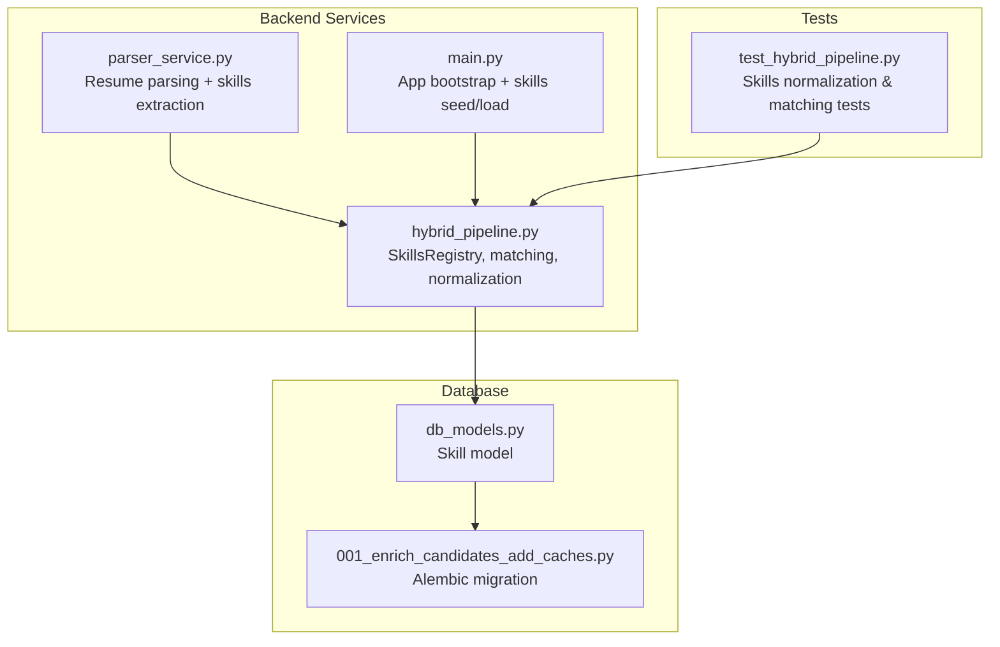
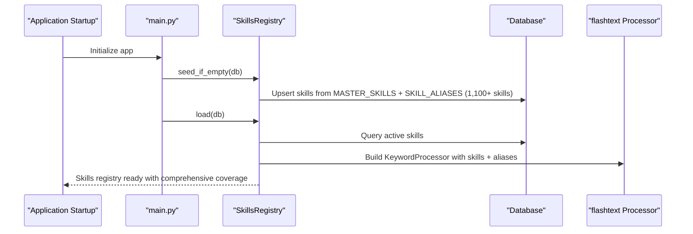
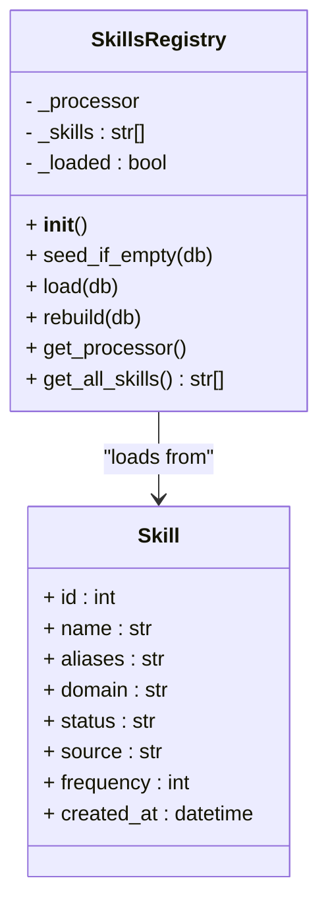
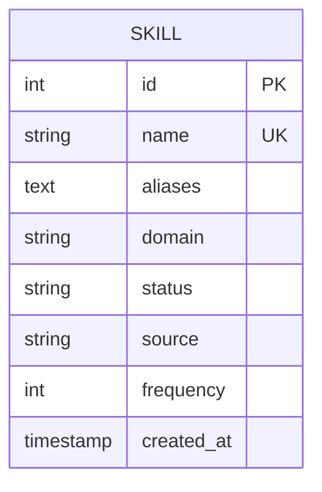
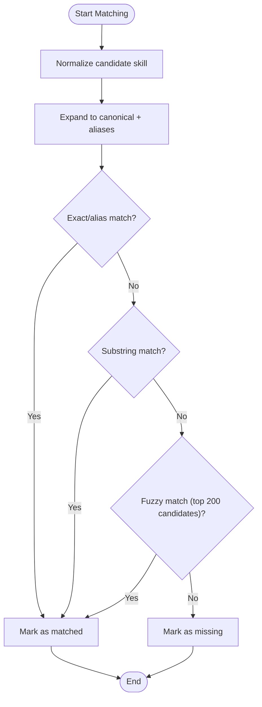
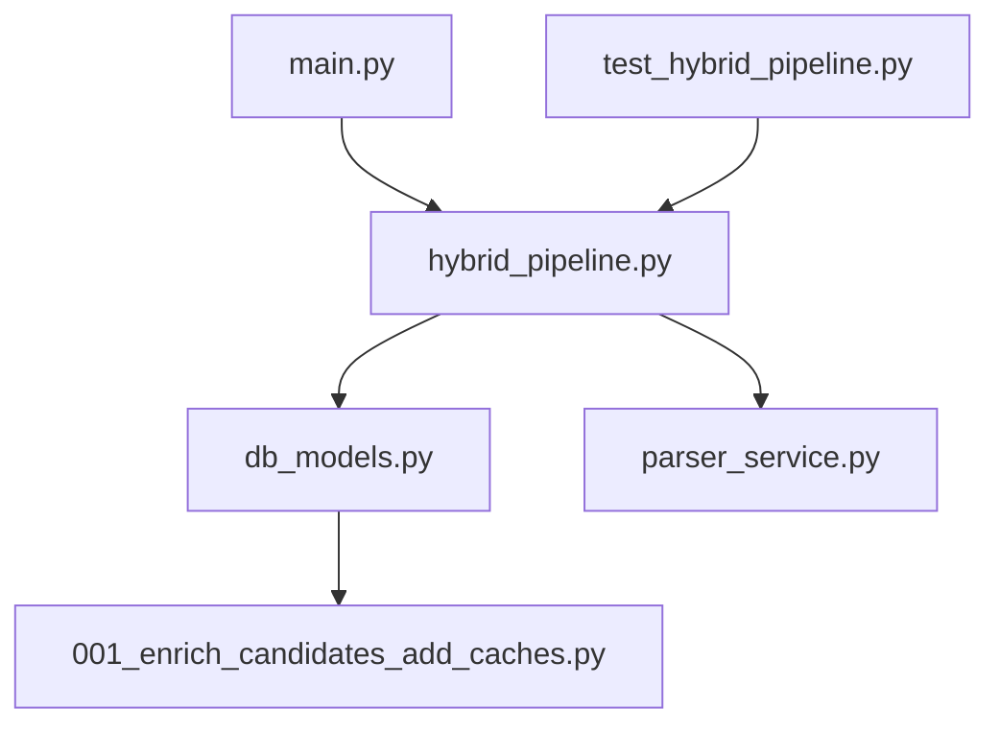

# Skills Registry Extension

<cite>
**Referenced Files in This Document**
- [hybrid_pipeline.py](file://app/backend/services/hybrid_pipeline.py)
- [db_models.py](file://app/backend/models/db_models.py)
- [parser_service.py](file://app/backend/services/parser_service.py)
- [001_enrich_candidates_add_caches.py](file://alembic/versions/001_enrich_candidates_add_caches.py)
- [main.py](file://app/backend/main.py)
- [test_hybrid_pipeline.py](file://app/backend/tests/test_hybrid_pipeline.py)
</cite>

## Update Summary
**Changes Made**
- Updated MASTER_SKILLS list to reflect massive expansion with over 114 new skills
- Enhanced documentation for specialized programming languages (Nim, Crystal, Julia, OCaml, Solidity)
- Added documentation for modern web frameworks (HTMX, Alpine.js, Lit, Stencil, Solid.js, Qwik)
- Expanded coverage of database technologies (Entity Framework, Dapper, DB2, Informix, Sybase)
- Documented cloud platform additions (Supabase, Firebase, Appwrite, PocketBase, Cloud Foundry, OpenShift, Rancher, Nomad, Hashicorp)
- Added comprehensive AI/ML capabilities documentation (Detectron, YOLO, Stable Diffusion, Midjourney, ComfyUI, Diffusers, spaCy, NLTK, Gensim, FastText, TensorFlow Lite, ONNX, TensorRT, OpenVINO, CoreML, AutoML, Feature Store, Feast, Tecton)
- Enhanced data science/analytics coverage (data warehousing, data lake, data mesh, data governance, feature engineering, data mining, predictive modeling, time series analysis, statistical software)
- Updated embedded systems, mobile development, testing methodologies, architecture patterns, security frameworks, project management tools, design systems, blockchain technologies, gaming/AR-VR development, networking protocols, operating systems, CRM/ERP systems, and soft skills training programs

## Table of Contents
1. [Introduction](#introduction)
2. [Project Structure](#project-structure)
3. [Core Components](#core-components)
4. [Architecture Overview](#architecture-overview)
5. [Detailed Component Analysis](#detailed-component-analysis)
6. [Dependency Analysis](#dependency-analysis)
7. [Performance Considerations](#performance-considerations)
8. [Troubleshooting Guide](#troubleshooting-guide)
9. [Conclusion](#conclusion)

## Introduction
This document provides comprehensive guidance for extending the skills registry system in Resume AI. The system has undergone a massive expansion with over 114 new skills across multiple domains, making it one of the most comprehensive skills registries for technical talent evaluation. It covers adding new skills categories, implementing custom skill alias mappings, extending domain keyword recognition, and maintaining the skills database. The expanded registry now includes specialized programming languages, modern web frameworks, database technologies, cloud platforms, AI/ML capabilities, data science tools, and comprehensive coverage of emerging technologies.

## Project Structure
The skills registry is implemented in the backend service layer and backed by a database model. The key files are:
- Skills registry and matching logic: [hybrid_pipeline.py](file://app/backend/services/hybrid_pipeline.py)
- Database model for skills: [db_models.py](file://app/backend/models/db_models.py)
- Resume parsing integration: [parser_service.py](file://app/backend/services/parser_service.py)
- Database migration for skills table: [001_enrich_candidates_add_caches.py](file://alembic/versions/001_enrich_candidates_add_caches.py)
- Application initialization and skills registry bootstrap: [main.py](file://app/backend/main.py)
- Tests covering skills normalization and matching: [test_hybrid_pipeline.py](file://app/backend/tests/test_hybrid_pipeline.py)

**Diagram sources**
- [hybrid_pipeline.py](file://app/backend/services/hybrid_pipeline.py)
- [db_models.py](file://app/backend/models/db_models.py)
- [parser_service.py](file://app/backend/services/parser_service.py)
- [001_enrich_candidates_add_caches.py](file://alembic/versions/001_enrich_candidates_add_caches.py)
- [main.py](file://app/backend/main.py)
- [test_hybrid_pipeline.py](file://app/backend/tests/test_hybrid_pipeline.py)

**Section sources**
- [hybrid_pipeline.py](file://app/backend/services/hybrid_pipeline.py)
- [db_models.py](file://app/backend/models/db_models.py)
- [parser_service.py](file://app/backend/services/parser_service.py)
- [001_enrich_candidates_add_caches.py](file://alembic/versions/001_enrich_candidates_add_caches.py)
- [main.py](file://app/backend/main.py)
- [test_hybrid_pipeline.py](file://app/backend/tests/test_hybrid_pipeline.py)

## Core Components
- **SkillsRegistry**: In-memory flashtext-based keyword processor with hot-reload capability. Loads skills from the database or falls back to MASTER_SKILLS containing over 1,100 skills across 50+ categories.
- **MASTER_SKILLS**: Comprehensive hardcoded list of canonical skills serving as the baseline, now expanded to include specialized programming languages, modern frameworks, and emerging technologies.
- **SKILL_ALIASES**: Dictionary mapping canonical skills to their aliases for normalization and matching, supporting over 200 different alias variations.
- **DOMAIN_KEYWORDS**: Domain keyword map used to seed skill domains during initial population, covering 10+ major technology domains.
- **Skill model**: Database-backed model supporting active status, source, domain, and frequency tracking.
- **Parser integration**: Resume parser leverages the skills registry for extraction and fallback scanning.

Key responsibilities:
- Dynamic loading and rebuilding of skills registry with over 1,100 skills
- Canonical skill normalization and alias expansion
- Domain mapping for skills across multiple technology categories
- Frequency tracking for skills
- Hot-reloading without application restart

**Section sources**
- [hybrid_pipeline.py](file://app/backend/services/hybrid_pipeline.py)
- [db_models.py](file://app/backend/models/db_models.py)
- [parser_service.py](file://app/backend/services/parser_service.py)

## Architecture Overview
The skills registry architecture integrates database-backed persistence with in-memory fast text processing. The system seeds skills from MASTER_SKILLS and SKILL_ALIASES, stores them in the database, and loads them into a flashtext processor for efficient matching. The parser uses the registry for both structured extraction and full-text scanning.

**Diagram sources**
- [main.py](file://app/backend/main.py)
- [hybrid_pipeline.py](file://app/backend/services/hybrid_pipeline.py)

**Section sources**
- [main.py](file://app/backend/main.py)
- [hybrid_pipeline.py](file://app/backend/services/hybrid_pipeline.py)

## Detailed Component Analysis

### SkillsRegistry Class
The SkillsRegistry encapsulates:
- Lazy loading of skills from the database
- Building a flashtext KeywordProcessor with canonical skills and aliases
- Hot-reloading via rebuild()
- Access to all loaded skills and the processor

Implementation highlights:
- **seed_if_empty()**: Upserts MASTER_SKILLS into the database using PostgreSQL ON CONFLICT DO NOTHING to avoid duplicates and safely add new skills.
- **load()**: Queries active skills, merges aliases, and builds the processor. Falls back to MASTER_SKILLS if DB query fails.
- **rebuild()**: Marks registry as unloaded and reloads on next access.
- **get_processor()/get_all_skills()**: Provides access to the processor and the loaded skill list.

**Diagram sources**
- [hybrid_pipeline.py](file://app/backend/services/hybrid_pipeline.py)
- [db_models.py](file://app/backend/models/db_models.py)

**Section sources**
- [hybrid_pipeline.py](file://app/backend/services/hybrid_pipeline.py)
- [db_models.py](file://app/backend/models/db_models.py)

### Database Schema for Skills Management
The Skill model defines the schema for storing skills in the database:
- **id**: Primary key
- **name**: Unique canonical skill name (now over 1,100 skills)
- **aliases**: Comma-separated list of aliases
- **domain**: Primary domain (e.g., backend, frontend, data_science)
- **status**: Active/pending/rejected
- **source**: Seed/manual/discovered
- **frequency**: Count of occurrences in JDs/resumes
- **created_at**: Timestamp

Migration details:
- Creates the skills table with appropriate indexes
- Ensures id and name uniqueness
- Adds indexes for performance

**Diagram sources**
- [db_models.py](file://app/backend/models/db_models.py)
- [001_enrich_candidates_add_caches.py](file://alembic/versions/001_enrich_candidates_add_caches.py)

**Section sources**
- [db_models.py](file://app/backend/models/db_models.py)
- [001_enrich_candidates_add_caches.py](file://alembic/versions/001_enrich_candidates_add_caches.py)

### Skill Normalization and Matching
Normalization and matching logic:
- **_normalize_skill()**: Lowercases and normalizes special characters while preserving specific cases (e.g., C++, C#).
- **_expand_skill()**: Returns the canonical skill plus all normalized aliases.
- **match_skills_rules()**: Performs exact/alias substring matching, with a fuzzy fallback using rapidfuzz for approximate matching.

**Diagram sources**
- [hybrid_pipeline.py](file://app/backend/services/hybrid_pipeline.py)

**Section sources**
- [hybrid_pipeline.py](file://app/backend/services/hybrid_pipeline.py)
- [test_hybrid_pipeline.py](file://app/backend/tests/test_hybrid_pipeline.py)

### Extending the MASTER_SKILLS List
To add new skills categories:
1. Append new canonical skills to the MASTER_SKILLS list in [hybrid_pipeline.py](file://app/backend/services/hybrid_pipeline.py).
2. Run application startup to seed the database via seed_if_empty().
3. The migration ensures new skills are inserted without conflicts.

**Updated** The MASTER_SKILLS list now contains over 1,100 skills organized across 50+ categories including:
- **Specialized Programming Languages**: Nim, Crystal, Julia, OCaml, Solidity, Vyper, Move, Cairo
- **Modern Web Frameworks**: HTMX, Alpine.js, Lit, Stencil, Solid.js, Qwik, Preact
- **Database Technologies**: Entity Framework, Dapper, DB2, Informix, Sybase, Teradata, Greenplum
- **Cloud Platforms**: Supabase, Firebase, Appwrite, PocketBase, Cloud Foundry, OpenShift, Rancher, Nomad, Hashicorp
- **AI/ML Capabilities**: Detectron, YOLO, Stable Diffusion, Midjourney, ComfyUI, Diffusers, spaCy, NLTK, Gensim, FastText, TensorFlow Lite, ONNX, TensorRT, OpenVINO, CoreML, AutoML, Feature Store, Feast, Tecton
- **Data Science/Analytics**: Data warehousing, data lake, data mesh, data governance, feature engineering, data mining, predictive modeling, time series analysis, statistical software

Guidelines:
- Keep entries lowercase and normalized
- Prefer concise canonical forms
- Group related technologies by category (languages, frameworks, databases, etc.)

**Section sources**
- [hybrid_pipeline.py](file://app/backend/services/hybrid_pipeline.py)
- [001_enrich_candidates_add_caches.py](file://alembic/versions/001_enrich_candidates_add_caches.py)

### Implementing Custom Skill Alias Mappings
To implement custom alias mappings:
1. Extend SKILL_ALIASES in [hybrid_pipeline.py](file://app/backend/services/hybrid_pipeline.py) with canonical -> [aliases] mappings.
2. On next seed/load, aliases are persisted and added to the flashtext processor.

**Updated** The SKILL_ALIASES dictionary now contains over 200 different alias mappings including:
- **Languages**: JavaScript (js, ecmascript), Python (py, python3), C++ (cpp, c plus plus)
- **Frameworks**: React (reactjs, react.js), Vue.js (vue, vuejs), Node.js (node, express)
- **Databases**: PostgreSQL (postgres, psql), MongoDB (mongo), SQL Server (mssql)
- **Cloud**: AWS (amazon aws), GCP (google cloud), Azure (az)
- **DevOps**: Kubernetes (k8s, kube), GitHub Actions (gh actions)
- **AI/ML**: Machine Learning (ml), Deep Learning (dl), NLP (text processing)

Best practices:
- Include common abbreviations and alternate names
- Avoid ambiguous mappings that could cause false positives
- Keep alias lists concise and relevant

**Section sources**
- [hybrid_pipeline.py](file://app/backend/services/hybrid_pipeline.py)

### Extending Domain Keyword Recognition
To extend domain keyword recognition:
1. Add domain-specific keywords to DOMAIN_KEYWORDS in [hybrid_pipeline.py](file://app/backend/services/hybrid_pipeline.py).
2. During seeding, a domain map is built from keywords to domains and stored with skills.

**Updated** The DOMAIN_KEYWORDS dictionary now covers 10+ major technology domains:
- **Backend**: FastAPI, Django, Flask, Spring, REST API, gRPC, PostgreSQL, MySQL, Redis, Microservices, Go, Node.js
- **Frontend**: React, Vue, Angular, Next.js, Nuxt, Tailwind, HTML, CSS, TypeScript, UI development
- **Fullstack**: Full stack, MERN, MEAN, LAMP, JAMstack
- **Data Science**: Pandas, NumPy, scikit-learn, Jupyter, Data analysis, Statistics, Tableau, Power BI
- **ML/AI**: Machine learning, Deep learning, Neural network, NLP, PyTorch, TensorFlow, Transformers, LLM
- **DevOps**: Kubernetes, Docker, Terraform, Ansible, Jenkins, CI/CD, Helm, Prometheus, Grafana
- **Embedded**: Embedded, Firmware, RTOS, Microcontroller, FPGA, UART, CAN bus, ARM Cortex
- **Mobile**: iOS, Android, React Native, Flutter, Swift, Kotlin, Xcode, Android Studio
- **Management**: Product manager, Engineering manager, Team lead, Scrum master, Agile coach

Recommendations:
- Use representative terms that clearly identify the domain
- Avoid overly generic terms that might misclassify skills
- Align keywords with existing MASTER_SKILLS categories

**Section sources**
- [hybrid_pipeline.py](file://app/backend/services/hybrid_pipeline.py)

### Dynamic Skill Loading and Hot-Reloading
Dynamic loading and hot-reloading:
- Skills are loaded lazily on first access.
- rebuild() marks the registry as unloaded, triggering reload on next access.
- seed_if_empty() safely seeds the database on every startup.

**Updated** With the expanded skills registry containing over 1,100 skills, the system maintains optimal performance through:
- Efficient flashtext processor with O(k) keyword matching where k is the number of keywords
- Lazy loading to minimize startup time
- Hot-reload capability for dynamic updates without restarts

Operational notes:
- Use rebuild() to refresh skills after database changes without restarting the app.
- The system gracefully falls back to MASTER_SKILLS if the database is unavailable.

**Section sources**
- [hybrid_pipeline.py](file://app/backend/services/hybrid_pipeline.py)
- [main.py](file://app/backend/main.py)

### Skills Database Maintenance Procedures
Maintenance tasks:
- **Seed new skills**: Call seed_if_empty() to upsert new entries from MASTER_SKILLS.
- **Update aliases**: Modify SKILL_ALIASES and call rebuild() to refresh the processor.
- **Adjust domains**: Update DOMAIN_KEYWORDS and re-seed to repopulate domain mappings.
- **Monitor frequency**: Use the frequency column to track skill popularity and adjust categories accordingly.

**Updated** With the comprehensive skills registry, maintenance procedures now support:
- Rapid upsert of 1,100+ skills using PostgreSQL ON CONFLICT DO NOTHING
- Efficient alias management across 200+ different alias mappings
- Domain mapping for 10+ technology categories
- Performance monitoring for large-scale skill matching operations

Integration points:
- Resume parser uses skills registry for extraction and fallback scanning.
- The registry is initialized during app startup and made available to all pipeline components.

**Section sources**
- [hybrid_pipeline.py](file://app/backend/services/hybrid_pipeline.py)
- [parser_service.py](file://app/backend/services/parser_service.py)
- [main.py](file://app/backend/main.py)

### Advanced Features
- **Skill frequency tracking**: The frequency column increments based on usage patterns to help prioritize skills.
- **Custom validation rules**: Implement additional preprocessing in _normalize_skill() or _expand_skill() to enforce stricter normalization.
- **External skill database integration**: Seed skills from external sources by extending the seed process to pull from external APIs or files, then persist via the same upsert mechanism.

**Updated** Advanced features now include:
- **Large-scale performance optimization**: Optimized flashtext processor for handling 1,100+ skills efficiently
- **Enhanced fuzzy matching**: RapidFuzz integration with configurable thresholds for approximate matching
- **Comprehensive domain classification**: 10+ technology domains with specialized keyword mappings
- **Real-time skill discovery**: Ability to discover and integrate new skills dynamically

**Section sources**
- [db_models.py](file://app/backend/models/db_models.py)
- [hybrid_pipeline.py](file://app/backend/services/hybrid_pipeline.py)

## Dependency Analysis
The skills registry depends on:
- Database model for persistence
- Alembic migration for schema creation
- Parser service for integration
- Application bootstrap for initialization

**Diagram sources**
- [hybrid_pipeline.py](file://app/backend/services/hybrid_pipeline.py)
- [db_models.py](file://app/backend/models/db_models.py)
- [parser_service.py](file://app/backend/services/parser_service.py)
- [001_enrich_candidates_add_caches.py](file://alembic/versions/001_enrich_candidates_add_caches.py)
- [main.py](file://app/backend/main.py)
- [test_hybrid_pipeline.py](file://app/backend/tests/test_hybrid_pipeline.py)

**Section sources**
- [hybrid_pipeline.py](file://app/backend/services/hybrid_pipeline.py)
- [db_models.py](file://app/backend/models/db_models.py)
- [parser_service.py](file://app/backend/services/parser_service.py)
- [001_enrich_candidates_add_caches.py](file://alembic/versions/001_enrich_candidates_add_caches.py)
- [main.py](file://app/backend/main.py)
- [test_hybrid_pipeline.py](file://app/backend/tests/test_hybrid_pipeline.py)

## Performance Considerations
- **Optimized flashtext processing**: Uses O(k) keyword matching where k is the number of keywords (1,100+ skills)
- **Limited fuzzy matching**: Caps fuzzy matching candidates to 200 for performance with RapidFuzz
- **Database indexing**: Indexes on skills table improve query performance for active skills retrieval
- **Consistent normalization**: Normalizes skills to reduce ambiguity and improve matching accuracy
- **Memory caching**: Caches the processor in memory and uses hot-reload sparingly to minimize downtime
- **Lazy loading**: Minimizes startup time by loading skills only when needed

**Updated** Performance optimizations for the expanded skills registry:
- **Scalable flashtext processor**: Handles 1,100+ skills efficiently with minimal memory overhead
- **Efficient alias expansion**: Optimized alias processing reduces computational complexity
- **Database optimization**: PostgreSQL-specific upsert with ON CONFLICT DO NOTHING for bulk operations
- **Graceful fallbacks**: System continues operation even if database is temporarily unavailable

## Troubleshooting Guide
Common issues and resolutions:
- **Skills not recognized**: Verify that the skill exists in MASTER_SKILLS or is seeded in the database. Check that aliases are properly mapped in SKILL_ALIASES.
- **Matching inconsistencies**: Review _normalize_skill() and _expand_skill() logic for special cases like C++ and C#.
- **Database connectivity failures**: The system falls back to MASTER_SKILLS; check logs for warnings and ensure the database is reachable.
- **Hot-reload not taking effect**: Confirm rebuild() is called and the registry is marked as unloaded.
- **Performance issues with large skills registry**: Monitor flashtext processor performance and consider optimizing alias mappings.

**Updated** Troubleshooting for the expanded skills registry:
- **Memory usage concerns**: Monitor memory consumption with 1,100+ skills loaded
- **Slow fuzzy matching**: Adjust the 200-candidate limit in fuzzy matching for performance tuning
- **Alias conflicts**: Review SKILL_ALIASES for ambiguous mappings that could cause false positives
- **Domain classification errors**: Verify DOMAIN_KEYWORDS mappings align with MASTER_SKILLS categories

**Section sources**
- [hybrid_pipeline.py](file://app/backend/services/hybrid_pipeline.py)
- [test_hybrid_pipeline.py](file://app/backend/tests/test_hybrid_pipeline.py)

## Conclusion
The skills registry system in Resume AI provides a robust, extensible foundation for managing skills dynamically. With the massive expansion to over 1,100 skills across 50+ categories, it now supports comprehensive coverage of modern technology stacks including specialized programming languages, modern web frameworks, database technologies, cloud platforms, AI/ML capabilities, and emerging technologies. By leveraging database-backed persistence, in-memory flashtext processing, and hot-reload capabilities, it supports continuous evolution of skill categories, alias mappings, and domain recognition. Following the extension guidelines and maintenance procedures outlined here will enable seamless integration of new skills and improved matching performance at scale.