# Voice Agent Conversation System

<cite>
**Referenced Files in This Document**
- [agent.py](file://app/voice_agent/agent.py)
- [main.py](file://app/speech_service/main.py)
- [voice.py](file://app/backend/routes/voice.py)
- [voice_call_scheduler.py](file://app/backend/services/voice_call_scheduler.py)
- [voice_screening_service.py](file://app/backend/services/voice_screening_service.py)
- [db_models.py](file://app/backend/models/db_models.py)
- [schemas.py](file://app/backend/models/schemas.py)
- [VoiceScreeningPage.jsx](file://app/frontend/src/pages/VoiceScreeningPage.jsx)
- [api.js](file://app/frontend/src/lib/api.js)
- [VoiceScheduleModal.jsx](file://app/frontend/src/components/VoiceScheduleModal.jsx)
- [livekit.yaml](file://app/voice_agent/livekit.yaml)
- [docker-compose.yml](file://docker-compose.yml)
- [test_voice_screening.py](file://app/backend/tests/test_voice_screening.py)
- [Dockerfile.livekit](file://app/voice_agent/Dockerfile.livekit)
- [requirements.txt](file://app/voice_agent/requirements.txt)
</cite>

## Update Summary
**Changes Made**
- Fixed LiveKit callback compatibility issue by restructuring track subscription handling mechanism
- Added synchronous wrapper function to bridge LiveKit's event system limitations while maintaining asynchronous audio processing capabilities
- Enhanced track subscription event handling with proper async callback bridging
- Improved audio processing pipeline reliability through better event system integration
- Updated conversation flow to accommodate the new track subscription handling mechanism

## Table of Contents
1. [Introduction](#introduction)
2. [System Architecture](#system-architecture)
3. [Core Components](#core-components)
4. [Voice Agent Implementation](#voice-agent-implementation)
5. [Backend Services](#backend-services)
6. [Database Schema](#database-schema)
7. [Frontend Integration](#frontend-integration)
8. [API Endpoints](#api-endpoints)
9. [Conversation Flow](#conversation-flow)
10. [Testing Framework](#testing-framework)
11. [Deployment Architecture](#deployment-architecture)
12. [Troubleshooting Procedures](#troubleshooting-procedures)
13. [Conclusion](#conclusion)

## Introduction

The Voice Agent Conversation System is an AI-powered phone screening solution designed to automate initial candidate interviews through intelligent voice conversations. Built as part of the Resume AI platform by ThetaLogics, this system combines advanced natural language processing, real-time audio processing, and sophisticated conversation management to deliver scalable recruitment screening capabilities.

**Current Implementation Status**: Phase 1.4 - The system now implements a comprehensive voice agent with dual-component design (HTTP dispatch API + LiveKit Agent Worker), sophisticated state machine management, LiveKit telephony coordination, and integrated speech processing services. The system maintains full telephony integration readiness with comprehensive audio processing and conversation management capabilities.

The system operates through a comprehensive dual-component architecture featuring a FastAPI HTTP dispatch server and LiveKit Agent Worker, coordinated with integrated speech processing services and Twilio SIP trunking. The platform supports both outbound calling and inbound callback scenarios, with configurable business hours, retry mechanisms, and compliance features.

## System Architecture

The Voice Agent Conversation System follows a microservices architecture with clear separation of concerns and comprehensive service integration:

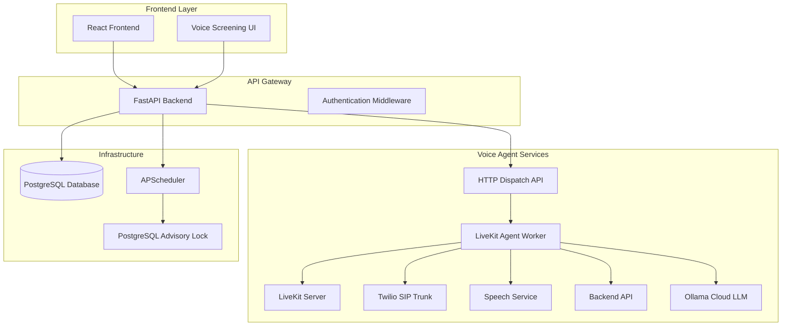
```mermaid
graph TB
subgraph "Frontend Layer"
FE[React Frontend]
UI[Voice Screening UI]
end
subgraph "API Gateway"
API[FastAPI Backend]
AUTH[Authentication Middleware]
end
subgraph "Voice Agent Services"
DISPATCH[HTTP Dispatch API]
WORKER[LiveKit Agent Worker]
LK[LiveKit Server]
TWILIO[Twilio SIP Trunk]
SC[Speech Service]
BK[Backend API]
LLM[Ollama Cloud LLM]
end
subgraph "Infrastructure"
DB[(PostgreSQL Database)]
SCHED[APScheduler]
LOCK[PostgreSQL Advisory Lock]
end
FE --> API
UI --> API
API --> DISPATCH
DISPATCH --> WORKER
WORKER --> LK
WORKER --> TWILIO
WORKER --> SC
WORKER --> BK
WORKER --> LLM
API --> DB
API --> SCHED
SCHED --> LOCK
```

**Diagram sources**
- [agent.py:535-602](file://app/voice_agent/agent.py#L535-L602)
- [agent.py:606-771](file://app/voice_agent/agent.py#L606-L771)
- [voice_call_scheduler.py:34](file://app/backend/services/voice_call_scheduler.py#L34)
- [voice_call_scheduler.py:518-603](file://app/backend/services/voice_call_scheduler.py#L518-L603)
- [docker-compose.yml:110-175](file://docker-compose.yml#L110-L175)

**Updated** The architecture now includes FastAPI HTTP dispatch server for initiating voice calls, LiveKit Agent Worker for real-time conversation management, Twilio SIP trunking for telephony coordination, and comprehensive speech processing services for audio handling. The LiveKit Server provides WebRTC SFU functionality with SIP trunking configuration support and enhanced network security through reduced port ranges. A PostgreSQL advisory lock mechanism ensures single-instance scheduler execution in multi-worker deployments.

The architecture consists of six main layers:

1. **Presentation Layer**: React-based frontend with voice screening management interface
2. **API Layer**: FastAPI backend providing RESTful endpoints for voice screening operations
3. **Dispatch Layer**: HTTP dispatch API that triggers call initiation and room creation
4. **Agent Layer**: LiveKit Agent Worker that manages real-time voice conversations with audio processing
5. **Telephony Layer**: LiveKit Server with Twilio SIP trunking for PSTN connectivity
6. **Data Layer**: PostgreSQL database with specialized voice screening models and scheduling

## Core Components

### HTTP Dispatch API

The HTTP dispatch API serves as the entry point for voice call initiation, creating LiveKit rooms and coordinating SIP outbound calls to candidates.

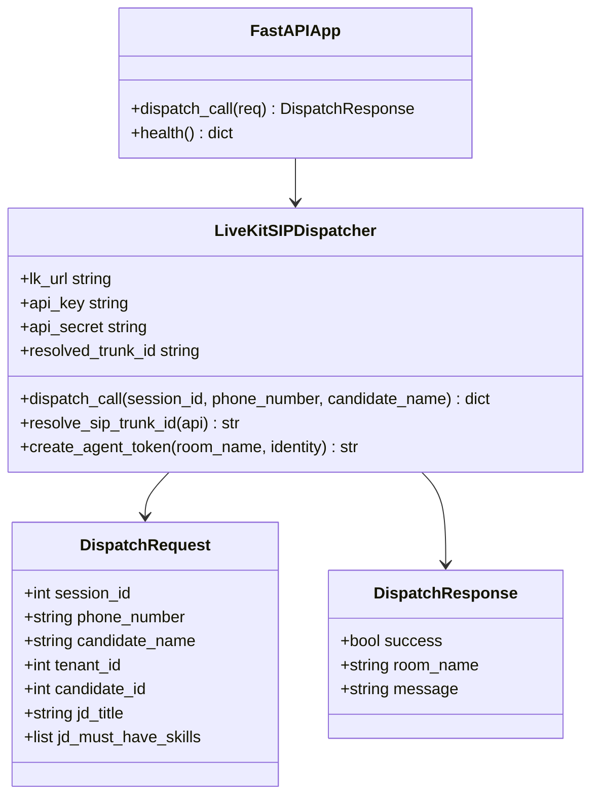
```mermaid
classDiagram
class LiveKitSIPDispatcher {
+dispatch_call(session_id, phone_number, candidate_name) dict
+resolve_sip_trunk_id(api) str
+create_agent_token(room_name, identity) str
+lk_url string
+api_key string
+api_secret string
+resolved_trunk_id string
}
class DispatchRequest {
+int session_id
+string phone_number
+string candidate_name
+int tenant_id
+int candidate_id
+string jd_title
+list jd_must_have_skills
}
class DispatchResponse {
+bool success
+string room_name
+string message
}
class FastAPIApp {
+dispatch_call(req) DispatchResponse
+health() dict
}
LiveKitSIPDispatcher --> DispatchRequest
LiveKitSIPDispatcher --> DispatchResponse
FastAPIApp --> LiveKitSIPDispatcher
```

**Diagram sources**
- [agent.py:535-602](file://app/voice_agent/agent.py#L535-L602)
- [agent.py:781-852](file://app/voice_agent/agent.py#L781-L852)

**Section sources**
- [agent.py:535-602](file://app/voice_agent/agent.py#L535-L602)
- [agent.py:781-852](file://app/voice_agent/agent.py#L781-L852)

### LiveKit Agent Worker

The LiveKit Agent Worker manages real-time audio streams, processes speech-to-text and text-to-speech conversions, and executes the conversation state machine.

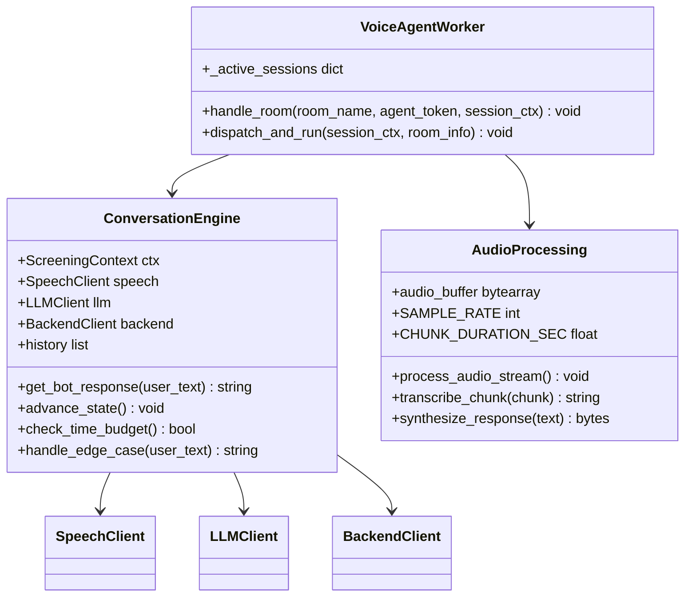
```mermaid
classDiagram
class VoiceAgentWorker {
+handle_room(room_name, agent_token, session_ctx) void
+dispatch_and_run(session_ctx, room_info) void
+_active_sessions dict
}
class ConversationEngine {
+ScreeningContext ctx
+SpeechClient speech
+LLMClient llm
+BackendClient backend
+history list
+get_bot_response(user_text) string
+advance_state() void
+check_time_budget() bool
+handle_edge_case(user_text) string
}
class AudioProcessing {
+audio_buffer bytearray
+SAMPLE_RATE int
+CHUNK_DURATION_SEC float
+process_audio_stream() void
+transcribe_chunk(chunk) string
+synthesize_response(text) bytes
}
VoiceAgentWorker --> ConversationEngine
VoiceAgentWorker --> AudioProcessing
ConversationEngine --> SpeechClient
ConversationEngine --> LLMClient
ConversationEngine --> BackendClient
```

**Diagram sources**
- [agent.py:606-771](file://app/voice_agent/agent.py#L606-L771)
- [agent.py:258-427](file://app/voice_agent/agent.py#L258-L427)

**Section sources**
- [agent.py:606-771](file://app/voice_agent/agent.py#L606-L771)
- [agent.py:258-427](file://app/voice_agent/agent.py#L258-L427)

### Speech Processing Service

The speech processing service provides comprehensive audio handling capabilities including speech-to-text (STT), text-to-speech (TTS), and voice activity detection (VAD) for real-time conversation processing.

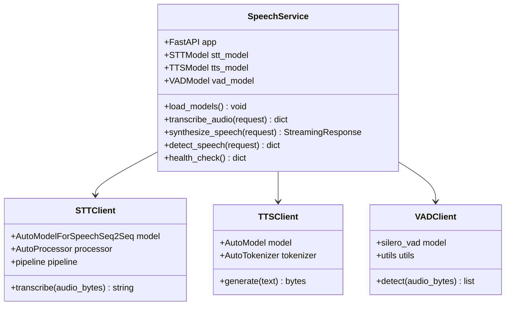
```mermaid
classDiagram
class SpeechService {
+FastAPI app
+STTModel stt_model
+TTSModel tts_model
+VADModel vad_model
+load_models() void
+transcribe_audio(request) dict
+synthesize_speech(request) StreamingResponse
+detect_speech(request) dict
+health_check() dict
}
class STTClient {
+AutoModelForSpeechSeq2Seq model
+AutoProcessor processor
+pipeline pipeline
+transcribe(audio_bytes) string
}
class TTSClient {
+AutoModel model
+AutoTokenizer tokenizer
+generate(text) bytes
}
class VADClient {
+silero_vad model
+utils utils
+detect(audio_bytes) list
}
SpeechService --> STTClient
SpeechService --> TTSClient
SpeechService --> VADClient
```

**Diagram sources**
- [main.py:25-387](file://app/speech_service/main.py#L25-L387)

**Section sources**
- [main.py:1-387](file://app/speech_service/main.py#L1-L387)

### Backend API Layer

The backend API provides comprehensive voice screening functionality through RESTful endpoints. It handles tenant configuration, session management, scheduling, and integration with external services.

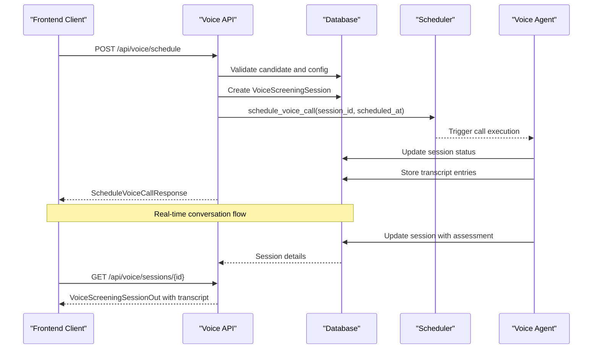
```mermaid
sequenceDiagram
participant Client as "Frontend Client"
participant API as "Voice API"
participant DB as "Database"
participant Scheduler as "Scheduler"
participant Agent as "Voice Agent"
Client->>API : POST /api/voice/schedule
API->>DB : Validate candidate and config
API->>DB : Create VoiceScreeningSession
API->>Scheduler : schedule_voice_call(session_id, scheduled_at)
Scheduler-->>Agent : Trigger call execution
Agent->>DB : Update session status
Agent->>DB : Store transcript entries
API-->>Client : ScheduleVoiceCallResponse
Note over Client,DB : Real-time conversation flow
Agent->>DB : Update session with assessment
DB-->>API : Session details
Client->>API : GET /api/voice/sessions/{id}
API-->>Client : VoiceScreeningSessionOut with transcript
```

**Diagram sources**
- [voice.py:94-144](file://app/backend/routes/voice.py#L94-L144)
- [voice_call_scheduler.py](file://app/backend/services/voice_call_scheduler.py)

**Section sources**
- [voice.py:1-385](file://app/backend/routes/voice.py#L1-L385)

### PostgreSQL Advisory Lock Scheduler

The voice call scheduler now implements a PostgreSQL advisory lock mechanism to ensure single-instance execution across multi-worker deployments, preventing duplicate job processing and lost jobs.

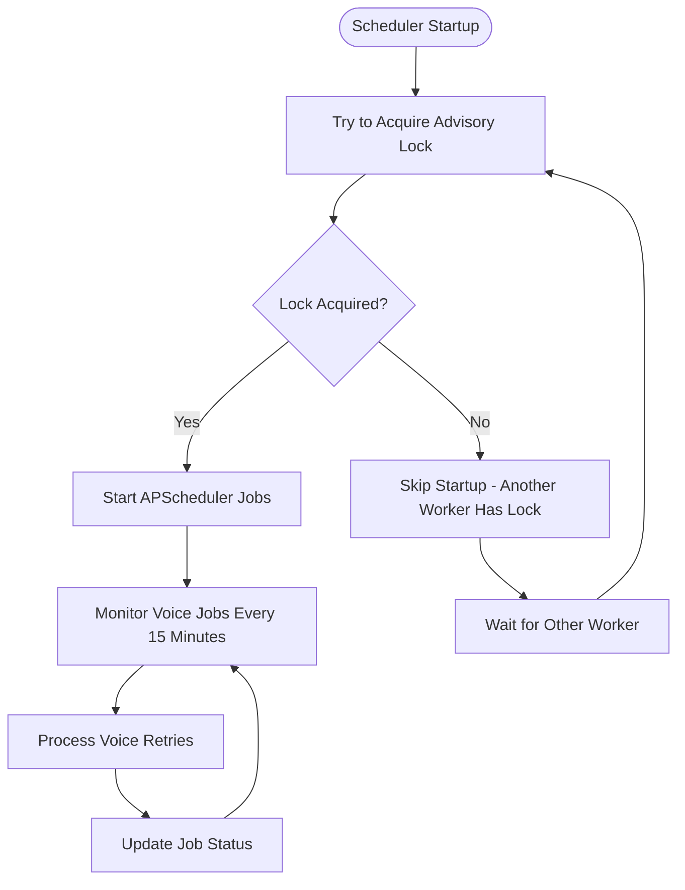
```mermaid
flowchart TD
Start([Scheduler Startup]) --> AcquireLock["Try to Acquire Advisory Lock"]
AcquireLock --> LockSuccess{"Lock Acquired?"}
LockSuccess --> |Yes| StartScheduler["Start APScheduler Jobs"]
LockSuccess --> |No| SkipStartup["Skip Startup - Another Worker Has Lock"]
StartScheduler --> MonitorJobs["Monitor Voice Jobs Every 15 Minutes"]
MonitorJobs --> ProcessRetries["Process Voice Retries"]
ProcessRetries --> UpdateJobs["Update Job Status"]
UpdateJobs --> MonitorJobs
SkipStartup --> Wait["Wait for Other Worker"]
Wait --> AcquireLock
```

**Diagram sources**
- [voice_call_scheduler.py:518-603](file://app/backend/services/voice_call_scheduler.py#L518-L603)

**Updated** The advisory lock mechanism uses PostgreSQL's `pg_try_advisory_lock()` function to ensure only one worker processes voice scheduler jobs across multiple uvicorn workers. This prevents duplicate job execution and lost jobs when running with `--workers 3`.

**Section sources**
- [voice_call_scheduler.py:518-603](file://app/backend/services/voice_call_scheduler.py#L518-L603)

## Voice Agent Implementation

### Dual-Component Architecture

The voice agent system implements a sophisticated dual-component design that separates call initiation from real-time conversation management.

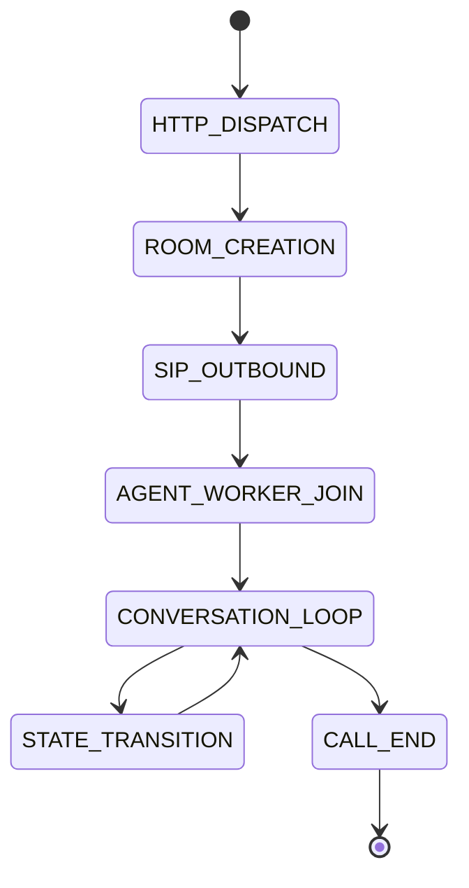
```mermaid
stateDiagram-v2
[*] --> HTTP_DISPATCH
HTTP_DISPATCH --> ROOM_CREATION
ROOM_CREATION --> SIP_OUTBOUND
SIP_OUTBOUND --> AGENT_WORKER_JOIN
AGENT_WORKER_JOIN --> CONVERSATION_LOOP
CONVERSATION_LOOP --> STATE_TRANSITION
STATE_TRANSITION --> CONVERSATION_LOOP
CONVERSATION_LOOP --> CALL_END
CALL_END --> [*]
```

**Diagram sources**
- [agent.py:802-852](file://app/voice_agent/agent.py#L802-L852)
- [agent.py:618-754](file://app/voice_agent/agent.py#L618-L754)

**Updated** The dual-component architecture now includes comprehensive HTTP dispatch API for call initiation and LiveKit Agent Worker for real-time conversation management, with sophisticated state machine handling and error recovery. The system maintains full telephony integration readiness with comprehensive audio processing and conversation management capabilities.

### Enhanced LiveKit SIP Integration with Protobuf Methods

The voice agent service integrates with LiveKit for comprehensive telephony coordination, providing SIP trunk registration and real-time audio processing capabilities through Twilio integration. The system now uses protobuf-based API methods for enhanced reliability and compatibility.

**Current Implementation Status**: Phase 1.4 - LiveKit integration is fully implemented with Twilio SIP trunking support. The system maintains conversation engine readiness with comprehensive audio processing and state management.

**Updated** The LiveKit SIP dispatcher now implements a comprehensive three-tier approach for SIP trunk management using protobuf-based API methods:

1. **Trunk Discovery**: Automatically lists existing SIP trunks and searches for Twilio matches using `ListSIPOutboundTrunkRequest`
2. **API-Based Creation**: Creates new SIP outbound trunks via LiveKit API using `CreateSIPOutboundTrunkRequest` and `SIPOutboundTrunkInfo`
3. **Environment Variable Fallback**: Uses SIP_TRUNK_ID as final fallback option

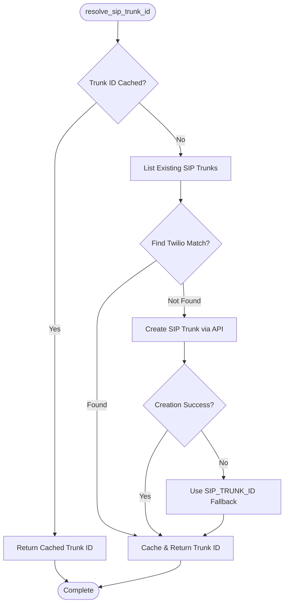
```mermaid
flowchart TD
Start([resolve_sip_trunk_id]) --> CheckCache{"Trunk ID Cached?"}
CheckCache --> |Yes| ReturnCached["Return Cached Trunk ID"]
CheckCache --> |No| ListTrunks["List Existing SIP Trunks"]
ListTrunks --> FindMatch{"Find Twilio Match?"}
FindMatch --> |Found| CacheAndReturn["Cache & Return Trunk ID"]
FindMatch --> |Not Found| CreateTrunk["Create SIP Trunk via API"]
CreateTrunk --> CreateSuccess{"Creation Success?"}
CreateSuccess --> |Yes| CacheAndReturn
CreateSuccess --> |No| EnvFallback["Use SIP_TRUNK_ID Fallback"]
EnvFallback --> CacheAndReturn
ReturnCached --> End([Complete])
CacheAndReturn --> End
```

**Diagram sources**
- [agent.py:544-592](file://app/voice_agent/agent.py#L544-L592)

**Updated** Enhanced LiveKit SIP dispatcher now includes automatic trunk ID resolution, eliminating the need for manual trunk ID configuration. The system automatically discovers and matches the correct SIP trunk based on Twilio outbound address or configured name/id. The three-tier approach ensures robust SIP trunk management with comprehensive error handling and fallback mechanisms.

**Section sources**
- [agent.py:544-592](file://app/voice_agent/agent.py#L544-L592)

### SIP Signaling Configuration

The system now implements comprehensive SIP signaling configuration for telephony integration with external providers like Twilio. The LiveKit Server configuration includes proper SIP port exposure and programmatic trunk management capabilities.

**SIP Configuration Details**:
- **Port Exposure**: LiveKit Server exposes port 5060 for SIP signaling
- **Programmatic Management**: SIP trunks are managed via LiveKit API rather than YAML configuration
- **External Provider Support**: Twilio PSTN connectivity through SIP trunking
- **Fallback Mechanisms**: Environment variable-based trunk ID resolution

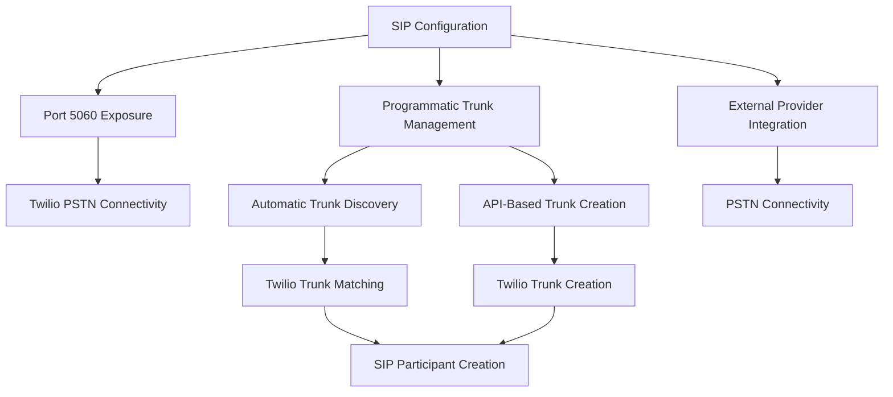
```mermaid
flowchart TD
SIPConfig[SIP Configuration] --> Port5060["Port 5060 Exposure"]
SIPConfig --> Programmatic["Programmatic Trunk Management"]
SIPConfig --> ExternalProviders["External Provider Integration"]
Port5060 --> Twilio["Twilio PSTN Connectivity"]
Programmatic --> AutoDiscovery["Automatic Trunk Discovery"]
Programmatic --> APICreation["API-Based Trunk Creation"]
ExternalProviders --> PSTN["PSTN Connectivity"]
AutoDiscovery --> TwilioMatch["Twilio Trunk Matching"]
APICreation --> TwilioTrunk["Twilio Trunk Creation"]
TwilioMatch --> SIPParticipant["SIP Participant Creation"]
TwilioTrunk --> SIPParticipant
```

**Diagram sources**
- [livekit.yaml:29-34](file://app/voice_agent/livekit.yaml#L29-L34)
- [agent.py:594-646](file://app/voice_agent/agent.py#L594-L646)

**Section sources**
- [livekit.yaml:29-34](file://app/voice_agent/livekit.yaml#L29-L34)
- [agent.py:594-646](file://app/voice_agent/agent.py#L594-L646)

### Enhanced Phone Number Normalization

The system now implements robust phone number normalization for proper Twilio E.164 integration, ensuring compatibility with external telephony providers.

**Phone Number Processing**:
- **E.164 Compliance**: Converts international phone numbers to standardized format
- **Character Filtering**: Removes spaces, dashes, parentheses, and other non-numeric characters
- **Validation**: Ensures only digits and plus signs remain for Twilio compatibility
- **Error Handling**: Graceful degradation when normalization fails

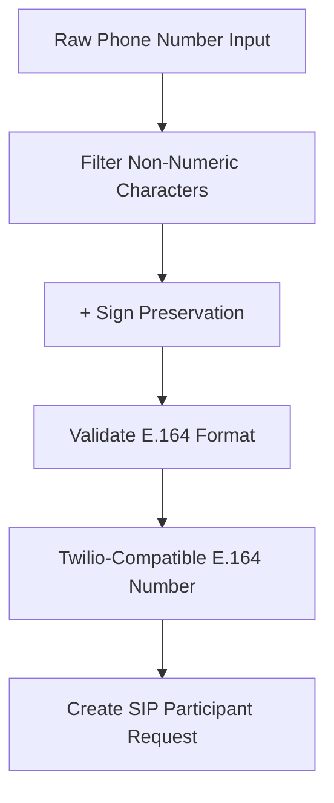
```mermaid
flowchart TD
PhoneNumberInput["Raw Phone Number Input"] --> FilterCharacters["Filter Non-Numeric Characters"]
FilterCharacters --> KeepPlus["+ Sign Preservation"]
KeepPlus --> ValidateFormat["Validate E.164 Format"]
ValidateFormat --> TwilioReady["Twilio-Compatible E.164 Number"]
TwilioReady --> SIPParticipant["Create SIP Participant Request"]
```

**Diagram sources**
- [agent.py:664-667](file://app/voice_agent/agent.py#L664-L667)

**Updated** Enhanced phone number normalization now uses sophisticated regex filtering to convert any international phone number format to proper E.164 format. The system strips all non-numeric characters except the plus sign, ensuring compatibility with Twilio's requirements. This enhancement resolves previous integration issues with external telephony providers.

**Section sources**
- [agent.py:664-667](file://app/voice_agent/agent.py#L664-L667)

### LLM Integration with Ollama Cloud

The voice agent integrates with Ollama Cloud for advanced language model processing, providing intelligent conversation responses and screening analysis.

**LLM Configuration**:
- Base URL: https://ollama.com
- Model: gemma4:31b-cloud
- API Key: Environment variable support
- Integration Points: Response generation, screening question creation, assessment analysis

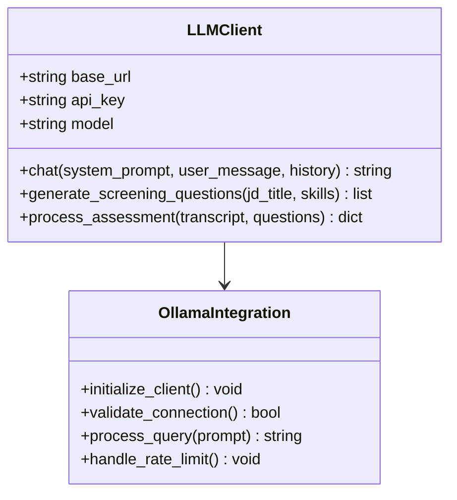
```mermaid
classDiagram
class LLMClient {
+string base_url
+string api_key
+string model
+chat(system_prompt, user_message, history) string
+generate_screening_questions(jd_title, skills) list
+process_assessment(transcript, questions) dict
}
class OllamaIntegration {
+initialize_client() void
+validate_connection() bool
+process_query(prompt) string
+handle_rate_limit() void
}
LLMClient --> OllamaIntegration
```

**Diagram sources**
- [agent.py:157-215](file://app/voice_agent/agent.py#L157-L215)

**Section sources**
- [agent.py:157-215](file://app/voice_agent/agent.py#L157-L215)

### Enhanced Tenant Configuration Integration

The voice agent now integrates with comprehensive tenant configuration management, providing flexible customization options for voice screening operations.

**Enhanced Configuration Parameters**:
- `bot_name`: Customizable voice agent name (default: "ARIA Assistant")
- `greeting_style`: Professional, casual, or friendly greeting styles
- `call_duration_max`: Maximum call duration in seconds (default: 420 seconds)
- `consent_script`: Custom consent recording script for compliance
- `call_duration_min`: Minimum call duration for compliance requirements

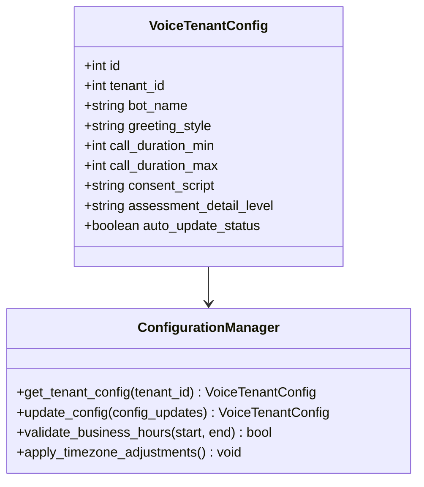
```mermaid
classDiagram
class VoiceTenantConfig {
+int id
+int tenant_id
+string bot_name
+string greeting_style
+int call_duration_min
+int call_duration_max
+string consent_script
+string assessment_detail_level
+boolean auto_update_status
}
class ConfigurationManager {
+get_tenant_config(tenant_id) VoiceTenantConfig
+update_config(config_updates) VoiceTenantConfig
+validate_business_hours(start, end) bool
+apply_timezone_adjustments() void
}
VoiceTenantConfig --> ConfigurationManager
```

**Diagram sources**
- [db_models.py:875-901](file://app/backend/models/db_models.py#L875-L901)
- [voice_screening_service.py:284-347](file://app/backend/services/voice_screening_service.py#L284-L347)

**Section sources**
- [db_models.py:875-901](file://app/backend/models/db_models.py#L875-L901)
- [voice_screening_service.py:284-347](file://app/backend/services/voice_screening_service.py#L284-L347)

### Enhanced Transcript Management

The system now implements unified transcript management through the `transcript_json` field, providing comprehensive JSON storage for all conversation data.

**Transcript Data Structure**:
- Unified JSON array containing all conversation entries
- Automatic timestamp tracking for each transcript segment
- Audio URL storage for individual speaker turns
- Seamless integration with assessment generation

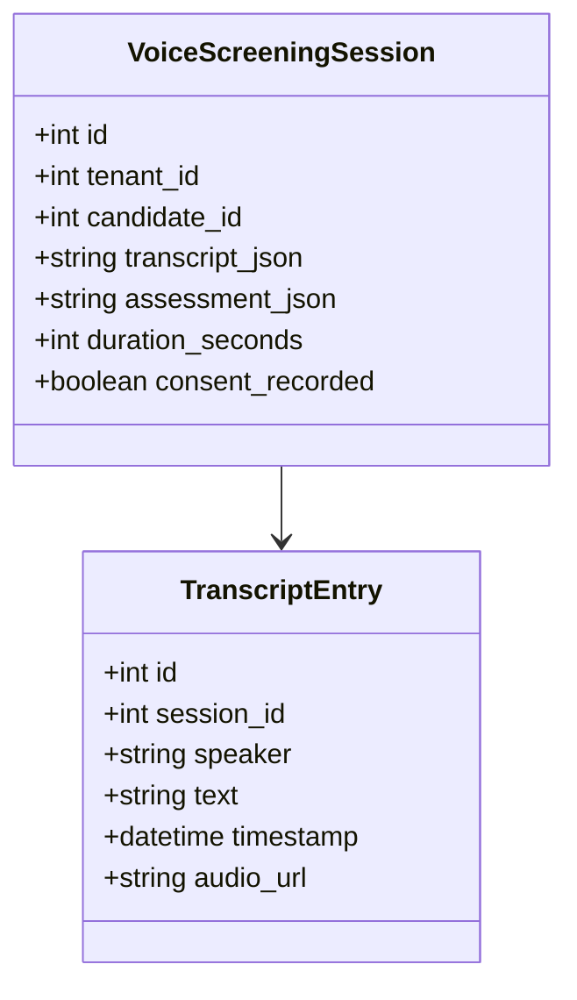
```mermaid
classDiagram
class VoiceScreeningSession {
+int id
+int tenant_id
+int candidate_id
+string transcript_json
+string assessment_json
+int duration_seconds
+boolean consent_recorded
}
class TranscriptEntry {
+int id
+int session_id
+string speaker
+string text
+datetime timestamp
+string audio_url
}
VoiceScreeningSession --> TranscriptEntry
```

**Diagram sources**
- [db_models.py:907-960](file://app/backend/models/db_models.py#L907-L960)
- [voice_screening_service.py:352-408](file://app/backend/services/voice_screening_service.py#L352-L408)

**Section sources**
- [db_models.py:907-960](file://app/backend/models/db_models.py#L907-L960)
- [voice_screening_service.py:352-408](file://app/backend/services/voice_screening_service.py#L352-L408)

### Edge Case Handling

The system includes robust edge case detection and handling mechanisms to manage various conversation scenarios gracefully:

- **Silence Detection**: Identifies periods of silence and prompts for response
- **Unclear Responses**: Handles brief or ambiguous answers with follow-up questions
- **Rescheduling Requests**: Manages candidate requests to reschedule calls
- **Compensation Questions**: Redirects salary/benefits inquiries to appropriate channels
- **AI Detection**: Responds appropriately when candidates question if they're speaking to AI
- **Call End Conditions**: Graceful termination based on time budget and user requests

**Updated** Enhanced edge case handling now includes sophisticated rescheduling request detection during conversation flow, allowing candidates to request rescheduling through natural language prompts.

**Section sources**
- [agent.py:375-412](file://app/voice_agent/agent.py#L375-L412)

### Enhanced Audio Processing Pipeline

The system implements sophisticated audio processing with enhanced WAV header stripping and proper PCM frame creation for LiveKit integration using protobuf-based audio frame creation.

**Audio Processing Pipeline**:
- Enhanced WAV header stripping to extract raw PCM samples
- Proper AudioFrame creation with correct sample rates and channel counts using protobuf
- Sophisticated error handling for audio capture operations
- Graceful degradation when audio processing fails

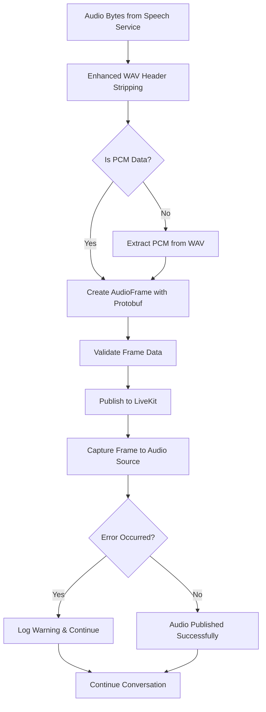
```mermaid
flowchart TD
AudioInput["Audio Bytes from Speech Service"] --> StripHeader["Enhanced WAV Header Stripping"]
StripHeader --> CheckPCM{"Is PCM Data?"}
CheckPCM --> |Yes| CreateFrame["Create AudioFrame with Protobuf"]
CheckPCM --> |No| ExtractPCM["Extract PCM from WAV"]
ExtractPCM --> CreateFrame
CreateFrame --> ValidateFrame["Validate Frame Data"]
ValidateFrame --> PublishAudio["Publish to LiveKit"]
PublishAudio --> CaptureFrame["Capture Frame to Audio Source"]
CaptureFrame --> ErrorHandling{"Error Occurred?"}
ErrorHandling --> |Yes| LogWarning["Log Warning & Continue"]
ErrorHandling --> |No| Success["Audio Published Successfully"]
LogWarning --> Continue["Continue Conversation"]
Success --> Continue
```

**Diagram sources**
- [agent.py:647-692](file://app/voice_agent/agent.py#L647-L692)

**Updated** The audio processing system now includes comprehensive WAV header stripping and proper PCM frame creation. The `_strip_wav_header()` function extracts raw PCM samples from WAV files, while `_publish_audio()` creates proper AudioFrame objects with correct sample rates and channel configurations using protobuf-based methods. Sophisticated error handling ensures graceful degradation when audio capture operations fail.

**Section sources**
- [agent.py:647-692](file://app/voice_agent/agent.py#L647-L692)

### LiveKit Track Subscription Event Handling

**Updated** The voice agent system now implements a robust track subscription handling mechanism that bridges LiveKit's event system limitations with asynchronous audio processing capabilities.

**LiveKit Callback Compatibility Fix**:
- **Problem**: LiveKit's `.on()` method does not support async callbacks, causing audio processing to fail
- **Solution**: Implemented synchronous wrapper function using `asyncio.create_task()` to bridge the event system gap
- **Mechanism**: `on_track_subscribed()` function wraps async `_process_track()` in a task for proper event handling
- **Maintains**: Full asynchronous audio processing capabilities while ensuring event system compatibility

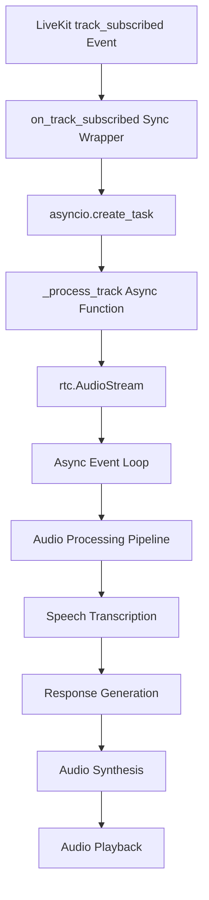
```mermaid
flowchart TD
LiveKitEvent[LiveKit track_subscribed Event] --> SyncWrapper[on_track_subscribed Sync Wrapper]
SyncWrapper --> AsyncTask[asyncio.create_task]
AsyncTask --> ProcessTrack[_process_track Async Function]
ProcessTrack --> AudioStream[rtc.AudioStream]
AudioStream --> AsyncLoop[Async Event Loop]
AsyncLoop --> AudioProcessing[Audio Processing Pipeline]
AudioProcessing --> Transcription[Speech Transcription]
Transcription --> ResponseGeneration[Response Generation]
ResponseGeneration --> AudioSynthesis[Audio Synthesis]
AudioSynthesis --> AudioPlayback[Audio Playback]
```

**Diagram sources**
- [agent.py:775-831](file://app/voice_agent/agent.py#L775-L831)

**Updated** The track subscription handling mechanism now includes a sophisticated synchronous wrapper that addresses LiveKit's event system limitations. The `on_track_subscribed()` function serves as a bridge between LiveKit's synchronous event system and the agent's asynchronous audio processing pipeline. This ensures reliable audio track subscription handling while maintaining the full benefits of asynchronous processing for speech recognition and synthesis operations.

**Section sources**
- [agent.py:775-831](file://app/voice_agent/agent.py#L775-L831)

## Backend Services

### Voice Call Scheduler

The voice call scheduler service manages the timing and execution of screening calls using APScheduler for reliable job scheduling and comprehensive retry mechanisms. The scheduler now implements PostgreSQL advisory locks to ensure single-instance execution across multi-worker deployments.

```mermaid
flowchart TD
Start([Call Scheduled]) --> ValidateConfig["Validate Tenant Configuration"]
ValidateConfig --> CheckBusinessHours["Check Business Hours"]
CheckBusinessHours --> WithinHours{"Within Business Hours?"}
WithinHours --> |Yes| CreateJob["Create APScheduler Job"]
WithinHours --> |No| AdjustTime["Adjust to Next Business Slot"]
AdjustTime --> CreateJob
CreateJob --> ExecuteCall["Execute Call"]
ExecuteCall --> UpdateStatus["Update Session Status"]
UpdateStatus --> CompleteCall["Call Complete"]
subgraph "Advisory Lock Protection"
LockCheck["Check Advisory Lock"] --> LockAcquired{"Lock Acquired?"}
LockAcquired --> |Yes| ProcessJobs["Process Voice Jobs"]
LockAcquired --> |No| SkipProcessing["Skip Processing"]
end
subgraph "Retry Mechanisms"
FailedCall["Call Failed"] --> CheckRetries["Check Retry Count"]
CheckRetries --> HasRetries{"Has Remaining Retries?"}
HasRetries --> |Yes| ScheduleRetry["Schedule Retry"]
HasRetries --> |No| MarkEscalated["Mark as Escalated"]
ScheduleRetry --> ExecuteCall
end
subgraph "Callback Cancellation"
InboundCall["Inbound Callback"] --> CancelRetries["Cancel Pending Retries"]
CancelRetries --> ConnectToSession["Connect to Original Session"]
end
```

**Diagram sources**
- [voice_call_scheduler.py](file://app/backend/services/voice_call_scheduler.py)
- [voice_call_scheduler.py:518-603](file://app/backend/services/voice_call_scheduler.py#L518-L603)

**Updated** Enhanced rescheduling capabilities now include comprehensive job description ID tracking and improved error handling for rescheduling operations, ensuring proper session management and resource cleanup. The advisory lock mechanism prevents duplicate job processing in multi-worker deployments.

**Section sources**
- [voice_call_scheduler.py](file://app/backend/services/voice_call_scheduler.py)
- [voice_call_scheduler.py:518-603](file://app/backend/services/voice_call_scheduler.py#L518-L603)

### Voice Screening Service

The voice screening service provides core business logic for conversation context building, assessment generation, and session management with comprehensive real-time processing capabilities.

**Enhanced Session Context Building**:
- Unified tenant configuration retrieval
- Comprehensive candidate and job description integration
- Dynamic consent script application
- Flexible greeting style selection
- Configurable call duration enforcement

**Section sources**
- [voice_screening_service.py](file://app/backend/services/voice_screening_service.py)

## Database Schema

The voice screening system utilizes a comprehensive database schema designed to support scalable voice screening operations with proper indexing and relationships.

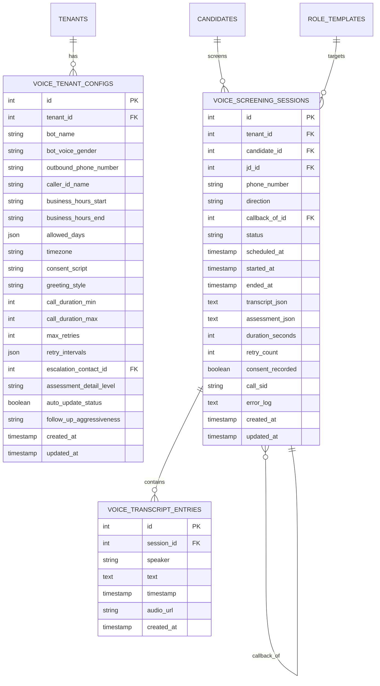
```mermaid
erDiagram
VOICE_TENANT_CONFIGS {
int id PK
int tenant_id FK
string bot_name
string bot_voice_gender
string outbound_phone_number
string caller_id_name
string business_hours_start
string business_hours_end
json allowed_days
string timezone
string consent_script
string greeting_style
int call_duration_min
int call_duration_max
int max_retries
json retry_intervals
int escalation_contact_id FK
string assessment_detail_level
boolean auto_update_status
string follow_up_aggressiveness
timestamp created_at
timestamp updated_at
}
VOICE_SCREENING_SESSIONS {
int id PK
int tenant_id FK
int candidate_id FK
int jd_id FK
string phone_number
string direction
int callback_of_id FK
string status
timestamp scheduled_at
timestamp started_at
timestamp ended_at
text transcript_json
text assessment_json
int duration_seconds
int retry_count
boolean consent_recorded
string call_sid
text error_log
timestamp created_at
timestamp updated_at
}
VOICE_TRANSCRIPT_ENTRIES {
int id PK
int session_id FK
string speaker
text text
timestamp timestamp
string audio_url
timestamp created_at
}
TENANTS ||--o{ VOICE_TENANT_CONFIGS : has
CANDIDATES ||--o{ VOICE_SCREENING_SESSIONS : screens
ROLE_TEMPLATES ||--o{ VOICE_SCREENING_SESSIONS : targets
VOICE_SCREENING_SESSIONS ||--o{ VOICE_TRANSCRIPT_ENTRIES : contains
VOICE_SCREENING_SESSIONS }o--|| VOICE_SCREENING_SESSIONS : callback_of
```

**Diagram sources**
- [db_models.py:875-961](file://app/backend/models/db_models.py#L875-L961)

**Updated** The database schema now includes enhanced job description ID tracking capabilities, allowing for improved session management and reporting features. The unified `transcript_json` field provides comprehensive storage for all conversation data.

**Section sources**
- [db_models.py:875-961](file://app/backend/models/db_models.py#L875-L961)

## Frontend Integration

### Voice Screening Interface

The frontend provides an intuitive interface for recruiters to manage voice screening operations, including session scheduling, monitoring, and assessment review.

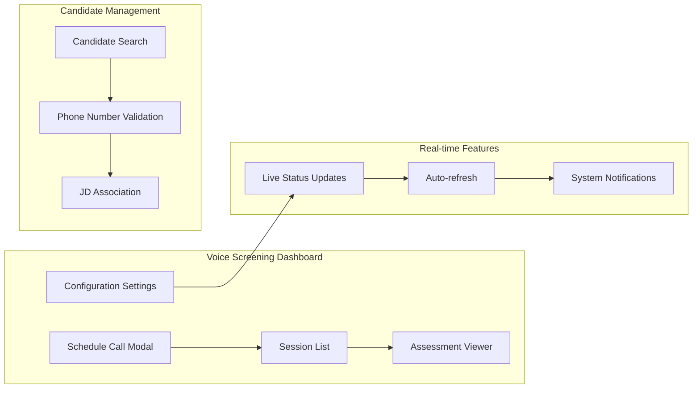
```mermaid
graph LR
subgraph "Voice Screening Dashboard"
SCHED[Schedule Call Modal]
SESSION_LIST[Session List]
SETTINGS[Configuration Settings]
ASSESSMENT[Assessment Viewer]
end
subgraph "Real-time Features"
LIVE_STATUS[Live Status Updates]
AUTO_REFRESH[Auto-refresh]
NOTIFICATIONS[System Notifications]
end
subgraph "Candidate Management"
CANDIDATE_SEARCH[Candidate Search]
PHONE_VALIDATION[Phone Number Validation]
JD_ASSOCIATION[JD Association]
end
SCHED --> SESSION_LIST
SESSION_LIST --> ASSESSMENT
SETTINGS --> LIVE_STATUS
LIVE_STATUS --> AUTO_REFRESH
AUTO_REFRESH --> NOTIFICATIONS
CANDIDATE_SEARCH --> PHONE_VALIDATION
PHONE_VALIDATION --> JD_ASSOCIATION
```

**Diagram sources**
- [VoiceScreeningPage.jsx:147-696](file://app/frontend/src/pages/VoiceScreeningPage.jsx#L147-L696)

**Updated** Enhanced frontend integration now includes improved rescheduling capabilities with job description ID tracking, allowing recruiters to easily reschedule calls with proper job association. The configuration interface now supports comprehensive tenant customization options.

**Section sources**
- [VoiceScreeningPage.jsx:1-786](file://app/frontend/src/pages/VoiceScreeningPage.jsx#L1-L786)

## API Endpoints

The backend exposes a comprehensive set of RESTful endpoints for voice screening operations:

### Voice Settings Management
- `GET /api/voice/settings` - Retrieve tenant voice screening configuration
- `PUT /api/voice/settings` - Update tenant voice screening configuration

### Call Scheduling
- `POST /api/voice/schedule` - Schedule a new voice screening call
- `GET /api/voice/sessions` - List voice screening sessions
- `GET /api/voice/sessions/{id}` - Get session details with transcript

### Session Management
- `PATCH /api/voice/sessions/{id}` - Update session status and metadata
- `POST /api/voice/sessions/{id}/reschedule` - **Enhanced** Reschedule a call with job description ID tracking
- `POST /api/voice/sessions/{id}/cancel` - Cancel a scheduled call

### Internal Service Endpoints
- `GET /api/voice/internal/config/{tenant_id}` - Internal tenant config access
- `GET /api/voice/internal/candidate/{tenant_id}/{candidate_id}` - Internal candidate info access

**Updated** Enhanced rescheduling endpoint now supports job description ID tracking and improved error handling for rescheduling operations. The internal configuration endpoint now includes comprehensive tenant settings including bot name, greeting style, and consent script.

**Section sources**
- [voice.py:47-385](file://app/backend/routes/voice.py#L47-L385)

## Conversation Flow

The voice screening conversation follows a structured flow designed to maximize information gathering while maintaining candidate engagement.

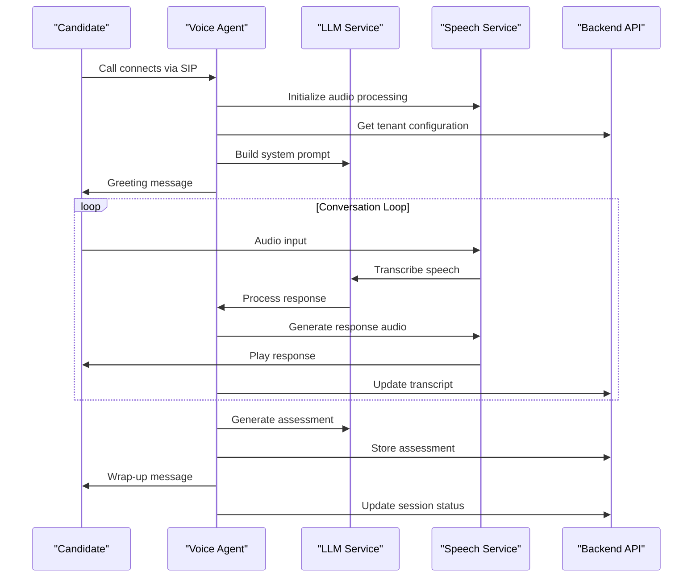
```mermaid
sequenceDiagram
participant Candidate as "Candidate"
participant VoiceAgent as "Voice Agent"
participant LLM as "LLM Service"
participant Speech as "Speech Service"
participant Backend as "Backend API"
Candidate->>VoiceAgent : Call connects via SIP
VoiceAgent->>Speech : Initialize audio processing
VoiceAgent->>Backend : Get tenant configuration
VoiceAgent->>LLM : Build system prompt
VoiceAgent->>Candidate : Greeting message
loop Conversation Loop
Candidate->>Speech : Audio input
Speech->>LLM : Transcribe speech
LLM->>VoiceAgent : Process response
VoiceAgent->>Speech : Generate response audio
Speech->>Candidate : Play response
VoiceAgent->>Backend : Update transcript
end
VoiceAgent->>LLM : Generate assessment
VoiceAgent->>Backend : Store assessment
VoiceAgent->>Candidate : Wrap-up message
VoiceAgent->>Backend : Update session status
```

**Diagram sources**
- [agent.py:431-485](file://app/voice_agent/agent.py#L431-L485)

**Updated** The conversation flow now includes enhanced rescheduling request detection and processing, allowing candidates to request rescheduling through natural language prompts with proper job description ID tracking. The system now enforces configurable call duration limits and applies customized consent scripts.

**Section sources**
- [agent.py:431-485](file://app/voice_agent/agent.py#L431-L485)

## Testing Framework

The voice screening system includes comprehensive testing coverage through unit tests and integration tests:

### Test Coverage Areas
- **Voice Settings**: Configuration retrieval and updates
- **Session Management**: Scheduling, rescheduling, and cancellation
- **Business Hours**: Time zone and scheduling validation
- **Conversation Context**: Building comprehensive conversation context
- **Assessment Generation**: Structured assessment creation
- **Rescheduling Operations**: Enhanced rescheduling with job description ID tracking
- **Tenant Configuration**: Bot name, greeting style, and consent script validation
- **Advisory Lock**: Single-instance scheduler execution protection
- **Audio Processing**: Enhanced WAV header stripping and PCM frame creation
- **SIP Trunk Management**: Programmatic SIP trunk resolution and creation with protobuf methods
- **Phone Number Normalization**: E.164 compliance and Twilio integration testing
- **LiveKit Event Handling**: Track subscription event handling with async callback bridging

### Test Scenarios
- Configuration validation and defaults
- Session lifecycle management
- Error handling and edge cases
- Business hour adjustments
- Assessment structure validation
- **Enhanced** Rescheduling operation validation with job description ID tracking
- **New** Tenant configuration integration testing
- **New** Advisory lock mechanism validation
- **New** Enhanced audio processing error handling testing
- **New** SIP trunk management with protobuf-based API methods testing
- **New** Phone number normalization and E.164 compliance validation
- **New** LiveKit track subscription event handling validation with async callback bridging

**Updated** Testing framework now includes comprehensive validation for enhanced rescheduling capabilities with job description ID tracking and improved error handling. New test coverage includes tenant configuration integration with bot name, greeting style, and consent script validation. Additional tests cover advisory lock mechanism functionality, enhanced audio processing error handling, and SIP trunk management with programmatic creation and discovery using protobuf methods. Phone number normalization testing ensures proper E.164 compliance for Twilio integration. LiveKit event handling testing validates the synchronous wrapper function that bridges event system limitations with asynchronous audio processing capabilities.

**Section sources**
- [test_voice_screening.py:1-871](file://app/backend/tests/test_voice_screening.py#L1-L871)

## Deployment Architecture

The voice screening system is designed for containerized deployment with clear service boundaries and communication patterns:

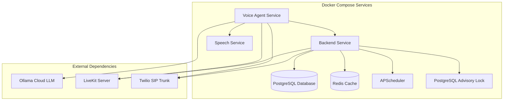
```mermaid
graph TB
subgraph "Docker Compose Services"
BACKEND[Backend Service]
VOICE_AGENT[Voice Agent Service]
SPEECH_SERVICE[Speech Service]
DATABASE[(PostgreSQL Database)]
REDIS[(Redis Cache)]
SCHEDULER[APScheduler]
LOCK[PostgreSQL Advisory Lock]
end
subgraph "External Dependencies"
LLM[Ollama Cloud LLM]
LIVESERVER[LiveKit Server]
TWILIO[Twilio SIP Trunk]
end
BACKEND --> DATABASE
BACKEND --> REDIS
BACKEND --> SCHEDULER
BACKEND --> LOCK
VOICE_AGENT --> BACKEND
VOICE_AGENT --> SPEECH_SERVICE
VOICE_AGENT --> LLM
VOICE_AGENT --> LIVESERVER
VOICE_AGENT --> TWILIO
BACKEND --> LIVESERVER
BACKEND --> TWILIO
```

**Diagram sources**
- [docker-compose.yml](file://docker-compose.yml)

**Updated** The deployment architecture now reflects the current Phase 1.4 implementation status with comprehensive LiveKit Server integration, Twilio SIP trunking, speech processing services, and Ollama Cloud LLM dependencies. Enhanced rescheduling capabilities are fully integrated into the deployment architecture. The LiveKit configuration now includes reduced port ranges (50000-50200) and node IP configuration for improved network security. The advisory lock mechanism ensures single-instance scheduler execution across multiple workers.

The deployment architecture supports horizontal scaling, service discovery, and resilient communication patterns essential for production voice screening operations.

**Updated** The LiveKit Server configuration has been updated to reflect programmatic SIP trunk management. The livekit.yaml file now explicitly states that SIP trunking is configured programmatically via the LiveKit API in the voice-agent, as the livekit-server version does not support SIP config in YAML. The LiveKit Server now exposes port 5060 for SIP signaling to support external telephony provider integration. The track subscription event handling mechanism is now fully integrated into the deployment architecture, ensuring reliable audio processing through the synchronous wrapper function.

**Section sources**
- [livekit.yaml:29-34](file://app/voice_agent/livekit.yaml#L29-L34)
- [Dockerfile.livekit:1-3](file://app/voice_agent/Dockerfile.livekit#L1-L3)

## Troubleshooting Procedures

### Common Issues and Solutions

#### LiveKit Connection Problems
- **Issue**: Voice agent cannot connect to LiveKit server
- **Solution**: Verify LiveKit server health check and SIP trunk configuration
- **Diagnostic**: Check LiveKit logs and SIP trunk credentials

#### Speech Service Failures
- **Issue**: STT/TTS/VAD endpoints failing
- **Solution**: Restart speech service and verify model loading
- **Diagnostic**: Check speech service health endpoint and model availability

#### Call Scheduling Issues
- **Issue**: Calls not being scheduled or executed
- **Solution**: Verify APScheduler configuration and business hours settings
- **Diagnostic**: Check scheduler logs and retry mechanisms

#### Rescheduling Problems
- **Issue**: Rescheduling operations failing or not updating job descriptions
- **Solution**: Verify job description ID tracking and rescheduling endpoint configuration
- **Diagnostic**: Check rescheduling logs and database updates

#### SIP Trunk Management Issues
- **Issue**: SIP trunk creation or discovery failing
- **Solution**: Verify LiveKit API credentials and Twilio configuration
- **Diagnostic**: Check SIP trunk resolution logs and API responses

#### Network Configuration Issues
- **Issue**: LiveKit port conflicts or connection timeouts
- **Solution**: Verify reduced port range configuration and node IP settings
- **Diagnostic**: Check LiveKit YAML configuration and network accessibility

#### SIP Signaling Problems
- **Issue**: SIP signaling failures or port connectivity issues
- **Solution**: Verify port 5060 exposure and external provider configuration
- **Diagnostic**: Check SIP port accessibility and external provider credentials

#### Advisory Lock Issues
- **Issue**: Scheduler not starting or duplicate job processing
- **Solution**: Verify PostgreSQL advisory lock permissions and configuration
- **Diagnostic**: Check advisory lock acquisition logs and database connectivity

#### Audio Processing Errors
- **Issue**: Audio capture failures or distorted audio
- **Solution**: Verify enhanced WAV header stripping and PCM frame creation
- **Diagnostic**: Check audio processing logs and frame validation

#### Protobuf API Compatibility Issues
- **Issue**: LiveKit protocol imports failing or protobuf method errors
- **Solution**: Verify livekit-protocol version compatibility and protobuf method signatures
- **Diagnostic**: Check protobuf import statements and method availability in livekit-protocol library

#### Phone Number Normalization Issues
- **Issue**: Twilio integration failures due to invalid phone numbers
- **Solution**: Verify E.164 compliance and character filtering logic
- **Diagnostic**: Check phone number normalization logs and Twilio error responses

#### LiveKit Event Handling Issues
- **Issue**: Track subscription events not firing or audio processing failures
- **Solution**: Verify synchronous wrapper function implementation and async callback bridging
- **Diagnostic**: Check track subscription event logs and async task execution status

### Monitoring and Logging

The system provides comprehensive monitoring through:
- **Health Checks**: Individual service health endpoints
- **Error Logs**: Detailed error logging with stack traces
- **Performance Metrics**: Audio processing and LLM response times
- **Session Tracking**: Real-time session status monitoring
- **Network Diagnostics**: LiveKit connection and port availability monitoring
- **Scheduler Monitoring**: Advisory lock status and job processing logs
- **SIP Trunk Monitoring**: Trunk discovery and creation status logs
- **Telephony Monitoring**: SIP signaling and external provider connectivity
- **Protobuf API Monitoring**: SIP trunk management and audio processing pipeline status
- **Phone Number Monitoring**: E.164 compliance validation and normalization logs
- **LiveKit Event Monitoring**: Track subscription event handling and async callback bridging status

**Updated** Enhanced troubleshooting now includes comprehensive monitoring for SIP trunk management, covering trunk discovery attempts, API creation failures, and environment variable fallback scenarios. Network diagnostics now include SIP port accessibility checks and external provider connectivity verification. New monitoring capabilities include protobuf API compatibility checking and enhanced audio processing pipeline validation. Phone number normalization monitoring ensures proper E.164 compliance for Twilio integration. LiveKit event handling monitoring validates the synchronous wrapper function that bridges event system limitations with asynchronous audio processing capabilities, ensuring reliable track subscription event handling and proper async callback execution.

**Section sources**
- [livekit.yaml:27-44](file://app/voice_agent/livekit.yaml#L27-L44)

## Conclusion

The Voice Agent Conversation System represents a comprehensive solution for automated phone screening in recruitment processes. By combining advanced AI capabilities with robust infrastructure, the system delivers scalable, compliant, and efficient candidate screening experiences.

**Current Implementation Status**: Phase 1.4 - The system now implements a comprehensive voice agent with dual-component design (HTTP dispatch API + LiveKit Agent Worker), sophisticated state machine management, LiveKit telephony coordination, and integrated speech processing services. The current implementation maintains full telephony integration readiness while ensuring system stability and performance.

Enhanced rescheduling capabilities with job description ID tracking provide improved flexibility for managing voice screening operations. The system now includes comprehensive error handling for rescheduling operations and sophisticated job description association for better session management. The unified transcript management through `transcript_json` field provides seamless integration with assessment generation and compliance reporting.

**Key Enhancements**:
- **PostgreSQL Advisory Lock**: Single-instance scheduler execution protection across multi-worker deployments
- **Programmatic SIP Trunk Management**: Three-tier approach (discovery, creation, fallback) eliminates YAML dependency
- **Enhanced Audio Processing**: WAV header stripping and proper PCM frame creation for LiveKit integration
- **Sophisticated Error Handling**: Comprehensive audio capture operation error handling with graceful degradation
- **Enhanced Rescheduling**: Job description ID tracking and improved error handling for rescheduling operations
- **Improved Session Management**: Sophisticated job description association and rescheduling capabilities
- **Unified Transcript Management**: Comprehensive JSON storage for all conversation data
- **Flexible Tenant Configuration**: Customizable bot names, greeting styles, and consent scripts
- **Enhanced Network Security**: Reduced port ranges and node IP configuration for LiveKit Server
- **SIP Signaling Configuration**: Port 5060 exposure and programmatic trunk management for external provider integration
- **Protobuf API Integration**: Enhanced LiveKit protocol compatibility with protobuf-based API methods
- **Phone Number Normalization**: Robust E.164 compliance for proper Twilio integration
- **LiveKit Event System Bridge**: Synchronous wrapper function that addresses event system limitations while maintaining asynchronous audio processing capabilities
- **Comprehensive Troubleshooting**: Enhanced monitoring and diagnostic capabilities for SDK compatibility issues

The system provides a solid foundation for organizations seeking to enhance their recruitment processes through intelligent automation while maintaining human oversight and compliance standards. The current Phase 1.4 implementation ensures full telephony integration readiness with comprehensive audio processing and conversation management capabilities, including enhanced rescheduling functionality with job description ID tracking, comprehensive tenant configuration options, robust advisory lock protection for production deployments, and reliable LiveKit event handling through the synchronous wrapper mechanism.

**Updated** The migration to programmatic SIP trunk management with protobuf-based API methods represents a significant architectural improvement, eliminating the dependency on YAML-based configuration and providing robust automatic trunk discovery, creation, and fallback mechanisms. This change enhances system reliability and reduces operational overhead while maintaining full telephony integration capabilities. The addition of SIP signaling configuration with port 5060 exposure enables proper integration with external telephony providers like Twilio, expanding the system's connectivity options and PSTN integration capabilities. The enhanced audio processing pipeline with improved WAV header stripping and PCM frame creation ensures optimal audio quality and LiveKit compatibility. The comprehensive troubleshooting procedures now include protobuf API compatibility checking and enhanced monitoring for SDK-related issues, providing developers with better tools for diagnosing and resolving integration problems. The robust phone number normalization system ensures proper E.164 compliance for Twilio integration, resolving previous compatibility issues with external telephony providers. The LiveKit track subscription event handling mechanism now includes a sophisticated synchronous wrapper that bridges event system limitations with asynchronous audio processing capabilities, ensuring reliable audio processing while maintaining full async processing benefits. This enhancement resolves critical callback compatibility issues and improves overall system stability and performance.