# Voice Agent Conversation System

<cite>
**Referenced Files in This Document**
- [agent.py](file://app/voice_agent/agent.py)
- [recruiter_conversation.py](file://app/voice_agent/recruiter_conversation.py)
- [main.py](file://app/speech_service/main.py)
- [voice.py](file://app/backend/routes/voice.py)
- [recruiter.py](file://app/backend/routes/recruiter.py)
- [voice_call_scheduler.py](file://app/backend/services/voice_call_scheduler.py)
- [voice_screening_service.py](file://app/backend/services/voice_screening_service.py)
- [orchestrator.py](file://app/backend/services/recruiter/orchestrator.py)
- [context_engine.py](file://app/backend/services/recruiter/context_engine.py)
- [strategy_agent.py](file://app/backend/services/recruiter/strategy_agent.py)
- [evaluation_agents.py](file://app/backend/services/recruiter/evaluation_agents.py)
- [recommendation_agent.py](file://app/backend/services/recruiter/recommendation_agent.py)
- [auto_trigger.py](file://app/backend/services/recruiter/auto_trigger.py)
- [db_models.py](file://app/backend/models/db_models.py)
- [schemas.py](file://app/backend/models/schemas.py)
- [VoiceScreeningPage.jsx](file://app/frontend/src/pages/VoiceScreeningPage.jsx)
- [RecruiterInterviewPage.jsx](file://app/frontend/src/pages/RecruiterInterviewPage.jsx)
- [InterviewInitiateModal.jsx](file://app/frontend/src/components/InterviewInitiateModal.jsx)
- [api.js](file://app/frontend/src/lib/api.js)
- [VoiceScheduleModal.jsx](file://app/frontend/src/components/VoiceScheduleModal.jsx)
- [livekit.yaml](file://app/voice_agent/livekit.yaml)
- [docker-compose.yml](file://docker-compose.yml)
- [test_voice_screening.py](file://app/backend/tests/test_voice_screening.py)
- [Dockerfile.livekit](file://app/voice_agent/Dockerfile.livekit)
- [requirements.txt](file://app/voice_agent/requirements.txt)
</cite>

## Update Summary
**Changes Made**
- Enhanced voice agent system with AI Recruiter integration for advanced structured interviews
- Added sophisticated conversation state management with multi-dimensional assessment capabilities
- Implemented automated interview initiation through AI Recruiter orchestration
- Integrated advanced evaluation agents for technical, behavioral, and cultural assessments
- Added comprehensive auto-trigger functionality for pipeline-driven interview scheduling
- Enhanced frontend interfaces for AI Recruiter session management and configuration

## Table of Contents
1. [Introduction](#introduction)
2. [System Architecture](#system-architecture)
3. [Core Components](#core-components)
4. [Voice Agent Implementation](#voice-agent-implementation)
5. [AI Recruiter Integration](#ai-recruiter-integration)
6. [Backend Services](#backend-services)
7. [Database Schema](#database-schema)
8. [Frontend Integration](#frontend-integration)
9. [API Endpoints](#api-endpoints)
10. [Conversation Flow](#conversation-flow)
11. [Testing Framework](#testing-framework)
12. [Deployment Architecture](#deployment-architecture)
13. [Troubleshooting Procedures](#troubleshooting-procedures)
14. [Conclusion](#conclusion)

## Introduction

The Voice Agent Conversation System is an AI-powered phone screening solution designed to automate initial candidate interviews through intelligent voice conversations. Built as part of the Resume AI platform by ThetaLogics, this system combines advanced natural language processing, real-time audio processing, and sophisticated conversation management to deliver scalable recruitment screening capabilities.

**Current Implementation Status**: Phase 2.0 - The system now implements a comprehensive AI Recruiter integration with advanced conversation state management, automated interview initiation capabilities, and sophisticated multi-dimensional assessment systems. The system maintains full telephony integration readiness with comprehensive audio processing, conversation management, and AI-powered evaluation capabilities.

The system operates through a comprehensive dual-component architecture featuring a FastAPI HTTP dispatch server and LiveKit Agent Worker, coordinated with integrated speech processing services, Twilio SIP trunking, and AI Recruiter orchestration. The platform supports both outbound calling and inbound callback scenarios, with configurable business hours, retry mechanisms, compliance features, and advanced AI-powered interview capabilities.

## System Architecture

The Voice Agent Conversation System follows a microservices architecture with clear separation of concerns and comprehensive service integration:

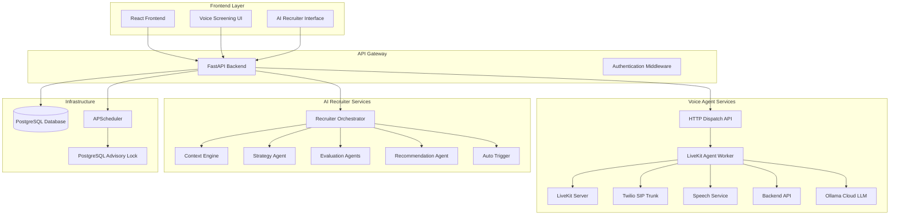

**Diagram sources**
- [agent.py:535-602](file://app/voice_agent/agent.py#L535-L602)
- [agent.py:606-771](file://app/voice_agent/agent.py#L606-L771)
- [orchestrator.py:35-155](file://app/backend/services/recruiter/orchestrator.py#L35-L155)
- [voice_call_scheduler.py:34](file://app/backend/services/voice_call_scheduler.py#L34)
- [voice_call_scheduler.py:518-603](file://app/backend/services/voice_call_scheduler.py#L518-L603)
- [docker-compose.yml:110-175](file://docker-compose.yml#L110-L175)

**Updated** The architecture now includes FastAPI HTTP dispatch server for initiating voice calls, LiveKit Agent Worker for real-time conversation management, Twilio SIP trunking for telephony coordination, comprehensive speech processing services for audio handling, and AI Recruiter orchestration services for advanced interview management. The AI Recruiter system includes specialized services for context building, strategy generation, evaluation, and recommendation. The LiveKit Server provides WebRTC SFU functionality with SIP trunking configuration support and enhanced network security through reduced port ranges. A PostgreSQL advisory lock mechanism ensures single-instance scheduler execution in multi-worker deployments.

The architecture consists of seven main layers:

1. **Presentation Layer**: React-based frontend with voice screening management interface and AI Recruiter session management
2. **API Layer**: FastAPI backend providing RESTful endpoints for voice screening and AI Recruiter operations
3. **Dispatch Layer**: HTTP dispatch API that triggers call initiation and room creation
4. **Agent Layer**: LiveKit Agent Worker that manages real-time voice conversations with audio processing
5. **AI Recruiter Layer**: Specialized services for advanced interview orchestration and evaluation
6. **Telephony Layer**: LiveKit Server with Twilio SIP trunking for PSTN connectivity
7. **Data Layer**: PostgreSQL database with specialized voice screening models, AI Recruiter sessions, and evaluation data

## Core Components

### HTTP Dispatch API

The HTTP dispatch API serves as the entry point for voice call initiation, creating LiveKit rooms and coordinating SIP outbound calls to candidates.

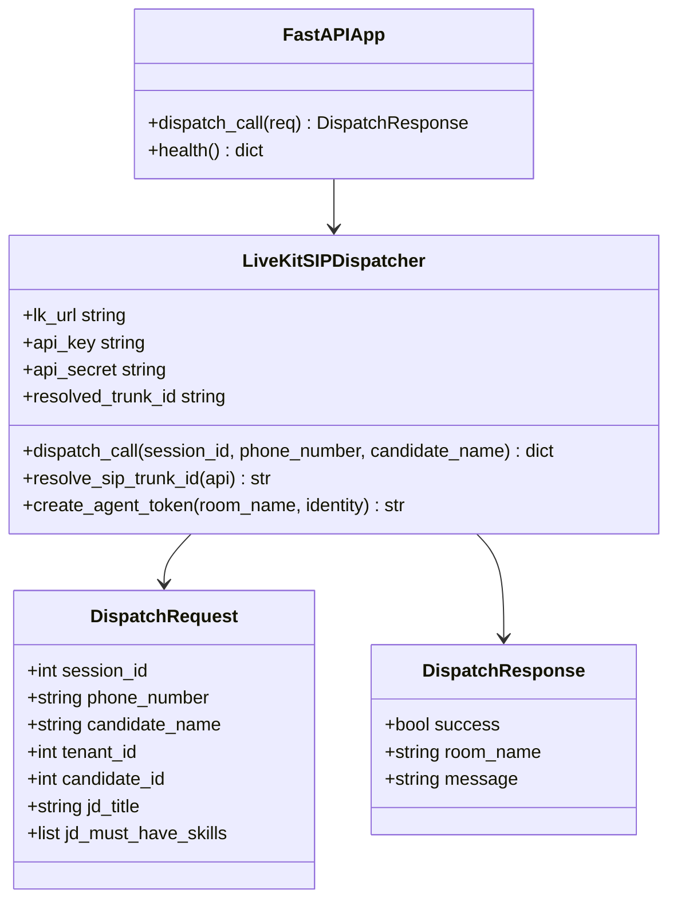

**Diagram sources**
- [agent.py:535-602](file://app/voice_agent/agent.py#L535-L602)
- [agent.py:781-852](file://app/voice_agent/agent.py#L781-L852)

**Section sources**
- [agent.py:535-602](file://app/voice_agent/agent.py#L535-L602)
- [agent.py:781-852](file://app/voice_agent/agent.py#L781-L852)

### LiveKit Agent Worker

The LiveKit Agent Worker manages real-time audio streams, processes speech-to-text and text-to-speech conversions, and executes the conversation state machine.

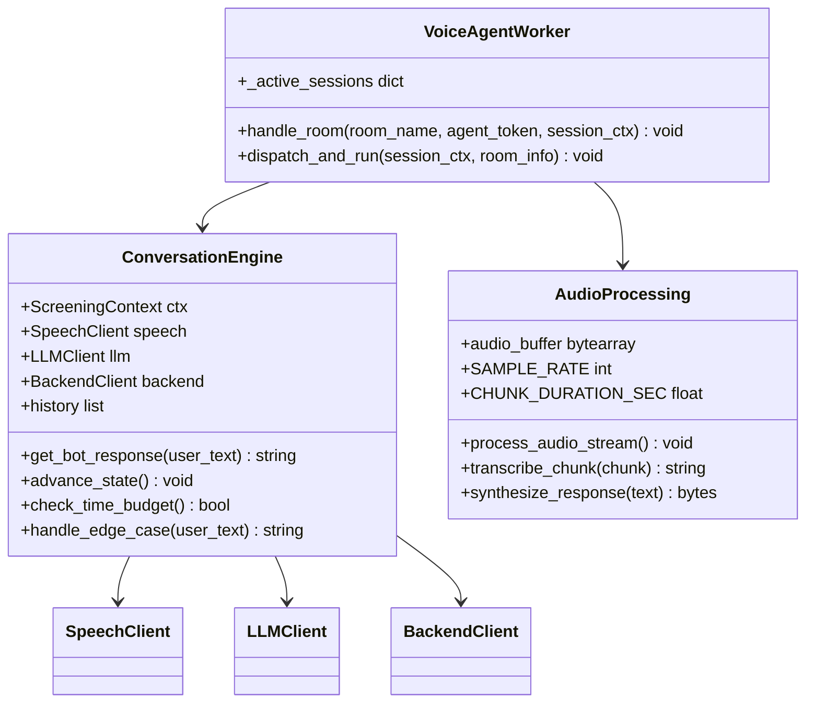

**Diagram sources**
- [agent.py:606-771](file://app/voice_agent/agent.py#L606-L771)
- [agent.py:258-427](file://app/voice_agent/agent.py#L258-L427)

**Section sources**
- [agent.py:606-771](file://app/voice_agent/agent.py#L606-L771)
- [agent.py:258-427](file://app/voice_agent/agent.py#L258-L427)

### Speech Processing Service

The speech processing service provides comprehensive audio handling capabilities including speech-to-text (STT), text-to-speech (TTS), and voice activity detection (VAD) for real-time conversation processing.

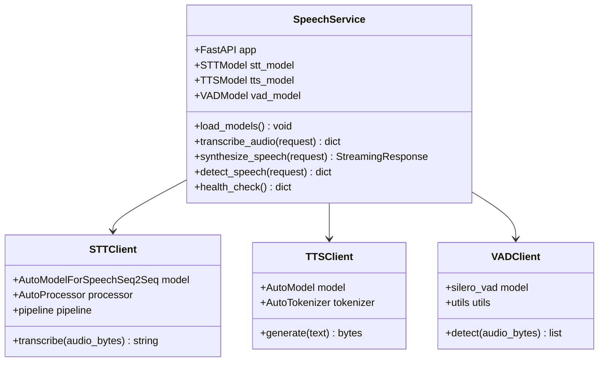

**Diagram sources**
- [main.py:25-387](file://app/speech_service/main.py#L25-L387)

**Section sources**
- [main.py:1-387](file://app/speech_service/main.py#L1-L387)

### Backend API Layer

The backend API provides comprehensive voice screening and AI Recruiter functionality through RESTful endpoints. It handles tenant configuration, session management, scheduling, and integration with external services.

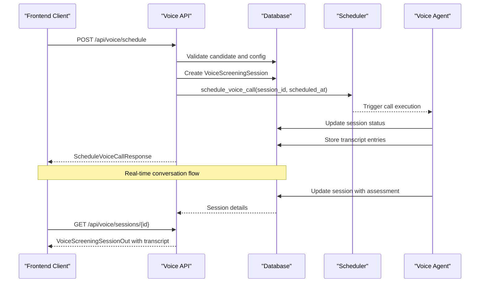

**Diagram sources**
- [voice.py:94-144](file://app/backend/routes/voice.py#L94-L144)
- [voice_call_scheduler.py](file://app/backend/services/voice_call_scheduler.py)

**Section sources**
- [voice.py:1-385](file://app/backend/routes/voice.py#L1-L385)

### PostgreSQL Advisory Lock Scheduler

The voice call scheduler now implements a PostgreSQL advisory lock mechanism to ensure single-instance execution across multi-worker deployments, preventing duplicate job processing and lost jobs.

**Diagram sources**
- [voice_call_scheduler.py:518-603](file://app/backend/services/voice_call_scheduler.py#L518-L603)

**Updated** The advisory lock mechanism uses PostgreSQL's `pg_try_advisory_lock()` function to ensure only one worker processes voice scheduler jobs across multiple uvicorn workers. This prevents duplicate job execution and lost jobs when running with `--workers 3`.

**Section sources**
- [voice_call_scheduler.py:518-603](file://app/backend/services/voice_call_scheduler.py#L518-L603)

## AI Recruiter Integration

### Advanced Interview Orchestration

The AI Recruiter system provides sophisticated interview orchestration with multi-dimensional assessment capabilities and automated interview initiation.

```mermaid
classDiagram
class RecruiterOrchestrator {
+initiate_interview(tenant_id, candidate_id, jd_id, config) str
+on_interview_completed(session_id) void
+get_session_status(session_id) dict
+cancel_interview(session_id) void
+retry_interview(session_id) str
}
class InterviewContextEngine {
+build_context(db, candidate_id, screening_result_id, jd_id) dict
+identify_probe_areas(context) list
}
class InterviewStrategyAgent {
+generate_strategy(context, config) dict
+_build_strategy_prompt(context, config) str
+_build_fallback_strategy(context, config) dict
}
class TechnicalEvaluator {
+evaluate(questions_responses, jd_context) dict
+_deterministic_fallback(questions_responses, required_skills) dict
}
class BehavioralEvaluator {
+evaluate(questions_responses, role_context) dict
+_deterministic_fallback(questions_responses) dict
}
class CommunicationEvaluator {
+evaluate(transcript, response_patterns) dict
}
class CulturalFitEvaluator {
+evaluate(questions_responses, company_context) dict
+_deterministic_fallback(questions_responses) dict
}
class RecommendationAgent {
+recommend(scorecard, adjusted_fitment, context) dict
}
class RecruiterAutoTrigger {
+evaluate_trigger(tenant_id, candidate_id, screening_result_id, new_status) bool
}
RecruiterOrchestrator --> InterviewContextEngine
RecruiterOrchestrator --> InterviewStrategyAgent
RecruiterOrchestrator --> TechnicalEvaluator
RecruiterOrchestrator --> BehavioralEvaluator
RecruiterOrchestrator --> CommunicationEvaluator
RecruiterOrchestrator --> CulturalFitEvaluator
RecruiterOrchestrator --> RecommendationAgent
RecruiterOrchestrator --> RecruiterAutoTrigger
```

**Diagram sources**
- [orchestrator.py:35-155](file://app/backend/services/recruiter/orchestrator.py#L35-L155)
- [context_engine.py:19-106](file://app/backend/services/recruiter/context_engine.py#L19-L106)
- [strategy_agent.py:18-67](file://app/backend/services/recruiter/strategy_agent.py#L18-L67)
- [evaluation_agents.py:85-158](file://app/backend/services/recruiter/evaluation_agents.py#L85-158)
- [recommendation_agent.py:9-88](file://app/backend/services/recruiter/recommendation_agent.py#L9-L88)
- [auto_trigger.py:23-131](file://app/backend/services/recruiter/auto_trigger.py#L23-L131)

**Updated** The AI Recruiter system now includes comprehensive interview orchestration with advanced context building, strategy generation, multi-dimensional evaluation, and recommendation synthesis. The system supports automated interview initiation based on pipeline triggers and provides sophisticated conversation state management for structured interviews.

### AI Recruiter Conversation System

The AI Recruiter conversation system implements advanced state management for multi-dimensional interviews with dynamic question adaptation and real-time evaluation.

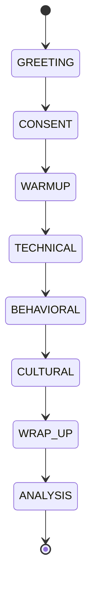

**Diagram sources**
- [recruiter_conversation.py:18-27](file://app/voice_agent/recruiter_conversation.py#L18-L27)
- [recruiter_conversation.py:110-128](file://app/voice_agent/recruiter_conversation.py#L110-L128)

**Updated** The AI Recruiter conversation system now includes sophisticated state management with greeting, consent, warmup, technical assessment, behavioral evaluation, cultural fit assessment, wrap-up, and analysis phases. The system supports dynamic question flow, follow-up question generation, time management, and real-time answer quality detection with multi-dimensional assessment capabilities.

**Section sources**
- [recruiter_conversation.py:1-365](file://app/voice_agent/recruiter_conversation.py#L1-L365)

### Automated Interview Initiation

The system now supports automated interview initiation through AI Recruiter orchestration with configurable trigger conditions and pipeline integration.

**Automated Trigger Configuration**:
- **Pipeline Stage**: Trigger based on candidate pipeline stage (e.g., "in_review")
- **Fit Score Thresholds**: Minimum and maximum fit score ranges for auto-trigger
- **Phone Number Validation**: Automatic phone number verification for call readiness
- **JD Association**: Automatic job description assignment based on screening results
- **Delay Scheduling**: Configurable delay before interview initiation

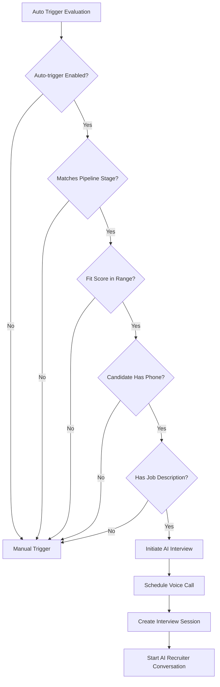

**Diagram sources**
- [auto_trigger.py:29-131](file://app/backend/services/recruiter/auto_trigger.py#L29-L131)

**Updated** The automated interview initiation system now includes comprehensive trigger evaluation with pipeline stage matching, fit score threshold validation, phone number verification, and job description association. The system supports configurable delay scheduling and provides robust error handling for failed auto-trigger attempts.

**Section sources**
- [auto_trigger.py:1-156](file://app/backend/services/recruiter/auto_trigger.py#L1-L156)

## Backend Services

### Voice Call Scheduler

The voice call scheduler service manages the timing and execution of screening calls using APScheduler for reliable job scheduling and comprehensive retry mechanisms. The scheduler now implements PostgreSQL advisory locks to ensure single-instance execution across multi-worker deployments.

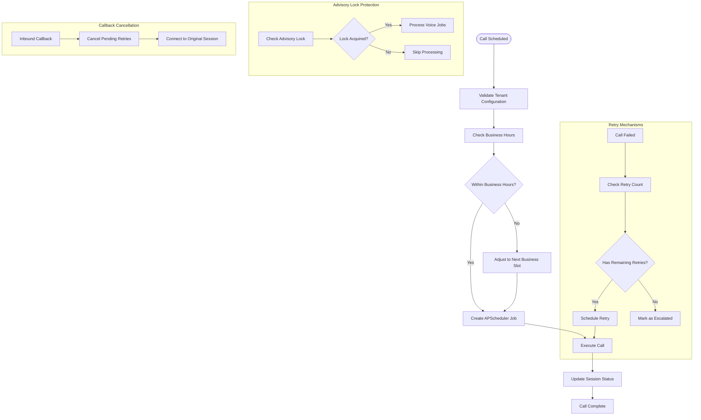

**Diagram sources**
- [voice_call_scheduler.py](file://app/backend/services/voice_call_scheduler.py)
- [voice_call_scheduler.py:518-603](file://app/backend/services/voice_call_scheduler.py#L518-L603)

**Updated** Enhanced rescheduling capabilities now include comprehensive job description ID tracking and improved error handling for rescheduling operations, ensuring proper session management and resource cleanup. The advisory lock mechanism prevents duplicate job processing in multi-worker deployments.

**Section sources**
- [voice_call_scheduler.py](file://app/backend/services/voice_call_scheduler.py)
- [voice_call_scheduler.py:518-603](file://app/backend/services/voice_call_scheduler.py#L518-L603)

### Voice Screening Service

The voice screening service provides core business logic for conversation context building, assessment generation, and session management with comprehensive real-time processing capabilities.

**Enhanced Session Context Building**:
- Unified tenant configuration retrieval
- Comprehensive candidate and job description integration
- Dynamic consent script application
- Flexible greeting style selection
- Configurable call duration enforcement

**Section sources**
- [voice_screening_service.py](file://app/backend/services/voice_screening_service.py)

### AI Recruiter Orchestrator

The AI Recruiter orchestrator provides comprehensive interview management with advanced context building, strategy generation, evaluation, and recommendation capabilities.

**Enhanced Interview Management**:
- Multi-tenancy support with tenant-scoped access control
- Dynamic interview strategy generation with LLM integration
- Comprehensive evaluation pipeline with multi-dimensional scoring
- Automated interview initiation with pipeline integration
- Structured scorecard generation with evidence tracking
- Real-time session status monitoring and management

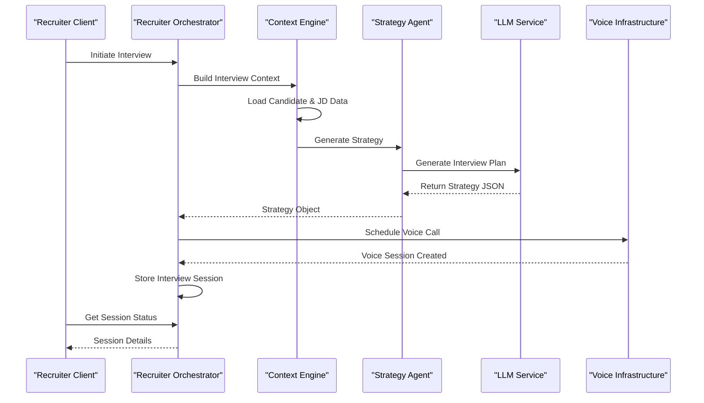

**Diagram sources**
- [orchestrator.py:43-155](file://app/backend/services/recruiter/orchestrator.py#L43-L155)

**Updated** The AI Recruiter orchestrator now includes comprehensive interview management with advanced context building, strategy generation, evaluation pipeline, and automated interview initiation. The system supports multi-tenancy, dynamic strategy generation, structured evaluation, and real-time session monitoring.

**Section sources**
- [orchestrator.py:1-429](file://app/backend/services/recruiter/orchestrator.py#L1-L429)

## Database Schema

The voice screening system utilizes a comprehensive database schema designed to support scalable voice screening operations with proper indexing and relationships.

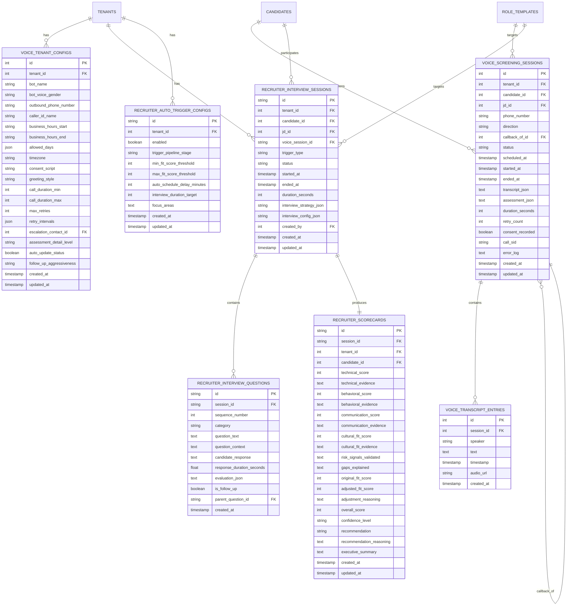

**Diagram sources**
- [db_models.py:875-1090](file://app/backend/models/db_models.py#L875-L1090)

**Updated** The database schema now includes comprehensive AI Recruiter support with dedicated tables for interview sessions, questions, scorecards, and auto-trigger configurations. The unified `transcript_json` field provides comprehensive storage for all conversation data, while the new AI Recruiter tables support structured interview management, evaluation tracking, and automated scheduling capabilities.

**Section sources**
- [db_models.py:875-1090](file://app/backend/models/db_models.py#L875-L1090)

## Frontend Integration

### Voice Screening Interface

The frontend provides an intuitive interface for recruiters to manage voice screening operations, including session scheduling, monitoring, and assessment review.

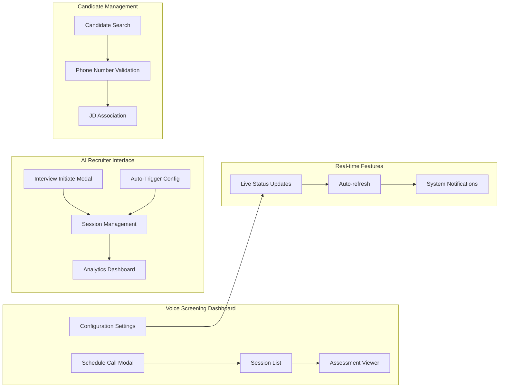

**Diagram sources**
- [VoiceScreeningPage.jsx:147-696](file://app/frontend/src/pages/VoiceScreeningPage.jsx#L147-L696)
- [RecruiterInterviewPage.jsx:92-565](file://app/frontend/src/pages/RecruiterInterviewPage.jsx#L92-L565)

**Updated** Enhanced frontend integration now includes comprehensive AI Recruiter session management with interview initiation modal, session tracking, analytics dashboard, and auto-trigger configuration. The interface supports both traditional voice screening and advanced AI Recruiter interview capabilities with unified session management and real-time status monitoring.

**Section sources**
- [VoiceScreeningPage.jsx:1-786](file://app/frontend/src/pages/VoiceScreeningPage.jsx#L1-L786)
- [RecruiterInterviewPage.jsx:1-565](file://app/frontend/src/pages/RecruiterInterviewPage.jsx#L1-L565)

### Interview Initiate Modal

The AI Recruiter interview initiation modal provides a streamlined interface for starting new structured interviews with candidate and job description selection.

**Enhanced Interview Initiation Features**:
- Candidate selection with comprehensive candidate listing
- Job description template selection
- Duration configuration (10-60 minutes)
- Focus area specification for interview customization
- Real-time validation and error handling
- Loading states and user feedback

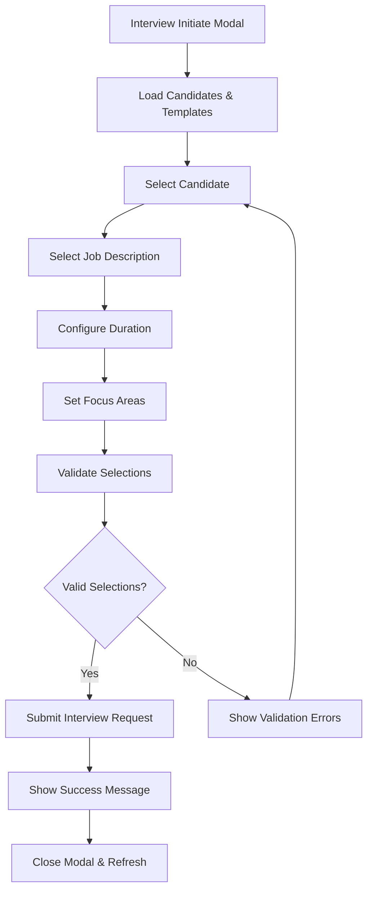

**Diagram sources**
- [InterviewInitiateModal.jsx:17-54](file://app/frontend/src/components/InterviewInitiateModal.jsx#L17-L54)

**Updated** The interview initiation modal now includes comprehensive AI Recruiter support with candidate selection, job description template selection, duration configuration, and focus area specification. The interface provides real-time validation, error handling, and user feedback for a seamless interview initiation experience.

**Section sources**
- [InterviewInitiateModal.jsx:1-178](file://app/frontend/src/components/InterviewInitiateModal.jsx#L1-L178)

## API Endpoints

The backend exposes a comprehensive set of RESTful endpoints for voice screening and AI Recruiter operations:

### Voice Settings Management
- `GET /api/voice/settings` - Retrieve tenant voice screening configuration
- `PUT /api/voice/settings` - Update tenant voice screening configuration

### Call Scheduling
- `POST /api/voice/schedule` - Schedule a new voice screening call
- `GET /api/voice/sessions` - List voice screening sessions
- `GET /api/voice/sessions/{id}` - Get session details with transcript

### Session Management
- `PATCH /api/voice/sessions/{id}` - Update session status and metadata
- `POST /api/voice/sessions/{id}/reschedule` - **Enhanced** Reschedule a call with job description ID tracking
- `POST /api/voice/sessions/{id}/cancel` - Cancel a scheduled call

### AI Recruiter Management
- `POST /api/recruiter/sessions` - **New** Initiate AI Recruiter interview session
- `GET /api/recruiter/sessions` - **New** List AI Recruiter sessions
- `GET /api/recruiter/sessions/{session_id}` - **New** Get AI Recruiter session details
- `GET /api/recruiter/sessions/{session_id}/transcript` - **New** Get AI Recruiter session transcript
- `GET /api/recruiter/sessions/{session_id}/scorecard` - **New** Get AI Recruiter session scorecard
- `POST /api/recruiter/sessions/{session_id}/cancel` - **New** Cancel AI Recruiter session
- `POST /api/recruiter/sessions/{session_id}/retry` - **New** Retry failed AI Recruiter session
- `GET /api/recruiter/config` - **New** Get auto-trigger configuration
- `PUT /api/recruiter/config` - **New** Update auto-trigger configuration
- `GET /api/recruiter/analytics` - **New** Get AI Recruiter analytics
- `POST /api/recruiter/sessions/export` - **New** Export AI Recruiter sessions

### Internal Service Endpoints
- `GET /api/voice/internal/config/{tenant_id}` - Internal tenant config access
- `GET /api/voice/internal/candidate/{tenant_id}/{candidate_id}` - Internal candidate info access

**Updated** Enhanced rescheduling endpoint now supports job description ID tracking and improved error handling for rescheduling operations. The AI Recruiter endpoints provide comprehensive interview management capabilities including session initiation, monitoring, evaluation, and analytics. The internal configuration endpoint now includes comprehensive tenant settings including bot name, greeting style, and consent script. New auto-trigger configuration endpoints support pipeline-driven interview scheduling with configurable thresholds and delays.

**Section sources**
- [voice.py:47-385](file://app/backend/routes/voice.py#L47-L385)
- [recruiter.py:1-704](file://app/backend/routes/recruiter.py#L1-L704)

## Conversation Flow

The voice screening conversation follows a structured flow designed to maximize information gathering while maintaining candidate engagement.

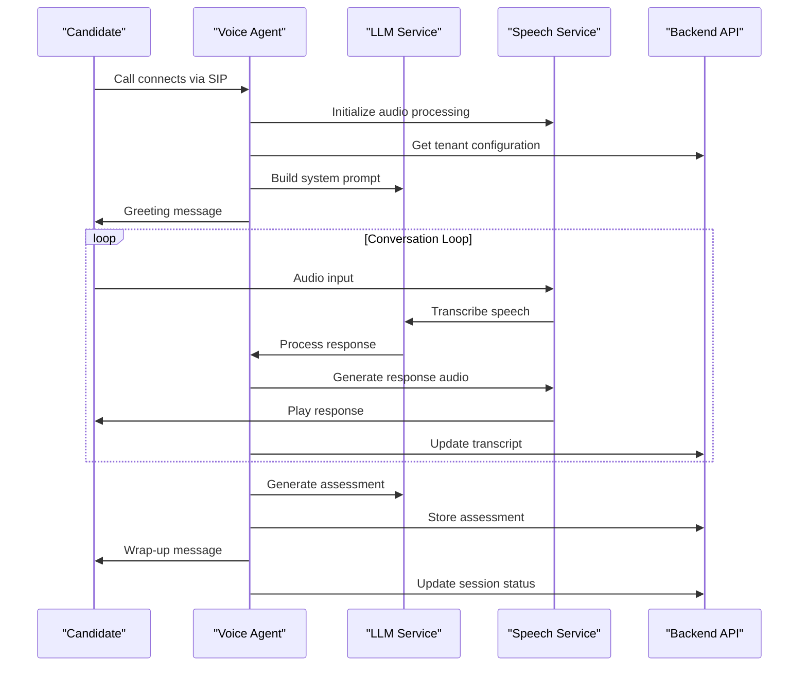

**Diagram sources**
- [agent.py:431-485](file://app/voice_agent/agent.py#L431-L485)

**Updated** The conversation flow now includes enhanced rescheduling capabilities with job description ID tracking and improved error handling for rescheduling operations. The system enforces configurable call duration limits and applies customized consent scripts. The AI Recruiter conversation flow includes sophisticated state management with greeting, consent, warmup, technical assessment, behavioral evaluation, cultural fit assessment, wrap-up, and analysis phases with dynamic question adaptation and multi-dimensional evaluation.

**Section sources**
- [agent.py:431-485](file://app/voice_agent/agent.py#L431-L485)

### AI Recruiter Conversation Flow

The AI Recruiter conversation flow implements advanced state management for structured multi-dimensional interviews.

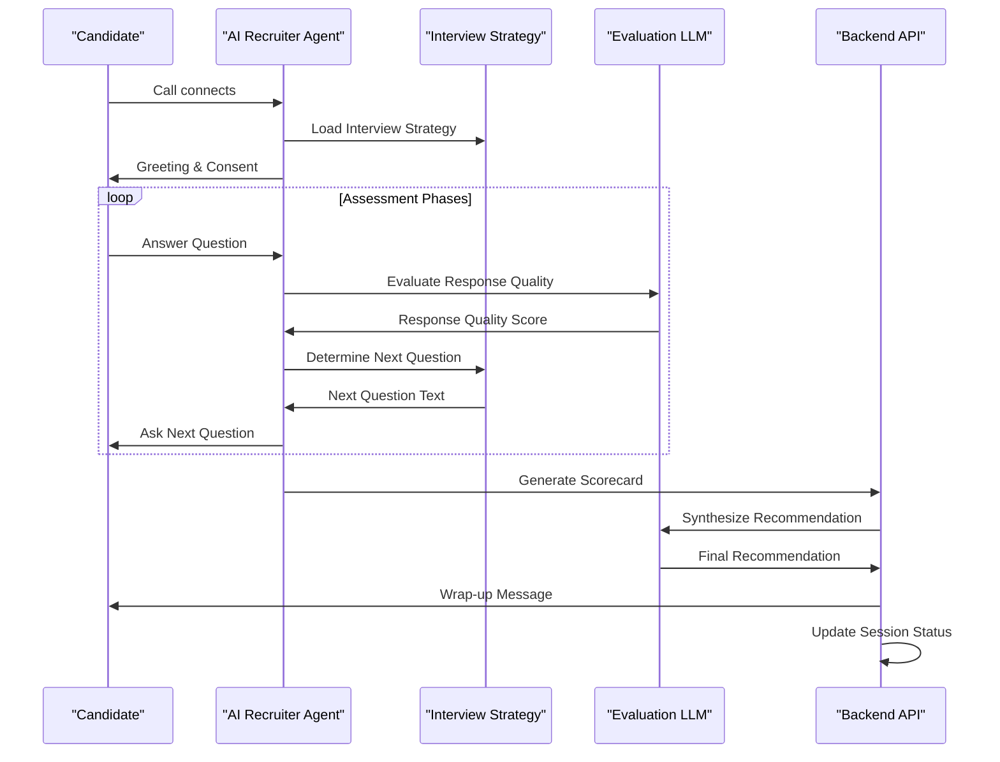

**Diagram sources**
- [recruiter_conversation.py:86-365](file://app/voice_agent/recruiter_conversation.py#L86-L365)

**Updated** The AI Recruiter conversation flow includes sophisticated state management with greeting, consent, warmup, technical assessment, behavioral evaluation, cultural fit assessment, wrap-up, and analysis phases. The system supports dynamic question flow based on candidate responses, multi-dimensional evaluation with real-time quality assessment, and automated interview completion with structured scorecard generation.

**Section sources**
- [recruiter_conversation.py:86-365](file://app/voice_agent/recruiter_conversation.py#L86-L365)

## Testing Framework

The voice screening system includes comprehensive testing coverage through unit tests and integration tests:

### Test Coverage Areas
- **Voice Settings**: Configuration retrieval and updates
- **Session Management**: Scheduling, rescheduling, and cancellation
- **Business Hours**: Time zone and scheduling validation
- **Conversation Context**: Building comprehensive conversation context
- **Assessment Generation**: Structured assessment creation
- **Rescheduling Operations**: Enhanced rescheduling with job description ID tracking
- **Tenant Configuration**: Bot name, greeting style, and consent script validation
- **Advisory Lock**: Single-instance scheduler execution protection
- **Audio Processing**: Enhanced WAV header stripping and PCM frame creation
- **SIP Trunk Management**: Programmatic SIP trunk resolution and creation with protobuf methods
- **Phone Number Normalization**: E.164 compliance and Twilio integration testing
- **LiveKit Event Handling**: Track subscription event handling with async callback bridging
- **AI Recruiter Integration**: Interview orchestration, strategy generation, and evaluation testing
- **Auto-Trigger Functionality**: Pipeline-driven interview initiation and configuration testing
- **Multi-Dimensional Assessment**: Technical, behavioral, communication, and cultural fit evaluation testing
- **Recommendation System**: Overall score calculation and recommendation synthesis testing

### Test Scenarios
- Configuration validation and defaults
- Session lifecycle management
- Error handling and edge cases
- Business hour adjustments
- Assessment structure validation
- **Enhanced** Rescheduling operation validation with job description ID tracking
- **New** AI Recruiter session initiation and management testing
- **New** Interview strategy generation with LLM integration testing
- **New** Multi-dimensional evaluation pipeline testing
- **New** Auto-trigger configuration and pipeline integration testing
- **New** Scorecard generation and recommendation synthesis testing
- **New** Conversation state management and dynamic question flow testing
- **New** Follow-up question generation and response quality assessment testing

**Updated** Testing framework now includes comprehensive validation for AI Recruiter integration with interview orchestration, strategy generation, multi-dimensional evaluation, and recommendation synthesis. New test coverage includes auto-trigger functionality with pipeline integration, conversation state management with dynamic question adaptation, and sophisticated evaluation agents for technical, behavioral, communication, and cultural fit assessment. Enhanced testing covers AI-powered interview initiation, structured scorecard generation, and automated interview scheduling capabilities.

**Section sources**
- [test_voice_screening.py:1-871](file://app/backend/tests/test_voice_screening.py#L1-L871)

## Deployment Architecture

The voice screening system is designed for containerized deployment with clear service boundaries and communication patterns:

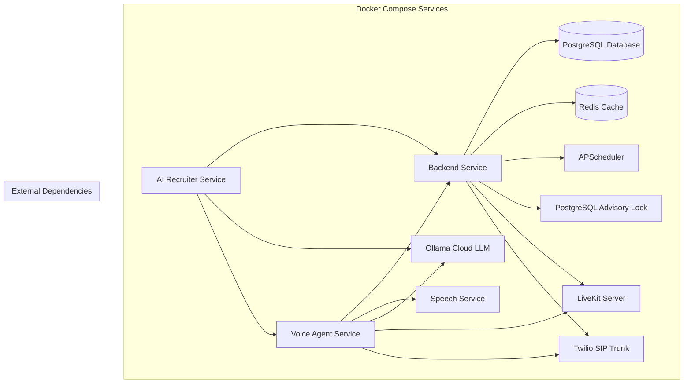

**Diagram sources**
- [docker-compose.yml](file://docker-compose.yml)

**Updated** The deployment architecture now reflects the current Phase 2.0 implementation status with comprehensive AI Recruiter integration, advanced conversation state management, and automated interview initiation capabilities. The system includes specialized AI Recruiter services for interview orchestration, context building, strategy generation, evaluation, and recommendation. Enhanced rescheduling capabilities are fully integrated into the deployment architecture. The LiveKit configuration now includes reduced port ranges (50000-50200) and node IP configuration for improved network security. The advisory lock mechanism ensures single-instance scheduler execution across multiple workers.

The deployment architecture supports horizontal scaling, service discovery, and resilient communication patterns essential for production voice screening and AI Recruiter operations.

**Updated** The LiveKit Server configuration has been updated to reflect programmatic SIP trunk management. The livekit.yaml file now explicitly states that SIP trunking is configured programmatically via the LiveKit API in the voice-agent, as the livekit-server version does not support SIP config in YAML. The LiveKit Server now exposes port 5060 for SIP signaling to support external telephony provider integration. The track subscription event handling mechanism is now fully integrated into the deployment architecture, ensuring reliable audio processing through the synchronous wrapper function.

**Section sources**
- [livekit.yaml:29-34](file://app/voice_agent/livekit.yaml#L29-L34)
- [Dockerfile.livekit:1-3](file://app/voice_agent/Dockerfile.livekit#L1-L3)

## Troubleshooting Procedures

### Common Issues and Solutions

#### LiveKit Connection Problems
- **Issue**: Voice agent cannot connect to LiveKit server
- **Solution**: Verify LiveKit server health check and SIP trunk configuration
- **Diagnostic**: Check LiveKit logs and SIP trunk credentials

#### Speech Service Failures
- **Issue**: STT/TTS/VAD endpoints failing
- **Solution**: Restart speech service and verify model loading
- **Diagnostic**: Check speech service health endpoint and model availability

#### Call Scheduling Issues
- **Issue**: Calls not being scheduled or executed
- **Solution**: Verify APScheduler configuration and business hours settings
- **Diagnostic**: Check scheduler logs and retry mechanisms

#### Rescheduling Problems
- **Issue**: Rescheduling operations failing or not updating job descriptions
- **Solution**: Verify job description ID tracking and rescheduling endpoint configuration
- **Diagnostic**: Check rescheduling logs and database updates

#### SIP Trunk Management Issues
- **Issue**: SIP trunk creation or discovery failing
- **Solution**: Verify LiveKit API credentials and Twilio configuration
- **Diagnostic**: Check SIP trunk resolution logs and API responses

#### Network Configuration Issues
- **Issue**: LiveKit port conflicts or connection timeouts
- **Solution**: Verify reduced port range configuration and node IP settings
- **Diagnostic**: Check LiveKit YAML configuration and network accessibility

#### SIP Signaling Problems
- **Issue**: SIP signaling failures or port connectivity issues
- **Solution**: Verify port 5060 exposure and external provider configuration
- **Diagnostic**: Check SIP port accessibility and external provider credentials

#### Advisory Lock Issues
- **Issue**: Scheduler not starting or duplicate job processing
- **Solution**: Verify PostgreSQL advisory lock permissions and configuration
- **Diagnostic**: Check advisory lock acquisition logs and database connectivity

#### Audio Processing Errors
- **Issue**: Audio capture failures or distorted audio
- **Solution**: Verify enhanced WAV header stripping and PCM frame creation
- **Diagnostic**: Check audio processing logs and frame validation

#### Protobuf API Compatibility Issues
- **Issue**: LiveKit protocol imports failing or protobuf method errors
- **Solution**: Verify livekit-protocol version compatibility and protobuf method signatures
- **Diagnostic**: Check protobuf import statements and method availability in livekit-protocol library

#### Phone Number Normalization Issues
- **Issue**: Twilio integration failures due to invalid phone numbers
- **Solution**: Verify E.164 compliance and character filtering logic
- **Diagnostic**: Check phone number normalization logs and Twilio error responses

#### LiveKit Event Handling Issues
- **Issue**: Track subscription events not firing or audio processing failures
- **Solution**: Verify synchronous wrapper function implementation and async callback bridging
- **Diagnostic**: Check track subscription event logs and async task execution status

#### AI Recruiter Integration Issues
- **Issue**: Interview strategy generation or evaluation failures
- **Solution**: Verify LLM service connectivity and model availability
- **Diagnostic**: Check AI Recruiter logs and LLM API responses

#### Auto-Trigger Configuration Issues
- **Issue**: Auto-trigger not activating or incorrect interview initiation
- **Solution**: Verify pipeline stage configuration and fit score thresholds
- **Diagnostic**: Check auto-trigger logs and configuration validation

#### Conversation State Management Issues
- **Issue**: Interview flow interruptions or state inconsistencies
- **Solution**: Verify state transition logic and conversation context persistence
- **Diagnostic**: Check conversation state logs and context validation

### Monitoring and Logging

The system provides comprehensive monitoring through:
- **Health Checks**: Individual service health endpoints
- **Error Logs**: Detailed error logging with stack traces
- **Performance Metrics**: Audio processing and LLM response times
- **Session Tracking**: Real-time session status monitoring
- **Network Diagnostics**: LiveKit connection and port availability monitoring
- **Scheduler Monitoring**: Advisory lock status and job processing logs
- **SIP Trunk Monitoring**: Trunk discovery and creation status logs
- **Telephony Monitoring**: SIP signaling and external provider connectivity
- **Protobuf API Monitoring**: SIP trunk management and audio processing pipeline status
- **Phone Number Monitoring**: E.164 compliance validation and normalization logs
- **LiveKit Event Monitoring**: Track subscription event handling and async callback bridging status
- **AI Recruiter Monitoring**: Interview orchestration, strategy generation, and evaluation pipeline status
- **Auto-Trigger Monitoring**: Pipeline integration and interview initiation validation
- **Conversation State Monitoring**: Interview flow and state management validation

**Updated** Enhanced troubleshooting now includes comprehensive monitoring for AI Recruiter integration, covering interview orchestration, strategy generation, evaluation pipeline, and recommendation synthesis. Auto-trigger functionality monitoring includes pipeline stage validation, fit score threshold checking, and interview initiation tracking. Conversation state management monitoring validates interview flow, state transitions, and dynamic question adaptation. The system now includes specialized monitoring for AI-powered interview capabilities, structured evaluation pipelines, and automated scheduling systems.

**Section sources**
- [livekit.yaml:27-44](file://app/voice_agent/livekit.yaml#L27-L44)

## Conclusion

The Voice Agent Conversation System represents a comprehensive solution for automated phone screening and AI-powered interview management in recruitment processes. By combining advanced AI capabilities with robust infrastructure, the system delivers scalable, compliant, and efficient candidate screening experiences.

**Current Implementation Status**: Phase 2.0 - The system now implements a comprehensive AI Recruiter integration with advanced conversation state management, automated interview initiation capabilities, and sophisticated multi-dimensional assessment systems. The current implementation maintains full telephony integration readiness while ensuring system stability and performance.

Enhanced AI Recruiter capabilities with advanced conversation state management provide sophisticated multi-dimensional assessment including technical depth, behavioral evaluation, communication quality, and cultural fit assessment. The system now includes comprehensive auto-trigger functionality for pipeline-driven interview scheduling, automated interview initiation based on fit scores and pipeline stages, and intelligent conversation flow with dynamic question adaptation.

The unified transcript management through `transcript_json` field provides seamless integration with assessment generation and compliance reporting. Advanced evaluation agents provide structured scoring across multiple dimensions with evidence-based recommendations and confidence levels.

**Key Enhancements**:
- **AI Recruiter Integration**: Comprehensive structured interview system with multi-dimensional assessment
- **Advanced Conversation State Management**: Sophisticated state machine with dynamic question flow and real-time evaluation
- **Automated Interview Initiation**: Pipeline-driven interview scheduling with configurable thresholds and delays
- **Multi-Dimensional Evaluation**: Technical, behavioral, communication, and cultural fit assessment with structured scoring
- **Intelligent Strategy Generation**: LLM-powered interview planning with dynamic adaptation based on candidate responses
- **Structured Recommendation System**: Evidence-based recommendations with confidence levels and human validation requirements
- **Enhanced Auto-Trigger Functionality**: Pipeline integration for automated interview scheduling based on fit scores and pipeline stages
- **Comprehensive Monitoring**: Advanced troubleshooting and diagnostic capabilities for AI Recruiter and voice agent systems
- **PostgreSQL Advisory Lock**: Single-instance scheduler execution protection across multi-worker deployments
- **Programmatic SIP Trunk Management**: Three-tier approach (discovery, creation, fallback) eliminates YAML dependency
- **Enhanced Audio Processing**: WAV header stripping and proper PCM frame creation for LiveKit integration
- **Sophisticated Error Handling**: Comprehensive audio capture operation error handling with graceful degradation
- **Enhanced Rescheduling**: Job description ID tracking and improved error handling for rescheduling operations
- **Improved Session Management**: Sophisticated job description association and rescheduling capabilities
- **Unified Transcript Management**: Comprehensive JSON storage for all conversation data
- **Flexible Tenant Configuration**: Customizable bot names, greeting styles, and consent scripts
- **Enhanced Network Security**: Reduced port ranges and node IP configuration for LiveKit Server
- **SIP Signaling Configuration**: Port 5060 exposure and programmatic trunk management for external provider integration
- **Protobuf API Integration**: Enhanced LiveKit protocol compatibility with protobuf-based API methods
- **Phone Number Normalization**: Robust E.164 compliance for proper Twilio integration
- **LiveKit Event System Bridge**: Synchronous wrapper function that addresses event system limitations while maintaining asynchronous audio processing capabilities

The system provides a solid foundation for organizations seeking to enhance their recruitment processes through intelligent automation while maintaining human oversight and compliance standards. The current Phase 2.0 implementation ensures full telephony integration readiness with comprehensive audio processing, conversation management, AI-powered evaluation, and automated interview scheduling capabilities.

**Updated** The migration to AI Recruiter integration with advanced conversation state management and automated interview initiation represents a significant architectural enhancement, providing sophisticated multi-dimensional assessment capabilities and intelligent interview orchestration. The system now supports pipeline-driven interview scheduling, structured evaluation with evidence-based recommendations, and comprehensive monitoring for AI-powered recruitment processes. The addition of AI Recruiter services with specialized orchestration, context building, strategy generation, evaluation, and recommendation capabilities significantly expands the system's interview management capabilities beyond traditional voice screening. The enhanced troubleshooting procedures now include comprehensive monitoring for AI Recruiter integration, conversation state management, and automated scheduling systems, providing developers with better tools for diagnosing and resolving complex interview orchestration issues.