# Voice Agent Conversation System

<cite>
**Referenced Files in This Document**
- [agent.py](file://app/voice_agent/agent.py)
- [main.py](file://app/speech_service/main.py)
- [voice.py](file://app/backend/routes/voice.py)
- [voice_call_scheduler.py](file://app/backend/services/voice_call_scheduler.py)
- [voice_screening_service.py](file://app/backend/services/voice_screening_service.py)
- [db_models.py](file://app/backend/models/db_models.py)
- [schemas.py](file://app/backend/models/schemas.py)
- [VoiceScreeningPage.jsx](file://app/frontend/src/pages/VoiceScreeningPage.jsx)
- [api.js](file://app/frontend/src/lib/api.js)
- [VoiceScheduleModal.jsx](file://app/frontend/src/components/VoiceScheduleModal.jsx)
</cite>

## Update Summary
**Changes Made**
- Enhanced rescheduling capabilities with new RescheduleVoiceCallRequest model supporting job description ID tracking
- Improved error handling for rescheduling operations with comprehensive validation and status checking
- Updated API endpoints documentation to reflect enhanced rescheduling functionality
- Added job description ID tracking capability for improved session management
- Enhanced frontend integration for rescheduling operations

## Table of Contents
1. [Introduction](#introduction)
2. [System Architecture](#system-architecture)
3. [Core Components](#core-components)
4. [Voice Agent Implementation](#voice-agent-implementation)
5. [Backend Services](#backend-services)
6. [Database Schema](#database-schema)
7. [Frontend Integration](#frontend-integration)
8. [API Endpoints](#api-endpoints)
9. [Conversation Flow](#conversation-flow)
10. [Testing Framework](#testing-framework)
11. [Deployment Architecture](#deployment-architecture)
12. [Conclusion](#conclusion)

## Introduction

The Voice Agent Conversation System is an AI-powered phone screening solution designed to automate initial candidate interviews through intelligent voice conversations. Built as part of the Resume AI platform by ThetaLogics, this system combines advanced natural language processing, real-time audio processing, and sophisticated conversation management to deliver scalable recruitment screening capabilities.

The system operates through a comprehensive dual-component architecture featuring a FastAPI HTTP dispatch server and LiveKit Agent Worker, coordinated with integrated speech processing services and Twilio SIP trunking. The platform supports both outbound calling and inbound callback scenarios, with configurable business hours, retry mechanisms, and compliance features.

**Updated** The system now implements a comprehensive voice agent with dual-component design (HTTP dispatch API + LiveKit Agent Worker), sophisticated state machine management, LiveKit telephony coordination, and integrated speech processing services as part of Phase 1.4 development. Enhanced rescheduling capabilities now support job description ID tracking and improved error handling for rescheduling operations.

## System Architecture

The Voice Agent Conversation System follows a microservices architecture with clear separation of concerns and comprehensive service integration:

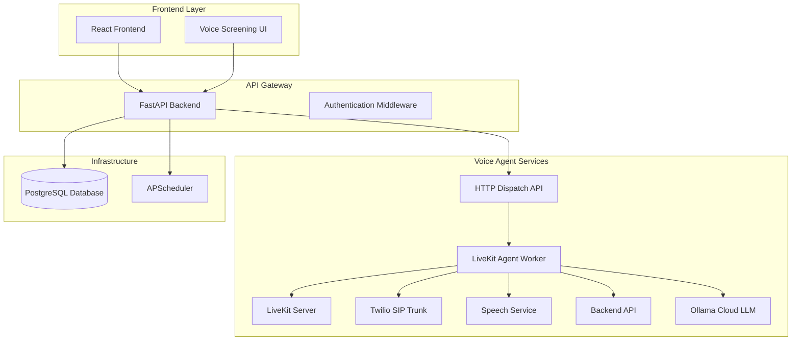

**Diagram sources**
- [agent.py:535-602](file://app/voice_agent/agent.py#L535-L602)
- [agent.py:606-771](file://app/voice_agent/agent.py#L606-L771)
- [voice_call_scheduler.py:34](file://app/backend/services/voice_call_scheduler.py#L34)

**Updated** The architecture now includes FastAPI HTTP dispatch server for initiating voice calls, LiveKit Agent Worker for real-time conversation management, Twilio SIP trunking for telephony coordination, and comprehensive speech processing services for audio handling.

The architecture consists of five main layers:

1. **Presentation Layer**: React-based frontend with voice screening management interface
2. **API Layer**: FastAPI backend providing RESTful endpoints for voice screening operations
3. **Dispatch Layer**: HTTP dispatch API that triggers call initiation and room creation
4. **Agent Layer**: LiveKit Agent Worker that manages real-time voice conversations with audio processing
5. **Data Layer**: PostgreSQL database with specialized voice screening models and scheduling

## Core Components

### HTTP Dispatch API

The HTTP dispatch API serves as the entry point for voice call initiation, creating LiveKit rooms and coordinating SIP outbound calls to candidates.

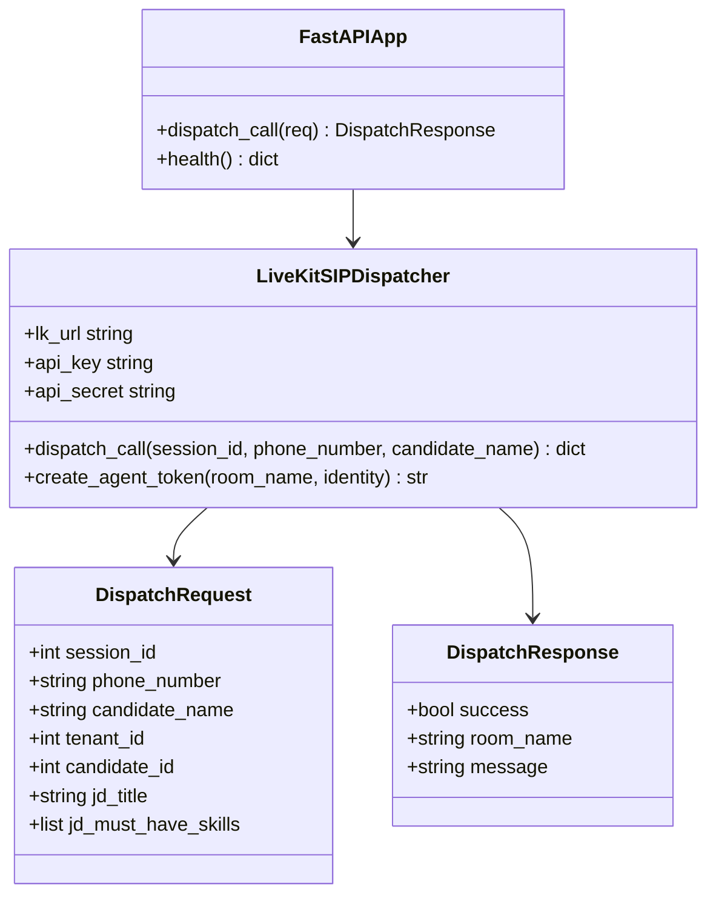

**Diagram sources**
- [agent.py:535-602](file://app/voice_agent/agent.py#L535-L602)
- [agent.py:781-852](file://app/voice_agent/agent.py#L781-L852)

**Section sources**
- [agent.py:535-602](file://app/voice_agent/agent.py#L535-L602)
- [agent.py:781-852](file://app/voice_agent/agent.py#L781-L852)

### LiveKit Agent Worker

The LiveKit Agent Worker manages real-time audio streams, processes speech-to-text and text-to-speech conversions, and executes the conversation state machine.

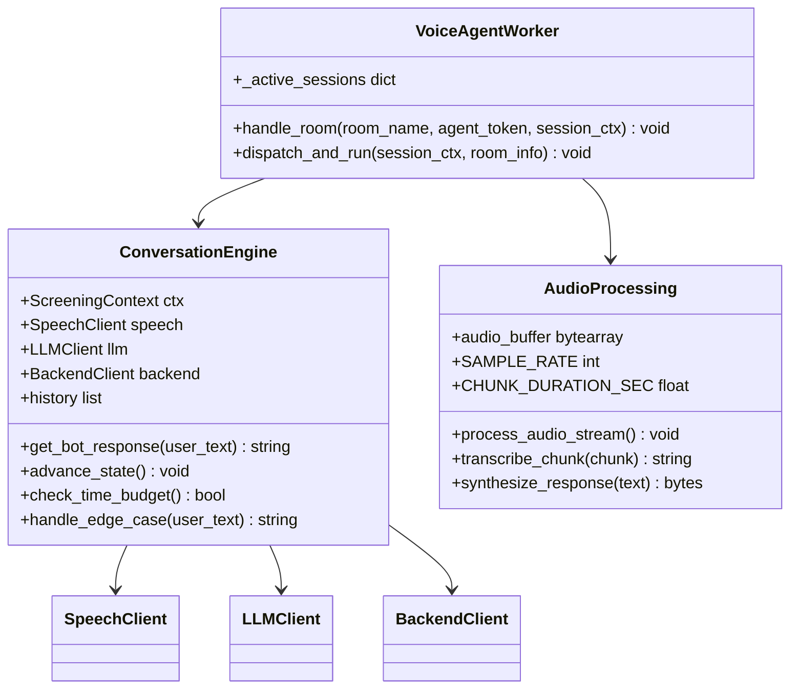

**Diagram sources**
- [agent.py:606-771](file://app/voice_agent/agent.py#L606-L771)
- [agent.py:258-427](file://app/voice_agent/agent.py#L258-L427)

**Section sources**
- [agent.py:606-771](file://app/voice_agent/agent.py#L606-L771)
- [agent.py:258-427](file://app/voice_agent/agent.py#L258-L427)

### Speech Processing Service

The speech processing service provides comprehensive audio handling capabilities including speech-to-text (STT), text-to-speech (TTS), and voice activity detection (VAD) for real-time conversation processing.

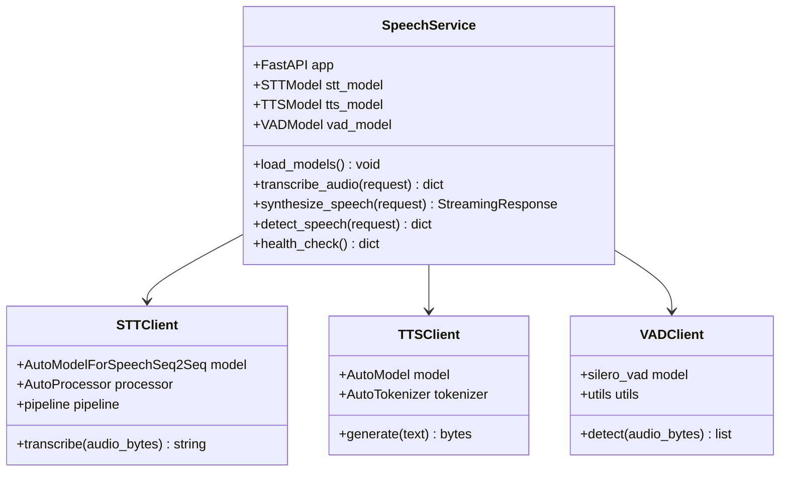

**Diagram sources**
- [main.py:25-387](file://app/speech_service/main.py#L25-L387)

**Section sources**
- [main.py:1-387](file://app/speech_service/main.py#L1-L387)

### Backend API Layer

The backend API provides comprehensive voice screening functionality through RESTful endpoints. It handles tenant configuration, session management, scheduling, and integration with external services.

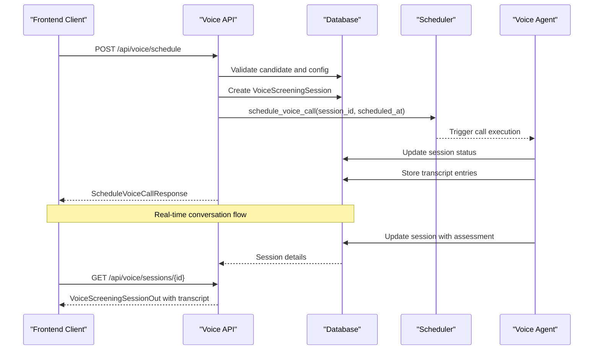

**Diagram sources**
- [voice.py:94-144](file://app/backend/routes/voice.py#L94-L144)
- [voice_call_scheduler.py](file://app/backend/services/voice_call_scheduler.py)

**Section sources**
- [voice.py:1-364](file://app/backend/routes/voice.py#L1-L364)

## Voice Agent Implementation

### Dual-Component Architecture

The voice agent system implements a sophisticated dual-component design that separates call initiation from real-time conversation management.

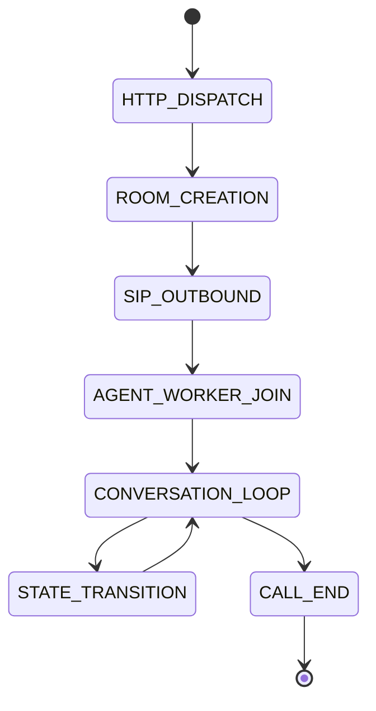

**Diagram sources**
- [agent.py:802-852](file://app/voice_agent/agent.py#L802-L852)
- [agent.py:618-754](file://app/voice_agent/agent.py#L618-L754)

**Updated** The dual-component architecture now includes comprehensive HTTP dispatch API for call initiation and LiveKit Agent Worker for real-time conversation management, with sophisticated state machine handling and error recovery.

### LiveKit Telephony Coordination

The voice agent service integrates with LiveKit for comprehensive telephony coordination, providing SIP trunk registration and real-time audio processing capabilities through Twilio integration.

**Current Implementation Status**: Phase 1.4 - LiveKit integration is fully implemented with Twilio SIP trunking support. The system maintains conversation engine readiness with comprehensive audio processing and state management.

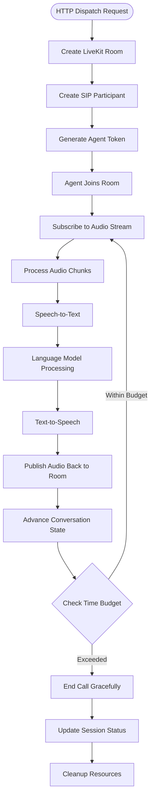

**Diagram sources**
- [agent.py:558-601](file://app/voice_agent/agent.py#L558-L601)
- [agent.py:634-694](file://app/voice_agent/agent.py#L634-L694)

### LLM Integration with Ollama Cloud

The voice agent integrates with Ollama Cloud for advanced language model processing, providing intelligent conversation responses and screening analysis.

**LLM Configuration**:
- Base URL: https://ollama.com
- Model: gemma4:31b-cloud
- API Key: Environment variable support
- Integration Points: Response generation, screening question creation, assessment analysis

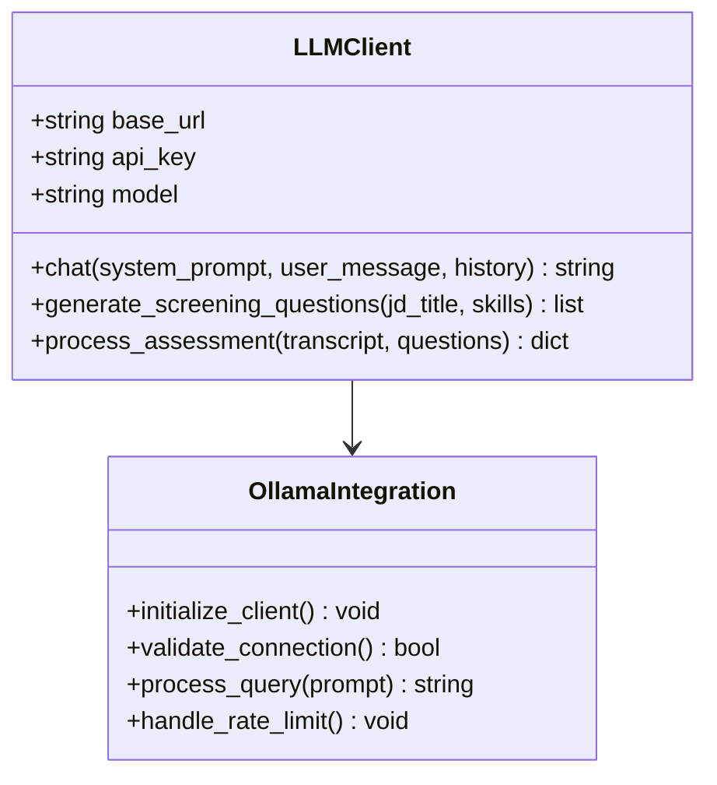

**Diagram sources**
- [agent.py:157-215](file://app/voice_agent/agent.py#L157-L215)

**Section sources**
- [agent.py:157-215](file://app/voice_agent/agent.py#L157-L215)

### Edge Case Handling

The system includes robust edge case detection and handling mechanisms to manage various conversation scenarios gracefully:

- **Silence Detection**: Identifies periods of silence and prompts for response
- **Unclear Responses**: Handles brief or ambiguous answers with follow-up questions
- **Rescheduling Requests**: Manages candidate requests to reschedule calls
- **Compensation Questions**: Redirects salary/benefits inquiries to appropriate channels
- **AI Detection**: Responds appropriately when candidates question if they're speaking to AI
- **Call End Conditions**: Graceful termination based on time budget and user requests

**Updated** Enhanced edge case handling now includes sophisticated rescheduling request detection during conversation flow, allowing candidates to request rescheduling through natural language prompts.

**Section sources**
- [agent.py:375-412](file://app/voice_agent/agent.py#L375-L412)

## Backend Services

### Voice Call Scheduler

The voice call scheduler service manages the timing and execution of screening calls using APScheduler for reliable job scheduling and comprehensive retry mechanisms.

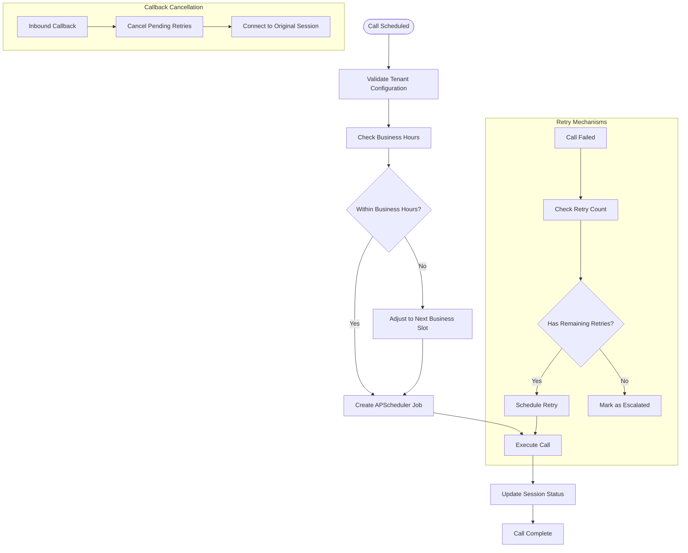

**Diagram sources**
- [voice_call_scheduler.py](file://app/backend/services/voice_call_scheduler.py)

**Updated** Enhanced rescheduling capabilities now include comprehensive job description ID tracking and improved error handling for rescheduling operations, ensuring proper session management and resource cleanup.

**Section sources**
- [voice_call_scheduler.py](file://app/backend/services/voice_call_scheduler.py)

### Voice Screening Service

The voice screening service provides core business logic for conversation context building, assessment generation, and session management with comprehensive real-time processing capabilities.

**Section sources**
- [voice_screening_service.py](file://app/backend/services/voice_screening_service.py)

## Database Schema

The voice screening system utilizes a comprehensive database schema designed to support scalable voice screening operations with proper indexing and relationships.

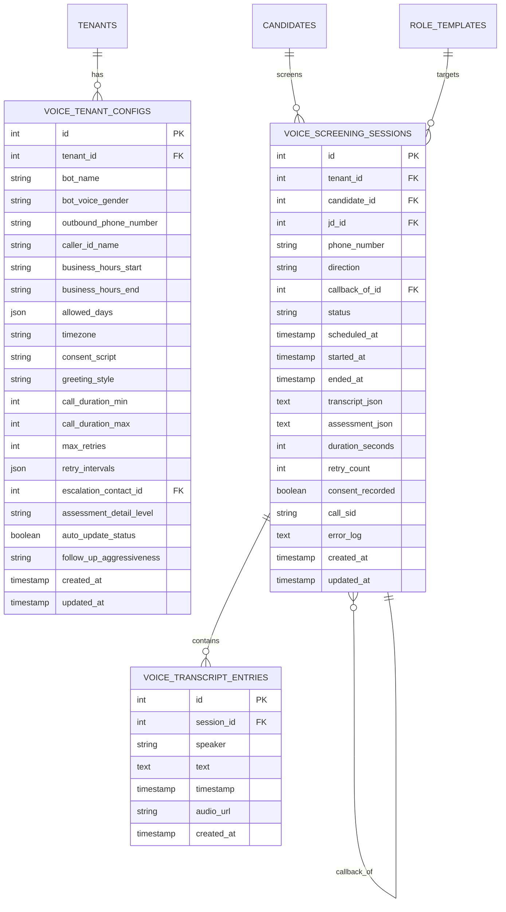

**Diagram sources**
- [db_models.py:875-961](file://app/backend/models/db_models.py#L875-L961)

**Updated** The database schema now includes enhanced job description ID tracking capabilities, allowing for improved session management and reporting features.

**Section sources**
- [db_models.py:875-961](file://app/backend/models/db_models.py#L875-L961)

## Frontend Integration

### Voice Screening Interface

The frontend provides an intuitive interface for recruiters to manage voice screening operations, including session scheduling, monitoring, and assessment review.

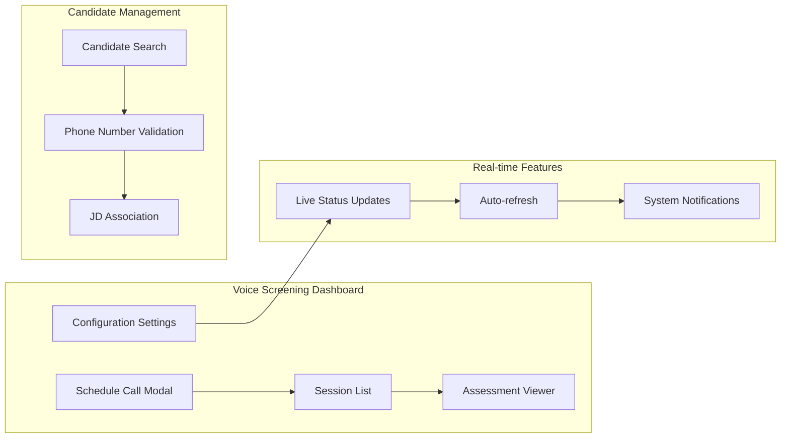

**Diagram sources**
- [VoiceScreeningPage.jsx:147-696](file://app/frontend/src/pages/VoiceScreeningPage.jsx#L147-L696)

**Updated** Enhanced frontend integration now includes improved rescheduling capabilities with job description ID tracking, allowing recruiters to easily reschedule calls with proper job association.

**Section sources**
- [VoiceScreeningPage.jsx:1-696](file://app/frontend/src/pages/VoiceScreeningPage.jsx#L1-L696)

## API Endpoints

The backend exposes a comprehensive set of RESTful endpoints for voice screening operations:

### Voice Settings Management
- `GET /api/voice/settings` - Retrieve tenant voice screening configuration
- `PUT /api/voice/settings` - Update tenant voice screening configuration

### Call Scheduling
- `POST /api/voice/schedule` - Schedule a new voice screening call
- `GET /api/voice/sessions` - List voice screening sessions
- `GET /api/voice/sessions/{id}` - Get session details with transcript

### Session Management
- `PATCH /api/voice/sessions/{id}` - Update session status and metadata
- `POST /api/voice/sessions/{id}/reschedule` - **Enhanced** Reschedule a call with job description ID tracking
- `POST /api/voice/sessions/{id}/cancel` - Cancel a scheduled call

### Internal Service Endpoints
- `GET /api/voice/internal/config/{tenant_id}` - Internal tenant config access
- `GET /api/voice/internal/candidate/{tenant_id}/{candidate_id}` - Internal candidate info access

**Updated** Enhanced rescheduling endpoint now supports job description ID tracking and improved error handling for rescheduling operations.

**Section sources**
- [voice.py:47-364](file://app/backend/routes/voice.py#L47-L364)

## Conversation Flow

The voice screening conversation follows a structured flow designed to maximize information gathering while maintaining candidate engagement.

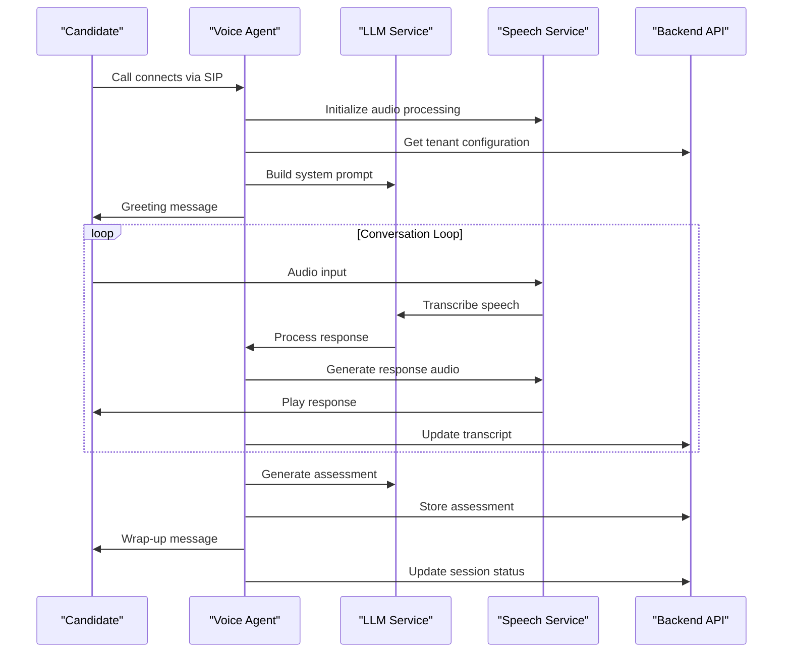

**Diagram sources**
- [agent.py:431-485](file://app/voice_agent/agent.py#L431-L485)

**Updated** The conversation flow now includes enhanced rescheduling request detection and processing, allowing candidates to request rescheduling through natural language prompts with proper job description ID tracking.

**Section sources**
- [agent.py:431-485](file://app/voice_agent/agent.py#L431-L485)

## Testing Framework

The voice screening system includes comprehensive testing coverage through unit tests and integration tests:

### Test Coverage Areas
- **Voice Settings**: Configuration retrieval and updates
- **Session Management**: Scheduling, rescheduling, and cancellation
- **Business Hours**: Time zone and scheduling validation
- **Conversation Context**: Building comprehensive conversation context
- **Assessment Generation**: Structured assessment creation
- **Rescheduling Operations**: Enhanced rescheduling with job description ID tracking

### Test Scenarios
- Configuration validation and defaults
- Session lifecycle management
- Error handling and edge cases
- Business hour adjustments
- Assessment structure validation
- **Enhanced** Rescheduling operation validation with job description ID tracking

**Updated** Testing framework now includes comprehensive validation for enhanced rescheduling capabilities with job description ID tracking and improved error handling.

**Section sources**
- [test_voice_screening.py:43-870](file://app/backend/tests/test_voice_screening.py#L43-L870)

## Deployment Architecture

The voice screening system is designed for containerized deployment with clear service boundaries and communication patterns:

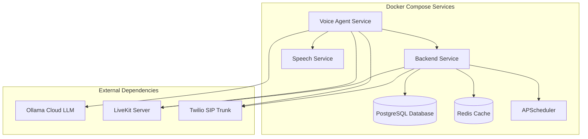

**Diagram sources**
- [docker-compose.yml](file://docker-compose.yml)

**Updated** The deployment architecture now reflects the current Phase 1.4 implementation status with comprehensive LiveKit Server integration, Twilio SIP trunking, speech processing services, and Ollama Cloud LLM dependencies. Enhanced rescheduling capabilities are fully integrated into the deployment architecture.

The deployment architecture supports horizontal scaling, service discovery, and resilient communication patterns essential for production voice screening operations.

## Conclusion

The Voice Agent Conversation System represents a comprehensive solution for automated phone screening in recruitment processes. By combining advanced AI capabilities with robust infrastructure, the system delivers scalable, compliant, and efficient candidate screening experiences.

**Updated** The system now implements a comprehensive voice agent with dual-component design (HTTP dispatch API + LiveKit Agent Worker), sophisticated state machine management, LiveKit telephony coordination, and integrated speech processing services as part of Phase 1.4 development. The current implementation maintains full telephony integration readiness while ensuring system stability and performance.

Enhanced rescheduling capabilities with job description ID tracking provide improved flexibility for managing voice screening operations. The system now includes comprehensive error handling for rescheduling operations and sophisticated job description association for better session management.

Key strengths of the system include:

- **Dual-Component Architecture**: HTTP dispatch API for call initiation and LiveKit Agent Worker for real-time conversation management
- **Comprehensive Telephony Integration**: Twilio SIP trunking with LiveKit Server coordination
- **Advanced Audio Processing**: Integrated STT/TTS/VAD capabilities with real-time audio streaming
- **Sophisticated State Management**: Comprehensive conversation state machine with edge case handling
- **Robust Error Handling**: Comprehensive retry mechanisms and graceful degradation
- **Production-Ready Infrastructure**: Containerized deployment with proper service dependencies
- **Real-Time Communication**: WebSocket-based audio streaming and conversation synchronization
- **Scalable Design**: Modular architecture supporting horizontal scaling and service isolation
- **Comprehensive Monitoring**: Health checks, logging, and operational visibility across all components
- **Enhanced Rescheduling**: Job description ID tracking and improved error handling for rescheduling operations
- **Improved Session Management**: Sophisticated job description association and rescheduling capabilities

The system provides a solid foundation for organizations seeking to enhance their recruitment processes through intelligent automation while maintaining human oversight and compliance standards. The current Phase 1.4 implementation ensures full telephony integration readiness with comprehensive audio processing and conversation management capabilities, including enhanced rescheduling functionality with job description ID tracking.