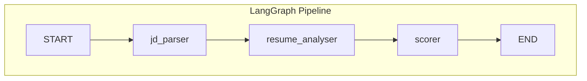
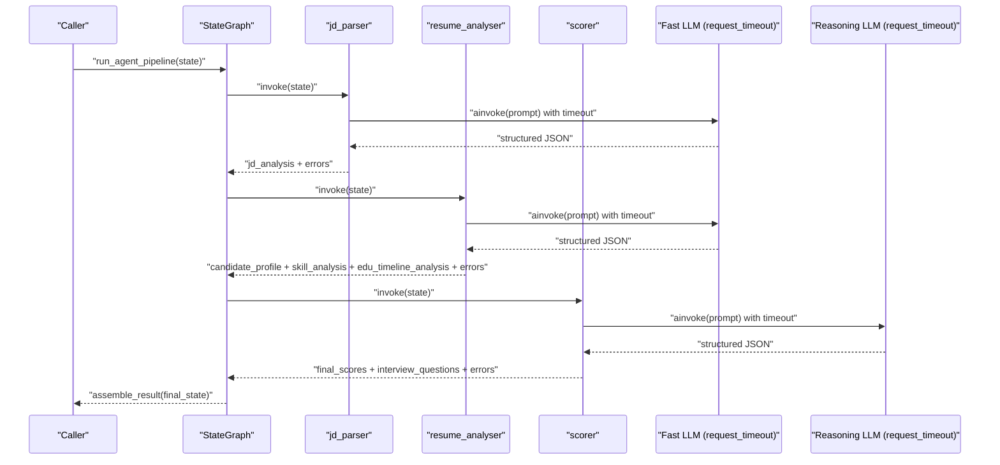
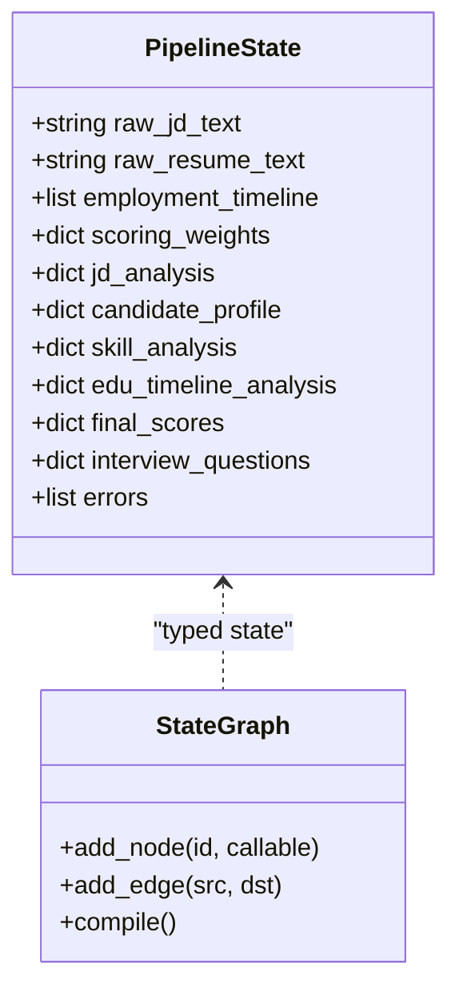
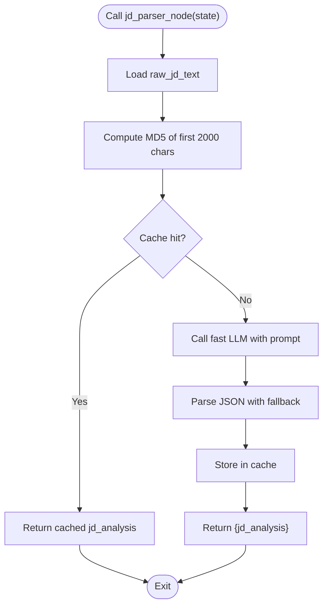
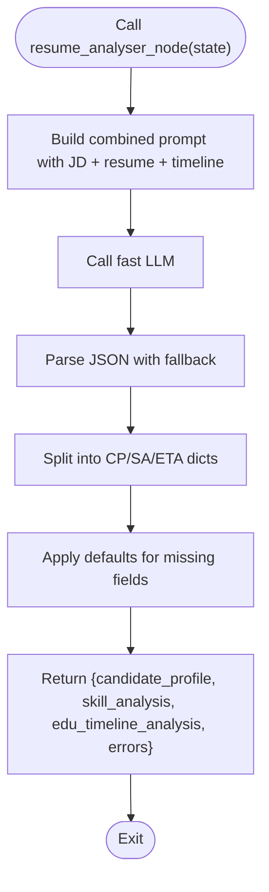
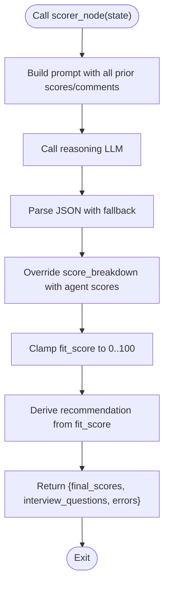
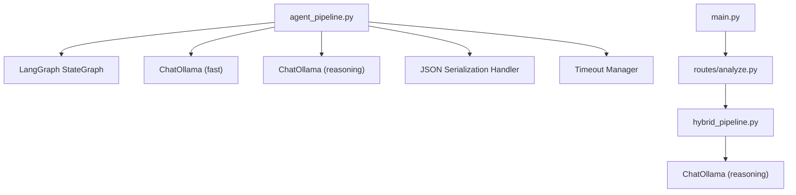

# Agent Pipeline (LangGraph)

<cite>
**Referenced Files in This Document**
- [agent_pipeline.py](file://app/backend/services/agent_pipeline.py)
- [hybrid_pipeline.py](file://app/backend/services/hybrid_pipeline.py)
- [llm_service.py](file://app/backend/services/llm_service.py)
- [analyze.py](file://app/backend/routes/analyze.py)
- [main.py](file://app/backend/main.py)
- [test_agent_pipeline.py](file://app/backend/tests/test_agent_pipeline.py)
</cite>

## Update Summary
**Changes Made**
- Added `_llm_request_timeout` constant for consistent timeout handling across multi-agent pipeline
- Integrated request timeout parameter to both fast and reasoning LLM instances
- Enhanced timeout configuration with environment variable support (`LLM_NARRATIVE_TIMEOUT`)
- Improved timeout consistency between LangGraph pipeline and hybrid pipeline

## Table of Contents
1. [Introduction](#introduction)
2. [Project Structure](#project-structure)
3. [Core Components](#core-components)
4. [Architecture Overview](#architecture-overview)
5. [Detailed Component Analysis](#detailed-component-analysis)
6. [Timeout Configuration and Management](#timeout-configuration-and-management)
7. [JSON Serialization Handling](#json-serialization-handling)
8. [Dependency Analysis](#dependency-analysis)
9. [Performance Considerations](#performance-considerations)
10. [Troubleshooting Guide](#troubleshooting-guide)
11. [Conclusion](#conclusion)
12. [Appendices](#appendices)

## Introduction
This document describes the LangGraph-based multi-agent analysis pipeline that powers complex, step-by-step reasoning workflows for resume and job description evaluation. The pipeline integrates with Ollama models to enable structured extraction, matching, scoring, and recommendation generation. It emphasizes deterministic, schema-bound outputs, robust fallbacks, and graceful degradation when LLM calls fail. The system is designed to support both non-streaming batch processing and streaming SSE responses, while complementing a hybrid approach that combines Python-first determinism with a single LLM narrative.

**Updated** Enhanced timeout handling with consistent `_llm_request_timeout` constant for improved reliability and predictable behavior across all LLM interactions.

## Project Structure
The agent pipeline is implemented as a LangGraph StateGraph with three sequential nodes:
- Stage 1 (parallel within stage): jd_parser
- Stage 2 (parallel within stage): resume_analyser (combines resume parsing, skill matching, and education/timeline analysis)
- Stage 3 (parallel within stage): scorer (combines scoring and interview question generation)



**Diagram sources**
- [agent_pipeline.py:551-552](file://app/backend/services/agent_pipeline.py#L551-L552)

**Section sources**
- [agent_pipeline.py:4-24](file://app/backend/services/agent_pipeline.py#L4-L24)
- [agent_pipeline.py:551-552](file://app/backend/services/agent_pipeline.py#L551-L552)

## Core Components
- StateGraph and State: The pipeline defines a strongly-typed state interface that carries inputs, intermediate outputs, and accumulated errors across nodes.
- LLM singletons: Fast and reasoning LLM clients are created once and reused to reduce connection overhead and improve throughput.
- Timeout management: Consistent timeout handling using `_llm_request_timeout` constant for predictable LLM behavior.
- Node implementations:
  - jd_parser: Extracts structured job requirements from raw job descriptions.
  - resume_analyser: Parses candidate profiles, identifies skills, and computes education and timeline scores.
  - scorer: Computes weighted fit scores, risk penalties, and generates interview questions.
- Result assembly: Converts the final state into a unified response compatible with the existing API schema.
- JSON serialization: Comprehensive handling of datetime, date, and Decimal objects for proper serialization.

**Section sources**
- [agent_pipeline.py:115-132](file://app/backend/services/agent_pipeline.py#L115-L132)
- [agent_pipeline.py:81-110](file://app/backend/services/agent_pipeline.py#L81-L110)
- [agent_pipeline.py:81-82](file://app/backend/services/agent_pipeline.py#L81-L82)
- [agent_pipeline.py:172-191](file://app/backend/services/agent_pipeline.py#L172-L191)
- [agent_pipeline.py:291-333](file://app/backend/services/agent_pipeline.py#L291-L333)
- [agent_pipeline.py:378-460](file://app/backend/services/agent_pipeline.py#L378-L460)
- [agent_pipeline.py:577-630](file://app/backend/services/agent_pipeline.py#L577-L630)

## Architecture Overview
The agent pipeline orchestrates three specialized agents with consistent timeout management:
- Agent 1 (jd_parser): Parses job descriptions into canonical fields (role, domain, seniority, required skills, required years).
- Agent 2 (resume_analyser): Builds a candidate profile, matches skills, and evaluates education and timeline.
- Agent 3 (scorer): Computes a weighted fit score, risk signals, and generates interview questions.



**Diagram sources**
- [agent_pipeline.py:644-645](file://app/backend/services/agent_pipeline.py#L644-L645)
- [agent_pipeline.py:172-191](file://app/backend/services/agent_pipeline.py#L172-L191)
- [agent_pipeline.py:291-333](file://app/backend/services/agent_pipeline.py#L291-L333)
- [agent_pipeline.py:378-460](file://app/backend/services/agent_pipeline.py#L378-L460)

## Detailed Component Analysis

### State Management and Graph Construction
- State schema: Defines inputs (raw texts, employment timeline, scoring weights), intermediate outputs (jd_analysis, candidate_profile, skill_analysis, edu_timeline_analysis, final_scores, interview_questions), and an errors accumulator.
- Graph edges: Sequential edges from START to jd_parser, then to resume_analyser, then to scorer, and finally to END.
- Compilation: The graph is compiled once at module load to reuse the compiled graph across requests.



**Diagram sources**
- [agent_pipeline.py:115-132](file://app/backend/services/agent_pipeline.py#L115-L132)
- [agent_pipeline.py:551-552](file://app/backend/services/agent_pipeline.py#L551-L552)

**Section sources**
- [agent_pipeline.py:115-132](file://app/backend/services/agent_pipeline.py#L115-L132)
- [agent_pipeline.py:551-552](file://app/backend/services/agent_pipeline.py#L551-L552)

### Node: jd_parser
- Purpose: Extract canonical job requirements from raw job descriptions.
- Behavior:
  - Uses a fast LLM with strict JSON schema and deterministic settings.
  - Implements an in-memory cache keyed by MD5 of the first 2000 characters of the job description to avoid repeated LLM calls for identical inputs.
  - On LLM failure, returns typed-null defaults and appends an error to the state's errors list.



**Diagram sources**
- [agent_pipeline.py:172-191](file://app/backend/services/agent_pipeline.py#L172-L191)

**Section sources**
- [agent_pipeline.py:172-191](file://app/backend/services/agent_pipeline.py#L172-L191)

### Node: resume_analyser
- Purpose: Combine resume parsing, skill matching, education scoring, and timeline analysis into a single LLM call.
- Behavior:
  - Uses a fast LLM with a comprehensive prompt that includes role, domain, seniority, required skills, resume text, and employment timeline.
  - Splits the flat combined output into three sub-dictionaries: candidate_profile, skill_analysis, and edu_timeline_analysis.
  - Applies defaults for missing or null fields to ensure schema completeness.
  - On LLM failure, returns typed-null defaults for all three sub-dictionaries and appends an error.
  - **Updated** Properly serializes complex data structures using the `_json_default` function for datetime, date, and Decimal objects.



**Diagram sources**
- [agent_pipeline.py:291-333](file://app/backend/services/agent_pipeline.py#L291-L333)
- [agent_pipeline.py:253-289](file://app/backend/services/agent_pipeline.py#L253-L289)

**Section sources**
- [agent_pipeline.py:182-289](file://app/backend/services/agent_pipeline.py#L182-L289)
- [agent_pipeline.py:291-333](file://app/backend/services/agent_pipeline.py#L291-L333)

### Node: scorer
- Purpose: Compute weighted fit score, risk penalties, risk signals, strengths, weaknesses, explainability, and interview questions.
- Behavior:
  - Uses a reasoning LLM with a detailed prompt that includes all prior scores and contextual comments.
  - Normalizes scoring weights to sum to 1.0 and clamps the final fit score to 0–100.
  - Corrects invalid recommendations and overrides score breakdown fields with agent-computed values to prevent template literals.
  - On LLM failure, computes a deterministic fallback using Python math and returns typed-null defaults for interview questions.
  - **Updated** Properly serializes complex data structures using the `_json_default` function for datetime, date, and Decimal objects.



**Diagram sources**
- [agent_pipeline.py:378-460](file://app/backend/services/agent_pipeline.py#L378-L460)
- [agent_pipeline.py:474-529](file://app/backend/services/agent_pipeline.py#L474-L529)

**Section sources**
- [agent_pipeline.py:324-460](file://app/backend/services/agent_pipeline.py#L324-L460)
- [agent_pipeline.py:474-529](file://app/backend/services/agent_pipeline.py#L474-L529)

### Result Assembly and Backward Compatibility
- The final state is transformed into a unified result dictionary that preserves backward compatibility with the existing AnalysisResponse schema while adding new fields produced by the LangGraph pipeline.
- Ensures that the frontend's "Stability" bar continues to render by mapping timeline to stability in the score breakdown.

**Section sources**
- [agent_pipeline.py:577-630](file://app/backend/services/agent_pipeline.py#L577-L630)

### Integration with Hybrid Approach
- While the LangGraph pipeline focuses on structured, schema-bound outputs and deterministic fallbacks, the hybrid pipeline provides a complementary approach:
  - Python-first deterministic scoring (skills, education, experience, domain/architecture, risk signals).
  - Single LLM call for narrative synthesis with robust fallbacks.
  - SSE streaming for progressive updates.
- The hybrid pipeline is used by the main API routes, while the LangGraph pipeline remains available for specialized use cases requiring strict schema-bound outputs and multi-step reasoning.

**Section sources**
- [hybrid_pipeline.py:1-11](file://app/backend/services/hybrid_pipeline.py#L1-L11)
- [analyze.py:304-311](file://app/backend/routes/analyze.py#L304-L311)

## Timeout Configuration and Management

**Updated** The agent pipeline now includes comprehensive timeout management for reliable LLM interactions.

### _llm_request_timeout Constant
The `_llm_request_timeout` constant provides centralized timeout configuration for all LLM interactions:

```python
_llm_request_timeout = float(os.getenv("LLM_NARRATIVE_TIMEOUT", "150")) + 30
```

This configuration:
- Reads timeout from environment variable `LLM_NARRATIVE_TIMEOUT` (default: 150 seconds)
- Adds 30 seconds buffer for HTTP transport overhead
- Provides consistent timeout across all LLM instances

### Fast LLM Timeout Configuration
The fast LLM instance uses the timeout constant for extraction and matching operations:

```python
def get_fast_llm() -> ChatOllama:
    # ... existing configuration ...
    request_timeout=_llm_request_timeout,
```

### Reasoning LLM Timeout Configuration
The reasoning LLM instance uses the same timeout constant for scoring and narrative synthesis:

```python
def get_reasoning_llm() -> ChatOllama:
    # ... existing configuration ...
    request_timeout=_llm_request_timeout,
```

### Timeout Consistency Across Pipelines
The timeout configuration ensures consistency between:
- **LangGraph Pipeline**: All three LLM calls use the same timeout
- **Hybrid Pipeline**: Separate timeout handling maintains compatibility
- **Direct LLM Service**: Independent timeout management for standalone operations

### Benefits of Centralized Timeout Management
- **Predictable Behavior**: Consistent timeout across all LLM interactions
- **Environment Flexibility**: Configurable via environment variables
- **Operational Reliability**: Prevents hanging LLM calls and resource exhaustion
- **Graceful Degradation**: Enables proper fallback mechanisms when timeouts occur

**Section sources**
- [agent_pipeline.py:81-82](file://app/backend/services/agent_pipeline.py#L81-L82)
- [agent_pipeline.py:88-97](file://app/backend/services/agent_pipeline.py#L88-L97)
- [agent_pipeline.py:105-114](file://app/backend/services/agent_pipeline.py#L105-L114)

## JSON Serialization Handling

**Updated** The agent pipeline now includes comprehensive JSON serialization handling for complex data types that are not natively JSON-serializable.

### _json_default Function
The `_json_default` function serves as a custom JSON encoder that converts non-serializable Python objects to JSON-compatible formats:

```python
def _json_default(obj):
    """Handle non-serializable types for json.dumps (datetime, date, Decimal)."""
    if isinstance(obj, (datetime, date)):
        return obj.isoformat()
    if isinstance(obj, Decimal):
        return float(obj)
    raise TypeError(f"Object of type {type(obj).__name__} is not JSON serializable")
```

### Usage Throughout the Pipeline
The `_json_default` function is used in multiple locations to ensure proper serialization:

1. **Resume Analyzer Prompt Building**:
   ```python
   required_skills=json.dumps(required_skills[:20], default=_json_default)
   timeline=json.dumps(state.get("employment_timeline", [])[:10], default=_json_default)
   ```

2. **Scorer Prompt Building**:
   ```python
   matched_skills=json.dumps(sa.get("matched_skills", [])[:8], default=_json_default)
   missing_skills=json.dumps(missing_skills[:8], default=_json_default)
   ```

### Supported Data Types
The JSON serialization handler supports the following non-JSON-serializable types:

- **datetime objects**: Converted to ISO format strings (YYYY-MM-DDTHH:MM:SS.mmmmmm)
- **date objects**: Converted to ISO format strings (YYYY-MM-DD)
- **Decimal objects**: Converted to float values

### Benefits
- **Type Safety**: Prevents JSON serialization errors when dealing with complex data structures
- **Consistency**: Ensures uniform serialization across all pipeline components
- **Backward Compatibility**: Maintains compatibility with existing JSON-based workflows
- **Error Prevention**: Eliminates runtime errors during JSON encoding operations

**Section sources**
- [agent_pipeline.py:39-46](file://app/backend/services/agent_pipeline.py#L39-L46)
- [agent_pipeline.py:319-321](file://app/backend/services/agent_pipeline.py#L319-L321)
- [agent_pipeline.py:415-416](file://app/backend/services/agent_pipeline.py#L415-L416)

## Dependency Analysis
- LangGraph integration: Uses StateGraph with typed state and node callbacks.
- LLM integration: ChatOllama singletons configured with deterministic settings and long-lived connections.
- Timeout management: Centralized `_llm_request_timeout` constant ensures consistent timeout handling across all LLM instances.
- Error propagation: Each node appends typed errors to the state's errors list, enabling centralized diagnostics.
- Route integration: The main analysis route invokes the hybrid pipeline and stores results in the database; the LangGraph pipeline is not currently wired into the main route.
- **Updated** JSON serialization: Comprehensive handling of datetime, date, and Decimal objects across all pipeline components.



**Diagram sources**
- [agent_pipeline.py:81-110](file://app/backend/services/agent_pipeline.py#L81-L110)
- [agent_pipeline.py:39-46](file://app/backend/services/agent_pipeline.py#L39-L46)
- [agent_pipeline.py:81-82](file://app/backend/services/agent_pipeline.py#L81-L82)
- [hybrid_pipeline.py:82-105](file://app/backend/services/hybrid_pipeline.py#L82-L105)
- [analyze.py:304-311](file://app/backend/routes/analyze.py#L304-L311)
- [main.py:200-214](file://app/backend/main.py#L200-L214)

**Section sources**
- [agent_pipeline.py:81-110](file://app/backend/services/agent_pipeline.py#L81-L110)
- [agent_pipeline.py:39-46](file://app/backend/services/agent_pipeline.py#L39-L46)
- [agent_pipeline.py:81-82](file://app/backend/services/agent_pipeline.py#L81-L82)
- [hybrid_pipeline.py:82-105](file://app/backend/services/hybrid_pipeline.py#L82-L105)
- [analyze.py:304-311](file://app/backend/routes/analyze.py#L304-L311)
- [main.py:200-214](file://app/backend/main.py#L200-L214)

## Performance Considerations
- Model selection:
  - Fast model for extraction and matching (lower latency, smaller context).
  - Reasoning model for scoring and narrative synthesis (higher latency, larger context).
- Connection reuse:
  - LLM singletons are created once and reused to avoid connection overhead and leverage Ollama's keep-alive sessions.
- Prompt sizing:
  - Limits resume text and timeline length to control context size and reduce latency.
- Parallelization strategy:
  - The LangGraph pipeline uses sequential nodes to maximize CPU utilization per call on CPU-bound inference.
- Caching:
  - JD cache avoids repeated LLM calls for identical job descriptions.
- Streaming:
  - The hybrid pipeline supports SSE streaming to provide progressive updates while the LLM narrative is generated.
- **Updated** Timeout management:
  - Centralized timeout configuration prevents resource exhaustion and improves reliability.
  - Consistent timeout handling across all LLM instances ensures predictable performance.
  - Environment-based configuration allows for flexible tuning without code changes.
- **Updated** JSON serialization optimization:
  - Efficient handling of complex data types reduces serialization overhead.
  - Minimal memory footprint for serialized objects.

## Troubleshooting Guide
- LLM unavailability:
  - The pipeline returns typed-null defaults and appends errors to the state. Check Ollama reachability and model readiness.
- JSON parsing failures:
  - The pipeline attempts to extract JSON from various formats and applies fallbacks; if parsing fails, typed-null defaults are returned.
- Weight normalization:
  - Weights are normalized to sum to 1.0; missing keys are filled from defaults.
- Recommendation correction:
  - Invalid recommendations are corrected based on fit score thresholds.
- Error aggregation:
  - Errors from all nodes are accumulated in the state's errors list for centralized diagnostics.
- **Updated** Timeout-related issues:
  - Monitor `_llm_request_timeout` configuration to ensure appropriate values for your workload.
  - Check environment variable `LLM_NARRATIVE_TIMEOUT` for proper timeout settings.
  - Verify that the 30-second buffer is sufficient for your network conditions.
  - Consider adjusting timeout values based on model complexity and system resources.
- **Updated** JSON serialization issues:
  - Ensure all data passed to JSON serialization includes proper type conversion using `_json_default`.
  - Verify that datetime, date, and Decimal objects are properly handled in all pipeline components.
  - Check for circular references or self-referencing objects that might cause serialization errors.

**Section sources**
- [agent_pipeline.py:125-138](file://app/backend/services/agent_pipeline.py#L125-L138)
- [agent_pipeline.py:453-460](file://app/backend/services/agent_pipeline.py#L453-L460)
- [agent_pipeline.py:422-428](file://app/backend/services/agent_pipeline.py#L422-L428)
- [agent_pipeline.py:178-179](file://app/backend/services/agent_pipeline.py#L178-L179)
- [agent_pipeline.py:315-321](file://app/backend/services/agent_pipeline.py#L315-L321)
- [agent_pipeline.py:443-448](file://app/backend/services/agent_pipeline.py#L443-L448)
- [agent_pipeline.py:81-82](file://app/backend/services/agent_pipeline.py#L81-L82)

## Conclusion
The LangGraph-based multi-agent analysis pipeline provides a robust, schema-bound, and deterministic approach to complex, multi-step reasoning workflows. By leveraging Ollama models with careful configuration, typed state management, comprehensive fallbacks, and centralized timeout handling, it ensures reliable operation under varied conditions. The enhanced timeout management with the `_llm_request_timeout` constant provides predictable behavior and improved reliability across all LLM interactions. The enhanced JSON serialization handling for datetime objects, dates, and Decimal values further strengthens the pipeline's reliability and compatibility with diverse data types. While the hybrid pipeline offers a complementary approach with streaming and narrative synthesis, the LangGraph pipeline remains ideal for scenarios requiring strict schema-bound outputs and resilient error handling.

## Appendices

### Workflow Definition and Execution
- The pipeline is defined as a StateGraph with three sequential nodes and compiled once at module load.
- Execution proceeds from job description parsing to candidate analysis and finally to scoring and interview question generation.

**Section sources**
- [agent_pipeline.py:551-552](file://app/backend/services/agent_pipeline.py#L551-L552)

### State Persistence and Error Recovery
- State includes an errors accumulator for centralized diagnostics.
- The hybrid pipeline demonstrates persistent storage of analysis results and candidate profiles in the database.

**Section sources**
- [agent_pipeline.py:131](file://app/backend/services/agent_pipeline.py#L131)
- [analyze.py:462-472](file://app/backend/routes/analyze.py#L462-L472)

### Performance Monitoring
- The main application exposes health checks and diagnostic endpoints for Ollama status and model readiness.
- Logging captures pipeline stages and errors for operational visibility.

**Section sources**
- [main.py:228-259](file://app/backend/main.py#L228-L259)
- [main.py:262-326](file://app/backend/main.py#L262-L326)

### Example: Running the Agent Pipeline
- The public API entry point constructs initial state, invokes the compiled graph, and assembles the final result.

**Section sources**
- [agent_pipeline.py:634-645](file://app/backend/services/agent_pipeline.py#L634-L645)
- [agent_pipeline.py:644-645](file://app/backend/services/agent_pipeline.py#L644-L645)

### Timeout Configuration Best Practices
**Updated** Guidelines for configuring and managing timeouts in the pipeline:

1. **Environment Configuration**:
   - Set `LLM_NARRATIVE_TIMEOUT` environment variable to control base timeout (default: 150 seconds)
   - The pipeline automatically adds a 30-second buffer for HTTP transport overhead

2. **Consistent Timeout Handling**:
   - All LLM instances use the same `_llm_request_timeout` constant
   - Ensures predictable behavior across fast and reasoning models
   - Prevents resource exhaustion and improves reliability

3. **Monitoring and Adjustment**:
   - Monitor LLM response times and adjust `LLM_NARRATIVE_TIMEOUT` accordingly
   - Consider network latency and model complexity when tuning timeout values
   - Test with representative workloads to determine optimal timeout settings

4. **Fallback Mechanisms**:
   - Timeout exceptions trigger graceful fallback to typed-null defaults
   - Error messages are captured in the state's errors list for diagnostics
   - Pipeline continues operation even when individual LLM calls timeout

**Section sources**
- [agent_pipeline.py:81-82](file://app/backend/services/agent_pipeline.py#L81-L82)
- [agent_pipeline.py:88-97](file://app/backend/services/agent_pipeline.py#L88-L97)
- [agent_pipeline.py:105-114](file://app/backend/services/agent_pipeline.py#L105-L114)

### JSON Serialization Best Practices
**Updated** Guidelines for handling complex data types in the pipeline:

1. **Always use `_json_default`** when serializing data containing datetime, date, or Decimal objects
2. **Test serialization** with representative data samples before deployment
3. **Handle edge cases** where objects might be None or empty collections
4. **Monitor serialization performance** in production environments
5. **Validate deserialization** on the receiving end to ensure data integrity

**Section sources**
- [agent_pipeline.py:39-46](file://app/backend/services/agent_pipeline.py#L39-L46)
- [agent_pipeline.py:319-321](file://app/backend/services/agent_pipeline.py#L319-L321)
- [agent_pipeline.py:415-416](file://app/backend/services/agent_pipeline.py#L415-L416)