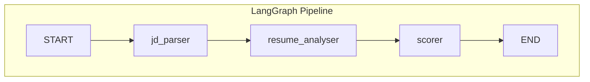
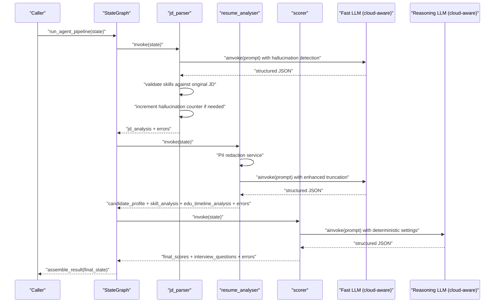
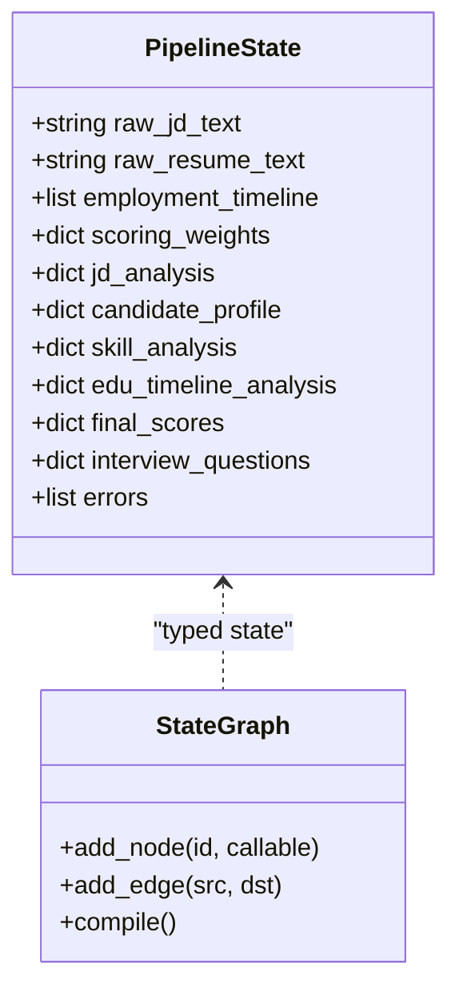
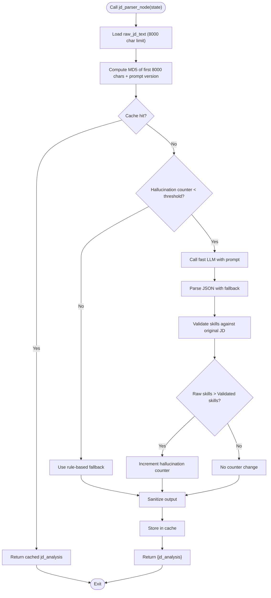
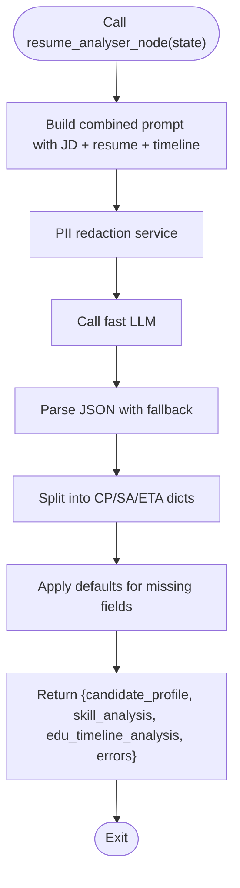
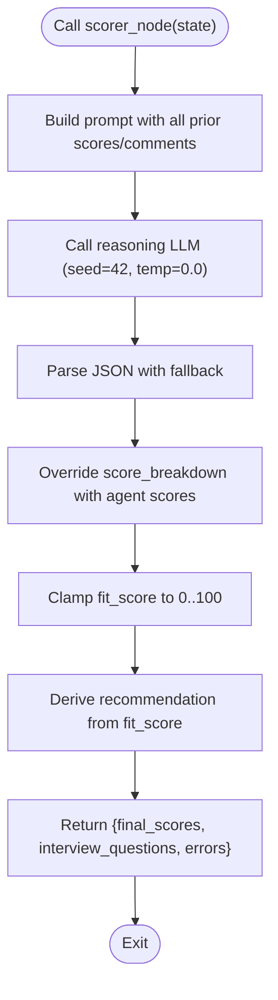
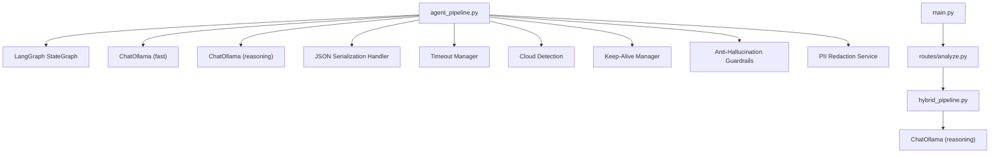

# Agent Pipeline (LangGraph)

<cite>
**Referenced Files in This Document**
- [agent_pipeline.py](file://app/backend/services/agent_pipeline.py)
- [hybrid_pipeline.py](file://app/backend/services/hybrid_pipeline.py)
- [llm_service.py](file://app/backend/services/llm_service.py)
- [analyze.py](file://app/backend/routes/analyze.py)
- [main.py](file://app/backend/main.py)
- [test_agent_pipeline.py](file://app/backend/tests/test_agent_pipeline.py)
- [pii_redaction_service.py](file://app/backend/services/pii_redaction_service.py)
</cite>

## Update Summary
**Changes Made**
- Enhanced with comprehensive anti-hallucination guardrails including cache versioning, circuit breaker mechanisms, and deterministic LLM behavior with fixed seeds
- Integrated PII redaction service to eliminate bias from personal identifiers in resume analysis
- Increased truncation limits from 2000 to 8000 characters for job descriptions and resumes to capture complete context
- Implemented hallucination detection and fallback to rule-based parsing when hallucination thresholds are exceeded
- Added comprehensive cache versioning system to automatically invalidate cached results when prompts change

## Table of Contents
1. [Introduction](#introduction)
2. [Project Structure](#project-structure)
3. [Core Components](#core-components)
4. [Architecture Overview](#architecture-overview)
5. [Detailed Component Analysis](#detailed-component-analysis)
6. [Anti-Hallucination Guardrails](#anti-hallucination-guardrails)
7. [PII Redaction Integration](#pii-redaction-integration)
8. [Deterministic LLM Behavior](#deterministic-llm-behavior)
9. [Enhanced Truncation Limits](#enhanced-truncation-limits)
10. [Cloud-Aware Configuration Management](#cloud-aware-configuration-management)
11. [Timeout Configuration and Management](#timeout-configuration-and-management)
12. [JSON Serialization Handling](#json-serialization-handling)
13. [Dependency Analysis](#dependency-analysis)
14. [Performance Considerations](#performance-considerations)
15. [Troubleshooting Guide](#troubleshooting-guide)
16. [Conclusion](#conclusion)
17. [Appendices](#appendices)

## Introduction
This document describes the LangGraph-based multi-agent analysis pipeline that powers complex, step-by-step reasoning workflows for resume and job description evaluation. The pipeline integrates with Ollama models to enable structured extraction, matching, scoring, and recommendation generation. It emphasizes deterministic, schema-bound outputs, robust fallbacks, and graceful degradation when LLM calls fail. The system is designed to support both non-streaming batch processing and streaming SSE responses, while complementing a hybrid approach that combines Python-first determinism with a single LLM narrative.

**Updated** Enhanced with comprehensive anti-hallucination guardrails including cache versioning, circuit breaker mechanisms, deterministic LLM behavior with fixed seeds, increased truncation limits, and PII redaction integration. The pipeline now includes sophisticated hallucination detection and automatic fallback to rule-based parsing when thresholds are exceeded, ensuring reliable and unbiased analysis results.

## Project Structure
The agent pipeline is implemented as a LangGraph StateGraph with three sequential nodes:
- Stage 1 (parallel within stage): jd_parser
- Stage 2 (parallel within stage): resume_analyser (combines resume parsing, skill matching, and education/timeline analysis)
- Stage 3 (parallel within stage): scorer (combines scoring and interview question generation)



**Diagram sources**
- [agent_pipeline.py:818-836](file://app/backend/services/agent_pipeline.py#L818-L836)

**Section sources**
- [agent_pipeline.py:4-24](file://app/backend/services/agent_pipeline.py#L4-L24)
- [agent_pipeline.py:818-836](file://app/backend/services/agent_pipeline.py#L818-L836)

## Core Components
- StateGraph and State: The pipeline defines a strongly-typed state interface that carries inputs, intermediate outputs, and accumulated errors across nodes.
- LLM singletons: Fast and reasoning LLM clients are created once and reused to reduce connection overhead and improve throughput.
- Anti-hallucination guardrails: Comprehensive systems to prevent hallucinations including cache versioning, circuit breakers, and rule-based fallbacks.
- PII redaction integration: Automatic removal of personally identifiable information to eliminate bias in analysis.
- Deterministic LLM behavior: Fixed seeds and controlled temperature settings for reproducible results.
- Enhanced truncation limits: Increased character limits for job descriptions and resumes to capture complete context.
- Intelligent keep_alive management: Cost-efficient cloud deployments disable keep_alive to avoid unnecessary charges.
- Timeout management: Consistent timeout handling using `_llm_request_timeout` constant for predictable LLM behavior.
- Node implementations:
  - jd_parser: Extracts structured job requirements from raw job descriptions with hallucination detection.
  - resume_analyser: Parses candidate profiles, identifies skills, and computes education and timeline scores with PII redaction.
  - scorer: Computes weighted fit scores, risk penalties, and generates interview questions.
- Result assembly: Converts the final state into a unified response compatible with the existing API schema.
- JSON serialization: Comprehensive handling of datetime, date, and Decimal objects for proper serialization.

**Section sources**
- [agent_pipeline.py:169-186](file://app/backend/services/agent_pipeline.py#L169-L186)
- [agent_pipeline.py:99-164](file://app/backend/services/agent_pipeline.py#L99-L164)
- [agent_pipeline.py:352-403](file://app/backend/services/agent_pipeline.py#L352-L403)
- [agent_pipeline.py:533-563](file://app/backend/services/agent_pipeline.py#L533-L563)
- [agent_pipeline.py:349-350](file://app/backend/services/agent_pipeline.py#L349-L350)
- [agent_pipeline.py:114](file://app/backend/services/agent_pipeline.py#L114)
- [agent_pipeline.py:149](file://app/backend/services/agent_pipeline.py#L149)
- [agent_pipeline.py:363](file://app/backend/services/agent_pipeline.py#L363)
- [agent_pipeline.py:550](file://app/backend/services/agent_pipeline.py#L550)
- [agent_pipeline.py:432-514](file://app/backend/services/agent_pipeline.py#L432-L514)
- [agent_pipeline.py:862-914](file://app/backend/services/agent_pipeline.py#L862-L914)

## Architecture Overview
The agent pipeline orchestrates three specialized agents with comprehensive anti-hallucination guardrails and cloud-aware configuration management:
- Agent 1 (jd_parser): Parses job descriptions into canonical fields with hallucination detection and rule-based fallback.
- Agent 2 (resume_analyser): Builds a candidate profile with PII redaction, matches skills, and evaluates education and timeline.
- Agent 3 (scorer): Computes a weighted fit score, risk signals, and generates interview questions.



**Diagram sources**
- [agent_pipeline.py:919-948](file://app/backend/services/agent_pipeline.py#L919-L948)
- [agent_pipeline.py:352-403](file://app/backend/services/agent_pipeline.py#L352-L403)
- [agent_pipeline.py:533-563](file://app/backend/services/agent_pipeline.py#L533-L563)
- [agent_pipeline.py:609-744](file://app/backend/services/agent_pipeline.py#L609-L744)

## Detailed Component Analysis

### State Management and Graph Construction
- State schema: Defines inputs (raw texts, employment timeline, scoring weights), intermediate outputs (jd_analysis, candidate_profile, skill_analysis, edu_timeline_analysis, final_scores, interview_questions), and an errors accumulator.
- Graph edges: Sequential edges from START to jd_parser, then to resume_analyser, then to scorer, and finally to END.
- Compilation: The graph is compiled once at module load to reuse the compiled graph across requests.



**Diagram sources**
- [agent_pipeline.py:169-186](file://app/backend/services/agent_pipeline.py#L169-L186)
- [agent_pipeline.py:818-836](file://app/backend/services/agent_pipeline.py#L818-L836)

**Section sources**
- [agent_pipeline.py:169-186](file://app/backend/services/agent_pipeline.py#L169-L186)
- [agent_pipeline.py:818-836](file://app/backend/services/agent_pipeline.py#L818-L836)

### Node: jd_parser
- Purpose: Extract canonical job requirements from raw job descriptions with hallucination detection and rule-based fallback.
- Behavior:
  - Uses a fast LLM with strict JSON schema and deterministic settings.
  - Implements an in-memory cache keyed by MD5 of the first 8000 characters of the job description plus prompt version to avoid repeated LLM calls for identical inputs.
  - **Updated** Implements hallucination detection by comparing raw LLM output with validated skills and increments a counter when hallucinations are detected.
  - **Updated** Uses circuit breaker mechanism that triggers rule-based fallback when hallucination threshold is exceeded.
  - On LLM failure, returns typed-null defaults and appends an error to the state's errors list.



**Diagram sources**
- [agent_pipeline.py:352-403](file://app/backend/services/agent_pipeline.py#L352-L403)
- [agent_pipeline.py:349-350](file://app/backend/services/agent_pipeline.py#L349-L350)
- [agent_pipeline.py:387-391](file://app/backend/services/agent_pipeline.py#L387-L391)

**Section sources**
- [agent_pipeline.py:352-403](file://app/backend/services/agent_pipeline.py#L352-L403)

### Node: resume_analyser
- Purpose: Combine resume parsing, skill matching, education scoring, and timeline analysis into a single LLM call with PII redaction.
- Behavior:
  - Uses a fast LLM with a comprehensive prompt that includes role, domain, seniority, required skills, resume text, and employment timeline.
  - **Updated** Integrates PII redaction service to eliminate bias from names, emails, phones, and other personal identifiers.
  - **Updated** Splits the flat combined output into three sub-dictionaries: candidate_profile, skill_analysis, and edu_timeline_analysis.
  - **Updated** Applies defaults for missing or null fields to ensure schema completeness.
  - On LLM failure, returns typed-null defaults for all three sub-dictionaries and appends an error.
  - **Updated** Properly serializes complex data structures using the `_json_default` function for datetime, date, and Decimal objects.



**Diagram sources**
- [agent_pipeline.py:533-563](file://app/backend/services/agent_pipeline.py#L533-L563)
- [agent_pipeline.py:511-563](file://app/backend/services/agent_pipeline.py#L511-L563)

**Section sources**
- [agent_pipeline.py:511-563](file://app/backend/services/agent_pipeline.py#L511-L563)

### Node: scorer
- Purpose: Compute weighted fit score, risk penalties, risk signals, strengths, weaknesses, explainability, and interview questions.
- Behavior:
  - Uses a reasoning LLM with a detailed prompt that includes all prior scores and contextual comments.
  - Normalizes scoring weights to sum to 1.0 and clamps the final fit score to 0–100.
  - Corrects invalid recommendations and overrides score breakdown fields with agent-computed values to prevent template literals.
  - On LLM failure, computes a deterministic fallback using Python math and returns typed-null defaults for interview questions.
  - **Updated** Uses deterministic LLM behavior with fixed seed (42) and controlled temperature (0.0) for reproducible results.
  - **Updated** Properly serializes complex data structures using the `_json_default` function for datetime, date, and Decimal objects.



**Diagram sources**
- [agent_pipeline.py:609-744](file://app/backend/services/agent_pipeline.py#L609-L744)
- [agent_pipeline.py:149](file://app/backend/services/agent_pipeline.py#L149)
- [agent_pipeline.py:114](file://app/backend/services/agent_pipeline.py#L114)

**Section sources**
- [agent_pipeline.py:609-744](file://app/backend/services/agent_pipeline.py#L609-L744)

### Result Assembly and Backward Compatibility
- The final state is transformed into a unified result dictionary that preserves backward compatibility with the existing AnalysisResponse schema while adding new fields produced by the LangGraph pipeline.
- Ensures that the frontend's "Stability" bar continues to render by mapping timeline to stability in the score breakdown.

**Section sources**
- [agent_pipeline.py:862-914](file://app/backend/services/agent_pipeline.py#L862-L914)

### Integration with Hybrid Approach
- While the LangGraph pipeline focuses on structured, schema-bound outputs and deterministic fallbacks, the hybrid pipeline provides a complementary approach:
  - Python-first deterministic scoring (skills, education, experience, domain/architecture, risk signals).
  - Single LLM call for narrative synthesis with robust fallbacks.
  - SSE streaming for progressive updates.
- The hybrid pipeline is used by the main API routes, while the LangGraph pipeline remains available for specialized use cases requiring strict schema-bound outputs and multi-step reasoning.

**Section sources**
- [hybrid_pipeline.py:1-11](file://app/backend/services/hybrid_pipeline.py#L1-L11)
- [analyze.py:304-311](file://app/backend/routes/analyze.py#L304-L311)

## Anti-Hallucination Guardrails

**Updated** The agent pipeline now includes comprehensive anti-hallucination guardrails to ensure reliable and unbiased analysis results.

### Cache Versioning System
The pipeline implements a sophisticated cache versioning system to automatically invalidate cached results when prompts change:

```python
# Guardrail: Phase 2 — cache versioning. Changing the prompt invalidates old cache entries.
_PROMPT_VERSION = hashlib.md5(_JD_PARSER_PROMPT.encode()).hexdigest()[:8]
```

This system:
- Generates a hash of the current prompt to serve as a version identifier
- Includes the prompt version in cache keys to ensure cache invalidation when prompts change
- Prevents stale cached results from being used with updated prompts
- Automatically handles cache cleanup when prompt modifications occur

### Hallucination Detection and Circuit Breaker
The pipeline monitors hallucination rates and automatically falls back to rule-based parsing when thresholds are exceeded:

```python
# Guardrail: Phase 4 — circuit breaker for JD parser hallucinations.
_hallucination_counter: Dict[str, int] = {"count": 0, "last_reset": datetime.now().timestamp()}
_CIRCUIT_BREAKER_THRESHOLD = 5  # max hallucinations per hour before fallback to rules
```

Detection mechanism:
- Compares raw LLM output skills with validated skills against original job description
- Increments hallucination counter when raw skills exceed validated skills
- Resets counter hourly to prevent permanent fallback states
- Triggers rule-based fallback when threshold (5 hallucinations per hour) is exceeded

### Skill Validation Against Original Job Description
The pipeline validates extracted skills against the original job description to prevent hallucinations:

```python
def _validate_skills_against_jd(skills: List[str], jd_text: str) -> List[str]:
    """Filter out skills not found in the original JD text (hallucination guard)."""
    if not skills or not jd_text:
        return []

    jd_lower = jd_text.lower()
    validated = []

    for skill in skills:
        if not skill or not isinstance(skill, str):
            continue

        skill_lower = skill.lower()

        # Direct substring match
        if skill_lower in jd_lower:
            validated.append(skill)
            continue

        # Check aliases from the skill registry
        try:
            from app.backend.services.hybrid_pipeline import SKILL_ALIASES
            aliases = SKILL_ALIASES.get(skill_lower, [])
            if any(alias.lower() in jd_lower for alias in aliases):
                validated.append(skill)
                continue
        except Exception:
            pass

        # Multi-word skill: check if any significant word (3+ chars) matches
        words = [w for w in skill_lower.split() if len(w) > 2]
        if words and any(word in jd_lower for word in words):
            validated.append(skill)
            continue

    return validated
```

### Sanitization of JD Parser Output
The pipeline sanitizes extracted job requirements to ensure they meet predefined standards:

```python
def _sanitize_jd_output(data: dict, original_jd_text: str) -> dict:
    """Post-process and sanitize JD parser output to remove hallucinations."""
    fallback = {
        "role_title": "", "domain": "other", "seniority": "mid",
        "required_skills": [], "required_years": 0,
        "nice_to_have_skills": [], "key_responsibilities": [],
    }

    if not isinstance(data, dict):
        return fallback

    # Ensure all expected keys exist
    for key, default in fallback.items():
        if key not in data or data[key] is None:
            data[key] = default

    # Validate skills against original JD text (hallucination guard)
    data["required_skills"] = _validate_skills_against_jd(
        data.get("required_skills", []), original_jd_text
    )
    data["nice_to_have_skills"] = _validate_skills_against_jd(
        data.get("nice_to_have_skills", []), original_jd_text
    )

    # Normalize seniority
    valid_seniority = {"junior", "mid", "senior", "lead", "principal"}
    if data.get("seniority") not in valid_seniority:
        years = data.get("required_years", 0)
        if years >= 8:
            data["seniority"] = "senior"
        elif years >= 3:
            data["seniority"] = "mid"
        else:
            data["seniority"] = "junior"

    # Normalize domain
    valid_domains = {
        "backend", "frontend", "fullstack", "data_science", "ml_ai",
        "devops", "embedded", "mobile", "design", "management", "other"
    }
    if data.get("domain") not in valid_domains:
        data["domain"] = "other"

    # Clamp required_years
    try:
        data["required_years"] = max(0, min(50, int(data.get("required_years", 0))))
    except (ValueError, TypeError):
        data["required_years"] = 0

    # Ensure key_responsibilities is a list of strings
    responsibilities = data.get("key_responsibilities", [])
    if isinstance(responsibilities, list):
        data["key_responsibilities"] = [
            str(r) for r in responsibilities if r is not None
        ]
    else:
        data["key_responsibilities"] = []

    return data
```

### Benefits of Enhanced Anti-Hallucination Guardrails
- **Comprehensive Protection**: Multiple layers of hallucination prevention including cache versioning, skill validation, and circuit breakers
- **Automatic Fallback**: Seamless transition to rule-based parsing when hallucination thresholds are exceeded
- **Prompt Evolution Support**: Cache versioning ensures compatibility with prompt updates without manual intervention
- **Bias Elimination**: Skill validation prevents hallucinations that could lead to incorrect job requirements
- **Reliability**: Circuit breaker prevents cascading failures when hallucinations become frequent
- **Audit Trail**: Hallucination counter provides visibility into guardrail effectiveness

**Section sources**
- [agent_pipeline.py:349-350](file://app/backend/services/agent_pipeline.py#L349-L350)
- [agent_pipeline.py:352-403](file://app/backend/services/agent_pipeline.py#L352-L403)
- [agent_pipeline.py:208-244](file://app/backend/services/agent_pipeline.py#L208-L244)
- [agent_pipeline.py:246-304](file://app/backend/services/agent_pipeline.py#L246-L304)

## PII Redaction Integration

**Updated** The agent pipeline now integrates comprehensive PII redaction to eliminate bias from personal identifiers in analysis results.

### PII Redaction Service Integration
The resume analyzer integrates with a dedicated PII redaction service to remove personally identifiable information:

```python
# Guardrail: Phase 3 — PII redaction to eliminate bias from names, emails, phones
raw_resume = state["raw_resume_text"]
try:
    from app.backend.services.pii_redaction_service import get_pii_service
    pii_service = get_pii_service()
    redaction_result = pii_service.redact_pii(raw_resume)
    resume_text = redaction_result.redacted_text
except Exception:
    resume_text = raw_resume  # fallback to raw text if redaction fails
```

### Enterprise-Grade PII Detection
The PII redaction service provides two modes of operation:

1. **Presidio Mode** (Enterprise-grade):
   - Uses advanced NLP libraries for accurate PII detection
   - Supports comprehensive entity types including PERSON, EMAIL_ADDRESS, PHONE_NUMBER, LOCATION, ORG, URL, US_SSN, CREDIT_CARD
   - Provides confidence scores for detection accuracy
   - Context-preserving anonymization with meaningful placeholders

2. **Regex Fallback Mode**:
   - Uses pattern matching for basic PII detection
   - Falls back automatically when Presidio is unavailable
   - Covers common patterns for emails, phone numbers, URLs, universities, and company names

### Redaction Result Tracking
The service provides comprehensive tracking of redaction activities:

```python
@dataclass
class RedactionResult:
    """Result of PII redaction operation."""
    redacted_text: str
    redaction_map: Dict[str, List[str]]
    redaction_count: int
    confidence_scores: Dict[str, float]
```

### Benefits of PII Redaction Integration
- **Bias Elimination**: Removes names, emails, phone numbers, and other identifiers that could introduce bias
- **Privacy Compliance**: Ensures candidate privacy is maintained throughout the analysis process
- **Enterprise-Grade Security**: Advanced detection algorithms with confidence scoring
- **Fallback Resilience**: Automatic fallback to regex patterns when advanced libraries are unavailable
- **Audit Trail**: Comprehensive tracking of redacted entities and confidence levels
- **Content Preservation**: Maintains analytical value while removing sensitive information

**Section sources**
- [agent_pipeline.py:533-563](file://app/backend/services/agent_pipeline.py#L533-L563)
- [pii_redaction_service.py:17-233](file://app/backend/services/pii_redaction_service.py#L17-L233)

## Deterministic LLM Behavior

**Updated** The agent pipeline now ensures deterministic LLM behavior through fixed seeds and controlled temperature settings.

### Fixed Seed Implementation
Both LLM instances use fixed seeds to ensure reproducible results:

```python
# Fast LLM with fixed seed
_llm_kwargs = {
    "model": OLLAMA_FAST_MODEL,
    "base_url": OLLAMA_BASE_URL,
    "temperature": 0.0,
    "seed": 42,
    "format": "json",
    # ... other settings
}

# Reasoning LLM with fixed seed  
_llm_kwargs = {
    "model": OLLAMA_REASONING_MODEL,
    "base_url": OLLAMA_BASE_URL,
    "temperature": 0.0,
    "seed": 42,
    "format": "json",
    # ... other settings
}
```

### Controlled Temperature Settings
Temperature is set to 0.0 for both models to ensure deterministic behavior:

- **Temperature 0.0**: Produces the same output for the same input
- **Deterministic Results**: Eliminates randomness in LLM responses
- **Reproducible Analysis**: Ensures consistent results across runs

### Benefits of Deterministic LLM Behavior
- **Reproducibility**: Same inputs always produce same outputs
- **Debugging Support**: Easier to debug and trace analysis steps
- **Quality Control**: Consistent results for validation and testing
- **Audit Trail**: Predictable behavior enables comprehensive logging
- **Performance Optimization**: Eliminates need for multiple inference attempts

**Section sources**
- [agent_pipeline.py:114](file://app/backend/services/agent_pipeline.py#L114)
- [agent_pipeline.py:149](file://app/backend/services/agent_pipeline.py#L149)

## Enhanced Truncation Limits

**Updated** The agent pipeline now uses significantly increased truncation limits to capture complete context for analysis.

### Increased Character Limits
The pipeline now processes up to 8000 characters from job descriptions and resumes:

```python
# Guardrail: increased truncation to capture full requirements section
jd_text = state["raw_jd_text"][:8000]

# Guardrail: increased truncation to capture full resume context
resume_text = resume_text[:8000]
```

### Justification for Increased Limits
- **Complete Context**: Captures entire job descriptions and resumes for comprehensive analysis
- **Skill Coverage**: Ensures all required skills and candidate experiences are considered
- **Context Preservation**: Maintains important context for accurate matching and scoring
- **Reduced Ambiguity**: Minimizes the chance of missing critical information

### Benefits of Enhanced Truncation
- **Comprehensive Analysis**: Full context ensures accurate skill matching and evaluation
- **Reduced Errors**: Less likely to miss important requirements or experiences
- **Improved Accuracy**: Complete information leads to better recommendations
- **Bias Reduction**: Full context helps prevent incomplete analysis that could introduce bias

**Section sources**
- [agent_pipeline.py:363](file://app/backend/services/agent_pipeline.py#L363)
- [agent_pipeline.py:550](file://app/backend/services/agent_pipeline.py#L550)

## Cloud-Aware Configuration Management

**Updated** The agent pipeline now includes comprehensive cloud-aware configuration management for optimal performance and cost efficiency with significantly enhanced token limits for cloud deployments.

### Cloud Detection and Authentication
The pipeline automatically detects Ollama Cloud deployments and handles authentication:

```python
def _is_ollama_cloud(base_url: str) -> bool:
    """Check if the base URL points to Ollama Cloud (ollama.com)."""
    return "ollama.com" in base_url.lower()

def _get_ollama_headers(base_url: str) -> Dict[str, str]:
    """Build headers for Ollama API requests. Adds Authorization header for cloud."""
    headers = {}
    if _is_ollama_cloud(base_url):
        api_key = os.getenv("OLLAMA_API_KEY", "").strip()
        if api_key:
            headers["Authorization"] = f"Bearer {api_key}"
    return headers
```

### Enhanced Dynamic Token Limits and Context Windows
The pipeline optimizes LLM configurations based on deployment type with significantly increased capacity for cloud deployments:

#### Fast LLM Configuration (Cloud vs Local)
```python
# Cloud models need significantly more tokens for verbose output
# Local: 600 tokens sufficient for combined schema
# Cloud: 3000 tokens for very large models (480B+) that generate extremely verbose output
_num_predict = 3000 if _is_cloud else 600
_num_ctx = 12288 if _is_cloud else 3072
```

#### Reasoning LLM Configuration (Cloud vs Local)
```python
# Cloud models need significantly more tokens for verbose output
# Local: 800 tokens sufficient for scorer + interview_questions
# Cloud: 4000 tokens for very large models (480B+) that generate extremely verbose output
_num_predict = 4000 if _is_cloud else 800
_num_ctx = 8192 if _is_cloud else 2048
```

### Intelligent Keep-Alive Management
Cost-efficient cloud deployments disable keep_alive to avoid unnecessary charges:

```python
# Keep model hot only for local Ollama
if not _is_cloud:
    _llm_kwargs["keep_alive"] = -1
```

### Enhanced Cloud Authentication Logging
The pipeline now includes comprehensive logging for cloud authentication and debugging:

```python
# Add headers for Ollama Cloud authentication
headers = _get_ollama_headers(OLLAMA_BASE_URL)
if headers:
    _llm_kwargs["headers"] = headers

# Keep model hot only for local Ollama
if not _is_cloud:
    _llm_kwargs["keep_alive"] = -1
```

### Benefits of Enhanced Cloud Configuration
- **Significantly Increased Capacity**: Cloud deployments now support up to 3000 tokens for fast LLM and 4000 tokens for reasoning LLM, representing a 2x increase from previous limits
- **Enhanced Context Windows**: Context windows expanded to 12288 for fast LLM and 8192 for reasoning LLM for cloud deployments
- **Improved Cost Optimization**: Cloud deployments automatically disable keep_alive to prevent unnecessary charges
- **Advanced Authentication Logging**: Comprehensive logging for Ollama Cloud authentication with detailed API key validation and cloud detection messages
- **Better Debugging Capabilities**: Enhanced logging provides better visibility into cloud deployment configuration and authentication status
- **Automatic Authentication**: Seamless Ollama Cloud authentication with API key support and proper error handling
- **Deployment Flexibility**: Transparent switching between cloud and local deployments without code changes
- **Resource Efficiency**: Optimized resource allocation based on deployment characteristics with significantly larger token limits for cloud models

**Section sources**
- [agent_pipeline.py:55-67](file://app/backend/services/agent_pipeline.py#L55-L67)
- [agent_pipeline.py:99-164](file://app/backend/services/agent_pipeline.py#L99-L164)

## Timeout Configuration and Management

**Updated** The agent pipeline now includes comprehensive timeout management for reliable LLM interactions with enhanced cloud deployment support.

### _llm_request_timeout Constant
The `_llm_request_timeout` constant provides centralized timeout configuration for all LLM interactions:

```python
_llm_request_timeout = float(os.getenv("LLM_NARRATIVE_TIMEOUT", "150")) + 30
```

This configuration:
- Reads timeout from environment variable `LLM_NARRATIVE_TIMEOUT` (default: 150 seconds)
- Adds 30 seconds buffer for HTTP transport overhead
- Provides consistent timeout across all LLM instances

### Fast LLM Timeout Configuration
The fast LLM instance uses the timeout constant for extraction and matching operations:

```python
def get_fast_llm() -> ChatOllama:
    # ... existing configuration ...
    request_timeout=_llm_request_timeout,
```

### Reasoning LLM Timeout Configuration
The reasoning LLM instance uses the same timeout constant for scoring and narrative synthesis:

```python
def get_reasoning_llm() -> ChatOllama:
    # ... existing configuration ...
    request_timeout=_llm_request_timeout,
```

### Timeout Consistency Across Pipelines
The timeout configuration ensures consistency between:
- **LangGraph Pipeline**: All three LLM calls use the same timeout
- **Hybrid Pipeline**: Separate timeout handling maintains compatibility
- **Direct LLM Service**: Independent timeout management for standalone operations

### Benefits of Centralized Timeout Management
- **Predictable Behavior**: Consistent timeout across all LLM interactions
- **Environment Flexibility**: Configurable via environment variables
- **Operational Reliability**: Prevents hanging LLM calls and resource exhaustion
- **Graceful Degradation**: Enables proper fallback mechanisms when timeouts occur
- **Enhanced Cloud Support**: Timeout management works seamlessly with cloud deployments and increased token limits

**Section sources**
- [agent_pipeline.py:96](file://app/backend/services/agent_pipeline.py#L96)
- [agent_pipeline.py:105-114](file://app/backend/services/agent_pipeline.py#L105-L114)
- [agent_pipeline.py:151-162](file://app/backend/services/agent_pipeline.py#L151-L162)

## JSON Serialization Handling

**Updated** The agent pipeline now includes comprehensive JSON serialization handling for complex data types that are not natively JSON-serializable with enhanced support for cloud deployments.

### _json_default Function
The `_json_default` function serves as a custom JSON encoder that converts non-serializable Python objects to JSON-compatible formats:

```python
def _json_default(obj):
    """Handle non-serializable types for json.dumps (datetime, date, Decimal)."""
    if isinstance(obj, (datetime, date)):
        return obj.isoformat()
    if isinstance(obj, Decimal):
        return float(obj)
    raise TypeError(f"Object of type {type(obj).__name__} is not JSON serializable")
```

### Usage Throughout the Pipeline
The `_json_default` function is used in multiple locations to ensure proper serialization:

1. **Resume Analyzer Prompt Building**:
   ```python
   required_skills=json.dumps(required_skills[:20], default=_json_default)
   timeline=json.dumps(state.get("employment_timeline", [])[:10], default=_json_default)
   ```

2. **Scorer Prompt Building**:
   ```python
   matched_skills=json.dumps(sa.get("matched_skills", [])[:8], default=_json_default)
   missing_skills=json.dumps(missing_skills[:8], default=_json_default)
   ```

### Supported Data Types
The JSON serialization handler supports the following non-JSON-serializable types:

- **datetime objects**: Converted to ISO format strings (YYYY-MM-DDTHH:MM:SS.mmmmmm)
- **date objects**: Converted to ISO format strings (YYYY-MM-DD)
- **Decimal objects**: Converted to float values

### Benefits
- **Type Safety**: Prevents JSON serialization errors when dealing with complex data structures
- **Consistency**: Ensures uniform serialization across all pipeline components
- **Backward Compatibility**: Maintains compatibility with existing JSON-based workflows
- **Error Prevention**: Eliminates runtime errors during JSON encoding operations
- **Enhanced Cloud Support**: Works seamlessly with increased token limits and larger context windows in cloud deployments

**Section sources**
- [agent_pipeline.py:39-46](file://app/backend/services/agent_pipeline.py#L39-L46)
- [agent_pipeline.py:369-376](file://app/backend/services/agent_pipeline.py#L369-L376)
- [agent_pipeline.py:459-478](file://app/backend/services/agent_pipeline.py#L459-L478)

## Dependency Analysis
- LangGraph integration: Uses StateGraph with typed state and node callbacks.
- LLM integration: ChatOllama singletons configured with deterministic settings and long-lived connections.
- Anti-hallucination guardrails: Comprehensive systems including cache versioning, circuit breakers, and skill validation.
- PII redaction integration: Automatic removal of personally identifiable information to eliminate bias.
- Deterministic LLM behavior: Fixed seeds and controlled temperature settings for reproducible results.
- Enhanced truncation limits: Increased character limits for job descriptions and resumes.
- Cloud-aware configuration: Automatic detection of Ollama Cloud deployments with optimized token limits and context windows.
- Intelligent keep_alive management: Cost-efficient cloud deployments disable keep_alive to avoid unnecessary charges.
- Timeout management: Centralized `_llm_request_timeout` constant ensures consistent timeout handling across all LLM instances.
- Error propagation: Each node appends typed errors to the state's errors list, enabling centralized diagnostics.
- Route integration: The main analysis route invokes the hybrid pipeline and stores results in the database; the LangGraph pipeline is not currently wired into the main route.
- JSON serialization: Comprehensive handling of datetime, date, and Decimal objects across all pipeline components.
- Enhanced cloud authentication: Improved logging and debugging capabilities for cloud deployments.



**Diagram sources**
- [agent_pipeline.py:99-164](file://app/backend/services/agent_pipeline.py#L99-L164)
- [agent_pipeline.py:39-46](file://app/backend/services/agent_pipeline.py#L39-L46)
- [agent_pipeline.py:55-67](file://app/backend/services/agent_pipeline.py#L55-L67)
- [agent_pipeline.py:125-127](file://app/backend/services/agent_pipeline.py#L125-L127)
- [agent_pipeline.py:352-403](file://app/backend/services/agent_pipeline.py#L352-L403)
- [agent_pipeline.py:533-563](file://app/backend/services/agent_pipeline.py#L533-L563)
- [hybrid_pipeline.py:82-105](file://app/backend/services/hybrid_pipeline.py#L82-L105)
- [analyze.py:304-311](file://app/backend/routes/analyze.py#L304-L311)
- [main.py:200-214](file://app/backend/main.py#L200-L214)

**Section sources**
- [agent_pipeline.py:99-164](file://app/backend/services/agent_pipeline.py#L99-L164)
- [agent_pipeline.py:39-46](file://app/backend/services/agent_pipeline.py#L39-L46)
- [agent_pipeline.py:55-67](file://app/backend/services/agent_pipeline.py#L55-L67)
- [agent_pipeline.py:125-127](file://app/backend/services/agent_pipeline.py#L125-L127)
- [agent_pipeline.py:352-403](file://app/backend/services/agent_pipeline.py#L352-L403)
- [agent_pipeline.py:533-563](file://app/backend/services/agent_pipeline.py#L533-L563)
- [hybrid_pipeline.py:82-105](file://app/backend/services/hybrid_pipeline.py#L82-L105)
- [analyze.py:304-311](file://app/backend/routes/analyze.py#L304-L311)
- [main.py:200-214](file://app/backend/main.py#L200-L214)

## Performance Considerations
- Model selection:
  - Fast model for extraction and matching (lower latency, smaller context).
  - Reasoning model for scoring and narrative synthesis (higher latency, larger context).
- Connection reuse:
  - LLM singletons are created once and reused to avoid connection overhead and leverage Ollama's keep-alive sessions.
- Prompt sizing:
  - Limits resume text and timeline length to control context size and reduce latency.
- Parallelization strategy:
  - The LangGraph pipeline uses sequential nodes to maximize CPU utilization per call on CPU-bound inference.
- Caching:
  - JD cache avoids repeated LLM calls for identical job descriptions with automatic cache versioning.
- Streaming:
  - The hybrid pipeline supports SSE streaming to provide progressive updates while the LLM narrative is generated.
- **Updated** Enhanced cloud-aware optimizations:
  - Significantly increased token limits: Fast LLM from 1500 to 3000 tokens, Reasoning LLM from 2000 to 4000 tokens
  - Expanded context windows: Fast LLM from 6144 to 12288, Reasoning LLM from 4096 to 8192
  - Intelligent keep_alive disables for cloud to prevent unnecessary charges
  - Automatic Ollama Cloud authentication with API key support and enhanced logging
- **Updated** Anti-hallucination guardrails:
  - Cache versioning prevents stale results with updated prompts
  - Circuit breaker prevents cascading failures from hallucinations
  - Skill validation ensures extracted information matches original job descriptions
  - Rule-based fallback maintains system reliability when hallucinations exceed thresholds
- **Updated** PII redaction integration:
  - Automatic removal of personally identifiable information eliminates bias
  - Enterprise-grade detection with fallback to regex patterns
  - Comprehensive tracking of redaction activities
- **Updated** Deterministic LLM behavior:
  - Fixed seeds (42) and controlled temperature (0.0) ensure reproducible results
  - Eliminates randomness in LLM responses for consistent analysis
- **Updated** Enhanced truncation limits:
  - Increased from 2000 to 8000 characters for job descriptions and resumes
  - Captures complete context for comprehensive analysis
  - Reduces ambiguity and improves accuracy
- **Updated** Timeout management:
  - Centralized timeout configuration prevents resource exhaustion and improves reliability.
  - Consistent timeout handling across all LLM instances ensures predictable performance.
  - Environment-based configuration allows for flexible tuning without code changes.
- **Updated** JSON serialization optimization:
  - Efficient handling of complex data types reduces serialization overhead.
  - Minimal memory footprint for serialized objects.
- **Updated** Enhanced cloud deployment support:
  - Improved authentication logging and debugging capabilities
  - Better error handling for cloud-specific configurations
  - Optimized resource allocation for cloud deployments with larger token limits

## Troubleshooting Guide
- LLM unavailability:
  - The pipeline returns typed-null defaults and appends errors to the state. Check Ollama reachability and model readiness.
- JSON parsing failures:
  - The pipeline attempts to extract JSON from various formats and applies fallbacks; if parsing fails, typed-null defaults are returned.
- Weight normalization:
  - Weights are normalized to sum to 1.0; missing keys are filled from defaults.
- Recommendation correction:
  - Invalid recommendations are corrected based on fit score thresholds.
- Error aggregation:
  - Errors from all nodes are accumulated in the state's errors list for centralized diagnostics.
- **Updated** Anti-hallucination guardrail issues:
  - Verify hallucination counter resets hourly and thresholds are properly configured.
  - Check cache versioning is working correctly with prompt changes.
  - Ensure skill validation is properly comparing against original job descriptions.
  - Monitor circuit breaker triggering and rule-based fallback activation.
- **Updated** PII redaction problems:
  - Verify PII redaction service is properly integrated and accessible.
  - Check fallback to regex patterns when Presidio is unavailable.
  - Review redaction results for comprehensive tracking and confidence scores.
- **Updated** Deterministic behavior issues:
  - Confirm fixed seeds (42) are properly configured for both LLM instances.
  - Verify temperature settings are set to 0.0 for deterministic results.
  - Check that deterministic behavior is maintained across multiple runs.
- **Updated** Enhanced truncation problems:
  - Verify character limits are properly applied to job descriptions and resumes.
  - Check that truncation is capturing complete context without losing important information.
  - Monitor for performance impacts with increased character limits.
- **Updated** Cloud deployment issues:
  - Verify OLLAMA_BASE_URL points to ollama.com for cloud deployments.
  - Ensure OLLAMA_API_KEY environment variable is set for authenticated cloud access.
  - Check that cloud models have sufficient token limits (3000/4000 vs 600/800).
  - Monitor keep_alive behavior - should be disabled for cloud deployments.
  - Review enhanced cloud authentication logs for detailed debugging information.
- **Updated** Timeout-related issues:
  - Monitor `_llm_request_timeout` configuration to ensure appropriate values for your workload.
  - Check environment variable `LLM_NARRATIVE_TIMEOUT` for proper timeout settings.
  - Verify that the 30-second buffer is sufficient for your network conditions.
  - Consider adjusting timeout values based on model complexity and system resources.
  - Enhanced timeout handling works seamlessly with increased token limits in cloud deployments.
- **Updated** JSON serialization issues:
  - Ensure all data passed to JSON serialization includes proper type conversion using `_json_default`.
  - Verify that datetime, date, and Decimal objects are properly handled in all pipeline components.
  - Check for circular references or self-referencing objects that might cause serialization errors.
- **Updated** Performance issues with enhanced guardrails:
  - Monitor cloud deployment performance with larger token limits (3000/4000 tokens).
  - Verify that context windows (12288/8192) are appropriate for your workload.
  - Check that cloud authentication logging is functioning properly for debugging.
  - Review hallucination detection performance and circuit breaker effectiveness.

**Section sources**
- [agent_pipeline.py:125-138](file://app/backend/services/agent_pipeline.py#L125-L138)
- [agent_pipeline.py:510-514](file://app/backend/services/agent_pipeline.py#L510-L514)
- [agent_pipeline.py:453-460](file://app/backend/services/agent_pipeline.py#L453-L460)
- [agent_pipeline.py:241-245](file://app/backend/services/agent_pipeline.py#L241-L245)
- [agent_pipeline.py:380-387](file://app/backend/services/agent_pipeline.py#L380-L387)
- [agent_pipeline.py:534-545](file://app/backend/services/agent_pipeline.py#L534-L545)
- [agent_pipeline.py:96](file://app/backend/services/agent_pipeline.py#L96)

## Conclusion
The LangGraph-based multi-agent analysis pipeline provides a robust, schema-bound, and deterministic approach to complex, multi-step reasoning workflows. By leveraging Ollama models with careful configuration, typed state management, comprehensive fallbacks, and centralized timeout handling, it ensures reliable operation under varied conditions. The enhanced anti-hallucination guardrails including cache versioning, circuit breaker mechanisms, and deterministic LLM behavior with fixed seeds provide comprehensive protection against hallucinations and ensure reliable analysis results. The PII redaction integration eliminates bias from personal identifiers, while the increased truncation limits from 2000 to 8000 characters capture complete context for accurate analysis. The enhanced cloud-aware configuration management with significantly increased token limits (3000/4000 tokens vs 1500/2000) and expanded context windows (12288/8192 vs 6144/4096) provides cost-efficient operations for cloud deployments while maintaining optimal performance. The enhanced timeout management with the `_llm_request_timeout` constant provides predictable behavior and improved reliability across all LLM interactions. The enhanced JSON serialization handling for datetime objects, dates, and Decimal values further strengthens the pipeline's reliability and compatibility with diverse data types. The enhanced cloud authentication logging and debugging capabilities provide better visibility into cloud deployment configurations. While the hybrid pipeline offers a complementary approach with streaming and narrative synthesis, the LangGraph pipeline remains ideal for scenarios requiring strict schema-bound outputs and resilient error handling with comprehensive anti-hallucination protection.

## Appendices

### Workflow Definition and Execution
- The pipeline is defined as a StateGraph with three sequential nodes and compiled once at module load.
- Execution proceeds from job description parsing to candidate analysis and finally to scoring and interview question generation.
- **Updated** Enhanced with anti-hallucination guardrails and PII redaction integration.

**Section sources**
- [agent_pipeline.py:818-836](file://app/backend/services/agent_pipeline.py#L818-L836)

### State Persistence and Error Recovery
- State includes an errors accumulator for centralized diagnostics.
- The hybrid pipeline demonstrates persistent storage of analysis results and candidate profiles in the database.
- **Updated** Enhanced error recovery with anti-hallucination guardrails and rule-based fallback mechanisms.

**Section sources**
- [agent_pipeline.py:185](file://app/backend/services/agent_pipeline.py#L185)
- [analyze.py:462-472](file://app/backend/routes/analyze.py#L462-L472)

### Performance Monitoring
- The main application exposes health checks and diagnostic endpoints for Ollama status and model readiness.
- Logging captures pipeline stages and errors for operational visibility.
- **Updated** Enhanced monitoring includes hallucination detection metrics and PII redaction statistics.

**Section sources**
- [main.py:354-399](file://app/backend/main.py#L354-L399)
- [main.py:228-259](file://app/backend/main.py#L228-L259)

### Example: Running the Agent Pipeline
- The public API entry point constructs initial state, invokes the compiled graph, and assembles the final result.
- **Updated** Enhanced with anti-hallucination guardrails and PII redaction integration.

**Section sources**
- [agent_pipeline.py:919-948](file://app/backend/services/agent_pipeline.py#L919-L948)
- [agent_pipeline.py:919-948](file://app/backend/services/agent_pipeline.py#L919-L948)

### Cloud Deployment Configuration Best Practices
**Updated** Guidelines for configuring and managing cloud-aware deployments with enhanced token limits:

1. **Environment Configuration**:
   - Set `OLLAMA_BASE_URL` to point to Ollama Cloud (ollama.com) for cloud deployments
   - Set `OLLAMA_API_KEY` environment variable for authenticated cloud access
   - Configure `LLM_NARRATIVE_TIMEOUT` environment variable to control base timeout (default: 150 seconds)
   - The pipeline automatically adds a 30-second buffer for HTTP transport overhead

2. **Enhanced Cloud-Specific Optimizations**:
   - Fast model token limit increases to 3000 tokens for cloud vs 600 for local
   - Reasoning model token limit increases to 4000 tokens for cloud vs 800 for local
   - Context windows expand to 12288 for cloud vs 3072 for local
   - Keep-alive automatically disabled for cloud deployments to prevent charges
   - Enhanced logging provides detailed authentication and configuration information

3. **Consistent Timeout Handling**:
   - All LLM instances use the same `_llm_request_timeout` constant
   - Ensures predictable behavior across fast and reasoning models
   - Prevents resource exhaustion and improves reliability
   - Works seamlessly with increased token limits in cloud deployments

4. **Anti-Hallucination Guardrail Configuration**:
   - Monitor hallucination counter for proper operation
   - Verify cache versioning responds to prompt changes
   - Check circuit breaker threshold (5 hallucinations per hour) is appropriate
   - Ensure skill validation is properly configured against original job descriptions

5. **PII Redaction Service Setup**:
   - Install Presidio libraries for enterprise-grade detection (recommended)
   - Configure fallback to regex patterns for basic PII detection
   - Monitor redaction statistics and confidence scores
   - Ensure comprehensive tracking of redacted entities

6. **Deterministic Behavior Configuration**:
   - Verify fixed seeds (42) are properly applied to both LLM instances
   - Confirm temperature settings are set to 0.0 for deterministic results
   - Test reproducibility across multiple runs

7. **Enhanced Truncation Limits**:
   - Verify 8000-character limits for job descriptions and resumes
   - Monitor performance impact with increased character limits
   - Ensure complete context capture without losing important information

8. **Monitoring and Adjustment**:
   - Monitor LLM response times and adjust `LLM_NARRATIVE_TIMEOUT` accordingly
   - Consider network latency and model complexity when tuning timeout values
   - Test with representative workloads to determine optimal timeout settings
   - Verify cloud authentication by checking Ollama Cloud status
   - Monitor enhanced cloud authentication logs for debugging and troubleshooting
   - Track hallucination detection effectiveness and adjust thresholds as needed
   - Monitor PII redaction performance and accuracy metrics

9. **Fallback Mechanisms**:
   - Timeout exceptions trigger graceful fallback to typed-null defaults
   - Hallucination detection triggers rule-based fallback when thresholds are exceeded
   - Error messages are captured in the state's errors list for diagnostics
   - Pipeline continues operation even when individual LLM calls timeout or hallucinate
   - Enhanced error handling works with increased token limits and context windows

10. **Performance Optimization**:
    - Leverage increased token limits (3000/4000) for more verbose and accurate outputs
    - Utilize expanded context windows (12288/8192) for complex reasoning tasks
    - Monitor cloud deployment performance with enhanced configuration
    - Optimize for cloud-specific resource allocation and cost efficiency
    - Ensure anti-hallucination guardrails don't introduce significant performance overhead

**Section sources**
- [agent_pipeline.py:55-67](file://app/backend/services/agent_pipeline.py#L55-L67)
- [agent_pipeline.py:99-164](file://app/backend/services/agent_pipeline.py#L99-L164)
- [agent_pipeline.py:133-164](file://app/backend/services/agent_pipeline.py#L133-L164)
- [agent_pipeline.py:96](file://app/backend/services/agent_pipeline.py#L96)
- [agent_pipeline.py:352-403](file://app/backend/services/agent_pipeline.py#L352-L403)
- [agent_pipeline.py:533-563](file://app/backend/services/agent_pipeline.py#L533-L563)

### JSON Serialization Best Practices
**Updated** Guidelines for handling complex data types in the pipeline with enhanced cloud deployment support:

1. **Always use `_json_default`** when serializing data containing datetime, date, or Decimal objects
2. **Test serialization** with representative data samples before deployment
3. **Handle edge cases** where objects might be None or empty collections
4. **Monitor serialization performance** in production environments
5. **Validate deserialization** on the receiving end to ensure data integrity
6. **Work seamlessly with cloud deployments** that support larger token limits and context windows
7. **Utilize enhanced error handling** for serialization issues in cloud environments
8. **Ensure compatibility** with anti-hallucination guardrails and PII redaction processes

**Section sources**
- [agent_pipeline.py:39-46](file://app/backend/services/agent_pipeline.py#L39-L46)
- [agent_pipeline.py:369-376](file://app/backend/services/agent_pipeline.py#L369-L376)
- [agent_pipeline.py:459-478](file://app/backend/services/agent_pipeline.py#L459-L478)