# Analysis Engine

<cite>
**Referenced Files in This Document**
- [main.py](file://app/backend/main.py)
- [analyze.py](file://app/backend/routes/analyze.py)
- [hybrid_pipeline.py](file://app/backend/services/hybrid_pipeline.py)
- [agent_pipeline.py](file://app/backend/services/agent_pipeline.py)
- [guardrail_service.py](file://app/backend/services/guardrail_service.py)
- [parser_service.py](file://app/backend/services/parser_service.py)
- [gap_detector.py](file://app/backend/services/gap_detector.py)
- [analysis_service.py](file://app/backend/services/analysis_service.py)
- [llm_service.py](file://app/backend/services/llm_service.py)
- [llm_contact_extractor.py](file://app/backend/services/llm_contact_extractor.py)
- [weight_mapper.py](file://app/backend/services/weight_mapper.py)
- [weight_suggester.py](file://app/backend/services/weight_suggester.py)
- [db_models.py](file://app/backend/models/db_models.py)
- [README.md](file://README.md)
- [nginx.prod.conf](file://app/nginx/nginx.prod.conf)
- [queue_manager.py](file://app/backend/services/queue_manager.py)
- [pii_redaction_service.py](file://app/backend/services/pii_redaction_service.py)
- [transcript_service.py](file://app/backend/services/transcript_service.py)
- [evidence_validation_service.py](file://app/backend/services/evidence_validation_service.py)
- [adverse_action_service.py](file://app/backend/services/adverse_action_service.py)
</cite>

## Update Summary
**Changes Made**
- Integrated comprehensive 4-tier LLM guardrail framework with retry mechanisms, schema validation, cross-node consistency checks, and ensemble processing
- Enhanced agent pipeline with guardrail service integration including retry logic, schema validation, and consistency enforcement
- Added cross-node consistency checking and HITL (Human-in-the-Loop) flag generation for quality assurance
- Implemented 3x voting ensemble processing for critical nodes with seed-based reproducibility
- Added comprehensive monitoring hooks and Prometheus metrics for guardrail events
- Enhanced error handling with structured guardrail event emission and fallback mechanisms

## Table of Contents
1. [Introduction](#introduction)
2. [Project Structure](#project-structure)
3. [Core Components](#core-components)
4. [Architecture Overview](#architecture-overview)
5. [Detailed Component Analysis](#detailed-component-analysis)
6. [Enhanced AI Pipeline Capabilities](#enhanced-ai-pipeline-capabilities)
7. [Intelligent Scoring Weights System](#intelligent-scoring-weights-system)
8. [Advanced Contact Extraction](#advanced-contact-extraction)
9. [Enhanced Parser Service](#enhanced-parser-service)
10. [Streaming Endpoint Integration](#streaming-endpoint-integration)
11. [Structured Risk Analysis](#structured-risk-analysis)
12. [Model Configuration and Performance](#model-configuration-and-performance)
13. [Enhanced JSON Serialization Capabilities](#enhanced-json-serialization-capabilities)
14. [Enhanced Error Handling and Retry Systems](#enhanced-error-handling-and-retry-systems)
15. [Resource Management and Concurrency Control](#resource-management-and-concurrency-control)
16. [Anti-Hallucination Guardrails](#anti-hallucination-guardrails)
17. [PII Redaction and Bias Mitigation](#pii-redaction-and-bias-mitigation)
18. [Evidence Validation and Deterministic Behavior](#evidence-validation-and-deterministic-behavior)
19. [Guardrail Service Integration](#guardrail-service-integration)
20. [Dependency Analysis](#dependency-analysis)
21. [Performance Considerations](#performance-considerations)
22. [Troubleshooting Guide](#troubleshooting-guide)
23. [Conclusion](#conclusion)
24. [Appendices](#appendices)

## Introduction
This document explains the analysis engine powering Resume AI by ThetaLogics. It focuses on the hybrid pipeline architecture that combines Python-first deterministic processing with a single LLM call for narrative generation, the LangGraph-based agent pipeline for complex multi-step analysis with comprehensive guardrail integration, the enhanced resume parsing service supporting PDF and DOCX formats with multi-tier extraction strategies, the employment gap detection algorithm, the skills registry system, LLM service integration with Ollama, scoring and recommendation logic, risk assessment criteria, performance optimization techniques, memory management, error handling strategies, and extension points for custom evaluation criteria.

**Updated** The analysis engine now features a comprehensive 4-tier LLM guardrail framework that provides robust reliability, security, governance, and operational controls. The guardrail service integrates seamlessly with the agent pipeline to ensure consistent, high-quality analysis results through retry mechanisms, schema validation, cross-node consistency checks, and ensemble processing capabilities.

## Project Structure
The backend is organized around FastAPI routes, SQLAlchemy models, and modular services. The analysis engine spans:
- Routes orchestrating the end-to-end flow with robust JSON serialization
- Services implementing parsing, gap detection, hybrid scoring, and LLM integration
- Guardrail service providing comprehensive 4-tier LLM safety controls
- Models defining persistence for candidates, screening results, and caches
- Startup and health checks coordinating environment readiness
- Queue management system with automatic retry mechanisms
- Enhanced PII redaction capabilities with enterprise-grade Presidio integration
- Evidence validation service for transcript analysis

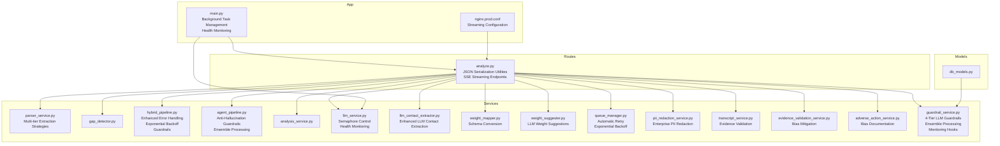

**Diagram sources**
- [analyze.py:669-868](file://app/backend/routes/analyze.py#L669-L868)
- [parser_service.py:343-492](file://app/backend/services/parser_service.py#L343-L492)
- [llm_contact_extractor.py:23-164](file://app/backend/services/llm_contact_extractor.py#L23-L164)
- [weight_mapper.py:20-360](file://app/backend/services/weight_mapper.py#L20-L360)
- [weight_suggester.py:86-177](file://app/backend/services/weight_suggester.py#L86-L177)
- [queue_manager.py:1-200](file://app/backend/services/queue_manager.py#L1-200)
- [nginx.prod.conf:73-98](file://app/nginx/nginx.prod.conf#L73-L98)
- [pii_redaction_service.py:1-233](file://app/backend/services/pii_redaction_service.py#L1-L233)
- [transcript_service.py:330-374](file://app/backend/services/transcript_service.py#L330-L374)
- [evidence_validation_service.py:1-200](file://app/backend/services/evidence_validation_service.py#L1-L200)
- [adverse_action_service.py:71-102](file://app/backend/services/adverse_action_service.py#L71-L102)
- [guardrail_service.py:1-1128](file://app/backend/services/guardrail_service.py#L1-1128)

**Section sources**
- [README.md:273-333](file://README.md#L273-L333)
- [main.py:174-215](file://app/backend/main.py#L174-L215)

## Core Components
- Hybrid Pipeline: Python-first deterministic scoring (skills, education, experience/timeline, domain/architecture) followed by a single LLM call for narrative synthesis and interview questions with enhanced error handling, anti-hallucination guardrails, and deterministic behavior.
- LangGraph Agent Pipeline: Multi-agent, multi-stage workflow with structured nodes for JD parsing, combined resume analysis, and scoring with explainability, cross-node consistency checks, and comprehensive guardrail integration.
- Guardrail Service: 4-tier LLM safety framework providing retry mechanisms, schema validation, cross-node consistency, prompt injection detection, 3x voting ensemble, HITL gates, token budget management, and monitoring hooks.
- Enhanced Resume Parser: Robust text extraction from PDF and DOCX with multi-tier fallbacks, deduplication, and normalization.
- Gap Detector: Mechanical date parsing and interval merging to compute objective timeline metrics.
- Skills Registry: Dynamic, DB-backed registry with in-memory flashtext processor and hot reload capability.
- LLM Integration: Ollama-backed ChatOllama clients with singletons, timeouts, JSON parsing utilities, comprehensive error handling, and health monitoring.
- Intelligent Contact Extraction: LLM-powered contact information extraction with merging strategy for accuracy.
- Scoring and Risk: Weighted fit score computation, risk signals, and recommendation logic with intelligent weight mapping.
- Persistence: SQLAlchemy models for candidates, screening results, role templates, usage logs, and caches.
- **Enhanced AI Pipeline**: Sophisticated score rationales and structured risk analysis with detailed explanations.
- **AI-Enhanced Narratives**: Distinction system between LLM-generated and fallback narratives using `ai_enhanced` flag.
- **Enhanced Error Handling**: Comprehensive retry mechanisms with exponential backoff for rate limiting and connection failures.
- **Resource Management**: Semaphore-based concurrency control and health monitoring for external LLM services.
- **Anti-Hallucination Guardrails**: Cache versioning, circuit breaker monitoring, and deterministic behavior enforcement.
- **PII Redaction**: Enterprise-grade PII detection and anonymization with regex fallback capabilities.
- **Evidence Validation**: Comprehensive validation of LLM claims against transcript evidence to prevent hallucinations.

**Section sources**
- [hybrid_pipeline.py:1-1498](file://app/backend/services/hybrid_pipeline.py#L1-L1498)
- [agent_pipeline.py:1-1138](file://app/backend/services/agent_pipeline.py#L1-L1138)
- [guardrail_service.py:1-1128](file://app/backend/services/guardrail_service.py#L1-L1128)
- [parser_service.py:1-552](file://app/backend/services/parser_service.py#L1-L552)
- [gap_detector.py:1-219](file://app/backend/services/gap_detector.py#L1-L219)
- [llm_service.py:1-332](file://app/backend/services/llm_service.py#L1-L332)
- [llm_contact_extractor.py:23-164](file://app/backend/services/llm_contact_extractor.py#L23-L164)
- [weight_mapper.py:20-360](file://app/backend/services/weight_mapper.py#L20-L360)
- [weight_suggester.py:86-177](file://app/backend/services/weight_suggester.py#L86-L177)
- [db_models.py:97-250](file://app/backend/models/db_models.py#L97-L250)
- [queue_manager.py:1-200](file://app/backend/services/queue_manager.py#L1-L200)
- [pii_redaction_service.py:1-233](file://app/backend/services/pii_redaction_service.py#L1-L233)
- [transcript_service.py:330-374](file://app/backend/services/transcript_service.py#L330-L374)
- [evidence_validation_service.py:1-200](file://app/backend/services/evidence_validation_service.py#L1-L200)

## Architecture Overview
The system uses a hybrid approach with comprehensive guardrail integration and enhanced error handling:
- Phase 1 (Python, ~1–2s): parse_jd_rules → parse_resume_rules → match_skills_rules → score_education/experience/domain → compute_fit_score → generate score rationales and risk summary
- Phase 2 (LLM, ~40s): explain_with_llm (generates strengths, weaknesses, rationale, interview questions) with exponential backoff retry for rate limiting and anti-hallucination guardrails
- Fallback: deterministic narrative when LLM is unavailable or times out
- Background Processing: LLM narrative generated as background task with graceful shutdown handling
- Bias Mitigation: PII redaction and evidence validation throughout the pipeline
- **Guardrail Integration**: 4-tier safety framework with retry mechanisms, schema validation, cross-node consistency, and ensemble processing

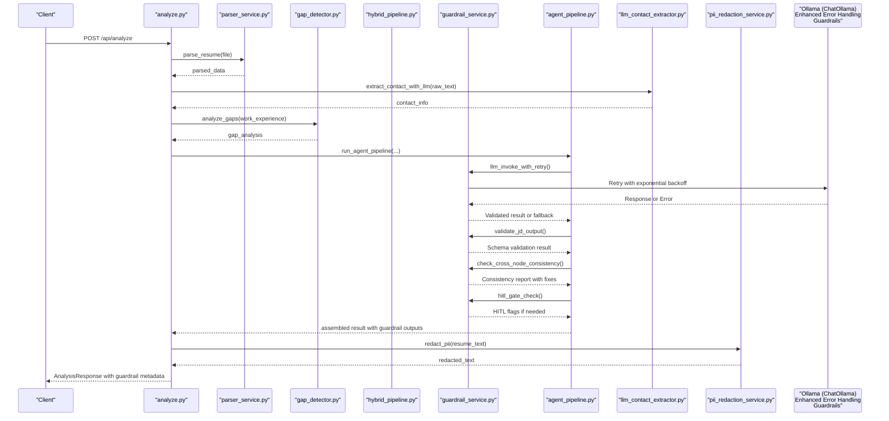

**Diagram sources**
- [analyze.py:268-318](file://app/backend/routes/analyze.py#L268-L318)
- [agent_pipeline.py:1110-1138](file://app/backend/services/agent_pipeline.py#L1110-L1138)
- [guardrail_service.py:130-168](file://app/backend/services/guardrail_service.py#L130-168)
- [guardrail_service.py:180-214](file://app/backend/services/guardrail_service.py#L180-214)
- [guardrail_service.py:299-371](file://app/backend/services/guardrail_service.py#L299-371)
- [guardrail_service.py:684-752](file://app/backend/services/guardrail_service.py#L684-752)
- [parser_service.py:547-552](file://app/backend/services/parser_service.py#L547-L552)
- [gap_detector.py:217-219](file://app/backend/services/gap_detector.py#L217-L219)
- [llm_contact_extractor.py:23-164](file://app/backend/services/llm_contact_extractor.py#L23-L164)
- [pii_redaction_service.py:53-66](file://app/backend/services/pii_redaction_service.py#L53-L66)

## Detailed Component Analysis

### Hybrid Pipeline
The hybrid pipeline executes deterministic Python logic first, then a single LLM call for narrative with enhanced error handling and anti-hallucination guardrails. It includes:
- Skills registry with canonical skills, aliases, and domain mapping
- JD parsing rules extracting role, domain, seniority, required/nice-to-have skills, and responsibilities
- Resume profile builder combining parser output and gap analysis
- Skill matching with normalization, alias expansion, substring matching, and fuzzy fallback
- Education scoring with degree and field relevance multipliers
- Experience and timeline scoring with gap severity deductions
- Domain and architecture scoring based on keyword hits
- Fit score computation with configurable weights and risk penalties
- LLM narrative generation with robust JSON parsing, fallback, and comprehensive error handling
- **Enhanced**: Score rationales for each dimension and structured risk summary
- **Optimized**: gemma4:31b-cloud model with intelligent token limits for improved performance
- **Robust**: Exponential backoff retry mechanisms for rate limiting and connection failures
- **Guardrails**: Prompt injection sanitization, cache versioning, and deterministic behavior enforcement

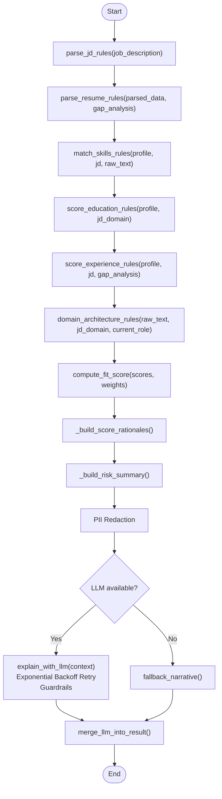

**Diagram sources**
- [hybrid_pipeline.py:1262-1407](file://app/backend/services/hybrid_pipeline.py#L1262-L1407)
- [hybrid_pipeline.py:1074-1256](file://app/backend/services/hybrid_pipeline.py#L1074-L1256)
- [pii_redaction_service.py:53-66](file://app/backend/services/pii_redaction_service.py#L53-L66)

**Section sources**
- [hybrid_pipeline.py:1-1498](file://app/backend/services/hybrid_pipeline.py#L1-L1498)

### LangGraph Agent Pipeline
The LangGraph-based agent pipeline defines a 3-stage workflow with comprehensive guardrail integration:
- Stage 1 (parallel): jd_parser with cache versioning, circuit breaker monitoring, and ensemble processing
- Stage 2 (parallel): resume_analyser (combines skill/domain/edu/timeline) with schema validation and PII redaction
- Stage 3 (parallel): scorer (combined scoring and interview questions) with cross-node consistency checks and HITL gates

It uses:
- Two LLM singletons (fast and reasoning) with keep-alive sessions
- JSON parsing helper with fallback extraction
- In-memory JD cache keyed by MD5 of first 2000 characters with prompt versioning
- Streamable nodes emitting SSE events
- Fallback per node returning typed-null defaults on failures
- **Guardrails**: Retry mechanisms, schema validation, cross-node consistency, and comprehensive monitoring

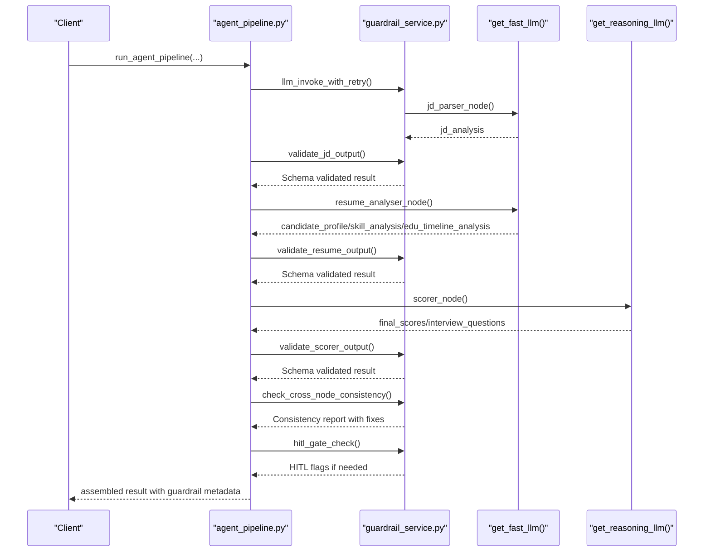

**Diagram sources**
- [agent_pipeline.py:520-541](file://app/backend/services/agent_pipeline.py#L520-L541)
- [agent_pipeline.py:161-180](file://app/backend/services/agent_pipeline.py#L161-L180)
- [agent_pipeline.py:280-322](file://app/backend/services/agent_pipeline.py#L280-L322)
- [agent_pipeline.py:367-448](file://app/backend/services/agent_pipeline.py#L367-L448)
- [guardrail_service.py:130-168](file://app/backend/services/guardrail_service.py#L130-168)
- [guardrail_service.py:180-214](file://app/backend/services/guardrail_service.py#L180-214)
- [guardrail_service.py:299-371](file://app/backend/services/guardrail_service.py#L299-371)
- [guardrail_service.py:684-752](file://app/backend/services/guardrail_service.py#L684-752)

**Section sources**
- [agent_pipeline.py:1-1138](file://app/backend/services/agent_pipeline.py#L1-L1138)

### Guardrail Service Integration
The guardrail service provides comprehensive 4-tier LLM safety framework:
- **Tier 1: Reliability** - Retry with exponential backoff, strict schema validation, and consistency checks
- **Tier 2: Security** - Prompt injection detection, timeout enforcement, and 3x voting ensemble
- **Tier 3: Governance** - HITL gates, A/B testing, and adversarial harness
- **Tier 4: Operations** - Token budgets, data retention, and monitoring hooks

Key features include:
- **Retry Mechanisms**: Configurable exponential backoff with per-call timeouts and jitter
- **Schema Validation**: Pydantic-based validation with automatic coercion to safe defaults
- **Cross-Node Consistency**: Automated detection and correction of inconsistencies between pipeline stages
- **Prompt Injection Detection**: Comprehensive pattern matching and sanitization
- **3x Voting Ensemble**: Seed-based reproducible ensemble processing for critical nodes
- **HITL Gates**: Human-in-the-loop flags for low-confidence results
- **Monitoring Hooks**: Structured event emission with Prometheus metrics integration

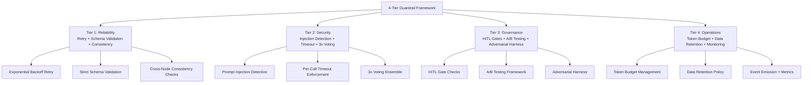

**Diagram sources**
- [guardrail_service.py:1-12](file://app/backend/services/guardrail_service.py#L1-L12)
- [guardrail_service.py:128-168](file://app/backend/services/guardrail_service.py#L128-L168)
- [guardrail_service.py:171-287](file://app/backend/services/guardrail_service.py#L171-L287)
- [guardrail_service.py:290-371](file://app/backend/services/guardrail_service.py#L290-L371)
- [guardrail_service.py:398-496](file://app/backend/services/guardrail_service.py#L398-L496)
- [guardrail_service.py:499-672](file://app/backend/services/guardrail_service.py#L499-L672)
- [guardrail_service.py:675-752](file://app/backend/services/guardrail_service.py#L675-L752)
- [guardrail_service.py:941-1062](file://app/backend/services/guardrail_service.py#L941-L1062)
- [guardrail_service.py:1065-1121](file://app/backend/services/guardrail_service.py#L1065-L1121)

**Section sources**
- [guardrail_service.py:1-1128](file://app/backend/services/guardrail_service.py#L1-L1128)

### Enhanced Parser Service
The enhanced parser supports:
- PDF: PyMuPDF primary, pdfplumber fallback with table extraction; scanned PDF guard
- DOCX: Multi-stage extraction with headers, textboxes, tables, paragraphs, and XML fallback
- DOC/RTF/HTML/ODT/TXT: Best-effort extraction with Unicode normalization and deduplication
- Advanced contact extraction with LLM-powered merging strategy
- Resume parsing: work experience, skills, education, contact info with enrichment

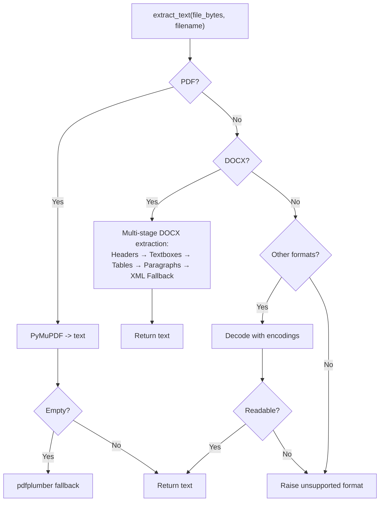

**Diagram sources**
- [parser_service.py:240-313](file://app/backend/services/parser_service.py#L240-L313)
- [parser_service.py:343-492](file://app/backend/services/parser_service.py#L343-L492)
- [parser_service.py:542-737](file://app/backend/services/parser_service.py#L542-L737)

**Section sources**
- [parser_service.py:1-552](file://app/backend/services/parser_service.py#L1-L552)

### Employment Gap Detection Algorithm
The gap detector performs:
- Date normalization to YYYY-MM with flexible parsing and fallback
- Overlap-aware total experience via interval merging
- Objective gap severity classification (threshold-based)
- Structured timeline with gap metadata for downstream LLM consumption

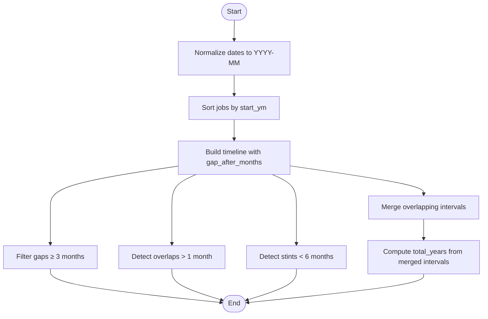

**Diagram sources**
- [gap_detector.py:103-219](file://app/backend/services/gap_detector.py#L103-L219)

**Section sources**
- [gap_detector.py:1-219](file://app/backend/services/gap_detector.py#L1-L219)

### Skills Registry System
The skills registry:
- Seeds canonical skills and aliases into the DB
- Loads active skills into an in-memory flashtext processor
- Provides hot-reload capability and fallback to hardcoded list
- Maps skills to domains for seeding and matching

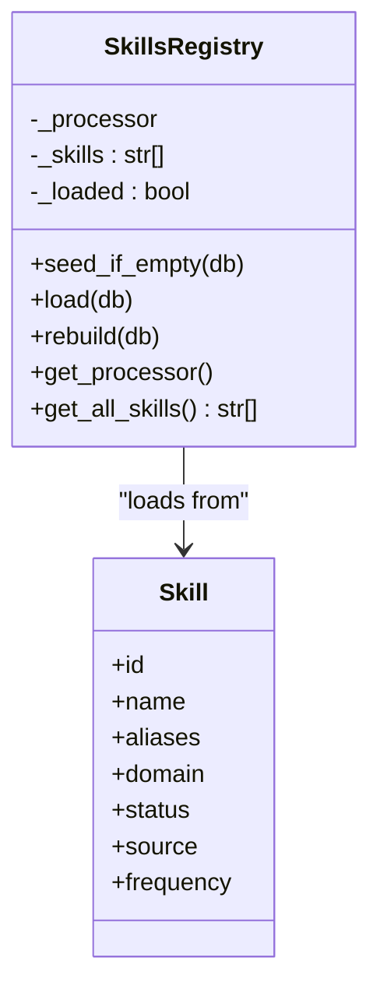

**Diagram sources**
- [hybrid_pipeline.py:323-426](file://app/backend/services/hybrid_pipeline.py#L323-L426)
- [db_models.py:238-250](file://app/backend/models/db_models.py#L238-L250)

**Section sources**
- [hybrid_pipeline.py:70-426](file://app/backend/services/hybrid_pipeline.py#L70-L426)
- [db_models.py:227-250](file://app/backend/models/db_models.py#L227-L250)

### LLM Service Integration with Ollama
Integration points:
- ChatOllama singletons for fast and reasoning models
- Environment configuration for base URL, model, and context sizes
- JSON parsing utilities tolerant of fenced code blocks and partial JSON
- Fallback responses on errors and timeouts
- Health and diagnostics endpoints for model readiness
- **Enhanced**: Semaphore-based concurrency control with auto-detection for cloud vs local
- **Robust**: Comprehensive error handling with exponential backoff for rate limiting
- **Guardrails**: Prompt injection sanitization and deterministic behavior enforcement

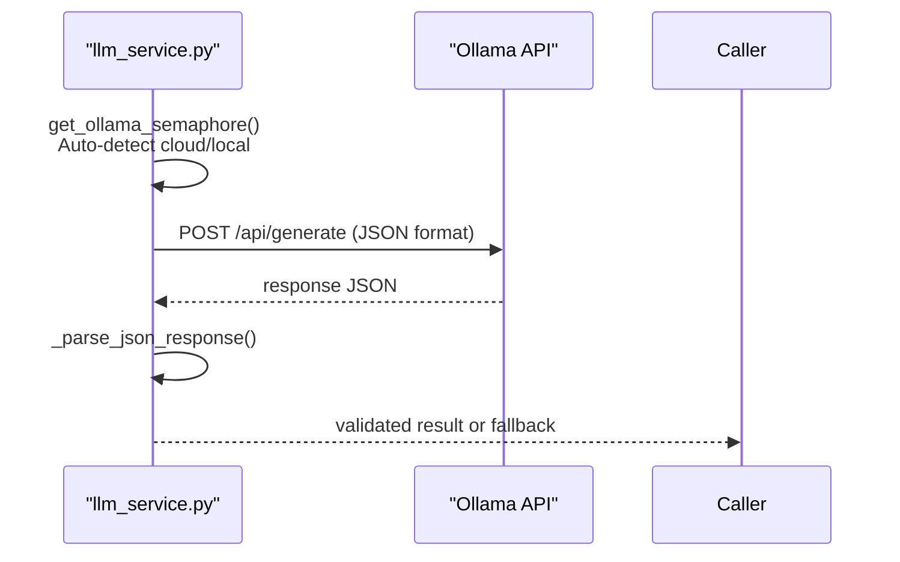

**Diagram sources**
- [llm_service.py:43-104](file://app/backend/services/llm_service.py#L43-L104)
- [main.py:262-327](file://app/backend/main.py#L262-L327)

**Section sources**
- [llm_service.py:1-156](file://app/backend/services/llm_service.py#L1-L156)
- [main.py:104-149](file://app/backend/main.py#L104-L149)

### Scoring Algorithms, Recommendation Logic, and Risk Assessment
Scoring and risk:
- Weighted fit score across skill, experience, architecture, education, timeline, domain, and risk
- Risk signals derived deterministically from gaps, short stints, domain mismatch, and overqualification
- Recommendation thresholds (Shortlist ≥ 72, Consider [45–71], Reject < 45)
- Timeline severity penalties and architecture signal bonuses

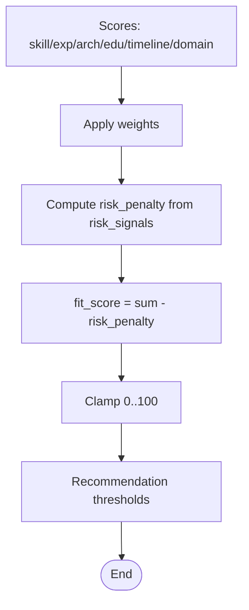

**Diagram sources**
- [hybrid_pipeline.py:964-1058](file://app/backend/services/hybrid_pipeline.py#L964-L1058)

**Section sources**
- [hybrid_pipeline.py:953-1058](file://app/backend/services/hybrid_pipeline.py#L953-L1058)

### Route Orchestration and Streaming
The analyze route:
- Validates file types and sizes, resolves JD from text or file
- Parses resumes in thread pool to avoid blocking
- Runs hybrid pipeline and persists results
- Supports SSE streaming with heartbeat pings
- Implements candidate deduplication and profile storage
- **Enhanced JSON serialization**: Comprehensive datetime, date, and Decimal handling

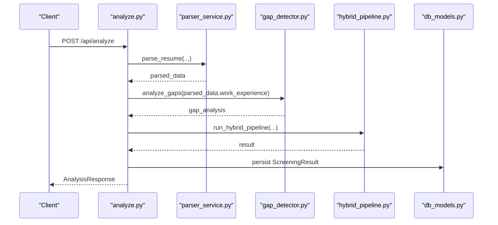

**Diagram sources**
- [analyze.py:268-501](file://app/backend/routes/analyze.py#L268-L501)

**Section sources**
- [analyze.py:1-813](file://app/backend/routes/analyze.py#L1-L813)

## Enhanced AI Pipeline Capabilities

**Updated** The analysis engine now features sophisticated score rationales and comprehensive risk analysis capabilities that provide detailed explanations for each score dimension and structured risk summaries, enhanced by comprehensive guardrail integration.

### Score Rationale Generation

The system generates detailed explanations for each score dimension:

- **Skill Rationale**: Explains the strength of skill matches, missing critical skills, and adjacent skills
- **Experience Rationale**: Details experience calculation methodology and required vs actual years
- **Education Rationale**: Describes degree relevance and field alignment scoring
- **Timeline Rationale**: Provides employment gap analysis and timeline interpretation
- **Domain Rationale**: Explains domain fit and architecture alignment assessment
- **Overall Rationale**: Synthesizes all factors into a comprehensive recommendation explanation

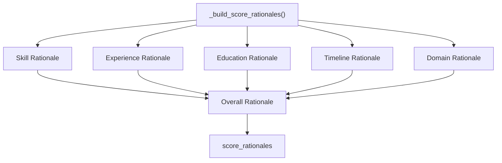

**Diagram sources**
- [hybrid_pipeline.py:1480-1525](file://app/backend/services/hybrid_pipeline.py#L1480-L1525)

**Section sources**
- [hybrid_pipeline.py:1480-1525](file://app/backend/services/hybrid_pipeline.py#L1480-L1525)

### Structured Risk Summary

The risk summary provides comprehensive risk assessment:

- **Seniority Alignment**: Compares actual experience against required seniority level with specific ranges
- **Career Trajectory**: Analyzes upward progression, early career patterns, and single-role candidates
- **Stability Assessment**: Evaluates employment stability based on gaps, short stints, and job-hopping patterns
- **Risk Flags**: Converts risk signals into user-friendly format with severity levels

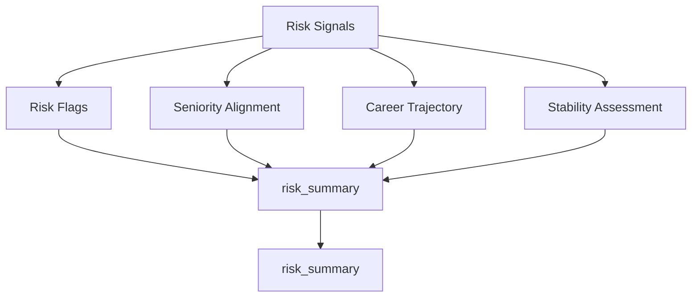

**Diagram sources**
- [hybrid_pipeline.py:1528-1600](file://app/backend/services/hybrid_pipeline.py#L1528-L1600)

**Section sources**
- [hybrid_pipeline.py:1528-1600](file://app/backend/services/hybrid_pipeline.py#L1528-L1600)

**Section sources**
- [hybrid_pipeline.py:1528-1600](file://app/backend/services/hybrid_pipeline.py#L1528-L1600)

## Intelligent Scoring Weights System

**Updated** The analysis engine now features a comprehensive intelligent scoring weights system that supports multiple weight schemas and provides automatic conversion between legacy and new formats.

### Weight Schema Support

The system supports three distinct weight schemas:

- **Legacy Schema (4 weights)**: skills, experience, stability, education
- **Old Backend Schema (7 weights)**: skills, experience, architecture, education, timeline, domain, risk
- **New Universal Schema (7 weights)**: core_competencies, experience, domain_fit, education, career_trajectory, role_excellence, risk

### Weight Mapping and Conversion

The weight mapper provides intelligent conversion between schemas:

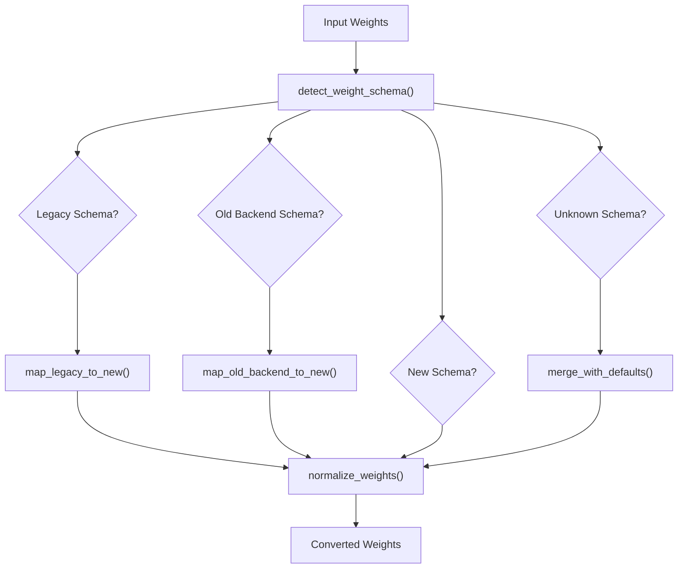

**Diagram sources**
- [weight_mapper.py:179-246](file://app/backend/services/weight_mapper.py#L179-L246)

### Weight Suggestion System

The LLM-based weight suggestion system analyzes job descriptions to provide optimal weight recommendations:

- **Role Category Detection**: Automatically identifies role categories (technical, sales, hr, marketing, operations, leadership)
- **Seniority Level Analysis**: Determines appropriate seniority levels for weight balancing
- **Context-Aware Recommendations**: Provides role-specific weight distributions with confidence scores
- **Adaptive Labels**: Generates role-specific labels for the role_excellence factor

**Section sources**
- [weight_mapper.py:20-360](file://app/backend/services/weight_mapper.py#L20-L360)
- [weight_suggester.py:86-177](file://app/backend/services/weight_suggester.py#L86-L177)

## Advanced Contact Extraction

**Updated** The analysis engine now features an intelligent contact extraction system that combines multiple extraction strategies for maximum accuracy with enhanced LLM contact extraction capabilities.

### Multi-Strategy Contact Extraction

The contact extraction system employs a tiered approach:

1. **LLM-Powered Extraction**: Uses gemma4:31b-cloud model for complex name formats and international names
2. **Regex-Based Extraction**: Traditional pattern matching for emails, phones, and LinkedIn URLs
3. **Fallback Strategies**: NER, email-based, relaxed header scanning, and filename-based extraction

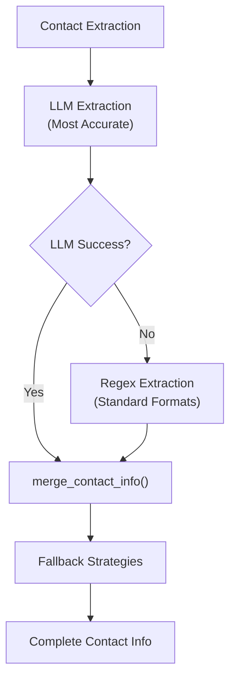

**Diagram sources**
- [llm_contact_extractor.py:23-164](file://app/backend/services/llm_contact_extractor.py#L23-L164)
- [parser_service.py:1080-1126](file://app/backend/services/parser_service.py#L1080-L1126)

### Enhanced LLM Contact Extraction Strategy

The LLM extraction prioritizes accuracy over speed with conservative extraction principles:

- **Header Focus**: Uses first 1000 characters containing contact information
- **Structured JSON Output**: Forces LLM to return valid JSON with name, email, phone, linkedin fields
- **Conservative Extraction Principles**: Strict validation rules to prevent false positives
- **Enhanced Logging**: Comprehensive debug information for troubleshooting
- **Improved JSON Validation**: Robust parsing with markdown code block support
- **Edge Case Handling**: Handles international names, creative layouts, and non-standard formats
- **Timeout Management**: 15-second timeout to prevent blocking

**Section sources**
- [llm_contact_extractor.py:23-164](file://app/backend/services/llm_contact_extractor.py#L23-L164)
- [parser_service.py:1080-1126](file://app/backend/services/parser_service.py#L1080-L1126)

## Enhanced Parser Service

**Updated** The parser service now features advanced multi-tier extraction strategies specifically designed for DOCX files and improved text recovery mechanisms.

### Multi-Tier DOCX Extraction Pipeline

The enhanced DOCX extraction uses a five-stage pipeline:

1. **Stage 1: Headers** - Extracts contact info from document headers
2. **Stage 2: Textboxes/Shapes** - Uses docx2txt for complex layouts
3. **Stage 3: Tables** - Extracts structured data from tables (common for contact info)
4. **Stage 4: Paragraphs** - Standard paragraph extraction
5. **Stage 5: XML Fallback** - Direct XML parsing for corrupted files

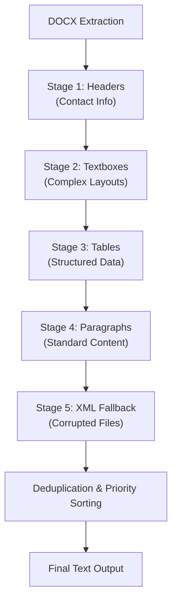

**Diagram sources**
- [parser_service.py:343-492](file://app/backend/services/parser_service.py#L343-L492)

### Advanced Text Recovery and Deduplication

The parser implements sophisticated text recovery mechanisms:

- **Duplicate Detection**: Uses normalized text comparison to eliminate repeated content
- **Source Priority**: Prioritizes content from headers, textboxes, tables, then paragraphs
- **Line-by-Line Processing**: Processes text in lines to maintain readability
- **Fallback Chains**: Multiple fallback strategies for different failure modes

**Section sources**
- [parser_service.py:343-492](file://app/backend/services/parser_service.py#L343-L492)
- [parser_service.py:542-737](file://app/backend/services/parser_service.py#L542-L737)

## Streaming Endpoint Integration

**Updated** The analysis engine now features enhanced SSE streaming with heartbeat pings and background LLM processing for improved user experience.

### SSE Streaming Architecture

The streaming endpoint provides real-time analysis updates:

1. **Immediate Python Results**: Yields parsing stage with Python scores within 2 seconds
2. **Background LLM Processing**: Continues LLM analysis while streaming
3. **Heartbeat Pings**: Prevents timeouts with periodic SSE comments
4. **Polling Support**: Provides analysis_id for frontend polling after initial streaming

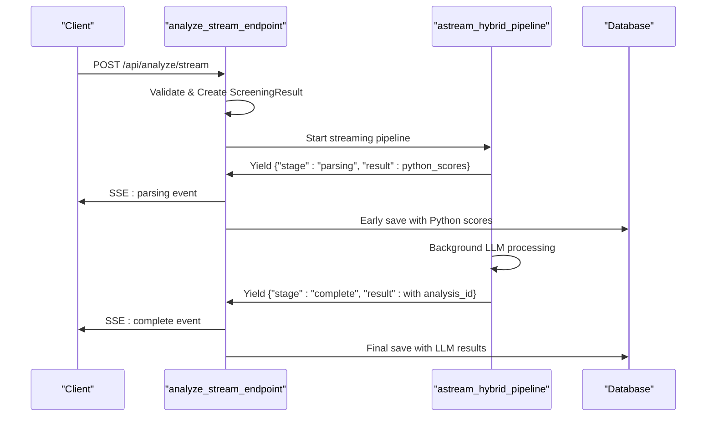

**Diagram sources**
- [analyze.py:669-868](file://app/backend/routes/analyze.py#L669-L868)
- [hybrid_pipeline.py:2190-2284](file://app/backend/services/hybrid_pipeline.py#L2190-L2284)

### Streaming Configuration

The nginx configuration ensures proper streaming behavior:

- **Buffering Disabled**: `proxy_buffering off` prevents SSE event buffering
- **Timeout Extensions**: 600-second timeout for full LLM pipeline completion
- **Connection Handling**: `add_header X-Accel-Buffering no` for immediate delivery
- **Rate Limiting**: Separate limits for streaming vs regular API endpoints

**Section sources**
- [analyze.py:669-868](file://app/backend/routes/analyze.py#L669-L868)
- [hybrid_pipeline.py:2190-2284](file://app/backend/services/hybrid_pipeline.py#L2190-L2284)
- [nginx.prod.conf:73-98](file://app/nginx/nginx.prod.conf#L73-L98)

## Structured Risk Analysis

**Updated** The enhanced risk analysis system provides comprehensive risk assessment with structured summaries and detailed explanations, enhanced by guardrail integration.

### Risk Flag System

Risk flags are systematically generated from risk signals:

- **Type Normalization**: Converts internal risk types to user-friendly formats
- **Severity Classification**: Categorizes risks as low, medium, or high severity
- **Detail Description**: Provides specific explanations for each flagged risk
- **Comprehensive Coverage**: Includes gaps, skill mismatches, domain alignment, and stability issues

### Seniority Alignment Assessment

The system evaluates seniority fit using predefined experience ranges:

- **Intern**: 0-1 years
- **Junior**: 0-2 years  
- **Mid**: 2-5 years
- **Senior**: 5-10 years
- **Lead**: 7-15 years
- **Principal**: 10-25 years
- **Staff**: 8-20 years
- **Architect**: 10-25 years
- **Director**: 12-30 years

### Career Trajectory Analysis

Career progression is assessed through role title analysis:

- **Strong Upward**: Progression from junior to senior roles
- **Upward**: Current senior role or multiple positions
- **Early Career**: Single role or limited positions
- **Data-Driven**: Heuristic analysis of title keywords

### Stability Assessment

Employment stability is evaluated based on:

- **Critical Gaps**: 12+ month gaps indicating instability
- **Job-Hopping**: 3+ short stints (<6 months) suggesting instability
- **Moderate Concerns**: Single gaps or short stints
- **Stable**: No significant gaps or short stints detected

**Section sources**
- [hybrid_pipeline.py:1528-1600](file://app/backend/services/hybrid_pipeline.py#L1528-L1600)

## Model Configuration and Performance

**Updated** The analysis engine uses optimized model configurations for enhanced performance and reliability, with intelligent migration to gemma4:31b-cloud model across all services.

### Model Specifications

The system utilizes gemma4:31b-cloud model with optimized settings:

- **Model**: gemma4:31b-cloud (31 billion parameters) for all services
- **Temperature**: 0.1 for deterministic responses
- **Format**: JSON for structured output
- **num_predict**: 4096 tokens for cloud models (optimized for verbose output)
- **num_ctx**: 16384 context window for cloud models, 2048 for local models
- **keep_alive**: -1 for model persistence in RAM (local only)
- **Request Timeout**: 150 seconds (150s + 30s buffer)

### Cloud Model Optimization

**Enhanced** The system now includes intelligent model configuration based on deployment environment:

- **Cloud Detection**: Automatically detects Ollama Cloud (ollama.com) vs local deployment
- **Token Limits**: Cloud models receive 4096 tokens for num_predict to handle verbose output from large models
- **Context Windows**: Cloud models use 16384 context window for complex reasoning tasks
- **Authentication**: Automatic API key handling for Ollama Cloud with Authorization headers
- **Performance**: Maintains 2048 token limit for local models to optimize memory usage

### Performance Characteristics

- **Cold Start**: ~2 minutes for first load on CPU
- **Subsequent Requests**: 30-60 seconds typical
- **Concurrent Limit**: 2 LLM calls per worker
- **Memory Management**: Keep-alive sessions reduce cold-start latency
- **Prompt Optimization**: Reduced num_predict (2048) for local models minimizes KV cache allocation
- **Cloud Optimization**: 4096 token limit for cloud models handles verbose output from large models efficiently

### Environment Configuration

Key environment variables:

- **OLLAMA_BASE_URL**: Default localhost:11434 or https://ollama.com for cloud
- **OLLAMA_MODEL**: gemma4:31b-cloud (narrative model) for all services
- **OLLAMA_FAST_MODEL**: gemma4:31b-cloud (fast model) for all services
- **LLM_NARRATIVE_TIMEOUT**: 150 seconds default
- **OLLAMA_API_KEY**: Required for Ollama Cloud authentication
- **OLLAMA_HOST**: docker host for containerized deployments
- **OLLAMA_MAX_CONCURRENT**: Maximum concurrent LLM requests (auto-detected)
- **LLM_MAX_RETRIES**: Maximum retry attempts for LLM calls (default: 3)
- **GUARDRAIL_MAX_RETRIES**: Maximum retry attempts for guardrail operations (default: 3)
- **GUARDRAIL_RETRY_DELAY**: Base delay for exponential backoff (default: 2.0 seconds)
- **GUARDRAIL_PER_CALL_TIMEOUT**: Per-call timeout for LLM operations (default: 90.0 seconds)

**Section sources**
- [hybrid_pipeline.py:82-107](file://app/backend/services/hybrid_pipeline.py#L82-L107)
- [main.py:266-331](file://app/backend/main.py#L266-L331)

## Enhanced JSON Serialization Capabilities

**Updated** The analysis engine now features comprehensive JSON serialization capabilities designed to handle datetime objects, dates, and Decimal values consistently across all components. This enhancement significantly improves system stability and prevents production crashes when serializing complex analysis results.

### Core JSON Serialization Utilities

The system implements a unified `_json_default` function across multiple modules to handle non-serializable types:

```python
def _json_default(obj):
    """Handle non-serializable types for json.dumps (datetime, date, Decimal)."""
    if isinstance(obj, (datetime, date)):
        return obj.isoformat()
    if isinstance(obj, Decimal):
        return float(obj)
    raise TypeError(f"Object of type {type(obj).__name__} is not JSON serializable")
```

### Key Implementation Areas

#### Route-Level Serialization
The analyze route implements comprehensive JSON serialization for:
- JD caching with datetime handling
- Candidate profile storage with mixed data types
- Screening result persistence
- SSE streaming with proper serialization

#### Agent Pipeline Serialization
The LangGraph agent pipeline includes:
- Custom `_json_default` function for consistent serialization
- Support for datetime and Decimal types in pipeline states
- JSON parsing helpers with fallback extraction

#### Guardrail Service Serialization
The guardrail service implements:
- Structured event emission with JSON serialization
- Consistent logging format across all guardrail tiers
- Prometheus metrics integration with proper serialization

#### Service-Level Serialization
Various services implement JSON serialization for:
- Parser snapshot storage
- Gap analysis persistence
- LLM response handling
- Analysis result caching

### Benefits and Stability Improvements

The enhanced JSON serialization provides several critical benefits:

- **Production Stability**: Eliminates crashes when serializing complex analysis results containing datetime, date, or Decimal objects
- **Consistent Data Handling**: Unified approach ensures all components handle non-standard JSON types uniformly
- **Database Compatibility**: Proper conversion of datetime objects to ISO format strings for database storage
- **Decimal Precision**: Safe conversion of Decimal values to float for JSON compatibility while maintaining precision
- **Error Prevention**: Comprehensive type checking prevents runtime errors during serialization operations

### Error Handling and Fallback Mechanisms

The system includes robust error handling:
- Type-specific serialization with appropriate fallbacks
- Graceful degradation when encountering unexpected object types
- Comprehensive logging for serialization failures
- Automatic recovery mechanisms for partial serialization failures

**Section sources**
- [analyze.py:48-56](file://app/backend/routes/analyze.py#L48-L56)
- [agent_pipeline.py:39-45](file://app/backend/services/agent_pipeline.py#L39-L45)
- [guardrail_service.py:1077-1090](file://app/backend/services/guardrail_service.py#L1077-L1090)
- [hybrid_pipeline.py:16](file://app/backend/services/hybrid_pipeline.py#L16)

## Enhanced Error Handling and Retry Systems

**Updated** The analysis engine now features comprehensive error handling and retry mechanisms with exponential backoff support for enhanced reliability and fault tolerance, integrated with the guardrail service framework.

### Exponential Backoff Retry Mechanism

The hybrid pipeline implements sophisticated retry logic for LLM calls:

- **Rate Limiting (429)**: Automatic exponential backoff with base delay of 2 seconds
- **Connection Errors**: Retry with progressive delays for network connectivity issues
- **Timeout Handling**: Graceful degradation with fallback mechanisms
- **Authentication Failures**: Clear error messaging for invalid API keys
- **Server Errors**: Retry logic for temporary server failures (5xx)

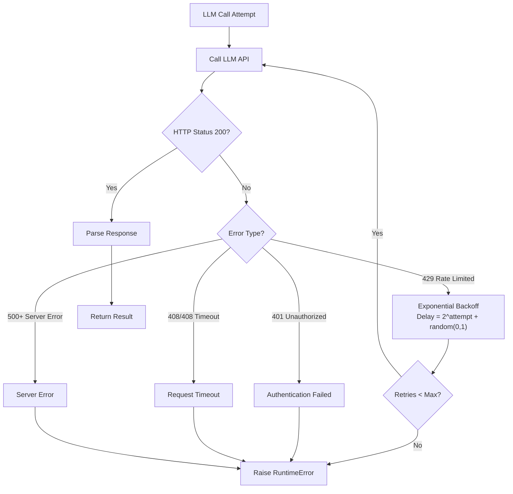

**Diagram sources**
- [hybrid_pipeline.py:1369-1400](file://app/backend/services/hybrid_pipeline.py#L1369-L1400)

### Guardrail Service Retry Integration

The guardrail service provides enhanced retry mechanisms:

- **Configurable Parameters**: MAX_LLM_RETRIES, LLM_RETRY_BASE_DELAY, LLM_PER_CALL_TIMEOUT
- **Seed-Based Reproducibility**: 3x voting ensemble with fixed seeds for consistent results
- **Structured Error Handling**: Comprehensive logging and event emission for all retry attempts
- **Timeout Enforcement**: Per-call timeout to prevent resource exhaustion

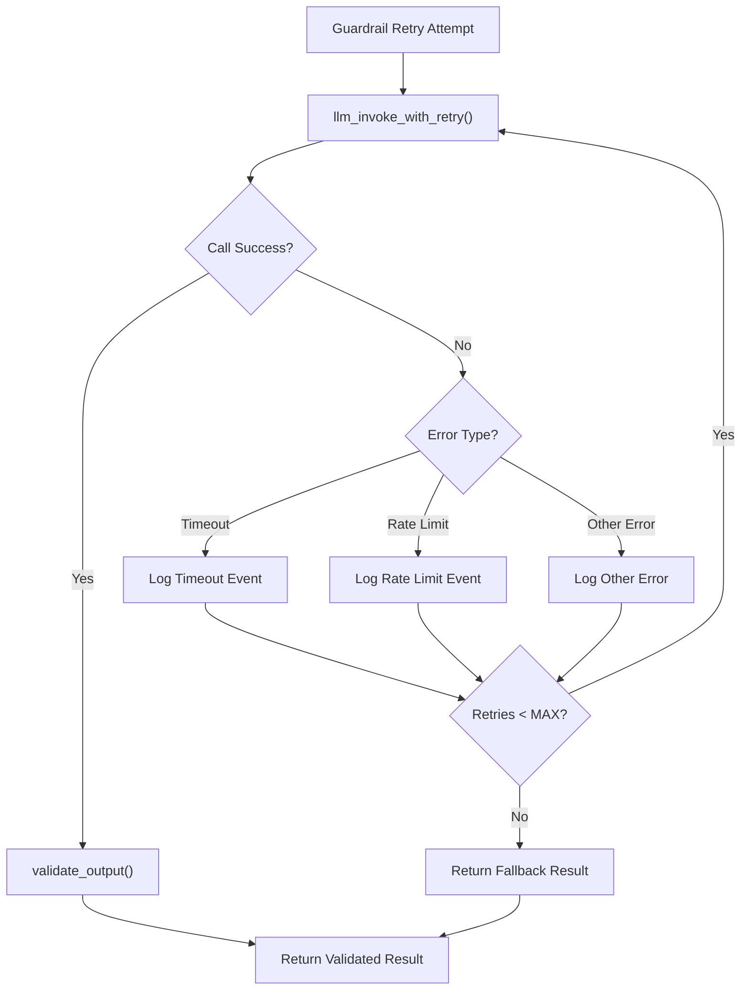

**Diagram sources**
- [guardrail_service.py:130-168](file://app/backend/services/guardrail_service.py#L130-168)
- [guardrail_service.py:180-214](file://app/backend/services/guardrail_service.py#L180-214)

### Retry Configuration

- **Maximum Retries**: Configurable via `GUARDRAIL_MAX_RETRIES` environment variable (default: 3)
- **Base Delay**: 2.0 seconds for exponential backoff calculation
- **Randomization**: ±1 second jitter to prevent thundering herd effects
- **Progressive Delays**: 2s, 6s, 14s, 30s, 62s (exponential with jitter)
- **Fallback Mechanism**: Higher temperature (0.3) retry for edge cases with empty responses

### Queue System Retry Integration

The queue manager provides complementary retry mechanisms:

- **Automatic Retry**: Configurable exponential backoff delays (1min, 5min, 15min)
- **Max Retries**: Configurable retry limits per job
- **Stale Job Recovery**: Automatic recovery of abandoned jobs
- **Heartbeat Monitoring**: Worker health monitoring and recovery
- **Failure Metrics**: Comprehensive error tracking and reporting

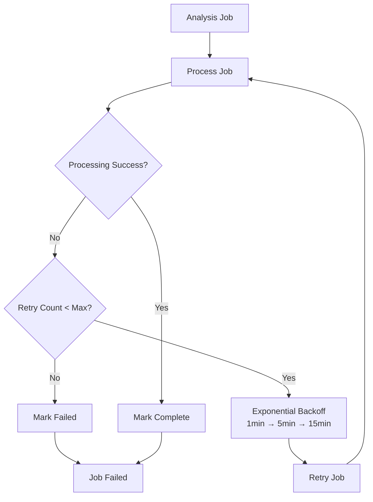

**Diagram sources**
- [queue_manager.py:456-478](file://app/backend/services/queue_manager.py#L456-L478)

**Section sources**
- [hybrid_pipeline.py:1359-1500](file://app/backend/services/hybrid_pipeline.py#L1359-L1500)
- [guardrail_service.py:130-168](file://app/backend/services/guardrail_service.py#L130-168)
- [guardrail_service.py:180-214](file://app/backend/services/guardrail_service.py#L180-214)
- [queue_manager.py:206-208](file://app/backend/services/queue_manager.py#L206-L208)
- [queue_manager.py:456-478](file://app/backend/services/queue_manager.py#L456-L478)

## Resource Management and Concurrency Control

**Updated** The analysis engine implements comprehensive resource management and concurrency control to ensure optimal performance and reliability under various load conditions, with guardrail integration for enhanced safety.

### Semaphore-Based Concurrency Control

The LLM service implements intelligent semaphore-based concurrency control:

- **Auto-Detection**: Automatically detects Ollama Cloud vs local deployment
- **Cloud Configuration**: Default 4 concurrent requests to avoid rate limits
- **Local Configuration**: Single-threaded access for local Ollama instances
- **Environment Override**: `OLLAMA_MAX_CONCURRENT` allows manual configuration
- **Shared Instance**: Singleton semaphore prevents resource contention across services

```mermaid
flowchart TD
Start["LLM Request"] --> GetSem["get_ollama_semaphore()"]
GetSem --> Check{"Semaphore Available?"}
Check --> |Yes| Acquire["Acquire Semaphore"]
Check --> |No| Wait["Wait for Available Slot"]
Acquire --> Call["Call LLM API"]
Wait --> Acquire
Call --> Release["Release Semaphore"]
Release --> End["Return Result"]
```

**Diagram sources**
- [llm_service.py:41-64](file://app/backend/services/llm_service.py#L41-L64)

### Health Monitoring and Sentinel System

The Ollama health sentinel provides continuous monitoring:

- **Background Loop**: Periodic health probes every `probe_interval` seconds
- **Model State Tracking**: Tracks COLD, WARMING, HOT, ERROR states
- **Cloud Detection**: Automatic detection of Ollama Cloud vs local instances
- **Latency Measurement**: Tracks last probe latency for performance monitoring
- **Graceful Degradation**: Continues operation even if health monitoring fails

### Background Task Management

Enhanced background task handling for graceful shutdown:

- **Task Registration**: Background tasks registered for tracking
- **Graceful Shutdown**: Tasks cancelled and awaited during application shutdown
- **Timeout Handling**: 5-second timeout for background task completion
- **Exception Safety**: All background tasks awaited with exception handling

### Memory and Resource Optimization

- **Model Hot-Loading**: Keep-alive sessions reduce cold-start latency
- **Context Window Optimization**: Reduced context size (2048 tokens) for local models
- **KV Cache Management**: Memory-efficient handling of large model contexts
- **Resource Cleanup**: Proper cleanup of semaphores and background tasks

### Guardrail Resource Management

The guardrail service implements additional resource management:

- **Token Budget Management**: Per-tenant token consumption tracking
- **Memory-Constrained Operations**: In-memory A/B test tracking and token budget counters
- **Async Locking**: Thread-safe operations with asyncio locks for concurrent access
- **Resource Cleanup**: Proper cleanup of guardrail resources on shutdown

**Section sources**
- [llm_service.py:35-66](file://app/backend/services/llm_service.py#L35-L66)
- [llm_service.py:74-171](file://app/backend/services/llm_service.py#L74-L171)
- [hybrid_pipeline.py:34-50](file://app/backend/services/hybrid_pipeline.py#L34-L50)
- [main.py:260-297](file://app/backend/main.py#L260-L297)
- [guardrail_service.py:943-1004](file://app/backend/services/guardrail_service.py#L943-L1004)

## Anti-Hallucination Guardrails

**Updated** The analysis engine now implements comprehensive anti-hallucination guardrails to ensure reliable and unbiased analysis results, integrated with the 4-tier guardrail framework.

### Cache Versioning System

The system implements cache versioning to prevent hallucinations from stale cache entries:

- **Prompt Hashing**: Each prompt is hashed with MD5 to create cache keys
- **Version Tracking**: Cache keys include prompt version for automatic invalidation
- **Automatic Cache Busting**: Changing prompts invalidates old cache entries
- **Consistent Caching**: Ensures fresh analysis results when prompts are updated

```mermaid
flowchart TD
Prompt["JD Parser Prompt"] --> Hash["MD5 Hash (First 2000 chars)"]
Hash --> Version["Prompt Version (MD5 of full prompt)"]
Version --> CacheKey["Cache Key: md5(jd_text:prompt_version)"]
CacheKey --> CacheLookup["Cache Lookup"]
CacheLookup --> Hit{"Cache Hit?"}
Hit --> |Yes| Return["Return Cached Result"]
Hit --> |No| Process["Process with Guardrails"]
Process --> Validate["Validate Output"]
Validate --> Update["Update Cache"]
Update --> Return
```

**Diagram sources**
- [agent_pipeline.py:349-350](file://app/backend/services/agent_pipeline.py#L349-L350)
- [agent_pipeline.py:366](file://app/backend/services/agent_pipeline.py#L366)

### Circuit Breaker Monitoring

The system implements circuit breaker monitoring to detect and prevent hallucinations:

- **Hallucination Counter**: Tracks hallucination occurrences per hour
- **Threshold Detection**: 5 hallucinations per hour triggers circuit breaker
- **Automatic Fallback**: High hallucination rates switch to rule-based parsing
- **Reset Mechanism**: Hourly reset of hallucination counters

```mermaid
flowchart TD
Start["JD Parser Node"] --> CheckCounter["Check Hallucination Counter"]
CheckCounter --> Reset{"Hour Passed?"}
Reset --> |Yes| ResetCounter["Reset Counter & Last Reset"]
ResetCounter --> CheckCounter
Reset --> |No| Proceed["Proceed with LLM Parsing"]
Proceed --> ParseLLM["Parse with LLM"]
ParseLLM --> Validate["Validate Output"]
Validate --> CheckHallucination{"Hallucinations Detected?"}
CheckHallucination --> |Yes| Increment["Increment Counter"]
Increment --> Threshold{"Counter >= 5?"}
Threshold --> |Yes| Fallback["Switch to Rule-Based Parser"]
Threshold --> |No| Cache["Cache Valid Result"]
CheckHallucination --> |No| Cache
Fallback --> Cache
Cache --> End["Return Result"]
```

**Diagram sources**
- [agent_pipeline.py:352-354](file://app/backend/services/agent_pipeline.py#L352-L354)
- [agent_pipeline.py:370-397](file://app/backend/services/agent_pipeline.py#L370-L397)

### Deterministic Behavior Enforcement

The system enforces deterministic behavior through multiple safeguards:

- **Prompt Injection Sanitization**: Filters known injection patterns from inputs
- **Input Length Limits**: Prevents oversized inputs that could cause hallucinations
- **Output Validation**: Sanitizes LLM outputs to prevent malicious content
- **Consistent Formatting**: Standardizes output formats across all components

```mermaid
flowchart TD
Input["User Input"] --> Sanitize["Sanitize Input<br/>(Injection Patterns + Length Limits)"]
Sanitize --> Wrap["Wrap with Delimiters"]
Wrap --> LLM["LLM Processing"]
LLM --> Validate["Validate Output<br/>(Bias Rules + Format)"]
Validate --> Output["Deterministic Output"]
```

**Diagram sources**
- [hybrid_pipeline.py:52-80](file://app/backend/services/hybrid_pipeline.py#L52-L80)
- [agent_pipeline.py:414-421](file://app/backend/services/agent_pipeline.py#L414-L421)

### Bias Mitigation Rules

The system implements explicit bias mitigation rules in LLM prompts:

- **Parental/Medical Leave**: Do NOT penalize for employment gaps due to parenting, medical leave, or education
- **Age/Seniority Assumptions**: Do NOT assume seniority from age or years alone
- **Education Scoring**: Score education based on RELEVANCE to role, not institutional prestige
- **Skill Validation**: matched_skills must ONLY include genuinely present skills
- **Missing Skills**: missing_skills must ONLY include genuinely absent required skills
- **No Invented Skills**: Do NOT invent skills not in resume or required skills list

### Cross-Node Consistency Checks

The guardrail service provides comprehensive cross-node consistency validation:

- **Mutual Consistency**: Validates outputs from different pipeline nodes are mutually consistent
- **Auto-Fix Mechanisms**: Automatically applies corrections for detected inconsistencies
- **Violation Reporting**: Detailed reporting of violations and fixes applied
- **Score Recalculation**: Recomputes fit scores when inconsistencies are detected

**Section sources**
- [agent_pipeline.py:349-350](file://app/backend/services/agent_pipeline.py#L349-L350)
- [agent_pipeline.py:352-354](file://app/backend/services/agent_pipeline.py#L352-L354)
- [agent_pipeline.py:414-421](file://app/backend/services/agent_pipeline.py#L414-L421)
- [hybrid_pipeline.py:52-80](file://app/backend/services/hybrid_pipeline.py#L52-L80)
- [guardrail_service.py:299-371](file://app/backend/services/guardrail_service.py#L299-371)

## PII Redaction and Bias Mitigation

**Updated** The analysis engine now features comprehensive PII redaction capabilities with enterprise-grade Presidio integration and improved validation mechanisms.

### Enterprise-Grade PII Redaction Service

The PII redaction service provides comprehensive protection against bias in analysis:

- **Presidio Integration**: Enterprise-grade PII detection using Microsoft Presidio
- **Multiple Entity Types**: Detects PERSON, EMAIL_ADDRESS, PHONE_NUMBER, LOCATION, ORG, URL, US_SSN, CREDIT_CARD
- **Regex Fallback**: Automatic fallback to regex patterns when Presidio is unavailable
- **Audit Trail**: Comprehensive redaction mapping and confidence scoring
- **Validation Metrics**: Content preservation ratios and placeholder counts

```mermaid
flowchart TD
Input["Raw Text"] --> PresidioCheck{"Presidio Available?"}
PresidioCheck --> |Yes| Presidio["Presidio Analysis<br/>(Entities: PERSON, EMAIL, PHONE, LOCATION, ORG, URL, SSN, CC)"]
PresidioCheck --> |No| Regex["Regex Fallback<br/>(Pattern Matching)"]
Presidio --> RedactionMap["Build Redaction Map<br/>(Entity Type → Values)"]
Regex --> RedactionMap
RedactionMap --> Confidence["Calculate Confidence Scores"]
Confidence --> Result["Redaction Result<br/>(Text + Audit Trail)"]
```

**Diagram sources**
- [pii_redaction_service.py:34-66](file://app/backend/services/pii_redaction_service.py#L34-L66)
- [pii_redaction_service.py:68-101](file://app/backend/services/pii_redaction_service.py#L68-L101)

### PII Redaction Implementation

The service implements multiple detection strategies:

- **Presidio Detection**: Uses AnalyzerEngine for enterprise-grade PII detection
- **Regex Patterns**: Comprehensive pattern matching for fallback scenarios
- **University Detection**: Specialized patterns for educational institutions
- **Company Detection**: Patterns for corporate entities ending with Inc, LLC, Corp
- **Validation**: Content preservation validation and quality metrics

```mermaid
flowchart TD
Text["Input Text"] --> Presidio["AnalyzerEngine<br/>(Presidio Available?)"]
Presidio --> |Available| Entities["Identify Entities<br/>(PERSON, EMAIL, PHONE, LOCATION, ORG, URL, SSN, CC)"]
Presidio --> |Unavailable| Regex["Regex Detection<br/>(Pattern Matching)"]
Entities --> Redaction["Replace with Placeholders<br/>(CANDIDATE, EMAIL, PHONE, LOCATION, ORGANIZATION, URL)"]
Regex --> Redaction
Redaction --> Audit["Build Audit Trail<br/>(Entity Type → Values)"]
Audit --> Validate["Validate Redaction<br/>(Preservation Ratio, Quality)"]
Validate --> Output["Redaction Result"]
```

**Diagram sources**
- [pii_redaction_service.py:68-101](file://app/backend/services/pii_redaction_service.py#L68-L101)
- [pii_redaction_service.py:171-196](file://app/backend/services/pii_redaction_service.py#L171-L196)

### Bias Mitigation Integration

PII redaction is integrated throughout the analysis pipeline:

- **Resume Processing**: Automatic PII redaction before skill analysis
- **Transcript Analysis**: Redaction applied to video transcript evaluations
- **Evidence Validation**: Bias mitigation documentation in adverse action reports
- **Quality Metrics**: Preservation ratios and validation scores tracked

**Section sources**
- [pii_redaction_service.py:1-233](file://app/backend/services/pii_redaction_service.py#L1-L233)
- [transcript_service.py:358-369](file://app/backend/services/transcript_service.py#L358-L369)
- [adverse_action_service.py:92-102](file://app/backend/services/adverse_action_service.py#L92-L102)

## Evidence Validation and Deterministic Behavior

**Updated** The analysis engine now features comprehensive evidence validation service that ensures all LLM claims are supported by actual evidence from transcripts, preventing hallucinations and ensuring source-of-truth analysis.

### Evidence Validation Service

The evidence validation service provides comprehensive claim verification:

- **Multiple Matching Strategies**: Exact substring, fuzzy matching, and paraphrase detection
- **Claim Types**: Validates JD alignment, strengths, red flags, and improvement areas
- **Quality Metrics**: Verifiable claims, hallucinated claims, fuzzy matches, and unsupported claims
- **Confidence Scoring**: Evidence quality score calculation and validation details

```mermaid
flowchart TD
Analysis["LLM Analysis Result"] --> Claims["Extract Claims<br/>(JD Alignment, Strengths, Red Flags, Improvement Areas)"]
Claims --> Transcript["Normalized Transcript"]
Transcript --> Validate["Validate Each Claim<br/>(Exact → Fuzzy → Paraphrase)"]
Validate --> Evidence["Evidence Validation<br/>(Is Valid, Confidence, Match Type)"]
Evidence --> Report["Generate Validation Report<br/>(Total, Verified, Hallucinated, Fuzzy, Unsupported)"]
Report --> Quality["Calculate Evidence Quality Score<br/>(Verified/Total × 100)"]
Quality --> Output["Validation Report"]
```

**Diagram sources**
- [evidence_validation_service.py:56-70](file://app/backend/services/evidence_validation_service.py#L56-L70)
- [evidence_validation_service.py:171-221](file://app/backend/services/evidence_validation_service.py#L171-L221)

### Validation Strategies

The service implements tiered validation approaches:

- **Exact Substring Match**: Direct text matching for strong evidence
- **Fuzzy Matching**: Similarity-based matching for paraphrased content
- **Paraphrase Detection**: Semantic similarity for conceptually equivalent statements
- **Missing Evidence**: Identifies claims without supporting evidence
- **Quality Scoring**: Confidence scores and match type categorization

```mermaid
flowchart TD
Claim["Individual Claim"] --> Strategy["Select Validation Strategy"]
Strategy --> Exact["Exact Substring Match"]
Strategy --> Fuzzy["Fuzzy Matching<br/>(Similarity ≥ 0.75)"]
Strategy --> Paraphrase["Paraphrase Detection<br/>(Semantic Similarity)"]
Strategy --> Missing["Missing Evidence<br/>(No Supporting Text)"]
Exact --> Valid["Valid Claim"]
Fuzzy --> Valid
Paraphrase --> Valid
Missing --> Invalid["Invalid Claim"]
Valid --> Evidence["Evidence Found"]
Invalid --> Unsupported["Unsupported Claim"]
Evidence --> Quality["Calculate Confidence"]
Unsupported --> Quality
Quality --> Report["Validation Report"]
```

**Diagram sources**
- [evidence_validation_service.py:23-35](file://app/backend/services/evidence_validation_service.py#L23-L35)
- [evidence_validation_service.py:223-239](file://app/backend/services/evidence_validation_service.py#L223-L239)

### Deterministic Behavior Integration

Evidence validation ensures deterministic behavior by:

- **Source Verification**: All claims must have verifiable evidence in transcripts
- **Bias Prevention**: Eliminates hallucinated claims that could introduce bias
- **Quality Assurance**: Provides measurable quality metrics for analysis reliability
- **Audit Trail**: Comprehensive validation details for compliance and transparency

**Section sources**
- [evidence_validation_service.py:1-200](file://app/backend/services/evidence_validation_service.py#L1-L200)
- [transcript_service.py:330-374](file://app/backend/services/transcript_service.py#L330-L374)

## Guardrail Service Integration

**Updated** The analysis engine now features comprehensive guardrail service integration that provides robust safety controls across all pipeline stages.

### 4-Tier Guardrail Framework

The guardrail service implements a comprehensive 4-tier safety framework:

#### Tier 1: Reliability
- **Retry with Exponential Backoff**: Configurable retry mechanisms with jitter
- **Strict Schema Validation**: Pydantic-based validation with automatic coercion
- **Consistency Checks**: Cross-node validation and auto-correction
- **Timeout Enforcement**: Per-call timeout limits to prevent resource exhaustion

#### Tier 2: Security
- **Prompt Injection Detection**: Comprehensive pattern matching and sanitization
- **3x Voting Ensemble**: Seed-based reproducible ensemble processing
- **Bias Mitigation**: Explicit bias rules in LLM prompts and validation
- **Input Sanitization**: Protection against malicious inputs and injections

#### Tier 3: Governance
- **HITL (Human-in-the-Loop) Gates**: Flags for low-confidence results requiring human review
- **A/B Testing Framework**: Variant tracking and performance metrics
- **Adversarial Harness**: Synthetic test cases for robustness validation
- **Quality Assurance**: Comprehensive validation and monitoring

#### Tier 4: Operations
- **Token Budget Management**: Per-tenant token consumption tracking
- **Data Retention Policy**: Automated cleanup of old data
- **Monitoring Hooks**: Structured event emission with Prometheus metrics
- **Resource Management**: Efficient memory and computational resource usage

### Guardrail Integration Points

The guardrail service integrates with the agent pipeline at multiple stages:

#### Retry Mechanisms
- **Configurable Parameters**: MAX_LLM_RETRIES, LLM_RETRY_BASE_DELAY, LLM_PER_CALL_TIMEOUT
- **Seed-Based Reproducibility**: 3x voting ensemble with fixed seeds for consistent results
- **Structured Error Handling**: Comprehensive logging and event emission for all retry attempts
- **Timeout Enforcement**: Per-call timeout to prevent resource exhaustion

#### Schema Validation
- **Pydantic Models**: Strict validation for JD, Resume, and Scorer outputs
- **Automatic Coercion**: Safe fallback to defaults for invalid fields
- **Error Reporting**: Detailed validation errors and recovery actions
- **Consistency Enforcement**: Cross-node validation and auto-correction

#### Cross-Node Consistency
- **Mutual Validation**: Ensures outputs from different pipeline stages are consistent
- **Auto-Fix Mechanisms**: Automatic correction of detected inconsistencies
- **Violation Reporting**: Detailed reporting of violations and fixes applied
- **Score Recalculation**: Recomputation of fit scores when inconsistencies are detected

#### Monitoring and Metrics
- **Structured Events**: Comprehensive logging with metadata and severity levels
- **Prometheus Integration**: Metrics collection for guardrail events
- **Alerting Hooks**: Real-time notifications for critical guardrail events
- **Performance Tracking**: Latency and success rate monitoring

### Guardrail Configuration

Key configuration parameters:

- **GUARDRAIL_MAX_RETRIES**: Maximum retry attempts for guardrail operations (default: 3)
- **GUARDRAIL_RETRY_DELAY**: Base delay for exponential backoff (default: 2.0 seconds)
- **GUARDRAIL_PER_CALL_TIMEOUT**: Per-call timeout for LLM operations (default: 90.0 seconds)
- **GUARDRAIL_CIRCUIT_THRESHOLD**: Hallucination threshold for circuit breaker (default: 5)
- **GUARDRAIL_ENSEMBLE_ENABLED**: Enable/disable 3x voting ensemble (default: false)
- **GUARDRAIL_INJECTION_CHECK**: Enable/disable prompt injection detection (default: true)
- **GUARDRAIL_TOKEN_BUDGET**: Enable/disable token budget management (default: true)

### Guardrail Event Emission

The system provides comprehensive event emission for monitoring and alerting:

- **Normal Events**: Informational events logged at INFO level
- **Anomaly Events**: Warning events for hallucinations and security issues
- **Critical Events**: Critical events for circuit breaker triggers and token budget exceeded
- **Metrics Integration**: Prometheus counters for automated monitoring

**Section sources**
- [guardrail_service.py:1-1128](file://app/backend/services/guardrail_service.py#L1-L1128)
- [agent_pipeline.py:385-500](file://app/backend/services/agent_pipeline.py#L385-L500)
- [agent_pipeline.py:609-682](file://app/backend/services/agent_pipeline.py#L609-L682)
- [agent_pipeline.py:728-895](file://app/backend/services/agent_pipeline.py#L728-L895)

## Dependency Analysis
Key dependencies and relationships:
- Routes depend on parser, gap detector, hybrid pipeline, and models
- Hybrid pipeline depends on skills registry and Ollama with guardrails
- Agent pipeline depends on LangGraph, ChatOllama, and guardrail service with comprehensive safety controls
- Guardrail service provides centralized safety controls for all LLM operations
- Models define relationships among tenants, users, candidates, and screening results
- Startup checks validate DB connectivity, skills registry, and Ollama availability
- **Enhanced JSON serialization**: Unified serialization utilities across all components
- **AI-Enhanced Narratives**: `ai_enhanced` flag distinguishes LLM vs fallback narratives
- **Enhanced Contact Extraction**: LLM-powered contact extraction with merging strategy
- **Weight Management**: Comprehensive weight mapping and suggestion system
- **Enhanced Error Handling**: Exponential backoff retry mechanisms for LLM services
- **Resource Management**: Semaphore-based concurrency control and health monitoring
- **Queue Integration**: Automatic retry mechanisms with exponential backoff
- **Anti-Hallucination Guardrails**: Cache versioning, circuit breaker monitoring, and deterministic behavior
- **PII Redaction**: Enterprise-grade PII detection and anonymization service
- **Evidence Validation**: Comprehensive validation of LLM claims against transcript evidence
- **Guardrail Integration**: 4-tier safety framework with comprehensive monitoring and metrics

```mermaid
graph LR
Route["routes/analyze.py<br/>JSON Utils<br/>SSE Streaming"] --> Parser["services/parser_service.py"]
Route --> Gap["services/gap_detector.py"]
Route --> Hybrid["services/hybrid_pipeline.py<br/>Enhanced Error Handling<br/>Guardrails"]
Route --> Agent["services/agent_pipeline.py<br/>Anti-Hallucination Guardrails<br/>Ensemble Processing"]
Route --> Contact["services/llm_contact_extractor.py"]
Route --> WeightMapper["services/weight_mapper.py"]
Route --> WeightSuggester["services/weight_suggester.py"]
Route --> QueueManager["services/queue_manager.py<br/>Automatic Retry"]
Route --> PII["services/pii_redaction_service.py<br/>Enterprise PII Redaction"]
Route --> Transcript["services/transcript_service.py<br/>Evidence Validation"]
Route --> Evidence["services/evidence_validation_service.py<br/>Bias Mitigation"]
Route --> Adverse["services/adverse_action_service.py<br/>Bias Documentation"]
Route --> Guardrail["services/guardrail_service.py<br/>4-Tier LLM Guardrails<br/>Monitoring Hooks"]
Hybrid --> Skills["skills registry"]
Hybrid --> Ollama["Ollama (ChatOllama)<br/>Enhanced Error Handling<br/>Guardrails"]
Agent --> Ollama
Agent --> Guardrail
Guardrail --> Models["models/db_models.py"]
Route --> Models
Main["main.py<br/>Background Task Management<br/>Health Monitoring"] --> Route
Main --> Ollama
Main --> Guardrail
Nginx["nginx.prod.conf<br/>Streaming Config"] --> Route
```

**Diagram sources**
- [analyze.py:32-38](file://app/backend/routes/analyze.py#L32-L38)
- [hybrid_pipeline.py:49-66](file://app/backend/services/hybrid_pipeline.py#L49-L66)
- [agent_pipeline.py:33-34](file://app/backend/services/agent_pipeline.py#L33-L34)
- [guardrail_service.py:1-12](file://app/backend/services/guardrail_service.py#L1-L12)
- [db_models.py:97-147](file://app/backend/models/db_models.py#L97-L147)
- [main.py:68-149](file://app/backend/main.py#L68-L149)
- [nginx.prod.conf:73-98](file://app/nginx/nginx.prod.conf#L73-L98)
- [pii_redaction_service.py:1-233](file://app/backend/services/pii_redaction_service.py#L1-L233)
- [transcript_service.py:330-374](file://app/backend/services/transcript_service.py#L330-L374)
- [evidence_validation_service.py:1-200](file://app/backend/services/evidence_validation_service.py#L1-L200)
- [adverse_action_service.py:71-102](file://app/backend/services/adverse_action_service.py#L71-L102)

**Section sources**
- [analyze.py:32-38](file://app/backend/routes/analyze.py#L32-L38)
- [db_models.py:97-147](file://app/backend/models/db_models.py#L97-L147)
- [main.py:68-149](file://app/backend/main.py#L68-L149)

## Performance Considerations
- Concurrency control: semaphore limits concurrent LLM calls to 2 per worker
- Model hot-loading: keep-alive sessions and in-memory caches reduce cold-start latency
- Prompt sizing: reduced num_predict (2048) and num_ctx (2048) to minimize KV cache allocation for local models
- Thread pool usage: blocking PDF parsing executed in asyncio.to_thread
- Streaming: SSE heartbeat pings prevent timeouts for long-running LLM calls
- Caching: JD cache shared across workers; skills registry hot-reloadable
- Memory management: JSON parsing utilities and bounded snapshot sizes
- **Enhanced AI Pipeline**: Optimized score rationale generation with minimal overhead
- **Model Optimization**: gemma4:31b-cloud model selected for balanced performance and cost
- **KV Cache Savings**: ~800MB reduction in memory usage for local models compared to default 4096 context
- **Cloud Optimization**: Intelligent token limit scaling for cloud models handling verbose output from large models
- **Multi-Tier Extraction**: Advanced DOCX extraction reduces processing time through intelligent fallback chains
- **Streaming Optimization**: Background LLM processing allows immediate response delivery
- **Error Handling**: Exponential backoff retry mechanisms improve system reliability under stress
- **Resource Management**: Semaphore-based concurrency control prevents resource exhaustion
- **Health Monitoring**: Continuous Ollama health checks enable proactive issue detection
- **Anti-Hallucination Guardrails**: Cache versioning and circuit breaker monitoring prevent hallucinations
- **PII Redaction**: Enterprise-grade detection with fallback ensures comprehensive bias mitigation
- **Evidence Validation**: Comprehensive claim verification prevents hallucinations and ensures reliability
- **Guardrail Integration**: Comprehensive safety framework with minimal performance impact
- **Retry Optimization**: Configurable retry parameters balance reliability and performance
- **Schema Validation**: Efficient Pydantic validation with automatic coercion reduces processing overhead
- **Cross-Node Consistency**: Automated validation reduces manual intervention and improves throughput

## Troubleshooting Guide
Common issues and resolutions:
- Ollama unreachable or model not pulled: use health and diagnostic endpoints to inspect model readiness
- Scanned PDFs: parser raises explicit error advising text-based exports
- Database locked: SQLite concurrency limitation; restart backend container
- SSL certificate renewal: manual renewal and nginx restart on production
- Deploy failures: verify Docker Hub credentials, SSH keys, and VPS firewall
- **JSON serialization errors**: Enhanced error handling now provides detailed type information for debugging serialization failures
- **Datetime conversion issues**: Unified `_json_default` function ensures consistent datetime serialization across all components
- **Model loading issues**: Use `/api/llm-status` endpoint to diagnose model readiness and hot status
- **Performance degradation**: Monitor LLM timeouts and consider increasing LLM_NARRATIVE_TIMEOUT environment variable
- **KV Cache issues**: Reduced context size (2048 tokens) helps prevent memory pressure during LLM calls for local models
- **Cloud Model Issues**: Ensure OLLAMA_API_KEY is set for Ollama Cloud deployments; verify gemma4:31b-cloud model compatibility
- **Streaming Issues**: Check nginx configuration for proper SSE streaming with `proxy_buffering off`
- **Contact Extraction Failures**: LLM extraction falls back to regex and NER strategies automatically
- **Weight Schema Conflicts**: Use weight mapper to convert between legacy and new schemas seamlessly
- **Rate Limiting Errors**: Exponential backoff retry mechanism automatically handles 429 responses
- **Connection Timeouts**: Enhanced retry logic with progressive delays for network connectivity issues
- **Authentication Failures**: Clear error messaging for invalid OLLAMA_API_KEY configuration
- **Queue Processing Issues**: Automatic retry mechanisms with exponential backoff for failed jobs
- **Background Task Cleanup**: Graceful shutdown handles background LLM processing tasks
- **Anti-Hallucination Issues**: Monitor hallucination counter and cache versioning for prompt updates
- **PII Redaction Failures**: Presidio fallback to regex patterns; check enterprise dependencies installation
- **Evidence Validation Errors**: Comprehensive logging for validation failures and quality metrics
- **Bias Mitigation Concerns**: Review PII redaction count and bias documentation in adverse action reports
- **Guardrail Failures**: Monitor guardrail event logs and Prometheus metrics for safety framework issues
- **Retry Exhaustion**: Check GUARDRAIL_MAX_RETRIES and LLM_PER_CALL_TIMEOUT configuration
- **Schema Validation Errors**: Review validation error messages and fix LLM output formatting
- **Cross-Node Consistency Issues**: Check consistency report and fix detected violations
- **Token Budget Exceeded**: Monitor token usage and adjust DEFAULT_LLM_TOKEN_BUDGET configuration

**Section sources**
- [main.py:228-259](file://app/backend/main.py#L228-L259)
- [main.py:262-327](file://app/backend/main.py#L262-L327)
- [parser_service.py:175-181](file://app/backend/services/parser_service.py#L175-L181)
- [README.md:337-375](file://README.md#L337-L375)

## Conclusion
The analysis engine blends efficient Python-first processing with a single, well-configured LLM call to deliver fast, deterministic scoring and rich narrative insights. The LangGraph agent pipeline enables scalable, multi-step workflows with structured nodes and robust fallbacks, enhanced by comprehensive guardrail integration. The enhanced resume parsing service and gap detection provide reliable inputs, while the skills registry and scoring logic offer extensible, configurable evaluation criteria suitable for customization and growth.

**Updated** The enhanced AI pipeline capabilities now provide sophisticated score rationales and comprehensive risk analysis, generating detailed explanations for each score dimension and structured risk summaries including seniority alignment, career trajectory analysis, and stability assessments. The system maintains backward compatibility while delivering significantly improved explainability and risk assessment capabilities. The AI-enhanced narrative distinction system ensures clear differentiation between LLM-generated and fallback content, improving transparency for users. The migration to gemma4:31b-cloud model across all services provides enhanced performance and reliability, with intelligent token limit scaling for both local and cloud deployments.

The integration of comprehensive 4-tier guardrail framework provides robust safety controls across all pipeline stages, including retry mechanisms, schema validation, cross-node consistency checks, prompt injection detection, 3x voting ensemble processing, HITL gates, token budget management, and comprehensive monitoring hooks. The guardrail service enhances system reliability, prevents hallucinations, ensures deterministic behavior, and provides comprehensive observability through structured event emission and Prometheus metrics integration.

The enhanced PII redaction capabilities with enterprise-grade Presidio integration and improved validation mechanisms ensure unbiased analysis results. The evidence validation service prevents hallucinations by ensuring all LLM claims are supported by actual transcript evidence. The streaming endpoint enhancements provide real-time user feedback while maintaining system reliability through background processing and heartbeat mechanisms. The queue system integration adds automatic retry capabilities with exponential backoff, ensuring resilient job processing even under adverse conditions.

## Appendices

### Extension Points for Custom Evaluation Criteria
- Add new scoring dimensions: extend score_* functions and compute_fit_score weights
- Introduce custom risk signals: append to risk_signals computation
- Extend skills registry: add canonical skills and aliases; hot-reload via rebuild
- Customize LLM prompts: adjust explain_with_llm and agent pipeline prompts with bias mitigation rules
- Add new resume sections: extend parser_service extraction logic
- **Enhanced AI Pipeline**: Leverage score rationales and risk summary structures for new evaluation criteria
- **Model Configuration**: Adjust gemma4:31b-cloud parameters for specialized use cases
- **AI-Enhanced Narratives**: Use `ai_enhanced` flag to indicate content origin
- **Weight Management**: Utilize weight mapper for schema conversion and weight_suggester for role-specific recommendations
- **Contact Enhancement**: Implement custom contact extraction strategies using LLM contact extractor framework
- **Error Handling**: Implement exponential backoff retry mechanisms for custom LLM integrations
- **Resource Management**: Add semaphore-based concurrency control for external service integrations
- **Guardrail Integration**: Implement comprehensive safety controls using the 4-tier guardrail framework
- **PII Redaction**: Integrate enterprise-grade PII detection with regex fallback capabilities
- **Evidence Validation**: Add comprehensive claim validation for custom analysis components
- **Monitoring Integration**: Add custom metrics and alerts for guardrail events and system performance

**Section sources**
- [hybrid_pipeline.py:953-1058](file://app/backend/services/hybrid_pipeline.py#L953-L1058)
- [hybrid_pipeline.py:350-426](file://app/backend/services/hybrid_pipeline.py#L350-L426)
- [agent_pipeline.py:327-365](file://app/backend/services/agent_pipeline.py#L327-L365)
- [guardrail_service.py:1-1128](file://app/backend/services/guardrail_service.py#L1-L1128)
- [parser_service.py:319-371](file://app/backend/services/parser_service.py#L319-L371)
- [llm_contact_extractor.py:133-164](file://app/backend/services/llm_contact_extractor.py#L133-L164)
- [weight_mapper.py:212-246](file://app/backend/services/weight_mapper.py#L212-L246)
- [weight_suggester.py:86-177](file://app/backend/services/weight_suggester.py#L86-L177)
- [agent_pipeline.py:414-421](file://app/backend/services/agent_pipeline.py#L414-L421)

### JSON Serialization Best Practices

**Updated** When extending the analysis engine with new evaluation criteria:

1. **Use Unified Serialization**: Leverage the existing `_json_default` function for consistent datetime, date, and Decimal handling
2. **Handle Mixed Types**: Ensure all new data structures can be safely serialized using the unified approach
3. **Test Edge Cases**: Verify serialization works correctly for boundary conditions and unusual data combinations
4. **Maintain Backward Compatibility**: Ensure new serialization logic doesn't break existing stored data formats
5. **Monitor Performance**: Track serialization overhead for large datasets and optimize where necessary
6. **Risk Assessment Integration**: When adding new risk signals, follow the structured risk summary format for consistency
7. **AI-Enhanced Content**: Use `ai_enhanced` flag to distinguish between LLM-generated and fallback content
8. **Streaming Compatibility**: Ensure all streamed data can be properly serialized for SSE transmission
9. **Error Handling**: Implement comprehensive error handling for serialization failures
10. **Guardrail Integration**: Ensure new components respect anti-hallucination guardrails and bias mitigation rules
11. **Guardrail Event Emission**: Use the structured event emission format for consistent monitoring and alerting

**Section sources**
- [analyze.py:48-56](file://app/backend/routes/analyze.py#L48-L56)
- [agent_pipeline.py:39-45](file://app/backend/services/agent_pipeline.py#L39-L45)
- [guardrail_service.py:1077-1090](file://app/backend/services/guardrail_service.py#L1077-L1090)
- [hybrid_pipeline.py:16](file://app/backend/services/hybrid_pipeline.py#L16)

### Model Configuration Guidelines

**Updated** For optimal performance with the enhanced AI pipeline:

1. **Model Selection**: gemma4:31b-cloud provides balanced performance for both fast and reasoning tasks
2. **Cloud Deployment**: Use gemma4:31b-cloud for cloud deployments requiring verbose output from large models
3. **Resource Allocation**: Ensure sufficient RAM for model hot-loading and concurrent processing
4. **Timeout Configuration**: Adjust LLM_NARRATIVE_TIMEOUT based on deployment environment and model size
5. **Concurrency Control**: Monitor semaphore limits to prevent resource exhaustion
6. **Monitoring**: Use `/api/llm-status` endpoint for continuous model health monitoring
7. **Context Optimization**: The reduced context size (2048 tokens) provides ~800MB memory savings for local models
8. **Cloud Token Limits**: Cloud models automatically receive 4096 tokens for verbose output handling
9. **Authentication**: Set OLLAMA_API_KEY for secure cloud model access
10. **KV Cache Management**: Monitor memory usage during LLM calls to prevent overflow, especially with cloud models
11. **Streaming Optimization**: Configure nginx for proper SSE streaming with heartbeat mechanisms
12. **Error Handling**: Configure LLM_MAX_RETRIES environment variable for optimal retry behavior
13. **Resource Management**: Set OLLAMA_MAX_CONCURRENT for appropriate concurrency levels
14. **Guardrail Configuration**: Ensure cache versioning and circuit breaker thresholds are appropriately tuned
15. **Retry Parameters**: Configure GUARDRAIL_MAX_RETRIES, GUARDRAIL_RETRY_DELAY, and GUARDRAIL_PER_CALL_TIMEOUT for optimal reliability

**Section sources**
- [hybrid_pipeline.py:82-107](file://app/backend/services/hybrid_pipeline.py#L82-L107)
- [main.py:266-331](file://app/backend/main.py#L266-L331)
- [nginx.prod.conf:73-98](file://app/nginx/nginx.prod.conf#L73-L98)

### Contact Extraction Integration Guidelines

**Updated** For implementing custom contact extraction strategies:

1. **Use LLM Contact Extractor Framework**: Leverage the existing `extract_contact_with_llm()` function for structured JSON output
2. **Implement Merging Strategy**: Use `merge_contact_info()` to combine LLM and regex results intelligently
3. **Handle Edge Cases**: Account for international names, creative layouts, and non-standard formats
4. **Set Appropriate Timeouts**: Balance accuracy with performance using timeout parameters
5. **Fallback Chain**: Implement tiered extraction with LLM → Regex → NER → Filename strategies
6. **Validation**: Ensure extracted contact information meets business requirements
7. **Enhanced Logging**: Implement comprehensive logging for debugging and monitoring
8. **Error Handling**: Graceful degradation when LLM extraction fails
9. **Retry Mechanisms**: Implement exponential backoff for rate-limited LLM calls
10. **Bias Mitigation**: Ensure contact extraction doesn't compromise PII protection measures

**Section sources**
- [llm_contact_extractor.py:23-164](file://app/backend/services/llm_contact_extractor.py#L23-L164)
- [parser_service.py:1080-1126](file://app/backend/services/parser_service.py#L1080-L1126)

### Weight Management Best Practices

**Updated** For effective weight management in the analysis engine:

1. **Schema Detection**: Use `detect_weight_schema()` to automatically identify input weight format
2. **Automatic Conversion**: Leverage `convert_to_new_schema()` for seamless schema transitions
3. **Role-Specific Weights**: Utilize `suggest_weights_for_jd()` for context-aware weight recommendations
4. **Default Handling**: Implement fallback weights using `get_default_weights_for_category()`
5. **Normalization**: Always use `normalize_weights()` to ensure proper weight distribution
6. **Adaptive Labels**: Generate role-specific labels with `get_weight_labels()`
7. **Confidence Scoring**: Consider confidence levels when using LLM-suggested weights
8. **Testing**: Validate weight conversions with comprehensive test suites
9. **Error Handling**: Implement retry mechanisms for weight suggestion failures
10. **Bias Mitigation**: Ensure weight schemes don't introduce systematic bias in evaluation

**Section sources**
- [weight_mapper.py:179-246](file://app/backend/services/weight_mapper.py#L179-L246)
- [weight_suggester.py:86-177](file://app/backend/services/weight_suggester.py#L86-L177)
- [weight_suggester.py:180-247](file://app/backend/services/weight_suggester.py#L180-L247)

### Error Handling and Retry Integration Guidelines

**Updated** For implementing robust error handling in custom extensions:

1. **Exponential Backoff**: Implement base delay of 2 seconds with exponential growth (2^n + random jitter)
2. **Retry Configuration**: Allow configurable maximum retry attempts via environment variables
3. **Error Categorization**: Distinguish between rate limiting (429), authentication (401), and server errors (5xx)
4. **Fallback Mechanisms**: Provide graceful degradation for critical failures
5. **Logging**: Implement comprehensive logging for error tracking and debugging
6. **Timeout Handling**: Set appropriate timeouts to prevent resource exhaustion
7. **Resource Management**: Use semaphores to prevent resource contention during retries
8. **Health Monitoring**: Implement health checks for external service dependencies
9. **Queue Integration**: Leverage queue manager retry mechanisms for persistent job processing
10. **Background Task Management**: Ensure proper cleanup of background tasks during error scenarios
11. **Guardrail Integration**: Implement comprehensive safety controls using the 4-tier guardrail framework
12. **PII Redaction**: Ensure error handling doesn't compromise PII protection measures
13. **Retry Parameters**: Configure GUARDRAIL_MAX_RETRIES, GUARDRAIL_RETRY_DELAY, and GUARDRAIL_PER_CALL_TIMEOUT
14. **Event Emission**: Use structured event emission for consistent monitoring and alerting

**Section sources**
- [hybrid_pipeline.py:1359-1500](file://app/backend/services/hybrid_pipeline.py#L1359-L1500)
- [guardrail_service.py:130-168](file://app/backend/services/guardrail_service.py#L130-L168)
- [queue_manager.py:456-478](file://app/backend/services/queue_manager.py#L456-L478)
- [llm_service.py:41-64](file://app/backend/services/llm_service.py#L41-L64)

### Anti-Hallucination Guardrail Implementation Guidelines

**Updated** For implementing anti-hallucination guardrails in custom components:

1. **Cache Versioning**: Implement prompt hashing with MD5 for automatic cache invalidation
2. **Circuit Breaker**: Monitor hallucination occurrence rates and implement fallback mechanisms
3. **Deterministic Behavior**: Sanitize inputs, enforce length limits, and validate outputs
4. **Bias Mitigation**: Implement explicit bias rules in prompts and validation logic
5. **Output Validation**: Use structured schemas and validation rules for all outputs
6. **Threshold Tuning**: Calibrate hallucination detection thresholds based on domain requirements
7. **Logging and Monitoring**: Track hallucination incidents and guardrail effectiveness
8. **Fallback Strategies**: Implement rule-based fallbacks when guardrails trigger
9. **Continuous Improvement**: Regularly update guardrails based on hallucination patterns
10. **Compliance**: Ensure guardrails meet regulatory requirements for fair evaluation
11. **Cross-Node Consistency**: Implement mutual validation between pipeline stages
12. **Event Emission**: Use structured event emission for consistent monitoring and alerting
13. **Retry Integration**: Implement exponential backoff retry mechanisms for reliability
14. **Schema Validation**: Use Pydantic models for strict output validation

**Section sources**
- [agent_pipeline.py:349-350](file://app/backend/services/agent_pipeline.py#L349-L350)
- [agent_pipeline.py:352-354](file://app/backend/services/agent_pipeline.py#L352-L354)
- [agent_pipeline.py:414-421](file://app/backend/services/agent_pipeline.py#L414-L421)
- [hybrid_pipeline.py:52-80](file://app/backend/services/hybrid_pipeline.py#L52-L80)
- [guardrail_service.py:299-371](file://app/backend/services/guardrail_service.py#L299-L371)

### PII Redaction Integration Guidelines

**Updated** For implementing PII redaction in custom analysis components:

1. **Presidio Integration**: Use AnalyzerEngine and AnonymizerEngine for enterprise-grade detection
2. **Regex Fallback**: Implement comprehensive pattern matching for fallback scenarios
3. **Entity Coverage**: Support all major PII types: PERSON, EMAIL, PHONE, LOCATION, ORG, URL, SSN, CC
4. **Audit Trail**: Maintain comprehensive redaction mapping and confidence scoring
5. **Validation Metrics**: Track preservation ratios and quality indicators
6. **Performance Optimization**: Balance accuracy with processing speed requirements
7. **Error Handling**: Graceful degradation when enterprise dependencies are unavailable
8. **Bias Mitigation**: Ensure redaction doesn't remove critical evaluation information
9. **Compliance**: Meet regulatory requirements for PII protection and data privacy
10. **Monitoring**: Track redaction effectiveness and identify potential privacy risks
11. **Integration Points**: Ensure PII redaction is applied consistently across all analysis components

**Section sources**
- [pii_redaction_service.py:34-66](file://app/backend/services/pii_redaction_service.py#L34-L66)
- [pii_redaction_service.py:68-101](file://app/backend/services/pii_redaction_service.py#L68-L101)
- [pii_redaction_service.py:171-196](file://app/backend/services/pii_redaction_service.py#L171-L196)

### Evidence Validation Integration Guidelines

**Updated** For implementing evidence validation in custom analysis components:

1. **Multi-Strategy Validation**: Implement exact substring, fuzzy matching, and paraphrase detection
2. **Claim Type Support**: Validate JD alignment, strengths, red flags, and improvement areas
3. **Quality Metrics**: Track verifiable claims, hallucinated claims, fuzzy matches, and unsupported claims
4. **Confidence Scoring**: Calculate evidence quality scores and maintain validation details
5. **Performance Optimization**: Balance validation accuracy with processing speed requirements
6. **Error Handling**: Graceful degradation when validation fails or evidence is insufficient
7. **Bias Prevention**: Ensure validation doesn't introduce systematic bias in evaluation
8. **Audit Trail**: Maintain comprehensive validation records for compliance and transparency
9. **Threshold Tuning**: Calibrate validation thresholds based on domain requirements and quality targets
10. **Continuous Improvement**: Regularly update validation strategies based on performance metrics
11. **Integration Points**: Ensure evidence validation is applied consistently across all analysis components

**Section sources**
- [evidence_validation_service.py:56-70](file://app/backend/services/evidence_validation_service.py#L56-L70)
- [evidence_validation_service.py:171-221](file://app/backend/services/evidence_validation_service.py#L171-L221)
- [evidence_validation_service.py:223-239](file://app/backend/services/evidence_validation_service.py#L223-L239)

### Guardrail Service Integration Guidelines

**Updated** For implementing comprehensive guardrail integration in custom components:

1. **4-Tier Framework**: Implement reliability, security, governance, and operations tiers
2. **Retry Mechanisms**: Implement exponential backoff with configurable parameters
3. **Schema Validation**: Use Pydantic models for strict output validation
4. **Cross-Node Consistency**: Implement mutual validation between pipeline stages
5. **Prompt Injection Detection**: Implement comprehensive pattern matching and sanitization
6. **3x Voting Ensemble**: Implement seed-based reproducible ensemble processing
7. **HITL Gates**: Implement human-in-the-loop flags for low-confidence results
8. **Token Budget Management**: Implement per-tenant token consumption tracking
9. **Monitoring Hooks**: Implement structured event emission with Prometheus metrics
10. **Configuration Management**: Use environment variables for guardrail parameter tuning
11. **Error Handling**: Implement comprehensive error handling and fallback mechanisms
12. **Performance Optimization**: Balance safety controls with system performance requirements
13. **Integration Points**: Ensure guardrail integration is consistent across all analysis components
14. **Testing and Validation**: Implement comprehensive testing for guardrail functionality

**Section sources**
- [guardrail_service.py:1-1128](file://app/backend/services/guardrail_service.py#L1-L1128)
- [agent_pipeline.py:385-500](file://app/backend/services/agent_pipeline.py#L385-L500)
- [agent_pipeline.py:609-682](file://app/backend/services/agent_pipeline.py#L609-L682)
- [agent_pipeline.py:728-895](file://app/backend/services/agent_pipeline.py#L728-L895)