# Analysis Engine

<cite>
**Referenced Files in This Document**
- [main.py](file://app/backend/main.py)
- [analyze.py](file://app/backend/routes/analyze.py)
- [hybrid_pipeline.py](file://app/backend/services/hybrid_pipeline.py)
- [agent_pipeline.py](file://app/backend/services/agent_pipeline.py)
- [parser_service.py](file://app/backend/services/parser_service.py)
- [gap_detector.py](file://app/backend/services/gap_detector.py)
- [analysis_service.py](file://app/backend/services/analysis_service.py)
- [llm_service.py](file://app/backend/services/llm_service.py)
- [db_models.py](file://app/backend/models/db_models.py)
- [README.md](file://README.md)
</cite>

## Update Summary
**Changes Made**
- **Updated Model Migration**: Migrated from Qwen3-Coder 480B to Gemma4 31B cloud model across all services
- **Enhanced JSON Parsing Error Handling**: Improved debugging capabilities with detailed error reporting for LLM response processing
- **Updated Model Specifications**: Revised model configuration guidelines to reflect Gemma4 31B cloud model performance characteristics
- **Enhanced Cloud Model Optimization**: Intelligent token limit scaling for cloud deployments with 3000-4000 token limits for verbose output
- **Improved JSON Serialization**: Comprehensive datetime, date, and Decimal handling across all components
- **Advanced Risk Assessment**: Sophisticated score rationales and structured risk analysis with detailed explanations

## Table of Contents
1. [Introduction](#introduction)
2. [Project Structure](#project-structure)
3. [Core Components](#core-components)
4. [Architecture Overview](#architecture-overview)
5. [Detailed Component Analysis](#detailed-component-analysis)
6. [Enhanced AI Pipeline Capabilities](#enhanced-ai-pipeline-capabilities)
7. [Structured Risk Analysis](#structured-risk-analysis)
8. [Model Configuration and Performance](#model-configuration-and-performance)
9. [Enhanced JSON Serialization Capabilities](#enhanced-json-serialization-capabilities)
10. [Dependency Analysis](#dependency-analysis)
11. [Performance Considerations](#performance-considerations)
12. [Troubleshooting Guide](#troubleshooting-guide)
13. [Conclusion](#conclusion)
14. [Appendices](#appendices)

## Introduction
This document explains the analysis engine powering Resume AI by ThetaLogics. It focuses on the hybrid pipeline architecture that combines Python-first deterministic processing with a single LLM call for narrative generation, the LangGraph-based agent pipeline for complex multi-step analysis, the resume parsing service supporting PDF and DOCX formats, the employment gap detection algorithm, the skills registry system, LLM service integration with Ollama, scoring and recommendation logic, risk assessment criteria, performance optimization techniques, memory management, error handling strategies, and extension points for custom evaluation criteria.

**Updated** The analysis engine now features enhanced AI pipeline capabilities with sophisticated score rationales and comprehensive risk analysis. The system generates detailed explanations for each score dimension and provides structured risk summaries including seniority alignment, career trajectory analysis, and stability assessments. The migration to Gemma4 31B cloud model has been implemented across all services with enhanced JSON parsing error handling and improved debugging capabilities for LLM response processing.

## Project Structure
The backend is organized around FastAPI routes, SQLAlchemy models, and modular services. The analysis engine spans:
- Routes orchestrating the end-to-end flow with robust JSON serialization
- Services implementing parsing, gap detection, hybrid scoring, and LLM integration
- Models defining persistence for candidates, screening results, and caches
- Startup and health checks coordinating environment readiness

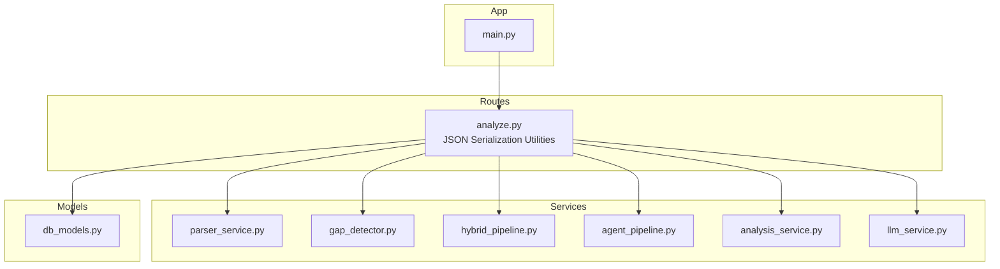

**Diagram sources**
- [analyze.py:48-56](file://app/backend/routes/analyze.py#L48-L56)
- [agent_pipeline.py:39-45](file://app/backend/services/agent_pipeline.py#L39-L45)
- [hybrid_pipeline.py:16](file://app/backend/services/hybrid_pipeline.py#L16)
- [llm_service.py:1](file://app/backend/services/llm_service.py#L1)

**Section sources**
- [README.md:273-333](file://README.md#L273-L333)
- [main.py:174-215](file://app/backend/main.py#L174-L215)

## Core Components
- Hybrid Pipeline: Python-first deterministic scoring (skills, education, experience/timeline, domain/architecture) followed by a single LLM call for narrative synthesis and interview questions.
- LangGraph Agent Pipeline: Multi-agent, multi-stage workflow with structured nodes for JD parsing, combined resume analysis, and scoring with explainability.
- Resume Parser: Robust text extraction from PDF and DOCX, with fallbacks and normalization.
- Gap Detector: Mechanical date parsing and interval merging to compute objective timeline metrics.
- Skills Registry: Dynamic, DB-backed registry with in-memory flashtext processor and hot reload capability.
- LLM Integration: Ollama-backed ChatOllama clients with singletons, timeouts, and JSON parsing utilities.
- Scoring and Risk: Weighted fit score computation, risk signals, and recommendation logic.
- Persistence: SQLAlchemy models for candidates, screening results, role templates, usage logs, and caches.
- **Enhanced AI Pipeline**: Sophisticated score rationales and structured risk analysis with detailed explanations.
- **AI-Enhanced Narratives**: Distinction system between LLM-generated and fallback narratives using `ai_enhanced` flag.

**Section sources**
- [hybrid_pipeline.py:1-1498](file://app/backend/services/hybrid_pipeline.py#L1-L1498)
- [agent_pipeline.py:1-634](file://app/backend/services/agent_pipeline.py#L1-L634)
- [parser_service.py:1-552](file://app/backend/services/parser_service.py#L1-L552)
- [gap_detector.py:1-219](file://app/backend/services/gap_detector.py#L1-L219)
- [db_models.py:97-250](file://app/backend/models/db_models.py#L97-L250)

## Architecture Overview
The system uses a hybrid approach:
- Phase 1 (Python, ~1–2s): parse_jd_rules → parse_resume_rules → match_skills_rules → score_education/experience/domain → compute_fit_score → generate score rationales and risk summary
- Phase 2 (LLM, ~40s): explain_with_llm (generates strengths, weaknesses, rationale, interview questions)
- Fallback: deterministic narrative when LLM is unavailable or times out

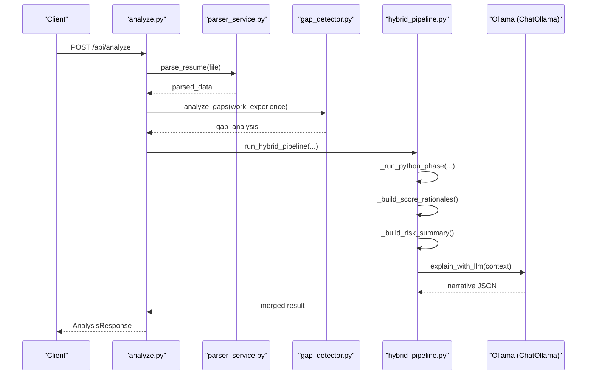

**Diagram sources**
- [analyze.py:268-318](file://app/backend/routes/analyze.py#L268-L318)
- [hybrid_pipeline.py:1262-1407](file://app/backend/services/hybrid_pipeline.py#L1262-L1407)
- [parser_service.py:547-552](file://app/backend/services/parser_service.py#L547-L552)
- [gap_detector.py:217-219](file://app/backend/services/gap_detector.py#L217-L219)

## Detailed Component Analysis

### Hybrid Pipeline
The hybrid pipeline executes deterministic Python logic first, then a single LLM call for narrative. It includes:
- Skills registry with canonical skills, aliases, and domain mapping
- JD parsing rules extracting role, domain, seniority, required/nice-to-have skills, and responsibilities
- Resume profile builder combining parser output and gap analysis
- Skill matching with normalization, alias expansion, substring matching, and fuzzy fallback
- Education scoring with degree and field relevance multipliers
- Experience and timeline scoring with gap severity deductions
- Domain and architecture scoring based on keyword hits
- Fit score computation with configurable weights and risk penalties
- LLM narrative generation with robust JSON parsing and fallback
- **Enhanced**: Score rationales for each dimension and structured risk summary
- **Optimized**: Gemma4 31B cloud model with intelligent token limits for improved performance

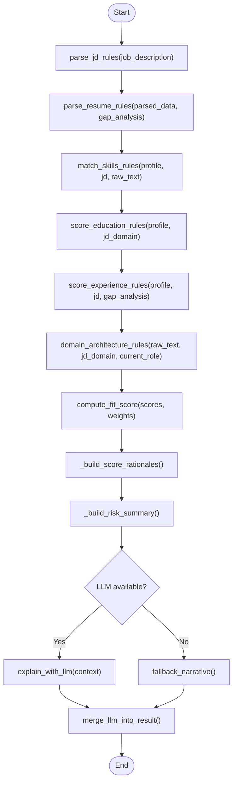

**Diagram sources**
- [hybrid_pipeline.py:1262-1407](file://app/backend/services/hybrid_pipeline.py#L1262-L1407)
- [hybrid_pipeline.py:1074-1256](file://app/backend/services/hybrid_pipeline.py#L1074-L1256)

**Section sources**
- [hybrid_pipeline.py:1-1498](file://app/backend/services/hybrid_pipeline.py#L1-L1498)

### LangGraph Agent Pipeline
The LangGraph-based agent pipeline defines a 3-stage workflow:
- Stage 1 (parallel): jd_parser
- Stage 2 (parallel): resume_analyser (combines skill/domain/edu/timeline)
- Stage 3 (parallel): scorer (combined scoring and interview questions)

It uses:
- Two LLM singletons (fast and reasoning) with keep-alive sessions
- JSON parsing helper with fallback extraction
- In-memory JD cache keyed by MD5 of first 2000 characters
- Streamable nodes emitting SSE events
- Fallback per node returning typed-null defaults on failures

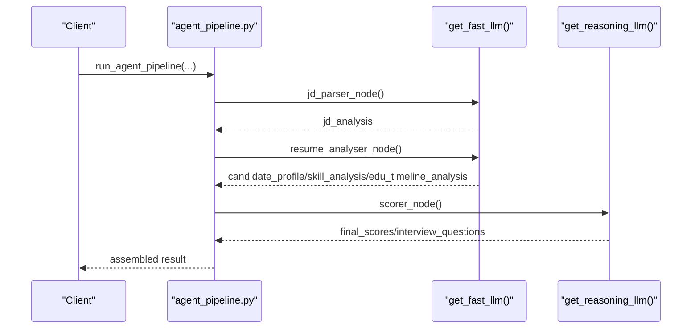

**Diagram sources**
- [agent_pipeline.py:520-541](file://app/backend/services/agent_pipeline.py#L520-L541)
- [agent_pipeline.py:161-180](file://app/backend/services/agent_pipeline.py#L161-L180)
- [agent_pipeline.py:280-322](file://app/backend/services/agent_pipeline.py#L280-L322)
- [agent_pipeline.py:367-448](file://app/backend/services/agent_pipeline.py#L367-L448)

**Section sources**
- [agent_pipeline.py:1-634](file://app/backend/services/agent_pipeline.py#L1-L634)

### Resume Parsing Service
The parser supports:
- PDF: PyMuPDF primary, pdfplumber fallback; scanned PDF guard
- DOCX: paragraph and table extraction
- DOC/RTF/HTML/ODT/TXT: best-effort text extraction with Unicode normalization
- Resume parsing: work experience, skills, education, contact info with enrichment

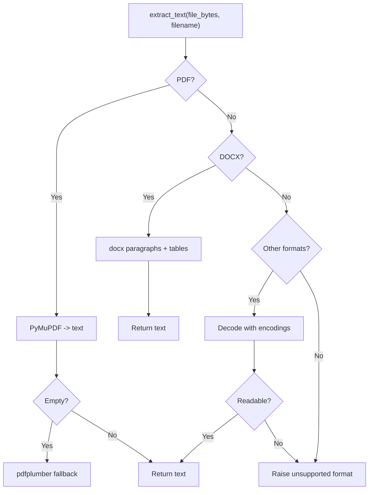

**Diagram sources**
- [parser_service.py:142-191](file://app/backend/services/parser_service.py#L142-L191)
- [parser_service.py:152-187](file://app/backend/services/parser_service.py#L152-L187)

**Section sources**
- [parser_service.py:1-552](file://app/backend/services/parser_service.py#L1-L552)

### Employment Gap Detection Algorithm
The gap detector performs:
- Date normalization to YYYY-MM with flexible parsing and fallback
- Overlap-aware total experience via interval merging
- Objective gap severity classification (threshold-based)
- Structured timeline with gap metadata for downstream LLM consumption


**Diagram sources**
- [gap_detector.py:103-219](file://app/backend/services/gap_detector.py#L103-L219)

**Section sources**
- [gap_detector.py:1-219](file://app/backend/services/gap_detector.py#L1-L219)

### Skills Registry System
The skills registry:
- Seeds canonical skills and aliases into the DB
- Loads active skills into an in-memory flashtext processor
- Provides hot-reload capability and fallback to hardcoded list
- Maps skills to domains for seeding and matching

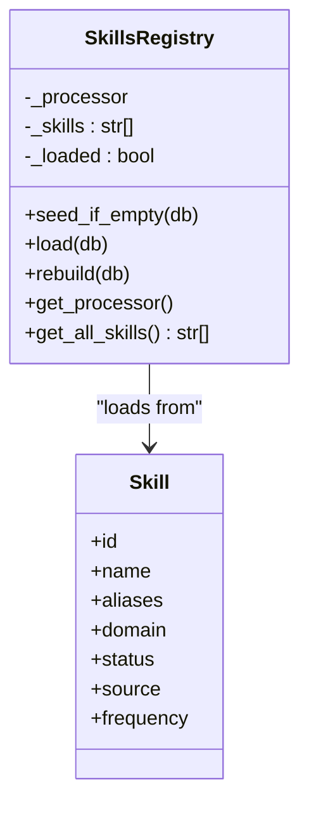

**Diagram sources**
- [hybrid_pipeline.py:323-426](file://app/backend/services/hybrid_pipeline.py#L323-L426)
- [db_models.py:238-250](file://app/backend/models/db_models.py#L238-L250)

**Section sources**
- [hybrid_pipeline.py:70-426](file://app/backend/services/hybrid_pipeline.py#L70-L426)
- [db_models.py:227-250](file://app/backend/models/db_models.py#L227-L250)

### LLM Service Integration with Ollama
Integration points:
- ChatOllama singletons for fast and reasoning models
- Environment configuration for base URL, model, and context sizes
- JSON parsing utilities tolerant of fenced code blocks and partial JSON
- Fallback responses on errors and timeouts
- Health and diagnostics endpoints for model readiness

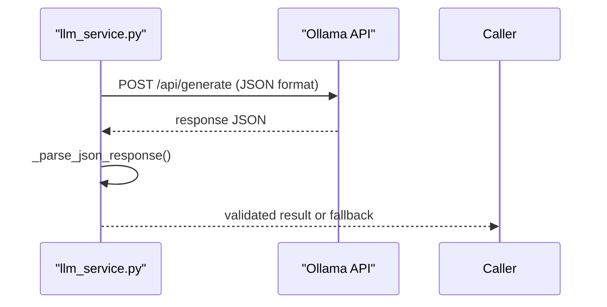

**Diagram sources**
- [llm_service.py:43-104](file://app/backend/services/llm_service.py#L43-L104)
- [main.py:262-327](file://app/backend/main.py#L262-L327)

**Section sources**
- [llm_service.py:1-156](file://app/backend/services/llm_service.py#L1-L156)
- [main.py:104-149](file://app/backend/main.py#L104-L149)

### Scoring Algorithms, Recommendation Logic, and Risk Assessment
Scoring and risk:
- Weighted fit score across skill, experience, architecture, education, timeline, domain, and risk
- Risk signals derived deterministically from gaps, short stints, domain mismatch, and overqualification
- Recommendation thresholds (Shortlist ≥ 72, Consider [45–71], Reject < 45)
- Timeline severity penalties and architecture signal bonuses


**Diagram sources**
- [hybrid_pipeline.py:964-1058](file://app/backend/services/hybrid_pipeline.py#L964-L1058)

**Section sources**
- [hybrid_pipeline.py:953-1058](file://app/backend/services/hybrid_pipeline.py#L953-L1058)

### Route Orchestration and Streaming
The analyze route:
- Validates file types and sizes, resolves JD from text or file
- Parses resumes in thread pool to avoid blocking
- Runs hybrid pipeline and persists results
- Supports SSE streaming with heartbeat pings
- Implements candidate deduplication and profile storage
- **Enhanced JSON serialization**: Comprehensive datetime, date, and Decimal handling

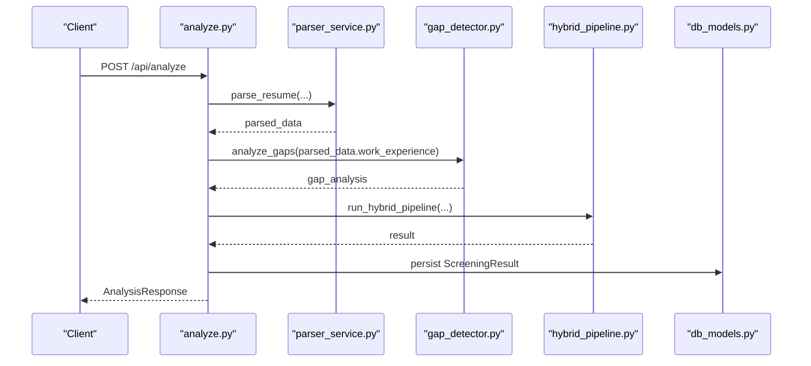

**Diagram sources**
- [analyze.py:268-501](file://app/backend/routes/analyze.py#L268-L501)

**Section sources**
- [analyze.py:1-813](file://app/backend/routes/analyze.py#L1-L813)

## Enhanced AI Pipeline Capabilities

**Updated** The analysis engine now features sophisticated score rationales and comprehensive risk analysis capabilities that provide detailed explanations for each score dimension and structured risk summaries.

### Score Rationale Generation

The system generates detailed explanations for each score dimension:

- **Skill Rationale**: Explains the strength of skill matches, missing critical skills, and adjacent skills
- **Experience Rationale**: Details experience calculation methodology and required vs actual years
- **Education Rationale**: Describes degree relevance and field alignment scoring
- **Timeline Rationale**: Provides employment gap analysis and timeline interpretation
- **Domain Rationale**: Explains domain fit and architecture alignment assessment
- **Overall Rationale**: Synthesizes all factors into a comprehensive recommendation explanation

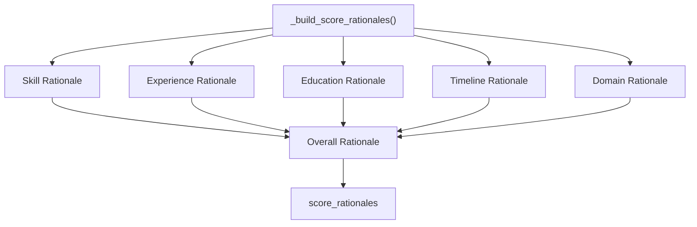

**Diagram sources**
- [hybrid_pipeline.py:1480-1525](file://app/backend/services/hybrid_pipeline.py#L1480-L1525)

**Section sources**
- [hybrid_pipeline.py:1480-1525](file://app/backend/services/hybrid_pipeline.py#L1480-L1525)

### Structured Risk Summary

The risk summary provides comprehensive risk assessment:

- **Seniority Alignment**: Compares actual experience against required seniority level with specific ranges
- **Career Trajectory**: Analyzes upward progression, early career patterns, and single-role candidates
- **Stability Assessment**: Evaluates employment stability based on gaps, short stints, and job-hopping patterns
- **Risk Flags**: Converts risk signals into user-friendly format with severity levels

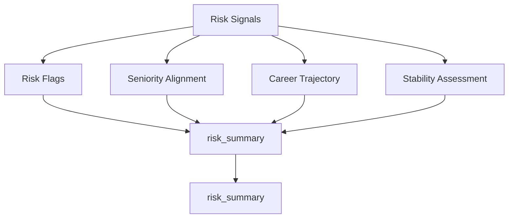

**Diagram sources**
- [hybrid_pipeline.py:1528-1600](file://app/backend/services/hybrid_pipeline.py#L1528-L1600)

**Section sources**
- [hybrid_pipeline.py:1528-1600](file://app/backend/services/hybrid_pipeline.py#L1528-L1600)

**Section sources**
- [hybrid_pipeline.py:1528-1600](file://app/backend/services/hybrid_pipeline.py#L1528-L1600)

## Structured Risk Analysis

**Updated** The enhanced risk analysis system provides comprehensive risk assessment with structured summaries and detailed explanations.

### Risk Flag System

Risk flags are systematically generated from risk signals:

- **Type Normalization**: Converts internal risk types to user-friendly formats
- **Severity Classification**: Categorizes risks as low, medium, or high severity
- **Detail Description**: Provides specific explanations for each flagged risk
- **Comprehensive Coverage**: Includes gaps, skill mismatches, domain alignment, and stability issues

### Seniority Alignment Assessment

The system evaluates seniority fit using predefined experience ranges:

- **Intern**: 0-1 years
- **Junior**: 0-2 years  
- **Mid**: 2-5 years
- **Senior**: 5-10 years
- **Lead**: 7-15 years
- **Principal**: 10-25 years
- **Staff**: 8-20 years
- **Architect**: 10-25 years
- **Director**: 12-30 years

### Career Trajectory Analysis

Career progression is assessed through role title analysis:

- **Strong Upward**: Progression from junior to senior roles
- **Upward**: Current senior role or multiple positions
- **Early Career**: Single role or limited positions
- **Data-Driven**: Heuristic analysis of title keywords

### Stability Assessment

Employment stability is evaluated based on:

- **Critical Gaps**: 12+ month gaps indicating instability
- **Job-Hopping**: 3+ short stints (<6 months) suggesting instability
- **Moderate Concerns**: Single gaps or short stints
- **Stable**: No significant gaps or short stints detected

**Section sources**
- [hybrid_pipeline.py:1528-1600](file://app/backend/services/hybrid_pipeline.py#L1528-L1600)

## Model Configuration and Performance

**Updated** The analysis engine uses optimized model configurations for enhanced performance and reliability, with intelligent migration to Gemma4 31B cloud model across all services.

### Model Specifications

The system utilizes gemma4:31b-cloud model with optimized settings:

- **Model**: gemma4:31b-cloud (31 billion parameters) for all services
- **Temperature**: 0.1 for deterministic responses
- **Format**: JSON for structured output
- **num_predict**: 3000-4000 tokens for cloud models (optimized for verbose output)
- **num_ctx**: 8192 context window for cloud models, 2048 for local models
- **keep_alive**: -1 for model persistence in RAM (local only)
- **Request Timeout**: 150 seconds (150s + 30s buffer)

### Cloud Model Optimization

**Enhanced** The system now includes intelligent model configuration based on deployment environment:

- **Cloud Detection**: Automatically detects Ollama Cloud (ollama.com) vs local deployment
- **Token Limits**: Cloud models receive 3000-4000 tokens for num_predict to handle verbose output from large models
- **Context Windows**: Cloud models use 8192 context window for complex reasoning tasks
- **Authentication**: Automatic API key handling for Ollama Cloud with Authorization headers
- **Performance**: Maintains 600-800 token limit for local models to optimize memory usage

### Performance Characteristics

- **Cold Start**: ~2 minutes for first load on CPU
- **Subsequent Requests**: 30-60 seconds typical
- **Concurrent Limit**: 2 LLM calls per worker
- **Memory Management**: Keep-alive sessions reduce cold-start latency
- **Prompt Optimization**: Reduced num_predict (600-800) for local models minimizes KV cache allocation
- **Cloud Optimization**: 3000-4000 token limit for cloud models handles verbose output from large models efficiently

### Environment Configuration

Key environment variables:

- **OLLAMA_BASE_URL**: Default localhost:11434 or https://ollama.com for cloud
- **OLLAMA_MODEL**: gemma4:31b-cloud (narrative model) for all services
- **OLLAMA_FAST_MODEL**: gemma4:31b-cloud (fast model) for all services
- **LLM_NARRATIVE_TIMEOUT**: 150 seconds default
- **OLLAMA_API_KEY**: Required for Ollama Cloud authentication
- **OLLAMA_HOST**: docker host for containerized deployments

**Section sources**
- [hybrid_pipeline.py:82-107](file://app/backend/services/hybrid_pipeline.py#L82-L107)
- [main.py:266-331](file://app/backend/main.py#L266-L331)

## Enhanced JSON Serialization Capabilities

**Updated** The analysis engine now features comprehensive JSON serialization capabilities designed to handle datetime objects, dates, and Decimal values consistently across all components. This enhancement significantly improves system stability and prevents production crashes when serializing complex analysis results.

### Core JSON Serialization Utilities

The system implements a unified `_json_default` function across multiple modules to handle non-serializable types:

```python
def _json_default(obj):
    """Handle non-serializable types for json.dumps (datetime, date, Decimal)."""
    if isinstance(obj, (datetime, date)):
        return obj.isoformat()
    if isinstance(obj, Decimal):
        return float(obj)
    raise TypeError(f"Object of type {type(obj).__name__} is not JSON serializable")
```

### Key Implementation Areas

#### Route-Level Serialization
The analyze route implements comprehensive JSON serialization for:
- JD caching with datetime handling
- Candidate profile storage with mixed data types
- Screening result persistence
- SSE streaming with proper serialization

#### Agent Pipeline Serialization
The LangGraph agent pipeline includes:
- Custom `_json_default` function for consistent serialization
- Support for datetime and Decimal types in pipeline states
- JSON parsing helpers with fallback extraction

#### Service-Level Serialization
Various services implement JSON serialization for:
- Parser snapshot storage
- Gap analysis persistence
- LLM response handling
- Analysis result caching

### Benefits and Stability Improvements

The enhanced JSON serialization provides several critical benefits:

- **Production Stability**: Eliminates crashes when serializing complex analysis results containing datetime, date, or Decimal objects
- **Consistent Data Handling**: Unified approach ensures all components handle non-standard JSON types uniformly
- **Database Compatibility**: Proper conversion of datetime objects to ISO format strings for database storage
- **Decimal Precision**: Safe conversion of Decimal values to float for JSON compatibility while maintaining precision
- **Error Prevention**: Comprehensive type checking prevents runtime errors during serialization operations

### Error Handling and Fallback Mechanisms

The system includes robust error handling:
- Type-specific serialization with appropriate fallbacks
- Graceful degradation when encountering unexpected object types
- Comprehensive logging for serialization failures
- Automatic recovery mechanisms for partial serialization failures

**Section sources**
- [analyze.py:48-56](file://app/backend/routes/analyze.py#L48-L56)
- [agent_pipeline.py:39-45](file://app/backend/services/agent_pipeline.py#L39-L45)
- [hybrid_pipeline.py:16](file://app/backend/services/hybrid_pipeline.py#L16)
- [llm_service.py:1](file://app/backend/services/llm_service.py#L1)

## Dependency Analysis
Key dependencies and relationships:
- Routes depend on parser, gap detector, hybrid pipeline, and models
- Hybrid pipeline depends on skills registry and Ollama
- Agent pipeline depends on LangGraph and ChatOllama
- Models define relationships among tenants, users, candidates, and screening results
- Startup checks validate DB connectivity, skills registry, and Ollama availability
- **Enhanced JSON serialization**: Unified serialization utilities across all components
- **AI-Enhanced Narratives**: `ai_enhanced` flag distinguishes LLM vs fallback narratives

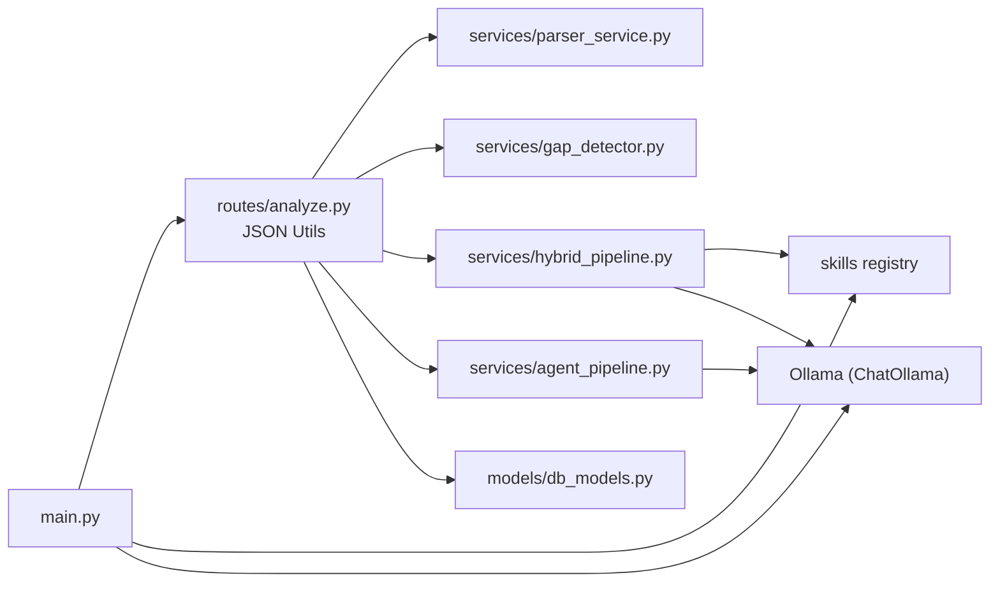

**Diagram sources**
- [analyze.py:32-38](file://app/backend/routes/analyze.py#L32-L38)
- [hybrid_pipeline.py:49-66](file://app/backend/services/hybrid_pipeline.py#L49-L66)
- [agent_pipeline.py:33-34](file://app/backend/services/agent_pipeline.py#L33-L34)
- [db_models.py:97-147](file://app/backend/models/db_models.py#L97-L147)
- [main.py:68-149](file://app/backend/main.py#L68-L149)

**Section sources**
- [analyze.py:32-38](file://app/backend/routes/analyze.py#L32-L38)
- [db_models.py:97-147](file://app/backend/models/db_models.py#L97-L147)
- [main.py:68-149](file://app/backend/main.py#L68-L149)

## Performance Considerations
- Concurrency control: semaphore limits concurrent LLM calls to 2 per worker
- Model hot-loading: keep-alive sessions and in-memory caches reduce cold-start latency
- Prompt sizing: reduced num_predict (600-800) and num_ctx (2048) to minimize KV cache allocation for local models
- Thread pool usage: blocking PDF parsing executed in asyncio.to_thread
- Streaming: SSE heartbeat pings prevent timeouts for long-running LLM calls
- Caching: JD cache shared across workers; skills registry hot-reloadable
- Memory management: JSON parsing utilities and bounded snapshot sizes
- **Enhanced AI Pipeline**: Optimized score rationale generation with minimal overhead
- **Model Optimization**: Gemma4 31B cloud model selected for balanced performance and cost
- **KV Cache Savings**: ~800MB reduction in memory usage for local models compared to default 4096 context
- **Cloud Optimization**: Intelligent token limit scaling for cloud models handling verbose output from large models

[No sources needed since this section provides general guidance]

## Troubleshooting Guide
Common issues and resolutions:
- Ollama unreachable or model not pulled: use health and diagnostic endpoints to inspect model readiness
- Scanned PDFs: parser raises explicit error advising text-based exports
- Database locked: SQLite concurrency limitation; restart backend container
- SSL certificate renewal: manual renewal and nginx restart on production
- Deploy failures: verify Docker Hub credentials, SSH keys, and VPS firewall
- **JSON serialization errors**: Enhanced error handling now provides detailed type information for debugging serialization failures
- **Datetime conversion issues**: Unified `_json_default` function ensures consistent datetime serialization across all components
- **Model loading issues**: Use `/api/llm-status` endpoint to diagnose model readiness and hot status
- **Performance degradation**: Monitor LLM timeouts and consider increasing LLM_NARRATIVE_TIMEOUT environment variable
- **KV Cache issues**: Reduced context size (600-800 tokens) helps prevent memory pressure during LLM calls for local models
- **Cloud Model Issues**: Ensure OLLAMA_API_KEY is set for Ollama Cloud deployments; verify Gemma4 31B+ model compatibility

**Section sources**
- [main.py:228-259](file://app/backend/main.py#L228-L259)
- [main.py:262-327](file://app/backend/main.py#L262-L327)
- [parser_service.py:175-181](file://app/backend/services/parser_service.py#L175-L181)
- [README.md:337-375](file://README.md#L337-L375)

## Conclusion
The analysis engine blends efficient Python-first processing with a single, well-configured LLM call to deliver fast, deterministic scoring and rich narrative insights. The LangGraph agent pipeline enables scalable, multi-step workflows with structured nodes and robust fallbacks. The resume parsing service and gap detection provide reliable inputs, while the skills registry and scoring logic offer extensible, configurable evaluation criteria suitable for customization and growth.

**Updated** The enhanced AI pipeline capabilities now provide sophisticated score rationales and comprehensive risk analysis, generating detailed explanations for each score dimension and structured risk summaries including seniority alignment, career trajectory analysis, and stability assessments. The system maintains backward compatibility while delivering significantly improved explainability and risk assessment capabilities. The AI-enhanced narrative distinction system ensures clear differentiation between LLM-generated and fallback content, improving transparency for users. The migration to Gemma4 31B cloud model across all services provides enhanced performance and reliability, with intelligent token limit scaling for both local and cloud deployments.

[No sources needed since this section summarizes without analyzing specific files]

## Appendices

### Extension Points for Custom Evaluation Criteria
- Add new scoring dimensions: extend score_* functions and compute_fit_score weights
- Introduce custom risk signals: append to risk_signals computation
- Extend skills registry: add canonical skills and aliases; hot-reload via rebuild
- Customize LLM prompts: adjust explain_with_llm and agent pipeline prompts
- Add new resume sections: extend parser_service extraction logic
- **Enhanced AI Pipeline**: Leverage score rationales and risk summary structures for new evaluation criteria
- **Model Configuration**: Adjust gemma4:31b-cloud parameters for specialized use cases
- **AI-Enhanced Narratives**: Use `ai_enhanced` flag to indicate content origin

**Section sources**
- [hybrid_pipeline.py:953-1058](file://app/backend/services/hybrid_pipeline.py#L953-L1058)
- [hybrid_pipeline.py:350-426](file://app/backend/services/hybrid_pipeline.py#L350-L426)
- [agent_pipeline.py:327-365](file://app/backend/services/agent_pipeline.py#L327-L365)
- [parser_service.py:319-371](file://app/backend/services/parser_service.py#L319-L371)

### JSON Serialization Best Practices

**Updated** When extending the analysis engine with new evaluation criteria:

1. **Use Unified Serialization**: Leverage the existing `_json_default` function for consistent datetime, date, and Decimal handling
2. **Handle Mixed Types**: Ensure all new data structures can be safely serialized using the unified approach
3. **Test Edge Cases**: Verify serialization works correctly for boundary conditions and unusual data combinations
4. **Maintain Backward Compatibility**: Ensure new serialization logic doesn't break existing stored data formats
5. **Monitor Performance**: Track serialization overhead for large datasets and optimize where necessary
6. **Risk Assessment Integration**: When adding new risk signals, follow the structured risk summary format for consistency
7. **AI-Enhanced Content**: Use `ai_enhanced` flag to distinguish between LLM-generated and fallback content

**Section sources**
- [analyze.py:48-56](file://app/backend/routes/analyze.py#L48-L56)
- [agent_pipeline.py:39-45](file://app/backend/services/agent_pipeline.py#L39-L45)
- [hybrid_pipeline.py:16](file://app/backend/services/hybrid_pipeline.py#L16)

### Model Configuration Guidelines

**Updated** For optimal performance with the enhanced AI pipeline:

1. **Model Selection**: gemma4:31b-cloud provides balanced performance for both fast and reasoning tasks
2. **Cloud Deployment**: Use gemma4:31b-cloud for cloud deployments requiring verbose output from large models
3. **Resource Allocation**: Ensure sufficient RAM for model hot-loading and concurrent processing
4. **Timeout Configuration**: Adjust LLM_NARRATIVE_TIMEOUT based on deployment environment and model size
5. **Concurrency Control**: Monitor semaphore limits to prevent resource exhaustion
6. **Monitoring**: Use `/api/llm-status` endpoint for continuous model health monitoring
7. **Context Optimization**: The reduced context size (600-800 tokens) provides ~800MB memory savings for local models
8. **Cloud Token Limits**: Cloud models automatically receive 3000-4000 tokens for verbose output handling
9. **Authentication**: Set OLLAMA_API_KEY for secure cloud model access
10. **KV Cache Management**: Monitor memory usage during LLM calls to prevent overflow, especially with cloud models

**Section sources**
- [hybrid_pipeline.py:82-107](file://app/backend/services/hybrid_pipeline.py#L82-L107)
- [main.py:266-331](file://app/backend/main.py#L266-L331)