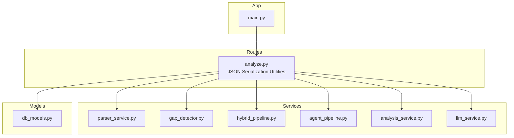
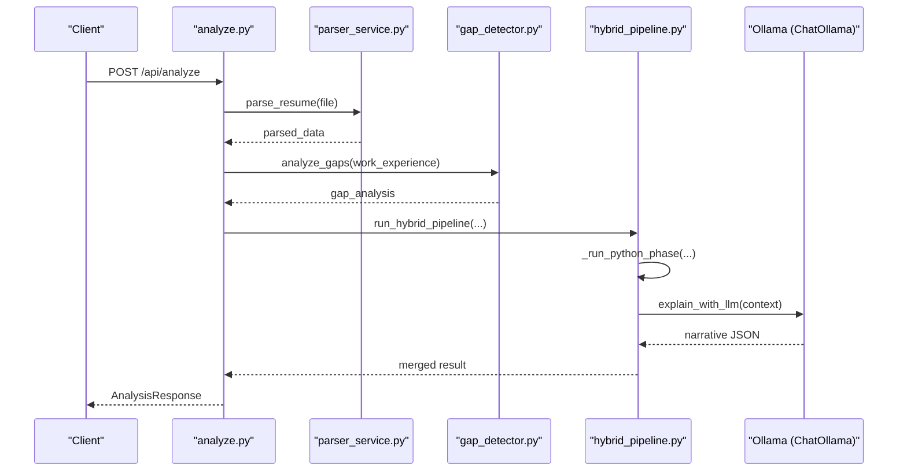
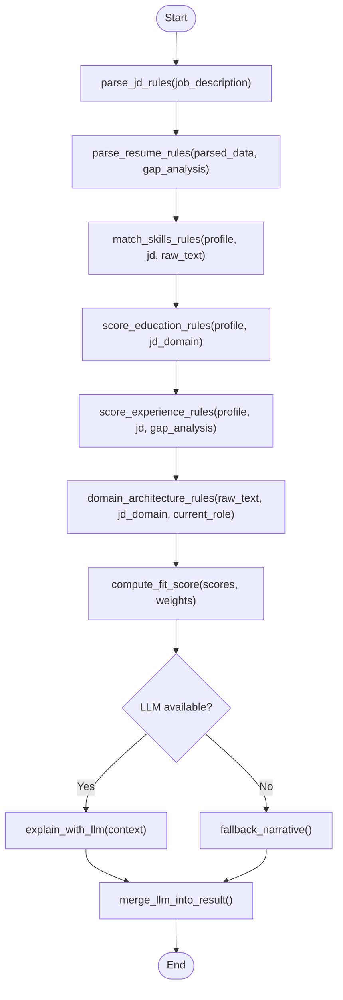
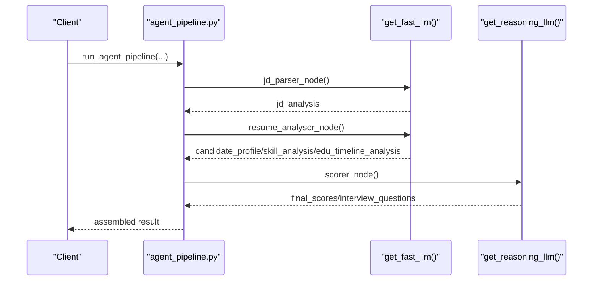
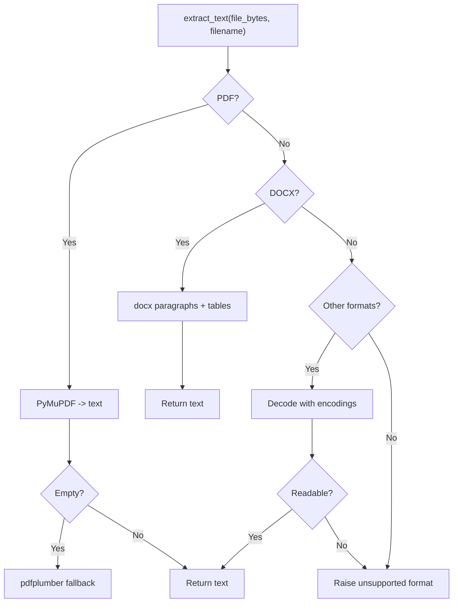
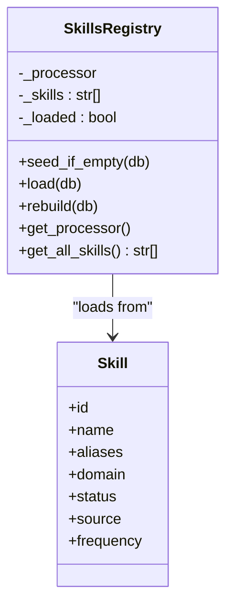
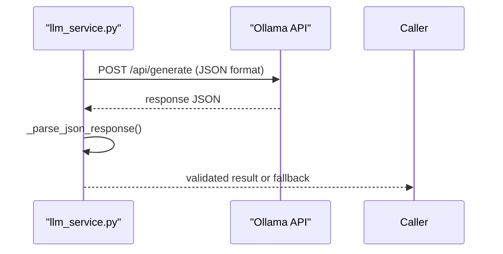
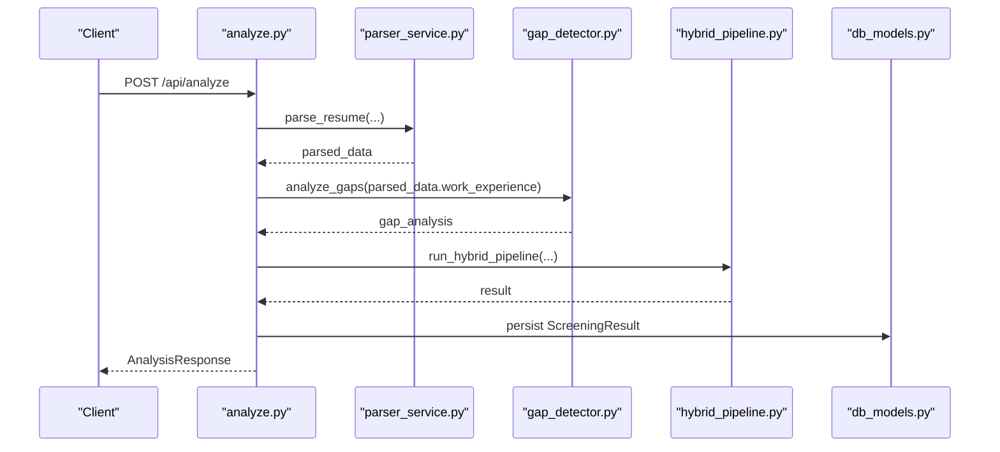
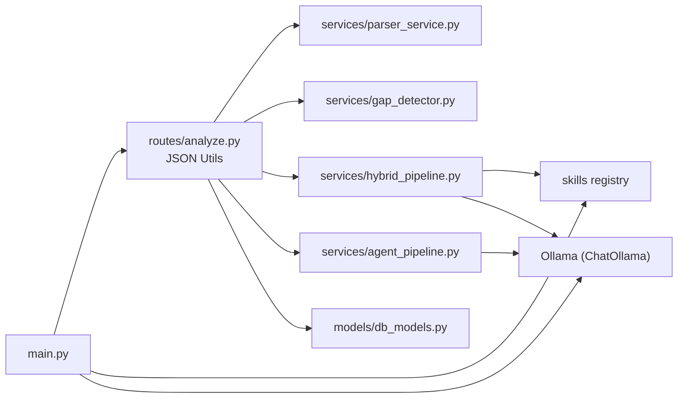

# Analysis Engine

<cite>
**Referenced Files in This Document**
- [main.py](file://app/backend/main.py)
- [analyze.py](file://app/backend/routes/analyze.py)
- [hybrid_pipeline.py](file://app/backend/services/hybrid_pipeline.py)
- [agent_pipeline.py](file://app/backend/services/agent_pipeline.py)
- [parser_service.py](file://app/backend/services/parser_service.py)
- [gap_detector.py](file://app/backend/services/gap_detector.py)
- [analysis_service.py](file://app/backend/services/analysis_service.py)
- [llm_service.py](file://app/backend/services/llm_service.py)
- [db_models.py](file://app/backend/models/db_models.py)
- [README.md](file://README.md)
</cite>

## Update Summary
**Changes Made**
- Enhanced JSON serialization capabilities section documenting comprehensive datetime, date, and Decimal handling
- Updated route orchestration section to reflect improved JSON serialization patterns
- Added new subsection covering JSON serialization utilities and fallback mechanisms
- Updated troubleshooting guide to address JSON serialization-related production issues

## Table of Contents
1. [Introduction](#introduction)
2. [Project Structure](#project-structure)
3. [Core Components](#core-components)
4. [Architecture Overview](#architecture-overview)
5. [Detailed Component Analysis](#detailed-component-analysis)
6. [Enhanced JSON Serialization Capabilities](#enhanced-json-serialization-capabilities)
7. [Dependency Analysis](#dependency-analysis)
8. [Performance Considerations](#performance-considerations)
9. [Troubleshooting Guide](#troubleshooting-guide)
10. [Conclusion](#conclusion)
11. [Appendices](#appendices)

## Introduction
This document explains the analysis engine powering Resume AI by ThetaLogics. It focuses on the hybrid pipeline architecture that combines Python-first deterministic processing with a single LLM call for narrative generation, the LangGraph-based agent pipeline for complex multi-step analysis, the resume parsing service supporting PDF and DOCX formats, the employment gap detection algorithm, the skills registry system, LLM service integration with Ollama, scoring and recommendation logic, risk assessment criteria, performance optimization techniques, memory management, error handling strategies, and extension points for custom evaluation criteria.

**Updated** Enhanced JSON serialization capabilities now provide comprehensive support for datetime objects, dates, and Decimal values across the entire analysis engine, improving stability and preventing production crashes when serializing complex analysis results.

## Project Structure
The backend is organized around FastAPI routes, SQLAlchemy models, and modular services. The analysis engine spans:
- Routes orchestrating the end-to-end flow with robust JSON serialization
- Services implementing parsing, gap detection, hybrid scoring, and LLM integration
- Models defining persistence for candidates, screening results, and caches
- Startup and health checks coordinating environment readiness



**Diagram sources**
- [analyze.py:48-56](file://app/backend/routes/analyze.py#L48-L56)
- [agent_pipeline.py:39-45](file://app/backend/services/agent_pipeline.py#L39-L45)
- [hybrid_pipeline.py:16](file://app/backend/services/hybrid_pipeline.py#L16)
- [llm_service.py:1](file://app/backend/services/llm_service.py#L1)

**Section sources**
- [README.md:273-333](file://README.md#L273-L333)
- [main.py:174-215](file://app/backend/main.py#L174-L215)

## Core Components
- Hybrid Pipeline: Python-first deterministic scoring (skills, education, experience/timeline, domain/architecture) followed by a single LLM call for narrative synthesis and interview questions.
- LangGraph Agent Pipeline: Multi-agent, multi-stage workflow with structured nodes for JD parsing, combined resume analysis, and scoring with explainability.
- Resume Parser: Robust text extraction from PDF and DOCX, with fallbacks and normalization.
- Gap Detector: Mechanical date parsing and interval merging to compute objective timeline metrics.
- Skills Registry: Dynamic, DB-backed registry with in-memory flashtext processor and hot reload capability.
- LLM Integration: Ollama-backed ChatOllama clients with singletons, timeouts, and JSON parsing utilities.
- Scoring and Risk: Weighted fit score computation, risk signals, and recommendation logic.
- Persistence: SQLAlchemy models for candidates, screening results, role templates, usage logs, and caches.
- **Enhanced JSON Serialization**: Comprehensive support for datetime, date, and Decimal types across all components.

**Section sources**
- [hybrid_pipeline.py:1-1498](file://app/backend/services/hybrid_pipeline.py#L1-L1498)
- [agent_pipeline.py:1-634](file://app/backend/services/agent_pipeline.py#L1-L634)
- [parser_service.py:1-552](file://app/backend/services/parser_service.py#L1-L552)
- [gap_detector.py:1-219](file://app/backend/services/gap_detector.py#L1-L219)
- [db_models.py:97-250](file://app/backend/models/db_models.py#L97-L250)

## Architecture Overview
The system uses a hybrid approach:
- Phase 1 (Python, ~1–2s): parse_jd_rules → parse_resume_rules → match_skills_rules → score_education/experience/domain → compute_fit_score
- Phase 2 (LLM, ~40s): explain_with_llm (generates strengths, weaknesses, rationale, interview questions)
- Fallback: deterministic narrative when LLM is unavailable or times out



**Diagram sources**
- [analyze.py:268-318](file://app/backend/routes/analyze.py#L268-L318)
- [hybrid_pipeline.py:1262-1407](file://app/backend/services/hybrid_pipeline.py#L1262-L1407)
- [parser_service.py:547-552](file://app/backend/services/parser_service.py#L547-L552)
- [gap_detector.py:217-219](file://app/backend/services/gap_detector.py#L217-L219)

## Detailed Component Analysis

### Hybrid Pipeline
The hybrid pipeline executes deterministic Python logic first, then a single LLM call for narrative. It includes:
- Skills registry with canonical skills, aliases, and domain mapping
- JD parsing rules extracting role, domain, seniority, required/nice-to-have skills, and responsibilities
- Resume profile builder combining parser output and gap analysis
- Skill matching with normalization, alias expansion, substring matching, and fuzzy fallback
- Education scoring with degree and field relevance multipliers
- Experience and timeline scoring with gap severity deductions
- Domain and architecture scoring based on keyword hits
- Fit score computation with configurable weights and risk penalties
- LLM narrative generation with robust JSON parsing and fallback



**Diagram sources**
- [hybrid_pipeline.py:1262-1407](file://app/backend/services/hybrid_pipeline.py#L1262-L1407)
- [hybrid_pipeline.py:1074-1256](file://app/backend/services/hybrid_pipeline.py#L1074-L1256)

**Section sources**
- [hybrid_pipeline.py:1-1498](file://app/backend/services/hybrid_pipeline.py#L1-L1498)

### LangGraph Agent Pipeline
The LangGraph-based agent pipeline defines a 3-stage workflow:
- Stage 1 (parallel): jd_parser
- Stage 2 (parallel): resume_analyser (combines skill/domain/edu/timeline)
- Stage 3 (parallel): scorer (combined scoring and interview questions)

It uses:
- Two LLM singletons (fast and reasoning) with keep-alive sessions
- JSON parsing helper with fallback extraction
- In-memory JD cache keyed by MD5 of first 2000 characters
- Streamable nodes emitting SSE events
- Fallback per node returning typed-null defaults on failures



**Diagram sources**
- [agent_pipeline.py:520-541](file://app/backend/services/agent_pipeline.py#L520-L541)
- [agent_pipeline.py:161-180](file://app/backend/services/agent_pipeline.py#L161-L180)
- [agent_pipeline.py:280-322](file://app/backend/services/agent_pipeline.py#L280-L322)
- [agent_pipeline.py:367-448](file://app/backend/services/agent_pipeline.py#L367-L448)

**Section sources**
- [agent_pipeline.py:1-634](file://app/backend/services/agent_pipeline.py#L1-L634)

### Resume Parsing Service
The parser supports:
- PDF: PyMuPDF primary, pdfplumber fallback; scanned PDF guard
- DOCX: paragraph and table extraction
- DOC/RTF/HTML/ODT/TXT: best-effort text extraction with Unicode normalization
- Resume parsing: work experience, skills, education, contact info with enrichment



**Diagram sources**
- [parser_service.py:142-191](file://app/backend/services/parser_service.py#L142-L191)
- [parser_service.py:152-187](file://app/backend/services/parser_service.py#L152-L187)

**Section sources**
- [parser_service.py:1-552](file://app/backend/services/parser_service.py#L1-L552)

### Employment Gap Detection Algorithm
The gap detector performs:
- Date normalization to YYYY-MM with flexible parsing and fallback
- Overlap-aware total experience via interval merging
- Objective gap severity classification (threshold-based)
- Structured timeline with gap metadata for downstream LLM consumption


**Diagram sources**
- [gap_detector.py:103-219](file://app/backend/services/gap_detector.py#L103-L219)

**Section sources**
- [gap_detector.py:1-219](file://app/backend/services/gap_detector.py#L1-L219)

### Skills Registry System
The skills registry:
- Seeds canonical skills and aliases into the DB
- Loads active skills into an in-memory flashtext processor
- Provides hot-reload capability and fallback to hardcoded list
- Maps skills to domains for seeding and matching



**Diagram sources**
- [hybrid_pipeline.py:323-426](file://app/backend/services/hybrid_pipeline.py#L323-L426)
- [db_models.py:238-250](file://app/backend/models/db_models.py#L238-L250)

**Section sources**
- [hybrid_pipeline.py:70-426](file://app/backend/services/hybrid_pipeline.py#L70-L426)
- [db_models.py:227-250](file://app/backend/models/db_models.py#L227-L250)

### LLM Service Integration with Ollama
Integration points:
- ChatOllama singletons for fast and reasoning models
- Environment configuration for base URL, model, and context sizes
- JSON parsing utilities tolerant of fenced code blocks and partial JSON
- Fallback responses on errors and timeouts
- Health and diagnostics endpoints for model readiness



**Diagram sources**
- [llm_service.py:43-104](file://app/backend/services/llm_service.py#L43-L104)
- [main.py:262-327](file://app/backend/main.py#L262-L327)

**Section sources**
- [llm_service.py:1-156](file://app/backend/services/llm_service.py#L1-L156)
- [main.py:104-149](file://app/backend/main.py#L104-L149)

### Scoring Algorithms, Recommendation Logic, and Risk Assessment
Scoring and risk:
- Weighted fit score across skill, experience, architecture, education, timeline, domain, and risk
- Risk signals derived deterministically from gaps, short stints, domain mismatch, and overqualification
- Recommendation thresholds (Shortlist ≥ 72, Consider [45–71], Reject < 45)
- Timeline severity penalties and architecture signal bonuses


**Diagram sources**
- [hybrid_pipeline.py:964-1058](file://app/backend/services/hybrid_pipeline.py#L964-L1058)

**Section sources**
- [hybrid_pipeline.py:953-1058](file://app/backend/services/hybrid_pipeline.py#L953-L1058)

### Route Orchestration and Streaming
The analyze route:
- Validates file types and sizes, resolves JD from text or file
- Parses resumes in thread pool to avoid blocking
- Runs hybrid pipeline and persists results
- Supports SSE streaming with heartbeat pings
- Implements candidate deduplication and profile storage
- **Enhanced JSON serialization**: Comprehensive datetime, date, and Decimal handling



**Diagram sources**
- [analyze.py:268-501](file://app/backend/routes/analyze.py#L268-L501)

**Section sources**
- [analyze.py:1-813](file://app/backend/routes/analyze.py#L1-L813)

## Enhanced JSON Serialization Capabilities

**Updated** The analysis engine now features comprehensive JSON serialization capabilities designed to handle datetime objects, dates, and Decimal values consistently across all components. This enhancement significantly improves system stability and prevents production crashes when serializing complex analysis results.

### Core JSON Serialization Utilities

The system implements a unified `_json_default` function across multiple modules to handle non-serializable types:

```python
def _json_default(obj):
    """Handle non-serializable types for json.dumps (datetime, date, Decimal)."""
    if isinstance(obj, (datetime, date)):
        return obj.isoformat()
    if isinstance(obj, Decimal):
        return float(obj)
    raise TypeError(f"Object of type {type(obj).__name__} is not JSON serializable")
```

### Key Implementation Areas

#### Route-Level Serialization
The analyze route implements comprehensive JSON serialization for:
- JD caching with datetime handling
- Candidate profile storage with mixed data types
- Screening result persistence
- SSE streaming with proper serialization

#### Agent Pipeline Serialization
The LangGraph agent pipeline includes:
- Custom `_json_default` function for consistent serialization
- Support for datetime and Decimal types in pipeline states
- JSON parsing helpers with fallback extraction

#### Service-Level Serialization
Various services implement JSON serialization for:
- Parser snapshot storage
- Gap analysis persistence
- LLM response handling
- Analysis result caching

### Benefits and Stability Improvements

The enhanced JSON serialization provides several critical benefits:

- **Production Stability**: Eliminates crashes when serializing complex analysis results containing datetime, date, or Decimal objects
- **Consistent Data Handling**: Unified approach ensures all components handle non-standard JSON types uniformly
- **Database Compatibility**: Proper conversion of datetime objects to ISO format strings for database storage
- **Decimal Precision**: Safe conversion of Decimal values to float for JSON compatibility while maintaining precision
- **Error Prevention**: Comprehensive type checking prevents runtime errors during serialization operations

### Error Handling and Fallback Mechanisms

The system includes robust error handling:
- Type-specific serialization with appropriate fallbacks
- Graceful degradation when encountering unexpected object types
- Comprehensive logging for serialization failures
- Automatic recovery mechanisms for partial serialization failures

**Section sources**
- [analyze.py:48-56](file://app/backend/routes/analyze.py#L48-L56)
- [agent_pipeline.py:39-45](file://app/backend/services/agent_pipeline.py#L39-L45)
- [hybrid_pipeline.py:16](file://app/backend/services/hybrid_pipeline.py#L16)
- [llm_service.py:1](file://app/backend/services/llm_service.py#L1)

## Dependency Analysis
Key dependencies and relationships:
- Routes depend on parser, gap detector, hybrid pipeline, and models
- Hybrid pipeline depends on skills registry and Ollama
- Agent pipeline depends on LangGraph and ChatOllama
- Models define relationships among tenants, users, candidates, and screening results
- Startup checks validate DB connectivity, skills registry, and Ollama availability
- **Enhanced JSON serialization**: Unified serialization utilities across all components



**Diagram sources**
- [analyze.py:32-38](file://app/backend/routes/analyze.py#L32-L38)
- [hybrid_pipeline.py:49-66](file://app/backend/services/hybrid_pipeline.py#L49-L66)
- [agent_pipeline.py:33-34](file://app/backend/services/agent_pipeline.py#L33-L34)
- [db_models.py:97-147](file://app/backend/models/db_models.py#L97-L147)
- [main.py:68-149](file://app/backend/main.py#L68-L149)

**Section sources**
- [analyze.py:32-38](file://app/backend/routes/analyze.py#L32-L38)
- [db_models.py:97-147](file://app/backend/models/db_models.py#L97-L147)
- [main.py:68-149](file://app/backend/main.py#L68-L149)

## Performance Considerations
- Concurrency control: semaphore limits concurrent LLM calls to 2 per worker
- Model hot-loading: keep-alive sessions and in-memory caches reduce cold-start latency
- Prompt sizing: constrained num_predict and num_ctx to minimize KV cache allocation
- Thread pool usage: blocking PDF parsing executed in asyncio.to_thread
- Streaming: SSE heartbeat pings prevent timeouts for long-running LLM calls
- Caching: JD cache shared across workers; skills registry hot-reloadable
- Memory management: JSON parsing utilities and bounded snapshot sizes
- **Enhanced JSON serialization**: Optimized serialization performance with minimal overhead

[No sources needed since this section provides general guidance]

## Troubleshooting Guide
Common issues and resolutions:
- Ollama unreachable or model not pulled: use health and diagnostic endpoints to inspect model readiness
- Scanned PDFs: parser raises explicit error advising text-based exports
- Database locked: SQLite concurrency limitation; restart backend container
- SSL certificate renewal: manual renewal and nginx restart on production
- Deploy failures: verify Docker Hub credentials, SSH keys, and VPS firewall
- **JSON serialization errors**: Enhanced error handling now provides detailed type information for debugging serialization failures
- **Datetime conversion issues**: Unified `_json_default` function ensures consistent datetime serialization across all components

**Section sources**
- [main.py:228-259](file://app/backend/main.py#L228-L259)
- [main.py:262-327](file://app/backend/main.py#L262-L327)
- [parser_service.py:175-181](file://app/backend/services/parser_service.py#L175-L181)
- [README.md:337-375](file://README.md#L337-L375)

## Conclusion
The analysis engine blends efficient Python-first processing with a single, well-configured LLM call to deliver fast, deterministic scoring and rich narrative insights. The LangGraph agent pipeline enables scalable, multi-step workflows with structured nodes and robust fallbacks. The resume parsing service and gap detection provide reliable inputs, while the skills registry and scoring logic offer extensible, configurable evaluation criteria suitable for customization and growth.

**Updated** The enhanced JSON serialization capabilities provide comprehensive support for datetime, date, and Decimal types across the entire system, significantly improving stability and preventing production crashes when handling complex analysis results. This enhancement ensures reliable operation in production environments while maintaining backward compatibility and performance standards.

[No sources needed since this section summarizes without analyzing specific files]

## Appendices

### Extension Points for Custom Evaluation Criteria
- Add new scoring dimensions: extend score_* functions and compute_fit_score weights
- Introduce custom risk signals: append to risk_signals computation
- Extend skills registry: add canonical skills and aliases; hot-reload via rebuild
- Customize LLM prompts: adjust explain_with_llm and agent pipeline prompts
- Add new resume sections: extend parser_service extraction logic
- **Enhanced JSON serialization**: Leverage unified serialization utilities for storing complex evaluation results

**Section sources**
- [hybrid_pipeline.py:953-1058](file://app/backend/services/hybrid_pipeline.py#L953-L1058)
- [hybrid_pipeline.py:350-426](file://app/backend/services/hybrid_pipeline.py#L350-L426)
- [agent_pipeline.py:327-365](file://app/backend/services/agent_pipeline.py#L327-L365)
- [parser_service.py:319-371](file://app/backend/services/parser_service.py#L319-L371)

### JSON Serialization Best Practices

**Updated** When extending the analysis engine with new evaluation criteria:

1. **Use Unified Serialization**: Leverage the existing `_json_default` function for consistent datetime, date, and Decimal handling
2. **Handle Mixed Types**: Ensure all new data structures can be safely serialized using the unified approach
3. **Test Edge Cases**: Verify serialization works correctly for boundary conditions and unusual data combinations
4. **Maintain Backward Compatibility**: Ensure new serialization logic doesn't break existing stored data formats
5. **Monitor Performance**: Track serialization overhead for large datasets and optimize where necessary

**Section sources**
- [analyze.py:48-56](file://app/backend/routes/analyze.py#L48-L56)
- [agent_pipeline.py:39-45](file://app/backend/services/agent_pipeline.py#L39-L45)
- [hybrid_pipeline.py:16](file://app/backend/services/hybrid_pipeline.py#L16)