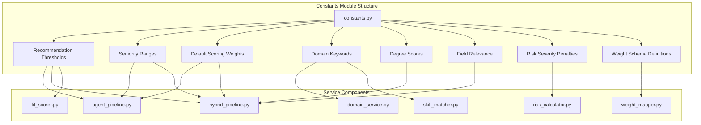
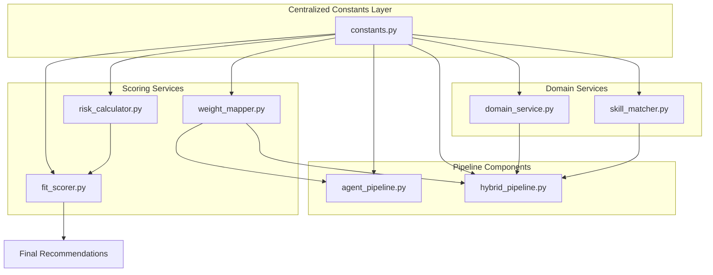
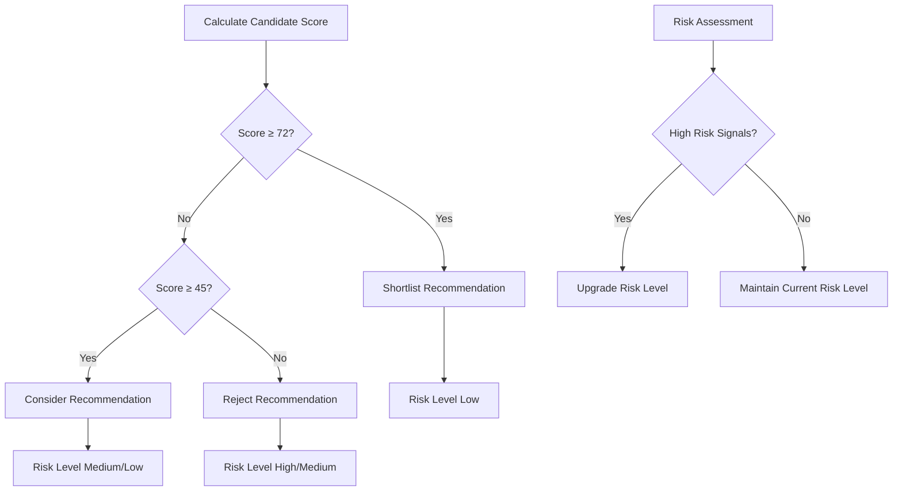
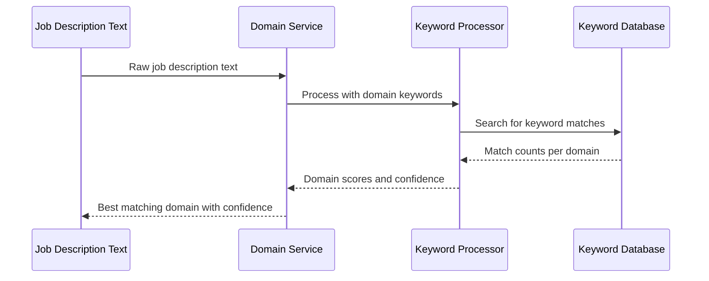
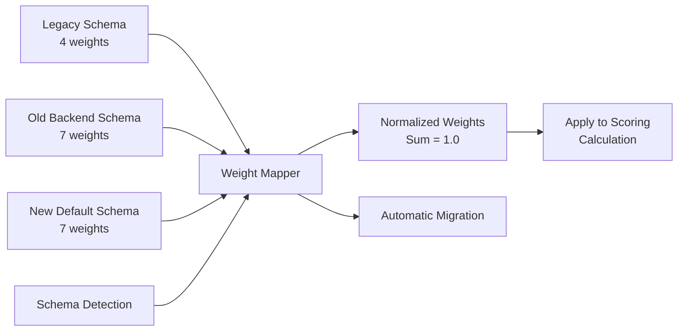
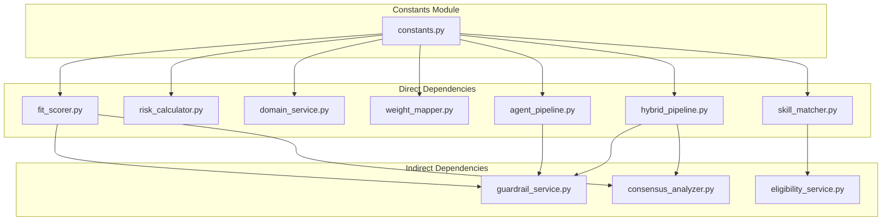

# Centralized Constants Module

<cite>
**Referenced Files in This Document**
- [constants.py](file://app/backend/services/constants.py)
- [agent_pipeline.py](file://app/backend/services/agent_pipeline.py)
- [hybrid_pipeline.py](file://app/backend/services/hybrid_pipeline.py)
- [fit_scorer.py](file://app/backend/services/fit_scorer.py)
- [risk_calculator.py](file://app/backend/services/risk_calculator.py)
- [domain_service.py](file://app/backend/services/domain_service.py)
- [weight_mapper.py](file://app/backend/services/weight_mapper.py)
- [skill_matcher.py](file://app/backend/services/skill_matcher.py)
- [main.py](file://app/backend/main.py)
</cite>

## Table of Contents
1. [Introduction](#introduction)
2. [Project Structure](#project-structure)
3. [Core Components](#core-components)
4. [Architecture Overview](#architecture-overview)
5. [Detailed Component Analysis](#detailed-component-analysis)
6. [Dependency Analysis](#dependency-analysis)
7. [Performance Considerations](#performance-considerations)
8. [Troubleshooting Guide](#troubleshooting-guide)
9. [Conclusion](#conclusion)

## Introduction
The Centralized Constants Module serves as the single source of truth for all scoring constants, thresholds, domain configurations, and weight schemas within the Resume AI platform. This module ensures consistency across the entire system by providing standardized values for recommendation thresholds, seniority ranges, degree scoring, domain keywords, risk penalties, and various weight schemas used throughout the intelligent screening pipeline.

The module is designed to support both legacy and modern weight schemas while maintaining backward compatibility and enabling seamless transitions between different scoring methodologies. It plays a crucial role in the automated resume screening and candidate evaluation processes.

## Project Structure
The centralized constants module is organized within the backend services directory and is imported by multiple service components throughout the application. The module follows a structured approach with clearly defined categories for different types of constants.

**Diagram sources**
- [constants.py:1-158](file://app/backend/services/constants.py#L1-L158)
- [agent_pipeline.py:39-43](file://app/backend/services/agent_pipeline.py#L39-L43)
- [hybrid_pipeline.py:31-37](file://app/backend/services/hybrid_pipeline.py#L31-L37)
- [fit_scorer.py:5-8](file://app/backend/services/fit_scorer.py#L5-L8)
- [risk_calculator.py:3](file://app/backend/services/risk_calculator.py#L3)
- [domain_service.py:6](file://app/backend/services/domain_service.py#L6)
- [weight_mapper.py:17-21](file://app/backend/services/weight_mapper.py#L17-L21)
- [skill_matcher.py:366](file://app/backend/services/skill_matcher.py#L366)

**Section sources**
- [constants.py:1-158](file://app/backend/services/constants.py#L1-L158)

## Core Components

### Recommendation Thresholds
The recommendation thresholds define the scoring boundaries for candidate evaluation across three categories: shortlist, consider, and reject. These thresholds are used consistently throughout the scoring pipeline to determine candidate recommendations based on their calculated fit scores.

**Section sources**
- [constants.py:10-14](file://app/backend/services/constants.py#L10-L14)
- [fit_scorer.py:88-96](file://app/backend/services/fit_scorer.py#L88-L96)

### Seniority Ranges
Seniority ranges establish standardized experience level classifications with inclusive minimum years and exclusive maximum years for each position level. This structure enables consistent experience evaluation across different candidate profiles and job requirements.

**Section sources**
- [constants.py:19-29](file://app/backend/services/constants.py#L19-L29)

### Default Scoring Weights
The default scoring weights represent the standard allocation of importance across different evaluation criteria. These weights are applied when custom weights are not provided, ensuring consistent scoring methodology across the platform.

**Section sources**
- [constants.py:34-42](file://app/backend/services/constants.py#L34-L42)

### Domain Keywords
Domain keywords provide comprehensive keyword mappings for identifying professional domains across nine distinct technology areas. This includes backend development, frontend development, data science, machine learning, DevOps, embedded systems, mobile development, and management roles.

**Section sources**
- [constants.py:46-78](file://app/backend/services/constants.py#L46-L78)

### Degree Scores
The degree scoring system assigns numerical values to various educational qualifications, ranging from PhD-level degrees (100 points) to certificate courses (30 points). This standardized scoring facilitates automated evaluation of educational backgrounds.

**Section sources**
- [constants.py:82-92](file://app/backend/services/constants.py#L82-L92)

### Field Relevance
Field relevance mappings connect professional domains to academic disciplines, enabling assessment of educational alignment with target positions. This helps identify candidates whose educational background aligns with the required technical domain.

**Section sources**
- [constants.py:96-117](file://app/backend/services/constants.py#L96-L117)

### Risk Severity Penalties
Risk severity penalties define the impact levels for different types of risk signals detected during candidate evaluation. These penalties are applied to adjust final scores based on potential risks identified in candidate profiles.

**Section sources**
- [constants.py:121-125](file://app/backend/services/constants.py#L121-L125)

### Weight Schema Definitions
The module defines three distinct weight schemas to support different scoring approaches and maintain backward compatibility:

1. **Legacy Weights**: Four-weight schema (skills, experience, stability, education)
2. **New Default Weights**: Seven-weight universal schema with enhanced domain coverage
3. **Old Backend Weights**: Seven-weight tech-centric schema for specialized backend roles

**Section sources**
- [constants.py:130-157](file://app/backend/services/constants.py#L130-L157)

## Architecture Overview
The centralized constants module operates as a foundational layer that supports the entire intelligent screening architecture. Multiple service components depend on these standardized values to ensure consistent behavior across the platform.

**Diagram sources**
- [constants.py:1-158](file://app/backend/services/constants.py#L1-L158)
- [fit_scorer.py:12-114](file://app/backend/services/fit_scorer.py#L12-L114)
- [risk_calculator.py:6-15](file://app/backend/services/risk_calculator.py#L6-L15)
- [weight_mapper.py:17-21](file://app/backend/services/weight_mapper.py#L17-L21)
- [agent_pipeline.py:39-43](file://app/backend/services/agent_pipeline.py#L39-L43)
- [hybrid_pipeline.py:31-37](file://app/backend/services/hybrid_pipeline.py#L31-L37)
- [domain_service.py:6](file://app/backend/services/domain_service.py#L6)
- [skill_matcher.py:366](file://app/backend/services/skill_matcher.py#L366)

## Detailed Component Analysis

### Recommendation Thresholds Implementation
The recommendation thresholds serve as the cornerstone for automated candidate evaluation. The system uses a tiered approach where scores above 72 qualify for shortlisting, scores between 45-71 warrant consideration, and scores below 45 result in rejection.

**Diagram sources**
- [constants.py:10-14](file://app/backend/services/constants.py#L10-L14)
- [fit_scorer.py:88-96](file://app/backend/services/fit_scorer.py#L88-L96)

**Section sources**
- [constants.py:10-14](file://app/backend/services/constants.py#L10-L14)
- [fit_scorer.py:88-96](file://app/backend/services/fit_scorer.py#L88-L96)

### Domain Keyword Processing
The domain keyword system enables sophisticated domain detection through keyword matching algorithms. Each domain category contains 15-25 relevant keywords that help identify technical specialties within job descriptions and candidate profiles.

**Diagram sources**
- [domain_service.py:9-41](file://app/backend/services/domain_service.py#L9-L41)
- [constants.py:46-78](file://app/backend/services/constants.py#L46-L78)

**Section sources**
- [domain_service.py:9-41](file://app/backend/services/domain_service.py#L9-L41)
- [constants.py:46-78](file://app/backend/services/constants.py#L46-L78)

### Weight Schema Management
The weight mapper provides intelligent conversion between different scoring schemas, ensuring backward compatibility while supporting modern scoring methodologies.

**Diagram sources**
- [weight_mapper.py:75-161](file://app/backend/services/weight_mapper.py#L75-L161)
- [constants.py:130-157](file://app/backend/services/constants.py#L130-L157)

**Section sources**
- [weight_mapper.py:75-161](file://app/backend/services/weight_mapper.py#L75-L161)
- [constants.py:130-157](file://app/backend/services/constants.py#L130-L157)

### Risk Penalty Calculation
The risk penalty system applies standardized penalties based on detected risk signals, with severity levels determining the impact magnitude.

**Section sources**
- [risk_calculator.py:6-15](file://app/backend/services/risk_calculator.py#L6-L15)
- [constants.py:121-125](file://app/backend/services/constants.py#L121-L125)

## Dependency Analysis
The centralized constants module creates dependencies across multiple service components, establishing a unidirectional dependency flow from the constants module to consuming services.

**Diagram sources**
- [constants.py:1-158](file://app/backend/services/constants.py#L1-L158)
- [fit_scorer.py:5-8](file://app/backend/services/fit_scorer.py#L5-L8)
- [risk_calculator.py:3](file://app/backend/services/risk_calculator.py#L3)
- [domain_service.py:6](file://app/backend/services/domain_service.py#L6)
- [weight_mapper.py:17-21](file://app/backend/services/weight_mapper.py#L17-L21)
- [agent_pipeline.py:39-43](file://app/backend/services/agent_pipeline.py#L39-L43)
- [hybrid_pipeline.py:31-37](file://app/backend/services/hybrid_pipeline.py#L31-L37)
- [skill_matcher.py:366](file://app/backend/services/skill_matcher.py#L366)

**Section sources**
- [constants.py:1-158](file://app/backend/services/constants.py#L1-L158)

## Performance Considerations
The centralized constants module contributes to system performance through several mechanisms:

### Memory Efficiency
- Single module loading reduces memory footprint compared to multiple local constant definitions
- Shared references across all service instances minimize redundant memory usage

### Computational Optimization
- Pre-computed keyword lists enable efficient string matching operations
- Standardized thresholds eliminate repeated calculations during scoring

### Scalability Benefits
- Centralized updates eliminate the need for distributed constant synchronization
- Consistent behavior across microservices reduces operational complexity

## Troubleshooting Guide

### Common Issues and Solutions

**Issue: Inconsistent Scoring Results**
- Verify that all services import constants from the centralized module
- Check for local constant overrides that may conflict with centralized values

**Issue: Domain Detection Failures**
- Review domain keyword completeness for specific technical domains
- Validate keyword case sensitivity and special character handling

**Issue: Weight Schema Conflicts**
- Use the weight mapper for automatic schema conversion
- Verify weight normalization when implementing custom scoring

**Section sources**
- [weight_mapper.py:197-200](file://app/backend/services/weight_mapper.py#L197-L200)

### Debugging Strategies
- Monitor service imports to ensure proper constant module references
- Validate constant values against expected ranges and distributions
- Test threshold boundaries to confirm correct recommendation categorization

## Conclusion
The Centralized Constants Module represents a critical architectural component that ensures consistency, reliability, and maintainability across the Resume AI platform's intelligent screening capabilities. By providing a single source of truth for all scoring parameters, thresholds, and configuration values, the module enables seamless operation of the automated candidate evaluation system while supporting future enhancements and schema migrations.

The modular design facilitates easy maintenance and updates, while the comprehensive coverage of different weight schemas ensures backward compatibility and smooth transitions to modern scoring methodologies. This foundation supports the platform's goal of delivering accurate, consistent, and scalable automated resume screening capabilities.