# Deterministic Decision Engine

<cite>
**Referenced Files in This Document**
- [fit_scorer.py](file://app/backend/services/fit_scorer.py)
- [eligibility_service.py](file://app/backend/services/eligibility_service.py)
- [risk_calculator.py](file://app/backend/services/risk_calculator.py)
- [constants.py](file://app/backend/services/constants.py)
- [domain_service.py](file://app/backend/services/domain_service.py)
- [schemas.py](file://app/backend/models/schemas.py)
- [db_models.py](file://app/backend/models/db_models.py)
- [016_deterministic_scoring_fields.py](file://alembic/versions/016_deterministic_scoring_fields.py)
- [hybrid_pipeline.py](file://app/backend/services/hybrid_pipeline.py)
- [test_deterministic_integration.py](file://app/backend/tests/test_deterministic_integration.py)
</cite>

## Table of Contents
1. [Introduction](#introduction)
2. [System Architecture](#system-architecture)
3. [Core Components](#core-components)
4. [Eligibility Engine](#eligibility-engine)
5. [Deterministic Scoring](#deterministic-scoring)
6. [Risk Calculation](#risk-calculation)
7. [Domain Detection](#domain-detection)
8. [Data Model Integration](#data-model-integration)
9. [API Integration](#api-integration)
10. [Testing Framework](#testing-framework)
11. [Performance Considerations](#performance-considerations)
12. [Troubleshooting Guide](#troubleshooting-guide)
13. [Conclusion](#conclusion)

## Introduction

The Deterministic Decision Engine is a core component of the ARIA (AI Resume Intelligence) platform that provides transparent, rule-based candidate evaluation. Unlike traditional machine learning approaches that rely on opaque neural networks, this engine uses deterministic algorithms to make hiring decisions based on clear, auditable criteria.

The engine operates on four fundamental pillars:
- **Eligibility Gates**: Hard-rejection rules that prevent inappropriate candidates from proceeding
- **Deterministic Scoring**: Mathematical calculations that produce consistent, predictable results
- **Risk Assessment**: Quantifiable risk penalties based on employment patterns and red flags
- **Explainable Decisions**: Clear rationale for every scoring decision

This approach ensures compliance with regulatory requirements while maintaining the accuracy and reliability needed for modern recruitment workflows.

## System Architecture

The Deterministic Decision Engine is integrated into the broader ARIA platform through a layered architecture that maintains separation of concerns while enabling seamless data flow.

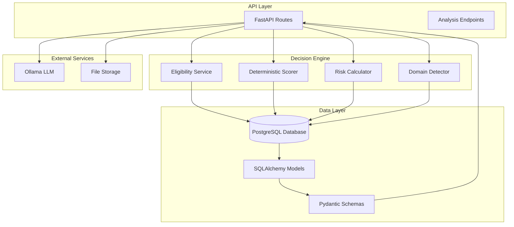

**Diagram sources**
- [hybrid_pipeline.py:1270-1357](file://app/backend/services/hybrid_pipeline.py#L1270-L1357)
- [db_models.py:135-168](file://app/backend/models/db_models.py#L135-L168)
- [schemas.py:89-132](file://app/backend/models/schemas.py#L89-L132)

The engine operates as a middleware layer within the analysis pipeline, receiving processed candidate and job description data, applying deterministic rules, and returning standardized results that integrate seamlessly with the broader platform.

## Core Components

### Eligibility Engine

The eligibility engine serves as the first line of defense in the decision-making process, applying hard-rejection rules before any scoring calculations occur.

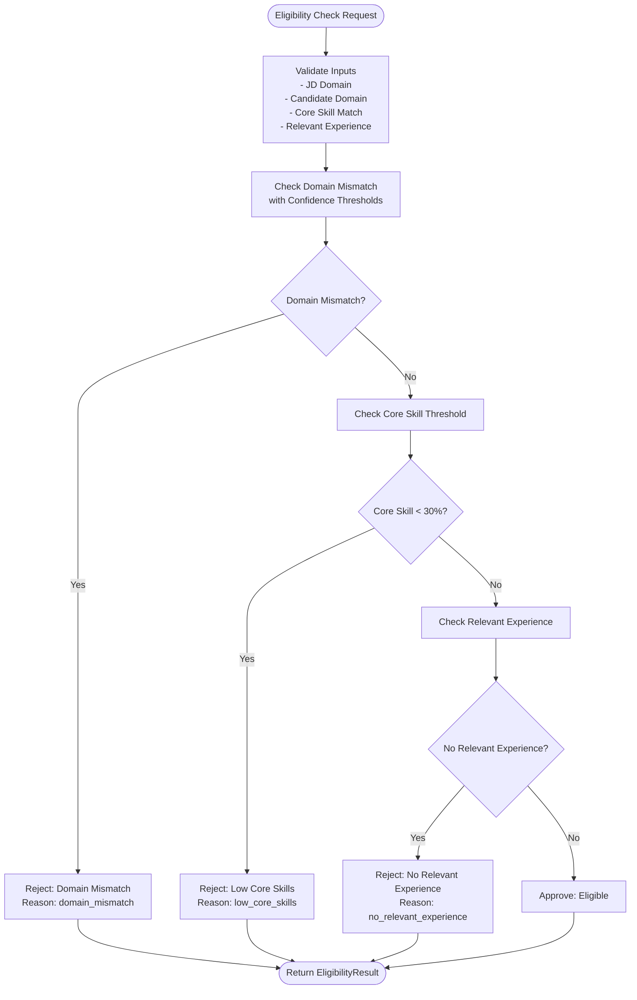

**Diagram sources**
- [eligibility_service.py:17-79](file://app/backend/services/eligibility_service.py#L17-L79)

The eligibility engine applies three primary rules:
1. **Domain Compatibility**: Ensures candidate domain matches job requirements with sufficient confidence
2. **Core Competency Threshold**: Requires minimum core skill match percentage (30%)
3. **Experience Requirement**: Validates presence of relevant work experience

**Section sources**
- [eligibility_service.py:17-79](file://app/backend/services/eligibility_service.py#L17-L79)

### Deterministic Scoring System

The deterministic scoring system calculates a weighted score based on candidate qualifications while applying hard caps determined by eligibility status.

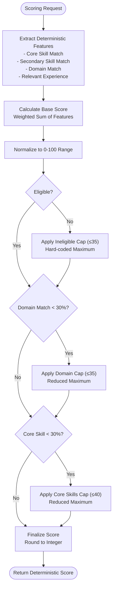

**Diagram sources**
- [fit_scorer.py:117-170](file://app/backend/services/fit_scorer.py#L117-L170)

The scoring system uses a configurable weight distribution:
- Core Skills: 40%
- Secondary Skills: 15%
- Domain Fit: 25%
- Relevant Experience: 20%

**Section sources**
- [fit_scorer.py:117-170](file://app/backend/services/fit_scorer.py#L117-L170)

### Risk Calculation Engine

The risk calculation engine quantifies potential hiring risks based on employment patterns and red flags identified during analysis.

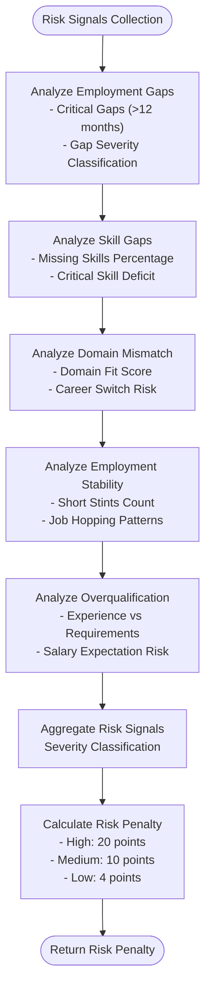

**Diagram sources**
- [risk_calculator.py:6-15](file://app/backend/services/risk_calculator.py#L6-L15)

**Section sources**
- [risk_calculator.py:6-15](file://app/backend/services/risk_calculator.py#L6-L15)

## Eligibility Engine

The eligibility engine implements a comprehensive set of hard-rejection rules designed to prevent unsuitable candidates from advancing in the hiring process.

### Domain Compatibility Rules

The domain compatibility check ensures that candidates have relevant technical expertise for the position:

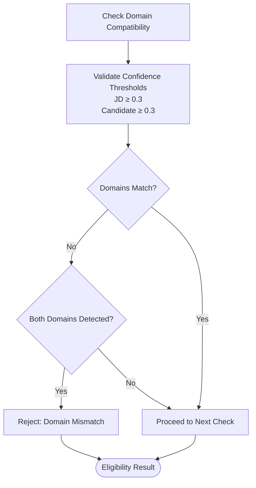

**Diagram sources**
- [eligibility_service.py:38-55](file://app/backend/services/eligibility_service.py#L38-L55)

### Core Competency Threshold

The core competency threshold ensures candidates meet minimum skill requirements:

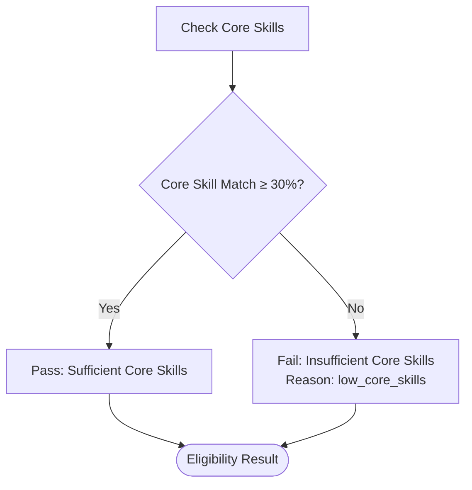

**Diagram sources**
- [eligibility_service.py:57-66](file://app/backend/services/eligibility_service.py#L57-L66)

**Section sources**
- [eligibility_service.py:17-79](file://app/backend/services/eligibility_service.py#L17-L79)

## Deterministic Scoring

The deterministic scoring system provides mathematical precision in candidate evaluation while maintaining transparency and auditability.

### Weight Distribution System

The scoring system uses a configurable weight distribution that can be customized per organization or role:

| Component | Weight | Purpose |
|-----------|--------|---------|
| Core Skills | 40% | Primary technical competency |
| Secondary Skills | 15% | Additional relevant skills |
| Domain Fit | 25% | Technical alignment |
| Relevant Experience | 20% | Practical application |

### Scoring Algorithm

The scoring algorithm follows a strict mathematical process:

1. **Feature Extraction**: Extract normalized feature values (0.0-1.0 scale)
2. **Weighted Sum**: Calculate weighted sum using configured weights
3. **Normalization**: Scale to 0-100 range
4. **Hard Caps**: Apply eligibility-based caps
5. **Finalization**: Round to integer score

### Hard Cap Application

Hard caps ensure that ineligible candidates receive maximum reduction in score:

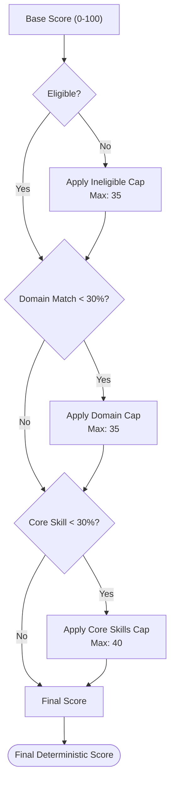

**Diagram sources**
- [fit_scorer.py:158-170](file://app/backend/services/fit_scorer.py#L158-L170)

**Section sources**
- [fit_scorer.py:117-170](file://app/backend/services/fit_scorer.py#L117-L170)

## Risk Calculation

The risk calculation system quantifies potential hiring risks using standardized severity levels and penalty points.

### Risk Signal Categories

The system identifies several categories of risk signals:

| Category | Severity | Description | Penalty Points |
|----------|----------|-------------|----------------|
| Employment Gaps | High | Critical gaps (>12 months) | 20 points |
| Skill Gaps | High | Missing ≥50% required skills | 20 points |
| Domain Mismatch | Medium | Significant career switch risk | 10 points |
| Employment Stability | Medium | ≥3 short stints (<6 months) | 10 points |
| Overqualification | Low | Experience > 2× requirements | 4 points |
| Employment Stability | Low | 2 short stints (<6 months) | 4 points |

### Risk Penalty Calculation

The risk penalty is calculated by aggregating individual signal penalties:

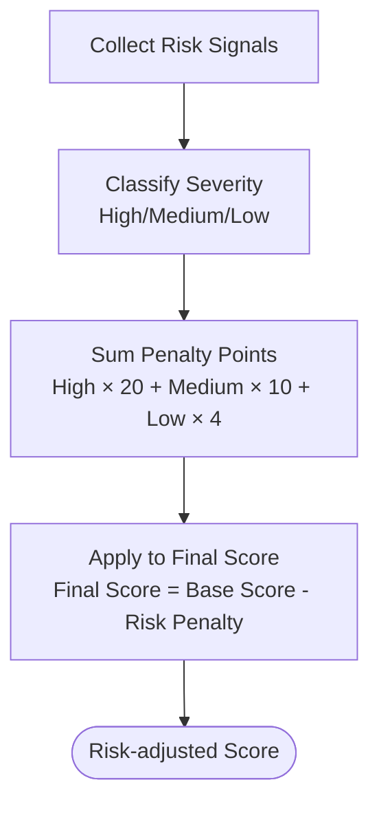

**Diagram sources**
- [risk_calculator.py:12-15](file://app/backend/services/risk_calculator.py#L12-L15)

**Section sources**
- [risk_calculator.py:6-15](file://app/backend/services/risk_calculator.py#L6-L15)

## Domain Detection

The domain detection service identifies technical domains from job descriptions and candidate resumes using keyword matching algorithms.

### Domain Keyword Mapping

The system uses predefined keyword mappings for each domain category:

| Domain | Keywords Count | Example Keywords |
|--------|----------------|------------------|
| Backend | 28 | Django, Flask, PostgreSQL, Redis |
| Frontend | 20 | React, Vue, TypeScript, Tailwind |
| Data Science | 20 | Pandas, NumPy, SQL, ETL |
| ML/AI | 20 | Machine Learning, Neural Network, Transformers |
| DevOps | 18 | Kubernetes, Docker, Terraform, CI/CD |
| Embedded | 18 | RTOS, Microcontroller, ARM Cortex |
| Mobile | 12 | iOS, Android, React Native, Flutter |

### Confidence Scoring Algorithm

The confidence scoring algorithm calculates match strength using keyword density:

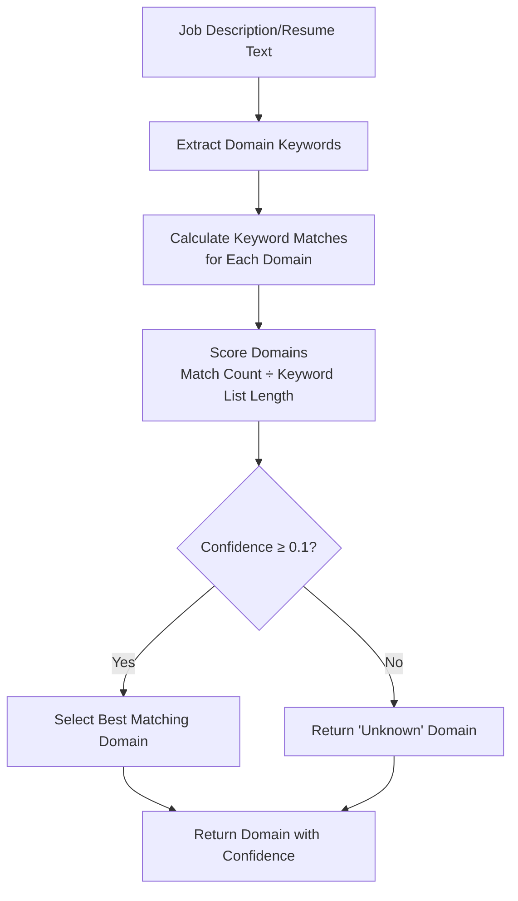

**Diagram sources**
- [domain_service.py:21-41](file://app/backend/services/domain_service.py#L21-L41)

**Section sources**
- [domain_service.py:9-79](file://app/backend/services/domain_service.py#L9-L79)

## Data Model Integration

The Deterministic Decision Engine integrates seamlessly with the platform's data model through dedicated database fields and standardized schemas.

### Database Schema Extensions

The migration script adds essential fields to support deterministic scoring:

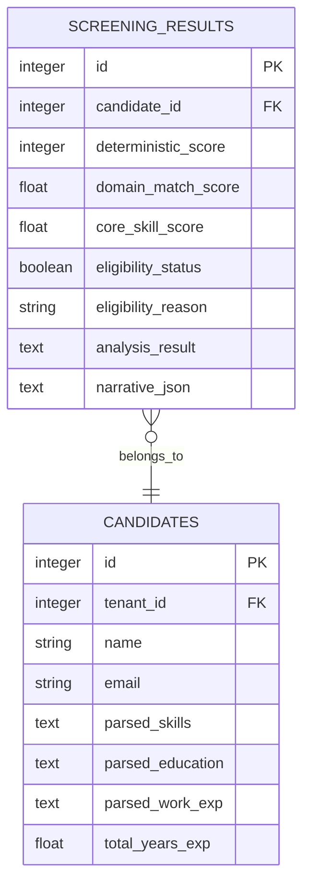

**Diagram sources**
- [016_deterministic_scoring_fields.py:33-66](file://alembic/versions/016_deterministic_scoring_fields.py#L33-L66)
- [db_models.py:135-168](file://app/backend/models/db_models.py#L135-L168)

### Schema Integration

The AnalysisResponse schema includes comprehensive deterministic engine fields:

| Field | Type | Purpose |
|-------|------|---------|
| deterministic_score | Integer | Final deterministic score (0-100) |
| decision_explanation | Dict | Structured explanation of decision |
| jd_domain | Dict | Job description domain detection |
| candidate_domain | Dict | Candidate domain detection |
| eligibility | Dict | Eligibility status and reason |
| deterministic_features | Dict | Raw feature values used in scoring |

**Section sources**
- [schemas.py:125-131](file://app/backend/models/schemas.py#L125-L131)
- [db_models.py:157-162](file://app/backend/models/db_models.py#L157-L162)

## API Integration

The Deterministic Decision Engine integrates with the FastAPI routing system through the hybrid pipeline, providing seamless access to deterministic scoring capabilities.

### Analysis Pipeline Integration

The hybrid pipeline orchestrates the deterministic engine within the broader analysis workflow:

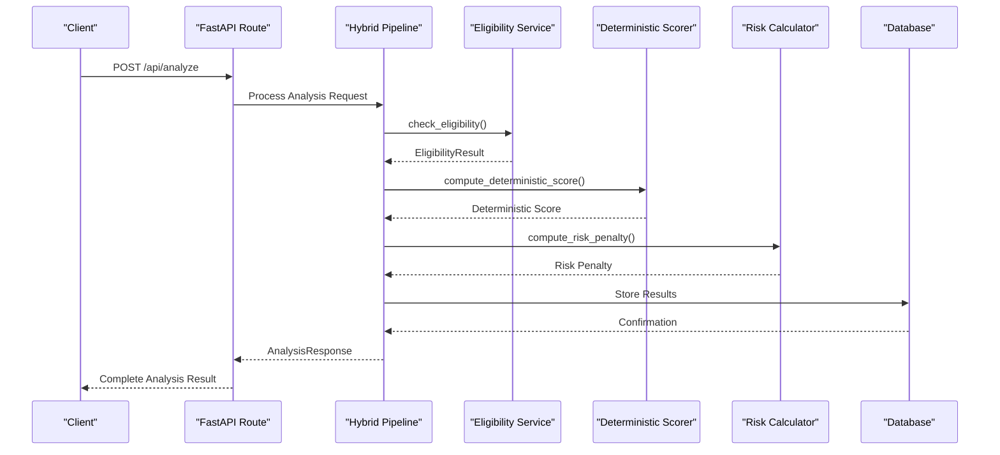

**Diagram sources**
- [hybrid_pipeline.py:1270-1357](file://app/backend/services/hybrid_pipeline.py#L1270-L1357)

### Endpoint Implementation

The integration point in the hybrid pipeline demonstrates the deterministic engine's placement within the analysis workflow:

The deterministic engine is invoked after initial analysis completion, providing a fallback mechanism when LLM processing fails or when organizations require deterministic results.

**Section sources**
- [hybrid_pipeline.py:1270-1357](file://app/backend/services/hybrid_pipeline.py#L1270-L1357)

## Testing Framework

The Deterministic Decision Engine includes comprehensive testing to ensure reliability and accuracy across various scenarios.

### Integration Test Suite

The test suite validates end-to-end functionality through realistic scenarios:

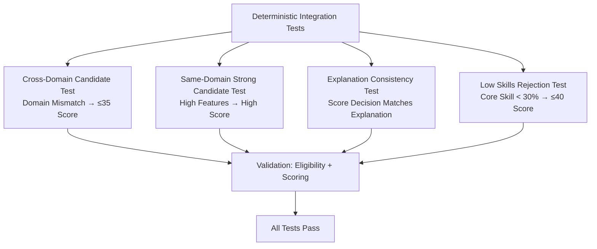

**Diagram sources**
- [test_deterministic_integration.py:13-48](file://app/backend/tests/test_deterministic_integration.py#L13-L48)

### Test Scenarios

The testing framework covers critical decision-making scenarios:

1. **Cross-Domain Rejection**: Candidates with mismatched domains receive capped scores
2. **Same-Domain Excellence**: Strong matches in compatible domains achieve high scores
3. **Explanation Consistency**: Decision rationale aligns with calculated scores
4. **Low Competency Rejection**: Insufficient core skills trigger hard caps

**Section sources**
- [test_deterministic_integration.py:10-156](file://app/backend/tests/test_deterministic_integration.py#L10-L156)

## Performance Considerations

The Deterministic Decision Engine is designed for optimal performance while maintaining accuracy and reliability.

### Computational Efficiency

The engine prioritizes computational efficiency through:

- **Mathematical Operations Only**: No external API calls or complex ML inference
- **Simple Data Structures**: Lightweight dictionaries and numeric calculations
- **Minimal Memory Footprint**: Stateless operations with minimal memory requirements
- **Fast Execution**: Sub-second processing time for all operations

### Scalability Factors

The deterministic nature enables horizontal scaling through:

- **Stateless Design**: No session persistence required
- **Parallel Processing**: Independent operations can run concurrently
- **Database Optimization**: Efficient SQL queries for result storage
- **Caching Opportunities**: Eligibility and domain detection results can be cached

### Resource Requirements

Typical resource consumption for deterministic operations:

- **CPU**: Minimal processing overhead
- **Memory**: <1MB per operation
- **Database**: Standard JSON field storage
- **Network**: Zero external dependencies

## Troubleshooting Guide

Common issues and their resolutions when working with the Deterministic Decision Engine.

### Eligibility Issues

**Problem**: Candidates marked as ineligible despite meeting requirements
**Solution**: Verify domain confidence thresholds and core skill calculation accuracy

**Problem**: Unexpected rejection with "domain_mismatch" reason
**Solution**: Check domain keyword mappings and confidence threshold settings

### Scoring Anomalies

**Problem**: Scores outside expected ranges
**Solution**: Validate feature normalization and weight configuration

**Problem**: Hard caps not applied correctly
**Solution**: Review eligibility status and feature threshold logic

### Risk Calculation Problems

**Problem**: Unexpected risk penalty amounts
**Solution**: Verify risk signal classification and severity mapping

**Problem**: Risk signals not detected
**Solution**: Check employment gap analysis and skill gap detection

### Integration Issues

**Problem**: Deterministic results not appearing in API responses
**Solution**: Verify database field updates and schema serialization

**Problem**: Performance degradation in analysis pipeline
**Solution**: Monitor database query performance and optimize indexing

## Conclusion

The Deterministic Decision Engine represents a significant advancement in AI-powered recruitment platforms, offering transparency, compliance, and reliability that traditional machine learning approaches cannot match. By combining hard-rejection rules, mathematical precision, and comprehensive risk assessment, the engine provides organizations with the tools needed to make fair, consistent, and legally defensible hiring decisions.

Key benefits include:
- **Regulatory Compliance**: Transparent decision-making process suitable for legal scrutiny
- **Predictable Outcomes**: Consistent results across different candidates and time periods
- **Audit Trail**: Complete documentation of decision rationale and calculations
- **Performance**: Fast processing with minimal resource requirements
- **Integration**: Seamless incorporation into existing analysis workflows

The engine's modular design ensures maintainability and extensibility, allowing organizations to customize scoring weights, adjust eligibility thresholds, and adapt to evolving hiring requirements while maintaining the core deterministic principles that make the system reliable and trustworthy.