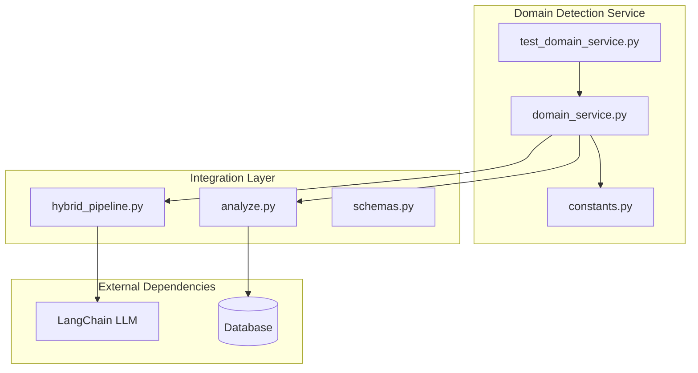
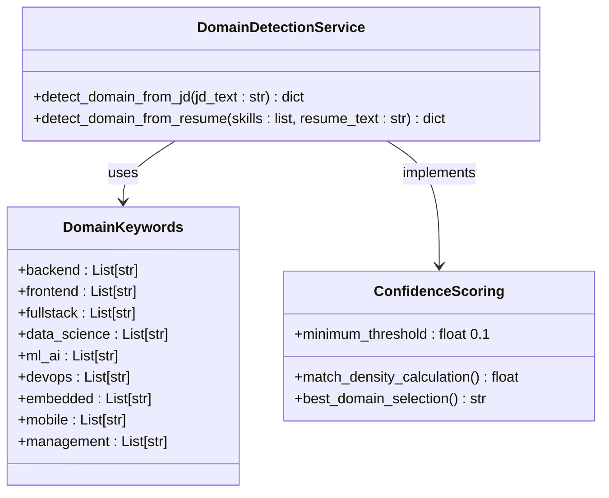
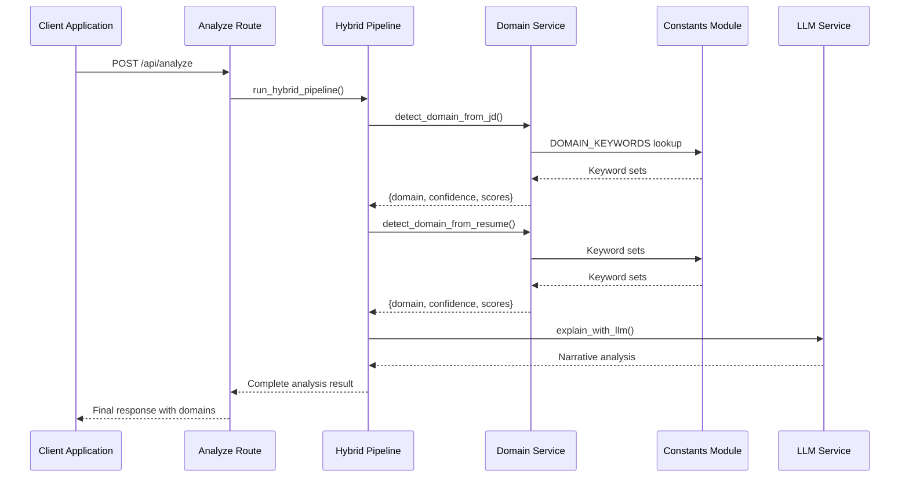
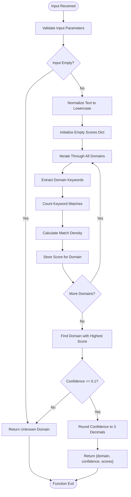
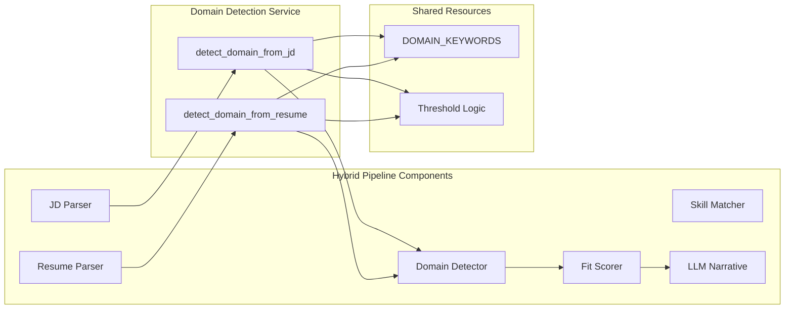
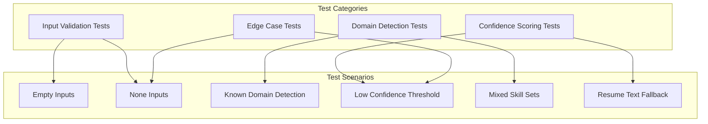

# Domain Detection Service

<cite>
**Referenced Files in This Document**
- [domain_service.py](file://app/backend/services/domain_service.py)
- [constants.py](file://app/backend/services/constants.py)
- [test_domain_service.py](file://app/backend/tests/test_domain_service.py)
- [hybrid_pipeline.py](file://app/backend/services/hybrid_pipeline.py)
- [schemas.py](file://app/backend/models/schemas.py)
- [analyze.py](file://app/backend/routes/analyze.py)
</cite>

## Table of Contents
1. [Introduction](#introduction)
2. [Project Structure](#project-structure)
3. [Core Components](#core-components)
4. [Architecture Overview](#architecture-overview)
5. [Detailed Component Analysis](#detailed-component-analysis)
6. [Integration Points](#integration-points)
7. [Performance Considerations](#performance-considerations)
8. [Testing Strategy](#testing-strategy)
9. [Troubleshooting Guide](#troubleshooting-guide)
10. [Conclusion](#conclusion)

## Introduction

The Domain Detection Service is a core component of the Resume AI platform that automatically identifies professional domains (such as embedded systems, data science, backend development, frontend development, mobile development, DevOps, machine learning/AI, and management) from job descriptions and candidate resumes. This service enables intelligent matching between job requirements and candidate qualifications by analyzing keyword patterns and confidence scores.

The service operates on a simple yet effective principle: it compares input text against predefined keyword sets for each domain category and calculates confidence scores based on keyword match density. The system ensures robust detection by implementing minimum confidence thresholds and providing transparent scoring mechanisms.

## Project Structure

The Domain Detection Service is organized within the backend services layer of the Resume AI application. The service follows a modular architecture with clear separation of concerns:

**Diagram sources**
- [domain_service.py:1-80](file://app/backend/services/domain_service.py#L1-L80)
- [constants.py:45-78](file://app/backend/services/constants.py#L45-L78)
- [hybrid_pipeline.py:38-38](file://app/backend/services/hybrid_pipeline.py#L38-L38)

**Section sources**
- [domain_service.py:1-80](file://app/backend/services/domain_service.py#L1-L80)
- [constants.py:1-158](file://app/backend/services/constants.py#L1-L158)

## Core Components

### Domain Detection Functions

The service provides two primary functions for domain detection:

#### Job Description Domain Detection
The `detect_domain_from_jd()` function analyzes job descriptions to identify the most likely professional domain. It processes the input text, normalizes it to lowercase, and compares against domain-specific keyword sets.

#### Resume Domain Detection
The `detect_domain_from_resume()` function analyzes candidate resumes by combining extracted skills and resume text into a unified searchable corpus, then applies the same domain detection algorithm.

### Domain Keyword Configuration

The service relies on a centralized keyword configuration system that defines domain categories and their associated keywords:

**Diagram sources**
- [domain_service.py:9-80](file://app/backend/services/domain_service.py#L9-L80)
- [constants.py:45-78](file://app/backend/services/constants.py#L45-L78)

**Section sources**
- [domain_service.py:9-80](file://app/backend/services/domain_service.py#L9-L80)
- [constants.py:45-78](file://app/backend/services/constants.py#L45-L78)

## Architecture Overview

The Domain Detection Service integrates seamlessly into the broader Resume AI analysis pipeline through a multi-layered architecture:

**Diagram sources**
- [analyze.py:38-43](file://app/backend/routes/analyze.py#L38-L43)
- [hybrid_pipeline.py:38-38](file://app/backend/services/hybrid_pipeline.py#L38-L38)
- [domain_service.py:9-80](file://app/backend/services/domain_service.py#L9-L80)

The architecture ensures that domain detection occurs early in the pipeline, providing crucial context for subsequent analysis stages including skill matching, experience evaluation, and final recommendation generation.

## Detailed Component Analysis

### Domain Detection Algorithm

The core detection algorithm implements a sophisticated keyword matching system with confidence scoring:

**Diagram sources**
- [domain_service.py:21-41](file://app/backend/services/domain_service.py#L21-L41)
- [domain_service.py:54-79](file://app/backend/services/domain_service.py#L54-L79)

### Domain Categories and Keywords

The service supports nine distinct professional domains, each with carefully curated keyword sets:

| Domain Category | Primary Keywords | Secondary Keywords |
|----------------|------------------|-------------------|
| Backend | fastapi, django, spring, rest api, postgresql, microservices | server side, api development, database design |
| Frontend | react, vue, angular, next.js, tailwind, html, css | ui development, responsive design |
| Data Science | pandas, numpy, scikit-learn, data analysis, etl | statistics, tableau, feature engineering |
| ML/AI | machine learning, deep learning, neural network, transformers | llm, computer vision, mlops |
| DevOps | kubernetes, docker, terraform, ansible, jenkins | ci/cd, infrastructure as code, monitoring |
| Embedded | embedded, firmware, rtos, microcontroller, device driver | real-time, baremetal, freertos |
| Mobile | ios, android, react native, flutter, swift, kotlin | mobile app, push notification |
| Management | product manager, engineering manager, team lead | roadmap, stakeholder, okr |

### Confidence Scoring Mechanism

The confidence calculation employs a match density algorithm that normalizes keyword matches against the total number of keywords in each domain category:

**Confidence Formula**: `Confidence = (Number of Matching Keywords) / (Total Keywords in Domain)`

The system implements a minimum confidence threshold of 0.1 to prevent false positives and ensure reliable domain identification.

**Section sources**
- [domain_service.py:9-80](file://app/backend/services/domain_service.py#L9-L80)
- [constants.py:45-78](file://app/backend/services/constants.py#L45-L78)

## Integration Points

### Hybrid Pipeline Integration

The Domain Detection Service integrates deeply with the Hybrid Pipeline through multiple touchpoints:

**Diagram sources**
- [hybrid_pipeline.py:511-546](file://app/backend/services/hybrid_pipeline.py#L511-L546)
- [domain_service.py:9-80](file://app/backend/services/domain_service.py#L9-L80)

### Schema Integration

The domain detection results are integrated into the analysis response schema through dedicated fields:

| Schema Field | Purpose | Data Type | Example Value |
|-------------|---------|-----------|---------------|
| `jd_domain` | Job description domain analysis | Dict | `{"domain": "backend", "confidence": 0.75, "scores": {...}}` |
| `candidate_domain` | Candidate domain analysis | Dict | `{"domain": "fullstack", "confidence": 0.60, "scores": {...}}` |
| `eligibility` | Domain-based eligibility assessment | Dict | `{"domain_fit": true, "reason": "Required skills match"}` |

**Section sources**
- [schemas.py:125-131](file://app/backend/models/schemas.py#L125-L131)
- [hybrid_pipeline.py:511-546](file://app/backend/services/hybrid_pipeline.py#L511-L546)

## Performance Considerations

### Algorithm Complexity Analysis

The domain detection algorithm exhibits optimal performance characteristics:

- **Time Complexity**: O(D × K × N) where D = number of domains, K = average keywords per domain, N = length of input text
- **Space Complexity**: O(D + K) for storing domain scores and keyword sets
- **Memory Usage**: Minimal overhead with constant memory allocation per detection operation

### Optimization Strategies

The service implements several optimization techniques:

1. **Early Termination**: Returns immediately for empty or invalid inputs
2. **Lazy Evaluation**: Processes domains incrementally without pre-computing all scores
3. **String Normalization**: Converts input to lowercase once per operation
4. **Keyword Pre-filtering**: Uses efficient string containment checks

### Scalability Considerations

The service scales linearly with input size and maintains consistent performance across different domain categories. The modular design allows for easy horizontal scaling and caching of frequently accessed keyword sets.

## Testing Strategy

### Unit Testing Approach

The Domain Detection Service employs comprehensive unit testing covering all major functionality scenarios:

**Diagram sources**
- [test_domain_service.py:11-107](file://app/backend/tests/test_domain_service.py#L11-L107)

### Test Coverage Areas

The testing suite ensures comprehensive coverage of:

- **Input Validation**: Empty strings, None values, and malformed inputs
- **Domain Detection Accuracy**: Correct identification of embedded, backend, data science domains
- **Confidence Thresholds**: Proper handling of low-confidence matches
- **Resume Analysis**: Mixed skill sets and text fallback scenarios
- **Output Structure**: Consistent dictionary shape and data types

**Section sources**
- [test_domain_service.py:1-108](file://app/backend/tests/test_domain_service.py#L1-L108)

## Troubleshooting Guide

### Common Issues and Solutions

#### Issue: Unknown Domain Returned
**Symptoms**: Domain detection returns "unknown" with confidence 0.0
**Causes**: 
- Empty or insufficient input text
- Keywords not present in input
- Input below minimum length requirements

**Solutions**:
- Verify input contains sufficient domain-relevant keywords
- Check for proper text normalization
- Ensure minimum word count requirements are met

#### Issue: Low Confidence Scores
**Symptoms**: Domain detection returns with confidence < 0.1
**Causes**:
- Insufficient keyword matches
- Ambiguous job descriptions
- Mixed domain requirements

**Solutions**:
- Expand keyword sets for underrepresented domains
- Improve job description quality
- Consider domain combination strategies

#### Issue: Performance Degradation
**Symptoms**: Slow response times with large inputs
**Causes**:
- Excessive input text size
- Memory allocation issues
- Inefficient keyword matching

**Solutions**:
- Implement input text truncation
- Optimize keyword matching algorithms
- Add caching mechanisms for repeated queries

### Debugging Tools

The service provides transparent scoring mechanisms for debugging:

- **Score Dictionary**: Detailed per-domain match counts for analysis
- **Confidence Metrics**: Numerical confidence values for threshold tuning
- **Keyword Analysis**: Individual keyword match verification

**Section sources**
- [domain_service.py:15-41](file://app/backend/services/domain_service.py#L15-L41)
- [domain_service.py:51-79](file://app/backend/services/domain_service.py#L51-L79)

## Conclusion

The Domain Detection Service represents a robust, scalable solution for automated professional domain identification within the Resume AI platform. Its modular architecture, comprehensive testing strategy, and integration capabilities make it a cornerstone component of the intelligent matching system.

The service successfully balances accuracy with performance, providing reliable domain detection across diverse input scenarios while maintaining transparency through detailed scoring mechanisms. The centralized keyword management system ensures consistency and facilitates easy maintenance and expansion of domain categories.

Future enhancements could include machine learning-based domain classification, dynamic keyword adaptation, and enhanced cross-domain matching capabilities to further improve the accuracy and reliability of the domain detection process.