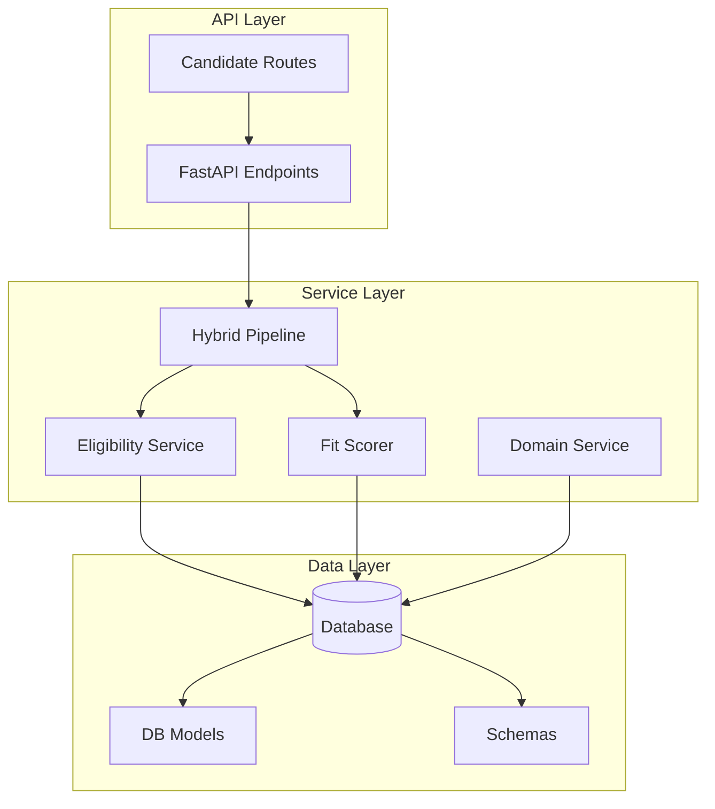
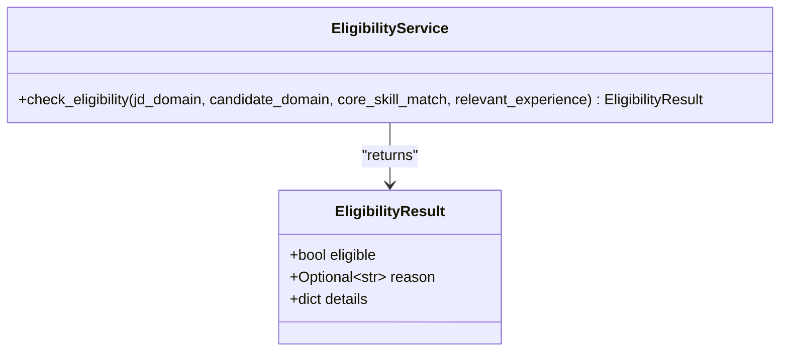
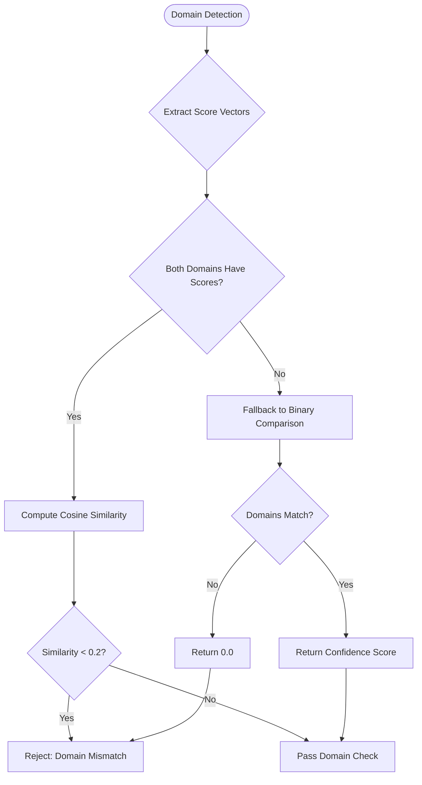
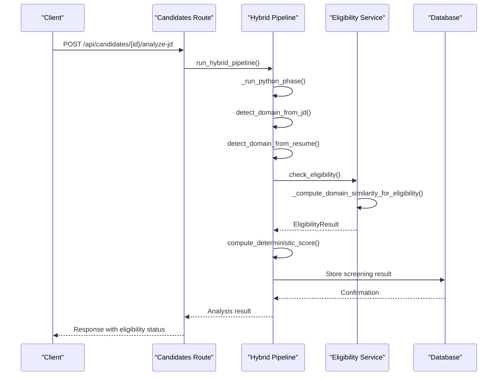
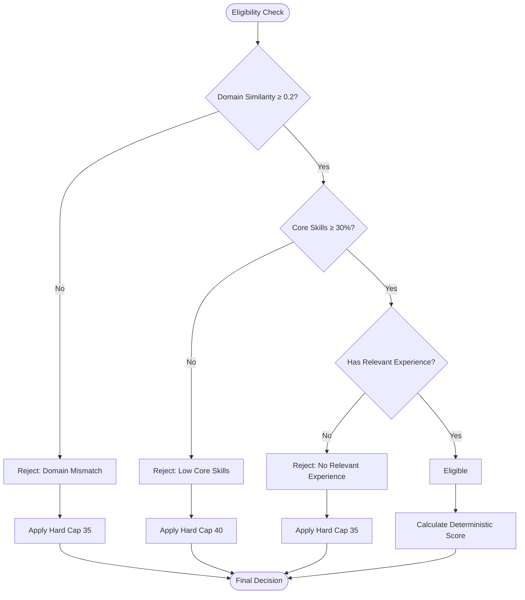
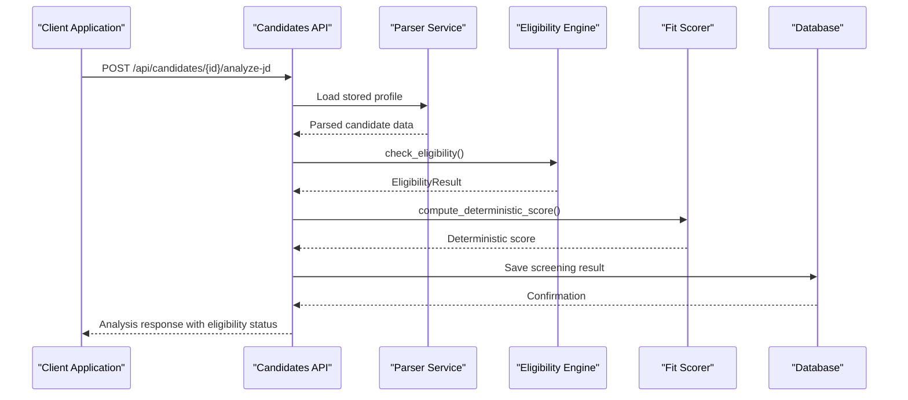
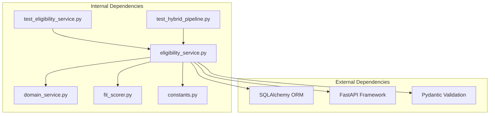

# Eligibility Engine

<cite>
**Referenced Files in This Document**
- [eligibility_service.py](file://app/backend/services/eligibility_service.py)
- [hybrid_pipeline.py](file://app/backend/services/hybrid_pipeline.py)
- [fit_scorer.py](file://app/backend/services/fit_scorer.py)
- [domain_service.py](file://app/backend/services/domain_service.py)
- [db_models.py](file://app/backend/models/db_models.py)
- [schemas.py](file://app/backend/models/schemas.py)
- [candidates.py](file://app/backend/routes/candidates.py)
- [test_eligibility_service.py](file://app/backend/tests/test_eligibility_service.py)
- [test_hybrid_pipeline.py](file://app/backend/tests/test_hybrid_pipeline.py)
- [016_deterministic_scoring_fields.py](file://alembic/versions/016_deterministic_scoring_fields.py)
</cite>

## Update Summary
**Changes Made**
- Enhanced domain matching algorithm with cosine similarity calculations replacing binary matching
- Added new threshold-based system (0.2) for domain similarity rejection
- Improved domain similarity computation with vector operations
- Added backward compatibility support for string-based domain arguments
- Updated eligibility criteria to use similarity-based domain matching
- Enhanced domain similarity testing with comprehensive test coverage

## Table of Contents
1. [Introduction](#introduction)
2. [Project Structure](#project-structure)
3. [Core Components](#core-components)
4. [Architecture Overview](#architecture-overview)
5. [Detailed Component Analysis](#detailed-component-analysis)
6. [Dependency Analysis](#dependency-analysis)
7. [Performance Considerations](#performance-considerations)
8. [Troubleshooting Guide](#troubleshooting-guide)
9. [Conclusion](#conclusion)

## Introduction

The Eligibility Engine is a deterministic filtering system that serves as the first line of screening in the ARIA (AI Resume Intelligence) platform. It applies hard-reject gates to candidates before any machine learning scoring occurs, ensuring that only qualified candidates proceed through the more computationally expensive analysis phases.

**Updated**: The engine now features an enhanced domain matching algorithm using cosine similarity calculations, replacing the previous binary matching approach. This provides more nuanced domain compatibility assessment with a threshold-based rejection system (0.2) for domain similarity.

The engine operates as a gatekeeper, evaluating candidates against three primary criteria: domain compatibility, core skill match quality, and relevant work experience. It provides structured rejection reasons and maintains detailed audit trails for compliance and transparency.

## Project Structure

The Eligibility Engine is integrated into the broader ARIA platform through several key architectural layers:



**Diagram sources**
- [candidates.py:351-501](file://app/backend/routes/candidates.py#L351-L501)
- [hybrid_pipeline.py:1266-1357](file://app/backend/services/hybrid_pipeline.py#L1266-L1357)

**Section sources**
- [eligibility_service.py:1-80](file://app/backend/services/eligibility_service.py#L1-L80)
- [hybrid_pipeline.py:1222-1357](file://app/backend/services/hybrid_pipeline.py#L1222-L1357)

## Core Components

### EligibilityResult Data Structure

The Eligibility Engine uses a structured data model to represent screening outcomes:



**Diagram sources**
- [eligibility_service.py:10-14](file://app/backend/services/eligibility_service.py#L10-L14)
- [eligibility_service.py:17-79](file://app/backend/services/eligibility_service.py#L17-L79)

### Enhanced Domain Matching Algorithm

**Updated**: The domain compatibility check now uses cosine similarity calculations for more sophisticated domain matching:



**Diagram sources**
- [eligibility_service.py:23-50](file://app/backend/services/eligibility_service.py#L23-L50)

### Deterministic Screening Criteria

The engine applies three primary rejection gates with enhanced domain compatibility:

1. **Enhanced Domain Mismatch Gate**: Uses cosine similarity (threshold: 0.2) to assess domain compatibility
2. **Core Skill Threshold**: Rejects candidates with insufficient core skill matches  
3. **Experience Requirement**: Rejects candidates with zero relevant experience

**Section sources**
- [eligibility_service.py:38-79](file://app/backend/services/eligibility_service.py#L38-L79)

## Architecture Overview

The Eligibility Engine is seamlessly integrated into the hybrid analysis pipeline, operating as the first stage of candidate evaluation:



**Diagram sources**
- [candidates.py:351-501](file://app/backend/routes/candidates.py#L351-L501)
- [hybrid_pipeline.py:1266-1357](file://app/backend/services/hybrid_pipeline.py#L1266-L1357)

The integration ensures that eligibility decisions are made before any LLM processing, optimizing computational resources and providing immediate feedback to users.

## Detailed Component Analysis

### Eligibility Service Implementation

**Updated**: The core eligibility checking logic now implements enhanced three-tier screening with cosine similarity-based domain matching:

#### Enhanced Domain Compatibility Check
The domain mismatch gate now uses cosine similarity with a threshold-based rejection system:
- Computes cosine similarity between JD and candidate domain score vectors
- Uses threshold of 0.2 for domain similarity rejection
- Falls back to binary name comparison when score vectors are unavailable
- Provides detailed breakdown of similarity scores and confidence levels

#### Core Skill Evaluation
The core skill threshold enforces minimum competency standards:
- Accepts candidates with `core_skill_match >= 0.3`
- Rejects candidates below this threshold regardless of other factors
- Maintains detailed metrics for audit purposes

#### Experience Requirement
The experience gate ensures meaningful professional background:
- Requires `relevant_experience > 0` for consideration
- Provides quantitative details about experience levels
- Supports both years-based and normalized experience scoring

**Section sources**
- [eligibility_service.py:38-79](file://app/backend/services/eligibility_service.py#L38-L79)

### Enhanced Domain Similarity Computation

**New**: The `_compute_domain_similarity_for_eligibility` function implements sophisticated vector-based similarity calculation:

```mermaid
flowchart TD
Input[JD Domain + Candidate Domain] --> Extract[Extract Score Vectors]
Extract --> CheckEmpty{Empty Score Vectors?}
CheckEmpty --> |Yes| BinaryCompare[Binary Name Comparison]
CheckEmpty --> |No| VectorOps[Vector Operations]
VectorOps --> UnionDomains[Union All Domains]
VectorOps --> DotProduct[Calculate Dot Product]
VectorOps --> Magnitude[Calculate Vector Magnitudes]
DotProduct --> CosineSim[cosine_similarity = dot/(|A||B|)]
Magnitude --> CosineSim
BinaryCompare --> BinaryResult{Name Match?}
BinaryResult --> |Yes| ReturnJDConf[Return JD Confidence]
BinaryResult --> |No| ReturnZero[Return 0.0]
CosineSim --> Round[Round to 3 Decimal Places]
ReturnJDConf --> Output
ReturnZero --> Output
Round --> Output
```

**Diagram sources**
- [eligibility_service.py:23-50](file://app/backend/services/eligibility_service.py#L23-L50)

### Deterministic Scoring Integration

The eligibility results directly influence the deterministic scoring system:



**Diagram sources**
- [fit_scorer.py:117-170](file://app/backend/services/fit_scorer.py#L117-L170)
- [eligibility_service.py:38-79](file://app/backend/services/eligibility_service.py#L38-L79)

### Database Integration

The eligibility engine's results are persisted in the database for audit and reporting:

| Database Column | Purpose | Data Type |
|----------------|---------|-----------|
| `eligibility_status` | Pass/fail status | Boolean |
| `eligibility_reason` | Structured rejection reason | String (100 chars) |
| `deterministic_score` | Hard-capped score | Integer (0-100) |
| `domain_match_score` | Domain compatibility metric | Float (0.0-1.0) |
| `core_skill_score` | Core skill match ratio | Float (0.0-1.0) |

**Section sources**
- [db_models.py:157-168](file://app/backend/models/db_models.py#L157-L168)
- [016_deterministic_scoring_fields.py:1-73](file://alembic/versions/016_deterministic_scoring_fields.py#L1-L73)

### API Integration

The eligibility engine is exposed through the candidate analysis endpoint:



**Diagram sources**
- [candidates.py:351-501](file://app/backend/routes/candidates.py#L351-L501)
- [hybrid_pipeline.py:1266-1357](file://app/backend/services/hybrid_pipeline.py#L1266-L1357)

**Section sources**
- [candidates.py:351-501](file://app/backend/routes/candidates.py#L351-L501)

## Dependency Analysis

The Eligibility Engine has minimal external dependencies, relying primarily on internal services:



**Diagram sources**
- [hybrid_pipeline.py:38-45](file://app/backend/services/hybrid_pipeline.py#L38-L45)
- [fit_scorer.py:5-9](file://app/backend/services/fit_scorer.py#L5-L9)

The engine's design minimizes coupling to external systems, making it maintainable and testable. The primary dependencies are internal service components that provide domain detection and scoring capabilities.

**Section sources**
- [hybrid_pipeline.py:38-45](file://app/backend/services/hybrid_pipeline.py#L38-L45)
- [fit_scorer.py:5-9](file://app/backend/services/fit_scorer.py#L5-L9)

## Performance Considerations

The Eligibility Engine is designed for optimal performance through several mechanisms:

### Computational Efficiency
- **Vector operations**: Cosine similarity calculations use efficient dot product and magnitude computations
- **Early termination**: The first failing gate immediately rejects candidates
- **Minimal memory footprint**: Uses lightweight data structures and avoids complex data transformations
- **Backward compatibility**: String-based domain arguments fall back to binary comparison for simplicity

### Resource Optimization
- **Pre-filtering**: Eliminates candidates before expensive LLM processing
- **Cached domain detection**: Leverages pre-computed domain confidence scores
- **Efficient scoring**: Deterministic calculations avoid iterative optimization
- **Threshold-based rejection**: Reduces unnecessary similarity computations

### Scalability Features
- **Parallel processing**: Eligibility checks are independent and can be parallelized
- **Database persistence**: Results are cached for quick retrieval in subsequent analyses
- **Configurable thresholds**: Gate parameters can be tuned for different use cases
- **Vector similarity scaling**: Cosine similarity handles varying domain vector sizes efficiently

## Troubleshooting Guide

### Common Issues and Solutions

#### Eligibility Gate Failures
**Issue**: Candidates being incorrectly rejected despite meeting requirements
**Causes**:
- Low domain similarity scores (< 0.2)
- Insufficient core skill match ratios
- Zero relevant experience values

**Solutions**:
- Verify domain detection accuracy by checking similarity threshold
- Adjust scoring weights to account for domain-specific requirements
- Review experience calculation logic for edge cases

#### Performance Degradation
**Issue**: Slow eligibility processing affecting overall pipeline performance
**Diagnosis**:
- Monitor domain detection latency
- Check database query performance for cached results
- Profile scoring calculations for bottlenecks

**Resolution**:
- Implement domain detection caching strategies
- Optimize database indexing for frequently queried fields
- Consider asynchronous processing for complex calculations

#### Integration Problems
**Issue**: Eligibility results not appearing in analysis responses
**Investigation**:
- Verify database migration completion for new columns
- Check API endpoint integration in hybrid pipeline
- Validate schema serialization for eligibility data

**Fixes**:
- Run database migrations to add eligibility tracking columns
- Ensure proper error handling in eligibility calculation
- Validate response schema includes eligibility fields

#### Backward Compatibility Issues
**Issue**: Legacy string-based domain arguments causing unexpected behavior
**Solution**:
- Verify that string domains are properly converted to dictionary format
- Check confidence fallback values for string-based domains
- Ensure consistent behavior between string and dictionary domain inputs

**Section sources**
- [test_eligibility_service.py:8-124](file://app/backend/tests/test_eligibility_service.py#L8-L124)

## Conclusion

The Eligibility Engine represents a sophisticated yet efficient screening mechanism that forms the foundation of the ARIA platform's candidate evaluation system. Its enhanced domain matching algorithm with cosine similarity calculations provides more nuanced compatibility assessment while maintaining high performance standards.

**Updated**: Key improvements include:
- **Enhanced domain matching**: Cosine similarity calculations replace binary matching for more accurate domain compatibility assessment
- **Threshold-based rejection**: 0.2 similarity threshold provides balanced domain compatibility enforcement
- **Vector operations**: Efficient dot product and magnitude calculations for similarity computation
- **Backward compatibility**: String-based domain arguments continue to work with binary fallback logic
- **Comprehensive testing**: Extensive test coverage for similarity calculations and eligibility scenarios

Key strengths include:
- **Predictable behavior**: Deterministic rules eliminate ambiguity in screening decisions
- **Performance optimization**: Early rejection reduces computational overhead
- **Audit capability**: Comprehensive tracking enables compliance and improvement
- **Integration flexibility**: Seamless incorporation into existing analysis pipelines
- **Advanced similarity matching**: Vector-based domain assessment improves accuracy

The engine's design supports both current operational needs and future scalability requirements, making it a cornerstone component of the platform's intelligent screening capabilities.