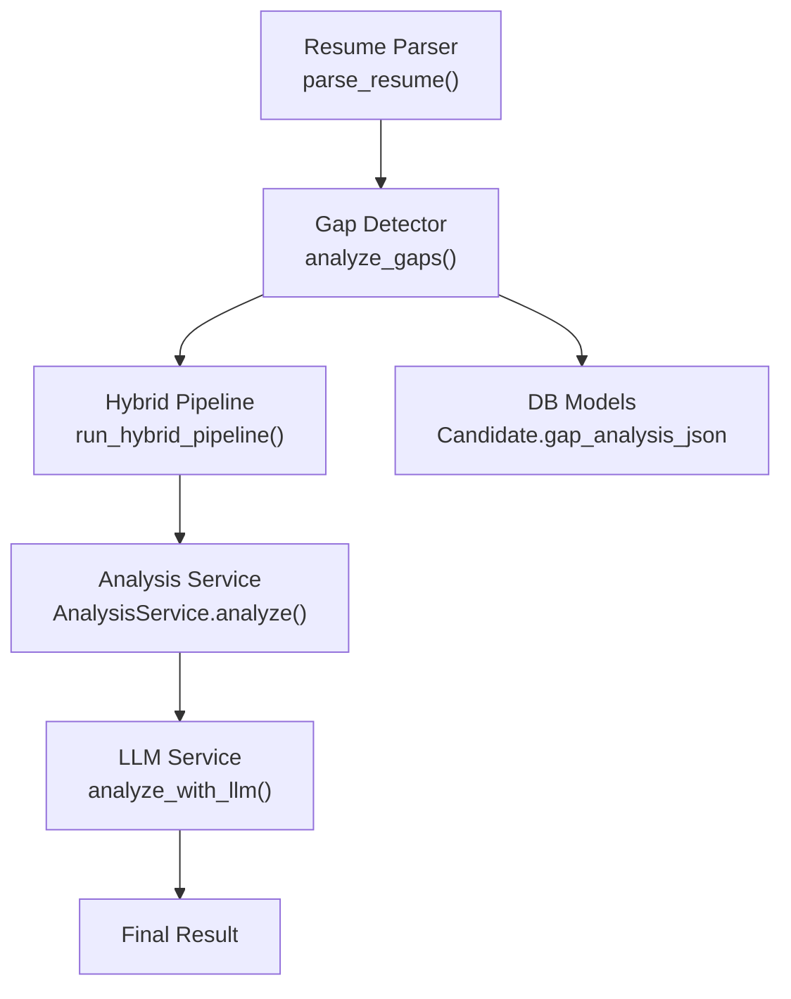
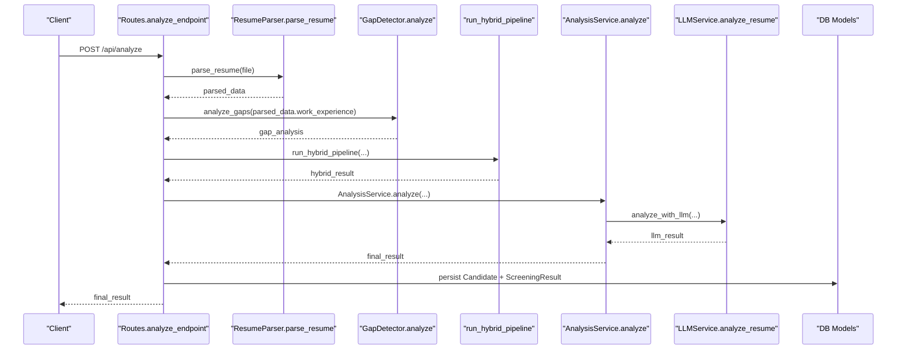
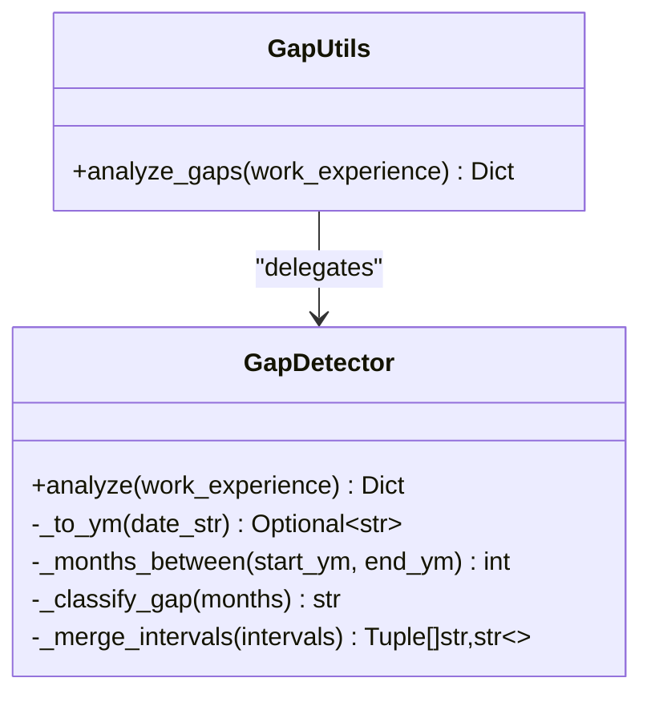
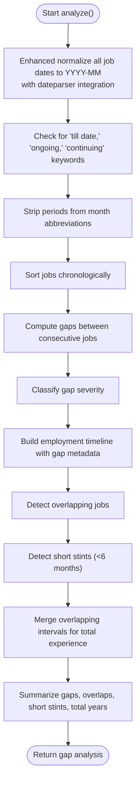
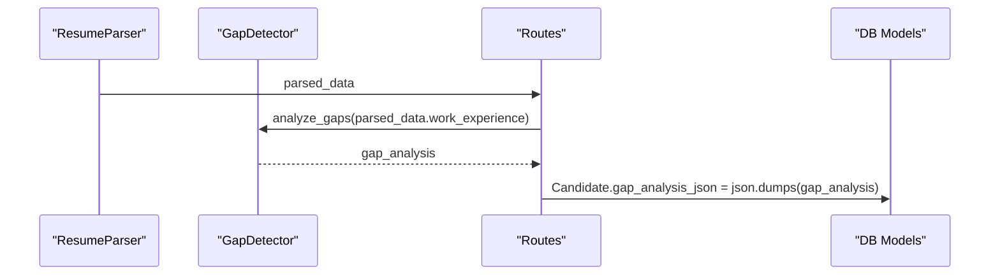
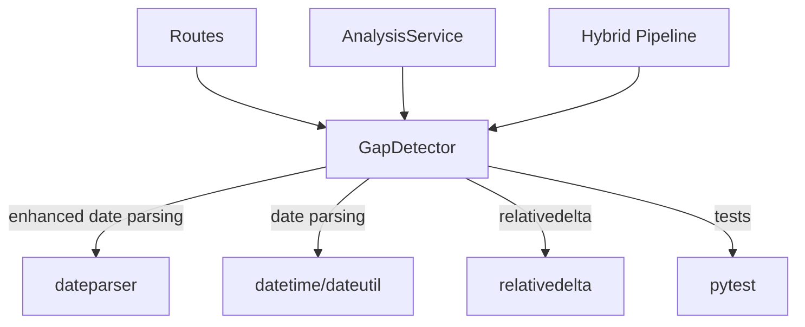

# Employment Gap Detection

<cite>
**Referenced Files in This Document**
- [gap_detector.py](file://app/backend/services/gap_detector.py)
- [test_gap_detector.py](file://app/backend/tests/test_gap_detector.py)
- [test_parser_overhaul.py](file://app/backend/tests/test_parser_overhaul.py)
- [analyze.py](file://app/backend/routes/analyze.py)
- [parser_service.py](file://app/backend/services/parser_service.py)
- [analysis_service.py](file://app/backend/services/analysis_service.py)
- [llm_service.py](file://app/backend/services/llm_service.py)
- [hybrid_pipeline.py](file://app/backend/services/hybrid_pipeline.py)
- [db_models.py](file://app/backend/models/db_models.py)
- [README.md](file://README.md)
</cite>

## Update Summary
**Changes Made**
- Enhanced date normalization with dateparser integration for improved format coverage
- Added support for 'till date,' 'ongoing,' and 'continuing' keywords as present/ongoing indicators
- Improved month abbreviation normalization by stripping periods from month abbreviations
- Updated test coverage to validate new date parsing capabilities

## Table of Contents
1. [Introduction](#introduction)
2. [Project Structure](#project-structure)
3. [Core Components](#core-components)
4. [Architecture Overview](#architecture-overview)
5. [Detailed Component Analysis](#detailed-component-analysis)
6. [Dependency Analysis](#dependency-analysis)
7. [Performance Considerations](#performance-considerations)
8. [Troubleshooting Guide](#troubleshooting-guide)
9. [Conclusion](#conclusion)
10. [Appendices](#appendices)

## Introduction
This document explains the employment gap detection algorithm that analyzes work history patterns to identify potential gaps and career transitions. It covers the gap calculation methodology, temporal analysis algorithms, and pattern recognition techniques. It documents the scoring system for gap severity, transition likelihood, and career stability assessment, along with integration points to resume parsing, validation against employment records, and correlation with skill development patterns. The document also includes examples of gap detection scenarios, false positive reduction techniques, confidence scoring, and how gap analysis contributes to overall candidate evaluation and risk assessment.

**Updated** Enhanced with improved date normalization capabilities using dateparser integration and expanded keyword support for present/ongoing dates.

## Project Structure
The employment gap detection lives in a dedicated service module and integrates with the resume parsing pipeline and the hybrid analysis pipeline. The key files are:
- Gap detection service: [gap_detector.py](file://app/backend/services/gap_detector.py)
- Gap detection tests: [test_gap_detector.py](file://app/backend/tests/test_gap_detector.py)
- Parser overhaul tests: [test_parser_overhaul.py](file://app/backend/tests/test_parser_overhaul.py)
- Resume parsing: [parser_service.py](file://app/backend/services/parser_service.py)
- Route orchestration: [analyze.py](file://app/backend/routes/analyze.py)
- Analysis service (risk signals and LLM integration): [analysis_service.py](file://app/backend/services/analysis_service.py)
- LLM service: [llm_service.py](file://app/backend/services/llm_service.py)
- Hybrid pipeline (skills, education, scoring): [hybrid_pipeline.py](file://app/backend/services/hybrid_pipeline.py)
- Data models (storage of gap analysis): [db_models.py](file://app/backend/models/db_models.py)

**Diagram sources**
- [gap_detector.py:103-218](file://app/backend/services/gap_detector.py#L103-L218)
- [parser_service.py:547-552](file://app/backend/services/parser_service.py#L547-L552)
- [analyze.py:268-318](file://app/backend/routes/analyze.py#L268-L318)
- [analysis_service.py:6-53](file://app/backend/services/analysis_service.py#L6-L53)
- [llm_service.py:139-156](file://app/backend/services/llm_service.py#L139-L156)
- [db_models.py:97-126](file://app/backend/models/db_models.py#L97-L126)

**Section sources**
- [README.md:9-20](file://README.md#L9-L20)
- [gap_detector.py:1-219](file://app/backend/services/gap_detector.py#L1-L219)
- [parser_service.py:193-202](file://app/backend/services/parser_service.py#L193-L202)
- [analyze.py:268-318](file://app/backend/routes/analyze.py#L268-L318)

## Core Components
- GapDetector: Implements enhanced date normalization with dateparser integration, interval merging, gap classification, and timeline construction.
- analyze_gaps(): Top-level function to run gap detection on parsed work experience.
- ResumeParser: Extracts work experience from resume text, including start/end dates and company/title with improved keyword handling.
- Routes: Orchestrates parsing, gap analysis, hybrid pipeline, and persistence.
- AnalysisService: Aggregates risk signals (overlaps, short stints) and coordinates LLM analysis.
- LLM Service: Generates narrative and risk signals using a local LLM.
- Hybrid Pipeline: Provides skills, education, and scoring context for gap analysis.

**Updated** Enhanced with improved date parsing capabilities and expanded keyword support.

**Section sources**
- [gap_detector.py:103-218](file://app/backend/services/gap_detector.py#L103-L218)
- [parser_service.py:193-202](file://app/backend/services/parser_service.py#L193-L202)
- [analyze.py:268-318](file://app/backend/routes/analyze.py#L268-L318)
- [analysis_service.py:6-53](file://app/backend/services/analysis_service.py#L6-L53)
- [llm_service.py:139-156](file://app/backend/services/llm_service.py#L139-L156)
- [hybrid_pipeline.py:604-637](file://app/backend/services/hybrid_pipeline.py#L604-L637)

## Architecture Overview
The gap detection pipeline follows a clear separation of concerns with enhanced date processing:
- Parsing: ResumeParser extracts work experience entries with start/end dates, recognizing 'till date,' 'ongoing,' and 'continuing' keywords.
- Gap Detection: GapDetector normalizes dates using dateparser for better format coverage, merges overlapping intervals, computes gaps, and builds a timeline.
- Hybrid Pipeline: Skills and education scoring inform the broader analysis.
- LLM Integration: AnalysisService prepares risk signals and passes metrics to LLM for narrative synthesis.
- Persistence: Gap analysis results are stored in Candidate.gap_analysis_json for reuse.

**Diagram sources**
- [analyze.py:268-318](file://app/backend/routes/analyze.py#L268-L318)
- [parser_service.py:547-552](file://app/backend/services/parser_service.py#L547-L552)
- [gap_detector.py:217-218](file://app/backend/services/gap_detector.py#L217-L218)
- [analysis_service.py:10-53](file://app/backend/services/analysis_service.py#L10-L53)
- [llm_service.py:139-156](file://app/backend/services/llm_service.py#L139-L156)
- [db_models.py:97-146](file://app/backend/models/db_models.py#L97-L146)

## Detailed Component Analysis

### Enhanced Gap Detection Algorithm
The GapDetector performs enhanced date normalization with dateparser integration:
- **Date normalization** to YYYY-MM format with robust parsing for fuzzy inputs, including 'till date,' 'ongoing,' and 'continuing' keywords.
- **Improved month abbreviation handling** by stripping periods from month abbreviations (e.g., "JAN." → "JAN").
- Gap calculation between consecutive jobs.
- Severity classification thresholds for gaps.
- Overlap-aware total experience via interval merging to prevent double counting.
- Timeline construction with gap metadata for downstream analysis.

**Diagram sources**
- [gap_detector.py:103-218](file://app/backend/services/gap_detector.py#L103-L218)

Key behaviors validated by tests:
- **Enhanced date normalization** supports multiple formats including 'till date,' 'ongoing,' and 'continuing' keywords.
- **Improved month abbreviation handling** processes "AUG." → "AUG" before parsing.
- **Dateparser integration** provides better format coverage than dateutil alone.
- Gap severity thresholds: negligible (<3), minor (<6), moderate (<12), critical (≥12).
- Overlapping jobs are detected and excluded from gaps list.
- Short stints (<6 months) are identified.
- Total experience excludes double-counted overlaps.

**Updated** Enhanced with improved date parsing capabilities and expanded keyword support.

**Section sources**
- [gap_detector.py:27-61](file://app/backend/services/gap_detector.py#L27-L61)
- [gap_detector.py:62-67](file://app/backend/services/gap_detector.py#L62-L67)
- [gap_detector.py:70-78](file://app/backend/services/gap_detector.py#L70-L78)
- [gap_detector.py:83-98](file://app/backend/services/gap_detector.py#L83-L98)
- [gap_detector.py:103-214](file://app/backend/services/gap_detector.py#L103-L214)
- [test_gap_detector.py:27-58](file://app/backend/tests/test_gap_detector.py#L27-L58)
- [test_gap_detector.py:66-81](file://app/backend/tests/test_gap_detector.py#L66-L81)
- [test_gap_detector.py:85-108](file://app/backend/tests/test_gap_detector.py#L85-L108)
- [test_gap_detector.py:113-141](file://app/backend/tests/test_gap_detector.py#L113-L141)
- [test_gap_detector.py:166-204](file://app/backend/tests/test_gap_detector.py#L166-L204)
- [test_gap_detector.py:226-241](file://app/backend/tests/test_gap_detector.py#L226-L241)
- [test_gap_detector.py:244-266](file://app/backend/tests/test_gap_detector.py#L244-L266)
- [test_parser_overhaul.py:423-433](file://app/backend/tests/test_parser_overhaul.py#L423-L433)

### Temporal Analysis and Pattern Recognition
Temporal analysis focuses on enhanced date processing:
- **Enhanced conversion** of ambiguous date strings to normalized YYYY-MM using dateparser for better format coverage.
- **Improved keyword recognition** for 'till date,' 'ongoing,' 'continuing,' and other present/ongoing indicators.
- **Better month abbreviation handling** by stripping periods from month abbreviations before parsing.
- Computing months between dates with relativity-aware arithmetic.
- Detecting gaps between jobs and classifying severity.
- Identifying overlapping jobs and short stints.
- Building a chronological timeline enriched with gap metadata.

**Diagram sources**
- [gap_detector.py:104-214](file://app/backend/services/gap_detector.py#L104-L214)

**Updated** Enhanced with improved date normalization and keyword processing.

**Section sources**
- [gap_detector.py:116-162](file://app/backend/services/gap_detector.py#L116-L162)
- [gap_detector.py:176-200](file://app/backend/services/gap_detector.py#L176-L200)
- [gap_detector.py:202-206](file://app/backend/services/gap_detector.py#L202-L206)

### Scoring System and Risk Signals
The gap analysis produces:
- employment_gaps: gaps ≥3 months with duration and severity.
- overlapping_jobs: pairs of jobs with meaningful overlap (>1 month).
- short_stints: roles with tenure <6 months.
- total_years: overlap-aware total experience in years.

Risk signals derived from gap analysis:
- Overlapping employment risk signal.
- Job hopping risk signal (short stints).

These signals are combined with LLM-generated risk signals in AnalysisService.

**Section sources**
- [gap_detector.py:164-200](file://app/backend/services/gap_detector.py#L164-L200)
- [analysis_service.py:93-110](file://app/backend/services/analysis_service.py#L93-L110)

### Integration with Resume Parsing and Validation
Resume parsing extracts work experience entries with start/end dates and company/title. Gap analysis runs immediately after parsing and before the hybrid pipeline. The parsed work experience is passed to GapDetector, and the resulting gap_analysis is persisted in Candidate.gap_analysis_json for reuse.

**Updated** Enhanced with improved date parsing capabilities from the parser overhaul.

**Diagram sources**
- [parser_service.py:193-202](file://app/backend/services/parser_service.py#L193-L202)
- [gap_detector.py:217-218](file://app/backend/services/gap_detector.py#L217-L218)
- [analyze.py:292-293](file://app/backend/routes/analyze.py#L292-L293)
- [analyze.py:118-145](file://app/backend/routes/analyze.py#L118-L145)
- [db_models.py:113](file://app/backend/models/db_models.py#L113)

**Section sources**
- [parser_service.py:204-282](file://app/backend/services/parser_service.py#L204-L282)
- [analyze.py:292-293](file://app/backend/routes/analyze.py#L292-L293)
- [analyze.py:118-145](file://app/backend/routes/analyze.py#L118-L145)
- [db_models.py:113](file://app/backend/models/db_models.py#L113)

### Correlation with Skill Development Patterns
While gap detection is date-centric, the hybrid pipeline correlates gaps with:
- Skills identified from resume text and job description.
- Education scoring and domain alignment.
- Total effective years computed from gap analysis and fallback inference.

This contextualization helps interpret gaps (e.g., short gaps during skill transitions) versus red flags (prolonged gaps without development).

**Section sources**
- [hybrid_pipeline.py:604-637](file://app/backend/services/hybrid_pipeline.py#L604-L637)
- [hybrid_pipeline.py:562-586](file://app/backend/services/hybrid_pipeline.py#L562-L586)

### Examples of Gap Detection Scenarios
- **Enhanced keyword handling**: 'Till Date,' 'Ongoing,' 'Continuing' are properly recognized as present/ongoing dates.
- **Improved month abbreviation parsing**: "AUG. 2011" → "2011-08" with period stripping.
- Moderate gap between jobs: detected and included in employment_gaps with severity label.
- Negligible gap (<3 months): classified as negligible and excluded from employment_gaps.
- Overlapping jobs: detected and reported as overlapping_jobs.
- Short stints: detected and reported as short_stints.
- Overlap-aware total experience: computed by merging overlapping intervals to avoid double counting.

**Updated** Enhanced with improved date parsing capabilities and keyword recognition.

Validation references:
- [test_gap_detector.py:166-175](file://app/backend/tests/test_gap_detector.py#L166-L175)
- [test_gap_detector.py:186-193](file://app/backend/tests/test_gap_detector.py#L186-L193)
- [test_gap_detector.py:226-232](file://app/backend/tests/test_gap_detector.py#L226-L232)
- [test_gap_detector.py:244-256](file://app/backend/tests/test_gap_detector.py#L244-L256)
- [test_parser_overhaul.py:423-433](file://app/backend/tests/test_parser_overhaul.py#L423-L433)

**Section sources**
- [test_gap_detector.py:166-204](file://app/backend/tests/test_gap_detector.py#L166-L204)
- [test_gap_detector.py:226-266](file://app/backend/tests/test_gap_detector.py#L226-L266)
- [test_parser_overhaul.py:423-433](file://app/backend/tests/test_parser_overhaul.py#L423-L433)

### False Positive Reduction Techniques
- Threshold-based exclusion: gaps <3 months are negligible and excluded from employment_gaps.
- Overlap-aware total experience: prevents double-counting when jobs overlap.
- **Enhanced date normalization**: improved handling of fuzzy formats, international variants, and keyword variations.
- **Better month abbreviation handling**: strips periods from month abbreviations to improve parsing accuracy.
- Timeline sorting: ensures chronological correctness before gap computation.

**Updated** Enhanced with improved date parsing capabilities and keyword recognition.

**Section sources**
- [gap_detector.py:70-78](file://app/backend/services/gap_detector.py#L70-L78)
- [gap_detector.py:83-98](file://app/backend/services/gap_detector.py#L83-L98)
- [gap_detector.py:27-61](file://app/backend/services/gap_detector.py#L27-L61)

### Confidence Scoring and Narrative Interpretation
Gap analysis feeds metrics to the LLM:
- skill_match_percent
- total_years (from gap analysis)
- gaps (list of gaps)
- risks (risk signals from gap analysis + LLM)

The LLM generates a narrative with fit_score, strengths, weaknesses, and risk_signals. Gap analysis contributes to risk assessment by flagging overlaps, short stints, and long gaps.

**Section sources**
- [analysis_service.py:10-53](file://app/backend/services/analysis_service.py#L10-L53)
- [llm_service.py:139-156](file://app/backend/services/llm_service.py#L139-L156)

## Dependency Analysis
The gap detection module is designed to be standalone and date-focused with enhanced capabilities. It depends on:
- Standard libraries for date/time manipulation and string parsing.
- **Enhanced dateparser integration** for improved format coverage and robust date parsing.
- No external LLM dependencies, keeping gap detection deterministic and fast.

Integration points:
- Routes call GapDetector after parsing.
- AnalysisService composes risk signals from gap analysis.
- Hybrid pipeline uses gap-derived total_years for scoring.

**Diagram sources**
- [gap_detector.py:12-22](file://app/backend/services/gap_detector.py#L12-L22)
- [analyze.py:33](file://app/backend/routes/analyze.py#L33)
- [analysis_service.py:3](file://app/backend/services/analysis_service.py#L3)
- [hybrid_pipeline.py:616](file://app/backend/services/hybrid_pipeline.py#L616)

**Updated** Enhanced with dateparser integration for improved date parsing capabilities.

**Section sources**
- [gap_detector.py:12-22](file://app/backend/services/gap_detector.py#L12-L22)
- [analyze.py:33](file://app/backend/routes/analyze.py#L33)
- [analysis_service.py:3](file://app/backend/services/analysis_service.py#L3)
- [hybrid_pipeline.py:616](file://app/backend/services/hybrid_pipeline.py#L616)

## Performance Considerations
- Gap detection is O(n log n) due to sorting jobs and O(n) for gap computation and interval merging.
- **Enhanced date normalization** uses efficient regex and dateparser for better format coverage; fallbacks minimize overhead.
- Overlap-aware total experience avoids expensive double-counting by merging intervals once.
- Integration with resume parsing and hybrid pipeline is streamlined to reduce redundant computations.

**Updated** Enhanced with improved date parsing performance through dateparser integration.

## Troubleshooting Guide
Common issues and resolutions:
- **Unparseable dates**: Ensure date strings conform to recognized patterns or include 'present' variants including 'till date,' 'ongoing,' and 'continuing.'
- **Overlapping jobs misreported**: Verify job intervals and confirm enhanced normalization to YYYY-MM with improved keyword handling.
- **Short stints not detected**: Confirm job durations are below 6 months and start dates are present.
- **Total years incorrect**: Check for overlapping jobs; interval merging should prevent double counting.
- **Month abbreviation parsing failures**: Ensure month abbreviations don't have trailing periods (e.g., use "JAN" instead of "JAN.").
- LLM errors: Review fallback responses and ensure gap analysis keys are present.

**Updated** Enhanced troubleshooting guidance for improved date parsing capabilities.

**Section sources**
- [test_gap_detector.py:27-58](file://app/backend/tests/test_gap_detector.py#L27-L58)
- [test_gap_detector.py:244-256](file://app/backend/tests/test_gap_detector.py#L244-L256)
- [test_parser_overhaul.py:423-433](file://app/backend/tests/test_parser_overhaul.py#L423-L433)
- [llm_service.py:128-136](file://app/backend/services/llm_service.py#L128-L136)

## Conclusion
The employment gap detection algorithm provides a robust, deterministic foundation for identifying gaps and transitions in candidate work histories. By combining enhanced date normalization with dateparser integration, improved keyword handling for present/ongoing dates, and interval merging, it enables precise risk signals that complement LLM-driven narratives. The integration with resume parsing, hybrid scoring, and persistent storage ensures consistent, reusable insights for candidate evaluation and risk assessment.

**Updated** Enhanced with improved date parsing capabilities and expanded keyword support for better accuracy and reliability.

## Appendices

### Gap Detection Output Schema
- employment_timeline: list of jobs with from/to, duration_months, gap_after_months, gap_severity.
- employment_gaps: list of gaps ≥3 months with start_date, end_date, duration_months, severity.
- overlapping_jobs: list of overlapping job pairs with type and descriptions.
- short_stints: list of roles with tenure <6 months.
- total_years: overlap-aware total experience in years.

**Section sources**
- [gap_detector.py:104-214](file://app/backend/services/gap_detector.py#L104-L214)

### Storage of Gap Analysis
Gap analysis results are persisted in Candidate.gap_analysis_json for reuse across analyses and profile updates.

**Section sources**
- [analyze.py:118-145](file://app/backend/routes/analyze.py#L118-L145)
- [db_models.py:113](file://app/backend/models/db_models.py#L113)

### Enhanced Date Normalization Capabilities
The gap detection system now includes several improvements to date parsing and normalization:

#### Dateparser Integration
- **Primary parsing**: Uses dateparser for better format coverage than dateutil alone.
- **Fallback handling**: Gracefully falls back to dateutil when dateparser is unavailable.
- **Settings optimization**: Configured with 'PREFER_DAY_OF_MONTH': 'first' and 'REQUIRE_PARTS': ['year'] for robust parsing.

#### Keyword Recognition
- **Present/ongoing keywords**: Recognizes 'till date,' 'till now,' 'till present,' 'to date,' 'to present,' 'ongoing,' and 'continuing' as present/ongoing indicators.
- **Standard keywords**: Still supports 'present,' 'current,' and 'now' for backward compatibility.

#### Month Abbreviation Handling
- **Period stripping**: Automatically removes periods from month abbreviations (e.g., "JAN.," "FEB.," "MAR.").
- **Case insensitive**: Handles various capitalization patterns for month abbreviations.

**Section sources**
- [gap_detector.py:27-61](file://app/backend/services/gap_detector.py#L27-L61)
- [parser_service.py:96-108](file://app/backend/services/parser_service.py#L96-L108)
- [test_parser_overhaul.py:130-141](file://app/backend/tests/test_parser_overhaul.py#L130-L141)
- [test_parser_overhaul.py:423-433](file://app/backend/tests/test_parser_overhaul.py#L423-L433)