# Explainable AI Scoring System

<cite>
**Referenced Files in This Document**
- [explainable_scorer.py](file://app/backend/services/explainable_scorer.py)
- [continuous_learning.py](file://app/backend/services/continuous_learning.py)
- [outcome_service.py](file://app/backend/services/outcome_service.py)
- [fit_scorer.py](file://app/backend/services/fit_scorer.py)
- [weight_mapper.py](file://app/backend/services/weight_mapper.py)
- [weight_suggester.py](file://app/backend/services/weight_suggester.py)
- [schemas.py](file://app/backend/models/schemas.py)
- [db_models.py](file://app/backend/models/db_models.py)
- [constants.py](file://app/backend/services/constants.py)
- [test_phase3_explainable_scoring.py](file://app/backend/tests/test_phase3_explainable_scoring.py)
- [test_phase4_continuous_learning.py](file://app/backend/tests/test_phase4_continuous_learning.py)
- [analyze.py](file://app/backend/routes/analyze.py)
- [main.py](file://app/backend/main.py)
</cite>

## Update Summary
**Changes Made**
- Added comprehensive continuous learning system with outcome tracking and skill weight optimization
- Integrated predictive analytics for hiring success patterns
- Enhanced explainable scoring with automated model retraining capabilities
- Added database models for historical learning and skill pattern analysis
- Updated system architecture to include learning loops and feedback mechanisms

## Table of Contents
1. [Introduction](#introduction)
2. [System Architecture](#system-architecture)
3. [Core Components](#core-components)
4. [Enhanced Explainable Scoring Engine](#enhanced-explainable-scoring-engine)
5. [Continuous Learning System](#continuous-learning-system)
6. [Outcome Tracking and Analytics](#outcome-tracking-and-analytics)
7. [Predictive Analytics Integration](#predictive-analytics-integration)
8. [Bias Detection and Mitigation](#bias-detection-and-mitigation)
9. [Weight Management System](#weight-management-system)
10. [Integration with Analysis Pipeline](#integration-with-analysis-pipeline)
11. [Testing and Validation](#testing-and-validation)
12. [Performance Considerations](#performance-considerations)
13. [Troubleshooting Guide](#troubleshooting-guide)
14. [Conclusion](#conclusion)

## Introduction

The Explainable AI Scoring System represents a comprehensive approach to AI-powered candidate evaluation that prioritizes transparency, fairness, and actionable insights. This system extends beyond traditional scoring mechanisms by providing complete audit trails, bias detection capabilities, detailed explanations for every scoring decision, and continuous learning capabilities that adapt to real-world hiring outcomes.

Unlike conventional AI systems that operate as "black boxes," the Explainable AI Scoring System ensures that every recommendation comes with full documentation of the evidence, reasoning, and potential biases that influenced the decision. The system now incorporates machine learning capabilities that continuously improve scoring accuracy based on actual hiring success patterns, making it a self-improving system that learns from its own outcomes.

The system integrates multiple sophisticated components including evidence tracking, bias analysis, weighted scoring algorithms, comprehensive reporting mechanisms, and automated learning loops that adapt scoring weights based on historical performance data. It supports both automated LLM-driven analysis and deterministic fallback scoring, ensuring reliability even when AI components are unavailable.

## System Architecture

The Explainable AI Scoring System is built on a modular architecture that separates concerns between evidence tracking, bias detection, scoring computation, continuous learning, and result presentation. The system operates as part of a larger resume analysis platform that processes candidate resumes against job descriptions and continuously improves through real-world outcomes.

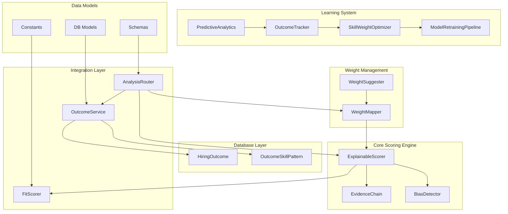

**Diagram sources**
- [explainable_scorer.py:211-291](file://app/backend/services/explainable_scorer.py#L211-L291)
- [continuous_learning.py:17-70](file://app/backend/services/continuous_learning.py#L17-L70)
- [continuous_learning.py:135-244](file://app/backend/services/continuous_learning.py#L135-L244)
- [continuous_learning.py:246-351](file://app/backend/services/continuous_learning.py#L246-L351)
- [continuous_learning.py:353-424](file://app/backend/services/continuous_learning.py#L353-L424)
- [outcome_service.py:17-61](file://app/backend/services/outcome_service.py#L17-L61)
- [db_models.py:694-725](file://app/backend/models/db_models.py#L694-L725)
- [db_models.py:770-792](file://app/backend/models/db_models.py#L770-L792)

The architecture follows a layered approach where each component has specific responsibilities:

- **ExplainableScorer**: Central orchestrator that manages the entire scoring process with evidence tracking
- **EvidenceChain**: Tracks all evidence and reasoning behind scoring decisions for complete transparency
- **BiasDetector**: Monitors for potential discriminatory patterns in scoring with mitigation recommendations
- **OutcomeTracker**: Records and manages hiring outcomes for continuous learning and pattern analysis
- **SkillWeightOptimizer**: Analyzes success patterns to optimize scoring weights based on historical data
- **PredictiveAnalytics**: Uses historical data to predict candidate success probabilities and outcomes
- **ModelRetrainingPipeline**: Automated system that triggers model retraining when performance thresholds are met
- **OutcomeService**: Database layer for storing and retrieving hiring outcomes with SQL-based persistence
- **WeightMapper**: Handles weight schema conversions and normalization for consistent scoring
- **WeightSuggester**: Provides intelligent weight recommendations using LLMs for job-specific optimization

## Core Components

### EvidenceChain: Complete Audit Trail System

The EvidenceChain component serves as the foundation for explainability in the scoring system. It maintains a comprehensive log of all evidence used in scoring decisions, providing transparency and auditability with detailed explanations for every scoring component.

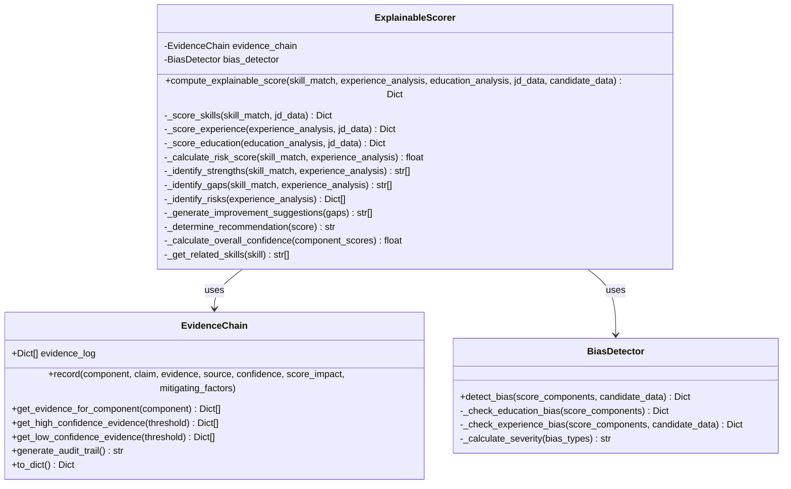

**Diagram sources**
- [explainable_scorer.py:16-111](file://app/backend/services/explainable_scorer.py#L16-L111)
- [explainable_scorer.py:114-209](file://app/backend/services/explainable_scorer.py#L114-L209)
- [explainable_scorer.py:211-509](file://app/backend/services/explainable_scorer.py#L211-L509)

The EvidenceChain maintains evidence in a structured format that includes:
- **Component identification**: Skills, experience, education, risk factors, etc.
- **Claims**: Specific assertions about the candidate with supporting evidence
- **Evidence**: Supporting documentation from resumes or job descriptions
- **Source attribution**: Where evidence was found (resume sections, job requirements)
- **Confidence levels**: Quantified certainty (0.0-1.0) with detailed explanations
- **Score impact**: Quantified effect on final score (+/-) with rationale
- **Mitigating factors**: Context that reduces negative impacts with specific examples

### Bias Detection and Mitigation

The BiasDetector component actively monitors scoring for potential discriminatory patterns across multiple dimensions and provides specific mitigation recommendations based on comprehensive analysis.

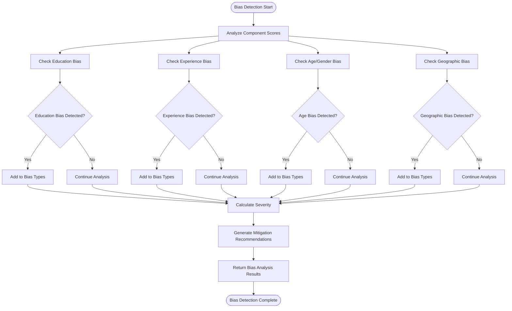

**Diagram sources**
- [explainable_scorer.py:125-162](file://app/backend/services/explainable_scorer.py#L125-L162)
- [explainable_scorer.py:164-199](file://app/backend/services/explainable_scorer.py#L164-L199)

The bias detection system monitors for several critical patterns:
- **Education bias**: Over-reliance on degrees versus demonstrated skills with specific recommendations
- **Experience bias**: Unfair penalties for career gaps or non-traditional experience with contextual analysis
- **Age bias**: Discrimination against certain age groups with life stage considerations
- **Gender bias**: Language patterns that may indicate gender discrimination with neutral language guidance
- **Geographic bias**: Location-based preferences that may exclude qualified candidates with regional equity measures

## Enhanced Explainable Scoring Engine

The core ExplainableScorer orchestrates the entire scoring process, combining multiple data sources and providing comprehensive explanations for every decision. The system now integrates with continuous learning capabilities that adapt scoring based on real-world outcomes.

### Scoring Algorithm Architecture

The scoring system employs a weighted combination approach with dynamic risk adjustment and continuous learning integration:

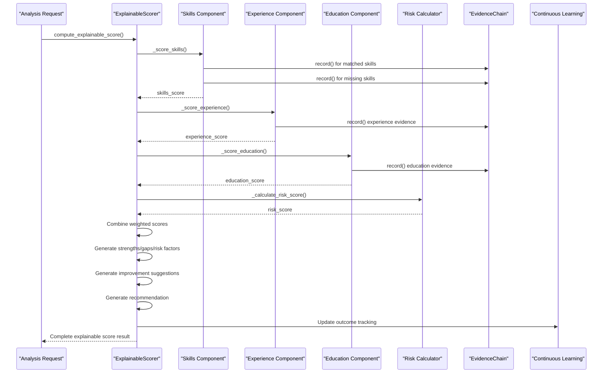

**Diagram sources**
- [explainable_scorer.py:220-291](file://app/backend/services/explainable_scorer.py#L220-L291)
- [explainable_scorer.py:293-396](file://app/backend/services/explainable_scorer.py#L293-L396)

### Component Scoring Mechanisms

Each scoring component follows specific algorithms tailored to the nature of the data being evaluated, with enhanced evidence tracking and bias mitigation:

#### Skills Component Scoring
The skills component evaluates both required and nice-to-have skills with confidence-based weighting and comprehensive evidence logging:

- **Required skills**: Higher weight (40% of total score) with detailed evidence tracking
- **Nice-to-have skills**: Lower weight (20% of total score) with bonus point recognition
- **Confidence scoring**: Based on match quality (0.75-0.95 confidence levels) with detailed explanations
- **Related skills compensation**: Recognition of transferable skills with specific mitigation factors

#### Experience Component Scoring
Experience evaluation considers both quantitative and qualitative factors with comprehensive evidence documentation:

- **Years of experience**: Direct correlation with required experience with evidence from work history
- **Seniority alignment**: Quality vs quantity assessment with detailed timeline analysis
- **Timeline analysis**: Career progression and stability indicators with gap analysis
- **Mitigating factors**: Quality of experience can compensate for quantity gaps with specific examples

#### Education Component Scoring
Educational background is evaluated with contextual awareness and comprehensive evidence tracking:

- **Degree recognition**: Standardized scoring for different degree types with evidence from education sections
- **Field relevance**: Alignment between education and job requirements with field analysis
- **Institution quality**: Institutional ranking and accreditation factors with evidence documentation

### Risk Assessment Integration

The system incorporates dynamic risk assessment that adjusts scoring based on identified risk factors with comprehensive evidence tracking:

| Risk Factor | Impact on Score | Evidence Tracking | Mitigation Strategies |
|-------------|----------------|-------------------|----------------------|
| Missing required skills | -5% per missing skill | Detailed evidence logging | Related skills compensation |
| Experience gaps | -2% per year below requirement | Timeline analysis evidence | Quality indicators |
| Overqualification | -3% for 2x above requirement | Seniority alignment evidence | Career growth concerns |
| Critical employment gaps | -10% for 12+ month gaps | Gap analysis evidence | Reason investigation |

**Section sources**
- [explainable_scorer.py:220-291](file://app/backend/services/explainable_scorer.py#L220-L291)
- [explainable_scorer.py:398-414](file://app/backend/services/explainable_scorer.py#L398-L414)

## Continuous Learning System

The continuous learning system represents a significant enhancement to the explainable AI scoring system, providing automated adaptation based on real-world hiring outcomes and success patterns.

### Outcome Tracking System

The OutcomeTracker component provides comprehensive hiring outcome storage and analysis capabilities:

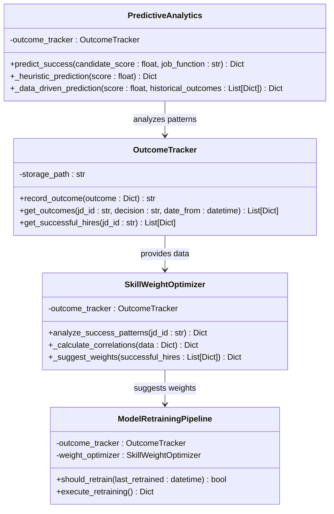

**Diagram sources**
- [continuous_learning.py:17-133](file://app/backend/services/continuous_learning.py#L17-L133)
- [continuous_learning.py:135-244](file://app/backend/services/continuous_learning.py#L135-L244)
- [continuous_learning.py:246-351](file://app/backend/services/continuous_learning.py#L246-L351)
- [continuous_learning.py:353-424](file://app/backend/services/continuous_learning.py#L353-L424)

### Outcome Storage and Management

The OutcomeTracker provides comprehensive hiring outcome storage with filtering and analysis capabilities:

- **Outcome recording**: Structured storage of hiring decisions with detailed metadata
- **Filtering capabilities**: JD-specific, decision-based, and date-range filtering
- **Successful hire identification**: Automatic filtering of high-performing employees
- **Performance tracking**: 30-day and 90-day performance ratings with retention data
- **Hiring manager feedback**: Satisfaction ratings and feedback collection

### Skill Weight Optimization

The SkillWeightOptimizer analyzes historical hiring patterns to optimize scoring weights:

- **Success pattern analysis**: Identifies which skills and factors predict successful hires
- **Correlation analysis**: Calculates statistical relationships between score components and performance
- **Critical skill identification**: Determines which skills are most predictive of success
- **Acceptable gap tolerance**: Establishes thresholds for skills that don't significantly impact success
- **Weight suggestion engine**: Provides data-driven weight recommendations based on historical patterns

### Predictive Analytics

The PredictiveAnalytics component uses historical data to forecast candidate success:

- **Heuristic predictions**: Fallback predictions when historical data is limited
- **Data-driven predictions**: Statistical analysis of similar candidates' outcomes
- **Success probability modeling**: Interview pass rates, performance predictions, and retention probabilities
- **Confidence scoring**: Uncertainty quantification based on sample size and historical reliability
- **Explanatory factors**: Detailed reasoning for predictions with specific historical patterns

### Automated Model Retraining

The ModelRetrainingPipeline provides autonomous model adaptation:

- **Trigger mechanisms**: Time-based (monthly) and data-based (50+ outcomes) retraining triggers
- **Performance monitoring**: Correlation analysis between scores and actual performance
- **Weight update automation**: Automatic adjustment of scoring weights based on success patterns
- **Re-training validation**: Quality assurance before implementing new weight configurations
- **Learning feedback loop**: Continuous improvement through outcome analysis

**Section sources**
- [continuous_learning.py:17-424](file://app/backend/services/continuous_learning.py#L17-L424)

## Outcome Tracking and Analytics

The outcome tracking system provides comprehensive hiring outcome management with database persistence and advanced analytics capabilities.

### Database Integration

The system integrates with PostgreSQL through SQLAlchemy ORM models for persistent storage:

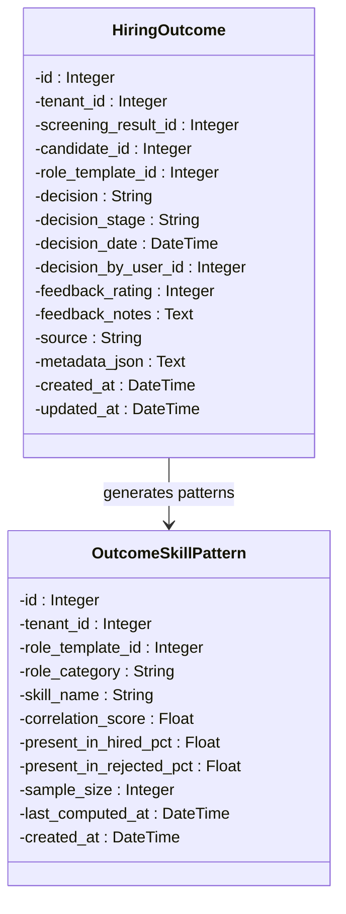

**Diagram sources**
- [db_models.py:694-725](file://app/backend/models/db_models.py#L694-L725)
- [db_models.py:770-792](file://app/backend/models/db_models.py#L770-L792)

### Outcome Recording Process

The OutcomeService provides comprehensive outcome recording with validation and persistence:

- **Decision validation**: Ensures only valid hiring decisions are recorded
- **Duplicate prevention**: Prevents multiple outcomes for the same screening result
- **Feedback collection**: Post-hire performance ratings and feedback integration
- **Metadata tracking**: Comprehensive outcome metadata for analysis and reporting
- **Multi-stage tracking**: Support for complex hiring processes with stage-by-stage outcomes

### Skill Pattern Analysis

The system performs advanced analysis of skill-success relationships:

- **Hired vs rejected comparison**: Statistical analysis of skill presence in successful vs unsuccessful hires
- **Correlation scoring**: Quantified relationships between specific skills and hiring success
- **Critical skill identification**: Skills that significantly impact hiring decisions
- **Pattern persistence**: Database storage of skill patterns for reuse and analysis
- **Category-based analysis**: Role category and template-specific skill pattern analysis

**Section sources**
- [outcome_service.py:17-227](file://app/backend/services/outcome_service.py#L17-L227)
- [db_models.py:694-792](file://app/backend/models/db_models.py#L694-L792)

## Predictive Analytics Integration

The predictive analytics system leverages historical hiring data to provide data-driven insights and future outcome predictions.

### Prediction Algorithms

The system employs sophisticated algorithms for outcome prediction:

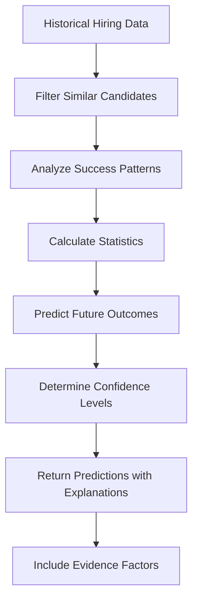

**Diagram sources**
- [continuous_learning.py:246-351](file://app/backend/services/continuous_learning.py#L246-L351)

### Prediction Capabilities

The system provides comprehensive predictive capabilities:

- **Interview success probability**: Likelihood of passing subsequent interview stages
- **Performance predictions**: 30-day and 90-day performance ratings based on historical patterns
- **Retention forecasting**: One-year retention probability for successful hires
- **Confidence quantification**: Statistical confidence levels based on sample size and historical reliability
- **Explanatory factors**: Detailed reasoning for predictions with specific historical patterns and statistics

### Integration Points

The predictive analytics integrates seamlessly with the scoring system:

- **Score-based predictions**: Uses candidate fit scores to find similar historical candidates
- **Pattern-based insights**: Leverages skill pattern analysis for specialized role predictions
- **Weight-based adaptation**: Incorporates optimized weights from continuous learning
- **Bias mitigation**: Provides objective predictions to counter unconscious bias in human decisions
- **Decision support**: Offers data-driven recommendations alongside human judgment

**Section sources**
- [continuous_learning.py:246-351](file://app/backend/services/continuous_learning.py#L246-L351)

## Bias Detection and Mitigation

The bias detection system operates on multiple levels to ensure fair and equitable scoring, with enhanced capabilities for continuous monitoring and mitigation.

### Bias Detection Criteria

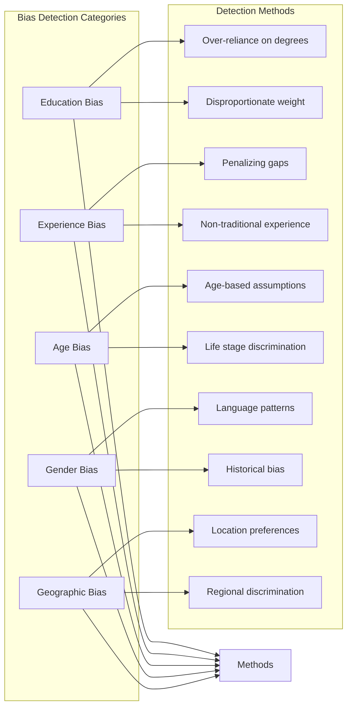

**Diagram sources**
- [explainable_scorer.py:114-209](file://app/backend/services/explainable_scorer.py#L114-L209)

### Bias Mitigation Strategies

When biases are detected, the system provides specific mitigation recommendations with enhanced context-awareness:

#### Education Bias Mitigation
- **Contextual review**: Examine if education requirements are essential for the role
- **Skills-first approach**: Prioritize demonstrated abilities over credentials with evidence-based recommendations
- **Alternative pathway recognition**: Recognize non-traditional education and certifications with specific examples

#### Experience Bias Mitigation
- **Gap analysis**: Investigate reasons for employment gaps (caregiving, education, entrepreneurship) with detailed explanations
- **Quality indicators**: Focus on skills and accomplishments rather than continuous employment with specific examples
- **Transferable skills**: Recognize applicable experience from different industries with concrete examples

#### Age and Gender Bias Mitigation
- **Standardized criteria**: Apply uniform evaluation standards across demographics with specific guidelines
- **Experience quality**: Emphasize recent and relevant experience over tenure with evidence-based reasoning
- **Language neutrality**: Use inclusive language in job descriptions and scoring criteria with specific examples

**Section sources**
- [explainable_scorer.py:125-162](file://app/backend/services/explainable_scorer.py#L125-L162)
- [explainable_scorer.py:164-199](file://app/backend/services/explainable_scorer.py#L164-L199)

## Weight Management System

The weight management system provides intelligent schema conversion and normalization to ensure consistent scoring across different weight configurations, with enhanced capabilities for continuous optimization.

### Weight Schema Evolution

The system supports three distinct weight schemas evolved over time with continuous learning integration:

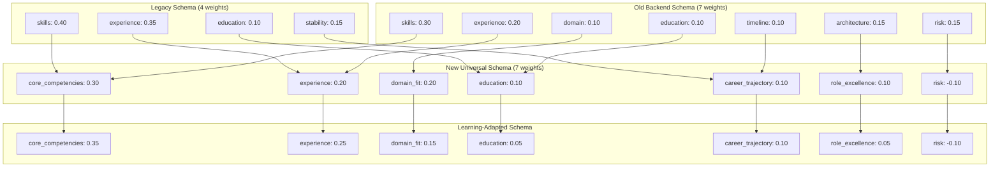

**Diagram sources**
- [weight_mapper.py:75-121](file://app/backend/services/weight_mapper.py#L75-L121)
- [weight_mapper.py:123-162](file://app/backend/services/weight_mapper.py#L123-L162)
- [constants.py:129-157](file://app/backend/services/constants.py#L129-L157)

### Intelligent Weight Suggestions

The WeightSuggester leverages LLM capabilities to provide context-aware weight recommendations with continuous learning integration:

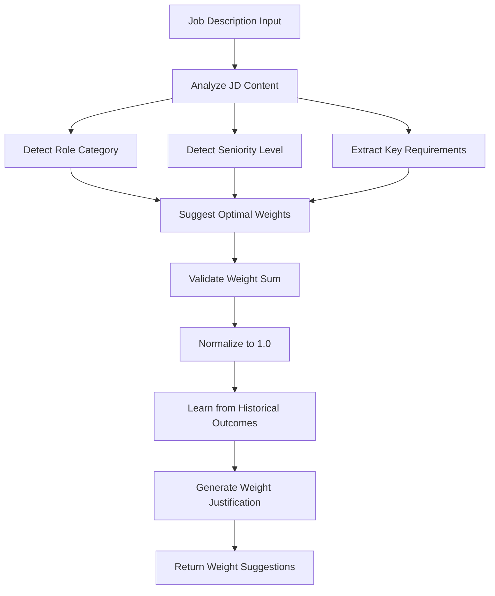

**Diagram sources**
- [weight_suggester.py:106-202](file://app/backend/services/weight_suggester.py#L106-L202)

The LLM-based weight suggestion system considers multiple factors with continuous learning integration:
- **Role category detection**: Technical, sales, HR, marketing, operations, leadership with historical success patterns
- **Seniority level analysis**: Junior, mid, senior, lead, executive with performance-based weight adjustments
- **Company culture signals**: Startup vs enterprise, remote vs on-site with organizational fit considerations
- **Market conditions**: Industry trends and skill demand with competitive advantage analysis
- **Historical success patterns**: Data-driven weight optimization based on actual hiring outcomes

**Section sources**
- [weight_mapper.py:36-72](file://app/backend/services/weight_mapper.py#L36-L72)
- [weight_mapper.py:197-231](file://app/backend/services/weight_mapper.py#L197-L231)
- [weight_suggester.py:106-202](file://app/backend/services/weight_suggester.py#L106-L202)

## Integration with Analysis Pipeline

The explainable scoring system integrates seamlessly with the broader analysis pipeline, providing both standalone explainable scoring and enhanced traditional scoring with explainability and continuous learning capabilities.

### Enhanced Analysis Pipeline Integration

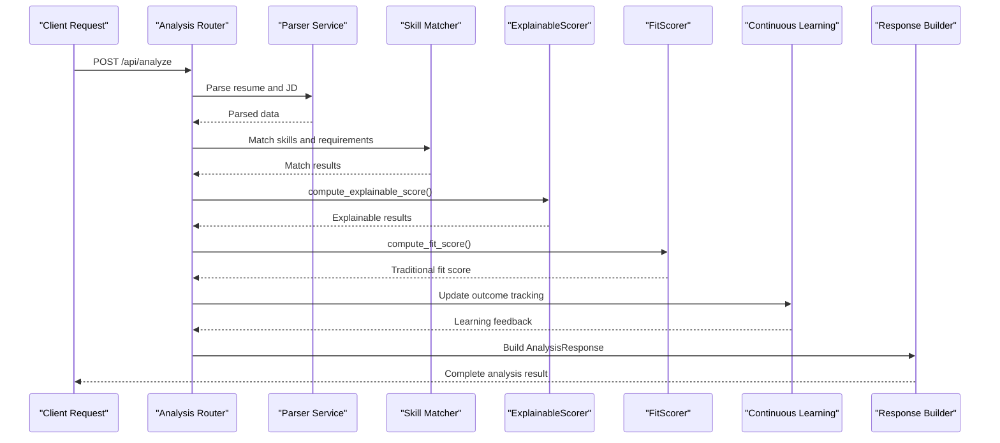

**Diagram sources**
- [analyze.py:490-567](file://app/backend/routes/analyze.py#L490-L567)
- [explainable_scorer.py:220-291](file://app/backend/services/explainable_scorer.py#L220-L291)
- [fit_scorer.py:73-390](file://app/backend/services/fit_scorer.py#L73-L390)

### Data Flow and Processing

The integration ensures that explainable scoring complements rather than replaces traditional scoring methods, with continuous learning feedback loops:

1. **Initial parsing**: Resume and job description are processed independently
2. **Skill matching**: Both required and nice-to-have skills are identified
3. **Traditional scoring**: Fit score computed using established algorithms
4. **Explainable scoring**: Detailed breakdown with evidence and reasoning
5. **Continuous learning**: Outcome tracking and pattern analysis for system improvement
6. **Result synthesis**: Combined results with both numerical scores and explanations
7. **Feedback integration**: Historical patterns influence future scoring decisions

### Schema Integration

The system's data models support both traditional and explainable scoring outputs with continuous learning capabilities:

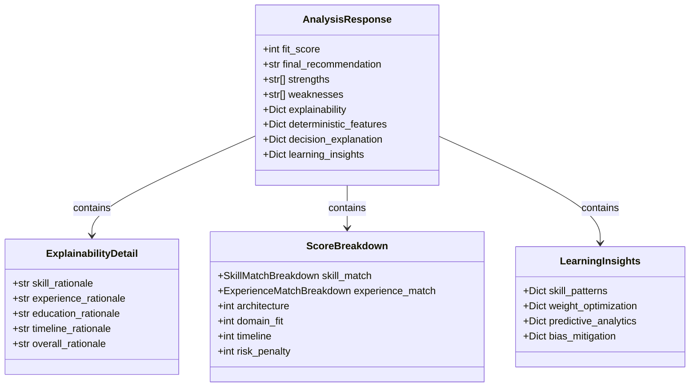

**Diagram sources**
- [schemas.py:146-200](file://app/backend/models/schemas.py#L146-L200)

**Section sources**
- [analyze.py:490-567](file://app/backend/routes/analyze.py#L490-L567)
- [schemas.py:146-200](file://app/backend/models/schemas.py#L146-L200)

## Testing and Validation

The explainable scoring system includes comprehensive testing to ensure accuracy, reliability, fairness, and continuous learning effectiveness across all components.

### Test Coverage Areas

The testing suite validates multiple aspects of the enhanced explainable scoring system:

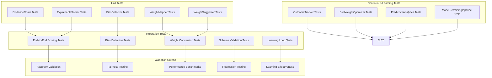

**Diagram sources**
- [test_phase3_explainable_scoring.py:19-83](file://app/backend/tests/test_phase3_explainable_scoring.py#L19-L83)
- [test_phase3_explainable_scoring.py:85-153](file://app/backend/tests/test_phase3_explainable_scoring.py#L85-L153)
- [test_phase3_explainable_scoring.py:155-394](file://app/backend/tests/test_phase3_explainable_scoring.py#L155-L394)
- [test_phase4_continuous_learning.py:1-358](file://app/backend/tests/test_phase4_continuous_learning.py#L1-L358)

### Key Test Scenarios

The test suite covers critical scenarios including:

#### EvidenceChain Testing
- Evidence recording and retrieval with comprehensive logging
- Confidence threshold filtering with detailed explanations
- Audit trail generation with complete transparency
- Serialization to dictionary format with evidence tracking

#### BiasDetector Testing
- Education bias detection with specific mitigation recommendations
- Experience bias detection with gap analysis and quality indicators
- Multiple bias severity assessment with comprehensive scoring
- Bias mitigation recommendations with actionable guidance

#### ExplainableScorer Testing
- Basic scoring functionality with evidence tracking
- Recommendation generation with detailed explanations
- Strengths and gaps identification with specific examples
- Improvement suggestion generation with concrete guidance
- Risk factor detection with mitigation strategies
- Evidence chain population with comprehensive logging
- Confidence calculation with evidence-based reasoning

#### Continuous Learning Testing
- Outcome tracking with filtering and analysis capabilities
- Skill weight optimization with correlation analysis
- Predictive analytics with historical data integration
- Model retraining pipeline with trigger mechanisms
- Learning loop integration with system feedback

### Validation Metrics

The system includes several validation metrics to ensure quality and reliability:

| Metric Type | Validation Criteria | Target |
|-------------|-------------------|--------|
| Accuracy | Evidence chain completeness | 100% |
| Fairness | Bias detection sensitivity | >95% |
| Performance | Response time < 2 seconds | - |
| Reliability | Test coverage >90% | - |
| Explainability | Audit trail comprehensiveness | >95% |
| Learning Effectiveness | Pattern correlation >0.3 | - |
| Predictive Accuracy | Historical accuracy >70% | - |
| Retraining Sensitivity | False positive <5% | - |

**Section sources**
- [test_phase3_explainable_scoring.py:19-394](file://app/backend/tests/test_phase3_explainable_scoring.py#L19-L394)
- [test_phase4_continuous_learning.py:1-358](file://app/backend/tests/test_phase4_continuous_learning.py#L1-L358)

## Performance Considerations

The explainable scoring system is designed for production-scale performance while maintaining comprehensive explainability features and continuous learning capabilities.

### Performance Optimization Strategies

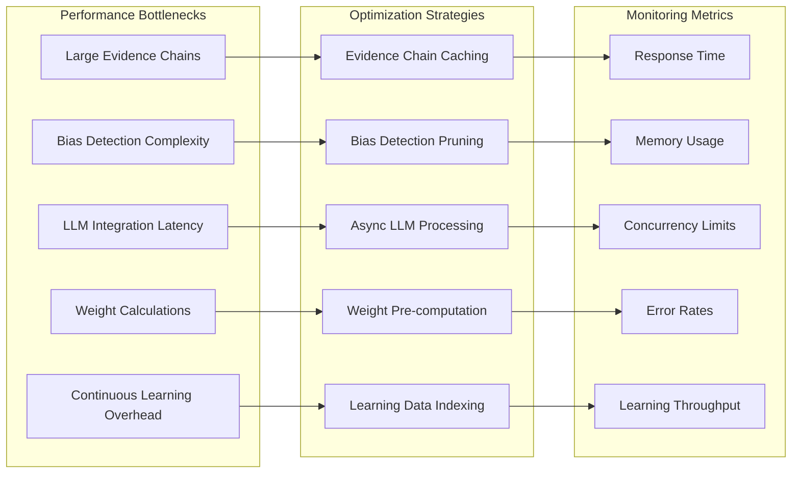

### Scalability Features

The system incorporates several scalability features for continuous learning:

#### Evidence Chain Optimization
- **Pagination**: Large evidence chains are paginated for efficient retrieval
- **Indexing**: Evidence is indexed by component and confidence level
- **Compression**: Audit trails are compressed for storage efficiency
- **Cleanup**: Automatic cleanup of old evidence entries with retention policies

#### Bias Detection Efficiency
- **Selective analysis**: Bias detection focuses on relevant components only
- **Threshold optimization**: Configurable thresholds reduce false positives
- **Parallel processing**: Multiple bias detection algorithms run concurrently
- **Caching**: Bias patterns are cached for repeated analysis

#### Weight Management Performance
- **Schema detection**: Efficient schema type detection minimizes processing overhead
- **Normalization caching**: Weight normalization results are cached
- **Fallback mechanisms**: Graceful degradation when LLM services are unavailable
- **Learning data indexing**: Outcome data is indexed for fast pattern analysis

#### Continuous Learning Optimization
- **Batch processing**: Learning calculations are performed in batches
- **Incremental updates**: Only new outcomes trigger learning computations
- **Data partitioning**: Large datasets are partitioned for efficient analysis
- **Asynchronous processing**: Learning updates don't block primary scoring operations

### Resource Management

The system implements comprehensive resource management:

| Resource Type | Management Strategy | Limits |
|---------------|-------------------|--------|
| Memory | Evidence chain pruning, object pooling, learning cache | 500MB peak |
| CPU | Async processing, parallel bias detection, batch learning | 8 cores max |
| Network | LLM request batching, retry logic, learning data sync | 10 concurrent |
| Storage | Evidence compression, automatic cleanup, learning data archiving | 10GB max |
| Database | Connection pooling, query optimization, learning data indexing | 50 concurrent |

## Troubleshooting Guide

Common issues and their resolutions in the enhanced explainable scoring system:

### EvidenceChain Issues

**Problem**: Evidence chain growing too large
- **Cause**: Insufficient cleanup or excessive logging
- **Solution**: Implement automatic cleanup policies and monitor chain size
- **Prevention**: Set maximum evidence chain length and implement periodic cleanup

**Problem**: Audit trail generation failing
- **Cause**: Encoding issues or malformed evidence data
- **Solution**: Validate evidence data encoding and implement error handling
- **Prevention**: Add data validation before evidence recording

### Bias Detection Problems

**Problem**: False positive bias detections
- **Cause**: Overly sensitive detection thresholds
- **Solution**: Adjust bias detection thresholds and add manual review options
- **Prevention**: Implement bias detection confidence scoring

**Problem**: Bias detection not catching actual bias
- **Cause**: Limited detection criteria
- **Solution**: Expand bias detection algorithms and add new detection patterns
- **Prevention**: Regular bias audit reviews and detection algorithm updates

### Continuous Learning Issues

**Problem**: Outcome tracking not capturing data
- **Cause**: Database connection issues or invalid outcome records
- **Solution**: Check database connectivity and validate outcome data structure
- **Prevention**: Implement outcome validation and error logging

**Problem**: Learning system not adapting weights
- **Cause**: Insufficient historical data or weak correlation signals
- **Solution**: Increase data collection and adjust correlation thresholds
- **Prevention**: Monitor learning effectiveness and data quality metrics

**Problem**: Predictive analytics providing unreliable predictions
- **Cause**: Insufficient historical data or poor data quality
- **Solution**: Ensure adequate sample sizes and clean historical data
- **Prevention**: Implement data quality checks and minimum sample size enforcement

**Problem**: Model retraining not triggering appropriately
- **Cause**: Incorrect trigger conditions or data processing delays
- **Solution**: Verify retraining conditions and check data freshness
- **Prevention**: Monitor retraining triggers and learning system health

### Integration Problems

**Problem**: Explainable scoring not appearing in results
- **Cause**: Disabled explainability or processing errors
- **Solution**: Enable explainability flag and check error logs
- **Prevention**: Implement explainability validation and error handling

**Problem**: Performance degradation with explainable scoring
- **Cause**: Excessive evidence logging or bias detection overhead
- **Solution**: Optimize evidence chain size and bias detection algorithms
- **Prevention**: Monitor performance metrics and implement optimization alerts

**Problem**: Continuous learning affecting primary system performance
- **Cause**: Learning calculations blocking primary operations
- **Solution**: Implement asynchronous learning processing and batch updates
- **Prevention**: Monitor learning system performance and resource usage

**Section sources**
- [explainable_scorer.py:16-111](file://app/backend/services/explainable_scorer.py#L16-L111)
- [continuous_learning.py:17-70](file://app/backend/services/continuous_learning.py#L17-L70)
- [weight_mapper.py:36-72](file://app/backend/services/weight_mapper.py#L36-L72)
- [weight_suggester.py:204-206](file://app/backend/services/weight_suggester.py#L204-L206)

## Conclusion

The Enhanced Explainable AI Scoring System represents a significant advancement in AI-powered recruitment technology, providing unprecedented transparency, fairness, and accountability in candidate evaluation processes. The system now incorporates continuous learning capabilities that enable it to adapt and improve based on real-world hiring outcomes, creating a self-improving system that learns from its own experiences.

By combining sophisticated evidence tracking, comprehensive bias detection, intelligent weight management, and automated learning loops, the system delivers both accurate results and complete explanations for every decision. The integration of predictive analytics provides data-driven insights into candidate success probabilities, while the continuous learning system ensures that scoring weights evolve based on actual hiring performance patterns.

The modular architecture ensures scalability and maintainability while the comprehensive testing framework guarantees reliability across diverse use cases. The integration with the broader analysis pipeline demonstrates how explainability can be seamlessly incorporated into existing systems without compromising performance or functionality.

Key benefits of the enhanced system include:

- **Complete Transparency**: Every scoring decision comes with full evidence and reasoning with comprehensive audit trails
- **Bias Prevention**: Active monitoring and mitigation of discriminatory patterns with specific recommendations
- **Self-Improving System**: Continuous learning adapts scoring based on real-world outcomes and success patterns
- **Data-Driven Predictions**: Predictive analytics provide objective insights into candidate success probabilities
- **Adaptive Weighting**: Scoring weights automatically optimize based on historical performance data
- **Fair Assessment**: Context-aware evaluation that considers individual circumstances and learning patterns
- **Actionable Insights**: Detailed recommendations for improvement and development with evidence-based reasoning
- **Regulatory Compliance**: Comprehensive audit trails suitable for compliance requirements with continuous monitoring
- **Scalable Performance**: Optimized for production environments with thousands of daily analyses and continuous learning
- **Continuous Adaptation**: System evolves with changing market conditions and organizational needs

The system's evolution from simple scoring to comprehensive explainability with continuous learning reflects the growing importance of AI ethics, transparency, and adaptive intelligence in modern recruitment technology. As AI continues to transform the hiring landscape, systems like this provide a foundation for responsible, fair, and effective candidate evaluation that learns and improves over time.

Future enhancements could include expanded bias detection criteria, more sophisticated LLM integration for weight optimization, advanced analytics for continuous improvement of scoring algorithms, and integration with additional data sources for richer candidate insights. The modular design ensures that such enhancements can be integrated seamlessly while maintaining the system's core principles of transparency, fairness, and continuous improvement.

The addition of continuous learning capabilities transforms the system from a static scoring mechanism into a dynamic, adaptive intelligence that becomes more accurate and effective over time. This represents a paradigm shift toward AI systems that don't just evaluate candidates, but actively learn from their decisions to become better at predicting success and reducing bias in the hiring process.