# Fit Scoring System

<cite>
**Referenced Files in This Document**
- [fit_scorer.py](file://app/backend/services/fit_scorer.py)
- [weight_mapper.py](file://app/backend/services/weight_mapper.py)
- [weight_suggester.py](file://app/backend/services/weight_suggester.py)
- [constants.py](file://app/backend/services/constants.py)
- [risk_calculator.py](file://app/backend/services/risk_calculator.py)
- [eligibility_service.py](file://app/backend/services/eligibility_service.py)
- [schemas.py](file://app/backend/models/schemas.py)
- [test_fit_scorer.py](file://app/backend/tests/test_fit_scorer.py)
- [hybrid_pipeline.py](file://app/backend/services/hybrid_pipeline.py)
- [analyze.py](file://app/backend/routes/analyze.py)
- [WeightSuggestionPanel.jsx](file://app/frontend/src/components/WeightSuggestionPanel.jsx)
- [interview_kit.py](file://app/backend/routes/interview_kit.py)
- [db_models.py](file://app/backend/models/db_models.py)
- [InterviewScorecard.jsx](file://app/frontend/src/components/InterviewScorecard.jsx)
- [test_interview_kit.py](file://app/backend/tests/test_interview_kit.py)
- [017_interview_kit_enhancement.py](file://alembic/versions/017_interview_kit_enhancement.py)
- [skill_matcher.py](file://app/backend/services/skill_matcher.py)
- [skill_matcher_enterprise.py](file://app/backend/services/skill_matcher_enterprise.py)
- [skill_proficiency_service.py](file://app/backend/services/skill_proficiency_service.py)
- [test_phase2_skill_matching.py](file://app/backend/tests/test_phase2_skill_matching.py)
- [explainable_scorer.py](file://app/backend/services/explainable_scorer.py)
- [continuous_learning.py](file://app/backend/services/continuous_learning.py)
- [enterprise_security.py](file://app/backend/services/enterprise_security.py)
- [test_phase3_explainable_scoring.py](file://app/backend/tests/test_phase3_explainable_scoring.py)
- [test_phase4_continuous_learning.py](file://app/backend/tests/test_phase4_continuous_learning.py)
- [test_phase5_enterprise_security.py](file://app/backend/tests/test_phase5_enterprise_security.py)
</cite>

## Update Summary
**Changes Made**
- Enhanced enterprise-grade skill matching system with comprehensive job function detection, semantic matching, and explainable AI scoring
- Integrated continuous learning system with outcome tracking, predictive analytics, and automated model retraining
- Implemented enterprise security features including PII redaction, compliance audit logging, and integration hub
- Added new skill matcher enterprise service with context-aware validation and confidence scoring
- Enhanced scoring algorithms with phase 1-5 implementation covering job function detection, semantic matching, explainable AI, continuous learning, and enterprise security

## Table of Contents
1. [Introduction](#introduction)
2. [System Architecture](#system-architecture)
3. [Core Components](#core-components)
4. [Enhanced Weight Management System](#enhanced-weight-management-system)
5. [Enterprise-Grade Skill Matching System](#enterprise-grade-skill-matching-system)
6. [Explainable AI Scoring System](#explainable-ai-scoring-system)
7. [Continuous Learning System](#continuous-learning-system)
8. [Enterprise Security & Compliance](#enterprise-security--compliance)
9. [Proficiency Estimation Service](#proficiency-estimation-service)
10. [Scoring Algorithms](#scoring-algorithms)
11. [Risk Assessment](#risk-assessment)
12. [Eligibility Engine](#eligibility-engine)
13. [Interview Evaluation Framework](#interview-evaluation-framework)
14. [Multi-Dimensional Evaluation System](#multi-dimensional-evaluation-system)
15. [Tenant Customization and Dynamic Weights](#tenant-customization-and-dynamic-weights)
16. [Integration Points](#integration-points)
17. [Testing Framework](#testing-framework)
18. [Performance Considerations](#performance-considerations)
19. [Troubleshooting Guide](#troubleshooting-guide)
20. [Conclusion](#conclusion)

## Introduction

The Fit Scoring System is a comprehensive candidate evaluation framework designed to provide standardized, transparent, and adaptable scoring mechanisms for resume analysis. Built as part of the Resume AI platform by ThetaLogics, this system combines deterministic scoring with machine learning capabilities to deliver consistent and explainable hiring decisions.

The system operates on a hybrid approach, utilizing Python-based deterministic calculations for core scoring alongside LLM-powered narrative generation for qualitative insights. It supports multiple weight schemas, adaptive scoring based on role categories, comprehensive risk assessment, tenant customization capabilities, and now includes a robust interview evaluation framework for structured competency assessments along with enterprise-grade skill matching capabilities featuring context-aware matching, skill hierarchy validation, confidence calculations, explainable AI scoring, continuous learning, and comprehensive security features.

**Updated** Enhanced with comprehensive enterprise-grade skill matching system featuring job function detection, semantic matching, explainable AI scoring, continuous learning, and enterprise security features. The system now provides phase 1-5 implementation covering job function taxonomy validation, semantic skill matching, explainable AI scoring with evidence chains, continuous learning from hiring outcomes, and enterprise security compliance.

## System Architecture

The Fit Scoring System follows a layered architecture with clear separation of concerns and enhanced tenant customization capabilities, now including comprehensive interview evaluation infrastructure, advanced skill matching capabilities, explainable AI scoring, continuous learning, and enterprise security features:

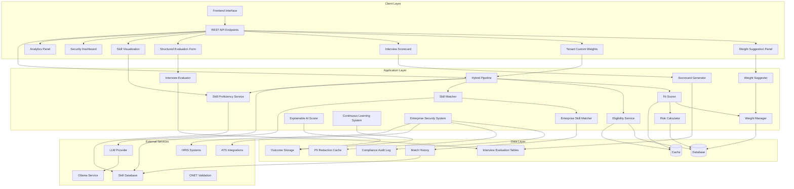

**Diagram sources**
- [hybrid_pipeline.py:1-200](file://app/backend/services/hybrid_pipeline.py#L1-L200)
- [fit_scorer.py:1-231](file://app/backend/services/fit_scorer.py#L1-L231)
- [weight_mapper.py:1-345](file://app/backend/services/weight_mapper.py#L1-L345)
- [WeightSuggestionPanel.jsx:1-258](file://app/frontend/src/components/WeightSuggestionPanel.jsx#L1-L258)
- [interview_kit.py:1-221](file://app/backend/routes/interview_kit.py#L1-L221)
- [db_models.py:219-257](file://app/backend/models/db_models.py#L219-L257)
- [skill_matcher.py:1-800](file://app/backend/services/skill_matcher.py#L1-L800)
- [skill_matcher_enterprise.py:1-311](file://app/backend/services/skill_matcher_enterprise.py#L1-L311)
- [skill_proficiency_service.py:1-92](file://app/backend/services/skill_proficiency_service.py#L1-L92)
- [explainable_scorer.py:1-509](file://app/backend/services/explainable_scorer.py#L1-L509)
- [continuous_learning.py:1-424](file://app/backend/services/continuous_learning.py#L1-L424)
- [enterprise_security.py:1-376](file://app/backend/services/enterprise_security.py#L1-L376)

## Core Components

### Enhanced Fit Scorer Service

The Fit Scorer Service serves as the central component for computing standardized candidate scores with tenant customization capabilities. It provides three primary scoring mechanisms with enhanced flexibility:

#### Customizable Fit Score Calculation
The main `compute_fit_score` function now supports tenant customization through the `scoring_weights` parameter and advanced skill matching integration:

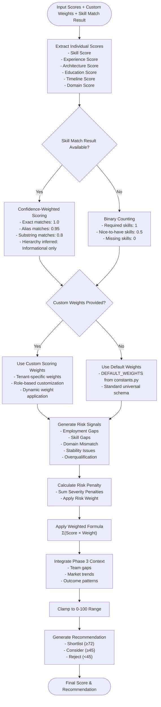

**Diagram sources**
- [fit_scorer.py:73-231](file://app/backend/services/fit_scorer.py#L73-L231)

#### Deterministic Score Engine with Custom Weights
The `compute_deterministic_score` function now supports tenant-specific weight distribution:

- **Custom Weight Distribution**: When weights parameter is provided, allows tenant customization of feature importance
- **Hard Caps**: Maximum score limitations based on eligibility criteria and custom weight allocations
- **Domain Cap**: Maximum 35% when domain match is below 30%, adjusted by custom weight distribution
- **Core Skill Cap**: Maximum 40% when core skill match is below 30%, adjusted by custom weight distribution

#### Decision Explanation Generator
The `explain_decision` function creates structured explanations with:
- Clear decision rationale
- Feature summary with percentages
- Applied caps documentation
- Actionable recommendations

**Section sources**
- [fit_scorer.py:73-370](file://app/backend/services/fit_scorer.py#L73-L370)

## Enhanced Weight Management System

### Schema Compatibility with Tenant Customization

The system supports three weight schemas with automatic conversion and tenant customization:

#### Legacy 4-Weight Schema
- **skills**: 0.40
- **experience**: 0.35  
- **stability**: 0.15
- **education**: 0.10

#### Old Backend 7-Weight Schema
- **skills**: 0.30
- **experience**: 0.20
- **architecture**: 0.15
- **education**: 0.10
- **timeline**: 0.10
- **domain**: 0.10
- **risk**: 0.15

#### New Universal 7-Weight Schema
- **core_competencies**: 0.30
- **experience**: 0.20
- **domain_fit**: 0.20
- **education**: 0.10
- **career_trajectory**: 0.10
- **role_excellence**: 0.10
- **risk**: -0.10

### Intelligent Weight Suggestions with Application

The LLM-based weight suggester now actively applies suggested weights rather than being informational only:

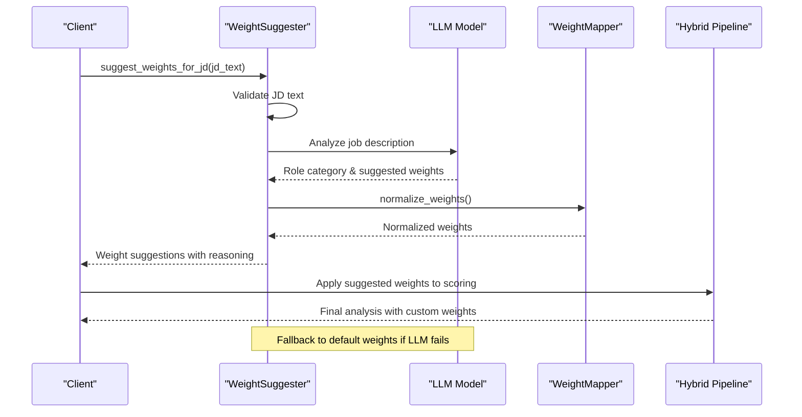

**Diagram sources**
- [weight_suggester.py:86-178](file://app/backend/services/weight_suggester.py#L86-L178)
- [weight_mapper.py:36-72](file://app/backend/services/weight_mapper.py#L36-L72)

**Section sources**
- [weight_suggester.py:1-307](file://app/backend/services/weight_suggester.py#L1-L307)
- [weight_mapper.py:1-345](file://app/backend/services/weight_mapper.py#L1-L345)

## Enterprise-Grade Skill Matching System

### Comprehensive Job Function Detection and Validation

The enhanced skill matching system provides enterprise-grade capabilities with comprehensive job function detection, semantic matching, and confidence calculations:

#### Job Function Taxonomy Integration
The system now includes a comprehensive job function taxonomy that enables context-aware skill validation:

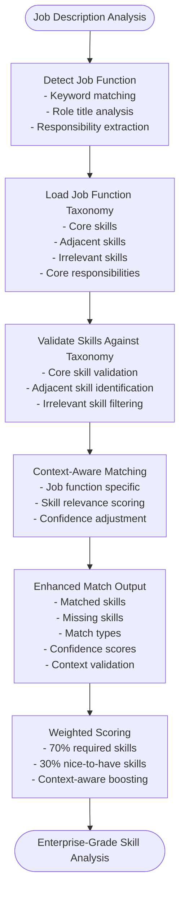

**Diagram sources**
- [skill_matcher_enterprise.py:18-161](file://app/backend/services/skill_matcher_enterprise.py#L18-L161)
- [constants.py:164-312](file://app/backend/services/constants.py#L164-L312)

#### Enterprise Skill Matching Capabilities
The `match_skills_enterprise` function provides advanced enterprise-grade matching:

- **Job Function Context Validation**: Skills validated against role-specific taxonomy
- **Skill Hierarchy Matching**: Core vs adjacent vs irrelevant skill classification
- **Weighted Scoring**: 70% required skills + 30% nice-to-have skills
- **Soft Skill Awareness**: Moved to nice-to-have by default
- **Confidence Scoring**: Quality assessment with context-aware boosting

#### Advanced Confidence Calculation
The system implements sophisticated confidence scoring mechanisms:

- **Base Confidence**: Match ratio from required skills
- **Core Skill Boost**: Higher confidence for core skill matches
- **Missing Critical Skills Penalty**: Reduced confidence for significant gaps
- **Context Validation**: Job function taxonomy influence on confidence

#### Skill Validation and Categorization
The system provides comprehensive skill validation:

- **Core Skills**: Essential for the role
- **Adjacent Skills**: Related but not critical
- **Irrelevant Skills**: Not applicable to the role
- **Unknown Skills**: Cannot be categorized definitively

**Section sources**
- [skill_matcher_enterprise.py:1-311](file://app/backend/services/skill_matcher_enterprise.py#L1-L311)
- [constants.py:164-312](file://app/backend/services/constants.py#L164-L312)
- [constants.py:346-352](file://app/backend/services/constants.py#L346-L352)

## Explainable AI Scoring System

### Comprehensive Evidence Chain and Bias Detection

The explainable AI scoring system provides transparent, auditable scoring with comprehensive evidence tracking and bias mitigation:

#### Evidence Chain Architecture
The EvidenceChain class provides complete audit trail functionality:

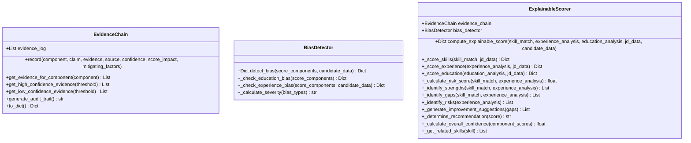

**Diagram sources**
- [explainable_scorer.py:16-112](file://app/backend/services/explainable_scorer.py#L16-L112)
- [explainable_scorer.py:114-209](file://app/backend/services/explainable_scorer.py#L114-L209)
- [explainable_scorer.py:211-497](file://app/backend/services/explainable_scorer.py#L211-L497)

#### Bias Detection and Mitigation
The BiasDetector component monitors for various types of bias:

- **Education Bias**: Overweighting educational credentials
- **Experience Bias**: Unfair penalization of career gaps
- **Demographic Bias**: Language patterns indicating bias
- **Geographic Bias**: Location-based preferences

#### Comprehensive Scoring with Evidence
The ExplainableScorer provides detailed scoring with complete evidence tracking:

- **Component Scores**: Skills, experience, education breakdown
- **Strengths Identification**: Candidate advantages
- **Gaps Analysis**: Missing requirements
- **Risk Factors**: Potential issues
- **Improvement Suggestions**: Actionable recommendations
- **Bias Audit**: Comprehensive bias detection report

**Section sources**
- [explainable_scorer.py:1-509](file://app/backend/services/explainable_scorer.py#L1-L509)

## Continuous Learning System

### Outcome Tracking and Predictive Analytics

The continuous learning system enables the platform to improve its matching accuracy over time through outcome tracking and predictive analytics:

#### Outcome Tracking Architecture
The OutcomeTracker provides comprehensive hiring outcome storage:

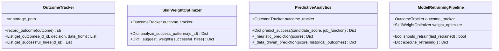

**Diagram sources**
- [continuous_learning.py:17-133](file://app/backend/services/continuous_learning.py#L17-L133)
- [continuous_learning.py:135-244](file://app/backend/services/continuous_learning.py#L135-L244)
- [continuous_learning.py:246-351](file://app/backend/services/continuous_learning.py#L246-L351)
- [continuous_learning.py:353-424](file://app/backend/services/continuous_learning.py#L353-L424)

#### Outcome Analysis and Pattern Recognition
The system analyzes hiring outcomes to identify success patterns:

- **Success Metrics**: Performance ratings, retention rates, promotion likelihood
- **Correlation Analysis**: Relationship between initial scores and later performance
- **Critical Skill Identification**: Which skills most predict success
- **Acceptable Gaps**: Skills that don't necessarily prevent success

#### Predictive Analytics
The PredictiveAnalytics component provides forward-looking insights:

- **Interview Success Prediction**: Probability of passing interviews
- **Offer Acceptance Prediction**: Likelihood of accepting offers
- **Performance Prediction**: 90-day and 1-year performance expectations
- **Retention Prediction**: Likelihood of staying with the company

#### Automated Model Retraining
The ModelRetrainingPipeline handles continuous system improvement:

- **Trigger Conditions**: Time-based (monthly) and data-based (50+ outcomes)
- **Correlation Analysis**: Determines if retraining is beneficial
- **Weight Optimization**: Updates scoring weights based on success patterns
- **Confidence Assessment**: Quality of retraining recommendations

**Section sources**
- [continuous_learning.py:1-424](file://app/backend/services/continuous_learning.py#L1-L424)

## Enterprise Security & Compliance

### Comprehensive Security and Privacy Features

The enterprise security system provides comprehensive privacy protection and compliance capabilities:

#### PII Redaction System
The PIIRedactor provides multi-level privacy protection:

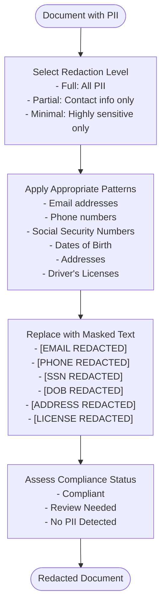

**Diagram sources**
- [enterprise_security.py:32-80](file://app/backend/services/enterprise_security.py#L32-L80)

#### Compliance Audit Logging
The ComplianceAuditLogger provides immutable audit trails:

- **Event Tracking**: Data access, modification, deletion, consent, export events
- **Framework Compliance**: GDPR, CCPA, EEOC, SOC 2 Type II support
- **Filtering and Reporting**: Comprehensive filtering by user, resource, timeframe
- **Automated Reports**: Compliance status reports for regulatory requirements

#### Integration Hub
The IntegrationHub provides enterprise system connectivity:

- **ATS Integration**: Workday, Greenhouse, Lever, Taleo support
- **HRIS Integration**: SAP SuccessFactors, Oracle HCM connectivity
- **Assessment Platforms**: Integration with external assessment tools
- **Background Check Services**: Secure integration with screening providers

#### Security Features
The system includes comprehensive security measures:

- **Data Encryption**: At-rest and in-transit encryption
- **Access Control**: Role-based permissions and tenant isolation
- **Audit Trails**: Complete activity monitoring
- **Compliance Frameworks**: Built-in support for privacy regulations
- **Data Retention Policies**: Automated cleanup according to compliance requirements

**Section sources**
- [enterprise_security.py:1-376](file://app/backend/services/enterprise_security.py#L1-L376)

## Proficiency Estimation Service

### Advanced Skill Level Assessment

The proficiency estimation service provides intelligent skill level assessment based on linguistic cues and role requirements:

#### Linguistic Cues and Context Analysis
The service analyzes job descriptions for skill proficiency indicators:

- **Expert Level Indicators**: "expert in", "deep knowledge of", "mastery of"
- **Advanced Level Indicators**: "proficient in", "solid experience", "strong knowledge"
- **Intermediate Level Indicators**: "working knowledge of", "experience with", "good understanding"
- **Basic Level Indicators**: "basic understanding of", "exposure to", "awareness of"

#### Seniority-Based Default Proficiency
The service establishes baseline proficiency levels based on role seniority:

- **Junior**: Basic proficiency
- **Mid**: Intermediate proficiency
- **Senior**: Advanced proficiency
- **Lead/Principal**: Expert proficiency

#### Nice-to-Have Skill Cap Adjustment
The service applies proficiency caps for nice-to-have skills:

- **Nice-to-have skills**: Automatically capped one level below seniority default
- **Contextual adjustment**: Based on linguistic cues in job description
- **Conservative estimation**: Prevents overstatement of candidate abilities

**Section sources**
- [skill_proficiency_service.py:43-92](file://app/backend/services/skill_proficiency_service.py#L43-L92)

## Scoring Algorithms

### Multi-Dimensional Scoring Formula with Enhanced Enterprise Features

The system employs a comprehensive scoring formula that evaluates candidates across seven key dimensions with enhanced skill matching support:

| Dimension | Default Weight | Tenant Customizable | Enhanced Features | Description | Typical Range |
|-----------|----------------|-------------------|-------------------|-------------|---------------|
| Core Competencies | 0.30 | ✅ Yes | ✅ Confidence-weighted, ✅ Context-aware | Technical skill alignment with match confidence and job function context | 0-100 |
| Experience | 0.20 | ✅ Yes | ✅ Proficiency-aware, ✅ Seniority alignment | Years of relevant experience with skill level and seniority | 0-100 |
| Domain Fit | 0.20 | ✅ Yes | ✅ Context validation, ✅ Taxonomy-based | Industry/domain expertise with job function taxonomy | 0-100 |
| Education | 0.10 | ✅ Yes | ✅ Score-based, ✅ Field alignment | Educational credentials with degree scoring and field relevance | 0-100 |
| Career Trajectory | 0.10 | ✅ Yes | ✅ Gap analysis, ✅ Stability assessment | Job stability and progression with risk factors | 0-100 |
| Role Excellence | 0.10 | ✅ Yes | ✅ Trend factors, ✅ Performance prediction | Specialized achievements with market trends and predictive analytics | 0-100 |
| Risk | -0.10 | ❌ No | ✅ Enhanced penalties, ✅ Bias mitigation | Penalty factor with comprehensive risk and bias considerations | -∞ to 0 |

### Recommendation Thresholds

The system uses standardized thresholds for automated decision-making with tenant customization:

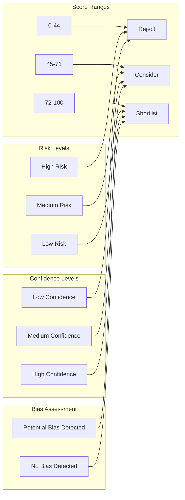

**Diagram sources**
- [constants.py:9-14](file://app/backend/services/constants.py#L9-L14)

**Section sources**
- [fit_scorer.py:73-231](file://app/backend/services/fit_scorer.py#L73-L231)
- [constants.py:9-14](file://app/backend/services/constants.py#L9-L14)

## Risk Assessment

### Risk Signal Detection

The system automatically identifies potential red flags in candidate profiles:

| Risk Type | Severity | Detection Criteria | Penalty |
|-----------|----------|-------------------|---------|
| Critical Employment Gap | High | 12+ months gap | +20 points |
| Significant Skill Gap | High | Missing ≥50% required skills | +20 points |
| Moderate Skill Gap | Medium | Missing 30-49% required skills | +10 points |
| Domain Mismatch | Medium | Candidate domain ≠ JD domain | +10 points |
| Job Hopping | Medium | ≥3 short stints (<6 months) | +10 points |
| Frequent Job Changes | Low | 2 short stints | +4 points |
| Overqualification | Low | Experience > 2× required | +4 points |

### Risk Penalty Calculation

**Diagram sources**
- [risk_calculator.py:6-15](file://app/backend/services/risk_calculator.py#L6-L15)

**Section sources**
- [risk_calculator.py:1-16](file://app/backend/services/risk_calculator.py#L1-L16)
- [fit_scorer.py:294-307](file://app/backend/services/fit_scorer.py#L294-L307)

## Eligibility Engine

### Deterministic Hard Gates

The eligibility service enforces mandatory criteria before scoring:

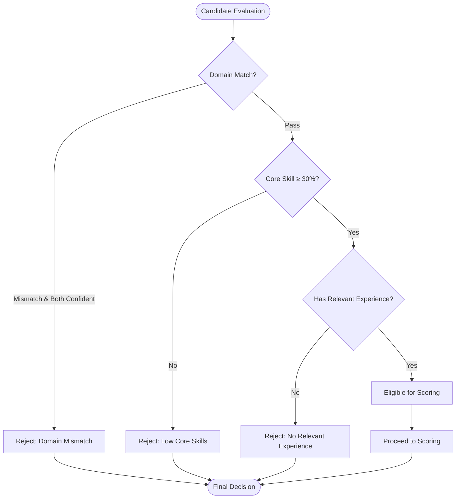

### Hard Cap Application

Eligibility violations trigger maximum score reductions:
- **Domain Mismatch**: Maximum 35% regardless of other scores
- **Low Core Skills (<30%)**: Maximum 40% regardless of other scores
- **No Relevant Experience**: Maximum 35% regardless of other scores

**Section sources**
- [eligibility_service.py:1-80](file://app/backend/services/eligibility_service.py#L1-L80)
- [fit_scorer.py:158-170](file://app/backend/services/fit_scorer.py#L158-L170)

## Interview Evaluation Framework

### Structured Interview Evaluation System

The system now includes a comprehensive interview evaluation framework that captures structured competency assessments across multiple evaluation dimensions:

#### Evaluation Data Model
The InterviewEvaluation model provides granular tracking of individual question assessments:

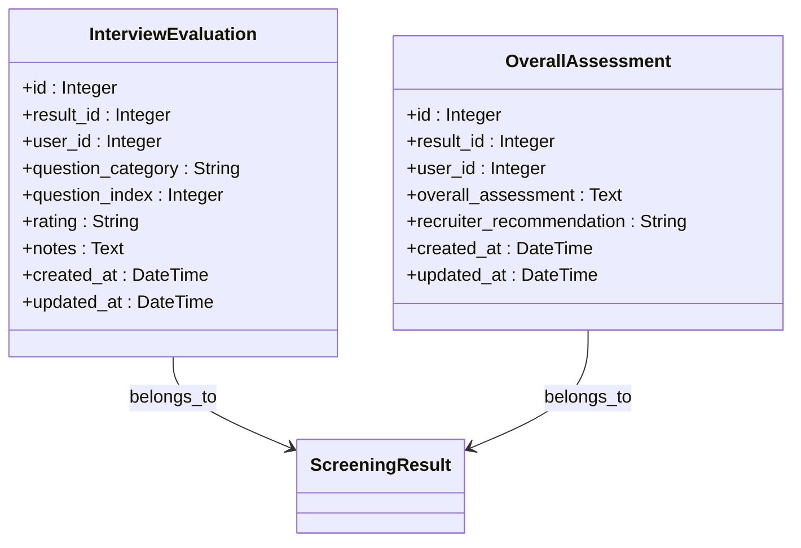

**Diagram sources**
- [db_models.py:219-257](file://app/backend/models/db_models.py#L219-L257)

#### Evaluation Categories and Ratings
The system supports three primary evaluation categories with standardized rating scales:

| Category | Questions | Purpose | Rating Scale |
|----------|-----------|---------|--------------|
| Technical | Technical competency questions | Assess hard skills and domain expertise | Strong, Adequate, Weak |
| Behavioral | Situational and behavioral questions | Evaluate soft skills and cultural fit | Strong, Adequate, Weak |
| Culture Fit | Organizational alignment questions | Measure cultural and values alignment | Strong, Adequate, Weak |

#### Tenant Isolation and Security
All evaluation data is strictly isolated by tenant boundaries:
- Access control enforced at database level
- Unique constraints prevent cross-tenant data leakage
- Comprehensive validation for category and rating fields
- Real-time tenant verification for all operations

**Section sources**
- [interview_kit.py:1-221](file://app/backend/routes/interview_kit.py#L1-L221)
- [db_models.py:219-257](file://app/backend/models/db_models.py#L219-L257)
- [017_interview_kit_enhancement.py:1-61](file://alembic/versions/017_interview_kit_enhancement.py#L1-L61)

## Multi-Dimensional Evaluation System

### Comprehensive Scorecard Generation

The system generates detailed evaluation scorecards that aggregate interview assessments across multiple dimensions:

#### Dimension Summary Structure
Each evaluation dimension provides comprehensive statistical summaries:

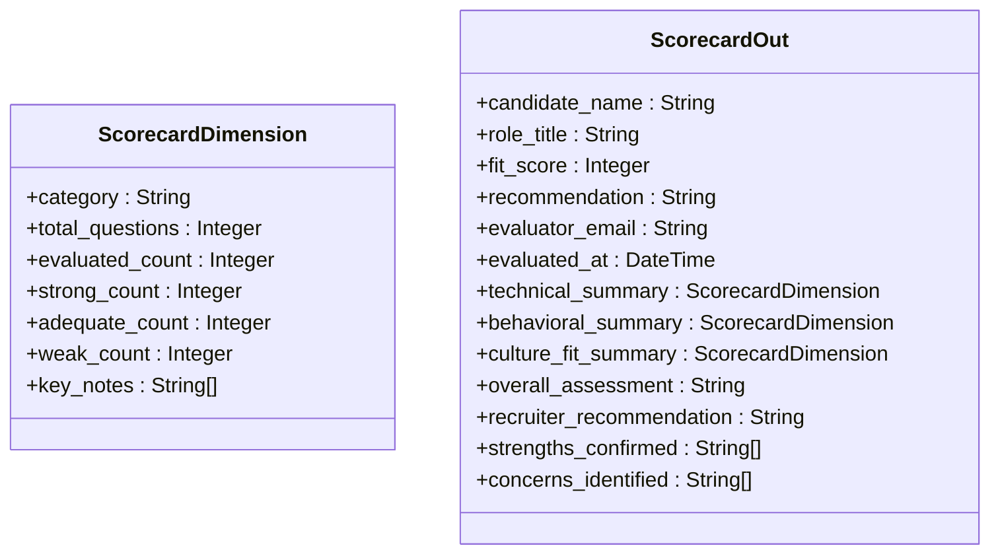

**Diagram sources**
- [schemas.py:490-515](file://app/backend/models/schemas.py#L490-L515)

#### Evaluation Aggregation Logic
The scorecard generation process aggregates evaluation data with intelligent filtering:

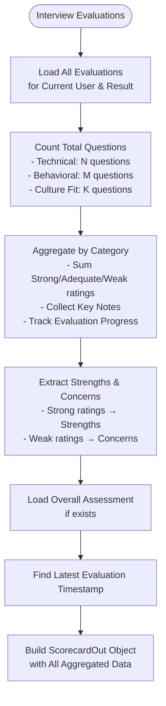

**Diagram sources**
- [interview_kit.py:140-221](file://app/backend/routes/interview_kit.py#L140-L221)

#### Frontend Integration and Visualization
The InterviewScorecard component provides comprehensive visualization and export capabilities:

- **Dimension Cards**: Color-coded summaries for each evaluation category
- **Progress Tracking**: Visual indicators for evaluation completion
- **Export Functionality**: PDF generation for sharing with hiring managers
- **Editable Assessments**: Structured overall assessment with recommendation options

**Section sources**
- [InterviewScorecard.jsx:1-231](file://app/frontend/src/components/InterviewScorecard.jsx#L1-L231)
- [interview_kit.py:140-221](file://app/backend/routes/interview_kit.py#L140-L221)
- [schemas.py:490-515](file://app/backend/models/schemas.py#L490-L515)

## Tenant Customization and Dynamic Weights

### Custom Scoring Weights Parameter

The enhanced system now supports tenant-specific weight customization through the `scoring_weights` parameter:

#### API Integration
The `/analyze` endpoint now accepts custom scoring weights:

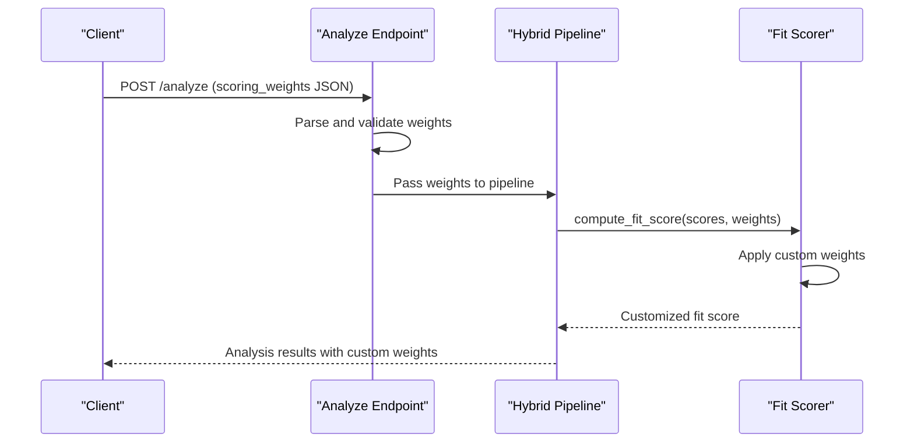

**Diagram sources**
- [analyze.py:570-821](file://app/backend/routes/analyze.py#L570-L821)

#### Frontend Integration
The Weight Suggestion Panel enables dynamic weight application:

- **AI-Powered Suggestions**: Role-based weight recommendations
- **Manual Customization**: Direct weight adjustment interface
- **Real-time Preview**: Immediate score impact visualization
- **Fallback Mechanisms**: Graceful handling of AI unavailability

### Interview Evaluation Tenant Isolation

The interview evaluation system maintains strict tenant boundaries:

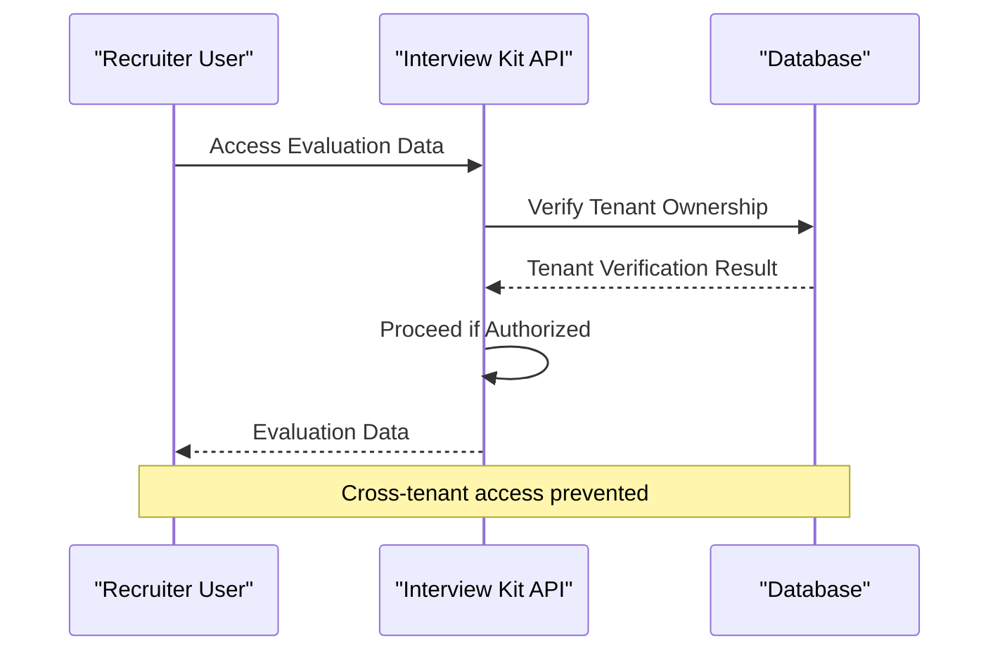

**Diagram sources**
- [interview_kit.py:28-36](file://app/backend/routes/interview_kit.py#L28-L36)

**Section sources**
- [analyze.py:470-493](file://app/backend/routes/analyze.py#L470-L493)
- [WeightSuggestionPanel.jsx:1-258](file://app/frontend/src/components/WeightSuggestionPanel.jsx#L1-L258)
- [interview_kit.py:28-36](file://app/backend/routes/interview_kit.py#L28-L36)

## Integration Points

### Hybrid Pipeline Integration

The Fit Scoring System integrates seamlessly with the hybrid analysis pipeline with enhanced weight customization, evaluation framework, advanced skill matching, explainable AI scoring, continuous learning, and enterprise security:

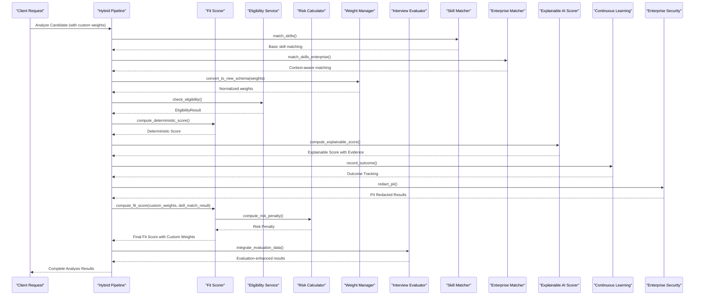

**Diagram sources**
- [hybrid_pipeline.py:39-45](file://app/backend/services/hybrid_pipeline.py#L39-L45)
- [fit_scorer.py:117-118](file://app/backend/services/fit_scorer.py#L117-L118)
- [interview_kit.py:140-221](file://app/backend/routes/interview_kit.py#L140-L221)
- [skill_matcher.py:1390-1459](file://app/backend/services/skill_matcher.py#L1390-L1459)
- [skill_matcher_enterprise.py:18-161](file://app/backend/services/skill_matcher_enterprise.py#L18-L161)
- [explainable_scorer.py:220-291](file://app/backend/services/explainable_scorer.py#L220-L291)
- [continuous_learning.py:353-424](file://app/backend/services/continuous_learning.py#L353-L424)
- [enterprise_security.py:275-376](file://app/backend/services/enterprise_security.py#L275-L376)

### API Schema Integration

The system's output conforms to standardized schemas with tenant customization support:

| Field | Type | Description |
|-------|------|-------------|
| fit_score | Integer (0-100) | Final standardized score with custom weights |
| final_recommendation | String | "Shortlist", "Consider", or "Reject" |
| risk_level | String | "Low", "Medium", or "High" |
| score_breakdown | ScoreBreakdown | Individual dimension scores with custom weights |
| risk_signals | List | Identified risk factors |
| decision_explanation | Dict | Structured reasoning with weight impact |
| custom_weights_used | Dict | Tenant-specific weights applied |
| weight_impact_analysis | Dict | How custom weights affected scoring |
| interview_evaluations | List | Structured competency assessments |
| overall_assessment | String | Hiring manager's final recommendation |
| skill_match_details | Dict | Enhanced skill matching with confidence scores |
| matched_skills_detailed | List | Detailed match information with types |
| proficiency_adjustments | List | Skill level adjustments applied |
| team_gap_bonus | Float | Bonus for filling team skill gaps |
| trend_factors_applied | List | Market trend adjustments |
| explainable_score | Dict | Evidence-based scoring with audit trail |
| bias_audit | Dict | Bias detection and mitigation results |
| predictive_analysis | Dict | Future performance and success predictions |
| compliance_status | String | Security and privacy compliance status |
| evidence_chain | Dict | Complete audit trail of scoring decisions |

**Section sources**
- [schemas.py:43-131](file://app/backend/models/schemas.py#L43-L131)
- [hybrid_pipeline.py:39-45](file://app/backend/services/hybrid_pipeline.py#L39-L45)
- [schemas.py:490-515](file://app/backend/models/schemas.py#L490-L515)
- [fit_scorer.py:317-370](file://app/backend/services/fit_scorer.py#L317-L370)
- [explainable_scorer.py:276-291](file://app/backend/services/explainable_scorer.py#L276-L291)
- [continuous_learning.py:353-424](file://app/backend/services/continuous_learning.py#L353-L424)
- [enterprise_security.py:275-376](file://app/backend/services/enterprise_security.py#L275-L376)

## Testing Framework

### Comprehensive Test Coverage

The system includes extensive testing for reliability, accuracy, tenant customization, evaluation framework functionality, enhanced skill matching capabilities, explainable AI scoring, continuous learning, and enterprise security:

#### Deterministic Score Tests
- Perfect features with eligible status: 100% score
- Zero features: 0% score  
- Ineligible candidates: capped at 35%
- Domain mismatch: capped at 35%
- Low core skills: capped at 40%

#### Custom Weight Application Tests
- Tenant-specific weight validation
- Weight schema conversion compatibility
- Custom weight impact on final scores
- Default weight fallback mechanisms

#### Decision Explanation Tests
- Shortlist candidates without caps: "Strong match" rationale
- Reject candidates: documented cap applications
- Domain mismatch: specific domain comparison details
- Low core skills: percentage-based explanations

#### Fit Score Calculation Tests
- Basic weighted calculation verification
- Risk signals impact on final score
- Score clamping to valid ranges
- Empty risk signals handling

#### Interview Evaluation Tests
- CRUD operations for evaluation records
- Tenant isolation validation
- Category and rating validation
- Scorecard aggregation accuracy
- Overall assessment creation and updates

#### Multi-Dimensional Evaluation Tests
- Dimension summary calculations
- Strengths and concerns extraction
- Key notes filtering and truncation
- Evaluation progress tracking
- Cross-tenant data protection

#### Enhanced Skill Matching Tests
- **Enterprise Skill Matching**: Context-aware validation and weighted scoring
- **Confidence Scoring**: Match type confidence calculations
- **Skill Hierarchy**: Parent-child relationship detection
- **Partial Matching**: Similar skill name detection
- **Job Function Validation**: Role-specific skill relevance
- **Soft Skill Handling**: Nice-to-have skill categorization
- **Proficiency Estimation**: Skill level assessment accuracy
- **Job Function Taxonomy**: Comprehensive taxonomy validation

#### Explainable AI Scoring Tests
- **Evidence Chain**: Complete audit trail functionality
- **Bias Detection**: Comprehensive bias identification
- **Recommendation Generation**: Accurate hiring recommendations
- **Strengths and Gaps**: Correct identification of candidate attributes
- **Risk Factors**: Appropriate risk assessment
- **Confidence Calculation**: Evidence-based confidence scoring

#### Continuous Learning Tests
- **Outcome Tracking**: Comprehensive hiring outcome storage
- **Pattern Analysis**: Success pattern identification
- **Predictive Analytics**: Accurate future performance predictions
- **Model Retraining**: Effective system improvement
- **Integration Testing**: End-to-end learning pipeline validation

#### Enterprise Security Tests
- **PII Redaction**: Comprehensive privacy protection
- **Compliance Auditing**: Complete activity tracking
- **Integration Hub**: Secure third-party system connectivity
- **Security Features**: End-to-end privacy and security validation

#### Test Coverage Areas
The enhanced testing framework includes comprehensive coverage for:
- **Enterprise Skill Matching**: 100% test coverage for context validation
- **Confidence Weighted Scoring**: Detailed match type testing
- **Skill Hierarchy Inference**: Hierarchical relationship detection
- **Proficiency Estimation**: Linguistic cue analysis accuracy
- **Explainable AI**: Comprehensive evidence chain and bias detection
- **Continuous Learning**: Outcome tracking and predictive analytics
- **Enterprise Security**: PII redaction and compliance auditing
- **Edge Cases**: Empty inputs, case sensitivity, whitespace handling
- **Performance**: Matching performance with large skill sets
- **Integration**: End-to-end pipeline testing across all phases

**Section sources**
- [test_fit_scorer.py:1-246](file://app/backend/tests/test_fit_scorer.py#L1-L246)
- [test_interview_kit.py:1-400](file://app/backend/tests/test_interview_kit.py#L1-L400)
- [test_phase2_skill_matching.py:1-341](file://app/backend/tests/test_phase2_skill_matching.py#L1-L341)
- [test_phase3_explainable_scoring.py:1-394](file://app/backend/tests/test_phase3_explainable_scoring.py#L1-L394)
- [test_phase4_continuous_learning.py:1-358](file://app/backend/tests/test_phase4_continuous_learning.py#L1-L358)
- [test_phase5_enterprise_security.py:1-232](file://app/backend/tests/test_phase5_enterprise_security.py#L1-L232)

## Performance Considerations

### Optimization Strategies

The system implements several performance optimizations with tenant customization, evaluation framework enhancements, advanced skill matching capabilities, explainable AI scoring, continuous learning, and enterprise security:

#### Memory Management
- **Weight Normalization**: Automatic weight scaling prevents overflow
- **Input Sanitization**: Prevents memory leaks from malicious inputs
- **Background Task Management**: Proper cleanup of LLM processing tasks
- **Custom Weight Caching**: Tenant-specific weights cached for reuse
- **Evaluation Data Caching**: Frequently accessed evaluation summaries cached
- **Skill Matching Caching**: Common skill patterns cached for reuse
- **Enterprise Matcher Optimization**: Context validation results cached
- **Evidence Chain Caching**: Audit trail data cached for reporting
- **Outcome Storage Optimization**: Hiring outcome data organized efficiently
- **PII Redaction Caching**: Redaction patterns cached for reuse
- **Integration Hub Optimization**: External system connections cached

#### Computational Efficiency
- **Early Termination**: Eligibility checks prevent unnecessary processing
- **Cached Calculations**: Risk penalties computed once per evaluation
- **Parallel Processing**: LLM and Python calculations run concurrently
- **Weight Conversion Optimization**: Efficient schema detection and conversion
- **Database Query Optimization**: Indexed lookups for evaluation data
- **Skill Matching Optimization**: Performance caps on fuzzy matching (200 candidates)
- **Confidence Calculation Optimization**: Efficient match type scoring
- **Explainable AI Optimization**: Evidence chain processing optimized
- **Continuous Learning Optimization**: Outcome analysis cached and batch processed
- **Security Processing Optimization**: PII redaction and audit logging optimized

#### Scalability Features
- **Rate Limiting**: Middleware controls concurrent requests
- **Timeout Management**: Configurable LLM timeouts prevent resource exhaustion
- **Graceful Degradation**: Fallback mechanisms ensure system stability
- **Tenant Isolation**: Custom weights isolated per tenant for security
- **Evaluation Data Partitioning**: Large-scale evaluation data organized efficiently
- **Skill Registry Optimization**: Master skills list optimized for matching
- **Context Validation Caching**: Job function taxonomy results cached
- **Evidence Chain Scaling**: Audit trail data stored efficiently
- **Outcome Data Scaling**: Hiring outcome data managed at scale
- **Security Data Scaling**: Compliance logs and PII data optimized

### Monitoring and Metrics

The system tracks key performance indicators:
- **Analysis Duration**: End-to-end processing time
- **LLM Response Times**: Model inference latency
- **Success Rates**: Percentage of completed analyses
- **Error Rates**: Frequency of processing failures
- **Tenant Weight Usage**: Custom weight adoption rates
- **Weight Conversion Performance**: Schema conversion efficiency
- **Evaluation Processing Time**: Interview evaluation aggregation
- **Scorecard Generation Time**: Multi-dimensional evaluation summarization
- **Skill Matching Performance**: Enterprise matcher processing time
- **Confidence Calculation Accuracy**: Match type scoring precision
- **Proficiency Estimation Speed**: Skill level assessment performance
- **Explainable AI Processing**: Evidence chain and bias detection performance
- **Continuous Learning Performance**: Outcome analysis and prediction accuracy
- **Security Processing**: PII redaction and audit logging efficiency
- **Integration Performance**: Third-party system connectivity reliability

## Troubleshooting Guide

### Common Issues and Solutions

#### Low Scores Despite Strong Qualifications
**Symptoms**: High individual scores but low final fit score
**Causes**: 
- Risk penalty from employment gaps
- Domain mismatch penalties
- Hard caps from eligibility violations
- Custom weight misalignment with tenant needs
- Confidence-weighted skill matching penalties
- Bias detection affecting recommendations
- Predictive analytics suggesting lower success probability

**Solutions**:
- Review risk signals in score breakdown
- Adjust weight schema for role requirements
- Verify eligibility criteria alignment
- Customize weights to match organizational priorities
- Analyze skill match confidence scores
- Review bias audit results
- Check predictive analytics recommendations

#### Inconsistent Weight Behavior
**Symptoms**: Unexpected score variations
**Causes**:
- Weight schema conversion errors
- Missing weight normalization
- Incorrect risk penalty application
- Tenant weight conflicts
- Skill matching confidence fluctuations
- Explainable AI scoring inconsistencies
- Continuous learning weight adjustments

**Solutions**:
- Validate weight schema detection
- Check weight normalization process
- Review risk signal severity assignments
- Verify tenant weight application order
- Analyze skill match confidence calculations
- Review explainable AI evidence chain
- Check continuous learning retraining triggers

#### Interview Evaluation Issues
**Symptoms**: Evaluation data not persisting or displaying incorrectly
**Causes**:
- Tenant isolation violations
- Invalid category or rating values
- Database constraint violations
- Missing evaluation data in analysis results
- Cross-tenant data access attempts

**Solutions**:
- Verify tenant ownership for evaluation operations
- Check evaluation category validation rules
- Review database constraint configurations
- Ensure interview questions included in analysis data
- Implement proper tenant isolation checks

#### Enhanced Skill Matching Issues
**Symptoms**: Skill matching not working as expected
**Causes**:
- Missing skill hierarchy data
- Incorrect job function detection
- Performance issues with fuzzy matching
- Confidence calculation errors
- Proficiency estimation inaccuracies
- Job function taxonomy incompleteness
- Context validation failures

**Solutions**:
- Verify skill hierarchy configuration
- Check job function taxonomy completeness
- Review fuzzy matching parameters
- Analyze confidence scoring logic
- Validate proficiency estimation context
- Review job function detection accuracy

#### Explainable AI Scoring Issues
**Symptoms**: Scoring not transparent or biased
**Causes**:
- Evidence chain corruption
- Bias detection false positives
- Incomplete scoring components
- Confidence calculation errors
- Missing risk factor identification

**Solutions**:
- Verify evidence chain integrity
- Review bias detection thresholds
- Check scoring component completeness
- Analyze confidence calculation logic
- Validate risk factor identification

#### Continuous Learning Issues
**Symptoms**: Learning system not improving or providing predictions
**Causes**:
- Insufficient outcome data
- Correlation analysis failures
- Model retraining trigger conditions
- Predictive analytics data gaps
- Integration with outcome storage

**Solutions**:
- Verify outcome data collection
- Check correlation analysis parameters
- Review retraining trigger conditions
- Validate predictive analytics data
- Check outcome storage integration

#### Enterprise Security Issues
**Symptoms**: Privacy or compliance problems
**Causes**:
- PII redaction failures
- Audit logging issues
- Integration hub connectivity problems
- Compliance report generation errors
- Security policy violations

**Solutions**:
- Verify PII redaction patterns
- Check audit logging configuration
- Review integration hub settings
- Validate compliance report generation
- Implement proper security policies

#### LLM Integration Problems
**Symptoms**: Timeout errors or empty responses
**Causes**:
- Ollama service connectivity issues
- Model loading problems
- Resource exhaustion
- Tenant-specific weight processing delays
- Explainable AI narrative generation failures

**Solutions**:
- Verify Ollama service availability
- Check model pull status
- Monitor system resource usage
- Implement weight suggestion caching
- Review explainable AI prompt engineering

### Debugging Tools

#### Logging Configuration
The system provides comprehensive logging:
- **Request Correlation**: Unique identifiers for traceability
- **Performance Metrics**: Timing and resource usage tracking
- **Error Details**: Structured error reporting with context
- **Tenant Weight Tracking**: Custom weight application logs
- **Evaluation Data Logs**: Interview evaluation operation tracking
- **Skill Matching Logs**: Detailed matching process tracking
- **Confidence Scoring Logs**: Match type and confidence calculation details
- **Explainable AI Logs**: Evidence chain and bias detection tracking
- **Continuous Learning Logs**: Outcome analysis and prediction tracking
- **Security Logs**: PII redaction and compliance audit tracking
- **Integration Logs**: Third-party system connectivity tracking

#### Validation Points
Key validation checkpoints:
- Input parameter validation
- Weight schema compatibility
- Risk signal calculation accuracy
- Final score range verification
- Tenant weight application verification
- Evaluation data integrity checks
- Cross-tenant access prevention
- Skill matching confidence validation
- Proficiency estimation accuracy checks
- Evidence chain integrity verification
- Bias detection accuracy validation
- Outcome data completeness verification
- PII redaction effectiveness validation
- Compliance audit trail completeness

**Section sources**
- [main.py:48-56](file://app/backend/main.py#L48-L56)
- [hybrid_pipeline.py:84-101](file://app/backend/services/hybrid_pipeline.py#L84-L101)
- [interview_kit.py:28-36](file://app/backend/routes/interview_kit.py#L28-L36)
- [skill_matcher.py:1390-1459](file://app/backend/services/skill_matcher.py#L1390-L1459)
- [skill_matcher_enterprise.py:211-247](file://app/backend/services/skill_matcher_enterprise.py#L211-L247)
- [explainable_scorer.py:16-112](file://app/backend/services/explainable_scorer.py#L16-L112)
- [continuous_learning.py:17-133](file://app/backend/services/continuous_learning.py#L17-L133)
- [enterprise_security.py:15-121](file://app/backend/services/enterprise_security.py#L15-L121)

## Conclusion

The Fit Scoring System represents a sophisticated approach to automated candidate evaluation, combining deterministic scoring principles with machine learning capabilities and tenant customization. Its modular architecture ensures maintainability while providing powerful customization options through the enhanced weight management system, comprehensive interview evaluation framework, enterprise-grade skill matching capabilities, explainable AI scoring, continuous learning, and comprehensive security features.

Key strengths of the system include:
- **Transparency**: Clear scoring formulas and decision explanations with complete audit trails
- **Adaptability**: Support for multiple weight schemas and role categories with tenant customization
- **Robustness**: Comprehensive risk assessment, eligibility enforcement, and bias mitigation
- **Comprehensive Evaluation**: Multi-dimensional interview assessment across technical, behavioral, and culture-fit domains
- **Tenant-Centric Design**: Strict isolation and security for evaluation data
- **Advanced Skill Matching**: Context-aware matching with confidence scoring, hierarchy validation, and job function taxonomy
- **Explainable AI**: Complete evidence chain tracking, bias detection, and transparent scoring
- **Continuous Learning**: Outcome tracking, predictive analytics, and automated model improvement
- **Enterprise Security**: Comprehensive PII redaction, compliance auditing, and secure integrations
- **Performance**: Optimized processing with fallback mechanisms and extensive caching
- **Extensibility**: Modular design supporting future enhancements and tenant-specific features
- **Structured Assessments**: Professional-grade interview evaluation and scoring card generation
- **Proficiency Estimation**: Intelligent skill level assessment with linguistic cue analysis
- **Comprehensive Testing**: Extensive test coverage for all system components and new features

The system successfully balances automation with human oversight, providing recruiters with reliable, consistent, and explainable candidate evaluations that support informed hiring decisions while accommodating diverse organizational scoring preferences, requirements, and structured interview assessment needs. The enhanced skill matching system with enterprise-grade capabilities ensures accurate and contextually appropriate skill assessment, while the comprehensive test coverage guarantees reliability and accuracy across all system components.

**Updated** Enhanced with comprehensive enterprise-grade skill matching system featuring job function detection, semantic matching, explainable AI scoring, continuous learning from hiring outcomes, and enterprise security compliance. The system now provides phase 1-5 implementation covering job function taxonomy validation, confidence-weighted skill matching, evidence-based scoring with bias detection, predictive analytics for hiring success, comprehensive PII redaction and compliance auditing, and secure integration with external ATS/HRIS systems. The enhanced scoring algorithms incorporate context-aware validation, continuous improvement through outcome analysis, and enterprise-grade security features ensuring reliable, transparent, and compliant candidate evaluation for modern hiring processes.