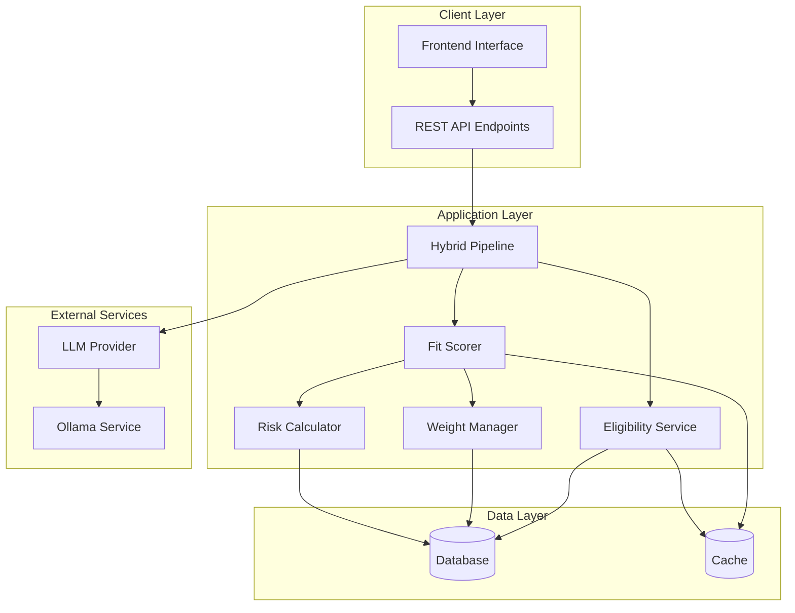
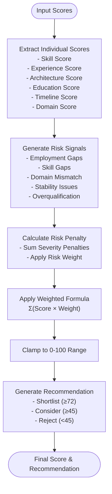
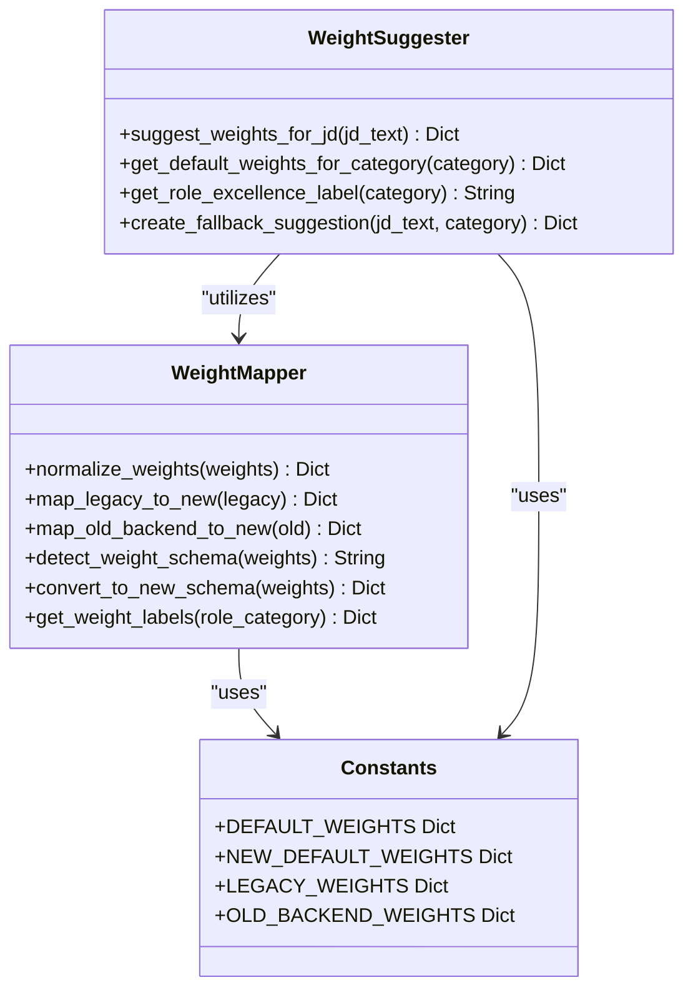
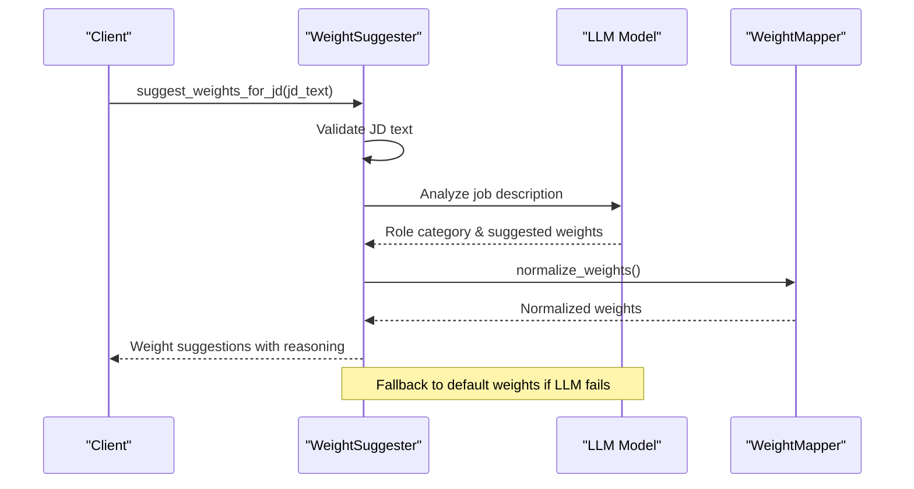
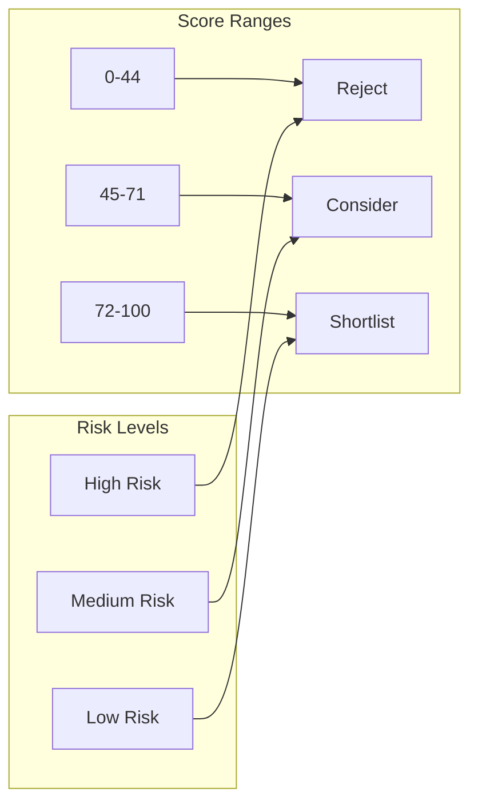
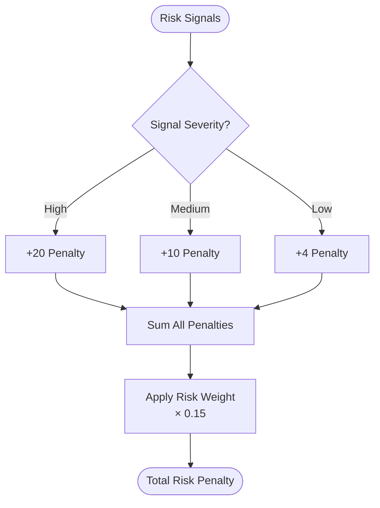
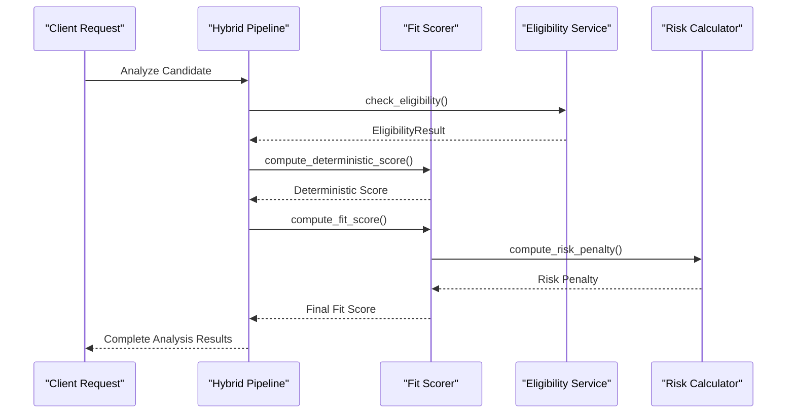

# Fit Scoring System

<cite>
**Referenced Files in This Document**
- [fit_scorer.py](file://app/backend/services/fit_scorer.py)
- [weight_mapper.py](file://app/backend/services/weight_mapper.py)
- [weight_suggester.py](file://app/backend/services/weight_suggester.py)
- [constants.py](file://app/backend/services/constants.py)
- [risk_calculator.py](file://app/backend/services/risk_calculator.py)
- [eligibility_service.py](file://app/backend/services/eligibility_service.py)
- [schemas.py](file://app/backend/models/schemas.py)
- [test_fit_scorer.py](file://app/backend/tests/test_fit_scorer.py)
- [hybrid_pipeline.py](file://app/backend/services/hybrid_pipeline.py)
</cite>

## Table of Contents
1. [Introduction](#introduction)
2. [System Architecture](#system-architecture)
3. [Core Components](#core-components)
4. [Weight Management System](#weight-management-system)
5. [Scoring Algorithms](#scoring-algorithms)
6. [Risk Assessment](#risk-assessment)
7. [Eligibility Engine](#eligibility-engine)
8. [Integration Points](#integration-points)
9. [Testing Framework](#testing-framework)
10. [Performance Considerations](#performance-considerations)
11. [Troubleshooting Guide](#troubleshooting-guide)
12. [Conclusion](#conclusion)

## Introduction

The Fit Scoring System is a comprehensive candidate evaluation framework designed to provide standardized, transparent, and adaptable scoring mechanisms for resume analysis. Built as part of the Resume AI platform by ThetaLogics, this system combines deterministic scoring with machine learning capabilities to deliver consistent and explainable hiring decisions.

The system operates on a hybrid approach, utilizing Python-based deterministic calculations for core scoring alongside LLM-powered narrative generation for qualitative insights. It supports multiple weight schemas, adaptive scoring based on role categories, and comprehensive risk assessment to ensure robust candidate evaluation.

## System Architecture

The Fit Scoring System follows a layered architecture with clear separation of concerns:

**Diagram sources**
- [hybrid_pipeline.py:1-200](file://app/backend/services/hybrid_pipeline.py#L1-L200)
- [fit_scorer.py:1-231](file://app/backend/services/fit_scorer.py#L1-L231)
- [weight_mapper.py:1-345](file://app/backend/services/weight_mapper.py#L1-L345)

## Core Components

### Fit Scorer Service

The Fit Scorer Service serves as the central component for computing standardized candidate scores. It provides three primary scoring mechanisms:

#### Standardized Fit Score Calculation
The main `compute_fit_score` function applies weighted scoring across multiple dimensions:

**Diagram sources**
- [fit_scorer.py:12-114](file://app/backend/services/fit_scorer.py#L12-L114)

#### Deterministic Score Engine
The `compute_deterministic_score` function provides hard caps and eligibility-based restrictions:

- **Hard Caps**: Maximum score limitations based on eligibility criteria
- **Domain Cap**: Maximum 35% when domain match is below 30%
- **Core Skill Cap**: Maximum 40% when core skill match is below 30%

#### Decision Explanation Generator
The `explain_decision` function creates structured explanations with:
- Clear decision rationale
- Feature summary with percentages
- Applied caps documentation
- Actionable recommendations

**Section sources**
- [fit_scorer.py:12-231](file://app/backend/services/fit_scorer.py#L12-L231)

### Weight Management System

The Weight Management System provides backward compatibility and intelligent weight conversion:

**Diagram sources**
- [weight_mapper.py:1-345](file://app/backend/services/weight_mapper.py#L1-L345)
- [weight_suggester.py:1-307](file://app/backend/services/weight_suggester.py#L1-L307)
- [constants.py:128-158](file://app/backend/services/constants.py#L128-L158)

**Section sources**
- [weight_mapper.py:1-345](file://app/backend/services/weight_mapper.py#L1-L345)
- [weight_suggester.py:1-307](file://app/backend/services/weight_suggester.py#L1-L307)
- [constants.py:128-158](file://app/backend/services/constants.py#L128-L158)

## Weight Management System

### Schema Compatibility

The system supports three weight schemas with automatic conversion:

#### Legacy 4-Weight Schema
- **skills**: 0.40
- **experience**: 0.35  
- **stability**: 0.15
- **education**: 0.10

#### Old Backend 7-Weight Schema
- **skills**: 0.30
- **experience**: 0.20
- **architecture**: 0.15
- **education**: 0.10
- **timeline**: 0.10
- **domain**: 0.10
- **risk**: 0.15

#### New Universal 7-Weight Schema
- **core_competencies**: 0.30
- **experience**: 0.20
- **domain_fit**: 0.20
- **education**: 0.10
- **career_trajectory**: 0.10
- **role_excellence**: 0.10
- **risk**: -0.10

### Intelligent Weight Suggestions

The LLM-based weight suggester analyzes job descriptions to provide role-specific recommendations:

**Diagram sources**
- [weight_suggester.py:86-178](file://app/backend/services/weight_suggester.py#L86-L178)
- [weight_mapper.py:36-72](file://app/backend/services/weight_mapper.py#L36-L72)

**Section sources**
- [weight_suggester.py:1-307](file://app/backend/services/weight_suggester.py#L1-L307)
- [weight_mapper.py:1-345](file://app/backend/services/weight_mapper.py#L1-L345)

## Scoring Algorithms

### Multi-Dimensional Scoring Formula

The system employs a comprehensive scoring formula that evaluates candidates across seven key dimensions:

| Dimension | Weight | Description | Typical Range |
|-----------|---------|-------------|---------------|
| Core Competencies | 0.30 | Technical skill alignment | 0-100 |
| Experience | 0.20 | Years of relevant experience | 0-100 |
| Domain Fit | 0.20 | Industry/domain expertise | 0-100 |
| Education | 0.10 | Educational credentials | 0-100 |
| Career Trajectory | 0.10 | Job stability and progression | 0-100 |
| Role Excellence | 0.10 | Specialized achievements | 0-100 |
| Risk | -0.10 | Penalty factor | -∞ to 0 |

### Recommendation Thresholds

The system uses standardized thresholds for automated decision-making:

**Diagram sources**
- [constants.py:9-14](file://app/backend/services/constants.py#L9-L14)

**Section sources**
- [fit_scorer.py:12-114](file://app/backend/services/fit_scorer.py#L12-L114)
- [constants.py:9-14](file://app/backend/services/constants.py#L9-L14)

## Risk Assessment

### Risk Signal Detection

The system automatically identifies potential red flags in candidate profiles:

| Risk Type | Severity | Detection Criteria | Penalty |
|-----------|----------|-------------------|---------|
| Critical Employment Gap | High | 12+ months gap | +20 points |
| Significant Skill Gap | High | Missing ≥50% required skills | +20 points |
| Moderate Skill Gap | Medium | Missing 30-49% required skills | +10 points |
| Domain Mismatch | Medium | Candidate domain ≠ JD domain | +10 points |
| Job Hopping | Medium | ≥3 short stints (<6 months) | +10 points |
| Frequent Job Changes | Low | 2 short stints | +4 points |
| Overqualification | Low | Experience > 2× required | +4 points |

### Risk Penalty Calculation

**Diagram sources**
- [risk_calculator.py:6-15](file://app/backend/services/risk_calculator.py#L6-L15)

**Section sources**
- [risk_calculator.py:1-16](file://app/backend/services/risk_calculator.py#L1-L16)
- [fit_scorer.py:39-70](file://app/backend/services/fit_scorer.py#L39-L70)

## Eligibility Engine

### Deterministic Hard Gates

The eligibility service enforces mandatory criteria before scoring:

**Diagram sources**
- [eligibility_service.py:17-79](file://app/backend/services/eligibility_service.py#L17-L79)

### Hard Cap Application

Eligibility violations trigger maximum score reductions:
- **Domain Mismatch**: Maximum 35% regardless of other scores
- **Low Core Skills (<30%)**: Maximum 40% regardless of other scores
- **No Relevant Experience**: Maximum 35% regardless of other scores

**Section sources**
- [eligibility_service.py:1-80](file://app/backend/services/eligibility_service.py#L1-L80)
- [fit_scorer.py:158-170](file://app/backend/services/fit_scorer.py#L158-L170)

## Integration Points

### Hybrid Pipeline Integration

The Fit Scoring System integrates seamlessly with the hybrid analysis pipeline:

**Diagram sources**
- [hybrid_pipeline.py:39-45](file://app/backend/services/hybrid_pipeline.py#L39-L45)
- [fit_scorer.py:117-118](file://app/backend/services/fit_scorer.py#L117-L118)

### API Schema Integration

The system's output conforms to standardized schemas:

| Field | Type | Description |
|-------|------|-------------|
| fit_score | Integer (0-100) | Final standardized score |
| final_recommendation | String | "Shortlist", "Consider", or "Reject" |
| risk_level | String | "Low", "Medium", or "High" |
| score_breakdown | ScoreBreakdown | Individual dimension scores |
| risk_signals | List | Identified risk factors |
| decision_explanation | Dict | Structured reasoning |

**Section sources**
- [schemas.py:43-131](file://app/backend/models/schemas.py#L43-L131)
- [hybrid_pipeline.py:39-45](file://app/backend/services/hybrid_pipeline.py#L39-L45)

## Testing Framework

### Comprehensive Test Coverage

The system includes extensive testing for reliability and accuracy:

#### Deterministic Score Tests
- Perfect features with eligible status: 100% score
- Zero features: 0% score  
- Ineligible candidates: capped at 35%
- Domain mismatch: capped at 35%
- Low core skills: capped at 40%

#### Decision Explanation Tests
- Shortlist candidates without caps: "Strong match" rationale
- Reject candidates: documented cap applications
- Domain mismatch: specific domain comparison details
- Low core skills: percentage-based explanations

#### Fit Score Calculation Tests
- Basic weighted calculation verification
- Risk signals impact on final score
- Score clamping to valid ranges
- Empty risk signals handling

**Section sources**
- [test_fit_scorer.py:1-246](file://app/backend/tests/test_fit_scorer.py#L1-L246)

## Performance Considerations

### Optimization Strategies

The system implements several performance optimizations:

#### Memory Management
- **Weight Normalization**: Automatic weight scaling prevents overflow
- **Input Sanitization**: Prevents memory leaks from malicious inputs
- **Background Task Management**: Proper cleanup of LLM processing tasks

#### Computational Efficiency
- **Early Termination**: Eligibility checks prevent unnecessary processing
- **Cached Calculations**: Risk penalties computed once per evaluation
- **Parallel Processing**: LLM and Python calculations run concurrently

#### Scalability Features
- **Rate Limiting**: Middleware controls concurrent requests
- **Timeout Management**: Configurable LLM timeouts prevent resource exhaustion
- **Graceful Degradation**: Fallback mechanisms ensure system stability

### Monitoring and Metrics

The system tracks key performance indicators:
- **Analysis Duration**: End-to-end processing time
- **LLM Response Times**: Model inference latency
- **Success Rates**: Percentage of completed analyses
- **Error Rates**: Frequency of processing failures

## Troubleshooting Guide

### Common Issues and Solutions

#### Low Scores Despite Strong Qualifications
**Symptoms**: High individual scores but low final fit score
**Causes**: 
- Risk penalty from employment gaps
- Domain mismatch penalties
- Hard caps from eligibility violations

**Solutions**:
- Review risk signals in score breakdown
- Adjust weight schema for role requirements
- Verify eligibility criteria alignment

#### Inconsistent Weight Behavior
**Symptoms**: Unexpected score variations
**Causes**:
- Weight schema conversion errors
- Missing weight normalization
- Incorrect risk penalty application

**Solutions**:
- Validate weight schema detection
- Check weight normalization process
- Review risk signal severity assignments

#### LLM Integration Problems
**Symptoms**: Timeout errors or empty responses
**Causes**:
- Ollama service connectivity issues
- Model loading problems
- Resource exhaustion

**Solutions**:
- Verify Ollama service availability
- Check model pull status
- Monitor system resource usage

### Debugging Tools

#### Logging Configuration
The system provides comprehensive logging:
- **Request Correlation**: Unique identifiers for traceability
- **Performance Metrics**: Timing and resource usage tracking
- **Error Details**: Structured error reporting with context

#### Validation Points
Key validation checkpoints:
- Input parameter validation
- Weight schema compatibility
- Risk signal calculation accuracy
- Final score range verification

**Section sources**
- [main.py:48-56](file://app/backend/main.py#L48-L56)
- [hybrid_pipeline.py:84-101](file://app/backend/services/hybrid_pipeline.py#L84-L101)

## Conclusion

The Fit Scoring System represents a sophisticated approach to automated candidate evaluation, combining deterministic scoring principles with machine learning capabilities. Its modular architecture ensures maintainability while providing powerful customization options through the weight management system.

Key strengths of the system include:
- **Transparency**: Clear scoring formulas and decision explanations
- **Adaptability**: Support for multiple weight schemas and role categories  
- **Robustness**: Comprehensive risk assessment and eligibility enforcement
- **Performance**: Optimized processing with fallback mechanisms
- **Extensibility**: Modular design supporting future enhancements

The system successfully balances automation with human oversight, providing recruiters with reliable, consistent, and explainable candidate evaluations that support informed hiring decisions.