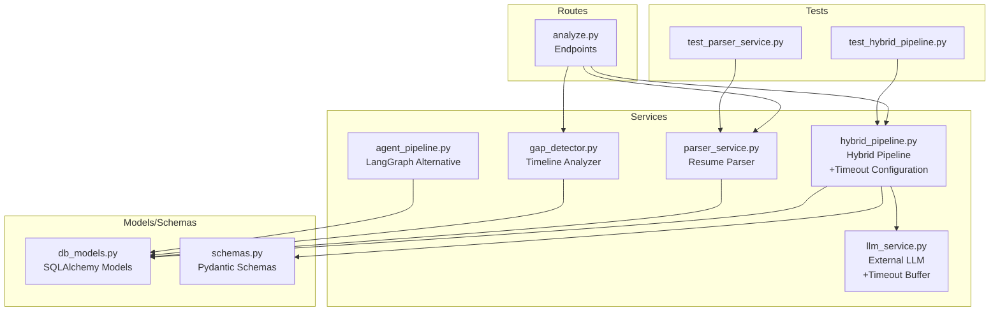
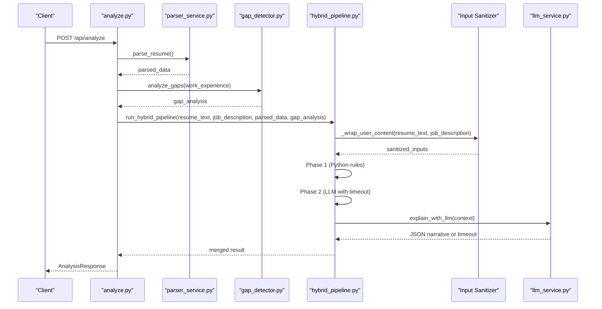
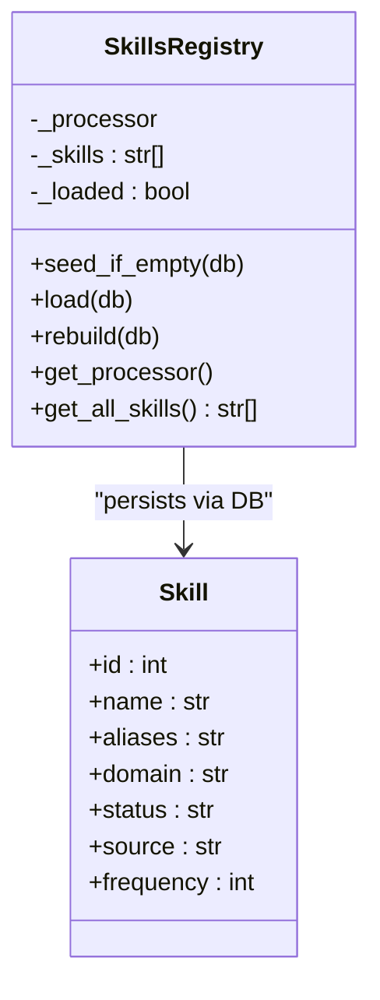
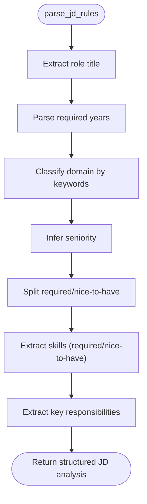
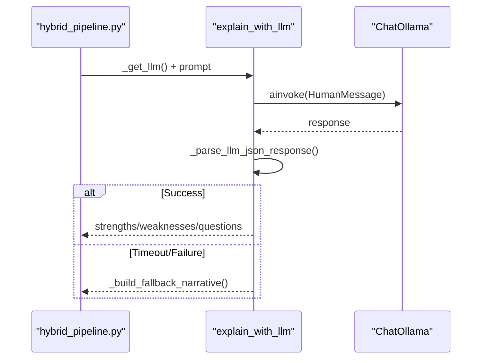
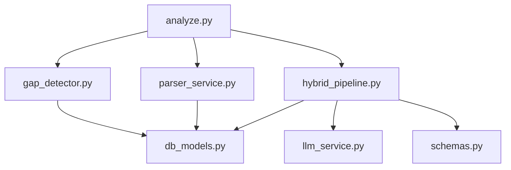

# Hybrid Pipeline Architecture

<cite>
**Referenced Files in This Document**
- [hybrid_pipeline.py](file://app/backend/services/hybrid_pipeline.py)
- [llm_service.py](file://app/backend/services/llm_service.py)
- [parser_service.py](file://app/backend/services/parser_service.py)
- [agent_pipeline.py](file://app/backend/services/agent_pipeline.py)
- [gap_detector.py](file://app/backend/services/gap_detector.py)
- [analyze.py](file://app/backend/routes/analyze.py)
- [db_models.py](file://app/backend/models/db_models.py)
- [schemas.py](file://app/backend/models/schemas.py)
- [test_hybrid_pipeline.py](file://app/backend/tests/test_hybrid_pipeline.py)
- [test_parser_service.py](file://app/backend/tests/test_parser_service.py)
</cite>

## Update Summary
**Changes Made**
- Updated timeout configuration section to reflect LLM_NARRATIVE_TIMEOUT environment variable implementation
- Added detailed explanation of +30 second buffer for reasoning LLM instance
- Enhanced concurrency control documentation with proper cancellation handling
- Updated model configuration section to include timeout-related optimizations
- Added troubleshooting guidance for timeout-related issues

## Table of Contents
1. [Introduction](#introduction)
2. [Project Structure](#project-structure)
3. [Core Components](#core-components)
4. [Architecture Overview](#architecture-overview)
5. [Detailed Component Analysis](#detailed-component-analysis)
6. [Timeout Configuration and Environment Variables](#timeout-configuration-and-environment-variables)
7. [Security and Input Sanitization](#security-and-input-sanitization)
8. [Dependency Analysis](#dependency-analysis)
9. [Performance Considerations](#performance-considerations)
10. [Troubleshooting Guide](#troubleshooting-guide)
11. [Conclusion](#conclusion)

## Introduction
This document explains the hybrid pipeline architecture designed to optimize recruitment analysis performance by combining Python-first deterministic processing with a single LLM call for narrative generation. The system delivers:
- Phase 1 (1–2 seconds): rule-based parsing, skill matching, and scoring
- Phase 2 (40 seconds): single LLM call generating strengths, weaknesses, rationale, and interview questions
- Robust fallback mechanisms ensuring results are always returned
- Skills registry with 180+ technologies and fuzzy matching
- Concurrency control for LLM calls and model configuration tuning
- **Enhanced Timeout Management**: Configurable LLM_NARRATIVE_TIMEOUT environment variable with +30 second buffer for proper cancellation handling
- **Critical Security Enhancement**: Comprehensive input sanitization with pattern-based filtering to prevent prompt injection attacks

## Project Structure
The hybrid pipeline spans services, routes, models, and tests:
- Services: hybrid_pipeline (core), parser_service (resume parsing), gap_detector (timeline math), llm_service (external LLM), agent_pipeline (alternative LangGraph-based pipeline)
- Routes: analyze (HTTP endpoints orchestrating the hybrid pipeline)
- Models/Schemas: SQLAlchemy models and Pydantic schemas for persistence and API contracts
- Tests: comprehensive unit tests validating each pipeline component



**Diagram sources**
- [analyze.py:1-825](file://app/backend/routes/analyze.py#L1-L825)
- [hybrid_pipeline.py:1-1551](file://app/backend/services/hybrid_pipeline.py#L1-L1551)
- [parser_service.py:1-552](file://app/backend/services/parser_service.py#L1-L552)
- [gap_detector.py:1-219](file://app/backend/services/gap_detector.py#L1-L219)
- [llm_service.py:1-157](file://app/backend/services/llm_service.py#L1-L157)
- [agent_pipeline.py:1-634](file://app/backend/services/agent_pipeline.py#L1-L634)
- [db_models.py:1-250](file://app/backend/models/db_models.py#L1-L250)
- [schemas.py:1-379](file://app/backend/models/schemas.py#L1-L379)
- [test_hybrid_pipeline.py:1-757](file://app/backend/tests/test_hybrid_pipeline.py#L1-L757)
- [test_parser_service.py:1-135](file://app/backend/tests/test_parser_service.py#L1-L135)

**Section sources**
- [analyze.py:1-825](file://app/backend/routes/analyze.py#L1-L825)
- [hybrid_pipeline.py:1-1551](file://app/backend/services/hybrid_pipeline.py#L1-L1551)
- [parser_service.py:1-552](file://app/backend/services/parser_service.py#L1-L552)
- [gap_detector.py:1-219](file://app/backend/services/gap_detector.py#L1-L219)
- [llm_service.py:1-157](file://app/backend/services/llm_service.py#L1-L157)
- [agent_pipeline.py:1-634](file://app/backend/services/agent_pipeline.py#L1-L634)
- [db_models.py:1-250](file://app/backend/models/db_models.py#L1-L250)
- [schemas.py:1-379](file://app/backend/models/schemas.py#L1-L379)
- [test_hybrid_pipeline.py:1-757](file://app/backend/tests/test_hybrid_pipeline.py#L1-L757)
- [test_parser_service.py:1-135](file://app/backend/tests/test_parser_service.py#L1-L135)

## Core Components
- Skills Registry: Maintains 180+ canonical skills and aliases, with fuzzy matching and domain mapping
- Parser Service: Extracts structured resume data from multiple formats
- Gap Detector: Computes employment timeline, gaps, overlaps, and total experience
- Hybrid Pipeline: Executes Python phase (rules) then single LLM call for narrative with comprehensive input sanitization and timeout management
- LLM Service: Calls external LLM with JSON schema enforcement, fallbacks, and timeout-aware HTTP requests
- Agent Pipeline: Alternative multi-agent LangGraph pipeline (not used by current routes)
- Routes: Orchestrate parsing, gap analysis, pipeline execution, persistence, and streaming with heartbeat pings

**Section sources**
- [hybrid_pipeline.py:70-427](file://app/backend/services/hybrid_pipeline.py#L70-L427)
- [parser_service.py:130-552](file://app/backend/services/parser_service.py#L130-L552)
- [gap_detector.py:103-219](file://app/backend/services/gap_detector.py#L103-L219)
- [llm_service.py:7-157](file://app/backend/services/llm_service.py#L7-L157)
- [agent_pipeline.py:1-634](file://app/backend/services/agent_pipeline.py#L1-L634)
- [analyze.py:1-825](file://app/backend/routes/analyze.py#L1-L825)

## Architecture Overview
The hybrid pipeline follows a two-phase design with enhanced timeout management and security:
- Phase 1 (Python, ~1–2s): parse job description and resume, match skills, score education/experience/domain, compute fit score
- Phase 2 (LLM, ~40s): single LLM call generates narrative and interview questions with configurable timeout
- Concurrency control: semaphore limits concurrent LLM calls with proper cancellation handling
- Fallback: deterministic narrative when LLM times out or fails
- **Security**: Input sanitization prevents prompt injection attacks before LLM processing
- **Timeout Management**: Configurable LLM_NARRATIVE_TIMEOUT with +30 second buffer for proper cancellation



**Diagram sources**
- [analyze.py:268-318](file://app/backend/routes/analyze.py#L268-L318)
- [parser_service.py:547-552](file://app/backend/services/parser_service.py#L547-L552)
- [gap_detector.py:217-219](file://app/backend/services/gap_detector.py#L217-L219)
- [hybrid_pipeline.py:1317-1318](file://app/backend/services/hybrid_pipeline.py#L1317-L1318)
- [hybrid_pipeline.py:1198-1203](file://app/backend/services/hybrid_pipeline.py#L1198-L1203)
- [llm_service.py:139-157](file://app/backend/services/llm_service.py#L139-L157)

## Detailed Component Analysis

### Skills Registry System
The skills registry maintains:
- Master skill list (180+ domains: programming languages, frameworks, databases, cloud, DevOps, AI/ML, data science, embedded, mobile, testing, architecture, security, project management, design, blockchain, misc)
- Canonical skill names and aliases (e.g., javascript ↔ js, postgresql ↔ postgres)
- Domain mapping for each skill
- In-memory flashtext processor for fast keyword extraction
- Hot-reload capability and DB-backed persistence



**Diagram sources**
- [hybrid_pipeline.py:323-427](file://app/backend/services/hybrid_pipeline.py#L323-L427)
- [db_models.py:238-250](file://app/backend/models/db_models.py#L238-L250)

**Section sources**
- [hybrid_pipeline.py:70-427](file://app/backend/services/hybrid_pipeline.py#L70-L427)
- [db_models.py:238-250](file://app/backend/models/db_models.py#L238-L250)

### Job Description Parsing (Phase 1)
- Role title extraction via regex heuristics
- Required years parsing using multiple patterns
- Domain classification by keyword matching
- Seniority inference from title/years
- Required vs nice-to-have skill separation
- Key responsibilities extraction



**Diagram sources**
- [hybrid_pipeline.py:467-559](file://app/backend/services/hybrid_pipeline.py#L467-L559)

**Section sources**
- [hybrid_pipeline.py:467-559](file://app/backend/services/hybrid_pipeline.py#L467-L559)

### Candidate Profile Builder (Phase 1)
- Merges parser output with full-text scanning for skills
- Infers total effective years from raw text when dates are missing
- Builds career summary from current role/company and years

**Section sources**
- [hybrid_pipeline.py:604-648](file://app/backend/services/hybrid_pipeline.py#L604-L648)
- [parser_service.py:319-371](file://app/backend/services/parser_service.py#L319-L371)

### Skill Matching Engine (Phase 1)
- Normalizes skills and expands aliases
- Exact/alias match, substring match, and fuzzy fallback (rapidfuzz)
- Calculates skill score and identifies adjacent skills


**Diagram sources**
- [hybrid_pipeline.py:676-750](file://app/backend/services/hybrid_pipeline.py#L676-L750)

**Section sources**
- [hybrid_pipeline.py:655-750](file://app/backend/services/hybrid_pipeline.py#L655-L750)

### Education Scoring (Phase 1)
- Degree-to-score mapping with domain relevance multiplier
- Neutral default when no education data

**Section sources**
- [hybrid_pipeline.py:793-826](file://app/backend/services/hybrid_pipeline.py#L793-L826)

### Experience & Timeline Scoring (Phase 1)
- Experience score based on required vs actual years
- Timeline score deduction for gaps/severities and short stints
- Timeline summary text generation

**Section sources**
- [hybrid_pipeline.py:833-894](file://app/backend/services/hybrid_pipeline.py#L833-L894)
- [gap_detector.py:103-219](file://app/backend/services/gap_detector.py#L103-L219)

### Domain & Architecture Scoring (Phase 1)
- Domain fit score by counting JD-domain keywords
- Architecture score by detecting system design signals
- Current role bonus

**Section sources**
- [hybrid_pipeline.py:911-946](file://app/backend/services/hybrid_pipeline.py#L911-L946)

### Fit Score & Risk Signals (Phase 1)
- Weighted fit score across seven dimensions
- Risk signals for gaps, skill gaps, domain mismatch, stability, overqualification
- Recommendations (Shortlist/Consider/Reject) and risk levels

**Section sources**
- [hybrid_pipeline.py:964-1058](file://app/backend/services/hybrid_pipeline.py#L964-L1058)

### LLM Narrative Generation (Phase 2)
- Single LLM call with structured JSON schema
- JSON parsing with robust extraction (thinking tags, fenced code blocks, trailing commas)
- Fallback narrative when LLM fails/times out
- **Enhanced**: Proper timeout handling with +30 second buffer for cancellation



**Diagram sources**
- [hybrid_pipeline.py:1144-1201](file://app/backend/services/hybrid_pipeline.py#L1144-L1201)
- [hybrid_pipeline.py:1197-1255](file://app/backend/services/hybrid_pipeline.py#L1197-L1255)

**Section sources**
- [hybrid_pipeline.py:1074-1255](file://app/backend/services/hybrid_pipeline.py#L1074-L1255)

### Concurrency Control and Model Configuration
- Semaphore limits concurrent LLM calls to 2 per worker
- Model configuration: temperature=0.1, JSON format, constrained context and prediction sizes
- **Enhanced**: Environment-driven timeouts with +30 second buffer for proper cancellation
- **Streaming**: Heartbeat pings keep connections alive during LLM processing

**Section sources**
- [hybrid_pipeline.py:24-66](file://app/backend/services/hybrid_pipeline.py#L24-L66)
- [hybrid_pipeline.py:1380-1407](file://app/backend/services/hybrid_pipeline.py#L1380-L1407)
- [hybrid_pipeline.py:1463-1551](file://app/backend/services/hybrid_pipeline.py#L1463-L1551)

### Routes Orchestration
- Parses resumes in thread pool to avoid blocking
- Caches JD parsing in DB for reuse across workers
- Deduplicates candidates across multiple criteria
- Persists results and logs structured analysis events
- **Enhanced**: Streaming endpoint with heartbeat pings for long-running operations

**Section sources**
- [analyze.py:268-501](file://app/backend/routes/analyze.py#L268-L501)
- [analyze.py:504-646](file://app/backend/routes/analyze.py#L504-L646)
- [analyze.py:577-658](file://app/backend/routes/analyze.py#L577-L658)

## Timeout Configuration and Environment Variables

### LLM_NARRATIVE_TIMEOUT Environment Variable
The hybrid pipeline implements configurable timeout management through the LLM_NARRATIVE_TIMEOUT environment variable:

#### Core Timeout Configuration
The system uses LLM_NARRATIVE_TIMEOUT as the base timeout value with a +30 second buffer for proper cancellation handling:

```python
# Base timeout from environment variable
_llm_timeout = float(os.getenv("LLM_NARRATIVE_TIMEOUT", "150"))

# HTTP timeout with +30 second buffer to ensure proper cancellation
request_timeout=_llm_timeout + 30
```

#### Implementation Details
- **Default Value**: 150 seconds (2.5 minutes) if LLM_NARRATIVE_TIMEOUT is not set
- **Buffer Strategy**: +30 seconds added to HTTP timeout to allow asyncio.wait_for to cancel properly
- **Consistent Usage**: Both synchronous and asynchronous LLM calls respect this configuration
- **Fallback Handling**: Graceful degradation when timeout occurs

#### Streaming Endpoint Timeout Management
The streaming endpoint uses a separate timeout configuration for heartbeat pings:

```python
_LLMTIMEOUT_STREAM = float(os.getenv("LLM_NARRATIVE_TIMEOUT", "150"))

async def _llm_task():
    try:
        async with _get_semaphore():
            result = await asyncio.wait_for(explain_with_llm(llm_context), timeout=_LLMTIMEOUT_STREAM)
        # Success handling
    except asyncio.TimeoutError:
        # Timeout handling with fallback narrative
        python_result["narrative_pending"] = True
```

#### Heartbeat Ping Mechanism
During LLM processing, the system sends periodic heartbeat pings to keep connections alive:

```python
while True:
    try:
        status, llm_result = await asyncio.wait_for(llm_queue.get(), timeout=5.0)
        break
    except asyncio.TimeoutError:
        yield ": ping\n\n"  # SSE comment — keeps connection alive during LLM wait
```

#### Timeout Configuration Options
- **Minimum Recommended**: 120 seconds for typical LLM responses
- **Typical Range**: 120–300 seconds depending on model size and complexity
- **Connection Limits**: +30 second buffer accommodates proxy/CDN timeouts

#### Troubleshooting Timeout Issues
Common timeout scenarios and solutions:

1. **Model Loading Delays**: Increase LLM_NARRATIVE_TIMEOUT if model is still loading
2. **Large Context Processing**: Adjust timeout based on resume/job description length
3. **Network Latency**: Consider proxy/CDN timeout configurations
4. **Resource Constraints**: Monitor system resources during LLM processing

**Section sources**
- [hybrid_pipeline.py:82-109](file://app/backend/services/hybrid_pipeline.py#L82-L109)
- [hybrid_pipeline.py:1502-1507](file://app/backend/services/hybrid_pipeline.py#L1502-L1507)
- [hybrid_pipeline.py:1534-1545](file://app/backend/services/hybrid_pipeline.py#L1534-L1545)
- [llm_service.py:43-58](file://app/backend/services/llm_service.py#L43-L58)

## Security and Input Sanitization

### Prompt Injection Prevention
The hybrid pipeline implements comprehensive input sanitization to prevent prompt injection attacks:

#### Pattern-Based Filtering
The system uses a sophisticated pattern-matching approach to detect and neutralize known prompt injection attempts:

```python
_INJECTION_PATTERNS = [
    re.compile(r"ignore\s+(all\s+)?previous\s+instructions", re.IGNORECASE),
    re.compile(r"ignore\s+(all\s+)?above\s+instructions", re.IGNORECASE),
    re.compile(r"disregard\s+(all\s+)?previous", re.IGNORECASE),
    re.compile(r"you\s+are\s+now\s+a", re.IGNORECASE),
    re.compile(r"new\s+instructions?\s*:", re.IGNORECASE),
    re.compile(r"system\s*:", re.IGNORECASE),
    re.compile(r"assistant\s*:", re.IGNORECASE),
    re.compile(r"<\s*system\s*>", re.IGNORECASE),
    re.compile(r"\[INST\]", re.IGNORECASE),
    re.compile(r"\[/INST\]", re.IGNORECASE),
]
```

#### Input Length Restrictions
Comprehensive input length controls prevent abuse and ensure LLM safety:

- **Resume Text**: Maximum 50,000 characters (~50KB)
- **Job Description**: Maximum 20,000 characters (~20KB)
- **Individual Fields**: Additional constraints for specific fields:
  - Role Title: 200 characters maximum
  - Candidate Name: 100 characters maximum
  - Current Role/Company: 100 characters maximum
  - Career Snippet: 400 characters maximum

#### Sanitization Process
The `_sanitize_input` function applies multiple layers of protection:

```python
def _sanitize_input(text: str, max_length: int, label: str = "content") -> str:
    """Sanitize user-provided text to prevent prompt injection."""
    if not text:
        return text
    # Truncate excessively long inputs
    if len(text) > max_length:
        text = text[:max_length]
    # Strip known injection patterns
    for pattern in _INJECTION_PATTERNS:
        text = pattern.sub("[FILTERED]", text)
    return text
```

#### Integration Points
Input sanitization occurs at multiple critical points:

1. **Initial Processing**: `_wrap_user_content` sanitizes resume and job description before Python phase
2. **LLM Prompt Construction**: Individual fields sanitized before inclusion in LLM prompts
3. **Context Preservation**: Sanitized content maintained for deterministic fallback generation

#### Attack Vector Mitigation
The sanitization system protects against common prompt injection techniques:

- **System Command Injection**: Patterns like "system:", "assistant:", "[INST]"
- **Instruction Override**: Attempts to bypass previous instructions
- **Role Manipulation**: Commands trying to change the AI's role
- **Context Injection**: HTML/XML-like system tags

#### Security Benefits
- **Zero Trust Architecture**: All user input treated as potentially malicious
- **Defense in Depth**: Multiple layers of protection (patterns + length limits)
- **Deterministic Behavior**: Predictable sanitization ensures consistent results
- **Performance Optimization**: Early filtering prevents unnecessary LLM processing

**Section sources**
- [hybrid_pipeline.py:24-59](file://app/backend/services/hybrid_pipeline.py#L24-L59)
- [hybrid_pipeline.py:42-52](file://app/backend/services/hybrid_pipeline.py#L42-L52)
- [hybrid_pipeline.py:55-59](file://app/backend/services/hybrid_pipeline.py#L55-L59)
- [hybrid_pipeline.py:1198-1203](file://app/backend/services/hybrid_pipeline.py#L1198-L1203)
- [hybrid_pipeline.py:1317-1318](file://app/backend/services/hybrid_pipeline.py#L1317-L1318)

## Dependency Analysis
The hybrid pipeline integrates several services and models:



**Diagram sources**
- [analyze.py:32-38](file://app/backend/routes/analyze.py#L32-L38)
- [parser_service.py:1-552](file://app/backend/services/parser_service.py#L1-L552)
- [gap_detector.py:1-219](file://app/backend/services/gap_detector.py#L1-L219)
- [hybrid_pipeline.py:1-1551](file://app/backend/services/hybrid_pipeline.py#L1-L1551)
- [db_models.py:1-250](file://app/backend/models/db_models.py#L1-L250)
- [schemas.py:1-379](file://app/backend/models/schemas.py#L1-L379)

**Section sources**
- [analyze.py:32-38](file://app/backend/routes/analyze.py#L32-L38)
- [parser_service.py:1-552](file://app/backend/services/parser_service.py#L1-L552)
- [gap_detector.py:1-219](file://app/backend/services/gap_detector.py#L1-L219)
- [hybrid_pipeline.py:1-1551](file://app/backend/services/hybrid_pipeline.py#L1-L1551)
- [db_models.py:1-250](file://app/backend/models/db_models.py#L1-L250)
- [schemas.py:1-379](file://app/backend/models/schemas.py#L1-L379)

## Performance Considerations
- Python-first processing: all deterministic components run in 1–2 seconds
- LLM optimization: constrained context and prediction sizes reduce KV cache usage and latency
- Concurrency control: semaphore limits concurrent LLM calls to prevent resource exhaustion
- Caching: JD parsing cached in DB; parser snapshot stored for candidate re-analysis
- Memory management: flashtext processor built once per registry instance; in-memory caches for skills and JD
- **Enhanced**: Timeout-aware streaming with heartbeat pings improves perceived performance
- Error handling: fallback narratives ensure no partial results and maintain system resilience
- **Security Performance**: Input sanitization adds minimal overhead while providing critical security benefits
- **Resource Optimization**: +30 second buffer prevents premature HTTP timeouts while allowing proper cancellation

## Troubleshooting Guide
Common issues and resolutions:
- LLM timeout/failure: The pipeline returns a deterministic fallback narrative and sets a flag indicating narrative pending
- Scanned PDFs: Parser raises a graceful error; route returns fallback result with pipeline errors
- JD too short: Validation rejects inputs under 80 words
- Skills not recognized: Registry falls back to master list; ensure skills are seeded and loaded
- JSON parsing failures: LLM response parser tolerates various formats and extracts the first balanced JSON object
- **Timeout Issues**: Increase LLM_NARRATIVE_TIMEOUT if model is still loading or processing large contexts
- **Connection Timeouts**: Verify proxy/CDN timeout settings are compatible with +30 second buffer
- **Input sanitization issues**: If content is unexpectedly filtered, check for injection patterns or excessive length
- **Security violations**: The system automatically filters suspicious content; verify input doesn't trigger pattern matches

**Section sources**
- [hybrid_pipeline.py:1384-1407](file://app/backend/services/hybrid_pipeline.py#L1384-L1407)
- [analyze.py:276-290](file://app/backend/routes/analyze.py#L276-L290)
- [analyze.py:255-265](file://app/backend/routes/analyze.py#L255-L265)
- [hybrid_pipeline.py:1078-1141](file://app/backend/services/hybrid_pipeline.py#L1078-L1141)
- [hybrid_pipeline.py:1510-1518](file://app/backend/services/hybrid_pipeline.py#L1510-L1518)

## Conclusion
The hybrid pipeline achieves optimal performance by leveraging Python-first determinism for parsing, matching, and scoring, followed by a single, carefully configured LLM call for narrative generation. Robust fallbacks, concurrency control, and caching ensure reliability and scalability. The skills registry with fuzzy matching and domain mapping provides comprehensive coverage across 180+ technologies, enabling precise and efficient candidate evaluation.

**Enhanced Timeout Management**: The implementation of configurable LLM_NARRATIVE_TIMEOUT with +30 second buffer provides flexible timeout control while ensuring proper cancellation handling. This enhancement improves system reliability for long-running LLM operations and streaming endpoints.

**Critical Security Enhancement**: The implementation of comprehensive input sanitization with pattern-based filtering and input length restrictions provides robust protection against prompt injection attacks while maintaining system performance. This security layer operates transparently, adding minimal overhead while significantly improving the system's resilience to malicious input attempts.

**Streaming Optimization**: The heartbeat ping mechanism in streaming endpoints ensures reliable long-running operations and improved user experience during LLM processing delays.