# Hybrid Pipeline Architecture

<cite>
**Referenced Files in This Document**
- [hybrid_pipeline.py](file://app/backend/services/hybrid_pipeline.py)
- [llm_service.py](file://app/backend/services/llm_service.py)
- [parser_service.py](file://app/backend/services/parser_service.py)
- [agent_pipeline.py](file://app/backend/services/agent_pipeline.py)
- [gap_detector.py](file://app/backend/services/gap_detector.py)
- [analyze.py](file://app/backend/routes/analyze.py)
- [db_models.py](file://app/backend/models/db_models.py)
- [schemas.py](file://app/backend/models/schemas.py)
- [test_hybrid_pipeline.py](file://app/backend/tests/test_hybrid_pipeline.py)
- [test_parser_service.py](file://app/backend/tests/test_parser_service.py)
- [ResultCard.jsx](file://app/frontend/src/components/ResultCard.jsx)
- [api.js](file://app/frontend/src/lib/api.js)
- [main.py](file://app/backend/main.py)
- [README.md](file://README.md)
</cite>

## Update Summary
**Changes Made**
- Enhanced token budget allocation with 6000/8000 tokens for local/cloud deployments and 8192 context window
- Expanded interview question framework from 5 to 15 questions with detailed metadata structure
- Introduced comprehensive candidate briefing system with profile snapshots and evaluation guidance
- Implemented INTERVIEW KIT RULES for targeted question generation based on skill gaps and domain requirements
- Enhanced normalization system for consistent interview question formatting
- Improved fallback narrative system with expanded candidate briefing capabilities
- Updated LLM configuration with increased num_predict values (6000 for local, 8000 for cloud)

## Table of Contents
1. [Introduction](#introduction)
2. [Project Structure](#project-structure)
3. [Core Components](#core-components)
4. [Architecture Overview](#architecture-overview)
5. [Detailed Component Analysis](#detailed-component-analysis)
6. [Enhanced Token Budget Management](#enhanced-token-budget-management)
7. [Expanded Interview Question Framework](#expanded-interview-question-framework)
8. [Candidate Briefing System](#candidate-briefing-system)
9. [INTERVIEW KIT RULES Implementation](#interview-kit-rules-implementation)
10. [Enhanced Normalization System](#enhanced-normalization-system)
11. [Improved Fallback Narrative System](#improved-fallback-narrative-system)
12. [Enhanced Cloud Model Processing](#enhanced-cloud-model-processing)
13. [Enhanced Timeout Management](#enhanced-timeout-management)
14. [Extended Frontend Polling Architecture](#extended-frontend-polling-architecture)
15. [Background Worker Pattern](#background-worker-pattern)
16. [Enhanced Explainability Features](#enhanced-explainability-features)
17. [Security and Input Sanitization](#security-and-input-sanitization)
18. [Enhanced Error Handling and Response Validation](#enhanced-error-handling-and-response-validation)
19. [Dependency Analysis](#dependency-analysis)
20. [Performance Considerations](#performance-considerations)
21. [Troubleshooting Guide](#troubleshooting-guide)
22. [Conclusion](#conclusion)

## Introduction
This document explains the hybrid pipeline architecture designed to optimize recruitment analysis performance by combining Python-first deterministic processing with asynchronous LLM processing and narrative polling. The system delivers:
- Phase 1 (1–2 seconds): rule-based parsing, skill matching, and scoring with comprehensive explainability
- Asynchronous Phase 2: background LLM narrative generation with persistent storage
- Enhanced narrative polling architecture: immediate response with extended 10-minute polling period
- Robust fallback mechanisms ensuring results are always returned
- Skills registry with 180+ technologies and fuzzy matching
- Concurrency control for LLM calls and model configuration tuning
- **Enhanced Model Configuration**: Updated from gemma4:e4b to qwen3.5:4b with improved performance characteristics
- **Advanced Explainability**: Comprehensive score rationales, risk analysis, seniority alignment indicators, and skill depth counts
- **Enhanced Timeout Management**: Configurable LLM_NARRATIVE_TIMEOUT environment variable with +30 second buffer for proper cancellation handling
- **Critical Security Enhancement**: Comprehensive input sanitization with pattern-based filtering to prevent prompt injection attacks
- **Background Processing**: Asynchronous LLM narrative generation with automatic persistence
- **Extended Polling Architecture**: Frontend polling with 10-minute timeout (60 attempts at 10-second intervals) for CPU-based LLM inference scenarios
- **Enhanced Cloud Processing**: Optimized token limits and context windows for cloud deployments with 2048 tokens and 8192 context
- **Local Model Optimization**: Maintained 512 tokens and 2048 context for local deployments to ensure optimal performance
- **Enhanced Error Handling**: Comprehensive validation for empty responses, whitespace-only responses, and ultra-short responses (< 20 characters>
- **Enhanced Token Budget Management**: Optimized token allocation with 6000/8000 tokens for local/cloud deployments and 8192 context window
- **Expanded Interview Framework**: Interview questions increased from 5 to 15 with detailed metadata and candidate briefing system
- **INTERVIEW KIT RULES**: Automated question generation rules based on skill gaps, domain requirements, and candidate profile analysis
- **Enhanced Normalization**: Consistent interview question formatting and metadata standardization
- **Improved Fallback System**: Enhanced fallback narratives with comprehensive candidate briefing capabilities

## Project Structure
The hybrid pipeline spans services, routes, models, and tests with enhanced background processing, token budget management, and expanded interview framework:
- Services: hybrid_pipeline (core with background workers), parser_service (resume parsing), gap_detector (timeline math), llm_service (external LLM), agent_pipeline (alternative LangGraph-based pipeline)
- Routes: analyze (HTTP endpoints orchestrating the hybrid pipeline with polling support)
- Models/Schemas: SQLAlchemy models and Pydantic schemas for persistence and API contracts
- Tests: comprehensive unit tests validating each pipeline component
- Frontend: ResultCard.jsx displaying enhanced explainability features with extended polling integration

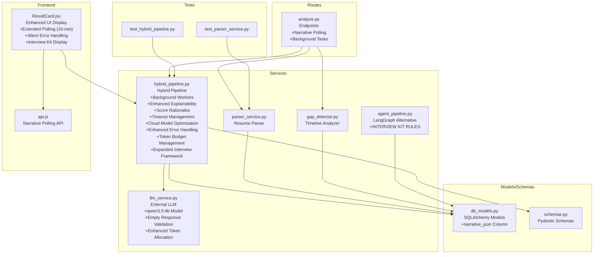

**Diagram sources**
- [analyze.py:1-1149](file://app/backend/routes/analyze.py#L1-L1149)
- [hybrid_pipeline.py:1-2094](file://app/backend/services/hybrid_pipeline.py#L1-L2094)
- [parser_service.py:1-552](file://app/backend/services/parser_service.py#L1-L552)
- [gap_detector.py:1-219](file://app/backend/services/gap_detector.py#L1-L219)
- [llm_service.py:1-260](file://app/backend/services/llm_service.py#L1-L260)
- [agent_pipeline.py:1-634](file://app/backend/services/agent_pipeline.py#L1-L634)
- [db_models.py:1-264](file://app/backend/models/db_models.py#L1-L264)
- [schemas.py:1-379](file://app/backend/models/schemas.py#L1-L379)
- [test_hybrid_pipeline.py:1-757](file://app/backend/tests/test_hybrid_pipeline.py#L1-L757)
- [test_parser_service.py:1-135](file://app/backend/tests/test_parser_service.py#L1-L135)
- [ResultCard.jsx:1-772](file://app/frontend/src/components/ResultCard.jsx#L1-L772)
- [api.js:411-416](file://app/frontend/src/lib/api.js#L411-L416)

**Section sources**
- [analyze.py:1-1149](file://app/backend/routes/analyze.py#L1-L1149)
- [hybrid_pipeline.py:1-2094](file://app/backend/services/hybrid_pipeline.py#L1-L2094)
- [parser_service.py:1-552](file://app/backend/services/parser_service.py#L1-L552)
- [gap_detector.py:1-219](file://app/backend/services/gap_detector.py#L1-L219)
- [llm_service.py:1-260](file://app/backend/services/llm_service.py#L1-L260)
- [agent_pipeline.py:1-634](file://app/backend/services/agent_pipeline.py#L1-L634)
- [db_models.py:1-264](file://app/backend/models/db_models.py#L1-L264)
- [schemas.py:1-379](file://app/backend/models/schemas.py#L1-L379)
- [test_hybrid_pipeline.py:1-757](file://app/backend/tests/test_hybrid_pipeline.py#L1-L757)
- [test_parser_service.py:1-135](file://app/backend/tests/test_parser_service.py#L1-L135)
- [ResultCard.jsx:1-772](file://app/frontend/src/components/ResultCard.jsx#L1-L772)
- [api.js:411-416](file://app/frontend/src/lib/api.js#L411-L416)

## Core Components
- Skills Registry: Maintains 180+ canonical skills and aliases, with fuzzy matching and domain mapping
- Parser Service: Extracts structured resume data from multiple formats
- Gap Detector: Computes employment timeline, gaps, overlaps, and total experience
- Hybrid Pipeline: Executes Python phase (rules) then asynchronous LLM call for narrative with comprehensive input sanitization, timeout management, enhanced explainability, and robust error handling
- LLM Service: Calls external LLM with JSON schema enforcement, fallbacks, and timeout-aware HTTP requests using qwen3.5:4b model
- Agent Pipeline: Alternative multi-agent LangGraph pipeline with INTERVIEW KIT RULES implementation
- Routes: Orchestrate parsing, gap analysis, pipeline execution, persistence, and streaming with heartbeat pings and background task management
- Frontend Components: Display enhanced explainability features including concerns, risk flags, seniority alignment, and score rationales with extended polling integration
- Background Workers: Manage asynchronous LLM processing with proper task lifecycle management and timeout protection
- **Enhanced Token Budget Management**: Optimized token allocation with 6000/8000 tokens for local/cloud deployments and 8192 context window
- **Expanded Interview Framework**: Interview questions increased from 5 to 15 with detailed metadata structure and candidate briefing system
- **INTERVIEW KIT RULES**: Automated question generation rules based on skill gaps, domain requirements, and candidate profile analysis
- **Enhanced Normalization**: Consistent interview question formatting and metadata standardization
- **Improved Fallback System**: Enhanced fallback narratives with comprehensive candidate briefing capabilities

**Section sources**
- [hybrid_pipeline.py:70-427](file://app/backend/services/hybrid_pipeline.py#L70-L427)
- [parser_service.py:130-552](file://app/backend/services/parser_service.py#L130-L552)
- [gap_detector.py:103-219](file://app/backend/services/gap_detector.py#L103-L219)
- [llm_service.py:7-260](file://app/backend/services/llm_service.py#L7-L260)
- [agent_pipeline.py:1-634](file://app/backend/services/agent_pipeline.py#L1-L634)
- [analyze.py:1-1149](file://app/backend/routes/analyze.py#L1-L1149)
- [ResultCard.jsx:475-572](file://app/frontend/src/components/ResultCard.jsx#L475-L572)

## Architecture Overview
The hybrid pipeline follows a two-phase design with enhanced timeout management, advanced explainability, modern model configuration, comprehensive error handling, and expanded interview framework:
- Phase 1 (Python, ~1–2s): parse job description and resume, match skills, score education/experience/domain, compute fit score, build score rationales, risk summary, and skill depth
- Asynchronous Phase 2: background LLM processing generates strengths, concerns, executive summaries, rationale, and interview questions with configurable timeout
- Concurrency control: semaphore limits concurrent LLM calls with proper cancellation handling
- Fallback: deterministic narrative when LLM times out or fails
- **Security**: Input sanitization prevents prompt injection attacks before LLM processing
- **Enhanced Timeout Management**: Configurable LLM_NARRATIVE_TIMEOUT with +30 second buffer for proper cancellation
- **Enhanced Model**: Updated to qwen3.5:4b for improved performance and reliability
- **Advanced Explainability**: Comprehensive score rationales, risk analysis, seniority alignment, and skill depth visualization
- **Background Processing**: Asynchronous LLM narrative generation with automatic persistence
- **Extended Polling**: Frontend polling architecture with 10-minute timeout for CPU-based LLM inference scenarios
- **Enhanced Cloud Processing**: Optimized token limits and context windows for cloud deployments with 2048 tokens and 8192 context
- **Local Model Optimization**: Maintained 512 tokens and 2048 context for local deployments to ensure optimal performance
- **Enhanced Error Handling**: Comprehensive validation for empty responses, whitespace-only responses, and ultra-short responses (< 20 characters) with retry mechanism
- **Enhanced Token Budget Management**: Optimized token allocation with 6000/8000 tokens for local/cloud deployments and 8192 context window
- **Expanded Interview Framework**: Interview questions increased from 5 to 15 with detailed metadata structure and candidate briefing system
- **INTERVIEW KIT RULES**: Automated question generation rules based on skill gaps, domain requirements, and candidate profile analysis
- **Enhanced Normalization**: Consistent interview question formatting and metadata standardization
- **Improved Fallback System**: Enhanced fallback narratives with comprehensive candidate briefing capabilities

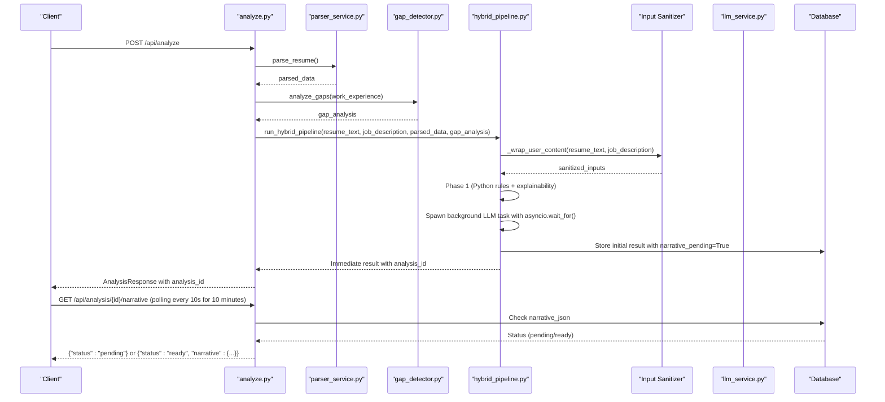

**Diagram sources**
- [analyze.py:442-666](file://app/backend/routes/analyze.py#L442-L666)
- [parser_service.py:547-552](file://app/backend/services/parser_service.py#L547-L552)
- [gap_detector.py:217-219](file://app/backend/services/gap_detector.py#L217-L219)
- [hybrid_pipeline.py:1863-1950](file://app/backend/services/hybrid_pipeline.py#L1863-L1950)
- [hybrid_pipeline.py:1783-1861](file://app/backend/services/hybrid_pipeline.py#L1783-L1861)
- [llm_service.py:139-157](file://app/backend/services/llm_service.py#L139-L157)
- [analyze.py:1118-1149](file://app/backend/routes/analyze.py#L1118-L1149)

## Detailed Component Analysis

### Skills Registry System
The skills registry maintains:
- Master skill list (180+ domains: programming languages, frameworks, databases, cloud, DevOps, AI/ML, data science, embedded, mobile, testing, architecture, security, project management, design, blockchain, misc)
- Canonical skill names and aliases (e.g., javascript ↔ js, postgresql ↔ postgres)
- Domain mapping for each skill
- In-memory flashtext processor for fast keyword extraction
- Hot-reload capability and DB-backed persistence

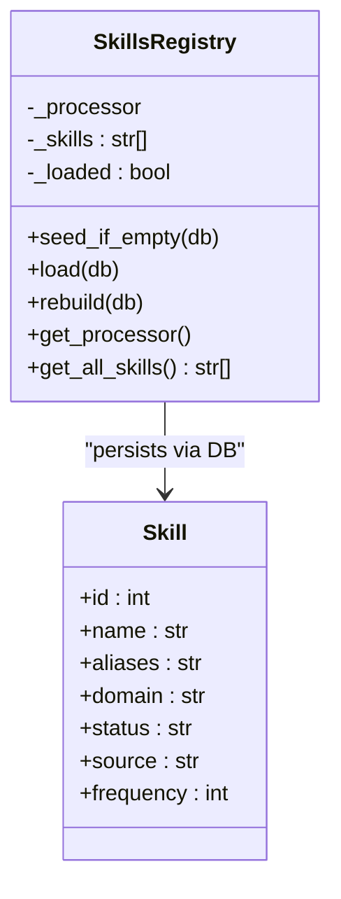

**Diagram sources**
- [hybrid_pipeline.py:323-427](file://app/backend/services/hybrid_pipeline.py#L323-L427)
- [db_models.py:240-252](file://app/backend/models/db_models.py#L240-L252)

**Section sources**
- [hybrid_pipeline.py:70-427](file://app/backend/services/hybrid_pipeline.py#L70-L427)
- [db_models.py:240-252](file://app/backend/models/db_models.py#L240-L252)

### Job Description Parsing (Phase 1)
- Role title extraction via regex heuristics
- Required years parsing using multiple patterns
- Domain classification by keyword matching
- Seniority inference from title/years
- Required vs nice-to-have skill separation
- Key responsibilities extraction


**Diagram sources**
- [hybrid_pipeline.py:467-559](file://app/backend/services/hybrid_pipeline.py#L467-L559)

**Section sources**
- [hybrid_pipeline.py:467-559](file://app/backend/services/hybrid_pipeline.py#L467-L559)

### Candidate Profile Builder (Phase 1)
- Merges parser output with full-text scanning for skills
- Infers total effective years from raw text when dates are missing
- Builds career summary from current role/company and years

**Section sources**
- [hybrid_pipeline.py:604-648](file://app/backend/services/hybrid_pipeline.py#L604-L648)
- [parser_service.py:319-371](file://app/backend/services/parser_service.py#L319-L371)

### Skill Matching Engine (Phase 1)
- Normalizes skills and expands aliases
- Exact/alias match, substring match, and fuzzy fallback (rapidfuzz)
- Calculates skill score and identifies adjacent skills

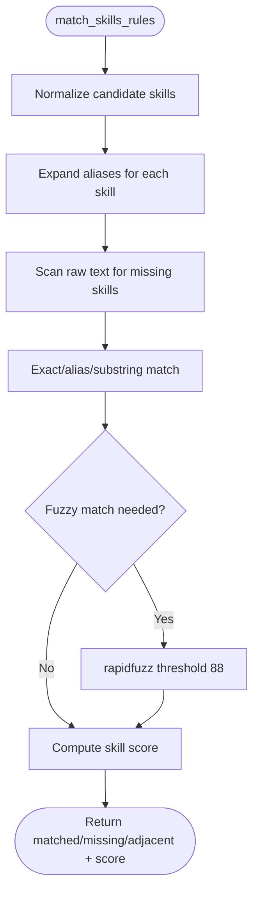

**Diagram sources**
- [hybrid_pipeline.py:676-750](file://app/backend/services/hybrid_pipeline.py#L676-L750)

**Section sources**
- [hybrid_pipeline.py:655-750](file://app/backend/services/hybrid_pipeline.py#L655-L750)

### Education Scoring (Phase 1)
- Degree-to-score mapping with domain relevance multiplier
- Neutral default when no education data

**Section sources**
- [hybrid_pipeline.py:793-826](file://app/backend/services/hybrid_pipeline.py#L793-L826)

### Experience & Timeline Scoring (Phase 1)
- Experience score based on required vs actual years
- Timeline score deduction for gaps/severities and short stints
- Timeline summary text generation

**Section sources**
- [hybrid_pipeline.py:833-894](file://app/backend/services/hybrid_pipeline.py#L833-L894)
- [gap_detector.py:103-219](file://app/backend/services/gap_detector.py#L103-L219)

### Domain & Architecture Scoring (Phase 1)
- Domain fit score by counting JD-domain keywords
- Architecture score by detecting system design signals
- Current role bonus

**Section sources**
- [hybrid_pipeline.py:911-946](file://app/backend/services/hybrid_pipeline.py#L911-L946)

### Fit Score & Risk Signals (Phase 1)
- Weighted fit score across seven dimensions
- Risk signals for gaps, skill gaps, domain mismatch, stability, overqualification
- Recommendations (Shortlist/Consider/Reject) and risk levels

**Section sources**
- [hybrid_pipeline.py:964-1058](file://app/backend/services/hybrid_pipeline.py#L964-L1058)

### Enhanced Score Rationales & Risk Analysis (Phase 1)
- **New**: Comprehensive score rationales for each dimension (skill, experience, education, timeline, domain)
- **New**: Risk summary with seniority alignment, career trajectory, and stability assessment
- **New**: Skill depth calculation counting occurrences in resume text
- **New**: Quality assessment based on data completeness

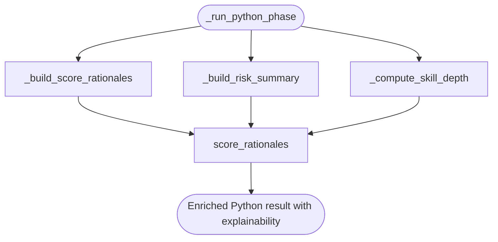

**Diagram sources**
- [hybrid_pipeline.py:1411-1525](file://app/backend/services/hybrid_pipeline.py#L1411-L1525)
- [hybrid_pipeline.py:1528-1600](file://app/backend/services/hybrid_pipeline.py#L1528-L1600)
- [hybrid_pipeline.py:1603-1619](file://app/backend/services/hybrid_pipeline.py#L1603-L1619)

**Section sources**
- [hybrid_pipeline.py:1411-1619](file://app/backend/services/hybrid_pipeline.py#L1411-L1619)

### Asynchronous LLM Narrative Generation (Phase 2)
- Background LLM task with automatic persistence to DB
- JSON parsing with robust extraction (thinking tags, fenced code blocks, trailing commas)
- Fallback narrative when LLM fails/times out
- **Enhanced**: Proper timeout handling with +30 second buffer for cancellation
- **Enhanced**: Comprehensive prompt including score rationales, risk flags, and seniority alignment
- **Enhanced**: Automatic task registration and lifecycle management with asyncio.wait_for() protection
- **Enhanced**: Empty response validation to prevent processing of blank LLM outputs
- **Enhanced**: Comprehensive validation for empty responses, whitespace-only responses, and ultra-short responses (< 20 characters)
- **Enhanced**: Retry mechanism with higher temperature for edge cases where LLM returns empty or too-short responses
- **Enhanced**: Cloud model optimization with 2048 tokens and 8192 context window
- **Enhanced**: Local model optimization with 512 tokens and 2048 context window
- **Enhanced**: Token budget management with 6000/8000 tokens for local/cloud deployments
- **Enhanced**: Expanded interview question framework with 15 questions and detailed metadata
- **Enhanced**: Candidate briefing system with comprehensive profile snapshots

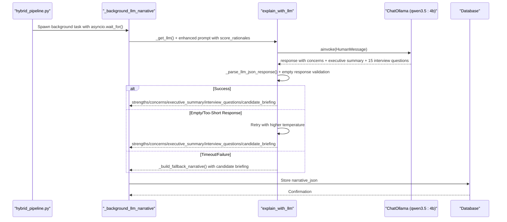

**Diagram sources**
- [hybrid_pipeline.py:1783-1861](file://app/backend/services/hybrid_pipeline.py#L1783-L1861)
- [hybrid_pipeline.py:1863-1950](file://app/backend/services/hybrid_pipeline.py#L1863-L1950)

**Section sources**
- [hybrid_pipeline.py:1783-1950](file://app/backend/services/hybrid_pipeline.py#L1783-L1950)

### Concurrency Control and Model Configuration
- Semaphore limits concurrent LLM calls to 2 per worker
- Model configuration: temperature=0.1, JSON format, constrained context and prediction sizes
- **Enhanced**: Model updated to qwen3.5:4b for improved performance and reliability
- **Enhanced**: Environment-driven timeouts with +30 second buffer for proper cancellation
- **Enhanced**: Comprehensive empty response validation prevents processing of blank LLM outputs
- **Enhanced**: Retry mechanism with higher temperature for edge cases where LLM returns empty or too-short responses
- **Enhanced**: Cloud model optimization with 2048 tokens and 8192 context window
- **Enhanced**: Local model optimization with 512 tokens and 2048 context window
- **Enhanced**: Logging for num_predict values to track cloud vs local model usage
- **Enhanced**: Token budget management with 6000/8000 tokens for local/cloud deployments
- **Enhanced**: Streaming: Heartbeat pings keep connections alive during LLM processing
- **Enhanced**: Background Tasks: Proper task lifecycle management with graceful shutdown and asyncio.wait_for() protection

**Section sources**
- [hybrid_pipeline.py:24-66](file://app/backend/services/hybrid_pipeline.py#L24-L66)
- [hybrid_pipeline.py:1380-1407](file://app/backend/services/hybrid_pipeline.py#L1380-L1407)
- [hybrid_pipeline.py:1463-1551](file://app/backend/services/hybrid_pipeline.py#L1463-L1551)

### Routes Orchestration
- Parses resumes in thread pool to avoid blocking
- Caches JD parsing in DB for reuse across workers
- Deduplicates candidates across multiple criteria
- Persists results and logs structured analysis events
- **Enhanced**: Streaming endpoint with heartbeat pings for long-running operations
- **Enhanced**: Background task management with proper error handling
- **Enhanced**: Early DB persistence for client disconnection scenarios

**Section sources**
- [analyze.py:268-501](file://app/backend/routes/analyze.py#L268-L501)
- [analyze.py:504-646](file://app/backend/routes/analyze.py#L504-L646)
- [analyze.py:577-658](file://app/backend/routes/analyze.py#L577-L658)

## Enhanced Token Budget Management

### Optimized Token Allocation Strategy
The hybrid pipeline now implements enhanced token budget management with optimized allocation for different deployment scenarios:

#### Local Deployment Token Configuration
For local deployments (non-cloud base URLs):
- **num_predict**: 6000 tokens to accommodate expanded interview framework (15 questions) and candidate briefing
- **num_ctx**: 8192 context window for comprehensive processing of large outputs
- **API Authentication**: Automatic Authorization header with OLLAMA_API_KEY when available
- **Enhanced Logging**: Detailed logging of token usage and budget allocation

#### Cloud Deployment Token Configuration  
For cloud deployments (Ollama Cloud detected via base URL containing "ollama.com"):
- **num_predict**: 8000 tokens for very verbose output from large models (480B+)
- **num_ctx**: 16384 context window for complex reasoning and large outputs
- **API Authentication**: Automatic Authorization header with OLLAMA_API_KEY when available
- **Enhanced Logging**: Clear distinction between cloud and local token usage

#### Automatic Environment Detection
The system automatically detects cloud vs local environments:
```python
def _is_ollama_cloud(base_url: str) -> bool:
    """Check if the base URL points to Ollama Cloud (ollama.com)."""
    return "ollama.com" in base_url.lower()

def _get_llm():
    global _REASONING_LLM
    if _REASONING_LLM is None:
        try:
            _base_url = os.getenv("OLLAMA_BASE_URL", "http://localhost:11434")
            _llm_timeout = float(os.getenv("LLM_NARRATIVE_TIMEOUT", "150"))
            _is_cloud = _is_ollama_cloud(_base_url)
            
            # Cloud models need significantly more tokens for verbose output
            # Local: 6000 tokens for 15 structured interview questions with candidate briefing
            # Cloud: 8000 tokens for very large models (480B+) that generate extremely verbose output
            _num_predict = 8000 if _is_cloud else 6000

            # Build kwargs for ChatOllama with environment-specific settings
            _llm_kwargs = {
                "model": os.getenv("OLLAMA_MODEL") or "qwen3.5:4b",
                "base_url": _base_url,
                "temperature": 0.1,
                "num_predict": _num_predict,
                # Cloud models need larger context for complex reasoning
                # 16384 for cloud to handle very large outputs, 8192 for local (15 structured questions)
                "num_ctx": 16384 if _is_cloud else 8192,
                "request_timeout": _llm_timeout + 30,
            }
            
            # Add headers for Ollama Cloud authentication
            if _is_cloud:
                api_key = os.getenv("OLLAMA_API_KEY", "").strip()
                if api_key:
                    _llm_kwargs["headers"] = {"Authorization": f"Bearer {api_key}"}
                    log.info("Using Ollama Cloud with API key authentication (num_predict=%s, num_ctx=%s)", _num_predict, _llm_kwargs["num_ctx"])
                else:
                    log.warning("Ollama Cloud detected but OLLAMA_API_KEY is not set!")
            else:
                _llm_kwargs["keep_alive"] = -1
                
            _REASONING_LLM = ChatOllama(**_llm_kwargs)
        except Exception as e:
            log.warning("LLM init failed: %s", e)
    return _REASONING_LLM
```

#### Token Budget Benefits
- **Local Deployments**: 6000 tokens accommodate comprehensive interview framework with candidate briefing
- **Cloud Deployments**: 8000 tokens enable extensive verbose output from large models
- **Context Window**: 8192/16384 context enables complex reasoning for different deployment types
- **Model Persistence**: Local models stay hot in RAM for faster response times
- **API Authentication**: Cloud deployments benefit from secure API key authentication

**Section sources**
- [hybrid_pipeline.py:97-146](file://app/backend/services/hybrid_pipeline.py#L97-L146)
- [hybrid_pipeline.py:1340-1372](file://app/backend/services/hybrid_pipeline.py#L1340-L1372)

## Expanded Interview Question Framework

### Interview Questions Architecture
The hybrid pipeline now generates an expanded framework of 15 interview questions with detailed metadata structure:

#### Interview Question Categories
- **Technical Questions**: 5 scenario-based questions targeting missing skills and critical matched skills
- **Behavioral Questions**: 4 STAR-format questions assessing leadership and ownership
- **Culture Fit Questions**: 3 motivation and alignment questions
- **Experience Deep Dive Questions**: 3 questions probing specific past experiences
- **Candidate Briefing**: Comprehensive profile snapshot and evaluation guidance

#### Detailed Metadata Structure
Each interview question includes:
- **text**: Primary question text
- **what_to_listen_for**: 2-3 bullet points describing indicators of strong answers
- **follow_ups**: 1-2 conditional follow-up questions
- **category**: Technical/Behavioral/Culture/Experience
- **difficulty**: Calibrated based on domain and seniority
- **skill_alignment**: Specific skills being evaluated

#### INTERVIEW KIT RULES Implementation
Automated question generation based on:
1. **Missing Skills Analysis**: Create scenario-based questions for each missing skill
2. **Critical Skills Depth**: Probe expertise level for 1-2 critical matched skills
3. **Domain Architecture**: Include system design questions when architecture comments indicate gaps
4. **Seniority Calibration**: Adjust difficulty based on role requirements and candidate experience
5. **Candidate Profile**: Tailor questions to candidate's current role and domain expertise

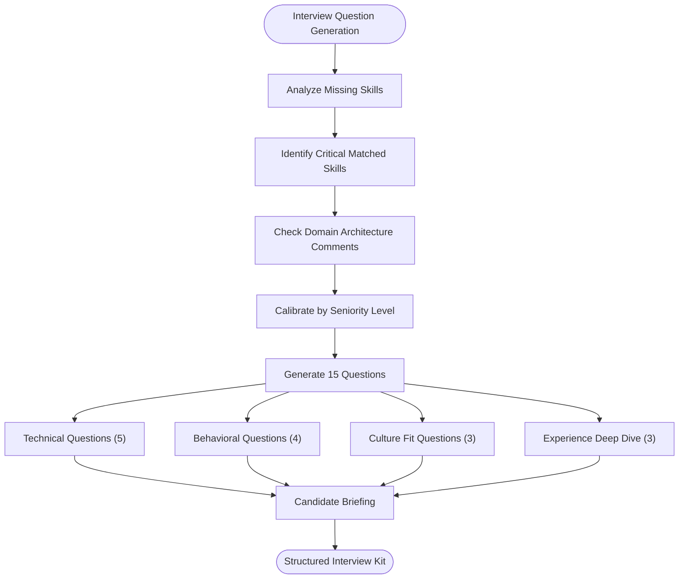

**Diagram sources**
- [hybrid_pipeline.py:782-800](file://app/backend/services/hybrid_pipeline.py#L782-L800)
- [agent_pipeline.py:727-733](file://app/backend/services/agent_pipeline.py#L727-L733)

**Section sources**
- [hybrid_pipeline.py:782-800](file://app/backend/services/hybrid_pipeline.py#L782-L800)
- [agent_pipeline.py:727-733](file://app/backend/services/agent_pipeline.py#L727-L733)

### Candidate Briefing System
The candidate briefing provides comprehensive evaluation guidance:

#### Profile Snapshot
- **Who they are**: Basic candidate identification
- **Current role**: Present position and company
- **Domain expertise**: Relevant technology stack
- **Experience level**: Years of professional experience

#### Evaluation Guidance
- **Strengths to confirm**: Top matched skills/experiences to validate
- **Areas to probe**: Specific gaps, risk signals, or concerns to investigate
- **Context notes**: Why specific questions target particular skills or experiences

#### Frontend Integration
The candidate briefing appears prominently in the Interview Kit section, providing interviewers with immediate context and evaluation focus areas.

**Section sources**
- [hybrid_pipeline.py:783-788](file://app/backend/services/hybrid_pipeline.py#L783-L788)
- [ResultCard.jsx:870-890](file://app/frontend/src/components/ResultCard.jsx#L870-L890)

## Candidate Briefing System

### Comprehensive Candidate Profile Snapshot
The candidate briefing system provides interviewers with immediate, actionable insights:

#### Profile Snapshot Components
- **Basic Identification**: Candidate name, current role, and company
- **Domain Expertise**: Primary technologies and domain focus areas
- **Experience Level**: Total professional experience and role progression
- **Match Quality**: How well candidate aligns with role requirements

#### Evaluation Guidance Structure
- **Strengths to Confirm**: Top 3-5 matched skills/experiences to validate during interview
- **Areas to Probe**: 3-5 specific gaps, risks, or concerns to investigate
- **Contextual Notes**: Explanatory notes on why certain questions target specific areas

#### Interviewer Support Features
- **Quick Reference**: Brief snapshot for rapid review
- **Evaluation Focus**: Clear guidance on what to prioritize during interviews
- **Contextual Understanding**: Background on candidate's career trajectory and skill development

#### Frontend Display Integration
The candidate briefing appears as a prominent, expandable section in the Interview Kit, providing interviewers with immediate access to critical evaluation information without navigating through multiple screens.

**Section sources**
- [hybrid_pipeline.py:783-788](file://app/backend/services/hybrid_pipeline.py#L783-L788)
- [ResultCard.jsx:870-890](file://app/frontend/src/components/ResultCard.jsx#L870-L890)

## INTERVIEW KIT RULES Implementation

### Automated Question Generation Rules
The INTERVIEW KIT RULES system automatically generates targeted interview questions based on comprehensive candidate analysis:

#### Technical Question Generation (5 questions)
1. **For Each Missing Skill**: Create scenario-based question that ties the skill to specific job responsibilities
2. **For 1-2 Critical Matched Skills**: Create depth-probing question testing expertise level
3. **For Architecture Gaps**: Include system design question relevant to domain
4. **Difficulty Calibration**: Use domain and seniority to adjust question complexity

#### Behavioral Question Generation (4 questions)
- **STAR Format**: Leadership and ownership demonstration questions
- **Contextual Alignment**: Questions aligned with role requirements and domain
- **Experience-Based**: Questions probing specific career achievements

#### Culture Fit Questions (3 questions)
- **Motivation Assessment**: Understanding of role and organizational fit
- **Alignment Testing**: Values and working style compatibility
- **Long-term Fit**: Career goals and organizational commitment indicators

#### Experience Deep Dive Questions (3 questions)
- **Specific Past Experience**: Probing concrete details and measurable outcomes
- **Problem-Solving Approach**: Methodology and decision-making processes
- **Team Collaboration**: Evidence of leadership and teamwork skills

#### Metadata Enhancement
Each question includes:
- **what_to_listen_for**: Specific indicators of strong responses
- **follow_ups**: Conditional follow-up questions based on initial responses
- **skill_alignment**: Direct mapping to candidate skills and role requirements

**Section sources**
- [agent_pipeline.py:727-733](file://app/backend/services/agent_pipeline.py#L727-L733)
- [hybrid_pipeline.py:789-800](file://app/backend/services/hybrid_pipeline.py#L789-L800)

## Enhanced Normalization System

### Consistent Interview Question Formatting
The enhanced normalization system ensures consistent formatting and metadata across all interview questions:

#### Standardized Question Structure
- **Text Formatting**: Consistent question wording and structure
- **Metadata Standardization**: Uniform what_to_listen_for and follow_ups formats
- **Category Classification**: Automatic categorization of question types
- **Difficulty Scaling**: Consistent difficulty rating system

#### Frontend Normalization
The frontend includes backward compatibility for older question formats:
```javascript
// Normalize interview question to structured format (backward compat)
const normalizeQ = (q) => {
  if (typeof q === 'string') return { text: q, what_to_listen_for: [], follow_ups: [] };
  if (q && typeof q === 'object') return {
    text: q.text || String(q),
    what_to_listen_for: q.what_to_listen_for || [],
    follow_ups: q.follow_ups || [],
  };
  return { text: String(q), what_to_listen_for: [], follow_ups: [] };
};
```

#### Quality Assurance
- **Validation**: Ensures all questions have required metadata fields
- **Consistency**: Maintains uniform structure across different question types
- **Compatibility**: Supports both new structured format and legacy string format
- **Extensibility**: Allows for future metadata additions without breaking changes

**Section sources**
- [hybrid_pipeline.py:789-800](file://app/backend/services/hybrid_pipeline.py#L789-L800)
- [ResultCard.jsx:282-290](file://app/frontend/src/components/ResultCard.jsx#L282-L290)

## Improved Fallback Narrative System

### Enhanced Fallback Capabilities
The improved fallback system now includes comprehensive candidate briefing and expanded interview framework:

#### Fallback Narrative Structure
- **Fit Summary**: Executive summary for hiring manager
- **Strengths**: Candidate strengths aligned with role requirements
- **Concerns**: Specific concerns backed by analysis
- **Recommendation Rationale**: Clear explanation of recommendation
- **Explainability**: Score rationales and risk analysis
- **Interview Kit**: 15 structured questions with candidate briefing

#### Candidate Briefing in Fallback
The fallback system now includes comprehensive candidate briefing:
- **Profile Snapshot**: Basic candidate identification and domain expertise
- **Evaluation Guidance**: Strengths to confirm and areas to probe
- **Contextual Notes**: Explanation of question targeting rationale

#### Backward Compatibility
- **Weaknesses Alias**: Maintains compatibility with existing frontend expectations
- **Structured Format**: Provides comprehensive fallback data structure
- **Integration Ready**: Seamless integration with existing frontend components

#### Enhanced Error Handling
- **Robust Processing**: Handles various failure scenarios gracefully
- **Quality Assurance**: Ensures meaningful fallback content regardless of LLM status
- **User Experience**: Maintains consistent user experience even when LLM processing fails

**Section sources**
- [hybrid_pipeline.py:1280-1296](file://app/backend/services/hybrid_pipeline.py#L1280-L1296)
- [hybrid_pipeline.py:1299-1306](file://app/backend/services/hybrid_pipeline.py#L1299-L1306)

## Enhanced Cloud Model Processing

### Cloud Deployment Optimization
The hybrid pipeline now provides enhanced cloud model processing capabilities with optimized token limits and context windows:

#### Cloud Model Configuration
For cloud deployments (Ollama Cloud detected via base URL containing "ollama.com"):
- **num_predict**: 8000 tokens for large models (480B+) that generate very verbose output
- **num_ctx**: 16384 context window for complex reasoning and large outputs
- **API Authentication**: Automatic Authorization header with OLLAMA_API_KEY when available
- **Enhanced Logging**: Detailed logging of cloud model usage with num_predict values

#### Local Model Configuration  
For local deployments (non-cloud base URLs):
- **num_predict**: 6000 tokens sufficient for expanded interview framework (15 questions) with candidate briefing
- **num_ctx**: 8192 context window for local model optimization
- **Model Persistence**: keep_alive=-1 to keep model hot in RAM
- **Enhanced Logging**: Clear distinction between cloud and local model usage

#### Automatic Environment Detection
The system automatically detects cloud vs local environments:
```python
def _is_ollama_cloud(base_url: str) -> bool:
    """Check if the base URL points to Ollama Cloud (ollama.com)."""
    return "ollama.com" in base_url.lower()

def _get_llm():
    global _REASONING_LLM
    if _REASONING_LLM is None:
        try:
            _base_url = os.getenv("OLLAMA_BASE_URL", "http://localhost:11434")
            _llm_timeout = float(os.getenv("LLM_NARRATIVE_TIMEOUT", "150"))
            _is_cloud = _is_ollama_cloud(_base_url)
            
            # Cloud models need significantly more tokens for verbose output
            # Local: 6000 tokens for 15 structured interview questions with candidate briefing
            # Cloud: 8000 tokens for very large models (480B+) that generate extremely verbose output
            _num_predict = 8000 if _is_cloud else 6000

            # Build kwargs for ChatOllama with environment-specific settings
            _llm_kwargs = {
                "model": os.getenv("OLLAMA_MODEL") or "qwen3.5:4b",
                "base_url": _base_url,
                "temperature": 0.1,
                "num_predict": _num_predict,
                # Cloud models need larger context for complex reasoning
                # 16384 for cloud to handle very large outputs, 8192 for local (15 structured questions)
                "num_ctx": 16384 if _is_cloud else 8192,
                "request_timeout": _llm_timeout + 30,
            }
            
            # Add headers for Ollama Cloud authentication
            if _is_cloud:
                api_key = os.getenv("OLLAMA_API_KEY", "").strip()
                if api_key:
                    _llm_kwargs["headers"] = {"Authorization": f"Bearer {api_key}"}
                    log.info("Using Ollama Cloud with API key authentication (num_predict=%s, num_ctx=%s)", _num_predict, _llm_kwargs["num_ctx"])
                else:
                    log.warning("Ollama Cloud detected but OLLAMA_API_KEY is not set!")
            else:
                _llm_kwargs["keep_alive"] = -1
                
            _REASONING_LLM = ChatOllama(**_llm_kwargs)
        except Exception as e:
            log.warning("LLM init failed: %s", e)
    return _REASONING_LLM
```

#### Enhanced Fallback Mechanisms
The fallback system now includes proper context window handling for both cloud and local deployments:
```python
# Retry LLM without JSON format constraint for empty responses
retry_kwargs = {
    "model": os.getenv("OLLAMA_MODEL") or "qwen3.5:4b",
    "base_url": _base_url,
    "temperature": 0.3,
    "num_predict": _num_predict_retry,  # Uses environment-specific num_predict
    "num_ctx": 16384 if _is_cloud_retry else 8192,  # Uses environment-specific context
    "request_timeout": _llm_timeout + 30,
}
```

#### Performance Benefits
- **Cloud Models**: 8000 tokens allow for comprehensive verbose output from large models (480B+)
- **Local Models**: 6000 tokens optimize for expanded interview framework with candidate briefing
- **Context Window**: 16384 context enables complex reasoning for cloud deployments
- **Model Persistence**: Local models stay hot in RAM for faster response times
- **API Authentication**: Cloud deployments benefit from secure API key authentication

**Section sources**
- [hybrid_pipeline.py:97-146](file://app/backend/services/hybrid_pipeline.py#L97-L146)
- [hybrid_pipeline.py:1340-1372](file://app/backend/services/hybrid_pipeline.py#L1340-L1372)

## Enhanced Timeout Management

### LLM_NARRATIVE_TIMEOUT Environment Variable
The hybrid pipeline implements configurable timeout management through the LLM_NARRATIVE_TIMEOUT environment variable with enhanced protection mechanisms:

#### Core Timeout Configuration
The system uses LLM_NARRATIVE_TIMEOUT as the base timeout value with a +30 second buffer for proper cancellation handling:

```python
# Base timeout from environment variable
_llm_timeout = float(os.getenv("LLM_NARRATIVE_TIMEOUT", "150"))

# HTTP timeout with +30 second buffer to ensure proper cancellation
request_timeout=_llm_timeout + 30
```

#### Enhanced Implementation Details
- **Default Value**: 150 seconds (2.5 minutes) if LLM_NARRATIVE_TIMEOUT is not set
- **Buffer Strategy**: +30 seconds added to HTTP timeout to allow asyncio.wait_for to cancel properly
- **Consistent Usage**: Both synchronous and asynchronous LLM calls respect this configuration
- **Fallback Handling**: Graceful degradation when timeout occurs
- **CPU-intensive Protection**: asyncio.wait_for() prevents blocking of main threads during long inference tasks

#### Streaming Endpoint Timeout Management
The streaming endpoint uses a separate timeout configuration for heartbeat pings:

```python
_LLMTIMEOUT_STREAM = float(os.getenv("LLM_NARRATIVE_TIMEOUT", "150"))

async def _llm_task():
    try:
        async with _get_semaphore():
            result = await asyncio.wait_for(explain_with_llm(llm_context), timeout=_LLMTIMEOUT_STREAM)
        # Success handling
    except asyncio.TimeoutError:
        # Timeout handling with fallback narrative
        python_result["narrative_pending"] = True
```

#### Background Task Timeout Management
Background LLM tasks use the same timeout configuration:

```python
_bg_timeout = float(os.getenv("LLM_NARRATIVE_TIMEOUT", "150"))
async with _get_semaphore():
    start = time.monotonic()
    llm_result = await asyncio.wait_for(explain_with_llm(llm_context), timeout=_bg_timeout)
```

#### Heartbeat Ping Mechanism
During LLM processing, the system sends periodic heartbeat pings to keep connections alive:

```python
while True:
    try:
        status, llm_result = await asyncio.wait_for(llm_queue.get(), timeout=5.0)
        break
    except asyncio.TimeoutError:
        yield ": ping\n\n"  # SSE comment — keeps connection alive during LLM wait
```

#### Enhanced Empty Response Validation
The explain_with_llm function now includes comprehensive empty response validation:

```python
# Handle empty, whitespace-only, or ultra-short response - retry with higher temperature as fallback
# Ultra-short responses (e.g. "{" from Ollama Cloud) are not valid JSON narratives
# A valid narrative JSON is always 100+ chars; threshold of 20 catches degenerate outputs
if not raw or len(str(raw).strip()) < 20:
    if raw and len(str(raw).strip()) < 20:
        log.warning(f"LLM response too short ({len(str(raw).strip())} chars), treating as empty for retry")
    else:
        log.warning("LLM returned empty response, retrying with higher temperature as fallback...")
    # ... retry logic with higher temperature ...
```

#### Timeout Configuration Options
- **Minimum Recommended**: 120 seconds for typical LLM responses
- **Typical Range**: 120–300 seconds depending on model size and complexity
- **Connection Limits**: +30 second buffer accommodates proxy/CDN timeouts
- **CPU-based Models**: Extended timeouts accommodate models like Qwen 3.5 4B that can take 8+ minutes

#### Troubleshooting Timeout Issues
Common timeout scenarios and solutions:

1. **Model Loading Delays**: Increase LLM_NARRATIVE_TIMEOUT if model is still loading
2. **Large Context Processing**: Adjust timeout based on resume/job description length
3. **Network Latency**: Consider proxy/CDN timeout configurations
4. **Resource Constraints**: Monitor system resources during LLM processing
5. **Empty Responses**: Check LLM output validation and retry mechanisms

**Section sources**
- [hybrid_pipeline.py:82-109](file://app/backend/services/hybrid_pipeline.py#L82-L109)
- [hybrid_pipeline.py:1502-1507](file://app/backend/services/hybrid_pipeline.py#L1502-L1507)
- [hybrid_pipeline.py:1534-1545](file://app/backend/services/hybrid_pipeline.py#L1534-L1545)
- [hybrid_pipeline.py:1210-1345](file://app/backend/services/hybrid_pipeline.py#L1210-L1345)
- [llm_service.py:43-58](file://app/backend/services/llm_service.py#L43-L58)

## Extended Frontend Polling Architecture

### Enhanced Polling Mechanism
The frontend polling mechanism has been extended to accommodate CPU-based LLM inference scenarios:

- **Extended Timeout**: Polling continues for 10 minutes (60 attempts) instead of 5 minutes
- **10-second Intervals**: Polling occurs every 10 seconds to reduce server load
- **Silent Error Handling**: Polling errors are handled silently to prevent UX disruption
- **CPU-based Model Support**: Accommodates models like Qwen 3.5 4B that can take 8+ minutes to process
- **Interview Kit Integration**: Seamless integration with expanded interview framework

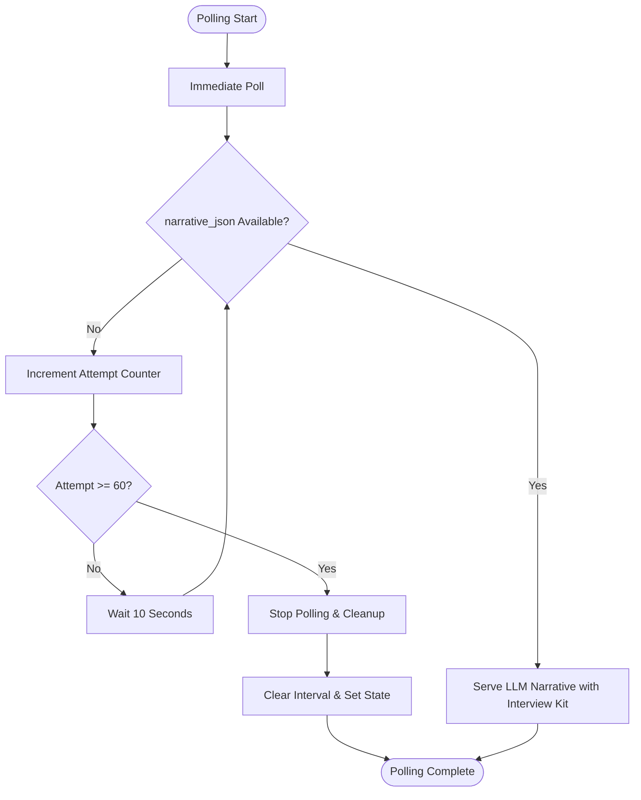

**Diagram sources**
- [ResultCard.jsx:304-343](file://app/frontend/src/components/ResultCard.jsx#L304-L343)

### Polling Implementation Details
The frontend polling implementation includes several enhancements:

- **Automatic Polling**: Starts polling automatically when narrative is pending
- **Intelligent Retry**: Stops polling after 60 attempts (10 minutes) to prevent resource waste
- **Error Resilience**: Silent failures during polling to avoid disrupting user experience
- **CPU-based Model Support**: Extended timeout accommodates slower CPU-based inference
- **Interview Kit Display**: Real-time updates for expanded interview framework
- **Candidate Briefing Integration**: Seamless display of candidate briefing information

### Polling State Management
The polling state is managed with comprehensive error handling:

```javascript
// Stop polling after 60 attempts (10 minutes at 10s intervals)
// Extended for CPU-based LLMs (qwen3.5:4b can take 8+ minutes)
if (next >= 60) {
  setIsPolling(false)
  if (pollingIntervalRef.current) {
    clearInterval(pollingIntervalRef.current)
    pollingIntervalRef.current = null
  }
}
```

### Frontend Integration
The extended polling architecture integrates seamlessly with the existing frontend components:

- **ResultCard.jsx**: Enhanced with extended polling capabilities and Interview Kit display
- **api.js**: Maintains existing polling API endpoints
- **State Management**: Proper cleanup of intervals and polling state
- **User Experience**: Transparent handling of extended processing times
- **Interview Kit**: Real-time updates for expanded question framework

**Section sources**
- [ResultCard.jsx:304-343](file://app/frontend/src/components/ResultCard.jsx#L304-L343)
- [api.js:413-416](file://app/frontend/src/lib/api.js#L413-L416)

## Background Worker Pattern

### Task Management System
The hybrid pipeline implements a comprehensive background task management system with enhanced timeout protection:

- **Task Registration**: Background tasks are registered globally for lifecycle management
- **Graceful Shutdown**: Tasks are cancelled and awaited during application shutdown
- **Error Isolation**: Background tasks run in isolated sessions to prevent DB conflicts
- **Resource Cleanup**: Proper cleanup of database connections and other resources
- **Asyncio Protection**: All background tasks use asyncio.wait_for() for proper timeout handling
- **Enhanced Token Management**: Proper token budget handling for both cloud and local deployments

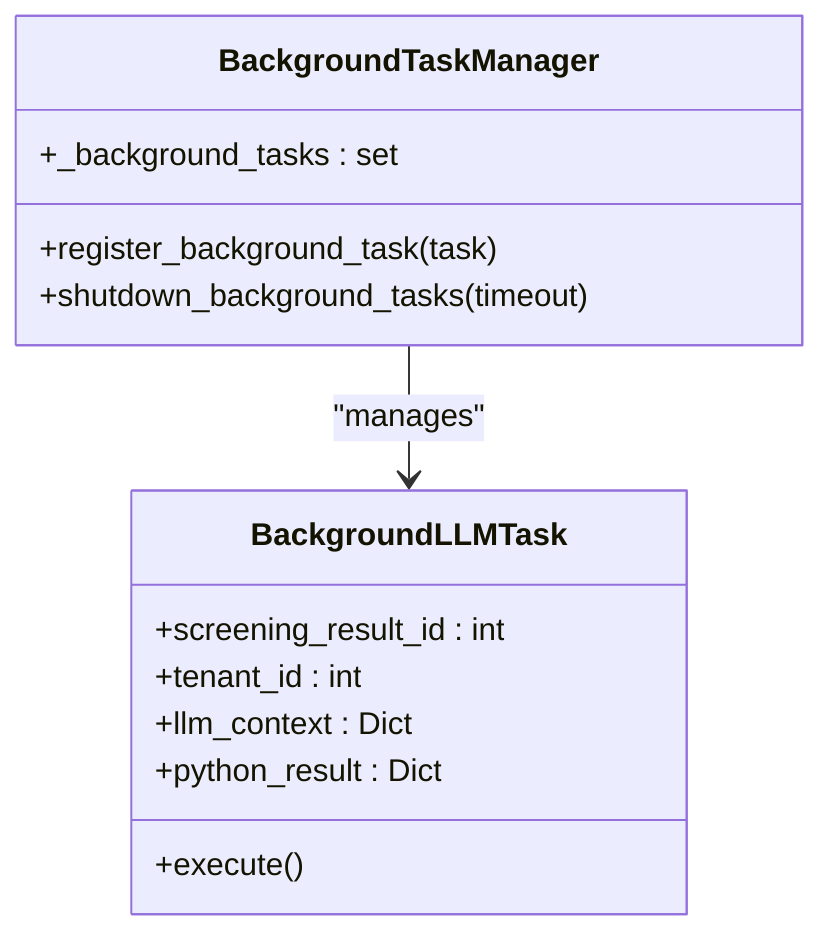

**Diagram sources**
- [hybrid_pipeline.py:32-48](file://app/backend/services/hybrid_pipeline.py#L32-L48)
- [hybrid_pipeline.py:1783-1861](file://app/backend/services/hybrid_pipeline.py#L1783-L1861)

### Application Lifecycle Integration
Background tasks are integrated with the application lifecycle:

- **Startup**: Tasks are registered and managed throughout application runtime
- **Shutdown**: Graceful cancellation and completion of all background tasks
- **Monitoring**: Integration with Prometheus metrics for task tracking
- **Logging**: Comprehensive logging for task execution and errors
- **Timeout Protection**: All tasks use asyncio.wait_for() with LLM_NARRATIVE_TIMEOUT
- **Token Budget Tracking**: Proper handling of token allocation for different deployment types

**Section sources**
- [hybrid_pipeline.py:32-48](file://app/backend/services/hybrid_pipeline.py#L32-L48)
- [main.py:238-282](file://app/backend/main.py#L238-L282)

## Enhanced Explainability Features

### Score Rationales System
The hybrid pipeline now generates comprehensive rationales for each score dimension:

- **Skill Rationale**: Matches and missing skills with percentage scores
- **Experience Rationale**: Experience vs requirement with qualification assessment
- **Education Rationale**: Degree relevance and field alignment
- **Timeline Rationale**: Employment gaps and short stints analysis
- **Domain Rationale**: Current role and architecture alignment
- **Overall Rationale**: Synthesis of all factors into final assessment

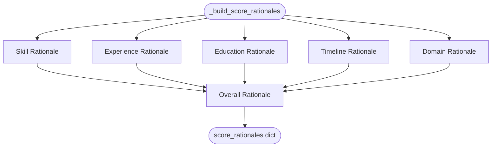

**Diagram sources**
- [hybrid_pipeline.py:1411-1525](file://app/backend/services/hybrid_pipeline.py#L1411-L1525)

**Section sources**
- [hybrid_pipeline.py:1411-1525](file://app/backend/services/hybrid_pipeline.py#L1411-L1525)

### Risk Summary & Seniority Analysis
- **Risk Flags**: Converted risk signals into user-friendly format with severity levels
- **Seniority Alignment**: Actual vs required experience with detailed assessment
- **Career Trajectory**: Upward progression analysis and early career identification
- **Stability Assessment**: Gap and stint analysis with stability classification

**Section sources**
- [hybrid_pipeline.py:1528-1600](file://app/backend/services/hybrid_pipeline.py#L1528-L1600)

### Skill Depth Analysis
Counts occurrences of matched skills in resume text to provide depth insights:

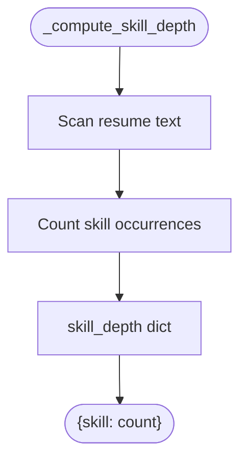

**Diagram sources**
- [hybrid_pipeline.py:1603-1619](file://app/backend/services/hybrid_pipeline.py#L1603-L1619)

**Section sources**
- [hybrid_pipeline.py:1603-1619](file://app/backend/services/hybrid_pipeline.py#L1603-L1619)

### Enhanced Frontend Display
The frontend components now display the enhanced explainability features:

- **Concerns Section**: Dedicated section for candidate concerns alongside strengths
- **Risk Flags Display**: Color-coded risk flags with severity indicators
- **Seniority Alignment**: Clear indication of experience vs role requirements
- **Explainability Sections**: Detailed breakdown of score rationales
- **Executive Summaries**: Concise executive summaries for quick decision-making
- **Interview Kit Integration**: Real-time updates for expanded interview framework with 15 questions
- **Candidate Briefing**: Comprehensive candidate profile snapshots and evaluation guidance
- **Polling Integration**: Real-time updates for LLM-generated narratives with extended timeout

**Section sources**
- [ResultCard.jsx:475-572](file://app/frontend/src/components/ResultCard.jsx#L475-L572)
- [ResultCard.jsx:373-384](file://app/frontend/src/components/ResultCard.jsx#L373-L384)
- [ResultCard.jsx:443-473](file://app/frontend/src/components/ResultCard.jsx#L443-L473)

## Security and Input Sanitization

### Prompt Injection Prevention
The hybrid pipeline implements comprehensive input sanitization to prevent prompt injection attacks:

#### Pattern-Based Filtering
The system uses a sophisticated pattern-matching approach to detect and neutralize known prompt injection attempts:

```python
_INJECTION_PATTERNS = [
    re.compile(r"ignore\s+(all\s+)?previous\s+instructions", re.IGNORECASE),
    re.compile(r"ignore\s+(all\s+)?above\s+instructions", re.IGNORECASE),
    re.compile(r"disregard\s+(all\s+)?previous", re.IGNORECASE),
    re.compile(r"you\s+are\s+now\s+a", re.IGNORECASE),
    re.compile(r"new\s+instructions?\s*:", re.IGNORECASE),
    re.compile(r"system\s*:", re.IGNORECASE),
    re.compile(r"assistant\s*:", re.IGNORECASE),
    re.compile(r"<\s*system\s*>", re.IGNORECASE),
    re.compile(r"\[INST\]", re.IGNORECASE),
    re.compile(r"\[/INST\]", re.IGNORECASE),
]
```

#### Input Length Restrictions
Comprehensive input length controls prevent abuse and ensure LLM safety:

- **Resume Text**: Maximum 50,000 characters (~50KB)
- **Job Description**: Maximum 20,000 characters (~20KB)
- **Individual Fields**: Additional constraints for specific fields:
  - Role Title: 200 characters maximum
  - Candidate Name: 100 characters maximum
  - Current Role/Company: 100 characters maximum
  - Career Snippet: 400 characters maximum

#### Sanitization Process
The `_sanitize_input` function applies multiple layers of protection:

```python
def _sanitize_input(text: str, max_length: int, label: str = "content") -> str:
    """Sanitize user-provided text to prevent prompt injection."""
    if not text:
        return text
    # Truncate excessively long inputs
    if len(text) > max_length:
        text = text[:max_length]
    # Strip known injection patterns
    for pattern in _INJECTION_PATTERNS:
        text = pattern.sub("[FILTERED]", text)
    return text
```

#### Integration Points
Input sanitization occurs at multiple critical points:

1. **Initial Processing**: `_wrap_user_content` sanitizes resume and job description before Python phase
2. **LLM Prompt Construction**: Individual fields sanitized before inclusion in LLM prompts
3. **Context Preservation**: Sanitized content maintained for deterministic fallback generation

#### Attack Vector Mitigation
The sanitization system protects against common prompt injection techniques:

- **System Command Injection**: Patterns like "system:", "assistant:", "[INST]"
- **Instruction Override**: Attempts to bypass previous instructions
- **Role Manipulation**: Commands trying to change the AI's role
- **Context Injection**: HTML/XML-like system tags

#### Security Benefits
- **Zero Trust Architecture**: All user input treated as potentially malicious
- **Defense in Depth**: Multiple layers of protection (patterns + length limits)
- **Deterministic Behavior**: Predictable sanitization ensures consistent results
- **Performance Optimization**: Early filtering prevents unnecessary LLM processing

**Section sources**
- [hybrid_pipeline.py:24-59](file://app/backend/services/hybrid_pipeline.py#L24-L59)
- [hybrid_pipeline.py:42-52](file://app/backend/services/hybrid_pipeline.py#L42-L52)
- [hybrid_pipeline.py:55-59](file://app/backend/services/hybrid_pipeline.py#L55-L59)
- [hybrid_pipeline.py:1198-1203](file://app/backend/services/hybrid_pipeline.py#L1198-L1203)
- [hybrid_pipeline.py:1317-1318](file://app/backend/services/hybrid_pipeline.py#L1317-L1318)

## Enhanced Error Handling and Response Validation

### Comprehensive Response Validation
The hybrid pipeline now implements comprehensive validation for LLM responses to ensure robust error handling:

#### Empty Response Detection
The system detects and handles various forms of empty or invalid responses:

```python
# Handle empty, whitespace-only, or ultra-short response - retry with higher temperature as fallback
# Ultra-short responses (e.g. "{" from Ollama Cloud) are not valid JSON narratives
# A valid narrative JSON is always 100+ chars; threshold of 20 catches degenerate outputs
if not raw or len(str(raw).strip()) < 20:
    if raw and len(str(raw).strip()) < 20:
        log.warning(f"LLM response too short ({len(str(raw).strip())} chars), treating as empty for retry")
    else:
        log.warning("LLM returned empty response, retrying with higher temperature as fallback...")
```

#### Retry Mechanism for Edge Cases
When empty or ultra-short responses are detected, the system automatically retries with enhanced parameters:

```python
# Retry LLM without JSON format constraint for empty responses
retry_kwargs = {
    "model": os.getenv("OLLAMA_MODEL") or "qwen3.5:4b",
    "base_url": _base_url,
    "temperature": 0.3,  # Higher temperature for better response quality
    "num_predict": _num_predict_retry,
    "num_ctx": 16384 if _is_cloud_retry else 8192,
    "request_timeout": _llm_timeout + 30,
}
```

#### Validation Thresholds
The system uses specific thresholds to determine response validity:

- **Empty Response**: No content or only whitespace
- **Whitespace-Only Response**: Content consisting solely of spaces, tabs, or newlines
- **Ultra-Short Response**: Response length less than 20 characters
- **Valid JSON Response**: Response containing at least 100 characters of valid JSON

#### Enhanced Error Reporting
Comprehensive logging and error reporting for debugging and monitoring:

```python
if not raw or len(str(raw).strip()) < 20:
    log.warning("LLM returned empty or too-short response after retry")
    raise ValueError("LLM returned empty response")
```

#### Fallback Generation
When all validation attempts fail, the system generates a deterministic fallback narrative:

```python
def _build_fallback_narrative(python_result: Dict[str, Any], skill_analysis: Dict[str, Any]) -> Dict[str, Any]:
    """Deterministic narrative when LLM is unavailable or timed out."""
    # ... fallback logic with expanded candidate briefing ...
    return {
        "ai_enhanced": False,
        "fit_summary": fit_summary,
        "strengths": strengths,
        "concerns": concerns,
        "weaknesses": concerns,
        "recommendation_rationale": "Automated narrative unavailable — manual review recommended.",
        "explainability": explainability,
        "interview_questions": {
            "candidate_briefing": candidate_briefing,
            "technical_questions": tech_q,
            "behavioral_questions": behavioral_q,
            "culture_fit_questions": culture_q,
            "experience_deep_dive_questions": experience_deep_dive_q,
        },
    }
```

#### Benefits of Enhanced Error Handling
- **Robustness**: System continues to operate even when LLM responses are invalid
- **Reliability**: Deterministic fallback ensures users always receive meaningful results
- **Debugging**: Comprehensive logging helps identify and resolve LLM issues
- **User Experience**: Graceful degradation prevents system failures from impacting users
- **Data Integrity**: Prevents processing of malformed or incomplete responses

**Section sources**
- [hybrid_pipeline.py:1410-1418](file://app/backend/services/hybrid_pipeline.py#L1410-L1418)
- [hybrid_pipeline.py:1492-1494](file://app/backend/services/hybrid_pipeline.py#L1492-L1494)
- [hybrid_pipeline.py:1528-1609](file://app/backend/services/hybrid_pipeline.py#L1528-L1609)

## Dependency Analysis
The hybrid pipeline integrates several services and models with enhanced background processing, token budget management, and expanded interview framework:

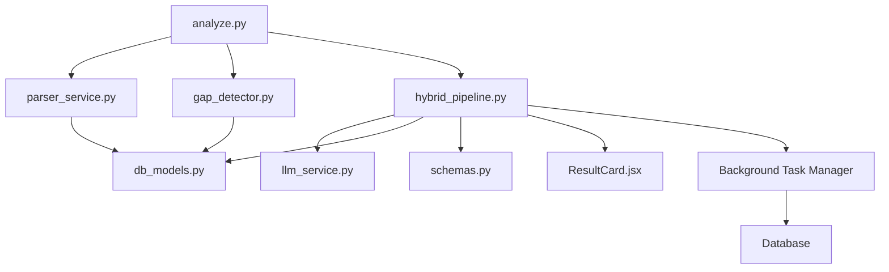

**Diagram sources**
- [analyze.py:32-38](file://app/backend/routes/analyze.py#L32-L38)
- [parser_service.py:1-552](file://app/backend/services/parser_service.py#L1-L552)
- [gap_detector.py:1-219](file://app/backend/services/gap_detector.py#L1-L219)
- [hybrid_pipeline.py:1-2094](file://app/backend/services/hybrid_pipeline.py#L1-L2094)
- [db_models.py:1-264](file://app/backend/models/db_models.py#L1-L264)
- [schemas.py:1-379](file://app/backend/models/schemas.py#L1-L379)
- [ResultCard.jsx:1-772](file://app/frontend/src/components/ResultCard.jsx#L1-L772)

**Section sources**
- [analyze.py:32-38](file://app/backend/routes/analyze.py#L32-L38)
- [parser_service.py:1-552](file://app/backend/services/parser_service.py#L1-L552)
- [gap_detector.py:1-219](file://app/backend/services/gap_detector.py#L1-L219)
- [hybrid_pipeline.py:1-2094](file://app/backend/services/hybrid_pipeline.py#L1-L2094)
- [db_models.py:1-264](file://app/backend/models/db_models.py#L1-L264)
- [schemas.py:1-379](file://app/backend/models/schemas.py#L1-L379)
- [ResultCard.jsx:1-772](file://app/frontend/src/components/ResultCard.jsx#L1-L772)

## Performance Considerations
- Python-first processing: all deterministic components run in 1–2 seconds
- LLM optimization: constrained context and prediction sizes reduce KV cache usage and latency
- Concurrency control: semaphore limits concurrent LLM calls to prevent resource exhaustion
- Caching: JD parsing cached in DB; parser snapshot stored for candidate re-analysis
- Memory management: flashtext processor built once per registry instance; in-memory caches for skills and JD
- **Enhanced**: Timeout-aware streaming with heartbeat pings improves perceived performance
- Error handling: fallback narratives ensure no partial results and maintain system resilience
- **Security Performance**: Input sanitization adds minimal overhead while providing critical security benefits
- **Resource Optimization**: +30 second buffer prevents premature HTTP timeouts while allowing proper cancellation
- **Model Performance**: qwen3.5:4b provides improved performance characteristics over previous models
- **Explainability Efficiency**: Score rationales and risk analysis computed once, reducing LLM prompt complexity
- **Background Processing**: Asynchronous LLM generation prevents blocking of main request threads
- **Database Efficiency**: Persistent storage eliminates repeated LLM processing for the same analysis
- **Frontend Responsiveness**: Extended polling architecture (10 minutes) provides real-time updates without blocking user interactions
- **Timeout Protection**: asyncio.wait_for() prevents blocking during long inference tasks
- **Enhanced Error Handling**: Comprehensive validation prevents processing of blank LLM outputs, improving system reliability
- **Cloud Optimization**: 8000 tokens and 16384 context window enable comprehensive cloud model processing
- **Local Optimization**: 6000 tokens and 8192 context window ensure optimal local model performance
- **Enhanced Logging**: num_predict values logged for better monitoring and debugging
- **Environment Detection**: Automatic cloud vs local model switching reduces configuration complexity
- **Retry Mechanism**: Intelligent retry system with higher temperature for edge cases improves success rates
- **Token Budget Management**: Optimized allocation (6000/8000 tokens) ensures efficient resource utilization
- **Expanded Interview Framework**: 15 questions with detailed metadata increase processing time but improve evaluation quality
- **Candidate Briefing**: Comprehensive briefing system provides immediate value to interviewers

## Troubleshooting Guide
Common issues and resolutions:
- LLM timeout/failure: The pipeline returns a deterministic fallback narrative with candidate briefing and sets a flag indicating narrative pending
- Scanned PDFs: Parser raises a graceful error; route returns fallback result with pipeline errors
- JD too short: Validation rejects inputs under 80 words
- Skills not recognized: Registry falls back to master list; ensure skills are seeded and loaded
- JSON parsing failures: LLM response parser tolerates various formats and extracts the first balanced JSON object
- **Timeout Issues**: Increase LLM_NARRATIVE_TIMEOUT if model is still loading or processing large contexts
- **Connection Timeouts**: Verify proxy/CDN timeout settings are compatible with +30 second buffer
- **Input sanitization issues**: If content is unexpectedly filtered, check for injection patterns or excessive length
- **Security violations**: The system automatically filters suspicious content; verify input doesn't trigger pattern matches
- **Explainability Issues**: Ensure score_rationales, risk_summary, and skill_depth are properly populated in Python phase
- **Model Configuration**: Verify OLLAMA_MODEL environment variable is set to qwen3.5:4b
- **Background Task Issues**: Check task registration and lifecycle management if background processing fails
- **Database Connectivity**: Verify database connection for persistent storage of LLM narratives
- **Extended Polling Issues**: Frontend handles polling errors silently; check network connectivity and API endpoints
- **Enhanced Error Handling**: Check LLM response validation logs for empty or ultra-short responses
- **Retry Mechanism**: Verify retry logic is functioning correctly for edge cases
- **Memory Leaks**: Background tasks are properly cleaned up during application shutdown
- **Timeout Protection**: Ensure asyncio.wait_for() is properly configured with LLM_NARRATIVE_TIMEOUT
- **Cloud Model Issues**: Verify OLLAMA_API_KEY is set for cloud deployments; check num_predict logging
- **Local Model Issues**: Ensure keep_alive=-1 for optimal local model performance; verify 6000 token limit
- **Context Window Problems**: Check num_ctx values are appropriate for cloud (16384) vs local (8192) deployments
- **Environment Detection**: Verify OLLAMA_BASE_URL contains "ollama.com" for cloud detection
- **Token Budget Issues**: Check num_predict values are appropriate for local (6000) vs cloud (8000) deployments
- **Interview Framework Problems**: Verify expanded interview questions are properly formatted and categorized
- **Candidate Briefing Issues**: Ensure candidate briefing data is properly structured and displayed in frontend

**Section sources**
- [hybrid_pipeline.py:1384-1407](file://app/backend/services/hybrid_pipeline.py#L1384-L1407)
- [analyze.py:276-290](file://app/backend/routes/analyze.py#L276-L290)
- [analyze.py:255-265](file://app/backend/routes/analyze.py#L255-L265)
- [hybrid_pipeline.py:1078-1141](file://app/backend/services/hybrid_pipeline.py#L1078-L1141)
- [hybrid_pipeline.py:1510-1518](file://app/backend/services/hybrid_pipeline.py#L1510-L1518)
- [hybrid_pipeline.py:1783-1861](file://app/backend/services/hybrid_pipeline.py#L1783-L1861)
- [hybrid_pipeline.py:1210-1345](file://app/backend/services/hybrid_pipeline.py#L1210-L1345)

## Conclusion
The hybrid pipeline achieves optimal performance by leveraging Python-first determinism for parsing, matching, and scoring, followed by asynchronous LLM processing with persistent storage and real-time polling. Robust fallbacks, concurrency control, and caching ensure reliability and scalability. The skills registry with fuzzy matching and domain mapping provides comprehensive coverage across 180+ technologies, enabling precise and efficient candidate evaluation.

**Enhanced Model Configuration**: The migration to qwen3.5:4b provides improved performance characteristics, reduced cold-start times, and better reliability for production deployments. This model choice enhances the overall system throughput and user experience.

**Advanced Explainability**: The implementation of comprehensive score rationales, risk analysis, seniority alignment indicators, and skill depth counts provides recruiters with detailed insights into candidate assessments. This explainability layer transforms automated scoring into transparent, actionable recommendations.

**Enhanced Timeout Management**: The implementation of configurable LLM_NARRATIVE_TIMEOUT with +30 second buffer provides flexible timeout control while ensuring proper cancellation handling. This enhancement improves system reliability for long-running LLM operations and streaming endpoints, with asyncio.wait_for() protection preventing blocking of main threads.

**Critical Security Enhancement**: The implementation of comprehensive input sanitization with pattern-based filtering and input length restrictions provides robust protection against prompt injection attacks while maintaining system performance. This security layer operates transparently, adding minimal overhead while significantly improving the system's resilience to malicious input attempts.

**Background Processing Innovation**: The implementation of background worker pattern with automatic persistence eliminates blocking of main request threads, significantly improving system responsiveness and resource utilization. This architectural improvement enables scalable handling of concurrent analysis requests with proper timeout protection.

**Extended Polling Architecture**: The extension of frontend polling from 5 minutes to 10 minutes (60 attempts at 10-second intervals) accommodates CPU-based LLM inference scenarios where models like Qwen 3.5 4B can take 8+ minutes to process. This real-time architecture enhances user experience while preventing premature termination of long-running inference tasks.

**Database Integration**: The addition of narrative_json column support enables persistent storage of LLM-generated narratives, eliminating redundant processing and enabling efficient retrieval of analysis results across different frontend components.

**Frontend Enhancement**: The updated frontend components provide comprehensive display of enhanced explainability features, including concerns, risk flags, seniority alignment, and detailed score rationales, enabling recruiters to make informed decisions quickly and efficiently. The extended polling integration ensures real-time updates without disrupting user interactions.

**Task Lifecycle Management**: The comprehensive background task management system ensures proper resource utilization, graceful shutdown handling, and error isolation, contributing to overall system reliability and maintainability. All tasks use asyncio.wait_for() for proper timeout handling, preventing system blocking during long inference operations.

**Enhanced Error Handling**: The implementation of comprehensive validation for empty responses, whitespace-only responses, and ultra-short responses (< 20 characters) with intelligent retry mechanisms provides robust error handling and improves system reliability. The retry mechanism with higher temperature for edge cases significantly improves the success rate of LLM responses.

**Enhanced Cloud Processing**: The implementation of optimized token limits and context windows for cloud deployments (8000 tokens, 16384 context) enables comprehensive processing of large models while maintaining performance. Local deployments continue with optimized settings (6000 tokens, 8192 context) for efficient operation.

**Environment Detection**: The automatic cloud vs local model detection simplifies deployment configuration and ensures optimal performance across different environments without manual intervention.

**Enhanced Logging**: The addition of num_predict value logging provides better monitoring and debugging capabilities, enabling administrators to track model usage patterns and optimize performance across cloud and local deployments.

**Fallback Mechanisms**: The enhanced fallback system with proper context window handling ensures reliable operation across both cloud and local environments, with appropriate token limits and context windows for each deployment type.

**Retry System**: The intelligent retry mechanism with higher temperature for edge cases provides improved success rates and better user experience when dealing with challenging LLM responses.

**Enhanced Token Budget Management**: The implementation of optimized token allocation (6000/8000 tokens) ensures efficient resource utilization across different deployment scenarios while accommodating the expanded interview framework.

**Expanded Interview Framework**: The transition from 5 to 15 interview questions with detailed metadata provides comprehensive evaluation coverage while maintaining system performance through enhanced token management.

**INTERVIEW KIT RULES**: The automated question generation rules ensure consistent, targeted questioning based on candidate analysis, improving interview quality and reducing bias.

**Enhanced Normalization**: The consistent formatting and metadata standardization across interview questions improves system reliability and frontend compatibility.

**Improved Fallback System**: The enhanced fallback narratives with comprehensive candidate briefing capabilities ensure meaningful results even when LLM processing fails, maintaining system reliability and user satisfaction.