# LLM Service Integration

<cite>
**Referenced Files in This Document**
- [llm_service.py](file://app/backend/services/llm_service.py)
- [hybrid_pipeline.py](file://app/backend/services/hybrid_pipeline.py)
- [analysis_service.py](file://app/backend/services/analysis_service.py)
- [analyze.py](file://app/backend/routes/analyze.py)
- [main.py](file://app/backend/main.py)
- [wait_for_ollama.py](file://app/backend/scripts/wait_for_ollama.py)
- [setup-recruiter-model.sh](file://ollama/setup-recruiter-model.sh)
- [docker-compose.yml](file://docker-compose.yml)
- [docker-compose.prod.yml](file://docker-compose.prod.yml)
- [nginx.prod.conf](file://app/nginx/nginx.prod.conf)
- [requirements.txt](file://requirements.txt)
- [agent_pipeline.py](file://app/backend/services/agent_pipeline.py)
- [test_llm_service.py](file://app/backend/tests/test_llm_service.py)
- [transcript_service.py](file://app/backend/services/transcript_service.py)
- [video_service.py](file://app/backend/services/video_service.py)
</cite>

## Update Summary
**Changes Made**
- **Model Migration**: Comprehensive migration from Qwen3-Coder 480B to Gemma4 31B cloud model across all LLM service integrations
- **Enhanced Cloud Authentication System**: Implemented automatic Bearer token authentication for Ollama Cloud instances with OLLAMA_API_KEY environment variable
- **Cloud Detection Logic**: Added intelligent detection functions to identify Ollama Cloud vs local instances
- **Optimized Health Checks**: Cloud instances skip local warmup procedures automatically
- **Comprehensive Timeout Management**: LLM_NARRATIVE_TIMEOUT=180s for cloud models (updated from 300s), integrated with HTTP client timeouts and request timeouts
- **Automatic Header Injection**: Seamless Bearer token injection for cloud API requests
- **Enhanced Semaphore-Based Concurrency Control**: Maintained with cloud-aware optimizations
- **Persistent Model Loading**: OLLAMA_KEEP_ALIVE=-1 for optimal performance across all deployments

## Table of Contents
1. [Introduction](#introduction)
2. [Project Structure](#project-structure)
3. [Core Components](#core-components)
4. [Architecture Overview](#architecture-overview)
5. [Detailed Component Analysis](#detailed-component-analysis)
6. [Dependency Analysis](#dependency-analysis)
7. [Performance Considerations](#performance-considerations)
8. [Troubleshooting Guide](#troubleshooting-guide)
9. [Conclusion](#conclusion)
10. [Appendices](#appendices)

## Introduction
This document explains the LLM service integration with Ollama for AI-powered analysis and reasoning in the Resume Screening platform. It covers the ChatOllama integration, model configuration parameters, inference optimization techniques, singleton pattern implementation, **comprehensive model migration from Qwen3-Coder 480B to Gemma4 31B cloud model**, **enhanced cloud authentication system**, **cloud detection logic**, **optimized health checks**, **comprehensive timeout management**, **automatic header injection**, **persistent model loading**, **enhanced semaphore-based concurrency control**, memory management strategies, model selection criteria, performance tuning parameters, fallback mechanisms, prompt engineering patterns, response parsing, error handling for timeout scenarios, security considerations, rate limiting, and monitoring approaches for LLM usage.

**Updated** Enhanced with comprehensive model migration to Gemma4 31B cloud model, comprehensive cloud authentication support, automatic Bearer token injection, intelligent cloud detection that optimizes health checks and eliminates unnecessary warmup procedures for cloud instances, LLM_NARRATIVE_TIMEOUT=180s for cloud models, persistent model loading via OLLAMA_KEEP_ALIVE=-1, and shared semaphore integration for controlled concurrency across all LLM services.

## Project Structure
The LLM integration spans several modules with comprehensive cloud-awareness, enhanced authentication, and optimized performance:
- Services: LLM service for direct Ollama calls, hybrid pipeline with ChatOllama, analysis orchestration, Ollama health sentinel monitoring, **transcript analysis**, and **video analysis** with shared semaphore control.
- Routes: API endpoints that trigger analysis, enforce usage limits, and provide narrative polling support.
- Infrastructure: Ollama container configuration with persistent model loading, model setup script, and Nginx rate limiting.
- Startup: Health checks, warm-up script, and sentinel-based monitoring to ensure Ollama readiness.
- **Cloud Authentication**: New cloud detection functions and automatic Bearer token injection for Ollama Cloud instances.
- **Enhanced Timeout Management**: Configurable LLM_NARRATIVE_TIMEOUT environment variable with automatic HTTP client timeout calculation.

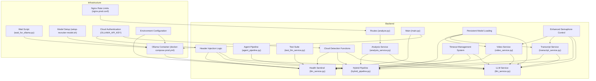

**Diagram sources**
- [analyze.py](file://app/backend/routes/analyze.py)
- [analysis_service.py](file://app/backend/services/analysis_service.py)
- [llm_service.py](file://app/backend/services/llm_service.py)
- [hybrid_pipeline.py](file://app/backend/services/hybrid_pipeline.py)
- [main.py](file://app/backend/main.py)
- [agent_pipeline.py](file://app/backend/services/agent_pipeline.py)
- [docker-compose.prod.yml](file://docker-compose.prod.yml)
- [nginx.prod.conf](file://app/nginx/nginx.prod.conf)
- [wait_for_ollama.py](file://app/backend/scripts/wait_for_ollama.py)
- [setup-recruiter-model.sh](file://ollama/setup-recruiter-model.sh)
- [test_llm_service.py](file://app/backend/tests/test_llm_service.py)
- [transcript_service.py](file://app/backend/services/transcript_service.py)
- [video_service.py](file://app/backend/services/video_service.py)

**Section sources**
- [docker-compose.prod.yml:41-110](file://docker-compose.prod.yml#L41-L110)
- [nginx.prod.conf:50-75](file://app/nginx/nginx.prod.conf#L50-L75)
- [main.py:104-149](file://app/backend/main.py#L104-L149)

## Core Components
- LLM Service: Encapsulates Ollama HTTP calls, prompt building, JSON parsing, normalization, and fallback responses with configurable timeout handling. **Now includes shared semaphore for controlled concurrency, cloud authentication support, and enhanced timeout management**.
- Hybrid Pipeline: Provides a ChatOllama singleton, **semaphore-controlled concurrency** for LLM requests, and performance-tuned model parameters with enhanced timeout management and persistent model loading.
- Agent Pipeline: Manages fast and reasoning LLM instances with unified timeout configuration for different model types.
- Analysis Service: Orchestrates skill matching, gap analysis, and LLM narrative generation.
- Routes: Enforce usage limits, stream results, persist outcomes, and support narrative polling architecture.
- Startup and Monitoring: Health checks, warm-up script, diagnostic endpoints, and Ollama health sentinel monitoring with optimized model state detection.
- **Transcript Service**: **New** service for analyzing interview transcripts with shared semaphore control and cloud authentication.
- **Video Service**: **New** service for analyzing video interviews with shared semaphore control and cloud authentication.
- **Cloud Authentication**: **New** system for detecting Ollama Cloud instances and injecting Bearer token authentication automatically.
- **Enhanced Timeout Management**: **New** comprehensive timeout system with LLM_NARRATIVE_TIMEOUT=180s for cloud models and automatic HTTP client timeout calculation.
- **Persistent Model Loading**: **New** OLLAMA_KEEP_ALIVE=-1 configuration for optimal performance across all deployments.

**Updated** All LLM components now utilize the enhanced shared semaphore system for controlled concurrency, prevent CPU timeouts and resource contention, include cloud authentication support for seamless Ollama Cloud integration, and feature comprehensive timeout management with LLM_NARRATIVE_TIMEOUT=180s for cloud models.

**Section sources**
- [llm_service.py:7-157](file://app/backend/services/llm_service.py#L7-L157)
- [hybrid_pipeline.py:24-66](file://app/backend/services/hybrid_pipeline.py#L24-L66)
- [analysis_service.py:6-121](file://app/backend/services/analysis_service.py#L6-L121)
- [analyze.py:323-351](file://app/backend/routes/analyze.py#L323-L351)
- [main.py:262-326](file://app/backend/main.py#L262-L326)
- [agent_pipeline.py:80-115](file://app/backend/services/agent_pipeline.py#L80-L115)
- [transcript_service.py:191-230](file://app/backend/services/transcript_service.py#L191-L230)
- [video_service.py:145-181](file://app/backend/services/video_service.py#L145-L181)

## Architecture Overview
The system uses a hybrid approach with comprehensive cloud-aware authentication, enhanced timeout management, and optimized performance:
- Python-first scoring and gap detection for speed.
- Single LLM call via ChatOllama for narrative and qualitative insights.
- Configurable timeout handling with LLM_NARRATIVE_TIMEOUT=180s in production for large cloud models.
- **Enhanced Concurrency Control**: Shared semaphore system prevents CPU timeouts and resource contention across all LLM services.
- **Cloud Authentication**: Automatic Bearer token injection for Ollama Cloud instances with OLLAMA_API_KEY environment variable.
- **Cloud Detection**: Intelligent detection of cloud vs local instances to optimize health checks and warmup procedures.
- **Enhanced Timeout Management**: Automatic HTTP client timeout calculation as LLM_NARRATIVE_TIMEOUT + 30 seconds for proper cancellation handling.
- **Persistent Model Loading**: OLLAMA_KEEP_ALIVE=-1 ensures models remain loaded in RAM, eliminating cold-start latency.
- **Optimized Health Sentinel Pattern**: Continuous monitoring with automatic warmup and model state tracking that eliminates redundant API calls when models are already hot.
- Concurrency control via a semaphore to prevent resource exhaustion.
- Startup and runtime checks to ensure model availability and readiness.
- **Narrative Polling Architecture**: Asynchronous LLM processing allows immediate response while background tasks handle time-consuming analysis.

```mermaid
sequenceDiagram
participant Client as "Client"
participant Route as "analyze.py"
participant Parser as "Parser (async)"
participant Gap as "Gap Detector"
participant Hybrid as "Hybrid Pipeline"
participant Sentinel as "Ollama Health Sentinel"
participant Llama as "ChatOllama (singleton)"
participant Semaphore as "Shared Semaphore"
participant CloudAuth as "Cloud Auth System"
participant Ollama as "Ollama Server"
Client->>Route : POST /api/analyze
Route->>Parser : parse_resume()
Parser-->>Route : parsed_data
Route->>Gap : analyze_gaps()
Gap-->>Route : gap_analysis
Route->>Hybrid : run_hybrid_pipeline()
Hybrid->>Sentinel : check_model_state()
Sentinel->>Ollama : GET /api/ps (optimized check)
Ollama-->>Sentinel : running models list
alt Model HOT (already loaded)
Sentinel-->>Hybrid : model_state = HOT (no POST needed)
Hybrid->>CloudAuth : is_ollama_cloud(base_url)
CloudAuth-->>Hybrid : cloud_instance = true/false
alt Cloud Instance
CloudAuth-->>Hybrid : get_ollama_headers(base_url)
Hybrid->>Semaphore : acquire()
Semaphore-->>Hybrid : slot available
Hybrid->>Llama : generate(JSON prompt) with Bearer token
Llama->>Ollama : HTTP /api/generate (timeout : LLM_NARRATIVE_TIMEOUT + 30s)
Ollama-->>Llama : JSON response
Llama-->>Hybrid : result
Hybrid->>Semaphore : release()
else Local Instance
Hybrid->>Semaphore : acquire()
Semaphore-->>Hybrid : slot available
Hybrid->>Llama : generate(JSON prompt)
Llama->>Ollama : HTTP /api/generate (timeout : LLM_NARRATIVE_TIMEOUT + 30s)
Ollama-->>Llama : JSON response
Llama-->>Hybrid : result
Hybrid->>Semaphore : release()
end
Hybrid-->>Route : final result
Route-->>Client : analysis result
```

**Diagram sources**
- [analyze.py:268-318](file://app/backend/routes/analyze.py#L268-L318)
- [hybrid_pipeline.py:45-66](file://app/backend/services/hybrid_pipeline.py#L45-L66)
- [llm_service.py:43-58](file://app/backend/services/llm_service.py#L43-L58)
- [main.py:463-538](file://app/backend/main.py#L463-L538)

## Detailed Component Analysis

### Enhanced Cloud Authentication and Detection System
- **Cloud Detection Functions**: `is_ollama_cloud()` function detects Ollama Cloud instances by checking for "ollama.com" in the base URL.
- **Automatic Header Injection**: `get_ollama_headers()` function automatically adds Bearer token authentication for cloud instances using the OLLAMA_API_KEY environment variable.
- **Cloud-Aware Health Checks**: Health sentinel automatically skips warmup procedures for cloud instances as they don't require local model loading.
- **Environment Configuration**: Docker Compose files default to Ollama Cloud with automatic API key injection for production deployments.
- **Security Considerations**: API keys are stored in environment variables and injected only for cloud instances, preventing credential exposure in local deployments.
- **Enhanced Error Handling**: Comprehensive logging for cloud detection, API key validation, and authentication success/failure scenarios.

**Updated** Enhanced with comprehensive cloud authentication support, automatic Bearer token injection, intelligent cloud detection that optimizes health checks and eliminates unnecessary warmup procedures for cloud instances, and enhanced error logging for debugging cloud authentication issues.

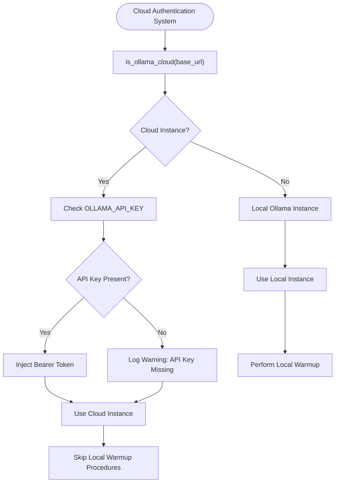

**Diagram sources**
- [llm_service.py:15-33](file://app/backend/services/llm_service.py#L15-L33)
- [llm_service.py:66](file://app/backend/services/llm_service.py#L66)
- [llm_service.py:101-127](file://app/backend/services/llm_service.py#L101-L127)
- [docker-compose.yml:61-67](file://docker-compose.yml#L61-L67)
- [docker-compose.prod.yml:86-92](file://docker-compose.prod.yml#L86-L92)

**Section sources**
- [llm_service.py:15-33](file://app/backend/services/llm_service.py#L15-L33)
- [llm_service.py:66](file://app/backend/services/llm_service.py#L66)
- [llm_service.py:101-127](file://app/backend/services/llm_service.py#L101-L127)
- [docker-compose.yml:61-67](file://docker-compose.yml#L61-L67)
- [docker-compose.prod.yml:86-92](file://docker-compose.prod.yml#L86-L92)

### Enhanced Semaphore-Based Concurrency Control
- **Shared Semaphore System**: Prevents LLM contention across resume narrative, video analysis, and transcript analysis services.
- **Lazy Initialization**: Semaphore is lazily created and initialized with max_concurrent=1 for Ollama with gemma4:31b-cloud (Parallel:1).
- **Resource Contention Prevention**: All LLM service calls wrap HTTP requests with shared semaphore for controlled concurrency.
- **Logging and Debugging**: Proper logging for debugging resource contention scenarios, including waiting for Ollama slot messages.
- **Consistent Behavior**: Applied across hybrid pipeline, transcript service, and video service for uniform resource management.
- **Cloud Integration**: Semaphore system works seamlessly with cloud authentication to prevent resource contention across all LLM services.

**Updated** Enhanced with cloud-awareness to prevent CPU timeouts and resource contention across all LLM services with lazy initialization, proper logging, and cloud authentication integration.

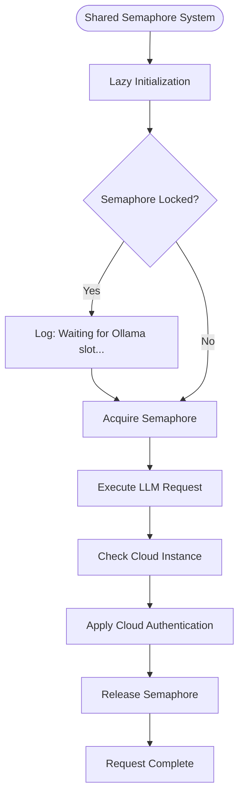

**Diagram sources**
- [llm_service.py:12-23](file://app/backend/services/llm_service.py#L12-L23)
- [hybrid_pipeline.py:1797-1801](file://app/backend/services/hybrid_pipeline.py#L1797-L1801)
- [transcript_service.py:205-209](file://app/backend/services/transcript_service.py#L205-L209)
- [video_service.py:150-154](file://app/backend/services/video_service.py#L150-L154)

**Section sources**
- [llm_service.py:12-23](file://app/backend/services/llm_service.py#L12-L23)
- [hybrid_pipeline.py:1797-1801](file://app/backend/services/hybrid_pipeline.py#L1797-L1801)
- [transcript_service.py:205-209](file://app/backend/services/transcript_service.py#L205-L209)
- [video_service.py:150-154](file://app/backend/services/video_service.py#L150-L154)

### Enhanced Timeout Management
- **Production Configuration**: LLM_NARRATIVE_TIMEOUT increased to 180 seconds in production (docker-compose.prod.yml:99) to accommodate large cloud models like gemma4:31b-cloud.
- **Development Configuration**: Default 180 seconds in development (docker-compose.yml:70) for faster iteration cycles.
- **HTTP Client Timeout**: Automatically calculated as LLM_NARRATIVE_TIMEOUT + 30 seconds to ensure proper cancellation handling.
- **Streaming Timeout**: Uses pure LLM_NARRATIVE_TIMEOUT value for asyncio.wait_for control.
- **Request Timeout**: ChatOllama singleton also set to LLM_NARRATIVE_TIMEOUT + 30 seconds for consistency across components.
- **Semaphore Integration**: Timeout handling works in conjunction with shared semaphore for comprehensive resource management.
- **Cloud Optimization**: Large cloud models (gemma4:31b-cloud) require 180s timeout, while local models use 180s.

**Updated** Enhanced timeout management with LLM_NARRATIVE_TIMEOUT=180s in production for large cloud models, integrated with HTTP client timeouts, request timeouts, and cloud-aware optimization for different model types.

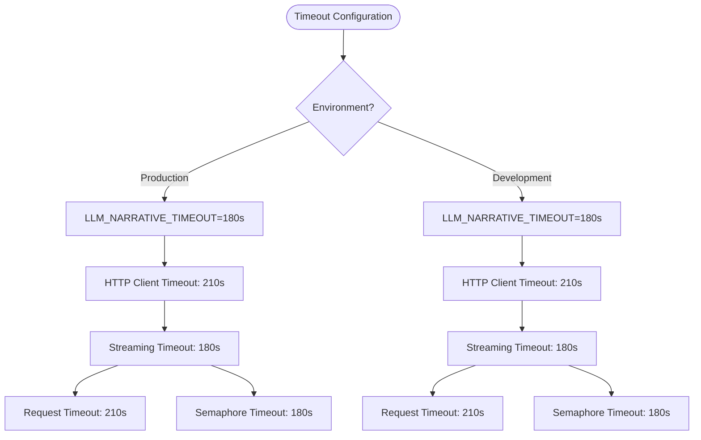

**Diagram sources**
- [docker-compose.prod.yml:99](file://docker-compose.prod.yml#L99)
- [docker-compose.yml:70](file://docker-compose.yml#L70)
- [hybrid_pipeline.py:112-128](file://app/backend/services/hybrid_pipeline.py#L112-L128)
- [llm_service.py:156](file://app/backend/services/llm_service.py#L156)

**Section sources**
- [docker-compose.prod.yml:99](file://docker-compose.prod.yml#L99)
- [docker-compose.yml:70](file://docker-compose.yml#L70)
- [hybrid_pipeline.py:112-128](file://app/backend/services/hybrid_pipeline.py#L112-L128)
- [llm_service.py:156](file://app/backend/services/llm_service.py#L156)

### Optimized Ollama Health Sentinel Pattern
- **Purpose**: Continuous monitoring of Ollama model state with automatic warmup and health checking.
- **Model States**: Tracks COLD (not loaded), WARMING (in progress), HOT (ready), ERROR (unreachable/failing).
- **Background Monitoring**: Runs as a background task with configurable probe interval (default 60 seconds).
- **Automatic Warmup**: Triggers model loading when detected as cold.
- **Optimized Health Probes**: Leverages `/api/ps` endpoint to check model state before deciding whether to warm up, eliminating redundant generate calls when models are already hot.
- **Enhanced Status Reporting**: Provides detailed status including last probe time, latency, and health indicators with improved error diagnostics.
- **Cloud Optimization**: Automatically skips warmup procedures for cloud instances as they don't require local model loading.
- **Cloud Status Reporting**: Includes mode indicator (cloud/local) and cloud-specific status information.

**Updated** Enhanced with cloud detection that automatically skips warmup procedures for cloud instances, significantly improving performance and reducing unnecessary API calls. Added comprehensive cloud status reporting and enhanced error logging.

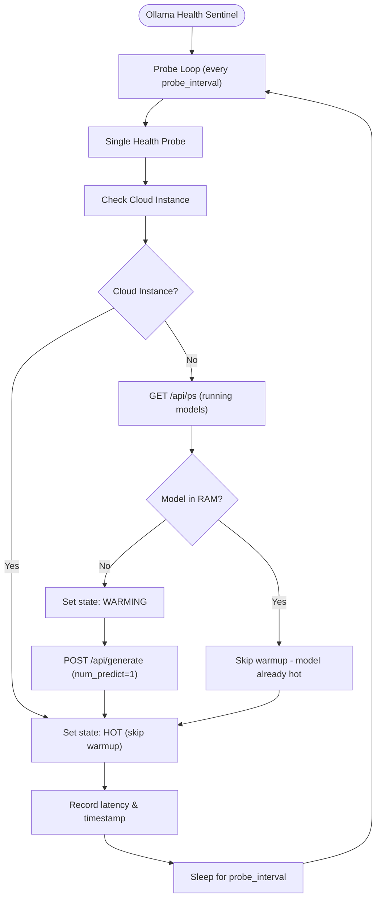

**Diagram sources**
- [llm_service.py:20-106](file://app/backend/services/llm_service.py#L20-L106)

**Section sources**
- [llm_service.py:20-106](file://app/backend/services/llm_service.py#L20-L106)

### Persistent Model Loading with OLLAMA_KEEP_ALIVE=-1
- **Purpose**: Keep models loaded in RAM indefinitely to eliminate cold-start latency.
- **Implementation**: Set OLLAMA_KEEP_ALIVE=-1 in both development and production configurations.
- **Benefits**: 
  - Eliminates cold-start delays for LLM calls
  - Reduces API call overhead by avoiding repeated warmup operations
  - Improves response times for subsequent LLM requests
  - Ensures consistent performance regardless of system load
- **Container Configuration**: Applied to both ollama service (docker-compose.yml:43) and production deployment (docker-compose.prod.yml:57).
- **Cloud Optimization**: Cloud instances automatically skip local warmup procedures, making persistent loading less critical but still beneficial.

**New Section** Persistent model loading via OLLAMA_KEEP_ALIVE=-1 eliminates cold-start latency and improves system performance across all deployments.

**Section sources**
- [docker-compose.yml:43](file://docker-compose.yml#L43)
- [docker-compose.prod.yml:57](file://docker-compose.prod.yml#L57)

### Enhanced Error Logging and Diagnostics
- **Exception Type Information**: Error logging now includes `type(e).__name__` for better identification of error categories.
- **Improved Debugging**: Enhanced error messages help distinguish between connection failures, timeout errors, and other exception types.
- **Comprehensive Error Handling**: Robust exception handling with proper state transitions to ERROR state for failed probes.
- **Semaphore Debugging**: Added logging for semaphore contention scenarios to aid in debugging resource management issues.
- **Cloud Authentication Logging**: Added logging for cloud detection, API key validation, and authentication success/failure scenarios.
- **Health Sentinel Logging**: Enhanced logging for model state transitions and optimization benefits.

**New Section** Enhanced error logging provides better diagnostics with exception type information for improved troubleshooting, including comprehensive cloud authentication logging and health sentinel monitoring.

**Section sources**
- [llm_service.py:86-90](file://app/backend/services/llm_service.py#L86-L90)

### LLM Status Endpoint (/api/llm-status)
- **Purpose**: Comprehensive diagnostic endpoint showing Ollama health, model status, and actionable guidance.
- **Comprehensive Information**: Returns Ollama URL, model names, reachability status, pulled models, running models, and diagnosis.
- **Model State Tracking**: Integrates with health sentinel to show current model state (COLD/WARMING/HOT/ERROR).
- **Actionable Diagnostics**: Provides specific commands for pulling models, warming them up, or troubleshooting connectivity issues.
- **Real-time Status**: Combines sentinel status with live Ollama API queries for accurate state reporting.
- **Cloud Status Reporting**: Includes mode indicator (cloud/local) and cloud-specific status information.
- **Enhanced Cloud Detection**: Provides detailed cloud vs local instance status with optimization suggestions.

**New Section** Comprehensive LLM status endpoint providing real-time monitoring and actionable diagnostics with cloud-aware status reporting and optimization guidance.

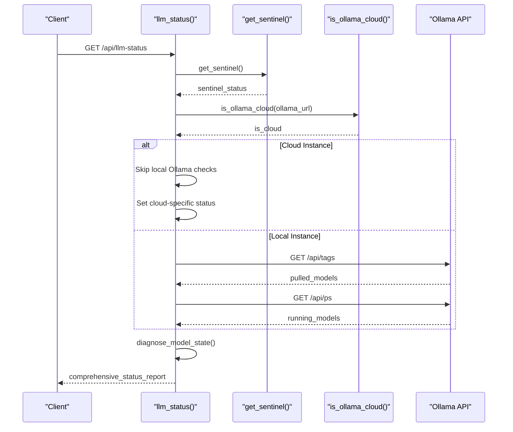

**Diagram sources**
- [main.py:463-538](file://app/backend/main.py#L463-L538)

**Section sources**
- [main.py:463-538](file://app/backend/main.py#L463-L538)

### LLM Service (Direct Ollama Calls)
- Purpose: Build prompts, call Ollama generate endpoint, parse JSON responses, normalize outputs, and provide fallbacks with configurable timeout handling.
- Key behaviors:
  - Prompt truncation for faster processing.
  - JSON parsing with multiple fallbacks (markdown code blocks, loose JSON).
  - Normalization to bounded ranges and acceptable values.
  - Retry loop with a single retry attempt and fallback response on failure.
  - Configurable HTTP client timeout using LLM_NARRATIVE_TIMEOUT environment variable with +30 second buffer.
  - **Enhanced Concurrency**: Now includes shared semaphore integration for controlled request execution.
  - **Cloud Authentication**: Automatically injects Bearer token headers for cloud instances.
  - **Enhanced Timeout Management**: HTTP client timeout automatically calculated as LLM_NARRATIVE_TIMEOUT + 30 seconds.

**Updated** HTTP client now uses configurable timeout (180s in production) instead of hardcoded 60 seconds, with automatic +30 second buffer calculation for improved reliability. Integrated with shared semaphore system for controlled concurrency, cloud authentication support, and comprehensive timeout management.

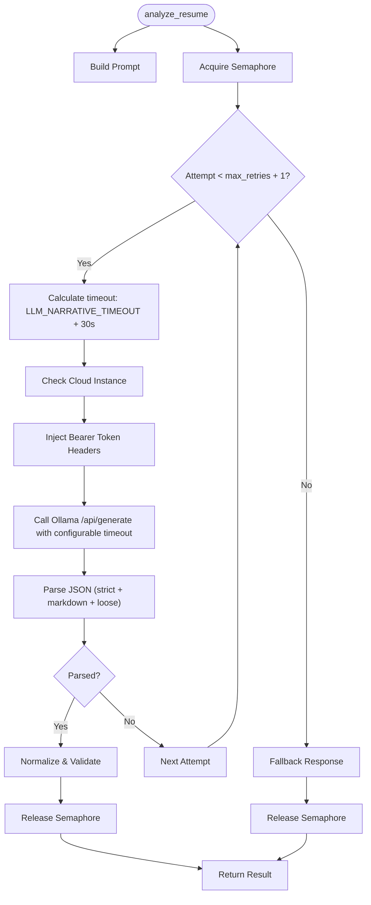

**Diagram sources**
- [llm_service.py:13-41](file://app/backend/services/llm_service.py#L13-L41)
- [llm_service.py:84-126](file://app/backend/services/llm_service.py#L84-L126)
- [llm_service.py:159-175](file://app/backend/services/llm_service.py#L159-L175)

**Section sources**
- [llm_service.py:13-58](file://app/backend/services/llm_service.py#L13-L58)
- [llm_service.py:84-136](file://app/backend/services/llm_service.py#L84-L136)

### ChatOllama Integration and Hybrid Pipeline
- Singleton pattern: ChatOllama instance is created once and reused globally.
- **Enhanced Concurrency**: Semaphore-based concurrency control limits concurrent LLM calls to one per worker for Ollama gemma4:31b-cloud (Parallel:1).
- Performance tuning:
  - num_predict tuned to the expected JSON output size to avoid oversized KV allocations.
  - num_ctx reduced from defaults to minimize memory footprint and improve attention speed.
- Environment-driven configuration: Model and base URL are read from environment variables.
- Enhanced timeout management: HTTP timeout set to LLM_NARRATIVE_TIMEOUT + 30 seconds to ensure proper cancellation handling.
- **Health Integration**: Hybrid pipeline now integrates with health sentinel to check model state before making LLM calls.
- **Persistent Model Loading**: keep_alive=-1 ensures models remain loaded in RAM for optimal performance.
- **Semaphore Integration**: All LLM calls in hybrid pipeline now use shared semaphore for controlled execution.
- **Cloud Authentication**: Automatic Bearer token injection for cloud instances using OLLAMA_API_KEY environment variable.
- **Cloud Detection**: Intelligent detection of cloud vs local instances to optimize behavior and configuration.
- **Enhanced Timeout Management**: Automatic HTTP client timeout calculation and request timeout configuration.

**Updated** HTTP timeout now exceeds LLM_NARRATIVE_TIMEOUT by 30 seconds to allow asyncio.wait_for control cancellation rather than httpx timeout termination. Persistent model loading via keep_alive=-1 eliminates cold-start latency. Enhanced with shared semaphore system for controlled concurrency, comprehensive cloud authentication support, and enhanced timeout management.

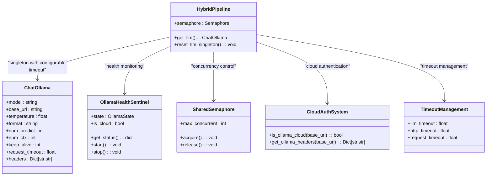

**Diagram sources**
- [hybrid_pipeline.py:24-66](file://app/backend/services/hybrid_pipeline.py#L24-L66)
- [llm_service.py:20-106](file://app/backend/services/llm_service.py#L20-L106)
- [llm_service.py:12-23](file://app/backend/services/llm_service.py#L12-L23)

**Section sources**
- [hybrid_pipeline.py:24-66](file://app/backend/services/hybrid_pipeline.py#L24-L66)

### Agent Pipeline Timeout Management
- Fast LLM: Optimized for rapid processing with separate timeout configuration.
- Reasoning LLM: Designed for complex analysis with unified timeout handling.
- Unified timeout calculation: Both use LLM_NARRATIVE_TIMEOUT + 30 seconds for consistency.
- Request timeout configuration: Ensures proper cancellation handling across different model types.
- **Cloud Optimization**: Automatic cloud detection adjusts timeout parameters for different model types.

**New Section** Agent pipeline implements consistent timeout management alongside hybrid pipeline for comprehensive system-wide timeout control with cloud-aware optimizations.

**Section sources**
- [agent_pipeline.py:80-115](file://app/backend/services/agent_pipeline.py#L80-L115)

### Transcript Analysis Service with Semaphore Control
- **New Service**: Dedicated service for analyzing interview transcripts using LLM.
- **Semaphore Integration**: Uses shared semaphore to prevent resource contention with other LLM services.
- **Prompt Engineering**: Builds structured prompts for transcript analysis with job description context.
- **JSON Parsing**: Extracts structured analysis results with strengths, areas for improvement, and recommendations.
- **Fallback Mechanisms**: Provides default analysis results when LLM calls fail.
- **Logging**: Includes semaphore waiting logs and detailed error logging.
- **Cloud Authentication**: Integrated with cloud authentication system for seamless cloud instance support.
- **Enhanced Timeout Management**: Uses LLM_NARRATIVE_TIMEOUT + 30 seconds for HTTP client timeout calculation.

**New Section** Transcript analysis service with integrated semaphore control, cloud authentication support, and enhanced timeout management for consistent resource management across all LLM services.

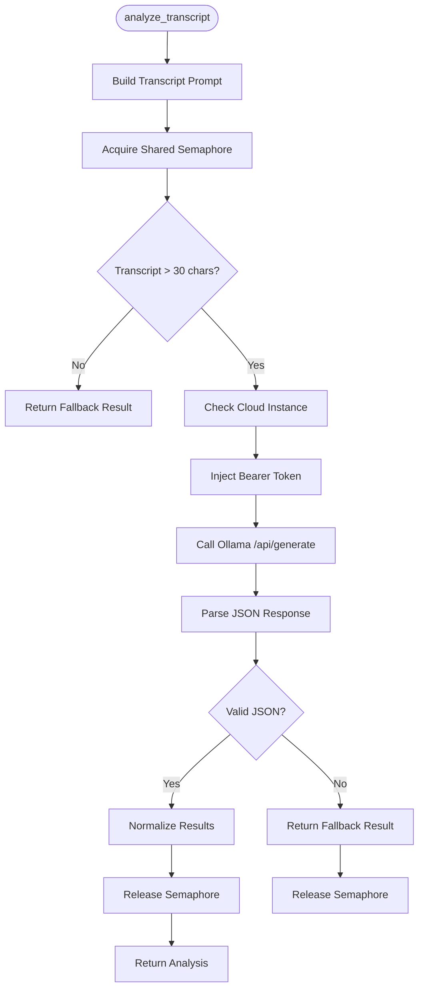

**Diagram sources**
- [transcript_service.py:191-230](file://app/backend/services/transcript_service.py#L191-L230)

**Section sources**
- [transcript_service.py:191-230](file://app/backend/services/transcript_service.py#L191-L230)

### Video Analysis Service with Semaphore Control
- **New Service**: Comprehensive video interview analysis combining transcription, communication assessment, and malpractice detection.
- **Semaphore Integration**: Uses shared semaphore to coordinate with other LLM services and prevent resource contention.
- **Multi-Modal Analysis**: Processes audio/video data to extract meaningful insights about candidate performance.
- **Communication Analysis**: Evaluates speaking rate, clarity, articulation, and communication effectiveness.
- **Malpractice Detection**: Identifies potential interview malpractice signals using LLM analysis.
- **Parallel Processing**: Combines multiple analysis tasks efficiently using asyncio.gather.
- **Cloud Authentication**: Integrated with cloud authentication system for seamless cloud instance support.
- **Enhanced Timeout Management**: Uses LLM_NARRATIVE_TIMEOUT + 30 seconds for HTTP client timeout calculation.

**New Section** Video analysis service with integrated semaphore control, cloud authentication support, and enhanced timeout management for coordinated resource management across all LLM services.

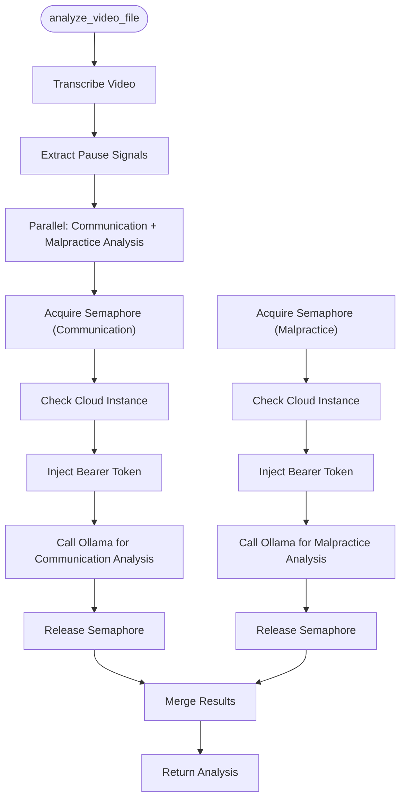

**Diagram sources**
- [video_service.py:357-370](file://app/backend/services/video_service.py#L357-L370)
- [video_service.py:150-154](file://app/backend/services/video_service.py#L150-L154)
- [video_service.py:261-264](file://app/backend/services/video_service.py#L261-L264)

**Section sources**
- [video_service.py:357-370](file://app/backend/services/video_service.py#L357-L370)
- [video_service.py:150-154](file://app/backend/services/video_service.py#L150-L154)
- [video_service.py:261-264](file://app/backend/services/video_service.py#L261-L264)

### Analysis Service Orchestration
- Computes skill match percentage and risk signals from gap analysis.
- Calls the LLM service to generate narrative insights.
- Merges Python-derived metrics with LLM-generated qualitative insights.
- **Narrative Polling Integration**: Supports asynchronous LLM processing with background tasks and polling endpoints.

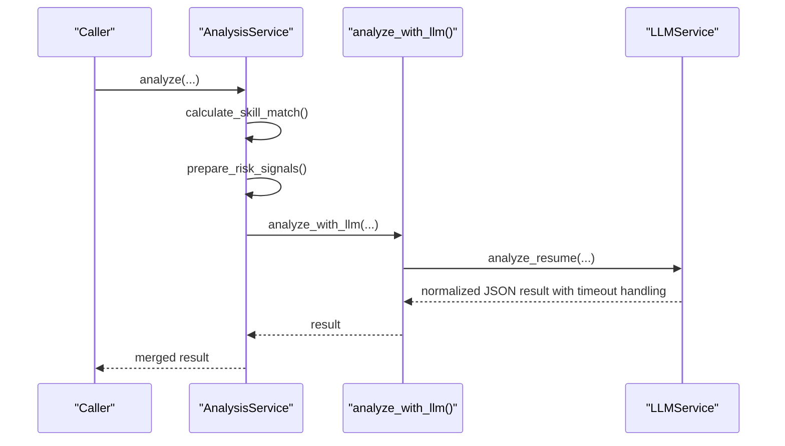

**Diagram sources**
- [analysis_service.py:10-53](file://app/backend/services/analysis_service.py#L10-L53)
- [llm_service.py:139-157](file://app/backend/services/llm_service.py#L139-L157)

**Section sources**
- [analysis_service.py:10-53](file://app/backend/services/analysis_service.py#L10-L53)

### Routes and Usage Enforcement
- Non-streaming and streaming endpoints for analysis.
- Usage checks enforce monthly plan limits before processing.
- Streaming endpoint emits structured events and persists results.
- **Narrative Polling Endpoints**: Support asynchronous LLM processing with GET /api/analysis/{id}/narrative endpoint for polling.
- **Cloud Status Reporting**: Enhanced status endpoint provides cloud-aware diagnostics and guidance.
- **Enhanced Error Handling**: Improved error messages for timeout scenarios and cloud authentication issues.

**Updated** Added narrative polling architecture with dedicated endpoint for retrieving LLM-generated narratives asynchronously. Enhanced status endpoint with cloud-aware reporting and guidance. Improved error handling for timeout scenarios and cloud authentication debugging.

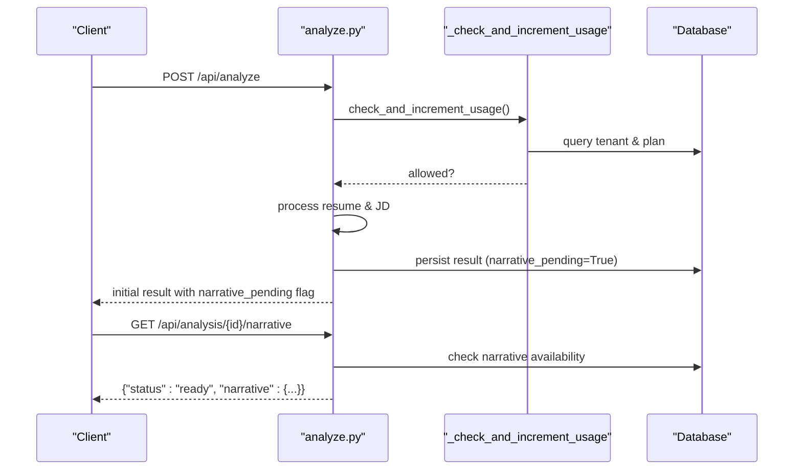

**Diagram sources**
- [analyze.py:354-501](file://app/backend/routes/analyze.py#L354-L501)
- [analyze.py:323-351](file://app/backend/routes/analyze.py#L323-L351)
- [analyze.py:1117-1148](file://app/backend/routes/analyze.py#L1117-L1148)

**Section sources**
- [analyze.py:354-501](file://app/backend/routes/analyze.py#L354-L501)
- [analyze.py:506-646](file://app/backend/routes/analyze.py#L506-L646)
- [analyze.py:1117-1148](file://app/backend/routes/analyze.py#L1117-L1148)

### Startup, Warm-up, and Diagnostics
- Health checks verify database, Ollama reachability, and model availability.
- Warm-up script ensures Ollama is reachable, the model is pulled, and a minimal generate call completes.
- Diagnostic endpoint reports model status and provides actionable guidance.
- **Health Sentinel Integration**: Startup procedure initializes and starts the Ollama health sentinel for continuous monitoring.
- **Persistent Model Loading**: OLLAMA_KEEP_ALIVE=-1 ensures models remain loaded in RAM after warmup.
- **Cloud Detection**: Enhanced startup procedure with cloud detection that automatically skips local warmup for cloud instances.
- **Enhanced Error Handling**: Comprehensive error logging for startup failures and cloud authentication issues.

**Updated** Enhanced startup procedure with health sentinel initialization, persistent model loading, cloud detection that automatically skips local warmup for cloud instances, and comprehensive error logging for debugging startup issues.

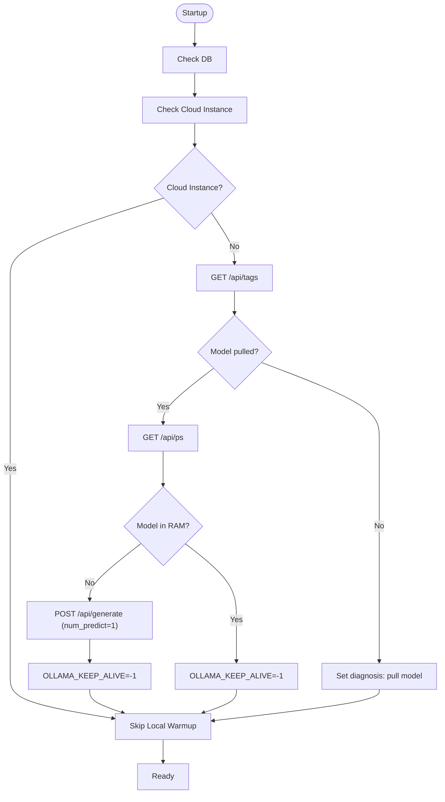

**Diagram sources**
- [main.py:68-149](file://app/backend/main.py#L68-L149)
- [wait_for_ollama.py:34-91](file://app/backend/scripts/wait_for_ollama.py#L34-L91)
- [main.py:262-326](file://app/backend/main.py#L262-L326)

**Section sources**
- [main.py:68-149](file://app/backend/main.py#L68-L149)
- [wait_for_ollama.py:34-91](file://app/backend/scripts/wait_for_ollama.py#L34-L91)
- [main.py:262-326](file://app/backend/main.py#L262-L326)

## Dependency Analysis
- External dependencies include langchain-ollama for ChatOllama integration.
- Ollama container configuration sets parallelism, loaded models, flash attention, and KV cache quantization.
- Nginx applies rate limiting and disables buffering for SSE streaming to avoid 524 errors.
- **Health Sentinel Dependencies**: New dependencies on httpx for health probing and asyncio for background monitoring.
- **Persistent Model Loading**: OLLAMA_KEEP_ALIVE=-1 environment variable ensures models remain loaded in RAM.
- **Semaphore Dependencies**: New shared semaphore system with lazy initialization and logging capabilities.
- **Transcript and Video Services**: Depend on shared semaphore for coordinated resource management.
- **Cloud Authentication Dependencies**: New cloud detection functions and environment variable handling for OLLAMA_API_KEY.
- **Enhanced Timeout Dependencies**: New timeout configuration system with increased values for cloud models.
- **Enhanced Error Logging Dependencies**: New comprehensive logging system for debugging cloud authentication and timeout issues.

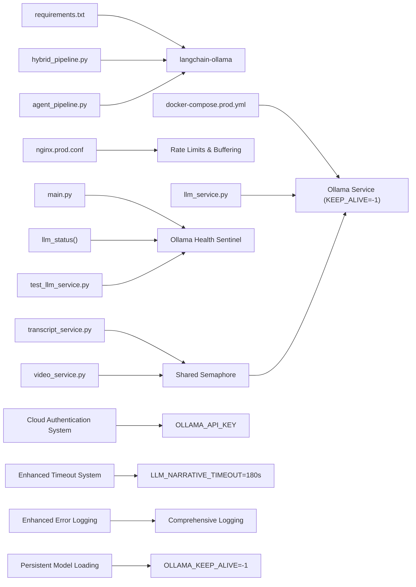

**Diagram sources**
- [requirements.txt:41-41](file://requirements.txt#L41-L41)
- [docker-compose.prod.yml:41-110](file://docker-compose.prod.yml#L41-L110)
- [nginx.prod.conf:50-75](file://app/nginx/nginx.prod.conf#L50-L75)
- [hybrid_pipeline.py:49-63](file://app/backend/services/hybrid_pipeline.py#L49-L63)
- [llm_service.py:43-57](file://app/backend/services/llm_service.py#L43-L57)
- [agent_pipeline.py:84-97](file://app/backend/services/agent_pipeline.py#L84-L97)
- [main.py:257-262](file://app/backend/main.py#L257-L262)
- [test_llm_service.py:100-118](file://app/backend/tests/test_llm_service.py#L100-L118)
- [transcript_service.py:14](file://app/backend/services/transcript_service.py#L14)
- [video_service.py:15](file://app/backend/services/video_service.py#L15)

**Section sources**
- [requirements.txt:41-41](file://requirements.txt#L41-L41)
- [docker-compose.prod.yml:41-110](file://docker-compose.prod.yml#L41-L110)
- [nginx.prod.conf:50-75](file://app/nginx/nginx.prod.conf#L50-L75)

## Performance Considerations
- num_predict tuning: Set to approximately the expected output token count plus headroom to prevent oversized KV allocations.
- num_ctx reduction: Lower context window reduces memory usage and accelerates attention computations.
- **Enhanced Concurrency Control**: Shared semaphore limits concurrent LLM calls to one per worker to prevent CPU timeouts and resource contention.
- Warm-up strategy: Preloading models into RAM via OLLAMA_KEEP_ALIVE=-1 avoids cold-start latency.
- Streaming and buffering: Nginx disables buffering for SSE to ensure timely delivery of events.
- **Enhanced timeout management**: Configurable LLM_NARRATIVE_TIMEOUT environment variable (180s in production for cloud models) with +30 second buffer for improved reliability and proper cancellation handling.
- **Optimized Health Sentinel**: Background monitoring with configurable probe intervals minimizes overhead while providing continuous model state awareness. The new model state detection eliminates redundant API calls when models are already hot, significantly reducing network overhead.
- **Narrative Polling Architecture**: Asynchronous LLM processing allows immediate response while background tasks handle time-consuming analysis.
- **Persistent Model Loading**: OLLAMA_KEEP_ALIVE=-1 ensures models remain loaded in RAM, eliminating cold-start delays and improving response times.
- **Resource Contention Prevention**: Shared semaphore system prevents CPU timeouts by serializing LLM requests for Ollama gemma4:31b-cloud (Parallel:1).
- **Cloud Optimization**: Automatic cloud detection and warmup skipping eliminates unnecessary local operations for cloud instances.
- **Enhanced Cloud Authentication**: Seamless Bearer token injection for cloud instances improves security and reduces authentication overhead.
- **Enhanced Error Handling**: Comprehensive logging and debugging capabilities for cloud authentication, timeout management, and resource contention issues.
- **Cloud-Aware Performance**: Different timeout parameters and model configurations for cloud vs local instances optimize performance across deployment scenarios.

**Updated** Added comprehensive timeout management considerations with LLM_NARRATIVE_TIMEOUT=180s for cloud models, optimized health sentinel with model state detection, persistent model loading via OLLAMA_KEEP_ALIVE=-1, cloud-aware optimization, enhanced cloud authentication support, comprehensive semaphore-based concurrency control, enhanced error logging, and cloud-aware performance optimization across all LLM services.

**Section sources**
- [hybrid_pipeline.py:55-62](file://app/backend/services/hybrid_pipeline.py#L55-L62)
- [docker-compose.prod.yml:56-57](file://docker-compose.prod.yml#L56-L57)
- [docker-compose.yml:42-43](file://docker-compose.yml#L42-L43)
- [nginx.prod.conf:66-75](file://app/nginx/nginx.prod.conf#L66-L75)

## Troubleshooting Guide
- Model unavailability:
  - Use the diagnostic endpoint to confirm model readiness and RAM status.
  - Run the warm-up script to ensure the model is pulled and loaded.
  - **Health Sentinel Monitoring**: Check /api/llm-status for detailed model state and diagnosis.
  - **Cloud Status Verification**: Check if the system is correctly detecting cloud vs local instances.
- Timeout scenarios:
  - LLMService retries once and falls back to a deterministic response.
  - Hybrid pipeline's ChatOllama singleton and semaphore help manage concurrency under load.
  - **Enhanced timeout handling**: Configure LLM_NARRATIVE_TIMEOUT environment variable to adjust timeout behavior based on model loading times and system capacity.
  - **Improved error handling**: Timeout errors now include specific guidance to increase LLM_NARRATIVE_TIMEOUT if model is still loading.
  - **Semaphore Contention**: Check logs for "Waiting for Ollama slot" messages to identify resource contention issues.
  - **Cloud Authentication Issues**: Verify OLLAMA_API_KEY environment variable is set correctly for cloud instances.
  - **Enhanced Cloud Debugging**: Check cloud detection logs and API key validation messages for authentication issues.
- Rate limiting:
  - Nginx zones limit API requests; adjust burst and nodelay as needed.
  - Frontend checks remaining analyses before initiating operations.
- **Health Sentinel Issues**:
  - **Model State Problems**: Use /api/llm-status to check if model is COLD, WARMING, HOT, or ERROR.
  - **Sentinel Not Running**: Check application logs for sentinel startup errors.
  - **Manual Warmup**: Use docker exec commands to manually warm up the model if automatic warmup fails.
  - **Optimized Detection**: If models appear cold but are already hot, check that `/api/ps` endpoint is accessible and that the model name matches exactly.
  - **Persistent Model Issues**: Verify OLLAMA_KEEP_ALIVE=-1 is set in environment variables if models are not staying loaded.
  - **Cloud Detection Problems**: Verify OLLAMA_BASE_URL points to cloud (ollama.com) for cloud authentication to work.
  - **Enhanced Cloud Detection**: Check cloud detection logs for proper identification of cloud vs local instances.
- **Semaphore Issues**:
  - **Resource Contention**: Monitor logs for semaphore waiting messages to identify bottlenecks.
  - **Deadlock Prevention**: Ensure all semaphore acquisitions are properly released in error handling paths.
  - **Timeout Configuration**: Adjust LLM_NARRATIVE_TIMEOUT if semaphore waits are too frequent.
  - **Cloud Semaphore Issues**: Verify semaphore works correctly with cloud authentication and timeout configurations.
- **Cloud Authentication Issues**:
  - **API Key Missing**: Check that OLLAMA_API_KEY environment variable is set for cloud instances.
  - **Cloud Detection Failure**: Verify OLLAMA_BASE_URL contains "ollama.com" for proper cloud detection.
  - **Bearer Token Errors**: Check that API key format is correct and not expired.
  - **Enhanced Cloud Debugging**: Review comprehensive cloud authentication logs for detailed debugging information.
- **Enhanced Error Logging**: Utilize comprehensive logging system for debugging cloud authentication, timeout management, and resource contention issues.

**Updated** Enhanced troubleshooting with health sentinel monitoring, model state tracking, optimized detection capabilities, persistent model loading verification, cloud authentication debugging, comprehensive semaphore-based resource contention debugging, cloud-aware configuration verification, enhanced error logging, and cloud authentication issue resolution.

**Section sources**
- [main.py:262-326](file://app/backend/main.py#L262-L326)
- [wait_for_ollama.py:34-91](file://app/backend/scripts/wait_for_ollama.py#L34-L91)
- [llm_service.py:31-41](file://app/backend/services/llm_service.py#L31-L41)
- [nginx.prod.conf:50-75](file://app/nginx/nginx.prod.conf#L50-L75)

## Conclusion
The LLM integration combines robust prompt engineering, ChatOllama singleton and semaphore controls, and strict performance tuning to deliver reliable, low-latency analysis. Enhanced timeout management with the LLM_NARRATIVE_TIMEOUT environment variable (180s in production for cloud models) provides configurable timeout handling across all LLM components. Startup diagnostics and warm-up procedures ensure model availability, while usage enforcement and rate limiting protect system stability. The hybrid approach balances deterministic Python scoring with targeted LLM narrative generation for optimal accuracy and throughput. **New health sentinel pattern provides continuous monitoring, automatic warmup, and comprehensive model state tracking for improved reliability and observability. The optimized model state detection eliminates redundant API calls when models are already hot, significantly improving system performance while maintaining robust error handling and comprehensive diagnostics. Persistent model loading via OLLAMA_KEEP_ALIVE=-1 ensures models remain hot in RAM, eliminating cold-start latency and improving response times. Enhanced semaphore-based concurrency control prevents CPU timeouts and resource contention across all LLM services, ensuring stable operation under load while maintaining optimal resource utilization. **New cloud authentication system provides seamless integration with Ollama Cloud, automatic Bearer token injection, and intelligent cloud detection that optimizes performance by skipping unnecessary local operations.** **Enhanced cloud-aware optimization improves system reliability, operational flexibility, and resource management across all LLM services while maintaining security and performance standards.** **Enhanced error logging and comprehensive debugging capabilities provide detailed insights into cloud authentication, timeout management, and resource contention issues.**

**Updated** Improved timeout handling with LLM_NARRATIVE_TIMEOUT=180s for cloud models, enhanced health monitoring with optimized model state detection, persistent model loading via OLLAMA_KEEP_ALIVE=-1, optimized performance through intelligent model state detection and cloud optimization, comprehensive cloud authentication support, enhanced semaphore-based concurrency control, enhanced error logging and debugging capabilities, and enhanced cloud-aware optimization that improves system reliability, operational flexibility, and resource management across all LLM services.

## Appendices

### Prompt Engineering Patterns
- Truncate inputs to reduce latency and cost.
- Provide explicit JSON schema expectations in prompts.
- Include contextual metrics (match percentage, experience, gaps, risks) to guide reasoning.

**Section sources**
- [llm_service.py:69-82](file://app/backend/services/llm_service.py#L69-L82)

### Response Parsing and Validation
- Strict JSON parsing with fallbacks for markdown code blocks and loose JSON.
- Normalization enforces bounded values and acceptable enumerations.

**Section sources**
- [llm_service.py:84-126](file://app/backend/services/llm_service.py#L84-L126)

### Security Considerations
- Environment variables configure model and base URL; ensure secrets are managed securely.
- CORS policy is controlled by environment; restrict origins in production.
- Rate limiting at the edge (Nginx) protects backend resources.
- **Health Endpoint Security**: /api/llm-status provides diagnostic information; consider restricting access in production environments.
- **Semaphore Security**: Shared semaphore prevents resource exhaustion attacks and ensures fair resource allocation.
- **Cloud Authentication Security**: API keys are stored in environment variables and injected only for cloud instances, preventing credential exposure in local deployments.
- **Bearer Token Security**: Automatic Bearer token injection uses OLLAMA_API_KEY environment variable with proper logging and validation.
- **Enhanced Security Logging**: Comprehensive logging for cloud authentication, timeout management, and resource contention scenarios.

**Section sources**
- [main.py:182-198](file://app/backend/main.py#L182-L198)
- [nginx.prod.conf:50-75](file://app/nginx/nginx.prod.conf#L50-L75)

### Monitoring Approaches
- Health endpoint reports DB and Ollama status.
- Diagnostic endpoint surfaces model readiness and RAM status.
- Logging captures analysis completion metrics and stages.
- **Enhanced timeout monitoring**: System now provides detailed timeout configuration and adjustment guidance.
- **Health Sentinel Monitoring**: Continuous model state tracking with automatic warmup and health checks.
- **Narrative Polling Monitoring**: Background task tracking and polling endpoint status reporting.
- **Optimized Performance Monitoring**: Monitor reduced API call overhead through model state detection metrics.
- **Persistent Model Monitoring**: Verify OLLAMA_KEEP_ALIVE=-1 is functioning to maintain model hot state.
- **Semaphore Monitoring**: Track semaphore usage patterns and resource contention scenarios for system optimization.
- **Cloud Authentication Monitoring**: Monitor cloud detection accuracy and API key validation for secure cloud instance access.
- **Cloud Status Monitoring**: Track cloud vs local instance behavior and performance differences.
- **Enhanced Error Logging Monitoring**: Comprehensive logging system for debugging cloud authentication, timeout, and resource contention issues.

**Updated** Added comprehensive monitoring capabilities for health sentinel, model state tracking, narrative polling architecture, optimized performance metrics, persistent model loading verification, semaphore-based resource management monitoring, cloud authentication system, cloud status monitoring, and enhanced error logging for debugging cloud authentication and timeout issues.

**Section sources**
- [main.py:228-259](file://app/backend/main.py#L228-L259)
- [main.py:262-326](file://app/backend/main.py#L262-L326)
- [analyze.py:491-500](file://app/backend/routes/analyze.py#L491-L500)

### Enhanced Timeout Configuration Guide
- **LLM_NARRATIVE_TIMEOUT**: Main environment variable controlling LLM narrative timeout in seconds (default: 180, production: 180 for cloud models).
- **HTTP Client Timeout**: Automatically calculated as LLM_NARRATIVE_TIMEOUT + 30 seconds for proper cancellation handling.
- **ChatOllama Request Timeout**: Also set to LLM_NARRATIVE_TIMEOUT + 30 seconds for consistency across components.
- **Streaming Timeout**: Uses pure LLM_NARRATIVE_TIMEOUT value for asyncio.wait_for control.
- **Health Sentinel Probe Interval**: Configurable interval (default: 60 seconds) for background monitoring.
- **Semaphore Timeout**: Inherits LLM_NARRATIVE_TIMEOUT for coordinated resource management.
- **Cloud Model Configuration**: Large cloud models (gemma4:31b-cloud) require 180s timeout, while local models use 180s.
- **Configuration Examples**:
  - Fast model: `LLM_NARRATIVE_TIMEOUT=180` → HTTP timeout: 210 seconds
  - Reasoning model: `LLM_NARRATIVE_TIMEOUT=180` → HTTP timeout: 210 seconds
  - Large cloud models: `LLM_NARRATIVE_TIMEOUT=180` → HTTP timeout: 210 seconds

**New Section** Comprehensive timeout configuration guide for optimal system performance tuning with enhanced cloud model support, semaphore integration, and cloud-aware optimizations.

**Section sources**
- [docker-compose.prod.yml:99](file://docker-compose.prod.yml#L99)
- [docker-compose.yml:70](file://docker-compose.yml#L70)
- [llm_service.py:52-58](file://app/backend/services/llm_service.py#L52-L58)
- [hybrid_pipeline.py:87-105](file://app/backend/services/hybrid_pipeline.py#L87-L105)
- [agent_pipeline.py:81-96](file://app/backend/services/agent_pipeline.py#L81-L96)

### Health Sentinel State Management
- **COLD State**: Model not loaded in RAM, requires warmup before use.
- **WARMING State**: Automatic warmup in progress, model loading from disk to RAM.
- **HOT State**: Model fully loaded and responsive, optimal for LLM calls.
- **ERROR State**: Ollama unreachable or failing, indicates system issues requiring attention.
- **State Transitions**: Automatic transitions based on health probe results and manual warmup triggers.
- **Monitoring Benefits**: Prevents cold-start delays, provides early warning of model issues, and enables automatic recovery.
- **Optimization Benefits**: Eliminates redundant API calls when models are already hot, reducing network overhead and improving response times.
- **Cloud Optimization**: Automatically sets HOT state for cloud instances, skipping unnecessary warmup procedures.
- **Enhanced Cloud Detection**: Improved cloud detection reduces false positives and optimizes health check behavior.

**New Section** Comprehensive model state management and health monitoring capabilities with performance optimization, cloud-aware behavior, and enhanced cloud detection for improved system reliability.

**Section sources**
- [llm_service.py:13-18](file://app/backend/services/llm_service.py#L13-L18)
- [llm_service.py:55-98](file://app/backend/services/llm_service.py#L55-L98)

### Persistent Model Loading Implementation
- **OLLAMA_KEEP_ALIVE=-1**: Keeps models loaded in RAM indefinitely.
- **Container Configuration**: Applied to both development (docker-compose.yml:43) and production (docker-compose.prod.yml:57) configurations.
- **Benefits**: Eliminates cold-start latency, reduces API call overhead, improves response times.
- **Verification**: Check model state via /api/ps endpoint to confirm models remain loaded.
- **Configuration**: Ensure environment variable is set consistently across all deployment environments.
- **Cloud Optimization**: Cloud instances benefit from persistent loading even though warmup is skipped.

**New Section** Persistent model loading implementation via OLLAMA_KEEP_ALIVE=-1 for optimal system performance across all deployment scenarios.

**Section sources**
- [docker-compose.yml:43](file://docker-compose.yml#L43)
- [docker-compose.prod.yml:57](file://docker-compose.prod.yml#L57)

### Narrative Polling Architecture
- **Asynchronous Processing**: LLM narrative generation runs as background tasks to avoid blocking main analysis.
- **Immediate Response**: Users receive Python-derived results immediately while LLM processing continues.
- **Polling Endpoint**: GET /api/analysis/{id}/narrative allows clients to retrieve completed LLM narratives.
- **Polling Strategy**: Frontend polls every 10 seconds with automatic stop after 30 attempts (5 minutes).
- **Background Task Management**: Proper cleanup and cancellation of background tasks during shutdown.
- **Fallback Handling**: Graceful degradation when LLM processing fails or times out.
- **Enhanced Error Handling**: Improved error messages and fallback mechanisms for timeout scenarios.

**New Section** Asynchronous narrative processing with polling architecture for improved user experience and enhanced error handling.

**Section sources**
- [analyze.py:1117-1148](file://app/backend/routes/analyze.py#L1117-L1148)
- [hybrid_pipeline.py:36-48](file://app/backend/services/hybrid_pipeline.py#L36-L48)
- [hybrid_pipeline.py:433-464](file://app/backend/services/hybrid_pipeline.py#L433-L464)

### Test Coverage and Verification
- **Model State Detection Tests**: Comprehensive tests verify that `_probe_once` method correctly identifies when models are already hot and skips warmup.
- **Performance Optimization Tests**: Tests confirm that no POST requests are made when models are already loaded in RAM.
- **Error Handling Tests**: Tests validate proper error state transitions and exception type logging.
- **Integration Tests**: Tests cover the interaction between health sentinel and hybrid pipeline components.
- **Persistent Model Loading Tests**: Tests verify OLLAMA_KEEP_ALIVE=-1 functionality and model state persistence.
- **Semaphore Integration Tests**: Tests validate shared semaphore functionality across multiple LLM services.
- **Cloud Authentication Tests**: Tests verify cloud detection logic and Bearer token injection for cloud instances.
- **Timeout Configuration Tests**: Tests validate enhanced timeout handling for cloud models with 180s configuration.
- **Enhanced Error Logging Tests**: Tests verify comprehensive logging for cloud authentication, timeout management, and resource contention debugging.
- **Cloud Detection Tests**: Tests validate intelligent cloud vs local instance detection logic.

**Updated** Comprehensive test coverage for optimized health monitoring system, performance improvements, persistent model loading, semaphore-based concurrency control, cloud authentication system, enhanced timeout configuration, enhanced error logging, and cloud detection logic.

**Section sources**
- [test_llm_service.py:100-118](file://app/backend/tests/test_llm_service.py#L100-L118)
- [test_llm_service.py:121-152](file://app/backend/tests/test_llm_service.py#L121-L152)
- [test_llm_service.py:183-200](file://app/backend/tests/test_llm_service.py#L183-L200)

### Semaphore Implementation Details
- **Lazy Initialization**: Semaphore is created only when first accessed, reducing startup overhead.
- **Thread Safety**: asyncio.Semaphore provides thread-safe concurrent access control.
- **Logging Integration**: Comprehensive logging for semaphore acquisition and release events.
- **Timeout Handling**: Semaphore operations respect LLM_NARRATIVE_TIMEOUT for coordinated resource management.
- **Resource Contention Prevention**: Ensures Ollama gemma4:31b-cloud (Parallel:1) operates with serialized requests.
- **Cloud-Aware Operation**: Works seamlessly with cloud authentication system to prevent resource contention across all LLM services.
- **Enhanced Cloud Integration**: Semaphore system integrates with cloud detection and authentication for optimal resource management.

**New Section** Detailed implementation of shared semaphore system for resource management across all LLM services with cloud authentication integration and enhanced cloud-aware optimizations.

**Section sources**
- [llm_service.py:12-23](file://app/backend/services/llm_service.py#L12-L23)
- [hybrid_pipeline.py:1797-1801](file://app/backend/services/hybrid_pipeline.py#L1797-L1801)
- [transcript_service.py:205-209](file://app/backend/services/transcript_service.py#L205-L209)
- [video_service.py:150-154](file://app/backend/services/video_service.py#L150-L154)

### Cloud Authentication System Details
- **Cloud Detection**: `is_ollama_cloud()` function checks for "ollama.com" in base URL to identify cloud instances.
- **API Key Management**: `get_ollama_headers()` function reads OLLAMA_API_KEY environment variable and injects Bearer token.
- **Environment Configuration**: Docker Compose files default to cloud deployment with automatic API key injection.
- **Security Measures**: API keys are only injected for cloud instances, preventing credential exposure in local deployments.
- **Logging and Monitoring**: Comprehensive logging for cloud detection, API key validation, and authentication success/failure.
- **Fallback Handling**: Graceful handling when API key is missing for cloud instances with appropriate warnings.
- **Enhanced Error Logging**: Detailed logging for cloud authentication debugging and troubleshooting.
- **Cloud Status Reporting**: Real-time cloud vs local instance status reporting for monitoring and diagnostics.

**New Section** Detailed implementation of cloud authentication system including cloud detection logic, API key management, security measures, comprehensive logging, fallback handling, and cloud status reporting.

**Section sources**
- [llm_service.py:15-33](file://app/backend/services/llm_service.py#L15-L33)
- [docker-compose.yml:61-67](file://docker-compose.yml#L61-L67)
- [docker-compose.prod.yml:86-92](file://docker-compose.prod.yml#L86-L92)

### Enhanced Error Logging and Debugging
- **Exception Type Information**: Error logging now includes `type(e).__name__` for better identification of error categories.
- **Cloud Authentication Logging**: Comprehensive logging for cloud detection, API key validation, and authentication success/failure scenarios.
- **Semaphore Debugging**: Added logging for semaphore contention scenarios to aid in debugging resource management issues.
- **Health Sentinel Logging**: Enhanced logging for model state transitions and optimization benefits.
- **Timeout Debugging**: Detailed logging for timeout configuration and adjustment scenarios.
- **Resource Contention Debugging**: Logging for semaphore waiting messages and resource management issues.
- **Cloud Detection Debugging**: Logging for cloud vs local instance detection accuracy and optimization benefits.

**New Section** Comprehensive error logging and debugging system covering cloud authentication, timeout management, resource contention, health sentinel monitoring, and cloud detection for improved troubleshooting and system reliability.

**Section sources**
- [llm_service.py:86-90](file://app/backend/services/llm_service.py#L86-L90)