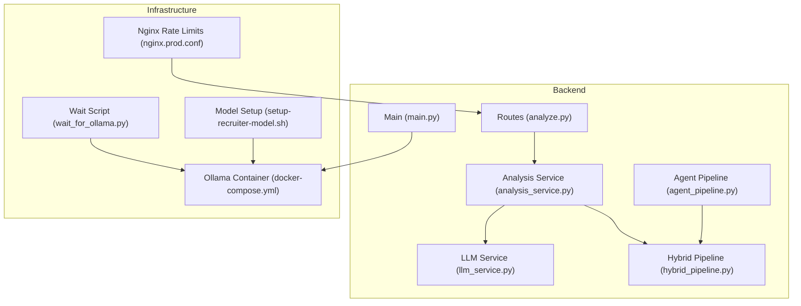
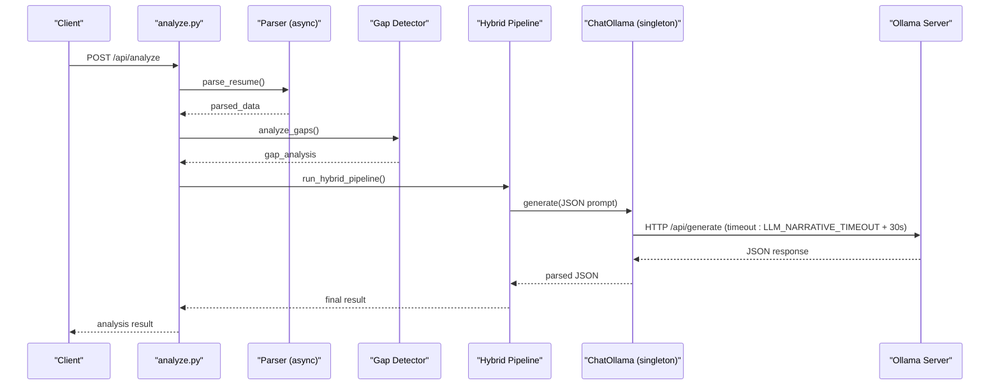
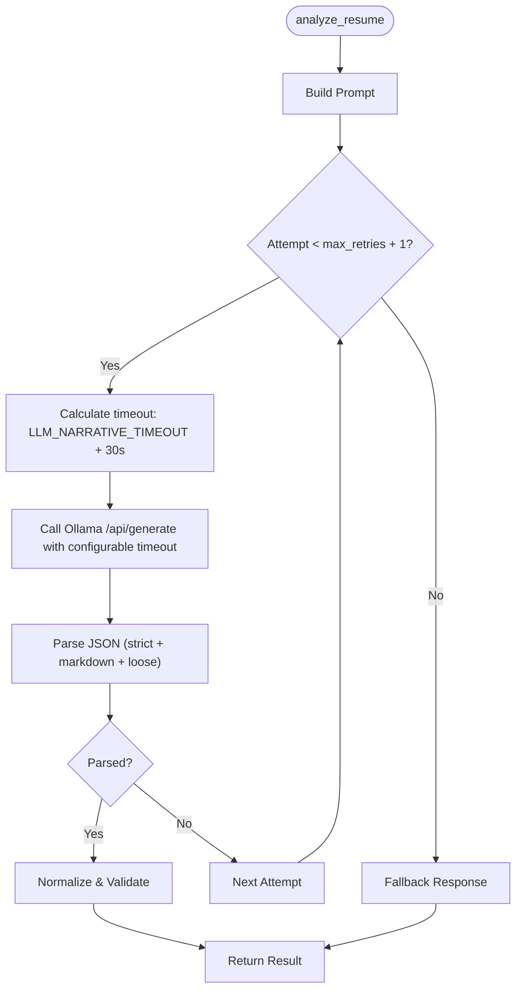
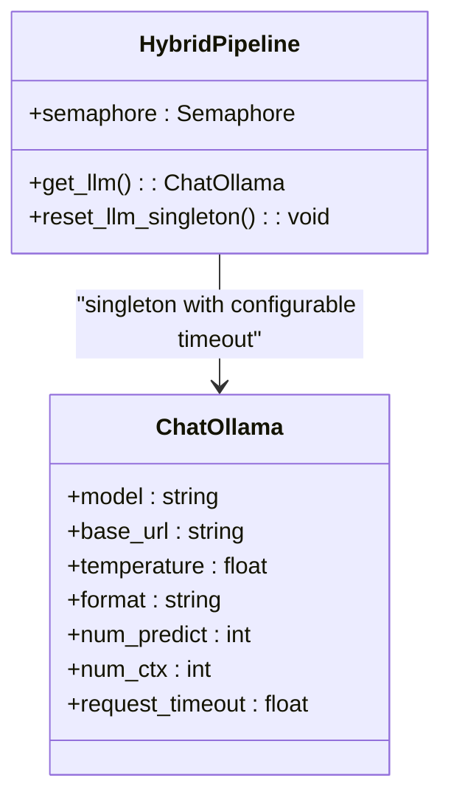
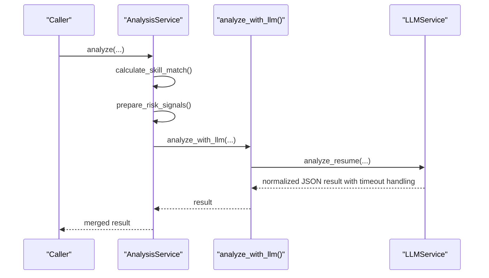
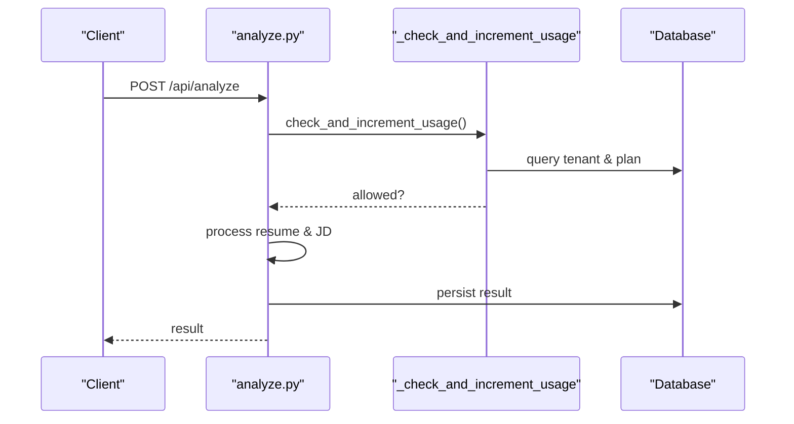
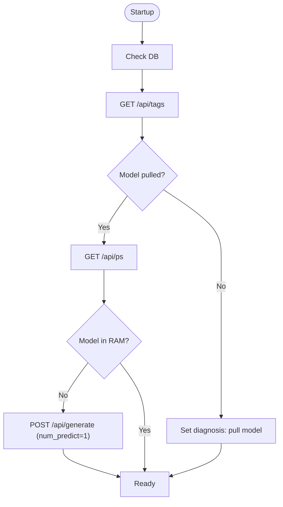
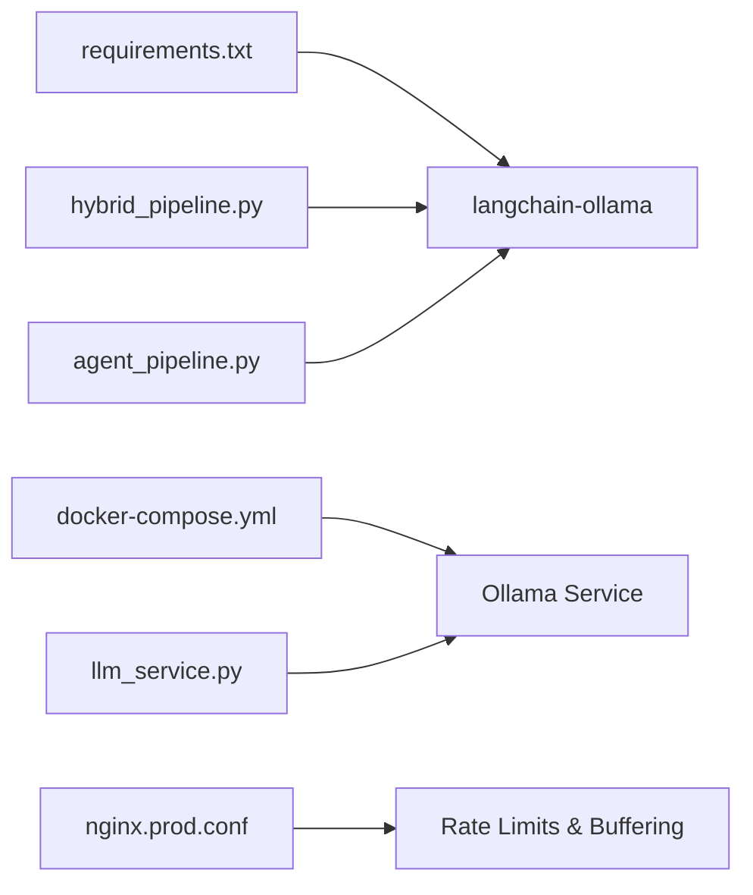

# LLM Service Integration

<cite>
**Referenced Files in This Document**
- [llm_service.py](file://app/backend/services/llm_service.py)
- [hybrid_pipeline.py](file://app/backend/services/hybrid_pipeline.py)
- [analysis_service.py](file://app/backend/services/analysis_service.py)
- [analyze.py](file://app/backend/routes/analyze.py)
- [main.py](file://app/backend/main.py)
- [wait_for_ollama.py](file://app/backend/scripts/wait_for_ollama.py)
- [setup-recruiter-model.sh](file://ollama/setup-recruiter-model.sh)
- [docker-compose.yml](file://docker-compose.yml)
- [nginx.prod.conf](file://app/nginx/nginx.prod.conf)
- [requirements.txt](file://requirements.txt)
- [agent_pipeline.py](file://app/backend/services/agent_pipeline.py)
</cite>

## Update Summary
**Changes Made**
- Enhanced timeout handling documentation with new LLM_NARRATIVE_TIMEOUT environment variable
- Updated HTTP client timeout configuration details
- Added comprehensive timeout buffer calculation explanation (+30 second buffer)
- Expanded error handling and fallback mechanisms documentation
- Updated performance considerations section with timeout-related optimizations

## Table of Contents
1. [Introduction](#introduction)
2. [Project Structure](#project-structure)
3. [Core Components](#core-components)
4. [Architecture Overview](#architecture-overview)
5. [Detailed Component Analysis](#detailed-component-analysis)
6. [Dependency Analysis](#dependency-analysis)
7. [Performance Considerations](#performance-considerations)
8. [Troubleshooting Guide](#troubleshooting-guide)
9. [Conclusion](#conclusion)
10. [Appendices](#appendices)

## Introduction
This document explains the LLM service integration with Ollama for AI-powered analysis and reasoning in the Resume Screening platform. It covers the ChatOllama integration, model configuration parameters, inference optimization techniques, singleton pattern implementation, semaphore-based concurrency control, memory management strategies, model selection criteria, performance tuning parameters, fallback mechanisms, prompt engineering patterns, response parsing, error handling for timeouts, security considerations, rate limiting, and monitoring approaches for LLM usage.

**Updated** Enhanced timeout handling with configurable LLM_NARRATIVE_TIMEOUT environment variable and +30 second buffer calculation for improved reliability and performance tuning.

## Project Structure
The LLM integration spans several modules:
- Services: LLM service for direct Ollama calls, hybrid pipeline with ChatOllama, and analysis orchestration.
- Routes: API endpoints that trigger analysis and enforce usage limits.
- Infrastructure: Ollama container configuration, model setup script, and Nginx rate limiting.
- Startup: Health checks and warm-up script to ensure Ollama readiness.

**Diagram sources**
- [analyze.py](file://app/backend/routes/analyze.py)
- [analysis_service.py](file://app/backend/services/analysis_service.py)
- [llm_service.py](file://app/backend/services/llm_service.py)
- [hybrid_pipeline.py](file://app/backend/services/hybrid_pipeline.py)
- [main.py](file://app/backend/main.py)
- [agent_pipeline.py](file://app/backend/services/agent_pipeline.py)
- [docker-compose.yml](file://docker-compose.yml)
- [nginx.prod.conf](file://app/nginx/nginx.prod.conf)
- [wait_for_ollama.py](file://app/backend/scripts/wait_for_ollama.py)
- [setup-recruiter-model.sh](file://ollama/setup-recruiter-model.sh)

**Section sources**
- [docker-compose.yml:24-50](file://docker-compose.yml#L24-L50)
- [nginx.prod.conf:50-75](file://app/nginx/nginx.prod.conf#L50-L75)
- [main.py:104-149](file://app/backend/main.py#L104-L149)

## Core Components
- LLM Service: Encapsulates Ollama HTTP calls, prompt building, JSON parsing, normalization, and fallback responses with configurable timeout handling.
- Hybrid Pipeline: Provides a ChatOllama singleton, semaphore-controlled concurrency, and performance-tuned model parameters with enhanced timeout management.
- Agent Pipeline: Manages fast and reasoning LLM instances with unified timeout configuration for different model types.
- Analysis Service: Orchestrates skill matching, gap analysis, and LLM narrative generation.
- Routes: Enforce usage limits, stream results, and persist outcomes.
- Startup and Monitoring: Health checks, warm-up script, and diagnostic endpoints.

**Updated** All LLM components now utilize the LLM_NARRATIVE_TIMEOUT environment variable for consistent timeout management across the system.

**Section sources**
- [llm_service.py:7-157](file://app/backend/services/llm_service.py#L7-L157)
- [hybrid_pipeline.py:24-66](file://app/backend/services/hybrid_pipeline.py#L24-L66)
- [analysis_service.py:6-121](file://app/backend/services/analysis_service.py#L6-L121)
- [analyze.py:323-351](file://app/backend/routes/analyze.py#L323-L351)
- [main.py:262-326](file://app/backend/main.py#L262-L326)
- [agent_pipeline.py:80-115](file://app/backend/services/agent_pipeline.py#L80-L115)

## Architecture Overview
The system uses a hybrid approach with enhanced timeout management:
- Python-first scoring and gap detection for speed.
- Single LLM call via ChatOllama for narrative and qualitative insights.
- Configurable timeout handling with LLM_NARRATIVE_TIMEOUT environment variable.
- Concurrency control via a semaphore to prevent resource exhaustion.
- Startup and runtime checks to ensure model availability and readiness.

**Diagram sources**
- [analyze.py:268-318](file://app/backend/routes/analyze.py#L268-L318)
- [hybrid_pipeline.py:45-66](file://app/backend/services/hybrid_pipeline.py#L45-L66)
- [llm_service.py:43-58](file://app/backend/services/llm_service.py#L43-L58)

## Detailed Component Analysis

### LLM Service (Direct Ollama Calls)
- Purpose: Build prompts, call Ollama generate endpoint, parse JSON responses, normalize outputs, and provide fallbacks with configurable timeout handling.
- Key behaviors:
  - Prompt truncation for faster processing.
  - JSON parsing with multiple fallbacks (markdown code blocks, loose JSON).
  - Normalization to bounded ranges and acceptable values.
  - Retry loop with a single retry attempt and fallback response on failure.
  - Configurable HTTP client timeout using LLM_NARRATIVE_TIMEOUT environment variable with +30 second buffer.

**Updated** HTTP client now uses configurable timeout instead of hardcoded 60 seconds, with automatic +30 second buffer calculation for improved reliability.

**Diagram sources**
- [llm_service.py:13-41](file://app/backend/services/llm_service.py#L13-L41)
- [llm_service.py:84-126](file://app/backend/services/llm_service.py#L84-L126)

**Section sources**
- [llm_service.py:13-58](file://app/backend/services/llm_service.py#L13-L58)
- [llm_service.py:84-136](file://app/backend/services/llm_service.py#L84-L136)

### ChatOllama Integration and Hybrid Pipeline
- Singleton pattern: ChatOllama instance is created once and reused globally.
- Semaphore-based concurrency: Limits concurrent LLM calls to two per worker.
- Performance tuning:
  - num_predict tuned to the expected JSON output size to avoid oversized KV allocations.
  - num_ctx reduced from defaults to minimize memory footprint and improve attention speed.
- Environment-driven configuration: Model and base URL are read from environment variables.
- Enhanced timeout management: HTTP timeout set to LLM_NARRATIVE_TIMEOUT + 30 seconds to ensure proper cancellation handling.

**Updated** HTTP timeout now exceeds LLM_NARRATIVE_TIMEOUT by 30 seconds to allow asyncio.wait_for control cancellation rather than httpx timeout termination.

**Diagram sources**
- [hybrid_pipeline.py:24-66](file://app/backend/services/hybrid_pipeline.py#L24-L66)

**Section sources**
- [hybrid_pipeline.py:24-66](file://app/backend/services/hybrid_pipeline.py#L24-L66)

### Agent Pipeline Timeout Management
- Fast LLM: Optimized for rapid processing with separate timeout configuration.
- Reasoning LLM: Designed for complex analysis with unified timeout handling.
- Unified timeout calculation: Both use LLM_NARRATIVE_TIMEOUT + 30 seconds for consistency.
- Request timeout configuration: Ensures proper cancellation handling across different model types.

**New Section** Agent pipeline implements consistent timeout management alongside hybrid pipeline for comprehensive system-wide timeout control.

**Section sources**
- [agent_pipeline.py:80-115](file://app/backend/services/agent_pipeline.py#L80-L115)

### Analysis Service Orchestration
- Computes skill match percentage and risk signals from gap analysis.
- Calls the LLM service to generate narrative insights.
- Merges Python-derived metrics with LLM-generated qualitative insights.

**Diagram sources**
- [analysis_service.py:10-53](file://app/backend/services/analysis_service.py#L10-L53)
- [llm_service.py:139-157](file://app/backend/services/llm_service.py#L139-L157)

**Section sources**
- [analysis_service.py:10-53](file://app/backend/services/analysis_service.py#L10-L53)

### Routes and Usage Enforcement
- Non-streaming and streaming endpoints for analysis.
- Usage checks enforce monthly plan limits before processing.
- Streaming endpoint emits structured events and persists results.

**Diagram sources**
- [analyze.py:354-501](file://app/backend/routes/analyze.py#L354-L501)
- [analyze.py:323-351](file://app/backend/routes/analyze.py#L323-L351)

**Section sources**
- [analyze.py:354-501](file://app/backend/routes/analyze.py#L354-L501)
- [analyze.py:506-646](file://app/backend/routes/analyze.py#L506-L646)

### Startup, Warm-up, and Diagnostics
- Health checks verify database, Ollama reachability, and model availability.
- Warm-up script ensures Ollama is reachable, the model is pulled, and a minimal generate call completes.
- Diagnostic endpoint reports model status and provides actionable guidance.

**Diagram sources**
- [main.py:68-149](file://app/backend/main.py#L68-L149)
- [wait_for_ollama.py:34-91](file://app/backend/scripts/wait_for_ollama.py#L34-L91)
- [main.py:262-326](file://app/backend/main.py#L262-L326)

**Section sources**
- [main.py:68-149](file://app/backend/main.py#L68-L149)
- [wait_for_ollama.py:34-91](file://app/backend/scripts/wait_for_ollama.py#L34-L91)
- [main.py:262-326](file://app/backend/main.py#L262-L326)

## Dependency Analysis
- External dependencies include langchain-ollama for ChatOllama integration.
- Ollama container configuration sets parallelism, loaded models, flash attention, and KV cache quantization.
- Nginx applies rate limiting and disables buffering for SSE streaming to avoid 524 errors.

**Diagram sources**
- [requirements.txt:41-41](file://requirements.txt#L41-L41)
- [docker-compose.yml:24-50](file://docker-compose.yml#L24-L50)
- [nginx.prod.conf:50-75](file://app/nginx/nginx.prod.conf#L50-L75)
- [hybrid_pipeline.py:49-63](file://app/backend/services/hybrid_pipeline.py#L49-L63)
- [llm_service.py:43-57](file://app/backend/services/llm_service.py#L43-L57)
- [agent_pipeline.py:84-97](file://app/backend/services/agent_pipeline.py#L84-L97)

**Section sources**
- [requirements.txt:41-41](file://requirements.txt#L41-L41)
- [docker-compose.yml:24-50](file://docker-compose.yml#L24-L50)
- [nginx.prod.conf:50-75](file://app/nginx/nginx.prod.conf#L50-L75)

## Performance Considerations
- num_predict tuning: Set to approximately the expected output token count plus headroom to prevent oversized KV allocations.
- num_ctx reduction: Lower context window reduces memory usage and accelerates attention computations.
- Semaphore control: Limits concurrent LLM calls to two per worker to balance throughput and resource usage.
- Warm-up strategy: Preloading models into RAM avoids cold-start latency.
- Streaming and buffering: Nginx disables buffering for SSE to ensure timely delivery of events.
- **Enhanced timeout management**: Configurable LLM_NARRATIVE_TIMEOUT environment variable with +30 second buffer for improved reliability and proper cancellation handling.

**Updated** Added comprehensive timeout management considerations for optimal system performance and reliability.

**Section sources**
- [hybrid_pipeline.py:55-62](file://app/backend/services/hybrid_pipeline.py#L55-L62)
- [docker-compose.yml:33-41](file://docker-compose.yml#L33-L41)
- [nginx.prod.conf:66-75](file://app/nginx/nginx.prod.conf#L66-L75)

## Troubleshooting Guide
- Model unavailability:
  - Use the diagnostic endpoint to confirm model readiness and RAM status.
  - Run the warm-up script to ensure the model is pulled and loaded.
- Timeout scenarios:
  - LLMService retries once and falls back to a deterministic response.
  - Hybrid pipeline's ChatOllama singleton and semaphore help manage concurrency under load.
  - **Enhanced timeout handling**: Configure LLM_NARRATIVE_TIMEOUT environment variable to adjust timeout behavior based on model loading times and system capacity.
  - **Improved error handling**: Timeout errors now include specific guidance to increase LLM_NARRATIVE_TIMEOUT if model is still loading.
- Rate limiting:
  - Nginx zones limit API requests; adjust burst and nodelay as needed.
  - Frontend checks remaining analyses before initiating operations.

**Updated** Enhanced timeout troubleshooting with specific guidance for LLM_NARRATIVE_TIMEOUT configuration and improved error messages.

**Section sources**
- [main.py:262-326](file://app/backend/main.py#L262-L326)
- [wait_for_ollama.py:34-91](file://app/backend/scripts/wait_for_ollama.py#L34-L91)
- [llm_service.py:31-41](file://app/backend/services/llm_service.py#L31-L41)
- [nginx.prod.conf:50-75](file://app/nginx/nginx.prod.conf#L50-L75)

## Conclusion
The LLM integration combines robust prompt engineering, ChatOllama singleton and semaphore controls, and strict performance tuning to deliver reliable, low-latency analysis. Enhanced timeout management with the LLM_NARRATIVE_TIMEOUT environment variable provides configurable timeout handling across all LLM components. Startup diagnostics and warm-up procedures ensure model availability, while usage enforcement and rate limiting protect system stability. The hybrid approach balances deterministic Python scoring with targeted LLM narrative generation for optimal accuracy and throughput.

**Updated** Improved timeout handling and configuration management enhance system reliability and operational flexibility.

## Appendices

### Prompt Engineering Patterns
- Truncate inputs to reduce latency and cost.
- Provide explicit JSON schema expectations in prompts.
- Include contextual metrics (match percentage, experience, gaps, risks) to guide reasoning.

**Section sources**
- [llm_service.py:69-82](file://app/backend/services/llm_service.py#L69-L82)

### Response Parsing and Validation
- Strict JSON parsing with fallbacks for markdown code blocks and loose JSON.
- Normalization enforces bounded values and acceptable enumerations.

**Section sources**
- [llm_service.py:84-126](file://app/backend/services/llm_service.py#L84-L126)

### Security Considerations
- Environment variables configure model and base URL; ensure secrets are managed securely.
- CORS policy is controlled by environment; restrict origins in production.
- Rate limiting at the edge (Nginx) protects backend resources.

**Section sources**
- [main.py:182-198](file://app/backend/main.py#L182-L198)
- [nginx.prod.conf:50-75](file://app/nginx/nginx.prod.conf#L50-L75)

### Monitoring Approaches
- Health endpoint reports DB and Ollama status.
- Diagnostic endpoint surfaces model readiness and RAM status.
- Logging captures analysis completion metrics and stages.
- **Enhanced timeout monitoring**: System now provides detailed timeout configuration and adjustment guidance.

**Updated** Added timeout monitoring capabilities for better system observability.

**Section sources**
- [main.py:228-259](file://app/backend/main.py#L228-L259)
- [main.py:262-326](file://app/backend/main.py#L262-L326)
- [analyze.py:491-500](file://app/backend/routes/analyze.py#L491-L500)

### Timeout Configuration Guide
- **LLM_NARRATIVE_TIMEOUT**: Main environment variable controlling LLM narrative timeout in seconds (default: 150).
- **HTTP Client Timeout**: Automatically calculated as LLM_NARRATIVE_TIMEOUT + 30 seconds for proper cancellation handling.
- **ChatOllama Request Timeout**: Also set to LLM_NARRATIVE_TIMEOUT + 30 seconds for consistency across components.
- **Streaming Timeout**: Uses pure LLM_NARRATIVE_TIMEOUT value for asyncio.wait_for control.
- **Configuration Examples**:
  - Fast model: `LLM_NARRATIVE_TIMEOUT=120` → HTTP timeout: 150 seconds
  - Reasoning model: `LLM_NARRATIVE_TIMEOUT=180` → HTTP timeout: 210 seconds
  - Large models: `LLM_NARRATIVE_TIMEOUT=240` → HTTP timeout: 270 seconds

**New Section** Comprehensive timeout configuration guide for optimal system performance tuning.

**Section sources**
- [llm_service.py:52-58](file://app/backend/services/llm_service.py#L52-L58)
- [hybrid_pipeline.py:87-105](file://app/backend/services/hybrid_pipeline.py#L87-L105)
- [agent_pipeline.py:81-96](file://app/backend/services/agent_pipeline.py#L81-L96)
- [hybrid_pipeline.py:1502-1507](file://app/backend/services/hybrid_pipeline.py#L1502-L1507)