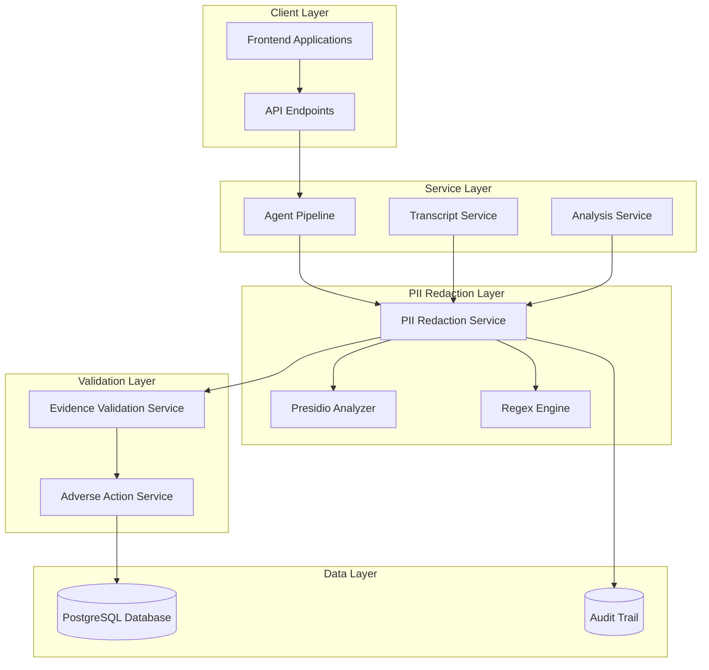
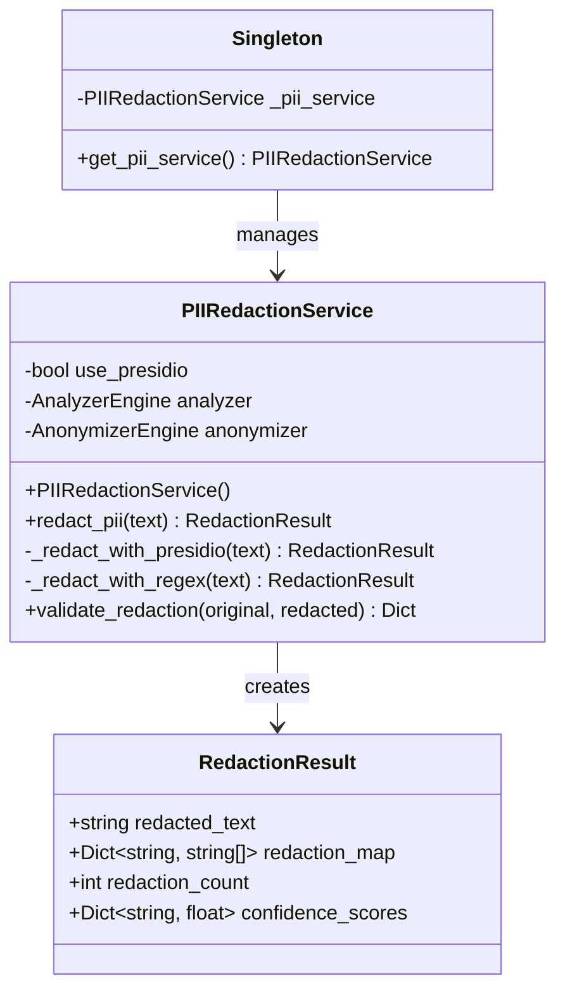
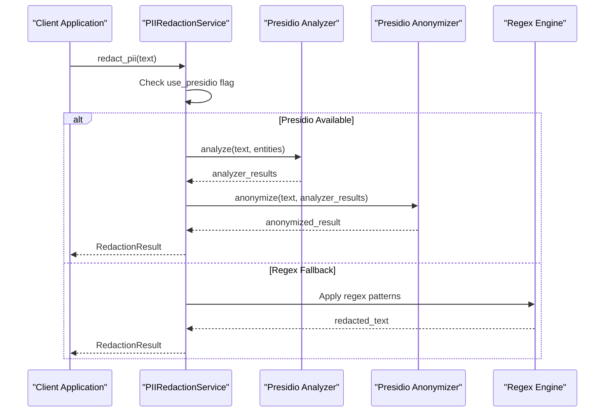
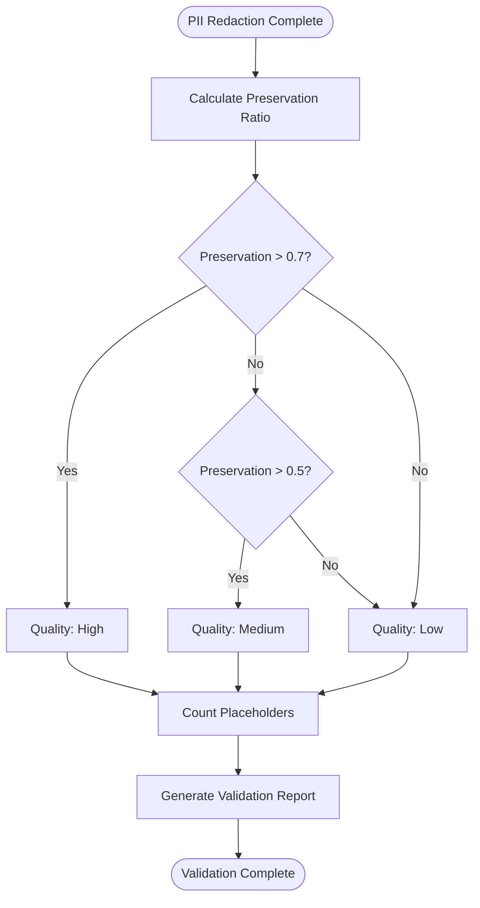
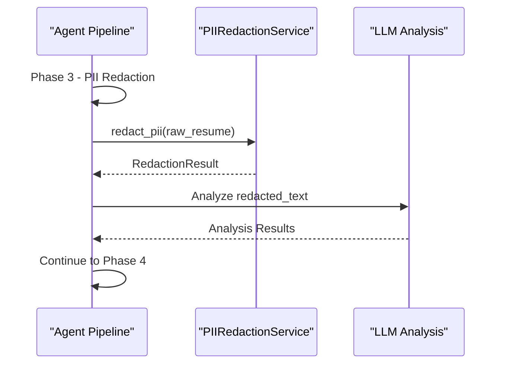
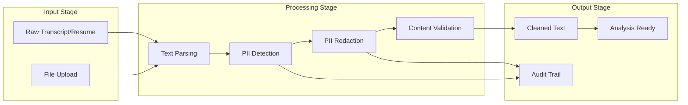
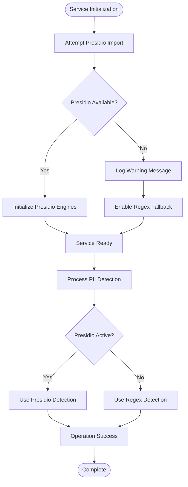

# PII Redaction Service

<cite>
**Referenced Files in This Document**
- [pii_redaction_service.py](file://app/backend/services/pii_redaction_service.py)
- [agent_pipeline.py](file://app/backend/services/agent_pipeline.py)
- [transcript_service.py](file://app/backend/services/transcript_service.py)
- [adverse_action_service.py](file://app/backend/services/adverse_action_service.py)
- [calibration_service.py](file://app/backend/services/calibration_service.py)
- [IMPLEMENTATION_SUMMARY.md](file://IMPLEMENTATION_SUMMARY.md)
- [README.md](file://README.md)
- [requirements.txt](file://app/backend/requirements.txt)
</cite>

## Table of Contents
1. [Introduction](#introduction)
2. [System Architecture](#system-architecture)
3. [Core Components](#core-components)
4. [Implementation Details](#implementation-details)
5. [Integration Points](#integration-points)
6. [Data Flow Analysis](#data-flow-analysis)
7. [Error Handling and Fallbacks](#error-handling-and-fallbacks)
8. [Performance Considerations](#performance-considerations)
9. [Security and Compliance](#security-and-compliance)
10. [Troubleshooting Guide](#troubleshooting-guide)
11. [Conclusion](#conclusion)

## Introduction

The PII Redaction Service is a critical component of the Resume AI by ThetaLogics platform designed to eliminate bias in AI-powered candidate evaluation by removing personally identifiable information (PII) from transcripts and resumes before analysis. This service ensures compliance with data privacy regulations while maintaining the contextual information necessary for accurate evaluation.

The service operates on the principle that AI bias often stems from demographic information, names, locations, and other identifiers present in candidate materials. By systematically redacting this information, the platform achieves fairer, more objective assessments that focus purely on qualifications and competencies.

## System Architecture

The PII Redaction Service is built as a modular, enterprise-grade component that integrates seamlessly with the broader Resume AI platform. The system follows a layered architecture pattern with clear separation of concerns and robust fallback mechanisms.



**Diagram sources**
- [pii_redaction_service.py:26-233](file://app/backend/services/pii_redaction_service.py#L26-L233)
- [agent_pipeline.py:532-541](file://app/backend/services/agent_pipeline.py#L532-L541)
- [transcript_service.py:15](file://app/backend/services/transcript_service.py#L15)

## Core Components

### PIIRedactionService Class

The central component of the PII Redaction Service is the `PIIRedactionService` class, which provides enterprise-grade PII detection and anonymization capabilities. This service implements a dual-layer approach using both Presidio for advanced detection and regex patterns as a fallback mechanism.



**Diagram sources**
- [pii_redaction_service.py:26-233](file://app/backend/services/pii_redaction_service.py#L26-L233)

### RedactionResult Data Structure

The `RedactionResult` dataclass encapsulates the results of PII redaction operations, providing comprehensive audit trail information essential for compliance and quality assurance.

Key attributes include:
- `redacted_text`: The anonymized text after PII removal
- `redaction_map`: Mapping of entity types to original values found
- `redaction_count`: Total number of PII entities identified
- `confidence_scores`: Average confidence scores per entity type

**Section sources**
- [pii_redaction_service.py:17-24](file://app/backend/services/pii_redaction_service.py#L17-L24)
- [pii_redaction_service.py:53-67](file://app/backend/services/pii_redaction_service.py#L53-L67)

## Implementation Details

### Presidio Integration

The service leverages Presidio (Presidio Analyzer and Presidio Anonymizer) for enterprise-grade PII detection. This integration provides sophisticated pattern recognition capable of identifying complex PII structures including:

- **PERSON**: Names and titles (Mr., Mrs., Dr., Prof.)
- **EMAIL_ADDRESS**: Email addresses in various formats
- **PHONE_NUMBER**: Phone numbers with international and domestic formats
- **LOCATION**: Geographic locations and addresses
- **ORG**: Organizations, companies, and institutions
- **URL**: Web addresses and links
- **US_SSN**: Social Security Number patterns
- **CREDIT_CARD**: Credit card number patterns



**Diagram sources**
- [pii_redaction_service.py:68-135](file://app/backend/services/pii_redaction_service.py#L68-L135)

### Regex Fallback Mechanism

When Presidio dependencies are unavailable, the service automatically falls back to a comprehensive regex-based approach. This ensures system reliability and maintains core functionality even in constrained environments.

The regex engine implements targeted patterns for specific PII categories:

- **Email Detection**: Comprehensive pattern matching for various email formats
- **Phone Number Recognition**: Support for international and domestic formats
- **URL Extraction**: HTTP and HTTPS protocol detection
- **Name Pattern Matching**: Titles followed by capitalized names
- **Institution Detection**: University and educational institution patterns
- **Company Pattern Recognition**: Business entity identification

**Section sources**
- [pii_redaction_service.py:136-196](file://app/backend/services/pii_redaction_service.py#L136-L196)

### Validation and Quality Assurance

The service includes comprehensive validation mechanisms to ensure redaction effectiveness while preserving analytical value:



**Diagram sources**
- [pii_redaction_service.py:198-221](file://app/backend/services/pii_redaction_service.py#L198-L221)

**Section sources**
- [pii_redaction_service.py:198-221](file://app/backend/services/pii_redaction_service.py#L198-L221)

## Integration Points

### Agent Pipeline Integration

The PII Redaction Service is seamlessly integrated into the agent pipeline, serving as a crucial guardrail in the multi-stage analysis process. The integration occurs during Phase 3 of the pipeline, ensuring all subsequent analysis operates on PII-free content.



**Diagram sources**
- [agent_pipeline.py:532-541](file://app/backend/services/agent_pipeline.py#L532-L541)

### Transcript Service Integration

The transcript service incorporates PII redaction as a default enhancement, providing comprehensive bias elimination for video interview analysis. This integration ensures all transcript-based evaluations operate on anonymized content.

**Section sources**
- [transcript_service.py:15](file://app/backend/services/transcript_service.py#L15)
- [transcript_service.py:268-291](file://app/backend/services/transcript_service.py#L268-L291)

### Evidence Validation Integration

The PII redaction service works in conjunction with evidence validation to create a comprehensive bias mitigation system. Both services contribute to the final analysis report structure, providing transparency about the redaction process and validation outcomes.

**Section sources**
- [IMPLEMENTATION_SUMMARY.md:66-100](file://IMPLEMENTATION_SUMMARY.md#L66-L100)

## Data Flow Analysis

### End-to-End Processing Pipeline

The PII redaction service participates in a multi-stage data processing pipeline that transforms raw candidate materials into bias-free, analyzable content:



### Entity Type Classification

The service categorizes detected PII into specific entity types, each requiring appropriate anonymization strategies:

| Entity Type | Detection Patterns | Anonymization Strategy |
|-------------|-------------------|----------------------|
| PERSON | Names, titles, honorifics | Generic placeholder (CANDIDATE) |
| EMAIL_ADDRESS | Email patterns | Standardized placeholder (EMAIL) |
| PHONE_NUMBER | Various formats | Standardized placeholder (PHONE) |
| LOCATION | Geographic references | Standardized placeholder (LOCATION) |
| ORG | Companies, institutions | Standardized placeholder (ORGANIZATION) |
| URL | Web addresses | Standardized placeholder (URL) |
| US_SSN | Social Security patterns | Standardized placeholder (SSN) |
| CREDIT_CARD | Card number patterns | Standardized placeholder (CARD) |

**Section sources**
- [pii_redaction_service.py:72-85](file://app/backend/services/pii_redaction_service.py#L72-L85)

## Error Handling and Fallbacks

### Graceful Degradation

The PII redaction service implements comprehensive error handling to ensure system stability even when advanced features are unavailable. The fallback mechanism operates through multiple layers of redundancy:



**Diagram sources**
- [pii_redaction_service.py:34-51](file://app/backend/services/pii_redaction_service.py#L34-L51)

### Logging and Monitoring

The service implements comprehensive logging for operational visibility and troubleshooting:

- **Initialization Logging**: Successful Presidio setup confirmation
- **Fallback Notifications**: Warning messages when falling back to regex
- **Error Capture**: Exception handling with detailed error logging
- **Performance Metrics**: Timing and success rate monitoring

**Section sources**
- [pii_redaction_service.py:46-51](file://app/backend/services/pii_redaction_service.py#L46-L51)

## Performance Considerations

### Processing Latency

The PII redaction service introduces minimal latency overhead while providing substantial bias elimination benefits:

- **Presidio Processing**: Typically completes within 2-3 seconds
- **Regex Processing**: Usually finishes in under 1 second
- **Memory Usage**: Minimal footprint suitable for concurrent processing
- **Scalability**: Thread-safe implementation supports multiple concurrent requests

### Optimization Strategies

The service employs several optimization techniques:

- **Lazy Loading**: Presidio engines loaded only when needed
- **Singleton Pattern**: Single service instance prevents redundant initialization
- **Efficient Regex**: Optimized patterns minimize computational overhead
- **Early Termination**: Quick failure modes prevent unnecessary processing

## Security and Compliance

### Data Privacy Protection

The PII Redaction Service ensures compliance with major data privacy regulations:

- **GDPR Compliance**: Complete removal of personal identifiers
- **EEOC Guidelines**: Elimination of protected characteristic bias
- **HIPAA Considerations**: Safe handling of healthcare-related information
- **CCPA Alignment**: Right to privacy and data removal capabilities

### Audit Trail Requirements

The service maintains comprehensive audit trails for compliance purposes:

- **Entity Tracking**: Detailed mapping of all redacted items
- **Confidence Scoring**: Detection reliability metrics
- **Processing Logs**: Complete transaction history
- **Validation Reports**: Content preservation measurements

**Section sources**
- [IMPLEMENTATION_SUMMARY.md:306-325](file://IMPLEMENTATION_SUMMARY.md#L306-L325)

## Troubleshooting Guide

### Common Issues and Solutions

#### Presidio Not Available
**Symptoms**: Warning messages about Presidio unavailability, automatic regex fallback
**Solution**: Install required dependencies and restart the service

#### Performance Degradation
**Symptoms**: Slow response times during PII redaction
**Solution**: Verify system resources and consider regex optimization

#### Incomplete Redaction
**Symptoms**: Some PII patterns remain in processed text
**Solution**: Review regex patterns and update entity detection rules

### Diagnostic Commands

```bash
# Check service health
curl http://localhost:8000/api/health/pii

# Monitor processing logs
docker logs resume-screener-backend --tail 100 -f

# Test PII detection
python -c "
from app.backend.services.pii_redaction_service import get_pii_service
service = get_pii_service()
result = service.redact_pii('Test text with john.doe@email.com')
print('Redacted:', result.redacted_text)
print('Entities found:', result.redaction_count)
"
```

**Section sources**
- [IMPLEMENTATION_SUMMARY.md:330-356](file://IMPLEMENTATION_SUMMARY.md#L330-L356)

## Conclusion

The PII Redaction Service represents a cornerstone of the Resume AI by ThetaLogics platform's commitment to fair, unbiased candidate evaluation. Through its enterprise-grade implementation combining Presidio detection with comprehensive regex fallback, the service ensures that AI-powered recruitment remains objective and legally defensible.

The service's integration across the platform's analysis pipeline demonstrates its critical role in maintaining data privacy while preserving analytical value. The comprehensive validation mechanisms, audit trails, and fallback strategies provide the reliability and transparency essential for enterprise deployment.

As organizations increasingly rely on AI for talent acquisition, services like this PII Redaction Service become not just beneficial but necessary for maintaining fairness, compliance, and legal defensibility in the hiring process. The implementation showcases best practices in secure, scalable AI systems that prioritize both effectiveness and ethical responsibility.