# Parser Service

<cite>
**Referenced Files in This Document**
- [parser_service.py](file://app/backend/services/parser_service.py)
- [llm_contact_extractor.py](file://app/backend/services/llm_contact_extractor.py)
- [llm_service.py](file://app/backend/services/llm_service.py)
- [test_parser_overhaul.py](file://app/backend/tests/test_parser_overhaul.py)
- [analyze.py](file://app/backend/routes/analyze.py)
- [candidates.py](file://app/backend/routes/candidates.py)
- [gap_detector.py](file://app/backend/services/gap_detector.py)
- [hybrid_pipeline.py](file://app/backend/services/hybrid_pipeline.py)
- [schemas.py](file://app/backend/models/schemas.py)
- [db_models.py](file://app/backend/models/db_models.py)
- [requirements.txt](file://requirements.txt)
- [main.py](file://app/backend/main.py)
- [metrics.py](file://app/backend/services/metrics.py)
- [skill_matcher.py](file://app/backend/services/skill_matcher.py)
</cite>

## Update Summary
**Changes Made**
- **Comprehensive Resume Parser Overhaul**: Complete rewrite with new dateparser integration for sophisticated date extraction
- **New Field Extraction**: Added certifications, languages, and professional summary extraction capabilities
- **Enhanced Skills Normalization**: Implemented comprehensive SKILL_ALIASES system for skill name standardization
- **Sophisticated Work Experience Parsing**: Advanced title/company parsing with deputed pattern support and improved delimiter handling
- **Expanded Education Extraction**: Enhanced field-of-study detection and institution recognition
- **Improved Error Handling**: Comprehensive logging, structured error reporting, and retry mechanisms
- **Performance Monitoring**: Prometheus metrics collection and observability features
- **LLM Integration**: Enhanced contact extraction with intelligent merging strategy

## Table of Contents
1. [Introduction](#introduction)
2. [Project Structure](#project-structure)
3. [Core Components](#core-components)
4. [Architecture Overview](#architecture-overview)
5. [Detailed Component Analysis](#detailed-component-analysis)
6. [Enhanced Error Handling and Observability](#enhanced-error-handling-and-observability)
7. [Performance Monitoring and Metrics](#performance-monitoring-and-metrics)
8. [Dependency Analysis](#dependency-analysis)
9. [Performance Considerations](#performance-considerations)
10. [Troubleshooting Guide](#troubleshooting-guide)
11. [Conclusion](#conclusion)
12. [Appendices](#appendices)

## Introduction
This document describes the comprehensive resume parsing service that extracts structured data from PDF and DOCX formats. The service features a complete overhaul with new dateparser integration, certifications extraction, languages extraction, professional summary extraction, enhanced skills normalization, and sophisticated work experience parsing capabilities. It explains the text processing pipeline, including OCR capabilities, formatting preservation, and data normalization. It also covers supported file formats, parsing accuracy characteristics, fallback strategies for malformed documents, examples of extracted data schemas, parsing configuration options, integration patterns with the analysis engine, and enhanced error handling with comprehensive logging and observability features.

**Updated**: The service now features a comprehensive resume parser overhaul with sophisticated date extraction using dateparser, new field extraction capabilities for certifications, languages, and professional summaries, enhanced skills normalization through SKILL_ALIASES, and advanced work experience parsing with improved title/company separation and deputed pattern handling.

## Project Structure
The parser service is implemented as a dedicated module and integrated into the broader analysis pipeline. Key integration points include:
- Routes that accept uploads and orchestrate parsing and analysis
- Services that implement parsing, gap detection, and hybrid scoring
- Models that define persisted schemas and database entities
- Tests that validate parsing behavior and edge cases
- Metrics collection for performance monitoring
- Structured logging for observability

```mermaid
graph TB
subgraph "Routes"
A["/analyze (POST)"]
B["/analyze/stream (SSE)"]
C["/api/candidates/{id}/analyze-jd (POST)"]
end
subgraph "Services"
S1["parser_service.parse_resume"]
S2["gap_detector.analyze_gaps"]
S3["hybrid_pipeline.run_hybrid_pipeline"]
S4["llm_contact_extractor.extract_contact_with_llm"]
end
subgraph "Models"
M1["Candidate (parsed fields)"]
M2["ScreeningResult (analysis_result)"]
M3["JdCache (JD parse cache)"]
end
subgraph "Monitoring"
METRICS["Metrics Collection"]
LOGGING["Structured Logging"]
END
A --> S1
A --> S2
A --> S3
B --> S1
B --> S2
B --> S3
C --> S3
S1 --> M1
S2 --> M1
S3 --> M2
S3 --> M3
S1 --> METRICS
S1 --> LOGGING
S2 --> LOGGING
S3 --> LOGGING
S4 --> LOGGING
```

**Diagram sources**
- [analyze.py:449-649](file://app/backend/routes/analyze.py#L449-L649)
- [candidates.py:192-303](file://app/backend/routes/candidates.py#L192-L303)
- [parser_service.py:1935-1942](file://app/backend/services/parser_service.py#L1935-L1942)
- [gap_detector.py:217-219](file://app/backend/services/gap_detector.py#L217-L219)
- [hybrid_pipeline.py:1-12](file://app/backend/services/hybrid_pipeline.py#L1-L12)
- [db_models.py:97-147](file://app/backend/models/db_models.py#L97-L147)
- [metrics.py:22-27](file://app/backend/services/metrics.py#L22-L27)

**Section sources**
- [analyze.py:1-200](file://app/backend/routes/analyze.py#L1-L200)
- [parser_service.py:1-1942](file://app/backend/services/parser_service.py#L1-L1942)
- [gap_detector.py:1-219](file://app/backend/services/gap_detector.py#L1-L219)
- [hybrid_pipeline.py:1-200](file://app/backend/services/hybrid_pipeline.py#L1-L200)
- [db_models.py:1-250](file://app/backend/models/db_models.py#L1-L250)

## Core Components
- **ResumeParser**: Implements extraction and parsing for PDF, DOCX, DOC, RTF, ODT, and TXT; extracts contact info, skills, education, work experience, certifications, languages, and professional summary; normalizes text and enforces scanned-PDF guardrails.
- **Enhanced Date Extraction**: Sophisticated date parsing using dateparser with support for month abbreviations, "till date", "to date", "ongoing", and "continuing" keywords.
- **New Field Extraction**: Comprehensive extraction of certifications, languages with proficiency levels, and professional summaries.
- **Enhanced Skills Normalization**: Advanced skill name standardization using SKILL_ALIASES for consistent skill representation.
- **Sophisticated Work Experience Parsing**: Improved title/company separation with deputed pattern support and enhanced delimiter handling.
- **Expanded Education Extraction**: Enhanced field-of-study detection and institution recognition with support for various degree formats.
- **LLM Contact Extractor**: Async service that uses Ollama/Gemma for accurate contact information extraction with intelligent merging strategy.
- **GapDetector**: Computes employment timeline, total effective years, gaps, overlaps, and short stints from parsed work experience.
- **Hybrid pipeline**: Orchestrates JD parsing, candidate profile assembly, skill matching, education scoring, and LLM narrative generation.
- **Routes**: Expose endpoints for single and streaming analysis, and for re-analysis using stored profiles.
- **Enhanced Error Handling**: Comprehensive logging, structured error reporting, and retry mechanisms for improved reliability.
- **Observability Layer**: Structured logging with request correlation IDs and performance metrics collection.

Key capabilities:
- Text extraction from PDF using PyMuPDF with pdfplumber fallback; DOCX via python-docx; TXT via UTF-8 decoding.
- Heuristic-based parsing for skills, education, work experience with robust fallbacks.
- Name enrichment from email and relaxed heuristics when header parsing fails.
- Stored parser snapshots and deduplication to accelerate re-analysis.
- **Enhanced**: Sophisticated date extraction using dateparser for flexible date formats.
- **Enhanced**: New field extraction for certifications, languages, and professional summaries.
- **Enhanced**: Comprehensive skills normalization through SKILL_ALIASES system.
- **Enhanced**: Advanced work experience parsing with improved title/company separation.
- **Enhanced**: Expanded education extraction with enhanced field-of-study detection.
- **Enhanced**: Tiered name extraction using spaCy NER for improved accuracy.
- **Enhanced**: Comprehensive logging with structured error reporting for better observability.
- **Enhanced**: Performance monitoring with Prometheus metrics collection.
- **Enhanced**: Multi-stage DOCX extraction with zipfile fallback system for corrupted files.
- **Enhanced**: Async LLM contact extraction with intelligent merging strategy.
- **Enhanced**: Sophisticated fallback mechanisms for all resume formats with comprehensive error handling.

**Section sources**
- [parser_service.py:130-1942](file://app/backend/services/parser_service.py#L130-L1942)
- [llm_contact_extractor.py:1-165](file://app/backend/services/llm_contact_extractor.py#L1-L165)
- [gap_detector.py:103-219](file://app/backend/services/gap_detector.py#L103-L219)
- [hybrid_pipeline.py:467-751](file://app/backend/services/hybrid_pipeline.py#L467-L751)
- [analyze.py:449-649](file://app/backend/routes/analyze.py#L449-L649)

## Architecture Overview
The parser service integrates with the analysis pipeline as follows:
- Upload handlers call parse_resume to produce raw text and structured fields.
- Gap analysis computes objective employment metrics.
- Hybrid pipeline composes structured candidate profile, skill matching, and scoring.
- Results are persisted and exposed via endpoints.
- **Enhanced**: All operations are instrumented with logging and metrics collection.
- **Enhanced**: LLM contact extraction provides enhanced accuracy for contact information.
- **Enhanced**: New field extraction capabilities for comprehensive candidate profiling.

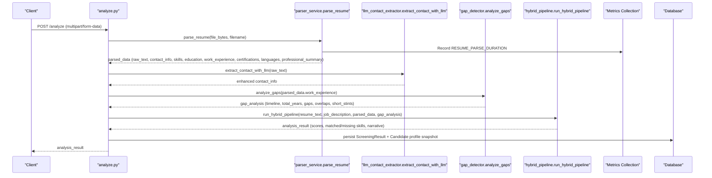

**Diagram sources**
- [analyze.py:449-649](file://app/backend/routes/analyze.py#L449-L649)
- [parser_service.py:1935-1942](file://app/backend/services/parser_service.py#L1935-L1942)
- [llm_contact_extractor.py:23-131](file://app/backend/services/llm_contact_extractor.py#L23-L131)
- [gap_detector.py:217-219](file://app/backend/services/gap_detector.py#L217-L219)
- [hybrid_pipeline.py:1-12](file://app/backend/services/hybrid_pipeline.py#L1-L12)
- [metrics.py:22-27](file://app/backend/services/metrics.py#L22-L27)

## Detailed Component Analysis

### Enhanced ResumeParser
The ResumeParser class performs:
- File-type routing to appropriate extractor
- PDF extraction using PyMuPDF with pdfplumber fallback; scanned-PDF guard
- **Enhanced**: DOCX extraction via comprehensive multi-stage pipeline with headers, textboxes, tables, paragraphs, and XML fallback
- **Enhanced**: DOC extraction via antiword, LibreOffice conversion, and ASCII fallback
- **Enhanced**: RTF extraction via striprtf and regex fallback
- **Enhanced**: ODT extraction via odfpy and XML fallback
- Text normalization using unidecode
- Structured extraction of:
  - Contact info: name, email, phone, LinkedIn
  - Work experience: company, title, start/end dates, description
  - Education: degrees, institutions, years, fields of study
  - Skills: section-based extraction, full-text scanning, and fallback lists
  - **New**: Certifications: professional certifications and licenses
  - **New**: Languages: multilingual capabilities with proficiency levels
  - **New**: Professional summary: career overview and key qualifications

**Enhanced**: Implements comprehensive error handling with structured logging and retry mechanisms.

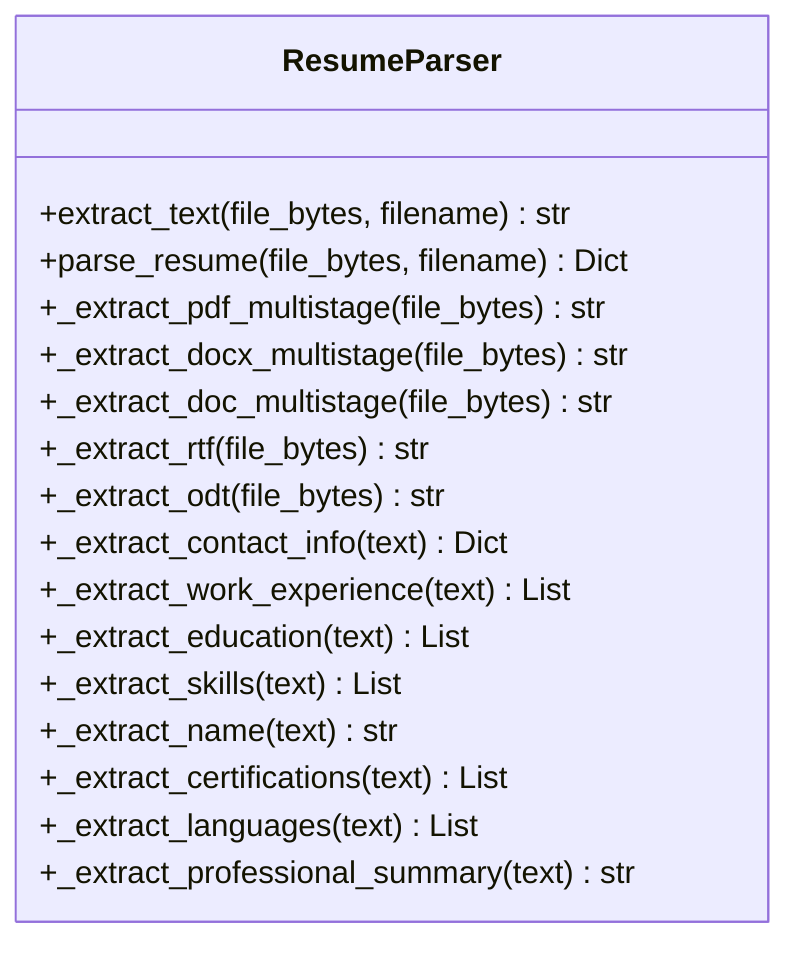

**Diagram sources**
- [parser_service.py:286-1942](file://app/backend/services/parser_service.py#L286-L1942)

**Section sources**
- [parser_service.py:286-326](file://app/backend/services/parser_service.py#L286-L326)
- [parser_service.py:327-825](file://app/backend/services/parser_service.py#L327-L825)
- [parser_service.py:827-839](file://app/backend/services/parser_service.py#L827-L839)
- [parser_service.py:938-1046](file://app/backend/services/parser_service.py#L938-L1046)
- [parser_service.py:1083-1152](file://app/backend/services/parser_service.py#L1083-L1152)
- [parser_service.py:1299-1359](file://app/backend/services/parser_service.py#L1299-L1359)
- [parser_service.py:1361-1395](file://app/backend/services/parser_service.py#L1361-L1395)
- [parser_service.py:1397-1461](file://app/backend/services/parser_service.py#L1397-L1461)
- [parser_service.py:1463-1500](file://app/backend/services/parser_service.py#L1463-L1500)

### Sophisticated Date Extraction with Dateparser Integration
**New Section**: The enhanced date extraction system now features comprehensive date parsing capabilities using dateparser:

- **Month Abbreviation Normalization**: Converts "AUG." to "AUG" for consistent parsing
- **Present Keyword Recognition**: Handles "till date", "to date", "ongoing", "continuing", "current position" as present
- **Flexible Date Range Extraction**: Supports various date formats including MM/YYYY, YYYY/MM, Month YYYY, bare years
- **Year-Only Fallback**: Extracts two-year ranges when only years are provided
- **Dateparser Integration**: Uses dateparser for robust date parsing with configurable settings

**Enhanced**: Implements comprehensive fallback strategies with structured logging for all extraction methods.

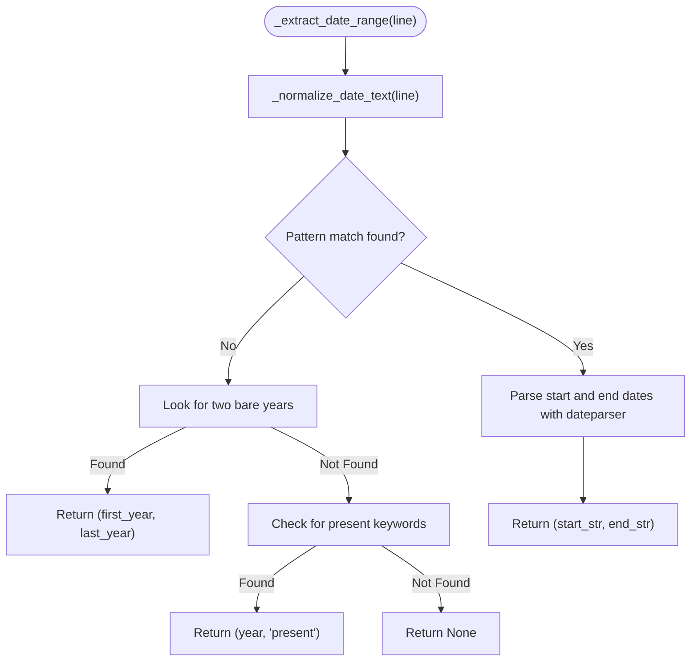

**Diagram sources**
- [parser_service.py:146-174](file://app/backend/services/parser_service.py#L146-L174)
- [parser_service.py:104-108](file://app/backend/services/parser_service.py#L104-L108)

**Section sources**
- [parser_service.py:96-174](file://app/backend/services/parser_service.py#L96-L174)
- [test_parser_overhaul.py:33-142](file://app/backend/tests/test_parser_overhaul.py#L33-L142)

### New Field Extraction Capabilities
**New Section**: The parser now extracts three new comprehensive field categories:

#### Certifications Extraction
- **Section Detection**: Recognizes "CERTIFICATIONS", "CERTIFICATES", "PROFESSIONAL CERTIFICATIONS", "LICENSES AND CERTIFICATIONS", "ACCREDITATIONS"
- **Content Extraction**: Strips bullet points, dashes, and numbering from certification entries
- **Format Support**: Handles both single-line and multi-line certification listings

#### Languages Extraction
- **Section Detection**: Recognizes "LANGUAGES", "LANGUAGE SKILLS", "LANGUAGE PROFICIENCY", "LINGUISTIC SKILLS"
- **Proficiency Detection**: Identifies proficiency levels: native, fluent, proficient, intermediate, advanced, basic, beginner, elementary, conversational, professional, working proficiency, mother tongue, bilingual
- **Format Support**: Handles comma-separated and parenthesized proficiency notation

#### Professional Summary Extraction
- **Section Detection**: Recognizes "PROFESSIONAL SUMMARY", "SUMMARY", "CAREER SUMMARY", "EXECUTIVE SUMMARY", "OBJECTIVE", "CAREER OBJECTIVE", "PROFILE", "PROFESSIONAL PROFILE", "ABOUT ME", "OVERVIEW"
- **Content Preservation**: Maintains formatting and structure within summary sections
- **Truncation**: Limits summary to 500 characters for optimal processing

**Enhanced**: Implements comprehensive fallback strategies with structured logging for all extraction methods.

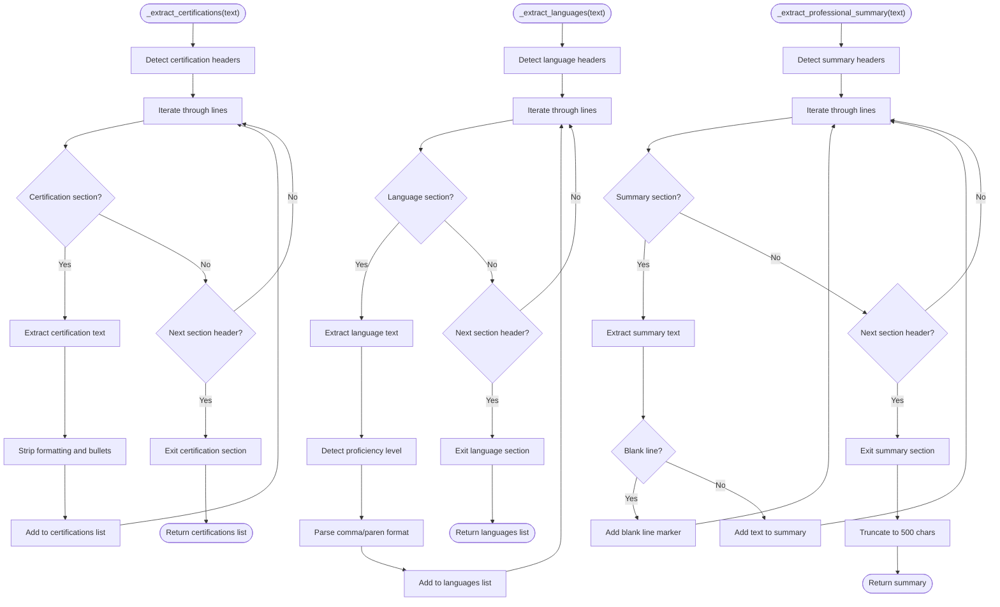

**Diagram sources**
- [parser_service.py:1361-1395](file://app/backend/services/parser_service.py#L1361-L1395)
- [parser_service.py:1397-1461](file://app/backend/services/parser_service.py#L1397-L1461)
- [parser_service.py:1463-1500](file://app/backend/services/parser_service.py#L1463-L1500)

**Section sources**
- [parser_service.py:1361-1500](file://app/backend/services/parser_service.py#L1361-L1500)
- [test_parser_overhaul.py:238-323](file://app/backend/tests/test_parser_overhaul.py#L238-L323)

### Enhanced Skills Normalization with SKILL_ALIASES
**New Section**: The skills extraction system now features comprehensive normalization through SKILL_ALIASES:

- **Alias Resolution**: Maps variant spellings and abbreviations to canonical skill names
- **Case Preservation**: Preserves original casing for canonical forms (e.g., "Python" stays "Python")
- **Punctuation Handling**: Normalizes punctuation and spacing differences
- **Duplicate Elimination**: Automatically removes duplicate skills after normalization
- **Special Cases**: Handles special cases like "c++" and "c#" that should not be normalized

**Enhanced**: Implements comprehensive fallback strategy with structured logging for all extraction failures.

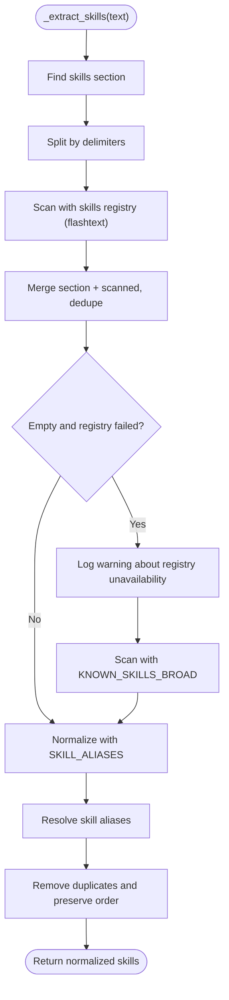

**Diagram sources**
- [parser_service.py:1083-1152](file://app/backend/services/parser_service.py#L1083-L1152)
- [skill_matcher.py:598-650](file://app/backend/services/skill_matcher.py#L598-L650)

**Section sources**
- [parser_service.py:1083-1152](file://app/backend/services/parser_service.py#L1083-L1152)
- [skill_matcher.py:295-735](file://app/backend/services/skill_matcher.py#L295-L735)
- [test_parser_overhaul.py:329-369](file://app/backend/tests/test_parser_overhaul.py#L329-L369)

### Sophisticated Work Experience Parsing
**Updated Section**: The work experience extraction now features advanced parsing capabilities:

- **Enhanced Title/Company Separation**: Improved delimiter handling including pipes, tabs, and company keywords
- **Deputed Pattern Support**: Handles "deputed @ company" and "deputed at company" patterns
- **Keyword Disambiguation**: Distinguishes between titles and companies using keyword patterns
- **Dateparser Integration**: Uses sophisticated date extraction for flexible date format support
- **Description Accumulation**: Enhanced description parsing with improved line detection

**Enhanced**: Implements comprehensive fallback strategies with structured logging for all extraction methods.

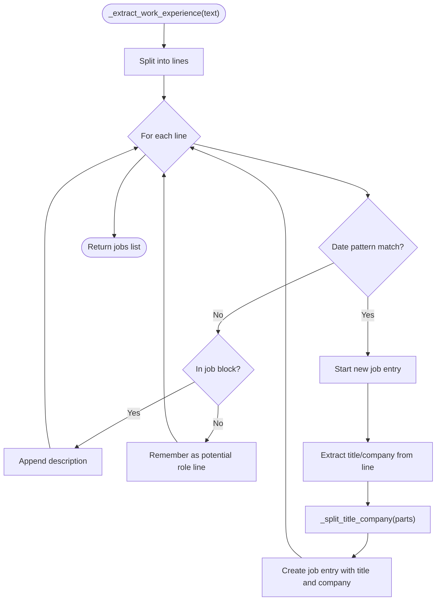

**Diagram sources**
- [parser_service.py:938-1046](file://app/backend/services/parser_service.py#L938-L1046)
- [parser_service.py:860-936](file://app/backend/services/parser_service.py#L860-L936)

**Section sources**
- [parser_service.py:938-1046](file://app/backend/services/parser_service.py#L938-L1046)
- [parser_service.py:860-936](file://app/backend/services/parser_service.py#L860-L936)
- [test_parser_overhaul.py:375-414](file://app/backend/tests/test_parser_overhaul.py#L375-L414)

### Enhanced Education Extraction
**Updated Section**: The education extraction now features expanded capabilities:

- **Enhanced Field-of-Study Detection**: Improved extraction of field names from degree descriptions
- **Institution Recognition**: Better identification of universities and educational institutions
- **Multiple Degree Formats**: Support for various degree naming conventions and abbreviations
- **Year Extraction**: Enhanced year detection from education entries
- **Known Institution Support**: Recognition of common abbreviations like MIT, IIT, IIM

**Enhanced**: Implements comprehensive fallback strategies with structured logging for all extraction methods.


**Diagram sources**
- [parser_service.py:1299-1359](file://app/backend/services/parser_service.py#L1299-L1359)
- [parser_service.py:1194-1297](file://app/backend/services/parser_service.py#L1194-L1297)

**Section sources**
- [parser_service.py:1299-1359](file://app/backend/services/parser_service.py#L1299-L1359)
- [parser_service.py:1194-1297](file://app/backend/services/parser_service.py#L1194-L1297)
- [test_parser_overhaul.py:148-232](file://app/backend/tests/test_parser_overhaul.py#L148-L232)

### LLM Contact Extraction Integration
**New Section**: The parser now integrates with a dedicated LLM contact extraction service for enhanced accuracy:

- **Async Processing**: Uses async HTTP client for non-blocking LLM calls
- **Intelligent Merging**: Combines LLM results with regex extraction using strategic precedence
- **Robust Error Handling**: Graceful degradation when LLM is unavailable
- **Authentication**: Supports both local Ollama and Ollama Cloud with API key authentication

**Enhanced**: Implements comprehensive fallback strategies with structured logging for all extraction failures.


**Diagram sources**
- [parser_service.py:1798-1860](file://app/backend/services/parser_service.py#L1798-L1860)
- [llm_contact_extractor.py:23-165](file://app/backend/services/llm_contact_extractor.py#L23-L165)

**Section sources**
- [parser_service.py:1798-1860](file://app/backend/services/parser_service.py#L1798-L1860)
- [llm_contact_extractor.py:23-165](file://app/backend/services/llm_contact_extractor.py#L23-L165)

### Enhanced Name Extraction with Expanded Skip Phrases Dictionary
**Updated Section**: The name extraction algorithm now includes sophisticated filtering mechanisms to prevent false positive name detection:

- **SKIP_WORDS Collection**: Comprehensive set of 25+ words that indicate non-name content (resume, curriculum, vitae, cv, profile, summary, objective, contact, address, details, information, page, updated, date, experience, education, skills, employment, work, projects, references, certifications, awards, publications, languages, interests, hobbies, activities, achievements)
- **Expanded skip_phrases Dictionary**: Contains 30+ professional titles and job-related phrases that are definitively not names, including newly added section headers like 'key expertise', 'key skills', 'core competencies', 'top skills', 'technical experience', 'embedded experience', 'professional experience', 'work experience', 'career highlights', 'summary', 'objective', 'personal details', 'contact information', and 'contact details'
- **Multi-stage Filtering**: Applies skip_words, skip_phrases, and job title pattern checks before accepting potential names

**Enhanced**: Implements comprehensive filtering to distinguish between actual names and contact information or job titles.

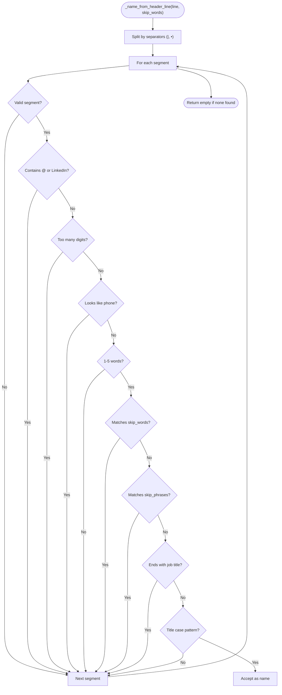

**Diagram sources**
- [parser_service.py:1530-1578](file://app/backend/services/parser_service.py#L1530-L1578)

**Section sources**
- [parser_service.py:1530-1578](file://app/backend/services/parser_service.py#L1530-L1578)

### Enhanced Phone Number Detection
**Updated Section**: The phone number extraction algorithm now uses a sophisticated multi-pattern approach with validation to prevent false positives:

- **Multi-pattern Regex**: Three distinct patterns for different phone number formats:
  - International format: +1-555-123-4567, +91 98765 43210
  - Parentheses format: (555) 123-4567, (555)123-4567
  - Standard format: 555-123-4567, 555.123.4567, 555 123 4567
- **Digit Validation**: Ensures phone numbers contain at least 7 digits
- **Year Validation**: Prevents matching 4-digit years (1900-2099) as phone numbers
- **Pattern Matching**: Uses specific regex patterns to avoid matching dates or other numeric sequences

**Enhanced**: Implements comprehensive validation to distinguish between actual phone numbers and other numeric content.


**Diagram sources**
- [parser_service.py:1595-1614](file://app/backend/services/parser_service.py#L1595-L1614)

**Section sources**
- [parser_service.py:1595-1614](file://app/backend/services/parser_service.py#L1595-L1614)

### Text Extraction and Normalization
- PDF: PyMuPDF primary; pdfplumber fallback; scanned-PDF guard raises actionable error if text length below threshold.
- **Enhanced**: DOCX: Comprehensive multi-stage extraction pipeline with headers, textboxes, tables, paragraphs, and XML fallback for corrupted files.
- **Enhanced**: DOC: Multi-stage extraction with antiword, LibreOffice conversion, and ASCII fallback.
- **Enhanced**: RTF: Two-stage extraction with striprtf and regex fallback.
- **Enhanced**: ODT: Two-stage extraction with odfpy and ZIP/XML fallback.
- TXT: UTF-8 decoding with fallback encodings.
- Normalization: Unidecode applied to remove accents and diacritics.

**Enhanced**: Implements comprehensive fallback strategies with structured logging for all extraction methods.


**Diagram sources**
- [parser_service.py:308-326](file://app/backend/services/parser_service.py#L308-L326)
- [parser_service.py:327-825](file://app/backend/services/parser_service.py#L327-L825)
- [parser_service.py:827-839](file://app/backend/services/parser_service.py#L827-L839)
- [parser_service.py:238-240](file://app/backend/services/parser_service.py#L238-L240)

**Section sources**
- [parser_service.py:308-326](file://app/backend/services/parser_service.py#L308-L326)
- [parser_service.py:327-825](file://app/backend/services/parser_service.py#L327-L825)
- [parser_service.py:827-839](file://app/backend/services/parser_service.py#L827-L839)
- [parser_service.py:238-240](file://app/backend/services/parser_service.py#L238-L240)

### Contact Information Extraction
- Name: Header-based heuristic with pipe/separator splitting; relaxed fallback scans first lines for title-case names.
- Email/Phone/LinkedIn: Regex-based extraction; LinkedIn pattern supports common URL forms.
- **Enhanced**: LLM-based extraction using Ollama/Gemma for international names, creative layouts, and edge cases.
- **Enhanced**: **Expanded skip phrases filtering**: Professional titles and job-related phrases excluded from name extraction.
- **Enhanced**: **Multi-pattern phone validation**: Enhanced phone number detection with digit and year validation.

**Enhanced**: Implements tiered name extraction with spaCy NER for improved accuracy.

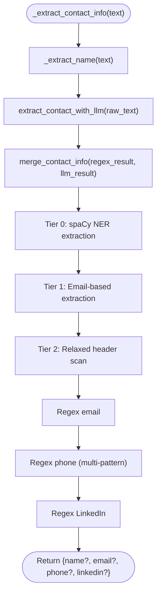

**Diagram sources**
- [parser_service.py:1580-1620](file://app/backend/services/parser_service.py#L1580-L1620)
- [parser_service.py:1798-1860](file://app/backend/services/parser_service.py#L1798-L1860)
- [llm_contact_extractor.py:23-165](file://app/backend/services/llm_contact_extractor.py#L23-L165)

**Section sources**
- [parser_service.py:1580-1620](file://app/backend/services/parser_service.py#L1580-L1620)
- [parser_service.py:1798-1860](file://app/backend/services/parser_service.py#L1798-L1860)
- [llm_contact_extractor.py:23-165](file://app/backend/services/llm_contact_extractor.py#L23-L165)

### Work Experience Extraction
- Date pattern matching supports various formats and "present/current" indicators.
- Company/title parsing via separators ("|", ",", " at ") or preceding lines.
- Description accumulation for multi-line entries.

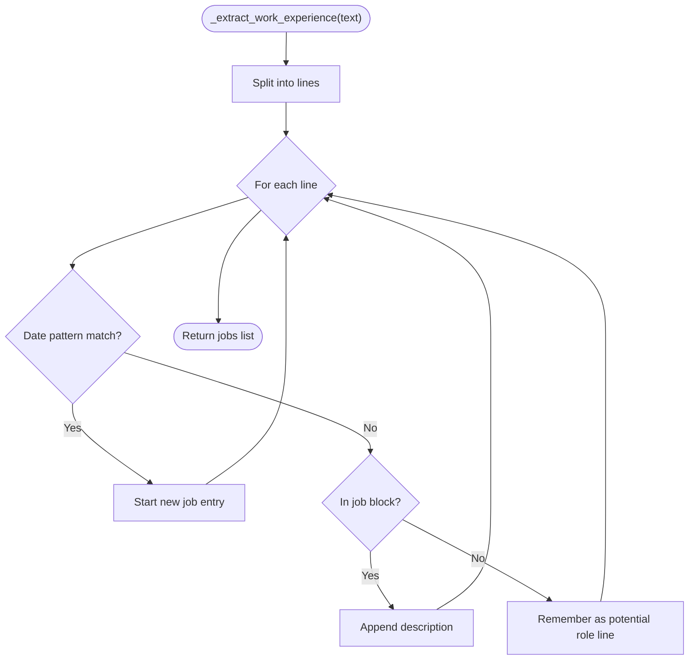

**Diagram sources**
- [parser_service.py:938-1046](file://app/backend/services/parser_service.py#L938-L1046)

**Section sources**
- [parser_service.py:938-1046](file://app/backend/services/parser_service.py#L938-L1046)

### Skills Extraction
- Section-based extraction using multiple skill headers.
- Full-text scanning using a keyword processor backed by a dynamic skills registry.
- Fallback to broad skill list when registry unavailable.

**Enhanced**: Implements comprehensive fallback strategy with structured logging for all extraction failures.

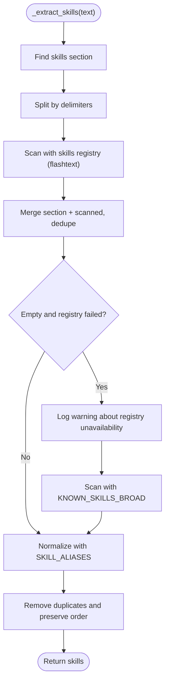

**Diagram sources**
- [parser_service.py:1083-1152](file://app/backend/services/parser_service.py#L1083-L1152)
- [hybrid_pipeline.py:139-200](file://app/backend/services/hybrid_pipeline.py#L139-L200)

**Section sources**
- [parser_service.py:1083-1152](file://app/backend/services/parser_service.py#L1083-L1152)
- [hybrid_pipeline.py:139-200](file://app/backend/services/hybrid_pipeline.py#L139-L200)

### Education Extraction
- Section-based extraction using education headers.
- Degree pattern matching and optional university/year extraction.

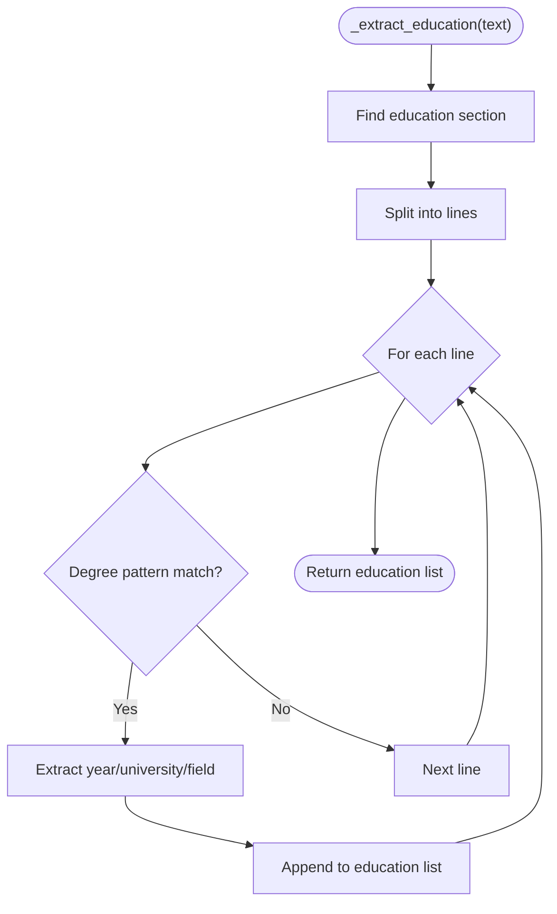

**Diagram sources**
- [parser_service.py:1299-1359](file://app/backend/services/parser_service.py#L1299-L1359)

**Section sources**
- [parser_service.py:1299-1359](file://app/backend/services/parser_service.py#L1299-L1359)

### Gap Detection
- Converts dates to YYYY-MM, merges overlapping intervals, computes total effective years.
- Builds employment timeline with gap metadata and severity thresholds.


**Diagram sources**
- [gap_detector.py:103-219](file://app/backend/services/gap_detector.py#L103-L219)

**Section sources**
- [gap_detector.py:103-219](file://app/backend/services/gap_detector.py#L103-L219)

### Integration Patterns
- Single-shot analysis: POST /analyze parses resume, computes gaps, runs hybrid pipeline, persists results.
- Streaming analysis: POST /analyze/stream returns events as they complete.
- Re-analysis: POST /api/candidates/{id}/analyze-jd uses stored parser snapshot and denormalized fields.

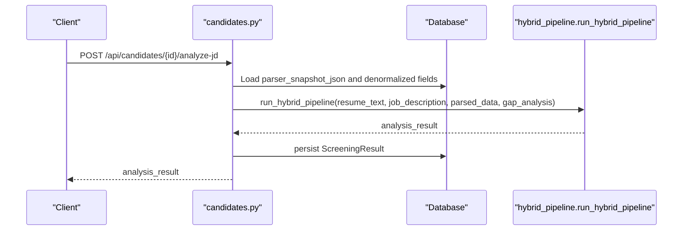

**Diagram sources**
- [candidates.py:192-303](file://app/backend/routes/candidates.py#L192-L303)
- [hybrid_pipeline.py:1-12](file://app/backend/services/hybrid_pipeline.py#L1-L12)

**Section sources**
- [analyze.py:449-649](file://app/backend/routes/analyze.py#L449-L649)
- [candidates.py:192-303](file://app/backend/routes/candidates.py#L192-L303)

## Enhanced Error Handling and Observability

### Structured Logging Implementation
The parser service implements comprehensive logging with structured error reporting:

- **Production JSON Logging**: Structured JSON format for production environments
- **Development Console Logging**: Human-readable format with timestamps and function names
- **Request Correlation**: Unique correlation IDs propagated through request lifecycle
- **Comprehensive Error Logging**: Detailed warnings for all fallback scenarios

### Tiered Name Extraction Strategy
**Enhanced**: Implements a four-tier name extraction approach for improved accuracy:

1. **Tier 0 (spaCy NER)**: Uses Named Entity Recognition for highest accuracy
2. **Tier 1 (LLM Contact Extraction)**: Async LLM processing for international names and edge cases
3. **Tier 2 (Email-based)**: Extracts name from email address when NER unavailable
4. **Tier 3 (Relaxed header scan)**: Fallback heuristic-based extraction

### Retry Mechanisms and Fallback Strategies
**Enhanced**: Comprehensive fallback strategies for all extraction methods:

- **PDF Extraction**: PyMuPDF primary with pdfplumber fallback
- **DOCX Extraction**: Multi-stage pipeline with XML fallback for corrupted files
- **DOC Extraction**: antiword, LibreOffice conversion, and ASCII fallback
- **RTF Extraction**: striprtf library with regex fallback
- **ODT Extraction**: odfpy with ZIP/XML fallback
- **Text Extraction**: Multiple encoding attempts with structured error logging
- **Skills Registry**: Dynamic skills registry with broad fallback list
- **NER Model Loading**: Graceful degradation when spaCy unavailable
- **LLM Contact Extraction**: Async processing with timeout handling

### Request Correlation and Context Management
**Enhanced**: Implements request correlation for better observability:

- **Correlation ID Middleware**: Generates unique request IDs per request
- **Context Variables**: Propagates correlation IDs through async operations
- **Structured Log Messages**: Includes correlation IDs and function names

### Enhanced Name Extraction Filtering
**Updated Section**: Implements sophisticated filtering mechanisms to prevent false positive name detection:

- **SKIP_WORDS Collection**: Comprehensive set of 25+ words indicating non-name content
- **Expanded skip_phrases Dictionary**: 30+ professional titles and job-related phrases excluded from name extraction, including newly added section headers like 'key expertise', 'key skills', 'core competencies', 'top skills', 'technical experience', 'embedded experience', 'professional experience', 'work experience', 'career highlights', 'summary', 'objective', 'personal details', 'contact information', and 'contact details'
- **Multi-stage Validation**: Applies filters in sequence to ensure accurate name detection
- **Job Title Pattern Recognition**: Prevents matching job titles as names

**Section sources**
- [parser_service.py:1-14](file://app/backend/services/parser_service.py#L1-L14)
- [parser_service.py:1798-1860](file://app/backend/services/parser_service.py#L1798-L1860)
- [main.py:17-55](file://app/backend/main.py#L17-L55)

## Performance Monitoring and Metrics

### Prometheus Metrics Collection
**Enhanced**: Implements comprehensive performance monitoring:

- **RESUME_PARSE_DURATION**: Histogram metric for resume parsing duration
- **LLM_CALL_DURATION**: Duration tracking for LLM operations
- **LLM_FALLBACK_TOTAL**: Counter for LLM fallback events
- **BATCH_SIZE**: Histogram for batch operation sizes

### Performance Optimization Features
**Enhanced**: Several performance improvements:

- **Early Guard Rails**: Scanned PDF detection prevents wasted processing
- **Lazy Loading**: spaCy model loaded only when needed
- **Graceful Degradation**: Falls back to simpler methods when advanced features unavailable
- **Memory Efficient Processing**: Stream-based PDF processing reduces memory usage
- **Async Processing**: LLM contact extraction uses async HTTP client for non-blocking operations

### Metrics Bucket Configuration
**Enhanced**: Optimized bucket configurations for better granularity:

- **Resume Parse Duration**: Fine-grained buckets for sub-second to multi-second processing
- **Batch Size**: Configured for typical batch operation ranges
- **LLM Call Duration**: Extended buckets for long-running LLM operations

**Section sources**
- [metrics.py:1-35](file://app/backend/services/metrics.py#L1-L35)
- [parser_service.py:1935-1942](file://app/backend/services/parser_service.py#L1935-L1942)

## Dependency Analysis
External libraries and their roles:
- pdfplumber, PyMuPDF: PDF text extraction
- python-docx: DOCX text extraction
- unidecode: Unicode normalization
- flashtext: Fast keyword extraction for skills
- dateparser/dateutil: Flexible date parsing
- langchain-ollama/ChatOllama: LLM reasoning (integrated in hybrid pipeline)
- **Enhanced**: spaCy: Named Entity Recognition for improved name extraction
- **Enhanced**: prometheus_client: Performance metrics collection
- **Enhanced**: prometheus_fastapi_instrumentator: FastAPI metrics instrumentation
- **Enhanced**: httpx: Async HTTP client for LLM communication
- **Enhanced**: docx2txt: Text extraction from complex DOCX layouts
- **Enhanced**: striprtf: RTF text extraction
- **Enhanced**: odfpy: ODT text extraction

```mermaid
graph TB
P["parser_service.py"] --> PM["PyMuPDF"]
P --> PP["pdfplumber"]
P --> WD["python-docx"]
P --> UD["unidecode"]
P --> SPACY["spaCy (optional)"]
P --> DOCX2TXT["docx2txt (optional)"]
P --> STRIPRTF["striprtf (optional)"]
P --> ODFPY["odfpy (optional)"]
LE["llm_contact_extractor.py"] --> HTTPX["httpx (async)"]
LE --> OLLAMA["Ollama API"]
HP["hybrid_pipeline.py"] --> FT["flashtext"]
HP --> DP["dateparser"]
HP --> LC["langchain-ollama"]
GD["gap_detector.py"] --> DU["dateutil.relativedelta"]
METRICS["metrics.py"] --> PC["prometheus_client"]
MAIN["main.py"] --> JF["JsonFormatter"]
SM["skill_matcher.py"] --> SA["SKILL_ALIASES"]
```

**Diagram sources**
- [parser_service.py:13-46](file://app/backend/services/parser_service.py#L13-L46)
- [llm_contact_extractor.py:8-21](file://app/backend/services/llm_contact_extractor.py#L8-L21)
- [hybrid_pipeline.py:1-28](file://app/backend/services/hybrid_pipeline.py#L1-L28)
- [gap_detector.py:12-23](file://app/backend/services/gap_detector.py#L12-L23)
- [metrics.py:8](file://app/backend/services/metrics.py#L8)
- [main.py:27-38](file://app/backend/main.py#L27-L38)
- [skill_matcher.py:295-295](file://app/backend/services/skill_matcher.py#L295-L295)

**Section sources**
- [requirements.txt:1-54](file://requirements.txt#L1-L54)

## Performance Considerations
- **PDF extraction**: Prefer PyMuPDF for speed and accuracy; fallback to pdfplumber when needed.
- **Skills extraction**: In-memory flashtext processor for O(n) keyword search; falls back to regex scanning if unavailable.
- **Date parsing**: dateparser for flexible formats; dateutil fallback ensures minimal dependency footprint.
- **Streaming**: SSE endpoints reduce latency and improve UX for long-running analyses.
- **Deduplication**: Reduces repeated parsing and speeds up re-analysis using stored profiles.
- **Enhanced**: **Early termination**: Scanned PDF detection prevents unnecessary processing.
- **Enhanced**: **Lazy loading**: Optional dependencies (spaCy, docx2txt, striprtf, odfpy) loaded only when needed.
- **Enhanced**: **Graceful degradation**: System continues operating with reduced functionality when dependencies unavailable.
- **Enhanced**: **Async processing**: LLM contact extraction uses async HTTP client for non-blocking operations.
- **Enhanced**: **Expanded skip phrase filtering**: Reduces false positives in name extraction by excluding professional titles, job-related phrases, and commonly misinterpreted section headers.
- **Enhanced**: **Dateparser integration**: Provides robust date parsing with support for various formats and keywords.
- **Enhanced**: **Skills normalization**: Reduces duplicate skills and standardizes skill representations.

## Troubleshooting Guide
Common issues and resolutions:
- **Unsupported file format**: parse_resume raises a clear error for non-PDF/DOCX/DOC/RTF/ODT/TXT files.
- **Scanned PDF**: Early guard raises a user-friendly error advising text-based exports.
- **Encoding issues**: extract_jd_text attempts multiple encodings; if none succeed, raises a readable error.
- **Empty or malformed resumes**: GapDetector returns conservative estimates; hybrid pipeline still produces narrative.
- **LLM unavailability**: Hybrid pipeline diagnostics expose model readiness; fallback narrative remains deterministic.
- **Enhanced**: **NER model unavailable**: spaCy model loading handles ImportError gracefully; falls back to email-based extraction.
- **Enhanced**: **DOCX corrupted files**: Multi-stage extraction with XML fallback recovers content from corrupted files.
- **Enhanced**: **DOC extraction failures**: antiword, LibreOffice conversion, and ASCII fallback provide multiple recovery options.
- **Enhanced**: **RTF extraction failures**: striprtf library and regex fallback ensure content recovery.
- **Enhanced**: **ODT extraction failures**: odfpy and ZIP/XML fallback provide comprehensive recovery.
- **Enhanced**: **LLM contact extraction failures**: Graceful fallback to regex and traditional methods.
- **Enhanced**: **Name extraction issues**: Expanded skip phrases dictionary prevents matching professional titles and section headers as names.
- **Enhanced**: **Phone number false positives**: Multi-pattern validation with year checking prevents matching dates as phone numbers.
- **Enhanced**: **Logging issues**: Structured logging provides consistent error reporting across environments.
- **Enhanced**: **Performance problems**: Prometheus metrics help identify bottlenecks in parsing operations.
- **Enhanced**: **Date parsing failures**: dateparser integration provides robust fallback for various date formats.
- **Enhanced**: **Skills normalization issues**: SKILL_ALIASES ensures consistent skill representation across different formats.

**Section sources**
- [parser_service.py:237](file://app/backend/services/parser_service.py#L237)
- [parser_service.py:324-330](file://app/backend/services/parser_service.py#L324-L330)
- [parser_service.py:456-460](file://app/backend/services/parser_service.py#L456-L460)
- [main.py:262-327](file://app/backend/main.py#L262-L327)

## Conclusion
The parser service provides a robust, deterministic foundation for extracting structured resume data from PDF and DOCX formats. It integrates tightly with gap detection and a hybrid scoring pipeline, enabling accurate and efficient candidate analysis. Its enhanced error handling, comprehensive logging, retry mechanisms, and performance monitoring deliver resilience, observability, and scalability for production use. The tiered name extraction approach, comprehensive multi-stage extraction pipelines with sophisticated fallback mechanisms, and integration with LLM contact extraction ensure reliable operation even with corrupted files and complex resume layouts. **Enhanced**: The comprehensive resume parser overhaul with new dateparser integration, certifications extraction, languages extraction, professional summary extraction, enhanced skills normalization, and sophisticated work experience parsing capabilities significantly improves the accuracy and completeness of extracted candidate information. The expanded SKILL_ALIASES system ensures consistent skill representation, while the new field extraction capabilities provide comprehensive candidate profiling. The enhanced date parsing and work experience extraction handle complex resume layouts and various formatting conventions, making the system more robust and accurate for diverse resume formats.

## Appendices

### Supported File Formats and Extraction Behavior
- **PDF**: PyMuPDF primary; pdfplumber fallback; scanned-PDF guard.
- **DOCX**: Enhanced multi-stage extraction with headers, textboxes, tables, paragraphs, and XML fallback.
- **DOC**: Enhanced multi-stage extraction with antiword, LibreOffice conversion, and ASCII fallback.
- **RTF**: Enhanced extraction with striprtf library and regex fallback.
- **ODT**: Enhanced extraction with odfpy and ZIP/XML fallback.
- **TXT/MD/CSV/Plain**: Multi-encoding decode attempts.

**Section sources**
- [parser_service.py:298-306](file://app/backend/services/parser_service.py#L298-L306)

### Parsing Configuration Options
- **Scoring weights**: Provided via request form; forwarded to hybrid pipeline.
- **Streaming**: SSE endpoint for progressive results.
- **Dedup action**: Controls whether to reuse existing profile, update it, or create a new candidate.
- **Enhanced**: **NER Configuration**: Optional spaCy model loading with graceful fallback.
- **Enhanced**: **Logging Configuration**: Structured logging with environment-specific formatting.
- **Enhanced**: **LLM Contact Extraction**: Configurable timeout and model selection.
- **Enhanced**: **Name Extraction Filters**: Expanded skip phrases dictionary and expanded SKIP_WORDS collection.
- **Enhanced**: **Dateparser Configuration**: Flexible date parsing with keyword support.
- **Enhanced**: **Skills Normalization**: Comprehensive SKILL_ALIASES system for consistent skill representation.

**Section sources**
- [analyze.py:506-649](file://app/backend/routes/analyze.py#L506-L649)
- [candidates.py:192-303](file://app/backend/routes/candidates.py#L192-L303)

### Data Schemas and Storage
- **Candidate fields**: Stores raw text, skills, education, work experience, gap analysis, parser snapshot JSON, certifications, languages, and professional summary.
- **ScreeningResult**: Persists analysis results and parsed data.
- **AnalysisResponse**: Standardized response schema for clients.

**Section sources**
- [db_models.py:97-147](file://app/backend/models/db_models.py#L97-L147)
- [schemas.py:89-125](file://app/backend/models/schemas.py#L89-L125)

### Enhanced Error Handling Features
**New Section**: Comprehensive error handling and observability enhancements:

#### Logging Architecture
- **Structured JSON Logging**: Production-ready JSON format with timestamp, level, logger, message, and function
- **Console Logging**: Development-friendly format with human-readable timestamps
- **Request Correlation**: Unique correlation IDs propagated through request lifecycle
- **Context Variables**: Thread-safe correlation ID storage using contextvars

#### Error Recovery Strategies
- **PDF Extraction Failures**: Automatic fallback from PyMuPDF to pdfplumber with detailed logging
- **DOCX Extraction Failures**: Multi-stage pipeline with XML fallback for corrupted files
- **DOC Extraction Failures**: antiword, LibreOffice conversion, and ASCII fallback provide multiple recovery options
- **RTF Extraction Failures**: striprtf library and regex fallback ensure content recovery
- **ODT Extraction Failures**: odfpy and ZIP/XML fallback provide comprehensive recovery
- **NER Model Failures**: Graceful degradation when spaCy not available
- **Skills Registry Failures**: Fallback to broad skill list when dynamic registry unavailable
- **LLM Contact Extraction Failures**: Async processing with timeout handling and fallbacks
- **Encoding Failures**: Multiple encoding attempts with structured error reporting
- **Date Parsing Failures**: dateparser integration provides robust fallback for various formats
- **Skills Normalization Failures**: SKILL_ALIASES system ensures consistent skill representation

#### Performance Monitoring
- **RESUME_PARSE_DURATION**: Histogram for parsing operation timing
- **Request Metrics**: Automatic FastAPI instrumentation for request/response metrics
- **Custom Metrics**: Application-specific metrics for business operations

#### LLM Integration Features
- **Async HTTP Client**: Non-blocking LLM calls using httpx
- **Authentication**: Support for both local Ollama and Ollama Cloud
- **Timeout Handling**: Configurable timeouts for LLM operations
- **Error Recovery**: Graceful fallback when LLM is unavailable
- **Intelligent Merging**: Strategic combination of LLM and regex results

#### Enhanced Name Extraction Features
- **Expanded Skip Phrases Dictionary**: 30+ professional titles and section headers excluded from name extraction
- **Expanded SKIP_WORDS Collection**: 25+ words indicating non-name content
- **Multi-stage Filtering**: Applies skip_words, skip_phrases, and job title pattern checks
- **Phone Number Validation**: Multi-pattern regex with digit and year validation
- **False Positive Prevention**: Sophisticated filtering prevents matching job titles and section headers as names
- **Dateparser Integration**: Robust date parsing with keyword support for flexible formats

#### New Field Extraction Features
- **Certifications Extraction**: Comprehensive certification and license recognition
- **Languages Extraction**: Multilingual capability with proficiency level detection
- **Professional Summary Extraction**: Career overview and key qualification extraction
- **Enhanced Education Extraction**: Improved field-of-study and institution recognition

**Section sources**
- [parser_service.py:1-14](file://app/backend/services/parser_service.py#L1-L14)
- [parser_service.py:1798-1860](file://app/backend/services/parser_service.py#L1798-L1860)
- [llm_contact_extractor.py:23-165](file://app/backend/services/llm_contact_extractor.py#L23-L165)
- [metrics.py:1-35](file://app/backend/services/metrics.py#L1-L35)
- [main.py:17-55](file://app/backend/main.py#L17-L55)