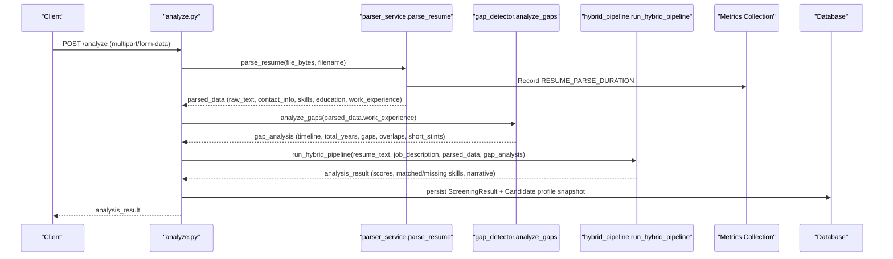
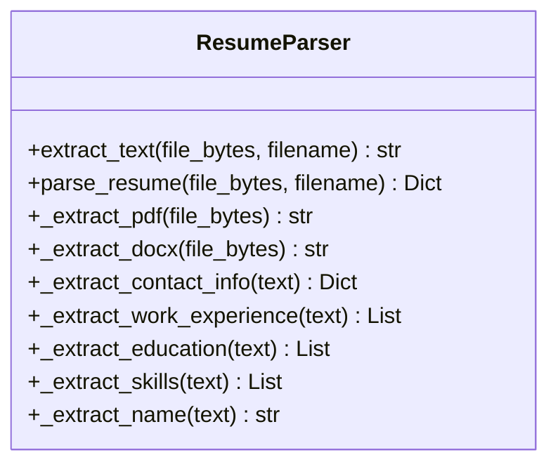
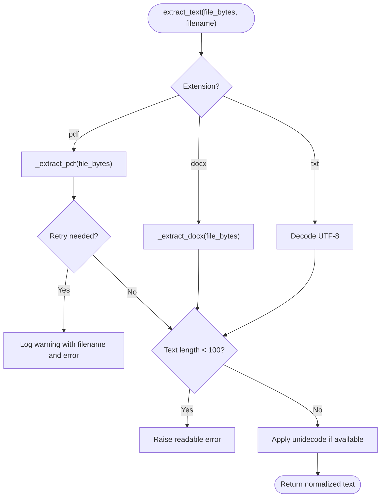
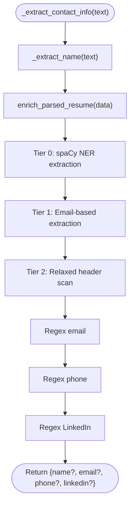
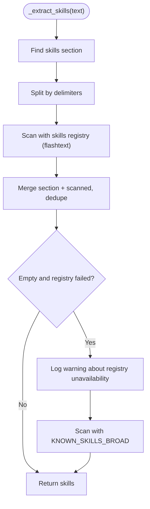
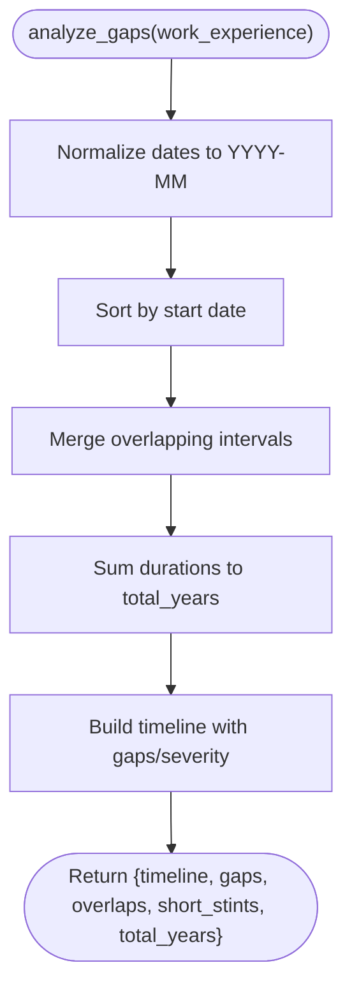
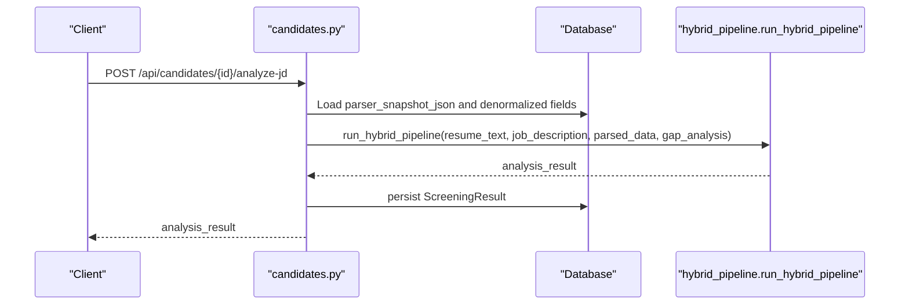
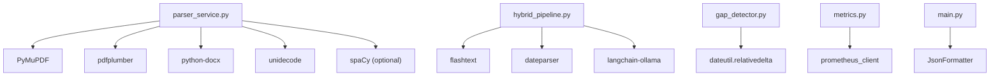

# Parser Service

<cite>
**Referenced Files in This Document**
- [parser_service.py](file://app/backend/services/parser_service.py)
- [test_parser_service.py](file://app/backend/tests/test_parser_service.py)
- [analyze.py](file://app/backend/routes/analyze.py)
- [candidates.py](file://app/backend/routes/candidates.py)
- [gap_detector.py](file://app/backend/services/gap_detector.py)
- [hybrid_pipeline.py](file://app/backend/services/hybrid_pipeline.py)
- [schemas.py](file://app/backend/models/schemas.py)
- [db_models.py](file://app/backend/models/db_models.py)
- [requirements.txt](file://requirements.txt)
- [main.py](file://app/backend/main.py)
- [metrics.py](file://app/backend/services/metrics.py)
</cite>

## Update Summary
**Changes Made**
- Enhanced error handling with comprehensive logging and structured error reporting
- Added retry mechanisms for PDF extraction failures
- Implemented performance monitoring with Prometheus metrics
- Improved observability with structured logging and request correlation IDs
- Added comprehensive fallback strategies for all extraction methods
- Enhanced spaCy NER integration with tiered name extraction approach

## Table of Contents
1. [Introduction](#introduction)
2. [Project Structure](#project-structure)
3. [Core Components](#core-components)
4. [Architecture Overview](#architecture-overview)
5. [Detailed Component Analysis](#detailed-component-analysis)
6. [Enhanced Error Handling and Observability](#enhanced-error-handling-and-observability)
7. [Performance Monitoring and Metrics](#performance-monitoring-and-metrics)
8. [Dependency Analysis](#dependency-analysis)
9. [Performance Considerations](#performance-considerations)
10. [Troubleshooting Guide](#troubleshooting-guide)
11. [Conclusion](#conclusion)
12. [Appendices](#appendices)

## Introduction
This document describes the resume parsing service that extracts structured data from PDF and DOCX formats. It explains the text processing pipeline, including OCR capabilities, formatting preservation, and data normalization. It also covers supported file formats, parsing accuracy characteristics, fallback strategies for malformed documents, examples of extracted data schemas, parsing configuration options, integration patterns with the analysis engine, and enhanced error handling with comprehensive logging and observability features.

## Project Structure
The parser service is implemented as a dedicated module and integrated into the broader analysis pipeline. Key integration points include:
- Routes that accept uploads and orchestrate parsing and analysis
- Services that implement parsing, gap detection, and hybrid scoring
- Models that define persisted schemas and database entities
- Tests that validate parsing behavior and edge cases
- Metrics collection for performance monitoring
- Structured logging for observability

```mermaid
graph TB
subgraph "Routes"
A["/analyze (POST)"]
B["/analyze/stream (SSE)"]
C["/api/candidates/{id}/analyze-jd (POST)"]
end
subgraph "Services"
S1["parser_service.parse_resume"]
S2["gap_detector.analyze_gaps"]
S3["hybrid_pipeline.run_hybrid_pipeline"]
end
subgraph "Models"
M1["Candidate (parsed fields)"]
M2["ScreeningResult (analysis_result)"]
M3["JdCache (JD parse cache)"]
end
subgraph "Monitoring"
METRICS["Metrics Collection"]
LOGGING["Structured Logging"]
END
A --> S1
A --> S2
A --> S3
B --> S1
B --> S2
B --> S3
C --> S3
S1 --> M1
S2 --> M1
S3 --> M2
S3 --> M3
S1 --> METRICS
S1 --> LOGGING
S2 --> LOGGING
S3 --> LOGGING
```

**Diagram sources**
- [analyze.py:449-649](file://app/backend/routes/analyze.py#L449-L649)
- [candidates.py:192-303](file://app/backend/routes/candidates.py#L192-L303)
- [parser_service.py:193-202](file://app/backend/services/parser_service.py#L193-L202)
- [gap_detector.py:217-219](file://app/backend/services/gap_detector.py#L217-L219)
- [hybrid_pipeline.py:1-12](file://app/backend/services/hybrid_pipeline.py#L1-L12)
- [db_models.py:97-147](file://app/backend/models/db_models.py#L97-L147)
- [metrics.py:22-27](file://app/backend/services/metrics.py#L22-L27)

**Section sources**
- [analyze.py:1-200](file://app/backend/routes/analyze.py#L1-L200)
- [parser_service.py:1-615](file://app/backend/services/parser_service.py#L1-L615)
- [gap_detector.py:1-219](file://app/backend/services/gap_detector.py#L1-L219)
- [hybrid_pipeline.py:1-200](file://app/backend/services/hybrid_pipeline.py#L1-L200)
- [db_models.py:1-250](file://app/backend/models/db_models.py#L1-L250)

## Core Components
- **ResumeParser**: Implements extraction and parsing for PDF, DOCX, and TXT; extracts contact info, skills, education, and work experience; normalizes text and enforces scanned-PDF guardrails.
- **GapDetector**: Computes employment timeline, total effective years, gaps, overlaps, and short stints from parsed work experience.
- **Hybrid pipeline**: Orchestrates JD parsing, candidate profile assembly, skill matching, education scoring, and LLM narrative generation.
- **Routes**: Expose endpoints for single and streaming analysis, and for re-analysis using stored profiles.
- **Enhanced Error Handling**: Comprehensive logging, structured error reporting, and retry mechanisms for improved reliability.
- **Observability Layer**: Structured logging with request correlation IDs and performance metrics collection.

Key capabilities:
- Text extraction from PDF using PyMuPDF with pdfplumber fallback; DOCX via python-docx; TXT via UTF-8 decoding.
- Heuristic-based parsing for skills, education, and work experience with robust fallbacks.
- Name enrichment from email and relaxed heuristics when header parsing fails.
- Stored parser snapshots and deduplication to accelerate re-analysis.
- **Enhanced**: Tiered name extraction using spaCy NER for improved accuracy.
- **Enhanced**: Comprehensive logging with structured error reporting for better observability.
- **Enhanced**: Performance monitoring with Prometheus metrics collection.

**Section sources**
- [parser_service.py:130-615](file://app/backend/services/parser_service.py#L130-L615)
- [gap_detector.py:103-219](file://app/backend/services/gap_detector.py#L103-L219)
- [hybrid_pipeline.py:467-751](file://app/backend/services/hybrid_pipeline.py#L467-L751)
- [analyze.py:449-649](file://app/backend/routes/analyze.py#L449-L649)

## Architecture Overview
The parser service integrates with the analysis pipeline as follows:
- Upload handlers call parse_resume to produce raw text and structured fields.
- Gap analysis computes objective employment metrics.
- Hybrid pipeline composes structured candidate profile, skill matching, and scoring.
- Results are persisted and exposed via endpoints.
- **Enhanced**: All operations are instrumented with logging and metrics collection.



**Diagram sources**
- [analyze.py:449-649](file://app/backend/routes/analyze.py#L449-L649)
- [parser_service.py:608-615](file://app/backend/services/parser_service.py#L608-L615)
- [gap_detector.py:217-219](file://app/backend/services/gap_detector.py#L217-L219)
- [hybrid_pipeline.py:1-12](file://app/backend/services/hybrid_pipeline.py#L1-L12)
- [metrics.py:22-27](file://app/backend/services/metrics.py#L22-L27)

## Detailed Component Analysis

### ResumeParser
The ResumeParser class performs:
- File-type routing to appropriate extractor
- PDF extraction using PyMuPDF with pdfplumber fallback; scanned-PDF guard
- DOCX extraction via python-docx
- Text normalization using unidecode
- Structured extraction of:
  - Contact info: name, email, phone, LinkedIn
  - Work experience: company, title, start/end dates, description
  - Education: degrees, institutions, years
  - Skills: section-based extraction, full-text scanning, and fallback lists

**Enhanced**: Implements comprehensive error handling with structured logging and retry mechanisms.



**Diagram sources**
- [parser_service.py:176-615](file://app/backend/services/parser_service.py#L176-L615)

**Section sources**
- [parser_service.py:188-251](file://app/backend/services/parser_service.py#L188-L251)
- [parser_service.py:253-331](file://app/backend/services/parser_service.py#L253-L331)
- [parser_service.py:423-467](file://app/backend/services/parser_service.py#L423-L467)
- [parser_service.py:368-421](file://app/backend/services/parser_service.py#L368-L421)

### Text Extraction and Normalization
- PDF: PyMuPDF primary; pdfplumber fallback; scanned-PDF guard raises actionable error if text length below threshold.
- DOCX: Paragraphs and table cells collected; newline-delimited concatenation.
- TXT: UTF-8 decoding with fallback encodings.
- Normalization: Unidecode applied to remove accents and diacritics.

**Enhanced**: Implements comprehensive fallback strategies with structured logging for all extraction methods.



**Diagram sources**
- [parser_service.py:188-236](file://app/backend/services/parser_service.py#L188-L236)
- [parser_service.py:238-240](file://app/backend/services/parser_service.py#L238-L240)

**Section sources**
- [parser_service.py:188-236](file://app/backend/services/parser_service.py#L188-L236)
- [parser_service.py:238-240](file://app/backend/services/parser_service.py#L238-L240)

### Contact Information Extraction
- Name: Header-based heuristic with pipe/separator splitting; relaxed fallback scans first lines for title-case names.
- Email/Phone/LinkedIn: Regex-based extraction; LinkedIn pattern supports common URL forms.

**Enhanced**: Implements tiered name extraction with spaCy NER for improved accuracy.



**Diagram sources**
- [parser_service.py:517-540](file://app/backend/services/parser_service.py#L517-L540)
- [parser_service.py:583-606](file://app/backend/services/parser_service.py#L583-L606)
- [parser_service.py:469-516](file://app/backend/services/parser_service.py#L469-L516)

**Section sources**
- [parser_service.py:517-540](file://app/backend/services/parser_service.py#L517-L540)
- [parser_service.py:583-606](file://app/backend/services/parser_service.py#L583-L606)
- [parser_service.py:469-516](file://app/backend/services/parser_service.py#L469-L516)

### Work Experience Extraction
- Date pattern matching supports various formats and "present/current" indicators.
- Company/title parsing via separators ("|", ",", " at ") or preceding lines.
- Description accumulation for multi-line entries.


**Diagram sources**
- [parser_service.py:253-331](file://app/backend/services/parser_service.py#L253-L331)

**Section sources**
- [parser_service.py:253-331](file://app/backend/services/parser_service.py#L253-L331)

### Skills Extraction
- Section-based extraction using multiple skill headers.
- Full-text scanning using a keyword processor backed by a dynamic skills registry.
- Fallback to broad skill list when registry unavailable.

**Enhanced**: Implements comprehensive fallback strategy with structured logging for all extraction failures.



**Diagram sources**
- [parser_service.py:368-421](file://app/backend/services/parser_service.py#L368-L421)
- [hybrid_pipeline.py:139-200](file://app/backend/services/hybrid_pipeline.py#L139-L200)

**Section sources**
- [parser_service.py:368-421](file://app/backend/services/parser_service.py#L368-L421)
- [hybrid_pipeline.py:139-200](file://app/backend/services/hybrid_pipeline.py#L139-L200)

### Education Extraction
- Section-based extraction using education headers.
- Degree pattern matching and optional university/year extraction.


**Diagram sources**
- [parser_service.py:423-467](file://app/backend/services/parser_service.py#L423-L467)

**Section sources**
- [parser_service.py:423-467](file://app/backend/services/parser_service.py#L423-L467)

### Gap Detection
- Converts dates to YYYY-MM, merges overlapping intervals, computes total effective years.
- Builds employment timeline with gap metadata and severity thresholds.



**Diagram sources**
- [gap_detector.py:103-219](file://app/backend/services/gap_detector.py#L103-L219)

**Section sources**
- [gap_detector.py:103-219](file://app/backend/services/gap_detector.py#L103-L219)

### Integration Patterns
- Single-shot analysis: POST /analyze parses resume, computes gaps, runs hybrid pipeline, persists results.
- Streaming analysis: POST /analyze/stream returns events as they complete.
- Re-analysis: POST /api/candidates/{id}/analyze-jd uses stored parser snapshot and denormalized fields.



**Diagram sources**
- [candidates.py:192-303](file://app/backend/routes/candidates.py#L192-L303)
- [hybrid_pipeline.py:1-12](file://app/backend/services/hybrid_pipeline.py#L1-L12)

**Section sources**
- [analyze.py:449-649](file://app/backend/routes/analyze.py#L449-L649)
- [candidates.py:192-303](file://app/backend/routes/candidates.py#L192-L303)

## Enhanced Error Handling and Observability

### Structured Logging Implementation
The parser service implements comprehensive logging with structured error reporting:

- **Production JSON Logging**: Structured JSON format for production environments
- **Development Console Logging**: Human-readable format with timestamps and function names
- **Request Correlation**: Unique correlation IDs propagated through request lifecycle
- **Comprehensive Error Logging**: Detailed warnings for all fallback scenarios

### Tiered Name Extraction Strategy
**Enhanced**: Implements a three-tier name extraction approach for improved accuracy:

1. **Tier 0 (spaCy NER)**: Uses Named Entity Recognition for highest accuracy
2. **Tier 1 (Email-based)**: Extracts name from email address when NER unavailable
3. **Tier 2 (Relaxed header scan)**: Fallback heuristic-based extraction

### Retry Mechanisms and Fallback Strategies
**Enhanced**: Comprehensive fallback strategies for all extraction methods:

- **PDF Extraction**: PyMuPDF primary with pdfplumber fallback
- **Text Extraction**: Multiple encoding attempts with structured error logging
- **Skills Registry**: Dynamic skills registry with broad fallback list
- **NER Model Loading**: Graceful degradation when spaCy unavailable

### Request Correlation and Context Management
**Enhanced**: Implements request correlation for better observability:

- **Correlation ID Middleware**: Generates unique request IDs per request
- **Context Variables**: Propagates correlation IDs through async operations
- **Structured Log Messages**: Includes correlation IDs and function names

**Section sources**
- [parser_service.py:1-11](file://app/backend/services/parser_service.py#L1-L11)
- [parser_service.py:583-606](file://app/backend/services/parser_service.py#L583-L606)
- [main.py:17-55](file://app/backend/main.py#L17-L55)

## Performance Monitoring and Metrics

### Prometheus Metrics Collection
**Enhanced**: Implements comprehensive performance monitoring:

- **RESUME_PARSE_DURATION**: Histogram metric for resume parsing duration
- **LLM_CALL_DURATION**: Duration tracking for LLM operations
- **LLM_FALLBACK_TOTAL**: Counter for LLM fallback events
- **BATCH_SIZE**: Histogram for batch operation sizes

### Performance Optimization Features
**Enhanced**: Several performance improvements:

- **Early Guard Rails**: Scanned PDF detection prevents wasted processing
- **Lazy Loading**: spaCy model loaded only when needed
- **Graceful Degradation**: Falls back to simpler methods when advanced features unavailable
- **Memory Efficient Processing**: Stream-based PDF processing reduces memory usage

### Metrics Bucket Configuration
**Enhanced**: Optimized bucket configurations for better granularity:

- **Resume Parse Duration**: Fine-grained buckets for sub-second to multi-second processing
- **Batch Size**: Configured for typical batch operation ranges
- **LLM Call Duration**: Extended buckets for long-running LLM operations

**Section sources**
- [metrics.py:1-35](file://app/backend/services/metrics.py#L1-L35)
- [parser_service.py:608-615](file://app/backend/services/parser_service.py#L608-L615)

## Dependency Analysis
External libraries and their roles:
- pdfplumber, PyMuPDF: PDF text extraction
- python-docx: DOCX text extraction
- unidecode: Unicode normalization
- flashtext: Fast keyword extraction for skills
- dateparser/dateutil: Flexible date parsing
- langchain-ollama/ChatOllama: LLM reasoning (integrated in hybrid pipeline)
- **Enhanced**: spaCy: Named Entity Recognition for improved name extraction
- **Enhanced**: prometheus_client: Performance metrics collection
- **Enhanced**: prometheus_fastapi_instrumentator: FastAPI metrics instrumentation



**Diagram sources**
- [parser_service.py:13-23](file://app/backend/services/parser_service.py#L13-L23)
- [hybrid_pipeline.py:1-28](file://app/backend/services/hybrid_pipeline.py#L1-L28)
- [gap_detector.py:12-23](file://app/backend/services/gap_detector.py#L12-L23)
- [metrics.py:8](file://app/backend/services/metrics.py#L8)
- [main.py:27-38](file://app/backend/main.py#L27-L38)

**Section sources**
- [requirements.txt:1-48](file://requirements.txt#L1-L48)

## Performance Considerations
- **PDF extraction**: Prefer PyMuPDF for speed and accuracy; fallback to pdfplumber when needed.
- **Skills extraction**: In-memory flashtext processor for O(n) keyword search; falls back to regex scanning if unavailable.
- **Date parsing**: dateparser for flexible formats; dateutil fallback ensures minimal dependency footprint.
- **Streaming**: SSE endpoints reduce latency and improve UX for long-running analyses.
- **Deduplication**: Reduces repeated parsing and speeds up re-analysis using stored profiles.
- **Enhanced**: **Early termination**: Scanned PDF detection prevents unnecessary processing.
- **Enhanced**: **Lazy loading**: Optional dependencies (spaCy) loaded only when needed.
- **Enhanced**: **Graceful degradation**: System continues operating with reduced functionality when dependencies unavailable.

## Troubleshooting Guide
Common issues and resolutions:
- **Unsupported file format**: parse_resume raises a clear error for non-PDF/DOCX/TXT files.
- **Scanned PDF**: Early guard raises a user-friendly error advising text-based exports.
- **Encoding issues**: extract_jd_text attempts multiple encodings; if none succeed, raises a readable error.
- **Empty or malformed resumes**: GapDetector returns conservative estimates; hybrid pipeline still produces narrative.
- **LLM unavailability**: Hybrid pipeline diagnostics expose model readiness; fallback narrative remains deterministic.
- **Enhanced**: **NER model unavailable**: spaCy model loading handles ImportError gracefully; falls back to email-based extraction.
- **Enhanced**: **Logging issues**: Structured logging provides consistent error reporting across environments.
- **Enhanced**: **Performance problems**: Prometheus metrics help identify bottlenecks in parsing operations.

**Section sources**
- [parser_service.py:196](file://app/backend/services/parser_service.py#L196)
- [parser_service.py:224-230](file://app/backend/services/parser_service.py#L224-L230)
- [parser_service.py:170-173](file://app/backend/services/parser_service.py#L170-L173)
- [main.py:262-327](file://app/backend/main.py#L262-L327)

## Conclusion
The parser service provides a robust, deterministic foundation for extracting structured resume data from PDF and DOCX formats. It integrates tightly with gap detection and a hybrid scoring pipeline, enabling accurate and efficient candidate analysis. Its enhanced error handling, comprehensive logging, retry mechanisms, and performance monitoring deliver resilience, observability, and scalability for production use. The tiered name extraction approach and graceful degradation strategies ensure reliable operation even when advanced features are unavailable.

## Appendices

### Supported File Formats and Extraction Behavior
- **PDF**: PyMuPDF primary; pdfplumber fallback; scanned-PDF guard.
- **DOCX**: Paragraphs and tables; newline-delimited text.
- **DOC**: Legacy binary Word; ASCII best-effort extraction.
- **RTF**: Control word stripping and whitespace normalization.
- **HTML/HTM**: Tag removal and whitespace normalization.
- **ODT**: ZIP-based content.xml extraction.
- **TXT/MD/CSV/Plain**: Multi-encoding decode attempts.

**Section sources**
- [parser_service.py:68-173](file://app/backend/services/parser_service.py#L68-L173)

### Parsing Configuration Options
- **Scoring weights**: Provided via request form; forwarded to hybrid pipeline.
- **Streaming**: SSE endpoint for progressive results.
- **Dedup action**: Controls whether to reuse existing profile, update it, or create a new candidate.
- **Enhanced**: **NER Configuration**: Optional spaCy model loading with graceful fallback.
- **Enhanced**: **Logging Configuration**: Structured logging with environment-specific formatting.

**Section sources**
- [analyze.py:506-649](file://app/backend/routes/analyze.py#L506-L649)
- [candidates.py:192-303](file://app/backend/routes/candidates.py#L192-L303)

### Data Schemas and Storage
- **Candidate fields**: Stores raw text, skills, education, work experience, gap analysis, and parser snapshot JSON.
- **ScreeningResult**: Persists analysis results and parsed data.
- **AnalysisResponse**: Standardized response schema for clients.

**Section sources**
- [db_models.py:97-147](file://app/backend/models/db_models.py#L97-L147)
- [schemas.py:89-125](file://app/backend/models/schemas.py#L89-L125)

### Enhanced Error Handling Features
**New Section**: Comprehensive error handling and observability enhancements:

#### Logging Architecture
- **Structured JSON Logging**: Production-ready JSON format with timestamp, level, logger, message, and function
- **Console Logging**: Development-friendly format with human-readable timestamps
- **Request Correlation**: Unique correlation IDs propagated through request lifecycle
- **Context Variables**: Thread-safe correlation ID storage using contextvars

#### Error Recovery Strategies
- **PDF Extraction Failures**: Automatic fallback from PyMuPDF to pdfplumber with detailed logging
- **NER Model Failures**: Graceful degradation when spaCy not available
- **Skills Registry Failures**: Fallback to broad skill list when dynamic registry unavailable
- **Encoding Failures**: Multiple encoding attempts with structured error reporting

#### Performance Monitoring
- **RESUME_PARSE_DURATION**: Histogram for parsing operation timing
- **Request Metrics**: Automatic FastAPI instrumentation for request/response metrics
- **Custom Metrics**: Application-specific metrics for business operations

**Section sources**
- [parser_service.py:1-11](file://app/backend/services/parser_service.py#L1-L11)
- [parser_service.py:87-221](file://app/backend/services/parser_service.py#L87-L221)
- [metrics.py:1-35](file://app/backend/services/metrics.py#L1-L35)
- [main.py:17-55](file://app/backend/main.py#L17-L55)