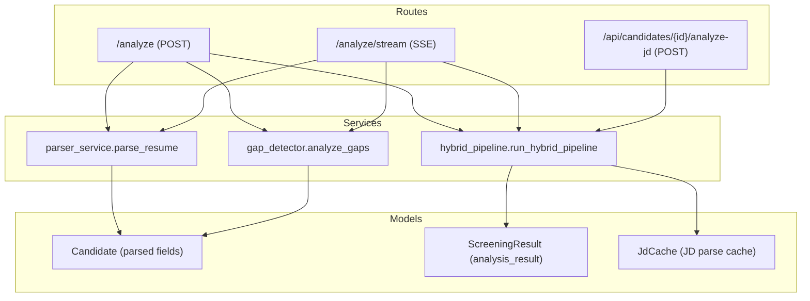
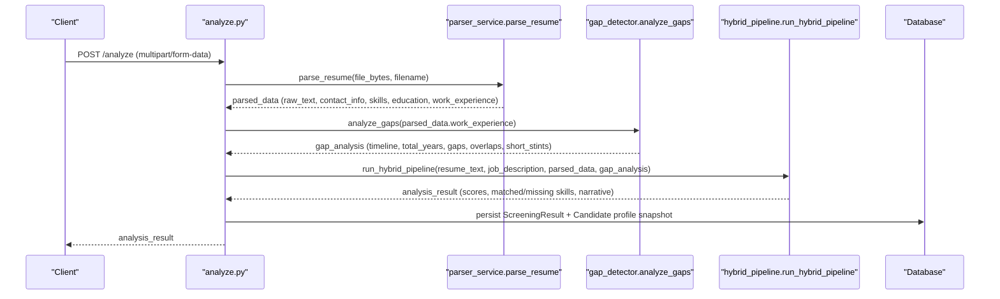
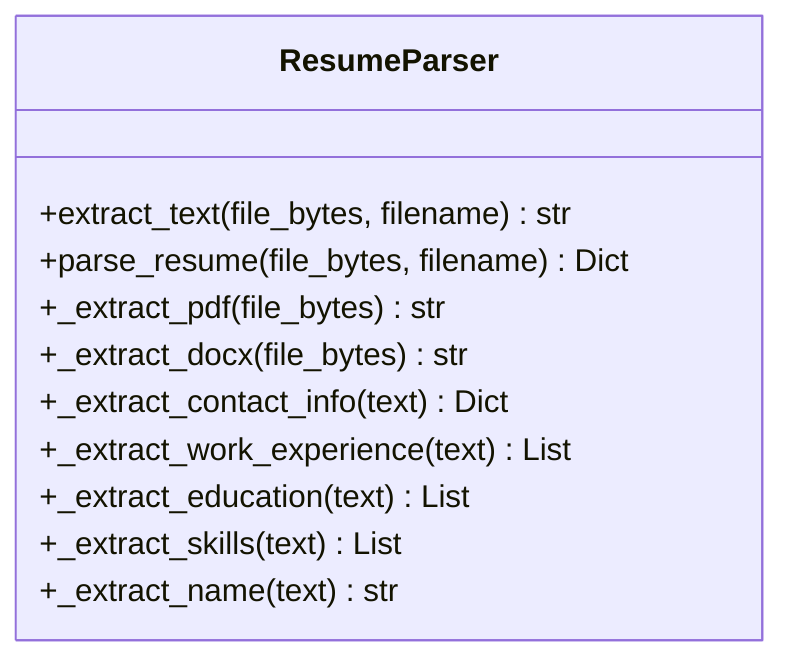
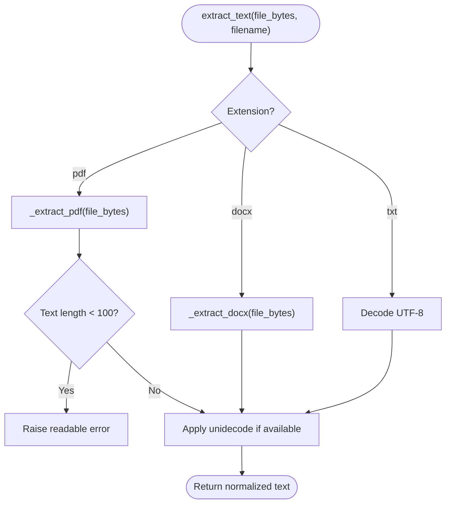
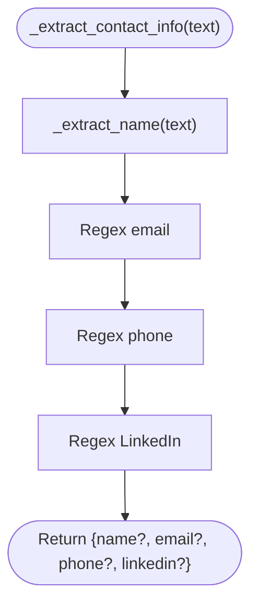
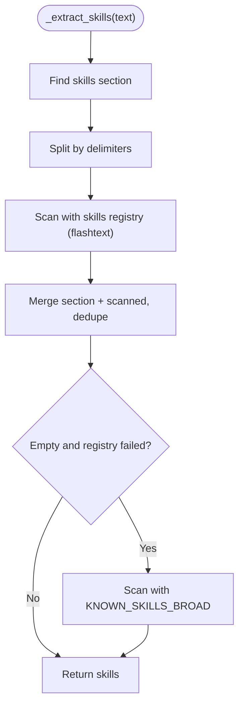
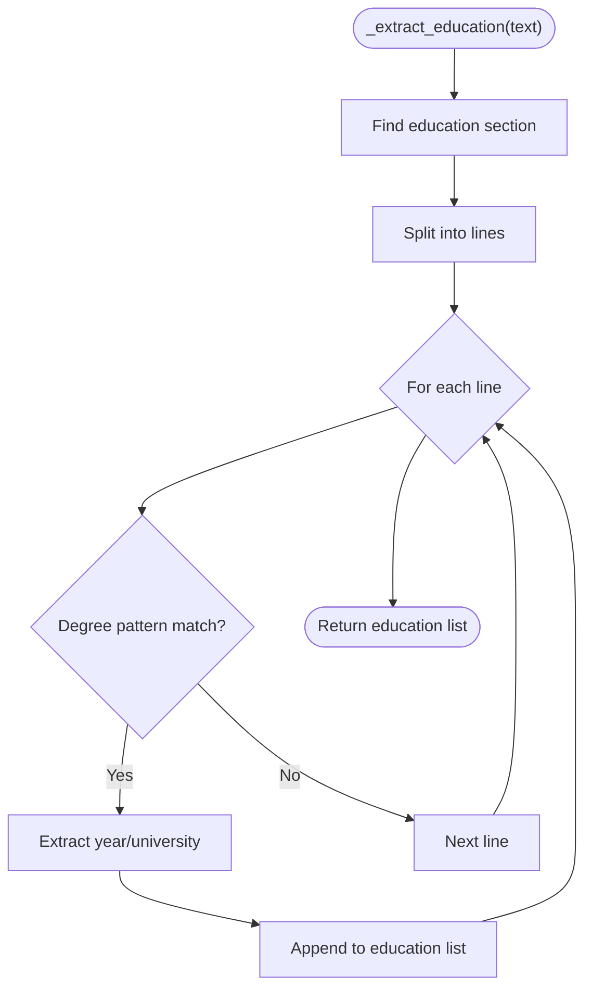
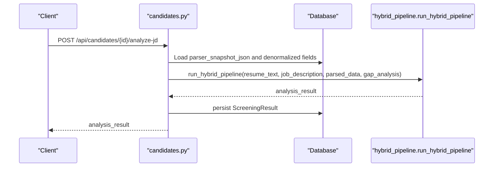
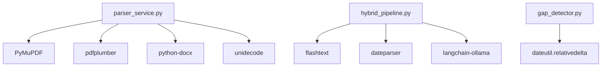

# Parser Service

<cite>
**Referenced Files in This Document**
- [parser_service.py](file://app/backend/services/parser_service.py)
- [test_parser_service.py](file://app/backend/tests/test_parser_service.py)
- [analyze.py](file://app/backend/routes/analyze.py)
- [candidates.py](file://app/backend/routes/candidates.py)
- [gap_detector.py](file://app/backend/services/gap_detector.py)
- [hybrid_pipeline.py](file://app/backend/services/hybrid_pipeline.py)
- [schemas.py](file://app/backend/models/schemas.py)
- [db_models.py](file://app/backend/models/db_models.py)
- [requirements.txt](file://requirements.txt)
- [main.py](file://app/backend/main.py)
</cite>

## Table of Contents
1. [Introduction](#introduction)
2. [Project Structure](#project-structure)
3. [Core Components](#core-components)
4. [Architecture Overview](#architecture-overview)
5. [Detailed Component Analysis](#detailed-component-analysis)
6. [Dependency Analysis](#dependency-analysis)
7. [Performance Considerations](#performance-considerations)
8. [Troubleshooting Guide](#troubleshooting-guide)
9. [Conclusion](#conclusion)
10. [Appendices](#appendices)

## Introduction
This document describes the resume parsing service that extracts structured data from PDF and DOCX formats. It explains the text processing pipeline, including OCR capabilities, formatting preservation, and data normalization. It also covers supported file formats, parsing accuracy characteristics, fallback strategies for malformed documents, examples of extracted data schemas, parsing configuration options, integration patterns with the analysis engine, and error handling for corrupted files, encoding issues, and unsupported formats.

## Project Structure
The parser service is implemented as a dedicated module and integrated into the broader analysis pipeline. Key integration points include:
- Routes that accept uploads and orchestrate parsing and analysis
- Services that implement parsing, gap detection, and hybrid scoring
- Models that define persisted schemas and database entities
- Tests that validate parsing behavior and edge cases

**Diagram sources**
- [analyze.py:449-649](file://app/backend/routes/analyze.py#L449-L649)
- [candidates.py:192-303](file://app/backend/routes/candidates.py#L192-L303)
- [parser_service.py:193-202](file://app/backend/services/parser_service.py#L193-L202)
- [gap_detector.py:217-219](file://app/backend/services/gap_detector.py#L217-L219)
- [hybrid_pipeline.py:1-12](file://app/backend/services/hybrid_pipeline.py#L1-L12)
- [db_models.py:97-147](file://app/backend/models/db_models.py#L97-L147)

**Section sources**
- [analyze.py:1-200](file://app/backend/routes/analyze.py#L1-L200)
- [parser_service.py:1-552](file://app/backend/services/parser_service.py#L1-L552)
- [gap_detector.py:1-219](file://app/backend/services/gap_detector.py#L1-L219)
- [hybrid_pipeline.py:1-800](file://app/backend/services/hybrid_pipeline.py#L1-L800)
- [db_models.py:1-250](file://app/backend/models/db_models.py#L1-L250)

## Core Components
- ResumeParser: Implements extraction and parsing for PDF, DOCX, and TXT; extracts contact info, skills, education, and work experience; normalizes text and enforces scanned-PDF guardrails.
- GapDetector: Computes employment timeline, total effective years, gaps, overlaps, and short stints from parsed work experience.
- Hybrid pipeline: Orchestrates JD parsing, candidate profile assembly, skill matching, education scoring, and LLM narrative generation.
- Routes: Expose endpoints for single and streaming analysis, and for re-analysis using stored profiles.

Key capabilities:
- Text extraction from PDF using PyMuPDF with pdfplumber fallback; DOCX via python-docx; TXT via UTF-8 decoding.
- Heuristic-based parsing for skills, education, and work experience with robust fallbacks.
- Name enrichment from email and relaxed heuristics when header parsing fails.
- Stored parser snapshots and deduplication to accelerate re-analysis.

**Section sources**
- [parser_service.py:130-552](file://app/backend/services/parser_service.py#L130-L552)
- [gap_detector.py:103-219](file://app/backend/services/gap_detector.py#L103-L219)
- [hybrid_pipeline.py:467-751](file://app/backend/services/hybrid_pipeline.py#L467-L751)
- [analyze.py:449-649](file://app/backend/routes/analyze.py#L449-L649)

## Architecture Overview
The parser service integrates with the analysis pipeline as follows:
- Upload handlers call parse_resume to produce raw text and structured fields.
- Gap analysis computes objective employment metrics.
- Hybrid pipeline composes structured candidate profile, skill matching, and scoring.
- Results are persisted and exposed via endpoints.

**Diagram sources**
- [analyze.py:449-649](file://app/backend/routes/analyze.py#L449-L649)
- [parser_service.py:547-552](file://app/backend/services/parser_service.py#L547-L552)
- [gap_detector.py:217-219](file://app/backend/services/gap_detector.py#L217-L219)
- [hybrid_pipeline.py:1-12](file://app/backend/services/hybrid_pipeline.py#L1-L12)

## Detailed Component Analysis

### ResumeParser
The ResumeParser class performs:
- File-type routing to appropriate extractor
- PDF extraction using PyMuPDF with pdfplumber fallback; scanned-PDF guard
- DOCX extraction via python-docx
- Text normalization using unidecode
- Structured extraction of:
  - Contact info: name, email, phone, LinkedIn
  - Work experience: company, title, start/end dates, description
  - Education: degrees, institutions, years
  - Skills: section-based extraction, full-text scanning, and fallback lists

**Diagram sources**
- [parser_service.py:130-552](file://app/backend/services/parser_service.py#L130-L552)

**Section sources**
- [parser_service.py:142-202](file://app/backend/services/parser_service.py#L142-L202)
- [parser_service.py:204-282](file://app/backend/services/parser_service.py#L204-L282)
- [parser_service.py:373-417](file://app/backend/services/parser_service.py#L373-L417)
- [parser_service.py:467-490](file://app/backend/services/parser_service.py#L467-L490)

### Text Extraction and Normalization
- PDF: PyMuPDF primary; pdfplumber fallback; scanned-PDF guard raises actionable error if text length below threshold.
- DOCX: Paragraphs and table cells collected; newline-delimited concatenation.
- TXT: UTF-8 decoding with fallback encodings.
- Normalization: Unidecode applied to remove accents and diacritics.

**Diagram sources**
- [parser_service.py:142-187](file://app/backend/services/parser_service.py#L142-L187)
- [parser_service.py:189-191](file://app/backend/services/parser_service.py#L189-L191)

**Section sources**
- [parser_service.py:152-187](file://app/backend/services/parser_service.py#L152-L187)
- [parser_service.py:189-191](file://app/backend/services/parser_service.py#L189-L191)

### Contact Information Extraction
- Name: Header-based heuristic with pipe/separator splitting; relaxed fallback scans first lines for title-case names.
- Email/Phone/LinkedIn: Regex-based extraction; LinkedIn pattern supports common URL forms.

**Diagram sources**
- [parser_service.py:467-490](file://app/backend/services/parser_service.py#L467-L490)
- [parser_service.py:419-466](file://app/backend/services/parser_service.py#L419-L466)

**Section sources**
- [parser_service.py:467-490](file://app/backend/services/parser_service.py#L467-L490)
- [parser_service.py:419-466](file://app/backend/services/parser_service.py#L419-L466)

### Work Experience Extraction
- Date pattern matching supports various formats and “present/current” indicators.
- Company/title parsing via separators (“|”, “,”, “ at ”) or preceding lines.
- Description accumulation for multi-line entries.

**Diagram sources**
- [parser_service.py:204-282](file://app/backend/services/parser_service.py#L204-L282)

**Section sources**
- [parser_service.py:204-282](file://app/backend/services/parser_service.py#L204-L282)

### Skills Extraction
- Section-based extraction using multiple skill headers.
- Full-text scanning using a keyword processor backed by a dynamic skills registry.
- Fallback to broad skill list when registry unavailable.

**Diagram sources**
- [parser_service.py:319-371](file://app/backend/services/parser_service.py#L319-L371)
- [hybrid_pipeline.py:323-427](file://app/backend/services/hybrid_pipeline.py#L323-L427)

**Section sources**
- [parser_service.py:319-371](file://app/backend/services/parser_service.py#L319-L371)
- [hybrid_pipeline.py:323-427](file://app/backend/services/hybrid_pipeline.py#L323-L427)

### Education Extraction
- Section-based extraction using education headers.
- Degree pattern matching and optional university/year extraction.

**Diagram sources**
- [parser_service.py:373-417](file://app/backend/services/parser_service.py#L373-L417)

**Section sources**
- [parser_service.py:373-417](file://app/backend/services/parser_service.py#L373-L417)

### Gap Detection
- Converts dates to YYYY-MM, merges overlapping intervals, computes total effective years.
- Builds employment timeline with gap metadata and severity thresholds.

**Diagram sources**
- [gap_detector.py:103-219](file://app/backend/services/gap_detector.py#L103-L219)

**Section sources**
- [gap_detector.py:103-219](file://app/backend/services/gap_detector.py#L103-L219)

### Integration Patterns
- Single-shot analysis: POST /analyze parses resume, computes gaps, runs hybrid pipeline, persists results.
- Streaming analysis: POST /analyze/stream returns events as they complete.
- Re-analysis: POST /api/candidates/{id}/analyze-jd uses stored parser snapshot and denormalized fields.

**Diagram sources**
- [candidates.py:192-303](file://app/backend/routes/candidates.py#L192-L303)
- [hybrid_pipeline.py:1-12](file://app/backend/services/hybrid_pipeline.py#L1-L12)

**Section sources**
- [analyze.py:449-649](file://app/backend/routes/analyze.py#L449-L649)
- [candidates.py:192-303](file://app/backend/routes/candidates.py#L192-L303)

## Dependency Analysis
External libraries and their roles:
- pdfplumber, PyMuPDF: PDF text extraction
- python-docx: DOCX text extraction
- unidecode: Unicode normalization
- flashtext: Fast keyword extraction for skills
- dateparser/dateutil: Flexible date parsing
- langchain-ollama/ChatOllama: LLM reasoning (integrated in hybrid pipeline)

**Diagram sources**
- [parser_service.py:1-18](file://app/backend/services/parser_service.py#L1-L18)
- [hybrid_pipeline.py:1-800](file://app/backend/services/hybrid_pipeline.py#L1-L800)
- [gap_detector.py:12-23](file://app/backend/services/gap_detector.py#L12-L23)
- [requirements.txt:1-48](file://requirements.txt#L1-L48)

**Section sources**
- [requirements.txt:1-48](file://requirements.txt#L1-L48)

## Performance Considerations
- PDF extraction: Prefer PyMuPDF for speed and accuracy; fallback to pdfplumber when needed.
- Skills extraction: In-memory flashtext processor for O(n) keyword search; falls back to regex scanning if unavailable.
- Date parsing: dateparser for flexible formats; dateutil fallback ensures minimal dependency footprint.
- Streaming: SSE endpoints reduce latency and improve UX for long-running analyses.
- Deduplication: Reduces repeated parsing and speeds up re-analysis using stored profiles.

[No sources needed since this section provides general guidance]

## Troubleshooting Guide
Common issues and resolutions:
- Unsupported file format: parse_resume raises a clear error for non-PDF/DOCX/TXT files.
- Scanned PDF: Early guard raises a user-friendly error advising text-based exports.
- Encoding issues: extract_jd_text attempts multiple encodings; if none succeed, raises a readable error.
- Empty or malformed resumes: GapDetector returns conservative estimates; hybrid pipeline still produces narrative.
- LLM unavailability: Hybrid pipeline diagnostics expose model readiness; fallback narrative remains deterministic.

**Section sources**
- [parser_service.py:149-151](file://app/backend/services/parser_service.py#L149-L151)
- [parser_service.py:175-181](file://app/backend/services/parser_service.py#L175-L181)
- [parser_service.py:124-127](file://app/backend/services/parser_service.py#L124-L127)
- [main.py:262-327](file://app/backend/main.py#L262-L327)

## Conclusion
The parser service provides a robust, deterministic foundation for extracting structured resume data from PDF and DOCX formats. It integrates tightly with gap detection and a hybrid scoring pipeline, enabling accurate and efficient candidate analysis. Its fallback strategies, normalization, and streaming integrations deliver resilience and scalability for production use.

[No sources needed since this section summarizes without analyzing specific files]

## Appendices

### Supported File Formats and Extraction Behavior
- PDF: PyMuPDF primary; pdfplumber fallback; scanned-PDF guard.
- DOCX: Paragraphs and tables; newline-delimited text.
- DOC: Legacy binary Word; ASCII best-effort extraction.
- RTF: Control word stripping and whitespace normalization.
- HTML/HTM: Tag removal and whitespace normalization.
- ODT: ZIP-based content.xml extraction.
- TXT/MD/CSV/Plain: Multi-encoding decode attempts.

**Section sources**
- [parser_service.py:22-127](file://app/backend/services/parser_service.py#L22-L127)

### Parsing Configuration Options
- Scoring weights: Provided via request form; forwarded to hybrid pipeline.
- Streaming: SSE endpoint for progressive results.
- Dedup action: Controls whether to reuse existing profile, update it, or create a new candidate.

**Section sources**
- [analyze.py:506-649](file://app/backend/routes/analyze.py#L506-L649)
- [candidates.py:192-303](file://app/backend/routes/candidates.py#L192-L303)

### Data Schemas and Storage
- Candidate fields: Stores raw text, skills, education, work experience, gap analysis, and parser snapshot JSON.
- ScreeningResult: Persists analysis results and parsed data.
- AnalysisResponse: Standardized response schema for clients.

**Section sources**
- [db_models.py:97-147](file://app/backend/models/db_models.py#L97-L147)
- [schemas.py:89-125](file://app/backend/models/schemas.py#L89-L125)