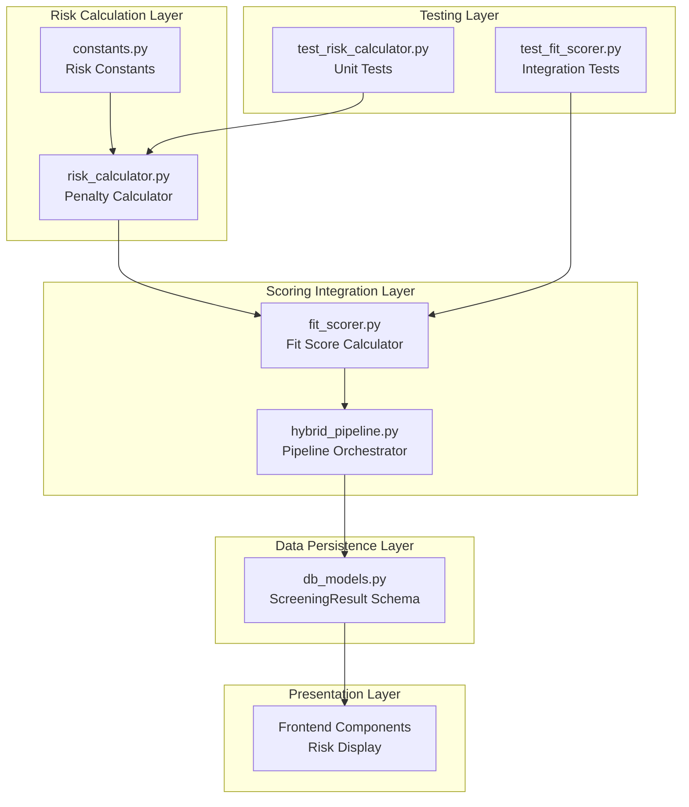
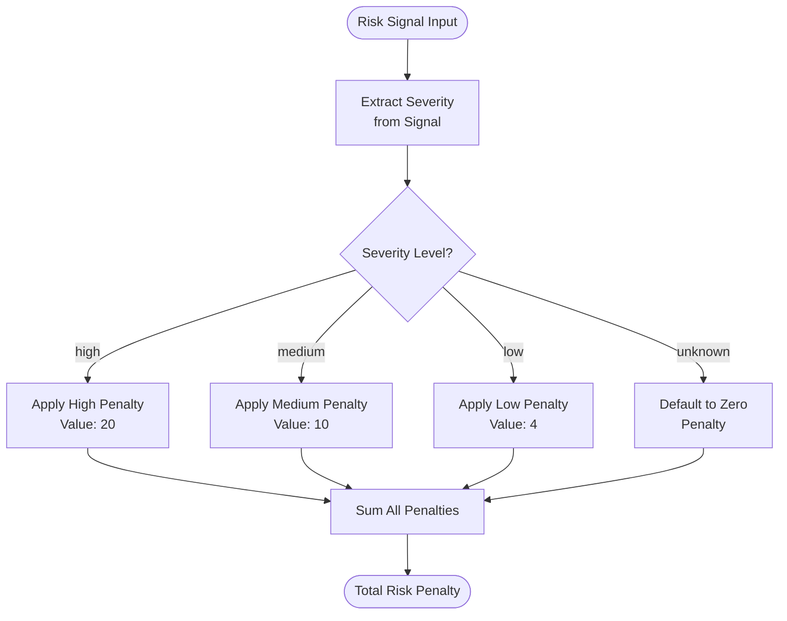
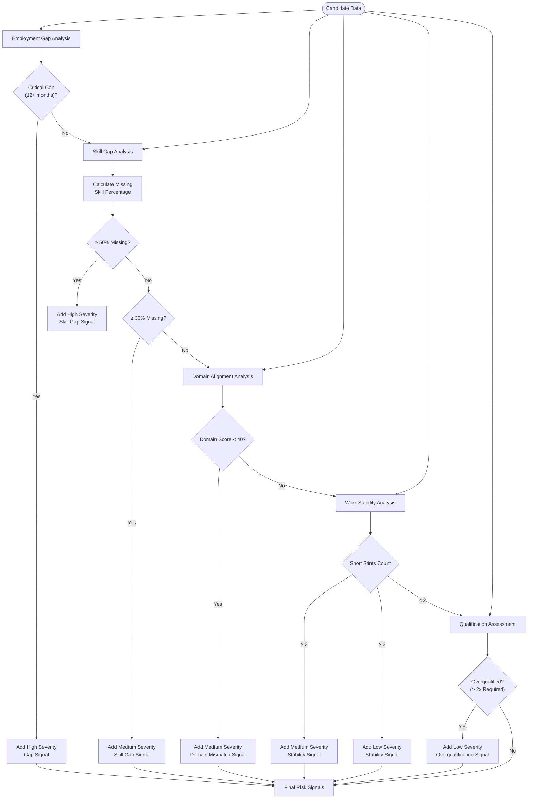
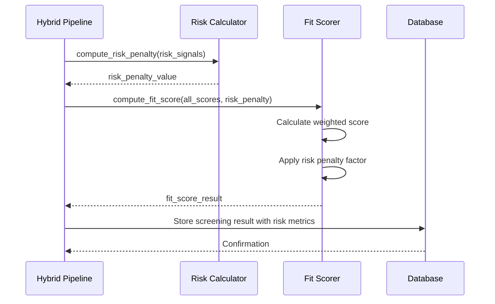
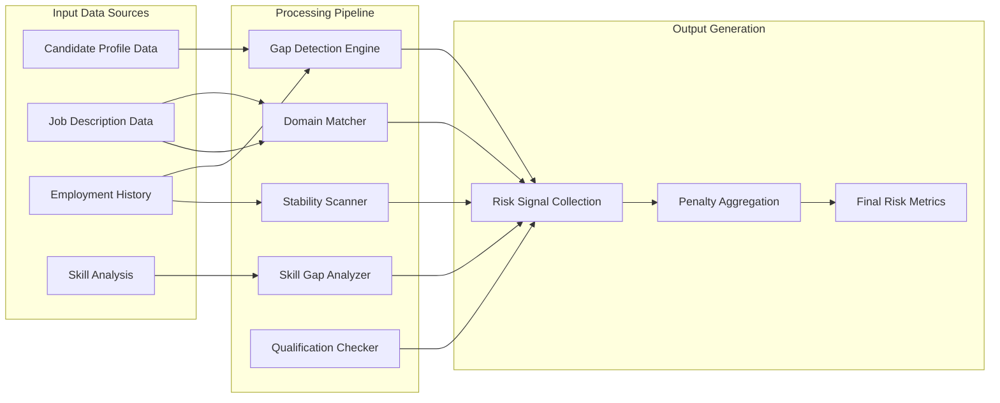
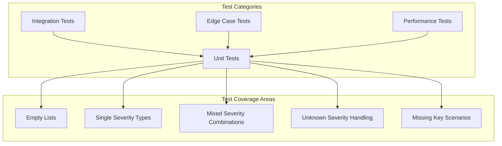
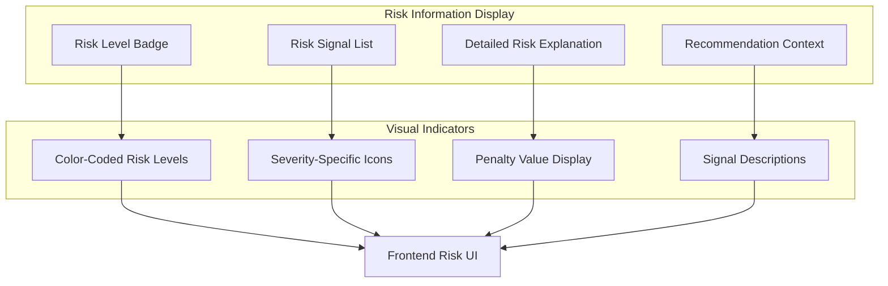

# Risk Calculation Module

<cite>
**Referenced Files in This Document**
- [risk_calculator.py](file://app/backend/services/risk_calculator.py)
- [constants.py](file://app/backend/services/constants.py)
- [fit_scorer.py](file://app/backend/services/fit_scorer.py)
- [hybrid_pipeline.py](file://app/backend/services/hybrid_pipeline.py)
- [test_risk_calculator.py](file://app/backend/tests/test_risk_calculator.py)
- [test_fit_scorer.py](file://app/backend/tests/test_fit_scorer.py)
- [db_models.py](file://app/backend/models/db_models.py)
</cite>

## Table of Contents
1. [Introduction](#introduction)
2. [System Architecture](#system-architecture)
3. [Core Components](#core-components)
4. [Risk Calculation Engine](#risk-calculation-engine)
5. [Integration Points](#integration-points)
6. [Data Flow Analysis](#data-flow-analysis)
7. [Performance Considerations](#performance-considerations)
8. [Testing Framework](#testing-framework)
9. [UI Integration](#ui-integration)
10. [Conclusion](#conclusion)

## Introduction

The Risk Calculation Module is a critical component of the Resume AI by ThetaLogics platform that systematically evaluates potential risks associated with candidate profiles during the automated screening process. This module serves as the standardized foundation for identifying and quantifying risk factors that could impact hiring decisions, providing transparent and consistent risk assessment across all candidate evaluations.

The module operates as a deterministic scoring system that analyzes employment gaps, skill mismatches, domain alignment issues, and other red flags present in candidate resumes. It transforms qualitative risk indicators into quantitative penalty scores that are seamlessly integrated into the broader fit scoring algorithm, ensuring that risk considerations are appropriately weighted in the final recommendation process.

## System Architecture

The Risk Calculation Module is designed with a layered architecture that promotes maintainability, testability, and scalability. The system follows a clear separation of concerns with dedicated components for risk detection, penalty calculation, and integration with the broader scoring framework.

**Diagram sources**
- [risk_calculator.py:1-16](file://app/backend/services/risk_calculator.py#L1-L16)
- [constants.py:120-126](file://app/backend/services/constants.py#L120-L126)
- [fit_scorer.py:12-114](file://app/backend/services/fit_scorer.py#L12-L114)
- [hybrid_pipeline.py:1250-1357](file://app/backend/services/hybrid_pipeline.py#L1250-L1357)

## Core Components

### Risk Penalty Calculator

The core of the risk calculation system is the `compute_risk_penalty` function, which serves as the single source of truth for converting risk signals into quantitative penalties. This function implements a straightforward yet robust algorithm that processes risk signal dictionaries and applies predefined penalty values based on severity levels.

### Risk Signal Generation

The system automatically generates risk signals from various aspects of candidate profiles, including:
- Employment gap analysis with critical gap detection (12+ months)
- Skill gap assessment based on required vs. missing skills
- Domain mismatch evaluation
- Work stability indicators through short stint analysis
- Overqualification assessment

### Integration Architecture

The risk calculation module integrates seamlessly with the broader scoring system through well-defined interfaces that ensure consistency and maintainability across the entire platform.

**Section sources**
- [risk_calculator.py:6-15](file://app/backend/services/risk_calculator.py#L6-L15)
- [constants.py:120-126](file://app/backend/services/constants.py#L120-L126)
- [fit_scorer.py:39-74](file://app/backend/services/fit_scorer.py#L39-L74)

## Risk Calculation Engine

### Penalty Structure

The risk penalty system employs a hierarchical severity-based scoring mechanism with predefined penalty values:

**Diagram sources**
- [constants.py:120-126](file://app/backend/services/constants.py#L120-L126)
- [risk_calculator.py:12-15](file://app/backend/services/risk_calculator.py#L12-L15)

### Risk Signal Detection Logic

The system implements comprehensive risk signal detection through deterministic algorithms that analyze candidate data:

**Diagram sources**
- [fit_scorer.py:43-69](file://app/backend/services/fit_scorer.py#L43-L69)

**Section sources**
- [fit_scorer.py:39-74](file://app/backend/services/fit_scorer.py#L39-L74)
- [constants.py:120-126](file://app/backend/services/constants.py#L120-L126)

## Integration Points

### Fit Score Integration

The risk calculation module integrates deeply with the fit scoring system through the `compute_fit_score` function, which incorporates risk penalties into the final candidate evaluation:

**Diagram sources**
- [hybrid_pipeline.py:1264](file://app/backend/services/hybrid_pipeline.py#L1264)
- [fit_scorer.py:72-85](file://app/backend/services/fit_scorer.py#L72-L85)
- [risk_calculator.py:6-15](file://app/backend/services/risk_calculator.py#L6-L15)

### Database Integration

The risk calculation results are persisted in the database through the `ScreeningResult` model, which includes dedicated fields for storing risk-related metrics and recommendations:

| Field Name | Data Type | Purpose | Storage Location |
|------------|-----------|---------|------------------|
| `risk_level` | String | Risk categorization (Low/Medium/High) | ScreeningResult model |
| `risk_signals` | JSON Array | Detailed risk signal information | ScreeningResult model |
| `risk_penalty` | Float | Quantified risk penalty value | ScreeningResult model |
| `deterministic_score` | Integer | Final risk-adjusted score | ScreeningResult model |

**Section sources**
- [hybrid_pipeline.py:1326-1327](file://app/backend/services/hybrid_pipeline.py#L1326-L1327)
- [db_models.py:157-163](file://app/backend/models/db_models.py#L157-L163)

## Data Flow Analysis

### Risk Signal Processing Pipeline

The risk calculation system follows a structured data flow that ensures comprehensive analysis while maintaining performance and accuracy:

**Diagram sources**
- [fit_scorer.py:40-74](file://app/backend/services/fit_scorer.py#L40-L74)
- [risk_calculator.py:6-15](file://app/backend/services/risk_calculator.py#L6-L15)

### Decision Impact Analysis

The risk penalty directly influences the final recommendation through a mathematical formula that balances positive qualifications against identified risks:

| Component | Weight Factor | Risk Impact |
|-----------|---------------|-------------|
| Skill Match | 0.30 | Direct positive contribution |
| Experience | 0.20 | Direct positive contribution |
| Architecture Fit | 0.15 | Direct positive contribution |
| Education | 0.10 | Direct positive contribution |
| Timeline | 0.10 | Direct positive contribution |
| Domain Fit | 0.10 | Direct positive contribution |
| Risk Penalty | 0.15 | Negative contribution (subtraction) |

**Section sources**
- [fit_scorer.py:76-85](file://app/backend/services/fit_scorer.py#L76-L85)
- [constants.py:32-42](file://app/backend/services/constants.py#L32-L42)

## Performance Considerations

### Computational Efficiency

The risk calculation module is designed for optimal performance through several key strategies:

- **Linear Time Complexity**: Risk penalty calculation operates in O(n) time relative to the number of risk signals
- **Memory Efficiency**: Minimal memory footprint with constant space complexity
- **Early Termination**: Strategic early exits in signal detection algorithms
- **Batch Processing**: Efficient handling of multiple risk signals in single pass

### Scalability Features

The module supports horizontal scaling through:
- Stateless operation allowing easy distribution across multiple instances
- Immutable data structures preventing race conditions
- Predictable resource consumption enabling capacity planning
- Caching opportunities for frequently accessed risk constants

## Testing Framework

### Unit Testing Strategy

The risk calculation module employs comprehensive unit testing covering all major scenarios and edge cases:

**Diagram sources**
- [test_risk_calculator.py:8-53](file://app/backend/tests/test_risk_calculator.py#L8-L53)

### Test Scenarios

The testing framework validates critical functionality including:
- Empty risk signal lists returning zero penalty
- Individual high/medium/low severity penalties
- Mixed severity combinations with proper aggregation
- Unknown severity values defaulting to zero penalty
- Missing severity keys defaulting to low severity (penalty: 4)
- Edge cases with multiple missing keys and mixed scenarios

**Section sources**
- [test_risk_calculator.py:11-53](file://app/backend/tests/test_risk_calculator.py#L11-L53)
- [test_fit_scorer.py:207-245](file://app/backend/tests/test_fit_scorer.py#L207-L245)

## UI Integration

### Risk Display Components

The frontend presents risk information through intuitive visual components that enhance transparency and decision-making:

**Diagram sources**
- [ResultCard.jsx:648-663](file://app/frontend/src/components/ResultCard.jsx#L648-L663)
- [AnalyzePage.jsx:941-947](file://app/frontend/src/pages/AnalyzePage.jsx#L941-L947)

### User Experience Features

The risk display system provides:
- Color-coded risk levels (Green: Low, Amber: Medium, Red: High)
- Detailed descriptions of each identified risk signal
- Penalty value visualization for transparency
- Contextual recommendation information
- Interactive risk explanation capabilities

**Section sources**
- [ResultCard.jsx:644-669](file://app/frontend/src/components/ResultCard.jsx#L644-L669)
- [AnalyzePage.jsx:928-948](file://app/frontend/src/pages/AnalyzePage.jsx#L928-L948)

## Conclusion

The Risk Calculation Module represents a sophisticated yet accessible approach to automated risk assessment in the hiring process. By providing a standardized, deterministic system for identifying and quantifying potential risks, the module enhances decision-making transparency while maintaining computational efficiency and scalability.

The module's strength lies in its clear separation of concerns, comprehensive testing framework, and seamless integration with both the scoring system and user interface. The deterministic nature of risk signal generation ensures consistent results across different candidate profiles, while the modular design allows for easy maintenance and future enhancements.

Through careful attention to performance, testing, and user experience, the Risk Calculation Module successfully bridges the gap between complex analytical processes and practical hiring applications, providing recruiters with reliable, actionable insights into candidate risk profiles.