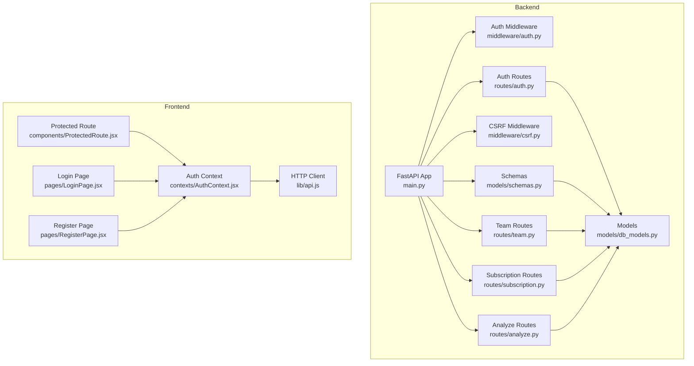
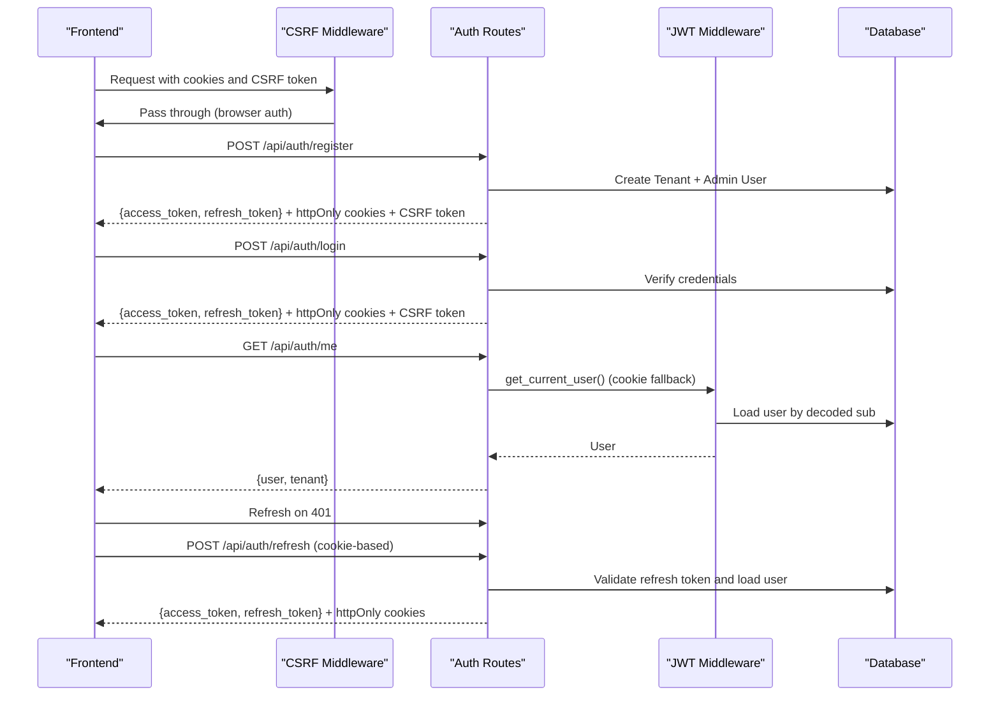
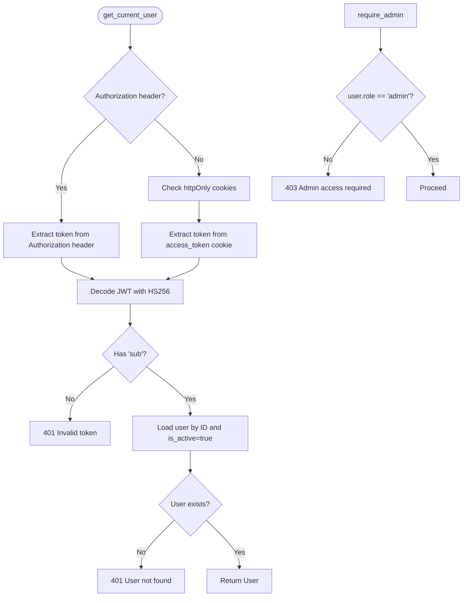
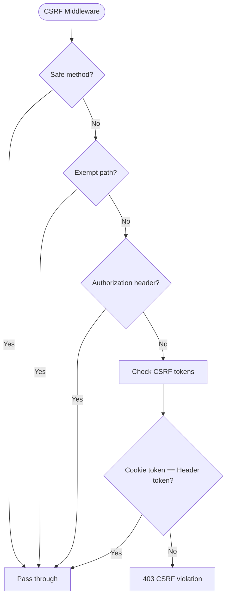
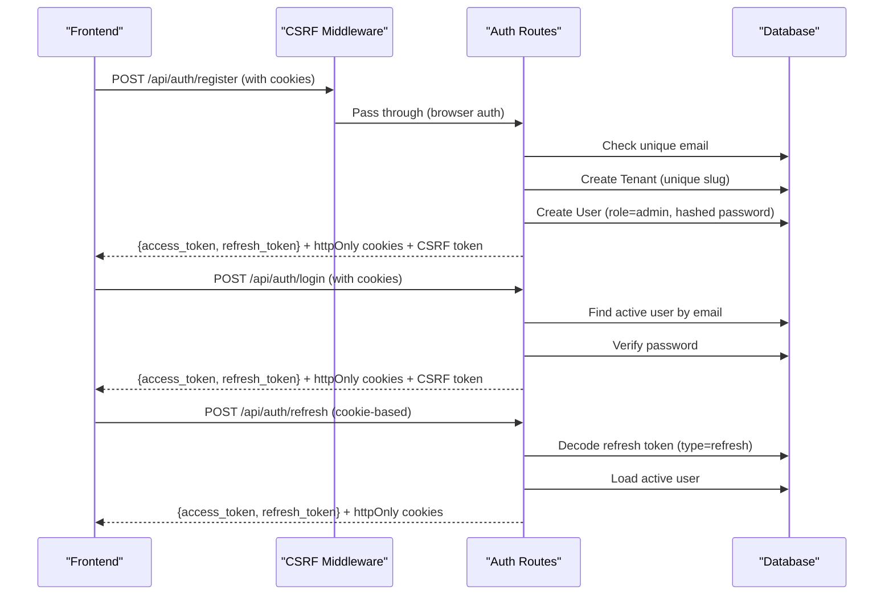
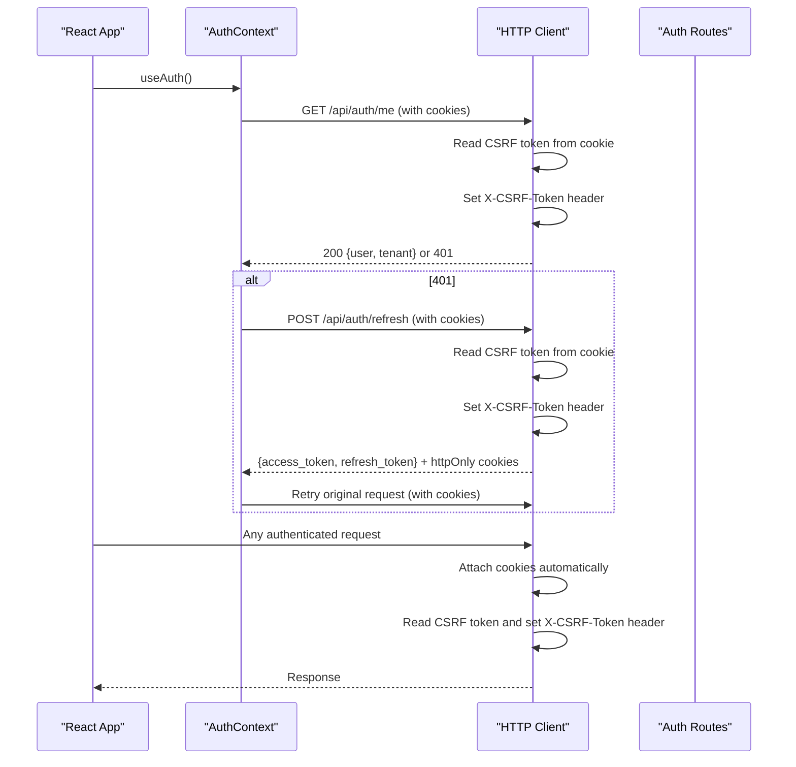
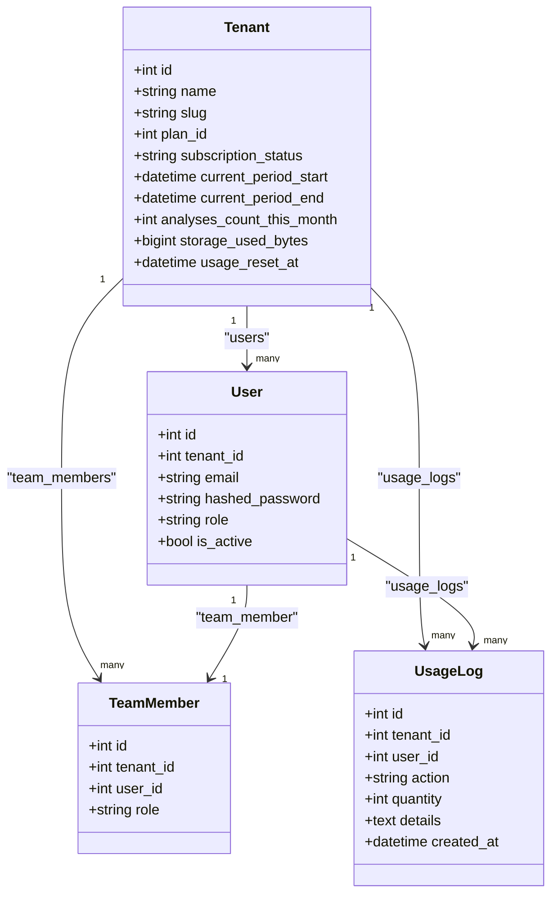
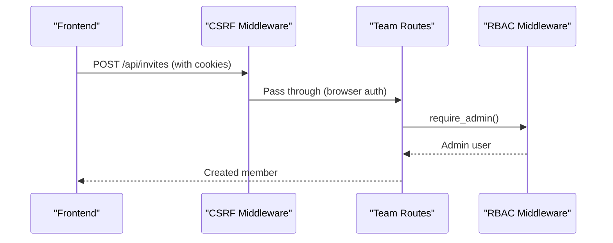
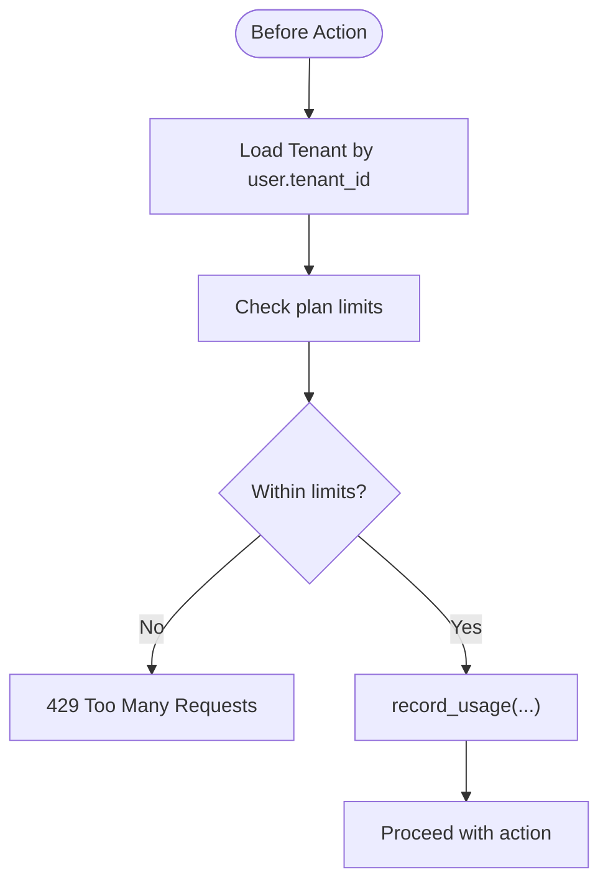
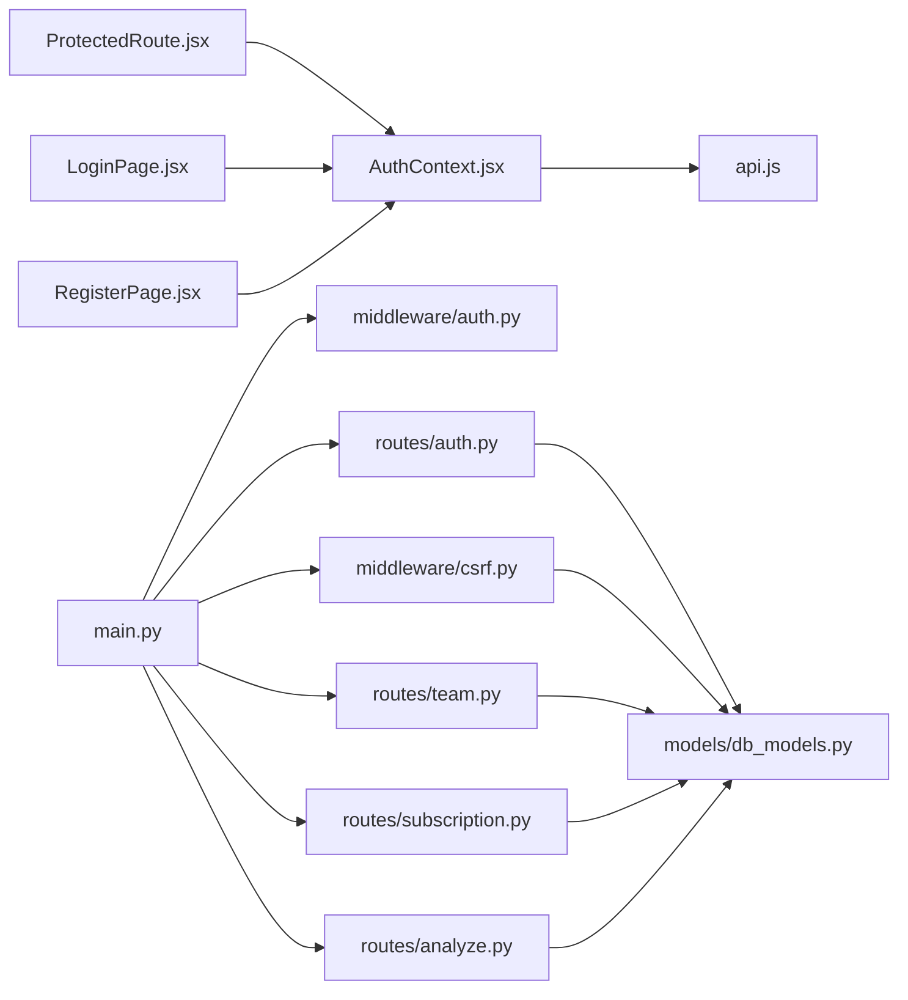

# Authentication & Authorization

<cite>
**Referenced Files in This Document**
- [auth.py](file://app/backend/middleware/auth.py)
- [auth.py](file://app/backend/routes/auth.py)
- [csrf.py](file://app/backend/middleware/csrf.py)
- [main.py](file://app/backend/main.py)
- [schemas.py](file://app/backend/models/schemas.py)
- [db_models.py](file://app/backend/models/db_models.py)
- [AuthContext.jsx](file://app/frontend/src/contexts/AuthContext.jsx)
- [api.js](file://app/frontend/src/lib/api.js)
- [ProtectedRoute.jsx](file://app/frontend/src/components/ProtectedRoute.jsx)
- [LoginPage.jsx](file://app/frontend/src/pages/LoginPage.jsx)
- [RegisterPage.jsx](file://app/frontend/src/pages/RegisterPage.jsx)
- [team.py](file://app/backend/routes/team.py)
- [subscription.py](file://app/backend/routes/subscription.py)
- [analyze.py](file://app/backend/routes/analyze.py)
</cite>

## Update Summary
**Changes Made**
- Updated JWT middleware to support dual authentication mechanisms (Authorization headers for API clients and httpOnly cookies for browser clients)
- Added mandatory JWT_SECRET_KEY environment variable validation with production safety checks
- Integrated CSRF protection middleware using double-submit cookie pattern
- Enhanced auth routes to set httpOnly cookies and CSRF tokens for browser clients
- Updated frontend authentication context and API client to handle cookie-based authentication
- Added comprehensive CSRF protection for browser-based requests

## Table of Contents
1. [Introduction](#introduction)
2. [Project Structure](#project-structure)
3. [Core Components](#core-components)
4. [Architecture Overview](#architecture-overview)
5. [Detailed Component Analysis](#detailed-component-analysis)
6. [Dependency Analysis](#dependency-analysis)
7. [Performance Considerations](#performance-considerations)
8. [Troubleshooting Guide](#troubleshooting-guide)
9. [Conclusion](#conclusion)
10. [Appendices](#appendices)

## Introduction
This document explains the authentication and authorization system for Resume AI by ThetaLogics. It covers dual authentication mechanisms (JWT tokens via Authorization headers for API clients and httpOnly cookies for browser clients), JWT token lifecycle, user registration and login flows, role-based access control (RBAC), multi-tenant isolation, password security, token refresh, session management, frontend authentication context and protected routes, API endpoint security posture, CORS configuration, and CSRF protection measures. It also provides implementation examples for custom authentication flows and permission checks, along with best practices, audit logging, and troubleshooting guidance.

## Project Structure
The authentication system spans backend FastAPI routes and middleware, SQLAlchemy models, and a React frontend with an authentication context and protected routing. The system now supports dual authentication mechanisms with comprehensive CSRF protection.

**Diagram sources**
- [main.py:174-215](file://app/backend/main.py#L174-L215)
- [auth.py:1-63](file://app/backend/middleware/auth.py#L1-L63)
- [auth.py:1-209](file://app/backend/routes/auth.py#L1-L209)
- [csrf.py:1-58](file://app/backend/middleware/csrf.py#L1-L58)
- [db_models.py:31-93](file://app/backend/models/db_models.py#L31-L93)
- [schemas.py:140-171](file://app/backend/models/schemas.py#L140-L171)
- [team.py:1-135](file://app/backend/routes/team.py#L1-L135)
- [subscription.py:1-477](file://app/backend/routes/subscription.py#L1-L477)
- [analyze.py:320-519](file://app/backend/routes/analyze.py#L320-L519)
- [AuthContext.jsx:1-71](file://app/frontend/src/contexts/AuthContext.jsx#L1-L71)
- [api.js:1-414](file://app/frontend/src/lib/api.js#L1-L414)
- [ProtectedRoute.jsx:1-24](file://app/frontend/src/components/ProtectedRoute.jsx#L1-L24)
- [LoginPage.jsx:1-121](file://app/frontend/src/pages/LoginPage.jsx#L1-L121)
- [RegisterPage.jsx:1-143](file://app/frontend/src/pages/RegisterPage.jsx#L1-L143)

**Section sources**
- [main.py:174-215](file://app/backend/main.py#L174-L215)
- [auth.py:1-63](file://app/backend/middleware/auth.py#L1-L63)
- [auth.py:1-209](file://app/backend/routes/auth.py#L1-L209)
- [csrf.py:1-58](file://app/backend/middleware/csrf.py#L1-L58)
- [db_models.py:31-93](file://app/backend/models/db_models.py#L31-L93)
- [schemas.py:140-171](file://app/backend/models/schemas.py#L140-L171)
- [AuthContext.jsx:1-71](file://app/frontend/src/contexts/AuthContext.jsx#L1-L71)
- [api.js:1-414](file://app/frontend/src/lib/api.js#L1-L414)
- [ProtectedRoute.jsx:1-24](file://app/frontend/src/components/ProtectedRoute.jsx#L1-L24)
- [LoginPage.jsx:1-121](file://app/frontend/src/pages/LoginPage.jsx#L1-L121)
- [RegisterPage.jsx:1-143](file://app/frontend/src/pages/RegisterPage.jsx#L1-L143)

## Core Components
- **Dual Authentication Middleware**: Validates bearer tokens for API clients and httpOnly cookies for browser clients, with automatic fallback between authentication methods.
- **CSRF Protection Middleware**: Implements double-submit cookie pattern to prevent CSRF attacks for browser-based requests.
- **Enhanced Auth Routes**: Registration, login, refresh, and profile retrieval with bcrypt password hashing, HS256 JWT signing, and comprehensive cookie management.
- **Mandatory JWT Secret Validation**: Requires JWT_SECRET_KEY environment variable in production with development fallback for local testing.
- **Frontend Authentication Context**: Handles cookie-based authentication, automatic CSRF token injection, and seamless token refresh.
- **Protected Routes**: Guards page navigation and displays a loader while validating session state.
- **Multi-tenant Models**: Users belong to Tenants; routes enforce tenant isolation.
- **Usage and Audit Logging**: Subscription usage checks and centralized usage logs for tenant-level auditing.

**Section sources**
- [auth.py:13-21](file://app/backend/middleware/auth.py#L13-L21)
- [auth.py:31-37](file://app/backend/middleware/auth.py#L31-L37)
- [csrf.py:13-58](file://app/backend/middleware/csrf.py#L13-L58)
- [auth.py:57-104](file://app/backend/routes/auth.py#L57-L104)
- [AuthContext.jsx:6-62](file://app/frontend/src/contexts/AuthContext.jsx#L6-L62)
- [api.js:7,18-31](file://app/frontend/src/lib/api.js#L7,L18-L31)
- [ProtectedRoute.jsx:4-23](file://app/frontend/src/components/ProtectedRoute.jsx#L4-L23)
- [db_models.py:31-93](file://app/backend/models/db_models.py#L31-L93)
- [subscription.py:427-477](file://app/backend/routes/subscription.py#L427-L477)

## Architecture Overview
The system now implements a dual authentication architecture supporting both API clients and browser clients. JWT tokens are validated centrally with automatic fallback to httpOnly cookies for browser-based authentication. CSRF protection is integrated using the double-submit cookie pattern. The backend validates tokens centrally and injects the current user into route handlers, while frontend requests automatically manage cookies and CSRF tokens.

**Diagram sources**
- [auth.py:31-37](file://app/backend/middleware/auth.py#L31-L37)
- [auth.py:57-104](file://app/backend/routes/auth.py#L57-L104)
- [auth.py:19-47](file://app/backend/middleware/auth.py#L19-L47)
- [csrf.py:33-57](file://app/backend/middleware/csrf.py#L33-L57)
- [api.js:18-43](file://app/frontend/src/lib/api.js#L18-L43)

## Detailed Component Analysis

### Dual Authentication Middleware and RBAC
- **Centralized Authentication**: The middleware now supports dual authentication methods - first checking Authorization headers for API clients, then falling back to httpOnly cookies for browser clients.
- **Mandatory JWT Secret Validation**: JWT_SECRET_KEY is now required in production with a development fallback for local testing, enhancing security posture.
- **Enhanced Token Validation**: Validates JWT algorithm and claims, loads active user from database, and supports both bearer tokens and cookie-based authentication.
- **Admin Enforcement**: Maintains admin-only access restrictions with enhanced security checks.

**Diagram sources**
- [auth.py:19-47](file://app/backend/middleware/auth.py#L19-L47)
- [auth.py:31-37](file://app/backend/middleware/auth.py#L31-L37)

**Section sources**
- [auth.py:13-21](file://app/backend/middleware/auth.py#L13-L21)
- [auth.py:19-47](file://app/backend/middleware/auth.py#L19-L47)

### CSRF Protection Middleware
- **Double-Submit Cookie Pattern**: Implements comprehensive CSRF protection using the double-submit cookie pattern for browser-based authentication.
- **Intelligent Request Filtering**: Exempts safe methods (GET, HEAD, OPTIONS), authentication endpoints, and requests using Authorization headers (API clients).
- **Automatic Token Validation**: Validates that CSRF token in cookie matches X-CSRF-Token header for browser requests.
- **Security Enhancements**: Prevents CSRF attacks while maintaining compatibility with API clients using Authorization headers.

**Diagram sources**
- [csrf.py:13-58](file://app/backend/middleware/csrf.py#L13-L58)

**Section sources**
- [csrf.py:13-58](file://app/backend/middleware/csrf.py#L13-L58)

### Enhanced Auth Routes: Registration, Login, Refresh, Profile
- **Dual Authentication Support**: Registration and login now support both API clients (Authorization header) and browser clients (httpOnly cookies).
- **Comprehensive Cookie Management**: Sets httpOnly access_token and refresh_token cookies with secure configurations, plus CSRF token cookie for browser clients.
- **Enhanced Token Response**: Returns tokens in response body for API clients while setting cookies for browser clients.
- **Mandatory JWT Secret**: Requires JWT_SECRET_KEY environment variable in production with development fallback.
- **CSRF Token Generation**: Generates and manages CSRF tokens for browser-based authentication flows.

**Diagram sources**
- [auth.py:57-104](file://app/backend/routes/auth.py#L57-L104)
- [auth.py:159-189](file://app/backend/routes/auth.py#L159-L189)
- [csrf.py:33-57](file://app/backend/middleware/csrf.py#L33-L57)

**Section sources**
- [auth.py:57-104](file://app/backend/routes/auth.py#L57-L104)
- [auth.py:159-189](file://app/backend/routes/auth.py#L159-L189)
- [auth.py:13-21](file://app/backend/middleware/auth.py#L13-L21)
- [schemas.py:140-161](file://app/backend/models/schemas.py#L140-L161)

### Frontend Authentication Context and Protected Routes
- **Cookie-Based Authentication**: AuthContext now handles httpOnly cookies automatically, loading user state on application startup.
- **CSRF Token Management**: HTTP client automatically reads CSRF tokens from cookies and attaches them as X-CSRF-Token headers for browser requests.
- **Enhanced Token Refresh**: Automatic refresh flow works seamlessly with cookie-based authentication, retrying original requests after successful refresh.
- **Secure Token Storage**: No localStorage token handling for security - all tokens managed via httpOnly cookies.
- **Protected Route Handling**: Maintains seamless protected route functionality with improved authentication state management.

**Diagram sources**
- [AuthContext.jsx:11-31](file://app/frontend/src/contexts/AuthContext.jsx#L11-L31)
- [api.js:9-43](file://app/frontend/src/lib/api.js#L9-L43)
- [auth.py:192-199](file://app/backend/routes/auth.py#L192-L199)

**Section sources**
- [AuthContext.jsx:6-62](file://app/frontend/src/contexts/AuthContext.jsx#L6-L62)
- [api.js:7,18-31](file://app/frontend/src/lib/api.js#L7,L18-L31)
- [api.js:33-51](file://app/frontend/src/lib/api.js#L33-L51)
- [ProtectedRoute.jsx:4-23](file://app/frontend/src/components/ProtectedRoute.jsx#L4-L23)
- [LoginPage.jsx:15-27](file://app/frontend/src/pages/LoginPage.jsx#L15-L27)
- [RegisterPage.jsx:16-32](file://app/frontend/src/pages/RegisterPage.jsx#L16-L32)

### Multi-Tenant Access Control and Permission Hierarchies
- Tenant model stores multi-tenant metadata and subscription state.
- User model includes role and tenant association.
- Team routes enforce tenant isolation and admin-only member management.
- Subscription routes enforce tenant-scoped usage checks and admin-only plan management.
- Analyze routes enforce tenant isolation and usage checks before processing.

**Diagram sources**
- [db_models.py:31-93](file://app/backend/models/db_models.py#L31-L93)

**Section sources**
- [db_models.py:31-93](file://app/backend/models/db_models.py#L31-L93)
- [team.py:18-83](file://app/backend/routes/team.py#L18-L83)
- [subscription.py:172-253](file://app/backend/routes/subscription.py#L172-L253)
- [analyze.py:323-351](file://app/backend/routes/analyze.py#L323-L351)

### Password Security Practices
- Passwords are hashed using bcrypt via a CryptContext configured for bcrypt.
- Minimum password length enforced during registration.
- Password verification performed against stored hashes during login.

**Section sources**
- [auth.py:22-35](file://app/backend/routes/auth.py#L22-L35)
- [auth.py:62-63](file://app/backend/routes/auth.py#L62-L63)
- [auth.py:101-103](file://app/backend/routes/auth.py#L101-L103)

### Token Refresh Mechanisms and Session Management
- Access tokens expire after a configurable duration; refresh tokens expire after a longer period.
- Refresh endpoint validates refresh token type and regenerates both access and refresh tokens.
- Frontend automatically refreshes on 401 and retries the original request.
- Cookie-based refresh maintains security through httpOnly cookies and CSRF protection.

**Section sources**
- [auth.py:24-25](file://app/backend/routes/auth.py#L24-L25)
- [auth.py:169-189](file://app/backend/routes/auth.py#L169-L189)
- [api.js:33-51](file://app/frontend/src/lib/api.js#L33-L51)

### API Endpoint Security, CORS, and CSRF Considerations
- **CORS Configuration**: Origins configured for local development and staging environments with credentials allowed.
- **CSRF Protection**: Comprehensive CSRF protection implemented using double-submit cookie pattern for browser-based requests.
- **Authentication Method Detection**: Automatic detection between API clients (Authorization header) and browser clients (httpOnly cookies).
- **Security Hardening**: Enhanced security posture with mandatory JWT secret validation and secure cookie configurations.

**Section sources**
- [main.py:181-198](file://app/backend/main.py#L181-L198)
- [main.py:200-202](file://app/backend/main.py#L200-L202)
- [auth.py:13-21](file://app/backend/middleware/auth.py#L13-L21)
- [auth.py:72-101](file://app/backend/routes/auth.py#L72-L101)

### Implementation Examples

#### Example: Require Admin for Team Management
- Use the admin dependency to guard team member operations.

**Diagram sources**
- [team.py:34-61](file://app/backend/routes/team.py#L34-L61)
- [auth.py:59-62](file://app/backend/middleware/auth.py#L59-L62)
- [csrf.py:33-57](file://app/backend/middleware/csrf.py#L33-L57)

#### Example: Tenant-Isolated Usage Checks
- Before performing actions, check tenant usage limits scoped to the current user's tenant.

**Diagram sources**
- [subscription.py:256-343](file://app/backend/routes/subscription.py#L256-L343)
- [subscription.py:427-477](file://app/backend/routes/subscription.py#L427-L477)
- [analyze.py:323-351](file://app/backend/routes/analyze.py#L323-L351)

## Dependency Analysis
- **Backend**:
  - Auth routes depend on middleware for current user and admin enforcement.
  - CSRF middleware provides cross-cutting security concerns.
  - Team and subscription routes depend on middleware for current user and admin enforcement.
  - Analyze routes depend on usage helpers and middleware for tenant isolation.
- **Frontend**:
  - AuthContext depends on HTTP client for API calls with cookie management.
  - ProtectedRoute depends on AuthContext for user state.
  - Pages trigger AuthContext actions for login/register with enhanced security.

**Diagram sources**
- [main.py:174-215](file://app/backend/main.py#L174-L215)
- [auth.py:1-63](file://app/backend/middleware/auth.py#L1-L63)
- [auth.py:1-209](file://app/backend/routes/auth.py#L1-L209)
- [csrf.py:1-58](file://app/backend/middleware/csrf.py#L1-L58)
- [team.py:1-135](file://app/backend/routes/team.py#L1-L135)
- [subscription.py:1-477](file://app/backend/routes/subscription.py#L1-L477)
- [analyze.py:320-519](file://app/backend/routes/analyze.py#L320-L519)
- [db_models.py:31-93](file://app/backend/models/db_models.py#L31-L93)
- [AuthContext.jsx:1-71](file://app/frontend/src/contexts/AuthContext.jsx#L1-L71)
- [api.js:1-414](file://app/frontend/src/lib/api.js#L1-L414)
- [ProtectedRoute.jsx:1-24](file://app/frontend/src/components/ProtectedRoute.jsx#L1-L24)
- [LoginPage.jsx:1-121](file://app/frontend/src/pages/LoginPage.jsx#L1-L121)
- [RegisterPage.jsx:1-143](file://app/frontend/src/pages/RegisterPage.jsx#L1-L143)

**Section sources**
- [main.py:174-215](file://app/backend/main.py#L174-L215)
- [auth.py:1-63](file://app/backend/middleware/auth.py#L1-L63)
- [auth.py:1-209](file://app/backend/routes/auth.py#L1-L209)
- [csrf.py:1-58](file://app/backend/middleware/csrf.py#L1-L58)
- [team.py:1-135](file://app/backend/routes/team.py#L1-L135)
- [subscription.py:1-477](file://app/backend/routes/subscription.py#L1-L477)
- [analyze.py:320-519](file://app/backend/routes/analyze.py#L320-L519)
- [db_models.py:31-93](file://app/backend/models/db_models.py#L31-L93)
- [AuthContext.jsx:1-71](file://app/frontend/src/contexts/AuthContext.jsx#L1-L71)
- [api.js:1-414](file://app/frontend/src/lib/api.js#L1-L414)
- [ProtectedRoute.jsx:1-24](file://app/frontend/src/components/ProtectedRoute.jsx#L1-L24)
- [LoginPage.jsx:1-121](file://app/frontend/src/pages/LoginPage.jsx#L1-L121)
- [RegisterPage.jsx:1-143](file://app/frontend/src/pages/RegisterPage.jsx#L1-L143)

## Performance Considerations
- **Token Validation**: Occurs per request with dual authentication support; keep secret key secure and avoid excessive token lifetimes.
- **CSRF Overhead**: Minimal performance impact from CSRF middleware with intelligent request filtering.
- **Cookie Management**: Efficient cookie-based authentication reduces token storage overhead compared to localStorage.
- **Password Hashing**: Computationally intensive bcrypt hashing; tune cost appropriately.
- **Frontend Retry Logic**: Refresh flow reduces user friction but may increase backend load under contention—consider rate-limiting refresh endpoints.
- **Tenant Queries**: Leverage indexed tenant_id fields to minimize latency in multi-tenant operations.

## Troubleshooting Guide
- **401 Not authenticated**:
  - **Cause**: Missing Authorization header or invalid httpOnly cookies.
  - **Fix**: Ensure cookies are accepted and CSRF tokens are present; verify frontend interceptor handles cookies automatically.
- **401 Invalid or expired token**:
  - **Cause**: Expired access token or tampered token.
  - **Fix**: Trigger refresh flow; confirm refresh token validity and regenerate access token using cookie-based refresh.
- **401 Invalid email or password**:
  - **Cause**: Incorrect credentials or inactive user.
  - **Fix**: Re-enter credentials; ensure user is active.
- **403 Admin access required**:
  - **Cause**: Non-admin user attempting admin-only operation.
  - **Fix**: Use an admin account or adjust permissions.
- **403 CSRF token missing or invalid**:
  - **Cause**: Missing or mismatched CSRF token in cookie vs X-CSRF-Token header.
  - **Fix**: Ensure CSRF token cookie is present and matches header; check browser cookie settings.
- **404 Tenant not found**:
  - **Cause**: User belongs to a deleted or orphaned tenant.
  - **Fix**: Recreate tenant association or contact support.
- **429 Too Many Requests**:
  - **Cause**: Exceeded monthly usage limit.
  - **Fix**: Upgrade plan or reduce usage; verify usage checks before initiating actions.
- **CORS errors**:
  - **Cause**: Origin not permitted or credentials mismatch.
  - **Fix**: Configure allowed origins and ensure credentials are enabled in development/staging.

**Section sources**
- [auth.py:23-40](file://app/backend/middleware/auth.py#L23-L40)
- [auth.py:101-103](file://app/backend/routes/auth.py#L101-L103)
- [auth.py:121-127](file://app/backend/routes/auth.py#L121-L127)
- [csrf.py:51-55](file://app/backend/middleware/csrf.py#L51-L55)
- [team.py:66-82](file://app/backend/routes/team.py#L66-L82)
- [subscription.py:270-272](file://app/backend/routes/subscription.py#L270-L272)
- [subscription.py:340-343](file://app/backend/routes/subscription.py#L340-L343)
- [main.py:181-198](file://app/backend/main.py#L181-L198)

## Conclusion
The system implements a robust, tenant-aware authentication and authorization framework with comprehensive dual authentication support. The enhanced architecture now supports both API clients (Authorization headers) and browser clients (httpOnly cookies) with integrated CSRF protection. Mandatory JWT_SECRET_KEY validation strengthens security in production environments. Frontend integration provides seamless cookie management, automatic CSRF token handling, and secure token refresh. Multi-tenant models and tenant-scoped routes ensure isolation. The comprehensive CSRF protection, secure cookie configurations, and dual authentication mechanisms provide enterprise-grade security for Resume AI by ThetaLogics.

## Appendices

### Best Practices Checklist
- **JWT Secret Management**: Rotate JWT secret regularly and store in environment variables with mandatory production validation.
- **HTTPS Enforcement**: Enforce HTTPS in production to protect tokens and cookies in transit.
- **Cookie Security**: Use httpOnly, secure, and SameSite attributes for all authentication cookies.
- **CSRF Protection**: Maintain CSRF protection for browser-based requests while allowing API clients to bypass.
- **Token Lifecycle**: Limit token lifetimes; prefer short-lived access tokens with refresh tokens.
- **Monitoring**: Monitor and alert on repeated 401 responses indicating potential token theft.
- **Audit Logging**: Audit tenant usage and user actions for compliance and anomaly detection.
- **CORS Hardening**: Harden CORS policy to specific origins in production environments.

### Enhanced Security Features
- **Dual Authentication Methods**: Seamless support for both API clients and browser clients.
- **Mandatory JWT Secret**: Production-ready JWT secret validation with development fallback.
- **CSRF Protection**: Comprehensive CSRF protection using double-submit cookie pattern.
- **Secure Cookie Management**: HttpOnly cookies with secure configurations and automatic CSRF token handling.
- **Automatic Token Refresh**: Seamless refresh flow for both API and browser clients.

### Audit Logging and Account Management
- Usage logs capture tenant and user actions with timestamps and details.
- Admin endpoints allow resetting usage and changing plans for testing and support.

**Section sources**
- [db_models.py:79-93](file://app/backend/models/db_models.py#L79-L93)
- [subscription.py:346-367](file://app/backend/routes/subscription.py#L346-L367)
- [subscription.py:372-423](file://app/backend/routes/subscription.py#L372-L423)