# Frontend Authentication Context

<cite>
**Referenced Files in This Document**
- [AuthContext.jsx](file://app/frontend/src/contexts/AuthContext.jsx)
- [ProtectedRoute.jsx](file://app/frontend/src/components/ProtectedRoute.jsx)
- [api.js](file://app/frontend/src/lib/api.js)
- [App.jsx](file://app/frontend/src/App.jsx)
- [main.jsx](file://app/frontend/src/main.jsx)
- [LoginPage.jsx](file://app/frontend/src/pages/LoginPage.jsx)
- [RegisterPage.jsx](file://app/frontend/src/pages/RegisterPage.jsx)
- [NavBar.jsx](file://app/frontend/src/components/NavBar.jsx)
- [AppShell.jsx](file://app/frontend/src/components/AppShell.jsx)
- [auth.py](file://app/backend/routes/auth.py)
- [auth.py](file://app/backend/middleware/auth.py)
- [csrf.py](file://app/backend/middleware/csrf.py)
- [uploadChunked.js](file://app/frontend/src/lib/uploadChunked.js)
</cite>

## Update Summary
**Changes Made**
- Enhanced authentication interceptor with intelligent failure handling and 10-second grace period mechanism to prevent cascading logout events during transient authentication failures
- Implemented enhanced retry logic with exponential backoff (1s, 2s, 4s delays) for transient failures across the entire application stack
- Added intelligent session expiration detection using lastSuccessfulAuthTime to distinguish between transient failures and genuine session expiry
- Updated AuthContext provider with automatic retry logic for network errors during session validation
- Enhanced API client with comprehensive retry interceptor for 5xx errors and network failures
- Strengthened logout mechanism with custom event dispatching for seamless React navigation

## Table of Contents
1. [Introduction](#introduction)
2. [Project Structure](#project-structure)
3. [Core Components](#core-components)
4. [Architecture Overview](#architecture-overview)
5. [Detailed Component Analysis](#detailed-component-analysis)
6. [Dependency Analysis](#dependency-analysis)
7. [Performance Considerations](#performance-considerations)
8. [Troubleshooting Guide](#troubleshooting-guide)
9. [Conclusion](#conclusion)

## Introduction
This document explains the frontend authentication system for the Resume AI by ThetaLogics application. It covers the AuthContext provider, authentication state management, automatic cookie-based session persistence, enhanced logout functionality, protected routing, authentication guards, and integration with API calls. The system now uses httpOnly cookies for secure token storage and automatic cookie transmission, eliminating localStorage vulnerabilities while maintaining seamless user experience. Recent enhancements include intelligent failure handling with 10-second grace period mechanism to prevent cascading logout events during transient authentication failures, comprehensive retry mechanisms with exponential backoff, and enhanced logout functionality with custom event dispatching.

## Project Structure
The frontend authentication system is organized around a React Context provider with race condition protection, route protection, and a shared API client with enhanced interceptors. The provider is mounted at the root of the application and exposes authentication state and actions to all routed components. Protected routes wrap page shells to enforce authentication. The system now relies on automatic cookie transmission for seamless authentication without manual token management, with enhanced security through CSRF protection, race condition prevention, and intelligent failure handling mechanisms.

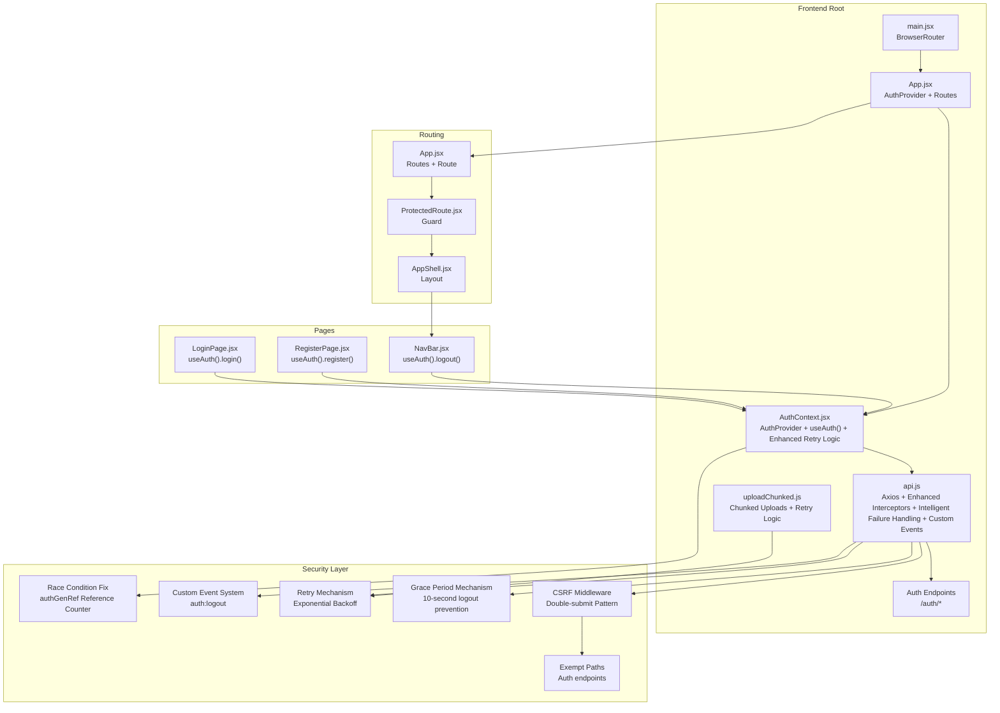

**Diagram sources**
- [main.jsx:1-23](file://app/frontend/src/main.jsx#L1-L23)
- [App.jsx:1-156](file://app/frontend/src/App.jsx#L1-L156)
- [AuthContext.jsx:1-112](file://app/frontend/src/contexts/AuthContext.jsx#L1-L112)
- [api.js:1-1498](file://app/frontend/src/lib/api.js#L1-L1498)
- [uploadChunked.js:1-502](file://app/frontend/src/lib/uploadChunked.js#L1-L502)
- [ProtectedRoute.jsx:1-24](file://app/frontend/src/components/ProtectedRoute.jsx#L1-L24)
- [AppShell.jsx:1-13](file://app/frontend/src/components/AppShell.jsx#L1-L13)
- [LoginPage.jsx:1-216](file://app/frontend/src/pages/LoginPage.jsx#L1-L216)
- [RegisterPage.jsx:1-143](file://app/frontend/src/pages/RegisterPage.jsx#L1-L143)
- [NavBar.jsx:1-336](file://app/frontend/src/components/NavBar.jsx#L1-L336)
- [csrf.py:1-105](file://app/backend/middleware/csrf.py#L1-L105)

**Section sources**
- [main.jsx:1-23](file://app/frontend/src/main.jsx#L1-L23)
- [App.jsx:1-156](file://app/frontend/src/App.jsx#L1-L156)

## Core Components
- **AuthProvider with Enhanced Retry Logic**: Manages authentication state with authGenRef reference counter to prevent stale loadUser from overwriting successful login state, loads persisted sessions via automatic cookie validation, and includes automatic retry logic for network errors during session validation.
- **useAuth**: Hook to access authentication state and actions from any component.
- **ProtectedRoute**: Route guard that blocks unauthenticated users and shows a loader while checking session state using automatic cookie authentication.
- **Enhanced API Client**: Axios instance configured with `withCredentials: true` for automatic cookie transmission, CSRF token injection for non-GET requests, automatic refresh on 401 errors with intelligent failure handling, comprehensive retry interceptor with exponential backoff for 5xx errors and network failures, and custom event dispatching for logout handling.
- **Intelligent Failure Handling**: Implements 10-second grace period mechanism to prevent cascading logout events during transient authentication failures by checking lastSuccessfulAuthTime against current time.
- **Enhanced Retry Mechanism**: Implements exponential backoff retry logic (1s, 2s, 4s delays) for transient failures across the entire application stack.
- **CSRF Protection Middleware**: Server-side middleware implementing double-submit cookie pattern with exemptions for authentication endpoints.
- **LoginPage and RegisterPage**: Forms that call useAuth to authenticate and receive httpOnly cookies from the server.
- **NavBar**: Displays user info and triggers logout via useAuth, which clears httpOnly cookies and CSRF tokens.

Key responsibilities:
- **Authentication state**: user, tenant, loading
- **Race condition prevention**: authGenRef reference counter mechanism
- **Token storage**: httpOnly cookies (access_token, refresh_token) and CSRF token
- **Session persistence**: automatic validation via cookie-based authentication on app load with retry logic
- **Token refresh**: automatic refresh on 401 with intelligent failure detection and 10-second grace period
- **Route protection**: ProtectedRoute enforces authentication and loading UX
- **Security**: CSRF protection and enhanced token security through httpOnly cookies
- **Login loop prevention**: AUTH_PATHS array in API interceptor prevents infinite refresh cycles
- **Network reliability**: Automatic retry with exponential backoff for transient failures
- **Error handling**: Intelligent failure detection with grace period mechanism to prevent cascading logout
- **Custom event handling**: window.dispatchEvent for seamless logout navigation

**Section sources**
- [AuthContext.jsx:1-112](file://app/frontend/src/contexts/AuthContext.jsx#L1-L112)
- [ProtectedRoute.jsx:1-24](file://app/frontend/src/components/ProtectedRoute.jsx#L1-L24)
- [api.js:1-1498](file://app/frontend/src/lib/api.js#L1-L1498)
- [uploadChunked.js:1-502](file://app/frontend/src/lib/uploadChunked.js#L1-L502)
- [LoginPage.jsx:1-216](file://app/frontend/src/pages/LoginPage.jsx#L1-L216)
- [RegisterPage.jsx:1-143](file://app/frontend/src/pages/RegisterPage.jsx#L1-L143)
- [NavBar.jsx:1-336](file://app/frontend/src/components/NavBar.jsx#L1-L336)
- [csrf.py:1-105](file://app/backend/middleware/csrf.py#L1-L105)

## Architecture Overview
The authentication flow integrates React Context with race condition protection, automatic cookie-based authentication, route protection, CSRF token handling, enhanced security measures, and intelligent failure handling with 10-second grace period mechanism. The authGenRef reference counter prevents stale loadUser promises from overwriting successful login state. On app load, the provider validates the stored access_token via automatic cookie transmission and hydrates user/tenant state with automatic retry logic for network errors. API calls automatically attach cookies and handle 401 responses by refreshing tokens, with the AUTH_PATHS array preventing login loops. The intelligent failure handling mechanism checks lastSuccessfulAuthTime against current time to determine if logout should be triggered, preventing cascading logout events during transient failures. The enhanced retry interceptor provides exponential backoff (1s, 2s, 4s delays) for 5xx errors and network failures. Protected routes render a loading spinner while resolving authentication state and redirect unauthenticated users to the login page. Custom logout events enable seamless React navigation without full page reloads.

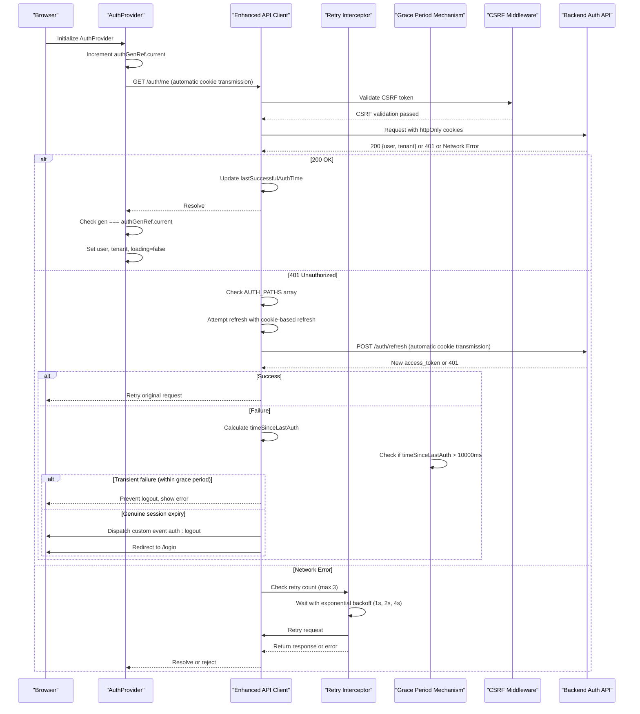

**Diagram sources**
- [AuthContext.jsx:14-45](file://app/frontend/src/contexts/AuthContext.jsx#L14-L45)
- [api.js:59-107](file://app/frontend/src/lib/api.js#L59-L107)
- [api.js:114-140](file://app/frontend/src/lib/api.js#L114-L140)
- [csrf.py:34-40](file://app/backend/middleware/csrf.py#L34-L40)
- [auth.py:192-198](file://app/backend/routes/auth.py#L192-L198)

## Detailed Component Analysis

### Enhanced Authentication Interceptor with Intelligent Failure Handling
**Updated** Enhanced authentication interceptor with 10-second grace period mechanism to prevent cascading logout events during transient authentication failures

The API interceptor now includes sophisticated intelligent failure handling that distinguishes between transient authentication failures and genuine session expiry. The system tracks the last successful authenticated response time using lastSuccessfulAuthTime and applies a 10-second grace period mechanism to prevent cascading logout events. When a refresh attempt fails, the interceptor calculates the time elapsed since the last successful authentication and only triggers logout if the session is genuinely expired (timeSinceLastAuth > 10000ms).

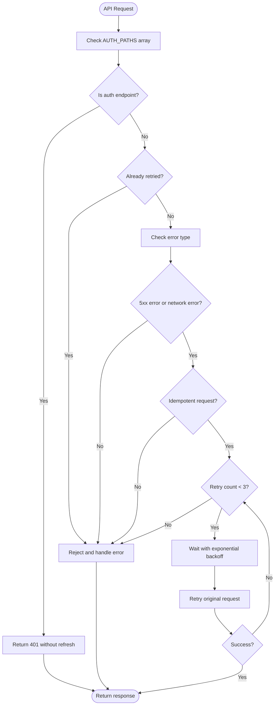

**Diagram sources**
- [api.js:114-140](file://app/frontend/src/lib/api.js#L114-L140)

Implementation highlights:
- **lastSuccessfulAuthTime tracking**: Monitors the timestamp of the last successful authenticated response
- **Grace period mechanism**: 10-second threshold to distinguish transient failures from genuine session expiry
- **Intelligent logout prevention**: Prevents cascading logout during brief network/transient authentication issues
- **Enhanced retry logic**: Exponential backoff (1s, 2s, 4s delays) for transient failures
- **Idempotent requests only**: Only GET requests and explicitly marked idempotent POST requests are retried
- **Network error handling**: Automatic retry for network failures (no response)
- **5xx error handling**: Automatic retry for server-side errors
- **Graceful degradation**: On max retries exceeded, returns the original error without logout

**Section sources**
- [api.js:95-107](file://app/frontend/src/lib/api.js#L95-L107)

### Enhanced API Interceptor with Intelligent Failure Detection
**Updated** Enhanced API interceptor with intelligent failure detection using lastSuccessfulAuthTime and 10-second grace period mechanism

The API interceptor now implements intelligent failure detection that monitors authentication success timestamps to make informed decisions about logout triggers. The system maintains lastSuccessfulAuthTime to track when the last successful authenticated response occurred. When authentication failures occur, the interceptor calculates the elapsed time since the last successful authentication and applies the 10-second grace period rule to prevent premature logout during transient network issues or brief authentication service interruptions.

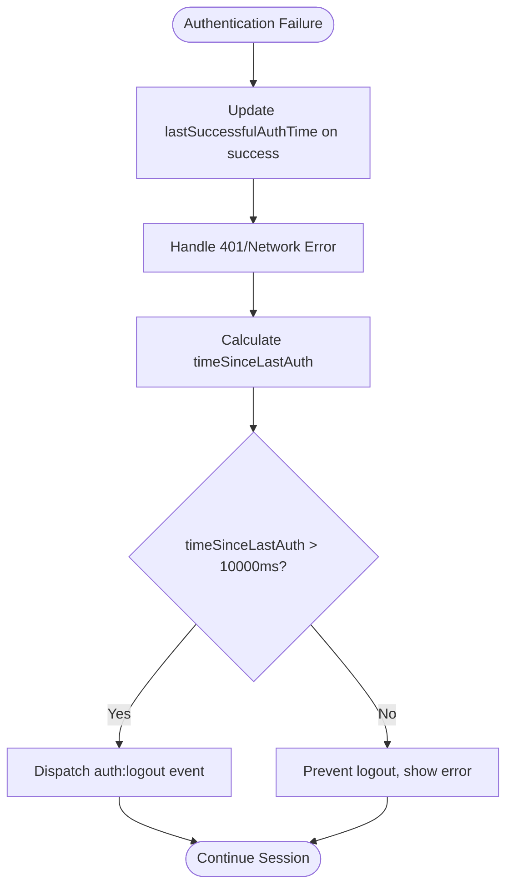

**Diagram sources**
- [api.js:60-67](file://app/frontend/src/lib/api.js#L60-L67)
- [api.js:95-107](file://app/frontend/src/lib/api.js#L95-L107)

Implementation highlights:
- **Timestamp tracking**: lastSuccessfulAuthTime captures authentication success moments
- **Grace period enforcement**: 10-second threshold prevents logout during transient failures
- **Intelligent decision making**: Distinguishes between temporary failures and genuine session expiry
- **Logout prevention**: Stops cascading logout events during brief authentication issues
- **Error preservation**: Maintains error context for user feedback while preventing logout

**Section sources**
- [api.js:56-67](file://app/frontend/src/lib/api.js#L56-L67)
- [api.js:95-107](file://app/frontend/src/lib/api.js#L95-L107)

### Enhanced AuthContext Provider with Automatic Retry
**Updated** Enhanced AuthContext provider with automatic network retry capabilities for transient failures and custom event listener

The AuthContext provider now includes automatic retry logic for network errors during session validation and listens for custom logout events. When the initial `/auth/me` request fails due to network connectivity issues, the provider automatically retries once after a 1-second delay before concluding that the user is not authenticated. The provider also listens for the `auth:logout` custom event dispatched from the API interceptor to clear authentication state seamlessly.

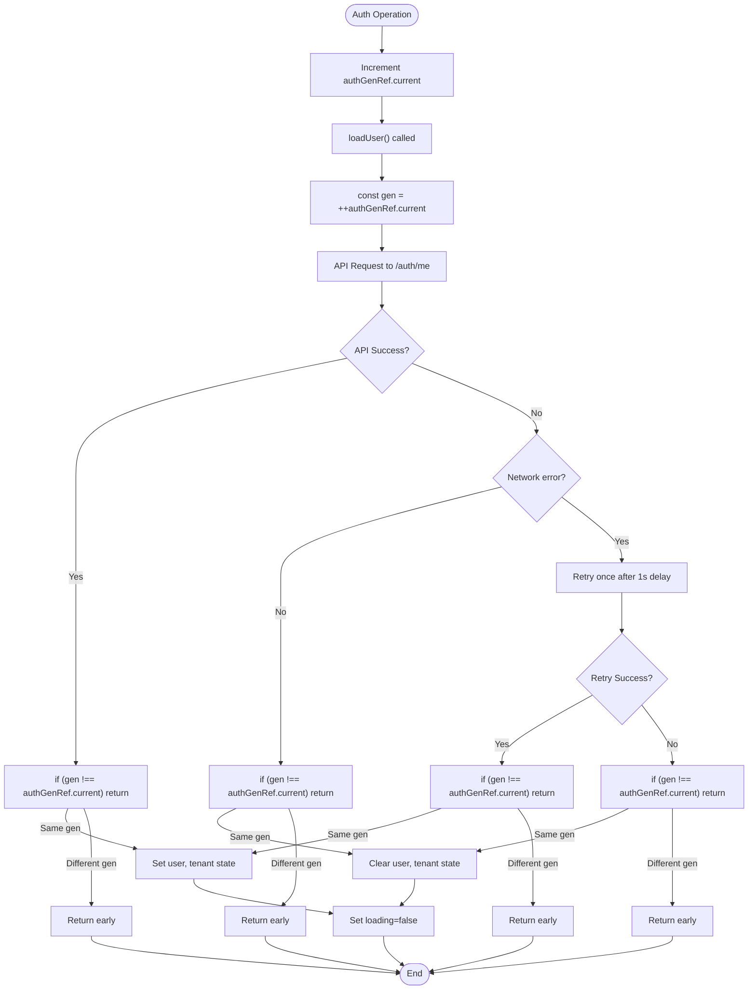

**Diagram sources**
- [AuthContext.jsx:14-45](file://app/frontend/src/contexts/AuthContext.jsx#L14-L45)

Implementation highlights:
- **Automatic retry logic**: Retries once on network errors (no response) with 1-second delay
- **Race condition prevention**: Maintains authGenRef reference counter for all operations
- **Network error detection**: Checks for missing response property to identify network failures
- **Graceful fallback**: On retry failure, treats as invalid authentication and clears state
- **Custom event listener**: Listens for 'auth:logout' event to clear state without page reload
- **Consistent loading state**: Ensures loading state is properly managed throughout retry process

**Section sources**
- [AuthContext.jsx:14-45](file://app/frontend/src/contexts/AuthContext.jsx#L14-L45)

### Enhanced Retry Mechanism in UploadChunked.js
**Updated** Enhanced uploadChunked.js with automatic retry capabilities for chunked file uploads

The uploadChunked.js module now includes automatic retry logic for chunked file uploads with exponential backoff. This ensures that individual chunk uploads can recover from transient network failures without requiring the entire upload process to restart.

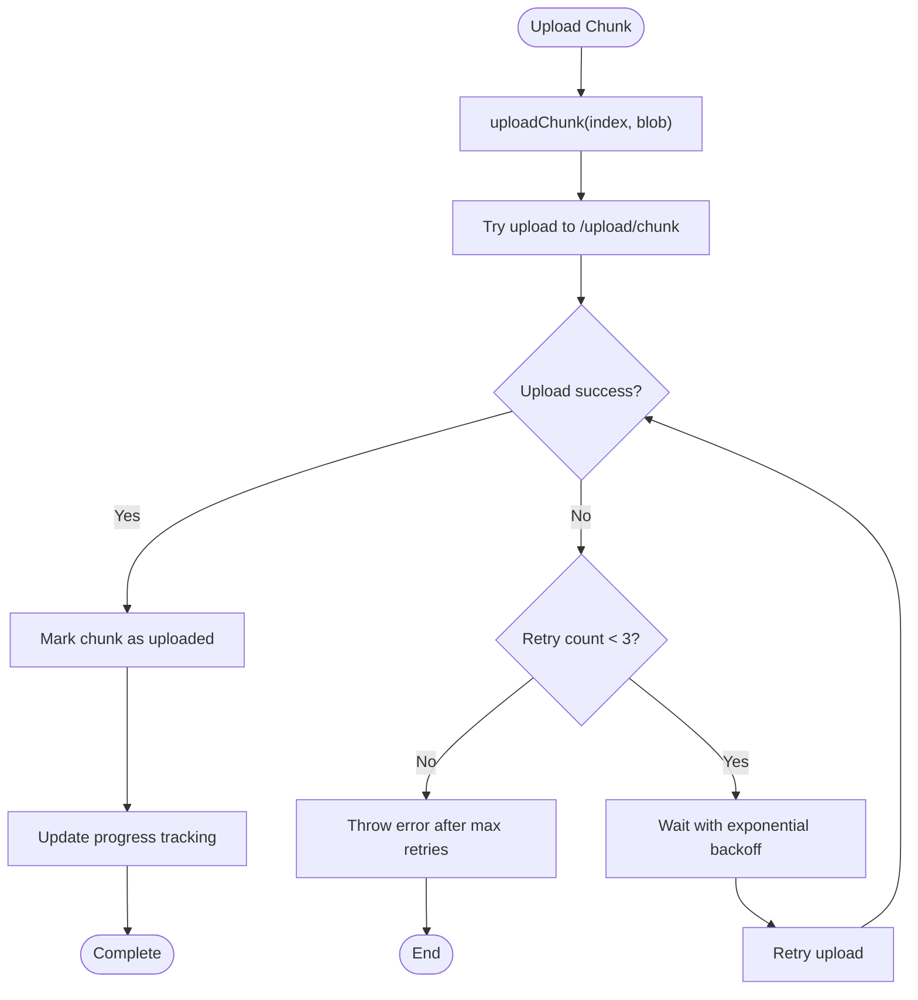

**Diagram sources**
- [uploadChunked.js:300-335](file://app/frontend/src/lib/uploadChunked.js#L300-L335)

Implementation highlights:
- **MAX_RETRIES constant**: Configured to 3 retry attempts per chunk
- **Exponential backoff**: Delays increase with each retry attempt
- **Parallel processing**: Maintains 3 concurrent chunk uploads while applying retry logic
- **Progress tracking**: Continues to track progress even during retry attempts
- **Error reporting**: Provides detailed error messages with retry count information

**Section sources**
- [uploadChunked.js:23-335](file://app/frontend/src/lib/uploadChunked.js#L23-L335)

### ProtectedRoute Component
Protects routes by checking authentication state and rendering a loading indicator while resolving. Unauthenticated users are redirected to the login page.

**Diagram sources**
- [ProtectedRoute.jsx:4-23](file://app/frontend/src/components/ProtectedRoute.jsx#L4-L23)

**Section sources**
- [ProtectedRoute.jsx:1-24](file://app/frontend/src/components/ProtectedRoute.jsx#L1-L24)

### Authentication Guards and Conditional Rendering
ProtectedRoute acts as a guard for all pages under the AppShell. The App component mounts AuthProvider at the root and wraps page shells with ProtectedRoute and SubscriptionProvider.

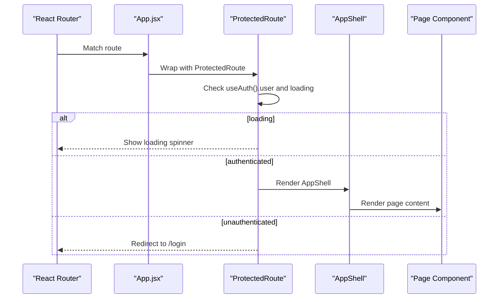

**Diagram sources**
- [App.jsx:29-37](file://app/frontend/src/App.jsx#L29-L37)
- [ProtectedRoute.jsx:4-23](file://app/frontend/src/components/ProtectedRoute.jsx#L4-L23)
- [AppShell.jsx:3-12](file://app/frontend/src/components/AppShell.jsx#L3-L12)

**Section sources**
- [App.jsx:1-156](file://app/frontend/src/App.jsx#L1-L156)

### Consuming Authentication Context in Components
- **LoginPage**: Uses useAuth().login to submit credentials, receives httpOnly cookies from server, and navigates on success.
- **RegisterPage**: Uses useAuth().register to create a workspace, receives httpOnly cookies from server.
- **NavBar**: Uses useAuth().logout to sign out, which clears all cookies and tokens, and displays user initials and role.

Examples of consumption patterns:
- Call useAuth() to access login, register, logout, user, tenant, and loading.
- Handle errors from login/register by displaying user-friendly messages.
- Trigger navigation after successful authentication.
- Logout automatically clears all authentication state and cookies.

**Section sources**
- [LoginPage.jsx:1-216](file://app/frontend/src/pages/LoginPage.jsx#L1-L216)
- [RegisterPage.jsx:1-143](file://app/frontend/src/pages/RegisterPage.jsx#L1-L143)
- [NavBar.jsx:1-336](file://app/frontend/src/components/NavBar.jsx#L1-L336)

### Enhanced Token Storage and Session Persistence
**Updated** Complete removal of localStorage token handling with enhanced retry capabilities and intelligent failure detection

- **Cookies only**: Tokens are stored as httpOnly cookies: access_token and refresh_token
- **CSRF protection**: Separate csrf_token cookie for CSRF protection
- **Automatic validation**: On app load, cookies are automatically transmitted to `/auth/me` for validation with automatic retry logic
- **Server-side clearing**: On invalid/expired tokens, server clears cookies and returns 401
- **Automatic attachment**: API client configured with `withCredentials: true` for automatic cookie transmission
- **Network resilience**: Automatic retry on network errors during session validation
- **Intelligent logout prevention**: 10-second grace period mechanism prevents cascading logout during transient failures
- **Custom event handling**: window.dispatchEvent('auth:logout') enables seamless React navigation

Security benefits:
- **XSS protection**: Tokens cannot be accessed via JavaScript due to httpOnly flag
- **CSRF protection**: CSRF tokens are validated on non-GET requests
- **Secure by default**: Tokens are only sent over HTTPS in production environments
- **Automatic cleanup**: Server-side token expiration and cleanup
- **Reliability**: Enhanced retry mechanisms for improved authentication reliability
- **Seamless navigation**: Custom events enable logout without full page reloads

**Section sources**
- [AuthContext.jsx:14-45](file://app/frontend/src/contexts/AuthContext.jsx#L14-L45)
- [api.js:5-8](file://app/frontend/src/lib/api.js#L5-L8)
- [api.js:18-31](file://app/frontend/src/lib/api.js#L18-L31)
- [auth.py:57-103](file://app/backend/routes/auth.py#L57-L103)

### Enhanced Token Refresh Handling
**Updated** Enhanced token refresh handling with AUTH_PATHS array, intelligent failure detection, and custom event dispatching

The API interceptor handles 401 responses by attempting a refresh using the automatic cookie-based refresh mechanism. The AUTH_PATHS array prevents refresh attempts for authentication endpoints, eliminating the risk of infinite login loops. On success, it updates the access token via cookie and retries the original request. On failure, it calculates the time elapsed since the last successful authentication and only dispatches a custom 'auth:logout' event if the session is genuinely expired (timeSinceLastAuth > 10000ms). The enhanced retry mechanism provides additional resilience against transient failures.

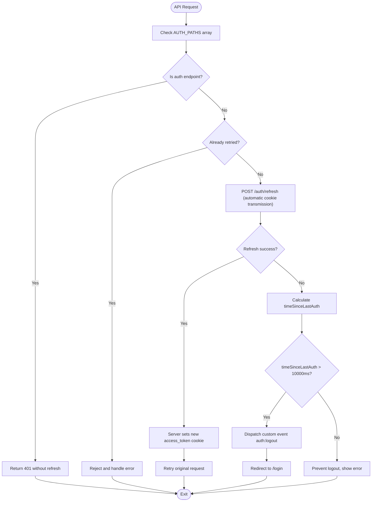

**Diagram sources**
- [api.js:59-107](file://app/frontend/src/lib/api.js#L59-L107)
- [auth.py:159-189](file://app/backend/routes/auth.py#L159-L189)

**Section sources**
- [api.js:59-107](file://app/frontend/src/lib/api.js#L59-L107)

### Enhanced Logout Implementation
**Updated** Enhanced logout functionality that clears httpOnly cookies and CSRF tokens with custom event dispatching

Logout removes all authentication cookies and clears user/tenant state. The server endpoint handles complete cleanup of httpOnly cookies and CSRF tokens. The API interceptor dispatches a custom 'auth:logout' event that the AuthProvider listens for to clear state without triggering a full page reload. This enables seamless navigation to the login page while maintaining React's single-page application behavior. The intelligent failure detection ensures that logout is only triggered for genuine session expiry, not transient authentication failures.

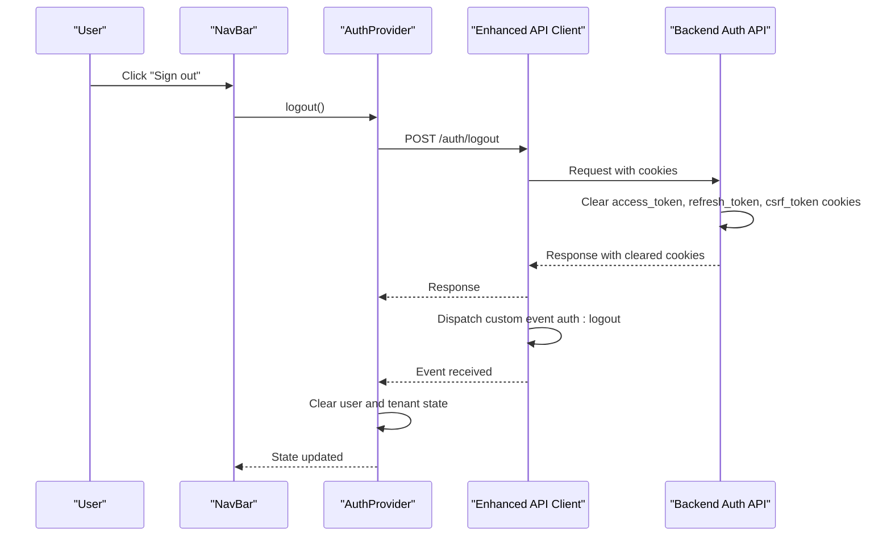

**Diagram sources**
- [NavBar.jsx:103-109](file://app/frontend/src/components/NavBar.jsx#L103-L109)
- [AuthContext.jsx:89-98](file://app/frontend/src/contexts/AuthContext.jsx#L89-L98)
- [auth.py:201-208](file://app/backend/routes/auth.py#L201-L208)

**Section sources**
- [NavBar.jsx:1-336](file://app/frontend/src/components/NavBar.jsx#L1-L336)
- [AuthContext.jsx:89-98](file://app/frontend/src/contexts/AuthContext.jsx#L89-L98)

### Enhanced Integration with API Calls
**Updated** Enhanced API integration with automatic cookie transmission, CSRF token handling, AUTH_PATHS array, intelligent failure detection, comprehensive retry mechanisms, and custom event system

The api client attaches cookies automatically to every request and handles 401 responses by refreshing tokens via cookie-based mechanisms. It also supports CSRF protection for non-GET requests and streaming analysis with cookie-aware fetch-based endpoints. The AUTH_PATHS array prevents login loops by skipping refresh logic for authentication endpoints. The intelligent failure detection mechanism tracks lastSuccessfulAuthTime and applies a 10-second grace period to prevent cascading logout during transient failures. The enhanced retry interceptor provides exponential backoff for 5xx errors and network failures. Custom event dispatching enables seamless logout navigation without full page reloads.

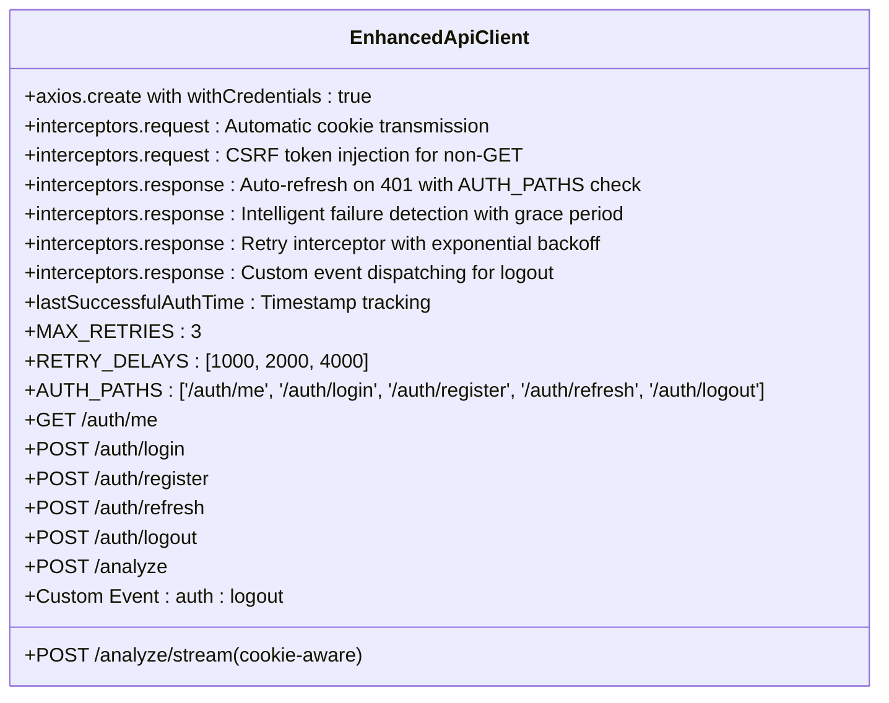

**Diagram sources**
- [api.js:1-1498](file://app/frontend/src/lib/api.js#L1-L1498)

**Section sources**
- [api.js:1-1498](file://app/frontend/src/lib/api.js#L1-L1498)

### Comprehensive CSRF Protection
**Updated** Enhanced CSRF protection with double-submit cookie pattern and authentication endpoint exemptions

The backend implements comprehensive CSRF protection using the double-submit cookie pattern. Authentication endpoints are exempt from CSRF validation to enable proper login flows, while all other endpoints require CSRF token validation for non-GET requests. The system automatically refreshes CSRF tokens for browser clients and rotates them after successful state-changing requests.

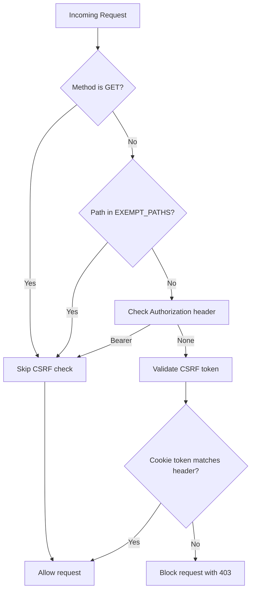

**Diagram sources**
- [csrf.py:13-40](file://app/backend/middleware/csrf.py#L13-L40)

**Section sources**
- [csrf.py:13-40](file://app/backend/middleware/csrf.py#L13-L40)

## Dependency Analysis
**Updated** Enhanced dependencies with CSRF protection, AUTH_PATHS array, race condition fix, intelligent failure detection, retry mechanisms, custom event system, and improved authentication flow

The frontend authentication stack depends on:
- AuthProvider for state and actions with race condition protection and enhanced retry logic
- ProtectedRoute for route-level guards
- Enhanced API client for transport with automatic cookie transmission, CSRF protection, AUTH_PATHS array, race condition prevention, intelligent failure detection with 10-second grace period, comprehensive retry mechanisms, and custom event dispatching
- uploadChunked.js for chunked file uploads with retry capabilities
- Backend auth endpoints for registration, login, refresh, logout, and profile retrieval
- Server middleware for cookie-based authentication, CSRF token validation, and authentication endpoint exemptions
- Custom event system for seamless logout navigation
- Intelligent failure detection mechanism for distinguishing transient failures from genuine session expiry

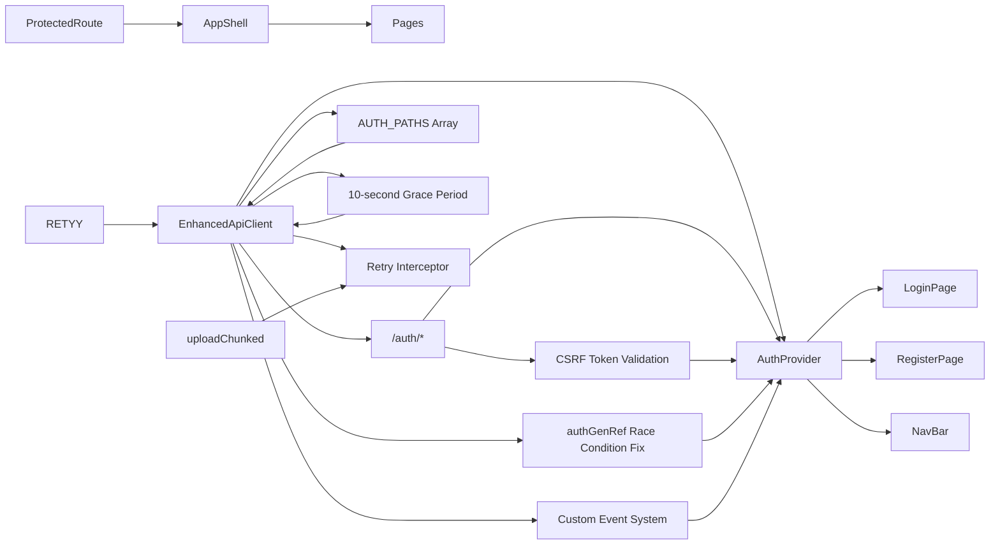

**Diagram sources**
- [AuthContext.jsx:1-112](file://app/frontend/src/contexts/AuthContext.jsx#L1-L112)
- [ProtectedRoute.jsx:1-24](file://app/frontend/src/components/ProtectedRoute.jsx#L1-L24)
- [api.js:1-1498](file://app/frontend/src/lib/api.js#L1-L1498)
- [uploadChunked.js:1-502](file://app/frontend/src/lib/uploadChunked.js#L1-L502)
- [auth.py:57-208](file://app/backend/routes/auth.py#L57-L208)
- [csrf.py:13-40](file://app/backend/middleware/csrf.py#L13-L40)

**Section sources**
- [AuthContext.jsx:1-112](file://app/frontend/src/contexts/AuthContext.jsx#L1-L112)
- [ProtectedRoute.jsx:1-24](file://app/frontend/src/components/ProtectedRoute.jsx#L1-L24)
- [api.js:1-1498](file://app/frontend/src/lib/api.js#L1-L1498)
- [uploadChunked.js:1-502](file://app/frontend/src/lib/uploadChunked.js#L1-L502)
- [auth.py:57-208](file://app/backend/routes/auth.py#L57-L208)
- [csrf.py:13-40](file://app/backend/middleware/csrf.py#L13-L40)

## Performance Considerations
- **Automatic cookie optimization**: No manual token serialization/deserialization overhead
- **Race condition prevention**: authGenRef reference counter prevents redundant state updates
- **Minimize unnecessary re-renders**: Memoize callbacks in AuthProvider using useCallback
- **Centralized refresh logic**: Keep token refresh logic in the API client to prevent duplicated logic
- **Cookie caching**: Rely on browser cookie caching for reduced network overhead
- **CSRF token efficiency**: Single CSRF token per session reduces token management complexity
- **Login loop prevention**: AUTH_PATHS array prevents unnecessary refresh attempts for auth endpoints
- **Smart retry logic**: Only non-auth endpoints trigger automatic refresh to reduce network overhead
- **Reference counter efficiency**: Minimal memory overhead for race condition prevention
- **Exponential backoff efficiency**: Reduces server load during transient failures
- **Retry limits**: Maximum 3 retry attempts prevent infinite retry loops
- **Network error handling**: Graceful degradation for network failures
- **Custom event efficiency**: Lightweight event system for logout navigation without full page reloads
- **Grace period efficiency**: 10-second threshold prevents unnecessary logout triggers during transient failures
- **Intelligent failure detection**: Reduces logout-related performance impact by preventing cascading logout events

## Troubleshooting Guide
**Updated** Enhanced troubleshooting for cookie-based authentication, AUTH_PATHS array, race condition fix, intelligent failure detection, retry mechanisms, custom event system, and CSRF protection

Common issues and resolutions:
- **Stuck on loading spinner**: Verify that cookies are being sent to `/auth/me` and that server is returning valid authentication
- **Immediate redirect to login**: Confirm that httpOnly cookies are being accepted and that the backend JWT secret is configured correctly
- **401 errors despite valid cookies**: Ensure CSRF token is present for non-GET requests and that cookie paths match server configuration
- **Logout does not work**: Check that server is sending `Set-Cookie` headers to clear all authentication cookies and that custom event listener is properly attached
- **Login loops during authentication**: Verify that AUTH_PATHS array includes all authentication endpoints and that CSRF middleware is properly configured
- **Race condition issues**: Check that authGenRef reference counter is properly incrementing and that stale promises are being prevented
- **Cross-origin issues**: Verify CORS configuration allows cookie transmission and CSRF token access
- **HTTPS-only cookies**: Ensure development environment properly handles https for cookie security
- **CSRF validation failures**: Check that authentication endpoints are properly exempted from CSRF validation
- **Retry failures**: Verify that retry interceptor is properly configured and that maximum retry attempts are not exceeded
- **Network connectivity issues**: Check that exponential backoff retry logic is functioning correctly for transient failures
- **Chunk upload failures**: Verify that uploadChunked.js retry logic is properly handling individual chunk failures
- **Custom event not firing**: Check that window.dispatchEvent('auth:logout') is being called and that AuthProvider has proper event listeners
- **Logout navigation issues**: Verify that custom event listener in AuthProvider is properly cleaning up state and allowing seamless navigation
- **Cascading logout during transient failures**: Check that 10-second grace period mechanism is properly configured and that lastSuccessfulAuthTime is being tracked correctly
- **Intelligent failure detection not working**: Verify that lastSuccessfulAuthTime is being updated on successful responses and that time calculations are accurate

Relevant implementation references:
- AuthProvider session restoration via automatic cookie validation with race condition protection and retry logic
- Enhanced API interceptor for 401 handling with AUTH_PATHS array, cookie-based refresh, intelligent failure detection with 10-second grace period, comprehensive retry mechanism, and custom event dispatching
- ProtectedRoute loading and redirect behavior
- Server-side cookie clearing on logout with custom event dispatching
- CSRF middleware with double-submit pattern and authentication endpoint exemptions
- authGenRef reference counter mechanism for race condition prevention
- lastSuccessfulAuthTime tracking for intelligent failure detection
- MAX_RETRIES and RETRY_DELAYS configuration for exponential backoff
- uploadChunked.js retry logic for individual chunk failures
- Custom event system for seamless logout navigation

**Section sources**
- [AuthContext.jsx:14-45](file://app/frontend/src/contexts/AuthContext.jsx#L14-L45)
- [api.js:59-107](file://app/frontend/src/lib/api.js#L59-L107)
- [api.js:114-140](file://app/frontend/src/lib/api.js#L114-L140)
- [ProtectedRoute.jsx:7-20](file://app/frontend/src/components/ProtectedRoute.jsx#L7-L20)
- [csrf.py:13-40](file://app/backend/middleware/csrf.py#L13-L40)
- [uploadChunked.js:23-335](file://app/frontend/src/lib/uploadChunked.js#L23-L335)

## Conclusion
**Updated** Enhanced conclusion reflecting cookie-based authentication improvements, AUTH_PATHS array implementation, race condition fix, intelligent failure detection with 10-second grace period, comprehensive retry mechanisms, custom event system, and enhanced logout functionality

The frontend authentication system now centers on a robust AuthProvider with race condition protection and enhanced retry capabilities that manages user state and leverages automatic cookie-based authentication for seamless, secure token management. The system eliminates localStorage vulnerabilities by using httpOnly cookies and provides enhanced security through comprehensive CSRF protection with double-submit cookie patterns. The recent addition of the authGenRef reference counter mechanism significantly improves authentication reliability by preventing stale loadUser promises from overwriting successful login state. The enhanced API interceptor with intelligent failure detection and 10-second grace period mechanism dramatically reduces cascading logout events during transient authentication failures, providing a more resilient authentication experience. The intelligent failure detection system tracks lastSuccessfulAuthTime to distinguish between temporary network/transient authentication issues and genuine session expiry, ensuring that logout is only triggered when appropriate. The enhanced retry interceptor provides exponential backoff (1s, 2s, 4s delays) for 5xx errors and network failures, dramatically improving the system's resilience to transient failures. The custom event dispatching system enables seamless logout navigation without full page reloads, enhancing user experience. The enhanced uploadChunked.js module ensures reliable file uploads with automatic retry logic for individual chunk failures. ProtectedRoute enforces authentication across pages, while LoginPage and RegisterPage provide secure onboarding with automatic cookie handling. The NavBar offers a practical logout flow that clears all authentication cookies and tokens. Together, these enhancements create a more robust, secure, reliable, fault-tolerant, and user-friendly authentication system with comprehensive retry mechanisms for improved fault tolerance and seamless navigation experience.