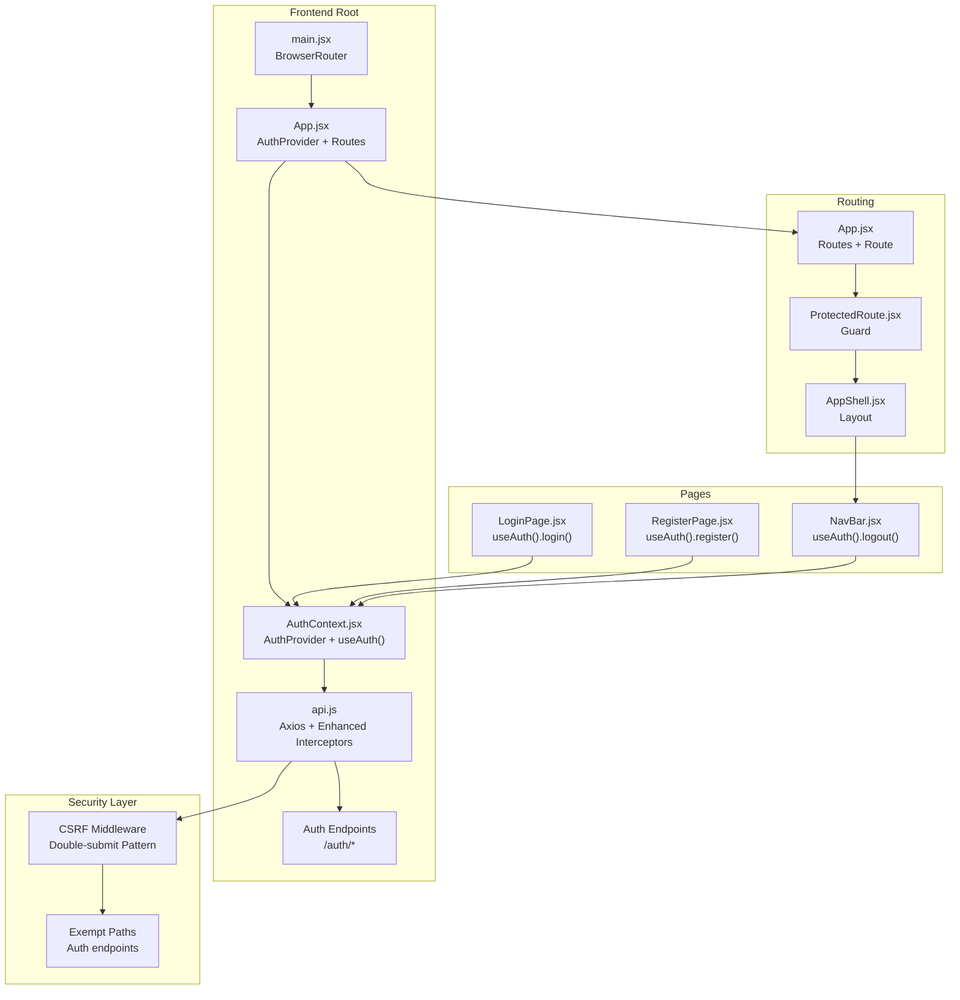
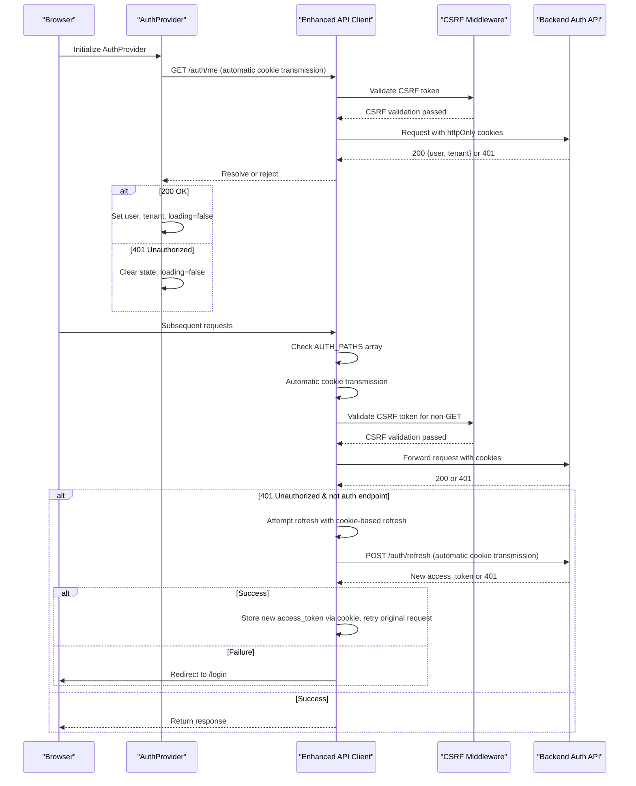
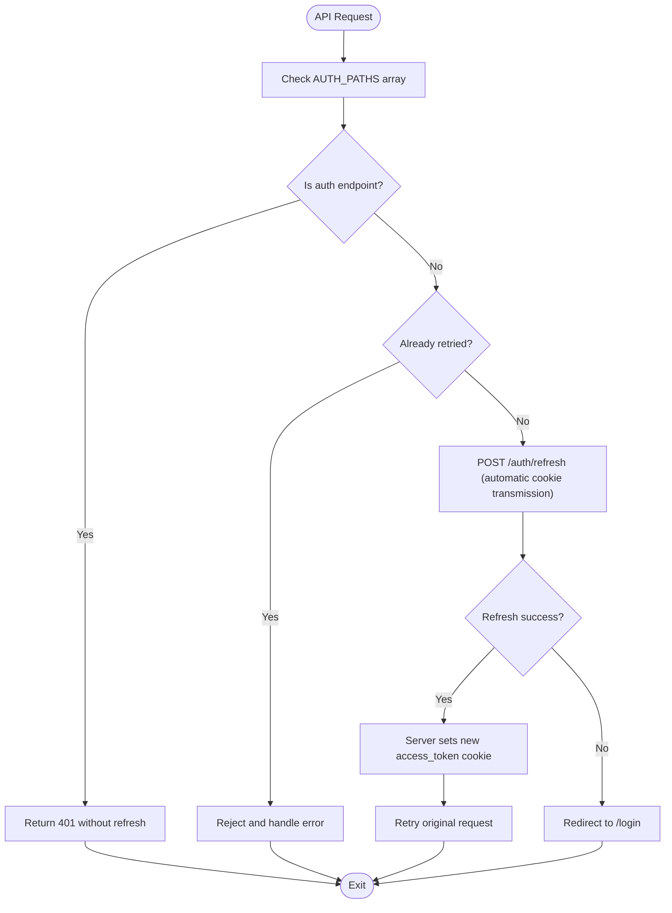
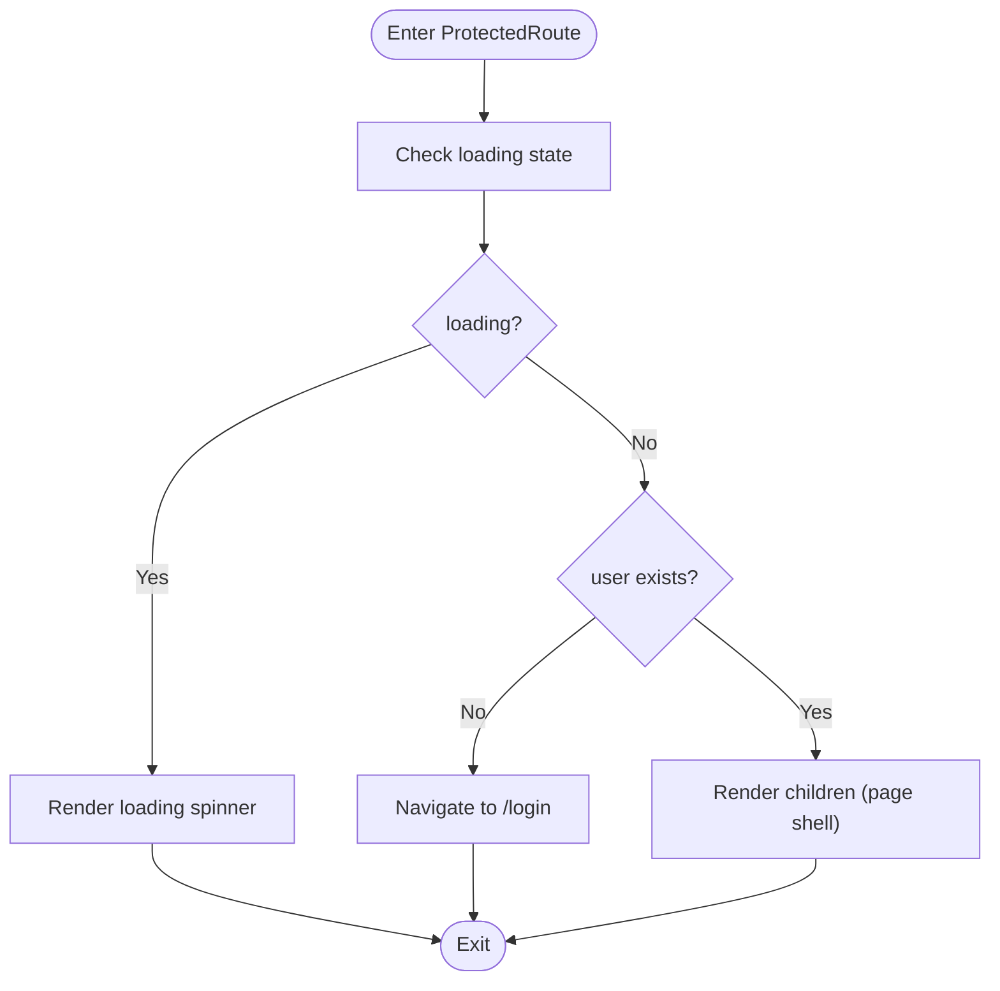
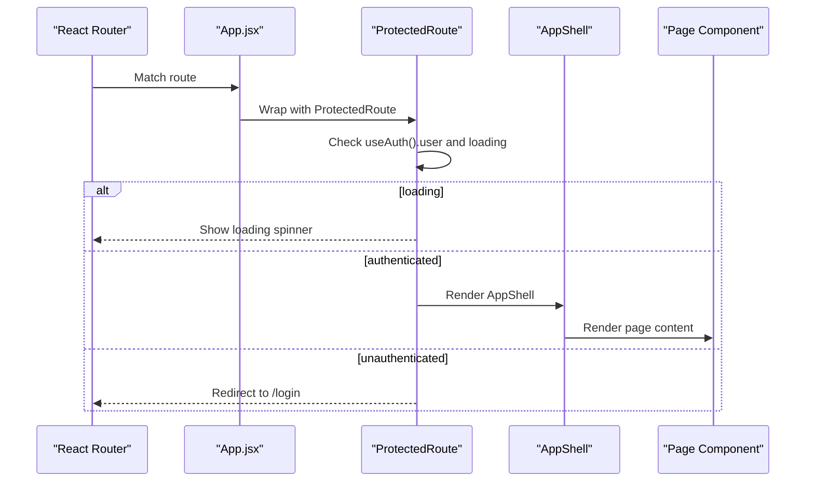
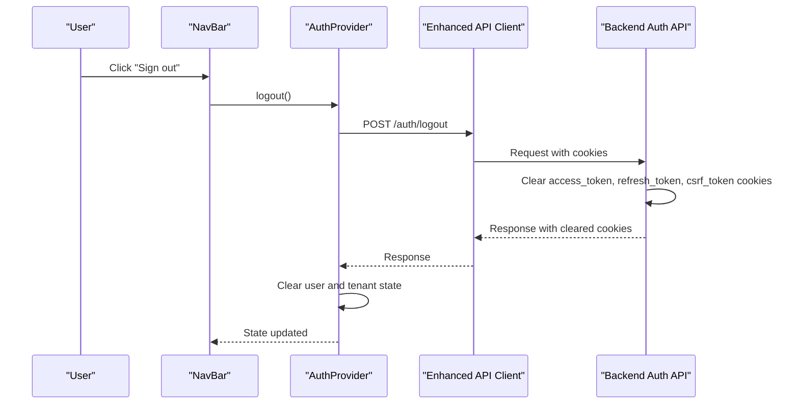
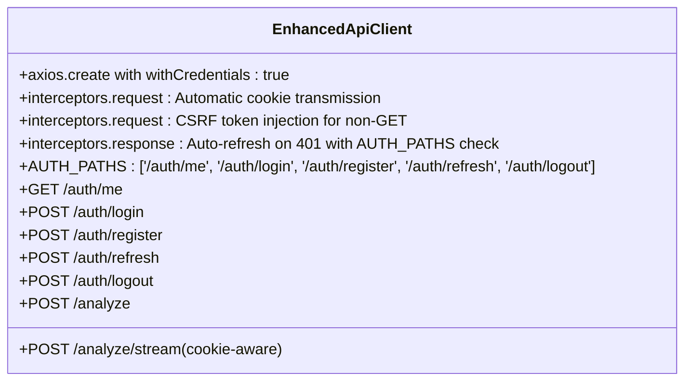
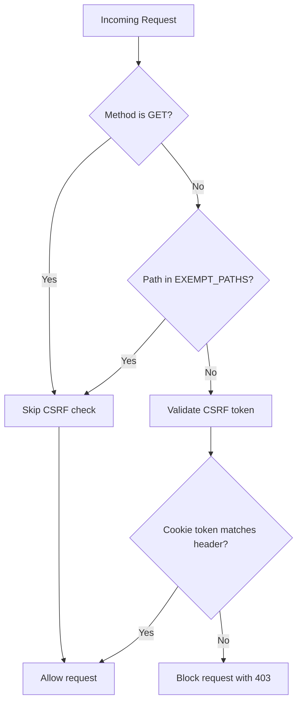
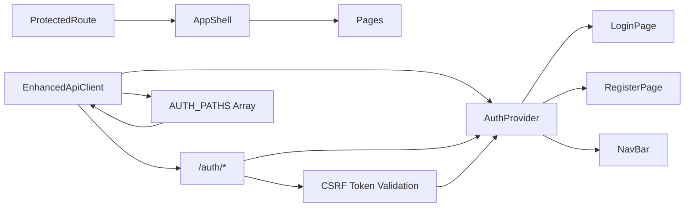

# Frontend Authentication Context

<cite>
**Referenced Files in This Document**
- [AuthContext.jsx](file://app/frontend/src/contexts/AuthContext.jsx)
- [ProtectedRoute.jsx](file://app/frontend/src/components/ProtectedRoute.jsx)
- [api.js](file://app/frontend/src/lib/api.js)
- [App.jsx](file://app/frontend/src/App.jsx)
- [main.jsx](file://app/frontend/src/main.jsx)
- [LoginPage.jsx](file://app/frontend/src/pages/LoginPage.jsx)
- [RegisterPage.jsx](file://app/frontend/src/pages/RegisterPage.jsx)
- [NavBar.jsx](file://app/frontend/src/components/NavBar.jsx)
- [AppShell.jsx](file://app/frontend/src/components/AppShell.jsx)
- [auth.py](file://app/backend/routes/auth.py)
- [auth.py](file://app/backend/middleware/auth.py)
- [csrf.py](file://app/backend/middleware/csrf.py)
</cite>

## Update Summary
**Changes Made**
- Enhanced API interceptor with AUTH_PATHS array to prevent login loops and improve authentication flow reliability
- Added comprehensive CSRF protection middleware with exemption for authentication endpoints
- Improved token refresh handling to skip refresh logic for auth endpoints
- Enhanced security with double-submit cookie pattern for CSRF protection
- Updated authentication flow to prevent infinite loops during login attempts

## Table of Contents
1. [Introduction](#introduction)
2. [Project Structure](#project-structure)
3. [Core Components](#core-components)
4. [Architecture Overview](#architecture-overview)
5. [Detailed Component Analysis](#detailed-component-analysis)
6. [Dependency Analysis](#dependency-analysis)
7. [Performance Considerations](#performance-considerations)
8. [Troubleshooting Guide](#troubleshooting-guide)
9. [Conclusion](#conclusion)

## Introduction
This document explains the frontend authentication system for the Resume AI by ThetaLogics application. It covers the AuthContext provider, authentication state management, automatic cookie-based session persistence, enhanced logout functionality, protected routing, authentication guards, and integration with API calls. The system now uses httpOnly cookies for secure token storage and automatic cookie transmission, eliminating localStorage vulnerabilities while maintaining seamless user experience. Recent enhancements include improved API interceptors with AUTH_PATHS array to prevent login loops and comprehensive CSRF protection middleware.

## Project Structure
The frontend authentication system is organized around a React Context provider, route protection, and a shared API client with enhanced interceptors. The provider is mounted at the root of the application and exposes authentication state and actions to all routed components. Protected routes wrap page shells to enforce authentication. The system now relies on automatic cookie transmission for seamless authentication without manual token management, with enhanced security through CSRF protection.



**Diagram sources**
- [main.jsx:1-14](file://app/frontend/src/main.jsx#L1-L14)
- [App.jsx:1-64](file://app/frontend/src/App.jsx#L1-L64)
- [AuthContext.jsx:1-71](file://app/frontend/src/contexts/AuthContext.jsx#L1-L71)
- [api.js:1-420](file://app/frontend/src/lib/api.js#L1-L420)
- [ProtectedRoute.jsx:1-24](file://app/frontend/src/components/ProtectedRoute.jsx#L1-L24)
- [AppShell.jsx:1-13](file://app/frontend/src/components/AppShell.jsx#L1-L13)
- [LoginPage.jsx:1-121](file://app/frontend/src/pages/LoginPage.jsx#L1-L121)
- [RegisterPage.jsx:1-143](file://app/frontend/src/pages/RegisterPage.jsx#L1-L143)
- [NavBar.jsx:1-117](file://app/frontend/src/components/NavBar.jsx#L1-L117)
- [csrf.py:13-40](file://app/backend/middleware/csrf.py#L13-L40)

**Section sources**
- [main.jsx:1-14](file://app/frontend/src/main.jsx#L1-L14)
- [App.jsx:1-64](file://app/frontend/src/App.jsx#L1-L64)

## Core Components
- **AuthProvider**: Manages authentication state, loads persisted sessions via automatic cookie validation, and exposes login, register, and logout actions that work seamlessly with httpOnly cookies.
- **useAuth**: Hook to access authentication state and actions from any component.
- **ProtectedRoute**: Route guard that blocks unauthenticated users and shows a loader while checking session state using automatic cookie authentication.
- **Enhanced API Client**: Axios instance configured with `withCredentials: true` for automatic cookie transmission, CSRF token injection for non-GET requests, automatic refresh on 401 errors, and AUTH_PATHS array to prevent login loops.
- **CSRF Protection Middleware**: Server-side middleware implementing double-submit cookie pattern with exemptions for authentication endpoints.
- **LoginPage and RegisterPage**: Forms that call useAuth to authenticate and receive httpOnly cookies from the server.
- **NavBar**: Displays user info and triggers logout via useAuth, which clears httpOnly cookies and CSRF tokens.

Key responsibilities:
- **Authentication state**: user, tenant, loading
- **Token storage**: httpOnly cookies (access_token, refresh_token) and CSRF token
- **Session persistence**: automatic validation via cookie-based authentication on app load
- **Token refresh**: automatic refresh on 401 with AUTH_PATHS array preventing login loops
- **Route protection**: ProtectedRoute enforces authentication and loading UX
- **Security**: CSRF protection and enhanced token security through httpOnly cookies
- **Login loop prevention**: AUTH_PATHS array in API interceptor prevents infinite refresh cycles

**Section sources**
- [AuthContext.jsx:1-71](file://app/frontend/src/contexts/AuthContext.jsx#L1-L71)
- [ProtectedRoute.jsx:1-24](file://app/frontend/src/components/ProtectedRoute.jsx#L1-L24)
- [api.js:1-420](file://app/frontend/src/lib/api.js#L1-L420)
- [LoginPage.jsx:1-121](file://app/frontend/src/pages/LoginPage.jsx#L1-L121)
- [RegisterPage.jsx:1-143](file://app/frontend/src/pages/RegisterPage.jsx#L1-L143)
- [NavBar.jsx:1-117](file://app/frontend/src/components/NavBar.jsx#L1-L117)
- [csrf.py:13-40](file://app/backend/middleware/csrf.py#L13-L40)

## Architecture Overview
The authentication flow integrates React Context, automatic cookie-based authentication, route protection, CSRF token handling, and enhanced security measures. On app load, the provider validates the stored access_token via automatic cookie transmission and hydrates user/tenant state. API calls automatically attach cookies and handle 401 responses by refreshing tokens, with the AUTH_PATHS array preventing login loops. Protected routes render a loading spinner while resolving authentication state and redirect unauthenticated users to the login page.



**Diagram sources**
- [AuthContext.jsx:11-29](file://app/frontend/src/contexts/AuthContext.jsx#L11-L29)
- [api.js:33-57](file://app/frontend/src/lib/api.js#L33-L57)
- [csrf.py:34-40](file://app/backend/middleware/csrf.py#L34-L40)
- [auth.py:192-198](file://app/backend/routes/auth.py#L192-L198)

## Detailed Component Analysis

### Enhanced API Interceptor with AUTH_PATHS Array
**Updated** Enhanced API interceptor with AUTH_PATHS array to prevent login loops and improve authentication flow reliability

The API interceptor now includes a sophisticated AUTH_PATHS array that defines authentication endpoints to prevent infinite refresh loops. This enhancement ensures that when requests fail with 401 status codes, the system checks if the failing endpoint is in the AUTH_PATHS array before attempting token refresh.



**Diagram sources**
- [api.js:35-57](file://app/frontend/src/lib/api.js#L35-L57)

Implementation highlights:
- **AUTH_PATHS array**: Defines authentication endpoints: `/auth/me`, `/auth/login`, `/auth/register`, `/auth/refresh`, `/auth/logout`
- **Login loop prevention**: Requests to auth endpoints skip refresh logic to prevent infinite loops
- **Smart 401 handling**: Only non-auth endpoints trigger automatic token refresh
- **Cookie-based refresh**: Refresh mechanism works seamlessly with automatic cookie transmission
- **Graceful degradation**: On refresh failure, redirects to login page instead of infinite retry

**Section sources**
- [api.js:33-57](file://app/frontend/src/lib/api.js#L33-L57)

### AuthContext Provider and Hooks
The provider initializes state, validates session via automatic cookie authentication, and exposes actions to mutate state. The hook ensures consumers are within the provider and throws if not used correctly.

```mermaid
classDiagram
class AuthProvider {
+user : object|null
+tenant : object|null
+loading : boolean
+loadUser() : Promise<void>
+login(email, password) : Promise<object>
+register(companyName, email, password) : Promise<object>
+logout() : Promise<void>
}
class useAuth {
+returns : {user, tenant, loading, login, register, logout}
}
AuthProvider --> useAuth : "exposes via context"
```

**Diagram sources**
- [AuthContext.jsx:6-70](file://app/frontend/src/contexts/AuthContext.jsx#L6-L70)

**Updated** Removed localStorage token handling and replaced with automatic cookie-based authentication

Implementation highlights:
- **Session restoration**: On mount, provider calls `/auth/me` which automatically transmits cookies for validation
- **Automatic cookie handling**: login/register receive httpOnly cookies from server, no manual localStorage manipulation
- **Enhanced logout**: logout calls server endpoint that clears all httpOnly cookies and CSRF tokens
- **Error handling**: On failed `/auth/me`, state is cleared and loading completes
- **State management**: Maintains user, tenant, and loading state for UI components

**Section sources**
- [AuthContext.jsx:6-70](file://app/frontend/src/contexts/AuthContext.jsx#L6-L70)

### ProtectedRoute Component
Protects routes by checking authentication state and rendering a loading indicator while resolving. Unauthenticated users are redirected to the login page.



**Diagram sources**
- [ProtectedRoute.jsx:4-23](file://app/frontend/src/components/ProtectedRoute.jsx#L4-L23)

**Section sources**
- [ProtectedRoute.jsx:1-24](file://app/frontend/src/components/ProtectedRoute.jsx#L1-L24)

### Authentication Guards and Conditional Rendering
ProtectedRoute acts as a guard for all pages under the AppShell. The App component mounts AuthProvider at the root and wraps page shells with ProtectedRoute and SubscriptionProvider.



**Diagram sources**
- [App.jsx:29-37](file://app/frontend/src/App.jsx#L29-L37)
- [ProtectedRoute.jsx:4-23](file://app/frontend/src/components/ProtectedRoute.jsx#L4-L23)
- [AppShell.jsx:3-12](file://app/frontend/src/components/AppShell.jsx#L3-L12)

**Section sources**
- [App.jsx:1-64](file://app/frontend/src/App.jsx#L1-L64)

### Consuming Authentication Context in Components
- **LoginPage**: Uses useAuth().login to submit credentials, receives httpOnly cookies from server, and navigates on success.
- **RegisterPage**: Uses useAuth().register to create a workspace, receives httpOnly cookies from server.
- **NavBar**: Uses useAuth().logout to sign out, which clears all cookies and tokens, and displays user initials and role.

Examples of consumption patterns:
- Call useAuth() to access login, register, logout, user, tenant, and loading.
- Handle errors from login/register by displaying user-friendly messages.
- Trigger navigation after successful authentication.
- Logout automatically clears all authentication state and cookies.

**Section sources**
- [LoginPage.jsx:1-121](file://app/frontend/src/pages/LoginPage.jsx#L1-L121)
- [RegisterPage.jsx:1-143](file://app/frontend/src/pages/RegisterPage.jsx#L1-L143)
- [NavBar.jsx:1-117](file://app/frontend/src/components/NavBar.jsx#L1-L117)

### Enhanced Token Storage and Session Persistence
**Updated** Complete removal of localStorage token handling

- **Cookies only**: Tokens are stored as httpOnly cookies: access_token and refresh_token
- **CSRF protection**: Separate csrf_token cookie for CSRF protection
- **Automatic validation**: On app load, cookies are automatically transmitted to `/auth/me` for validation
- **Server-side clearing**: On invalid/expired tokens, server clears cookies and returns 401
- **Automatic attachment**: API client configured with `withCredentials: true` for automatic cookie transmission

Security benefits:
- **XSS protection**: Tokens cannot be accessed via JavaScript due to httpOnly flag
- **CSRF protection**: CSRF tokens are validated on non-GET requests
- **Secure by default**: Tokens are only sent over HTTPS in production environments
- **Automatic cleanup**: Server-side token expiration and cleanup

**Section sources**
- [AuthContext.jsx:11-29](file://app/frontend/src/contexts/AuthContext.jsx#L11-L29)
- [api.js:5-8](file://app/frontend/src/lib/api.js#L5-L8)
- [api.js:18-31](file://app/frontend/src/lib/api.js#L18-L31)
- [auth.py:57-103](file://app/backend/routes/auth.py#L57-L103)

### Enhanced Token Refresh Handling
**Updated** Enhanced token refresh handling with AUTH_PATHS array to prevent login loops

The API interceptor handles 401 responses by attempting a refresh using the automatic cookie-based refresh mechanism. The AUTH_PATHS array prevents refresh attempts for authentication endpoints, eliminating the risk of infinite login loops. On success, it updates the access token via cookie and retries the original request. On failure, it redirects to /login.


**Diagram sources**
- [api.js:33-57](file://app/frontend/src/lib/api.js#L33-L57)
- [auth.py:159-189](file://app/backend/routes/auth.py#L159-L189)

**Section sources**
- [api.js:33-57](file://app/frontend/src/lib/api.js#L33-L57)

### Enhanced Logout Implementation
**Updated** Enhanced logout functionality that clears httpOnly cookies and CSRF tokens

Logout removes all authentication cookies and clears user/tenant state. The server endpoint handles complete cleanup of httpOnly cookies and CSRF tokens.



**Diagram sources**
- [NavBar.jsx:103-109](file://app/frontend/src/components/NavBar.jsx#L103-L109)
- [AuthContext.jsx:48-57](file://app/frontend/src/contexts/AuthContext.jsx#L48-L57)
- [auth.py:201-208](file://app/backend/routes/auth.py#L201-L208)

**Section sources**
- [NavBar.jsx:1-117](file://app/frontend/src/components/NavBar.jsx#L1-L117)
- [AuthContext.jsx:48-57](file://app/frontend/src/contexts/AuthContext.jsx#L48-L57)

### Enhanced Integration with API Calls
**Updated** Enhanced API integration with automatic cookie transmission, CSRF token handling, and AUTH_PATHS array

The api client attaches cookies automatically to every request and handles 401 responses by refreshing tokens via cookie-based mechanisms. It also supports CSRF protection for non-GET requests and streaming analysis with cookie-aware fetch-based endpoints. The AUTH_PATHS array prevents login loops by skipping refresh logic for authentication endpoints.



**Diagram sources**
- [api.js:1-420](file://app/frontend/src/lib/api.js#L1-L420)

**Section sources**
- [api.js:1-420](file://app/frontend/src/lib/api.js#L1-L420)

### Comprehensive CSRF Protection
**Updated** Enhanced CSRF protection with double-submit cookie pattern and authentication endpoint exemptions

The backend implements comprehensive CSRF protection using the double-submit cookie pattern. Authentication endpoints are exempt from CSRF validation to enable proper login flows, while all other endpoints require CSRF token validation for non-GET requests.



**Diagram sources**
- [csrf.py:13-40](file://app/backend/middleware/csrf.py#L13-L40)

**Section sources**
- [csrf.py:13-40](file://app/backend/middleware/csrf.py#L13-L40)

## Dependency Analysis
**Updated** Enhanced dependencies with CSRF protection, AUTH_PATHS array, and improved authentication flow

The frontend authentication stack depends on:
- AuthProvider for state and actions
- ProtectedRoute for route-level guards
- Enhanced API client for transport with automatic cookie transmission, CSRF protection, and AUTH_PATHS array
- Backend auth endpoints for registration, login, refresh, logout, and profile retrieval
- Server middleware for cookie-based authentication, CSRF token validation, and authentication endpoint exemptions



**Diagram sources**
- [AuthContext.jsx:1-71](file://app/frontend/src/contexts/AuthContext.jsx#L1-L71)
- [ProtectedRoute.jsx:1-24](file://app/frontend/src/components/ProtectedRoute.jsx#L1-L24)
- [api.js:1-420](file://app/frontend/src/lib/api.js#L1-L420)
- [auth.py:57-208](file://app/backend/routes/auth.py#L57-L208)
- [csrf.py:13-40](file://app/backend/middleware/csrf.py#L13-L40)

**Section sources**
- [AuthContext.jsx:1-71](file://app/frontend/src/contexts/AuthContext.jsx#L1-L71)
- [ProtectedRoute.jsx:1-24](file://app/frontend/src/components/ProtectedRoute.jsx#L1-L24)
- [api.js:1-420](file://app/frontend/src/lib/api.js#L1-L420)
- [auth.py:57-208](file://app/backend/routes/auth.py#L57-L208)
- [csrf.py:13-40](file://app/backend/middleware/csrf.py#L13-L40)

## Performance Considerations
- **Automatic cookie optimization**: No manual token serialization/deserialization overhead
- **Minimize unnecessary re-renders**: Memoize callbacks in AuthProvider using useCallback
- **Centralized refresh logic**: Keep token refresh logic in the API client to prevent duplicated logic
- **Cookie caching**: Rely on browser cookie caching for reduced network overhead
- **CSRF token efficiency**: Single CSRF token per session reduces token management complexity
- **Login loop prevention**: AUTH_PATHS array prevents unnecessary refresh attempts for auth endpoints
- **Smart retry logic**: Only non-auth endpoints trigger automatic refresh to reduce network overhead

## Troubleshooting Guide
**Updated** Enhanced troubleshooting for cookie-based authentication and AUTH_PATHS array

Common issues and resolutions:
- **Stuck on loading spinner**: Verify that cookies are being sent to `/auth/me` and that server is returning valid authentication
- **Immediate redirect to login**: Confirm that httpOnly cookies are being accepted and that the backend JWT secret is configured correctly
- **401 errors despite valid cookies**: Ensure CSRF token is present for non-GET requests and that cookie paths match server configuration
- **Logout does not work**: Check that server is sending `Set-Cookie` headers to clear all authentication cookies
- **Login loops during authentication**: Verify that AUTH_PATHS array includes all authentication endpoints and that CSRF middleware is properly configured
- **Cross-origin issues**: Verify CORS configuration allows cookie transmission and CSRF token access
- **HTTPS-only cookies**: Ensure development environment properly handles https for cookie security
- **CSRF validation failures**: Check that authentication endpoints are properly exempted from CSRF validation

Relevant implementation references:
- AuthProvider session restoration via automatic cookie validation
- Enhanced API interceptor for 401 handling with AUTH_PATHS array and cookie-based refresh
- ProtectedRoute loading and redirect behavior
- Server-side cookie clearing on logout
- CSRF middleware with double-submit pattern and authentication endpoint exemptions

**Section sources**
- [AuthContext.jsx:11-29](file://app/frontend/src/contexts/AuthContext.jsx#L11-L29)
- [api.js:33-57](file://app/frontend/src/lib/api.js#L33-L57)
- [ProtectedRoute.jsx:7-20](file://app/frontend/src/components/ProtectedRoute.jsx#L7-L20)
- [csrf.py:13-40](file://app/backend/middleware/csrf.py#L13-L40)

## Conclusion
**Updated** Enhanced conclusion reflecting cookie-based authentication improvements and AUTH_PATHS array implementation

The frontend authentication system now centers on a robust AuthProvider that manages user state and leverages automatic cookie-based authentication for seamless, secure token management. The system eliminates localStorage vulnerabilities by using httpOnly cookies and provides enhanced security through comprehensive CSRF protection with double-submit cookie patterns. The recent addition of the AUTH_PATHS array in the API interceptor significantly improves authentication flow reliability by preventing login loops and optimizing refresh logic. ProtectedRoute enforces authentication across pages, while LoginPage and RegisterPage provide secure onboarding with automatic cookie handling. The NavBar offers a practical logout flow that clears all authentication cookies and tokens. The enhanced cookie-based approach with AUTH_PATHS array provides better security, automatic token management, improved user experience, and reliable authentication flow while maintaining the same developer-friendly interface.