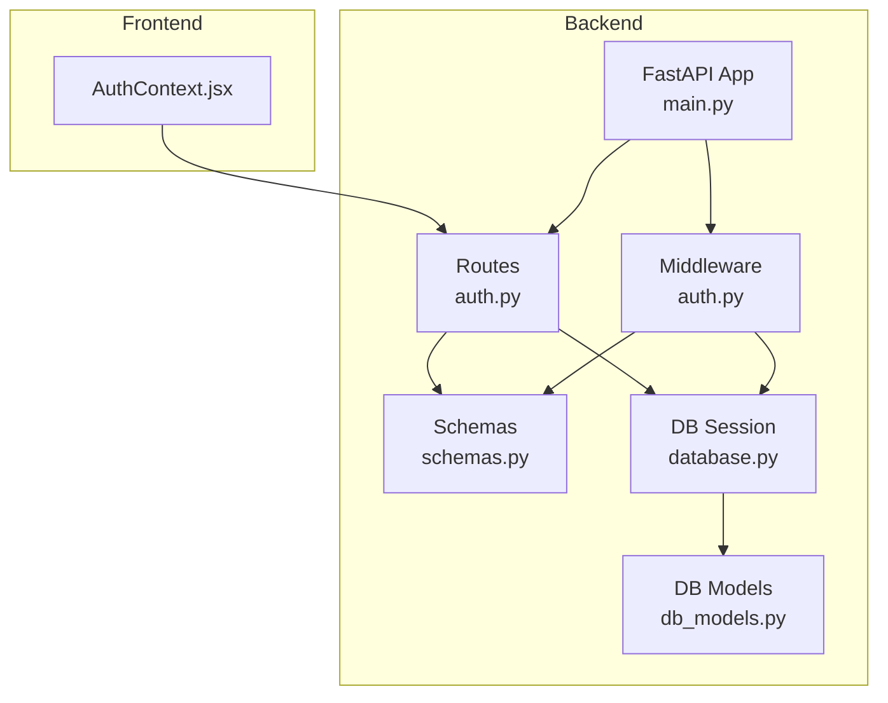
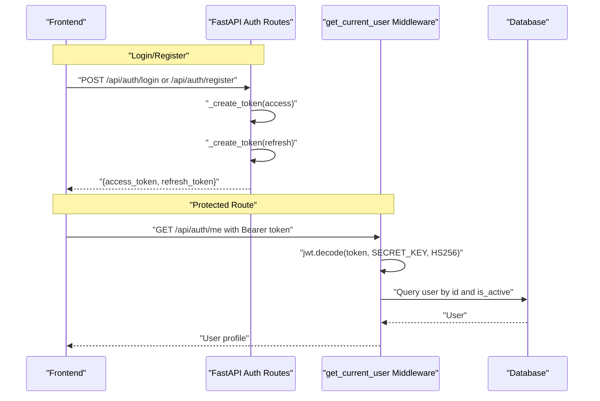
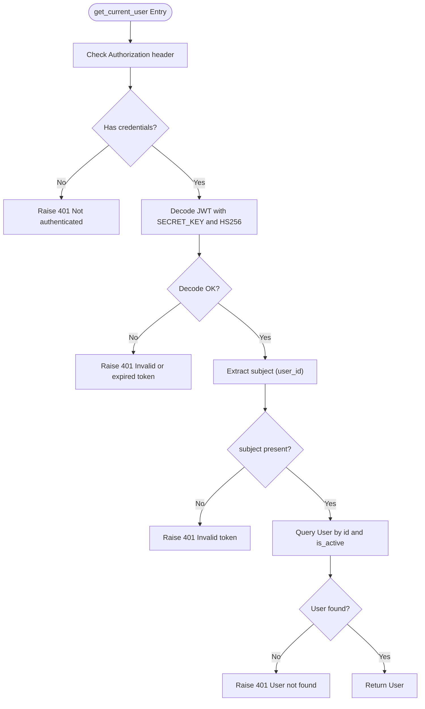
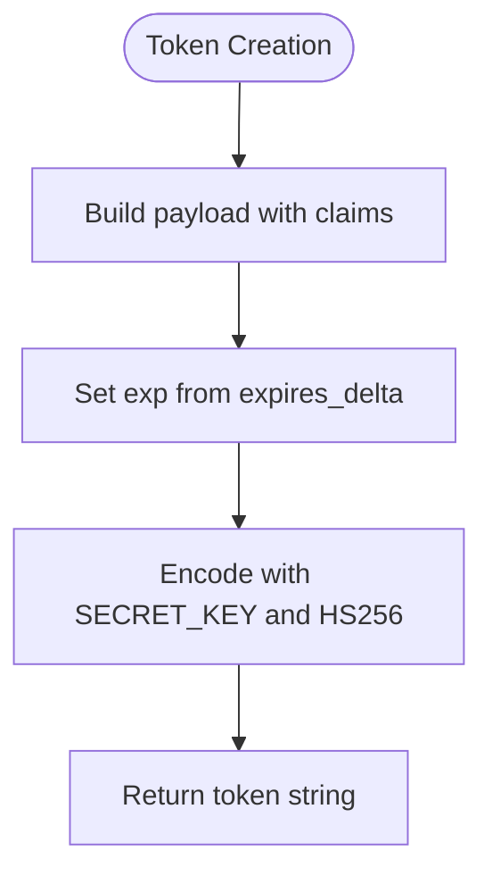
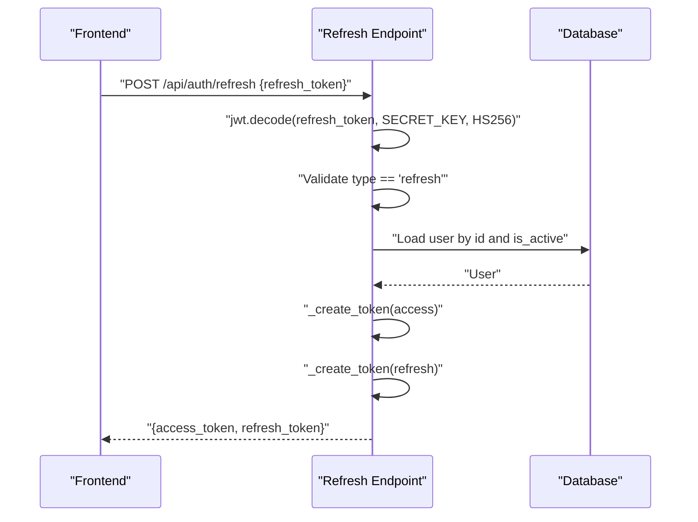
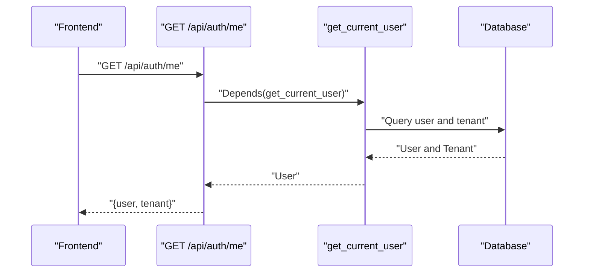
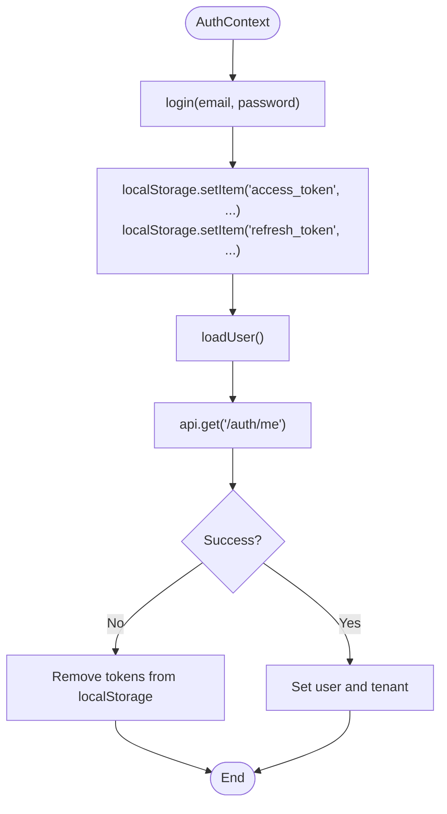
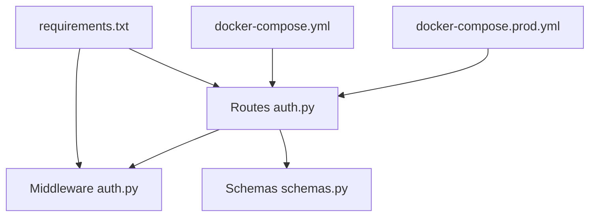

# JWT Token Management

<cite>
**Referenced Files in This Document**
- [auth.py](file://app/backend/middleware/auth.py)
- [auth.py](file://app/backend/routes/auth.py)
- [schemas.py](file://app/backend/models/schemas.py)
- [main.py](file://app/backend/main.py)
- [db_models.py](file://app/backend/models/db_models.py)
- [database.py](file://app/backend/db/database.py)
- [requirements.txt](file://requirements.txt)
- [docker-compose.yml](file://docker-compose.yml)
- [docker-compose.prod.yml](file://docker-compose.prod.yml)
- [AuthContext.jsx](file://app/frontend/src/contexts/AuthContext.jsx)
</cite>

## Table of Contents
1. [Introduction](#introduction)
2. [Project Structure](#project-structure)
3. [Core Components](#core-components)
4. [Architecture Overview](#architecture-overview)
5. [Detailed Component Analysis](#detailed-component-analysis)
6. [Dependency Analysis](#dependency-analysis)
7. [Performance Considerations](#performance-considerations)
8. [Troubleshooting Guide](#troubleshooting-guide)
9. [Conclusion](#conclusion)
10. [Appendices](#appendices)

## Introduction
This document provides comprehensive JWT token management documentation for Resume AI. It explains how authentication is implemented using bearer tokens, including token encoding, decoding, and validation. It covers the HS256 algorithm, secret key management, token expiration handling, and the get_current_user dependency used to protect FastAPI routes. It also documents token refresh mechanisms, bearer token format, error handling for invalid/expired tokens, and security considerations. Practical examples of token generation, verification, and integration with FastAPI routes are included, along with guidance on secure token storage and transmission, and best practices for production deployment.

## Project Structure
The JWT authentication implementation spans middleware, route handlers, models, and frontend integration:
- Middleware: Authentication dependency that validates bearer tokens and extracts the current user.
- Routes: Registration, login, refresh, and protected profile retrieval endpoints.
- Models: Pydantic schemas for request/response types and SQLAlchemy models for users and tenants.
- Frontend: React context that stores and uses access and refresh tokens.

**Diagram sources**
- [auth.py](file://app/backend/middleware/auth.py)
- [auth.py](file://app/backend/routes/auth.py)
- [schemas.py](file://app/backend/models/schemas.py)
- [db_models.py](file://app/backend/models/db_models.py)
- [database.py](file://app/backend/db/database.py)
- [main.py](file://app/backend/main.py)
- [AuthContext.jsx](file://app/frontend/src/contexts/AuthContext.jsx)

**Section sources**
- [auth.py](file://app/backend/middleware/auth.py)
- [auth.py](file://app/backend/routes/auth.py)
- [schemas.py](file://app/backend/models/schemas.py)
- [db_models.py](file://app/backend/models/db_models.py)
- [database.py](file://app/backend/db/database.py)
- [main.py](file://app/backend/main.py)
- [AuthContext.jsx](file://app/frontend/src/contexts/AuthContext.jsx)

## Core Components
- JWT Secret and Algorithm
  - Secret key is loaded from environment variable JWT_SECRET_KEY with a development fallback.
  - Algorithm is HS256.
- Token Payloads
  - Access tokens include a subject identifier (user ID).
  - Refresh tokens include a subject identifier and a type claim set to "refresh".
- Expiration
  - Access token expiration is configured via ACCESS_TOKEN_EXPIRE_MINUTES.
  - Refresh token expiration is configured via REFRESH_TOKEN_EXPIRE_DAYS.
- Token Generation
  - Tokens are encoded using the secret key and HS256 algorithm.
- Token Validation
  - Decoding uses the secret key and HS256; payload must include a valid subject.
  - Access tokens are validated via get_current_user dependency.
  - Refresh tokens are validated by checking the type claim and subject.
- Protected Routes
  - get_current_user dependency enforces authentication and ensures the user is active.
  - require_admin dependency enforces admin role.

**Section sources**
- [auth.py](file://app/backend/middleware/auth.py)
- [auth.py](file://app/backend/routes/auth.py)
- [schemas.py](file://app/backend/models/schemas.py)
- [docker-compose.yml](file://docker-compose.yml)
- [docker-compose.prod.yml](file://docker-compose.prod.yml)

## Architecture Overview
The JWT authentication flow integrates FastAPI routes, middleware, and the database to manage user sessions securely.

**Diagram sources**
- [auth.py](file://app/backend/routes/auth.py)
- [auth.py](file://app/backend/middleware/auth.py)
- [database.py](file://app/backend/db/database.py)

## Detailed Component Analysis

### JWT Authentication Middleware
The middleware provides a dependency that validates the Authorization header, decodes the JWT, and retrieves the current user.

Key behaviors:
- Extracts credentials using HTTPBearer scheme with auto-error disabled.
- Raises 401 Unauthorized if no credentials are present.
- Decodes the token using the secret key and HS256 algorithm.
- Validates that the subject claim exists; otherwise raises 401 Invalid token.
- Queries the database for the user by ID and active status; raises 401 if not found.
- Returns the authenticated user object.

**Diagram sources**
- [auth.py](file://app/backend/middleware/auth.py)

**Section sources**
- [auth.py](file://app/backend/middleware/auth.py)

### Token Creation and Expiration
Token creation is handled in the auth routes module. Access and refresh tokens are generated with appropriate claims and expirations.

Key behaviors:
- Access tokens include a subject claim and an expiration delta derived from ACCESS_TOKEN_EXPIRE_MINUTES.
- Refresh tokens include a subject claim and a type claim set to "refresh", with an expiration delta derived from REFRESH_TOKEN_EXPIRE_DAYS.
- Both tokens are signed using HS256 with the shared secret key.

**Diagram sources**
- [auth.py](file://app/backend/routes/auth.py)

**Section sources**
- [auth.py](file://app/backend/routes/auth.py)
- [docker-compose.yml](file://docker-compose.yml)
- [docker-compose.prod.yml](file://docker-compose.prod.yml)

### Token Refresh Mechanism
The refresh endpoint validates a refresh token and issues a new access token and a new refresh token.

Key behaviors:
- Decodes the provided refresh token and verifies the type claim equals "refresh".
- Extracts the subject (user ID) and loads the user from the database.
- Issues a new access token and a new refresh token with updated expirations.
- Returns the updated tokens and user/tenant information.

**Diagram sources**
- [auth.py](file://app/backend/routes/auth.py)

**Section sources**
- [auth.py](file://app/backend/routes/auth.py)

### Protected Route Integration
The get_me endpoint demonstrates how to protect a route using the get_current_user dependency. It fetches the associated tenant and returns user/tenant information.

Key behaviors:
- Uses get_current_user dependency to enforce authentication.
- Loads the tenant associated with the current user.
- Returns a structured response containing user and tenant details.

**Diagram sources**
- [auth.py](file://app/backend/routes/auth.py)
- [auth.py](file://app/backend/middleware/auth.py)

**Section sources**
- [auth.py](file://app/backend/routes/auth.py)

### Frontend Token Storage and Usage
The frontend React context manages access and refresh tokens in localStorage and uses the access token for authenticated requests.

Key behaviors:
- Stores access_token and refresh_token upon successful login/register.
- Sends authenticated requests to /api/auth/me using the stored access token.
- Clears tokens on authentication failure.

**Diagram sources**
- [AuthContext.jsx](file://app/frontend/src/contexts/AuthContext.jsx)

**Section sources**
- [AuthContext.jsx](file://app/frontend/src/contexts/AuthContext.jsx)

## Dependency Analysis
The JWT implementation relies on several libraries and environment configurations.

**Diagram sources**
- [requirements.txt](file://requirements.txt)
- [docker-compose.yml](file://docker-compose.yml)
- [docker-compose.prod.yml](file://docker-compose.prod.yml)
- [auth.py](file://app/backend/middleware/auth.py)
- [auth.py](file://app/backend/routes/auth.py)
- [schemas.py](file://app/backend/models/schemas.py)

**Section sources**
- [requirements.txt](file://requirements.txt)
- [docker-compose.yml](file://docker-compose.yml)
- [docker-compose.prod.yml](file://docker-compose.prod.yml)
- [auth.py](file://app/backend/middleware/auth.py)
- [auth.py](file://app/backend/routes/auth.py)
- [schemas.py](file://app/backend/models/schemas.py)

## Performance Considerations
- Token signing and verification are lightweight operations; performance impact is minimal.
- Keep token lifetimes reasonable to reduce validation overhead and improve security.
- Consider rate limiting on authentication endpoints to mitigate brute-force attacks.
- Ensure database queries for user lookup are efficient; indexing on user ID and email can help.

## Troubleshooting Guide
Common issues and resolutions:
- Invalid or expired token
  - Symptom: 401 Unauthorized with "Invalid or expired token".
  - Cause: Token signature mismatch, wrong algorithm, expired exp claim, or missing/invalid subject.
  - Resolution: Regenerate tokens using the login/register endpoints or refresh endpoint.
- Missing Authorization header
  - Symptom: 401 Unauthorized with "Not authenticated".
  - Cause: Client did not send the Bearer token.
  - Resolution: Ensure the Authorization header is set with the format "Bearer <access_token>".
- User not found or inactive
  - Symptom: 401 Unauthorized with "User not found".
  - Cause: Subject ID does not correspond to an active user.
  - Resolution: Verify user account status and ensure the user record is correct.
- Refresh token validation failures
  - Symptom: 401 Unauthorized with "Invalid refresh token".
  - Cause: Token not a refresh token, wrong type claim, or invalid/missing subject.
  - Resolution: Use a valid refresh token issued by the server; avoid mixing access and refresh tokens.

**Section sources**
- [auth.py](file://app/backend/middleware/auth.py)
- [auth.py](file://app/backend/routes/auth.py)

## Conclusion
Resume AI’s JWT authentication system uses HS256 with a shared secret key, supports access and refresh tokens, and enforces authentication via a reusable dependency. The implementation is integrated across FastAPI routes and the frontend, with clear separation of concerns for token creation, validation, and protection of endpoints. Following the security and operational recommendations below will help maintain a robust and secure authentication layer.

## Appendices

### Security Best Practices
- Secret Key Management
  - Use a strong, randomly generated secret key for JWT_SECRET_KEY.
  - Store the secret in environment variables; never commit secrets to source control.
  - Rotate the secret periodically and invalidate existing tokens during rotation.
- Token Lifetimes
  - Use short-lived access tokens (minutes) and longer-lived refresh tokens (days).
  - Configure ACCESS_TOKEN_EXPIRE_MINUTES and REFRESH_TOKEN_EXPIRE_DAYS appropriately.
- Transmission Security
  - Always use HTTPS/TLS to prevent token interception.
  - Avoid logging tokens; sanitize logs and error messages.
- Storage Security
  - Store tokens in secure, HTTP-only cookies or secure storage mechanisms when applicable.
  - Prefer short-lived tokens and avoid storing sensitive tokens in localStorage if possible.
- Operational Hygiene
  - Monitor authentication errors and suspicious activity.
  - Implement rate limiting and consider adding refresh token rotation.
  - Regularly audit token usage and revoke compromised tokens.

### Environment Variables
- JWT_SECRET_KEY: Shared secret used to sign and verify tokens.
- ACCESS_TOKEN_EXPIRE_MINUTES: Access token lifetime in minutes.
- REFRESH_TOKEN_EXPIRE_DAYS: Refresh token lifetime in days.
- DATABASE_URL: Database connection string for user and tenant persistence.

**Section sources**
- [docker-compose.yml](file://docker-compose.yml)
- [docker-compose.prod.yml](file://docker-compose.prod.yml)
- [auth.py](file://app/backend/routes/auth.py)