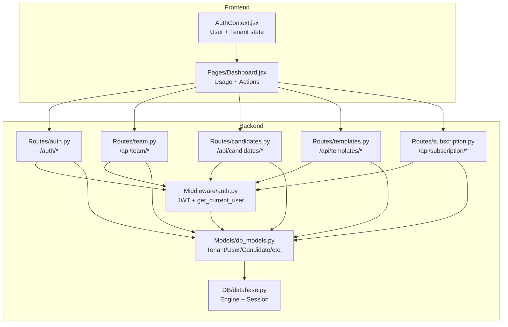
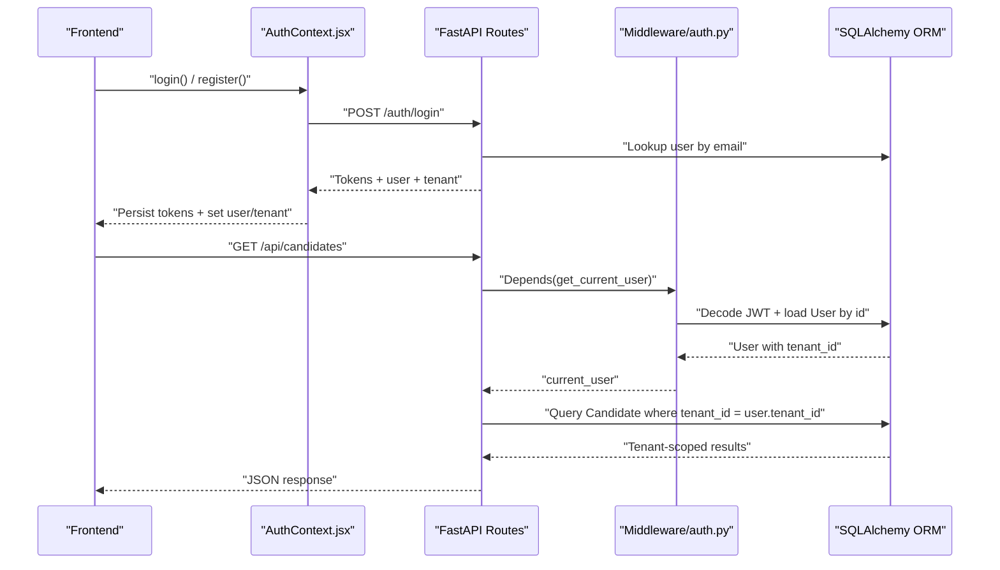
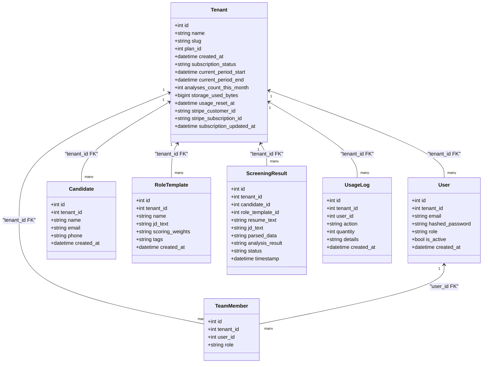
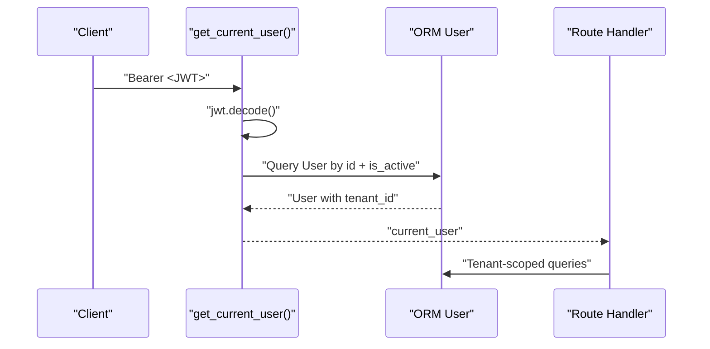
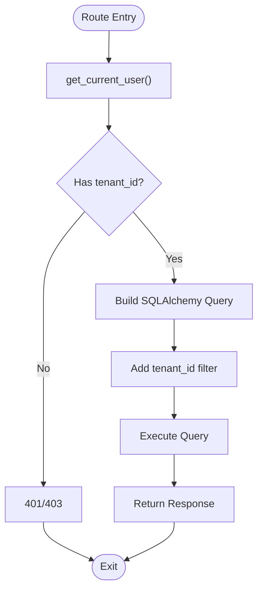
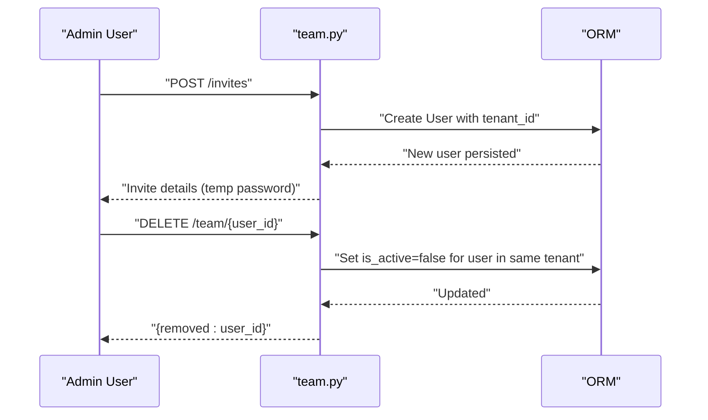
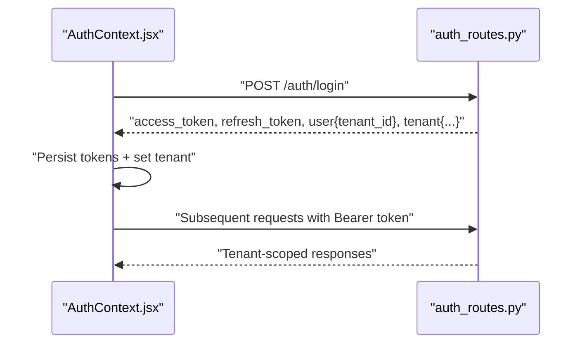
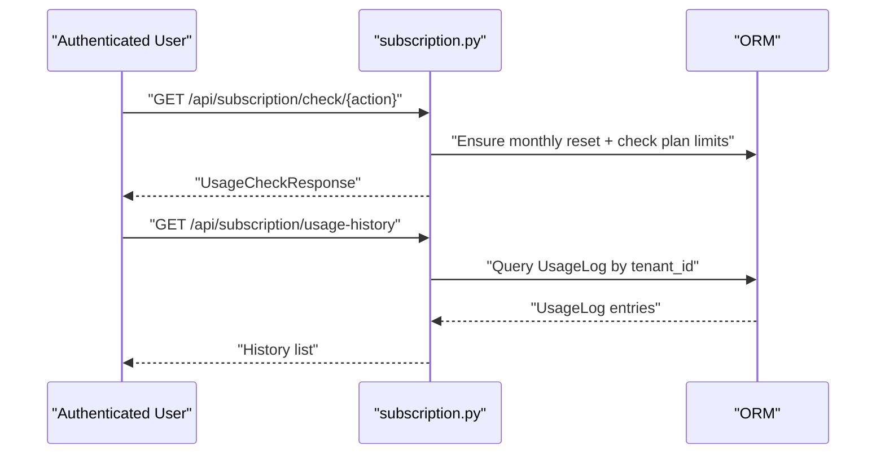
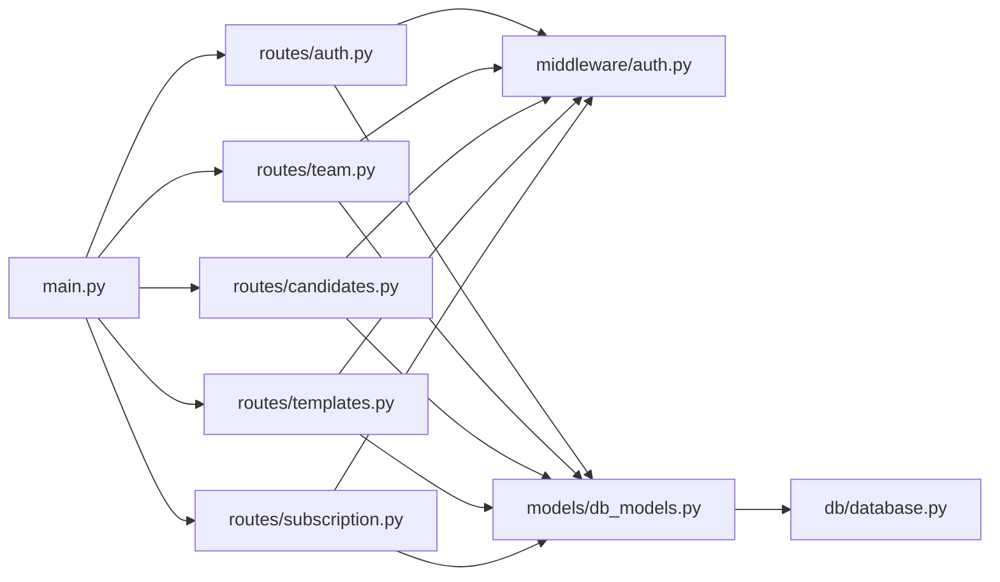

# Multi-Tenant Access Control

<cite>
**Referenced Files in This Document**
- [auth.py](file://app/backend/middleware/auth.py)
- [db_models.py](file://app/backend/models/db_models.py)
- [team.py](file://app/backend/routes/team.py)
- [auth_routes.py](file://app/backend/route/auth.py)
- [schemas.py](file://app/backend/models/schemas.py)
- [candidates.py](file://app/backend/routes/candidates.py)
- [templates.py](file://app/backend/routes/templates.py)
- [subscription.py](file://app/backend/routes/subscription.py)
- [database.py](file://app/backend/db/database.py)
- [main.py](file://app/backend/main.py)
- [AuthContext.jsx](file://app/frontend/src/contexts/AuthContext.jsx)
- [dashboard.jsx](file://app/frontend/src/pages/Dashboard.jsx)
- [AppShell.jsx](file://app/frontend/src/components/AppShell.jsx)
- [003_subscription_system.py](file://alembic/versions/003_subscription_system.py)
</cite>

## Table of Contents
1. [Introduction](#introduction)
2. [Project Structure](#project-structure)
3. [Core Components](#core-components)
4. [Architecture Overview](#architecture-overview)
5. [Detailed Component Analysis](#detailed-component-analysis)
6. [Dependency Analysis](#dependency-analysis)
7. [Performance Considerations](#performance-considerations)
8. [Troubleshooting Guide](#troubleshooting-guide)
9. [Conclusion](#conclusion)
10. [Appendices](#appendices)

## Introduction
This document explains the multi-tenant access control implementation in the Resume AI platform. It covers tenant isolation, user-to-tenant relationships, data segregation strategies, authentication integration with tenant context, tenant switching and validation, tenant-aware query patterns, cross-tenant access prevention, and security considerations including audit trails and data privacy compliance. The documentation synthesizes backend models, middleware, routes, and frontend authentication context to present a complete picture of how tenants are enforced across the system.

## Project Structure
The multi-tenant architecture spans backend models and routes, middleware for authentication, and frontend authentication context. Key elements:
- Backend ORM models define tenant isolation via foreign keys and relationships.
- Middleware enforces authentication and provides the current user context.
- Routes enforce tenant scoping on all data operations.
- Frontend maintains user and tenant context for UI and API interactions.

**Diagram sources**
- [AuthContext.jsx:1-70](file://app/frontend/src/contexts/AuthContext.jsx#L1-L70)
- [dashboard.jsx:204-330](file://app/frontend/src/pages/Dashboard.jsx#L204-L330)
- [auth.py:19-46](file://app/backend/middleware/auth.py#L19-L46)
- [db_models.py:31-92](file://app/backend/models/db_models.py#L31-L92)
- [auth_routes.py:57-152](file://app/backend/route/auth.py#L57-L152)
- [team.py:18-135](file://app/backend/routes/team.py#L18-L135)
- [candidates.py:26-303](file://app/backend/routes/candidates.py#L26-L303)
- [templates.py:16-86](file://app/backend/routes/templates.py#L16-L86)
- [subscription.py:172-253](file://app/backend/routes/subscription.py#L172-L253)
- [database.py:1-33](file://app/backend/db/database.py#L1-L33)

**Section sources**
- [main.py:200-215](file://app/backend/main.py#L200-L215)
- [database.py:1-33](file://app/backend/db/database.py#L1-L33)

## Core Components
- Tenant model: central entity representing isolated organizations with subscription and usage tracking.
- User model: belongs to a tenant and carries role-based permissions.
- TeamMember model: bridges users to tenants for team collaboration.
- Tenant-aware models: Candidate, ScreeningResult, RoleTemplate, TranscriptAnalysis, TrainingExample, UsageLog.
- Authentication middleware: validates JWT and loads the current user with tenant context.
- Route-level tenant enforcement: all endpoints filter by current user's tenant_id.
- Frontend authentication context: stores user and tenant metadata for UI and API usage.

**Section sources**
- [db_models.py:31-92](file://app/backend/models/db_models.py#L31-L92)
- [auth.py:19-46](file://app/backend/middleware/auth.py#L19-L46)
- [team.py:18-135](file://app/backend/routes/team.py#L18-L135)
- [candidates.py:26-303](file://app/backend/routes/candidates.py#L26-L303)
- [templates.py:16-86](file://app/backend/routes/templates.py#L16-L86)
- [subscription.py:172-253](file://app/backend/routes/subscription.py#L172-L253)
- [AuthContext.jsx:1-70](file://app/frontend/src/contexts/AuthContext.jsx#L1-L70)

## Architecture Overview
The system enforces tenant isolation at three layers:
- Identity and Access: JWT-based authentication resolves the current user and tenant.
- Authorization: Admin role checks restrict sensitive operations.
- Data Access: Every database query includes tenant_id filters to prevent cross-tenant access.

**Diagram sources**
- [AuthContext.jsx:33-56](file://app/frontend/src/contexts/AuthContext.jsx#L33-L56)
- [auth_routes.py:99-152](file://app/backend/route/auth.py#L99-L152)
- [auth.py:19-46](file://app/backend/middleware/auth.py#L19-L46)
- [candidates.py:26-80](file://app/backend/routes/candidates.py#L26-L80)

## Detailed Component Analysis

### Tenant Model and Relationships
The Tenant model encapsulates multi-tenancy and subscription metadata. It maintains relationships to Users, Candidates, RoleTemplates, ScreeningResults, TeamMembers, and UsageLogs. This design ensures all data is scoped to a tenant via foreign keys.

**Diagram sources**
- [db_models.py:31-92](file://app/backend/models/db_models.py#L31-L92)

**Section sources**
- [db_models.py:31-92](file://app/backend/models/db_models.py#L31-L92)

### Authentication and Tenant Context
- JWT decoding retrieves the user identifier from the token payload.
- The middleware loads the User and verifies activity status.
- The current user carries tenant_id, enabling tenant-aware operations.
- Admin role enforcement is available via a dedicated dependency.

**Diagram sources**
- [auth.py:19-46](file://app/backend/middleware/auth.py#L19-L46)

**Section sources**
- [auth.py:19-46](file://app/backend/middleware/auth.py#L19-L46)
- [auth_routes.py:99-152](file://app/backend/route/auth.py#L99-L152)

### Tenant-Aware Query Patterns and Cross-Tenant Prevention
All routes enforce tenant scoping by filtering on current_user.tenant_id. Examples:
- Team listing: filters users by tenant and active status.
- Comments retrieval: validates result belongs to the same tenant.
- Candidate listing and retrieval: scopes by tenant_id.
- Role templates CRUD: enforces tenant ownership.
- Subscription usage: aggregates tenant-specific metrics.

**Diagram sources**
- [team.py:18-31](file://app/backend/routes/team.py#L18-L31)
- [candidates.py:26-80](file://app/backend/routes/candidates.py#L26-L80)
- [templates.py:16-26](file://app/backend/routes/templates.py#L16-L26)

**Section sources**
- [team.py:18-135](file://app/backend/routes/team.py#L18-L135)
- [candidates.py:26-303](file://app/backend/routes/candidates.py#L26-L303)
- [templates.py:16-86](file://app/backend/routes/templates.py#L16-L86)

### Team Member Management and Tenant Administration
- Team listing: returns only active users within the same tenant.
- Invite member: creates a new user under the current tenant with a temporary password.
- Remove member: deactivates a user within the same tenant (self-removal blocked).
- Admin-only operations: change plan and reset usage counters are guarded by require_admin.

**Diagram sources**
- [team.py:34-82](file://app/backend/routes/team.py#L34-L82)
- [auth_routes.py:30-35](file://app/backend/route/auth.py#L30-L35)

**Section sources**
- [team.py:18-135](file://app/backend/routes/team.py#L18-L135)
- [subscription.py:370-422](file://app/backend/routes/subscription.py#L370-L422)

### Tenant Switching and Validation
- The backend does not expose explicit tenant switching endpoints. The tenant context is bound to the authenticated user’s tenant_id.
- Frontend stores user and tenant in local storage and uses them for subsequent requests.
- On login/refresh, the backend returns the current tenant context alongside the user.

**Diagram sources**
- [AuthContext.jsx:33-56](file://app/frontend/src/contexts/AuthContext.jsx#L33-L56)
- [auth_routes.py:99-152](file://app/backend/route/auth.py#L99-L152)

**Section sources**
- [AuthContext.jsx:1-70](file://app/frontend/src/contexts/AuthContext.jsx#L1-L70)
- [auth_routes.py:99-152](file://app/backend/route/auth.py#L99-L152)

### Tenant-Specific Permission Hierarchies
- Roles: admin, recruiter, viewer (default).
- Admin-only routes: plan management and usage resets.
- Route-level checks: require_admin guards administrative endpoints.
- Data ownership: all operations scoped by tenant_id.

**Section sources**
- [db_models.py:62-76](file://app/backend/models/db_models.py#L62-L76)
- [team.py:43-61](file://app/backend/routes/team.py#L43-L61)
- [subscription.py:370-422](file://app/backend/routes/subscription.py#L370-L422)

### Audit Trails and Usage Logging
- UsageLog captures actions taken by users within a tenant, including timestamps and optional details.
- Subscription routes maintain usage counters and reset logic, and record usage events.
- Frontend dashboard displays usage metrics derived from subscription endpoints.

**Diagram sources**
- [subscription.py:256-367](file://app/backend/routes/subscription.py#L256-L367)
- [db_models.py:79-92](file://app/backend/models/db_models.py#L79-L92)

**Section sources**
- [subscription.py:172-253](file://app/backend/routes/subscription.py#L172-L253)
- [subscription.py:346-367](file://app/backend/routes/subscription.py#L346-L367)
- [dashboard.jsx:163-200](file://app/frontend/src/pages/Dashboard.jsx#L163-L200)

### Data Segregation Strategies
- Foreign key constraints on tenant_id in all tenant-scoped models.
- Indexes on tenant_id for performance (e.g., usage_logs tenant_id).
- Deduplication and caching strategies scoped to tenant_id (e.g., JD cache).
- Usage aggregation functions scoped to tenant_id for storage and analysis counts.

**Section sources**
- [db_models.py:97-126](file://app/backend/models/db_models.py#L97-L126)
- [db_models.py:196-210](file://app/backend/models/db_models.py#L196-L210)
- [subscription.py:117-130](file://app/backend/routes/subscription.py#L117-L130)
- [003_subscription_system.py:69-90](file://alembic/versions/003_subscription_system.py#L69-L90)

### Examples of Tenant-Scoped Operations
- Listing candidates within a tenant.
- Creating role templates scoped to a tenant.
- Adding comments to screening results within a tenant.
- Checking usage limits for a tenant.

**Section sources**
- [candidates.py:26-80](file://app/backend/routes/candidates.py#L26-L80)
- [templates.py:29-45](file://app/backend/routes/templates.py#L29-L45)
- [team.py:85-135](file://app/backend/routes/team.py#L85-L135)
- [subscription.py:256-343](file://app/backend/routes/subscription.py#L256-L343)

## Dependency Analysis
The backend composes routers, middleware, and models to enforce tenant isolation. Dependencies are primarily import-time bindings, with runtime dependencies on the database session.

**Diagram sources**
- [main.py:200-215](file://app/backend/main.py#L200-L215)
- [auth_routes.py:1-20](file://app/backend/route/auth.py#L1-L20)
- [team.py:1-15](file://app/backend/routes/team.py#L1-L15)
- [candidates.py:1-23](file://app/backend/routes/candidates.py#L1-L23)
- [templates.py:1-13](file://app/backend/routes/templates.py#L1-L13)
- [subscription.py:1-20](file://app/backend/routes/subscription.py#L1-L20)
- [auth.py:1-16](file://app/backend/middleware/auth.py#L1-L16)
- [db_models.py:1-10](file://app/backend/models/db_models.py#L1-L10)
- [database.py:1-10](file://app/backend/db/database.py#L1-L10)

**Section sources**
- [main.py:200-215](file://app/backend/main.py#L200-L215)

## Performance Considerations
- Tenant scoping adds a single equality filter on tenant_id in most queries, which should leverage indexes.
- Deduplication and caching (JD cache) reduce repeated parsing costs within a tenant.
- Usage calculations aggregate across tenant-scoped rows; ensure appropriate indexing on tenant_id and timestamps.
- Streaming endpoints minimize memory overhead during long-running operations.

[No sources needed since this section provides general guidance]

## Troubleshooting Guide
Common issues and resolutions:
- Invalid or expired token: authentication middleware raises unauthorized errors.
- User not found or inactive: authentication middleware rejects the request.
- Missing tenant context: ensure login/refresh returns tenant metadata.
- Cross-tenant access attempts: routes enforce tenant_id filters; 404/403 indicates incorrect scope.
- Usage limit exceeded: subscription check endpoints return detailed messages.

**Section sources**
- [auth.py:23-40](file://app/backend/middleware/auth.py#L23-L40)
- [auth_routes.py:99-152](file://app/backend/route/auth.py#L99-L152)
- [subscription.py:256-343](file://app/backend/routes/subscription.py#L256-L343)

## Conclusion
The platform implements robust multi-tenant access control by binding user identity to tenant context via JWT, enforcing tenant scoping at the route level, and modeling tenant relationships centrally in the database. Administrative controls, usage logging, and subscription management further strengthen isolation and observability. Together, these mechanisms prevent cross-tenant access, support team collaboration, and enable scalable tenant administration.

## Appendices

### Security Considerations
- Secret management: JWT secret and environment variables must be secured.
- Token lifecycle: access and refresh tokens are validated and scoped to users.
- Data privacy: tenant_id filters ensure data segregation; usage logs capture relevant audit events.
- Subscription limits: enforce resource usage caps per tenant.

**Section sources**
- [auth.py:13-14](file://app/backend/middleware/auth.py#L13-L14)
- [subscription.py:427-477](file://app/backend/routes/subscription.py#L427-L477)
- [003_subscription_system.py:69-90](file://alembic/versions/003_subscription_system.py#L69-L90)