# Platform Admin Authentication Flow

<cite>
**Referenced Files in This Document**
- [auth.py](file://app/backend/middleware/auth.py)
- [auth.py](file://app/backend/routes/auth.py)
- [admin.py](file://app/backend/routes/admin.py)
- [db_models.py](file://app/backend/models/db_models.py)
- [AuthContext.jsx](file://app/frontend/src/contexts/AuthContext.jsx)
- [PlatformAdminRoute.jsx](file://app/frontend/src/components/PlatformAdminRoute.jsx)
- [AdminLayout.jsx](file://app/frontend/src/layouts/AdminLayout.jsx)
- [impersonation_service.py](file://app/backend/services/impersonation_service.py)
</cite>

## Table of Contents
1. [Introduction](#introduction)
2. [System Architecture Overview](#system-architecture-overview)
3. [Authentication Components](#authentication-components)
4. [Platform Admin Authentication Flow](#platform-admin-authentication-flow)
5. [Token Management](#token-management)
6. [Authorization and RBAC](#authorization-and-rbac)
7. [Frontend Authentication Integration](#frontend-authentication-integration)
8. [Security Features](#security-features)
9. [Error Handling and Validation](#error-handling-and-validation)
10. [Troubleshooting Guide](#troubleshooting-guide)

## Introduction

The Platform Admin Authentication Flow is a comprehensive security system designed for the Resume AI platform that manages authentication, authorization, and administrative access control. This system ensures secure access to platform-level administrative functions while maintaining robust security measures against unauthorized access attempts.

The authentication system implements industry-standard JWT (JSON Web Token) authentication with additional security layers including token revocation, rate limiting, impersonation capabilities, and comprehensive audit logging. The system supports both tenant-level and platform-level administrative functions with granular role-based access control.

## System Architecture Overview

The authentication system follows a layered architecture pattern with clear separation of concerns between frontend presentation, backend authentication middleware, and database persistence layers.

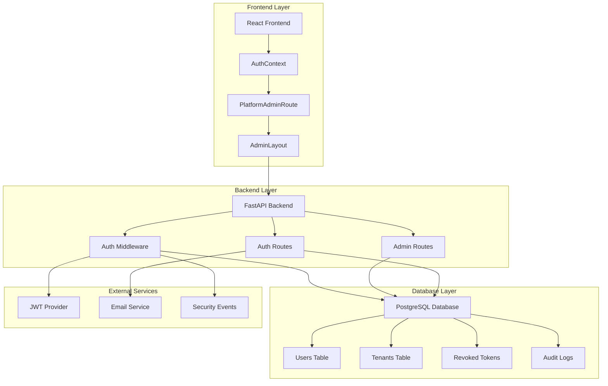

**Diagram sources**
- [auth.py:1-247](file://app/backend/middleware/auth.py#L1-L247)
- [auth.py:1-517](file://app/backend/routes/auth.py#L1-L517)
- [admin.py:1-800](file://app/backend/routes/admin.py#L1-L800)

## Authentication Components

### JWT Authentication Middleware

The authentication middleware provides centralized JWT token validation and user loading functionality. It supports both bearer token authentication for API clients and cookie-based authentication for browser clients.

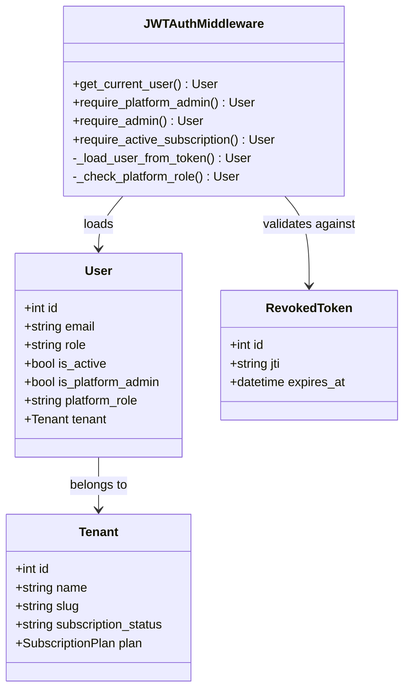

**Diagram sources**
- [auth.py:57-145](file://app/backend/middleware/auth.py#L57-L145)
- [db_models.py:77-99](file://app/backend/models/db_models.py#L77-L99)
- [db_models.py:33-75](file://app/backend/models/db_models.py#L33-L75)

**Section sources**
- [auth.py:1-247](file://app/backend/middleware/auth.py#L1-L247)
- [db_models.py:77-99](file://app/backend/models/db_models.py#L77-L99)

### Authentication Routes

The authentication routes handle user registration, login, token refresh, logout, and password management. These routes implement comprehensive security measures including rate limiting, email verification, and secure token generation.

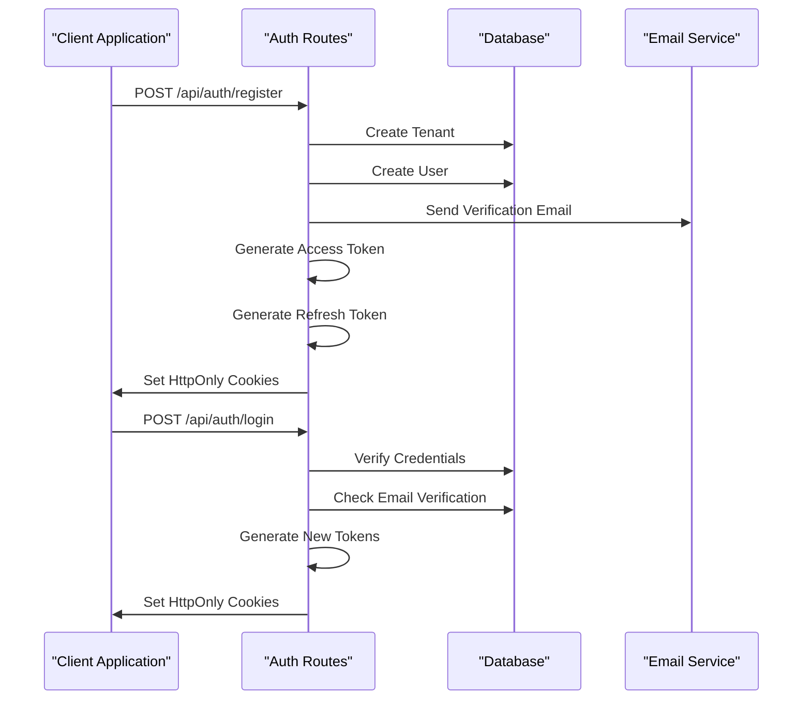

**Diagram sources**
- [auth.py:175-314](file://app/backend/routes/auth.py#L175-L314)

**Section sources**
- [auth.py:1-517](file://app/backend/routes/auth.py#L1-L517)

## Platform Admin Authentication Flow

### Admin User Registration and Verification

The platform admin authentication flow begins with user registration and verification processes that establish secure administrative accounts.

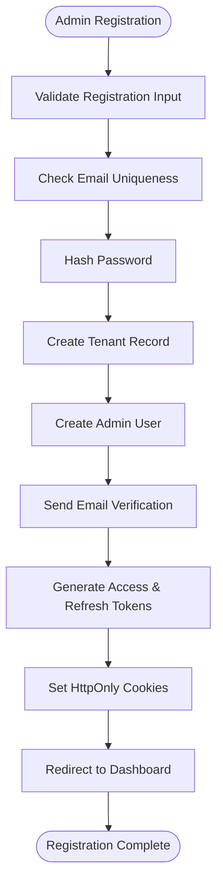

**Diagram sources**
- [auth.py:175-250](file://app/backend/routes/auth.py#L175-L250)

### Login and Authentication Process

The login process implements multiple security layers including rate limiting, credential verification, and email verification checks.

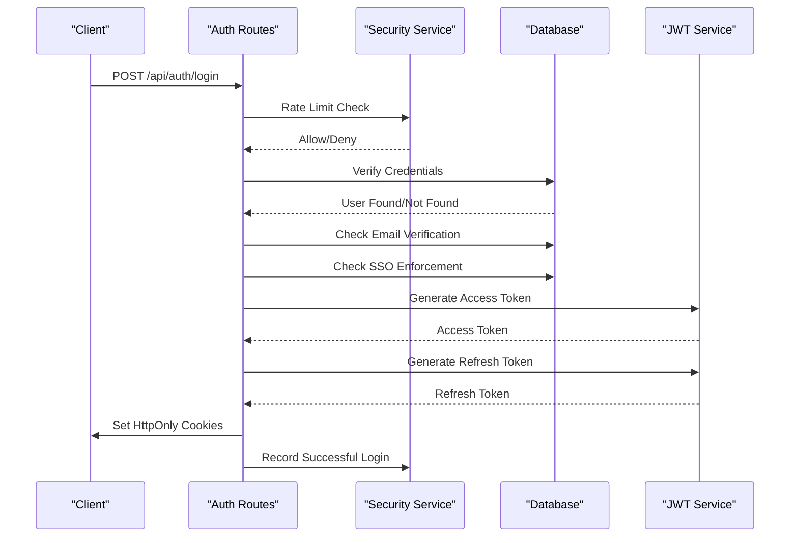

**Diagram sources**
- [auth.py:264-314](file://app/backend/routes/auth.py#L264-L314)

**Section sources**
- [auth.py:264-314](file://app/backend/routes/auth.py#L264-L314)

### Token Refresh and Rotation

The token refresh mechanism provides secure session management with proper token rotation and revocation handling.

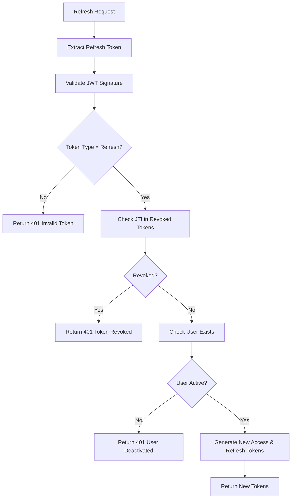

**Diagram sources**
- [auth.py:317-366](file://app/backend/routes/auth.py#L317-L366)

**Section sources**
- [auth.py:317-366](file://app/backend/routes/auth.py#L317-L366)

## Token Management

### JWT Token Structure and Claims

The authentication system uses JWT tokens with standardized claims for user identification, tenant association, and token type specification.

| Claim | Type | Description | Required |
|-------|------|-------------|----------|
| `sub` | String | User identifier (UUID) | Yes |
| `tenant_id` | String | Tenant identifier | Yes |
| `type` | String | Token type (access/refresh) | No |
| `jti` | String | JWT ID (unique) | Yes |
| `exp` | Number | Expiration timestamp | Yes |

### Token Storage and Security

Tokens are securely stored using HttpOnly cookies to prevent XSS attacks while supporting both browser and API client authentication scenarios.

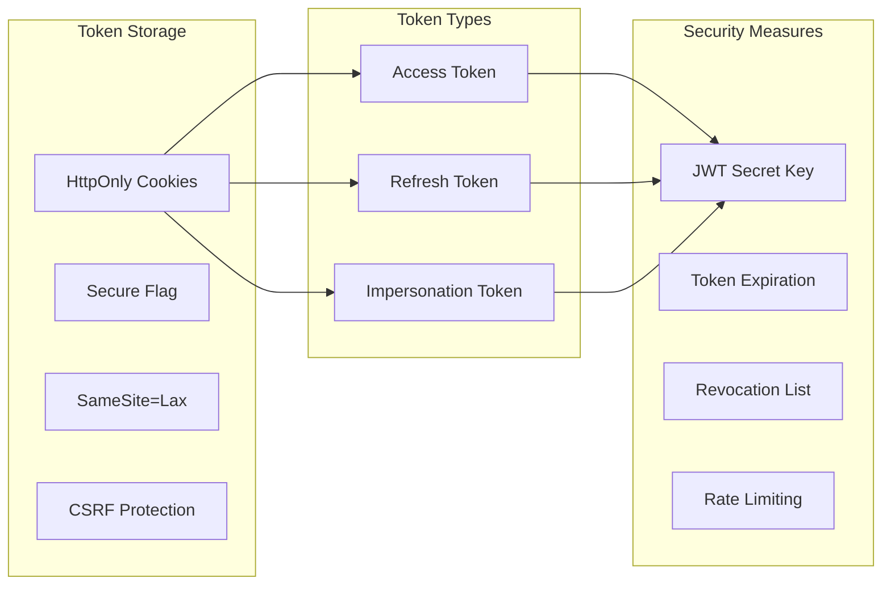

**Diagram sources**
- [auth.py:124-170](file://app/backend/routes/auth.py#L124-L170)
- [auth.py:15-28](file://app/backend/middleware/auth.py#L15-L28)

**Section sources**
- [auth.py:124-170](file://app/backend/routes/auth.py#L124-L170)
- [auth.py:15-28](file://app/backend/middleware/auth.py#L15-L28)

## Authorization and RBAC

### Platform-Level Roles and Permissions

The platform implements a hierarchical role-based access control (RBAC) system with five distinct platform administrator roles, each with specific permissions and capabilities.

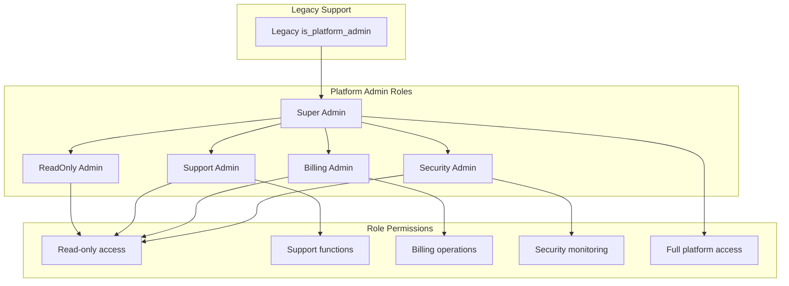

**Diagram sources**
- [auth.py:32-52](file://app/backend/middleware/auth.py#L32-L52)
- [auth.py:184-228](file://app/backend/middleware/auth.py#L184-L228)

### Tenant-Level vs Platform-Level Access

The system distinguishes between tenant-level administrative functions and platform-level administrative functions, with platform admins having elevated privileges across all tenants.

| Access Level | Description | Scope | Examples |
|--------------|-------------|-------|----------|
| Tenant Admin | Standard tenant administrator | Single tenant | Manage users, plans, billing |
| Platform Admin | Platform-wide administrator | All tenants | Tenant management, system config |
| Super Admin | Highest platform privilege | Full system control | Create/delete tenants, system config |
| Support Admin | Customer support access | Limited platform functions | User assistance, ticket management |
| Billing Admin | Financial operations | Billing and payments | Payment processing, invoices |

**Section sources**
- [auth.py:32-52](file://app/backend/middleware/auth.py#L32-L52)
- [auth.py:184-228](file://app/backend/middleware/auth.py#L184-L228)

## Frontend Authentication Integration

### Authentication Context and State Management

The frontend implements comprehensive authentication state management through React Context, providing seamless authentication integration across the admin interface.

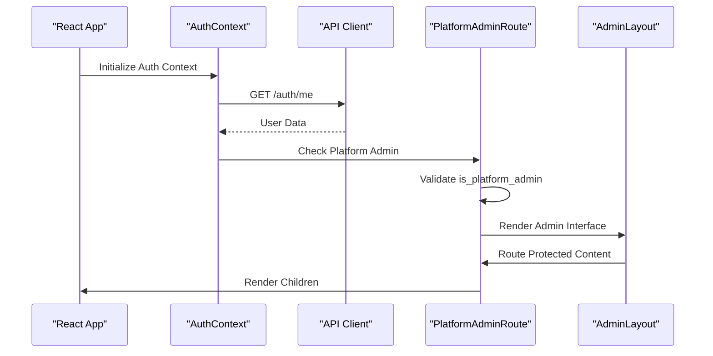

**Diagram sources**
- [AuthContext.jsx:14-49](file://app/frontend/src/contexts/AuthContext.jsx#L14-L49)
- [PlatformAdminRoute.jsx:4-19](file://app/frontend/src/components/PlatformAdminRoute.jsx#L4-L19)

### Protected Route Implementation

The platform admin route protection ensures that only authorized platform administrators can access sensitive administrative interfaces.

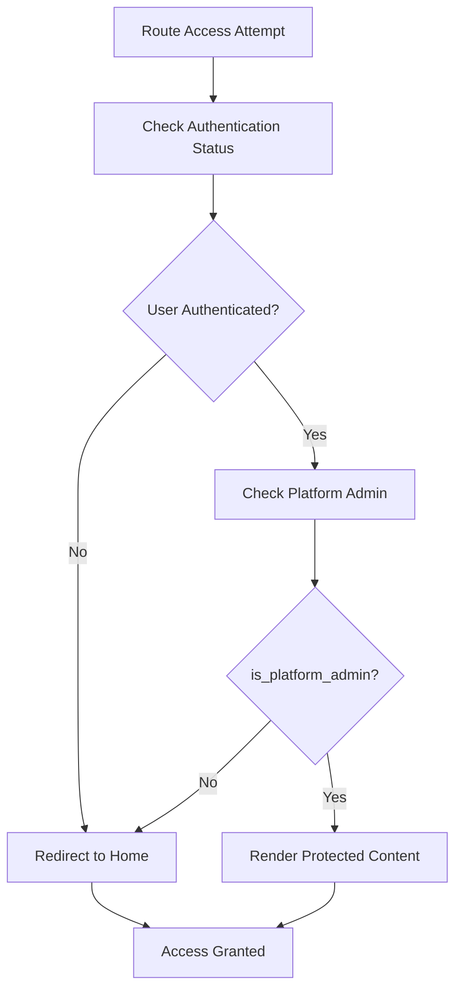

**Diagram sources**
- [PlatformAdminRoute.jsx:4-19](file://app/frontend/src/components/PlatformAdminRoute.jsx#L4-L19)

**Section sources**
- [AuthContext.jsx:1-112](file://app/frontend/src/contexts/AuthContext.jsx#L1-L112)
- [PlatformAdminRoute.jsx:1-20](file://app/frontend/src/components/PlatformAdminRoute.jsx#L1-L20)
- [AdminLayout.jsx:1-298](file://app/frontend/src/layouts/AdminLayout.jsx#L1-L298)

## Security Features

### Rate Limiting and Brute Force Protection

The authentication system implements comprehensive rate limiting mechanisms to prevent brute force attacks and abuse of authentication endpoints.

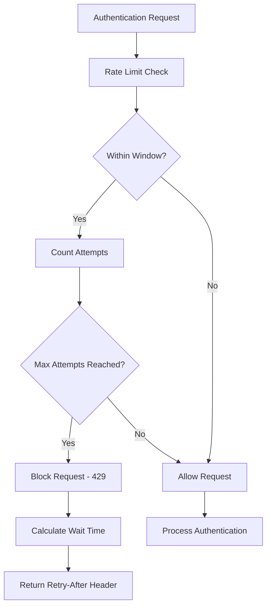

**Diagram sources**
- [auth.py:45-74](file://app/backend/routes/auth.py#L45-L74)

### Token Revocation and Logout

The logout process implements proper token revocation by adding refresh tokens to a revocation list, preventing their reuse even after expiration.

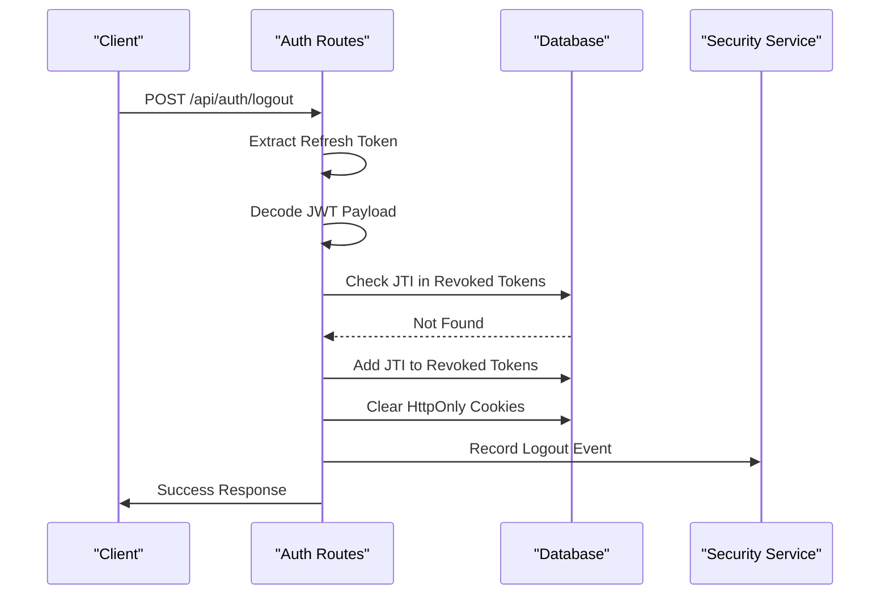

**Diagram sources**
- [auth.py:378-421](file://app/backend/routes/auth.py#L378-L421)

**Section sources**
- [auth.py:45-74](file://app/backend/routes/auth.py#L45-L74)
- [auth.py:378-421](file://app/backend/routes/auth.py#L378-L421)

### Impersonation Capabilities

Platform administrators can impersonate tenant users for support and debugging purposes through secure impersonation sessions.

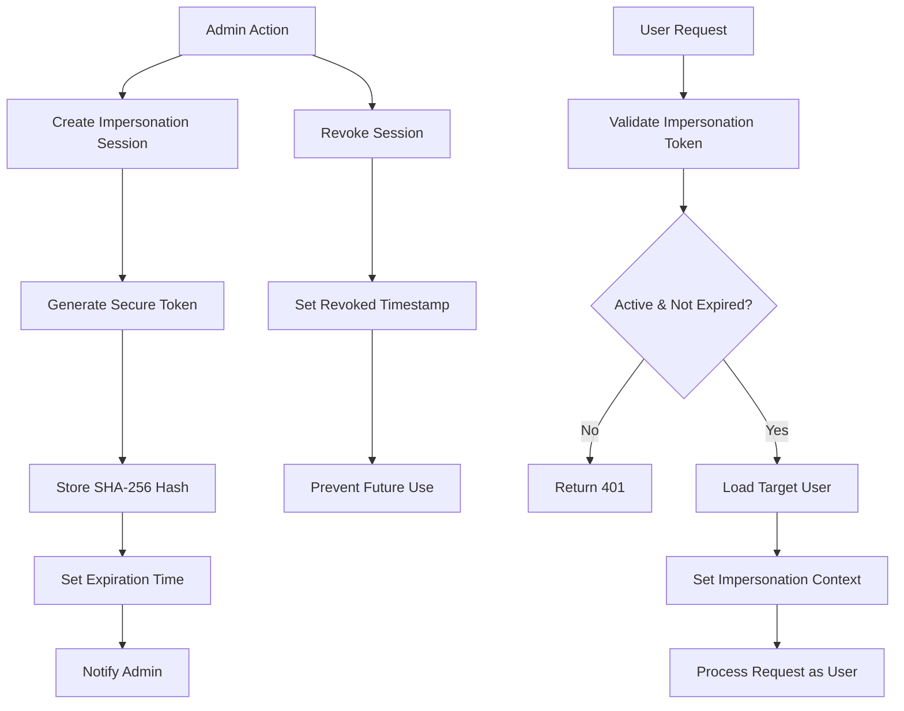

**Diagram sources**
- [impersonation_service.py:17-41](file://app/backend/services/impersonation_service.py#L17-L41)
- [auth.py:109-138](file://app/backend/middleware/auth.py#L109-L138)

**Section sources**
- [impersonation_service.py:1-109](file://app/backend/services/impersonation_service.py#L1-L109)
- [auth.py:109-138](file://app/backend/middleware/auth.py#L109-L138)

## Error Handling and Validation

### Comprehensive Error Responses

The authentication system provides detailed error responses with appropriate HTTP status codes and error messages for different failure scenarios.

| Error Scenario | HTTP Status | Error Code | Description |
|----------------|-------------|------------|-------------|
| Invalid Credentials | 401 | INVALID_CREDENTIALS | Username/password combination invalid |
| Email Not Verified | 403 | EMAIL_NOT_VERIFIED | User email requires verification |
| Account Suspended | 403 | ACCOUNT_SUSPENDED | Tenant account suspended |
| Invalid Token | 401 | INVALID_TOKEN | JWT token invalid or expired |
| Token Revoked | 401 | TOKEN_REVOKED | Token has been revoked |
| Too Many Requests | 429 | TOO_MANY_REQUESTS | Rate limit exceeded |
| Access Denied | 403 | ACCESS_DENIED | Insufficient permissions |

### Input Validation and Sanitization

The system implements comprehensive input validation and sanitization to prevent injection attacks and ensure data integrity.

**Section sources**
- [auth.py:264-314](file://app/backend/routes/auth.py#L264-L314)
- [auth.py:57-84](file://app/backend/middleware/auth.py#L57-L84)

## Troubleshooting Guide

### Common Authentication Issues

#### Issue: Users Cannot Login
**Symptoms**: Login returns 401 Unauthorized
**Possible Causes**:
- Invalid email/password combination
- Account deactivated or suspended
- Email verification required
- SSO enforced by tenant configuration

**Resolution Steps**:
1. Verify user credentials are correct
2. Check if account is active and not suspended
3. Ensure email verification is complete
4. Verify SSO configuration for tenant

#### Issue: Token Expires Too Soon
**Symptoms**: Frequent logout despite recent activity
**Possible Causes**:
- Access token expiration too short
- Network latency causing token validation failures
- Clock synchronization issues

**Resolution Steps**:
1. Check ACCESS_TOKEN_EXPIRE_MINUTES environment variable
2. Verify system clock synchronization
3. Review network latency affecting token validation

#### Issue: Admin Access Denied
**Symptoms**: Platform admin routes return 403 Forbidden
**Possible Causes**:
- User lacks platform admin privileges
- Legacy is_platform_admin flag not set
- Platform role not properly configured

**Resolution Steps**:
1. Verify user has is_platform_admin = true
2. Check platform_role field is set appropriately
3. Confirm user belongs to platform admin group

#### Issue: Impersonation Session Fails
**Symptoms**: Impersonation token returns 401
**Possible Causes**:
- Token expired or revoked
- Session not found in database
- Target user deactivated

**Resolution Steps**:
1. Generate new impersonation token
2. Verify session is not expired or revoked
3. Check target user account status

**Section sources**
- [auth.py:264-314](file://app/backend/routes/auth.py#L264-L314)
- [auth.py:109-145](file://app/backend/middleware/auth.py#L109-L145)
- [impersonation_service.py:44-56](file://app/backend/services/impersonation_service.py#L44-L56)