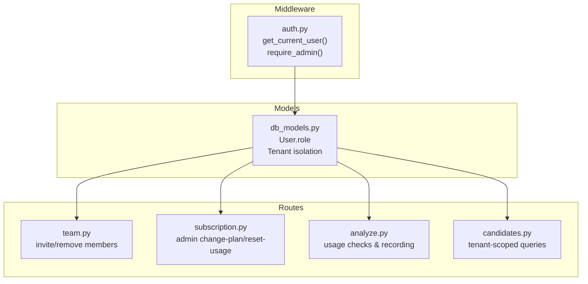
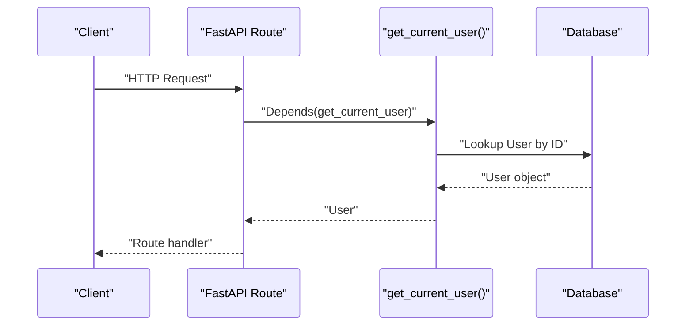
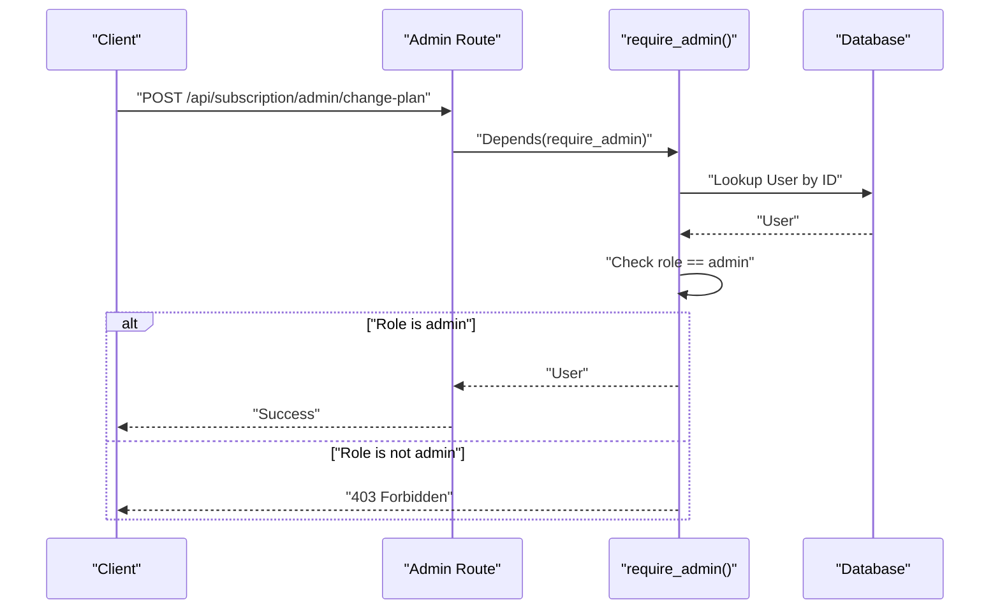
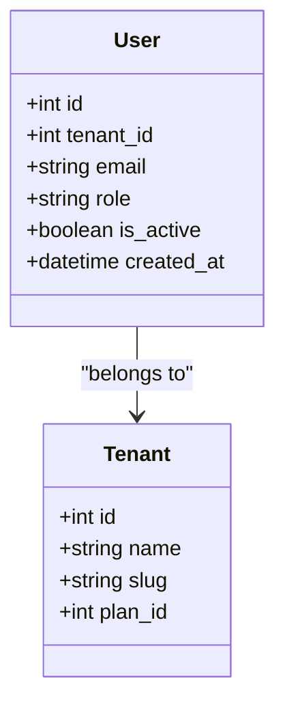
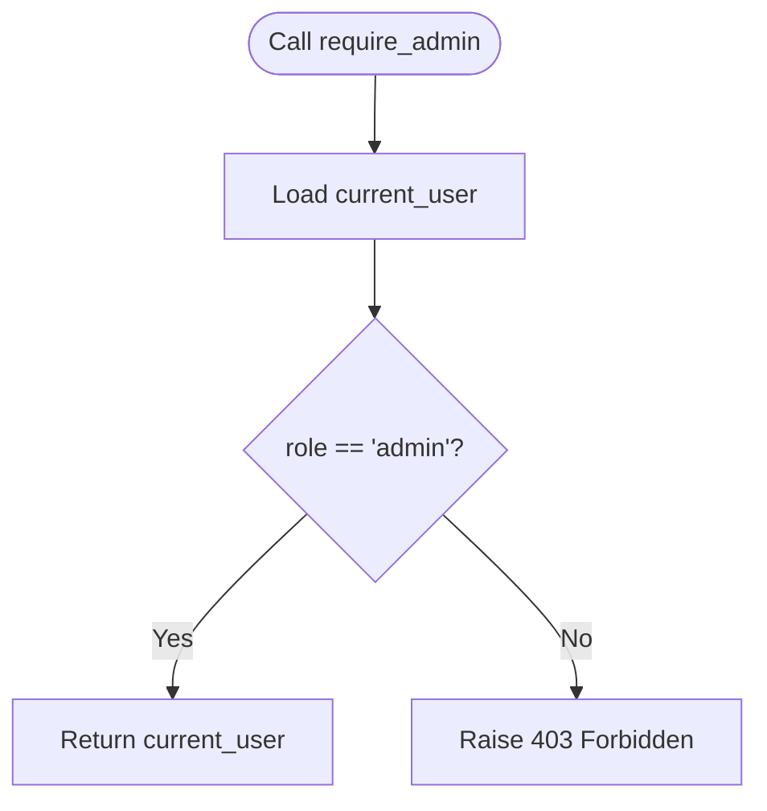
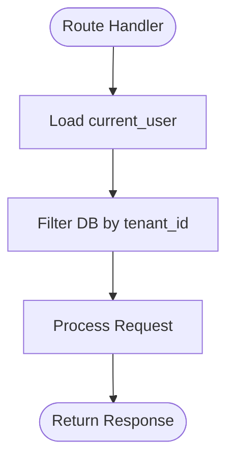
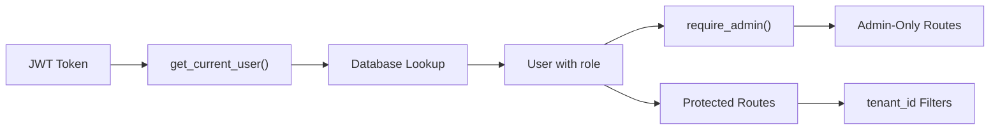

# Role-Based Access Control (RBAC)

<cite>
**Referenced Files in This Document**
- [auth.py](file://app/backend/middleware/auth.py)
- [db_models.py](file://app/backend/models/db_models.py)
- [schemas.py](file://app/backend/models/schemas.py)
- [team.py](file://app/backend/routes/team.py)
- [auth_routes.py](file://app/backend/routers/auth.py)
- [subscription.py](file://app/backend/routes/subscription.py)
- [analyze.py](file://app/backend/routes/analyze.py)
- [candidates.py](file://app/backend/routes/candidates.py)
- [AuthContext.jsx](file://app/frontend/src/contexts/AuthContext.jsx)
- [TeamPage.jsx](file://app/frontend/src/pages/TeamPage.jsx)
</cite>

## Table of Contents
1. [Introduction](#introduction)
2. [Project Structure](#project-structure)
3. [Core Components](#core-components)
4. [Architecture Overview](#architecture-overview)
5. [Detailed Component Analysis](#detailed-component-analysis)
6. [Dependency Analysis](#dependency-analysis)
7. [Performance Considerations](#performance-considerations)
8. [Troubleshooting Guide](#troubleshooting-guide)
9. [Conclusion](#conclusion)

## Introduction
This document explains the Role-Based Access Control (RBAC) implementation in the Resume AI platform. It covers user roles, tenant isolation, admin-only protections, and how permissions are enforced across API routes. It also documents the User model role field, the require_admin dependency, and how to extend the role system safely.

## Project Structure
RBAC spans three layers:
- Middleware: Authentication and role enforcement
- Models: Multi-tenant data model and user role field
- Routes: Route-level protection and tenant-scoped queries

**Diagram sources**
- [auth.py:19-46](file://app/backend/middleware/auth.py#L19-L46)
- [db_models.py:62-76](file://app/backend/models/db_models.py#L62-L76)
- [team.py:34-82](file://app/backend/routes/team.py#L34-L82)
- [subscription.py:372-422](file://app/backend/routes/subscription.py#L372-L422)
- [analyze.py:323-351](file://app/backend/routes/analyze.py#L323-L351)
- [candidates.py:26-100](file://app/backend/routes/candidates.py#L26-L100)

**Section sources**
- [auth.py:19-46](file://app/backend/middleware/auth.py#L19-L46)
- [db_models.py:62-76](file://app/backend/models/db_models.py#L62-L76)

## Core Components
- User model role field: The User entity stores a role string that determines access. Roles observed in code include admin, recruiter, and viewer.
- require_admin dependency: A FastAPI dependency that raises a 403 Forbidden if the current user’s role is not admin.
- Tenant isolation: All routes filter database queries by tenant_id to ensure data segregation between tenants.

Key implementation references:
- User role field and tenant foreign key
- require_admin function
- Tenant-scoped filtering in routes

**Section sources**
- [db_models.py:62-76](file://app/backend/models/db_models.py#L62-L76)
- [auth.py:43-46](file://app/backend/middleware/auth.py#L43-L46)
- [team.py:18-31](file://app/backend/routes/team.py#L18-L31)
- [subscription.py:172-180](file://app/backend/routes/subscription.py#L172-L180)

## Architecture Overview
The RBAC architecture enforces:
- Authentication via JWT bearer tokens
- Authorization via user role checks
- Tenant-aware data access
- Admin-only operations gated behind require_admin

**Diagram sources**
- [auth.py:19-40](file://app/backend/middleware/auth.py#L19-L40)

**Diagram sources**
- [auth.py:43-46](file://app/backend/middleware/auth.py#L43-L46)
- [subscription.py:394-422](file://app/backend/routes/subscription.py#L394-L422)

## Detailed Component Analysis

### User Model and Roles
- The User model includes a role string field and a tenant_id foreign key. Roles observed in code include admin, recruiter, and viewer.
- The auth registration flow creates the first user as admin for a newly created tenant.

**Diagram sources**
- [db_models.py:62-76](file://app/backend/models/db_models.py#L62-L76)
- [db_models.py:31-59](file://app/backend/models/db_models.py#L31-L59)

**Section sources**
- [db_models.py:62-76](file://app/backend/models/db_models.py#L62-L76)
- [auth_routes.py:77-86](file://app/backend/routers/auth.py#L77-L86)

### require_admin Dependency and Admin-Only Routes
- require_admin enforces admin-only access by checking current_user.role.
- Admin-only routes include team member removal and subscription admin endpoints.

**Diagram sources**
- [auth.py:43-46](file://app/backend/middleware/auth.py#L43-L46)

**Section sources**
- [auth.py:43-46](file://app/backend/middleware/auth.py#L43-L46)
- [team.py:64-82](file://app/backend/routes/team.py#L64-L82)
- [subscription.py:372-422](file://app/backend/routes/subscription.py#L372-L422)

### Tenant Isolation and Data Access
- All routes filter database queries by tenant_id to prevent cross-tenant data access.
- Examples include team listing, candidate queries, and usage history retrieval.

**Diagram sources**
- [team.py:18-31](file://app/backend/routes/team.py#L18-L31)
- [candidates.py:26-80](file://app/backend/routes/candidates.py#L26-L80)
- [subscription.py:346-367](file://app/backend/routes/subscription.py#L346-L367)

**Section sources**
- [team.py:18-31](file://app/backend/routes/team.py#L18-L31)
- [candidates.py:26-80](file://app/backend/routes/candidates.py#L26-L80)
- [subscription.py:346-367](file://app/backend/routes/subscription.py#L346-L367)

### Permission Enforcement Across API Endpoints
- Public/authenticated endpoints: Many routes depend on get_current_user and filter by tenant_id.
- Admin-only endpoints: require_admin is applied to sensitive operations.

Examples:
- Team management: invite and remove members are admin-only; list team is authenticated and tenant-scoped.
- Subscription admin: reset usage and change plan are admin-only.
- Analysis and batch analysis: enforce usage limits and tenant isolation.

**Section sources**
- [team.py:18-31](file://app/backend/routes/team.py#L18-L31)
- [team.py:34-82](file://app/backend/routes/team.py#L34-L82)
- [subscription.py:372-422](file://app/backend/routes/subscription.py#L372-L422)
- [analyze.py:323-351](file://app/backend/routes/analyze.py#L323-L351)
- [candidates.py:26-100](file://app/backend/routes/candidates.py#L26-L100)

### Frontend Integration and Role Display
- The frontend displays user roles and restricts actions based on role.
- The Team page shows role badges and role selection for invitations.

**Section sources**
- [AuthContext.jsx:42-69](file://app/frontend/src/contexts/AuthContext.jsx#L42-L69)
- [TeamPage.jsx:6-35](file://app/frontend/src/pages/TeamPage.jsx#L6-L35)

## Dependency Analysis
RBAC depends on:
- Authentication middleware for user identity
- User role field for authorization decisions
- Tenant foreign keys for data isolation
- Route dependencies to enforce admin-only operations

**Diagram sources**
- [auth.py:19-46](file://app/backend/middleware/auth.py#L19-L46)
- [db_models.py:62-76](file://app/backend/models/db_models.py#L62-L76)
- [team.py:34-82](file://app/backend/routes/team.py#L34-L82)
- [subscription.py:372-422](file://app/backend/routes/subscription.py#L372-L422)

**Section sources**
- [auth.py:19-46](file://app/backend/middleware/auth.py#L19-L46)
- [db_models.py:62-76](file://app/backend/models/db_models.py#L62-L76)

## Performance Considerations
- Role checks are O(1) string comparisons and occur before database access.
- Tenant filters add minimal overhead and are essential for correctness.
- Admin-only routes should avoid unnecessary computations when raising 403.

## Troubleshooting Guide
Common issues and resolutions:
- 401 Not authenticated: Verify JWT bearer token presence and validity.
- 401 Invalid/expired token: Regenerate token via refresh flow.
- 403 Admin access required: Ensure current user role is admin.
- 404 Not found: Confirm tenant_id filters and resource ownership.
- Cross-tenant access errors: Verify tenant_id is derived from current_user and used in all filters.

**Section sources**
- [auth.py:23-40](file://app/backend/middleware/auth.py#L23-L40)
- [auth.py:43-46](file://app/backend/middleware/auth.py#L43-L46)
- [team.py:64-82](file://app/backend/routes/team.py#L64-L82)

## Conclusion
The platform implements a clear RBAC model:
- Roles: admin, recruiter, viewer
- Tenant isolation: enforced via tenant_id filters
- Admin-only operations: protected by require_admin
- Extensibility: new roles and admin endpoints can be added by following the established patterns

Best practices:
- Always depend on get_current_user for authenticated access
- Always filter by tenant_id in route handlers
- Use require_admin for sensitive operations
- Keep role validation centralized in middleware
- Document role implications for each endpoint