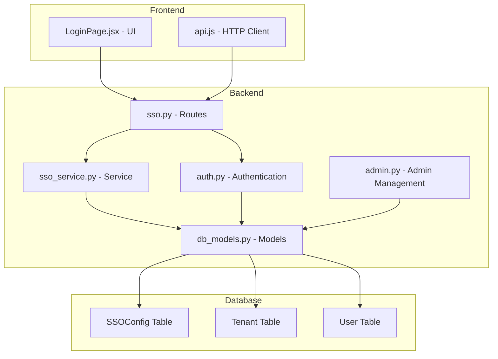
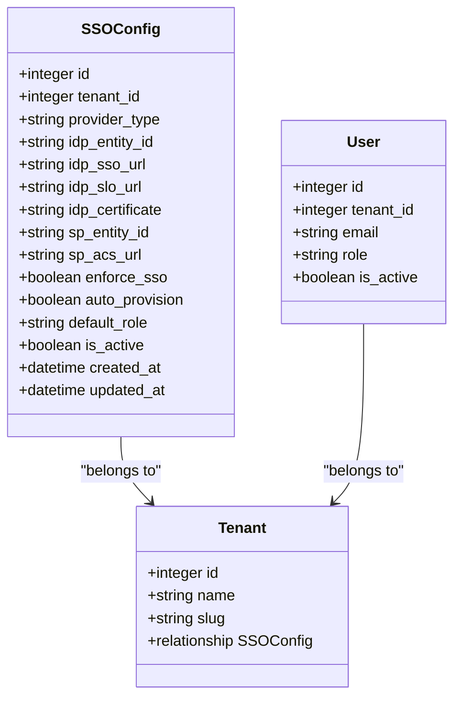
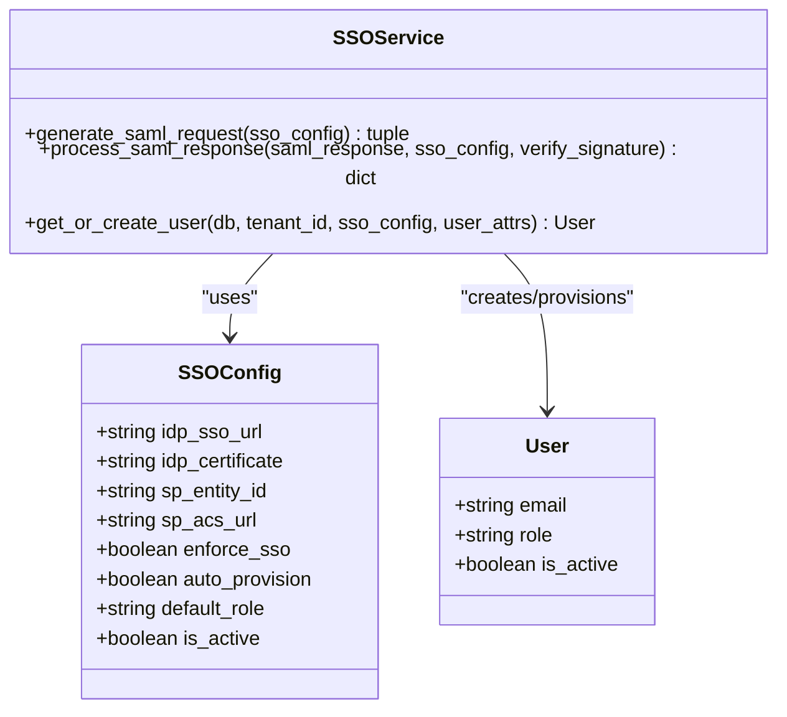
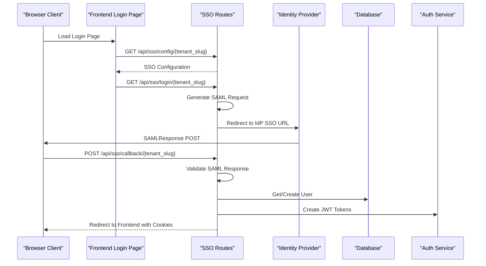
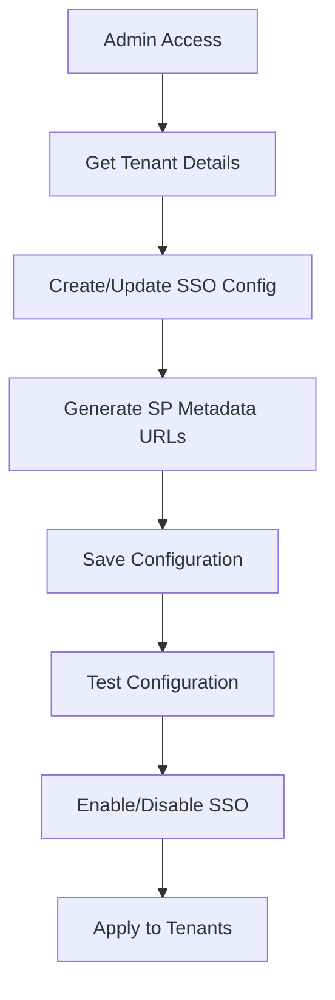
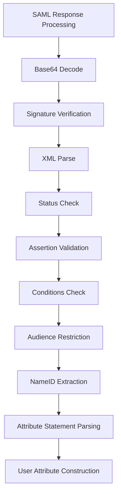
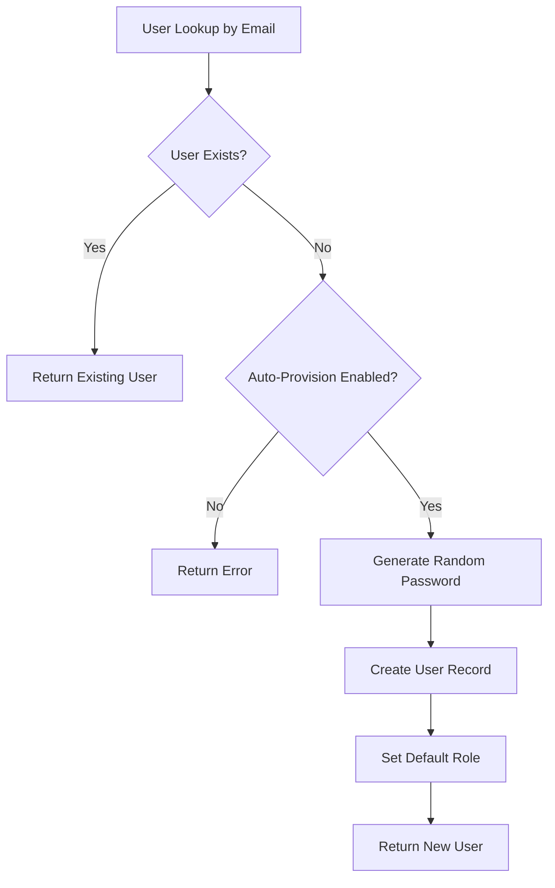
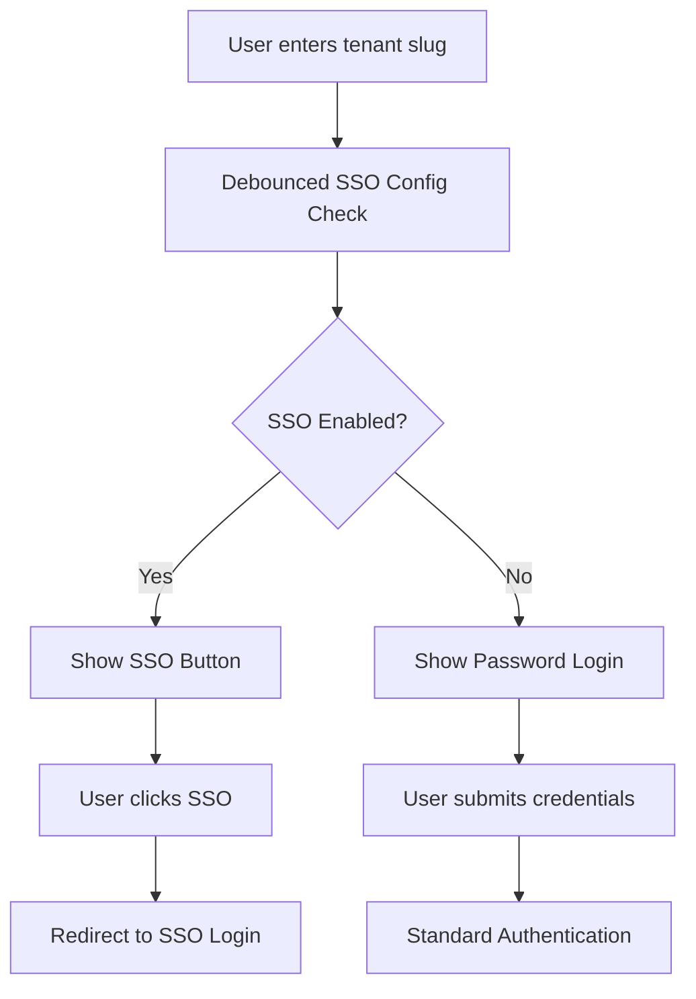
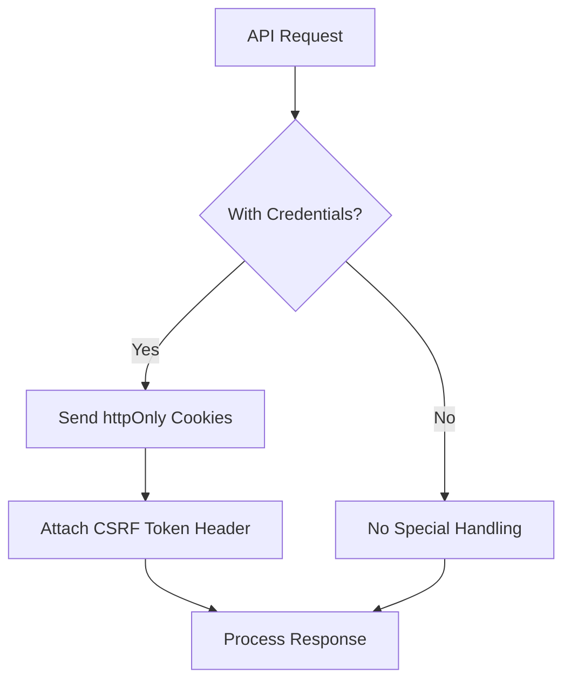
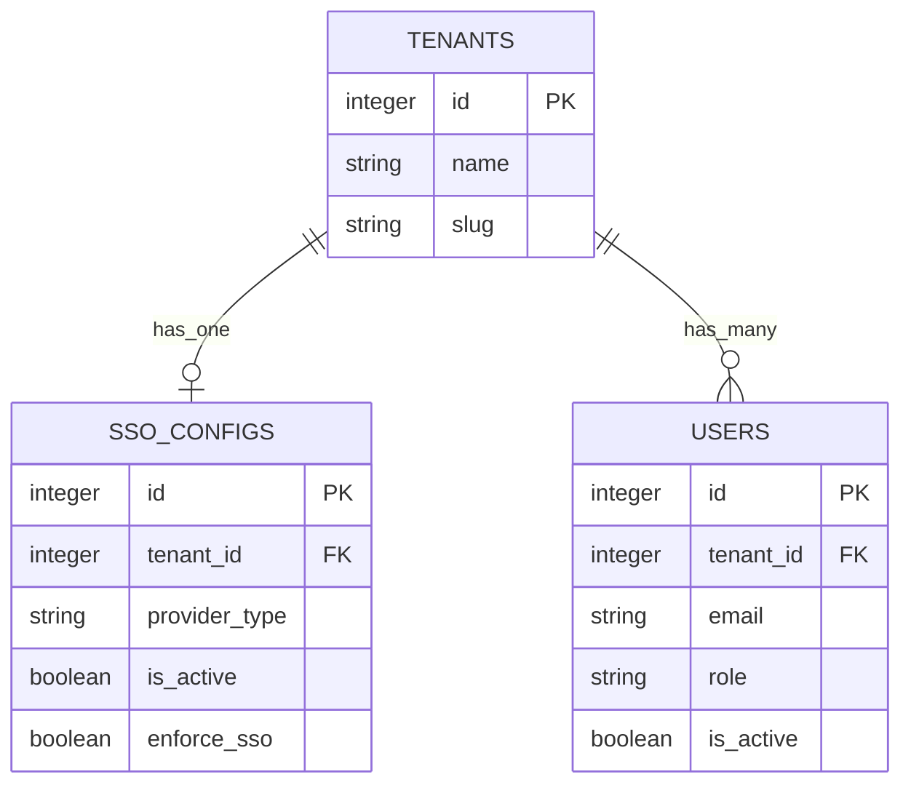

# Single Sign-On and SAML Integration

<cite>
**Referenced Files in This Document**
- [sso.py](file://app/backend/routes/sso.py)
- [sso_service.py](file://app/backend/services/sso_service.py)
- [db_models.py](file://app/backend/models/db_models.py)
- [auth.py](file://app/backend/routes/auth.py)
- [admin.py](file://app/backend/routes/admin.py)
- [032_sso_config.py](file://alembic/versions/032_sso_config.py)
- [test_sso.py](file://app/backend/tests/test_sso.py)
- [LoginPage.jsx](file://app/frontend/src/pages/LoginPage.jsx)
- [api.js](file://app/frontend/src/lib/api.js)
</cite>

## Table of Contents
1. [Introduction](#introduction)
2. [Project Structure](#project-structure)
3. [Core Components](#core-components)
4. [Architecture Overview](#architecture-overview)
5. [Detailed Component Analysis](#detailed-component-analysis)
6. [Dependency Analysis](#dependency-analysis)
7. [Performance Considerations](#performance-considerations)
8. [Troubleshooting Guide](#troubleshooting-guide)
9. [Conclusion](#conclusion)

## Introduction
This document provides comprehensive documentation for the Single Sign-On (SSO) and SAML 2.0 integration within the Resume AI platform. The implementation enables enterprise-grade authentication through Identity Providers (IdP) while maintaining compatibility with the existing password-based authentication system. The solution supports tenant-specific SSO configuration, automatic user provisioning, and seamless integration with the frontend login experience.

## Project Structure
The SSO implementation spans backend routes, services, database models, and frontend integration components:



**Diagram sources**
- [sso.py:1-156](file://app/backend/routes/sso.py#L1-L156)
- [sso_service.py:1-335](file://app/backend/services/sso_service.py#L1-L335)
- [db_models.py:665-691](file://app/backend/models/db_models.py#L665-L691)

**Section sources**
- [sso.py:1-156](file://app/backend/routes/sso.py#L1-L156)
- [sso_service.py:1-335](file://app/backend/services/sso_service.py#L1-L335)
- [db_models.py:665-691](file://app/backend/models/db_models.py#L665-L691)

## Core Components

### SSO Configuration Model
The SSO configuration is managed through a dedicated database model supporting tenant isolation and flexible provider types:



**Diagram sources**
- [db_models.py:665-691](file://app/backend/models/db_models.py#L665-L691)

### SSO Service Implementation
The lightweight SAML 2.0 service handles request generation, response validation, and user provisioning:



**Diagram sources**
- [sso_service.py:164-335](file://app/backend/services/sso_service.py#L164-L335)

**Section sources**
- [db_models.py:665-691](file://app/backend/models/db_models.py#L665-L691)
- [sso_service.py:164-335](file://app/backend/services/sso_service.py#L164-L335)

## Architecture Overview

### SAML Authentication Flow
The SSO implementation follows the SAML 2.0 authentication flow with redirect binding:



**Diagram sources**
- [sso.py:58-123](file://app/backend/routes/sso.py#L58-L123)
- [sso_service.py:167-291](file://app/backend/services/sso_service.py#L167-L291)

### Admin Configuration Flow
Administrators can manage SSO settings through the admin interface:



**Diagram sources**
- [admin.py:768-836](file://app/backend/routes/admin.py#L768-L836)
- [032_sso_config.py:13-31](file://alembic/versions/032_sso_config.py#L13-L31)

**Section sources**
- [sso.py:36-156](file://app/backend/routes/sso.py#L36-L156)
- [sso_service.py:167-291](file://app/backend/services/sso_service.py#L167-L291)
- [admin.py:768-902](file://app/backend/routes/admin.py#L768-L902)

## Detailed Component Analysis

### Backend Routes Implementation
The SSO routes provide the core endpoints for authentication flow:

#### Configuration Endpoint
The public configuration endpoint allows the frontend to detect SSO availability:

```mermaid
flowchart TD
A[GET /api/sso/config/{tenant_slug}] --> B[Tenant Lookup]
B --> C[SSO Config Lookup]
C --> D{Config Exists & Active?}
D --> |Yes| E[Return Enabled + Enforced]
D --> |No| F[Return Disabled]
```

**Diagram sources**
- [sso.py:36-55](file://app/backend/routes/sso.py#L36-L55)

#### Login Endpoint
The login initiation endpoint generates SAML requests and redirects to IdP:

```mermaid
flowchart TD
A[GET /api/sso/login/{tenant_slug}] --> B[Validate SSO Config]
B --> C{SP URLs Missing?}
C --> |Yes| D[Auto-generate SP URLs]
C --> |No| E[Use Existing SP URLs]
D --> F[Generate SAML AuthnRequest]
E --> F
F --> G[Redirect to IdP SSO URL]
```

**Diagram sources**
- [sso.py:58-74](file://app/backend/routes/sso.py#L58-L74)

#### Callback Endpoint
The SAML assertion consumer service validates responses and issues tokens:

```mermaid
flowchart TD
A[POST /api/sso/callback/{tenant_slug}] --> B[Validate SAMLResponse]
B --> C[Process SAML Response]
C --> D[Extract User Attributes]
D --> E[Get/Create User]
E --> F{User Active?}
F --> |No| G[Return 403 Forbidden]
F --> |Yes| H[Create JWT Tokens]
H --> I[Set Auth Cookies]
I --> J[Redirect to Frontend]
```

**Diagram sources**
- [sso.py:77-123](file://app/backend/routes/sso.py#L77-L123)

**Section sources**
- [sso.py:36-156](file://app/backend/routes/sso.py#L36-L156)

### SSO Service Processing
The service component handles SAML message processing and user management:

#### SAML Response Validation
The service validates SAML responses against security requirements:



**Diagram sources**
- [sso_service.py:188-291](file://app/backend/services/sso_service.py#L188-L291)

#### User Provisioning Logic
Automatic user creation and management:



**Diagram sources**
- [sso_service.py:292-330](file://app/backend/services/sso_service.py#L292-L330)

**Section sources**
- [sso_service.py:188-330](file://app/backend/services/sso_service.py#L188-L330)

### Frontend Integration
The frontend integrates SSO through dynamic configuration and seamless authentication:

#### Login Page Enhancement
The login page dynamically detects SSO availability and provides appropriate UI:



**Diagram sources**
- [LoginPage.jsx:19-70](file://app/frontend/src/pages/LoginPage.jsx#L19-L70)

#### HTTP Client Configuration
The frontend HTTP client handles authentication cookies and CSRF protection:



**Diagram sources**
- [api.js:1-82](file://app/frontend/src/lib/api.js#L1-L82)

**Section sources**
- [LoginPage.jsx:19-70](file://app/frontend/src/pages/LoginPage.jsx#L19-L70)
- [api.js:1-82](file://app/frontend/src/lib/api.js#L1-L82)

## Dependency Analysis

### Database Schema Dependencies
The SSO implementation relies on several key database relationships:



**Diagram sources**
- [db_models.py:33-73](file://app/backend/models/db_models.py#L33-L73)
- [db_models.py:665-691](file://app/backend/models/db_models.py#L665-L691)

### Migration Dependencies
The SSO configuration table was introduced through database migration:


**Diagram sources**
- [032_sso_config.py:13-31](file://alembic/versions/032_sso_config.py#L13-L31)

**Section sources**
- [db_models.py:665-691](file://app/backend/models/db_models.py#L665-L691)
- [032_sso_config.py:13-31](file://alembic/versions/032_sso_config.py#L13-L31)

## Performance Considerations
The SSO implementation incorporates several performance and security optimizations:

### Token Management
- Access tokens use short expiration windows (default 60 minutes)
- Refresh tokens use extended expiration (default 30 days)
- Both token types include unique identifiers for enhanced security

### Request Processing
- SAML requests use HTTP-Redirect binding with compression
- Response validation includes early exit conditions for invalid inputs
- Automatic user provisioning uses efficient database queries

### Frontend Optimization
- Debounced tenant slug validation reduces unnecessary API calls
- Cookie-based authentication eliminates localStorage security risks
- Automatic retry mechanisms handle transient network failures

## Troubleshooting Guide

### Common SSO Issues

#### Configuration Problems
- **Issue**: SSO not appearing in login UI
- **Cause**: SSO configuration not found or inactive
- **Solution**: Verify tenant slug and check SSO configuration status

#### Authentication Failures
- **Issue**: SAML response validation errors
- **Cause**: Invalid signature, expired assertions, or audience mismatch
- **Solution**: Validate IdP certificate and ensure proper time synchronization

#### User Provisioning Issues
- **Issue**: New users cannot log in after SSO authentication
- **Cause**: Auto-provisioning disabled or user account deactivated
- **Solution**: Enable auto-provisioning or activate user account

### Testing and Validation
The implementation includes comprehensive test coverage for SSO functionality:

#### Test Scenarios
- SSO configuration CRUD operations
- Authentication flow validation
- Error condition handling
- User provisioning verification

**Section sources**
- [test_sso.py:134-291](file://app/backend/tests/test_sso.py#L134-L291)

## Conclusion
The SSO and SAML 2.0 integration provides a robust, enterprise-ready authentication solution that maintains compatibility with existing password-based authentication. The implementation offers tenant isolation, flexible configuration options, and seamless frontend integration. Key strengths include comprehensive error handling, automated user provisioning, and security-focused design patterns. The modular architecture supports future enhancements such as OIDC provider support and advanced certificate management capabilities.