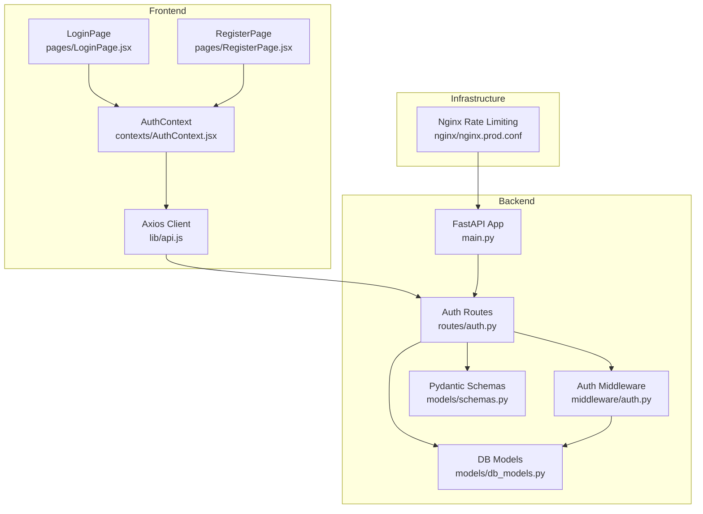
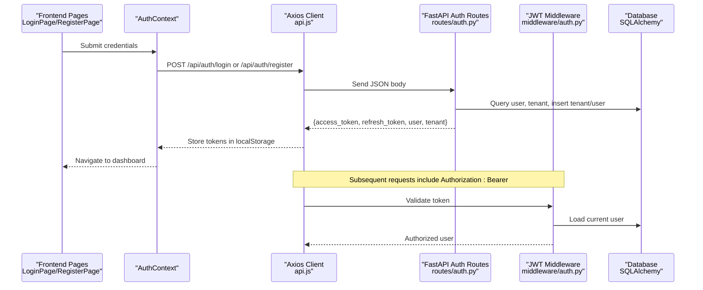
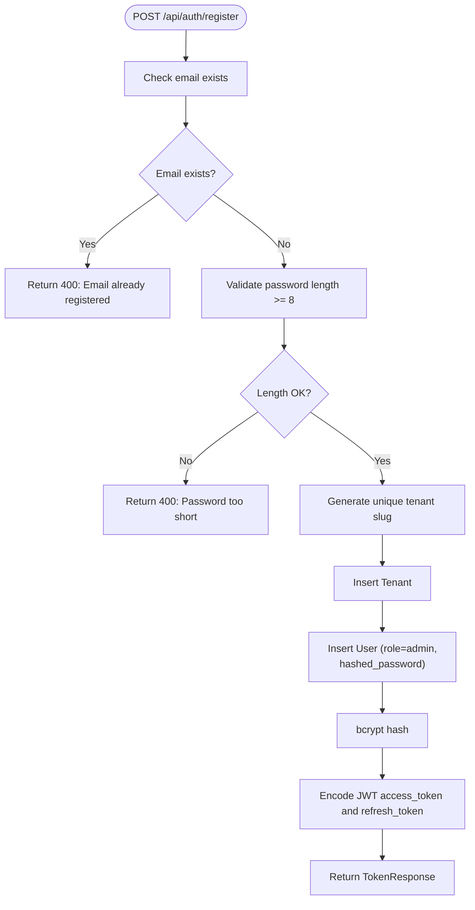
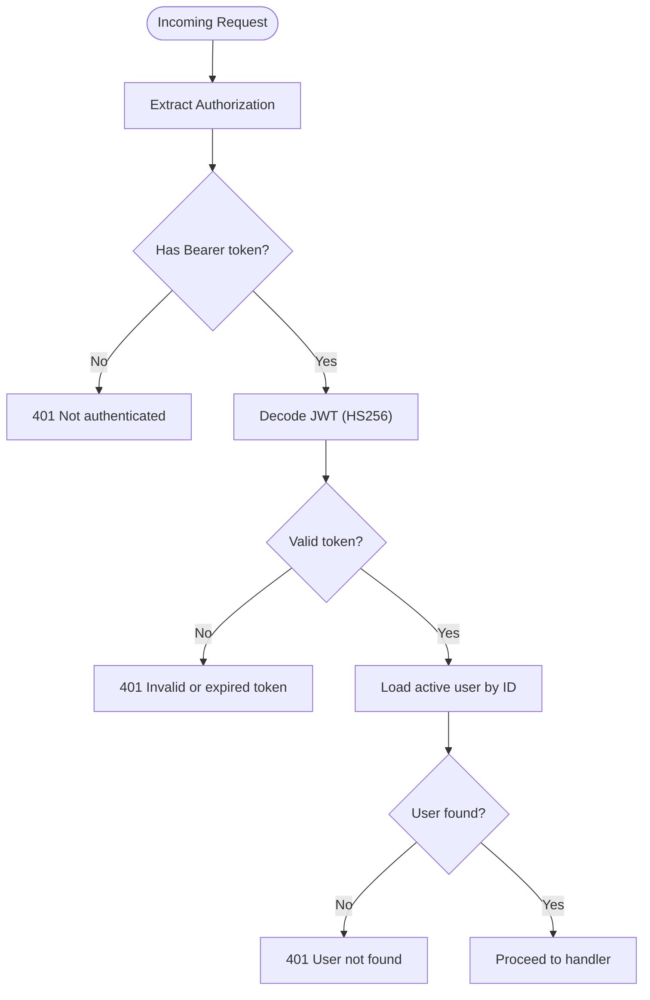
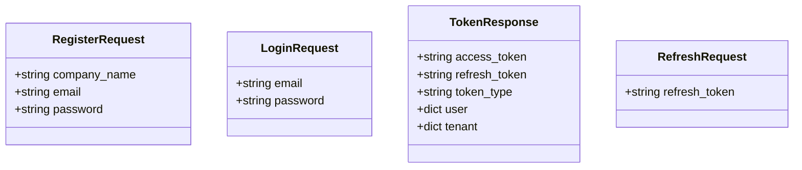
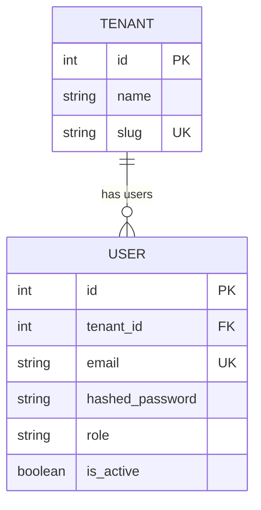
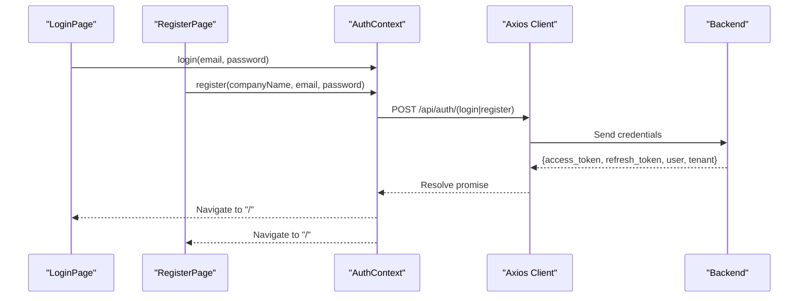
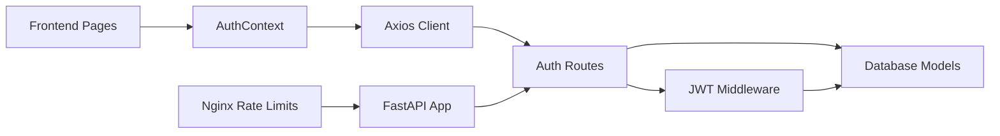

# User Registration & Login

<cite>
**Referenced Files in This Document**
- [auth.py](file://app/backend/routes/auth.py)
- [auth.py](file://app/backend/middleware/auth.py)
- [schemas.py](file://app/backend/models/schemas.py)
- [db_models.py](file://app/backend/models/db_models.py)
- [AuthContext.jsx](file://app/frontend/src/contexts/AuthContext.jsx)
- [LoginPage.jsx](file://app/frontend/src/pages/LoginPage.jsx)
- [RegisterPage.jsx](file://app/frontend/src/pages/RegisterPage.jsx)
- [api.js](file://app/frontend/src/lib/api.js)
- [nginx.prod.conf](file://app/nginx/nginx.prod.conf)
- [nginx.prod.conf](file://nginx/nginx.prod.conf)
- [main.py](file://app/backend/main.py)
- [test_auth.py](file://app/backend/tests/test_auth.py)
</cite>

## Table of Contents
1. [Introduction](#introduction)
2. [Project Structure](#project-structure)
3. [Core Components](#core-components)
4. [Architecture Overview](#architecture-overview)
5. [Detailed Component Analysis](#detailed-component-analysis)
6. [Dependency Analysis](#dependency-analysis)
7. [Performance Considerations](#performance-considerations)
8. [Troubleshooting Guide](#troubleshooting-guide)
9. [Conclusion](#conclusion)

## Introduction
This document explains the user registration and login functionality end-to-end. It covers the authentication routes, request/response schemas, user account creation workflow, password hashing, validation rules, login process, token generation and refresh, session management, frontend components, and security measures such as rate limiting and token-based protection. It also provides examples of successful flows and common error scenarios.

## Project Structure
Authentication spans backend routes and middleware, Pydantic request/response models, SQLAlchemy database models, and frontend React components with an Axios-based API client and context provider.

**Diagram sources**
- [main.py:200-215](file://app/backend/main.py#L200-L215)
- [auth.py:20-152](file://app/backend/routes/auth.py#L20-L152)
- [auth.py:19-46](file://app/backend/middleware/auth.py#L19-L46)
- [schemas.py:140-161](file://app/backend/models/schemas.py#L140-L161)
- [db_models.py:31-77](file://app/backend/models/db_models.py#L31-L77)
- [AuthContext.jsx:33-49](file://app/frontend/src/contexts/AuthContext.jsx#L33-L49)
- [api.js:9-43](file://app/frontend/src/lib/api.js#L9-L43)
- [nginx.prod.conf:9-102](file://app/nginx/nginx.prod.conf#L9-L102)

**Section sources**
- [main.py:200-215](file://app/backend/main.py#L200-L215)
- [auth.py:20-152](file://app/backend/routes/auth.py#L20-L152)
- [schemas.py:140-161](file://app/backend/models/schemas.py#L140-L161)
- [db_models.py:31-77](file://app/backend/models/db_models.py#L31-L77)
- [AuthContext.jsx:33-49](file://app/frontend/src/contexts/AuthContext.jsx#L33-L49)
- [api.js:9-43](file://app/frontend/src/lib/api.js#L9-L43)
- [nginx.prod.conf:9-102](file://app/nginx/nginx.prod.conf#L9-L102)

## Core Components
- Authentication routes: POST /api/auth/register, POST /api/auth/login, POST /api/auth/refresh, GET /api/auth/me
- Request/response schemas: RegisterRequest, LoginRequest, TokenResponse, RefreshRequest
- Password hashing: bcrypt via passlib
- JWT tokens: HS256 signed with a secret key
- Frontend authentication context and pages: AuthContext, LoginPage, RegisterPage
- API client with automatic token injection and refresh on 401
- Infrastructure rate limiting via Nginx

**Section sources**
- [auth.py:57-152](file://app/backend/routes/auth.py#L57-L152)
- [schemas.py:140-161](file://app/backend/models/schemas.py#L140-L161)
- [AuthContext.jsx:33-49](file://app/frontend/src/contexts/AuthContext.jsx#L33-L49)
- [api.js:9-43](file://app/frontend/src/lib/api.js#L9-L43)
- [nginx.prod.conf:9-102](file://app/nginx/nginx.prod.conf#L9-L102)

## Architecture Overview
End-to-end authentication flow from frontend to backend and database.

**Diagram sources**
- [LoginPage.jsx:15-27](file://app/frontend/src/pages/LoginPage.jsx#L15-L27)
- [RegisterPage.jsx:16-32](file://app/frontend/src/pages/RegisterPage.jsx#L16-L32)
- [AuthContext.jsx:33-49](file://app/frontend/src/contexts/AuthContext.jsx#L33-L49)
- [api.js:9-43](file://app/frontend/src/lib/api.js#L9-L43)
- [auth.py:57-152](file://app/backend/routes/auth.py#L57-L152)
- [auth.py:19-46](file://app/backend/middleware/auth.py#L19-L46)
- [db_models.py:31-77](file://app/backend/models/db_models.py#L31-L77)

## Detailed Component Analysis

### Backend Authentication Routes
- POST /api/auth/register
  - Validates presence of company_name, email, password
  - Enforces minimum password length
  - Creates a tenant with a unique slug derived from company_name
  - Creates an admin user linked to the tenant with bcrypt-hashed password
  - Issues access_token and refresh_token with configured expirations
  - Returns TokenResponse with user and tenant metadata
- POST /api/auth/login
  - Finds an active user by email
  - Verifies password against stored hash
  - Issues access_token and refresh_token
  - Returns TokenResponse
- POST /api/auth/refresh
  - Validates refresh token type and decodes JWT
  - Loads active user by ID
  - Issues new access_token and refresh_token
- GET /api/auth/me
  - Protected route using JWT middleware
  - Returns current user and associated tenant

**Diagram sources**
- [auth.py:57-96](file://app/backend/routes/auth.py#L57-L96)
- [auth.py:30-40](file://app/backend/routes/auth.py#L30-L40)

**Section sources**
- [auth.py:57-152](file://app/backend/routes/auth.py#L57-L152)
- [schemas.py:140-161](file://app/backend/models/schemas.py#L140-L161)

### JWT Middleware and Token Validation
- Extracts Authorization header bearer token
- Decodes JWT with HS256 using a secret key
- Loads active user by ID from payload
- Protects downstream routes requiring authentication

**Diagram sources**
- [auth.py:19-46](file://app/backend/middleware/auth.py#L19-L46)

**Section sources**
- [auth.py:19-46](file://app/backend/middleware/auth.py#L19-L46)

### Request/Response Schemas
- RegisterRequest: company_name, email, password
- LoginRequest: email, password
- TokenResponse: access_token, refresh_token, token_type, user, tenant
- RefreshRequest: refresh_token

**Diagram sources**
- [schemas.py:140-161](file://app/backend/models/schemas.py#L140-L161)

**Section sources**
- [schemas.py:140-161](file://app/backend/models/schemas.py#L140-L161)

### Database Models
- Tenant: name, slug (unique), plan linkage, usage tracking
- User: tenant_id, email (unique), hashed_password, role, is_active
- Relationship: User belongs to Tenant; admin role is auto-assigned during registration

**Diagram sources**
- [db_models.py:31-77](file://app/backend/models/db_models.py#L31-L77)

**Section sources**
- [db_models.py:31-77](file://app/backend/models/db_models.py#L31-L77)

### Frontend Authentication Components
- AuthContext
  - Provides login, register, logout
  - Persists tokens in localStorage
  - Loads user on startup via /api/auth/me
- LoginPage
  - Captures email/password
  - Calls AuthContext.login
  - Handles errors and loading state
- RegisterPage
  - Captures company_name, email, password
  - Client-side password length validation
  - Calls AuthContext.register
  - Handles errors and loading state
- api.js
  - Injects Authorization header for all requests
  - Intercepts 401 and attempts refresh via /api/auth/refresh
  - Stores new access_token and retries original request

**Diagram sources**
- [LoginPage.jsx:15-27](file://app/frontend/src/pages/LoginPage.jsx#L15-L27)
- [RegisterPage.jsx:16-32](file://app/frontend/src/pages/RegisterPage.jsx#L16-L32)
- [AuthContext.jsx:33-49](file://app/frontend/src/contexts/AuthContext.jsx#L33-L49)
- [api.js:9-43](file://app/frontend/src/lib/api.js#L9-L43)

**Section sources**
- [AuthContext.jsx:33-49](file://app/frontend/src/contexts/AuthContext.jsx#L33-L49)
- [LoginPage.jsx:15-27](file://app/frontend/src/pages/LoginPage.jsx#L15-L27)
- [RegisterPage.jsx:16-32](file://app/frontend/src/pages/RegisterPage.jsx#L16-L32)
- [api.js:9-43](file://app/frontend/src/lib/api.js#L9-L43)

### Security Measures
- Password hashing: bcrypt via passlib
- Token signing: HS256 with a secret key
- Token refresh: Separate refresh token with longer expiry
- Rate limiting: Nginx zones with burst configuration for /api/ and streaming endpoints
- Token-based session: Bearer tokens stored in localStorage; middleware validates per-request

**Section sources**
- [auth.py:30-40](file://app/backend/routes/auth.py#L30-L40)
- [auth.py:13-14](file://app/backend/middleware/auth.py#L13-L14)
- [nginx.prod.conf:9-102](file://app/nginx/nginx.prod.conf#L9-L102)

## Dependency Analysis
- Routes depend on middleware for JWT validation and database sessions
- Schemas define request/response contracts validated by FastAPI
- Frontend depends on backend endpoints and Axios interceptors for token management
- Infrastructure enforces rate limits at the edge

**Diagram sources**
- [AuthContext.jsx:33-49](file://app/frontend/src/contexts/AuthContext.jsx#L33-L49)
- [api.js:9-43](file://app/frontend/src/lib/api.js#L9-L43)
- [auth.py:20-152](file://app/backend/routes/auth.py#L20-L152)
- [auth.py:19-46](file://app/backend/middleware/auth.py#L19-L46)
- [db_models.py:31-77](file://app/backend/models/db_models.py#L31-L77)
- [nginx.prod.conf:9-102](file://app/nginx/nginx.prod.conf#L9-L102)
- [main.py:200-215](file://app/backend/main.py#L200-L215)

**Section sources**
- [auth.py:20-152](file://app/backend/routes/auth.py#L20-L152)
- [auth.py:19-46](file://app/backend/middleware/auth.py#L19-L46)
- [db_models.py:31-77](file://app/backend/models/db_models.py#L31-L77)
- [AuthContext.jsx:33-49](file://app/frontend/src/contexts/AuthContext.jsx#L33-L49)
- [api.js:9-43](file://app/frontend/src/lib/api.js#L9-L43)
- [nginx.prod.conf:9-102](file://app/nginx/nginx.prod.conf#L9-L102)
- [main.py:200-215](file://app/backend/main.py#L200-L215)

## Performance Considerations
- Token refresh is handled transparently by the frontend client, reducing repeated login failures
- Nginx rate limiting prevents abuse at the edge; streaming endpoints bypass buffering to maintain responsiveness
- bcrypt hashing is performed server-side during registration and login verification

[No sources needed since this section provides general guidance]

## Troubleshooting Guide
Common error scenarios and their causes:
- 400 Bad Request on register
  - Duplicate email already registered
  - Password shorter than minimum length
- 400 Bad Request on register (duplicate tenant slug)
  - Slug collision resolved by appending a counter; ensure company_name uniqueness
- 401 Unauthorized on login
  - Invalid email or password
  - User not active
- 401 Unauthorized on protected routes
  - Missing or invalid/expired Bearer token
  - User not found after token decode
- 401 Unauthorized on refresh
  - Invalid or non-refresh token
  - User not found or inactive
- Frontend shows generic error messages
  - LoginPage/RegisterPage display error messages returned by the backend
  - Axios interceptor handles token refresh automatically; manual intervention may be needed if refresh fails

**Section sources**
- [auth.py:59-63](file://app/backend/routes/auth.py#L59-L63)
- [auth.py:101-103](file://app/backend/routes/auth.py#L101-L103)
- [auth.py:122-127](file://app/backend/routes/auth.py#L122-L127)
- [auth.py:23-39](file://app/backend/middleware/auth.py#L23-L39)
- [LoginPage.jsx:22-26](file://app/frontend/src/pages/LoginPage.jsx#L22-L26)
- [RegisterPage.jsx:27-31](file://app/frontend/src/pages/RegisterPage.jsx#L27-L31)
- [api.js:19-43](file://app/frontend/src/lib/api.js#L19-L43)

## Conclusion
The authentication system combines robust backend routes with secure token-based sessions, client-side context management, and infrastructure-level rate limiting. Registration creates a tenant and admin user with bcrypt-protected passwords, while login and refresh provide seamless access with configurable token lifetimes. Frontend components enforce basic client-side validation and rely on Axios interceptors for transparent token refresh, ensuring a smooth user experience while maintaining strong security posture.