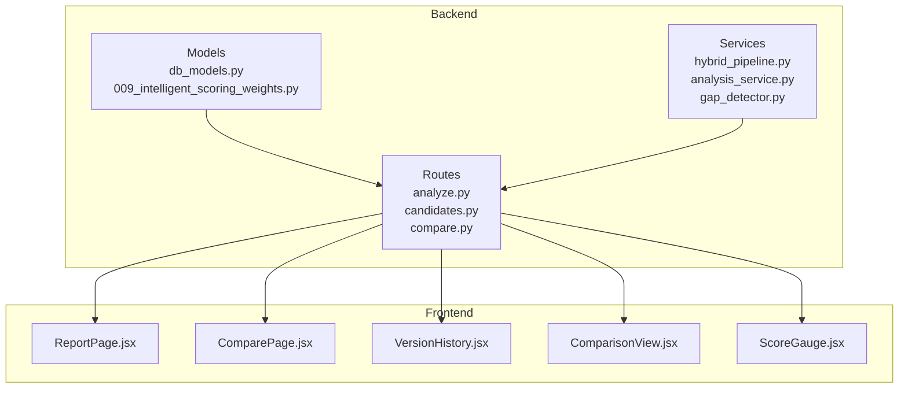
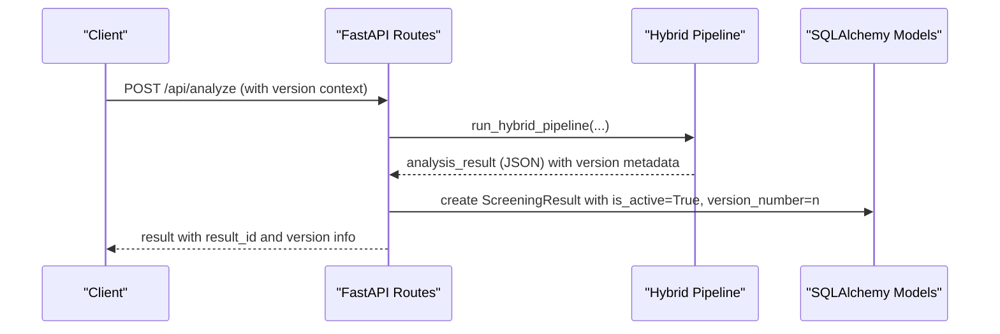
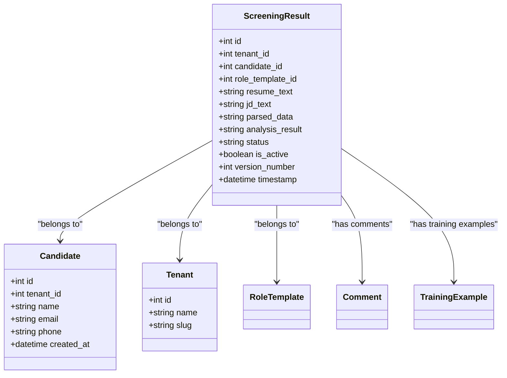
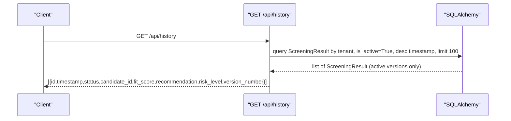
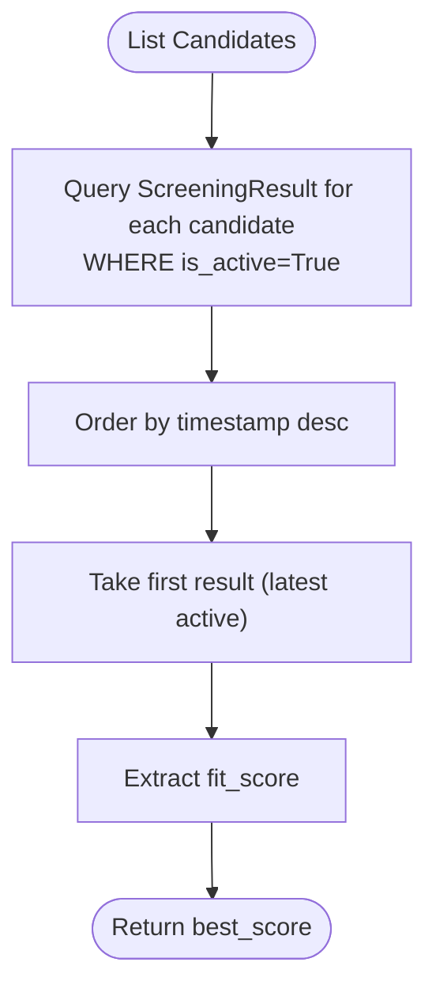
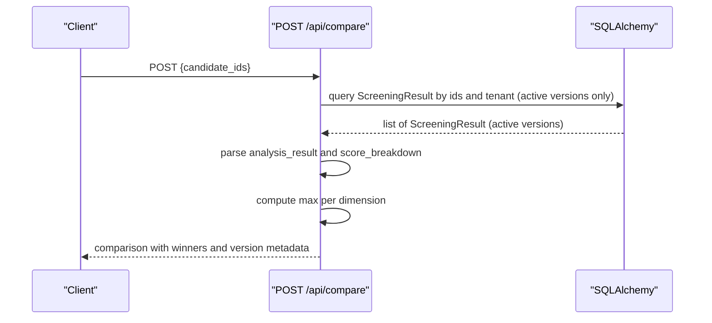
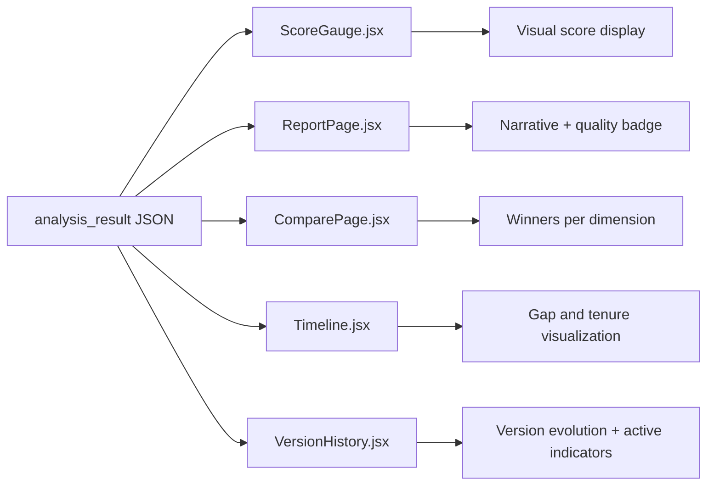
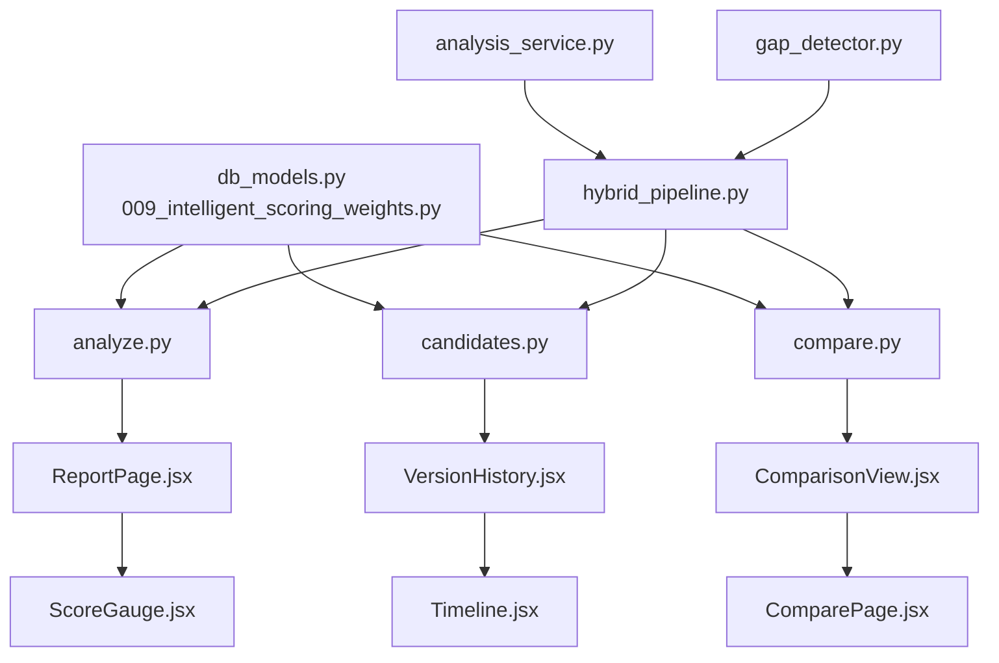

# Analysis History and Tracking

<cite>
**Referenced Files in This Document**
- [db_models.py](file://app/backend/models/db_models.py)
- [schemas.py](file://app/backend/models/schemas.py)
- [analyze.py](file://app/backend/routes/analyze.py)
- [candidates.py](file://app/backend/routes/candidates.py)
- [compare.py](file://app/backend/routes/compare.py)
- [analysis_service.py](file://app/backend/services/analysis_service.py)
- [hybrid_pipeline.py](file://app/backend/services/hybrid_pipeline.py)
- [gap_detector.py](file://app/backend/services/gap_detector.py)
- [009_intelligent_scoring_weights.py](file://alembic/versions/009_intelligent_scoring_weights.py)
- [VersionHistory.jsx](file://app/frontend/src/components/VersionHistory.jsx)
- [ComparisonView.jsx](file://app/frontend/src/components/ComparisonView.jsx)
- [ReportPage.jsx](file://app/frontend/src/pages/ReportPage.jsx)
- [ComparePage.jsx](file://app/frontend/src/pages/ComparePage.jsx)
- [ScoreGauge.jsx](file://app/frontend/src/components/ScoreGauge.jsx)
</cite>

## Update Summary
**Changes Made**
- Enhanced ScreeningResult model documentation to include version management capabilities (is_active, version_number columns)
- Added comprehensive coverage of version history tracking and management functionality
- Updated analysis history retrieval to reflect version-aware queries and filtering
- Expanded version comparison capabilities and visualization
- Added version management workflow documentation for re-analysis scenarios
- Updated data lifecycle management to include version retention policies

## Table of Contents
1. [Introduction](#introduction)
2. [Project Structure](#project-structure)
3. [Core Components](#core-components)
4. [Architecture Overview](#architecture-overview)
5. [Detailed Component Analysis](#detailed-component-analysis)
6. [Version Management System](#version-management-system)
7. [Dependency Analysis](#dependency-analysis)
8. [Performance Considerations](#performance-considerations)
9. [Troubleshooting Guide](#troubleshooting-guide)
10. [Conclusion](#conclusion)
11. [Appendices](#appendices)

## Introduction
This document explains the analysis history and tracking system for candidate screening results, with enhanced version management capabilities. It covers the ScreeningResult model with version control (is_active, version_number), how analysis history is retrieved and visualized across versions, how best results and comparisons are computed considering version states, and how analysis quality metrics and score breakdowns are represented. It also outlines practical examples for viewing candidate analysis timelines, comparing historical results across versions, managing version lifecycles, and understanding how analysis evolves over time with proper version control.

## Project Structure
The analysis history system spans backend models, routes, services, and frontend components with enhanced version management:
- Backend models define the ScreeningResult entity with version tracking capabilities and relationships to candidates and tenants.
- Routes expose endpoints to retrieve versioned history, manage version states, and compare results across versions.
- Services implement the hybrid pipeline that generates analysis results with version metadata and stores them in ScreeningResult.
- Frontend components visualize version history, reports, comparisons, and version management interfaces.

**Diagram sources**
- [db_models.py:129-152](file://app/backend/models/db_models.py#L129-L152)
- [009_intelligent_scoring_weights.py:27-73](file://alembic/versions/009_intelligent_scoring_weights.py#L27-L73)
- [analyze.py:530-666](file://app/backend/routes/analyze.py#L530-L666)
- [candidates.py:135-249](file://app/backend/routes/candidates.py#L135-L249)
- [compare.py:16-104](file://app/backend/routes/compare.py#L16-L104)
- [hybrid_pipeline.py:1-120](file://app/backend/services/hybrid_pipeline.py#L1-L120)
- [analysis_service.py:10-121](file://app/backend/services/analysis_service.py#L10-L121)
- [gap_detector.py:103-219](file://app/backend/services/gap_detector.py#L103-L219)
- [VersionHistory.jsx:1-260](file://app/frontend/src/components/VersionHistory.jsx#L1-L260)
- [ComparisonView.jsx:72-164](file://app/frontend/src/components/ComparisonView.jsx#L72-L164)
- [ReportPage.jsx:1-200](file://app/frontend/src/pages/ReportPage.jsx#L1-L200)
- [ComparePage.jsx:1-229](file://app/frontend/src/pages/ComparePage.jsx#L1-L229)
- [ScoreGauge.jsx:1-97](file://app/frontend/src/components/ScoreGauge.jsx#L1-L97)

**Section sources**
- [db_models.py:129-152](file://app/backend/models/db_models.py#L129-L152)
- [009_intelligent_scoring_weights.py:27-73](file://alembic/versions/009_intelligent_scoring_weights.py#L27-L73)
- [analyze.py:530-666](file://app/backend/routes/analyze.py#L530-L666)
- [candidates.py:135-249](file://app/backend/routes/candidates.py#L135-L249)
- [compare.py:16-104](file://app/backend/routes/compare.py#L16-L104)
- [hybrid_pipeline.py:1-120](file://app/backend/services/hybrid_pipeline.py#L1-L120)
- [analysis_service.py:10-121](file://app/backend/services/analysis_service.py#L10-L121)
- [gap_detector.py:103-219](file://app/backend/services/gap_detector.py#L103-L219)
- [VersionHistory.jsx:1-260](file://app/frontend/src/components/VersionHistory.jsx#L1-L260)
- [ComparisonView.jsx:72-164](file://app/frontend/src/components/ComparisonView.jsx#L72-L164)
- [ReportPage.jsx:1-200](file://app/frontend/src/pages/ReportPage.jsx#L1-L200)
- [ComparePage.jsx:1-229](file://app/frontend/src/pages/ComparePage.jsx#L1-L229)
- [ScoreGauge.jsx:1-97](file://app/frontend/src/components/ScoreGauge.jsx#L1-L97)

## Core Components
- ScreeningResult model with version management: Stores each analysis run with parsed data, analysis result, status, and timestamp, plus version control fields (is_active, version_number) for tracking analysis iterations.
- Analysis pipeline: Produces fit scores, recommendations, risk levels, and score breakdowns, persisting them into ScreeningResult with proper version numbering.
- Version-aware history retrieval: Endpoints return timestamped results with version information, fit scores, recommendations, risk levels, and score breakdowns for viewing and comparison across versions.
- Best result determination: Aggregates best fit scores per candidate across active versions for quick overview.
- Version comparison: Compares results across multiple versions, highlighting winners per dimension and showing version evolution.
- Version lifecycle management: Handles version activation, deactivation, restoration, and deletion with proper tenant scoping.

**Section sources**
- [db_models.py:129-152](file://app/backend/models/db_models.py#L129-L152)
- [009_intelligent_scoring_weights.py:27-73](file://alembic/versions/009_intelligent_scoring_weights.py#L27-L73)
- [analyze.py:530-666](file://app/backend/routes/analyze.py#L530-L666)
- [candidates.py:50-113](file://app/backend/routes/candidates.py#L50-L113)
- [compare.py:16-104](file://app/backend/routes/compare.py#L16-L104)

## Architecture Overview
The system follows a layered architecture with enhanced version management:
- Data layer: SQLAlchemy models define ScreeningResult with version control, Candidate, and related entities with proper indexing for version queries.
- Service layer: Hybrid pipeline computes Python scores and LLM narrative, producing structured results with version metadata.
- API layer: FastAPI routes expose endpoints for analysis, versioned history, candidate details, comparison across versions, and version management operations.
- Presentation layer: React components render reports, version histories, comparison matrices, and version management interfaces.

**Diagram sources**
- [analyze.py:614-666](file://app/backend/routes/analyze.py#L614-L666)
- [hybrid_pipeline.py:1-120](file://app/backend/services/hybrid_pipeline.py#L1-L120)
- [db_models.py:129-152](file://app/backend/models/db_models.py#L129-L152)

## Detailed Component Analysis

### ScreeningResult Model and Relationships
The ScreeningResult entity captures each analysis run with enhanced version management:
- Fields include tenant_id, candidate_id, role_template_id, resume_text, jd_text, parsed_data, analysis_result, status, is_active (version control), version_number (sequential numbering), and timestamp.
- Relationships: belongs to Tenant, Candidate, and RoleTemplate; supports Comments and TrainingExamples.
- Version management: is_active flag indicates current active version; version_number provides sequential ordering for version history.
- Indexes: optimized queries for version filtering and history retrieval.

**Diagram sources**
- [db_models.py:129-152](file://app/backend/models/db_models.py#L129-L152)
- [db_models.py:97-126](file://app/backend/models/db_models.py#L97-L126)
- [db_models.py:31-59](file://app/backend/models/db_models.py#L31-L59)
- [db_models.py:151-164](file://app/backend/models/db_models.py#L151-L164)
- [db_models.py:181-192](file://app/backend/models/db_models.py#L181-L192)
- [db_models.py:214-224](file://app/backend/models/db_models.py#L214-L224)

**Section sources**
- [db_models.py:129-152](file://app/backend/models/db_models.py#L129-L152)

### Analysis History Retrieval with Version Awareness
Endpoints provide access to analysis history with version management:
- Global history: GET /api/history returns recent ScreeningResult entries with id, timestamp, status, candidate_id, fit_score, final_recommendation, risk_level, and version information.
- Candidate history: GET /api/candidates/{id} returns the candidate's profile and a history array containing versioned results with fit_score, recommendation, risk_level, score_breakdown, matched_skills, missing_skills, job_role, analysis_quality, and version metadata.
- Best result per candidate: The candidates list endpoint computes best_score by fetching the latest active result and extracting fit_score.
- Version-aware queries: Filtering by is_active=True ensures only current versions are considered for best results.

**Diagram sources**
- [analyze.py:763-787](file://app/backend/routes/analyze.py#L763-L787)

**Section sources**
- [analyze.py:763-787](file://app/backend/routes/analyze.py#L763-L787)
- [candidates.py:135-249](file://app/backend/routes/candidates.py#L135-L249)
- [candidates.py:50-113](file://app/backend/routes/candidates.py#L50-L113)

### Best Result Determination and History Aggregation
- Best fit score per candidate: The candidates list endpoint orders results by timestamp descending and extracts fit_score from the latest active result (is_active=True).
- History aggregation: Candidate detail endpoint builds a version-aware history array by iterating results and parsing analysis_result JSON to extract timestamps, scores, recommendations, risk levels, and breakdowns.
- Version prioritization: Active versions take precedence in best result calculations, ensuring current evaluation takes priority.

**Diagram sources**
- [candidates.py:50-113](file://app/backend/routes/candidates.py#L50-L113)

**Section sources**
- [candidates.py:50-113](file://app/backend/routes/candidates.py#L50-L113)
- [candidates.py:135-249](file://app/backend/routes/candidates.py#L135-L249)

### Result Comparison Capabilities Across Versions
The compare endpoint enables side-by-side comparison of results across versions:
- Validates candidate_ids and tenant scoping.
- Loads results and parses analysis_result and parsed_data.
- Computes winners per category: overall fit_score and score breakdown dimensions (skill_match, experience_match, education, stability).
- Version-aware comparison: Results are filtered to include only active versions for fair comparison.

**Diagram sources**
- [compare.py:16-104](file://app/backend/routes/compare.py#L16-L104)

**Section sources**
- [compare.py:16-104](file://app/backend/routes/compare.py#L16-L104)

### Analysis Quality Metrics and Score Breakdown Visualization
- Analysis quality: Stored in analysis_result under analysis_quality (high | medium | low) and surfaced in UI badges.
- Score breakdown: Available in analysis_result.score_breakdown with fields such as skill_match, experience_match, stability, education, and newer dimensions like architecture, domain_fit, timeline, risk_penalty.
- Version-aware visualization: Frontend components display version information alongside quality metrics and score breakdowns.
- Frontend visualization:
  - ReportPage renders a ScoreGauge based on fit_score thresholds.
  - Timeline component visualizes employment timeline and gaps.
  - ComparePage displays side-by-side results with highlighted winners.
  - VersionHistory component shows version evolution with active version indicators.

**Diagram sources**
- [schemas.py:43-54](file://app/backend/models/schemas.py#L43-L54)
- [schemas.py:89-125](file://app/backend/models/schemas.py#L89-L125)
- [ReportPage.jsx:199-208](file://app/frontend/src/pages/ReportPage.jsx#L199-L208)
- [ComparePage.jsx:6-18](file://app/frontend/src/pages/ComparePage.jsx#L6-L18)
- [Timeline.jsx:1-115](file://app/frontend/src/components/Timeline.jsx#L1-L115)
- [ScoreGauge.jsx:1-97](file://app/frontend/src/components/ScoreGauge.jsx#L1-L97)
- [VersionHistory.jsx:1-260](file://app/frontend/src/components/VersionHistory.jsx#L1-L260)

**Section sources**
- [schemas.py:43-54](file://app/backend/models/schemas.py#L43-L54)
- [schemas.py:89-125](file://app/backend/models/schemas.py#L89-L125)
- [ReportPage.jsx:199-208](file://app/frontend/src/pages/ReportPage.jsx#L199-L208)
- [ComparePage.jsx:6-18](file://app/frontend/src/pages/ComparePage.jsx#L6-L18)
- [Timeline.jsx:1-115](file://app/frontend/src/components/Timeline.jsx#L1-L115)
- [ScoreGauge.jsx:1-97](file://app/frontend/src/components/ScoreGauge.jsx#L1-L97)
- [VersionHistory.jsx:1-260](file://app/frontend/src/components/VersionHistory.jsx#L1-L260)

### Examples and Usage Patterns
- Viewing candidate analysis timelines with version awareness:
  - Navigate to a candidate detail page to see versioned history with fit_score, recommendation, risk_level, score_breakdown, and version metadata.
  - Use the VersionHistory component to visualize version evolution, active version indicators, and version differences.
- Comparing historical results across versions:
  - Open the Compare page, select up to five result IDs from versioned history, and view a tabular comparison with winners highlighted.
  - Use the ComparisonView component to compare specific versions side-by-side with version labels and active status indicators.
- Managing version lifecycles:
  - Use version controls to activate/deactivate versions, restore previous versions, or delete unwanted versions.
  - Monitor version evolution through the VersionHistory interface to track changes in fit scores and recommendations over time.

**Section sources**
- [candidates.py:135-249](file://app/backend/routes/candidates.py#L135-L249)
- [analyze.py:763-787](file://app/backend/routes/analyze.py#L763-L787)
- [ComparePage.jsx:82-106](file://app/frontend/src/pages/ComparePage.jsx#L82-L106)
- [VersionHistory.jsx:1-260](file://app/frontend/src/components/VersionHistory.jsx#L1-L260)
- [ComparisonView.jsx:72-164](file://app/frontend/src/components/ComparisonView.jsx#L72-L164)

## Version Management System

### Version Control Implementation
The ScreeningResult model now includes comprehensive version management capabilities:

**Version Fields:**
- `is_active`: Boolean flag indicating whether this is the current active version (default: True)
- `version_number`: Integer representing sequential version numbering (default: 1)

**Version Indexes:**
- Composite index on `(is_active, candidate_id)` for efficient querying of current versions
- Composite index on `(candidate_id, version_number)` for version history queries

**Migration Support:**
- Alembic migration 009 adds version management fields with backward compatibility
- Automatic backfill sets existing records to `is_active=True, version_number=1`

### Version Lifecycle Operations
- **Version Creation**: New analysis results automatically create version 1 with `is_active=True`
- **Version Activation**: Only one active version per candidate; activating a new version deactivates previous active versions
- **Version Restoration**: Previous versions can be restored as active versions with incremented version numbers
- **Version Deletion**: Inactive versions can be permanently deleted while preserving active versions

### Version-Aware Queries
- Best result determination filters by `is_active=True` to ensure current evaluation takes priority
- History retrieval includes version metadata for comprehensive analysis tracking
- Comparison operations can be scoped to specific versions or across version evolution

**Section sources**
- [db_models.py:129-152](file://app/backend/models/db_models.py#L129-L152)
- [009_intelligent_scoring_weights.py:27-73](file://alembic/versions/009_intelligent_scoring_weights.py#L27-L73)
- [candidates.py:50-113](file://app/backend/routes/candidates.py#L50-L113)
- [VersionHistory.jsx:87-88](file://app/frontend/src/components/VersionHistory.jsx#L87-L88)

## Dependency Analysis
The system exhibits clear separation of concerns with enhanced version management:
- Models define entities and relationships with version control fields.
- Routes depend on models and services to orchestrate analysis, version management, and history retrieval.
- Services encapsulate the hybrid pipeline logic, gap detection, and version-aware processing.
- Frontend components consume API responses to render visualizations with version awareness.

**Diagram sources**
- [db_models.py:129-152](file://app/backend/models/db_models.py#L129-L152)
- [009_intelligent_scoring_weights.py:27-73](file://alembic/versions/009_intelligent_scoring_weights.py#L27-L73)
- [analyze.py:530-666](file://app/backend/routes/analyze.py#L530-L666)
- [candidates.py:135-249](file://app/backend/routes/candidates.py#L135-L249)
- [compare.py:16-104](file://app/backend/routes/compare.py#L16-L104)
- [hybrid_pipeline.py:1-120](file://app/backend/services/hybrid_pipeline.py#L1-L120)
- [analysis_service.py:10-121](file://app/backend/services/analysis_service.py#L10-L121)
- [gap_detector.py:103-219](file://app/backend/services/gap_detector.py#L103-L219)
- [ReportPage.jsx:1-200](file://app/frontend/src/pages/ReportPage.jsx#L1-L200)
- [VersionHistory.jsx:1-260](file://app/frontend/src/components/VersionHistory.jsx#L1-L260)
- [ComparisonView.jsx:72-164](file://app/frontend/src/components/ComparisonView.jsx#L72-L164)
- [ScoreGauge.jsx:1-97](file://app/frontend/src/components/ScoreGauge.jsx#L1-L97)
- [Timeline.jsx:1-115](file://app/frontend/src/components/Timeline.jsx#L1-L115)
- [ComparePage.jsx:1-229](file://app/frontend/src/pages/ComparePage.jsx#L1-L229)

**Section sources**
- [db_models.py:129-152](file://app/backend/models/db_models.py#L129-L152)
- [009_intelligent_scoring_weights.py:27-73](file://alembic/versions/009_intelligent_scoring_weights.py#L27-L73)
- [analyze.py:530-666](file://app/backend/routes/analyze.py#L530-L666)
- [candidates.py:135-249](file://app/backend/routes/candidates.py#L135-L249)
- [compare.py:16-104](file://app/backend/routes/compare.py#L16-L104)
- [hybrid_pipeline.py:1-120](file://app/backend/services/hybrid_pipeline.py#L1-L120)
- [analysis_service.py:10-121](file://app/backend/services/analysis_service.py#L10-L121)
- [gap_detector.py:103-219](file://app/backend/services/gap_detector.py#L103-L219)
- [ReportPage.jsx:1-200](file://app/frontend/src/pages/ReportPage.jsx#L1-L200)
- [VersionHistory.jsx:1-260](file://app/frontend/src/components/VersionHistory.jsx#L1-L260)
- [ComparisonView.jsx:72-164](file://app/frontend/src/components/ComparisonView.jsx#L72-L164)
- [ScoreGauge.jsx:1-97](file://app/frontend/src/components/ScoreGauge.jsx#L1-L97)
- [Timeline.jsx:1-115](file://app/frontend/src/components/Timeline.jsx#L1-L115)
- [ComparePage.jsx:1-229](file://app/frontend/src/pages/ComparePage.jsx#L1-L229)

## Performance Considerations
- History pagination: The history endpoint limits results to 100 entries to keep queries efficient.
- Version indexing: Database indexes on `(is_active, candidate_id)` and `(candidate_id, version_number)` optimize version queries and history retrieval.
- JSON parsing: History endpoints parse analysis_result JSON to extract fit_score, recommendation, and risk_level; ensure JSON is compact and validated.
- Candidate history: Candidate detail endpoint iterates results and parses JSON; consider caching or limiting history depth for very active candidates.
- Comparison: Winner computation scans up to five results; keep candidate selection constrained to improve responsiveness.
- Version filtering: Queries automatically filter by `is_active=True` for best performance in active version operations.

## Troubleshooting Guide
- Missing fit_score or risk_level: Verify that analysis_result contains these fields; if null, the pipeline may be pending or encountering errors.
- Empty or partial history: Confirm tenant scoping and that ScreeningResult entries exist for the requested period.
- Comparison failures: Ensure candidate_ids are valid and belong to the current tenant; the endpoint requires at least two IDs.
- Quality indicators: If analysis_quality is low, check LLM availability and re-run analysis to obtain a narrative.
- Version issues: Verify that `is_active` flag is properly managed and that version numbers are sequential; check database constraints for version integrity.
- Version comparison problems: Ensure versions being compared belong to the same candidate and tenant; inactive versions may not appear in comparison results.

**Section sources**
- [analyze.py:763-787](file://app/backend/routes/analyze.py#L763-L787)
- [compare.py:16-104](file://app/backend/routes/compare.py#L16-L104)
- [db_models.py:129-152](file://app/backend/models/db_models.py#L129-L152)

## Conclusion
The analysis history and tracking system provides robust mechanisms to capture, retrieve, visualize, and compare screening results with comprehensive version management capabilities. ScreeningResult serves as the central record of each analysis iteration, enabling tenants to monitor how candidate evaluations evolve over time with proper version control. The enhanced version management system ensures that only active versions are considered for current decision-making while maintaining complete history for audit and analysis purposes. The hybrid pipeline ensures consistent score breakdowns and quality metrics across versions, while the frontend components deliver intuitive visualizations for timelines, reports, comparisons, and version management interfaces.

## Appendices

### Data Lifecycle and Retention Notes
- Storage: ScreeningResult persists each analysis with parsed_data and analysis_result JSON, enabling full reconstruction of historical results and version tracking.
- Tenant isolation: Queries filter by tenant_id to ensure data privacy and segregation.
- Version lifecycle: Active versions (`is_active=True`) represent current evaluations; inactive versions maintain historical context for comparison and auditing.
- Version indexing: Database indexes optimize version queries and history retrieval performance.
- Limits: History retrieval is capped at 100 results; consider implementing tenant-level retention policies for version history beyond policy-defined windows.
- Version management: Implement periodic cleanup jobs to remove outdated inactive versions beyond policy-defined retention windows, ensuring optimal query performance and storage efficiency while preserving active versions for current use.

**Section sources**
- [db_models.py:129-152](file://app/backend/models/db_models.py#L129-L152)
- [009_intelligent_scoring_weights.py:27-73](file://alembic/versions/009_intelligent_scoring_weights.py#L27-L73)
- [VersionHistory.jsx:87-88](file://app/frontend/src/components/VersionHistory.jsx#L87-L88)