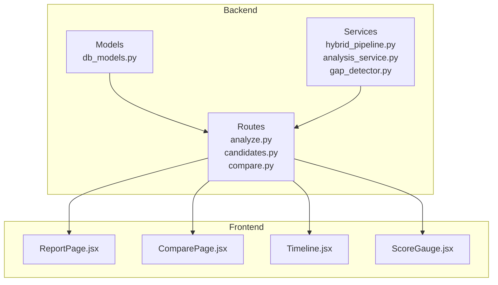
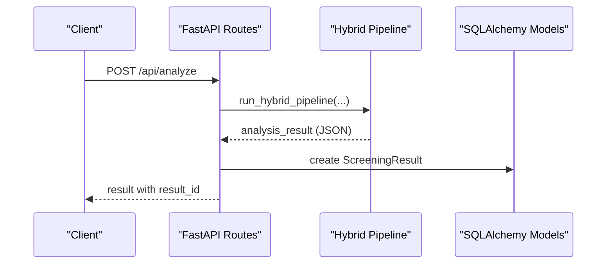
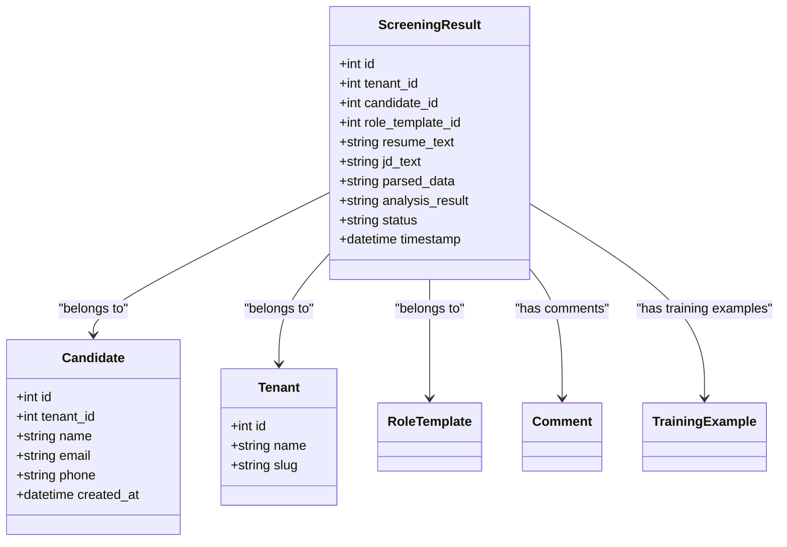
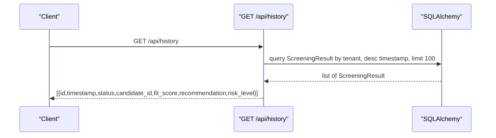
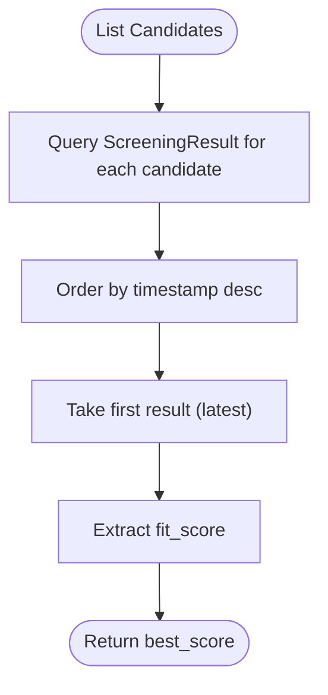
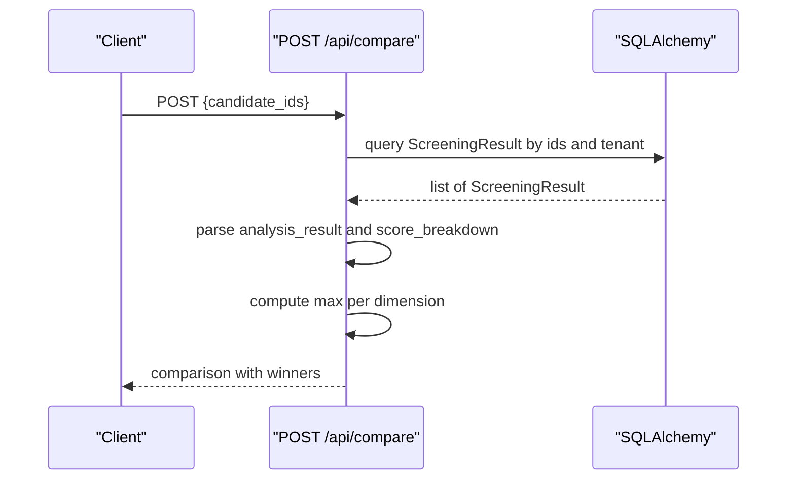
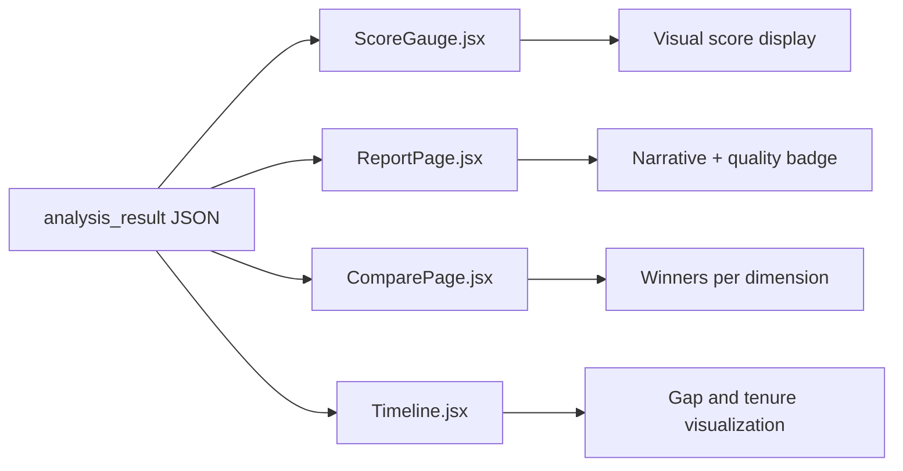
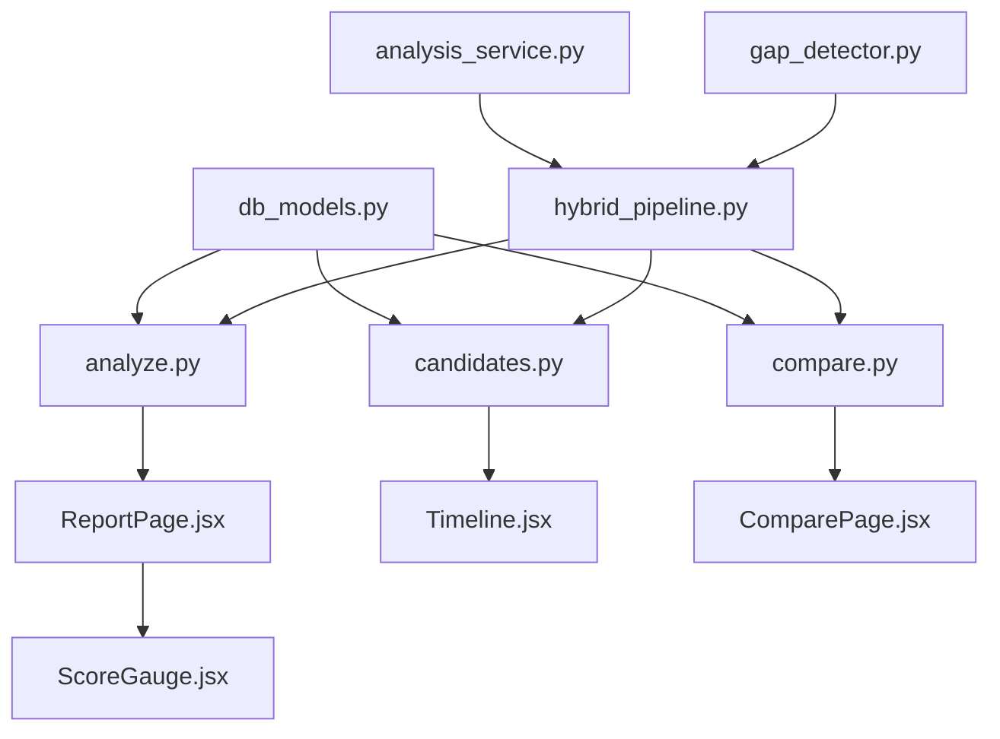

# Analysis History and Tracking

<cite>
**Referenced Files in This Document**
- [db_models.py](file://app/backend/models/db_models.py)
- [schemas.py](file://app/backend/models/schemas.py)
- [analyze.py](file://app/backend/routes/analyze.py)
- [candidates.py](file://app/backend/routes/candidates.py)
- [compare.py](file://app/backend/routes/compare.py)
- [analysis_service.py](file://app/backend/services/analysis_service.py)
- [hybrid_pipeline.py](file://app/backend/services/hybrid_pipeline.py)
- [gap_detector.py](file://app/backend/services/gap_detector.py)
- [Timeline.jsx](file://app/frontend/src/components/Timeline.jsx)
- [ReportPage.jsx](file://app/frontend/src/pages/ReportPage.jsx)
- [ComparePage.jsx](file://app/frontend/src/pages/ComparePage.jsx)
- [ScoreGauge.jsx](file://app/frontend/src/components/ScoreGauge.jsx)
</cite>

## Table of Contents
1. [Introduction](#introduction)
2. [Project Structure](#project-structure)
3. [Core Components](#core-components)
4. [Architecture Overview](#architecture-overview)
5. [Detailed Component Analysis](#detailed-component-analysis)
6. [Dependency Analysis](#dependency-analysis)
7. [Performance Considerations](#performance-considerations)
8. [Troubleshooting Guide](#troubleshooting-guide)
9. [Conclusion](#conclusion)
10. [Appendices](#appendices)

## Introduction
This document explains the analysis history and tracking system for candidate screening results. It covers the ScreeningResult model, how analysis history is retrieved and visualized, how best results and comparisons are computed, and how analysis quality metrics and score breakdowns are represented. It also outlines practical examples for viewing candidate analysis timelines, comparing historical results, and understanding how analysis evolves over time. Finally, it addresses history retention and lifecycle considerations for analysis records.

## Project Structure
The analysis history system spans backend models, routes, services, and frontend components:
- Backend models define the ScreeningResult entity and relationships to candidates and tenants.
- Routes expose endpoints to retrieve history, view candidate-specific histories, and compare results.
- Services implement the hybrid pipeline that generates analysis results and stores them in ScreeningResult.
- Frontend pages and components visualize timelines, reports, and comparisons.

**Diagram sources**
- [db_models.py:128-147](file://app/backend/models/db_models.py#L128-L147)
- [analyze.py:763-787](file://app/backend/routes/analyze.py#L763-L787)
- [candidates.py:102-189](file://app/backend/routes/candidates.py#L102-L189)
- [compare.py:16-77](file://app/backend/routes/compare.py#L16-L77)
- [hybrid_pipeline.py:1-120](file://app/backend/services/hybrid_pipeline.py#L1-L120)
- [analysis_service.py:10-53](file://app/backend/services/analysis_service.py#L10-L53)
- [gap_detector.py:103-219](file://app/backend/services/gap_detector.py#L103-L219)
- [ReportPage.jsx:1-297](file://app/frontend/src/pages/ReportPage.jsx#L1-L297)
- [ComparePage.jsx:1-229](file://app/frontend/src/pages/ComparePage.jsx#L1-L229)
- [Timeline.jsx:1-115](file://app/frontend/src/components/Timeline.jsx#L1-L115)
- [ScoreGauge.jsx:1-97](file://app/frontend/src/components/ScoreGauge.jsx#L1-L97)

**Section sources**
- [db_models.py:128-147](file://app/backend/models/db_models.py#L128-L147)
- [analyze.py:763-787](file://app/backend/routes/analyze.py#L763-L787)
- [candidates.py:102-189](file://app/backend/routes/candidates.py#L102-L189)
- [compare.py:16-77](file://app/backend/routes/compare.py#L16-L77)
- [hybrid_pipeline.py:1-120](file://app/backend/services/hybrid_pipeline.py#L1-L120)
- [analysis_service.py:10-53](file://app/backend/services/analysis_service.py#L10-L53)
- [gap_detector.py:103-219](file://app/backend/services/gap_detector.py#L103-L219)
- [ReportPage.jsx:1-297](file://app/frontend/src/pages/ReportPage.jsx#L1-L297)
- [ComparePage.jsx:1-229](file://app/frontend/src/pages/ComparePage.jsx#L1-L229)
- [Timeline.jsx:1-115](file://app/frontend/src/components/Timeline.jsx#L1-L115)
- [ScoreGauge.jsx:1-97](file://app/frontend/src/components/ScoreGauge.jsx#L1-L97)

## Core Components
- ScreeningResult model: Stores each analysis run with parsed data, analysis result, status, and timestamp. It links to Candidate and Tenant and supports comments and training examples.
- Analysis pipeline: Produces fit scores, recommendations, risk levels, and score breakdowns, persisting them into ScreeningResult.
- History retrieval: Endpoints return timestamped results, fit scores, recommendations, risk levels, and score breakdowns for viewing and comparison.
- Best result determination: Aggregates best fit scores per candidate for quick overview.
- Comparison: Compares up to five results side-by-side, highlighting winners per dimension.

**Section sources**
- [db_models.py:128-147](file://app/backend/models/db_models.py#L128-L147)
- [analyze.py:763-787](file://app/backend/routes/analyze.py#L763-L787)
- [candidates.py:50-80](file://app/backend/routes/candidates.py#L50-L80)
- [compare.py:16-77](file://app/backend/routes/compare.py#L16-L77)

## Architecture Overview
The system follows a layered architecture:
- Data layer: SQLAlchemy models define ScreeningResult, Candidate, and related entities.
- Service layer: Hybrid pipeline computes Python scores and LLM narrative, producing structured results.
- API layer: FastAPI routes expose endpoints for analysis, history, candidate details, and comparison.
- Presentation layer: React components render reports, timelines, and comparison matrices.

**Diagram sources**
- [analyze.py:354-501](file://app/backend/routes/analyze.py#L354-L501)
- [hybrid_pipeline.py:1-120](file://app/backend/services/hybrid_pipeline.py#L1-L120)
- [db_models.py:128-147](file://app/backend/models/db_models.py#L128-L147)

## Detailed Component Analysis

### ScreeningResult Model and Relationships
The ScreeningResult entity captures each analysis run:
- Fields include tenant_id, candidate_id, role_template_id, resume_text, jd_text, parsed_data, analysis_result, status, and timestamp.
- Relationships: belongs to Tenant, Candidate, and RoleTemplate; supports Comments and TrainingExamples.
- Used by history retrieval and candidate detail views.

**Diagram sources**
- [db_models.py:128-147](file://app/backend/models/db_models.py#L128-L147)
- [db_models.py:97-126](file://app/backend/models/db_models.py#L97-L126)
- [db_models.py:31-59](file://app/backend/models/db_models.py#L31-L59)
- [db_models.py:151-164](file://app/backend/models/db_models.py#L151-L164)
- [db_models.py:181-192](file://app/backend/models/db_models.py#L181-L192)
- [db_models.py:214-224](file://app/backend/models/db_models.py#L214-L224)

**Section sources**
- [db_models.py:128-147](file://app/backend/models/db_models.py#L128-L147)

### Analysis History Retrieval
Endpoints provide access to analysis history:
- Global history: GET /api/history returns recent ScreeningResult entries with id, timestamp, status, candidate_id, fit_score, final_recommendation, and risk_level.
- Candidate history: GET /api/candidates/{id} returns the candidate’s profile and a history array containing timestamped results with fit_score, recommendation, risk_level, score_breakdown, matched_skills, missing_skills, job_role, and analysis_quality.
- Best result per candidate: The candidates list endpoint computes best_score by fetching the latest result and extracting fit_score.

**Diagram sources**
- [analyze.py:763-787](file://app/backend/routes/analyze.py#L763-L787)

**Section sources**
- [analyze.py:763-787](file://app/backend/routes/analyze.py#L763-L787)
- [candidates.py:102-189](file://app/backend/routes/candidates.py#L102-L189)
- [candidates.py:50-80](file://app/backend/routes/candidates.py#L50-L80)

### Best Result Determination and History Aggregation
- Best fit score per candidate: The candidates list endpoint orders results by timestamp descending and extracts fit_score from the latest result.
- History aggregation: Candidate detail endpoint builds a history array by iterating results and parsing analysis_result JSON to extract timestamps, scores, recommendations, risk levels, and breakdowns.

**Diagram sources**
- [candidates.py:50-80](file://app/backend/routes/candidates.py#L50-L80)

**Section sources**
- [candidates.py:50-80](file://app/backend/routes/candidates.py#L50-L80)
- [candidates.py:102-189](file://app/backend/routes/candidates.py#L102-L189)

### Result Comparison Capabilities
The compare endpoint enables side-by-side comparison of up to five results:
- Validates candidate_ids and tenant scoping.
- Loads results and parses analysis_result and parsed_data.
- Computes winners per category: overall fit_score and score breakdown dimensions (skill_match, experience_match, education, stability).

**Diagram sources**
- [compare.py:16-77](file://app/backend/routes/compare.py#L16-L77)

**Section sources**
- [compare.py:16-77](file://app/backend/routes/compare.py#L16-L77)

### Analysis Quality Metrics and Score Breakdown Visualization
- Analysis quality: Stored in analysis_result under analysis_quality (high | medium | low) and surfaced in UI badges.
- Score breakdown: Available in analysis_result.score_breakdown with fields such as skill_match, experience_match, stability, education, and newer dimensions like architecture, domain_fit, timeline, risk_penalty.
- Frontend visualization:
  - ReportPage renders a ScoreGauge based on fit_score thresholds.
  - Timeline component visualizes employment timeline and gaps.
  - ComparePage displays side-by-side results with highlighted winners.

**Diagram sources**
- [schemas.py:43-54](file://app/backend/models/schemas.py#L43-L54)
- [schemas.py:89-125](file://app/backend/models/schemas.py#L89-L125)
- [ReportPage.jsx:199-208](file://app/frontend/src/pages/ReportPage.jsx#L199-L208)
- [ComparePage.jsx:6-18](file://app/frontend/src/pages/ComparePage.jsx#L6-L18)
- [Timeline.jsx:1-115](file://app/frontend/src/components/Timeline.jsx#L1-L115)
- [ScoreGauge.jsx:1-97](file://app/frontend/src/components/ScoreGauge.jsx#L1-L97)

**Section sources**
- [schemas.py:43-54](file://app/backend/models/schemas.py#L43-L54)
- [schemas.py:89-125](file://app/backend/models/schemas.py#L89-L125)
- [ReportPage.jsx:199-208](file://app/frontend/src/pages/ReportPage.jsx#L199-L208)
- [ComparePage.jsx:6-18](file://app/frontend/src/pages/ComparePage.jsx#L6-L18)
- [Timeline.jsx:1-115](file://app/frontend/src/components/Timeline.jsx#L1-L115)
- [ScoreGauge.jsx:1-97](file://app/frontend/src/components/ScoreGauge.jsx#L1-L97)

### Examples and Usage Patterns
- Viewing candidate analysis timelines:
  - Navigate to a candidate detail page to see history with fit_score, recommendation, risk_level, and score_breakdown.
  - Use the Timeline component to visualize employment gaps and tenures.
- Comparing historical results:
  - Open the Compare page, select up to five result IDs from history, and view a tabular comparison with winners highlighted.
- Understanding analysis evolution:
  - Use the history endpoint to retrieve all results for a tenant and inspect changes in fit_score, recommendation, and risk_level over time.

**Section sources**
- [candidates.py:102-189](file://app/backend/routes/candidates.py#L102-L189)
- [analyze.py:763-787](file://app/backend/routes/analyze.py#L763-L787)
- [ComparePage.jsx:82-106](file://app/frontend/src/pages/ComparePage.jsx#L82-L106)

## Dependency Analysis
The system exhibits clear separation of concerns:
- Models define entities and relationships.
- Routes depend on models and services to orchestrate analysis and history retrieval.
- Services encapsulate the hybrid pipeline logic and gap detection.
- Frontend components consume API responses to render visualizations.

**Diagram sources**
- [db_models.py:128-147](file://app/backend/models/db_models.py#L128-L147)
- [analyze.py:354-501](file://app/backend/routes/analyze.py#L354-L501)
- [candidates.py:102-189](file://app/backend/routes/candidates.py#L102-L189)
- [compare.py:16-77](file://app/backend/routes/compare.py#L16-L77)
- [hybrid_pipeline.py:1-120](file://app/backend/services/hybrid_pipeline.py#L1-L120)
- [analysis_service.py:10-53](file://app/backend/services/analysis_service.py#L10-L53)
- [gap_detector.py:103-219](file://app/backend/services/gap_detector.py#L103-L219)
- [ReportPage.jsx:286-291](file://app/frontend/src/pages/ReportPage.jsx#L286-L291)
- [Timeline.jsx:1-115](file://app/frontend/src/components/Timeline.jsx#L1-L115)
- [ComparePage.jsx:205-222](file://app/frontend/src/pages/ComparePage.jsx#L205-L222)
- [ScoreGauge.jsx:1-97](file://app/frontend/src/components/ScoreGauge.jsx#L1-L97)

**Section sources**
- [db_models.py:128-147](file://app/backend/models/db_models.py#L128-L147)
- [analyze.py:354-501](file://app/backend/routes/analyze.py#L354-L501)
- [candidates.py:102-189](file://app/backend/routes/candidates.py#L102-L189)
- [compare.py:16-77](file://app/backend/routes/compare.py#L16-L77)
- [hybrid_pipeline.py:1-120](file://app/backend/services/hybrid_pipeline.py#L1-L120)
- [analysis_service.py:10-53](file://app/backend/services/analysis_service.py#L10-L53)
- [gap_detector.py:103-219](file://app/backend/services/gap_detector.py#L103-L219)
- [ReportPage.jsx:286-291](file://app/frontend/src/pages/ReportPage.jsx#L286-L291)
- [Timeline.jsx:1-115](file://app/frontend/src/components/Timeline.jsx#L1-L115)
- [ComparePage.jsx:205-222](file://app/frontend/src/pages/ComparePage.jsx#L205-L222)
- [ScoreGauge.jsx:1-97](file://app/frontend/src/components/ScoreGauge.jsx#L1-L97)

## Performance Considerations
- History pagination: The history endpoint limits results to 100 entries to keep queries efficient.
- JSON parsing: History endpoints parse analysis_result JSON to extract fit_score, recommendation, and risk_level; ensure JSON is compact and validated.
- Candidate history: Candidate detail endpoint iterates results and parses JSON; consider caching or limiting history depth for very active candidates.
- Comparison: Winner computation scans up to five results; keep candidate selection constrained to improve responsiveness.

[No sources needed since this section provides general guidance]

## Troubleshooting Guide
- Missing fit_score or risk_level: Verify that analysis_result contains these fields; if null, the pipeline may be pending or encountering errors.
- Empty or partial history: Confirm tenant scoping and that ScreeningResult entries exist for the requested period.
- Comparison failures: Ensure candidate_ids are valid and belong to the current tenant; the endpoint requires at least two IDs.
- Quality indicators: If analysis_quality is low, check LLM availability and re-run analysis to obtain a narrative.

**Section sources**
- [analyze.py:763-787](file://app/backend/routes/analyze.py#L763-L787)
- [compare.py:16-77](file://app/backend/routes/compare.py#L16-L77)

## Conclusion
The analysis history and tracking system provides robust mechanisms to capture, retrieve, visualize, and compare screening results. ScreeningResult serves as the central record of each analysis, enabling tenants to monitor how candidate evaluations evolve over time. The hybrid pipeline ensures consistent score breakdowns and quality metrics, while the frontend components deliver intuitive visualizations for timelines, reports, and comparisons.

[No sources needed since this section summarizes without analyzing specific files]

## Appendices

### Data Lifecycle and Retention Notes
- Storage: ScreeningResult persists each analysis with parsed_data and analysis_result JSON, enabling full reconstruction of historical results.
- Tenant isolation: Queries filter by tenant_id to ensure data privacy and segregation.
- Limits: History retrieval is capped at 100 results; consider implementing tenant-level retention policies if long-term archival is required.
- Recommendations: Implement periodic cleanup jobs to remove outdated results beyond policy-defined retention windows, ensuring optimal query performance and storage efficiency.

[No sources needed since this section provides general guidance]