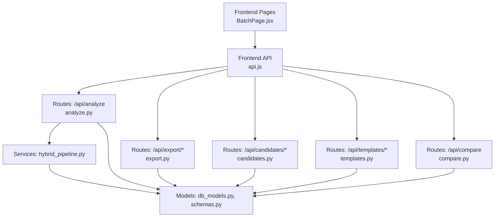
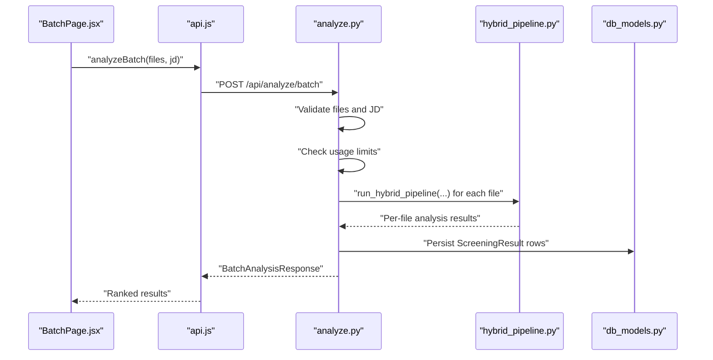
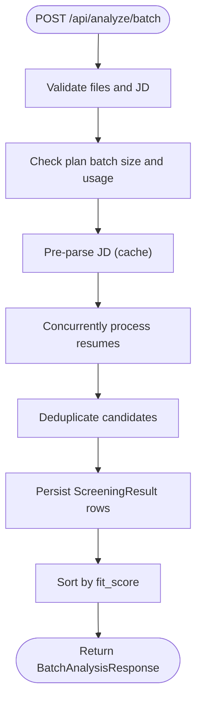
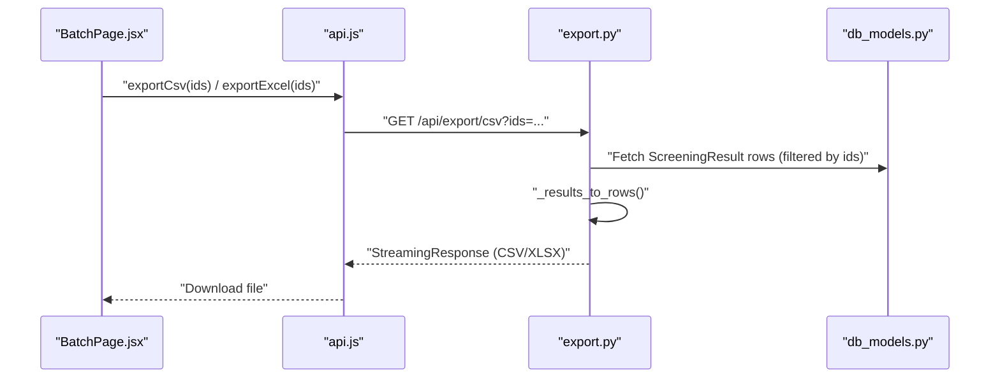
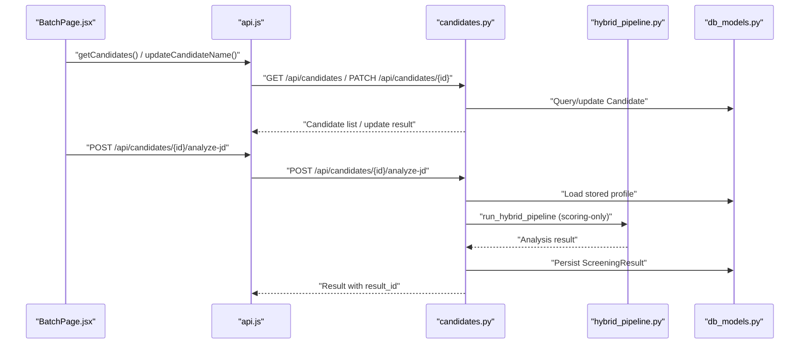
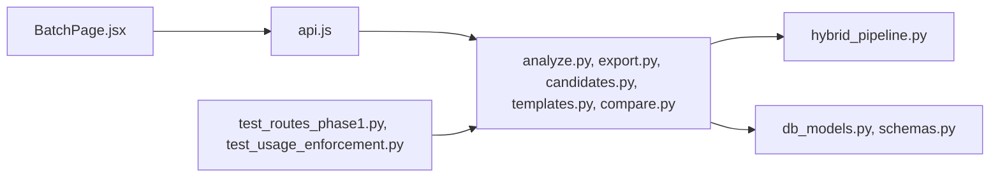

# Bulk Operations and Export

<cite>
**Referenced Files in This Document**
- [analyze.py](file://app/backend/routes/analyze.py)
- [export.py](file://app/backend/routes/export.py)
- [candidates.py](file://app/backend/routes/candidates.py)
- [templates.py](file://app/backend/routes/templates.py)
- [compare.py](file://app/backend/routes/compare.py)
- [BatchPage.jsx](file://app/frontend/src/pages/BatchPage.jsx)
- [api.js](file://app/frontend/src/lib/api.js)
- [schemas.py](file://app/backend/models/schemas.py)
- [db_models.py](file://app/backend/models/db_models.py)
- [subscription.py](file://app/backend/routes/subscription.py)
- [hybrid_pipeline.py](file://app/backend/services/hybrid_pipeline.py)
- [test_routes_phase1.py](file://app/backend/tests/test_routes_phase1.py)
- [test_usage_enforcement.py](file://app/backend/tests/test_usage_enforcement.py)
</cite>

## Table of Contents
1. [Introduction](#introduction)
2. [Project Structure](#project-structure)
3. [Core Components](#core-components)
4. [Architecture Overview](#architecture-overview)
5. [Detailed Component Analysis](#detailed-component-analysis)
6. [Dependency Analysis](#dependency-analysis)
7. [Performance Considerations](#performance-considerations)
8. [Troubleshooting Guide](#troubleshooting-guide)
9. [Conclusion](#conclusion)
10. [Appendices](#appendices)

## Introduction
This document explains bulk candidate operations and export capabilities in Resume AI. It covers:
- Batch processing workflows for analyzing multiple candidates against a single job description
- Export functionality for screening results in CSV, Excel, and JSON formats
- Bulk update operations and mass candidate management
- Administrative workflows and usage enforcement
- Examples of bulk analysis execution, export data formatting, and integration with external systems
- Performance considerations for large-scale operations, error handling, and progress tracking
- Data portability and migration capabilities for candidate information

## Project Structure
Resume AI separates concerns across backend FastAPI routes, SQLAlchemy models, frontend React pages, and services:
- Backend routes implement analysis, export, candidate management, templates, and comparison
- Frontend pages orchestrate user interactions and integrate with backend APIs
- Services encapsulate the hybrid pipeline and analysis logic
- Models define the database schema and relationships

**Diagram sources**
- [BatchPage.jsx:1-431](file://app/frontend/src/pages/BatchPage.jsx#L1-L431)
- [api.js:1-395](file://app/frontend/src/lib/api.js#L1-L395)
- [analyze.py:1-813](file://app/backend/routes/analyze.py#L1-L813)
- [export.py:1-105](file://app/backend/routes/export.py#L1-L105)
- [candidates.py:1-303](file://app/backend/routes/candidates.py#L1-L303)
- [templates.py:1-86](file://app/backend/routes/templates.py#L1-L86)
- [compare.py:1-78](file://app/backend/routes/compare.py#L1-L78)
- [hybrid_pipeline.py:1-800](file://app/backend/services/hybrid_pipeline.py#L1-L800)
- [db_models.py:1-250](file://app/backend/models/db_models.py#L1-L250)
- [schemas.py:1-379](file://app/backend/models/schemas.py#L1-L379)

**Section sources**
- [BatchPage.jsx:1-431](file://app/frontend/src/pages/BatchPage.jsx#L1-L431)
- [api.js:1-395](file://app/frontend/src/lib/api.js#L1-L395)
- [analyze.py:1-813](file://app/backend/routes/analyze.py#L1-L813)
- [export.py:1-105](file://app/backend/routes/export.py#L1-L105)
- [candidates.py:1-303](file://app/backend/routes/candidates.py#L1-L303)
- [templates.py:1-86](file://app/backend/routes/templates.py#L1-L86)
- [compare.py:1-78](file://app/backend/routes/compare.py#L1-L78)
- [hybrid_pipeline.py:1-800](file://app/backend/services/hybrid_pipeline.py#L1-L800)
- [db_models.py:1-250](file://app/backend/models/db_models.py#L1-L250)
- [schemas.py:1-379](file://app/backend/models/schemas.py#L1-L379)

## Core Components
- Batch analysis endpoint: processes multiple resumes against a single job description, enforces plan limits, and persists results
- Export endpoints: CSV and Excel export of screening results; supports filtering by result IDs
- Candidate management: list, update, and re-analyze existing candidates against new job descriptions
- Templates: manage reusable job descriptions per tenant
- Comparison: compare up to five screening results side-by-side
- Usage enforcement: checks and records analysis usage per tenant with monthly resets

**Section sources**
- [analyze.py:649-758](file://app/backend/routes/analyze.py#L649-L758)
- [export.py:55-104](file://app/backend/routes/export.py#L55-L104)
- [candidates.py:26-80](file://app/backend/routes/candidates.py#L26-L80)
- [templates.py:16-86](file://app/backend/routes/templates.py#L16-L86)
- [compare.py:16-77](file://app/backend/routes/compare.py#L16-L77)
- [subscription.py:256-343](file://app/backend/routes/subscription.py#L256-L343)

## Architecture Overview
The bulk analysis and export architecture integrates frontend UI, backend routes, services, and persistence:

**Diagram sources**
- [BatchPage.jsx:89-121](file://app/frontend/src/pages/BatchPage.jsx#L89-L121)
- [api.js:149-165](file://app/frontend/src/lib/api.js#L149-L165)
- [analyze.py:651-758](file://app/backend/routes/analyze.py#L651-L758)
- [hybrid_pipeline.py:1-800](file://app/backend/services/hybrid_pipeline.py#L1-L800)
- [db_models.py:128-147](file://app/backend/models/db_models.py#L128-L147)

## Detailed Component Analysis

### Batch Analysis Workflow
- Endpoint: POST /api/analyze/batch
- Behavior:
  - Validates file types and sizes
  - Enforces plan batch size limits and monthly usage
  - Parses and validates the job description (text or file)
  - Pre-parses the job description once for shared caching
  - Processes resumes concurrently using asyncio.gather
  - Deduplicates candidates and stores enriched profiles
  - Persists results and returns a ranked list

**Diagram sources**
- [analyze.py:651-758](file://app/backend/routes/analyze.py#L651-L758)
- [subscription.py:293-318](file://app/backend/routes/subscription.py#L293-L318)

**Section sources**
- [analyze.py:651-758](file://app/backend/routes/analyze.py#L651-L758)
- [subscription.py:256-343](file://app/backend/routes/subscription.py#L256-L343)

### Export Capabilities
- CSV export: GET /api/export/csv with optional ids query param
- Excel export: GET /api/export/excel with optional ids query param
- Data mapping: extracts fit_score, recommendation, risk_level, skill breakdowns, matched/missing skills, strengths/weaknesses
- Streaming responses: efficient handling of large exports

**Diagram sources**
- [BatchPage.jsx:346-358](file://app/frontend/src/pages/BatchPage.jsx#L346-L358)
- [api.js:183-193](file://app/frontend/src/lib/api.js#L183-L193)
- [export.py:55-104](file://app/backend/routes/export.py#L55-L104)
- [db_models.py:128-147](file://app/backend/models/db_models.py#L128-L147)

**Section sources**
- [export.py:55-104](file://app/backend/routes/export.py#L55-L104)
- [api.js:183-193](file://app/frontend/src/lib/api.js#L183-L193)

### Candidate Management and Bulk Updates
- List candidates with pagination and search
- Update candidate name
- Re-analyze existing candidate against a new job description using stored profile (faster than full re-upload)

**Diagram sources**
- [candidates.py:26-80](file://app/backend/routes/candidates.py#L26-L80)
- [candidates.py:83-99](file://app/backend/routes/candidates.py#L83-L99)
- [candidates.py:192-302](file://app/backend/routes/candidates.py#L192-L302)
- [hybrid_pipeline.py:1-800](file://app/backend/services/hybrid_pipeline.py#L1-L800)
- [db_models.py:97-126](file://app/backend/models/db_models.py#L97-L126)
- [db_models.py:128-147](file://app/backend/models/db_models.py#L128-L147)

**Section sources**
- [candidates.py:26-80](file://app/backend/routes/candidates.py#L26-L80)
- [candidates.py:83-99](file://app/backend/routes/candidates.py#L83-L99)
- [candidates.py:192-302](file://app/backend/routes/candidates.py#L192-L302)

### Templates and Comparison
- Templates: store and reuse job descriptions per tenant
- Comparison: compare up to five screening results side-by-side with category winners

**Section sources**
- [templates.py:16-86](file://app/backend/routes/templates.py#L16-L86)
- [compare.py:16-77](file://app/backend/routes/compare.py#L16-L77)

### Usage Enforcement and Progress Tracking
- Usage checks: GET /api/subscription/check/{action} for batch and single analysis
- Monthly reset: automatic reset of analysis counters at month boundary
- Progress: batch results are ranked by fit_score; frontend displays selection and export controls

**Section sources**
- [subscription.py:256-343](file://app/backend/routes/subscription.py#L256-L343)
- [subscription.py:72-84](file://app/backend/routes/subscription.py#L72-L84)
- [BatchPage.jsx:331-426](file://app/frontend/src/pages/BatchPage.jsx#L331-L426)

## Dependency Analysis
The system exhibits clear separation of concerns:
- Frontend depends on API module for all backend interactions
- Routes depend on services for analysis logic and models for persistence
- Services depend on models for database access
- Tests validate route behavior and usage enforcement

**Diagram sources**
- [BatchPage.jsx:1-431](file://app/frontend/src/pages/BatchPage.jsx#L1-L431)
- [api.js:1-395](file://app/frontend/src/lib/api.js#L1-L395)
- [analyze.py:1-813](file://app/backend/routes/analyze.py#L1-L813)
- [export.py:1-105](file://app/backend/routes/export.py#L1-L105)
- [candidates.py:1-303](file://app/backend/routes/candidates.py#L1-L303)
- [templates.py:1-86](file://app/backend/routes/templates.py#L1-L86)
- [compare.py:1-78](file://app/backend/routes/compare.py#L1-L78)
- [hybrid_pipeline.py:1-800](file://app/backend/services/hybrid_pipeline.py#L1-L800)
- [db_models.py:1-250](file://app/backend/models/db_models.py#L1-L250)
- [schemas.py:1-379](file://app/backend/models/schemas.py#L1-L379)
- [test_routes_phase1.py:178-192](file://app/backend/tests/test_routes_phase1.py#L178-L192)
- [test_usage_enforcement.py:193-342](file://app/backend/tests/test_usage_enforcement.py#L193-L342)

**Section sources**
- [test_routes_phase1.py:178-192](file://app/backend/tests/test_routes_phase1.py#L178-L192)
- [test_usage_enforcement.py:193-342](file://app/backend/tests/test_usage_enforcement.py#L193-L342)

## Performance Considerations
- Concurrency: batch processing uses asyncio.gather to process multiple resumes concurrently
- Caching: job description parsing is cached per hash to avoid repeated work
- Memory: parser snapshots are capped to prevent oversized rows
- Streaming: export endpoints stream responses to reduce memory overhead
- Limits: plan-based batch size and monthly usage limits protect resources

[No sources needed since this section provides general guidance]

## Troubleshooting Guide
Common issues and resolutions:
- Batch size exceeded: Ensure batch size respects plan limits; the endpoint returns a 400 with a clear message
- Usage limit exceeded: Use GET /api/subscription/check/batch_analysis to validate before sending; monthly limits reset automatically
- Invalid file types or sizes: Only PDF, DOCX, and DOC are accepted; files must be under 10MB
- Export errors: Verify result IDs and ensure tenant-scoped access; CSV and Excel endpoints return appropriate content types

**Section sources**
- [analyze.py:677-681](file://app/backend/routes/analyze.py#L677-L681)
- [subscription.py:293-318](file://app/backend/routes/subscription.py#L293-L318)
- [export.py:55-104](file://app/backend/routes/export.py#L55-L104)
- [test_routes_phase1.py:189-192](file://app/backend/tests/test_routes_phase1.py#L189-L192)

## Conclusion
Resume AI provides robust bulk operations and export capabilities:
- Efficient batch analysis with concurrency and caching
- Flexible export formats (CSV, Excel) with tenant-scoped filtering
- Candidate management and re-analysis workflows
- Strong usage enforcement and progress tracking
- Clear pathways for integration with external systems via API endpoints

These features enable scalable candidate screening and seamless data portability for downstream ATS and reporting systems.

## Appendices

### Example Workflows

- Bulk analysis execution
  - Frontend: [BatchPage.jsx:89-121](file://app/frontend/src/pages/BatchPage.jsx#L89-L121)
  - API: [api.js:149-165](file://app/frontend/src/lib/api.js#L149-L165)
  - Backend: [analyze.py:651-758](file://app/backend/routes/analyze.py#L651-L758)

- Export data formatting
  - CSV: [export.py:55-78](file://app/backend/routes/export.py#L55-L78)
  - Excel: [export.py:81-104](file://app/backend/routes/export.py#L81-L104)
  - Frontend trigger: [api.js:183-193](file://app/frontend/src/lib/api.js#L183-L193)

- Integration with external systems
  - Use GET /api/export/csv?ids=... or GET /api/export/excel?ids=... to pull filtered results
  - ATS systems can automate downloads and import into their own databases

[No sources needed since this section aggregates previously cited references]