# Candidate Management

<cite>
**Referenced Files in This Document**
- [README.md](file://README.md)
- [database.py](file://app/backend/db/database.py)
- [db_models.py](file://app/backend/models/db_models.py)
- [schemas.py](file://app/backend/models/schemas.py)
- [parser_service.py](file://app/backend/services/parser_service.py)
- [llm_contact_extractor.py](file://app/backend/services/llm_contact_extractor.py)
- [weight_mapper.py](file://app/backend/services/weight_mapper.py)
- [weight_suggester.py](file://app/backend/services/weight_suggester.py)
- [gap_detector.py](file://app/backend/services/gap_detector.py)
- [hybrid_pipeline.py](file://app/backend/services/hybrid_pipeline.py)
- [analysis_service.py](file://app/backend/services/analysis_service.py)
- [analyze.py](file://app/backend/routes/analyze.py)
- [candidates.py](file://app/backend/routes/candidates.py)
- [export.py](file://app/backend/routes/export.py)
- [compare.py](file://app/backend/routes/compare.py)
- [002_parser_snapshot_json.py](file://alembic/versions/002_parser_snapshot_json.py)
- [009_intelligent_scoring_weights.py](file://alembic/versions/009_intelligent_scoring_weights.py)
- [test_candidate_dedup.py](file://app/backend/tests/test_candidate_dedup.py)
</cite>

## Update Summary
**Changes Made**
- Enhanced LLM contact extraction capabilities with new LLM-based contact information extraction
- Improved resume parsing with DOCX fallback and multi-stage extraction pipeline
- Integrated intelligent scoring weights system with universal schema support
- Added weight suggestion endpoint and version management for screening results
- Updated hybrid pipeline to support new weight schemas and automatic conversion

## Table of Contents
1. [Introduction](#introduction)
2. [Project Structure](#project-structure)
3. [Core Components](#core-components)
4. [Architecture Overview](#architecture-overview)
5. [Detailed Component Analysis](#detailed-component-analysis)
6. [Dependency Analysis](#dependency-analysis)
7. [Performance Considerations](#performance-considerations)
8. [Troubleshooting Guide](#troubleshooting-guide)
9. [Conclusion](#conclusion)
10. [Appendices](#appendices)

## Introduction
This document describes the candidate management system for Resume AI by ThetaLogics. It covers how candidate profiles are stored, how resumes are parsed and analyzed, how deduplication works across resumes and analysis results, and how search, filtering, history, and analysis results are managed. It also documents integration between parsing services and candidate data storage, bulk operations, export capabilities, and data portability features. Finally, it outlines strategies for extending candidate metadata and customizing parsing workflows, along with privacy and lifecycle considerations.

**Updated** Enhanced with new LLM contact extraction capabilities, improved resume parsing with DOCX fallback, and integration with intelligent scoring weights system for better candidate evaluation.

## Project Structure
The candidate management system spans models, services, and routes:
- Models define the persistent entities (Candidate, ScreeningResult, JdCache, Skill, etc.) and relationships.
- Services encapsulate parsing, gap detection, hybrid pipeline scoring, LLM orchestration, and intelligent weight management.
- Routes expose endpoints for analysis, candidate listing/detail, history, export, comparison, and weight suggestions.

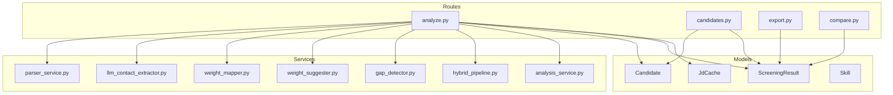

**Diagram sources**
- [db_models.py:97-146](file://app/backend/models/db_models.py#L97-L146)
- [parser_service.py:130-552](file://app/backend/services/parser_service.py#L130-L552)
- [llm_contact_extractor.py:23-165](file://app/backend/services/llm_contact_extractor.py#L23-L165)
- [weight_mapper.py:20-360](file://app/backend/services/weight_mapper.py#L20-L360)
- [weight_suggester.py:86-307](file://app/backend/services/weight_suggester.py#L86-L307)
- [gap_detector.py:103-219](file://app/backend/services/gap_detector.py#L103-L219)
- [hybrid_pipeline.py:467-800](file://app/backend/services/hybrid_pipeline.py#L467-L800)
- [analysis_service.py:6-121](file://app/backend/services/analysis_service.py#L6-L121)
- [analyze.py:354-501](file://app/backend/routes/analyze.py#L354-L501)
- [candidates.py:26-189](file://app/backend/routes/candidates.py#L26-L189)
- [export.py:20-104](file://app/backend/routes/export.py#L20-L104)
- [compare.py:16-77](file://app/backend/routes/compare.py#L16-L77)

**Section sources**
- [README.md:201-229](file://README.md#L201-L229)
- [database.py:1-33](file://app/backend/db/database.py#L1-L33)

## Core Components
- Candidate entity stores enriched profile fields, parser snapshot, and metadata used for deduplication and re-analysis.
- ScreeningResult persists analysis outcomes, weights metadata, and links to candidates and role templates.
- Parser service extracts text and structured data from resumes with enhanced DOCX fallback and multi-stage extraction.
- LLM contact extractor provides accurate contact information extraction using Gemini model with fallback strategies.
- Weight mapper and suggester services manage intelligent scoring weights with universal schema support and role-adaptive recommendations.
- Gap detector computes timelines, gaps, overlaps, and total experience.
- Hybrid pipeline orchestrates Python-based scoring and LLM narrative with support for new weight schemas.
- Deduplication logic identifies duplicates across email, file hash, and name+phone.
- Routes expose endpoints for single and batch analysis, candidate listing/detail, history, export, comparison, and weight suggestions.

**Section sources**
- [db_models.py:97-146](file://app/backend/models/db_models.py#L97-L146)
- [parser_service.py:193-552](file://app/backend/services/parser_service.py#L193-L552)
- [llm_contact_extractor.py:23-165](file://app/backend/services/llm_contact_extractor.py#L23-L165)
- [weight_mapper.py:20-360](file://app/backend/services/weight_mapper.py#L20-L360)
- [weight_suggester.py:86-307](file://app/backend/services/weight_suggester.py#L86-L307)
- [gap_detector.py:103-219](file://app/backend/services/gap_detector.py#L103-L219)
- [hybrid_pipeline.py:467-800](file://app/backend/services/hybrid_pipeline.py#L467-L800)
- [analyze.py:147-214](file://app/backend/routes/analyze.py#L147-L214)

## Architecture Overview
The system integrates parsing, gap detection, hybrid scoring, intelligent weight management, and persistence. Deduplication ensures candidate identity is preserved across uploads and re-analyses. Profiles are stored for fast re-analysis and auditability with enhanced contact extraction capabilities.

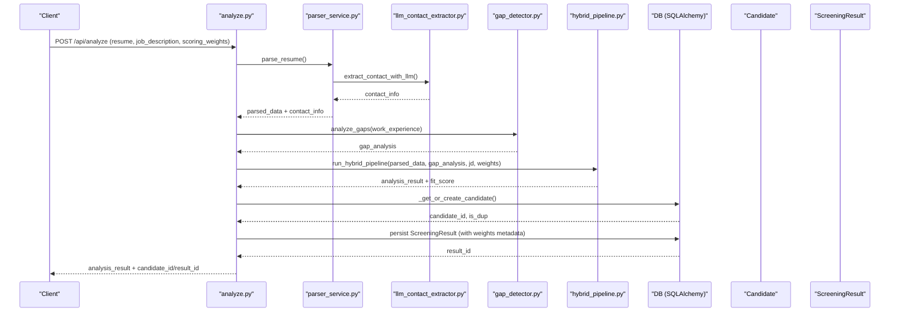

**Diagram sources**
- [analyze.py:354-501](file://app/backend/routes/analyze.py#L354-L501)
- [parser_service.py:547-552](file://app/backend/services/parser_service.py#L547-L552)
- [llm_contact_extractor.py:23-165](file://app/backend/services/llm_contact_extractor.py#L23-L165)
- [gap_detector.py:217-219](file://app/backend/services/gap_detector.py#L217-L219)
- [hybrid_pipeline.py:467-800](file://app/backend/services/hybrid_pipeline.py#L467-L800)
- [db_models.py:97-146](file://app/backend/models/db_models.py#L97-L146)

## Detailed Component Analysis

### Candidate Profile Storage
- Candidate stores:
  - Contact info and derived fields (current_role, current_company, total_years_exp).
  - Enriched profile fields: raw_resume_text, parsed_skills, parsed_education, parsed_work_exp, gap_analysis_json.
  - parser_snapshot_json: full parser output snapshot for auditability and re-analysis.
  - resume_file_hash: MD5 of file bytes for deduplication.
  - profile_updated_at and profile_quality for freshness and quality tracking.
- Stored on first analysis or when explicitly updating profile.

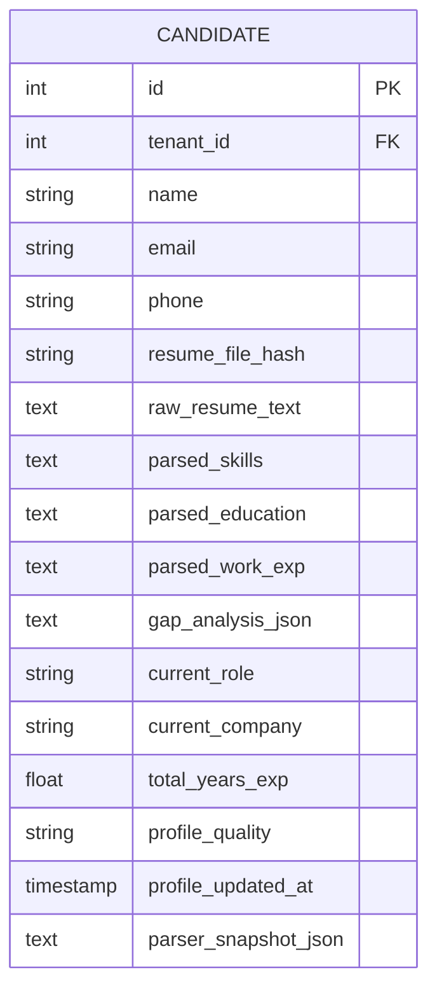

**Diagram sources**
- [db_models.py:97-126](file://app/backend/models/db_models.py#L97-L126)
- [002_parser_snapshot_json.py:21-33](file://alembic/versions/002_parser_snapshot_json.py#L21-L33)

**Section sources**
- [db_models.py:97-126](file://app/backend/models/db_models.py#L97-L126)
- [analyze.py:118-145](file://app/backend/routes/analyze.py#L118-L145)
- [002_parser_snapshot_json.py:1-33](file://alembic/versions/002_parser_snapshot_json.py#L1-L33)

### Enhanced Resume Parsing and Extraction Workflows
- ResumeParser supports PDF, DOCX, DOC, TXT, RTF, HTML, ODT, and plain text with enhanced multi-stage extraction pipeline.
- Extracts raw text, work experience, skills, education, and contact info with improved accuracy.
- Enriches parsed output with LLM-based contact extraction as the primary method, falling back to regex/NLP methods.
- Uses PyMuPDF with pdfplumber fallback for PDFs; enhanced DOCX fallback with paragraph and table extraction.
- Normalizes Unicode and implements comprehensive error handling with graceful fallbacks.

**Updated** Enhanced with new LLM contact extraction capabilities and improved DOCX fallback processing.

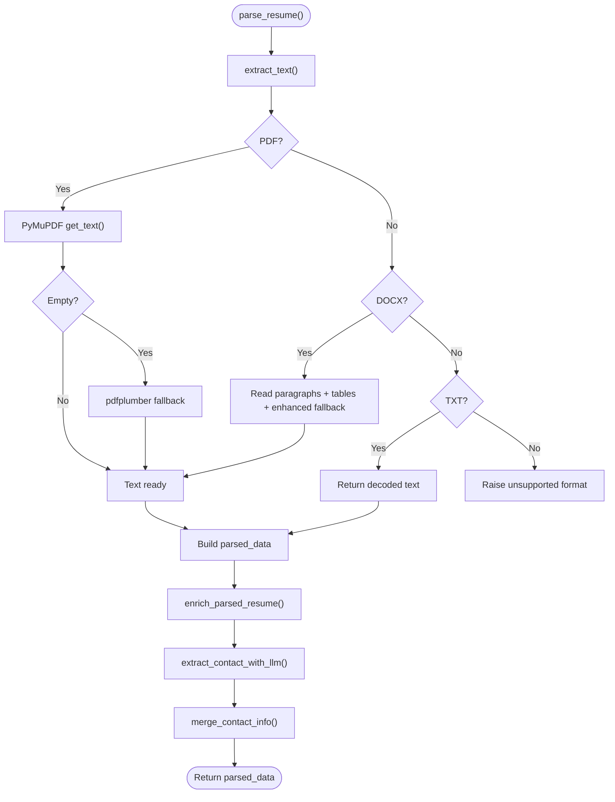

**Diagram sources**
- [parser_service.py:142-193](file://app/backend/services/parser_service.py#L142-L193)
- [parser_service.py:152-191](file://app/backend/services/parser_service.py#L152-L191)
- [parser_service.py:533-552](file://app/backend/services/parser_service.py#L533-L552)
- [llm_contact_extractor.py:23-165](file://app/backend/services/llm_contact_extractor.py#L23-L165)

**Section sources**
- [parser_service.py:22-128](file://app/backend/services/parser_service.py#L22-L128)
- [parser_service.py:130-552](file://app/backend/services/parser_service.py#L130-L552)
- [llm_contact_extractor.py:23-165](file://app/backend/services/llm_contact_extractor.py#L23-L165)

### LLM Contact Extraction System
- **Primary Method**: LLM-based contact extraction using Gemini model for highest accuracy.
- **Fallback Strategy**: spaCy NER, email-based extraction, relaxed header scanning, and filename-based extraction.
- **Enhanced Accuracy**: Handles international names, creative layouts, and edge cases with structured JSON output.
- **Timeout Handling**: Configurable timeouts with graceful degradation to fallback methods.
- **Validation**: Structured validation and cleaning of extracted contact information.

**New Feature** Comprehensive LLM contact extraction system with multiple fallback layers for improved accuracy.

**Section sources**
- [llm_contact_extractor.py:23-165](file://app/backend/services/llm_contact_extractor.py#L23-L165)

### Intelligent Scoring Weights System
- **Universal Schema**: New 7-weight schema supporting core_competencies, experience, domain_fit, education, career_trajectory, role_excellence, and risk.
- **Backward Compatibility**: Automatic conversion from legacy 4-weight and old 7-weight schemas.
- **Role Adaptation**: AI-powered weight suggestions based on job description analysis.
- **Version Management**: ScreeningResult includes version tracking and active status for historical comparisons.
- **Adaptive Labels**: Dynamic weight labels based on role categories (technical, sales, hr, marketing, etc.).

**New Feature** Complete intelligent scoring weights system with universal schema support and AI-powered suggestions.

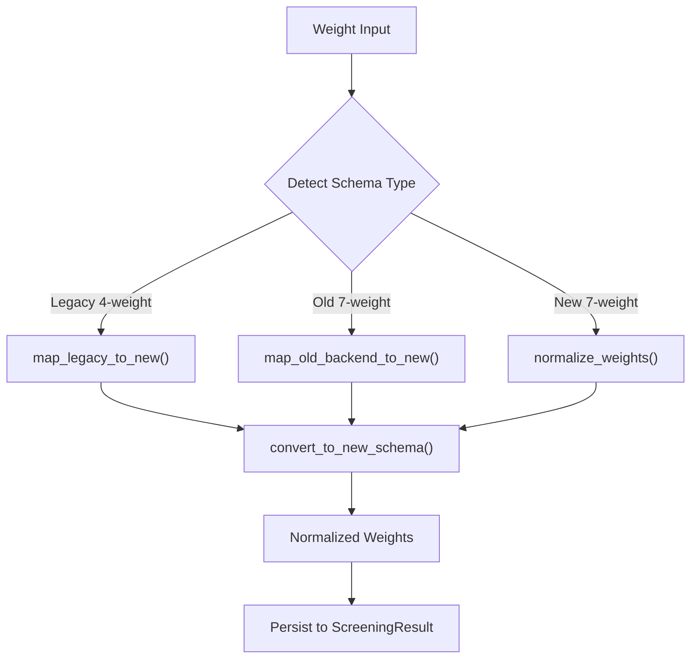

**Diagram sources**
- [weight_mapper.py:212-246](file://app/backend/services/weight_mapper.py#L212-L246)
- [weight_suggester.py:86-178](file://app/backend/services/weight_suggester.py#L86-L178)

**Section sources**
- [weight_mapper.py:20-360](file://app/backend/services/weight_mapper.py#L20-L360)
- [weight_suggester.py:86-307](file://app/backend/services/weight_suggester.py#L86-L307)
- [009_intelligent_scoring_weights.py:27-74](file://alembic/versions/009_intelligent_scoring_weights.py#L27-L74)

### Gap Detection and Timeline Analysis
- Converts dates to YYYY-MM, merges overlapping intervals, and computes total effective years.
- Produces employment timeline entries with gap metadata and severity.
- Flags overlapping jobs and short stints.

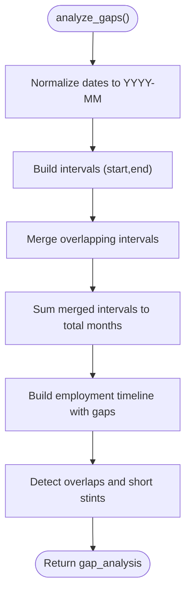

**Diagram sources**
- [gap_detector.py:103-219](file://app/backend/services/gap_detector.py#L103-L219)

**Section sources**
- [gap_detector.py:103-219](file://app/backend/services/gap_detector.py#L103-L219)

### Hybrid Pipeline and Enhanced Scoring
- Python rules parse JD, build candidate profile, match skills, score education/timeline, and compute fit score.
- LLM adds narrative, strengths/weaknesses, and explainability.
- Skills registry supports dynamic skill discovery and alias expansion.
- **Updated**: Enhanced scoring with intelligent weight system supporting new universal schema.
- **Updated**: Automatic weight conversion from legacy formats to new schema.

**Updated** Integrated intelligent scoring weights system with universal schema support and automatic conversion.

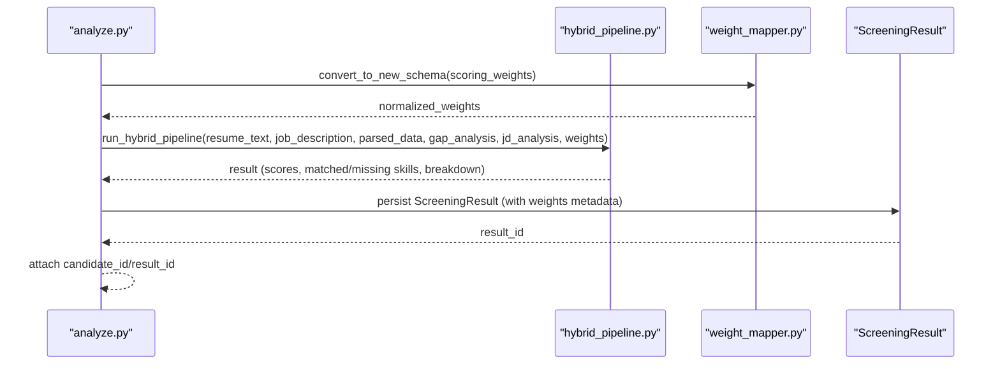

**Diagram sources**
- [analyze.py:304-318](file://app/backend/routes/analyze.py#L304-L318)
- [hybrid_pipeline.py:467-800](file://app/backend/services/hybrid_pipeline.py#L467-L800)
- [weight_mapper.py:212-246](file://app/backend/services/weight_mapper.py#L212-L246)

**Section sources**
- [hybrid_pipeline.py:467-800](file://app/backend/services/hybrid_pipeline.py#L467-L800)
- [analysis_service.py:6-121](file://app/backend/services/analysis_service.py#L6-L121)

### Deduplication Strategies
- Three-layer deduplication:
  1) Email match within tenant.
  2) File hash match (MD5 of bytes).
  3) Name + phone match within tenant.
- On duplicate detection, returns duplicate_candidate metadata and avoids re-parsing unless requested.
- Supports actions:
  - create_new: always create new candidate.
  - update_profile: update stored profile.
  - use_existing: skip re-analysis and reuse stored profile.

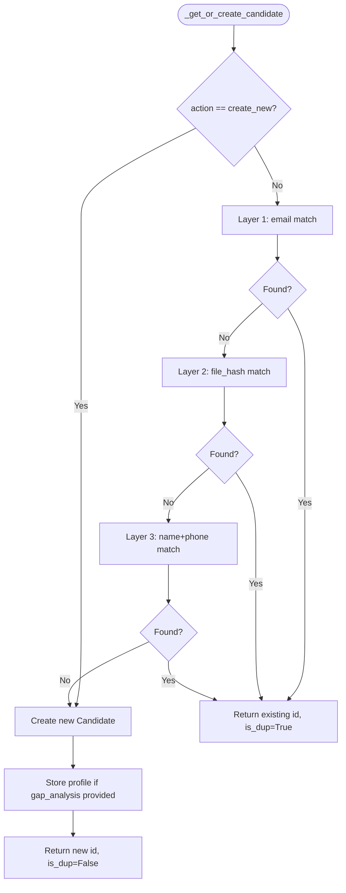

**Diagram sources**
- [analyze.py:147-214](file://app/backend/routes/analyze.py#L147-L214)

**Section sources**
- [analyze.py:72-116](file://app/backend/routes/analyze.py#L72-L116)
- [test_candidate_dedup.py:158-265](file://app/backend/tests/test_candidate_dedup.py#L158-L265)

### Candidate Search and Filtering
- List candidates with pagination and optional search by name or email.
- Detail endpoint returns enriched profile, skills snapshot, and history.
- GET /api/history lists recent screening results for the tenant.

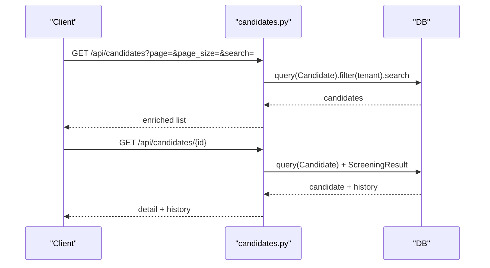

**Diagram sources**
- [candidates.py:26-189](file://app/backend/routes/candidates.py#L26-L189)

**Section sources**
- [candidates.py:26-189](file://app/backend/routes/candidates.py#L26-L189)

### History Tracking and Analysis Result Management
- ScreeningResult persists parsed_data and analysis_result as JSON for auditability.
- **Updated**: Enhanced with intelligent scoring weights metadata (role_category, weight_reasoning, suggested_weights_json).
- **Updated**: Version management with is_active flag and version_number for historical tracking.
- History endpoint aggregates recent results with fit_score, recommendation, and risk level.
- Candidate detail endpoint augments history with analysis quality and score breakdown.

**Updated** Enhanced with intelligent scoring weights system and version management for comprehensive history tracking.

**Section sources**
- [db_models.py:128-146](file://app/backend/models/db_models.py#L128-L146)
- [analyze.py:763-786](file://app/backend/routes/analyze.py#L763-L786)
- [candidates.py:122-140](file://app/backend/routes/candidates.py#L122-L140)
- [009_intelligent_scoring_weights.py:27-74](file://alembic/versions/009_intelligent_scoring_weights.py#L27-L74)

### Integration Between Parsing Services and Candidate Data Storage
- After parsing and gap analysis, the hybrid pipeline produces a result with enhanced weight system.
- The route persists both the ScreeningResult with weights metadata and updates the Candidate profile snapshot.
- parser_snapshot_json captures the complete parser output for re-analysis and auditing.
- **Updated**: Weight metadata is stored with screening results for future comparisons and analysis.

**Updated** Integrated intelligent scoring weights system into the parsing and storage workflow.

**Section sources**
- [analyze.py:454-476](file://app/backend/routes/analyze.py#L454-L476)
- [analyze.py:118-145](file://app/backend/routes/analyze.py#L118-L145)

### Bulk Operations and Export Capabilities
- Batch analysis endpoint supports multiple resumes with plan-based limits and usage enforcement.
- Export endpoints (CSV/Excel) stream screening results for selected IDs or all recent results.
- **Updated**: Export includes enhanced weight metadata and version information for comprehensive reporting.

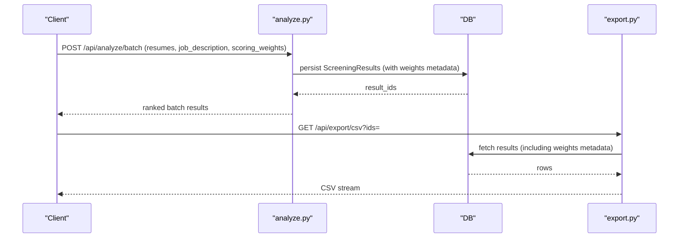

**Diagram sources**
- [analyze.py:651-758](file://app/backend/routes/analyze.py#L651-L758)
- [export.py:55-104](file://app/backend/routes/export.py#L55-L104)

**Section sources**
- [analyze.py:651-758](file://app/backend/routes/analyze.py#L651-L758)
- [export.py:20-104](file://app/backend/routes/export.py#L20-L104)

### Data Portability Features
- parser_snapshot_json stores the complete parser output, enabling:
  - Re-analysis without re-parsing resume patterns.
  - Auditability and reproducibility of parsing decisions.
  - Export of raw parsed fields alongside analysis results.
- **Updated**: Enhanced with intelligent scoring weights metadata for comprehensive data portability.

**Updated** Enhanced parser snapshot with intelligent scoring weights metadata for improved portability.

**Section sources**
- [db_models.py:120-121](file://app/backend/models/db_models.py#L120-L121)
- [002_parser_snapshot_json.py:1-33](file://alembic/versions/002_parser_snapshot_json.py#L1-L33)

### Extending Candidate Metadata and Customizing Parsing Workflows
- Extend Candidate fields by adding columns to the Candidate model and updating storage logic.
- Customize parsing by modifying ResumeParser methods (e.g., additional sections, new date patterns).
- Adjust skills registry and matching by updating skills lists and aliases in the SkillsRegistry.
- **Updated**: Enhance contact extraction by integrating LLM contact extractor into parsing pipeline.
- **Updated**: Customize weight schemas by extending weight mapper and suggester services.

**Updated** Enhanced with LLM contact extraction integration and customizable weight schemas.

**Section sources**
- [db_models.py:97-126](file://app/backend/models/db_models.py#L97-L126)
- [parser_service.py:130-552](file://app/backend/services/parser_service.py#L130-L552)
- [llm_contact_extractor.py:23-165](file://app/backend/services/llm_contact_extractor.py#L23-L165)
- [weight_mapper.py:20-360](file://app/backend/services/weight_mapper.py#L20-L360)
- [hybrid_pipeline.py:323-426](file://app/backend/services/hybrid_pipeline.py#L323-L426)

### Data Privacy Considerations and Lifecycle Management
- Candidate and ScreeningResult data are tenant-scoped; enforce tenant isolation in queries.
- parser_snapshot_json and raw_resume_text are retained; consider implementing retention policies and deletion endpoints.
- Usage logs track analysis counts per tenant; leverage for compliance and billing.
- **Updated**: Intelligent scoring weights metadata requires careful privacy consideration for sensitive role-based data.
- Recommendations:
  - Add tenant-aware soft-delete and anonymization.
  - Implement data export/deletion APIs aligned with privacy regulations.
  - Add encryption-at-rest for sensitive fields if required.
  - Consider GDPR-compliant handling of AI-generated weight suggestions.

**Updated** Enhanced privacy considerations for intelligent scoring weights metadata and AI-generated suggestions.

**Section sources**
- [db_models.py:79-93](file://app/backend/models/db_models.py#L79-L93)
- [candidates.py:26-80](file://app/backend/routes/candidates.py#L26-L80)

## Dependency Analysis
The following diagram shows key dependencies among modules involved in candidate management with enhanced intelligent scoring system.

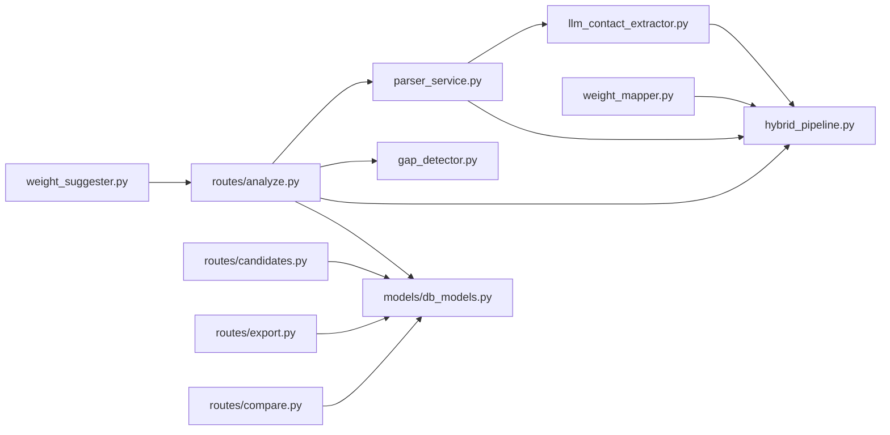

**Diagram sources**
- [analyze.py:32-39](file://app/backend/routes/analyze.py#L32-L39)
- [candidates.py:20-21](file://app/backend/routes/candidates.py#L20-L21)
- [export.py:14-15](file://app/backend/routes/export.py#L14-L15)
- [compare.py:9-11](file://app/backend/routes/compare.py#L9-L11)
- [db_models.py:97-146](file://app/backend/models/db_models.py#L97-L146)

**Section sources**
- [analyze.py:32-39](file://app/backend/routes/analyze.py#L32-L39)
- [candidates.py:20-21](file://app/backend/routes/candidates.py#L20-L21)
- [export.py:14-15](file://app/backend/routes/export.py#L14-L15)
- [compare.py:9-11](file://app/backend/routes/compare.py#L9-L11)

## Performance Considerations
- Deduplication reduces redundant parsing and analysis.
- JD caching (JdCache) avoids repeated JD parsing across workers.
- Asynchronous processing and thread pools prevent blocking during parsing.
- Snapshot storage enables fast re-analysis without re-parsing.
- Batch analysis enforces plan-based limits and parallel processing.
- **Updated**: LLM contact extraction uses optimized timeouts and fallback strategies for performance.
- **Updated**: Intelligent scoring weights system includes caching and normalization for efficient computation.

## Troubleshooting Guide
Common issues and resolutions:
- Scanned PDFs: Parsing raises a readable error; advise uploading text-based PDFs.
- Database locked: SQLite concurrency limitation; restart backend container.
- Ollama not responding: Check container logs and pull the model if needed.
- Exceeding usage limits: Monthly analysis or batch size limits enforced; upgrade plan.
- **Updated**: LLM contact extraction failures: Automatic fallback to regex/NLP methods; check model availability.
- **Updated**: Intelligent scoring weights conversion errors: Automatic fallback to default weights; verify input format.

**Section sources**
- [parser_service.py:175-181](file://app/backend/services/parser_service.py#L175-L181)
- [README.md:339-355](file://README.md#L339-L355)
- [analyze.py:364-370](file://app/backend/routes/analyze.py#L364-L370)
- [llm_contact_extractor.py:120-130](file://app/backend/services/llm_contact_extractor.py#L120-L130)
- [weight_mapper.py:212-246](file://app/backend/services/weight_mapper.py#L212-L246)

## Conclusion
The candidate management system integrates robust parsing, deduplication, intelligent scoring weights, and analysis workflows with durable storage and auditability. It supports efficient re-analysis, bulk operations, and export for downstream ATS use. The enhanced LLM contact extraction and intelligent scoring system provide superior accuracy and adaptability. Extensibility is provided through model additions, parser customization, skills registry updates, and intelligent weight management. Privacy and lifecycle management should be considered for production deployments with enhanced attention to AI-generated metadata.

## Appendices

### Endpoint Reference
- POST /api/analyze: Single resume analysis with dedup and profile storage.
- POST /api/analyze/stream: Streaming analysis with stage events.
- POST /api/analyze/batch: Batch analysis with plan limits.
- POST /api/analyze/suggest-weights: AI-powered weight suggestions for job descriptions.
- GET /api/history: Recent screening results.
- GET /api/candidates: Paginated and searchable candidate list.
- GET /api/candidates/{id}: Candidate detail with history and skills snapshot.
- POST /api/candidates/{id}/analyze-jd: Re-analyze existing candidate against a new JD.
- GET /api/export/csv: Export screening results to CSV.
- GET /api/export/excel: Export screening results to Excel.
- POST /api/compare: Compare up to 5 screening results.

**Section sources**
- [analyze.py:354-501](file://app/backend/routes/analyze.py#L354-L501)
- [analyze.py:506-646](file://app/backend/routes/analyze.py#L506-L646)
- [analyze.py:651-758](file://app/backend/routes/analyze.py#L651-L758)
- [analyze.py:669-697](file://app/backend/routes/analyze.py#L669-L697)
- [candidates.py:26-189](file://app/backend/routes/candidates.py#L26-L189)
- [export.py:55-104](file://app/backend/routes/export.py#L55-L104)
- [compare.py:16-77](file://app/backend/routes/compare.py#L16-L77)

### Intelligent Scoring Weights Schema
- **Legacy 4-weight**: skills, experience, stability, education
- **Old 7-weight**: skills, experience, architecture, education, timeline, domain, risk
- **New Universal 7-weight**: core_competencies, experience, domain_fit, education, career_trajectory, role_excellence, risk
- **Automatic Conversion**: Seamless conversion between all schema types
- **AI Suggestions**: Role-adaptive weight recommendations with confidence scores

**Section sources**
- [weight_mapper.py:20-360](file://app/backend/services/weight_mapper.py#L20-L360)
- [weight_suggester.py:86-307](file://app/backend/services/weight_suggester.py#L86-L307)
- [009_intelligent_scoring_weights.py:27-74](file://alembic/versions/009_intelligent_scoring_weights.py#L27-L74)